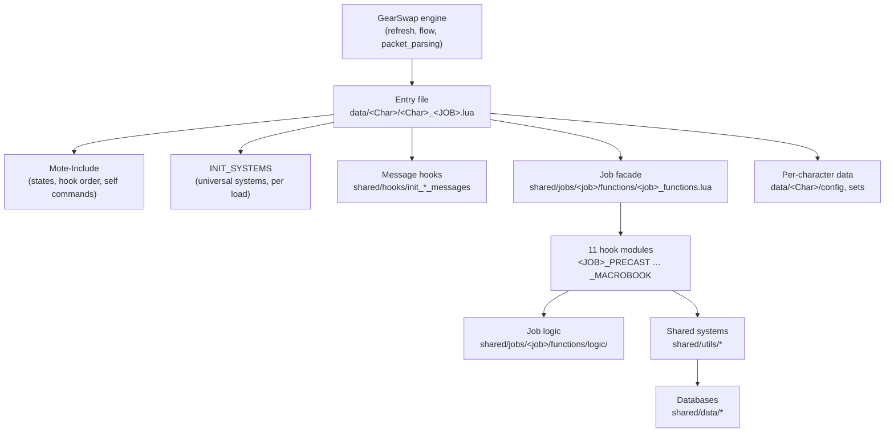

# Developer documentation — start here

This is the entry point to the developer documentation of the GearSwap Tetsouo
project. It explains how the whole thing fits together in one read, then points
to the detailed pages. Every page under `docs/dev/` was written from the code
(first on 2026-09-19; citations re-checked and pages updated on 2026-09-25,
after that day's audit fixes) and cites `path:line`, or `file` + function name
where a line number would add nothing but drift. Engine paths are relative to `D:\Windower Tetsouo\addons\GearSwap\`
and marked *(engine)*; everything else is relative to the repo root
(`addons/GearSwap/data`).

## What the project is

A set of GearSwap user files for Final Fantasy XI (Windower 4, Lua 5.1). GearSwap
swaps equipment around every action (spell, ability, weaponskill, item) and on
status changes. This project layers a framework on top of GearSwap and
Mote-Include:

- **16 job areas** under `shared/jobs/`: BLM BRD BST COR DNC DRK GEO PLD PUP RDM
  RUN SAM SMN THF WAR WHM. SMN has shared modules but no generic `_master`
  template: its entry, configs and sets live in the Tetsouo overlay
  (`_master/Tetsouo/`) and the live `Tetsouo/` folder, so only a clone of
  Tetsouo (or one run with `--source Tetsouo`) receives it; any other clone
  prints `[WARN] No entry file for: SMN`. PUP is a scaffold that does not load
  (see [jobs/pup.md](jobs/pup.md)) and `clone_character.py` no longer offers it
  (`ALL_VALID_JOBS`).
- **Shared systems** under `shared/utils/`: precast guard and cooldown checks,
  weaponskill handling, midcast set resolution, messages, keybinds (one
  `KeybindManager`, per-character common keys, `//gs c tb`) and the keybind
  HUD, player modes from `<JOB>_CUSTOM.lua`, HP equip priority, dual-box (job
  exchange, alt commands, `alts` / `main`, alt window), Sortie commands, warp,
  wardrobe organizer, refill, watchdogs, factories for lockstyle and macrobook.
- **Data** under `shared/data/`: spell, job ability and weaponskill databases,
  and the generated equipment HP/MP table (`shared/data/equipment/ITEM_HP_MP.lua`).
- **Two played characters** on one PC: Tetsouo (main) and Kaories (alt,
  dual-boxed). Their folders are built from the tracked templates in `_master/`
  by `clone_character.py`.

Measured on 2026-09-25 from `data/`, on the working tree (so today's
uncommitted edits are counted; the one new untracked file,
`shared/config/message_mode_config.lua`, is not):

| Area | Lua files | Lines | Command |
|---|---:|---:|---|
| `shared/` | 675 | 108 721 | `git ls-files 'shared/*.lua' \| wc -l`, `git ls-files -z 'shared/*.lua' \| xargs -0 cat \| wc -l` |
| `_master/` | 275 | 46 242 | same with `'_master/*.lua'` |
| Total tracked Lua (adds `character_db.lua`) | 951 | 155 172 | same with `'*.lua'` |
| Live `Tetsouo/` (gitignored) | 161 | — | `find Tetsouo -name '*.lua' \| wc -l` |
| Live `Kaories/` (gitignored) | 50 | — | `find Kaories -name '*.lua' \| wc -l` |

`shared/data/equipment/ITEM_HP_MP.lua` alone is 6 534 of those lines (generated
data, see [equipment-and-inventory.md](systems/equipment-and-inventory.md)).

## Five facts that explain most of the code

1. **Each job file runs in a throw-away sandbox.** On every file load
   *(engine)* `load_user_files()` (`refresh.lua:62-184`) calls the old file's
   `file_unload`, unregisters every event the old file registered through the
   sandbox `windower.register_event` (`refresh.lua:69-71`,
   `user_functions.lua:254-262`), deletes every `windower.text`/`prim` object
   (`refresh.lua:73-79`), then builds a brand-new environment whose `_G` is
   itself (`refresh.lua:114-149`). Module locals, the require cache, `_G` and
   every Mote state die with it. What survives is listed in
   [State and lifetime](#state-and-lifetime).
2. **Every job or subjob change ends in a new sandbox.** A main job change
   loads a new file *(engine)*. A subjob change is handled by Mote in the same
   sandbox, but the project turns it into a `gs reload` 0.5 s later through
   `JobChangeManager.on_job_change` (`shared/utils/core/job_change_manager.lua:134-191`). So
   "per sandbox" means "until the next job, subjob or reload".
3. **Mote-Include owns the hook order.** The project never hooks GearSwap
   directly for actions; it fills Mote's `job_*` / `user_*` hooks
   (`libs/Mote-Include.lua:227-283`). `user_setup()` runs *inside*
   `include('Mote-Include.lua')`, before the job's own modules are loaded
   (`Mote-Include.lua:170`).
4. **The job file is chosen from the request, not the answer.** GearSwap loads
   the new file on the outgoing job-change request (0x100,
   `packet_parsing.lua:733-751`) and never re-checks the server's reply
   (0x061). `shared/utils/core/job_sync_watchdog.lua` detects a mismatch and
   reloads.
5. **`equip()` only works synchronously inside an event.** Gear queued from a
   `coroutine.schedule` callback is dropped (`flow.lua:57-60`). Anything
   delayed must go through `send_command('gs c update')` or similar.

## Layers

- **Entry file** (`_master/entry/Tetsouo_<JOB>.lua`, deployed as
  `data/<Char>/<Char>_<JOB>.lua`): a loader. It defines `get_sets`,
  `user_setup`, `init_gear_sets`, `job_sub_job_change`, `job_update`,
  `file_unload`. See [core-lifecycle.md](systems/core-lifecycle.md).
- **Facade** (`shared/jobs/<job>/functions/<job>_functions.lua`): `include`s
  the 11 hook modules (PRECAST, MIDCAST, AFTERCAST, IDLE, ENGAGED, STATUS, BUFFS,
  LOCKSTYLE, MACROBOOK, COMMANDS, MOVEMENT) plus pet hooks for BST/PUP/SMN, and
  requires the dual-box manager.
- **Hook modules** assign Mote's globals (`job_precast`, `job_post_midcast`, …)
  and delegate to shared systems and to `logic/`.
- **Per-character data**: `config/` (keybinds, states, lockstyle, macrobook, TP
  and refill configs, UI and message settings) and `sets/`.

## Boot sequence of one load

For a template entry such as `_master/entry/Tetsouo_WAR.lua`:

1. **File chunk**: loads `LOCKSTYLE_CONFIG` and `REGION_CONFIG` under pcall,
   `ConfigLoader.load_ui_config` (`dofile` of `UI_CONFIG`), defines the hook
   functions. Some entries (WAR, BST, PUP, live SMN) also require
   `JobChangeManager` and `UI_MANAGER` here.
2. **`get_sets()`**:
   1. Job globals that states need before Mote (WAR `_G.WARWSConfig`, BRD, BST).
   2. `include('Mote-Include.lua')` → `init_include()`: Mote states and set
      skeleton, Mote's F9-F12 binds, **`user_setup()`**, then
      **`init_gear_sets()`** (the set file).
   3. `include INIT_SYSTEMS` (see below).
   4. `require data_loader`, then the three message hooks
      (`init_spell_messages`, `init_ability_messages`, `init_ws_messages`).
   5. `_G.LockstyleConfig`, `_G.UIConfig`, `_G.RECAST_CONFIG`, job TP configs.
   6. `JobChangeManager.cancel_all()`.
   7. `include` the facade.
   8. `register_lockstyle_cancel`.
3. **`user_setup()`** (called from step 2.2, so before INIT_SYSTEMS and the
   facade): `<JOB>States.configure()`, keybinds `bind_all()`,
   `KeybindUI.smart_init()`, `JobChangeManager.initialize()` (a seed, not an
   assignment), initial macrobook + lockstyle (8 s), `pcall(require
   dualbox_manager)`.

`INIT_SYSTEMS.lua` timeline:

| When | What | Where |
|---|---|---|
| sync | debug flags restored from `windower._gs_debug`, `windower._gs_reload_count++` | `:35-44` |
| sync | `ModuleCache.install()` — makes `require` cache per sandbox | `:54-56` |
| sync | `HPPriority.apply()` — HP pieces get `priority` = HP (the sets exist: Mote ran `init_gear_sets` first) | `:65-70` |
| sync | LagDebugger, `AutoMedicine.ensure()`, `JobSyncWatchdog.start()`, dual-box sync IPC listener and its `ls` / `rf` hooks | `:78-201` |
| sync | `KeybindGuard.schedule()` (re-asserts the job's binds once the console is quiet), `CustomStates.install_hooks()` (`<JOB>_CUSTOM.lua` gear rules) | `:277-296` |
| +0.5 s | WarpInit, AutoMove (unless `_G.DISABLE_AUTOMOVE`), StateDisplayOverride | `:208-257` |
| +2 s | MidcastWatchdog | `:126-136` |
| +3 s | load check of PrecastGuard / CooldownChecker / WSPrecastHandler (message on failure) | `:315-327` |
| +5 s | GlobalProbe snapshot of `_G` | `:339-344` |

The file header (`INIT_SYSTEMS.lua:11-20`) keeps the same list.

None of the deferred blocks checks that its sandbox is still the live one; see
[core-lifecycle.md](systems/core-lifecycle.md) (coroutines and their invalidation).

## Life of an action

Mote's `handle_actions` (`Mote-Include.lua:227-283`) runs, for each of
pretarget / precast / midcast / aftercast: `user_X` → `job_X` (skipped if
`handled`) → `default_X` (skipped if `handled` or `cancel`) → `user_post_X` →
`job_post_X` (skipped on `cancel`). A cancelled precast calls `cancel_spell()`:
no midcast, no aftercast.

- **Precast** — every job follows **PrecastGuard → CooldownChecker → (job
  auto-abilities) → WSPrecastHandler → job gear**. PrecastGuard blocks on
  debuffs and can send Echo Drops / Remedy / Panacea (AutoMedicine).
  CooldownChecker cancels on recast (tolerance 2.0 s from `RECAST_CONFIG`).
  WSPrecastHandler validates range, computes TP-bonus gear and cancels below
  1000 TP, reading the TP from game memory (`TPBonusHandler.live_tp()`), not
  GearSwap's lagging `player.vitals.tp` copy. Exceptions: BRD songs, BLM/RDM tiered spells and WHM cures are
  refined before the recast check (BLM and RDM replace the check with tier
  refinement for tiered spells; a cure WHM leaves as it is still gets the check).
  See [precast-pipeline.md](systems/precast-pipeline.md).
- **Midcast** — Mote picks its default set, then `job_post_midcast` calls
  `MidcastManager.select_set()`, which equips on top. Its resolution order
  (the `RESOLVERS` table and `select_standard_set` in
  `shared/utils/midcast/midcast_manager.lua`, P0-P9, first hit wins): exact
  spell name → tier-less name (with target variants) → `base[type][target][mode]`
  → `base[type][mode]` → `base[target][mode]` → `base[target]` (then
  `sets.midcast[target]`) → root `sets.midcast[type]` → `base[type]` →
  `base[mode]` → `base`, where `base` is `sets.midcast[skill]`
  (`sets.midcast.BardSong` for songs, which use their own pickers). `type` comes from
  the job's database function, `target` from `target_func`, `mode` from the
  mode state. There is no spellMap level and no idle fallback, and a missing
  `sets.midcast[skill]` returns before any lookup. `CODE_QUALITY.md` §4.2 now
  names it the P0-P9 chain and points to the file header (the old "7-level"
  wording is gone since 2026-09-25). Job overrides run after. See [midcast-and-buffs.md](systems/midcast-and-buffs.md).
- **Messages** — the hooks wrap `user_post_precast` (abilities, weaponskills)
  and `user_post_midcast` (spells), look the action up in the databases and
  print through `MessageFormatter`. See [messages.md](systems/messages.md).
- **Aftercast / status / buffs** — `LifecycleManager`
  (`shared/utils/core/lifecycle_manager.lua`) builds the shared handlers:
  Doom slot handling, watchdog tick, HUD repaint on state change. The
  `MidcastWatchdog` forces `gs c update` when a cast is never confirmed.

## Job and subjob changes

- **Subjob change** (0x061, same sandbox): Mote's `sub_job_change` runs
  `user_setup()` again, then `job_sub_job_change` → `JobChangeManager.on_job_change`
  tears down AutoMove, watchdog and HUD, bumps a counter and schedules
  `gs reload` after 0.5 s (3.0 s if the main job differs from the seed). A
  newer change invalidates the older one through the counter. A round trip
  (WAR → DNC → WAR) still reloads, on purpose: the teardown has already run
  (`job_change_manager.lua:157-165`).
- **Main job change**: the engine loads the new file directly; the old file's
  `file_unload` cancels pending lockstyles and unbinds keys.
- **Refused or reordered request**: `JobSyncWatchdog` compares the file's job
  with `windower.ffxi.get_player().main_job` every 5 s and reloads after two
  confirmations (30 s floor).

Full scenario-by-scenario trace:
[job-change-lifecycle.md](architecture/job-change-lifecycle.md).

## State and lifetime

| Where it lives | Lifetime | Examples |
|---|---|---|
| Sandbox `_G`, module locals, `ModuleCache`, Mote states | Until the next load (job, subjob, `gs reload`) | `state.*` (all modes reset to defaults on every load), `_G.AltJobState`, `_G.DualBoxConfig`, `_G.UI_SETTINGS`, `_G.MidcastManagerDebugState` |
| `windower.*` written from the sandbox (a module-level proxy table, `user_functions.lua:418-419`) | Survives every load; reset by `//lua reload gearswap` | `_gs_reload_count`, `_gs_debug`, `_job_sync_*`, `_automove_seq`, `_dualbox_*`, `_sync_ipc_*`, `_warp_*`, `_auto_medicine`, `_hook_wraps`, `_lagdebug` |
| Engine state | Survives every load, including a **main job change** | `disable_table` (slot locks from Doom, craft, organizer, warp ring), `command_registry`, Windower keybinds, loaded addons |
| Scheduled coroutines and `send_command('wait …')` chains | Never cancelled; keep running against the dead sandbox | AutoMove and watchdog loops (guarded by `windower._x_seq` counters where it matters), lockstyle timers, organizer phases |
| Removed by the engine at each load | — | Events registered through the sandbox `windower.register_event`, `windower.text` / `prim` objects |

Consequences worth remembering:

- A background loop needs a generation counter on `windower.*`; a `_G` flag
  cannot be cleared by the next sandbox.
- A listener registered once per Windower session behind a `windower.*` "init
  done" flag is silently lost at the next load: register listeners on every
  load, as WarpInit now does (see [warp.md](systems/warp.md)).
- Slot locks are not released by a main job change
  (`packet_parsing.lua:744` assigns `main_job_id` before `:756` compares it).

## Characters and templates

| Place | Tracked | Content |
|---|---|---|
| `_master/entry`, `sets`, `config/<job>`, `config/alt`, `config_global` | yes | Generic templates, written for a character named Tetsouo |
| `_master/Kaories/`, `_master/Tetsouo/` | yes | Per-character overlays (same relative path replaces the template) |
| `data/Tetsouo/`, `data/Kaories/` | **no** (gitignored) | What GearSwap loads |
| `data/Hysoka/`, `data/Gabvanstronger/` | no | Frozen one-shot clones; not maintained |

- `clone_character.py` copies templates + overlay into `data/<Name>/`,
  substitutes the name, and generates `DUALBOX_CONFIG.lua` (with
  `DualBoxConfig.group` when dual-box is on) / `REGION_CONFIG.lua`. It copies
  `config/craft/` always and `config/alt/` only for a MAIN. The overlay applies
  only to its own character or with `--source`. An existing folder is moved to
  `addons/GearSwap/clone_backups/` after the final confirmation, never deleted,
  and the files written in game (`KEPT_ON_RECLONE`: HUD position, message
  modes, alt window and alt state, owned warp items, `temp_binds.lua`) are
  copied back from that backup.
- Live Tetsouo uses **modular sets** (`sets/<job>/{armor,capes,weapons}.lua` +
  `sets/common/rings.lua`); the generic templates are flat. The modular trees
  are versioned in `_master/Tetsouo/sets/<job>/` and, since `f6f1683`, the
  clone deploys an overlay's `sets/<job>/` tree in place of the flat file, plus
  its `sets/common/` and the loose craft/fishing sets.
- `character_db.lua` is read only by the clone script.

See [characters-and-templates.md](architecture/characters-and-templates.md),
including what a re-clone would overwrite today.

## Map of the documentation

### Architecture

| Page | Covers |
|---|---|
| [architecture/job-change-lifecycle.md](architecture/job-change-lifecycle.md) | Every transition (cold load, reload, subjob, main job, refused request, zone, death, dual-box), in code |
| [architecture/characters-and-templates.md](architecture/characters-and-templates.md) | `_master` vs live, overlays, the clone script (modular sets, files kept on re-clone), template/live drift |

### Systems

| Page | Covers |
|---|---|
| [systems/core-lifecycle.md](systems/core-lifecycle.md) | Engine sandbox, boot order, INIT_SYSTEMS, JobChangeManager, JobSyncWatchdog, MidcastWatchdog, ModuleCache, LifecycleManager, CycleHandler |
| [systems/precast-pipeline.md](systems/precast-pipeline.md) | PrecastGuard, DebuffChecker, AutoMedicine, DoomManager, CooldownChecker, AbilityHelper, WS chain, TP bonus, TierRefiner, WS slots |
| [systems/midcast-and-buffs.md](systems/midcast-and-buffs.md) | MidcastManager resolution, set builders, SelfBuffManager, subjob WAR buffs, Scholar stratagems |
| [systems/factories-and-helpers.md](systems/factories-and-helpers.md) | LockstyleManager, MacrobookManager, AutoMove, craft/fishing mode, /DRG jumps, WaltzManager, CureManager |
| [systems/messages.md](systems/messages.md) | Message architecture: facade, engine, renderer, hooks and handlers, modes |
| [systems/messages-formatters.md](systems/messages-formatters.md) | The 34 formatter modules under `formatters/` (plus 2 in `utilities/`) and their public functions, incl. `altgroup`, `sortie`, `tempbind` |
| [systems/messages-catalog.md](systems/messages-catalog.md) | Every template namespace and key (incl. `ALTGROUP`, `SORTIE`, `TEMPBIND`), reachable or not; the `message_mode_config` factory is in messages.md |
| [systems/keybinds-and-custom.md](systems/keybinds-and-custom.md) | `KeybindManager`, bind line rules (`//` and `/`), `COMMON_KEYBINDS`, key validation, `<JOB>_CUSTOM.lua` player modes and `when` rules, `//gs c tb` temporary binds |
| [systems/ui-overlay.md](systems/ui-overlay.md) | Keybind HUD: build, update triggers, settings, persistence |
| [systems/commands-and-debug.md](systems/commands-and-debug.md) | `//gs c` routing, command inventory (incl. `trace`, `tb`, `alts`, `main`, `sortie`, `info`), diagnostic tools |
| [systems/dualbox.md](systems/dualbox.md) | Main/alt job exchange, alt commands, `alts` / `main` / `setalt`, alt window, alt buff reporting, sync IPC |
| [systems/warp.md](systems/warp.md) | Warp commands, spells, rings, items, IPC "warp all" |
| [systems/equipment-and-inventory.md](systems/equipment-and-inventory.md) | `checksets`, wardrobe audit, refill, quiver, HP equip priority and how `ITEM_HP_MP.lua` is regenerated |
| [systems/wardrobe-organizer.md](systems/wardrobe-organizer.md) | `//gs c wo`: phases, pins, alt flow |

### Data

| Page | Covers |
|---|---|
| [data/spell-databases.md](data/spell-databases.md) | Magic databases: sub-modules, skill and job aggregators, loaders, consumers |
| [data/ability-and-weaponskill-databases.md](data/ability-and-weaponskill-databases.md) | Job ability factory and per-job databases, weaponskill files and facade |

### Jobs

One page per job area, same layout (Files, How it works, Mote states,
Commands, Set names the code looks up, Configuration, State & lifetime,
Interactions, Invariants & gotchas, Extending, Known issues):

[blm](jobs/blm.md) · [brd](jobs/brd.md) · [bst](jobs/bst.md) ·
[cor](jobs/cor.md) · [dnc](jobs/dnc.md) · [drk](jobs/drk.md) ·
[geo](jobs/geo.md) · [pld](jobs/pld.md) · [pup](jobs/pup.md) ·
[rdm](jobs/rdm.md) · [run](jobs/run.md) · [sam](jobs/sam.md) ·
[smn](jobs/smn.md) · [thf](jobs/thf.md) · [war](jobs/war.md) ·
[whm](jobs/whm.md)

### Elsewhere

- [plan-maintenabilite.md](plan-maintenabilite.md) (French): the working
  register of what to improve and in what order, each item with its measured
  evidence. Also records what was verified healthy, and the audit claims that
  did not reproduce — read it before re-chasing an old finding.
- [audit-prompt.md](audit-prompt.md) (French): the prompt given to each audit
  agent (one zone per agent): sandbox pitfalls, conventions, rules of proof,
  what to look at, report format. Extend it when an audit finds a new trap.
- [audit-nuit-2026-09-25/RAPPORT.md](audit-nuit-2026-09-25/RAPPORT.md)
  (French): the re-verified night audit of 2026-09-25; `audit-prompt.md`
  treats it as "already settled". Its zone reports next to it are the raw,
  unverified agent output: `RAPPORT.md` is the one that counts.
- `docs/user/` (tracked, public): user guides. Several pages are stale (key
  layout, job count, commands).
- `.claude/CODE_QUALITY.md`: coding standard (private). `.claude/audits/`:
  audit reports, newest last.
- `scripts/` (tracked):
  - `check_syntax.py`: parses every Lua file, live folders included, with Lua
    5.1 (`python scripts/check_syntax.py [subtree]`, exit 1 on a parse error).
  - `check_overlay.py`: checks that every live file can be regenerated from
    `_master/` + the character's overlay, and reports live files that differ
    from their own overlay (`python scripts/check_overlay.py [Char]`).
  - `item_db/build_item_db.py`: builds a queryable item database from
    Windower `res/` into `scripts/item_db/out/`, and regenerates
    `shared/data/equipment/ITEM_HP_MP.lua`; `item_db/find_items.py` queries it.
    See [equipment-and-inventory.md](systems/equipment-and-inventory.md).
- `scripts/audit/` (gitignored): static checks (`scan.py`, `check.py`,
  `check_arity.py`, `check_argorder.py`, `check_pcall_require.py`) and the
  `difftest_*.lua` differential tests. They scan tracked files only: untracked
  new files and the live folders need a separate `luac -p` pass. `check.py`
  still fails on the deleted `UNIVERSAL_JA_DATABASE.lua` (see the plan, item 11).

## Where to look when…

| Symptom | Start at |
|---|---|
| An action is cancelled with no obvious reason | PrecastGuard / CooldownChecker in [precast-pipeline.md](systems/precast-pipeline.md), then the job's `<JOB>_PRECAST.lua` |
| Wrong midcast gear | `//gs c debugmidcast`, then [midcast-and-buffs.md](systems/midcast-and-buffs.md) (resolution order) and the job page's "Set names the code looks up" |
| Gear swaps back mid-cast | MidcastWatchdog in [core-lifecycle.md](systems/core-lifecycle.md) |
| Keys or HUD wrong after a job change | [job-change-lifecycle.md](architecture/job-change-lifecycle.md), then [keybinds-and-custom.md](systems/keybinds-and-custom.md) and the job's `<JOB>_KEYBINDS.lua` |
| A player mode or `<JOB>_CUSTOM.lua` gear rule does not apply | [keybinds-and-custom.md](systems/keybinds-and-custom.md) (`when` rules, validation messages) |
| A state is missing from the HUD | `UI_DISPLAY_BUILDER.lua` patterns in [ui-overlay.md](systems/ui-overlay.md) |
| `//gs c X` does something else than expected | Routing order in [commands-and-debug.md](systems/commands-and-debug.md): warp aliases, then common commands, then the job's own commands, then Mote's; the dual-box alt's keys only for names nothing else answers |
| Freeze on the first action after a job change | Database loading in [messages.md](systems/messages.md) and the data pages |
| A slot stays locked | `disable_table` survives reloads and main job changes; `//gs c warp fix`, `//gs c wo recover` (a `wo` run itself releases the Hoxne ammo and THF range locks it breaks, since 2026-09-25), Doom in [precast-pipeline.md](systems/precast-pipeline.md) |
| Alt does not react / wrong partner job | [dualbox.md](systems/dualbox.md) (startup window, `send` addon) |
| A change to `_master/` does not show in game | Live folders are separate copies; [characters-and-templates.md](architecture/characters-and-templates.md) |

## Glossary

| Term | Meaning here |
|---|---|
| Sandbox / environment / load | The Lua environment GearSwap builds for one job file; replaced on every job change, subjob change (via reload) and `gs reload` |
| Entry file | `data/<Char>/<Char>_<JOB>.lua`, the file GearSwap loads |
| Facade | `<job>_functions.lua`, which includes a job's hook modules |
| Hook module | `<JOB>_PRECAST.lua` etc.: assigns Mote's `job_*` globals |
| Mote state | `state.X = M{...}` mode object from Mote-Include; cycled by keybinds |
| Template / overlay / live | `_master/` generic file / `_master/<Name>/` replacement / `data/<Name>/` deployed copy |
| Pin | A set entry with `bag=` that fixes which wardrobe a copy must sit in (wardrobe organizer) |
| MAIN / ALT | Dual-box roles: by default Tetsouo drives and Kaories follows; `//gs c main` on a box makes it the MAIN and the others its alts (saved in `<Char>/config/dualbox_role.lua`) |
| Dual export | `_G.x = x` plus `return { x = x }`, so a module works with `include` and `require` |
