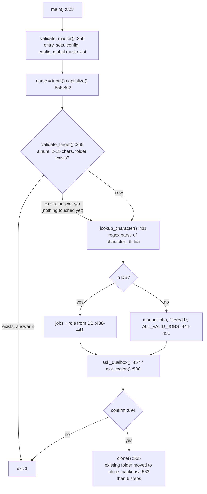

# Characters, templates and the clone system

The job files GearSwap loads live in one folder per character (`data/Tetsouo/`, `data/Kaories/`). Those folders are gitignored. The tracked source they are built from is `_master/`: generic templates plus one optional overlay folder per character. `clone_character.py` builds a live folder from `_master/`. It is an interactive Python script, launched by `CLONE_CHARACTER.bat`, and it runs outside the game. It reads the character roster from `character_db.lua` with a regex. GearSwap never reads `_master/` or `character_db.lua`: in game, every file resolves inside `data/<player.name>/`, `data/shared/` or GearSwap's `libs/`. This page covers how a live folder is built, how it drifts from its templates, and how to add a character or deploy a template change safely.

Scope read for this page: `clone_character.py`, `CLONE_CHARACTER.bat`, `character_db.lua`, `.gitignore`, `.markdownlint.json` and `data.code-workspace` were read in full, and so was `_master/entry/Tetsouo_PLD.lua` as the reference entry. The other entry templates, and every config and set file, were compared against the live folders with `diff` after name substitution. Set files are data: they were characterised through those diffs and never read line by line. The clone was also run for real, against a scratch copy of `_master/` and `character_db.lua` (Tetsouo, Kaories with both sources, and two new characters), to confirm what it produces.

## Files

| Path | Lines | Role |
|---|---|---|
| `clone_character.py` | 921 | Interactive cloner: DB lookup, job/role/region prompts, copy + overlay + rename, generates `DUALBOX_CONFIG.lua` and `REGION_CONFIG.lua` |
| `CLONE_CHARACTER.bat` | 67 | Windows launcher: checks `python`, maps a bare `fr`/`en` first argument to `--lang`, passes the rest through |
| `character_db.lua` | 209 | Roster: character -> jobs + role, archive list, all-jobs list, and a Lua query API that nothing calls |
| `.gitignore` | 114 | Ignores the live character folders and re-includes the `_master/<Name>/` overlays. Ignores itself (line 79) |
| `.markdownlint.json` | 40 | markdownlint rules for the repo's Markdown (atx headings, dash lists, fenced code, `_em_`, `**strong**`) |
| `data.code-workspace` | 7 | VS Code workspace with one folder (`.`). Gitignored (`.gitignore:66`) |
| `_master/entry/Tetsouo_<JOB>.lua` | 15 files, 195-431 | Generic entry templates (BLM BRD BST COR DNC DRK GEO PLD PUP RDM RUN SAM THF WAR WHM) |
| `_master/sets/<job>_sets.lua` | 15 files, 20-1014 | Generic flat set files, same 15 jobs (`pup_sets.lua` is a 20-line skeleton) |
| `_master/config/<job>/` | 82 files in 14 dirs | Per-job configs (KEYBINDS, STATES, LOCKSTYLE, MACROBOOK, TP_CONFIG, plus job extras). No `pup/` |
| `_master/config/alt/` | 33 files | Dual-box alt command tables (22 `_ALT_COMMANDS`, 5 `_ALT_CUSTOM`, 6 `.lua.example`). Never deployed by the clone |
| `_master/config_global/` | 6 files | `LOCKSTYLE_CONFIG`, `RECAST_CONFIG`, `UI_CONFIG`, `UI_COLOR_CONFIG`, `ui_settings`, `message_modes` |
| `_master/Kaories/` | 30 files | Kaories overlay: 4 entries (COR GEO PLD RDM), 4 set files, `config/{cor,geo,rdm}/`, 3 `config_global` files |
| `_master/Tetsouo/` | 53 files | Tetsouo overlay: 8 job `_REFILL.lua`, `config/craft/CRAFT_REFILL.lua`, `config_global/WARDROBE_CONFIG.lua`, `sets/{bonecraft,fishing}_sets.lua`. Since `da68606`, also the SMN entry and configs (`entry/Tetsouo_SMN.lua`, `config/smn/`) and the live modular sets (`sets/<job>/`, `sets/common/rings.lua`) |
| `Tetsouo/` (live, ignored) | 153 files | MAIN, 9 jobs incl. SMN, modular sets |
| `Kaories/` (live, ignored) | 44 files | ALT, 4 jobs (COR GEO PLD RDM), flat sets |

## Folder model

A character exists in up to four places:

1. **Generic templates**: `_master/entry`, `_master/sets`, `_master/config/<job>`, `_master/config_global`. The entry templates are written for a character named `Tetsouo`. They load their configs through paths that contain the name, such as `pcall(require, 'Tetsouo/config/LOCKSTYLE_CONFIG')` (`_master/entry/Tetsouo_PLD.lua:36`), `require('Tetsouo/config/pld/PLD_STATES')` (`:162`) and `ConfigLoader.load_ui_config('Tetsouo', 'PLD')` (`:49`).
2. **Overlay** `_master/<Name>/`: files with the same relative path as a generic file replace it during a clone, and files with no generic counterpart are added. An overlay is used only to build the character it belongs to, or when `--source <Name>` names it (see [Source selection](#source-selection)). Only files under `entry/`, `sets/<job>_sets.lua`, `config/<selected job>/` and `config_global/` are ever looked up, plus the overlay's `sets/<job>/` tree for a job that has no flat set file (see [What the clone never copies](#what-the-clone-never-copies)).
3. **Live folder** `data/<Name>/`: what GearSwap loads. Gitignored (`.gitignore:50-56`).
4. **Runtime-written files** inside the live folder. These are written by in-game commands and have no template: `config/ui_settings.lua`, `config/message_modes.lua` and `config/WARP_ITEMS_OWNED.lua`.

### How GearSwap finds a live folder

- On load and on every main-job change, the engine looks for the job file under the names `<player.name>_<JOB>.lua`, `<player.name>-<JOB>.lua` and a few others (`addons/GearSwap/refresh.lua:98-105`).
- `pathsearch()` tries these directories in order: `libs-dev/`, `libs/`, `data/<player.name>/`, `data/common/`, `data/`, then the `%APPDATA%` equivalents and finally Windower's `addons/libs/` (`refresh.lua:693-703`). So `data/Kaories/Kaories_COR.lua` is found for Kaories on COR.
- `require` inside the sandbox is `include_user` (`refresh.lua:132`). It lowercases the path (`addons/GearSwap/user_functions.lua:305`), searches the same directories, and raises `Cannot find the include file` when nothing matches (`user_functions.lua:315-317`).
- Consequence: `require('Tetsouo/config/...')` resolves through `data/` to `data/Tetsouo/config/...` whoever is logged in. A character name left unsubstituted in a require path does not fail on this machine. It silently loads the other character's file, and it fails only on a machine where that folder does not exist.
- Relative paths resolve against the logged-in character's folder. Entry files `include('../shared/utils/core/INIT_SYSTEMS.lua')` (`_master/entry/Tetsouo_PLD.lua:65`) and `include('sets/pld_sets.lua')` (`:238`). The lockstyle and macrobook factories use `'config/<job>/<JOB>_LOCKSTYLE'` (for example `shared/jobs/war/functions/WAR_LOCKSTYLE.lua`) or build `player.name .. '/config/blm/...'` (`shared/jobs/blm/functions/BLM_LOCKSTYLE.lua:27-29`).

### Tracked vs ignored

| Tracked (`git ls-files`) | Ignored |
|---|---|
| `_master/**` (193 files, incl. both overlays via `!_master/Kaories/**`, `!_master/Tetsouo/**` at `.gitignore:60-63`) | `Tetsouo/`, `Kaories/`, `Hysoka/`, `Gabvanstronger/`, `Morphetrix/`, `Typioni/` (`.gitignore:51-56`) |
| `character_db.lua`, `clone_character.py`, `CLONE_CHARACTER.bat`, `.markdownlint.json`, `README.md` | `.gitignore` itself (`:79`), `data.code-workspace` (`:66`), `.vscode/` (`:31`), `CLAUDE.md` (`:76`, again `:104`), `.claude/` (`:77`) |
| `shared/**`, `docs/` (including `docs/dev/`, versioned in `5ca30fc`) | `_dev/`, `scripts/` (`:91-92`), `export/` (`:43`), `*.log`, `*.png`, debug exports listed at `:106-114` |

The pattern `Kaories/` at `.gitignore:55` has no leading slash, so it also matches `_master/Kaories/`. The negation at `:60-61` is what keeps the overlay tracked (checked with `git check-ignore -v`). Lines 8-11 ignore `Tetsouo/jobs/`, `Tetsouo/utils/`, `Kaories/jobs/` and `Kaories/utils/`, junctions from an old migration. Neither live folder contains them any more, and lines 55-56 already cover them.

## How clone_character.py works

### Invocation

| Command | Effect |
|---|---|
| `CLONE_CHARACTER.bat` | `python clone_character.py` (FR prompts, source `Tetsouo`) |
| `CLONE_CHARACTER.bat en [--source X]` | `python clone_character.py --lang en en --source X`. The `shift` at `CLONE_CHARACTER.bat:44` sits inside a parenthesised block, where `%1` has already been expanded, so the language code is passed twice. The script ignores the extra word. Verified with `cmd.exe` |
| `python clone_character.py --lang en` | English prompts (`clone_character.py:828-833`). Unknown languages fall back to `fr` |
| `python clone_character.py --source Kaories` | `TEMPLATE_NAME = 'Kaories'`, overlay `_master/Kaories/` for whatever target is typed (`:838-843`, `:321-322`, `:538-549`) |

The `.bat` checks `python --version` (`:17-25`) and always ends with `exit /b 0` (`:67`), whatever the script returned.

### Control flow

Nothing is deleted before the final confirmation. Answering `y`/`o` to "Replace it?" (`:381`) only records the answer. `clone()` runs only after a yes at `:894`. Its first action moves an existing folder to `addons/GearSwap/clone_backups/<Name>_<YYYYmmdd-HHMMSS>/` (`_backup_existing`, `:389-405`, called at `:563`). That folder is outside `data/`, so GearSwap never loads it and the refill and wardrobe scanners never walk it. If the move fails, `clone()` returns before writing anything. Answering `n` at either question, or pressing Ctrl+C before the confirmation, leaves the folder untouched. Before commit `27c389a`, the script ran `shutil.rmtree` as soon as "Delete existing?" was answered, before any job question.

### The six clone steps

`S` is `TEMPLATE_NAME` (`--source` or `Tetsouo`, `:312`, `:321`). `T` is the target name. The overlay `_master/S/` is selected at the start of `clone()` (`_select_overlay`, `:538-549`, called at `:566`) only when `T` is `S` (case-insensitive) or `--source` was given; otherwise every `_master/S/` source in the table below is skipped. "Overlay-first" means `_resolve_src()` (`:524-536`): `_master/S/<rel>` if an overlay is selected and that file exists, else `_master/<rel>`.

| Step | Output | Source | Code |
|---|---|---|---|
| 1 | `T/sets/`, `T/config/` directories | - | `:569-573` |
| 2 | `T/T_<JOB>.lua` per selected job | `_master/S/entry/S_<JOB>.lua`, else `_master/entry/Tetsouo_<JOB>.lua`, else `[SKIP]` | `find_entry_src` `:584-594`, loop `:597-607` |
| 3 | `T/sets/<job>_sets.lua` per selected job | overlay-first on `sets/<job>_sets.lua`; if neither exists but the overlay has a `sets/<job>/` tree, that tree is copied (only SMN today); else `[SKIP]` | `:610-627` |
| 4a | `T/config/<job>/*.lua` per selected job | union of `*.lua` names in `_master/config/<job>/` and `_master/S/config/<job>/`, each overlay-first | `:633-656` |
| 4b | `T/config/<file>.lua` | union of `*.lua` names in `_master/config_global/` and `_master/S/config_global/`, each overlay-first, flattened into `config/` | `:661-676` |
| 5 | in place | every `*.lua` under `T/`: `content.replace(S, T)` | `_replace_references` `:715-727` |
| 6 | `T/config/DUALBOX_CONFIG.lua`, `T/config/REGION_CONFIG.lua` | generated from the answers, overwriting whatever step 4b copied | `:687-690`, `:729-816` |

Files are copied with `shutil.copy2`. Step 5 rewrites a file only when it contains `S`. It uses `Path.write_text`, which on Windows writes CRLF line endings. Read or write errors are swallowed (`:725-726`).

### Name substitution (step 5)

- Plain substring replacement of `S` by `T` in every `.lua` file (`:721-722`). This covers the require paths and `load_ui_config('Tetsouo', ...)` in entries, which is the part that matters. It also rewrites `@file Tetsouo_X.lua`, comments, and every `@author Tetsouo`. The live `Tetsouo/config/cor/COR_{LOCKSTYLE,MACROBOOK,STATES,TP_CONFIG}.lua` carry `@author Kaories`, which is what a `Tetsouo -> Kaories` run produces. How those copies reached Tetsouo's folder is not recorded.
- Only `S` is replaced. With `--source Kaories`, a file taken from the generic layer keeps its `'Tetsouo/config/...'` paths. For an entry, this happens whenever the overlay has no `Kaories_<JOB>.lua`, because of the fallback at `:591`. A clone of `Foo` from `--source Kaories` with WAR produced `Foo/Foo_WAR.lua` containing `pcall(require, 'Tetsouo/config/LOCKSTYLE_CONFIG')` and `load_ui_config('Tetsouo', 'WAR')`. The four `_master/Kaories/entry/` files exist so that Kaories does not hit this. After `Tetsouo -> Kaories` substitution they differ from the generic entries only in comments.
- The progress message always prints `Tetsouo >> T` (`:111`, `:213`), whatever `S` is.

### Generated files (step 6)

`DUALBOX_CONFIG.lua` (`:729-773`) sets `role`, `character_name`, and `alt_character` (MAIN) or `main_character` (ALT). It also sets `enabled`, `timeout = 30` and `debug = false`, plus the legacy aliases `main_name = character_name` and `alt_name = <partner>`. `enabled` is true for an ALT, and for a MAIN only when a partner name was given. Partner names go through `str.capitalize()` (`:489`, `:500`). The header comment is written in the prompt language: the live `Kaories/config/DUALBOX_CONFIG.lua:4` is in French. The partner's own `DUALBOX_CONFIG.lua` is not touched, so update it by hand. The reader is `DualBoxManager.initialize()` (`shared/utils/dualbox/dualbox_manager.lua:71-111`), see [dualbox.md](../systems/dualbox.md).

`REGION_CONFIG.lua` (`:775-816`) defines `characters = {[T] = region}`, `default_region`, `get_region`, `get_orange_code` (EU -> `002`, others -> `057`, `:806`) and `get_orange_for_character`. The entries load it into `_G.RegionConfig` (`_master/entry/Tetsouo_PLD.lua:52-55`), and `shared/utils/messages/message_colors.lua:54-58` consumes it. The hand-written `Tetsouo/config/REGION_CONFIG.lua` returns `003` for EU, and so does the `_G.DETECTED_FFXI_REGION` branch in `message_colors.lua:44-50`. Nothing assigns that global any more: the `//gs c setregion` command its comments name has no handler.

Because step 6 runs after step 4b, `_master/Kaories/config_global/DUALBOX_CONFIG.lua` and `REGION_CONFIG.lua` are always overwritten. The comment at `:661-662` says overlay DUALBOX and REGION files override the generic ones, which is not what happens.

### What the clone never copies

- `_master/config/alt/` (33 files): step 4a iterates the selected job codes only, and `alt` is not a job. The MAIN needs these files for `//gs c alt ...` and the bare alt commands (`shared/utils/dualbox/alt_commands.lua:159-177`). The live `Tetsouo/config/alt/*.lua` match the templates byte for byte, so they got there some other way than the clone. The generator that writes `_ALT_COMMANDS.lua` ("GENERATED - do not edit", `_master/config/alt/COR_ALT_COMMANDS.lua:7`) is not in the repository.
- Directories under `_master/S/config/` that are not a selected job, for example `_master/Tetsouo/config/craft/CRAFT_REFILL.lua` (read by `shared/utils/inventory/refill/config_resolver.lua:201`).
- Set files other than `<job>_sets.lua`, for example `_master/Tetsouo/sets/{bonecraft,fishing}_sets.lua` (read by `shared/utils/craft/craft_manager.lua:60`).
- `*.lua.example` files (every glob is `*.lua`).
- Any job with no template in the generic layer or the chosen overlay. SMN has no generic template. Since `da68606` its entry, configs and `sets/smn/` tree are in the Tetsouo overlay, so only a clone of Tetsouo (or one with `--source Tetsouo`) restores it (step 3 copies the tree). Manual job selection still cannot pick SMN (`ALL_VALID_JOBS`, `:247-250`).
- Modular sets of jobs that have a flat template (`sets/<job>/{armor,capes,weapons,...}.lua`, `sets/common/rings.lua`). Since `da68606` they are versioned in `_master/Tetsouo/sets/`, but step 3 copies the flat `<job>_sets.lua` instead, and the template entries include the flat path. The flat-template versus modular-live split is by design (`.claude/CODE_QUALITY.md` section 15.1).

Commit `17bca27` created `_master/Tetsouo/` "so the clone_character.py default flow can rebuild Tetsouo identically". The craft sets and `CRAFT_REFILL.lua` it moved there are among the files above that the flow never copies.

### Source selection

Without `--source`, `S = 'Tetsouo'`. `_select_overlay(T)` (`:538-549`) keeps the overlay `_master/S/` only when the character being built is `S` or when `--source` was given explicitly (`source_explicit`, `:322`):

| Invocation | Target | Overlay used |
|---|---|---|
| default source | `Tetsouo` | `_master/Tetsouo/` (his wardrobe config, refill lists, SMN) |
| default source | any other name, `Kaories` included | none: generic `_master/` files only |
| `--source Kaories` | any name | `_master/Kaories/` |

- A new character cloned with the default source gets no `WARDROBE_CONFIG.lua` and no `_REFILL.lua` files, because `_master/config_global/` and `_master/config/<job>/` have none. The wardrobe organizer then runs on its defaults (`shared/utils/wardrobe/lib/config.lua`) and refill has nothing to fetch. Before 2026-09-19 it received Tetsouo's (8-wardrobe layout, W7 protected).
- Running the tool for `Kaories` without `--source Kaories` still never consults `_master/Kaories/`: she is rebuilt from the generic files only (generic GEO, PLD and RDM sets; the generic RDM set has `Viti. Tabard +3` where her overlay has `+4`).

Tested on a scratch copy of `_master/` with scripted answers: a new character (default source), a re-clone of Tetsouo (default source, gets `_master/Tetsouo/` including SMN) and Kaories with `--source Kaories`.

## character_db.lua

Data (`character_db.lua:34-78`):

| Table | Content |
|---|---|
| `CHARACTERS` | `Tetsouo = { jobs = {BLM, BRD, BST, COR, DNC, PLD, SMN, THF, WAR}, role = 'main' }`, `Kaories = { jobs = {RDM, COR, GEO, PLD}, role = 'alt' }` |
| `ARCHIVE_JOBS` | DRK, PUP, RUN, SAM, WHM: no active owner. Their templates remain under `_master/`. There is no `_archive` folder |
| `MASTER` | `sets_dir = '_master/sets'`, `config_dir = '_master/config'` |
| `ALL_JOBS` | 16 codes including SMN |

COR and PLD have two owners. Kaories's COR is served by her overlay. Her PLD has an overlay for entry and sets only (see the divergence table).

Public API. Every function has **zero callers** in `shared/`, `_master/`, `Tetsouo/`, `Kaories/`, the root scripts and the docs. The Python script does not load the module. It regex-parses the file.

| Function | Returns | Notes |
|---|---|---|
| `get_jobs(name)` `:87` | job list or nil | case-insensitive. Raises on `nil` name (`:89`, checked with lua5.1) |
| `get_role(name)` `:99` | `'main'`/`'alt'`/nil | case-insensitive |
| `has_job(name, job)` `:112` | boolean | |
| `get_owner(job)` `:125` | first owner, `'_archive'`, or nil | For a job with two owners (COR, PLD) the result depends on `pairs()` order |
| `get_archive_jobs()` `:140`, `get_character_names()` `:146`, `get_all()` `:156`, `get_all_jobs()` `:162`, `get_master_paths()` `:168` | raw tables | |
| `validate()` `:178` | `true, 'OK - all 16 jobs assigned'` today | Checks that no archived job has an owner and that every job in `ALL_JOBS` is owned or archived. Its doc says a second owner needs an overlay (`:172-176`), but it does not check for one. Nothing calls it |

What `clone_character.py` actually reads (`parse_character_db`, `:257-291`):

- The regex at `:278`: `([A-Z][a-z]\w*)\s*=\s*\{[^}]*jobs\s*=\s*\{([^}]*)\}[^}]*role\s*=\s*['"](\w+)['"]`. A block is recognised only if its name starts with one uppercase letter followed by a lowercase one, `jobs` comes before `role`, and no `}` appears between `jobs = {...}` and `role`. `ARCHIVE_JOBS`, `ALL_JOBS` and `MASTER` are ignored.
- DB jobs are used as-is (`:435-438`). Manual entry is filtered by the script's own `ALL_VALID_JOBS` (`:247-250`). That list has 15 codes, no SMN, and duplicates `ALL_JOBS`.
- The header example at `character_db.lua:9` (`{'RDM','COR','GEO'}`) predates PLD being added to Kaories.

## Per-character files read at runtime

| File under `data/<Name>/` | Reader | Deployed by clone | Runtime writer |
|---|---|---|---|
| `<Name>_<JOB>.lua` | GearSwap `load_user_files` (`refresh.lua:98-105`) | step 2 | - |
| `sets/<job>_sets.lua` (or `sets/<job>/...` in Tetsouo) | entry `init_gear_sets()` (`_master/entry/Tetsouo_PLD.lua:237-239`) | step 3 (flat only) | - |
| `config/<job>/<JOB>_STATES/_KEYBINDS/_TP_CONFIG/...` | entries (`Tetsouo_PLD.lua:97-98,162,168`) | step 4a | - |
| `config/<job>/<JOB>_LOCKSTYLE/_MACROBOOK` | LockstyleManager / MacrobookManager factories, see [factories-and-helpers.md](../systems/factories-and-helpers.md) | step 4a | - |
| `config/<job>/<JOB>_REFILL.lua` | `config_resolver.lua:222` | step 4a, only when an overlay or template has it | - |
| `config/blm/*`, `config/whm/WHM_CURE_CONFIG.lua` | `shared/jobs/blm/functions/BLM_MIDCAST.lua:45`, `shared/utils/whm/cure_manager.lua:36` | step 4a | - |
| `config/LOCKSTYLE_CONFIG.lua`, `RECAST_CONFIG.lua` | entries (`Tetsouo_PLD.lua:36,93`) | step 4b | - |
| `config/UI_CONFIG.lua` | `shared/utils/config/config_loader.lua:45` (dofile) | step 4b | - |
| `config/UI_COLOR_CONFIG.lua` | `shared/utils/ui/COLOR_SYSTEM.lua:25` | step 4b | - |
| `config/ui_settings.lua` | `shared/config/ui_settings.lua:91` | step 4b | same file, `:115` |
| `config/message_modes.lua` | `shared/config/message_settings.lua:42` | step 4b | same file, `:66` |
| `config/WARDROBE_CONFIG.lua` | `shared/utils/wardrobe/lib/config.lua:168` | step 4b (overlay only) | - |
| `config/DUALBOX_CONFIG.lua` | `dualbox_manager.lua:80` | step 6 (generated) | - |
| `config/REGION_CONFIG.lua` | entries, `message_colors.lua:54` | step 6 (generated) | - |
| `config/alt/<JOB>_ALT_COMMANDS.lua`, `_ALT_CUSTOM.lua` | `alt_commands.lua:160-177` (MAIN only) | never | - |
| `config/craft/CRAFT_REFILL.lua` | `config_resolver.lua:201` | never | - |
| `sets/<craft>_sets.lua` | `craft_manager.lua:60` | never | - |
| `config/CRAFT_CONFIG.lua` (optional, defaults craft 19 / fish 17) | `shared/utils/craft/craft_commands.lua:42` | never | - |
| `config/WARP_ITEMS_OWNED.lua` | `shared/utils/wardrobe/lib/warp_owned.lua:31-41` | never | `//gs c wo scan`, `warp_owned.lua:98` |

When `player` is nil, eleven shared modules fall back to the name `'Tetsouo'`, including `config_loader.lua:37`, `dualbox_manager.lua:75`, `alt_commands.lua:159`, `ui_settings.lua:87` and `message_settings.lua:38`.

## Live vs template divergence (on disk, 2026-09-18)

Method: every live file was mapped to the template the clone would use. Tetsouo was mapped with the default source. Kaories was mapped with `--source Kaories`, the flow the README documents. The template was substituted `S -> target` and compared with `diff --strip-trailing-cr`. Both clones were also run for real against a scratch copy of `_master/`, and the output was compared with `diff -rq`.

Classification: **intentional** (per-character values or modular sets by design), **stale live** (template changed, live not redeployed), **live-ahead** (live edited, template or overlay not updated: a re-clone reverts it), **live-only** (no template at all), **live typo** (live edited wrongly: a re-clone fixes it), **runtime** (written in game).

### Tetsouo (153 files)

| Live file(s) | Template | Class | Detail |
|---|---|---|---|
| `Tetsouo_{BLM,BRD,COR,DNC,PLD,THF}.lua` | `_master/entry/Tetsouo_<JOB>.lua` | intentional | Only `include('sets/<job>/<job>_sets.lua')` (plus a header comment line in DNC and THF). COR already contains the `init_party_tracking()` change (`10ca4e6`) |
| `Tetsouo_WAR.lua` | same | intentional + live-only line | Modular include and header comment line, plus `if _G.LagDebugger then _G.LagDebugger.on_job_update() end` at `:244`. The same hook is in `Tetsouo_BST.lua:244` and `Tetsouo_SMN.lua:160`. Reason not recorded |
| `Tetsouo_BST.lua` | `_master/entry/Tetsouo_BST.lua` | **live-ahead** | 196 differing lines. Live uses a `prerender` pet monitor (`:293-345`), guards the scheduled start (`:224-225`), requires `dualbox_manager` in `user_setup` (`:234`) and drops `send_job_update()` from `job_sub_job_change`. The template still has the coroutine monitor (`:277-398`), the unguarded start (`:223-225`) and the subjob send (`:262-266`). Commit `ba783ae` lists BST among the 10 templates it moved to the `user_setup` pattern, but its BST hunk only renames `petEngaged` |
| `Tetsouo_SMN.lua`, `config/smn/*` (4), `sets/smn/smn_sets.lua` | `_master/Tetsouo/entry/`, `config/smn/`, `sets/smn/` (overlay) | identical | Live-only until `da68606` saved them byte for byte. There is still no generic template under `_master/entry`, `config` or `sets` |
| `sets/<job>/*.lua` for blm brd bst cor dnc pld thf war, `sets/common/rings.lua` (35 + smn) | `_master/sets/<job>_sets.lua` (flat); copies in `_master/Tetsouo/sets/<job>/` | intentional; identical to the overlay copies | Created 2026-05-10/11, after `17bca27` untracked `Tetsouo/`. Versioned in the overlay since `da68606`, but not deployed by the clone (the flat file wins in step 3) |
| `sets/bonecraft_sets.lua`, `sets/fishing_sets.lua` | `_master/Tetsouo/sets/` | identical | Never deployed by the clone |
| `config/alt/*.lua` (27) | `_master/config/alt/` | identical | Deployed outside the clone, which never copies them |
| `config/alt/*.lua.example` (6) | same | stale live | Missing the `REFINE` doc block (19 lines) added in `85d7a27`. Documentation only |
| `config/craft/CRAFT_REFILL.lua`, 7 of the 8 `config/<job>/<JOB>_REFILL.lua` | `_master/Tetsouo/config/` | identical | - |
| `config/pld/PLD_REFILL.lua` | `_master/Tetsouo/config/pld/PLD_REFILL.lua` | **live-ahead** | Live adds Echo Drops and a `RUN` subjob list |
| `config/{blm,brd,bst,dnc,pld,thf,war}/<JOB>_MACROBOOK.lua` | generic | intentional | Per-character book/page values. Not saved in any overlay |
| `config/brd/BRD_STATES.lua`, `bst/BST_STATES.lua`, `thf/THF_STATES.lua`, `war/WAR_STATES.lua`, `war/WAR_TP_CONFIG.lua` | generic | intentional | Per-character defaults and option lists (for example `WAR_STATES` adds a `SubtleBlow` HybridMode). Not saved in any overlay |
| `config/pld/PLD_STATES.lua` | generic | identical | Since `df01a96` the template carries the live `PhalanxSIRD` state, `KC` weapon and Sortie rune `Sulpor` |
| `config/pld/PLD_KEYBINDS.lua` | generic | identical | Since `df01a96`: HybridMode `^numpad9`, PhalanxSIRD `^numpad2`, as in `.claude/rules/keybinds.md` |
| `config/cor/COR_{LOCKSTYLE,MACROBOOK,STATES,TP_CONFIG}.lua` | generic | stale (cosmetic) | Only `@author Kaories` |
| `config/UI_CONFIG.lua` | `_master/config_global/UI_CONFIG.lua` | live-ahead | Live removed the dead `UIConfig.print_config()`. The template still has it (`:380-388`) |
| `config/ui_settings.lua`, `config/message_modes.lua` | `_master/config_global/` | runtime | Written by the UI and message settings managers |
| `config/DUALBOX_CONFIG.lua`, `config/REGION_CONFIG.lua` | generated by step 6 | live-only (hand-written) | A re-clone replaces them with the generated form (REGION EU code 002 instead of 003) |
| `config/CRAFT_CONFIG.lua` | none | live-only | Values equal the code defaults |
| `config/WARP_ITEMS_OWNED.lua` | none | runtime | `//gs c wo scan` |
| every other config and global file | generic or overlay | identical | - |

### Kaories (44 files, `--source Kaories`)

| Live file(s) | Template | Class | Detail |
|---|---|---|---|
| `Kaories_{COR,GEO,PLD,RDM}.lua` | `_master/Kaories/entry/` | identical | COR includes the `init_party_tracking()` change (`10ca4e6`) |
| `sets/cor_sets.lua` | overlay | identical | - |
| `sets/geo_sets.lua` | overlay | **live typo** | `:402` `neck = 'Sybil Scarf'`. The overlay has had `'Sibyl Scarf'` since it was added in `25dce0c`, and `Sybil Scarf` appears nowhere in git history (`git log --all -S`), so the typo was made in the live file. `res/items.lua` only knows `Sibyl Scarf`. A re-clone fixes it |
| `sets/pld_sets.lua` | overlay | **live-ahead** | Live (2026-08-12) is newer than the overlay (2026-07-24): `Cornelia's Ring` instead of `Ephramad's Ring`, different Odyssean Greaves augments |
| `sets/rdm_sets.lua`, `config/rdm/RDM_STATES.lua` | overlay | **live-ahead** | Live adds `sets['Maxentius']`, makes `Maxentius` the default weapon and `CombatMode` `On`. The rest is formatter reflow |
| `config/{cor,geo}/*`, other `config/rdm/*` | overlay | identical | - |
| `config/pld/PLD_LOCKSTYLE.lua`, `PLD_MACROBOOK.lua` | generic (no pld overlay) | intentional, **not saved** | Lockstyle 4 against 3 in the template (`:29`), macro book 4 against 15/18/20 (`:33-42`) |
| `config/pld/PLD_REFILL.lua` | none | **live-only** | No `_master/Kaories/config/pld/`. The file is byte-identical to `_master/Tetsouo/config/pld/PLD_REFILL.lua`, which `--source Kaories` never reads, so that clone drops it |
| `config/pld/PLD_STATES.lua` | generic | identical | Redeployed from the template on 2026-09-19 |
| `config/pld/PLD_KEYBINDS.lua` | generic | identical | Redeployed from the template on 2026-09-19 |
| `config/pld/PLD_BLU_MAGIC.lua`, `PLD_TP_CONFIG.lua` | generic | identical | - |
| `config/DUALBOX_CONFIG.lua` | generated (FR) | generated | The overlay copy (EN) is never used |
| `config/REGION_CONFIG.lua`, `WARDROBE_CONFIG.lua`, `RECAST_CONFIG.lua`, `UI_COLOR_CONFIG.lua` | overlay or generic | identical | - |
| `config/LOCKSTYLE_CONFIG.lua` | generic | cosmetic | `:25` says `Kaories_WAR.lua`, a `Tetsouo -> Kaories` substitution only the default source produces |
| `config/UI_CONFIG.lua` | generic | stale live | Still has `print_config()`, using `add_to_chat` (`:380-387`) |
| `config/ui_settings.lua`, `message_modes.lua`, `WARP_ITEMS_OWNED.lua` | - | runtime | - |

Overlay duplication: 15 of the 16 non-REFILL files in `_master/Kaories/config/` match the generic templates line for line (ignoring line endings). The exception is `COR_KEYBINDS.lua`, which differs only in its `@requires` comment. `_master/Kaories/sets/cor_sets.lua` is identical to `_master/sets/cor_sets.lua`, and `geo_sets`/`rdm_sets` differ by 2 and 3 lines. Every template edit therefore has to be made twice, or Kaories's next redeploy gets the old copy.

## `_master` changes of 2026-09-19 and what they mean for live

Every `_master/` change of 2026-09-19 is committed. The ones that have a live copy:

| File | Change | Live status |
|---|---|---|
| `_master/entry/Tetsouo_COR.lua` | `10ca4e6`: PartyTracker init moved from `user_setup()` into a local `init_party_tracking()` called from `get_sets()`. `select_default_macro_book` and `select_default_lockstyle` are guarded in `user_setup` | Already in `Tetsouo/Tetsouo_COR.lua` (only the modular include differs). Nothing to deploy |
| `_master/Kaories/entry/Kaories_COR.lua` | `10ca4e6`: same patch | `Kaories/Kaories_COR.lua` is identical. Nothing to deploy |
| `_master/config/pld/PLD_KEYBINDS.lua` | Committed in `df01a96` (keys per the rule, `^numpad7` `SneakInviAOE`, unbind loop) | Tetsouo and Kaories identical |
| `_master/config/pld/PLD_STATES.lua` | Committed in `df01a96` (Sortie profile, `PhalanxSIRD`, `SneakInviAOE`) | Tetsouo and Kaories identical |
| `_master/config/run/RUN_KEYBINDS.lua` | `e94d286`: unbind the whole key list before rebinding | No live target: RUN is archived in the DB and only the frozen Hysoka plays it |

`.claude/audits/2026-09-18.md` P3-5 (PLD Sortie profile not redeployed) is resolved: the template has `PhalanxSIRD` since `df01a96`, and `PLD_STATES.lua` and `PLD_KEYBINDS.lua` are identical in `_master/config/pld/`, `Tetsouo/config/pld/` and `Kaories/config/pld/`. Do not redeploy Kaories by re-running the clone: it would revert the live-ahead files listed above. Copy single files by hand (next section).

## How to deploy a template change

Single file (recommended):

1. Edit the template under `_master/` and commit it.
2. Find every live copy: `Tetsouo/`, `Kaories/`, and any overlay copy of the same file under `_master/<Name>/`.
3. Config and set files contain the character name only in comments, so copy them as they are: `cp _master/config/pld/PLD_STATES.lua Kaories/config/pld/PLD_STATES.lua`.
4. Entry files need the paths rewritten and the header left alone. For example: `sed "s#'Tetsouo/#'Kaories/#g; s#('Tetsouo', #('Kaories', #" _master/entry/Tetsouo_PLD.lua > Kaories/Kaories_PLD.lua`. For Tetsouo's live entries, also change `include('sets/<job>_sets.lua')` back to `include('sets/<job>/<job>_sets.lua')`.
5. In game: `//lua r gearswap`, then `//gs c checksets`.

Full redeploy (`clone_character.py` on an existing character):

1. The script moves the old folder to `addons/GearSwap/clone_backups/<Name>_<date>/` after the final confirmation (`clone_character.py:389-405`, since `27c389a`). Keep that backup until the new folder has been checked in game. A copy you make yourself must stay outside `data/`: a folder inside `data/` with a capitalised name is scanned by the refill foreign-item pass (`config_resolver.lua:106-121`).
2. Save every live-ahead and live-only file into `_master/<Name>/` (see the divergence tables), or be ready to restore it from the backup.
3. Pass `--source <Name>` whenever `_master/<Name>/` exists and `<Name>` is not Tetsouo. For Tetsouo the default source already applies `_master/Tetsouo/`.
4. Afterwards, restore by hand: `config/alt/` (MAIN), craft files, `DUALBOX_CONFIG.lua`/`REGION_CONFIG.lua` if they were hand-written, and for Tetsouo the modular sets (from `_master/Tetsouo/sets/<job>/` or the backup) and the modular include lines in the entries. SMN comes back on its own with the default source (the overlay applies because the target is Tetsouo).

## How to add a character

1. Add a block to `CHARACTERS` in `character_db.lua` in exactly this shape: `Name = { jobs = { 'WAR', 'PLD' }, role = 'main' },`, with `jobs` before `role` and no nested braces. If a job is also in `ARCHIVE_JOBS`, move it out, or `CharDB.validate()` fails (nothing runs it, so this only matters for consistency).
2. Optional: create `_master/<Name>/` with the same layout (`entry/<Name>_<JOB>.lua`, `sets/<job>_sets.lua`, `config/<job>/`, `config_global/`). With `--source <Name>`, **every** selected job needs its entry in the overlay. Otherwise the generic entry keeps `Tetsouo` paths (see Name substitution).
3. Run `CLONE_CHARACTER.bat` (or `... --source <Name>`). Answer the role, partner and region prompts.
4. MAIN with an alt: copy `_master/config/alt/` to `<Name>/config/alt/` by hand. Then edit the partner's `config/DUALBOX_CONFIG.lua` to name the new character.
5. Craft users: copy `sets/{bonecraft,fishing}_sets.lua` and `config/craft/CRAFT_REFILL.lua` from `_master/Tetsouo/`, adjusted.
6. A character created from the default source gets no `WARDROBE_CONFIG.lua` (organizer defaults) and no refill lists. Add `config/WARDROBE_CONFIG.lua` and `config/<job>/<JOB>_REFILL.lua` by hand if wanted, or save them in `_master/<Name>/` and clone with `--source <Name>`.
7. In game: `//lua r gearswap`, `//gs c checksets`, and `//gs c wo scan` if the warp-item list is wanted.

## How to add a job to the templates

1. `_master/entry/Tetsouo_<JOB>.lua`: copy a similar job and keep the `'Tetsouo/config/...'` path convention so step 5 can substitute it.
2. `_master/sets/<job>_sets.lua` (flat) and `_master/config/<job>/`, with **every** file the entry `require`s without `pcall`. The PUP entry requires `pup/PUP_PET_DATA`, `PUP_TP_CONFIG` and `PUP_STATES` (`_master/entry/Tetsouo_PUP.lua:59-60,116`), and none of them exists.
3. Add the code to `ALL_VALID_JOBS` (`clone_character.py:247-250`) and to `ALL_JOBS`/a character/`ARCHIVE_JOBS` in `character_db.lua`.
4. Add the shared modules under `shared/jobs/<job>/` (see [core-lifecycle.md](../systems/core-lifecycle.md) and [job-change-lifecycle.md](./job-change-lifecycle.md)).

## Interactions

- [dualbox.md](../systems/dualbox.md): reads the generated `DUALBOX_CONFIG.lua` and `config/alt/`.
- [equipment-and-inventory.md](../systems/equipment-and-inventory.md): refill reads `<JOB>_REFILL.lua`, `config/craft/CRAFT_REFILL.lua` and every capitalised top-level folder under `data/`.
- [wardrobe-organizer.md](../systems/wardrobe-organizer.md): reads `WARDROBE_CONFIG.lua` and writes `WARP_ITEMS_OWNED.lua`.
- [ui-overlay.md](../systems/ui-overlay.md) and [messages.md](../systems/messages.md): read `UI_CONFIG`, `ui_settings`, `UI_COLOR_CONFIG`, `message_modes` and `REGION_CONFIG`.
- [factories-and-helpers.md](../systems/factories-and-helpers.md): the lockstyle and macrobook factories read `config/<job>/`.
- [job-change-lifecycle.md](./job-change-lifecycle.md): what the entry templates do on load and unload.

## Invariants and gotchas

- The live folder name, the file prefix and the in-game character name must match exactly (`refresh.lua:102`). The script capitalises the typed name (`clone_character.py:862`).
- A hard-coded character name in a `require` path resolves through `data/` for any logged-in character (`refresh.lua:698`). Wrong names fail silently on the author's machine and loudly elsewhere.
- Answering `y` or `o` to "Replace it?" deletes nothing. The folder is moved to `addons/GearSwap/clone_backups/` only after the final confirmation (`clone_character.py:563`). There is still no dry run.
- Step 6 always overwrites `DUALBOX_CONFIG.lua` and `REGION_CONFIG.lua`. A copy of them in an overlay has no effect.
- `ALL_VALID_JOBS` (Python, 15) and `ALL_JOBS` (Lua, 16) are separate lists. DB jobs skip the Python list.
- `_master/Kaories/` overlay files must be kept in sync by hand with the generic files they duplicate.
- The refill foreign-item scan loads `*_REFILL.lua` from every top-level `data/` entry whose name starts with an uppercase letter (`config_resolver.lua:115`). A new character, or a backup folder inside `data/`, joins it.
- `.gitignore` ignores itself, so a fresh clone of the public repository has no ignore rules for live folders (by design, per its comment at `:78`).
- `shared/utils/wardrobe/lib/reports.lua:64` writes `data/wardrobe_scan_<char>.txt`. That pattern is missing from the debug-export block at `.gitignore:106-114`, so the files show up as untracked.

## Known issues

- Re-cloning an existing character does not redeploy `config/alt`, craft files, live-ahead per-character configs, or Tetsouo's modular sets (versioned in `_master/Tetsouo/sets/<job>/` but not copied). They are no longer lost: the old folder is moved to `addons/GearSwap/clone_backups/` (`clone_character.py:389-405`).
- `--source <Name>` leaves `Tetsouo` require paths in files taken from the generic layer: `clone_character.py:591`, `:722`.
- The default source ignores an existing `_master/<target>/` overlay unless the target is Tetsouo: `clone_character.py:538-549`.
- The clone never deploys `_master/config/alt/`, `config/craft/` or craft set files: `clone_character.py:633-656`, `:610-627`.
- Kaories has no Sortie sets (`sets.EnmityMax`, `sets.engaged.TP`): in Sortie she keeps her normal sets, by choice (2026-09-19).
- The BST entry template lacks the live fixes, and its scheduled pet-monitor start calls a global cleared by `file_unload`: `_master/entry/Tetsouo_BST.lua:223-225`, `:424`.
- The PUP entry template requires config files that `_master` never shipped: `_master/entry/Tetsouo_PUP.lua:59`.
- SMN has no generic template: its only tracked copy is the Tetsouo overlay (`_master/Tetsouo/entry/Tetsouo_SMN.lua`), and it is missing from `ALL_VALID_JOBS` (`clone_character.py:247-250`).
- The Kaories overlay has no `config/pld/`, and her PLD/RDM sets and states are ahead of the overlay: `Kaories/config/pld/PLD_LOCKSTYLE.lua:29`.
- The Kaories live GEO set still uses the misspelled `Sybil Scarf`: `Kaories/sets/geo_sets.lua:402`.
- Step 5 rewrites `@author Tetsouo`, and four live Tetsouo COR configs say `@author Kaories`: `clone_character.py:722`, `Tetsouo/config/cor/COR_STATES.lua:29`.
- The overlay `DUALBOX_CONFIG`/`REGION_CONFIG` are always overwritten, contrary to the comment: `clone_character.py:661-662`.
- The `character_db.lua` Lua API has no callers, and `validate()` does not check what its doc claims: `character_db.lua:178`.
- The Kaories overlay duplicates the generic templates line for line: `_master/Kaories/config/`.
- Dead `UIConfig.print_config()` remains in the template, and the Kaories live copy uses `add_to_chat`: `_master/config_global/UI_CONFIG.lua:380`.
- The user docs misdescribe the clone: `docs/user/getting-started/installation.md:95-96` (no `--force`, re-running is not safe), `README.md:731` (jobs are not auto-detected from `_master/sets/`), `README.md:61` (`'all'` is not accepted), `docs/user/guides/dualbox.md:30` (the source name is not prompted).
- `.gitignore` does not cover `wardrobe_scan_*.txt`, and lines 8-11 are dead: `.gitignore:106`.
