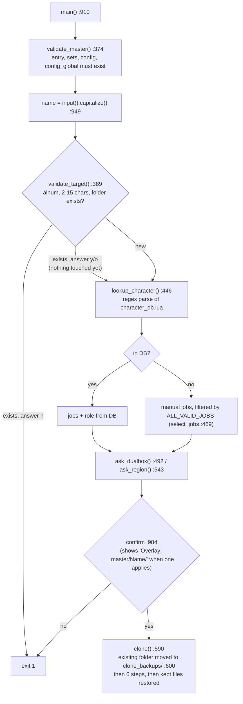

# Characters, templates and the clone system

The job files GearSwap loads live in one folder per character (`data/Tetsouo/`, `data/Kaories/`). Those folders are gitignored. The tracked source they are built from is `_master/`: generic templates plus one optional overlay folder per character. `clone_character.py` builds a live folder from `_master/`. It is an interactive Python script, launched by `CLONE_CHARACTER.bat`, and it runs outside the game. It reads the character roster from `character_db.lua` with a regex. In game, every job file resolves inside `data/<player.name>/`, `data/shared/` or GearSwap's `libs/`, with one exception: since `60aa138`, a character that became main with `//gs c main` and has no `config/alt/` reads its alt command tables from `_master/config/alt/` (`load_job_config` in `shared/utils/dualbox/alt_commands.lua`). GearSwap never reads `character_db.lua`. This page covers how a live folder is built, how it drifts from its templates, and how to add a character or deploy a template change safely.

Scope read for this page (re-read on 2026-09-25, after `f6f1683` "clone modular sets" and the uncommitted clone fixes of that day): `clone_character.py` (version 4.1.0), `CLONE_CHARACTER.bat`, `character_db.lua` and `.gitignore` in full, `_master/entry/Tetsouo_PLD.lua` as the reference entry. The clone was run for real against a scratch copy of `_master/` and `character_db.lua` (Tetsouo with the default source, Kaories with `--source Kaories`, the jobs of `character_db.lua`), and the output was compared with the live folders with `diff -rq --strip-trailing-cr`.

## Files

| Path | Lines | Role |
|---|---|---|
| `clone_character.py` | 1011 | Interactive cloner: DB lookup, job/role/region prompts, copy + overlay + rename, generates `DUALBOX_CONFIG.lua` and `REGION_CONFIG.lua`, keeps the files written in game across a re-clone |
| `CLONE_CHARACTER.bat` | 67 | Windows launcher: checks `python`, maps a bare `fr`/`en` first argument to `--lang`, passes the rest through |
| `character_db.lua` | 209 | Roster: character -> jobs + role, archive list, all-jobs list, and a Lua query API that nothing calls |
| `.gitignore` | 126 | Ignores the live character folders and re-includes the `_master/<Name>/` overlays. Ignores itself (line 79) |
| `.markdownlint.json` | 40 | markdownlint rules for the repo's Markdown |
| `data.code-workspace` | 7 | VS Code workspace with one folder (`.`). Gitignored (`.gitignore:66`) |
| `_master/entry/Tetsouo_<JOB>.lua` | 15 files, 219-450 | Generic entry templates (BLM BRD BST COR DNC DRK GEO PLD PUP RDM RUN SAM THF WAR WHM) |
| `_master/sets/<job>_sets.lua` | 15 files, 25-1021 | Generic flat set files, same 15 jobs (`pup_sets.lua` is a skeleton) |
| `_master/config/<job>/` | 97 files in 14 dirs | Per-job configs (KEYBINDS, STATES, LOCKSTYLE, MACROBOOK, TP_CONFIG, `<JOB>_CUSTOM.lua`, job extras). No `pup/` |
| `_master/config/alt/` | 33 files | Dual-box alt command tables (22 `_ALT_COMMANDS`, 5 `_ALT_CUSTOM`, 6 `.lua.example`). Deployed only to a character cloned as MAIN |
| `_master/config_global/` | 8 files | `COMMON_KEYBINDS`, `CRAFT_CONFIG`, `LOCKSTYLE_CONFIG`, `RECAST_CONFIG`, `UI_CONFIG`, `UI_COLOR_CONFIG`, `ui_settings`, `message_modes` |
| `_master/Kaories/` | 36 files | Kaories overlay: 4 entries (COR GEO PLD RDM), 4 set files, `config/{cor,geo,pld,rdm}/`, `config_global/{COMMON_KEYBINDS,DUALBOX_CONFIG,REGION_CONFIG,WARDROBE_CONFIG}.lua` |
| `_master/Tetsouo/` | 77 files | Tetsouo overlay: 9 entries (BLM BRD BST COR DNC PLD SMN THF WAR, with the modular set include), `config/<job>/` for those jobs plus `config/craft/`, `config_global/{DUALBOX_CONFIG,REGION_CONFIG,UI_CONFIG,WARDROBE_CONFIG}.lua`, the modular sets `sets/<job>/` and `sets/common/`, and `sets/{bonecraft,fishing}_sets.lua` |
| `Tetsouo/` (live, ignored) | 168 files | MAIN, 9 jobs incl. SMN, modular sets |
| `Kaories/` (live, ignored) | 52 files | ALT, 4 jobs (COR GEO PLD RDM), flat sets |

## Folder model

A character exists in up to four places:

1. **Generic templates**: `_master/entry`, `_master/sets`, `_master/config/<job>`, `_master/config/alt`, `_master/config_global`. The entry templates are written for a character named `Tetsouo`. They load their configs through paths that contain the name, such as `pcall(require, 'Tetsouo/config/LOCKSTYLE_CONFIG')` (`_master/entry/Tetsouo_PLD.lua:37`), `require('Tetsouo/config/pld/PLD_STATES')` (`:171`) and `ConfigLoader.load_ui_config('Tetsouo', 'PLD')` (`:50`).
2. **Overlay** `_master/<Name>/`: files with the same relative path as a generic file replace it during a clone, and files with no generic counterpart are added. An overlay is used to build the character it belongs to (since 2026-09-25 with or without `--source`), or for any target when `--source <Name>` names it (see [Source selection](#source-selection)). The overlay can also hold a modular set tree `sets/<job>/`, which then replaces the generic flat `sets/<job>_sets.lua`, plus `sets/common/` and loose set files.
3. **Live folder** `data/<Name>/`: what GearSwap loads. Gitignored (`.gitignore:50-56`).
4. **Runtime-written files** inside the live folder, written by in-game commands, with no template: `config/ui_settings.lua` (HUD position), `config/message_modes.lua`, `config/WARP_ITEMS_OWNED.lua`, `config/dualbox_role.lua`, `config/alt_state.lua`, `config/alt_window.lua`, `temp_binds.lua`, and the trace files (`trace.log`, `trace.on`).

### How GearSwap finds a live folder

- On load and on every main-job change, the engine looks for the job file under the names `<player.name>_<JOB>.lua`, `<player.name>-<JOB>.lua` and a few others (`addons/GearSwap/refresh.lua:98-105`).
- `pathsearch()` tries these directories in order: `libs-dev/`, `libs/`, `data/<player.name>/`, `data/common/`, `data/`, then the `%APPDATA%` equivalents and finally Windower's `addons/libs/` (`refresh.lua:693-703`). So `data/Kaories/Kaories_COR.lua` is found for Kaories on COR.
- `require` inside the sandbox is `include_user` (`refresh.lua:131`). It lowercases the path (`addons/GearSwap/user_functions.lua:305`), searches the same directories, and raises `Cannot find the include file` when nothing matches (`user_functions.lua:316`).
- Consequence: `require('Tetsouo/config/...')` resolves through `data/` to `data/Tetsouo/config/...` whoever is logged in. A character name left unsubstituted in a require path does not fail on this machine. It silently loads the other character's file, and it fails only on a machine where that folder does not exist. The same resolution is what lets `require('_master/config/alt/...')` work.
- Relative paths resolve against the logged-in character's folder. Entry files `include('../shared/utils/core/INIT_SYSTEMS.lua')` (`_master/entry/Tetsouo_PLD.lua:71`) and `include('sets/pld_sets.lua')` (`:278`). The lockstyle and macrobook factories use `'config/<job>/<JOB>_LOCKSTYLE'` (for example `shared/jobs/war/functions/WAR_LOCKSTYLE.lua`) or build `player.name .. '/config/blm/...'` (`shared/jobs/blm/functions/BLM_LOCKSTYLE.lua:27-30`).

### Tracked vs ignored

| Tracked (`git ls-files`) | Ignored |
|---|---|
| `_master/**` (281 files, incl. both overlays via `!_master/Kaories/**`, `!_master/Tetsouo/**` at `.gitignore:60-63`) | `Tetsouo/`, `Kaories/`, `Hysoka/`, `Gabvanstronger/`, `Morphetrix/`, `Typioni/` (`.gitignore:51-56`) |
| `character_db.lua`, `clone_character.py`, `CLONE_CHARACTER.bat`, `.markdownlint.json`, `README.md` | `.gitignore` itself (`:79`), `data.code-workspace` (`:66`), `.vscode/` (`:31`), `CLAUDE.md` (`:76`, again `:115`), `.claude/` (`:77`) |
| `shared/**`, `docs/`, `scripts/check_syntax.py`, `scripts/check_overlay.py`, `scripts/item_db/*.py` (`.gitignore:95-103`) | `_dev/` (`:91`), the rest of `scripts/` (`:95`), `scripts/item_db/out/` (`:103`), `export/` (`:43`), `*.log`, `*.png`, debug exports listed at `:117-125` |

The pattern `Kaories/` at `.gitignore:55` has no leading slash, so it also matches `_master/Kaories/`. The negation at `:60-61` is what keeps the overlay tracked. Lines 8-11 ignore `Tetsouo/jobs/`, `Tetsouo/utils/`, `Kaories/jobs/` and `Kaories/utils/`, junctions from an old migration. Neither live folder contains them any more, and lines 55-56 already cover them.

## How clone_character.py works

### Invocation

| Command | Effect |
|---|---|
| `CLONE_CHARACTER.bat` | `python clone_character.py` (FR prompts, source `Tetsouo`) |
| `CLONE_CHARACTER.bat en [--source X]` | `python clone_character.py --lang en en --source X`. The `shift` at `CLONE_CHARACTER.bat:44` sits inside a parenthesised block, where `%1` has already been expanded, so the language code is passed twice. The script ignores the extra word |
| `python clone_character.py --lang en` | English prompts (`main()`). Unknown languages fall back to `fr` |
| `python clone_character.py --source Kaories` | `TEMPLATE_NAME = 'Kaories'`, overlay `_master/Kaories/` for whatever target is typed (`__init__`, `_select_overlay`) |

The `.bat` checks `python --version` (`:17-25`) and always ends with `exit /b 0` (`:67`), whatever the script returned.

### Control flow

Nothing is deleted before the final confirmation. Answering `y`/`o` to "Replace it?" (`:405`) only records the answer. `clone()` runs only after a yes at `:984`. Its first action moves an existing folder to `addons/GearSwap/clone_backups/<Name>_<YYYYmmdd-HHMMSS>/` (`_backup_existing`, `:413-430`). That folder is outside `data/`, so GearSwap never loads it and the refill and wardrobe scanners never walk it. If the move fails, `clone()` returns before writing anything. Since 2026-09-25 the confirmation screen prints the overlay that will be applied (`:971-973`, `conf_overlay`).

### The six clone steps

`S` is `TEMPLATE_NAME` (`--source` or `Tetsouo`). `T` is the target name. The overlay `_master/S/` is selected at the start of `clone()` (`_select_overlay`, `:573-588`, called at `:604`) when `T` is `S` (case-insensitive) or `--source` was given; otherwise, since 2026-09-25, `_master/T/` when that folder exists, else none, and every overlay source in the table below is skipped. Below, `_master/S/` stands for the overlay selected, and its owner `O` is the overlay folder's name. "Overlay-first" means `_resolve_src()` (`:559-571`): `_master/S/<rel>` if an overlay is selected and that file exists, else `_master/<rel>`.

| Step | Output | Source | Code |
|---|---|---|---|
| 1 | `<T>/sets/`, `<T>/config/` directories | - | `:606-611` |
| 2 | `<T>/T_<JOB>.lua` per selected job | `_master/S/entry/O_<JOB>.lua`, else `_master/entry/Tetsouo_<JOB>.lua`, else `[SKIP]` and, since 2026-09-25, a final `[WARN] No entry file for: <jobs> - these jobs will not load` | `find_entry_src` `:622-633`, loop `:634-649` |
| 3 | `<T>/sets/<job>/` tree or `<T>/sets/<job>_sets.lua` per selected job | the overlay's `sets/<job>/` tree when it exists ("the modular tree wins over the generic flat file"), else overlay-first on `sets/<job>_sets.lua`, else `[SKIP]`. Then, whatever the jobs, the overlay's `sets/common/` and every loose `sets/*.lua` (`bonecraft_sets.lua`, `fishing_sets.lua`) | `:651-684` |
| 4a | `<T>/config/<job>/*.lua` per selected job | union of `*.lua` names in `_master/config/<job>/` and `_master/S/config/<job>/`, each overlay-first | `:685-713` |
| 4b | `<T>/config/craft/`, and `<T>/config/alt/` for a MAIN | same per-file rule over `config/craft` and `config/alt` (`shared_dirs`); `alt` only when the role answered is `main` | `:714-738` |
| 4c | `<T>/config/<file>.lua` | union of `*.lua` names in `_master/config_global/` and `_master/S/config_global/`, each overlay-first, flattened into `config/` | `:742-758` |
| 5 | in place | every `*.lua` under `<T>/`: `content.replace(S, T)`; in files copied from the generic layer also `Tetsouo` -> `T` outside `@author` lines; files from `T`'s own overlay untouched | `_replace_references` `:799-811` |
| 6 | `<T>/config/DUALBOX_CONFIG.lua`, `<T>/config/REGION_CONFIG.lua` | generated from the answers, overwriting whatever step 4c copied | `:765-770`, `_create_dualbox_config` `:813`, `_create_region_config` `:862` |
| 7 | the files listed in `KEPT_ON_RECLONE` | copied back from the backup folder of a re-clone (after step 5, so they keep their own names) | `KEPT_ON_RECLONE` `:312-319`, `_restore_kept_files` `:432-442`, call `:774` |

`KEPT_ON_RECLONE` (added 2026-09-25) is `config/{ui_settings,message_modes,alt_window,alt_state,WARP_ITEMS_OWNED}.lua` and `temp_binds.lua`. `config/dualbox_role.lua` is left out on purpose: step 6 writes `DUALBOX_CONFIG.lua` from the role asked for, and an old role file would silently override it.

Files are copied with `shutil.copy2` / `shutil.copytree`. Step 5 rewrites a file only when it contains `S`. It uses `Path.write_text`, which on Windows writes CRLF line endings. Read or write errors are swallowed (`:809`).

### Name substitution (step 5)

- Plain substring replacement of `S` by `T` in every `.lua` file. This covers the require paths and `load_ui_config('Tetsouo', ...)` in entries, which is the part that matters. It also rewrites `@file` headers, comments, and every `@author Tetsouo`.
- Files copied from the generic layer (`_copy` records them) also get `Tetsouo` replaced, whatever `S` is, except on `@author` lines. Before 2026-09-25 only `S` was replaced, so with `--source Kaories` a generic file kept its `'Tetsouo/config/...'` paths: an entry taken from the generic `Tetsouo_<JOB>.lua` loaded Tetsouo's configs. Checked against the old script on a scratch copy: Tetsouo and a new character with the default source give identical folders, Kaories with `--source Kaories` differs by two comment lines.
- Files from the target's own overlay (`_master/T/`) are left as written: they may name the partner (`Tetsouo` in Kaories' `PLD_MACROBOOK.lua`).
- The progress message always prints `Tetsouo >> T` (`replace_count`, `:113`), whatever `S` is.

### Generated files (step 6)

`DUALBOX_CONFIG.lua` (`_create_dualbox_config`) sets `role`, `character_name`, and `alt_character` (MAIN) or `main_character` (ALT), `enabled`, `timeout = 30`, `debug = false`, and the legacy aliases `main_name` / `alt_name`. Since 2026-09-25 it also writes `DualBoxConfig.group = {"<char>", "<partner>"}` when dual-boxing is enabled (`:830-832`); `//gs c main` and `//gs c alts` use it. `enabled` is true for an ALT, and for a MAIN only when a partner name was given. Partner names go through `str.capitalize()` (`:524`, `:535`). The partner's own `DUALBOX_CONFIG.lua` is not touched, so update it by hand. The reader is `DualBoxManager.initialize()` (`shared/utils/dualbox/dualbox_manager.lua:69-129`), see [dualbox.md](../systems/dualbox.md).

`REGION_CONFIG.lua` (`_create_region_config`) defines `characters = {[T] = region}`, `default_region`, `get_region`, `get_orange_code` (EU -> `002`, others -> `057`) and `get_orange_for_character`. The entries load it into `_G.RegionConfig` at file level, before `config_loader` (moved there for COR and SAM on 2026-09-25: `message_colors.lua` reads `_G.RegionConfig` once when it is first required), and `shared/utils/messages/message_colors.lua:55-58` consumes it. The hand-written `Tetsouo/config/REGION_CONFIG.lua` (identical to `_master/Tetsouo/config_global/REGION_CONFIG.lua`) returns `003` for EU, and so does the `_G.DETECTED_FFXI_REGION` branch in `message_colors.lua:46-50`. Nothing assigns that global.

Because step 6 runs after step 4c, the overlays' `config_global/DUALBOX_CONFIG.lua` and `REGION_CONFIG.lua` (Tetsouo's and Kaories') are always replaced by the generated form. The comment at `:742-743` says overlay DUALBOX and REGION files override the generic ones, which is only true until step 6.

### What the clone never copies

- Anything under `_master/S/` when `S`'s overlay is not selected (see [Source selection](#source-selection)).
- `_master/config/alt/` for a character cloned as ALT (on purpose: an alt given the folder would send its own command names to the main).
- `*.lua.example` files (every glob is `*.lua`); the live `Tetsouo/config/alt/*.lua.example` were copied by hand.
- Any job with no entry in the generic layer or the chosen overlay: SMN outside the Tetsouo overlay, and PUP, which was removed from `ALL_VALID_JOBS` on 2026-09-25 because its entry `require`s `_master/config/pup/` files that do not exist (`_master/entry/Tetsouo_PUP.lua:70-71`, `:131`). A DB job with no entry now gets the `[WARN] No entry file` line.

### Source selection

Without `--source`, `S = 'Tetsouo'`. `_select_overlay(T)` keeps the overlay `_master/S/` only when the character being built is `S` or when `--source` was given explicitly (`source_explicit`):

| Invocation | Target | Overlay used |
|---|---|---|
| default source | `Tetsouo` | `_master/Tetsouo/` (his entries with modular sets, refill lists, wardrobe config, SMN, craft files) |
| default source | a name with its own `_master/<Name>/` (`Kaories`, later `Gabvanstronger`, `Blodykiller`) | that folder (since 2026-09-25) |
| default source | any other name | none: generic `_master/` files only |
| `--source Kaories` | any name | `_master/Kaories/` |

- A new character cloned with the default source gets no `WARDROBE_CONFIG.lua` and no `<JOB>_REFILL.lua` files, because `_master/config_global/` and `_master/config/<job>/` have none (`a14df3f`). The wardrobe organizer then runs on its defaults (`shared/utils/wardrobe/lib/config.lua`) and refill uses its fallback list.
- Running the tool for `Kaories` without `--source Kaories` used to skip `_master/Kaories/`; it now uses it. The result differs from `--source Kaories` only on the `@author` lines of generic files, which name the target. The confirmation screen shows which overlay applies before anything is written.

## character_db.lua

Data (`character_db.lua:34-60`):

| Table | Content |
|---|---|
| `CHARACTERS` | `Tetsouo = { jobs = {BLM, BRD, BST, COR, DNC, PLD, SMN, THF, WAR}, role = 'main' }`, `Kaories = { jobs = {RDM, COR, GEO, PLD}, role = 'alt' }`, and since 2026-09-25 Gab's boxes: `Gabvanstronger = { jobs = {RDM, BRD, COR, GEO, SAM, THF}, role = 'main' }`, `Blodykiller = { jobs = {BLM, BRD, COR, GEO, THF, WHM}, role = 'alt' }` (only the jobs the system supports; see `docs/dev/gab-blody/ROADMAP.md`) |
| `ARCHIVE_JOBS` | DRK, PUP, RUN: no active owner. Their templates remain under `_master/` |
| `MASTER` | `sets_dir = '_master/sets'`, `config_dir = '_master/config'` |
| `ALL_JOBS` | 16 codes including SMN |

Several jobs have more than one owner (COR, BRD, GEO, THF...); each character's own copy comes from its overlay.

Public API. Every function has **zero callers** in `shared/`, `_master/`, `Tetsouo/`, `Kaories/`, the root scripts and the docs. The Python script does not load the module. It regex-parses the file.

| Function | Returns | Notes |
|---|---|---|
| `get_jobs(name)` `:87` | job list or nil | case-insensitive. Raises on `nil` name |
| `get_role(name)` `:99` | `'main'`/`'alt'`/nil | case-insensitive |
| `has_job(name, job)` `:112` | boolean | |
| `get_owner(job)` `:125` | first owner, `'_archive'`, or nil | For a job with two owners (COR, PLD) the result depends on `pairs()` order |
| `get_archive_jobs()` `:140`, `get_character_names()` `:146`, `get_all()` `:156`, `get_all_jobs()` `:162`, `get_master_paths()` `:168` | raw tables | |
| `validate()` `:178` | `true, 'OK - all 16 jobs assigned'` today | Checks that no archived job has an owner and that every job in `ALL_JOBS` is owned or archived. Its doc says a second owner needs an overlay, but it does not check for one |

What `clone_character.py` actually reads (`parse_character_db`, `:265`):

- The regex at `:286`: `([A-Z][a-z]\w*)\s*=\s*\{[^}]*jobs\s*=\s*\{([^}]*)\}[^}]*role\s*=\s*['"](\w+)['"]`. A block is recognised only if its name starts with one uppercase letter followed by a lowercase one, `jobs` comes before `role`, and no `}` appears between `jobs = {...}` and `role`. `ARCHIVE_JOBS`, `ALL_JOBS` and `MASTER` are ignored.
- DB jobs are used as-is (`lookup_character`). Manual entry is filtered by the script's own `ALL_VALID_JOBS` (`:255-259`): 14 codes, no SMN, no PUP.
- The header example at `character_db.lua:9` (`{'RDM','COR','GEO'}`) predates PLD being added to Kaories.

## Per-character files read at runtime

| File under `data/<Name>/` | Reader | Deployed by clone | Runtime writer |
|---|---|---|---|
| `<Name>_<JOB>.lua` | GearSwap `load_user_files` (`refresh.lua:98-105`) | step 2 | - |
| `sets/<job>_sets.lua` or `sets/<job>/...` + `sets/common/` | entry `init_gear_sets()` (`_master/entry/Tetsouo_PLD.lua:278`) | step 3 | - |
| `config/<job>/<JOB>_STATES/_KEYBINDS/_TP_CONFIG/...` | entries (`Tetsouo_PLD.lua:103,171,194`) | step 4a | - |
| `config/<job>/<JOB>_CUSTOM.lua` | `KeybindManager` / custom states, see [keybinds-and-custom.md](../systems/keybinds-and-custom.md) | step 4a | - |
| `config/<job>/<JOB>_LOCKSTYLE/_MACROBOOK` | LockstyleManager / MacrobookManager factories, see [factories-and-helpers.md](../systems/factories-and-helpers.md) | step 4a | - |
| `config/<job>/<JOB>_REFILL.lua` | `resolve_list_for_player` (`shared/utils/inventory/refill/config_resolver.lua:225`) | step 4a, when an overlay or template has it | - |
| `config/whm/WHM_CURE_CONFIG.lua` | `shared/utils/whm/cure_manager.lua:34` | step 4a | - |
| `config/LOCKSTYLE_CONFIG.lua`, `RECAST_CONFIG.lua` | entries (`Tetsouo_PLD.lua:37,99`) | step 4c | - |
| `config/COMMON_KEYBINDS.lua` | `shared/utils/keybinds/common_keybinds.lua` | step 4c | - |
| `config/UI_CONFIG.lua` | `shared/utils/config/config_loader.lua:46` (dofile) | step 4c | - |
| `config/UI_COLOR_CONFIG.lua` | `shared/utils/ui/COLOR_SYSTEM.lua:26` | step 4c | - |
| `config/ui_settings.lua` | `shared/config/ui_settings.lua:99` | step 4c; kept on re-clone | same file, `:114` |
| `config/message_modes.lua` | `shared/config/message_settings.lua` | step 4c; kept on re-clone | same file |
| `config/WARDROBE_CONFIG.lua` | `Config.refresh` in `shared/utils/wardrobe/lib/config.lua` | step 4c (overlay only) | - |
| `config/CRAFT_CONFIG.lua` (defaults craft 19 / fish 17) | `shared/utils/craft/craft_commands.lua:46` | step 4c | - |
| `config/DUALBOX_CONFIG.lua` | `dualbox_manager.lua:78-79` | step 6 (generated) | - |
| `config/REGION_CONFIG.lua` | entries, `message_colors.lua:31` | step 6 (generated) | - |
| `config/alt/<JOB>_ALT_COMMANDS.lua`, `<JOB>_ALT_CUSTOM.lua` | `load_job_config` in `alt_commands.lua` (MAIN only, `_master/config/alt/` as fallback) | step 4b, MAIN only | - |
| `config/craft/CRAFT_REFILL.lua` | `config_resolver.lua:203` | step 4b | - |
| `sets/<craft>_sets.lua` | `shared/utils/craft/craft_manager.lua` | step 3 (loose overlay sets) | - |
| `config/WARP_ITEMS_OWNED.lua` | `WarpOwned.load` (`shared/utils/wardrobe/lib/warp_owned.lua:39`) | kept on re-clone | `//gs c wo scan`, `WarpOwned.save` (`:98`) |
| `config/dualbox_role.lua` | `DualBoxRole.apply_saved` | never (deliberately not kept) | `//gs c main` on either box |
| `config/alt_state.lua`, `config/alt_window.lua` | `alt_group.lua`, `alt_window.lua` | kept on re-clone | `//gs c alts ...`, window drag / toggle |
| `temp_binds.lua` | `shared/utils/keybinds/temp_binds.lua` | kept on re-clone | `//gs c tb` |

When `player` is nil, eleven shared modules fall back to the name `'Tetsouo'` (`grep -rln "or 'Tetsouo'\|or \"Tetsouo\"" shared`), including `ui_settings.lua`, `message_settings.lua`, `dualbox_manager.lua`, `alt_commands.lua` and `wardrobe_auditor.lua`.

## Live vs template divergence (2026-09-25)

Method: the clone was run on a scratch copy (`SmartCharacterCloner(base_dir=...).clone(...)`), Tetsouo with the default source and his DB jobs, Kaories with `--source Kaories`, then `diff -rq --strip-trailing-cr` against the live folders.

Since `f6f1683` (overlays resynced, modular sets cloned), every entry, set file and job config the clone produces matches the live file except for header comments. What remains:

| Character | Only in live, or differs | Class |
|---|---|---|
| Tetsouo | `config/{ui_settings,message_modes,WARP_ITEMS_OWNED,alt_state,alt_window}.lua` | runtime; kept by a re-clone |
| Tetsouo | `config/dualbox_role.lua`, `trace.log` | runtime; not kept (a re-clone brings back the role of `DUALBOX_CONFIG.lua`) |
| Tetsouo | `config/alt/*.lua.example` (6) | live-only; the clone copies `*.lua` only |
| Tetsouo | `config/DUALBOX_CONFIG.lua`, `config/REGION_CONFIG.lua` | hand-written (identical to the overlay copies); a re-clone replaces them with the generated form, and REGION's EU code becomes `002` instead of `003` |
| Tetsouo | `config/cor/COR_*.lua`, `CRAFT_CONFIG`, `LOCKSTYLE_CONFIG`, `RECAST_CONFIG`, `UI_COLOR_CONFIG` | comments only (`@file` paths, one comment wording) |
| Kaories | `config/{ui_settings,message_modes,WARP_ITEMS_OWNED}.lua`, `temp_binds.lua` | runtime; kept by a re-clone |
| Kaories | `config/dualbox_role.lua`, `trace.log`, `trace.on` | runtime; not kept |
| Kaories | clone adds `config/CRAFT_CONFIG.lua`, `config/pld/PLD_CUSTOM.lua`, `config/pld/PLD_WS_CONFIG.lua` that the live folder lacks | stale live (missing templates; harmless defaults) |
| Kaories | `config/DUALBOX_CONFIG.lua` | hand-edited since generation (group comment); a re-clone regenerates it with `group` |
| Kaories | `config/WARDROBE_CONFIG.lua`, `REGION_CONFIG.lua`, `LOCKSTYLE_CONFIG`, `RECAST_CONFIG`, `UI_COLOR_CONFIG`, `UI_CONFIG` | comments only (live headers rewritten by the night cleanup, overlay not) |

The Kaories overlay still duplicates the generic templates for most files of `_master/Kaories/config/`: every template edit has to be made twice, or Kaories's next redeploy gets the old copy. `scripts/check_overlay.py <Name>` lists the differences between a live folder and its overlay.

## How to deploy a template change

Single file (recommended):

1. Edit the template under `_master/` and commit it.
2. Find every live copy: `Tetsouo/`, `Kaories/`, and any overlay copy of the same file under `_master/<Name>/`.
3. Config and set files contain the character name only in comments, so copy them as they are: `cp _master/config/pld/PLD_STATES.lua Kaories/config/pld/PLD_STATES.lua`.
4. Entry files need the paths rewritten and the header left alone. For example: `sed "s#'Tetsouo/#'Kaories/#g; s#('Tetsouo', #('Kaories', #" _master/entry/Tetsouo_PLD.lua > Kaories/Kaories_PLD.lua`. For Tetsouo, edit `_master/Tetsouo/entry/` (it carries the modular include) and copy that.
5. In game: `//lua r gearswap`, then `//gs c checksets`.

Full redeploy (`clone_character.py` on an existing character):

1. The script moves the old folder to `addons/GearSwap/clone_backups/<Name>_<date>/` after the final confirmation. Keep that backup until the new folder has been checked in game. A copy you make yourself must stay outside `data/`: a folder inside `data/` with a capitalised name is scanned by the refill foreign-item pass (`load_all_refill_configs` in `config_resolver.lua`).
2. Save every live-only file you want into `_master/<Name>/` first (see the table above), or be ready to restore it from the backup.
3. Pass `--source <Name>` whenever `_master/<Name>/` exists and `<Name>` is not Tetsouo; check the `Overlay:` line of the confirmation screen.
4. Afterwards: HUD position, message modes, alt window, alt orders, owned warp items and temporary binds come back on their own (`KEPT_ON_RECLONE`). Restore by hand only `dualbox_role.lua` if a runtime role switch should survive, the `.lua.example` files, and a hand-written `DUALBOX_CONFIG.lua` / `REGION_CONFIG.lua`.

## How to add a character

1. Add a block to `CHARACTERS` in `character_db.lua` in exactly this shape: `Name = { jobs = { 'WAR', 'PLD' }, role = 'main' },`, with `jobs` before `role` and no nested braces. If a job is also in `ARCHIVE_JOBS`, move it out, or `CharDB.validate()` fails (nothing runs it).
2. Optional: create `_master/<Name>/` with the same layout (`entry/<Name>_<JOB>.lua`, `sets/<job>_sets.lua` or `sets/<job>/`, `config/<job>/`, `config_global/`). With `--source <Name>`, **every** selected job needs its entry in the overlay. Otherwise the generic entry keeps `Tetsouo` paths (see Name substitution).
3. Run `CLONE_CHARACTER.bat` (or `... --source <Name>`). Answer the role, partner and region prompts.
4. Dual-box: a MAIN gets `config/alt/` from the clone; edit the partner's `config/DUALBOX_CONFIG.lua` (`alt_character` / `main_character` and `group`) to name the new character. Add the character to `CHARACTERS` in `shared/utils/equipment/hp_priority.lua` if its gear should get automatic HP priorities.
5. A character created from the default source gets no `WARDROBE_CONFIG.lua` (organizer defaults) and no refill lists. Add them by hand, or save them in `_master/<Name>/` and clone with `--source <Name>`.
6. In game: `//lua r gearswap`, `//gs c checksets`, and `//gs c wo scan` if the warp-item list is wanted.

## How to add a job to the templates

1. `_master/entry/Tetsouo_<JOB>.lua`: copy a similar job and keep the `'Tetsouo/config/...'` path convention so step 5 can substitute it.
2. `_master/sets/<job>_sets.lua` (flat) and `_master/config/<job>/`, with **every** file the entry `require`s without `pcall`. The PUP entry requires `pup/PUP_PET_DATA`, `PUP_TP_CONFIG` and `PUP_STATES` (`_master/entry/Tetsouo_PUP.lua:70-71`, `:131`), and none of them exists.
3. Add the code to `ALL_VALID_JOBS` (`clone_character.py:255-259`) and to `ALL_JOBS`/a character/`ARCHIVE_JOBS` in `character_db.lua`.
4. Add the shared modules under `shared/jobs/<job>/` (see [core-lifecycle.md](../systems/core-lifecycle.md) and [job-change-lifecycle.md](./job-change-lifecycle.md)).

## Interactions

- [dualbox.md](../systems/dualbox.md): reads the generated `DUALBOX_CONFIG.lua`, `config/alt/` (with `_master/config/alt/` as fallback) and the runtime role, state and window files.
- [equipment-and-inventory.md](../systems/equipment-and-inventory.md): refill reads `<JOB>_REFILL.lua`, `config/craft/CRAFT_REFILL.lua` and every capitalised top-level folder under `data/`; HP priority lists the characters it processes.
- [wardrobe-organizer.md](../systems/wardrobe-organizer.md): reads `WARDROBE_CONFIG.lua` and writes `WARP_ITEMS_OWNED.lua`.
- [ui-overlay.md](../systems/ui-overlay.md) and [messages.md](../systems/messages.md): read `UI_CONFIG`, `ui_settings`, `UI_COLOR_CONFIG`, `message_modes` and `REGION_CONFIG`.
- [keybinds-and-custom.md](../systems/keybinds-and-custom.md): `COMMON_KEYBINDS.lua`, `<JOB>_CUSTOM.lua`, `temp_binds.lua`.
- [factories-and-helpers.md](../systems/factories-and-helpers.md): the lockstyle and macrobook factories read `config/<job>/`.
- [job-change-lifecycle.md](./job-change-lifecycle.md): what the entry templates do on load and unload.

## Invariants and gotchas

- The live folder name, the file prefix and the in-game character name must match exactly (`refresh.lua:101`). The script capitalises the typed name (`clone_character.py:949`).
- A hard-coded character name in a `require` path resolves through `data/` for any logged-in character (`refresh.lua:698`). Wrong names fail silently on the author's machine and loudly elsewhere.
- Answering `y` or `o` to "Replace it?" deletes nothing. The folder is moved to `addons/GearSwap/clone_backups/` only after the final confirmation. There is still no dry run.
- Step 6 always overwrites `DUALBOX_CONFIG.lua` and `REGION_CONFIG.lua`. A copy of them in an overlay has no effect.
- `ALL_VALID_JOBS` (Python, 14) and `ALL_JOBS` (Lua, 16) are separate lists. DB jobs skip the Python list.
- `_master/Kaories/` overlay files must be kept in sync by hand with the generic files they duplicate.
- The refill foreign-item scan loads `*_REFILL.lua` from every top-level `data/` entry whose name starts with an uppercase letter. A new character, or a backup folder inside `data/`, joins it.
- `.gitignore` ignores itself, so a fresh clone of the public repository has no ignore rules for live folders (by design, per its comment at `:78`).
- `shared/utils/wardrobe/lib/reports.lua` writes `data/wardrobe_scan_<char>.txt`. That pattern is missing from the debug-export block at `.gitignore:117-125`, so the files show up as untracked.

## Known issues

Fixed since the page was first written:

- Re-clone did not deploy `config/alt`, craft files or Tetsouo's modular sets (`f6f1683`): now step 3 copies the overlay's `sets/<job>/`, `sets/common/` and loose sets, and step 4b copies `config/craft/` and, for a MAIN, `config/alt/`.
- Kaories overlay without `config/pld/`, Kaories PLD/RDM sets and states ahead of the overlay, the `Sybil Scarf` typo, `@author Kaories` in Tetsouo's COR configs (all resynced in `f6f1683` and the night cleanup `b6c7dc6`).
- The BST live-ahead entry: the Tetsouo overlay now holds all nine Tetsouo entries, identical to live.
- `print_config()` removed from the `UI_CONFIG` template and Kaories live (2026-09-25).
- A re-clone reset the HUD position and lost the files written in game: `KEPT_ON_RECLONE` (fixed 2026-09-25).
- A clone never generated `DualBoxConfig.group` (fixed 2026-09-25).
- PUP was offered by the manual job list although it cannot load; a DB job with no entry was skipped silently (fixed 2026-09-25: PUP out of `ALL_VALID_JOBS`, `[WARN] No entry file`).
- The overlay in use was invisible at the confirmation (fixed 2026-09-25).
- The template `ui_settings.lua` placed the HUD at `pos_x = 1946` for a new character: now `1600/300`, the resolver's fallback (2026-09-25). `1600` is still off-screen on a window 1600 pixels wide or less.

Still open:

- `--source <Name>` leaves `Tetsouo` require paths in files taken from the generic layer: `find_entry_src`, `_replace_references` (`clone_character.py:799`).
- The default source ignores an existing `_master/<target>/` overlay unless the target is Tetsouo (Kaories needs `--source Kaories`): `_select_overlay`, `clone_character.py:573-588`.
- The overlay `DUALBOX_CONFIG`/`REGION_CONFIG` are always overwritten, contrary to the comment: `clone_character.py:742-743`.
- The PUP entry template requires config files that `_master` never shipped: `_master/entry/Tetsouo_PUP.lua:70`.
- SMN has no generic template: its only tracked copy is the Tetsouo overlay (`_master/Tetsouo/entry/Tetsouo_SMN.lua`); a clone to any other character without `--source Tetsouo` prints `[WARN] No entry file for: SMN`.
- The generic BST entry template (used by any character but Tetsouo) still runs the coroutine pet monitor and sends the job from `job_sub_job_change`: `_master/entry/Tetsouo_BST.lua:274-278`.
- Kaories live lacks `config/CRAFT_CONFIG.lua`, `config/pld/PLD_CUSTOM.lua` and `PLD_WS_CONFIG.lua` that a re-clone would add; her `config_global` overlay files differ from live in comments only (copy live -> overlay).
- The `character_db.lua` Lua API has no callers, and `validate()` does not check what its doc claims: `character_db.lua:178`.
- The Kaories overlay duplicates the generic templates line for line: `_master/Kaories/config/`.
- `.gitignore` does not cover `wardrobe_scan_*.txt`, and lines 8-11 are dead.
- The user docs misdescribe the clone (`docs/user/getting-started/installation.md`, `README.md`, `docs/user/guides/dualbox.md`); see the 2026-09-25 audit (zone 11).
