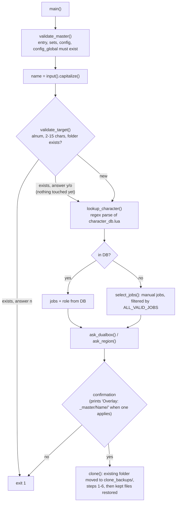

# Characters, templates and the clone system

The job files GearSwap loads live in one folder per character (`data/Tetsouo/`, `data/Kaories/`, ...). Those folders are gitignored. The source they are built from is `_master/`: generic templates (tracked) plus one optional overlay folder per character (`_master/<Name>/`, on disk only, gitignored since 2026-09-27). `clone_character.py` builds a live folder from `_master/`. It is an interactive Python script, launched by `CLONE_CHARACTER.bat`, and it runs outside the game. It reads the character roster from `character_db.lua` with a regex; GearSwap never reads `character_db.lua`.

In game, every job file resolves inside `data/<player.name>/`, `data/shared/` or GearSwap's `libs/`, with one exception: a character that became main with `//gs c main` and has no `config/alt/` reads its alt command tables from `_master/config/alt/` (`load_job_config` in `shared/utils/dualbox/alt_commands.lua`).

This page covers how a live folder is built, how it drifts from its templates, and how to add a character or deploy a template change safely. Verified against the code on 2026-09-28: `clone_character.py` (version 4.1.0, 1047 lines), `CLONE_CHARACTER.bat` (67), `character_db.lua` (226), `.gitignore` (130), the entry templates. Functions are cited by name; line numbers only where a function name would not locate the spot.

## Files

| Path | Tracked | Role |
|---|---|---|
| `clone_character.py` | yes | Interactive cloner: DB lookup, job/role/region prompts, copy + overlay + rename, generates `DUALBOX_CONFIG.lua` and `REGION_CONFIG.lua`, keeps the files written in game across a re-clone |
| `CLONE_CHARACTER.bat` | yes | Windows launcher: checks `python`, maps a bare `fr`/`en` first argument to `--lang`, passes the rest through |
| `character_db.lua` | yes | Roster: character -> jobs + role, archive list, all-jobs list, and a Lua query API that nothing calls |
| `scripts/check_overlay.py` | yes | Lists the differences between a live folder and its overlay |
| `scripts/check_syntax.py` | yes | `luac`-parses every Lua file, live folders included |
| `.gitignore` | no (ignores itself, line 78) | Ignores the live folders and, through the same patterns, the overlays |
| `_master/entry/Tetsouo_<JOB>.lua` | yes, 17 files | Generic entry templates: BLM BLU BRD BST COR DNC DRK GEO PLD PUP RDM RUN SAM SMN THF WAR WHM (SMN since 2026-09-28) |
| `_master/sets/<job>_sets.lua` | yes, 17 files | Generic flat set files, same 17 jobs (`pup_sets.lua` is a skeleton) |
| `_master/config/<job>/` | yes, 16 dirs | Per-job configs (KEYBINDS, STATES, LOCKSTYLE, MACROBOOK, TP_CONFIG, `<JOB>_CUSTOM.lua`, job extras). No `pup/` |
| `_master/config/alt/` | yes, 33 files | Dual-box alt command tables (22 `_ALT_COMMANDS`, 5 `_ALT_CUSTOM`, 6 `.lua.example`). Deployed only to a character cloned as MAIN |
| `_master/config_global/` | yes, 14 files | `AUTO_ABILITIES`, `COMMON_KEYBINDS`, `CRAFT_CONFIG`, `DW_CONFIG`, `ELEMENTAL_BELT`, `LOCKSTYLE_CONFIG`, `message_modes`, `RECAST_CONFIG`, `REFILL_CONFIG`, `STEALTH_CONFIG`, `UI_COLOR_CONFIG`, `UI_CONFIG`, `ui_settings`, `WEAPON_CONFIG` |
| `_master/Tetsouo/` | no, 78 files | Tetsouo overlay: 9 entries (BLM BRD BST COR DNC PLD SMN THF WAR, with the modular set include), `config/<job>/` for those jobs plus `config/craft/`, `config_global/{DUALBOX_CONFIG,REGION_CONFIG,UI_CONFIG,WARDROBE_CONFIG}.lua`, the modular sets `sets/<job>/`, `sets/common/`, `sets/{bonecraft,fishing}_sets.lua` |
| `_master/Kaories/` | no, 38 files | Kaories overlay: 4 entries (COR GEO PLD RDM), 4 flat set files, `config/{cor,geo,pld,rdm}/`, `config_global/{combat_mode,COMMON_KEYBINDS,DUALBOX_CONFIG,REGION_CONFIG,WARDROBE_CONFIG}.lua` |
| `_master/Gabvanstronger/` | no, 23 files | No entries (the generic ones are used), `config/{blu,rdm,thf}/`, `config_global/{AUTO_ABILITIES,combat_mode,COMMON_KEYBINDS,WEAPON_CONFIG}.lua`, flat sets + `sets/0_AugGear_Gabvanstronger.lua` |
| `_master/Blodykiller/` | no, 19 files | No entries, `config/{brd,cor}/`, same four `config_global` files, flat sets + `sets/0_AugGear_Blodykiller.lua` |
| `Tetsouo/` (live) | no | MAIN, 9 jobs incl. SMN, modular sets |
| `Kaories/` (live) | no | ALT, 4 jobs (COR GEO PLD RDM), flat sets |
| `Hysoka/`, `Gabvanstronger/` (live) | no | Frozen one-shot clones; not to be modified without the owner's approval |

Tracked `_master/` totals 197 files (`git ls-files _master`): `config/` 152, `config_global/` 13, `entry/` 16, `sets/` 16.

## Folder model

A character exists in up to four places:

1. **Generic templates**: `_master/entry`, `_master/sets`, `_master/config/<job>`, `_master/config/alt`, `_master/config_global`. The entry templates are written for a character named `Tetsouo`. They load their configs through paths that contain the name, such as `pcall(require, 'Tetsouo/config/LOCKSTYLE_CONFIG')`, `require('Tetsouo/config/pld/PLD_STATES')` and `ConfigLoader.load_ui_config('Tetsouo', 'PLD')` (`_master/entry/Tetsouo_PLD.lua:37`, `:171`, `:50`).
2. **Overlay** `_master/<Name>/`: files with the same relative path as a generic file replace it during a clone, and files with no generic counterpart are added. An overlay is used to build the character it belongs to, or for any target when `--source <Name>` names it (see [Source selection](#source-selection)). It can hold a modular set tree `sets/<job>/`, which then replaces the generic flat `sets/<job>_sets.lua`, plus `sets/common/` and loose set files. An overlay may omit `entry/`: the generic entry is then used and renamed.
3. **Live folder** `data/<Name>/`: what GearSwap loads. Gitignored.
4. **Runtime-written files** inside the live folder, written by in-game commands: `config/ui_settings.lua` (HUD position), `config/message_modes.lua`, `config/WARP_ITEMS_OWNED.lua`, `config/dualbox_role.lua`, `config/alt_state.lua`, `config/alt_window.lua`, `config/combat_mode.lua`, `config/treasure_mode.lua`, `config/STEALTH_CONFIG.lua`, `config/<job>/<JOB>_HUD.lua` (HUD row order), `temp_binds.lua`, and the trace files (`trace.log`, `trace.on`).

Since 2026-09-27 the overlays are no longer published: the `.gitignore` patterns for the live folders (`Tetsouo/`, `Kaories/`, `Gabvanstronger/`, `Blodykiller/`, no leading slash) also match `_master/<Name>/`, and the negations that used to re-include them are gone (comment at `.gitignore:59-62`). Consequences: overlays have no version history (a mistake there is recovered only from a live folder or a `clone_backups/` copy), and `git status` never shows an overlay change. Until 2026-09-28 this also left a fresh clone of the repository with no SMN entry at all; SMN now has a generic template.

### How GearSwap finds a live folder

- On load and on every main-job change, the engine looks for the job file under the names `<player.name>_<JOB>.lua`, `<player.name>-<JOB>.lua` and a few others (`addons/GearSwap/refresh.lua:98-105`).
- `pathsearch()` tries these directories in order: `libs-dev/`, `libs/`, `data/<player.name>/`, `data/common/`, `data/`, then the `%APPDATA%` equivalents and finally Windower's `addons/libs/` (`refresh.lua:693-703`). So `data/Kaories/Kaories_COR.lua` is found for Kaories on COR.
- `require` inside the sandbox is `include_user` (`refresh.lua:132`). It lowercases the path (`user_functions.lua:305`), searches the same directories, and raises `Cannot find the include file` when nothing matches.
- Consequence: `require('Tetsouo/config/...')` resolves through `data/` to `data/Tetsouo/config/...` whoever is logged in. A character name left unsubstituted in a require path does not fail on this machine: it silently loads the other character's file, and it fails only on a machine where that folder does not exist. The same resolution is what lets `require('_master/config/alt/...')` work.
- Relative paths resolve against the logged-in character's folder: `include('../shared/utils/core/INIT_SYSTEMS.lua')`, `include('sets/pld_sets.lua')`, `require('config/AUTO_ABILITIES')`. The lockstyle and macrobook factories use `'config/<job>/<JOB>_LOCKSTYLE'` or build `player.name .. '/config/<job>/...'`.

### Tracked vs ignored

| Tracked (`git ls-files`) | Ignored (`.gitignore`) |
|---|---|
| `_master/{entry,sets,config,config_global}/**` (197 files) | live folders `Morphetrix/`, `Hysoka/`, `Gabvanstronger/`, `Blodykiller/`, `Typioni/`, `Kaories/`, `Tetsouo/` (lines 51-57), and through the same patterns every `_master/<Name>/` overlay |
| `character_db.lua`, `clone_character.py`, `CLONE_CHARACTER.bat`, `.markdownlint.json`, `README.md` | `.gitignore` itself (78), `data.code-workspace` (65), `.vscode/` (31), `CLAUDE.md` and `.claude/` (75-76, again 116), `notes/` (130) |
| `shared/**`, `docs/`, `scripts/check_syntax.py`, `scripts/check_overlay.py`, `scripts/item_db/`, `scripts/addon_patches/` (negations at 98-104) | the rest of `scripts/` (94, e.g. the local `scripts/audit/` harnesses), `scripts/item_db/out/` (102), `_dev/` (90), `export/` (43), `*.log`, `*.png`, debug exports (120-126) |

Lines 8-11 ignore `Tetsouo/jobs/`, `Tetsouo/utils/`, `Kaories/jobs/`, `Kaories/utils/` (junctions from an old migration). Neither live folder contains them any more, and lines 56-57 already cover them.

## How clone_character.py works

### Invocation

| Command | Effect |
|---|---|
| `CLONE_CHARACTER.bat` | `python clone_character.py` (FR prompts, source `Tetsouo`) |
| `CLONE_CHARACTER.bat en [--source X]` | `shift` then `python clone_character.py --lang en %1 %2 %3 %4`. The `shift` sits inside a parenthesised block, where `%1` has already been expanded, so the language code is passed twice (`--lang en en --source X`). The script ignores the extra word |
| `python clone_character.py --lang en` | English prompts (`main()`). Unknown languages fall back to `fr` |
| `python clone_character.py --source Kaories` | `TEMPLATE_NAME = 'Kaories'`, overlay `_master/Kaories/` for whatever target is typed |

The `.bat` checks `python --version` and always ends with `exit /b 0`, whatever the script returned.

### Control flow

```mermaid
flowchart TD
    A["main()"] --> B["validate_master()<br/>entry, sets, config, config_global must exist"]
    B --> C["name = input().capitalize()"]
    C --> D{"validate_target()<br/>alnum, 2-15 chars, folder exists?"}
    D -- "exists, answer y/o<br/>(nothing touched yet)" --> F["lookup_character()<br/>regex parse of character_db.lua"]
    D -- "exists, answer n" --> X["exit 1"]
    D -- "new" --> F
    F --> G{"in DB?"}
    G -- yes --> H["jobs + role from DB"]
    G -- no --> I["select_jobs(): manual jobs, filtered by ALL_VALID_JOBS"]
    H --> J["ask_dualbox() / ask_region()"]
    I --> J
    J --> K{"confirmation<br/>(prints 'Overlay: _master/Name/' when one applies)"}
    K -- no --> X
    K -- yes --> L["clone(): existing folder moved to clone_backups/,<br/>steps 1-6, then kept files restored"]
```

Nothing is deleted before the final confirmation. Answering `y`/`o` to "Replace it?" (`validate_target`) only records the answer. `clone()` runs only after a yes at the confirmation. Its first action moves an existing folder to `addons/GearSwap/clone_backups/<Name>_<YYYYmmdd-HHMMSS>/` (`_backup_existing`). That folder is outside `data/`, so GearSwap never loads it and the refill and wardrobe scanners never walk it. If the move fails, `clone()` returns before writing anything.

### The clone steps

`S` is `TEMPLATE_NAME` (`--source` or `Tetsouo`). `T` is the target name. The overlay is chosen at the start of `clone()` by `_select_overlay(T)`: `_master/S/` when `T` is `S` (case-insensitive) or `--source` was given; otherwise `_master/T/` when that folder exists; else none. Below, `O` is the selected overlay folder's name. "Overlay-first" means `_resolve_src()`: the overlay's file if an overlay is selected and that file exists, else the generic one.

| Step | Output | Source | Code |
|---|---|---|---|
| 1 | `<T>/sets/`, `<T>/config/` directories | - | `clone` |
| 2 | `<T>/T_<JOB>.lua` per selected job | `_master/O/entry/O_<JOB>.lua`, else `_master/entry/Tetsouo_<JOB>.lua`, else `[SKIP]` and a final `[WARN] No entry file for: <jobs> - these jobs will not load` | `find_entry_src` (nested in `clone`) |
| 3 | `<T>/sets/<job>/` tree or `<T>/sets/<job>_sets.lua` per selected job | the overlay's `sets/<job>/` tree when it exists (the modular tree wins over the generic flat file), else overlay-first on `sets/<job>_sets.lua`, else `[SKIP]`. Then, whatever the jobs, the overlay's `sets/common/` and every loose `sets/*.lua` (`bonecraft_sets.lua`, `fishing_sets.lua`, `0_AugGear_<Name>.lua`) | `clone` |
| 4a | `<T>/config/<job>/*.lua` per selected job | union of `*.lua` names in `_master/config/<job>/` and the overlay's `config/<job>/`, each overlay-first | `clone` |
| 4b | `<T>/config/craft/`, and `<T>/config/alt/` for a MAIN | same per-file rule over `config/craft` and `config/alt` (`shared_dirs`); `alt` only when the role answered is `main` | `clone` |
| 4c | `<T>/config/<file>.lua` | union of `*.lua` names in `_master/config_global/` and the overlay's `config_global/`, each overlay-first, flattened into `config/` | `clone` |
| 5 | in place | every `*.lua` under `<T>/`: see Name substitution | `_replace_references` |
| 6 | `<T>/config/DUALBOX_CONFIG.lua`, `<T>/config/REGION_CONFIG.lua` | generated from the answers, overwriting whatever step 4c copied | `_create_dualbox_config`, `_create_region_config` |
| 7 | the files matched by `KEPT_ON_RECLONE` | copied back from the backup folder of a re-clone (after step 5, so they keep their own names) | `_restore_kept_files` |

`KEPT_ON_RECLONE` is `config/{ui_settings,message_modes,alt_window,alt_state,WARP_ITEMS_OWNED,combat_mode,treasure_mode,STEALTH_CONFIG}.lua`, `config/*/*_HUD.lua` (glob) and `temp_binds.lua`. `config/dualbox_role.lua` is left out on purpose: step 6 writes `DUALBOX_CONFIG.lua` from the role asked for, and an old role file would silently override it.

Files are copied with `shutil.copy2` / `shutil.copytree`. `_copy` records every file that came from the generic layer (not from the overlay) in `_generic_files`. Step 5 rewrites a file only when its content changes. It uses `Path.write_text`, which on Windows writes CRLF line endings. Read or write errors are swallowed.

### Name substitution (step 5)

- Files from the target's own overlay (`O == T`) and not from the generic layer are skipped: they are written for that character already and may name its partner (`Tetsouo` in Kaories' `PLD_MACROBOOK.lua`).
- Every other `.lua` file: plain substring replacement of `S` by `T`. This covers the require paths and `load_ui_config('Tetsouo', ...)` in entries, which is the part that matters. It also rewrites `@file` headers and comments.
- Files copied from the generic layer additionally get `Tetsouo` replaced when `S` is not `Tetsouo`, except on `@author` lines. Without it, a job with no overlay entry would keep `'Tetsouo/config/...'` paths and load Tetsouo's configs.
- The progress message always prints `Tetsouo >> T`, whatever `S` is.

Example: Gabvanstronger (default source, own overlay without `entry/`). The generic `Tetsouo_RDM.lua` is copied to `Gabvanstronger_RDM.lua` and its `Tetsouo` paths become `Gabvanstronger`; the overlay's `config/rdm/*.lua` are copied as they are.

### Generated files (step 6)

`DUALBOX_CONFIG.lua` (`_create_dualbox_config`) sets `role`, `character_name`, and `alt_character` (MAIN) or `main_character` (ALT), `enabled`, `timeout = 30`, `debug = false`, and the legacy aliases `main_name` / `alt_name`. When dual-boxing is enabled it also writes `DualBoxConfig.group = {"<char>", "<partner>"}`, which `//gs c main`, `//gs c alts` and `request_alt_job` use. `enabled` is true for an ALT, and for a MAIN only when a partner name was given. Partner names go through `str.capitalize()` (`ask_dualbox`). The partner's own `DUALBOX_CONFIG.lua` is not touched, so update it by hand. The reader is `DualBoxManager.initialize()`, see [dualbox.md](../systems/dualbox.md).

`REGION_CONFIG.lua` (`_create_region_config`) defines `characters = {[T] = region}`, `default_region`, `get_region`, `get_orange_code` (EU -> `002`, others -> `057`) and `get_orange_for_character`. The entries load it into `_G.RegionConfig` at file level, and `shared/utils/messages/message_colors.lua` (`region_config()` / `get_region_orange`) reads it each time the warning colour is used. The hand-written `Tetsouo/config/REGION_CONFIG.lua` (identical to `_master/Tetsouo/config_global/REGION_CONFIG.lua`) returns `003` for EU, and so does the `_G.DETECTED_FFXI_REGION` branch in `message_colors.lua`. Nothing assigns that global.

Because step 6 runs after step 4c, an overlay's `config_global/DUALBOX_CONFIG.lua` and `REGION_CONFIG.lua` (Tetsouo's and Kaories') are always replaced by the generated form. The comment above the global-config copy in `clone` says overlay DUALBOX and REGION files override the generic ones, which is only true until step 6.

### What the clone never copies

- Anything under an overlay that `_select_overlay` did not choose.
- `_master/config/alt/` for a character cloned as ALT (on purpose: an alt given the folder would send its own command names to the main).
- `*.lua.example` files (every glob is `*.lua`); the live `Tetsouo/config/alt/*.lua.example` were copied by hand.
- Any job with no entry in the generic layer or the chosen overlay: none today. A DB job with no entry gets the `[WARN] No entry file` line. (SMN was in this case outside the Tetsouo overlay until it got a generic template on 2026-09-28; PUP was left out of `ALL_VALID_JOBS` until its rewrite on 2026-09-29 gave it `_master/config/pup/`.)

### Source selection

Without `--source`, `S = 'Tetsouo'`. `_select_overlay(T)`:

| Invocation | Target | Overlay used |
|---|---|---|
| default source | `Tetsouo` | `_master/Tetsouo/` (his entries with modular sets, including his own SMN copy, refill lists, wardrobe config, craft files) |
| default source | a name with its own `_master/<Name>/` (`Kaories`, `Gabvanstronger`, `Blodykiller`) | that folder |
| default source | any other name | none: generic `_master/` files only |
| `--source Kaories` | any name | `_master/Kaories/` |

- A new character cloned with the default source and no overlay gets no `WARDROBE_CONFIG.lua` and no `<JOB>_REFILL.lua` files, because `_master/config_global/` and `_master/config/<job>/` have none. The wardrobe organizer then runs on its defaults (`shared/utils/wardrobe/lib/config.lua`) and refill uses its fallback list.
- Building Kaories with `--source Kaories` and without it gives the same folder except the `@author` lines of generic files.

## character_db.lua

Data:

| Table | Content |
|---|---|
| `CHARACTERS` | `Tetsouo = { jobs = {BLM, BRD, BST, COR, DNC, PLD, SMN, THF, WAR}, role = 'main' }`, `Kaories = { jobs = {RDM, COR, GEO, PLD}, role = 'alt' }`, `Gabvanstronger = { jobs = {RDM, THF, BLU}, role = 'main' }`, `Blodykiller = { jobs = {BRD, COR}, role = 'alt' }`. The comment above the last two says a job is listed only once its overlay exists, since a job without one would get the template's (Tetsouo's) gear |
| `ARCHIVE_JOBS` | DRK, PUP, RUN: no active owner. Their templates remain under `_master/` |
| `MASTER` | `sets_dir = '_master/sets'`, `config_dir = '_master/config'` |
| `ALL_JOBS` | 17 codes: BLM BLU BRD BST COR DNC DRK GEO PLD PUP RDM RUN SAM SMN THF WAR WHM |

Public API. Every function has **zero callers** in `shared/`, `_master/` and the root scripts. The Python script does not load the module; it regex-parses the file.

| Function | Returns | Notes |
|---|---|---|
| `get_jobs(name)` | job list or nil | case-insensitive; raises on a nil name |
| `get_role(name)` | `'main'`/`'alt'`/nil | case-insensitive |
| `has_job(name, job)` | boolean | |
| `get_owner(job)` | first owner found, `'_archive'`, or nil | for a job with several owners (COR, BRD, PLD, RDM, THF) the result depends on `pairs()` order (`get_owner('COR')` returns `Blodykiller` under lua5.1 today) |
| `get_archive_jobs()`, `get_character_names()`, `get_all()`, `get_all_jobs()`, `get_master_paths()` | raw tables / list of names | |
| `validate()` | `true, 'OK - all 17 jobs assigned'` (count from `ALL_JOBS`) or `false, msg` | Checks that no archived job has an owner and that every job in `ALL_JOBS` is owned or archived. **Fails today**: `false, 'SAM is not assigned to any character or _archive'` (SAM and WHM have no owner). Nothing runs it. Its doc says a second owner needs an overlay, but it does not check for one; its success message still says 16 |

What `clone_character.py` actually reads (`parse_character_db`):

- The regex `([A-Z][a-z]\w*)\s*=\s*\{[^}]*jobs\s*=\s*\{([^}]*)\}[^}]*role\s*=\s*['"](\w+)['"]` (DOTALL). A block is recognised only if its name starts with one uppercase letter followed by a lowercase one, `jobs` comes before `role`, and no `}` appears between `jobs = {...}` and `role`. `ARCHIVE_JOBS`, `ALL_JOBS` and `MASTER` are ignored.
- DB jobs are used as-is (`lookup_character`). Manual entry is filtered by the script's own `ALL_VALID_JOBS`: 16 codes (BLM BLU BRD BST COR DNC DRK GEO PLD RDM RUN SAM SMN THF WAR WHM), no PUP. SMN was added on 2026-09-28.
- The header example at `character_db.lua:9` (`{'RDM','COR','GEO'}`) predates PLD being added to Kaories, and the header's "16 jobs" counts predate BLU.

## Per-character files read at runtime

| File under `data/<Name>/` | Reader | Deployed by clone | Runtime writer |
|---|---|---|---|
| `<Name>_<JOB>.lua` | GearSwap `load_user_files` (`refresh.lua:98-105`) | step 2 | - |
| `sets/<job>_sets.lua` or `sets/<job>/...` + `sets/common/` | entry `init_gear_sets()` | step 3 | - |
| `config/<job>/<JOB>_STATES/_KEYBINDS/_TP_CONFIG/...` | entries (`user_setup`, `get_sets`) | step 4a | - |
| `config/<job>/<JOB>_CUSTOM.lua` | `KeybindManager` / custom states, see [keybinds-and-custom.md](../systems/keybinds-and-custom.md) | step 4a | - |
| `config/<job>/<JOB>_LOCKSTYLE/_MACROBOOK` | LockstyleManager / MacrobookManager factories, see [factories-and-helpers.md](../systems/factories-and-helpers.md) | step 4a | - |
| `config/<job>/<JOB>_HUD.lua` | `shared/utils/ui/hud_job_config.lua` | - | `//gs c ui roworder`; kept on re-clone |
| `config/<job>/<JOB>_REFILL.lua` | `resolve_list_for_player` (`shared/utils/inventory/refill/config_resolver.lua`) | step 4a, when an overlay or template has it | - |
| `config/whm/WHM_CURE_CONFIG.lua` | `shared/utils/whm/cure_manager.lua` | step 4a | - |
| `config/LOCKSTYLE_CONFIG.lua`, `RECAST_CONFIG.lua` | entries (file level / `get_sets`) | step 4c | - |
| `config/COMMON_KEYBINDS.lua` | `shared/utils/keybinds/common_keybinds.lua` | step 4c | - |
| `config/UI_CONFIG.lua` | `ConfigLoader.load_ui_config` (dofile) | step 4c | - |
| `config/UI_COLOR_CONFIG.lua` | `shared/utils/ui/COLOR_SYSTEM.lua` | step 4c | - |
| `config/ui_settings.lua` | `shared/config/ui_settings.lua` | step 4c; kept on re-clone | same module |
| `config/message_modes.lua` | `shared/config/message_settings.lua` | step 4c; kept on re-clone | same module |
| `config/AUTO_ABILITIES.lua` | `AutoOptions.on` (`shared/utils/core/auto_options.lua`) | step 4c | - |
| `config/DW_CONFIG.lua` | `shared/utils/equipment/dual_wield.lua` | step 4c | - |
| `config/ELEMENTAL_BELT.lua` | `shared/utils/equipment/elemental_belt.lua` | step 4c | - |
| `config/WEAPON_CONFIG.lua` | `shared/utils/equipment/weapon_resolver.lua`, BLU `set_builder.lua` | step 4c | - |
| `config/STEALTH_CONFIG.lua` | `shared/utils/stealth/stealth_config.lua` | step 4c; kept on re-clone | `//gs c stealth ...` |
| `config/combat_mode.lua`, `config/treasure_mode.lua` | `combat_mode.lua`, `treasure_hunter.lua` (through `optional_state.lua`) | overlay only (`combat_mode`); kept on re-clone | `//gs c combatmode`, `//gs c th` |
| `config/WARDROBE_CONFIG.lua` | `Config.refresh` in `shared/utils/wardrobe/lib/config.lua` | step 4c (overlay only) | - |
| `config/CRAFT_CONFIG.lua` (craft / fish set files, lockstyles 19 / 17) | `shared/utils/craft/craft_commands.lua` | step 4c | - |
| `config/REFILL_CONFIG.lua` (refill bags) | `shared/utils/inventory/refill/config_resolver.lua` | step 4c | - |
| `config/craft/CRAFT_REFILL.lua` (template: empty list) | `config_resolver.lua` | step 4 | Tetsouo's |
| `sets/craft_sets.lua` and the overlay's loose set files | `craft_commands.lua` | step 3 | Tetsouo's `bonecraft_sets.lua`, `fishing_sets.lua`; Gab's `goldsmithing_sets.lua` |
| `config/DUALBOX_CONFIG.lua` | `DualBoxManager.initialize` | step 6 (generated) | - |
| `config/REGION_CONFIG.lua` | entries, `message_colors.lua` | step 6 (generated) | - |
| `config/alt/<JOB>_ALT_COMMANDS.lua`, `<JOB>_ALT_CUSTOM.lua` | `load_job_config` in `alt_commands.lua` (MAIN only, `_master/config/alt/` as fallback) | step 4b, MAIN only | - |
| `config/craft/CRAFT_REFILL.lua` | `config_resolver.lua` | step 4b | - |
| `sets/<craft>_sets.lua` | `shared/utils/craft/craft_manager.lua` | step 3 (loose overlay sets) | - |
| `config/WARP_ITEMS_OWNED.lua` | `WarpOwned.load` (`shared/utils/wardrobe/lib/warp_owned.lua`) | kept on re-clone | `//gs c wo scan`, `WarpOwned.save` |
| `config/dualbox_role.lua` | `DualBoxRole.apply_saved` | never (deliberately not kept) | `//gs c main` on either box |
| `config/alt_state.lua`, `config/alt_window.lua` | `alt_group.lua`, `alt_window.lua` | kept on re-clone | `//gs c alts ...`, window drag / toggle |
| `temp_binds.lua` | `shared/utils/keybinds/temp_binds.lua` | kept on re-clone | `//gs c tb` |

When `player` is nil, nine shared modules fall back to the name `'Tetsouo'` (`grep -rln "or 'Tetsouo'\|or \"Tetsouo\"" shared`), including `ui_settings.lua`, `message_settings.lua`, `dualbox_manager.lua` and `alt_commands.lua`.

`shared/utils/equipment/hp_priority.lua` processes only the characters of its own `CHARACTERS` table (Tetsouo, Kaories); others keep their sets as written.

## Live vs template divergence

Method: run the clone on a scratch copy (`SmartCharacterCloner(base_dir=...).clone(...)`), then `diff -rq --strip-trailing-cr` against the live folder, or run `python scripts/check_overlay.py <Name>`. The last full comparison (2026-09-25) found, besides header comments:

| Character | Only in live, or differs | Class |
|---|---|---|
| Tetsouo, Kaories | the runtime files of the folder model | runtime; kept by a re-clone except `dualbox_role.lua` and the trace files |
| Tetsouo | `config/alt/*.lua.example` (6) | live-only; the clone copies `*.lua` only |
| Tetsouo | `config/DUALBOX_CONFIG.lua`, `config/REGION_CONFIG.lua` | hand-written (identical to the overlay copies); a re-clone replaces them with the generated form, and REGION's EU code becomes `002` instead of `003` |
| Kaories | clone adds `config/CRAFT_CONFIG.lua`, `config/pld/PLD_CUSTOM.lua`, `config/pld/PLD_WS_CONFIG.lua` that the live folder lacks | stale live (missing templates; harmless defaults) |
| Kaories | `config/DUALBOX_CONFIG.lua` | hand-edited since generation; a re-clone regenerates it with `group` |

Every template added since (the `config_global` files `AUTO_ABILITIES`, `DW_CONFIG`, `ELEMENTAL_BELT`, `STEALTH_CONFIG`, `WEAPON_CONFIG`) reaches a live folder only through a re-clone or a manual copy; each reader falls back to defaults when the file is missing.

The Kaories overlay duplicates the generic templates for most files of `_master/Kaories/config/`: every template edit has to be made twice, or Kaories's next redeploy gets the old copy.

## How to deploy a template change

Single file (recommended):

1. Edit the template under `_master/` and commit it.
2. Find every live copy: `Tetsouo/`, `Kaories/`, and any overlay copy of the same file under `_master/<Name>/` (untracked: nothing reminds you).
3. Config and set files contain the character name only in comments, so copy them as they are: `cp _master/config/pld/PLD_STATES.lua Kaories/config/pld/PLD_STATES.lua`.
4. Entry files need the paths rewritten and the header left alone. For example: `sed "s#'Tetsouo/#'Kaories/#g; s#('Tetsouo', #('Kaories', #" _master/entry/Tetsouo_PLD.lua > Kaories/Kaories_PLD.lua`. For Tetsouo, edit `_master/Tetsouo/entry/` (it carries the modular include) and copy that.
5. `luac5.1 -p` the result, then in game: `//lua r gearswap`, `//gs c checksets`.

Full redeploy (`clone_character.py` on an existing character):

1. The script moves the old folder to `addons/GearSwap/clone_backups/<Name>_<date>/` after the final confirmation. Keep that backup until the new folder has been checked in game. A copy you make yourself must stay outside `data/`: a folder inside `data/` with a capitalised name is scanned by the refill foreign-item pass (`load_all_refill_configs` in `config_resolver.lua`).
2. Save every live-only file you want into `_master/<Name>/` first, or be ready to restore it from the backup.
3. Check the `Overlay:` line of the confirmation screen. Pass `--source <Name>` only to build a character from another character's overlay.
4. Afterwards: the `KEPT_ON_RECLONE` files come back on their own. Restore by hand only `dualbox_role.lua` if a runtime role switch should survive, the `.lua.example` files, and a hand-written `DUALBOX_CONFIG.lua` / `REGION_CONFIG.lua`.

## How to add a character

1. Add a block to `CHARACTERS` in `character_db.lua` in exactly this shape: `Name = { jobs = { 'WAR', 'PLD' }, role = 'main' },`, with `jobs` before `role` and no nested braces. If a job is also in `ARCHIVE_JOBS`, move it out.
2. Optional: create `_master/<Name>/` with the same layout (`entry/<Name>_<JOB>.lua`, `sets/<job>_sets.lua` or `sets/<job>/`, `config/<job>/`, `config_global/`). Without `entry/`, the generic entries are used and renamed. It is picked up automatically when the target is `<Name>`.
3. Run `CLONE_CHARACTER.bat`. Answer the role, partner and region prompts.
4. Dual-box: a MAIN gets `config/alt/` from the clone; edit the partner's `config/DUALBOX_CONFIG.lua` (`alt_character` / `main_character` and `group`) to name the new character. Add the character to `CHARACTERS` in `shared/utils/equipment/hp_priority.lua` if its gear should get automatic HP priorities.
5. A character created without an overlay gets no `WARDROBE_CONFIG.lua` (organizer defaults) and no refill lists. Add them by hand, or save them in `_master/<Name>/` and re-clone.
6. In game: `//lua r gearswap`, `//gs c checksets`, and `//gs c wo scan` if the warp-item list is wanted.

## How to add a job to the templates

1. `_master/entry/Tetsouo_<JOB>.lua`: copy a similar job and keep the `'Tetsouo/config/...'` path convention so step 5 can substitute it. Require `config_loader` first among shared modules (it installs the require cache) and include INIT_SYSTEMS right after Mote-Include; see [core-lifecycle.md](../systems/core-lifecycle.md#how-a-job-file-boots).
2. `_master/sets/<job>_sets.lua` (flat) and `_master/config/<job>/`, with **every** file the entry `require`s without `pcall`. The PUP entry requires `pup/PUP_PET_DATA`, `PUP_TP_CONFIG` and `PUP_STATES`, and none of them exists.
3. Add the code to `ALL_VALID_JOBS` in `clone_character.py` and to `ALL_JOBS` / a character / `ARCHIVE_JOBS` in `character_db.lua`.
4. Add the shared modules under `shared/jobs/<job>/` (see [core-lifecycle.md](../systems/core-lifecycle.md) and [job-change-lifecycle.md](./job-change-lifecycle.md)).

## Interactions

- [dualbox.md](../systems/dualbox.md): reads the generated `DUALBOX_CONFIG.lua`, `config/alt/` (with `_master/config/alt/` as fallback) and the runtime role, state and window files.
- [equipment-and-inventory.md](../systems/equipment-and-inventory.md): refill reads `<JOB>_REFILL.lua`, `config/craft/CRAFT_REFILL.lua` and every capitalised top-level folder under `data/`; HP priority lists the characters it processes.
- [wardrobe-organizer.md](../systems/wardrobe-organizer.md): reads `WARDROBE_CONFIG.lua` and writes `WARP_ITEMS_OWNED.lua`.
- [ui-overlay.md](../systems/ui-overlay.md) and [messages.md](../systems/messages.md): read `UI_CONFIG`, `ui_settings`, `UI_COLOR_CONFIG`, `message_modes` and `REGION_CONFIG`.
- [keybinds-and-custom.md](../systems/keybinds-and-custom.md): `COMMON_KEYBINDS.lua`, `<JOB>_CUSTOM.lua`, `temp_binds.lua`, `combat_mode.lua`.
- [factories-and-helpers.md](../systems/factories-and-helpers.md): the lockstyle and macrobook factories read `config/<job>/`.
- [job-change-lifecycle.md](./job-change-lifecycle.md): what the entry templates do on load and unload.

## Invariants and gotchas

- The live folder name, the file prefix and the in-game character name must match exactly (`refresh.lua:101`). The script capitalises the typed name.
- A hard-coded character name in a `require` path resolves through `data/` for any logged-in character. Wrong names fail silently on the author's machine and loudly elsewhere.
- Answering `y` or `o` to "Replace it?" deletes nothing. The folder is moved to `addons/GearSwap/clone_backups/` only after the final confirmation. There is still no dry run.
- Step 6 always overwrites `DUALBOX_CONFIG.lua` and `REGION_CONFIG.lua`. A copy of them in an overlay has no effect.
- `ALL_VALID_JOBS` (Python, 16) and `ALL_JOBS` (Lua, 17) are separate lists. DB jobs skip the Python list.
- Overlays are untracked: back them up yourself before editing, and remember that `git diff` never shows them.
- The refill foreign-item scan loads `*_REFILL.lua` from every top-level `data/` entry whose name starts with an uppercase letter. A new character, or a backup folder inside `data/`, joins it.
- `.gitignore` ignores itself, so a fresh clone of the public repository has no ignore rules for live folders (by design, per its comment).

## For maintainers / AI

- **Never edit a live folder to fix a template bug.** Fix `_master/` (tracked) and then propagate by hand or by re-clone. The frozen clones (`Hysoka/`, the live `Gabvanstronger/`) are not to be touched without the owner's approval.
- **ripgrep and the Grep tool skip gitignored folders**: `Tetsouo/`, `Kaories/`, `Hysoka/`, `Gabvanstronger/`, `Blodykiller/` and every `_master/<Name>/` overlay are invisible to them. Any "no caller" or "no copy" claim that must cover those folders needs `grep -r` (or `rg -uu`).
- **Test the cloner offline**: `SmartCharacterCloner(base_dir=<scratch copy of data>, source_name=None).clone(name, jobs, {'role': 'main', 'character_name': name, 'enabled': False}, 'US')` on a copy of `_master/` + `character_db.lua` in a scratch directory; never on `data/` itself. Compare with `diff -rq --strip-trailing-cr`.
- **Test the Lua side offline**: `lua5.1 -e "package.path='./?.lua;'..package.path; local D=require('character_db'); print(D.validate())"` from `data/`; `luac5.1 -p _master/entry/*.lua` for the templates; `python scripts/check_syntax.py` for everything.
- **Invariant**: any file an entry `require`s without `pcall` must exist in `_master/config/<job>/` or `_master/config_global/`, or the job does not load for a cloned character (PUP was the example until 2026-09-29).

## Known issues

Open:

- Fixed 2026-09-28: `CharDB.validate()` returned `false` (SAM and WHM were neither owned nor archived; they are now in `ARCHIVE_JOBS`) and its message said 16 jobs (now counted). Nothing runs it.
- The `character_db.lua` Lua API has no callers, and `validate()` does not check what its doc claims.
- The overlays are untracked since 2026-09-27: no history.
- The overlay `DUALBOX_CONFIG`/`REGION_CONFIG` are always overwritten, contrary to the comment above the global-config copy in `clone`.
- The PUP entry template requires config files that `_master` never shipped: `_master/entry/Tetsouo_PUP.lua:70`.
- The PUP template still sends the job from `job_sub_job_change` (the BST template no longer does).
- Kaories live lacks `config/CRAFT_CONFIG.lua`, `config/pld/PLD_CUSTOM.lua`, `PLD_WS_CONFIG.lua` and the newer `config_global` files that a re-clone would add.
- The Kaories overlay duplicates the generic templates line for line: `_master/Kaories/config/`.
- The overlays of Gabvanstronger and Blodykiller keep `@author Tetsouo` in their config headers (the project rule is `@author ejouanchicot`).
- `.gitignore` does not cover `wardrobe_scan_*.txt` (written by `shared/utils/wardrobe/lib/reports.lua`), and lines 8-11 are dead.
- The user docs misdescribe the clone (`docs/user/getting-started/installation.md`, `README.md`, `docs/user/guides/dualbox.md`).

Fixed:

- Re-clone did not deploy `config/alt`, craft files or Tetsouo's modular sets: step 3 copies the overlay's `sets/<job>/`, `sets/common/` and loose sets, and step 4b copies `config/craft/` and, for a MAIN, `config/alt/`.
- `--source <Name>` left `Tetsouo` require paths in files taken from the generic layer: `_replace_references` now also replaces `Tetsouo` in generic files (not on `@author` lines).
- The default source ignored an existing `_master/<target>/` overlay: `_select_overlay` now uses it.
- A re-clone reset the HUD position and lost the files written in game: `KEPT_ON_RECLONE`.
- A clone never generated `DualBoxConfig.group`.
- PUP was offered by the manual job list although it could not load; a DB job with no entry was skipped silently: PUP out of `ALL_VALID_JOBS` (back in since the PUP rewrite, 2026-09-29), `[WARN] No entry file`.
- The overlay in use was invisible at the confirmation.
- SMN had no generic template (a clone to any other character without `--source Tetsouo` printed `[WARN] No entry file for: SMN`) and no copy in the repository: `_master/entry/Tetsouo_SMN.lua`, `_master/config/smn/`, `_master/sets/smn_sets.lua` and SMN in `ALL_VALID_JOBS` (2026-09-28). The Tetsouo overlay keeps its own copy with the modular set include.
- The generic BST entry ran a coroutine pet monitor that also wrote `state.Moving`: aligned on the Tetsouo overlay (raw `prerender` listener).
