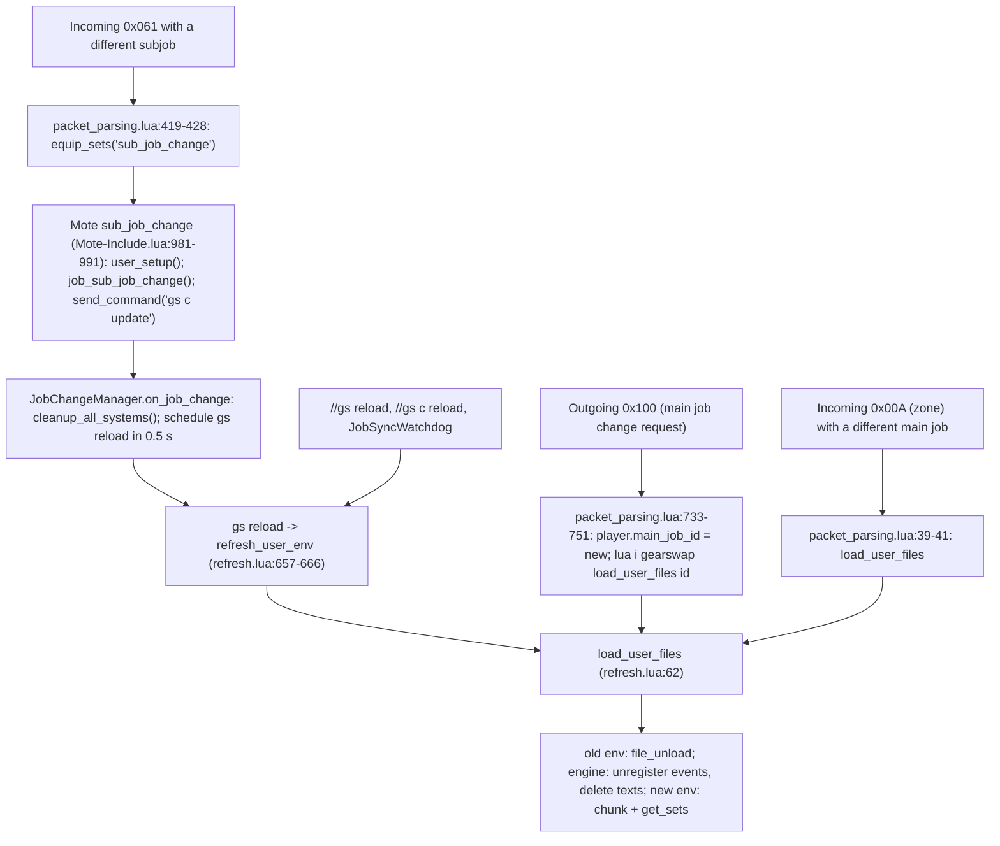
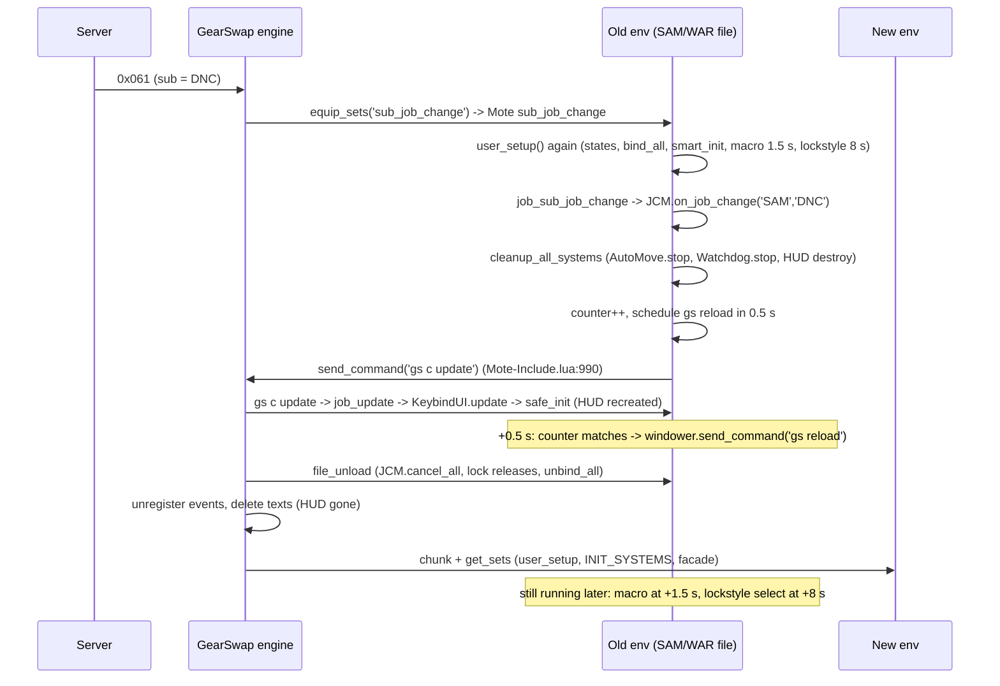

# Job / Subjob Change Lifecycle

Every job change, subjob change and `gs reload` in this project ends with GearSwap throwing away the whole Lua environment of the job file and building a new one from scratch. This page traces, in code, what runs on each of those transitions: which engine path fires, which project code runs in the dying environment and which in the new one, what state survives, what is rebuilt, and what keeps running from the dead environment. It covers the engine (`addons/GearSwap/*.lua`, `libs/Mote-Include.lua`), the 15 template entry files `_master/entry/Tetsouo_*.lua` (plus the Tetsouo overlay entries), and the shared systems that take part: `JobChangeManager`, `JobSyncWatchdog`, `INIT_SYSTEMS`, `ModuleCache`, `KeybindGuard`, the lockstyle and macrobook factories, the keybind UI, AutoMove, the midcast watchdog, dual-box, craft mode, the wardrobe organizer and `DoomManager`.

Engine paths below are relative to `D:\Windower Tetsouo\addons\GearSwap\` and marked *(engine)*. Everything else is relative to the repo root (`addons/GearSwap/data`). Project line numbers were re-read on 2026-09-25, after that day's uncommitted fixes (`JobChangeManager.initialize({...})` removed from `job_sub_job_change`, the COR DressUp watchdog and "force re-equip" removed, `file_unload` weapon releases for BLM/WHM, the HUD live-state guard, `REGION_CONFIG` moved before `config_loader` in COR/SAM); where a line adds nothing the function is named.

## Files

| Path | Lines | Role |
|---|---|---|
| *(engine)* `refresh.lua` | 728 | `load_user_files()` tears down and rebuilds the user environment; `refresh_user_env()` backs `gs reload` |
| *(engine)* `packet_parsing.lua` | 779 | Detects main job change (outgoing 0x100), subjob change (incoming 0x061), job change on zone (0x00A) |
| *(engine)* `gearswap.lua` | 335 | `gs reload`, `load`/`login`/`unload` events, `status change` filter |
| *(engine)* `user_functions.lua` | 423 | Sandboxed `windower` table, tracked `register_event`, `enable`/`disable` |
| *(engine)* `flow.lua` | 431 | `equip_sets()`, `user_pcall2()` used for `file_unload` |
| *(engine)* `libs/Mote-Include.lua` | 1125 | `init_include()` (runs `user_setup`), `sub_job_change()` |
| `_master/entry/Tetsouo_*.lua` (15) | 219-450 | Entry points: `get_sets`, `user_setup`, `job_sub_job_change`, `file_unload` |
| `shared/utils/core/job_change_manager.lua` | 235 | Debounced subjob change: cleanup, then `gs reload` |
| `shared/utils/core/job_sync_watchdog.lua` | 165 | Reloads when the loaded file's job differs from the client's job |
| `shared/utils/core/INIT_SYSTEMS.lua` | 344 | Per-load bootstrap of the universal systems (sync and deferred) |
| `shared/utils/core/keybind_guard.lua` | - | Re-sends the job's binds 2 s after a load, sequence-guarded on `windower._keybind_guard_seq` |
| `shared/utils/core/module_cache.lua` | 106 | Makes `require` cache per environment |
| `shared/utils/core/lifecycle_manager.lua` | 108 | Shared builders for `job_status_change`/`job_buff_change`/`job_aftercast`/`job_state_change` |
| `shared/utils/core/midcast_watchdog.lua` | 479 | 0.5 s polling loop that clears stuck midcasts, generation-guarded on `windower._midcast_wd_seq` |
| `shared/utils/movement/automove.lua` | 383 | Movement polling loop, sequence-guarded on `windower._automove_seq` |
| `shared/utils/lockstyle/lockstyle_manager.lua` | 340 | Lockstyle factory (per-job ctx on `_G.__lockstyle_contexts`, DressUp handling) |
| `shared/utils/macrobook/macrobook_manager.lua` | 280 | Macrobook factory (solo/dual-box books) |
| `shared/jobs/<job>/functions/<JOB>_LOCKSTYLE.lua`, `<JOB>_MACROBOOK.lua` | 36-55 | Lazy wrappers that export `select_default_lockstyle`, `select_default_macro_book`, `cancel_<job>_lockstyle_operations` |
| `_master/config/<job>/<JOB>_KEYBINDS.lua` | 35-79 | Bind lists, turned into `bind_all`/`unbind_all`/`show_intro` by `KeybindManager.create` |
| `shared/utils/keybinds/keybind_manager.lua` | 302 | `bind_all` (unbind only what is no longer wanted, then bind), `show_intro` |
| `shared/utils/ui/UI_MANAGER.lua`, `ui_lifecycle.lua`, `ui_update_orchestrator.lua` | 167 / 200 / 277 | Keybind HUD state, `smart_init`, `destroy`, `update` |
| `shared/utils/dualbox/dualbox_manager.lua` | 524 | Job exchange between the boxes, auto-init 2 s after load |
| `shared/utils/dualbox/dualbox_sync_ipc.lua` | 159 | IPC mirror of `ls`/`rf` between instances |
| `shared/utils/dualbox/alt_buff_reporter.lua` | 336 | Alt reports tracked buffs to the main |
| `shared/utils/craft/craft_manager.lua`, `craft_commands.lua` | 200 / 302 | Craft/fish session and slot locks |
| `shared/utils/wardrobe/wardrobe_organizer.lua` | 739 | `//gs c wo` phase chain, `job_changed()` guard |
| `shared/utils/debuff/doom_manager.lua` | 157 | Doom gear + slot locks, death safety unlock |
| `shared/utils/warp/warp_init.lua` | 132 | Warp system bootstrap (called by INIT_SYSTEMS on every load) |
| `shared/utils/core/COMMON_COMMANDS.lua`, `DEBUG_COMMANDS.lua` | 750 / 580 | `reload`, `ls`, `craft`, `wo`, `alt*` handlers; debug toggles (`djc`, `debugupdate`) |
| `_master/config_global/LOCKSTYLE_CONFIG.lua` | 60 | `initial_load_delay` used by entries |

## The environment model

Understanding one fact makes the rest of this page readable: **a job file lives in a sandbox table (`user_env`) that GearSwap discards on every load, but nothing GearSwap does stops coroutines, and some engine state is not in the sandbox.**

`load_user_files(job_id)` *(engine)* `refresh.lua:62-184` does, in order:

1. `user_pcall2('file_unload', current_file)` (`refresh.lua:66`), a `pcall` that prints but swallows errors (`flow.lua:339-348`).
2. Unregisters every event id in `registered_user_events` (`refresh.lua:69-71`). Every `windower.register_event` / `raw_register_event` made from the sandbox goes through `register_event_user` / `raw_register_event_user`, which record the id there (`user_functions.lua:254-273`). GearSwap 0.704's changelog states the same (`version_history.txt:203`).
3. Deletes every text object and primitive created since load (`refresh.lua:73-79`; the registry is filled by the `windower.text.create` override in `gearswap.lua:55-84`). The keybind HUD and the alt window are `texts` objects, so they are always destroyed here.
4. Drops `user_env` and `sets` (`refresh.lua:81-86`), builds a new `user_env` (`refresh.lua:114-149`) whose `_G` is itself, whose `windower` is the shared `user_windower` table (`refresh.lua:118`, `user_functions.lua:418-423`), whose `coroutine` is the real Windower coroutine library (`refresh.lua:131`) and whose `gearswap` field is GearSwap's own `_G` (`refresh.lua:114`).
5. Runs the entry file chunk (`refresh.lua:168`) then `get_sets()` (`refresh.lua:180`).

Consequences used throughout this page:

- **Everything on `_G` dies with the environment.** `_G.X` in the new job file is a different table from `_G.X` in the previous one. Module-level `local` state dies too, and so does the require cache (`_G.__require_cache`, `module_cache.lua:54-57`).
- **Writes to `windower._x` survive** `gs reload` and job changes, because `user_windower` is created once per addon load (`user_functions.lua:418`) and only indexes the real `windower` through `__index`. They are reset only by `//lua reload gearswap`.
- **Listeners and HUD texts never outlive the environment that follows them**; the engine removes them at steps 2 and 3. A listener registered by a dead environment's coroutine *after* the next load is tracked and removed at the load after that.
- **Scheduled coroutines are never cancelled.** A closure scheduled by the old environment runs later against the old `_G`; the `send_command`, `player`, `enable`/`disable` it reaches are engine functions and objects, so they still act on the live game. Every coroutine must invalidate itself.
- **Slot locks are engine state.** `disable_table` (`statics.lua:194`) is not touched by `load_user_files`, and a main job change does not clear it either: the outgoing-0x100 enable-all (`packet_parsing.lua:755-757`) tests `newmain ~= player.main_job_id` after `:744` has already assigned it, so it only runs for a request whose main-job byte is 0. Only an explicit `enable` unlocks a slot. That is why several `file_unload`s now release their own locks (see Scenario 11).
- **`gearswap.user_env == _G` is true only in the live environment** (`refresh.lua:83`, `:114`, `:149`). The project uses an equivalent identity test instead: `UI_MANAGER.lua:124` stores the load's `_G.ui_manager_state` on `windower._ui_live_state`, and the delayed HUD inits compare against it (Scenario 3).
- **`equip()` outside an event does nothing.** `equip_sets()` empties `equip_list` on entry (`flow.lua:60`) and sends it on exit; an `equip()` from a bare `coroutine.schedule` callback fills `equip_list` and is discarded by the next event. Use `send_command('gs c update')`.
- **Keybinds are Windower-global.** Only an explicit `unbind` removes them.

## How it works

### Which engine path fires

| Trigger | `cleanup_all_systems()` (old env) | `file_unload` (old env) | Engine unregisters events / deletes texts | Engine re-enables all slots |
|---|---|---|---|---|
| Subjob change (0x061 -> JCM -> `gs reload`) | yes, `on_job_change` (`job_change_manager.lua:147`) | yes | yes | no |
| Main job change (0x100) | no | yes | yes | no (`:756` compares after `:744` assigned; see the environment model) |
| Zone-in on a different main job (0x00A) | no | yes | yes | no |
| `//gs reload`, `//gs c reload`, `JobSyncWatchdog` reload | no | yes | yes | no |
| `//lua reload gearswap` | no | yes (`gearswap.lua:146-150`) | whole addon state destroyed | n/a |

The subjob path is the only one that goes through `JobChangeManager`. A main job change is handled entirely by the engine and never reaches `on_job_change`.

### What a load runs (common to every path)

Order inside one load of `Tetsouo_PLD.lua` (all templates follow the same skeleton, differences are listed in [Per-job differences](#per-job-differences)):

1. **Chunk level** (`_master/entry/Tetsouo_PLD.lua:37-58`): `LOCKSTYLE_CONFIG` via `pcall(require)`, `ConfigLoader.load_ui_config('Tetsouo','PLD')` (`dofile` of `<char>/config/UI_CONFIG.lua`, `shared/utils/config/config_loader.lua:45-47`), `REGION_CONFIG` -> `_G.RegionConfig`. The region block has to run before anything loads `message_colors.lua`, which reads `_G.RegionConfig` once when it is first required; COR and SAM set it after `config_loader` until 2026-09-25, which left Kaories' COR with the wrong warning colour (fixed, game test pending: `//gs c trace on` on Kaories, load COR, `trace.log` should show the orange code 2).
2. **`get_sets()`** (`:63-135`):
   1. `include('Mote-Include.lua')` (`:69`) runs `init_include()` (`Mote-Include.lua:188`): Mote states, Mote-Globals default binds F9-F12 (`Mote-Include.lua:159`), then **`user_setup()`** (`Mote-Include.lua:170-171`), then `init_gear_sets()` (`:175`).
      - `user_setup()` (`Tetsouo_PLD.lua:164-236`): `_G.PLDWSConfig`, `PLDStates.configure()`; `require` of `PLD_KEYBINDS` and `bind_all()` (`:197`), which unbinds only the keys of the job's list that are no longer wanted, binds the subjob's subset (`clear_unwanted` / `lay_down` in `shared/utils/keybinds/keybind_manager.lua`) and calls `show_intro()`, which `require`s the job's `_MACROBOOK` and `_LOCKSTYLE` wrappers (`keybind_manager.lua:232-245`); `KeybindUI.smart_init('PLD', init_delay)` (`:214`); `JobChangeManager.initialize()` (`:223`); if `select_default_macro_book` and `select_default_lockstyle` exist, `select_default_macro_book()` and `coroutine.schedule(select_default_lockstyle, initial_load_delay)` (`:226-229`); `pcall(require, 'shared/utils/dualbox/dualbox_manager')` (`:235`).
   2. `include('../shared/utils/core/INIT_SYSTEMS.lua')` (`:71`), see [INIT_SYSTEMS](#init_systems-timeline).
   3. `data_loader`, the three message hook installers, `RECAST_CONFIG`, job configs (`:77-104`).
   4. `JobChangeManager.cancel_all()` (`:107-110`) - in a fresh environment this cancels nothing (see [Known issues](#known-issues)).
   5. The job facade `include('../shared/jobs/pld/functions/pld_functions.lua')` (`:113`), which defines the Mote hooks and the lockstyle/macrobook wrappers.
   6. `JobChangeManager.register_lockstyle_cancel('PLD', cancel_pld_lockstyle_operations)` (`:126`).

`user_setup()` therefore runs **before** `INIT_SYSTEMS` and before the job facade. Two consequences:

- `require` is not cached yet during `user_setup()` (the cache is installed near the top of `INIT_SYSTEMS.lua`, `:53-58`), so every module required there is executed again the first time it is required after `INIT_SYSTEMS`. State that must be shared between the two copies lives on `_G` (`_G.JobChangeManagerSTATE`, `_G.ui_manager_state`, ...).
- `select_default_macro_book` and `select_default_lockstyle` are defined by the facade (`shared/jobs/<job>/functions/<JOB>_MACROBOOK.lua`, `<JOB>_LOCKSTYLE.lua`), which has not been included yet. The gate in `user_setup` is satisfied only because `show_intro()` required those two wrapper files a few lines earlier and they define the globals as a side effect (the comment above `show_intro` says so). BRD, BST, PUP and RUN re-test the gate in a 0.2 s coroutine instead (their `user_setup`); COR has a second, guarded macrobook/lockstyle block after the first (`Tetsouo_COR.lua:303-320`).

#### INIT_SYSTEMS timeline

| When (after the `include`) | What | Where |
|---|---|---|
| sync | restore `UPDATE`, `AUTOMOVE`, `WARP`, `PRECAST`, `JOBCHANGE` debug flags from `windower._gs_debug` | `INIT_SYSTEMS.lua:35-41` |
| sync | `windower._gs_reload_count += 1` | `:44` |
| sync | `ModuleCache.install()` | `:53-58` |
| sync | `HPPriority.apply()` (priority = HP on the loaded sets) | `:65-70` |
| sync | LagDebugger load + `on_reload_complete` | `:78-87` |
| sync | `AutoMedicine.ensure()` | `:150-155` |
| sync | `JobSyncWatchdog.start(player.main_job)` | `:164-169` |
| sync | SyncIPC hooks `ls`, `lockstyle`, `rf`, `refill` + `init_listener()` | `:184-202` |
| sync (+2 s inside) | `KeybindGuard.schedule()`: re-sends the binds 2 s later unless a newer load bumped `windower._keybind_guard_seq` | `:275-280`, `keybind_guard.lua` |
| sync | `CustomStates.install_hooks()` (the player's `<JOB>_CUSTOM.lua` gear rules) | `:291-296` |
| +0.5 s | `WarpInit.init()`; `include` AutoMove + `AutoMove.start()` unless `_G.DISABLE_AUTOMOVE == true`; `StateDisplayOverride.init()` | `:208-257` |
| +2.0 s | `require` MidcastWatchdog, `_G.MidcastWatchdog`, `start()` | `:126-136` |
| +3.0 s | load check of PrecastGuard / CooldownChecker / WSPrecastHandler | `:315-327` |
| +5.0 s | `GlobalProbe.snapshot()` | `:339-344` |

No template sets `_G.DISABLE_AUTOMOVE` any more (removed for BST in commit 0563ff9), so AutoMove starts for every job.

#### Timeline after a load

| t | Event | Source |
|---|---|---|
| +0 | keys bound, HUD `smart_init`, `select_default_macro_book()` schedules `set_macro_page` at +1.5 s | `set_macro_with_delay`, `macrobook_manager.lua:97-110` |
| +0.5 | Warp, AutoMove, state display override | `INIT_SYSTEMS.lua:208-257` |
| +2 | dual-box auto-init (retries every 1 s, 8 attempts), alt window start | `run_auto_init`, `dualbox_manager.lua:469-518` |
| +2 | MidcastWatchdog loop starts; KeybindGuard re-sends the binds | `INIT_SYSTEMS.lua:126-136`, `keybind_guard.lua` |
| +8 | `select_default_lockstyle()` -> apply at +10: `lua unload dressup`, +0.3 `/lockstyleset`, +3 `lua load dressup` | `set_lockstyle_with_delay` / `apply_lockstyle_immediate`, `lockstyle_manager.lua:128-178` |
| +8 | JobSyncWatchdog first check, then every 5 s | `job_sync_watchdog.lua:39-42`, `:122-157` |

### Scenario 1 - cold load

`login` schedules `lua i gearswap refresh_user_env` 2 s later (`gearswap.lua:331-335`); `//lua load gearswap` while logged in calls `refresh_user_env()` from the `load` event (`gearswap.lua:136-144`). Either way `load_user_files` runs as above with no previous environment (`current_file` is nil, so no `file_unload`). All `windower._x` fields start nil: `JobSyncWatchdog` seeds `windower._job_sync_seq = 0` (`job_sync_watchdog.lua:57`), AutoMove seeds `windower._automove_seq` (`automove.lua:83`), `WarpInit` prints its init messages and sets `windower._warp_init_done` (`warp_init.lua:103-112`; its listeners and precast hook are set up on every load). `JobChangeManager.initialize()` seeds `STATE.current_main_job/sub_job` from `player` (`job_change_manager.lua:118-128`).

### Scenario 2 - `gs reload` while engaged

`//gs reload` -> `refresh_user_env()` (`gearswap.lua:209-210`) reads the job from `windower.ffxi.get_player().main_job_id` (`refresh.lua:659`) -> `load_user_files`. `//gs c reload` (`CommonCommands.handle_reload`) calls `JobChangeManager.force_reload()` (`job_change_manager.lua:196-215`), which bumps the counter and sends `gs reload` immediately. Neither path calls `cleanup_all_systems()`.

- Old environment: `file_unload` cancels (the JCM counter and a pending lockstyle, through the registered cancel), releases the locks it owns (Scenario 11) and unbinds keys. Its MidcastWatchdog loop keeps scanning until the new environment's `start()` at +2 s bumps `windower._midcast_wd_seq`. Its AutoMove chain runs until the new environment calls `AutoMove.start()` at +0.5 s; while engaged it only tracks position (`track_while_engaged`, `automove.lua:201`).
- Engine: the action in flight, if any, stays in `command_registry` (only 0x100 and 0x00A reset it), so its aftercast is delivered to the new environment.
- New environment: nothing re-equips on load. Mote states return to their configured defaults (they are `_G` state). Gear changes on the next event (`status change`, action, or an AutoMove `gs c update`). COR's old attempt to re-equip from a coroutine was removed on 2026-09-25.

### Scenario 3 - subjob change SAM/WAR -> SAM/DNC

Details:

1. `packet_parsing.lua:419-428` updates `player.sub_job_id` then calls `equip_sets('sub_job_change', nil, new, old)`.
2. Mote runs `user_setup()`, `job_sub_job_change()`, then `send_command('gs c update')` in the **old** environment (`Mote-Include.lua:981-991`). The entry's `job_sub_job_change` (`Tetsouo_PLD.lua:145-155`) only calls `on_job_change(player.main_job, newSubjob)`. Until 2026-09-25 most templates also called `JobChangeManager.initialize({...})` there; that call was removed (the argument was ignored and `user_setup` already seeds).
3. `on_job_change` (`job_change_manager.lua:134-191`): runs `cleanup_all_systems()` (`:69-105`: `AutoMove.stop()`, `MidcastWatchdog.stop()`, `KeybindUI.destroy()`, clears `_G.keybind_ui_display`, resets `_G.ui_manager_state` fields, bumps `smart_init_id`), bumps `debounce_counter`, picks `delay = 0.5` because `STATE.current_main_job == main_job` (`:162-165`), schedules the reload (`:170-190`).
4. The queued `gs c update` lands in the old environment before the reload and re-creates the HUD through `KeybindUI.update()` -> `safe_init()` (`ui_update_orchestrator.lua:50-55`). The engine deletes that text at the reload.
5. At +0.5 s the coroutine checks `my_counter == STATE.debounce_counter`, writes `STATE.current_*` (dead writes, the environment is about to go) and sends `gs reload` (`:171-189`).
6. New environment: full load. `JobChangeManager.initialize()` seeds `STATE` from `player`, which already holds the new subjob.

What the old environment's second `user_setup()` leaves behind: a `set_macro_page` at +1.5 s and a `select_default_lockstyle()` at +8 s, both running in the dead environment after the reload, on top of the new environment's own pair. They read `player` (engine object, already SAM/DNC), so they apply the right book and style; the effect is a duplicated DressUp unload/`/lockstyleset`/load sequence about 0.5 s apart. The old environment's delayed HUD inits (`smart_init` polls, `force_reinit`) no longer create a HUD after the reload: since 2026-09-25 `try_init` and the `force_reinit` callback return when `windower._ui_live_state` is not their own state table (`ui_lifecycle.lua:136`, `ui_update_orchestrator.lua:76`). An identity test was chosen over a counter because `UI_MANAGER` can run twice in one load (required before and after `ModuleCache`), and a counter would cancel the load's own init.

What survives: slot locks (`disable_table`), all `windower._x` fields, keybinds re-bound by the new `bind_all` (and re-sent by `KeybindGuard` 2 s later), loaded external addons.

### Scenario 4 - rapid round trip SAM/WAR -> SAM/DNC -> SAM/WAR (< 1 s)

Both 0x061 packets arrive while the old environment is still loaded:

- First: `on_job_change('SAM','DNC')` -> counter N, reload scheduled at +0.5 s.
- Second (say +0.3 s): Mote runs `user_setup()` again (the HUD is re-created by `smart_init` because `cleanup_all_systems` destroyed it), then `on_job_change('SAM','WAR')` -> `cleanup_all_systems()` again, counter N+1, reload at +0.8 s.
- At +0.5 s the first coroutine sees `N ~= N+1` and aborts (`job_change_manager.lua:171-176`). At +0.8 s the second sends `gs reload`.

The delay is keyed on the main job only (`:157-165`), so the round trip still reloads, at 0.5 s. The comment at `:157-161` gives the reason: `cleanup_all_systems()` has already torn down the HUD and AutoMove, so the reload has to happen.

### Scenario 5 - main job change PLD -> BLM

1. Outgoing 0x100: `player.main_job_id = BLM`, `command_registry`, `equip_list`, `equip_list_history` and cached equipment cleared, `lua i gearswap load_user_files 4` queued (`packet_parsing.lua:733-751`). The enable-all at `:755-757` does not run (see the environment model), so slot locks survive the change.
2. `load_user_files(4)`: PLD `file_unload` (`Tetsouo_PLD.lua:285-307`, which releases the Hoxne ammo lock first), engine cleanup, `Tetsouo_BLM.lua` loads.
3. No `cleanup_all_systems()`: the PLD environment's MidcastWatchdog loop ends when BLM's `start()` bumps `windower._midcast_wd_seq` at +2 s (`MidcastWatchdog.start`, `midcast_watchdog.lua:450`); its AutoMove chain dies when BLM's `AutoMove.start()` bumps `windower._automove_seq` at +0.5 s (`automove.lua:312`); a PLD `select_default_lockstyle` still scheduled returns early because `player.main_job ~= 'PLD'` (`select_default_lockstyle`, `lockstyle_manager.lua:192`), and a lockstyle apply already in its 2 s delay or DressUp steps is cancelled by PLD's `file_unload` (`JobChangeManager.cancel_all()` -> the registered `cancel_pld_lockstyle_operations`, which bumps the ctx's `operation_id`).
4. If the server refuses or reorders the request, the incoming 0x061 corrects `player.main_job_id` without reloading (`packet_parsing.lua:381`). `JobSyncWatchdog` (started by BLM's `INIT_SYSTEMS`) compares `'BLM'` with `windower.ffxi.get_player().main_job` at +8 s and every 5 s; after 2 consecutive mismatches it sends `gs reload` (`job_sync_watchdog.lua:122-157`), at most once per 30 s (`windower._job_sync_last_reload`, `force_reload`, `:92-113`).
5. Switching to a job that has no user file (Tetsouo has files for BLM, BRD, BST, COR, DNC, PLD, SMN, THF, WAR only): `load_user_files` finds no file (`refresh.lua:108-112`) and leaves no environment. The previous environment's AutoMove, MidcastWatchdog and JobSyncWatchdog loops keep running; the latter fires a "Job file is PLD but you are DRK - reloading." warning and a `gs reload` that again loads nothing.

`JobChangeManager`'s 3.0 s branch (`job_change_manager.lua:162-165`) is taken only when a subjob change arrives while `player.main_job` differs from the job the loaded file was seeded with, which in practice means the refused-change case in step 4.

### Scenario 6 - job change or reload in the middle of a cast

FFXI only allows job changes in a Mog House, so the realistic case is a reload (`gs reload`, `//gs c reload`, `JobSyncWatchdog`) during a cast. `command_registry` survives `load_user_files`, so aftercast is delivered to the new environment. The old environment's MidcastWatchdog keeps scanning with `current_midcast.active = true` and never receives `on_aftercast()`, until the new environment's `start()` at +2 s ends its loop; if the cast's timeout expires first, it prints a stuck-midcast message and sends `gs c update` (`check_stuck`, `midcast_watchdog.lua`). On the subjob path the watchdog was stopped and cleared by `cleanup_all_systems()` (`MidcastWatchdog.stop`, `midcast_watchdog.lua:472`).

### Scenario 7 - job change with craft mode active

`//gs c craft` equips the craft set, `disable()`s the slots 2 s later (`lock_after_delay`, `craft_commands.lua:163-175`) and marks the session active in `_G.__CraftManagerState` (`craft_manager.lua:59`).

- Subjob change / any reload: the new environment starts with `__CraftManagerState = {active=false}`, while the engine keeps the slots locked. `//gs c uncraft` then answers "No craft set is currently active." and returns before `gs enable all` (`CraftManager.unequip`, `craft_manager.lua:177-181`), and GEO/RDM/BLM/WHM's CombatMode guards (`job_update` of GEO and RDM, `file_unload` of BLM and WHM, RDM's `job_sub_job_change`) read `CraftManager.is_active()`, see no session and re-enable the weapon slots. See Known issues. The comment above `_G.__CraftManagerState` describes exactly this.
- Main job change: same as a reload. The slots stay locked (the 0x100 enable-all does not run, see the environment model) and the new environment has no session, so `//gs c uncraft` refuses; `//gs enable all` is the way out.
- A reload within 2 s of `//gs c craft`: the old environment's `lock_after_delay` coroutine still runs and locks the slots under the new environment.

### Scenario 8 - job change during `//gs c wo`

The organizer's state (`IS_RUNNING`, `start_job_tag`, iteration counters) is module-local (`wardrobe_organizer.lua:52-58`), so it belongs to the environment that started the run. After a job change or reload:

- The old environment's phase chain keeps running. `job_changed()` (`:76-88`) compares `player.main_job/sub_job` with the tag captured at start and is tested at phase boundaries: before Phase 1 (`build_state_and_dispatch`), before Phase 3 (`rebuild_then_phase3`), before Phase 4 (`start_phase4`) and before a retry (`start_organize`). A mismatch calls `abort_run()` -> `clean_exit()` -> `gs enable all` and the stance-lock release. The move loop inside a phase (`run_burst_loop`, `lib/phases.lua:206-328`) does not check it and finishes the phase with the old job's plan.
- The new environment has `IS_RUNNING = false`, so a second `//gs c wo` can start while the old chain is still moving items, and the old chain's `clean_exit()` will `gs enable all` in the middle of the new run.
- The slots that Phase 0 locked (`lock_and_finish`, `lib/phases.lua:120-126`) stay locked across a main job change as well (the 0x100 enable-all does not run); only the old chain's `clean_exit()` releases them.

### Scenario 9 - death and raise with Doom

- Gaining Doom: `buff_change('doom', true)` (`res.buffs[15].en` is `"doom"`) -> `LifecycleManager.buff_change` (`lifecycle_manager.lua:50-59`) -> `DoomManager.handle_buff_change` equips `sets.buff.Doom` and `disable('neck','ring1','ring2','waist')` (`doom_manager.lua:67-100`).
- Dying: buffs are cleared; the engine's buff diff emits `buff_change('doom', false)` for the lost buff without any status filter (`packet_parsing.lua:541-560`), so `handle_buff_change` re-enables the four slots.
- `DoomManager.handle_status_change`'s "Dead" branches (`doom_manager.lua:112-135`) never run: the engine returns from its `status change` handler whenever the old or new status is 2 (Dead), 3 (Engaged dead) or 4 (Event) (`gearswap.lua:323-328`). The raise-time safety unlock therefore does not exist in practice; the buff-loss path above is what unlocks the slots.
- A reload while doomed keeps the locks (engine state) and the Doom gear; the new environment unlocks them on the Doom loss.

### Scenario 10 - zone change

Incoming 0x00A resets `command_registry` and `not_sent_out_equip` (`packet_parsing.lua:32-35`); if the main job id differs, it calls `load_user_files` (`:39-41`). Otherwise no user event fires. AutoMove sees a position jump greater than `jump_threshold` (5.0, `automove.lua:60`) and sends `gs c update`, which re-equips the idle set. Nothing in the job-change systems reacts to zoning; `JobSyncWatchdog`, the MidcastWatchdog and AutoMove loops continue. Slot locks persist.

### Scenario 11 - `file_unload` per job

All templates define `file_unload` at chunk level, so Mote's default (which would call `global_on_unload`) is not installed (`Mote-Include.lua:193`). Mote's F9-F12 default binds (`Mote-Globals.lua:47-62`) are therefore never unbound by the project; the next load rebinds them.

| Job | JCM `cancel_all()` | Keybinds `unbind_all()` | Other |
|---|---|---|---|
| BRD, DNC, DRK, RDM, RUN, SAM | yes | yes | - |
| PLD, WAR | yes | yes | `AmpullaLock.release()` first (the Hoxne ammo lock), so the lock does not leak into the next job |
| THF | yes | yes | `RangeLock.release()` |
| BLM | yes | yes | releases `main/sub/range/ammo` when `CombatMode` is `On` and no craft session is active (added 2026-09-25, game test pending) |
| WHM | yes | yes | releases `main/sub/range` when `OffenseMode` is `Melee ON` and no craft session is active (added 2026-09-25) |
| GEO | yes | yes | `lua unload pettp` |
| COR | yes | yes | unregisters `_G.cor_action_event_id`, `RollTracker.cleanup()`, `PartyTracker.cleanup()`, `lua load rolltracker` (the DressUp watchdog stop is gone with the watchdog, 2026-09-25) |
| BST | yes | yes | `stop_pet_monitoring()`, bumps `_G.bst_hud_load_id`, `lua unload bst-hud`, nils `_G.KeybindUI/start_pet_monitoring/stop_pet_monitoring` |
| PUP | yes | yes | unregisters `_G.pup_time_change_event_id`, nils `_G.KeybindUI` |

A subjob change runs `file_unload` too (it reloads), but the weapon lock released there is re-applied by the new environment only when the player selects the mode again.

What no `file_unload` does: stop the MidcastWatchdog loop (the next environment's `start()` ends it), stop AutoMove, destroy the HUD (the engine deletes the text), cancel the initial `coroutine.schedule(select_default_lockstyle, 8)`, cancel the macrobook coroutine. `JobChangeManager.cancel_all()` bumps `debounce_counter` (effective: it kills a pending subjob reload) and calls the registered lockstyle cancel, which bumps the job ctx's `operation_id` and so stops a lockstyle still waiting in its 2 s delay or DressUp steps.

### Scenario 12 - dual-box: the other box changes job

Roles come from `<Character>/config/DUALBOX_CONFIG.lua`, overridden by `<Character>/config/dualbox_role.lua` when `//gs c main` wrote one. `_G.DualBoxConfig`, `_G.AltJobState` ("the other box's job") and `_G.AltBuffState` are environment state, so each reload of a box forgets what it knew about the other one. `dualbox_manager.lua`'s body schedules `run_auto_init` 2 s after it first executes in an environment; `windower._dualbox_init_counter` supersedes earlier bodies and `windower._dualbox_init_last_reload` against `windower._gs_reload_count` (bumped at `INIT_SYSTEMS.lua:44`) limits it to once per load (`dualbox_manager.lua:457-518`).

- **Either box reloads or changes job**: its new environment's auto-init runs the same steps for both roles (`:501-502`): `send_job_update()` sends `send <other> gs c altjobupdate <job>  <lvl> <sublvl> <sender>` (an identical payload less than 1.5 s after the previous send is dropped, `windower._dualbox_last_send_payload/_time`, `:180-186`), then `request_alt_job()` sends `send <other> gs c requestjob`. The alt also runs `AltBuffReporter.report_all()` (`:504-511`).
- **On the receiving box** the job's COMMANDS module routes `altjobupdate` to `receive_alt_job()` (e.g. `shared/jobs/pld/functions/PLD_COMMANDS.lua`), which ignores a sender that is not its tracked partner, stores `_G.AltJobState` and corrects `_G.cor_party_jobs` for the other character; only when the job or subjob differs from what it already held does it print the update and schedule `select_default_macro_book()` 0.5 s later, so the dual-box book is picked (`dualbox_manager.lua:261-337`, `dualbox_config` in `macrobook_manager.lua:116-127`). It routes `requestjob` to `handle_job_request()`, which answers with `send_job_update(true)`: a forced reply that skips the de-dup window (`:215-226`).
- So a reload of either box restores both sides: the reloaded box learns the other's job from the forced reply, and the other box receives the reloaded box's job (stored silently when unchanged). Nothing asks the alt to resend its buffs after a reload of the main (see Known issues).
- **Main changes subjob on BST or PUP (generic templates)**: those two `job_sub_job_change` also call `DualBoxManager.send_job_update()` from the dying environment (`_master/entry/Tetsouo_BST.lua:274-278`, `_master/entry/Tetsouo_PUP.lua:247-251`), on top of the auto-init send of the new environment. The Tetsouo BST overlay does not.
- **IPC mirror (`ls`, `rf`)**: each load registers the hooks on its `_G.DUALBOX_SYNC_HOOKS` and an `ipc message` listener (`INIT_SYSTEMS.lua:184-202`, `init_listener`, `dualbox_sync_ipc.lua:146`). The listener id is kept on `windower._sync_ipc_event_id` with the load that registered it (`windower._sync_ipc_event_load`); `init_listener` unregisters it only when it comes from the same load, because the engine has already removed an older one and its id may now belong to another listener. Between the engine's unregister at the start of `load_user_files` and `INIT_SYSTEMS` in the new `get_sets`, the box has no listener and drops broadcasts. Self-echo suppression state is on `windower._sync_ipc_last_sent/_time` (`broadcast`) so it spans a reload.
- `DualBoxManager.is_alt_online()` turns false 30 s after the last `altjobupdate` (`:346-360`); `dualbox_config` in `macrobook_manager.lua` therefore uses the dual-box book only for macrobook selections made within 30 s of an update. `get_alt_jobs` in `alt_commands.lua` reads `_G.AltJobState` directly to avoid that timeout.

### Per-job differences

- **BRD, BST, PUP, RUN**: macrobook/lockstyle gate re-tested in a 0.2 s coroutine (their `user_setup`).
- **COR**: second macrobook + lockstyle block, each call guarded (`Tetsouo_COR.lua:303-320`; the JCM block before it runs too, so both select twice in the same environment); `init_party_tracking()` from `get_sets` (`:82-112`, `:207`); unregisters its events at the top of `get_sets` (`:128-135`), which in a fresh environment finds nothing. The DressUp watchdog loop and the "force gear re-equip" coroutine were removed on 2026-09-25 (the watchdog called a `get_addons` that does not exist; the re-equip equipped nothing).
- **RUN**: keybinds bound from a 0.5 s coroutine (`Tetsouo_RUN.lua:165`); hence the 0.2 s gate re-test.
- **BST (generic template)**: 1 s pet monitor coroutine that also writes `state.Moving` (`smart_pet_monitor`, `_master/entry/Tetsouo_BST.lua:304-391`); BST HUD addon loaded 2 s + 1.5 s after load with a counter and job guard (`:202-216`). The Tetsouo overlay / live `Tetsouo_BST.lua` replaced this monitor with a raw `prerender` listener (`Tetsouo/Tetsouo_BST.lua:312`), dropped the `state.Moving` writes and added guards on the delayed start.
- **PUP**: `time change` listener registered at chunk level (`_master/entry/Tetsouo_PUP.lua:267`). No `_master/config/pup/` directory exists, so the file never loads.
- **GEO, RDM, BLM, WHM**: CombatMode / Melee weapon lock honours a craft session through `CraftManager.is_active()`, including RDM's `job_sub_job_change` (`_master/entry/Tetsouo_RDM.lua:180`).
- **SMN (`_master/Tetsouo/entry/Tetsouo_SMN.lua` overlay and live `Tetsouo/Tetsouo_SMN.lua`)**: every `user_setup()` schedules a Carbuncle summon when no pet is out (`:149-153`), so a subjob change schedules two (old and new environment).
- **BST, PUP**: `JobChangeManager.initialize()` is still called from `user_setup`, without argument, like every other job.

The nine Tetsouo overlay entries are identical to live; they differ from the generic templates by the modular set include (and BST as above).

## Public API

### JobChangeManager (`shared/utils/core/job_change_manager.lua`)

| Function | Behaviour | Callers |
|---|---|---|
| `initialize(config)` (`:118-128`) | Seeds `STATE.current_main_job/sub_job` from `player` only when nil. `config` is ignored (its `@param` says so; only the frozen clones Hysoka and Gabvanstronger still pass a table). | every `user_setup` |
| `on_job_change(main, sub)` (`:134-191`) | Returns if either is nil. `cleanup_all_systems()`, counter++, schedules `gs reload` after 0.5 s (same main job) or 3.0 s. | every `job_sub_job_change` |
| `force_reload(main, sub)` (`:196-215`) | Counter++, immediate `gs reload`. No cleanup. | `CommonCommands.handle_reload` |
| `cancel_all()` (`:219-227`) | Counter++; `pcall` every function in `STATE.lockstyle_cancel_registry`. | every `get_sets` and `file_unload` |
| `register_lockstyle_cancel(job, fn)` (`:232-234`) | Stores `fn` in the registry. | every `get_sets` |

State: `_G.JobChangeManagerSTATE = {current_main_job, current_sub_job, target_main_job, target_sub_job, debounce_timer, debounce_counter, lockstyle_cancel_registry}` (`:36-53`). Debug lines are gated on `_G.JOBCHANGE_DEBUG` through `DebugLogger`.

### JobSyncWatchdog (`shared/utils/core/job_sync_watchdog.lua`)

`start(file_job)` (`:122-157`): ignores non-strings, `''` and `'NONE'`; bumps `windower._job_sync_seq` and captures it; first check after `FIRST_CHECK` = 8 s, then every `CHECK_INTERVAL` = 5 s; a check ends when the sequence moved on; `same_job(nil, x)` counts as a match (`:79`); 2 consecutive mismatches call `force_reload` (`:92-113`), which respects a 30 s floor on `windower._job_sync_last_reload`, bumps the sequence, shows a warning and sends `gs reload`. Exported as `_G.JobSyncWatchdog`. Only caller: `INIT_SYSTEMS.lua:164-169`.

### LifecycleManager (`shared/utils/core/lifecycle_manager.lua`)

`status_change(extra)`, `buff_change(extra)`, `aftercast(extra)`, `state_change(extra)` each return a handler for the matching Mote hook (`:38-100`); callers assign `_G.job_*` themselves. `buff_change` stops the chain when `DoomManager` handled the buff. `aftercast` calls `_G.MidcastWatchdog.on_aftercast()`. `state_change` skips `Moving` and calls `KeybindUI.update()`.

### ModuleCache (`shared/utils/core/module_cache.lua`)

`install()` (`:44-88`) replaces `_G.require` once per environment with a cache keyed on the lowercased path; calls with a second argument bypass it. `stats()` (`:92`). Installed by `INIT_SYSTEMS.lua:53-58`, i.e. after `user_setup()`.

### LockstyleManager / MacrobookManager (lifecycle-relevant parts)

- `LockstyleManager.create(job, config_path, default_style, default_sub)` (`lockstyle_manager.lua:278`) returns `{select_default_lockstyle, set_lockstyle_with_delay, get_lockstyle_info, show_lockstyle_config, set_lockstyle_enabled, set_dressup_management, cancel_pending_operations, get_state, get_info, cancel_<job>_lockstyle_operations}` and exports the matching `_G.*` functions. Pending work is invalidated through `ctx.STATE.operation_id` (`cancel_pending_operations`, `:121`). The ctx is kept per job code in `_G.__lockstyle_contexts` (`contexts()`, `:263`), so both wrapper copies of an environment share it; it is environment state. The globals of a previous `create()` are cleared at the next one (`last_registered_globals`, `:252`; its comment now says the list only sees the calls of one load).
- The job wrappers (`shared/jobs/<job>/functions/<JOB>_LOCKSTYLE.lua`) create the module lazily on first call and export `select_default_lockstyle` and `cancel_<job>_lockstyle_operations`; the latter calls `get_lockstyle_module().cancel_<job>_lockstyle_operations()`, the key the factory adds for that purpose (`lockstyle_manager.lua:313`).
- `MacrobookManager.create(...)` (`macrobook_manager.lua:227`); `set_macro_with_delay` invalidates on `_G._macrobook_schedule_id` (`:97-110`), which is per environment (the comment says a coroutine scheduled before a reload is not cancelled).
- `LockstyleManager.apply_style(style)` (`:77`) is the stateless variant used by craft commands.

### Other lifecycle entry points

| Function | File:line | Notes |
|---|---|---|
| `AutoMove.start()` / `stop()` | `automove.lua:312` / `:104` | both bump `windower._automove_seq`; `start` only from the +0.5 s block of `INIT_SYSTEMS`, `stop` only from `cleanup_all_systems` |
| `MidcastWatchdog.start()` / `stop()` | `midcast_watchdog.lua:450` / `:472` | both bump `windower._midcast_wd_seq`, which ends every older loop |
| `KeybindUI.smart_init(job, max_wait)` / `destroy()` | `ui_lifecycle.lua:113` / `:178` | `smart_init_id` supersedes older polls; `windower._ui_live_state` stops polls from an older load |
| `KeybindGuard.schedule()` | `keybind_guard.lua:62` | re-sends the binds after 2 s; `windower._keybind_guard_seq` drops an older load's pass |
| `DualBoxManager.send_job_update / request_alt_job / handle_job_request / receive_alt_job` | `dualbox_manager.lua:149-337` | see scenario 12 |
| `DualBoxSyncIPC.register_hook / broadcast / init_listener` | `dualbox_sync_ipc.lua:47`, `:71`, `:146` | listener id on `windower._sync_ipc_event_id`, stamped with its load in `windower._sync_ipc_event_load` |
| `CraftManager.mark_active / active_gear / unequip / is_active` | `craft_manager.lua` | state on `_G.__CraftManagerState` |
| `WardrobeOrganizer.organize / reset / recover` | `wardrobe_organizer.lua:540`, `:670`, `:680` | module-local `IS_RUNNING` |
| `DoomManager.handle_buff_change / handle_status_change` | `doom_manager.lua:67`, `:112` | via `LifecycleManager` |
| `WarpInit.init()` | `warp_init.lua:65-113` | listeners and the precast hook on every load (the hook once per environment, `_G.WARP_PRECAST_HOOKED`, `:38-41`); init messages only while `windower._warp_init_done` is unset (`:103-111`) |

## Commands

| Command | Effect | Handler |
|---|---|---|
| `//gs reload` (engine) | `refresh_user_env()` -> `load_user_files` | `gearswap.lua:209-210` |
| `//gs c reload` | `JobChangeManager.force_reload()` | `CommonCommands.handle_reload` |
| `//gs c ls` / `lockstyle` | `select_default_lockstyle()` + `SyncIPC.broadcast('ls')` | `COMMON_COMMANDS.lua:604`, `handle_lockstyle` |
| `//gs c dressup` | toggles DressUp management, persisted as `data/.dressup_disabled` | `LockstyleManager.toggle_dressup`, `lockstyle_manager.lua:22-66` |
| `//gs c debugjobchange` / `djc` | toggles `windower._gs_debug.JOBCHANGE` (restored into `_G.JOBCHANGE_DEBUG` by `INIT_SYSTEMS.lua:40`) and prints `JobChangeManagerSTATE` | `DebugCommands.handle_debugjobchange`, `DEBUG_COMMANDS.lua:541` |
| `//gs c debugupdate` | toggles `windower._gs_debug.UPDATE` (persists), mirrors to `_G.UPDATE_DEBUG` | `DebugCommands.handle_debugupdate` |
| `//gs c craft [variant]`, `fish [variant]`, `uncraft` | craft session | `CommonCommands.handle_craft` / `handle_fish`, `craft_commands.lua` |
| `//gs c wo [reset|recover|alt|preview|verify|scan|keep]` | wardrobe organizer | `CommonCommands.handle_wardrobeorganize` |
| `//gs c watchdog [on|off|toggle|debug|buffer N|fallback N|clear|test|stats]` | MidcastWatchdog control | `WatchdogCommands.handle_command`, `WATCHDOG_COMMANDS.lua:36` |
| `//gs c altjobupdate <job>  [lvl] [sublvl] [sender]` | sent by the other box; `receive_alt_job()` | each `<JOB>_COMMANDS.lua` |
| `//gs c requestjob` | sent by either box at auto-init; answered with this box's job, past the de-dup | each `<JOB>_COMMANDS.lua` |
| `//gs c altbuff <name...> <0|1>`, `altbuffsync`, `altsync`, `altbuffs`, `altdebug` | alt buff reporting | `COMMON_COMMANDS.lua:557-596` |

## Configuration

| Source | Keys read | Default and where |
|---|---|---|
| `<char>/config/LOCKSTYLE_CONFIG.lua` (template `_master/config_global/LOCKSTYLE_CONFIG.lua`) | `initial_load_delay` (entries, `message_system.lua:42`) | 8.0; fallback table in each entry (e.g. `Tetsouo_PLD.lua:37-44`). `job_change_delay` and `cooldown` are defined but read by nothing, which the file's header now says |
| `<char>/config/UI_CONFIG.lua` (dofile) | `init_delay` for `smart_init` | 5.0 (`config_loader.lua:52`) |
| `<char>/config/DUALBOX_CONFIG.lua` (+ `dualbox_role.lua`) | `role`, `enabled`, `character_name`, `alt_character`/`main_character`, `group`, `timeout`, `debug` | disabled main (`dualbox_manager.lua:101-108`) |
| `<char>/config/CRAFT_CONFIG.lua` | `craft_lockstyle`, `fish_lockstyle` | 19 / 17 (`craft_commands.lua:25-26`) |
| `<char>/sets/<name>_sets.lua` | craft/fish sets | `craft_manager.lua` |
| `data/.dressup_disabled` | file presence = DressUp management off | `lockstyle_manager.lua:22` |
| `<char>/config/<job>/<JOB>_LOCKSTYLE.lua`, `<JOB>_MACROBOOK.lua` | styles and books per subjob (and per alt job) | fallbacks in the factories |

Timing constants: JCM 0.5 s / 3.0 s (`job_change_manager.lua:162-165`); JobSyncWatchdog 8/5/2/30 (`job_sync_watchdog.lua:39-42`); dual-box auto-init 2 s + 1 s x 8 (`dualbox_manager.lua:465-467`); AutoMove `job_change_cooldown` 2.0 s (`automove.lua:59`); lockstyle select delay 2.0 s, DressUp 0.3 s / 3.0 s (`lockstyle_manager.lua:128-178`); macrobook 1.5 s (`macrobook_manager.lua:98`); KeybindGuard 2.0 s (`keybind_guard.lua:31`).

## State & lifetime

### `windower._x` fields (survive `gs reload` and job changes)

| Field | Owner | Purpose |
|---|---|---|
| `_gs_reload_count` | `INIT_SYSTEMS.lua:44` | per-load counter, read by dual-box auto-init and the listener stamps |
| `_gs_debug` | `flip_debug` in `DEBUG_COMMANDS.lua:500-504`, `INIT_SYSTEMS.lua:35-41` | persisted debug flags (`UPDATE`, `AUTOMOVE`, `WARP`, `PRECAST`, `JOBCHANGE`) |
| `_automove_seq` | `automove.lua:83`, `:106`, `start` | invalidates AutoMove chains |
| `_midcast_wd_seq` | `midcast_watchdog.lua:439`, `:451`, `stop` | invalidates MidcastWatchdog loops |
| `_job_sync_seq`, `_job_sync_last_reload` | `job_sync_watchdog.lua:57`, `:101-102`, `:127` | invalidation + reload floor |
| `_keybind_guard_seq` | `keybind_guard.lua:37`, `:63` | drops an older load's re-bind pass |
| `_ui_live_state` | `UI_MANAGER.lua:124` | the live load's HUD state table, compared by delayed inits |
| `_dualbox_init_counter`, `_dualbox_init_last_reload` | `dualbox_manager.lua:457`, `:480-481` | one auto-init per load |
| `_dualbox_last_send_payload`, `_dualbox_last_send_time` | `dualbox_manager.lua:180-186`, `:205-206` | 1.5 s de-dup of `altjobupdate`; a reply to `requestjob` skips it |
| `_sync_ipc_event_id`, `_sync_ipc_event_load`, `_sync_ipc_last_sent`, `_sync_ipc_last_sent_time` | `dualbox_sync_ipc.lua` (`broadcast`, `init_listener`) | IPC listener token and the load it belongs to, self-echo |
| `_alt_buff_reporting`, `_alt_buff_debug` | `alt_buff_reporter.lua:89`, `:231` | alt has reported at least once; tracing |
| `_alt_group`, `_alt_window_gen` | `alt_group.lua`, `alt_window.lua` | last `alts` orders; alt window loop generation |
| `_warp_init_done`, `_warp_ipc_event_id`, `_warp_ipc_register_event_id` + `_load`, `_warp_detector_event_id` + `_load`, `_warp_autofix_*` + `_warp_autofix_load` | `warp_init.lua:111`; `warp_ipc_register.lua:20-24`, `:99`; `init_action_listener` in `warp_detector.lua`; `_setup_auto_fix` in `item_user.lua` | once-per-session init messages; listener tokens, each stamped with its load so an id from an earlier load is never unregistered |
| `_hook_wraps` | `shared/hooks/init_*_messages.lua` | counters for the message hook chain |
| `_auto_medicine` | `auto_medicine.lua` | AutoMedicine choice |
| `_cor_party_jobs`, `_cor_party_state` | `party_tracker.lua:127-133` | COR party job cache |
| `_lagdebug` | `lag_debugger.lua` | lag debugger state |

### `_G` state that dies with every environment

`JobChangeManagerSTATE`, `ui_manager_state`, `keybind_ui_display`, `keybind_ui_visible`, `ui_display_config`, `UIConfig`, `MidcastWatchdog`, `MIDCAST_WATCHDOG_TIMER`, `__lockstyle_contexts`, `WARP_PRECAST_HOOKED`, `AUTOMOVE_RUNNING`, `_automove_sequence`, `AutoMove`, `DualBoxConfig`, `AltJobState`, `AltBuffState`, `AltBuffExpiry`, `DUALBOX_SYNC_HOOKS`, `_alt_window_display`, `_alt_window_prefs`, `__CraftManagerState`, `_macrobook_schedule_id`, `DRESSUP_MANAGEMENT_ENABLED` (re-read from disk), `warp_detector_callbacks`, `__require_cache`, `LockstyleConfig`, `RECAST_CONFIG`, every `state.*` value and every module-local table (wardrobe run, AutoMove callbacks).

### Engine state that survives `gs reload`

`disable_table` (slot locks, `statics.lua:194`, cleared only by an explicit `enable`; it also survives a main job change), `command_registry` (reset by 0x100 and 0x00A), `not_sent_out_equip`, `player`/`buffactive`/`world` objects (refreshed, not recreated). Windower-level: keybinds, loaded addons (`dressup`, `rolltracker`, `bst-hud`, `pettp`), queued `send_command`s, scheduled coroutines.

### Registered events

| Event | Registered at | Unregister path (besides the engine at every load) |
|---|---|---|
| `ipc message` (dual-box sync) | `init_listener`, `dualbox_sync_ipc.lua:146` | `windower._sync_ipc_event_id` at a second `init_listener` of the same load |
| `ipc message` (warp register) | `warp_ipc_register.lua:49` | `windower._warp_ipc_register_event_id` at a second include in the same load |
| `ipc message` (warp IPC) | `WarpIPC.init` (no caller) | `windower._warp_ipc_event_id` |
| `action` (warp detector, raw since 2026-09-25) | `init_action_listener` in `warp_detector.lua` | `windower._warp_detector_event_id` at a second `init_action_listener` of the same load (registered on every load) |
| `action`, `zone change` (warp item use) | `item_user.lua:678`, `:691` | local ids + `windower._warp_autofix_*`, only while the load is the one that registered them |
| `action`, `incoming chunk` (COR, raw) | `party_tracker.lua:64`, `:158` | `_G.cor_action_event_id`, `_G.cor_party_event_id`, COR `file_unload` |
| `time change` (PUP) | `_master/entry/Tetsouo_PUP.lua:267` | `_G.pup_time_change_event_id`, PUP `file_unload` |
| `prerender`, `action` (lag debugger) | `lag_debugger.lua:118`, `:158` | `S.*` ids |
| `prerender` (Tetsouo BST, raw) | `Tetsouo/Tetsouo_BST.lua:312` | `stop_pet_monitoring()` |

The engine removes all of these at the next `load_user_files` (`refresh.lua:69-71`), so the `windower._x` tokens only matter within one environment. The dual-box sync, warp register, warp detector and warp auto-fix tokens are stamped with `windower._gs_reload_count` and unregistered only when the stamp matches the current load: an id from an earlier load was already removed and may since have been given to another listener.

### Scheduled loops and how each one ends

| Loop | Period | Ends when | Survives a reload that skips `cleanup_all_systems`? |
|---|---|---|---|
| AutoMove `run` | 0.12 / 0.3 / 0.5 s | `windower._automove_seq` moves or `_G.AUTOMOVE_RUNNING` false | until the next `AutoMove.start()` (+0.5 s); forever if no file loads |
| MidcastWatchdog | 0.5 s | `windower._midcast_wd_seq` moves (every `start()` / `stop()`) | until the next `start()` (+2 s); forever if no file loads |
| JobSyncWatchdog | 5 s | `windower._job_sync_seq` moves | until the next `start()` |
| HUD `smart_init` / `force_reinit` polls | 0.2 s | id bump, `max_wait_time`, or `windower._ui_live_state` changed | no (fixed 2026-09-25) |
| KeybindGuard re-bind | once, 2 s | `windower._keybind_guard_seq` moved | no |
| Dual-box auto-init retries | 1 s x 8 | counter moves or attempts exhausted | bounded |
| Alt window refresh | 5 s | `windower._alt_window_gen` moves | until the next `AltWindow.start()` |
| BST template pet monitor | 1 s | `pet_monitor_active` false (BST `file_unload`) | no |
| Wardrobe phase chain | adaptive | phase end + `job_changed()` at boundaries | until the next boundary |

## Interactions

- HUD internals: [../systems/ui-overlay.md](../systems/ui-overlay.md).
- Keybinds, `KeybindGuard`, `<JOB>_CUSTOM.lua`: [../systems/keybinds-and-custom.md](../systems/keybinds-and-custom.md).
- Precast pipeline (PrecastGuard reads `state.AutoMedicine` created by `INIT_SYSTEMS`): [../systems/precast-pipeline.md](../systems/precast-pipeline.md).
- Midcast and buffs (MidcastWatchdog hooks in `<JOB>_MIDCAST`/`_AFTERCAST`, Doom via `LifecycleManager`): [../systems/midcast-and-buffs.md](../systems/midcast-and-buffs.md).
- Message hook chain re-wrapped on every load by `shared/hooks/init_*_messages.lua` (intentional).
- `GlobalProbe` snapshot 5 s after load (`INIT_SYSTEMS.lua:339-344`) expects the names listed in `shared/utils/debug/global_probe.lua`.

## Invariants & gotchas

1. **Mote runs `user_setup()` twice on a subjob change**: once in the old environment from `sub_job_change` (`Mote-Include.lua:982-984`) and once in the new environment after the reload. Anything `user_setup()` schedules is scheduled twice and the first copy runs in a dead environment.
2. **`user_setup()` runs before `INIT_SYSTEMS` and before the job facade.** Code there must not assume `select_default_*`, `_G.MidcastWatchdog`, AutoMove or the require cache exist. The macrobook/lockstyle gate works through the keybind intro's `require` side effect, or (BRD, BST, PUP, RUN) through a 0.2 s re-test.
3. **A coroutine must carry its own invalidation that the next environment can move**: a sequence on `windower._x` (AutoMove, JobSyncWatchdog, MidcastWatchdog, KeybindGuard) or an identity test against a `windower._x` pointer (the HUD's `_ui_live_state`). A flag on `_G` cannot be cleared by the next environment.
4. **`equip()` from a coroutine does nothing**; send `gs c update` instead (`flow.lua:60`).
5. **Slot locks outlive the environment that set them.** Any feature that `disable()`s slots and keeps its "active" flag on `_G` loses the flag on reload but keeps the lock; release it from `file_unload` (PLD, WAR, THF, BLM, WHM do).
6. **Only the subjob path runs `cleanup_all_systems()`.** Main job changes, zone job changes and every manual or watchdog reload skip it.
7. **Mote's `gs c update` after `job_sub_job_change` lands in the old environment** and re-creates the HUD that `cleanup_all_systems()` just destroyed; the engine deletes it at the reload.
8. **GearSwap does not dispatch `status_change` for Dead / Engaged dead / Event** (`gearswap.lua:323-328`).
9. **`JobChangeManager.initialize()` seeds, it does not assign** (`job_change_manager.lua:118-128`); assigning broke the 0.5 s subjob path because Mote calls `user_setup()` before `job_sub_job_change()`.
10. **`bind_all()` runs on every `user_setup()`, including the old environment's.** `KeybindManager` unbinds only the keys that are no longer wanted (job list, `retired_keys`, keys it bound earlier) and lets a bind overwrite a key that stays; unbinding everything first opened the window in which a key went dead after a reload (comment above `clear_unwanted`). `KeybindGuard` re-sends the binds 2 s later.

## Extending

- **New background loop**: capture a sequence from `windower._x` at start and compare it every tick (model: `AutoMove.start`, `JobSyncWatchdog.start`, `KeybindGuard.schedule`). Do not rely on `cleanup_all_systems()` or `file_unload` to stop it.
- **New listener**: register it once per environment from `get_sets` or `INIT_SYSTEMS`. The engine removes it at the next load.
- **New state that must survive a subjob change** (a mode the player chose, a session flag tied to engine state such as slot locks): store it on `windower._x` and restore it in `user_setup()`/`INIT_SYSTEMS`, or release the engine state from `file_unload`.
- **New per-load work in an entry**: put anything that needs the facade after the facade `include` in `get_sets()`, or defer it with a short coroutine as BRD does. Anything that must run after Mote defines `handle_equipping_gear` / `cleanup_*` belongs in `INIT_SYSTEMS` (as `CustomStates.install_hooks`).
- **New job entry**: copy `Tetsouo_PLD.lua`; keep `file_unload` calling `JobChangeManager.cancel_all()` and `<JOB>Keybinds.unbind_all()`, set `_G.RegionConfig` before `config_loader`, and make sure `select_default_macro_book()`/`select_default_lockstyle` run after the facade exists (RUN re-tests them after 0.2 s for that reason).

## Known issues

Fixed since the page was first written:

- `JobChangeManager.initialize({...})` in `job_sub_job_change` (table ignored) removed from every template and the Tetsouo/Kaories entries (2026-09-25).
- COR's post-reload "force gear re-equip" (equipped nothing) and its DressUp watchdog (could never fire) removed (2026-09-25).
- `//gs c debugjobchange` is kept on `windower._gs_debug.JOBCHANGE` and restored at every load, so it survives the reload it traces.
- Old-load HUD inits could create a HUD nothing destroys (fixed 2026-09-25 with `windower._ui_live_state`).
- WHM `Melee ON` / BLM `CombatMode` weapon locks orphaned by a reload or job change: released in `file_unload` (fixed 2026-09-25; game test pending: BLM CombatMode On -> `//gs reload` or job change -> weapons free). Not covered: the lock stays when the mode is re-selected after a subjob change, by design.
- Kaories COR warning colour: `REGION_CONFIG` now set before `config_loader` (fixed 2026-09-25, game test pending).
- Comments that claimed cross-reload persistence (macrobook schedule id, `last_registered_globals`, LOCKSTYLE_CONFIG, `WarpIPC.init`) were rewritten by the night cleanup `b6c7dc6`.

Still open:

- Craft session flag is lost on reload while the slots stay locked; `//gs c uncraft` then refuses (plan item 13: move the state to `windower.*`) - `CraftManager.unequip`, `shared/utils/craft/craft_manager.lua:177-181`
- Generic BST template: delayed `start_pet_monitoring()` from the dying environment calls a global `file_unload` has cleared, and the monitor writes `state.Moving` alongside AutoMove (the Tetsouo overlay fixed both) - `_master/entry/Tetsouo_BST.lua:224-226`
- `DoomManager.handle_status_change` Dead branches are unreachable - `shared/utils/debuff/doom_manager.lua:112-135`
- `JobChangeManager.cancel_all()` in every `get_sets` runs in the fresh environment and cancels nothing - `_master/entry/Tetsouo_PLD.lua:107-110`
- Switching to a job with no user file leaves the previous environment's loops running and triggers a pointless JobSyncWatchdog reload - `JobSyncWatchdog.start`, `shared/utils/core/job_sync_watchdog.lua:122-157`
- A job change during `//gs c wo` leaves the old run moving items until the next phase boundary while the new environment allows a second run - `shared/utils/wardrobe/wardrobe_organizer.lua:52`
- After a reload of the main, alt buff state is empty and never re-requested - `run_auto_init`, `shared/utils/dualbox/dualbox_manager.lua:501-511`
- COR selects the macro book and schedules the lockstyle twice per `user_setup` (the JCM block and the guarded block) - `_master/entry/Tetsouo_COR.lua:287-320`
- The intro of a job never shows the macro book or the lockstyle (Z2-09, a decision for the owner: return a value from the 32 wrappers, or drop the branch in `show_intro`) - `shared/utils/keybinds/keybind_manager.lua:232`
