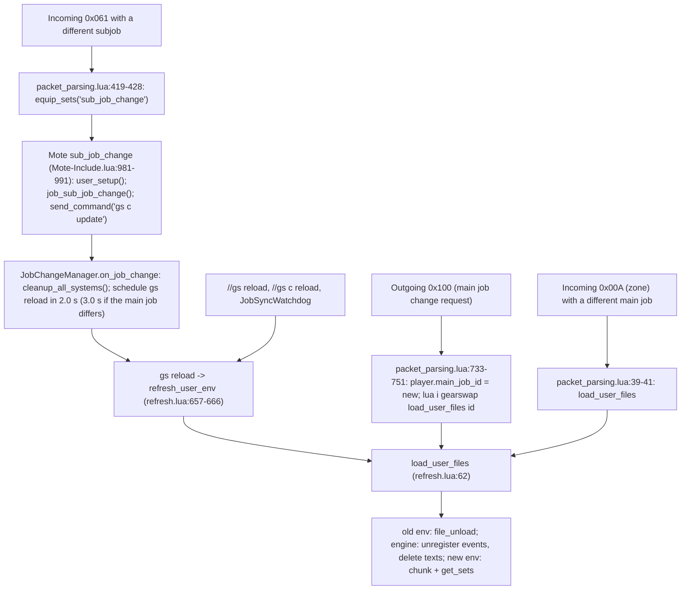

# Job / Subjob Change Lifecycle

Every job change, subjob change and `gs reload` in this project ends with GearSwap throwing away the whole Lua environment of the job file and building a new one from scratch. This page traces, in code, what runs on each of those transitions: which engine path fires, which project code runs in the dying environment and which in the new one, what state survives, what is rebuilt, and what keeps running from the dead environment. It covers the engine (`addons/GearSwap/*.lua`, `libs/Mote-Include.lua`), the 22 shared entry files `shared/entry/<job>.lua` (each character's `<Name>_<JOB>.lua` is one `include` of the matching file, since 2026-09-30), and the shared systems that take part: `JobChangeManager`, `JobSyncWatchdog`, `INIT_SYSTEMS`, `ModuleCache`, `KeybindGuard`, the lockstyle and macrobook factories, the keybind UI, AutoMove, the midcast watchdog, dual-box, craft mode, the wardrobe organizer and `DoomManager`.

Engine paths below are relative to `D:\Windower Tetsouo\addons\GearSwap\` and marked *(engine)*. Everything else is relative to the repo root (`addons/GearSwap/data`). Project line numbers were re-read against the code on 2026-09-28; where a line adds nothing, or moves often, the function is named instead. The reference for each core module (API, state, hook chain) is [core-lifecycle.md](../systems/core-lifecycle.md); this page follows the transitions.

## Files

| Path | Lines | Role |
|---|---|---|
| *(engine)* `refresh.lua` | 728 | `load_user_files()` tears down and rebuilds the user environment; `refresh_user_env()` backs `gs reload` |
| *(engine)* `packet_parsing.lua` | 779 | Detects main job change (outgoing 0x100), subjob change (incoming 0x061), job change on zone (0x00A) |
| *(engine)* `gearswap.lua` | 335 | `gs reload`, `load`/`login`/`unload` events, `status change` filter |
| *(engine)* `user_functions.lua` | 423 | Sandboxed `windower` table, tracked `register_event`, `enable`/`disable` |
| *(engine)* `flow.lua` | 431 | `equip_sets()`, `user_pcall2()` used for `file_unload` |
| *(engine)* `libs/Mote-Include.lua` | 1125 | `init_include()` (runs `user_setup`), `sub_job_change()` |
| `<Name>/<Name>_<JOB>.lua` (template `_master/entry/Tetsouo_<JOB>.lua`, 22) | 15 | Character entry: a header and `include('../shared/entry/<job>.lua')` |
| `shared/entry/<job>.lua` (22) | 189-415 | Entry code: `get_sets`, `user_setup`, `job_sub_job_change`, `file_unload` |
| `shared/utils/core/job_change_manager.lua` | 238 | Debounced subjob change: cleanup, then `gs reload` |
| `shared/utils/core/job_sync_watchdog.lua` | 165 | Reloads when the loaded file's job differs from the client's job |
| `shared/utils/core/INIT_SYSTEMS.lua` | 483 | Per-load bootstrap of the universal systems (sync and deferred) and of the gear hook chain |
| `shared/utils/core/keybind_guard.lua` | 82 | Re-sends the job's binds 2 s after a load, sequence-guarded on `windower._keybind_guard_seq` |
| `shared/utils/core/module_cache.lua` | 100 | Makes `require` cache per environment |
| `shared/utils/core/lifecycle_manager.lua` | 174 | Shared builders for `job_status_change`/`job_buff_change`/`job_aftercast`/`job_state_change`, plus `refresh_after_buff` |
| `shared/utils/core/midcast_watchdog.lua` | 485 | 0.5 s polling loop that clears stuck midcasts, generation-guarded on `windower._midcast_wd_seq` |
| `shared/utils/movement/automove.lua` | 405 | Movement polling loop, sequence-guarded on `windower._automove_seq` |
| `shared/utils/lockstyle/lockstyle_manager.lua` | 338 | Lockstyle factory (per-job ctx on `_G.__lockstyle_contexts`, DressUp handling) |
| `shared/utils/macrobook/macrobook_manager.lua` | 287 | Macrobook factory (solo/dual-box books) |
| `shared/jobs/<job>/functions/<JOB>_LOCKSTYLE.lua`, `<JOB>_MACROBOOK.lua` | 36-55 | Lazy wrappers that export `select_default_lockstyle`, `select_default_macro_book`, `cancel_<job>_lockstyle_operations` |
| `_master/config/<job>/<JOB>_KEYBINDS.lua` | 33-80 | Bind lists, turned into `bind_all`/`unbind_all`/`show_intro` by `KeybindManager.create` |
| `shared/utils/keybinds/keybind_manager.lua` | 483 | `bind_all` (unbind only what is no longer wanted, then bind), `show_intro` |
| `shared/utils/ui/UI_MANAGER.lua`, `ui_lifecycle.lua`, `ui_update_orchestrator.lua` | 165 / 210 / 170 | Keybind HUD state, `smart_init`, `destroy`, `update` |
| `shared/utils/dualbox/dualbox_manager.lua` | 476 | Job exchange between the boxes, auto-init 2 s after load |
| `shared/utils/dualbox/dualbox_sync_ipc.lua` | 189 | IPC mirror of `ls`/`rf` between the instances of the box group |
| `shared/utils/dualbox/alt_buff_reporter.lua` | 359 | Alt reports tracked buffs to the main |
| `shared/utils/craft/craft_manager.lua`, `craft_commands.lua` | 202 / 334 | Craft/fish session and slot locks |
| `shared/utils/wardrobe/wardrobe_organizer.lua` | 716 | `//gs c wo` phase chain, `job_changed()` guard |
| `shared/utils/debuff/doom_manager.lua` | 139 | Doom gear + slot locks, death safety unlock |
| `shared/utils/warp/warp_init.lua` | 125 | Warp system bootstrap (called by INIT_SYSTEMS on every load) |
| `shared/utils/core/COMMON_COMMANDS.lua`, `DEBUG_COMMANDS.lua` | 822 / 583 | `reload`, `ls`, `craft`, `wo`, `alt*` handlers; debug toggles (`djc`, `debugupdate`) |
| `_master/config_global/LOCKSTYLE_CONFIG.lua` | 53 | `initial_load_delay` used by entries |

## The environment model

Understanding one fact makes the rest of this page readable: **a job file lives in a sandbox table (`user_env`) that GearSwap discards on every load, but nothing GearSwap does stops coroutines, and some engine state is not in the sandbox.**

`load_user_files(job_id)` *(engine)* `refresh.lua:62-184` does, in order:

1. `user_pcall2('file_unload', current_file)` (`refresh.lua:66`), a `pcall` that prints but swallows errors (`flow.lua:339-348`).
2. Unregisters every event id in `registered_user_events` (`refresh.lua:69-71`). Every `windower.register_event` / `raw_register_event` made from the sandbox goes through `register_event_user` / `raw_register_event_user`, which record the id there (`user_functions.lua:254-273`). GearSwap 0.704's changelog states the same (`version_history.txt:203`).
3. Deletes every text object and primitive created since load (`refresh.lua:73-79`; the registry is filled by the `windower.text.create` override in `gearswap.lua:55-84`). The keybind HUD and the alt window are `texts` objects, so they are always destroyed here.
4. Drops `user_env` and `sets` (`refresh.lua:81-86`), builds a new `user_env` (`refresh.lua:114-149`) whose `_G` is itself, whose `windower` is the shared `user_windower` table (`refresh.lua:118`, `user_functions.lua:418-423`), whose `coroutine` is the real Windower coroutine library (`refresh.lua:131`) and whose `gearswap` field is GearSwap's own `_G` (`refresh.lua:114`).
5. Runs the entry file chunk (`refresh.lua:168`) then `get_sets()` (`refresh.lua:180`).

Consequences used throughout this page:

- **Everything on `_G` dies with the environment.** `_G.X` in the new job file is a different table from `_G.X` in the previous one. Module-level `local` state dies too, and so does the require cache (`_G.__require_cache`, `ModuleCache.install`).
- **Writes to `windower._x` survive** `gs reload` and job changes, because `user_windower` is created once per addon load (`user_functions.lua:418`) and only indexes the real `windower` through `__index`. They are reset only by `//lua reload gearswap`.
- **Listeners and HUD texts never outlive the environment that follows them**; the engine removes them at steps 2 and 3. A listener registered by a dead environment's coroutine *after* the next load is tracked and removed at the load after that.
- **Scheduled coroutines are never cancelled.** A closure scheduled by the old environment runs later against the old `_G`; the `send_command`, `player`, `enable`/`disable` it reaches are engine functions and objects, so they still act on the live game. Every coroutine must invalidate itself.
- **Slot locks are engine state.** `disable_table` (`statics.lua:194`) is not touched by `load_user_files`, and a main job change does not clear it either: the outgoing-0x100 enable-all (`packet_parsing.lua:755-757`) tests `newmain ~= player.main_job_id` after `:744` has already assigned it, so it only runs for a request whose main-job byte is 0. Only an explicit `enable` unlocks a slot. That is why several `file_unload`s now release their own locks (see Scenario 11).
- **`gearswap.user_env == _G` is true only in the live environment** (`refresh.lua:83`, `:114`, `:149`). The project uses an equivalent identity test instead: `UI_MANAGER.lua:123` stores the load's `_G.ui_manager_state` on `windower._ui_live_state`, and the delayed HUD inits compare against it (Scenario 3).
- **`equip()` outside an event does nothing.** `equip_sets()` empties `equip_list` on entry (`flow.lua:60`) and sends it on exit; an `equip()` from a bare `coroutine.schedule` callback fills `equip_list` and is discarded by the next event. Use `send_command('gs c update')`.
- **Keybinds are Windower-global.** Only an explicit `unbind` removes them.

## How it works

### Which engine path fires

```mermaid
flowchart TD
    A["Outgoing 0x100 (main job change request)"] --> B["packet_parsing.lua:733-751: player.main_job_id = new; lua i gearswap load_user_files id"]
    C["Incoming 0x061 with a different subjob"] --> D["packet_parsing.lua:419-428: equip_sets('sub_job_change')"]
    D --> E["Mote sub_job_change (Mote-Include.lua:981-991): user_setup(); job_sub_job_change(); send_command('gs c update')"]
    E --> F["JobChangeManager.on_job_change: cleanup_all_systems(); schedule gs reload in 2.0 s (3.0 s if the main job differs)"]
    F --> G["gs reload -> refresh_user_env (refresh.lua:657-666)"]
    H["//gs reload, //gs c reload, JobSyncWatchdog"] --> G
    I["Incoming 0x00A (zone) with a different main job"] --> J["packet_parsing.lua:39-41: load_user_files"]
    G --> K["load_user_files (refresh.lua:62)"]
    B --> K
    J --> K
    K --> L["old env: file_unload; engine: unregister events, delete texts; new env: chunk + get_sets"]
```

| Trigger | `cleanup_all_systems()` (old env) | `file_unload` (old env) | Engine unregisters events / deletes texts | Engine re-enables all slots |
|---|---|---|---|---|
| Subjob change (0x061 -> JCM -> `gs reload`) | yes, `JobChangeManager.on_job_change` | yes | yes | no |
| Main job change (0x100) | no | yes | yes | no (`:756` compares after `:744` assigned; see the environment model) |
| Zone-in on a different main job (0x00A) | no | yes | yes | no |
| `//gs reload`, `//gs c reload`, `JobSyncWatchdog` reload | no | yes | yes | no |
| `//lua reload gearswap` | no | yes (`gearswap.lua:146-150`) | whole addon state destroyed | n/a |

The subjob path is the only one that goes through `JobChangeManager`. A main job change is handled entirely by the engine and never reaches `on_job_change`.

### What a load runs (common to every path)

Order inside one load of `Tetsouo_PLD.lua`, whose only statement includes `shared/entry/pld.lua` (all shared entries follow the same skeleton, differences are listed in [Per-job differences](#per-job-differences)):

1. **Chunk level** (`shared/entry/pld.lua:38-59`): `require` of `shared/utils/core/char_paths` (`:38`), `LOCKSTYLE_CONFIG` via `pcall(require, CharPaths.module('common', ...))` (`:40-44`; both loaded before the cache exists, so uncached), then `require('shared/utils/config/config_loader')` (`:50`), whose first statement installs `ModuleCache` so every later `require` of the load is cached, and `ConfigLoader.load_ui_config(CharPaths.name(), 'PLD')` (`:51`; `dofile` of `<char>/_common/display/UI_CONFIG.lua`, sets `_G.UIConfig` and `_G.ui_display_config`), then `REGION_CONFIG` -> `_G.RegionConfig` (`:56-59`). `message_colors.lua` reads `_G.RegionConfig` each time the warning colour is used (`region_config()`), so the order of the region block no longer matters. `//gs c trace on` logs the orange code once, the first time it is resolved with a region config.
2. **`get_sets()`** (`:64-134`):
   1. `include('Mote-Include.lua')` (`:70`) runs `init_include()` (`Mote-Include.lua:188`): Mote states, Mote-Globals default binds F9-F12 (`Mote-Include.lua:159`), then **`user_setup()`** (`Mote-Include.lua:170-171`), then `init_gear_sets()` (`:175`). Only after `init_include()` returns does the rest of Mote-Include define `handle_equipping_gear`, `cleanup_precast`, `cleanup_midcast` and the default handlers.
      - `user_setup()` (`shared/entry/pld.lua:165-240`): `_G.PLDWSConfig`, `PLDStates.configure()`, `pld_rebuild_ws_slots()` when it already exists (subjob change), `AmpullaLock.apply()` for the default stance; `require` of `PLD_KEYBINDS` and `bind_all()` (`:198`), which unbinds only the keys of the job's list that are no longer wanted, binds the subjob's subset (`clear_unwanted` / `lay_down` in `shared/utils/keybinds/keybind_manager.lua`) and calls `show_intro()`, which `require`s the job's `_MACROBOOK` and `_LOCKSTYLE` wrappers; `KeybindUI.smart_init('PLD', init_delay)` (`:215`); `JobChangeManager.initialize()` (`:224`); if `select_default_macro_book` and `select_default_lockstyle` exist, `select_default_macro_book()` and `coroutine.schedule(select_default_lockstyle, initial_load_delay)` (`:227-230`); `pcall(require, 'shared/utils/dualbox/dualbox_manager')` (`:239`), whose body schedules the dual-box auto-init (Scenario 12).
   2. `include('../shared/utils/core/INIT_SYSTEMS.lua')` (`:72`), see [INIT_SYSTEMS](#init_systems-timeline).
   3. `data_loader`, the three message hook installers, `RECAST_CONFIG`, job configs (`:78-105`).
   4. `JobChangeManager.cancel_all()` (`:108-111`) - in a fresh environment this cancels nothing (see [Known issues](#known-issues)).
   5. The job facade `include('../shared/jobs/pld/functions/pld_functions.lua')` (`:114`), which defines the Mote hooks and the lockstyle/macrobook wrappers; then `pld_rebuild_ws_slots()` (`:120-122`).
   6. `JobChangeManager.register_lockstyle_cancel('PLD', cancel_pld_lockstyle_operations)` (`:127`).

`user_setup()` therefore runs **before** `INIT_SYSTEMS` and before the job facade. Two consequences:

- The require cache already exists during `user_setup()` (installed by `config_loader` at chunk level since 2026-09-27), so a module first required there is the instance the rest of the load gets. It must not read, when it loads, a global that is only set later in `get_sets()`. The only uncached modules are those an entry requires before `config_loader` (`char_paths`, `LOCKSTYLE_CONFIG`, and `REGION_CONFIG` in the entries that load it first, such as WAR). State that must be shared between two instances of one module lives on `_G` (`_G.JobChangeManagerSTATE`, `_G.ui_manager_state`, ...).
- `select_default_macro_book` and `select_default_lockstyle` are defined by the facade (`shared/jobs/<job>/functions/<JOB>_MACROBOOK.lua`, `<JOB>_LOCKSTYLE.lua`), which has not been included yet. The gate in `user_setup` is satisfied only because `show_intro()` required those two wrapper files a few lines earlier and they define the globals as a side effect (the comment above `show_intro` says so). BRD, BST and RUN re-test the gate in a 0.2 s coroutine instead (their `user_setup`); COR has a second, guarded macrobook/lockstyle block after the first.

#### INIT_SYSTEMS timeline

The full table (every block with its line range, and the seven-layer gear hook chain with the order in which each layer runs) is in [core-lifecycle.md](../systems/core-lifecycle.md#init_systemslua-in-execution-order). In short:

| When (after the `include`) | What |
|---|---|
| sync | restore the five debug flags from `windower._gs_debug`; `windower._gs_reload_count += 1`; `ModuleCache.install()` (normally already done by `config_loader`); `ImpactLock.install()` (also wraps `precast`, `aftercast`, `cancel_spell`), `DuplicateGear.install()` and `HPPriority.apply()` (equip hooks); LagDebugger |
| sync | `AutoMedicine.ensure()`; `JobSyncWatchdog.start(player.main_job)`; SyncIPC hooks `ls`, `lockstyle`, `rf`, `refill` + `init_listener()` |
| sync (+2 s inside) | `KeybindGuard.schedule()`: re-sends the binds 2 s later unless a newer load bumped `windower._keybind_guard_seq` |
| sync | `StealthTimers.start()`; `BuffTimers.start()` (own buff end times, for `//gs c buff` `refresh_below`) |
| sync | gear hook chain, innermost first: `ElementalBelt`, `DualWield`, `TreasureHunter`, `MidcastFallback`, `CustomStates` (the player's `<JOB>_CUSTOM.lua`), `CastTime` (+ `CastTracker.start()`), `CombatMode` |
| +0.5 s | `WarpInit.init()`; `include` AutoMove + `AutoMove.start()` unless `_G.DISABLE_AUTOMOVE == true`; `StateDisplayOverride.init()` |
| +2.0 s | `require` MidcastWatchdog, `_G.MidcastWatchdog`, `start()` |
| +3.0 s | load check of PrecastGuard / CooldownChecker / WSPrecastHandler |
| +5.0 s | `GlobalProbe.snapshot()` |

No template sets `_G.DISABLE_AUTOMOVE` any more (removed for BST in commit 0563ff9), so AutoMove starts for every job.

#### Timeline after a load

| t | Event | Source |
|---|---|---|
| +0 | keys bound, HUD `smart_init`, `select_default_macro_book()` schedules `set_macro_page` at +1.5 s | `set_macro_with_delay`, `macrobook_manager.lua:98-113` |
| +0.5 | Warp, AutoMove, state display override | INIT_SYSTEMS +0.5 s block |
| +2 | dual-box auto-init (retries every 1 s, 8 attempts), alt window start | `run_auto_init` in `dualbox_manager.lua` |
| +2 | MidcastWatchdog loop starts; KeybindGuard re-sends the binds | INIT_SYSTEMS +2 s block, `KeybindGuard.schedule` |
| +8 | `select_default_lockstyle()` -> apply at +10: `lua unload dressup`, +0.3 `/lockstyleset`, +3 `lua load dressup` | `set_lockstyle_with_delay` / `apply_lockstyle_immediate`, `lockstyle_manager.lua:122-176` |
| +8 | JobSyncWatchdog first check, then every 5 s | `JobSyncWatchdog.start` (TUNING block of `job_sync_watchdog.lua`) |

### Scenario 1 - cold load

`login` schedules `lua i gearswap refresh_user_env` 2 s later (`gearswap.lua:331-335`); `//lua load gearswap` while logged in calls `refresh_user_env()` from the `load` event (`gearswap.lua:136-144`). Either way `load_user_files` runs as above with no previous environment (`current_file` is nil, so no `file_unload`). All `windower._x` fields start nil: `JobSyncWatchdog` seeds `windower._job_sync_seq = 0` (module body), AutoMove seeds `windower._automove_seq` (`automove.lua:87`), `WarpInit` prints its init messages and sets `windower._warp_init_done` (`warp_init.lua:103-112`; its listeners and precast hook are set up on every load). `JobChangeManager.initialize()` seeds `STATE.current_main_job/sub_job` from `player` (`JobChangeManager.initialize`).

### Scenario 2 - `gs reload` while engaged

`//gs reload` -> `refresh_user_env()` (`gearswap.lua:209-210`) reads the job from `windower.ffxi.get_player().main_job_id` (`refresh.lua:659`) -> `load_user_files`. `//gs c reload` (`CommonCommands.handle_reload`) calls `JobChangeManager.force_reload()`, which bumps the counter and sends `gs reload` immediately. Neither path calls `cleanup_all_systems()`.

- Old environment: `file_unload` cancels (the JCM counter and a pending lockstyle, through the registered cancel), releases the locks it owns (Scenario 11) and keeps the keys for the new environment. Its MidcastWatchdog loop keeps scanning until the new environment's `start()` at +2 s bumps `windower._midcast_wd_seq`. Its AutoMove chain runs until the new environment calls `AutoMove.start()` at +0.5 s; while engaged it only tracks position (`track_while_engaged`, `automove.lua:193`).
- Engine: the action in flight, if any, stays in `command_registry` (only 0x100 and 0x00A reset it), so its aftercast is delivered to the new environment.
- New environment: nothing re-equips on load. Mote states return to their configured defaults (they are `_G` state). Gear changes on the next event (`status change`, action, or an AutoMove `gs c update`). COR's old attempt to re-equip from a coroutine was removed on 2026-09-25.

### Scenario 3 - subjob change SAM/WAR -> SAM/DNC

```mermaid
sequenceDiagram
    participant S as Server
    participant E as GearSwap engine
    participant A as Old env (SAM/WAR file)
    participant B as New env
    S->>E: 0x061 (sub = DNC)
    E->>A: equip_sets('sub_job_change') -> Mote sub_job_change
    A->>A: user_setup() again (states, bind_all, smart_init, macro 1.5 s, lockstyle 8 s)
    A->>A: job_sub_job_change -> JCM.on_job_change('SAM','DNC')
    A->>A: cleanup_all_systems (AutoMove.stop, Watchdog.stop, HUD destroy)
    A->>A: counter++, schedule gs reload in 2.0 s
    A->>E: send_command('gs c update') (Mote-Include.lua:990)
    E->>A: gs c update -> job_update -> KeybindUI.update -> safe_init (HUD recreated)
    Note over A: +2.0 s: counter matches -> windower.send_command('gs reload')
    E->>A: file_unload (JCM.cancel_all, lock releases; keys kept)
    E->>E: unregister events, delete texts (HUD gone)
    E->>B: chunk + get_sets (user_setup, INIT_SYSTEMS, facade)
    Note over A: still running later: macro at +1.5 s, lockstyle select at +8 s
```

Details:

1. `packet_parsing.lua:419-428` updates `player.sub_job_id` then calls `equip_sets('sub_job_change', nil, new, old)`.
2. Mote runs `user_setup()`, `job_sub_job_change()`, then `send_command('gs c update')` in the **old** environment (`Mote-Include.lua:981-991`). The entry's `job_sub_job_change` (`shared/entry/pld.lua:146-155`) only calls `on_job_change(player.main_job, newSubjob)`. Until 2026-09-25 most templates also called `JobChangeManager.initialize({...})` there; that call was removed (the argument was ignored and `user_setup` already seeds).
3. `JobChangeManager.on_job_change`: runs `cleanup_all_systems()` (`AutoMove.stop()`, `MidcastWatchdog.stop()`, `KeybindUI.destroy()`, clears `_G.keybind_ui_display`, resets `_G.ui_manager_state` fields, bumps `smart_init_id`), bumps `debounce_counter`, picks `delay = 2.0` because `STATE.current_main_job == main_job`, schedules the reload.
4. The queued `gs c update` lands in the old environment before the reload and re-creates the HUD through `KeybindUI.update()` -> `safe_init()` (`ui_update_orchestrator.lua:45-50`). The engine deletes that text at the reload.
5. At +2.0 s the coroutine checks `my_counter == STATE.debounce_counter`, writes `STATE.current_*` (dead writes, the environment is about to go) and sends `gs reload`.
6. New environment: full load. `JobChangeManager.initialize()` seeds `STATE` from `player`, which already holds the new subjob.

What the old environment's second `user_setup()` leaves behind: a macro book selection (+1.5 s) and a `select_default_lockstyle()` (+8 s), both firing in the dead environment after the reload. Since 2026-09-30 both are dropped: they go through `LoadGate.defer` keyed on the load that created their module (`ctx.load_gen`), and the reload started a newer one (see [LoadGate](#loadgate) below). Before, they doubled the new environment's own pair (a second DressUp unload/`/lockstyleset`/load sequence). The old environment's delayed HUD inits (`smart_init` polls, `force_reinit`) no longer create a HUD after the reload: since 2026-09-25 `try_init` and the `force_reinit` callback return when `windower._ui_live_state` is not their own state table (`ui_lifecycle.lua:145`, `ui_update_orchestrator.lua:71`). An identity test was chosen over a counter because `UI_MANAGER` could run twice in one load (required before and after `ModuleCache`, until the cache moved to `config_loader` on 2026-09-27), and a counter would cancel the load's own init.

What survives: slot locks (`disable_table`), all `windower._x` fields, keybinds (the new `bind_all` sends only what changed, through the paced queue; `KeybindGuard` re-sends those once the queue is empty), loaded external addons.

### LoadGate

`shared/utils/core/load_gate.lua` (since 2026-09-30). A load schedules work for later, and GearSwap never cancels a scheduled coroutine; a counter kept on the sandbox `_G` is replaced by the next load, so it cannot cancel anything across a reload. `LoadGate.begin()`, called first thing by `config_loader` on every load, bumps `windower._load_gen`. `LoadGate.defer(delay, fn, label, gen)` runs `fn` only if, when it fires, no newer load has started and the game still reports the main job and subjob of the moment it was scheduled (the subjob is compared only when both name one). A dropped task writes `LOAD <label> skipped (newer load | job changed | subjob changed)` to the trace.

Users: the four `INIT_SYSTEMS` blocks (warp/AutoMove +0.5 s, watchdog +2 s, critical-module check +3 s, global probe +5 s), the macro book (`ctx.load_gen`), the lockstyle (`ctx.load_gen`), the first dual-box auto-init and the Atelier export (+4 s). The macro book and lockstyle pass the number of the load that created their module, so a call made in a dead environment after the reload (the entry's raw +8 s `select_default_lockstyle`) is dropped too.

### Scenario 4 - rapid round trip SAM/WAR -> SAM/DNC -> SAM/WAR (< 1 s)

Both 0x061 packets arrive while the old environment is still loaded:

- First: `on_job_change('SAM','DNC')` -> counter N, reload scheduled at +2.0 s.
- Second (say +0.3 s): Mote runs `user_setup()` again (the HUD is re-created by `smart_init` because `cleanup_all_systems` destroyed it), then `on_job_change('SAM','WAR')` -> `cleanup_all_systems()` again, counter N+1, reload at +2.3 s.
- At +2.0 s the first coroutine sees `N ~= N+1` and aborts (the counter test at the top of the scheduled closure). At +2.3 s the second sends `gs reload`.

The delay is keyed on the main job only, so the round trip still reloads, at 2.0 s. The comment above the delay in `on_job_change` gives the reason: `cleanup_all_systems()` has already torn down the HUD and AutoMove, so the reload has to happen.

### Scenario 5 - main job change PLD -> BLM

1. Outgoing 0x100: `player.main_job_id = BLM`, `command_registry`, `equip_list`, `equip_list_history` and cached equipment cleared, `lua i gearswap load_user_files 4` queued (`packet_parsing.lua:733-751`). The enable-all at `:755-757` does not run (see the environment model), so slot locks survive the change.
2. `load_user_files(4)`: PLD `file_unload` (`shared/entry/pld.lua:287-309`, which releases the Hoxne ammo lock first), engine cleanup, `Tetsouo_BLM.lua` loads.
3. No `cleanup_all_systems()`: the PLD environment's MidcastWatchdog loop ends when BLM's `start()` bumps `windower._midcast_wd_seq` at +2 s (`MidcastWatchdog.start`); its AutoMove chain dies when BLM's `AutoMove.start()` bumps `windower._automove_seq` at +0.5 s (`automove.lua:334`); a PLD `select_default_lockstyle` still scheduled returns early because `player.main_job ~= 'PLD'` (`select_default_lockstyle`, `lockstyle_manager.lua:190`), and a lockstyle apply already in its 2 s delay or DressUp steps is cancelled by PLD's `file_unload` (`JobChangeManager.cancel_all()` -> the registered `cancel_pld_lockstyle_operations`, which bumps the ctx's `operation_id`).
4. If the server refuses or reorders the request, the incoming 0x061 corrects `player.main_job_id` without reloading (`packet_parsing.lua:381`). `JobSyncWatchdog` (started by BLM's `INIT_SYSTEMS`) compares `'BLM'` with `windower.ffxi.get_player().main_job` at +8 s and every 5 s; after 2 consecutive mismatches it sends `gs reload` (`JobSyncWatchdog.start`), at most once per 30 s (`windower._job_sync_last_reload`, local `force_reload`).
5. Switching to a job that has no user file (Tetsouo has a file for each of the 22 jobs; Kaories only for COR, GEO, PLD, RDM): `load_user_files` finds no file (`refresh.lua:108-112`) and leaves no environment. The previous environment's AutoMove, MidcastWatchdog and JobSyncWatchdog loops keep running; the latter fires a "Job file is PLD but you are DRK - reloading." warning and a `gs reload` that again loads nothing.

`JobChangeManager`'s 3.0 s branch is taken only when a subjob change arrives while `player.main_job` differs from the job the loaded file was seeded with, which in practice means the refused-change case in step 4.

### Scenario 6 - job change or reload in the middle of a cast

FFXI only allows job changes in a Mog House, so the realistic case is a reload (`gs reload`, `//gs c reload`, `JobSyncWatchdog`) during a cast. `command_registry` survives `load_user_files`, so aftercast is delivered to the new environment. The old environment's MidcastWatchdog keeps scanning with `current_midcast.active = true` and never receives `on_aftercast()`, until the new environment's `start()` at +2 s ends its loop; if the cast's timeout expires first, it prints a stuck-midcast message and sends `gs c update` (`check_stuck`, `midcast_watchdog.lua`). On the subjob path the watchdog was stopped and cleared by `cleanup_all_systems()` (`MidcastWatchdog.stop`).

### Scenario 7 - job change with craft mode active

`//gs c craft` equips the craft set, `disable()`s the slots 2 s later (`lock_after_delay`, `craft_commands.lua:193-205`) and marks the session active in `_G.__CraftManagerState` (`craft_manager.lua:59`).

- Subjob change / any reload: the new environment starts with `__CraftManagerState = {active=false}`, while the engine keeps the slots locked. `//gs c uncraft` then answers "No craft set is currently active." and returns before `gs enable all` (`CraftManager.unequip`, `craft_manager.lua:177-181`), and the weapon-lock code that honours a craft session (`CombatMode.apply` and its `attach`, WHM's `file_unload` for `Melee ON`) reads `CraftManager.is_active()`, sees no session and re-enables the weapon slots. See Known issues. The comment above `_G.__CraftManagerState` describes exactly this.
- Main job change: same as a reload. The slots stay locked (the 0x100 enable-all does not run, see the environment model) and the new environment has no session, so `//gs c uncraft` refuses; `//gs enable all` is the way out.
- A reload within 2 s of `//gs c craft`: the old environment's `lock_after_delay` coroutine still runs and locks the slots under the new environment.

### Scenario 8 - job change during `//gs c wo`

The organizer's state (`IS_RUNNING`, `start_job_tag`, iteration counters) is module-local (`wardrobe_organizer.lua:54-60`), so it belongs to the environment that started the run. After a job change or reload:

- The old environment's phase chain keeps running. `job_changed()` (`:78-86`) compares `player.main_job/sub_job` with the tag captured at start and is tested at phase boundaries: before Phase 1 (`build_state_and_dispatch`), before Phase 3 (`rebuild_then_phase3`), before Phase 4 (`start_phase4`) and before a retry (`start_organize`). A mismatch calls `abort_run()` -> `clean_exit()` -> `gs enable all` and the stance-lock release. The move loop inside a phase (`run_burst_loop`, `lib/phases.lua:205-327`) does not check it and finishes the phase with the old job's plan.
- The new environment has `IS_RUNNING = false`, so a second `//gs c wo` can start while the old chain is still moving items, and the old chain's `clean_exit()` will `gs enable all` in the middle of the new run.
- The slots that Phase 0 locked (`lock_and_finish`, `lib/phases.lua:119-125`) stay locked across a main job change as well (the 0x100 enable-all does not run); only the old chain's `clean_exit()` releases them.

### Scenario 9 - death and raise with Doom

- Gaining Doom: `buff_change('doom', true)` (`res.buffs[15].en` is `"doom"`) -> `LifecycleManager.buff_change` -> `DoomManager.handle_buff_change` equips `sets.buff.Doom` and `disable('neck','ring1','ring2','waist')` (`doom_manager.lua:67-100`).
- Dying: buffs are cleared; the engine's buff diff emits `buff_change('doom', false)` for the lost buff without any status filter (`packet_parsing.lua:541-560`), so `handle_buff_change` re-enables the four slots.
- `DoomManager.handle_status_change`'s "Dead" branches (`doom_manager.lua:112-135`) never run: the engine returns from its `status change` handler whenever the old or new status is 2 (Dead), 3 (Engaged dead) or 4 (Event) (`gearswap.lua:323-328`). The raise-time safety unlock therefore does not exist in practice; the buff-loss path above is what unlocks the slots.
- A reload while doomed keeps the locks (engine state) and the Doom gear; the new environment unlocks them on the Doom loss.

### Scenario 10 - zone change

Incoming 0x00A resets `command_registry` and `not_sent_out_equip` (`packet_parsing.lua:32-35`); if the main job id differs, it calls `load_user_files` (`:39-41`). Otherwise no user event fires. AutoMove sees a position jump greater than `jump_threshold` (5.0, `automove.lua:60`) and sends `gs c update`, which re-equips the idle set. Nothing in the job-change systems reacts to zoning; `JobSyncWatchdog`, the MidcastWatchdog and AutoMove loops continue. Slot locks persist.

### Scenario 11 - `file_unload` per job

All templates define `file_unload` at chunk level, so Mote's default (which would call `global_on_unload`) is not installed (`Mote-Include.lua:193`). Mote's F9-F12 default binds (`Mote-Globals.lua:47-62`) are therefore never unbound by the project; the next load rebinds them.

| Job | JCM `cancel_all()` | Keybinds `unbind_all()` | Other |
|---|---|---|---|
| BLM, BRD, DNC, DRK, RDM, RUN, SAM | yes | yes | - (the Combat Mode lock of any job is freed by the next job's `CombatMode.attach`, from `windower._combat_mode_locked`) |
| BLU | yes | yes | `AzureSets.unload()` first |
| PLD, WAR | yes | yes | `AmpullaLock.release()` first (the Hoxne ammo lock), so the lock does not leak into the next job |
| THF | yes | yes | `RangeLock.release()` |
| WHM | yes | yes | releases `main/sub/range` when `windower._whm_melee_lock` is set (or `OffenseMode` still reads `Melee ON`) and no craft session is active (2026-09-25; the flag, which also covers a subjob change, 2026-09-28) |
| GEO | yes | yes | `JobAddons.run('unload', 'pettp')` (skipped with `pettp = false` in `_common/tools/ADDONS_CONFIG.lua`) |
| COR | yes | yes | `ActionListener.off('cor_roll')`, `RollTracker.cleanup()`, `PartyTracker.cleanup()`, `JobAddons.run('load', 'rolltracker')` (skipped with `rolltracker = false` in `ADDONS_CONFIG.lua`) (the DressUp watchdog stop is gone with the watchdog, 2026-09-25) |
| BST | yes | yes | `stop_pet_monitoring()`, bumps `_G.bst_hud_load_id`, `JobAddons.run('unload', 'bst-hud')`, nils `_G.KeybindUI/start_pet_monitoring/stop_pet_monitoring` |
| PUP | yes | yes | `PetWS.stop()` first (ends the automaton WS poll) |

A subjob change runs `file_unload` too (it reloads), but the weapon lock released there is re-applied by the new environment only when the player selects the mode again. Combat Mode itself always starts `Off` in a new environment, and its `attach` frees what the previous environment locked.

What no `file_unload` does: stop the MidcastWatchdog loop (the next environment's `start()` ends it), stop AutoMove, destroy the HUD (the engine deletes the text), cancel the initial `coroutine.schedule(select_default_lockstyle, 8)`, cancel the macrobook coroutine. `JobChangeManager.cancel_all()` bumps `debounce_counter` (effective: it kills a pending subjob reload) and calls the registered lockstyle cancel, which bumps the job ctx's `operation_id` and so stops a lockstyle still waiting in its 2 s delay or DressUp steps.

### Scenario 12 - dual-box: the other box changes job

Roles come from `<Character>/_common/dualbox/DUALBOX_CONFIG.lua`, overridden by `<Character>/saved/dualbox_role.lua` when `//gs c main` wrote one. `_G.DualBoxConfig`, `_G.AltJobState` ("the other box's job") and `_G.AltBuffState` are environment state, so each reload of a box forgets what it knew about the other one. `dualbox_manager.lua`'s body schedules `run_auto_init` 2 s after it first executes in an environment; `windower._dualbox_init_counter` supersedes earlier bodies and `windower._dualbox_init_last_reload` against `windower._gs_reload_count` (bumped by every INIT_SYSTEMS run) limits it to once per load (`run_auto_init`). Since the require cache is installed by `config_loader`, the body runs once per load (the `require` in `user_setup()`); the facade's `require` and the old environment's second `user_setup()` on a subjob change are cache hits.

- **Either box reloads or changes job**: its new environment's auto-init runs the same steps for both roles (`:447-448`): `send_job_update()` sends `send <other> gs c altjobupdate <job>  <lvl> <sublvl> <sender>` (an identical payload less than 1.5 s after the previous send is dropped, `windower._dualbox_last_send_payload/_time`, `:184-190`), then `request_alt_job()` sends `send <other> gs c requestjob`. The alt also runs `AltBuffReporter.report_all()` (`:451-458`).
- **On the receiving box** the job's COMMANDS module routes `altjobupdate` to `receive_alt_job()` (e.g. `shared/jobs/pld/functions/PLD_COMMANDS.lua`), which records every sender in `alt_states.lua` and stops there for a sender that is not its tracked partner, stores `_G.AltJobState` and corrects `_G.cor_party_jobs` for the other character; only when the job or subjob differs from what it already held does it print the update and schedule `select_default_macro_book()` 0.5 s later, so the dual-box book is picked (`DualBoxManager.receive_alt_job`, `dualbox_config` in `macrobook_manager.lua`). It routes `requestjob` to `handle_job_request()`, which answers with `send_job_update(true)`: a forced reply that skips the de-dup window.
- So a reload of either box restores both sides: the reloaded box learns the other's job from the forced reply, and the other box receives the reloaded box's job (stored silently when unchanged). Nothing asks the alt to resend its buffs after a reload of the main (see Known issues).
- **IPC mirror (`ls`, `rf`)**: each load registers the hooks on its `_G.DUALBOX_SYNC_HOOKS` and an `ipc message` listener (INIT_SYSTEMS sync IPC block, `DualBoxSyncIPC.init_listener`). The listener id is kept on `windower._sync_ipc_event_id` with the load that registered it (`windower._sync_ipc_event_load`); `init_listener` unregisters it only when it comes from the same load, because the engine has already removed an older one and its id may now belong to another listener. Between the engine's unregister at the start of `load_user_files` and `INIT_SYSTEMS` in the new `get_sets`, the box has no listener and drops broadcasts. Self-echo suppression state is on `windower._sync_ipc_last_sent/_time` (`broadcast`) so it spans a reload. The message carries the sender's name and a box acts only on a sender of its `AltGroup.get_alts()`, which is empty until `_G.DualBoxConfig` is loaded (2 s after the load) and when the dual-box is disabled.
- `DualBoxManager.is_alt_online()` turns false 30 s after the last `altjobupdate` (`:357-371`); `dualbox_config` in `macrobook_manager.lua` therefore uses the dual-box book only for macrobook selections made within 30 s of an update. `get_alt_jobs` in `alt_commands.lua` reads `_G.AltJobState` directly to avoid that timeout.

### Per-job differences

- **BRD, BST, RUN**: macrobook/lockstyle gate re-tested in a 0.2 s coroutine (their `user_setup`).
- **COR**: second macrobook + lockstyle block, each call guarded (`shared/entry/cor.lua:302-318`; the JCM block before it, `:279-289`, runs too, so both select twice in the same environment); `init_party_tracking()` from `get_sets` (`:83-113`, `:205`); unregisters its events at the top of `get_sets` (`:131-134`), which in a fresh environment finds nothing. The DressUp watchdog loop and the "force gear re-equip" coroutine were removed on 2026-09-25 (the watchdog called a `get_addons` that does not exist; the re-equip equipped nothing).
- **RUN**: keybinds bound from a 0.5 s coroutine (`shared/entry/run.lua:163-179`); hence the 0.2 s gate re-test (`:202-207`).
- **BST**: pet monitor on a raw `prerender` listener (`start_pet_monitoring` / `stop_pet_monitoring`, `shared/entry/bst.lua`), started 3 s after `user_setup()` behind a job and existence guard; BST HUD addon loaded 2 s + 1.5 s after load with a counter and job guard (`_G.bst_hud_load_id`); `state.Moving` is left to AutoMove.
- **PUP**: the automaton WS poll (`shared/jobs/pup/functions/logic/pet_ws.lua`), a 0.5 s `coroutine.schedule` loop that runs only while an automaton is out and Pet WS is On; generation `windower._pup_pet_ws_seq`, bumped when the module loads and by `PetWS.stop()` from `file_unload`. No event listener.
- **Every job**: the Combat Mode weapon lock is centralised in `shared/utils/core/combat_mode.lua` (outermost `handle_equipping_gear` wrapper, see [core-lifecycle.md](../systems/core-lifecycle.md#the-gear-hook-chain)); it honours a craft session through `CraftManager.is_active()`. WHM's `Melee ON` lock is still released by its own `file_unload`, as are THF's `RangeLock` and the Hoxne Ampulla lock; since 2026-09-29 the next load's `attach` also empties their records in `windower._weapon_locks` (the registry Combat Mode lays again after every update).
- **SMN (`shared/entry/smn.lua`)**: every `user_setup()` schedules a Carbuncle summon when no pet is out (`:150-159`), so a subjob change schedules two (old and new environment).
- **BST**: `JobChangeManager.initialize()` is still called from `user_setup`, without argument, like every other job.

Since 2026-09-30 every character runs the same entry code: the set file is found by `CharPaths.relative('sets', '<job>_sets.lua', '<JOB>')`, which also reaches a modular tree's `<job>_sets.lua`, so no character needs its own entry.

## Public API

### JobChangeManager (`shared/utils/core/job_change_manager.lua`)

| Function | Behaviour | Callers |
|---|---|---|
| `initialize(config)` (`:119-129`) | Seeds `STATE.current_main_job/sub_job` from `player` only when nil. `config` is ignored (its `@param` says so; only the frozen clones Hysoka and Gabvanstronger still pass a table). | every `user_setup` |
| `on_job_change(main, sub)` (`:135-192`) | Returns if either is nil. `cleanup_all_systems()`, counter++, schedules `gs reload` after 2.0 s (same main job) or 3.0 s. | every `job_sub_job_change` |
| `force_reload(main, sub)` (`:197-216`) | Counter++, immediate `gs reload`. No cleanup. | `CommonCommands.handle_reload` |
| `cancel_all()` (`:220-228`) | Counter++; `pcall` every function in `STATE.lockstyle_cancel_registry`. | every `get_sets` and `file_unload` |
| `register_lockstyle_cancel(job, fn)` (`:235-237`) | Stores `fn` in the registry. | every `get_sets` |

State: `_G.JobChangeManagerSTATE = {current_main_job, current_sub_job, target_main_job, target_sub_job, debounce_timer, debounce_counter, lockstyle_cancel_registry}` (`:36-53`). Debug lines are gated on `_G.JOBCHANGE_DEBUG` through `DebugLogger`.

### JobSyncWatchdog (`shared/utils/core/job_sync_watchdog.lua`)

`start(file_job)`: ignores non-strings, `''` and `'NONE'`; bumps `windower._job_sync_seq` and captures it; first check after `FIRST_CHECK` = 8 s, then every `CHECK_INTERVAL` = 5 s; a check ends when the sequence moved on; `same_job(nil, x)` counts as a match; 2 consecutive mismatches call the local `force_reload`, which respects a 30 s floor on `windower._job_sync_last_reload`, bumps the sequence, shows a warning and sends `gs reload`. Exported as `_G.JobSyncWatchdog`. Only caller: INIT_SYSTEMS (sync).

### LifecycleManager (`shared/utils/core/lifecycle_manager.lua`)

`status_change(extra)`, `buff_change(extra)`, `aftercast(extra)`, `state_change(extra)` each return a handler for the matching Mote hook; callers assign `_G.job_*` themselves. `status_change`, after `extra`, holds back an engage / disengage that lands during an action (`hold_during_action`, 2026-09-27): with `midaction()` true it sets `eventArgs.handled`, so Mote does not equip the engaged / idle set over the action's gear, and aftercast equips the set of the status in force by then; a 3 s fallback (`STATUS_FALLBACK`) sends `gs c update` if no action is running and the status still holds (an `equip()` from the coroutine would never be sent). `buff_change` stops the chain when `DoomManager` handled the buff. `aftercast` calls `_G.MidcastWatchdog.on_aftercast()`. `state_change` skips `Moving` and calls `KeybindUI.update()`. `refresh_after_buff(buff)` (2026-09-29) is not a builder: WAR, DRK, SAM and THF call it from their buff handler; for Aftermath: Lv.3, unless Doom is up, it sends `gs c update` 0.1 s later (skipped if an action is under way then), because `buffactive` inside `buff_change` still holds the old buffs ([core-lifecycle.md](../systems/core-lifecycle.md#lifecyclemanager)).

### ModuleCache (`shared/utils/core/module_cache.lua`)

`install()` replaces `_G.require` once per environment with a cache keyed on the lowercased path; calls with a second argument bypass it (`stats()`, which had no caller, was removed on 2026-09-28). Installed by `shared/utils/config/config_loader.lua` when the entry file requires it at file level, i.e. before `user_setup()` (2026-09-27; the INIT_SYSTEMS call is the fallback). WAR, BST and SMN require `job_change_manager` and `UI_MANAGER` at file level, after `config_loader`, for that reason (the other entries require them inside `get_sets()` / `user_setup()`), and `UI_MANAGER` reads `_G.UIConfig` when it loads, which `load_ui_config` sets.

### LockstyleManager / MacrobookManager (lifecycle-relevant parts)

- `LockstyleManager.create(job, config_path, default_style, default_sub)` (`lockstyle_manager.lua:276`) returns `{select_default_lockstyle, set_lockstyle_with_delay, get_lockstyle_info, show_lockstyle_config, set_lockstyle_enabled, set_dressup_management, cancel_pending_operations, get_state, get_info, cancel_<job>_lockstyle_operations}` and exports the matching `_G.*` functions. Pending work is invalidated through `ctx.STATE.operation_id` (`cancel_pending_operations`, `:116`). The ctx is kept per job code in `_G.__lockstyle_contexts` (`contexts()`, `:261`), so both wrapper copies of an environment share it; it is environment state. The globals of a previous `create()` are cleared at the next one (`last_registered_globals`, `:250`; its comment now says the list only sees the calls of one load).
- The job wrappers (`shared/jobs/<job>/functions/<JOB>_LOCKSTYLE.lua`) create the module lazily on first call and export `select_default_lockstyle` and `cancel_<job>_lockstyle_operations`; the latter calls `get_lockstyle_module().cancel_<job>_lockstyle_operations()`, the key the factory adds for that purpose (`lockstyle_manager.lua:311`).
- `MacrobookManager.create(...)` (`macrobook_manager.lua:233`); `set_macro_with_delay` invalidates on `_G._macrobook_schedule_id` (`:98-113`), which is per environment (the comment says a coroutine scheduled before a reload is not cancelled).
- `LockstyleManager.apply_style(style)` (`:71`) is the stateless variant used by craft commands.

### Other lifecycle entry points

| Function | File:line | Notes |
|---|---|---|
| `AutoMove.start()` / `stop()` | `automove.lua:334` / `:108` | both bump `windower._automove_seq`; `start` only from the +0.5 s block of `INIT_SYSTEMS`, `stop` only from `cleanup_all_systems` |
| `MidcastWatchdog.start()` / `stop()` | `midcast_watchdog.lua` | both bump `windower._midcast_wd_seq`, which ends every older loop |
| `KeybindUI.smart_init(job, max_wait)` / `destroy()` | `ui_lifecycle.lua:122` / `:187` | `smart_init_id` supersedes older polls; `windower._ui_live_state` stops polls from an older load |
| `KeybindGuard.schedule()` | `keybind_guard.lua` | re-sends the binds after 2 s; `windower._keybind_guard_seq` drops an older load's pass |
| `DualBoxManager.send_job_update / request_alt_job / handle_job_request / receive_alt_job` | `dualbox_manager.lua` | see scenario 12 |
| `DualBoxSyncIPC.register_hook / broadcast / init_listener` | `dualbox_sync_ipc.lua:52`, `:68`, `:176` | listener id on `windower._sync_ipc_event_id`, stamped with its load in `windower._sync_ipc_event_load` |
| `CraftManager.mark_active / active_gear / unequip / is_active` | `craft_manager.lua` | state on `_G.__CraftManagerState` |
| `WardrobeOrganizer.organize / reset / recover` | `wardrobe_organizer.lua:565`, `:680`, `:690` | module-local `IS_RUNNING` |
| `DoomManager.handle_buff_change / handle_status_change` | `doom_manager.lua:67`, `:112` | via `LifecycleManager` |
| `WarpInit.init()` | `warp_init.lua:65-113` | listeners and the precast hook on every load (the hook once per environment, `_G.WARP_PRECAST_HOOKED`, `:38-41`); init messages only while `windower._warp_init_done` is unset (`:103-111`) |

## Commands

| Command | Effect | Handler |
|---|---|---|
| `//gs reload` (engine) | `refresh_user_env()` -> `load_user_files` | `gearswap.lua:209-210` |
| `//gs c reload` | `JobChangeManager.force_reload()` | `CommonCommands.handle_reload` |
| `//gs c ls` / `lockstyle` | `select_default_lockstyle()` + `SyncIPC.broadcast('ls')` | `COMMON_COMMANDS.lua:665`, `handle_lockstyle` |
| `//gs c dressup` | toggles DressUp management, persisted as `data/.dressup_disabled` | `LockstyleManager.toggle_dressup`, `lockstyle_manager.lua:22-66` |
| `//gs c debugjobchange` / `djc` | toggles `windower._gs_debug.JOBCHANGE` (restored into `_G.JOBCHANGE_DEBUG` by INIT_SYSTEMS) and prints `JobChangeManagerSTATE` | `DebugCommands.handle_debugjobchange` |
| `//gs c debugupdate` | toggles `windower._gs_debug.UPDATE` (persists), mirrors to `_G.UPDATE_DEBUG` | `DebugCommands.handle_debugupdate` |
| `//gs c craft [variant]`, `fish [variant]`, `uncraft` | craft session | `CommonCommands.handle_craft` / `handle_fish`, `craft_commands.lua` |
| `//gs c wo [reset|recover|alt|preview|verify|scan|keep]` | wardrobe organizer | `CommonCommands.handle_wardrobeorganize` |
| `//gs c watchdog [on|off|toggle|debug|buffer N|fallback N|clear|test|stats]` | MidcastWatchdog control | `WatchdogCommands.handle_command`, `WATCHDOG_COMMANDS.lua:36` |
| `//gs c altjobupdate <job>  [lvl] [sublvl] [sender]` | sent by the other box; `receive_alt_job()` | each `<JOB>_COMMANDS.lua` |
| `//gs c requestjob` | sent by either box at auto-init; answered with this box's job, past the de-dup | each `<JOB>_COMMANDS.lua` |
| `//gs c altbuff <name...> <0|1>`, `altbuffsync`, `altsync`, `altbuffs`, `altdebug` | alt buff reporting | `COMMON_COMMANDS.lua:618-657` |

## Configuration

| Source | Keys read | Default and where |
|---|---|---|
| `<char>/_common/display/LOCKSTYLE_CONFIG.lua` (template `_master/config_global/LOCKSTYLE_CONFIG.lua`) | `initial_load_delay` (entries, `message_system.lua:31`) | 8.0; fallback table in each entry (e.g. `shared/entry/pld.lua:40-44`). Its only setting (`job_change_delay` and `cooldown`, read by nothing, were removed on 2026-09-29) |
| `<char>/_common/display/UI_CONFIG.lua` (dofile) | `init_delay` for `smart_init` | 5.0 (`config_loader.lua:69`) |
| `<char>/_common/dualbox/DUALBOX_CONFIG.lua` (+ `dualbox_role.lua`) | `role`, `enabled`, `character_name`, `alt_character`/`main_character`, `group`, `timeout`, `debug`, `report_on_load`, `tracked_buffs` | disabled main (`DualBoxManager.initialize`) |
| `<char>/_common/inventory/CRAFT_CONFIG.lua` | `craft_file`, `fish_file`, `craft_lockstyle`, `fish_lockstyle` | `bonecraft` / `fishing` / 19 / 17 (`craft_commands.lua`); a lockstyle key `false` keeps the job's lockstyle |
| `<char>/_common/inventory/REFILL_CONFIG.lua` | `source_bags`, `store_bag`, `default_list`, `subjobs`, `store_foreign`, `foreign_characters`, `never_store` (foreign sweep), `quiver_open_at` (QuiverManager) | Case, Sack, Satchel / Case; `store_foreign` `'mine'`; without a common list (and no job list) `FALLBACK_LIST` (`config_resolver.lua`) |
| `<char>/_common/sets/<name>_sets.lua` | craft/fish sets | `craft_manager.lua` |
| `<char>/_common/tools/ADDONS_CONFIG.lua` | addon name = `false` | every addon allowed (`shared/utils/core/job_addons.lua`) |
| `<char>/<job>/combat/<JOB>_CONFIG.lua` (ten jobs; BRD: `BRD_SONG_CONFIG.lua`), `<char>/_common/combat/SUBJOB_CONFIG.lua`, `<char>/_common/travel/WARP_CONFIG.lua` | a job's switches and thresholds (`idle_hp`, `refresh_mp_below`, `skillup`, `escort_indi`, `auto_*`...), `waltz_from`, `stratagem_full_recharge`, `ring_safety` | each caller's own value, given at the call (`shared/utils/core/job_config.lua`; `TUNING.lua` / `AUTO_ABILITIES.lua` read first where a folder still has them) |
| `data/.dressup_disabled` | file presence = DressUp management off | `lockstyle_manager.lua:22` |
| `<char>/<job>/<JOB>_LOCKSTYLE.lua`, `<JOB>_MACROBOOK.lua` | styles and books per subjob (and per alt job) | fallbacks in the factories |

Timing constants: JCM 2.0 s / 3.0 s (`on_job_change`); keybind command queue 5 per 0.25 s (`command_queue.lua`); JobSyncWatchdog 8/5/2/30 (TUNING block of `job_sync_watchdog.lua`); dual-box auto-init 2 s + 1 s x 8 (`INIT_FIRST_DELAY`, `INIT_RETRY_DELAY`, `INIT_MAX_ATTEMPTS` in `dualbox_manager.lua`); AutoMove `job_change_cooldown` 2.0 s (`automove.lua:59`); lockstyle select delay 2.0 s, DressUp 0.3 s / 3.0 s (`lockstyle_manager.lua:122-176`); macrobook 1.5 s (`macrobook_manager.lua:99`); KeybindGuard 2.0 s (`REASSERT_DELAY`).

## State & lifetime

### `windower._x` fields (survive `gs reload` and job changes)

| Field | Owner | Purpose |
|---|---|---|
| `_gs_reload_count` | INIT_SYSTEMS (line 44) | per-load counter, read by dual-box auto-init and the listener stamps |
| `_gs_debug` | `flip_debug` in `DEBUG_COMMANDS.lua`, read by INIT_SYSTEMS | persisted debug flags (`UPDATE`, `AUTOMOVE`, `WARP`, `PRECAST`, `JOBCHANGE`) |
| `_automove_seq` | `automove.lua:87`, `:110`, `start` | invalidates AutoMove chains |
| `_midcast_wd_seq` | module body, `MidcastWatchdog.start`, `stop` | invalidates MidcastWatchdog loops |
| `_job_sync_seq`, `_job_sync_last_reload` | module body, local `force_reload`, `start` | invalidation + reload floor |
| `_keybind_guard_seq` | module body, `KeybindGuard.schedule` | drops an older load's re-bind pass |
| `_ui_live_state` | `UI_MANAGER.lua:123` | the live load's HUD state table, compared by delayed inits |
| `_dualbox_init_counter`, `_dualbox_init_last_reload` | `dualbox_manager.lua` body, `run_auto_init` | one auto-init per load |
| `_dualbox_last_send_payload`, `_dualbox_last_send_time` | `DualBoxManager.send_job_update` | 1.5 s de-dup of `altjobupdate`; a reply to `requestjob` skips it |
| `_sync_ipc_event_id`, `_sync_ipc_event_load`, `_sync_ipc_last_sent`, `_sync_ipc_last_sent_time` | `dualbox_sync_ipc.lua` (`broadcast`, `init_listener`) | IPC listener token and the load it belongs to, self-echo |
| `_alt_buff_reporting`, `_alt_buff_debug` | `alt_buff_reporter.lua:109`, `:251` | alt has reported at least once; tracing |
| `_alt_group`, `_alt_window_gen` | `alt_group.lua`, `alt_window.lua` | Auto / Follow / Mirror shown by the alt window (last `alts` orders, or the reported state); alt window loop generation |
| `_alt_reports`, `_alt_mirror` | `alt_group.lua` (`receive_report`, `receive_mirror`) | last state reported by each box's automation addon; mirror steps and results in progress |
| `_warp_init_done`, `_warp_ipc_event_id`, `_warp_ipc_register_event_id` + `_load`, `_warp_autofix_zone_id` + `_warp_autofix_load` | `warp_init.lua:111`; `warp_ipc_register.lua:20-24`, `:99`; `_setup_auto_fix` in `item_user.lua` | once-per-session init messages; listener tokens, each stamped with its load so an id from an earlier load is never unregistered |
| `_hook_wraps` | `shared/hooks/init_*_messages.lua` | counters for the message hook chain |
| `_auto_medicine` | `auto_medicine.lua` | AutoMedicine choice |
| `_cor_party_jobs`, `_cor_party_state` | `party_tracker.lua:133-139` | COR party job cache |
| `_lagdebug` | `lag_debugger.lua` | lag debugger state |

### `_G` state that dies with every environment

`JobChangeManagerSTATE`, `ui_manager_state`, `keybind_ui_display`, `keybind_ui_visible`, `ui_display_config`, `UIConfig`, `MidcastWatchdog`, `MIDCAST_WATCHDOG_TIMER`, `__lockstyle_contexts`, `WARP_PRECAST_HOOKED`, `AUTOMOVE_RUNNING`, `_automove_sequence`, `AutoMove`, `DualBoxConfig`, `AltJobState`, `AltBuffState`, `AltBuffExpiry`, `DUALBOX_SYNC_HOOKS`, `_alt_window_display`, `_alt_window_prefs`, `__CraftManagerState`, `_macrobook_schedule_id`, `DRESSUP_MANAGEMENT_ENABLED` (re-read from disk), `warp_detector_callbacks`, `__require_cache`, `LockstyleConfig`, `RECAST_CONFIG`, every `state.*` value and every module-local table (wardrobe run, AutoMove callbacks).

### Engine state that survives `gs reload`

`disable_table` (slot locks, `statics.lua:194`, cleared only by an explicit `enable`; it also survives a main job change), `command_registry` (reset by 0x100 and 0x00A), `not_sent_out_equip`, `player`/`buffactive`/`world` objects (refreshed, not recreated). Windower-level: keybinds, loaded addons (`dressup`, `rolltracker`, `bst-hud`, `pettp`), queued `send_command`s, scheduled coroutines.

### Registered events

| Event | Registered at | Unregister path (besides the engine at every load) |
|---|---|---|
| `ipc message` (dual-box sync) | `init_listener`, `dualbox_sync_ipc.lua:176` | `windower._sync_ipc_event_id` at a second `init_listener` of the same load |
| `ipc message` (warp register) | `warp_ipc_register.lua:49` | `windower._warp_ipc_register_event_id` at a second include in the same load |
| `ipc message` (warp IPC) | `WarpIPC.init` (no caller) | `windower._warp_ipc_event_id` |
| `incoming chunk` 0x028 (ActionListener, raw, one per load) | `listen` in `shared/utils/core/action_listener.lua` | `_G._action_listener_id` guard; no unregister path. Subscribers (`ActionListener.on`): `action_queue`, `cast_tracker`, `flurry_tracker`, `dual_wield`, `treasure_hunter`, `stealth_trace`, `warp_detector`, `warp_autofix`, `cor_roll`, `brd_song_owner`; the same key replaces, `off(key)` removes |
| `zone change` (warp item use) | `item_user.lua:698` | local id + `windower._warp_autofix_zone_id`, only while the load is the one that registered it; the `warp_autofix` subscription is removed with `ActionListener.off` |
| `incoming chunk` (COR, raw) | `party_tracker.lua:173` | `_G.cor_party_event_id`, `PartyTracker.cleanup` from COR `file_unload` (which also calls `ActionListener.off('cor_roll')`) |
| `prerender`, `action` (lag debugger) | `lag_debugger.lua:118`, `:158` | `S.*` ids |
| `prerender` (BST, raw) | `start_pet_monitoring` in the BST entry | `stop_pet_monitoring()` from BST `file_unload` |

The engine removes all of these at the next `load_user_files` (`refresh.lua:69-71`), so the `windower._x` tokens only matter within one environment. The dual-box sync, warp register and warp auto-fix zone tokens are stamped with `windower._gs_reload_count` and unregistered only when the stamp matches the current load: an id from an earlier load was already removed and may since have been given to another listener.

### Scheduled loops and how each one ends

| Loop | Period | Ends when | Survives a reload that skips `cleanup_all_systems`? |
|---|---|---|---|
| AutoMove `run` | 0.12 / 0.3 / 0.5 s | `windower._automove_seq` moves or `_G.AUTOMOVE_RUNNING` false | until the next `AutoMove.start()` (+0.5 s); forever if no file loads |
| MidcastWatchdog | 0.5 s | `windower._midcast_wd_seq` moves (every `start()` / `stop()`) | until the next `start()` (+2 s); forever if no file loads |
| JobSyncWatchdog | 5 s | `windower._job_sync_seq` moves | until the next `start()` |
| HUD `smart_init` / `force_reinit` polls | 0.2 s | id bump, `max_wait_time`, or `windower._ui_live_state` changed | no (fixed 2026-09-25) |
| KeybindGuard re-bind | once, 2 s | `windower._keybind_guard_seq` moved | no |
| Dual-box auto-init retries | 1 s x 8 | counter moves or attempts exhausted | bounded |
| Alt window refresh | 5 s | `windower._alt_window_gen` moves | until the next `AltWindow.start()` |
| BST template pet monitor | 1 s | `pet_monitor_active` false (BST `file_unload`) | no |
| Wardrobe phase chain | adaptive | phase end + `job_changed()` at boundaries | until the next boundary |

## Interactions

- HUD internals: [../systems/ui-overlay.md](../systems/ui-overlay.md).
- Keybinds, `KeybindGuard`, `<JOB>_CUSTOM.lua`: [../systems/keybinds-and-custom.md](../systems/keybinds-and-custom.md).
- Precast pipeline (PrecastGuard reads `state.AutoMedicine` created by `INIT_SYSTEMS`): [../systems/precast-pipeline.md](../systems/precast-pipeline.md).
- Midcast and buffs (MidcastWatchdog hooks in `<JOB>_MIDCAST`/`_AFTERCAST`, Doom via `LifecycleManager`): [../systems/midcast-and-buffs.md](../systems/midcast-and-buffs.md).
- Message hook chain re-wrapped on every load by `shared/hooks/init_*_messages.lua` (intentional).
- `GlobalProbe` snapshot 5 s after load (INIT_SYSTEMS +5 s block) expects the names listed in `shared/utils/debug/global_probe.lua`.

## Invariants & gotchas

1. **Mote runs `user_setup()` twice on a subjob change**: once in the old environment from `sub_job_change` (`Mote-Include.lua:982-984`) and once in the new environment after the reload. Anything `user_setup()` schedules is scheduled twice and the first copy runs in a dead environment.
2. **`user_setup()` runs before `INIT_SYSTEMS` and before the job facade.** Code there must not assume `select_default_*`, `_G.MidcastWatchdog` or AutoMove exist. The require cache does exist there since 2026-09-27 (installed by `config_loader`), so a module first required in `user_setup()` is the instance the rest of the load gets: it must not read, at load time, a global that is set later. The macrobook/lockstyle gate works through the keybind intro's `require` side effect, or (BRD, BST, RUN) through a 0.2 s re-test.
3. **A coroutine must carry its own invalidation that the next environment can move**: a sequence on `windower._x` (AutoMove, JobSyncWatchdog, MidcastWatchdog, KeybindGuard) or an identity test against a `windower._x` pointer (the HUD's `_ui_live_state`). A flag on `_G` cannot be cleared by the next environment.
4. **`equip()` from a coroutine does nothing**; send `gs c update` instead (`flow.lua:60`).
5. **Slot locks outlive the environment that set them.** Any feature that `disable()`s slots and keeps its "active" flag on `_G` loses the flag on reload but keeps the lock; release it from `file_unload` (PLD, WAR, THF, BLM, WHM do).
6. **Only the subjob path runs `cleanup_all_systems()`.** Main job changes, zone job changes and every manual or watchdog reload skip it.
7. **Mote's `gs c update` after `job_sub_job_change` lands in the old environment** and re-creates the HUD that `cleanup_all_systems()` just destroyed; the engine deletes it at the reload.
8. **GearSwap does not dispatch `status_change` for Dead / Engaged dead / Event** (`gearswap.lua:323-328`).
9. **`JobChangeManager.initialize()` seeds, it does not assign** (`JobChangeManager.initialize`); assigning broke the subjob path because Mote calls `user_setup()` before `job_sub_job_change()`.
10. **`bind_all()` runs on every `user_setup()`, including the old environment's.** `KeybindManager` unbinds only the keys that are no longer wanted (job list, `retired_keys`, keys it bound earlier) and lets a bind overwrite a key that stays; unbinding everything first opened the window in which a key went dead after a reload (comment above `clear_unwanted`). `KeybindGuard` re-sends the binds 2 s later.

## For maintainers / AI

**Before changing anything that runs on a load or an unload, answer four questions:**

1. Which environment runs this code: the dying one (`file_unload`, the old `user_setup()` of a subjob change, any coroutine it scheduled) or the new one? Code in the dying environment writes to a `_G` that is about to be dropped.
2. What must survive the transition, and is it on `windower.*` (survives) or `_G` (does not)?
3. What does the engine keep that the project does not know about: slot locks (`disable_table`), keybinds, loaded addons, queued console commands, `command_registry` (a cast in flight gets its aftercast in the new environment)?
4. Which scheduled callback can still fire after the transition, and what invalidates it?

**Traps specific to transitions**

- The subjob path runs `user_setup()` twice (old environment, then new). Anything `user_setup()` schedules exists twice; the first copy runs in a dead environment against the live `player`.
- `raw_register_event` / `register_event` listeners are removed by the engine at the next load, but a coroutine of the old environment can register a new one after that point; it is removed only at the load after. Stamp listener tokens with `windower._gs_reload_count`.
- `buffactive` and `player.tp` are GearSwap copies refreshed when an event starts. In a raw event or a coroutine, read `windower.ffxi.get_player()` (`.buffs`, `.vitals.tp`; `shared/utils/core/live_tp.lua`).
- `JobChangeManager.cancel_all()` only cancels what the environment it runs in scheduled; the call in `get_sets()` is a no-op, the one in `file_unload` is the real one.
- No main job change clears slot locks: a feature that `disable()`s must release from `file_unload` or record the lock on `windower.*` for the next environment (Combat Mode does the latter).

**Testing offline**

`lua5.1` and `luac5.1` are installed. `luac5.1 -p _master/entry/*.lua shared/entry/*.lua shared/utils/core/*.lua` checks syntax; `python scripts/check_syntax.py` checks the whole project including live folders. For behaviour, stub the engine (`windower`, `player`, `coroutine.schedule` collecting callbacks) and replay a transition by running the collected callbacks in order; [core-lifecycle.md](../systems/core-lifecycle.md#for-maintainers--ai) has a working harness for the subjob debounce. Packet ordering (0x100 vs 0x061) and `Hook.dll` command ordering cannot be reproduced offline: use `//gs c debugjobchange` and `//gs c trace on` in game.

## Extending

- **New background loop**: capture a sequence from `windower._x` at start and compare it every tick (model: `AutoMove.start`, `JobSyncWatchdog.start`, `KeybindGuard.schedule`). Do not rely on `cleanup_all_systems()` or `file_unload` to stop it.
- **New listener**: register it once per environment from `get_sets` or `INIT_SYSTEMS`. The engine removes it at the next load.
- **New state that must survive a subjob change** (a mode the player chose, a session flag tied to engine state such as slot locks): store it on `windower._x` and restore it in `user_setup()`/`INIT_SYSTEMS`, or release the engine state from `file_unload`.
- **New per-load work in an entry**: put anything that needs the facade after the facade `include` in `get_sets()`, or defer it with a short coroutine as BRD does. Anything that must run after Mote defines `handle_equipping_gear` / `cleanup_*` belongs in `INIT_SYSTEMS` (as `CustomStates.install_hooks`).
- **New job entry**: copy `shared/entry/pld.lua` (and a one-line `_master/entry/Tetsouo_<JOB>.lua` that includes it); keep `file_unload` calling `JobChangeManager.cancel_all()` and `<JOB>Keybinds.unbind_all()`, set `_G.RegionConfig` at file level, require `config_loader` before any other shared module (it installs the require cache), and make sure `select_default_macro_book()`/`select_default_lockstyle` run after the facade exists (RUN re-tests them after 0.2 s for that reason).

## Known issues

Fixed since the page was first written:

- `JobChangeManager.initialize({...})` in `job_sub_job_change` (table ignored) removed from every template and the Tetsouo/Kaories entries (2026-09-25).
- COR's post-reload "force gear re-equip" (equipped nothing) and its DressUp watchdog (could never fire) removed (2026-09-25).
- `//gs c debugjobchange` is kept on `windower._gs_debug.JOBCHANGE` and restored at every load, so it survives the reload it traces.
- Old-load HUD inits could create a HUD nothing destroys (fixed 2026-09-25 with `windower._ui_live_state`).
- WHM `Melee ON` / Combat Mode weapon locks orphaned by a reload or job change: WHM releases `Melee ON` in `file_unload`; Combat Mode records what it locked in `windower._combat_mode_locked` and the next environment's `attach` frees it (2026-09-25; game test pending).
- Kaories COR warning colour: `REGION_CONFIG` now set before `config_loader` (fixed 2026-09-25, game test pending).
- Comments that claimed cross-reload persistence (macrobook schedule id, `last_registered_globals`, LOCKSTYLE_CONFIG, `WarpIPC.init`) were rewritten (2026-09-25 night cleanup).

Still open:

- Craft session flag is lost on reload while the slots stay locked; `//gs c uncraft` then refuses (plan item 13: move the state to `windower.*`) - `CraftManager.unequip`, `shared/utils/craft/craft_manager.lua:177-181`
- `DoomManager.handle_status_change` Dead branches are unreachable - `shared/utils/debuff/doom_manager.lua:112-135`
- `JobChangeManager.cancel_all()` in every `get_sets` runs in the fresh environment and cancels nothing - `shared/entry/pld.lua` `get_sets`
- Switching to a job with no user file leaves the previous environment's loops running and triggers a pointless JobSyncWatchdog reload - `JobSyncWatchdog.start`, `shared/utils/core/job_sync_watchdog.lua`
- A job change during `//gs c wo` leaves the old run moving items until the next phase boundary while the new environment allows a second run - `shared/utils/wardrobe/wardrobe_organizer.lua:54`
- After a reload of the main, alt buff state is empty and never re-requested - `run_auto_init`, `shared/utils/dualbox/dualbox_manager.lua`
- COR selects the macro book and schedules the lockstyle twice per `user_setup` (the JCM block and the guarded block) - `shared/entry/cor.lua:279-318`
- The 3 s fallback of `LifecycleManager.status_change` (an engage / disengage held during an action) sends `gs c update`, since `equip()` from a scheduled function is never sent (`flow.lua:60`); fixed 2026-09-27. Normally the aftercast path equips the new status set first. Not yet tested in game - `hold_during_action`, `shared/utils/core/lifecycle_manager.lua`
- The intro of a job never shows the macro book or the lockstyle (Z2-09, a decision for the owner: return a value from the 32 wrappers, or drop the branch in `show_intro`) - `show_intro` in `shared/utils/keybinds/keybind_manager.lua`
