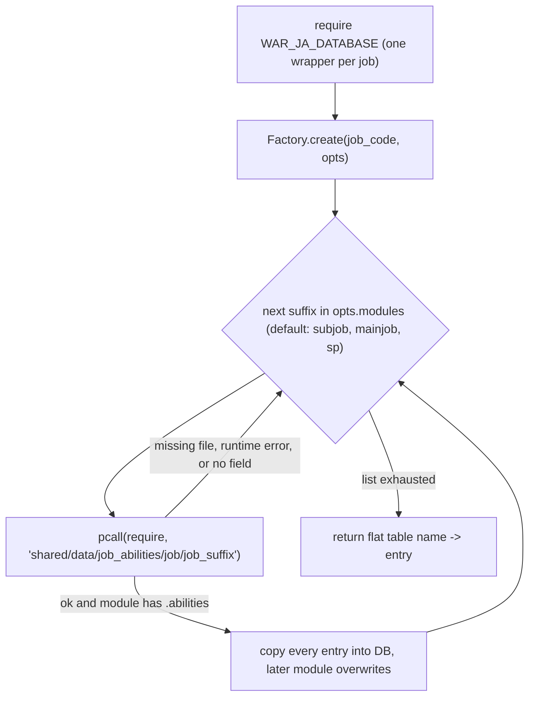
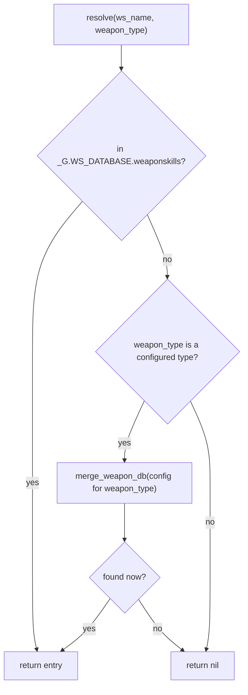

# Job ability and weapon skill databases

The project keeps two curated data sets under `shared/data/`: job abilities (`job_abilities/`,
one folder of small modules per job plus one factory-built aggregator per job) and weapon skills
(`weaponskills/`, one file per weapon skill type plus a lazy-loading facade). Neither data set has
behaviour of its own. They are read at runtime by three consumers: the JA announcement hook
(`shared/hooks/init_ability_messages.lua` -> `ability_message_handler.lua`, on every action whose
`action_type` is `'Ability'`), the WS announcement hook (`shared/hooks/init_ws_messages.lua`, on every
weapon skill), and the `//gs c info <name>` viewer (through `shared/utils/data/data_loader.lua`). RDM's
command fallback reads neither: it resolves names from the game resources. Offline, the job-ability
module files are the input of the generator that produced `config/alt/<JOB>_ALT_COMMANDS.lua`
(dual-box alt commands); that generator is not in the repository.

Nothing in this area registers events, keybinds, coroutines or `windower.*` fields. All state is
module-local or on the GearSwap sandbox `_G`, and is discarded every time GearSwap loads a job file.

Scope of reading: every file in `shared/data/job_abilities/` (84 module files, 21 wrappers, factory)
and `shared/data/weaponskills/` (14 files) was read in full; in addition every entry was loaded with `lua5.1` for the integrity checks in [Integrity checks](#integrity-checks).

## Files

### Job abilities (`shared/data/job_abilities/`)

| Path | Lines | Role |
|------|-------|------|
| `JA_DATABASE_FACTORY.lua` | 65 | `Factory.create(job, opts)`: loads `<job>/<job>_<suffix>` modules and merges their `.abilities` into one flat table. |
| `<JOB>_JA_DATABASE.lua` (21 files: BLM BLU BRD BST COR DNC DRG DRK GEO MNK NIN PLD PUP RDM RNG RUN SAM SCH THF WAR WHM) | 13 each; BST 17, COR 21, SCH 25, DNC 26 | One `Factory.create` call per job. 17 use the default module list; BST, COR, DNC, SCH pass an explicit list. |
| `<job>/<job>_subjob.lua`, `_mainjob.lua`, `_sp.lua` (17 standard jobs) | 33-145 | `M.abilities = { [name] = entry }`. Subjob file = usable as sub (`main_job_only = false`); mainjob and sp = main only. |
| `bst/` 5 files | 42-78 | Standard three + `bst_pet_commands_mainjob.lua` (Ready, Snarl, Spur, Run Wild), `bst_pet_commands_subjob.lua` (Fight, Heel, Stay, Sic, Leave). |
| `cor/` 5 files | 44-174 | Standard three + `cor_rolls_subjob.lua` (18 rolls, Lv5-58) and `cor_rolls_mainjob.lua` (13 rolls, Lv61-97). Rolls also carry `lucky`/`unlucky`. |
| `dnc/` 15 files | 30-62 | Standard three + waltzes, sambas, steps, jigs (sub/main each), `flourishes1_subjob`, `flourishes2_subjob/_mainjob`, `flourishes3_mainjob`. Flourishes carry `fm_cost`. |
| `sch/` 7 files | 44-70 | Standard three + white and black grimoire stratagems (sub/main each). |
| `drg/` 4 files | 44-83 | Standard three + `drg_pet_commands.lua` (Dismiss, Smiting Breath, Restoring Breath, Steady Wing), which no aggregator loads. |
| `pup/` 4 files | 42-123 | Standard three + `pup_pet_commands_subjob.lua` (Deploy, Deactivate, Retrieve, 8 Maneuvers), which no aggregator loads. |
| `nin/` 2 files | 44-69 | `nin_mainjob.lua`, `nin_sp.lua`. There is no `nin_subjob.lua`; the factory skips it silently. |

There is no `smn/` folder and no `SMN_JA_DATABASE.lua` (see `_master/config/alt/SMN_ALT_CUSTOM.lua:24`).

### Weapon skills (`shared/data/weaponskills/`)

| Path | Lines | Entries | Role |
|------|-------|---------|------|
| `UNIVERSAL_WS_DATABASE.lua` | 396 | - | Facade: `resolve()` merges the file of the WS's own skill into `_G.WS_DATABASE`; 14 other query helpers. |
| `SWORD_WS_DATABASE.lua` | 503 | 24 | Standard schema. Also contains 6 non-sword WS (see [Known issues](#known-issues)). |
| `DAGGER_WS_DATABASE.lua` | 333 | 18 | Alternate schema (see below). No helper functions. |
| `H2H_WS_DATABASE.lua` | 392 | 17 | Standard schema. |
| `GREATSWORD_WS_DATABASE.lua` | 353 | 15 | Standard schema. |
| `GREATAXE_WS_DATABASE.lua` | 269 | 15 | Standard schema, no helper functions. Contains `Decimation` (an Axe WS). |
| `AXE_WS_DATABASE.lua` | 347 | 15 | Standard schema. |
| `SCYTHE_WS_DATABASE.lua` | 354 | 15 | Standard schema. |
| `POLEARM_WS_DATABASE.lua` | 353 | 15 | Standard schema. |
| `KATANA_WS_DATABASE.lua` | 341 | 15 | Standard schema. |
| `GREATKATANA_WS_DATABASE.lua` | 346 | 15 | Standard schema. |
| `STAFF_WS_DATABASE.lua` | 445 | 18 | Standard schema. |
| `CLUB_WS_DATABASE.lua` | 444 | 17 | Standard schema. |
| `ARCHERY_WS_DATABASE.lua` | 339 | 12 | Standard schema. |

There is no Marksmanship file.

### Developer notes (`_dev/`, gitignored by `.gitignore:91`, local only)

| Path | Lines | Status |
|------|-------|--------|
| `_dev/JOB_ABILITIES_DATABASE.md` | 215 | Describes a pre-factory design (string-valued entries, a 12-job merge loop, PRECAST modules reading `JA_DB[spell.english]`). None of this matches the code. |
| `_dev/WS_DATABASE_SYSTEM.md` | 399 | Describes a `GREAT_AXE_WS_DATABASE.lua` file, the DAGGER-style schema as the standard, PRECAST integration through `WS_DB[spell.english]`, and "only Great Axe complete". None of this matches the code. |
| `_dev/ATTACK_PDL_SYSTEM.md` | 258 | French design note on pDIF caps and a "count buff sources, switch to a `.PDL` WS set" rule. No `.lua` file in `shared/`, `_master/`, `Tetsouo/` or `Kaories/` implements it (the only `PDL` token in Lua is a comment at `Tetsouo/config/thf/THF_STATES.lua:70`). It does not touch the WS databases. |

### Consumers (documented elsewhere, listed for navigation)

| Path | Uses |
|------|------|
| `shared/hooks/init_ability_messages.lua` | Wraps `user_post_precast`, calls `AbilityMessageHandler.show_message` for `action_type == 'Ability'` (`:86-93`). |
| `shared/utils/messages/handlers/ability_message_handler.lua` | Requires `<JOB>_JA_DATABASE` per job, reads `.description` (`:79-86`, `:150-186`, `:253`). |
| `shared/hooks/init_ws_messages.lua` | The only module that requires `UNIVERSAL_WS_DATABASE` (`:64`); calls `resolve(spell.english, spell.skill)` in `full` mode only and reads `.description` (`:122-129`). |
| `shared/utils/data/data_loader.lua` + `shared/utils/commands/info_command.lua` | `//gs c info`: loads every module file directly into `_G.FFXI_DATA`. |

`CooldownChecker`, `AbilityHelper`, `WSPrecastHandler` and `tp_bonus_handler`/`tp_bonus_calculator` do
not read these databases: cooldowns come from `spell.recast_id`, `AbilityHelper` reads Windower
`resources` (`ability_helper.lua:28`). RDM's `//gs c <name>` fallback resolves names from the game
resources too (`RDM_COMMANDS.lua:40-61`, see [Commands](#commands)).

## Data schemas

### Job ability entry

Every module file has the shape `local M = {} ; M.abilities = { ['Name'] = entry } ; return M`
(COR rolls included: `cor_rolls_subjob.lua:18`, `cor_rolls_mainjob.lua:16`).

| Field | Type | Present on | Runtime reader |
|-------|------|------------|----------------|
| `description` | string | all 334 entries | `ability_message_handler.lua:253` (only in `ja_mode == 'full'`), `info_command.lua:238` |
| `level` | number | all | `info_command.lua:246`; offline alt-commands generator |
| `recast` | number, seconds (comments give the unit; SCH stratagems and rolls use `0`) | all | `info_command.lua:239` |
| `main_job_only` | boolean | all | offline alt-commands generator only (`main_only` in `config/alt/*_ALT_COMMANDS.lua`) |
| `cumulative_enmity`, `volatile_enmity` | number | all except the 31 rolls and `Assassin's Charge` (`thf_mainjob.lua:42-47`) | none |
| `fm_cost` | number | DNC flourishes | none |
| `lucky`, `unlucky` | number | COR rolls | none (COR roll logic uses its own `shared/jobs/cor/functions/logic/roll_data.lua`; the two copies agree for all 31 rolls) |

`info_command.lua:235-249` also asks for `type`, `duration`, `effect`, `range`, `radius`, `cost`,
`job`, `category`; no JA entry has them, so they are simply not printed.

### Main job vs subjob

The split is by file, and every file is consistent with its suffix (checked): all entries in
`*_subjob.lua` have `main_job_only = false`, all entries in `*_mainjob.lua`, `*_sp.lua` and
`drg_pet_commands.lua` have `main_job_only = true`. Master Level abilities are filed as subjob with a
level above 49 and a comment: Building Flourish 50, Contradance 50, Life Cycle 50, Random Deal 50,
Super Jump 50, Valiance 50, Unlimited Shot 51, Puppet Roll 52, Consume Mana 55, Ebullience 55,
Gallant's Roll 55, Rapture 55, Wizard's Roll 58.

At runtime nothing filters on `main_job_only` or `level`: an aggregator merges all files of a job,
main-only ones included, and `ability_message_handler` looks names up in the whole main and sub job
aggregators (`ability_message_handler.lua:163-171`).

### Weapon skill entry, standard schema (12 files)

| Field | Type | Notes |
|-------|------|-------|
| `description` | string | The only field read by the WS announcement (`init_ws_messages.lua:128`). |
| `type` | `'Physical'` / `'Magical'` / `'Hybrid'` | |
| `mods` | `{STAT = percent}` | |
| `hits` | number | `0` for self-target utilities (Starlight, Moonlight, Dagan, Myrkr). |
| `element` | string or nil | |
| `skillchain` | array of property names | |
| `ftp` | `{[1000]=n, [2000]=n, [3000]=n}` | |
| `skill_required` | number | |
| `jobs` | `{JOB = level}` | |
| `special_notes` | string, optional | |
| `weapon_type`, `weapon_file` | string | Not in the files: written into the entry by `merge_weapon_db` (`UNIVERSAL_WS_DATABASE.lua:105-106`). |

### Weapon skill entry, DAGGER schema

`DAGGER_WS_DATABASE.lua` uses different keys (`:31-47`): `description`, `skill_level`, `job_levels`,
`stat_modifiers` (string such as `"100% DEX"`), `sc_properties`, `requires_quest`, `quest_name`,
`requires_merit`, `merit_ranks`, `special_weapons` (array of `{weapon, level, type, bonus|aftermath}`),
`element`, `notes`. It has no `type`, `mods`, `hits`, `ftp`, `skill_required`, `jobs` or `skillchain`.
The announcement only needs `description`, so it works; the helper functions and `//gs c info` do not
(see [Known issues](#known-issues)).

## How it works

### Building a job database



1. The wrapper calls `Factory.create('WAR')` (`WAR_JA_DATABASE.lua:13`) or passes `opts.modules`
   (`BST_JA_DATABASE.lua:15-17`, `COR_JA_DATABASE.lua:19-21`, `DNC_JA_DATABASE.lua:15-26`,
   `SCH_JA_DATABASE.lua:19-25`).
2. `create` lowercases the job (`JA_DATABASE_FACTORY.lua:35`), picks `opts.modules` or
   `{'subjob','mainjob','sp'}` (`:36`) and `opts.source_field` or `'abilities'` (`:37`).
3. For each suffix it builds `shared/data/job_abilities/<job>/<job>_<suffix>` and `pcall(require, ...)`
   (`:43-44`). In the sandbox `require` is `include_user` (GearSwap `refresh.lua:132`), which raises
   `Cannot find the include file` for a missing file (`user_functions.lua:315-317`); the `pcall`
   swallows it, so a wrong suffix or a missing file (`nin_subjob`) is skipped without any message.
4. Entries are copied with `DB[name] = data` (`:46-48`); on a name collision inside one job the later
   module wins. There are no collisions today.
5. `opts.extra` (`:56-60`) would run a second pass with another field name. No wrapper passes it.

### Module caching and lifetime

`include_user` never writes `package.loaded`, so without help every `require` re-executes the file.
`INIT_SYSTEMS.lua:47-52` installs `ModuleCache` (`shared/utils/core/module_cache.lua:44-88`), which
replaces the sandbox `require` with a caching one keyed by the lower-cased path. From then on each
aggregator, each module file and the WS facade are executed once per sandbox. GearSwap builds a new
sandbox (`user_env`) on every job-file load (`refresh.lua:83`, `:114`, `:149`), and `JobChangeManager`
sends `gs reload` on main and sub job changes (`job_change_manager.lua:179`), so the cache, the
aggregators, `_G.WS_DATABASE` and `_G.FFXI_DATA` are all rebuilt after a job or subjob change.
Because the cache hands the same table to every caller, the entry tables mutated by
`merge_weapon_db` (`weapon_type`, `weapon_file`) are the same objects `data_loader` stores.

### Runtime lookup on an action

```mermaid
sequenceDiagram
  participant Mote as Mote precast
  participant WSHook as init_ws_messages wrapper
  participant JAHook as init_ability_messages wrapper
  participant AMH as AbilityMessageHandler
  participant UWS as UniversalWS
  Mote->>WSHook: user_post_precast(spell)
  WSHook->>JAHook: original user_post_precast
  JAHook->>AMH: show_message(spell) when action_type is Ability
  AMH->>AMH: WeaponSkill: return; Blood Pact: SMN spell DB only
  AMH->>AMH: lookup in main job DB, then sub job DB
  AMH->>AMH: miss, type held by the JA DBs: lookup in each of 21 job DBs
  AMH-->>JAHook: show_ja_activated or silent
  WSHook->>UWS: resolve(spell.english, spell.skill) when type is WeaponSkill, TP >= 1000 and ws_mode is full
  UWS-->>WSHook: entry or nil
  WSHook-->>Mote: show_ws_activated or show_ws_tp
```

Every entry file includes the ability hook before the WS hook (for example
`_master/entry/Tetsouo_WAR.lua:103` then `:109`), so the WS wrapper runs the ability wrapper first.

JA path (`ability_message_handler.lua`):

1. `show_message` returns unless `spell.action_type == 'Ability'` (`:217`), returns for
   `type == 'WeaponSkill'` (`:223`), skips `type == 'CorsairRoll'` (`:228`) and `name == 'Pianissimo'`
   (`:233`), returns when `ja_mode` is off (`:238`).
2. `find_ability_in_databases(spell.name, spell.type)` (`:150-186`): `BloodPactRage` and
   `BloodPactWard` go straight to `shared/data/magic/SMN_SPELL_DATABASE`, accepting only
   `Blood Pact: Rage/Ward` categories (`find_blood_pact`, `:130-143`).
3. Otherwise it reads `windower.ffxi.get_player()` (`:163`) and tries the main then the sub job
   database via `load_ja_db` (`:165-170`). `load_ja_db` memoises each job in `JOB_DATABASES`, storing
   `false` for a job without a database (`:79-86`).
4. On a miss, and only when `spell.type` is one of the types the JA databases hold (`DATABASE_TYPES`,
   `:94-98`: JobAbility, Scholar, Rune, Ward, Effusion, Waltz, Samba, Step, Jig, Flourish1-3), it walks
   all 21 codes in `JOBS` (`:67-71`, `:177-183`), loading every aggregator it has not loaded yet.
   `Monster` (Ready moves), `CorsairShot` (Quick Draw) and `PetCommand` stop after main/sub: no JA
   database holds them except BST's own pet commands, which are in the BST database.
5. A hit prints `show_ja_activated(name, description)` (`:271`), `description` only in `full` mode.

GearSwap gives `action_type = 'Ability'` to `/ws`, `/pet`, `/bstpet` and `/ms`
(GearSwap `statics.lua:33-35`), and `type = 'WeaponSkill'` to every weapon skill (`statics.lua:80`).
Weapon skills, pet commands, Quick Draw shots and Blood Pacts therefore reach this handler; the
type checks above keep them out of the 21-database walk.

### Weapon skill resolution



1. On first require the facade creates `_G.WS_DATABASE = {loaded=false, weaponskills={}, weapon_types={},
   load_stats={}}` (`UNIVERSAL_WS_DATABASE.lua:45-52`).
2. `init_ws_messages.lua:122-129` passes `spell.skill`, the weaponskill's own skill as GearSwap reports
   it (`res.skills[id].english`), not the main hand's: a ranged WS belongs to the range slot.
3. `resolve` (`UNIVERSAL_WS_DATABASE.lua:136-143`) returns an already merged entry, else merges that
   skill's file and returns whatever it holds. Every entry is present in the file of its own skill
   (the 7 cross-filed ones also have their proper copy), so a miss means no file holds the name; nothing
   else is merged. `weapon_type_configs` (`:65-79`) lists Sword, Dagger, Hand-to-Hand, Great Sword,
   Great Axe, Axe, Scythe, Polearm, Katana, Great Katana, Staff, Club, Archery.
4. `merge_weapon_db` (`:93-118`) is idempotent per type (`weapon_types[type]` guard, `:94`). It stores
   each entry twice, at `_G.WS_DATABASE[name]` and `_G.WS_DATABASE.weaponskills[name]`, tagging it with
   `weapon_type`/`weapon_file`. A later merge of a file that holds the same name overwrites the
   earlier entry (see duplicates below). A file that fails to load is not marked, so it is retried on
   the next miss.
5. `init_ws_messages.lua:122-133`: in `ws_mode == 'full'` it calls `resolve` and prints
   `show_ws_activated(name, description, tp)` only when an entry was found; in `on` mode it prints
   `show_ws_tp(name, tp)` without calling `resolve`.

### `//gs c info` path

`data_loader.lua` keeps its own copy in `_G.FFXI_DATA` (`:40-51`). `load_abilities` (`:152-215`)
tries 21 jobs x (3 standard suffixes + 20 special suffixes) = 483 `pcall(require)` calls, keeping the
first entry for each name. Its suffix list includes `pet_commands_subjob`, so PUP pet commands are
visible to `info`; it has no bare `pet_commands`, so `drg_pet_commands.lua` is not.
`load_weaponskills` (`:221-244`) loads the 13 files in its own order (Sword first) and also keeps the
first entry for each name. `info_command.lua:307-363` looks up exact name, then case-insensitive.

## Public API

### `JA_DATABASE_FACTORY`

`Factory.create(job_code, opts) -> table` (`JA_DATABASE_FACTORY.lua:33-63`)
- `job_code`: 3-letter job code, any case (lowercased for paths). A nil `job_code` errors at `:35`.
- `opts.modules`: array of suffixes; default `{'subjob','mainjob','sp'}`.
- `opts.source_field`: field read on each module; default `'abilities'`. No caller sets it.
- `opts.extra`: array of `{modules=..., source_field=...}` merged after the main pass. No caller sets it.
- Returns a new flat table `name -> entry`. No side effects besides the `require` calls.
- Callers: the 21 `<JOB>_JA_DATABASE.lua` wrappers only.

### `<JOB>_JA_DATABASE` (21 modules)

Return the flat table built by the factory. Only caller: `ability_message_handler.lua:82` (one per
job, lazily). Entry counts: BLM 7, BLU 8, BRD 7, BST 19,
COR 40, DNC 37, DRG 14, DRK 12, GEO 14, MNK 13, NIN 7, PLD 13, PUP 10, RDM 6, RNG 15, RUN 23, SAM 14,
SCH 24, THF 15, WAR 12, WHM 9 (319 total; the 15 pet commands in the two unloaded files make 334).

### `UNIVERSAL_WS_DATABASE` (module `UniversalWS`)

| Function | Line | Behaviour | Callers |
|----------|------|-----------|---------|
| `resolve(ws_name, weapon_type)` | 136 | Returns the entry or nil, merging at most the one file of `weapon_type`. | `init_ws_messages.lua:126` |
| `ensure_weapon_type(weapon_type)` | 122 | Merges one file by its `res.skills` English name; ignores unknown names. | `resolve` only |
| `load()` | 148 | Merges all 13 files, fills `load_stats` (`expected_total = 212` hard-coded, `:171`), sets `loaded = true`. | the 13 helpers below only |
| `get_ws_data`, `can_use`, `get_jobs_for_ws`, `get_ws_type`, `get_ws_element`, `get_skillchain_properties`, `get_ftp`, `get_weapon_type`, `get_ws_by_weapon_type`, `get_ws_by_job`, `search_ws`, `get_load_stats`, `print_load_summary` | 188-390 | Each calls `load()` first, then reads the standard-schema fields. `print_load_summary` prints through `message_database`. | none (repo-wide, live folders included) |

Each standard-schema weapon file except GREATAXE also exports the same seven helpers on its own table
(`get_ws_data`, `can_use`, `get_jobs_for_ws`, `get_ws_type`, `get_ws_element`,
`get_skillchain_properties`, `get_ftp`; for example `SWORD_WS_DATABASE.lua:407-497`). The eleven
blocks are identical apart from one `@param` comment. They have no caller: the facade and
`data_loader` only read `.weaponskills`.

## Commands

The data files register no command. Commands that reach them:

| Command | Handler | Effect on this area |
|---------|---------|---------------------|
| `//gs c info <name>` | `COMMON_COMMANDS.lua:619` -> `DEBUG_COMMANDS.lua:215-218` -> `info_command.lua:370` | Loads all JA module files and/or all 13 WS files into `_G.FFXI_DATA` on first use, prints the entry. |
| `//gs c jamsg <full\|on\|off>` | `DEBUG_COMMANDS.lua:197` | Chooses whether JA announcements print `description`. |
| `//gs c wsmsg <full\|on\|off\|tp>` | `DEBUG_COMMANDS.lua:207` | `full` prints WS `description`, and prints nothing for a WS missing from the database. |

RDM's `//gs c <ability, WS or spell name> [<target>]` fallback (`RDM_COMMANDS.lua:350-393`) does not
reach these databases: `resolve_action_prefix` (`:49-61`) sends `/ja` when `res.job_abilities` has the
name with prefix `/jobability` (pet moves, prefix `/pet`, are skipped because 51 of them share a
spell's name), else `/ws` when `res.weapon_skills` has it, else `/ma` when `res.spells` has it
(`ACTION_RESOURCES`, `:40-44`).

## Configuration

The data modules read no configuration file. The consumers read the message modes from
`shared/config/message_settings.lua`, persisted per character in `<char>/config/message_modes.lua`;
defaults are `ja_mode = 'on'`, `ws_mode = 'on'` (`message_settings.lua:104-105`). Tetsouo's live file
sets `ja_mode = 'full'`, `ws_mode = 'on'`.

## State & lifetime

- `_G.WS_DATABASE` (sandbox global): created at `UNIVERSAL_WS_DATABASE.lua:45-52`, filled by
  `merge_weapon_db` (`:108-117`), `load_stats`/`loaded` only by `load()` (`:169-177`). Besides the
  four bookkeeping keys, its root holds one key per merged WS name (no reader).
- `_G.FFXI_DATA` (sandbox global): `data_loader.lua:40-51`, flags at `:143`, `:212`, `:241`.
- Module-local: `JOB_DATABASES`, `JA_MESSAGES_CONFIG`, `recent_messages` in
  `ability_message_handler.lua:55`, `:64`, `:105`; `UniversalWS`/`modules_loaded` in
  `init_ws_messages.lua:40-43`.
- Entry tables of the weapon modules are mutated in place (`weapon_type`, `weapon_file`).
- Reads: `windower.ffxi.get_player()` (`ability_message_handler.lua:163`, `init_ws_messages.lua:114`).
- All of the above die with the sandbox: gs reload, main job change, subjob change (through
  `JobChangeManager`'s debounced `gs reload`). Between a subjob change and that reload,
  `ability_message_handler` already looks in the new sub job's database, because it reads the jobs live
  on every lookup. Zone changes and death do not touch this area.
- No events, keybinds, coroutines, text objects or `windower.*` fields. (The two hook files increment
  `windower._hook_wraps` - see [messages](../systems/messages.md).)

## Interactions

- Announcements and their modes: [messages](../systems/messages.md).
- WS precast chain (`WSPrecastHandler` does not load the facade): [precast pipeline](../systems/precast-pipeline.md).
- `//gs c info` and the debug command table: [commands and debug](../systems/commands-and-debug.md).
- Sandbox, `ModuleCache`, load order in `get_sets`: [core lifecycle](../systems/core-lifecycle.md),
  [job change lifecycle](../architecture/job-change-lifecycle.md).
- Dual-box alt commands generated from the JA module files: [dual-box](../systems/dualbox.md).
- Job pages that depend on specific entries: [PUP](../jobs/pup.md) (pet commands), [COR](../jobs/cor.md) (rolls, Quick Draw),
  [PLD](../jobs/pld.md) and [RUN](../jobs/run.md) (rune messages come from `RUN_JA_DATABASE`,
  `shared/jobs/run/functions/logic/rune_manager.lua:69-71`).

## Integrity checks

Run with `C:/ProgramData/chocolatey/bin/lua5.1.exe` by `dofile`-ing every module and comparing with
Windower `res/job_abilities.lua`, `res/weapon_skills.lua` and `res/skills.lua`.

| Check | Result |
|-------|--------|
| JA module files | 84; 82 reachable from an aggregator, `drg/drg_pet_commands.lua` and `pup/pup_pet_commands_subjob.lua` not. |
| JA entries | 334 on disk, 319 through the aggregators. |
| Duplicate JA names (across all 84 files) | none, so the main-then-sub lookup order never changes the result. |
| JA names present in `res/job_abilities.lua` | all 334. |
| Suffix vs `main_job_only` | consistent in every file. |
| Missing fields | `cumulative_enmity`/`volatile_enmity` absent on 31 rolls and `Assassin's Charge`; no reader, no effect. |
| WS entries | 211 across 13 files, 204 distinct names. |
| Cross-file WS duplicates | Aeolian Edge (SWORD, DAGGER), Black Halo, Judgment, True Strike, Shining Strike (SWORD, CLUB), Dimidiation (SWORD, GREATSWORD), Decimation (GREATAXE, AXE). `res` files them under Dagger, Club, Great Sword and Axe. |
| WS names present in `res/weapon_skills.lua` | all. |
| Player WS in `res` with no entry | Marksmanship (14, including Leaden Salute, Last Stand, Wildfire, Trueflight, Coronach), Sword (Atonement, Spirits Within, Glory Slash, Imperator, Knights of Rotund), Great Axe (Disaster), Hand-to-Hand (Final Paradise). |
| Schema | 12 files standard, DAGGER alternate. |
| Configured counts vs actual | SWORD 22 vs 24, GREATAXE 18 vs 15; `expected_total` 212 vs 204 distinct. |

## Invariants & gotchas

- Every weapon skill reaches `AbilityMessageHandler.show_message` (GearSwap maps `/ws` to
  `action_type = 'Ability'`); it returns on `type == 'WeaponSkill'` (`ability_message_handler.lua:223`)
  before any lookup.
- A player can only use abilities of the main or sub job, and there are no cross-job duplicates, so the
  21-job fallback in `find_ability_in_databases` can only miss. Blood Pacts never reach it: their type
  sends them to the SMN database first (`:151-153`).
- A missing or misspelt module file is silent (step 3 of the build). Check new files by loading them
  with `lua5.1` as in [Integrity checks](#integrity-checks), or with `//gs c info <name>`.
- Collision precedence differs by consumer: factory = later module wins; `ability_message_handler` =
  main job before sub job; `resolve` = whichever file was merged first is returned until a later merge
  overwrites; `data_loader` = first file in its own order wins.
- `resolve` is given the weapon skill's own skill (`spell.skill`), so it merges at most that one file. A
  WS missing from its skill's file (Atonement, every Marksmanship WS) returns nil and merges nothing
  else (`UNIVERSAL_WS_DATABASE.lua:136-143`).
- The JA handler looks up `spell.name`; the WS hook uses `spell.english`.
- Files are found through GearSwap `pathsearch`, which checks `data/<player>/` before `data/`
  (GearSwap `refresh.lua:693-703`); a file at `data/<player>/shared/data/...` would shadow the shared
  one. None exists today.
- `info` shows `Weapon Type` for a WS only after `resolve` has merged that WS's file in the same
  sandbox (shared tables through `ModuleCache`); `data_loader` does not set it.
- Descriptions are printed in FFXI chat; `_dev/JOB_ABILITIES_DATABASE.md:113` records a 50-character
  guideline.

## Extending

**Add an ability to an existing job**: add the entry to the right module file (`_subjob` if usable as
sub, else `_mainjob` or `_sp`) with all six standard fields. Nothing else is needed for announcements
or `info`. The generated `config/alt/<JOB>_ALT_COMMANDS.lua` does not pick it up (the generator is not
in the repository); add it to `<JOB>_ALT_CUSTOM.lua` if the alt should use it.

**Add a module file to a job**: create `<job>/<job>_<suffix>.lua` with `.abilities`, then add the suffix
to the wrapper's `modules` list (the default list only covers `subjob`, `mainjob`, `sp`). If the
suffix is not one of the 23 in `data_loader.lua:90-94` and `:176-197`, add it there too, or `info`
will not see it.

**Add a job**: create the folder and `<JOB>_JA_DATABASE.lua`; add the code to `JOBS` in
`ability_message_handler.lua:67-71` and `ABILITY_JOBS` in `data_loader.lua:84-88`. A job whose abilities
use a `res` type not yet in `DATABASE_TYPES` (`:94-98`) needs that type added there too.

**Add a weapon skill**: use the standard schema, in the file matching the WS's skill in
`res/weapon_skills.lua` (not the weapon that happens to unlock it).

**Add a weapon type**: create `<TYPE>_WS_DATABASE.lua` with `.weaponskills`, add
`{file=..., type=<res.skills English name>, count=...}` to `weapon_type_configs`
(`UNIVERSAL_WS_DATABASE.lua:65-79`; `type` must equal `res.skills[id].en`, the `spell.skill` that `resolve` receives, or the file is never merged),
and add the path to `WEAPONSKILL_DATABASES` in `data_loader.lua:100-114`.

## Known issues

- Every SMN job ability (Apogee, Astral Conduit, Mana Cede, Elemental Siphon, Astral Flow) runs the ability handler's 21-database walk: SMN has no JA database and the type is `JobAbility`, so the first one after a job-file load loads every JA database (`ability_message_handler.lua:173-184`).
- PUP and DRG pet command files are never loaded by their aggregators, so PUP maneuvers, Deploy, Retrieve and Deactivate never print a JA message (`PUP_JA_DATABASE.lua:13`, `DRG_JA_DATABASE.lua:13`).
- No Marksmanship file and several missing Sword/Great Axe/H2H WS; in `ws_mode == 'full'` those WS print nothing (e.g. Atonement, Leaden Salute) (`UNIVERSAL_WS_DATABASE.lua:65-79`, `init_ws_messages.lua:122-129`).
- Seven WS are filed in two weapon files; lookup result and `weapon_type` depend on merge order (Aeolian Edge, Judgment and Decimation have a different `description` in each copy, so the full-mode text changes too), and configured counts are wrong (`SWORD_WS_DATABASE.lua:250`, `GREATAXE_WS_DATABASE.lua:251`, `UNIVERSAL_WS_DATABASE.lua:66`).
- DAGGER uses a different schema; `info` shows only the description (and element when set) and the facade helpers return false/nil for its 18 WS (`DAGGER_WS_DATABASE.lua:31-47`).
- `UniversalWS.load` and 13 query helpers, the 77 per-weapon helpers and the `_G.WS_DATABASE[name]` root copies have no reader (`UNIVERSAL_WS_DATABASE.lua:108`, `:148-390`).
- Stale headers: factory says COR rolls use `.rolls` and `extra` is used by COR; COR headers name a `cor_rolls.lua` (`JA_DATABASE_FACTORY.lua:13`, `:55`, `cor_subjob.lua:4-5`, `cor_rolls_subjob.lua:9`).
- `_dev/JOB_ABILITIES_DATABASE.md` and `_dev/WS_DATABASE_SYSTEM.md` describe a design that no longer exists.
