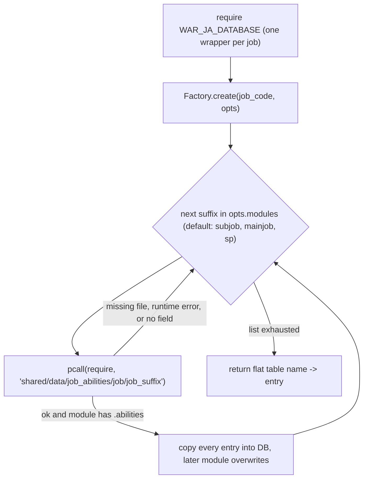
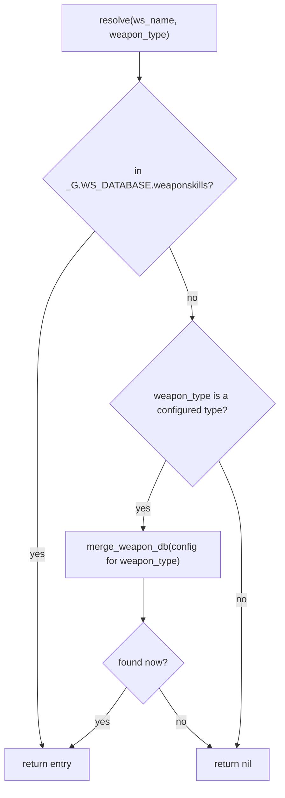

# Job ability and weapon skill databases

The project keeps two curated data sets under `shared/data/`: job abilities (`job_abilities/`, one
folder of small modules per job plus one factory-built aggregator per job) and weapon skills
(`weaponskills/`, one file per weapon skill type plus a lazy-loading facade). Neither data set has
behaviour of its own. They are read at runtime by three consumers: the JA announcement hook
(`shared/hooks/init_ability_messages.lua` -> `ability_message_handler.lua`, on every action whose
`action_type` is `'Ability'`), the WS announcement hook (`shared/hooks/init_ws_messages.lua`, on every
weapon skill), and the `//gs c info <name>` viewer (through `shared/utils/data/data_loader.lua`). RDM's
command fallback reads neither: it resolves names from the game resources. Offline, the job-ability
module files are the input of the generator that produced `_common/dualbox/alt/<JOB>_ALT_COMMANDS.lua`
(dual-box alt commands); that generator is not in the repository.

Nothing in this area registers events, keybinds, coroutines or `windower.*` fields. All state is
module-local or on the GearSwap sandbox `_G`, and is discarded every time GearSwap loads a job file.

Every claim below was checked against the code on 2026-09-28: all 84 JA module files, the 21
aggregators, the factory and the 14 weaponskill files were loaded with `lua5.1` and compared with
Windower `res/` (see [Integrity checks](#integrity-checks)). Citations name the function; line numbers
are given only where they were re-read that day.

## Files

### Job abilities: factory and aggregators (`shared/data/job_abilities/`)

| Path | Lines | Role |
|------|-------|------|
| `JA_DATABASE_FACTORY.lua` | 67 | `Factory.create(job, opts)`: loads `<job>/<job>_<suffix>` modules and merges their `.abilities` into one flat table |
| `BLM_JA_DATABASE.lua`, `BLU_`, `BRD_`, `DRK_`, `GEO_`, `MNK_`, `NIN_`, `PLD_`, `RDM_`, `RNG_`, `RUN_`, `SAM_`, `THF_`, `WAR_`, `WHM_JA_DATABASE.lua` | 13 each | `return Factory.create('<JOB>')`: default module list `{'subjob', 'mainjob', 'sp'}` |
| `BST_JA_DATABASE.lua` | 17 | modules `subjob, mainjob, pet_commands_mainjob, pet_commands_subjob, sp` |
| `COR_JA_DATABASE.lua` | 21 | modules `subjob, mainjob, sp, rolls_subjob, rolls_mainjob` |
| `DNC_JA_DATABASE.lua` | 26 | modules `subjob, mainjob, sp, waltzes_subjob, waltzes_mainjob, sambas_subjob, sambas_mainjob, steps_subjob, steps_mainjob, flourishes1_subjob, flourishes2_subjob, flourishes2_mainjob, flourishes3_mainjob, jigs_subjob, jigs_mainjob` |
| `DRG_JA_DATABASE.lua` | 20 | modules `subjob, mainjob, sp, pet_commands` |
| `PUP_JA_DATABASE.lua` | 20 | modules `subjob, mainjob, sp, pet_commands_subjob` |
| `SCH_JA_DATABASE.lua` | 25 | modules `subjob, mainjob, sp, white_grimoire_subjob, white_grimoire_mainjob, black_grimoire_subjob, black_grimoire_mainjob` |

There is no `smn/` folder and no `SMN_JA_DATABASE` (see `_master/config/alt/SMN_ALT_CUSTOM.lua`).

### Job abilities: every module file (`shared/data/job_abilities/<job>/`)

Each file is `local M = {} ; M.abilities = { ['Name'] = entry } ; return M`. The level in parentheses
is the entry's `level` field. `*_subjob` files hold abilities usable as a support job
(`main_job_only = false`), `*_mainjob` and `*_sp` files main-only ones.

| File | Lines | N | Abilities (level) |
|---|---|---|---|
| `blm/blm_subjob.lua` | 34 | 1 | Elemental Seal (15) |
| `blm/blm_mainjob.lua` | 76 | 4 | Mana Wall (76), Cascade (85), Enmity Douse (87), Manawell (95) |
| `blm/blm_sp.lua` | 51 | 2 | Manafont (1), Subtle Sorcery (96) |
| `blu/blu_subjob.lua` | 42 | 2 | Burst Affinity (25), Chain Affinity (40) |
| `blu/blu_mainjob.lua` | 60 | 4 | Convergence (75), Diffusion (75), Efflux (83), Unbridled Learning (95) |
| `blu/blu_sp.lua` | 44 | 2 | Azure Lore (1), Unbridled Wisdom (96) |
| `brd/brd_subjob.lua` | 34 | 1 | Pianissimo (20) |
| `brd/brd_mainjob.lua` | 64 | 4 | Nightingale (75), Troubadour (75), Tenuto (83), Marcato (95) |
| `brd/brd_sp.lua` | 44 | 2 | Soul Voice (1), Clarion Call (96) |
| `bst/bst_subjob.lua` | 78 | 6 | Charm (1), Gauge (10), Reward (12), Call Beast (23), Bestial Loyalty (23), Tame (30) |
| `bst/bst_mainjob.lua` | 42 | 2 | Feral Howl (75), Killer Instinct (75) |
| `bst/bst_sp.lua` | 44 | 2 | Familiar (1), Unleash (96) |
| `bst/bst_pet_commands_subjob.lua` | 69 | 5 | Fight (1), Heel (10), Stay (15), Sic (25), Leave (35) |
| `bst/bst_pet_commands_mainjob.lua` | 60 | 4 | Ready (25), Snarl (45), Spur (83), Run Wild (93) |
| `cor/cor_subjob.lua` | 55 | 3 | Double-Up (5), Quick Draw (40), Random Deal (50) |
| `cor/cor_mainjob.lua` | 64 | 4 | Fold (75), Snake Eye (75), Triple Shot (87), Crooked Cards (95) |
| `cor/cor_sp.lua` | 44 | 2 | Wild Card (1), Cutting Cards (96) |
| `cor/cor_rolls_subjob.lua` | 174 | 18 | Corsair's (5), Ninja (8), Hunter's (11), Chaos (14), Magus's (17), Healer's (20), Drachen (23), Choral (26), Monk's (31), Beast (34), Samurai (37), Evoker's (40), Rogue's (43), Warlock's (46), Fighter's (49), Puppet (52), Gallant's (55), Wizard's (58) Roll |
| `cor/cor_rolls_mainjob.lua` | 127 | 13 | Dancer's (61), Scholar's (64), Naturalist's (67), Runeist's (70), Bolter's (76), Caster's (79), Courser's (81), Blitzer's (83), Tactician's (86), Allies' (89), Miser's (92), Companion's (95), Avenger's (97) Roll |
| `dnc/dnc_subjob.lua` | 33 | 1 | Contradance (50) |
| `dnc/dnc_mainjob.lua` | 60 | 4 | Fan Dance (75), No Foot Rise (75), Saber Dance (75), Presto (77) |
| `dnc/dnc_sp.lua` | 42 | 2 | Trance (1), Grand Pas (96) |
| `dnc/dnc_waltzes_subjob.lua` | 62 | 5 | Curing Waltz (15), Divine Waltz (25), Curing Waltz II (30), Healing Waltz (35), Curing Waltz III (45) |
| `dnc/dnc_waltzes_mainjob.lua` | 46 | 3 | Curing Waltz IV (70), Divine Waltz II (78), Curing Waltz V (87) |
| `dnc/dnc_sambas_subjob.lua` | 54 | 4 | Drain Samba (5), Aspir Samba (25), Drain Samba II (35), Haste Samba (45) |
| `dnc/dnc_sambas_mainjob.lua` | 38 | 2 | Aspir Samba II (60), Drain Samba III (65) |
| `dnc/dnc_steps_subjob.lua` | 46 | 3 | Quickstep (20), Box Step (30), Stutter Step (40) |
| `dnc/dnc_steps_mainjob.lua` | 30 | 1 | Feather Step (83) |
| `dnc/dnc_jigs_subjob.lua` | 30 | 1 | Spectral Jig (25) |
| `dnc/dnc_jigs_mainjob.lua` | 38 | 2 | Chocobo Jig (55), Chocobo Jig II (70) |
| `dnc/dnc_flourishes1_subjob.lua` | 50 | 3 | Animated Flourish (20), Desperate Flourish (30), Violent Flourish (45) |
| `dnc/dnc_flourishes2_subjob.lua` | 40 | 2 | Reverse Flourish (40), Building Flourish (50) |
| `dnc/dnc_flourishes2_mainjob.lua` | 31 | 1 | Wild Flourish (60) |
| `dnc/dnc_flourishes3_mainjob.lua` | 50 | 3 | Climactic Flourish (80), Striking Flourish (89), Ternary Flourish (93) |
| `drg/drg_subjob.lua` | 64 | 5 | Ancient Circle (5), Jump (10), Spirit Link (25), High Jump (35), Super Jump (50) |
| `drg/drg_mainjob.lua` | 82 | 7 | Call Wyvern (1), Spirit Bond (65), Angon (75), Deep Breathing (75), Spirit Jump (77), Soul Jump (85), Dragon Breaker (87) |
| `drg/drg_sp.lua` | 44 | 2 | Spirit Surge (1), Fly High (96) |
| `drg/drg_pet_commands.lua` | 60 | 4 | Dismiss (1), Restoring Breath (90), Smiting Breath (90), Steady Wing (95) |
| `drk/drk_subjob.lua` | 69 | 5 | Arcane Circle (5), Last Resort (15), Weapon Bash (20), Souleater (30), Consume Mana (55) |
| `drk/drk_mainjob.lua` | 69 | 5 | Dark Seal (75), Diabolic Eye (75), Nether Void (78), Arcane Crest (87), Scarlet Delirium (95) |
| `drk/drk_sp.lua` | 44 | 2 | Blood Weapon (1), Soul Enslavement (96) |
| `geo/geo_subjob.lua` | 38 | 2 | Collimated Fervor (40), Life Cycle (50) |
| `geo/geo_mainjob.lua` | 110 | 10 | Full Circle (5), Ecliptic Attrition (25), Lasting Emanation (25), Blaze of Glory (60), Dematerialize (70), Entrust (75), Mending Halation (75), Radial Arcana (75), Theurgic Focus (80), Concentric Pulse (90) |
| `geo/geo_sp.lua` | 44 | 2 | Bolster (1), Widened Compass (96) |
| `mnk/mnk_subjob.lua` | 78 | 6 | Boost (5), Dodge (15), Focus (25), Chakra (35), Chi Blast (41), Counterstance (45) |
| `mnk/mnk_mainjob.lua` | 69 | 5 | Footwork (65), Formless Strikes (75), Mantra (75), Perfect Counter (79), Impetus (88) |
| `mnk/mnk_sp.lua` | 44 | 2 | Hundred Fists (1), Inner Strength (96) |
| `nin/nin_mainjob.lua` | 69 | 5 | Innin (40), Yonin (40), Sange (75), Futae (77), Issekigan (95) |
| `nin/nin_sp.lua` | 44 | 2 | Mijin Gakure (1), Mikage (96) |
| `pld/pld_subjob.lua` | 60 | 4 | Holy Circle (5), Shield Bash (15), Sentinel (30), Cover (35) |
| `pld/pld_mainjob.lua` | 87 | 7 | Rampart (62), Majesty (70), Chivalry (75), Fealty (75), Divine Emblem (78), Sepulcher (87), Palisade (95) |
| `pld/pld_sp.lua` | 44 | 2 | Invincible (1), Intervene (96) |
| `pup/pup_subjob.lua` | 42 | 2 | Activate (1), Repair (15) |
| `pup/pup_mainjob.lua` | 78 | 6 | Deus Ex Automata (5), Maintenance (30), Role Reversal (75), Ventriloquy (75), Tactical Switch (79), Cooldown (95) |
| `pup/pup_sp.lua` | 44 | 2 | Overdrive (1), Heady Artifice (96) |
| `pup/pup_pet_commands_subjob.lua` | 123 | 11 | Deploy (1), Deactivate (1), Retrieve (10), Fire / Ice / Wind / Earth / Thunder / Water / Light / Dark Maneuver (1) |
| `rdm/rdm_subjob.lua` | 33 | 1 | Convert (40) |
| `rdm/rdm_mainjob.lua` | 51 | 3 | Composure (50), Saboteur (83), Spontaneity (95) |
| `rdm/rdm_sp.lua` | 44 | 2 | Chainspell (1), Stymie (96) |
| `rng/rng_subjob.lua` | 78 | 6 | Sharpshot (1), Scavenge (10), Camouflage (20), Barrage (30), Shadowbind (40), Unlimited Shot (51) |
| `rng/rng_mainjob.lua` | 87 | 7 | Velocity Shot (45), Flashy Shot (75), Stealth Shot (75), Double Shot (79), Bounty Shot (87), Decoy Shot (95), Hover Shot (95) |
| `rng/rng_sp.lua` | 44 | 2 | Eagle Eye Shot (1), Overkill (96) |
| `run/run_subjob.lua` | 145 | 14 | Ignis, Gelus, Flabra, Tellus, Sulpor, Unda, Lux, Tenebrae (5), Vallation (10), Swordplay (20), Lunge (25), Swipe (25), Pflug (40), Valiance (50) |
| `run/run_mainjob.lua` | 87 | 7 | Embolden (60), Vivacious Pulse (65), Gambit (70), Battuta (75), Rayke (75), Liement (85), One for All (95) |
| `run/run_sp.lua` | 44 | 2 | Elemental Sforzo (1), Odyllic Subterfuge (96) |
| `sam/sam_subjob.lua` | 78 | 6 | Warding Circle (5), Third Eye (15), Hasso (25), Meditate (30), Seigan (35), Sekkanoki (40) |
| `sam/sam_mainjob.lua` | 78 | 6 | Konzen-ittai (65), Blade Bash (75), Shikikoyo (75), Sengikori (77), Hamanoha (87), Hagakure (95) |
| `sam/sam_sp.lua` | 44 | 2 | Meikyo Shisui (1), Yaegasumi (96) |
| `sch/sch_subjob.lua` | 51 | 3 | Light Arts (10), Dark Arts (10), Sublimation (35) |
| `sch/sch_mainjob.lua` | 51 | 3 | Modus Veritas (65), Enlightenment (75), Libra (76) |
| `sch/sch_sp.lua` | 44 | 2 | Tabula Rasa (1), Caper Emissarius (96) |
| `sch/sch_white_grimoire_subjob.lua` | 70 | 5 | Penury (10), Addendum: White (10), Celerity (25), Accession (40), Rapture (55) |
| `sch/sch_white_grimoire_mainjob.lua` | 52 | 3 | Altruism (75), Tranquility (75), Perpetuance (87) |
| `sch/sch_black_grimoire_subjob.lua` | 70 | 5 | Parsimony (10), Alacrity (25), Addendum: Black (30), Manifestation (40), Ebullience (55) |
| `sch/sch_black_grimoire_mainjob.lua` | 52 | 3 | Equanimity (75), Focalization (75), Immanence (87) |
| `thf/thf_subjob.lua` | 74 | 6 | Steal (5), Sneak Attack (15), Flee (25), Trick Attack (30), Mug (35), Hide (45) |
| `thf/thf_mainjob.lua` | 81 | 7 | Accomplice (65), Collaborator (65), Assassin's Charge (75), Feint (75), Despoil (77), Conspirator (87), Bully (93) |
| `thf/thf_sp.lua` | 44 | 2 | Perfect Dodge (1), Larceny (96) |
| `war/war_subjob.lua` | 69 | 5 | Provoke (5), Berserk (15), Defender (25), Warcry (35), Aggressor (45) |
| `war/war_mainjob.lua` | 69 | 5 | Retaliation (60), Tomahawk (75), Warrior's Charge (75), Restraint (77), Blood Rage (87) |
| `war/war_sp.lua` | 44 | 2 | Mighty Strikes (1), Brazen Rush (96) |
| `whm/whm_subjob.lua` | 33 | 1 | Divine Seal (15) |
| `whm/whm_mainjob.lua` | 78 | 6 | Afflatus Solace (40), Afflatus Misery (40), Martyr (75), Devotion (75), Divine Caress (83), Sacrosanctity (95) |
| `whm/whm_sp.lua` | 44 | 2 | Benediction (1), Asylum (96) |

84 files, 334 abilities. `nin/` has no `nin_subjob.lua` (the factory skips the missing suffix
silently). Master Level abilities are filed as subjob with a level above 49: Building Flourish 50,
Contradance 50, Life Cycle 50, Random Deal 50, Super Jump 50, Valiance 50, Unlimited Shot 51, Puppet
Roll 52, Consume Mana 55, Ebullience 55, Gallant's Roll 55, Rapture 55, Wizard's Roll 58.

### Weapon skills (`shared/data/weaponskills/`)

| Path | Lines | Entries | Role |
|------|-------|---------|------|
| `UNIVERSAL_WS_DATABASE.lua` | 140 | - | Facade: `resolve()` merges the file of the WS's own skill into `_G.WS_DATABASE`; `ensure_weapon_type()` |
| `SWORD_WS_DATABASE.lua` | 302 | 18 | Standard schema |
| `DAGGER_WS_DATABASE.lua` | 297 | 18 | Alternate schema (see below) |
| `H2H_WS_DATABASE.lua` | 293 | 17 | Standard schema |
| `GREATSWORD_WS_DATABASE.lua` | 254 | 15 | Standard schema |
| `GREATAXE_WS_DATABASE.lua` | 244 | 14 | Standard schema |
| `AXE_WS_DATABASE.lua` | 243 | 15 | Standard schema |
| `SCYTHE_WS_DATABASE.lua` | 255 | 15 | Standard schema |
| `POLEARM_WS_DATABASE.lua` | 254 | 15 | Standard schema |
| `KATANA_WS_DATABASE.lua` | 242 | 15 | Standard schema |
| `GREATKATANA_WS_DATABASE.lua` | 247 | 15 | Standard schema |
| `STAFF_WS_DATABASE.lua` | 340 | 18 | Standard schema |
| `CLUB_WS_DATABASE.lua` | 345 | 17 | Standard schema |
| `ARCHERY_WS_DATABASE.lua` | 240 | 12 | Standard schema |

204 weapon skills, each filed once, in the file of its own `res` skill. There is no Marksmanship file.
The weapon files are pure data (`local M = {}; M.weaponskills = {...}; return M`).

### Developer notes (`_dev/`, gitignored, local only)

| Path | Status |
|------|--------|
| `_dev/JOB_ABILITIES_DATABASE.md` | Describes a pre-factory design (string-valued entries, a 12-job merge loop, PRECAST modules reading `JA_DB[spell.english]`). Does not match the code. |
| `_dev/WS_DATABASE_SYSTEM.md` | Describes a `GREAT_AXE_WS_DATABASE` file, the DAGGER-style schema as the standard, PRECAST integration through `WS_DB[spell.english]`. Does not match the code. |
| `_dev/ATTACK_PDL_SYSTEM.md` | Design note on pDIF caps; nothing in Lua implements it and it does not touch these databases. |

### Consumers (documented elsewhere, listed for navigation)

| Path | Uses |
|------|------|
| `shared/hooks/init_ability_messages.lua` | Wraps `user_post_precast`, calls `AbilityMessageHandler.show_message` for `action_type == 'Ability'` |
| `shared/utils/messages/handlers/ability_message_handler.lua` | Requires `<JOB>_JA_DATABASE` per job (`load_ja_db`), reads `.description` |
| `shared/hooks/init_ws_messages.lua` | The only module that requires `UNIVERSAL_WS_DATABASE` (`:64`); calls `resolve(spell.english, spell.skill)` in `full` mode only and reads `.description` |
| `shared/utils/data/data_loader.lua` + `shared/utils/commands/info_command.lua` | `//gs c info`: loads every module file directly into `_G.FFXI_DATA` |
| `shared/jobs/pld/functions/logic/rune_manager.lua`, `shared/jobs/run/functions/logic/rune_manager.lua` | Comments only: the rune announcement comes from the ability handler reading `RUN_JA_DATABASE`; the managers read `res` for the recast |

`CooldownChecker`, `AbilityHelper`, `WSPrecastHandler` and `tp_bonus_handler`/`tp_bonus_calculator` do
not read these databases: cooldowns come from `spell.recast_id`, `AbilityHelper` reads Windower
`resources` and `windower.ffxi.get_abilities()`. COR roll logic uses its own
`shared/jobs/cor/functions/logic/roll_data.lua` (the lucky/unlucky numbers of both copies agree).

## Data schemas

### Job ability entry

| Field | Type | Present on | Runtime reader |
|-------|------|------------|----------------|
| `description` | string | all 334 entries | `ability_message_handler.lua` (only in `ja_mode == 'full'`), `info_command.lua` |
| `level` | number | all | `info_command.lua`; offline alt-commands generator |
| `recast` | number, seconds (SCH stratagems and rolls use `0`) | all | `info_command.lua` |
| `main_job_only` | boolean | all | offline alt-commands generator only (`main_only` in `_common/dualbox/alt/*_ALT_COMMANDS.lua`) |
| `cumulative_enmity`, `volatile_enmity` | number | all except the 31 rolls and `Assassin's Charge` | none |
| `fm_cost` | number | DNC flourishes | none |
| `lucky`, `unlucky` | number | COR rolls | none |

`display_job_ability` (`info_command.lua:208`) also asks for `type`, `duration`, `effect`, `radius`,
`cost`, `category`; no JA entry has them, so they are simply not printed.

### Main job vs subjob

The split is by file, and every file is consistent with its suffix (checked): all entries in
`*_subjob.lua` have `main_job_only = false`, all entries in `*_mainjob.lua`, `*_sp.lua` and
`drg_pet_commands.lua` have `main_job_only = true`.

At runtime nothing filters on `main_job_only` or `level`: an aggregator merges all files of a job,
main-only ones included, and `ability_message_handler` looks names up in the whole main and sub job
aggregators.

### Weapon skill entry, standard schema (12 files)

| Field | Type | Notes |
|-------|------|-------|
| `description` | string | The only field read by the WS announcement |
| `type` | `'Physical'` / `'Magical'` / `'Hybrid'` | |
| `mods` | `{STAT = percent}` | |
| `hits` | number | `0` for self-target utilities (Starlight, Moonlight, Dagan, Myrkr) |
| `element` | string or nil | |
| `skillchain` | array of property names | |
| `ftp` | `{[1000]=n, [2000]=n, [3000]=n}` | |
| `skill_required` | number | |
| `jobs` | `{JOB = level}` | |
| `special_notes` | string, optional | |
| `weapon_type`, `weapon_file` | string | Not in the files: written into the entry by `merge_weapon_db` |

### Weapon skill entry, DAGGER schema

`DAGGER_WS_DATABASE.lua` uses different keys: `description`, `skill_level`, `job_levels`,
`stat_modifiers` (string such as `"100% DEX"`), `sc_properties`, `requires_quest`, `quest_name`,
`requires_merit`, `merit_ranks`, `special_weapons` (array of `{weapon, level, type, bonus|aftermath}`),
`element`, `notes`. It has no `type`, `mods`, `hits`, `ftp`, `skill_required`, `jobs` or `skillchain`.
The announcement only needs `description`, so it works; `//gs c info` shows only the fields it knows.
`main_or_sub` (array of job codes, Viper Bite, Cyclone, Energy Drain, Aeolian Edge) lists the jobs one of
which must be the main or the subjob (BG Wiki). The Atelier export reads `jobs` or `job_levels` and
`main_or_sub` to list every weaponskill the loaded job and subjob can use
(`shared/utils/atelier/atelier_ws.lua`).

## How it works

### Building a job database


```mermaid
flowchart TD
  A["require WAR_JA_DATABASE (one wrapper per job)"] --> B["Factory.create(job_code, opts)"]
  B --> C{"next suffix in opts.modules (default: subjob, mainjob, sp)"}
  C --> D["pcall(require, 'shared/data/job_abilities/job/job_suffix')"]
  D -->|"ok and module has .abilities"| E["copy every entry into DB, later module overwrites"]
  D -->|"missing file, runtime error, or no field"| C
  E --> C
  C -->|"list exhausted"| F["return flat table name -> entry"]
```

1. The wrapper calls `Factory.create('WAR')` or passes `opts.modules` (BST, COR, DNC, DRG, PUP, SCH).
2. `create` lowercases the job, picks `opts.modules` or `{'subjob','mainjob','sp'}` and
   `opts.source_field` or `'abilities'`.
3. For each suffix it builds `shared/data/job_abilities/<job>/<job>_<suffix>` and `pcall(require, ...)`.
   In the sandbox `require` is `include_user` (wrapped by `ModuleCache`), which raises
   `Cannot find the include file` for a missing file; the `pcall` swallows it, so a wrong suffix or a
   missing file (`nin_subjob`) is skipped without any message.
4. Entries are copied with `DB[name] = data`; on a name collision inside one job the later module wins.
   There are no collisions today.
5. `opts.extra` would run a second pass with another field name. No wrapper passes it.

### Lazy loading and module caching

Nothing here is loaded at job load. `ability_message_handler.lua` `load_ja_db(job_code)` requires one
`<JOB>_JA_DATABASE` at a time, memoised in `JOB_DATABASES` (a failed load is stored as `false`), and the
first ability after a load normally needs only the main and sub job databases. The WS facade is
required by `init_ws_messages.lua` on the first weapon skill (`ensure_*` pattern), and each weapon file
only when a WS of that skill is announced in `full` mode. `data_loader` loads everything, but only on
the first `//gs c info`.

`include_user` never writes `package.loaded`, so without help every `require` re-executes the file. The
project's `ModuleCache` (`shared/utils/core/module_cache.lua`, installed first by
`shared/utils/config/config_loader.lua`) replaces the sandbox `require` with a caching one keyed by the
lower-cased path. From then on each aggregator, each module file and the WS facade are executed once
per sandbox. GearSwap builds a new sandbox (`user_env`) on every job-file load, and `JobChangeManager`
sends `gs reload` on main and sub job changes, so the cache, the aggregators, `_G.WS_DATABASE` and
`_G.FFXI_DATA` are all rebuilt after a job or subjob change. Because the cache hands the same table to
every caller, the entry tables mutated by `merge_weapon_db` (`weapon_type`, `weapon_file`) are the same
objects `data_loader` stores.

### Runtime lookup on an action

```mermaid
sequenceDiagram
  participant Mote as Mote precast
  participant WSHook as init_ws_messages wrapper
  participant JAHook as init_ability_messages wrapper
  participant AMH as AbilityMessageHandler
  participant UWS as UniversalWS
  Mote->>WSHook: user_post_precast(spell)
  WSHook->>JAHook: original user_post_precast
  JAHook->>AMH: show_message(spell) when action_type is Ability
  AMH->>AMH: WeaponSkill: return; Blood Pact: SMN spell DB only
  AMH->>AMH: lookup in main job DB, then sub job DB
  AMH->>AMH: miss, type held by the JA DBs: lookup in each of 21 job DBs
  AMH-->>JAHook: show_ja_activated or silent
  WSHook->>UWS: resolve(spell.english, spell.skill) when type is WeaponSkill, not cancelled, TP >= 1000 and ws_mode is full
  UWS-->>WSHook: entry or nil
  WSHook-->>Mote: show_ws_activated or show_ws_tp
```

Every entry file includes the ability hook before the WS hook (checked on every file of
`shared/entry/`, which every character entry includes), so the WS wrapper runs the ability wrapper first.

JA path (`ability_message_handler.lua`):

1. `show_message` (`:215`) returns unless `spell.action_type == 'Ability'`, returns for
   `type == 'WeaponSkill'`, skips `type == 'CorsairRoll'` and `name == 'Pianissimo'`, returns when
   `ja_mode` is off.
2. `find_ability_in_databases(spell.name, spell.type)` (`:150`): `BloodPactRage` and `BloodPactWard`
   go straight to `shared/data/magic/SMN_SPELL_DATABASE`, accepting only `Blood Pact: Rage/Ward`
   categories (`find_blood_pact`, `:130`).
3. Otherwise it reads `windower.ffxi.get_player()` and tries the main then the sub job database via
   `load_ja_db` (`:78`).
4. On a miss, and only when `spell.type` is one of the types the JA databases hold (`DATABASE_TYPES`,
   `:94`: JobAbility, Scholar, Rune, Ward, Effusion, Waltz, Samba, Step, Jig, Flourish1-3), it walks all
   21 codes in `JOBS` (`:66`), loading every aggregator it has not loaded yet. `Monster` (Ready moves),
   `CorsairShot` (Quick Draw) and `PetCommand` stop after main/sub: the BST, PUP and DRG databases hold
   their own job's pet commands, and only that job (main or sub) can use them; SMN's are in no database.
5. A hit prints `show_ja_activated(name, description)`, `description` only in `full` mode; the same
   name within 0.5 s is not repeated (`DUPLICATE_THRESHOLD`, `recent_messages`).

GearSwap gives `action_type = 'Ability'` to `/ws`, `/pet`, `/bstpet` and `/ms` (*(engine)*
`statics.lua`), and `type = 'WeaponSkill'` to every weapon skill. Weapon skills, pet commands, Quick
Draw shots and Blood Pacts therefore reach this handler; the type checks above keep them out of the
21-database walk.

### Weapon skill resolution


```mermaid
flowchart TD
  R["resolve(ws_name, weapon_type)"] --> C1{"in _G.WS_DATABASE.weaponskills?"}
  C1 -->|yes| RET["return entry"]
  C1 -->|no| H{"weapon_type is a configured type?"}
  H -->|yes| M1["merge_weapon_db(config for weapon_type)"]
  M1 --> C2{"found now?"}
  C2 -->|yes| RET
  C2 -->|no| NIL["return nil"]
  H -->|no| NIL
```

1. On first require the facade creates `_G.WS_DATABASE = {weaponskills={}, weapon_types={}}`
   (`UNIVERSAL_WS_DATABASE.lua:45`).
2. `init_ws_messages.lua` passes `spell.skill`, the weaponskill's own skill as GearSwap reports it
   (`res.skills[id].english`), not the main hand's: a ranged WS belongs to the range slot.
3. `resolve` (`:127`) returns an already merged entry, else merges that skill's file and returns
   whatever it holds. A miss means no file holds the name; nothing else is merged. `weapon_type_configs`
   (`:63`) lists Sword, Dagger, Hand-to-Hand, Great Sword, Great Axe, Axe, Scythe, Polearm, Katana, Great
   Katana, Staff, Club, Archery.
4. `merge_weapon_db` (`:91`) is idempotent per type: `weapon_types[type]` (set to the file name at the
   end) is the "already merged" flag. It stores each entry once, in `_G.WS_DATABASE.weaponskills[name]`,
   tagging it with `weapon_type`/`weapon_file`. A file that fails to load is not marked, so it is
   retried on the next miss.
5. In `ws_mode == 'full'` the hook calls `resolve` and prints `show_ws_activated(name, description, tp)`
   only when an entry was found; in `on` / `tp` mode it prints `show_ws_tp(name, tp)` without calling
   `resolve`. Nothing is printed for a cancelled WS or with less than 1000 TP.

### `//gs c info` path

`data_loader.lua` keeps its own copy in `_G.FFXI_DATA`. `load_abilities` (`:156`) tries 21 jobs
(`ABILITY_JOBS`) x (3 standard suffixes `ABILITY_TYPES` + 21 special suffixes listed inline:
`pet_commands`, `pet_commands_mainjob/_subjob`, `rolls_*`, `waltzes_*`, `steps_*`, `flourishes1_subjob`,
`flourishes2_*`, `flourishes3_mainjob`, `sambas_*`, `jigs_*`, `black_grimoire_*`, `white_grimoire_*`) =
504 `pcall(require)` calls, of which 84 find a file, keeping the first entry for each name.
`load_weaponskills` (`:228`) loads the 13 files in its own order (`WEAPONSKILL_DATABASES`, Sword first)
and also keeps the first entry for each name. `search_all_databases` (`info_command.lua:297`) looks up
the exact name, then case-insensitively.

## Public API

### `JA_DATABASE_FACTORY`

`Factory.create(job_code, opts) -> table`
- `job_code`: 3-letter job code, any case (lowercased for paths). A nil `job_code` errors.
- `opts.modules`: array of suffixes; default `{'subjob','mainjob','sp'}`.
- `opts.source_field`: field read on each module; default `'abilities'`. No caller sets it.
- `opts.extra`: array of `{modules=..., source_field=...}` merged after the main pass. No caller sets it.
- Returns a new flat table `name -> entry`. No side effects besides the `require` calls.
- Callers: the 21 `<JOB>_JA_DATABASE.lua` wrappers only.

### `<JOB>_JA_DATABASE` (21 modules)

Return the flat table built by the factory. Only caller: `ability_message_handler.lua` `load_ja_db`
(one per job, lazily). Entry counts (2026-09-28): BLM 7, BLU 8, BRD 7, BST 19, COR 40, DNC 37, DRG 18,
DRK 12, GEO 14, MNK 13, NIN 7, PLD 13, PUP 21, RDM 6, RNG 15, RUN 23, SAM 14, SCH 24, THF 15, WAR 12,
WHM 9: **334**, every entry on disk.

### `UNIVERSAL_WS_DATABASE` (module `UniversalWS`)

| Function | Line | Behaviour | Callers |
|----------|------|-----------|---------|
| `resolve(ws_name, weapon_type)` | 127 | Returns the entry or nil, merging at most the one file of `weapon_type` | `init_ws_messages.lua` |
| `ensure_weapon_type(weapon_type)` | 113 | Merges one file by its `res.skills` English name; ignores unknown names | `resolve` only |

The former query API (`load()`, 13 query helpers, the per-weapon helpers) was removed in `e765fa2`
(2026-09-22): none had a caller.

## Commands

The data files register no command. Commands that reach them:

| Command | Handler | Effect on this area |
|---------|---------|---------------------|
| `//gs c info <name>` | `CommonCommands.handle_command` (`info` branch) -> `DebugCommands.handle_info` (`DEBUG_COMMANDS.lua:247`) -> `InfoCommand.handle` (`info_command.lua:360`) | Loads all JA module files and/or all 13 WS files into `_G.FFXI_DATA` on first use, prints the entry |
| `//gs c jamsg <full\|on\|off>` | `DebugCommands.handle_jamsg` (`DEBUG_COMMANDS.lua:221`) | Chooses whether JA announcements print `description` |
| `//gs c wsmsg <full\|on\|off\|tp>` | `DebugCommands.handle_wsmsg` (`DEBUG_COMMANDS.lua:236`) | `full` prints WS `description`, and prints nothing for a WS missing from the database; `tp` is an alias of `on` |

RDM's `//gs c <ability, WS or spell name> [<target>]` fallback (the end of `job_self_command` in
`RDM_COMMANDS.lua`) does not reach these databases: `resolve_action_prefix` sends `/ja` when
`res.job_abilities` has the name with prefix `/jobability` (pet moves, prefix `/pet`, are skipped
because 51 of them share a spell's name), else `/ws` when `res.weapon_skills` has it, else `/ma` when
`res.spells` has it (`ACTION_RESOURCES`).

## Configuration

The data modules read no configuration file. The consumers read the message modes from
`shared/config/message_settings.lua`, persisted per character in `<char>/saved/message_modes.lua`;
defaults are `ja_mode = 'on'`, `ws_mode = 'on'`.

## State & lifetime

- `_G.WS_DATABASE` (sandbox global): created by the facade on first require, filled by
  `merge_weapon_db`. It holds only `weaponskills` and `weapon_types`.
- `_G.FFXI_DATA` (sandbox global): `data_loader.lua`, flags set at the end of each `load_*`.
- Module-local: `JOB_DATABASES`, `JA_MESSAGES_CONFIG`, `recent_messages` in
  `ability_message_handler.lua`; `UniversalWS`/`modules_loaded` in `init_ws_messages.lua`.
- Entry tables of the weapon modules are mutated in place (`weapon_type`, `weapon_file`).
- Reads: `windower.ffxi.get_player()` (`ability_message_handler.lua` `find_ability_in_databases`,
  `init_ws_messages.lua` for the TP).
- All of the above die with the sandbox: gs reload, main job change, subjob change (through
  `JobChangeManager`'s debounced `gs reload`). Between a subjob change and that reload,
  `ability_message_handler` already looks in the new sub job's database, because it reads the jobs live
  on every lookup. Zone changes and death do not touch this area.
- No events, keybinds, coroutines, text objects or `windower.*` fields. (The two hook files increment
  `windower._hook_wraps` - see [messages](../systems/messages.md).)

## Interactions

- Announcements and their modes: [messages](../systems/messages.md).
- WS precast chain (`WSPrecastHandler` does not load the facade): [precast pipeline](../systems/precast-pipeline.md).
- `//gs c info` and the debug command table: [commands and debug](../systems/commands-and-debug.md).
- Sandbox, `ModuleCache`, load order in `get_sets`: [core lifecycle](../systems/core-lifecycle.md),
  [job change lifecycle](../architecture/job-change-lifecycle.md).
- Dual-box alt commands generated from the JA module files: [dual-box](../systems/dualbox.md).
- Job pages that depend on specific entries: [PUP](../jobs/pup.md) (pet commands), [COR](../jobs/cor.md)
  (rolls, Quick Draw), [PLD](../jobs/pld.md) and [RUN](../jobs/run.md) (rune announcements come from the
  ability handler reading `RUN_JA_DATABASE`, since `Rune` is one of the `DATABASE_TYPES`).
- Blood pact records: [spell-databases.md](spell-databases.md) (`SMN_SPELL_DATABASE`).

## Invariants & gotchas

- Every weapon skill reaches `AbilityMessageHandler.show_message` (GearSwap maps `/ws` to
  `action_type = 'Ability'`); it returns on `type == 'WeaponSkill'` before any lookup.
- A player can only use abilities of the main or sub job, and there are no cross-job duplicates, so the
  21-job fallback in `find_ability_in_databases` can only miss. Blood Pacts never reach it: their type
  sends them to the SMN database first.
- A missing or misspelt module file is silent (step 3 of the build). Check new files by loading them
  with `lua5.1` as in [Integrity checks](#integrity-checks), or with `//gs c info <name>`.
- Collision precedence differs by consumer (no collision exists today): factory = later module wins;
  `ability_message_handler` = main job before sub job; `data_loader` = first file in its own order wins.
- `resolve` is given the weapon skill's own skill (`spell.skill`), so it merges at most that one file. A
  WS missing from its skill's file (Atonement, every Marksmanship WS) returns nil and merges nothing
  else.
- The JA handler looks up `spell.name`; the WS hook uses `spell.english`.
- Files are found through GearSwap `pathsearch`, which checks `data/<player>/` before `data/`; a file at
  `data/<player>/shared/data/...` would shadow the shared one. None exists today.
- `info` shows `Weapon Type` for a WS only after `resolve` has merged that WS's file in the same sandbox
  (shared tables through `ModuleCache`); `data_loader` does not set it.

## Extending

**Add an ability to an existing job**: add the entry to the right module file (`_subjob` if usable as
sub, else `_mainjob` or `_sp`) with the standard fields (`description`, `level`, `recast`,
`main_job_only`, `cumulative_enmity`, `volatile_enmity`), keyed by the exact `res/job_abilities.lua`
`en` name. Nothing else is needed for announcements or `info`. The generated
`_common/dualbox/alt/<JOB>_ALT_COMMANDS.lua` does not pick it up (the generator is not in the repository); add
it to `<JOB>_ALT_CUSTOM.lua` if the alt should use it.

**Add a module file to a job**: create `<job>/<job>_<suffix>.lua` with `.abilities`, then add the suffix
to the wrapper's `modules` list (the default list only covers `subjob`, `mainjob`, `sp`). If the suffix
is not one of the 24 that `data_loader.load_abilities` probes (`ABILITY_TYPES` + the inline
`special_patterns` list), add it there too, or `info` will not see it.

**Add a job**: create the folder and `<JOB>_JA_DATABASE.lua`; add the code to `JOBS` in
`ability_message_handler.lua` and `ABILITY_JOBS` in `data_loader.lua`. A job whose abilities use a `res`
type not yet in `DATABASE_TYPES` needs that type added there too.

**Add a weapon skill**: use the standard schema, in the file matching the WS's skill in
`res/weapon_skills.lua` (not the weapon that happens to unlock it).

**Add a weapon type** (Marksmanship is the missing one): create `<TYPE>_WS_DATABASE.lua` with
`.weaponskills`, add `{file=..., type=<res.skills English name>}` to `weapon_type_configs`
(`UNIVERSAL_WS_DATABASE.lua:63`; `type` must equal `res.skills[id].en`, the `spell.skill` that `resolve`
receives, or the file is never merged), and add the path to `WEAPONSKILL_DATABASES` in
`data_loader.lua`.

## For maintainers / AI

Invariants to keep:

- Module files and weapon files are pure data: no `require`, no function, no global. The factory and
  the facade are the only code.
- Keys are the exact `res` English names (`res/job_abilities.lua`, `res/weapon_skills.lua`); the join
  with `spell.name` / `spell.english` depends on it.
- A new ability goes into exactly one file; a new WS into exactly one weapon file, the one of its `res`
  skill.
- Keep loading lazy: never require a `<JOB>_JA_DATABASE`, the WS facade or `data_loader.load_*` from an
  entry file, `user_setup`, `INIT_SYSTEMS` or a hook installer. The first-action freeze these databases
  once caused came from pre-loading all of them.

Traps:

- The factory hides missing files. After adding a file or a suffix, count the aggregator's entries
  offline (below) or run `//gs c info <new ability>` in game.
- `data_loader`'s suffix list is separate from the wrappers' lists; the two must be kept in step by
  hand.
- Do not scan whole resource tables in game to build a name index (`res.job_abilities` ~630 entries,
  `res.items` ~23 500); look up by the id the event carries, or build one index once, lazily.
- Offline scripts belong in a scratch directory, not in the repo.

Offline integrity check with Lua 5.1 (`C:/ProgramData/chocolatey/bin/lua5.1.exe`), from a scratch
directory:

```lua
local root = 'D:/Windower Tetsouo/addons/GearSwap/data'
package.path = root .. '/?.lua;' .. package.path
local n = 0
for name in pairs(require('shared/data/job_abilities/WAR_JA_DATABASE')) do n = n + 1 end
print('WAR', n)                                   -- 12
local res_ja = loadfile('D:/Windower Tetsouo/res/job_abilities.lua')()
local by_name = {}
for _, a in pairs(res_ja) do by_name[a.en] = true end
for name in pairs(require('shared/data/job_abilities/WAR_JA_DATABASE')) do
    if not by_name[name] then print('not in res:', name) end
end
```

The same pattern with `dofile` on each `weaponskills/*_WS_DATABASE.lua` and `res/weapon_skills.lua` /
`res/skills.lua` checks the WS side. Outside the sandbox, stock `require` caches in `package.loaded`,
which matches the in-game behaviour under `ModuleCache`.

## Integrity checks

Results on 2026-09-28:

| Check | Result |
|-------|--------|
| JA module files | 84, all reachable from an aggregator |
| JA entries | 334 on disk, 334 through the aggregators, 334 in `FFXI_DATA.abilities` |
| Duplicate JA names (across all 84 files) | none, so the main-then-sub lookup order never changes the result |
| JA names present in `res/job_abilities.lua` | all 334 |
| Suffix vs `main_job_only` | consistent in every file |
| Missing fields | `cumulative_enmity`/`volatile_enmity` absent on 31 rolls and `Assassin's Charge`; no reader, no effect |
| WS entries | 204 across 13 files, 204 distinct names |
| Cross-file WS duplicates | none |
| WS names present in `res/weapon_skills.lua` | all |
| Player WS in `res` with no entry | Marksmanship (14, including Leaden Salute, Last Stand, Wildfire, Trueflight, Coronach), Sword (Atonement, Spirits Within, Glory Slash, Imperator, Knights of Rotund), Great Axe (Disaster), Hand-to-Hand (Final Paradise) |
| Schema | 12 files standard, DAGGER alternate |

## Known issues

Re-checked on 2026-09-28. Open:

- Every SMN job ability (Apogee, Astral Conduit, Mana Cede, Elemental Siphon, Astral Flow) runs the
  ability handler's 21-database walk: SMN has no JA database and the type is `JobAbility`, so the first
  one after a job-file load loads every JA database - `find_ability_in_databases`,
  `shared/utils/messages/handlers/ability_message_handler.lua:150`
- No Marksmanship file and several missing Sword/Great Axe/H2H WS; in `ws_mode == 'full'` those WS
  print nothing (e.g. Atonement, Leaden Salute) - `weapon_type_configs`,
  `shared/data/weaponskills/UNIVERSAL_WS_DATABASE.lua:63`
- DAGGER uses a different schema; `info` shows only the description (and element when set) for its 18
  WS - `shared/data/weaponskills/DAGGER_WS_DATABASE.lua`
- `data_loader` duplicates the wrappers' suffix lists; a new suffix must be added in both places -
  `DataLoader.load_abilities`, `shared/utils/data/data_loader.lua:156`
- `_dev/JOB_ABILITIES_DATABASE.md` and `_dev/WS_DATABASE_SYSTEM.md` describe a design that no longer
  exists.
- The recast and rune-text corrections of 2026-09-25 are checked against BG-Wiki only; `//gs c info`
  on a corrected JA and a rune message with `ja_mode full` are not yet seen in game.

Fixed:

- PUP and DRG pet command files not loaded by their aggregators: loaded since `142fcb7` (2026-09-22).
- Seven WS filed in two weapon files, wrong configured counts: each WS filed once since `8270688`
  (2026-09-24); counts removed from the config and the facade header corrected (2026-09-25).
- `UniversalWS.load`, its 13 query helpers and the per-weapon helpers without reader: removed in
  `e765fa2` (2026-09-22). The `_G.WS_DATABASE[name]` root copies: removed (2026-09-25).
- Stale factory and COR headers: corrected (`85ad22b`, 2026-09-24).
- `//gs c info` could not see the DRG pet commands (no bare `pet_commands` suffix): added (2026-09-25).
- Descriptions and 15 recasts re-checked against BG-Wiki (`ed3dabe`, 2026-09-24, and 2026-09-25).
