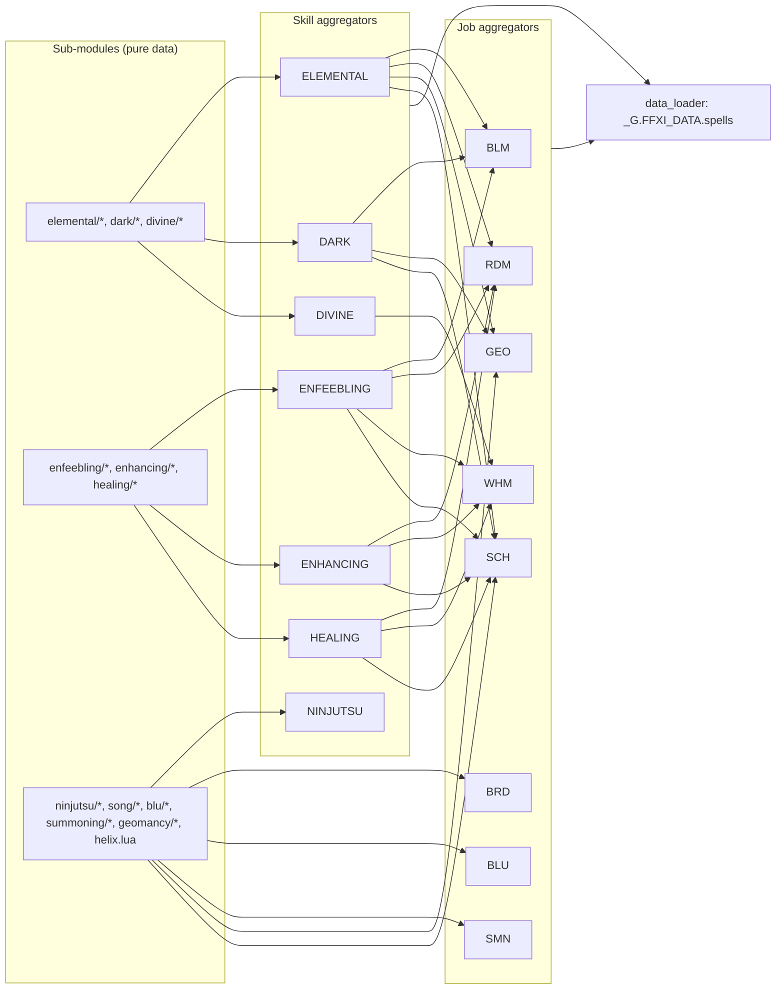
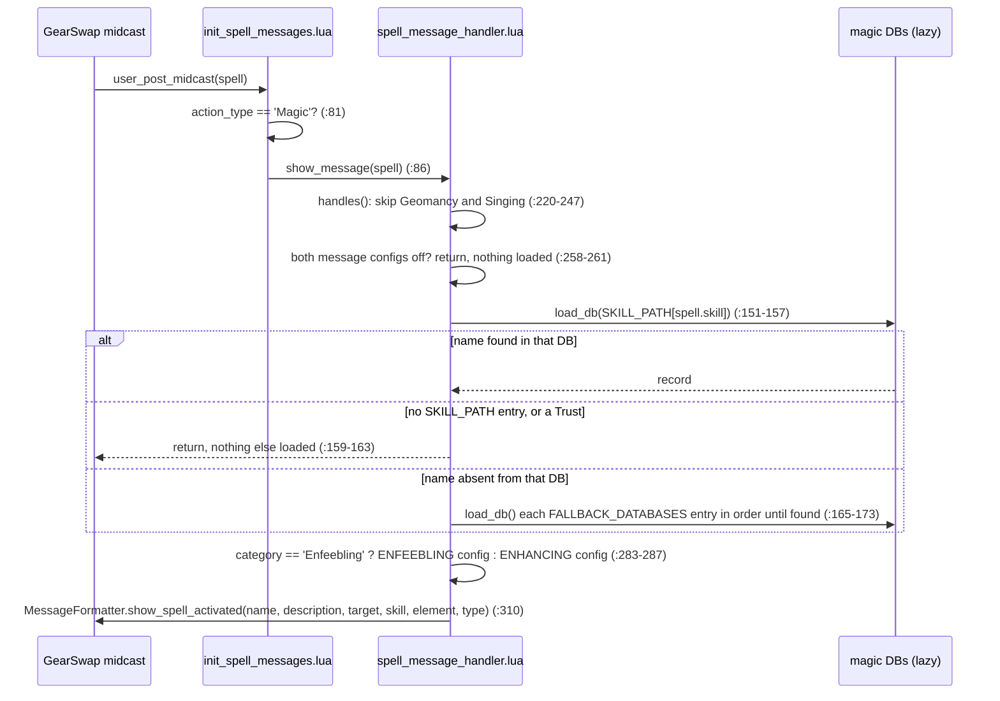

# Spell databases and the data loader

`shared/data/magic/` holds the project's own description of every player spell: one record per spell name with a short description, element, category, per-job learn levels and a few routing keys (`enfeebling_type`, `spell_family`). Nothing in it runs at job load. The records are read lazily, at the first cast or command that needs them, by four kinds of consumer:

- the spell message hook (`shared/hooks/init_spell_messages.lua` -> `shared/utils/messages/handlers/spell_message_handler.lua`), which prints the "spell activated" line after every magic midcast;
- `MidcastManager.select_set()`'s `database_func`, which turns a spell name into a set sub-key (`ENHANCING_MAGIC_DATABASE.get_spell_family` for 14 jobs, `ENFEEBLING_MAGIC_DATABASE.get_enfeebling_type` for RDM);
- code that reads a DB directly: BRD and GEO message code (songs, colures) and the ability message handler (SMN blood pacts);
- `//gs c info <name>`, through `shared/utils/data/data_loader.lua`.

RDM's "cast by name" command fallback does not read these databases: it resolves names from the game resources (`res.job_abilities`, `res.weapon_skills`, `res.spells`; `shared/jobs/rdm/functions/RDM_COMMANDS.lua:40-61`).

Two small lookup tables used by precast refinement also live in `shared/data/spells/`.

Every statement below was checked against the code on disk (2026-09-18; re-verified 2026-09-19). Pure data files over ~400 lines were read header-first plus enough records to characterise them; all records were also loaded with `lua5.1` and checked mechanically (see [Data-integrity checks](#data-integrity-checks)).

## Files

### Aggregators and loaders

| Path | Lines | Role |
|---|---|---|
| `shared/data/magic/ELEMENTAL_MAGIC_DATABASE.lua` | 256 | Merges 7 `elemental/` modules (99 spells; `helix.lua` deliberately excluded) + helpers |
| `shared/data/magic/DARK_MAGIC_DATABASE.lua` | 256 | Merges 4 `dark/` modules (26 spells) + helpers |
| `shared/data/magic/DIVINE_MAGIC_DATABASE.lua` | 215 | Merges 3 `divine/` modules (11 spells) + helpers |
| `shared/data/magic/ENFEEBLING_MAGIC_DATABASE.lua` | 140 | Merges 3 `enfeebling/` modules (35 spells); `get_enfeebling_type` used by RDM midcast |
| `shared/data/magic/ENHANCING_MAGIC_DATABASE.lua` | 99 | Merges 5 `enhancing/` modules incl. `storm.lua` (139 spells); `get_spell_family` used by 14 midcast modules |
| `shared/data/magic/HEALING_MAGIC_DATABASE.lua` | 183 | Merges 4 `healing/` modules (32 spells) + helpers |
| `shared/data/magic/NINJUTSU_DATABASE.lua` | 131 | Merges 3 `ninjutsu/` modules (37 spells) + helpers |
| `shared/data/magic/BLM_SPELL_DATABASE.lua` | 165 | Job view: Elemental + Dark + Enfeebling records that have a `BLM` key (101) |
| `shared/data/magic/RDM_SPELL_DATABASE.lua` | 181 | Job view: Elemental + Healing + Enhancing + Enfeebling records with `RDM` (134) |
| `shared/data/magic/WHM_SPELL_DATABASE.lua` | 217 | Job view: Healing + Enhancing + Divine + Enfeebling records with `WHM` (111) |
| `shared/data/magic/GEO_SPELL_DATABASE.lua` | 191 | Job view: all `geomancy/` + Elemental/Dark records with `GEO` (113) |
| `shared/data/magic/SCH_SPELL_DATABASE.lua` | 222 | Job view: 5 skill DBs filtered on `SCH` + all of `helix.lua` and `storm.lua` (121) |
| `shared/data/magic/BRD_SPELL_DATABASE.lua` | 181 | Merges 3 `song/` modules (105 songs) |
| `shared/data/magic/BLU_SPELL_DATABASE.lua` | 325 | Merges 19 `blu/` modules (196 spells) |
| `shared/data/magic/SMN_SPELL_DATABASE.lua` | 418 | Merges 15 `summoning/` modules: 22 summons + 121 blood pacts into one `.spells` table (143) |
| `shared/utils/data/data_loader.lua` | 304 | Lazy `_G.FFXI_DATA` view of spells (15 aggregators), job abilities and weaponskills; used by `//gs c info` |
| `shared/data/spells/BLM_SPELL_FILTERS.lua` | 126 | Name/skill sets deciding refinement vs cooldown check in `BLM_PRECAST` |
| `shared/data/spells/RDM_ENFEEBLE_TIERS.lua` | 55 | Tier-downgrade correspondence for `tier_refiner` in `RDM_PRECAST` |
| `shared/data/magic/dark/README_DARK_MAGIC.md` | 245 | Human reference for the Dark Magic modules (partly stale, see Known issues) |
| `_dev/SPELL_DATABASES_SYSTEM.md` | 647 | Older design note for the `UNIVERSAL_SPELL_DATABASE` module, which no longer exists (deleted in commit `83b5e0c`) |

### Sub-modules (pure data, no functions, no `require`)

| Folder | Files (records) | Lines |
|---|---|---|
| `blu/` | `breath/blu_breath` (11), `buffs/blu_buffs_offensive` (11), `buffs/blu_buffs_defensive` (17), `debuffs/blu_debuffs_control` (15), `debuffs/blu_debuffs_stats` (14), `healing/blu_healing` (9), `magical/blu_magical_{dark 13, earth 3, fire 8, ice 3, light 7, thunder 6, water 11, wind 9}`, `physical/blu_physical_{blunt 17, h2h 8, piercing 10, ranged 3, slashing 21}` | 3344 |
| `dark/` | `dark_absorb` (10), `dark_bio` (3), `dark_drain` (6), `dark_utility` (7) | 506 |
| `divine/` | `divine_banish` (5; Banish IV commented out), `divine_enlight` (2), `divine_utility` (4) | 232 |
| `elemental/` | `elemental_single` (36), `elemental_aoe_ga` (18), `elemental_aoe_ja` (6), `elemental_aoe_ra` (18), `elemental_ancient` (12), `elemental_dot` (6), `elemental_special` (3), `helix` (16, not in the Elemental aggregator) | 1818 |
| `enfeebling/` | `enfeebling_control` (9), `enfeebling_debuffs` (16), `enfeebling_dots` (10) | 594 |
| `enhancing/` | `enhancing_bars` (28), `enhancing_buffs` (30), `enhancing_combat` (23), `enhancing_utility` (42), `storm` (16) | 2074 |
| `geomancy/` | `geomancy_indi` (30), `geomancy_geo` (30) | 713 |
| `healing/` | `healing_cure` (7), `healing_curaga` (8), `healing_raise` (8), `healing_status` (9) | 541 |
| `ninjutsu/` | `ninjutsu_buffs` (11), `ninjutsu_debuffs` (8), `ninjutsu_nukes` (18) | 636 |
| `song/` | `song_buffs` (73), `song_debuffs` (32), `song_special` (2, both also in `song_buffs`) | 1368 |
| `summoning/` | one file per summon: `carbuncle`, `cait_sith`, `diabolos`, `fenrir`, `garuda`, `ifrit`, `leviathan`, `ramuh`, `shiva`, `siren`, `titan`, `odin`, `alexander`, `atomos`, plus `spirits` (8 spirit summons). Each exports `.spells` (the summon) and `.blood_pacts` | 2204 |

Every sub-module has the same shape: `local M = {}; M.spells = { ["Name"] = { ... }, ... }; return M` (summoning files add `M.blood_pacts`). All keys are written `["Name"] = {`; a text scan found no key written twice inside one table constructor.

## How it works

### Layers

1. **Sub-modules** return a table of records. They have no dependencies.
2. **Skill aggregators** `require` their sub-modules at file load and copy every record into a fresh `.spells` table with `for name, data in pairs(sub.spells) do Agg.spells[name] = data end` (e.g. `ELEMENTAL_MAGIC_DATABASE.lua:60-95`, `ENHANCING_MAGIC_DATABASE.lua:45-66`). The record tables are shared by reference, not copied. Inside one aggregator the last sub-module to write a name wins; there is no collision check.
3. **Job aggregators** do the same, but for skill DBs they keep only records with a truthy `<JOB>` key (`BLM_SPELL_DATABASE.lua:50-68`, `RDM_SPELL_DATABASE.lua:50-75`, `WHM_SPELL_DATABASE.lua:54-80`, `GEO_SPELL_DATABASE.lua:66-77`, `SCH_SPELL_DATABASE.lua:64-96`). Job-unique modules are merged unfiltered (`GEO_SPELL_DATABASE.lua:56-63`, `SCH_SPELL_DATABASE.lua:99-106`, all of BRD/BLU/SMN). A job aggregator therefore holds the *same* table objects as the skill aggregator it filtered.
4. `SMN_SPELL_DATABASE` also merges every avatar's `.blood_pacts` into `.spells` (`SMN_SPELL_DATABASE.lua:122-176`) and then splits `.spells` again by `category` into the legacy tables `spirits`, `avatars`, `blood_pacts_rage`, `blood_pacts_ward` (`:179-195`). Blood pacts are job abilities in FFXI, so 18 pact names are also real spell names (`Fire II`, `Fire IV`, `Impact`, `Sleepga`, `Thunderstorm`, ...), see Known issues.
5. **Merged view.** One module builds a whole-project view: `data_loader.load_spells()` (`data_loader.lua:120-146`) iterates 6 skill DBs, then 8 job DBs, then Ninjutsu, and only inserts names not yet present (`:132-138`): **first wins**, so skill DBs win over job DBs, and between two skill DBs the earlier one wins (Dark before Enfeebling, see the Bio issue).

### Module caching and lifetime

GearSwap's sandbox `require` is `include_user` (`GearSwap/refresh.lua:132`), which reads but never writes `package.loaded` (`GearSwap/user_functions.lua:300-333`). The project installs a caching `require` on the sandbox `_G` in `INIT_SYSTEMS.lua:47-52` (`shared/utils/core/module_cache.lua:44-88`). Entry points include `INIT_SYSTEMS` before anything touches the DBs (`_master/entry/Tetsouo_BLM.lua:73` then `:78`), so within one sandbox each DB file executes once and every consumer shares the same tables. The cache and every DB table die with the sandbox: GearSwap rebuilds `user_env` on every `gs reload` and every main-job change (`GearSwap/refresh.lua:83`, `:114`), and a subjob change ends in a `gs reload` too (`job_sub_job_change` -> `JobChangeManager.on_job_change`, `_master/entry/Tetsouo_BLM.lua:148` -> `shared/utils/core/job_change_manager.lua:179`), so the first cast after a job or subjob change reloads whatever it needs. Nothing in this area survives a reload and nothing needs to.

### Runtime path 1: spell messages

- `load_db` memoises per path, including failures as `false` (`spell_message_handler.lua:55-66`).
- `SKILL_PATH` (`:69-81`) maps the eleven FFXI magic skills to one aggregator. `Singing` and `Geomancy` entries are never reached because `handles()` rejects those skills first (`:236-244`); BRD and GEO print their own messages (see below).
- `FALLBACK_DATABASES` (`:86-102`) lists 7 skill DBs then 8 job DBs. The RDM, WHM and BLM job DBs contain only records that already live in skill DBs listed earlier, so in the fallback they can never produce a hit; they only cost a load. GEO and BRD are only reachable for Geomancy/Singing names, which `handles()` already filtered.
- Fields read from the record: `category`, `description`, `element`.
- The enfeebling/enhancing split at `:283-287` has no visible effect today: both configs read the same persisted mode (`shared/config/message_settings.lua:134-142` redirect both getters to `get_spell_mode()`), toggled by `//gs c spellmsg <full|on|off>`.

### Runtime path 2: midcast routing (`database_func`)

`MidcastManager.resolve_metadata` calls `pcall(config.database_func, spell.english)` (`shared/utils/midcast/midcast_manager.lua:325-326`) and uses the returned string as the "type" key for `sets.midcast[skill][type]...`, `sets.midcast[type]` (resolvers at `:433-535`). Which DB function each job passes:

| Function | Passed by |
|---|---|
| `ENHANCING_MAGIC_DATABASE.get_spell_family` | BLM (`BLM_MIDCAST.lua:149-150`, for **Enfeebling**, see Known issues), BRD (`BRD_MIDCAST.lua:90-91`), BST (`BST_MIDCAST.lua:110`), COR/DNC/DRK/SAM/THF/WAR/WHM via `MidcastDeps.load()` (`shared/utils/midcast/midcast_deps.lua:37`), PLD (`PLD_MIDCAST.lua:135`), PUP (`PUP_MIDCAST.lua:159`), RDM (`RDM_MIDCAST.lua:228`), RUN (`RUN_MIDCAST.lua:97`) |
| `ENFEEBLING_MAGIC_DATABASE.get_enfeebling_type` | RDM (`RDM_MIDCAST.lua:105` debug trace, `:131` routing) |

`GEO_MIDCAST.lua:38` loads `ENHANCING_MAGIC_DATABASE` but never reads it.

`spell_family` values present in the data: `Aquaveil`, `BarAilment`, `BarElement`, `Boost`, `Enspell`, `Gain`, `Phalanx`, `Refresh`, `Regen`, `Spikes`, `Stoneskin`, `Storm`, or `nil` (54 records). `enfeebling_type` values: `macc`, `mnd_potency`, `int_potency`, `skill_potency`, `skill_mnd_potency`, `potency`, `duration`. Set files use these as keys (`_master/sets/rdm_sets.lua` defines `sets.midcast['Enfeebling Magic'].macc`, `.mnd_potency`, ... and root sets `sets.midcast.Refresh`, `.Enspell`, `.BarElement`, ...).

### Runtime path 3: job-specific readers

| Reader | DB | Fields |
|---|---|---|
| `shared/jobs/brd/functions/logic/midcast_router.lua:128-130` (DB loaded at `BRD_MIDCAST.lua:56`) | `BRD_SPELL_DATABASE.spells[spell.english]` | `description`, `element` |
| `shared/utils/messages/formatters/jobs/message_geo.lua:19-22`, `:99`, `:134` (required at module load) | `geomancy/geomancy_indi.lua`, `geomancy/geomancy_geo.lua` directly | `description`, `element` |
| `shared/utils/messages/handlers/ability_message_handler.lua:130-143` (for `spell.type` `BloodPactRage`/`BloodPactWard` only) | `SMN_SPELL_DATABASE.spells[ability_name]`, accepted when `category` is `Blood Pact: Rage/Ward` | whole record |
| `shared/jobs/blm/functions/BLM_PRECAST.lua:52`, `:72`, `:83`, `:90` | `BLM_SPELL_FILTERS` | set membership |
| `shared/jobs/rdm/functions/RDM_PRECAST.lua:65`, `:80`, `:162` -> `shared/utils/precast/tier_refiner.lua` | `RDM_ENFEEBLE_TIERS.get(family)` | tier map |

### Runtime path 4: `data_loader` and `//gs c info`

`data_loader.lua` creates `_G.FFXI_DATA = { spells = {}, abilities = {}, weaponskills = {}, loaded = {...} }` at require time (`:40-51`) and loads nothing: the autoload call is commented out (`:295-298`, disabled in commit `f6e675f`; the comment records "causes 100-300ms lag at startup"). The entry points that `require('shared/utils/data/data_loader')` (all 15 files in `_master/entry/`, the 4 in `_master/Kaories/entry/`, and their live copies, e.g. `_master/entry/Tetsouo_BLM.lua:78`, `Kaories/Kaories_RDM.lua:79`) therefore only create the empty global.

The only real consumer is `shared/utils/commands/info_command.lua` (`//gs c info <name>`): `search_all_databases` tries `get_ability`, `get_spell`, `get_weaponskill` by exact name (`:312-325`), then case-insensitive scans that force `load_abilities`, `load_spells`, `load_weaponskills` (`:331-358`). `display_spell` shows `type`, `category`, `description`, `effect`, `duration`, `cast_time`, `recast`, `mp_cost`, `range`, `target`, `element`, `skill`, `job`, `level` (`:257-272`); spell records carry no `job`/`level`/`cast_time`/`recast`, so those lines never appear for spells (blood pacts do carry `level` and `mp_cost`).

`load_abilities` probes `shared/data/job_abilities/<job>/<job>_<suffix>` for 21 jobs x 23 suffixes (`:159-210`), every probe a `pcall(require)`; 83 of those 483 paths exist. Because the exact-name pass calls `get_ability` first (`info_command.lua:312`), the first `//gs c info` of any kind pays for ~400 failed path searches (failed `require`s are not cached by `ModuleCache`, but `loaded.abilities` stops a second pass).

## Entry schema

Keys are the English spell names exactly as `res/spells.lua` spells them (that is what `spell.english` / `spell.name` carry). Seven keys do not match, see Known issues.

Common fields (spell records):

| Field | Type | Present in | Meaning / readers |
|---|---|---|---|
| `description` | string | every record | Short text; spell message (full mode), BRD/GEO messages, info command |
| `category` | string | all except `enhancing/` | Family label (`Elemental`, `Helix`, `Dark`, `Divine`, `Enfeebling`, `Healing`, `Ninjutsu`, `Indicolure`/`Geocolure`, song families such as `Minuet`, BLU `Physical`/`Magical`/`Breath`/`Healing`/`Buff`/`Debuff`, SMN `Avatar Summon`/`Spirit Summon`/`Blood Pact: Rage`/`Blood Pact: Ward`). Spell handler picks its config on `== 'Enfeebling'`; ability handler filters SMN pacts on it |
| `element` | string | all except the 59 BLU `Physical` records | `Fire`, `Ice`, `Wind`, `Earth`, `Water`, `Light`, `Dark`, and **both** `Thunder` (elemental, enhancing, BLU, geomancy, summoning) and `Lightning` (Stun, Ninjutsu, songs). `message_combat.lua:32-33` colours both the same |
| `magic_type` | string | all except SMN pacts | `Black`, `White`, `Red`, `Dark`, `Blue`, `Song`, `Geomancy`, `Ninjutsu`, `Summoning` |
| `tier` | string | most tiered families | Roman numeral `I`..`VII`; `nil` for Comet/Meteor/Impact and untiered spells |
| `type` | string | all except `enhancing/` and `blu/` | Targeting: `single`, `aoe`, `self`, `self_aoe` (healing). SMN reuses it for `summon`, `spirit`, `physical`, `magical`, `buff`, `debuff`, `healing`, `support` |
| `<JOB>` (`BLM`, `RDM`, ...) | number, or the string `"JP"` | per job that learns it | Learn level. `"JP"` appears on Aspir III (BLM, GEO), Drain III (DRK), Death (BLM), Endark II (DRK), Enlight II (PLD) |
| `main_job_only`, `subjob_master_only` | boolean | many | Access flags; read only by unused `can_learn` helpers |
| `notes` | string | most | Free text, not read by code |

Family-specific fields:

| Family | Extra fields |
|---|---|
| `enhancing/` | `skill = "Enhancing Magic"`, `spell_family` (see above), `target_type` (`single`/`aoe`), `enhancing_skill_affects` (bool), `effect`, `duration` (1 record, string). No `category`, no `type` |
| `enfeebling/` | `enfeebling_type` (see above) |
| `elemental/helix.lua` | `category = "Helix"`, `stat_down` |
| `song/` | `stat` (Etudes), `resist_element`, `resist_status`, `effect`, `job_points`, `master_level` |
| `blu/` | `damage_type`, `trait`, `trait_points`, `property` (skillchain), `unbridled`, `mp_cost` |
| `ninjutsu/` | `NIN`, `tool`, `v`, `m`, `weakens` |
| `summoning/*.spells` | `SMN` (level), `mp_cost`, `restriction = "main_job_only"` (Alexander, Atomos, Odin) |
| `summoning/*.blood_pacts` | `avatar`, `level` (not `SMN`), `mp_cost`, `damage_type` (`Blunt`, `Slashing`, ...), `skillchain`, `astral_flow`, `merit`, `restriction = "two_hour"` (2 pacts) |

## Public API

All aggregators expose `.spells` (name -> record). That field and the functions marked "used" are the only parts of this API with callers; the 99 other helpers have **no caller outside their own module** anywhere in `shared/`, `_master/`, `Tetsouo/`, `Kaories/` (checked by grep, including string dispatch), and several of them cannot work against the current schema.

### Used

| Function | Returns | Callers |
|---|---|---|
| `ENHANCING_MAGIC_DATABASE.get_spell_family(name)` (`:76-82`) | `spell_family` or nil | 14 midcast modules, see table above |
| `ENFEEBLING_MAGIC_DATABASE.get_enfeebling_type(name)` (`:74-80`) | `enfeebling_type` or nil | `RDM_MIDCAST.lua:105`, `:131` |
| `RDM_ENFEEBLE_TIERS.get(family)` (`:50-53`) | tier map or nil | `RDM_PRECAST.lua:80` |
| `DataLoader.get_spell/get_ability/get_weaponskill(name)` (`:264-289`), `DataLoader.load_spells/load_abilities/load_weaponskills()` (`:120`, `:152`, `:221`) | record or nil / `true` | `info_command.lua:312-352` |

`BLM_SPELL_FILTERS` exposes three sets read by `BLM_PRECAST.lua`: `REFINEMENT_SPELLS` (`:30-82`, keyed by spell name, plus the key `'Elemental Magic'` which is never looked up because `uses_refinement` checks the skill directly), `ELEMENTAL_NO_TIERS` (`:91-104`), `CHARGE_ABILITIES` (`:113-120`).

### Unused helpers (no callers)

| Module | Functions | Notes |
|---|---|---|
| ELEMENTAL | `can_learn`, `get_spells_by_element`, `get_spells_by_type`, `get_spells_by_tier`, `get_element`, `get_tier`, `is_aoe`, `get_ancient_magic`, `get_dot_spells` | |
| DARK | `get_description`, `get_tier`, `get_element`, `is_job_points_spell`, `is_drk_only`, `get_spells_by_category`, `get_absorb_spells`, `get_drain_spell`, `get_bio_spell` | |
| DIVINE | `can_learn`, `get_spells_by_job`, `get_spells_by_type`, `get_spells_by_tier`, `get_banish_spells`, `get_banishga_spells`, `get_holy_spells`, `is_effective_vs_undead` | `can_learn('Enlight II','PLD',99)` raises "attempt to compare string with number" at `:85`; so does `get_spells_by_job('PLD', 99)` |
| ENFEEBLING | `is_aoe`, `get_description`, `get_stats` | |
| ENHANCING | `get_spell_data` | |
| HEALING | `get_cure_type`, `is_aoe`, `is_status_removal`, `is_raise`, `is_cure`, `get_description`, `get_stats` | |
| NINJUTSU | `get_description`, `get_element`, `get_tier`, `can_cast` | |
| BLM / GEO | `can_learn`, `get_spells_by_category`, `get_elemental_spells`, `get_ancient_magic` / `get_colure_pair` | these two `can_learn` handle `"JP"` |
| RDM | `can_learn`, `get_spells_by_category`, `get_elemental_spells`, `get_spells_by_magic_type`, `get_enfeebling_type` | RDM midcast uses the ENFEEBLING function instead |
| WHM | `can_learn`, `get_spells_by_category`, `get_cure_spells`, `get_bar_elemental`, `get_boost_spells`, `get_teleport_spells`, `get_recall_spells` | the last four read `category`/`destination`, which enhancing records do not have: always empty |
| SCH | `can_learn`, `get_spells_by_category`, `get_elemental_spells`, `get_helix_spells`, `get_storm_spells`, `get_arts_requirement` | `arts` field exists nowhere: always nil |
| BRD | `can_learn`, `get_songs_by_category`, `get_songs_by_type`, `get_elemental_songs`, `get_etude_by_stat`, `get_buff_songs`, `get_debuff_songs` | `song_type` field exists nowhere: `get_songs_by_type`/`get_buff_songs`/`get_debuff_songs` always empty |
| BLU | `can_learn`, `get_spells_by_type` + 6 wrappers, `get_spells_by_element`, `get_spells_by_trait`, `get_unbridled_spells`, `calculate_trait_points`, `get_skillchain_property`, `get_spell_data` | `spell_type` exists nowhere (data uses `category`): `get_spells_by_type` and its wrappers always empty |
| SMN | `can_summon`, `can_use_pact`, `get_avatar_pacts`, `get_pacts_by_element`, `get_rage_by_damage_type`, `get_skillchain_property`, `get_avatar_element`, `get_two_hour_pacts`, `get_all_spirits`, `get_all_avatars`, `get_pact_data` | `can_use_pact` reads `pact.SMN` but pacts carry `level`: always false; `get_skillchain_property` reads `.property`, pacts use `.skillchain`; `get_rage_by_damage_type('Physical')` returns nothing (`damage_type` holds `Blunt`, ...) |
| DataLoader | `load_all` | |

## Commands

| Command | Handler | Effect |
|---|---|---|
| `//gs c info <name>` | `COMMON_COMMANDS.lua:619-620` -> `DEBUG_COMMANDS.lua:215-217` -> `info_command.lua:370` | Prints the ability, spell or weaponskill record found by `data_loader` |
| `//gs c spellmsg <full\|on\|off>` | `DEBUG_COMMANDS.lua:201-203` | Not in this area, but it is the only switch for the messages that read these DBs |

## Configuration

The databases read no config file. Related knobs:

- `_G.MESSAGE_SETTINGS.spell_mode` (persisted by `shared/config/message_settings.lua`) decides whether spell messages print and whether `description` is included.
- `_G.DATA_DEBUG` gates the three `DebugLogger.logf_if('DATA_DEBUG', ...)` lines in `data_loader.lua:144`, `:213`, `:242`. No command sets it.

## State & lifetime

| State | Where | Lifetime |
|---|---|---|
| Aggregator tables | module return values, shared through the sandbox `require` cache | Until the next `gs reload` / main-job change / subjob change (JobChangeManager's reload) (new `user_env`) |
| `_G.FFXI_DATA` (+ `.loaded` flags) | `data_loader.lua:40-51`, filled by `load_*` | Sandbox global; recreated empty after every reload/job change. Listed as expected in `shared/utils/debug/global_probe.lua:50` |
| `db_cache` | `spell_message_handler.lua:55` | Module-local, per sandbox; remembers failed loads as `false` |
| `manager`/`enhancing` | `midcast_deps.lua:20-22` | Module-local, per sandbox |

No events are registered, no coroutines scheduled, no keybinds, no `windower.*` fields. A subjob change rebuilds everything, like a main-job change: the entry's `job_sub_job_change` calls `JobChangeManager.on_job_change`, which sends a debounced `gs reload` (`_master/entry/Tetsouo_BLM.lua:148`, `shared/utils/core/job_change_manager.lua:179`). Zone and death have no effect.

## Interactions

- Spell message hook and handlers: [../systems/messages.md](../systems/messages.md), formatters in [../systems/messages-formatters.md](../systems/messages-formatters.md).
- `MidcastManager` and `database_func`: [../systems/midcast-and-buffs.md](../systems/midcast-and-buffs.md).
- BLM refinement / RDM tier refiner: [../systems/precast-pipeline.md](../systems/precast-pipeline.md).
- `//gs c info`, `spellmsg`: [../systems/commands-and-debug.md](../systems/commands-and-debug.md).
- Module cache and sandbox lifetime: [../systems/core-lifecycle.md](../systems/core-lifecycle.md), [../architecture/job-change-lifecycle.md](../architecture/job-change-lifecycle.md).
- Dual-box alt commands: the generated `config/alt/<JOB>_ALT_COMMANDS.lua` files state they are built from `shared/data/magic/` and `res` (`_master/config/alt/BLM_ALT_COMMANDS.lua:10-12`, `SMN_ALT_CUSTOM.lua:22`); the generator itself is not in the repository. See [../systems/dualbox.md](../systems/dualbox.md).

## Invariants & gotchas

- **Record identity is shared.** `RDM_SPELL_DATABASE.spells['Haste']` is the same table as `ENHANCING_MAGIC_DATABASE.spells['Haste']`. Editing a record at runtime edits it for every consumer in the sandbox.
- **First-wins merge.** `data_loader` keeps the first record it meets for a name. For a name present in two skill DBs, consumers can therefore read different records (Bio: `FFXI_DATA` and the spell message fast path give the Dark record, `ENFEEBLING_MAGIC_DATABASE.get_enfeebling_type` reads the Enfeebling one).
- **The spell handler's fast path uses `res` skill, not the DB folder.** A record must live in the aggregator that `SKILL_PATH` maps its `res` skill to; otherwise its first cast walks `FALLBACK_DATABASES`, loading each DB in turn until one holds the name. Records living elsewhere today: the 16 helix spells (res Elemental Magic, only in `SCH_SPELL_DATABASE`, 13th in the list), Klimaform (res Dark Magic, stored in Enhancing, 2nd), Inundation (res Enfeebling Magic, stored in Enhancing, 2nd). A Trust (res skill `(N/A)`, no `SKILL_PATH` entry) stops after the fast path and loads nothing. Any other spell with no record under its res name (Dispelga, which res flags `unlearnable` but Daybreak grants) loads all 15 DBs and finds nothing.
- **Keys must equal `res/spells.lua` `en` names**, abbreviations included (`Ltng. Threnody`, `Nat. Meditation`, `Goddess's Hymnus`, `Aera`).
- **`"JP"` level strings.** Any new helper comparing `level >= spell[job]` must skip non-number values (only `BLM_SPELL_DATABASE.can_learn` and `GEO_SPELL_DATABASE.can_learn` do).
- **Blood pacts share the `.spells` namespace** of `SMN_SPELL_DATABASE`. Adding SMN to any merged view before the Elemental/Enfeebling/Healing/Enhancing DBs would make pact records shadow the real spells of the same name.

## Extending

Adding a spell to an existing family:

1. Add a record to the right sub-module with the key spelled exactly as `res/spells.lua` `en`.
2. Put it in the sub-module whose aggregator matches the spell's **res skill** (see `SKILL_PATH`, `spell_message_handler.lua:69-81`), not the family it "feels like".
3. Fill `description`, `element`, `category` (or `skill` + `spell_family` for enhancing), per-job level keys (numbers; `"JP"` only if you also guard every comparison), and `enfeebling_type` for enfeebling spells that RDM routes.
4. If the spell is enhancing and needs its own gear, set `spell_family` to a value that a set file defines (`sets.midcast.<Family>` or `sets.midcast['Enhancing Magic'].<Family>`).

Adding a sub-module: create `shared/data/magic/<skill>/<name>.lua` returning `{ spells = {...} }`, then add a `require` plus a merge loop to the aggregator. Job views pick it up automatically if they filter the skill DB.

Adding a new skill aggregator: create `shared/data/magic/<SKILL>_DATABASE.lua` at the root of `magic/`, then register it in `SKILL_PATH` and `FALLBACK_DATABASES` (`spell_message_handler.lua`) and in `SPELL_DATABASES` (`data_loader.lua:57-78`).

Re-run the checks below after any data change.

## Data-integrity checks

Run from the repo root with `C:/ProgramData/chocolatey/bin/lua5.1.exe`, after `package.path = './?.lua;' .. package.path` and a `package.preload` stub for `shared/utils/debug/debug_logger` (for `data_loader`). Results on 2026-09-18, the compile check re-run on 2026-09-19:

| Check | Result |
|---|---|
| `luac -p` on the 84 Lua files of `shared/data/magic/`, the 2 of `shared/data/spells/` and `data_loader.lua` | all compile |
| Duplicate key inside one table constructor (text scan vs loaded count) | none |
| Same name in two sub-modules | Bio, Bio II, Bio III (`dark_bio` and `enfeebling_dots`); Chocobo Mazurka, Raptor Mazurka (`song_buffs` and `song_special`); 18 blood pacts vs spells (Aero II/IV, Blizzard II/IV, Fire II/IV, Stone II/IV, Thunder II/IV, Water II/IV, Tornado II, Impact, Sleepga, Raise II, Reraise II, Thunderstorm) |
| Keys absent from `res/spells.lua` | none. `Aerora` I-III, `Goddess' Hymnus` and `Nature's Meditation` were renamed `Aera` I-III, `Goddess's Hymnus` and `Nat. Meditation` on 2026-09-19; `Lightning Threnody` I-II were renamed `Ltng. Threnody` in commit `443d422` |
| Blood pact keys absent from `res/job_abilities.lua` | none |
| Learnable res spells (skills 32-44, non-Trust) with no record under their res name | none since the 2026-09-19 renames; 19 more res spells with job levels have no record but carry `unlearnable=true` (Banish IV, Banishga III, Diaga II/III, Paralyga, Silencega, Blindga, Bindga, Poisonga II, Virus, Curse, Meteor II, 4 Ninjutsu, Chocobo Hum, Cactuar Fugue, Dispelga); of these, Dispelga is castable (granted by Daybreak). Slowga and Hastega (also `unlearnable`) only match an SMN blood-pact record |
| Mixed field types | only the `"JP"` level strings (dark: BLM x2, DRK x2, GEO x1; divine: PLD x1) |
| Records without `description` | none |
| Aggregate sizes | ELEMENTAL 99, DARK 26, DIVINE 11, ENFEEBLING 35, ENHANCING 139, HEALING 32, NINJUTSU 37, BLM 101, RDM 134, WHM 111, GEO 113, BRD 105, SCH 121, BLU 196, SMN 143; `FFXI_DATA.spells` 878 |

## Known issues

- First cast of `Dispelga` (or another castable spell with no record) loads every magic DB, and a helix spell 13 of the 15 (the freeze the per-skill loading was meant to remove) - `shared/utils/messages/handlers/spell_message_handler.lua:165`
- Bio I-III defined twice with conflicting fields; consumers disagree on which one they get; the handler comment claiming the Enfeebling record is stale - `shared/data/magic/dark/dark_bio.lua:31`
- Chocobo/Raptor Mazurka defined twice; the `song_buffs.lua` copies are shadowed - `shared/data/magic/song/song_buffs.lua:865`
- Blood pacts share the spell namespace; `//gs c info` can never show the 18 colliding pacts - `shared/data/magic/SMN_SPELL_DATABASE.lua:122`
- 99 helper functions have no external caller; several read fields the data does not have and one raises an error - `shared/data/magic/DIVINE_MAGIC_DATABASE.lua:85`
- BLM passes the Enhancing `get_spell_family` as its Enfeebling `database_func` (always nil) - `shared/jobs/blm/functions/BLM_MIDCAST.lua:149`
- `ELEMENTAL_NO_TIERS` can never match; filter lists name spells that do not exist - `shared/data/spells/BLM_SPELL_FILTERS.lua:91`
- GEO_MIDCAST loads the Enhancing DB and never reads it - `shared/jobs/geo/functions/GEO_MIDCAST.lua:38`
- `data_loader` never loads `drg_pet_commands.lua` (no `_mainjob`/`_subjob` suffix) - `shared/utils/data/data_loader.lua:176`
- `_dev/SPELL_DATABASES_SYSTEM.md` documents `get_spells_by_source`, `get_database_info`, `get_spells_by_type` (none exist) and credits "Claude (Anthropic)" as author - `_dev/SPELL_DATABASES_SYSTEM.md:208`
- Aggregator headers give wrong counts or paths: ELEMENTAL helix path `internal/sch/helix.lua` (now `elemental/helix.lua`), DIVINE "12 spells / Banish I-IV" (11), ENFEEBLING "17 debuffs" (16), BRD "68 buff songs" and `song_buffs.lua` "82" (73), `enhancing_buffs.lua` "32" (30), `enhancing_utility.lua` "41" (42) - `shared/data/magic/ELEMENTAL_MAGIC_DATABASE.lua:23`
- `README_DARK_MAGIC.md` still lists Elemental and Divine DBs as "to be created" and a `DARK_MESSAGES_CONFIG.lua` that does not exist - `shared/data/magic/dark/README_DARK_MAGIC.md:203`
- `_master/sets/rdm_sets.lua:308` says the enfeebling type comes from `RDM_SPELL_DATABASE`; it comes from `ENFEEBLING_MAGIC_DATABASE` (`RDM_MIDCAST.lua:131`)
