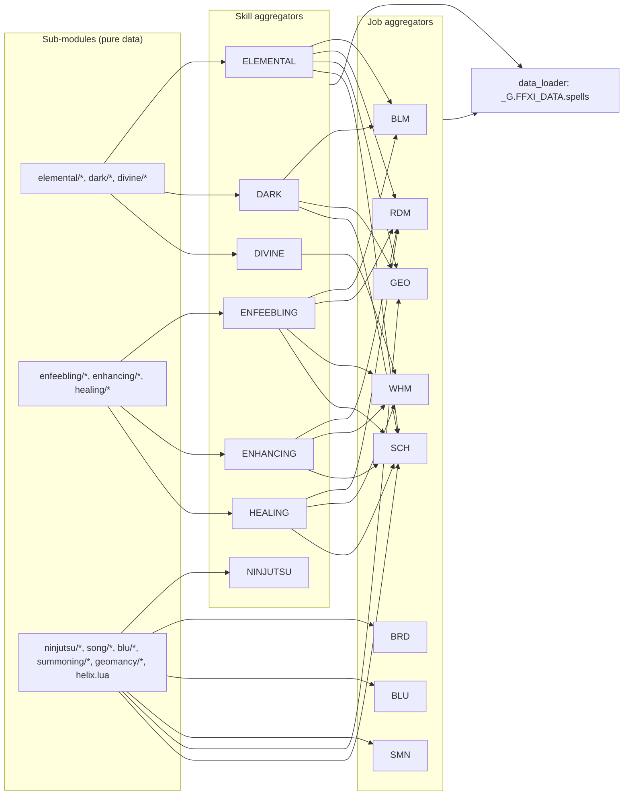
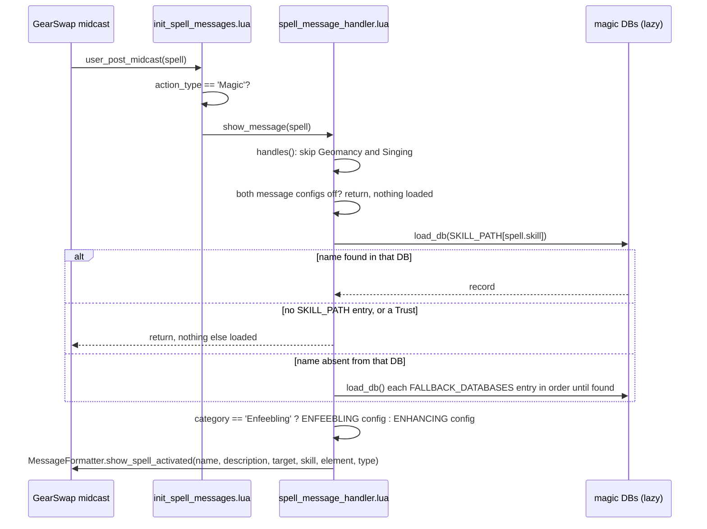

# Spell databases and the data loader

`shared/data/magic/` holds the project's own description of every player spell: one record per spell
name with a short description, element, category, per-job learn levels and a few routing keys
(`enfeebling_type`, `spell_family`, BLU `category` / `unbridled`). Nothing in it runs at job load. The
records are read lazily, at the first cast or command that needs them, by five kinds of consumer:

- the spell message hook (`shared/hooks/init_spell_messages.lua` ->
  `shared/utils/messages/handlers/spell_message_handler.lua`), which prints the "spell activated" line
  after every magic midcast;
- `MidcastManager.select_set()`'s `database_func`, which turns a spell name into a set sub-key
  (`ENHANCING_MAGIC_DATABASE.get_spell_family` for 15 jobs, `ENFEEBLING_MAGIC_DATABASE.get_enfeebling_type`
  for RDM and BLU);
- job code that reads a DB directly: BRD and GEO message code (songs, colures), the ability message
  handler (SMN blood pacts), RDM's midcast (Enhancing family for its own Enhancing logic) and BLU's
  spell map (gear category and Unbridled flag);
- the tier refiner of RDM / GEO / BLM, through the small tables of `shared/data/spells/`;
- `//gs c info <name>`, through `shared/utils/data/data_loader.lua`.

RDM's "cast by name" command fallback does not read these databases: it resolves names from the game
resources (`res.job_abilities`, `res.weapon_skills`, `res.spells`; `resolve_action_prefix` in
`shared/jobs/rdm/functions/RDM_COMMANDS.lua`).

Every statement below was checked against the code on 2026-09-28. Counts come from loading every file
with `lua5.1` (see [Data-integrity checks](#data-integrity-checks)); citations name the function or
table, with a line number only where it was re-read that day.

## Files

### Aggregators, loaders and lookup tables

| Path | Lines | Records | Role |
|---|---|---|---|
| `shared/data/magic/ELEMENTAL_MAGIC_DATABASE.lua` | 256 | 99 | Merges 7 `elemental/` modules (`helix.lua` deliberately excluded) + helpers |
| `shared/data/magic/DARK_MAGIC_DATABASE.lua` | 256 | 26 | Merges 4 `dark/` modules + helpers |
| `shared/data/magic/DIVINE_MAGIC_DATABASE.lua` | 215 | 11 | Merges 3 `divine/` modules + helpers |
| `shared/data/magic/ENFEEBLING_MAGIC_DATABASE.lua` | 140 | 33 | Merges 3 `enfeebling/` modules; `get_enfeebling_type` used by RDM and BLU midcast |
| `shared/data/magic/ENHANCING_MAGIC_DATABASE.lua` | 99 | 139 | Merges 5 `enhancing/` modules incl. `storm.lua`; `get_spell_family` used by 15 midcast modules |
| `shared/data/magic/HEALING_MAGIC_DATABASE.lua` | 183 | 32 | Merges 4 `healing/` modules + helpers |
| `shared/data/magic/NINJUTSU_DATABASE.lua` | 131 | 37 | Merges 3 `ninjutsu/` modules + helpers |
| `shared/data/magic/BLM_SPELL_DATABASE.lua` | 165 | 102 | Job view: Elemental + Dark + Enfeebling records that have a `BLM` key |
| `shared/data/magic/RDM_SPELL_DATABASE.lua` | 181 | 132 | Job view: Elemental + Healing + Enhancing + Enfeebling records with `RDM` |
| `shared/data/magic/WHM_SPELL_DATABASE.lua` | 217 | 112 | Job view: Healing + Enhancing + Divine + Enfeebling records with `WHM` |
| `shared/data/magic/GEO_SPELL_DATABASE.lua` | 191 | 113 | Job view: all `geomancy/` + Elemental/Dark records with `GEO` |
| `shared/data/magic/SCH_SPELL_DATABASE.lua` | 222 | 119 | Job view: Healing, Enhancing, Enfeebling, Elemental, Dark filtered on `SCH` + all of `helix.lua` and `storm.lua` |
| `shared/data/magic/BRD_SPELL_DATABASE.lua` | 181 | 105 | Merges 3 `song/` modules |
| `shared/data/magic/BLU_SPELL_DATABASE.lua` | 325 | 196 | Merges 19 `blu/` modules; `get_spell_data` read by BLU's spell map |
| `shared/data/magic/SMN_SPELL_DATABASE.lua` | 418 | 143 | Merges 15 `summoning/` modules: 22 summons + 121 blood pacts in one `.spells` table |
| `shared/data/spells/BLM_SPELL_FILTERS.lua` | 126 | 3 sets | `REFINEMENT_SPELLS`, `ELEMENTAL_NO_TIERS`, `CHARGE_ABILITIES`: refinement vs cooldown check in `BLM_PRECAST` |
| `shared/data/spells/RDM_ENFEEBLE_TIERS.lua` | 55 | 11 families | Tier-downgrade map for RDM enfeebles (`TIERS`, `get(family)`) |
| `shared/data/spells/NUKE_TIERS.lua` | 56 | 13 families | Tier-downgrade map for nukes V..I, -ra III..I and Aspir III..I (`TIERS`, `get(family)`), RDM and GEO (since 2026-09-26) |
| `shared/utils/data/data_loader.lua` | 312 | - | Lazy `_G.FFXI_DATA` view of spells (15 aggregators), job abilities and weaponskills; used by `//gs c info` |
| `shared/data/magic/dark/README_DARK_MAGIC.md` | 234 | - | Human reference for the Dark Magic modules (the only non-Lua file under `shared/data/`) |

The gitignored `_dev/SPELL_DATABASES_SYSTEM.md` (local only) documents the deleted
`UNIVERSAL_SPELL_DATABASE` (removed in `5917a09`, 2026-09-19); do not use it.

### Every sub-module (pure data, no functions, no `require`)

Every sub-module has the same shape: `local M = {}; M.spells = { ["Name"] = { ... }, ... }; return M`
(summoning files add `M.blood_pacts`). All keys are written `["Name"] = {`. "Merged into" names the
skill or job aggregator that `require`s the file; "job views" are the job aggregators that copy the
records carrying their job key from that skill aggregator.

| File (`shared/data/magic/...`) | Lines | Records | Content | Merged into |
|---|---|---|---|---|
| `blu/breath/blu_breath.lua` | 216 | 11 | Breath spells (HP-based damage, conal AoE) | BLU |
| `blu/buffs/blu_buffs_offensive.lua` | 216 | 11 | Attack, magic attack, haste, critical hit buffs | BLU |
| `blu/buffs/blu_buffs_defensive.lua` | 298 | 16 | Defense, evasion, Stoneskin-like, shadows, protection buffs | BLU |
| `blu/debuffs/blu_debuffs_control.lua` | 310 | 16 | Sleep, stun, slow, terror, silence, blind, doom, dispel (Auroral Drape here) | BLU |
| `blu/debuffs/blu_debuffs_stats.lua` | 274 | 14 | Attack / defense / magic attack / stat down | BLU |
| `blu/healing/blu_healing.lua` | 184 | 9 | Healing and status removal | BLU |
| `blu/magical/blu_magical_dark.lua` | 192 | 13 | Dark-element magical damage | BLU |
| `blu/magical/blu_magical_earth.lua` | 61 | 3 | Earth-element magical damage | BLU |
| `blu/magical/blu_magical_fire.lua` | 126 | 8 | Fire-element magical damage | BLU |
| `blu/magical/blu_magical_ice.lua` | 61 | 3 | Ice-element magical damage | BLU |
| `blu/magical/blu_magical_light.lua` | 113 | 7 | Light-element magical damage | BLU |
| `blu/magical/blu_magical_thunder.lua` | 100 | 6 | Thunder-element magical damage | BLU |
| `blu/magical/blu_magical_water.lua` | 165 | 11 | Water-element magical damage | BLU |
| `blu/magical/blu_magical_wind.lua` | 139 | 9 | Wind-element magical damage | BLU |
| `blu/physical/blu_physical_blunt.lua` | 243 | 17 | Blunt physical damage | BLU |
| `blu/physical/blu_physical_h2h.lua` | 126 | 8 | Hand-to-hand physical damage | BLU |
| `blu/physical/blu_physical_piercing.lua` | 152 | 10 | Piercing physical damage | BLU |
| `blu/physical/blu_physical_ranged.lua` | 73 | 3 | Ranged physical damage | BLU |
| `blu/physical/blu_physical_slashing.lua` | 295 | 21 | Slashing physical damage | BLU |
| `dark/dark_absorb.lua` | 161 | 10 | Absorb-STR/DEX/VIT/AGI/INT/MND/CHR, Absorb-ACC, Absorb-TP, Absorb-Attri | DARK; job views BLM, GEO, SCH |
| `dark/dark_bio.lua` | 80 | 3 | Bio I-III | DARK; job views as above |
| `dark/dark_drain.lua` | 137 | 6 | Drain I-III, Aspir I-III | DARK; job views as above |
| `dark/dark_utility.lua` | 128 | 7 | Stun, Tractor, Death, Dread Spikes, Endark I-II, Kaustra (Klimaform is filed in `enhancing_utility.lua`) | DARK; job views as above |
| `divine/divine_banish.lua` | 106 | 5 | Banish I-III, Banishga I-II (Banish IV commented out) | DIVINE; job view WHM |
| `divine/divine_enlight.lua` | 43 | 2 | Enlight I-II | DIVINE; job view WHM |
| `divine/divine_utility.lua` | 83 | 4 | Holy I-II, Flash, Repose | DIVINE; job view WHM |
| `elemental/elemental_single.lua` | 606 | 36 | Single-target nukes, tiers I-VI | ELEMENTAL; job views BLM, RDM, GEO, SCH |
| `elemental/elemental_aoe_ga.lua` | 263 | 18 | -ga I-III | ELEMENTAL; job views as above |
| `elemental/elemental_aoe_ja.lua` | 95 | 6 | -ja | ELEMENTAL; job views as above |
| `elemental/elemental_aoe_ra.lua` | 270 | 18 | -ra I-III (Aera spelled as in `res`) | ELEMENTAL; job views as above |
| `elemental/elemental_ancient.lua` | 181 | 12 | Ancient Magic I-II | ELEMENTAL; job views as above |
| `elemental/elemental_dot.lua` | 103 | 6 | Burn, Frost, Choke, Rasp, Shock, Drown | ELEMENTAL; job views as above |
| `elemental/elemental_special.lua` | 67 | 3 | Comet, Meteor, Impact | ELEMENTAL; job views as above |
| `elemental/helix.lua` | 217 | 16 | Helix I-II (SCH) | SCH only (not ELEMENTAL) |
| `enfeebling/enfeebling_control.lua` | 177 | 10 | Sleep I-II, Sleepga I-II, Break, Breakga, Bind, Silence, Dispel, Dispelga (since 2026-09-27) | ENFEEBLING; job views BLM, RDM, WHM, SCH |
| `enfeebling/enfeebling_debuffs.lua` | 260 | 16 | Slow I-II, Paralyze I-II, Blind I-II, Gravity I-II, Distract I-III, Frazzle I-III, Addle I-II | ENFEEBLING; job views as above |
| `enfeebling/enfeebling_dots.lua` | 128 | 7 | Dia I-III, Diaga, Poison I-II, Poisonga (Bio lives in `dark/`) | ENFEEBLING; job views as above |
| `enhancing/enhancing_bars.lua` | 373 | 28 | Bar-element and bar-status spells | ENHANCING; job views RDM, WHM, SCH |
| `enhancing/enhancing_buffs.lua` | 478 | 30 | Protect(ra) I-V, Shell(ra) I-V, Regen I-V, Refresh I-III, Aquaveil, Auspice | ENHANCING; job views as above |
| `enhancing/enhancing_combat.lua` | 381 | 23 | Haste I-II, Flurry I-II, En-spells I-II, Blaze/Ice/Shock Spikes, Phalanx I-II, Temper I-II | ENHANCING; job views as above |
| `enhancing/enhancing_utility.lua` | 587 | 42 | Boost-/Gain- stats, Teleport-/Recall-, Warp I-II, Retrace, Escape, Sneak, Invisible, Deodorize, Blink, Stoneskin, Erase, Adloquium, Animus Augeo/Minuo, Crusade, Reprisal, Embrava, Foil, Klimaform, Inundation | ENHANCING; job views as above |
| `enhancing/storm.lua` | 252 | 16 | Storm I-II (SCH) | ENHANCING and SCH (unfiltered) |
| `geomancy/geomancy_indi.lua` | 349 | 30 | Indi- colures | GEO; also read directly by `message_geo.lua` |
| `geomancy/geomancy_geo.lua` | 364 | 30 | Geo- colures | GEO; also read directly by `message_geo.lua` |
| `healing/healing_cure.lua` | 132 | 7 | Cure I-VI, Full Cure | HEALING; job views RDM, WHM, SCH |
| `healing/healing_curaga.lua` | 134 | 8 | Curaga I-V, Cura I-III | HEALING; job views as above |
| `healing/healing_raise.lua` | 149 | 8 | Raise I-III, Reraise I-IV, Arise | HEALING; job views as above |
| `healing/healing_status.lua` | 126 | 9 | Poisona, Paralyna, Blindna, Silena, Stona, Viruna, Cursna, Esuna, Sacrifice (Erase is in `enhancing_utility.lua`) | HEALING; job views as above |
| `ninjutsu/ninjutsu_buffs.lua` | 181 | 11 | Utsusemi Ichi/Ni/San, Tonko Ichi/Ni, Monomi, Migawari, Kakka, Myoshu, Gekka, Yain | NINJUTSU |
| `ninjutsu/ninjutsu_debuffs.lua` | 141 | 8 | Jubaku, Hojo Ichi/Ni, Kurayami Ichi/Ni, Dokumori, Aisha, Yurin | NINJUTSU |
| `ninjutsu/ninjutsu_nukes.lua` | 314 | 18 | Elemental ninjutsu, 6 elements x Ichi/Ni/San | NINJUTSU |
| `song/song_buffs.lua` | 893 | 73 | Party support songs | BRD |
| `song/song_debuffs.lua` | 426 | 32 | Enemy debuff and damage songs | BRD |
| `song/song_special.lua` | 49 | 2 | Chocobo Mazurka, Raptor Mazurka (also in `song_buffs.lua`; this copy wins) | BRD |
| `summoning/carbuncle.lua` | 162 | 1 + 10 pacts | Carbuncle and its blood pacts | SMN |
| `summoning/cait_sith.lua` | 141 | 1 + 8 pacts | Cait Sith | SMN |
| `summoning/diabolos.lua` | 175 | 1 + 11 pacts | Diabolos | SMN |
| `summoning/fenrir.lua` | 177 | 1 + 11 pacts | Fenrir | SMN |
| `summoning/garuda.lua` | 176 | 1 + 11 pacts | Garuda | SMN |
| `summoning/ifrit.lua` | 180 | 1 + 11 pacts | Ifrit | SMN |
| `summoning/leviathan.lua` | 178 | 1 + 11 pacts | Leviathan | SMN |
| `summoning/ramuh.lua` | 178 | 1 + 11 pacts | Ramuh | SMN |
| `summoning/shiva.lua` | 178 | 1 + 11 pacts | Shiva | SMN |
| `summoning/siren.lua` | 177 | 1 + 11 pacts | Siren | SMN |
| `summoning/titan.lua` | 182 | 1 + 11 pacts | Titan | SMN |
| `summoning/odin.lua` | 60 | 1 + 1 pact | Odin (main job only, Astral Flow) | SMN |
| `summoning/alexander.lua` | 59 | 1 + 1 pact | Alexander (main job only, Astral Flow) | SMN |
| `summoning/atomos.lua` | 68 | 1 + 2 pacts | Atomos (main job only) | SMN |
| `summoning/spirits.lua` | 114 | 8 | Light, Fire, Ice, Air, Earth, Thunder, Water, Dark Spirit | SMN |

Folder totals: `blu/` 196 records in 19 files; `dark/` 26; `divine/` 11; `elemental/` 99 + 16 helix;
`enfeebling/` 33; `enhancing/` 139; `geomancy/` 60; `healing/` 32; `ninjutsu/` 37; `song/` 107 (105
distinct); `summoning/` 22 summons + 121 pacts.

## How it works

### Layers

```mermaid
flowchart LR
    subgraph sub["Sub-modules (pure data)"]
        S1["elemental/*, dark/*, divine/*"]
        S2["enfeebling/*, enhancing/*, healing/*"]
        S3["ninjutsu/*, song/*, blu/*, summoning/*, geomancy/*, helix.lua"]
    end
    subgraph skill["Skill aggregators"]
        EL["ELEMENTAL"]; DK["DARK"]; DV["DIVINE"]; EF["ENFEEBLING"]; EH["ENHANCING"]; HL["HEALING"]; NJ["NINJUTSU"]
    end
    subgraph job["Job aggregators"]
        BLM; RDM; WHM; GEO; SCH; BRD; BLU; SMN
    end
    S1 --> EL & DK & DV
    S2 --> EF & EH & HL
    S3 --> NJ & BRD & BLU & SMN & GEO & SCH
    EL & DK & EF --> BLM
    EL & HL & EH & EF --> RDM
    HL & EH & DV & EF --> WHM
    EL & DK --> GEO
    HL & EH & EF & EL & DK --> SCH
    skill --> DL["data_loader: _G.FFXI_DATA.spells"]
    job --> DL
```

1. **Sub-modules** return a table of records. They have no dependencies.
2. **Skill aggregators** `require` their sub-modules at file load and copy every record into a fresh
   `.spells` table with `for name, data in pairs(sub.spells) do Agg.spells[name] = data end`. The record
   tables are shared by reference, not copied. Inside one aggregator the last sub-module to write a
   name wins; there is no collision check.
3. **Job aggregators** do the same, but for skill DBs they keep only records with a truthy `<JOB>` key.
   Job-unique modules are merged unfiltered (`geomancy/*` into GEO, `helix.lua` and `storm.lua` into
   SCH, all of BRD/BLU/SMN). A job aggregator therefore holds the *same* table objects as the skill
   aggregator it filtered.
4. `SMN_SPELL_DATABASE` also merges every avatar's `.blood_pacts` into `.spells` and then splits
   `.spells` again by `category` into the legacy tables `spirits`, `avatars`, `blood_pacts_rage`,
   `blood_pacts_ward`. Blood pacts are job abilities in FFXI, so 18 pact names are also real spell names
   (`Fire II`, `Fire IV`, `Impact`, `Sleepga`, `Thunderstorm`, ...), see Known issues.
5. **Merged view.** `DataLoader.load_spells()` iterates `SPELL_DATABASES` (`data_loader.lua:57`: 6 skill
   DBs, then 8 job DBs, then Ninjutsu) and only inserts names not yet present: **first wins**, so skill
   DBs win over job DBs, and between two skill DBs the earlier one wins (no spell is in two skill DBs
   today).

### Lazy loading and module caching

No database is loaded at job load. Each consumer requires only what the current action needs:

| Consumer | What it loads | When |
|---|---|---|
| `spell_message_handler.lua` | the one aggregator mapped to `spell.skill` (`SKILL_PATH`), and only on a miss the `FALLBACK_DATABASES` list in order | first cast of a skill whose message mode is not off |
| Job midcast modules | `ENHANCING_MAGIC_DATABASE` (and for RDM / BLU `ENFEEBLING_MAGIC_DATABASE`) | in each job's `ensure_modules_loaded` / first routed cast; `MidcastDeps.load()` for BLU, COR, DNC, DRK, SAM, THF, WAR, WHM |
| `BRD_MIDCAST.lua` | `BRD_SPELL_DATABASE` | first BRD midcast |
| `message_geo.lua` | `geomancy_indi.lua`, `geomancy_geo.lua` | when the GEO message formatter is first required |
| `ability_message_handler.lua` | `SMN_SPELL_DATABASE` | first blood pact |
| BLU `logic/spell_map.lua` | `BLU_SPELL_DATABASE` | first Blue Magic spell not listed in the character's `BLU_SPELL_MAP.lua`, or first Unbridled check |
| `BLM_PRECAST` / `RDM_PRECAST` / `GEO_PRECAST` | `BLM_SPELL_FILTERS` / `RDM_ENFEEBLE_TIERS` + `NUKE_TIERS` / `NUKE_TIERS` | first precast (`ensure_modules_loaded`) |
| `info_command.lua` | everything, through `data_loader` | first `//gs c info` |

This per-skill loading replaced handlers that pre-loaded every database on the first action, which
froze the client for a moment on the first JA, spell or weaponskill after a load.

GearSwap's sandbox `require` is `include_user` (*(engine)* `refresh.lua`, `user_env` table), which reads
but never writes `package.loaded` (*(engine)* `user_functions.lua`, `include_user`). The project
installs a caching `require` on the sandbox `_G` (`shared/utils/core/module_cache.lua`,
`ModuleCache.install`), first from `shared/utils/config/config_loader.lua`, which every entry file
requires at file level, then again (a no-op) near the top of `INIT_SYSTEMS.lua`. Within one sandbox
each DB file therefore executes once and every consumer shares the same tables. A `require` that
raises (missing file) is not cached and is retried next time. The cache and every DB table die with
the sandbox: GearSwap rebuilds `user_env` on every `gs reload` and every main-job change, and a subjob
change ends in a `gs reload` too (`job_sub_job_change` -> `JobChangeManager.on_job_change`), so the
first cast after a job or subjob change reloads whatever it needs.

### Runtime path 1: spell messages

```mermaid
sequenceDiagram
    participant GS as GearSwap midcast
    participant Hook as init_spell_messages.lua
    participant H as spell_message_handler.lua
    participant DB as magic DBs (lazy)
    GS->>Hook: user_post_midcast(spell)
    Hook->>Hook: action_type == 'Magic'?
    Hook->>H: show_message(spell)
    H->>H: handles(): skip Geomancy and Singing
    H->>H: both message configs off? return, nothing loaded
    H->>DB: load_db(SKILL_PATH[spell.skill])
    alt name found in that DB
        DB-->>H: record
    else no SKILL_PATH entry, or a Trust
        H-->>GS: return, nothing else loaded
    else name absent from that DB
        H->>DB: load_db() each FALLBACK_DATABASES entry in order until found
    end
    H->>H: category == 'Enfeebling' ? ENFEEBLING config : ENHANCING config
    H->>GS: MessageFormatter.show_spell_activated(name, description, target, skill, element, type)
```

- `load_db` memoises per path, including failures as `false` (`db_cache`, `spell_message_handler.lua:51-62`).
- `SKILL_PATH` (`:65-77`) maps the eleven FFXI magic skills to one aggregator. `Singing` and `Geomancy`
  entries are never reached because `handles()` (`:214`) rejects those skills first; BRD and GEO print
  their own messages.
- `FALLBACK_DATABASES` (`:82-98`) lists 7 skill DBs then 8 job DBs. The RDM, WHM and BLM job DBs contain
  only records that already live in skill DBs listed earlier, so in the fallback they can never produce
  a hit; they only cost a load.
- Fields read from the record: `category`, `description`, `element`.
- The enfeebling/enhancing split (`show_message`, `category == 'Enfeebling'`) has no visible effect
  today: both configs read the same persisted mode (`shared/config/message_settings.lua` redirects both
  getters to `get_spell_mode()`), toggled by `//gs c spellmsg <full|on|off>`.

### Runtime path 2: midcast routing (`database_func`)

`MidcastManager.resolve_metadata` calls `pcall(config.database_func, spell.english)`
(`shared/utils/midcast/midcast_manager.lua:335-336`) and uses the returned string as the "type" key for
`sets.midcast[skill][type]...` and `sets.midcast[type]` (the `resolve_type_*` resolvers). Which DB
function each job passes:

| Function | Passed by |
|---|---|
| `ENHANCING_MAGIC_DATABASE.get_spell_family` | BLU (`skill_options`), BRD, BST, COR, DNC, DRK, GEO, PLD, PUP, RDM, RUN, SAM, THF, WAR, WHM (`<JOB>_MIDCAST.lua`, Enhancing Magic branch). COR, DNC, DRK, SAM, THF, WAR, WHM and BLU get the table from `MidcastDeps.load()` (`shared/utils/midcast/midcast_deps.lua`); the others `pcall(require)` it themselves. RDM also calls it directly for its own Enhancing logic (`RDM_MIDCAST.lua`) |
| `ENFEEBLING_MAGIC_DATABASE.get_enfeebling_type` | RDM (`RDM_MIDCAST.lua`, debug trace and routing), BLU (`skill_options`, Enfeebling Magic from a subjob, loaded on first use) |

BLM passes no `database_func` (its Enfeebling routing needs none). Spells a job's midcast does not route
at all still reach `MidcastManager` through `shared/utils/midcast/midcast_fallback.lua` (installed by
`INIT_SYSTEMS.lua` since 2026-09-27), which passes no `database_func`.

`spell_family` values present in the data: `Aquaveil`, `BarAilment`, `BarElement`, `Boost`, `Enspell`,
`Gain`, `Phalanx`, `Refresh`, `Regen`, `Spikes`, `Stoneskin`, `Storm`, or `nil`. `enfeebling_type`
values: `macc`, `mnd_potency`, `int_potency`, `skill_potency`, `skill_mnd_potency`, `potency`,
`duration`. Set files use these as keys (`_master/sets/rdm_sets.lua` defines
`sets.midcast['Enfeebling Magic'].macc`, `.mnd_potency`, ... and root sets `sets.midcast.Refresh`,
`.Enspell`, `.BarElement`, ...).

### Runtime path 3: job-specific readers

| Reader | DB | Fields |
|---|---|---|
| `shared/jobs/brd/functions/logic/midcast_router.lua` (DB loaded in `BRD_MIDCAST.lua`) | `BRD_SPELL_DATABASE.spells[spell.english]` | `description`, `element` |
| `shared/utils/messages/formatters/jobs/message_geo.lua` (required at module load) | `geomancy/geomancy_indi.lua`, `geomancy/geomancy_geo.lua` directly | `description`, `element` |
| `shared/utils/messages/handlers/ability_message_handler.lua` `find_blood_pact` (for `spell.type` `BloodPactRage` / `BloodPactWard` only) | `SMN_SPELL_DATABASE.spells[ability_name]`, accepted when `category` is `Blood Pact: Rage/Ward` | whole record |
| `shared/jobs/blu/functions/logic/spell_map.lua` `BLUSpellMap.category` / `is_unbridled` | `BLU_SPELL_DATABASE.get_spell_data(name)` | `category` (`Debuff` mapped to `MagicAccuracy`), `unbridled` |
| `shared/jobs/blm/functions/BLM_PRECAST.lua` | `BLM_SPELL_FILTERS` | set membership |
| `shared/jobs/rdm/functions/RDM_PRECAST.lua` `get_spell_tiers` -> `shared/utils/precast/tier_refiner.lua` | `RDM_ENFEEBLE_TIERS.get(family)` (unless `state.EnfeebleTier` is `Off`), else `NUKE_TIERS.get(family)` | tier map |
| `shared/jobs/geo/functions/GEO_PRECAST.lua` -> `tier_refiner.lua` | `NUKE_TIERS.get(family)` for magic | tier map |

`family` is the leading letters of the spell name (`spell.name:match('^(%a+)')`); `TIERS[family][tier]
.replace` names the next lower tier, `''` meaning the base spell.

### Runtime path 4: `data_loader` and `//gs c info`

`data_loader.lua` creates `_G.FFXI_DATA = { spells = {}, abilities = {}, weaponskills = {}, loaded =
{...} }` at require time (`:40`) and loads nothing: the autoload call is commented out (`:303`, "causes
100-300ms lag at startup"). The entry points that `require('shared/utils/data/data_loader')` (every
entry file in `_master/entry/` and the overlays) therefore only create the empty global.

The only real consumer is `shared/utils/commands/info_command.lua` (`//gs c info <name>`):
`search_all_databases` (`:297`) tries `get_ability`, `get_spell`, `get_weaponskill` by exact name, then
case-insensitive scans over the three loaded tables. `display_spell` (`:245`) passes `type`,
`category`, `description`, `effect`, `duration`, `recast`, `mp_cost`, `target_type` (as Target),
`magic_type`, `tier`, `element`, `skill`, `level`, the per-job learn levels (`job_levels`, `:232`,
numbers only) and `notes` to `display_entity`, which prints the non-empty ones as one info block
(`MessageInfo.show_entity`).

`load_abilities` probes `shared/data/job_abilities/<job>/<job>_<suffix>` for 21 jobs x 24 suffixes;
see [ability-and-weaponskill-databases.md](ability-and-weaponskill-databases.md#gs-c-info-path). Because
the exact-name pass calls `get_ability` first, the first `//gs c info` of any kind pays for ~420 failed
path searches.

## Entry schema

Keys are the English spell names exactly as `res/spells.lua` spells them (that is what
`spell.english` / `spell.name` carry).

Common fields (spell records):

| Field | Type | Present in | Meaning / readers |
|---|---|---|---|
| `description` | string | every record | Short text; spell message (full mode), BRD/GEO messages, info command |
| `category` | string | all except `enhancing/` | Family label (`Elemental`, `Helix`, `Dark`, `Divine`, `Enfeebling`, `Healing`, `Ninjutsu`, `Indicolure`/`Geocolure`, song families such as `Minuet`, BLU `Physical`/`Magical`/`Breath`/`Healing`/`Buff`/`Debuff`, SMN `Avatar Summon`/`Spirit Summon`/`Blood Pact: Rage`/`Blood Pact: Ward`). Spell handler picks its config on `== 'Enfeebling'`; ability handler filters SMN pacts on it; BLU spell map uses it as the fallback gear category |
| `element` | string | all except the 59 BLU `Physical` records | `Fire`, `Ice`, `Wind`, `Earth`, `Water`, `Light`, `Dark`, and **both** `Thunder` (elemental, enhancing, BLU, geomancy, summoning) and `Lightning` (Stun, Ninjutsu, songs). `message_combat.lua` colours both the same; `ElementalBonus` reads `Thunder` as `Lightning` |
| `magic_type` | string | all except SMN pacts | `Black`, `White`, `Red`, `Dark`, `Blue`, `Song`, `Geomancy`, `Ninjutsu`, `Summoning` |
| `tier` | string | most tiered families | Roman numeral `I`..`VII`; `nil` for Comet/Meteor/Impact and untiered spells |
| `type` | string | all except `enhancing/` and `blu/` | Targeting: `single`, `aoe`, `self`, `self_aoe` (healing). SMN reuses it for `summon`, `spirit`, `physical`, `magical`, `buff`, `debuff`, `healing`, `support` |
| `<JOB>` (`BLM`, `RDM`, ...) | number, or the string `"JP"` | per job that learns it | Learn level; job aggregators filter on it; `info` prints the numeric ones. `"JP"` appears on Aspir III (BLM, GEO), Drain III (DRK), Death (BLM), Endark II (DRK), Enlight II (PLD) |
| `main_job_only`, `subjob_master_only` | boolean | many | Access flags; read only by unused `can_learn` helpers |
| `notes` | string | most | Free text, printed by `info` |

Family-specific fields:

| Family | Extra fields |
|---|---|
| `enhancing/` | `skill = "Enhancing Magic"`, `spell_family`, `target_type` (`single`/`aoe`), `enhancing_skill_affects` (bool), `effect`, `duration` (1 record, string). No `category`, no `type` |
| `enfeebling/` | `enfeebling_type` |
| `elemental/helix.lua` | `category = "Helix"`, `stat_down` |
| `song/` | `stat` (Etudes), `resist_element`, `resist_status`, `effect`, `job_points`, `master_level` |
| `blu/` | `category`, `damage_type`, `trait`, `trait_points`, `property` (skillchain), `unbridled`, `mp_cost` |
| `ninjutsu/` | `NIN`, `tool`, `v`, `m`, `weakens` |
| `summoning/*.spells` | `SMN` (level), `mp_cost`, `restriction = "main_job_only"` (Alexander, Atomos, Odin) |
| `summoning/*.blood_pacts` | `avatar`, `level` (not `SMN`), `mp_cost`, `damage_type` (`Blunt`, `Slashing`, ...), `skillchain`, `astral_flow`, `merit`, `restriction = "two_hour"` (2 pacts) |

Tier tables (`shared/data/spells/`): `TIERS = { [family] = { [tier] = { replace = lower_tier } } }`
plus `get(family)`. `BLM_SPELL_FILTERS`: three sets keyed by spell name, `true` values.

## Public API

All aggregators expose `.spells` (name -> record). That field and the functions marked "used" are the
only parts of this API with callers; the other helpers have **no caller outside their own module**
anywhere in `shared/`, `_master/` and the live folders (checked by `grep -r`, including string
dispatch), and several of them cannot work against the current schema.

### Used

| Function | Returns | Callers |
|---|---|---|
| `ENHANCING_MAGIC_DATABASE.get_spell_family(name)` | `spell_family` or nil | 15 midcast modules, see table above |
| `ENFEEBLING_MAGIC_DATABASE.get_enfeebling_type(name)` | `enfeebling_type` or nil | `RDM_MIDCAST.lua`, `BLU_MIDCAST.lua` |
| `BLU_SPELL_DATABASE.get_spell_data(name)` | record or nil | `shared/jobs/blu/functions/logic/spell_map.lua` (`database_entry`) |
| `RDM_ENFEEBLE_TIERS.get(family)` | tier map or nil | `RDM_PRECAST.lua` `get_spell_tiers` |
| `NUKE_TIERS.get(family)` | tier map or nil | `RDM_PRECAST.lua` `get_spell_tiers`, `GEO_PRECAST.lua` |
| `DataLoader.get_spell/get_ability/get_weaponskill(name)` (`:272`, `:282`, `:292`), `DataLoader.load_spells/load_abilities/load_weaponskills()` (`:122`, `:156`, `:228`) | record or nil / `true` | `search_all_databases` (`info_command.lua`) |

`BLM_SPELL_FILTERS` exposes three sets read by `BLM_PRECAST.lua`: `REFINEMENT_SPELLS` (keyed by spell
name, plus the key `'Elemental Magic'` which is never looked up because `uses_refinement` checks the
skill directly), `ELEMENTAL_NO_TIERS`, `CHARGE_ABILITIES`.

### Unused helpers (no callers)

| Module | Functions | Notes |
|---|---|---|
| ELEMENTAL | `can_learn`, `get_spells_by_element`, `get_spells_by_type`, `get_spells_by_tier`, `get_element`, `get_tier`, `is_aoe`, `get_ancient_magic`, `get_dot_spells` | |
| DARK | `get_description`, `get_tier`, `get_element`, `is_job_points_spell`, `is_drk_only`, `get_spells_by_category`, `get_absorb_spells`, `get_drain_spell`, `get_bio_spell` | |
| DIVINE | `can_learn`, `get_spells_by_job`, `get_spells_by_type`, `get_spells_by_tier`, `get_banish_spells`, `get_banishga_spells`, `get_holy_spells`, `is_effective_vs_undead` | `can_learn('Enlight II','PLD',99)` raises "attempt to compare string with number"; so does `get_spells_by_job('PLD', 99)` |
| ENFEEBLING | `is_aoe`, `get_description`, `get_stats` | |
| ENHANCING | `get_spell_data` | |
| HEALING | `get_cure_type`, `is_aoe`, `is_status_removal`, `is_raise`, `is_cure`, `get_description`, `get_stats` | |
| NINJUTSU | `get_description`, `get_element`, `get_tier`, `can_cast` | |
| BLM / GEO | `can_learn`, `get_spells_by_category`, `get_elemental_spells`, `get_ancient_magic` / `get_colure_pair` | these two `can_learn` handle `"JP"` |
| RDM | `can_learn`, `get_spells_by_category`, `get_elemental_spells`, `get_spells_by_magic_type`, `get_enfeebling_type` | RDM midcast uses the ENFEEBLING function instead |
| WHM | `can_learn`, `get_spells_by_category`, `get_cure_spells`, `get_bar_elemental`, `get_boost_spells`, `get_teleport_spells`, `get_recall_spells` | the last four read `category`/`destination`, which enhancing records do not have: always empty |
| SCH | `can_learn`, `get_spells_by_category`, `get_elemental_spells`, `get_helix_spells`, `get_storm_spells`, `get_arts_requirement` | `arts` field exists nowhere: always nil |
| BRD | `can_learn`, `get_songs_by_category`, `get_songs_by_type`, `get_elemental_songs`, `get_etude_by_stat`, `get_buff_songs`, `get_debuff_songs` | `song_type` field exists nowhere: `get_songs_by_type`/`get_buff_songs`/`get_debuff_songs` always empty |
| BLU | `can_learn`, `get_spells_by_type` + 6 wrappers, `get_spells_by_element`, `get_spells_by_trait`, `get_unbridled_spells`, `calculate_trait_points`, `get_skillchain_property` | `spell_type` exists nowhere (data uses `category`): `get_spells_by_type` and its wrappers always empty |
| SMN | `can_summon`, `can_use_pact`, `get_avatar_pacts`, `get_pacts_by_element`, `get_rage_by_damage_type`, `get_skillchain_property`, `get_avatar_element`, `get_two_hour_pacts`, `get_all_spirits`, `get_all_avatars`, `get_pact_data` | `can_use_pact` reads `pact.SMN` but pacts carry `level`: always false; `get_skillchain_property` reads `.property`, pacts use `.skillchain`; `get_rage_by_damage_type('Physical')` returns nothing (`damage_type` holds `Blunt`, ...) |
| DataLoader | `load_all` | |

## Commands

| Command | Handler | Effect |
|---|---|---|
| `//gs c info <name>` | `CommonCommands.handle_command` (`info` branch) -> `DebugCommands.handle_info` (`DEBUG_COMMANDS.lua:247`) -> `InfoCommand.handle` (`info_command.lua:360`) | Prints the ability, spell or weaponskill record found by `data_loader` |
| `//gs c spellmsg <full\|on\|off>` | `DebugCommands.handle_spellmsg` (`DEBUG_COMMANDS.lua:229`) | Not in this area, but it is the only switch for the messages that read these DBs |

## Configuration

The databases read no config file. Related knobs:

- `_G.MESSAGE_SETTINGS.spell_mode` (persisted by `shared/config/message_settings.lua`) decides whether
  spell messages print and whether `description` is included.
- `_G.DATA_DEBUG` gates the three `DebugLogger.logf_if('DATA_DEBUG', ...)` lines in `data_loader.lua`
  (`:146`, `:218`, `:249`). No command sets it.
- `state.EnfeebleTier` (RDM) switches the enfeeble tier table off.
- The character's `blu/combat/BLU_SPELL_MAP.lua` takes precedence over the BLU database category.

## State & lifetime

| State | Where | Lifetime |
|---|---|---|
| Aggregator tables | module return values, shared through the sandbox `require` cache | Until the next `gs reload` / main-job change / subjob change (JobChangeManager's reload) |
| `_G.FFXI_DATA` (+ `.loaded` flags) | `data_loader.lua`, filled by `load_*` | Sandbox global; recreated empty after every reload/job change. Listed as expected in `shared/utils/debug/global_probe.lua` |
| `db_cache` | `spell_message_handler.lua` | Module-local, per sandbox; remembers failed loads as `false` |
| `manager`/`enhancing` | `midcast_deps.lua` | Module-local, per sandbox |
| `blu_database` | BLU `spell_map.lua` | Module-local, per sandbox; `false` after a failed load |

No events are registered, no coroutines scheduled, no keybinds, no `windower.*` fields. Zone and death
have no effect.

## Interactions

- Spell message hook and handlers: [../systems/messages.md](../systems/messages.md), formatters in
  [../systems/messages-formatters.md](../systems/messages-formatters.md).
- `MidcastManager` and `database_func`: [../systems/midcast-and-buffs.md](../systems/midcast-and-buffs.md).
- BLM refinement / RDM and GEO tier refiner: [../systems/precast-pipeline.md](../systems/precast-pipeline.md).
- BLU spell map and Unbridled: [../jobs/blu.md](../jobs/blu.md).
- `//gs c info`, `spellmsg`: [../systems/commands-and-debug.md](../systems/commands-and-debug.md).
- Module cache and sandbox lifetime: [../systems/core-lifecycle.md](../systems/core-lifecycle.md),
  [../architecture/job-change-lifecycle.md](../architecture/job-change-lifecycle.md).
- Dual-box alt commands: the generated `_common/dualbox/alt/<JOB>_ALT_COMMANDS.lua` files state they are built
  from `shared/data/magic/` and `res`; the generator itself is not in the repository. See
  [../systems/dualbox.md](../systems/dualbox.md).

## Invariants & gotchas

- **Record identity is shared.** `RDM_SPELL_DATABASE.spells['Haste']` is the same table as
  `ENHANCING_MAGIC_DATABASE.spells['Haste']`. Editing a record at runtime edits it for every consumer in
  the sandbox.
- **First-wins merge.** `data_loader` keeps the first record it meets for a name.
- **The spell handler's fast path uses the `res` skill, not the DB folder.** A record must live in the
  aggregator that `SKILL_PATH` maps its `res` skill to; otherwise its first cast walks
  `FALLBACK_DATABASES`, loading each DB in turn until one holds the name. Records living elsewhere
  today: the 16 helix spells (res Elemental Magic, only in `SCH_SPELL_DATABASE`, 13th in the list),
  Klimaform (res Dark Magic, stored in Enhancing, 2nd), Inundation (res Enfeebling Magic, stored in
  Enhancing, 2nd). A Trust (res skill `(N/A)`, no `SKILL_PATH` entry) stops after the fast path and
  loads nothing. A castable spell with no record at all would load all 15 DBs and find nothing; since
  Dispelga got its record (2026-09-27) no learnable or item-granted spell is in that case.
- **Keys must equal `res/spells.lua` `en` names**, abbreviations included (`Ltng. Threnody`,
  `Nat. Meditation`, `Goddess's Hymnus`, `Aera`).
- **`"JP"` level strings.** Any new helper comparing `level >= spell[job]` must skip non-number values
  (only `BLM_SPELL_DATABASE.can_learn` and `GEO_SPELL_DATABASE.can_learn` do).
- **Blood pacts share the `.spells` namespace** of `SMN_SPELL_DATABASE`. Adding SMN to any merged view
  before the Elemental/Enfeebling/Healing/Enhancing DBs would make pact records shadow the real spells
  of the same name.
- **Job views filter on the job key.** A spell added to a skill module without the `<JOB>` level key is
  invisible in that job's view (and in `info`'s job levels), even if the job can cast it.

## Extending

Adding a spell to an existing family:

1. Add a record to the right sub-module with the key spelled exactly as `res/spells.lua` `en`.
2. Put it in the sub-module whose aggregator matches the spell's **res skill** (see `SKILL_PATH`,
   `spell_message_handler.lua:65-77`), not the family it "feels like".
3. Fill `description`, `element`, `category` (or `skill` + `spell_family` for enhancing), per-job level
   keys (numbers; `"JP"` only if you also guard every comparison), and `enfeebling_type` for enfeebling
   spells that RDM routes. For BLU, `category` must be one of the categories the BLU spell map and the
   set files know (`Physical`, `Magical`, `Breath`, `Healing`, `Buff`, `Debuff`), and `unbridled = true`
   when the spell needs Unbridled Learning.
4. If the spell is enhancing and needs its own gear, set `spell_family` to a value that a set file
   defines (`sets.midcast.<Family>` or `sets.midcast['Enhancing Magic'].<Family>`).
5. Update the record count in the sub-module header comment.

Adding a sub-module: create `shared/data/magic/<skill>/<name>.lua` returning `{ spells = {...} }`, then
add a `require` plus a merge loop to the aggregator. Job views pick it up automatically if they filter
the skill DB.

Adding a new skill aggregator: create `shared/data/magic/<SKILL>_DATABASE.lua` at the root of `magic/`,
then register it in `SKILL_PATH` and `FALLBACK_DATABASES` (`spell_message_handler.lua`) and in
`SPELL_DATABASES` (`data_loader.lua:57`).

Adding a tiered family: add `Family = { [tier] = { replace = lower } }` to `NUKE_TIERS.TIERS` or
`RDM_ENFEEBLE_TIERS.TIERS`; the refiner skips tiers the character has not learned.

Re-run the checks below after any data change.

## For maintainers / AI

Invariants to keep:

- Sub-modules are pure data: no `require`, no function, no global. Everything they return must be
  loadable by plain `dofile` in stock Lua 5.1.
- No database may be required at file level of an entry file, `INIT_SYSTEMS`, a hook installer or
  `user_setup`: load it inside the function that needs it (or in the job's `ensure_modules_loaded`), and
  load only the aggregator for the current skill. A new "load everything" at the first action brings
  back the first-action freeze that per-skill loading removed.
- One record per spell name across skill modules; the only accepted duplicates are the two Mazurkas and
  the 18 blood pacts that share a spell name.
- Do not rename a record key to a "nicer" name: the key is the join with `res` and `spell.english`.

Traps:

- `res` is not available offline. The data files do not need it, but the checks below load
  `D:/Windower Tetsouo/res/spells.lua` (and `job_abilities.lua`, `weapon_skills.lua`, `skills.lua`)
  directly with `loadfile`; they are plain `return { [id] = {...} }` tables.
- In game, looking up `res.spells[id]` or `res.items[id]` is free; iterating a whole resource table with
  `pairs` is not (items: ~23 500 entries). Resolve names from what the event already carries
  (`spell.english`, `spell.skill`, `spell.id`) rather than scanning.
- `song/song_buffs.lua` (893 lines) is over the 800-line hard cap. It is pure data; if it has to be
  split, split by song family and keep `BRD_SPELL_DATABASE` as the only place that merges them.
- Offline, write test scripts in a scratch directory, not in the repo, and put the repo on
  `package.path`: `package.path = '<repo>/?.lua;' .. package.path`. `data_loader.lua` needs
  `package.preload['shared/utils/debug/debug_logger'] = function() return {logf_if = function() end} end`.

## Data-integrity checks

Run with `C:/ProgramData/chocolatey/bin/lua5.1.exe` from a scratch directory, with the repo on
`package.path` as above. Results on 2026-09-28:

| Check | How | Result |
|---|---|---|
| Every file compiles and loads | `dofile` each `shared/data/magic/**/*.lua` and `shared/data/spells/*.lua` | all load |
| Aggregate sizes | `require` each aggregator, count `.spells` | ELEMENTAL 99, DARK 26, DIVINE 11, ENFEEBLING 33, ENHANCING 139, HEALING 32, NINJUTSU 37, BLM 102, RDM 132, WHM 112, GEO 113, BRD 105, SCH 119, BLU 196, SMN 143; `FFXI_DATA.spells` 879 |
| Duplicate key inside one table constructor | text scan vs loaded count | none |
| Same name in two sub-modules | union of all `.spells` | Chocobo Mazurka, Raptor Mazurka (`song_buffs` and `song_special`); 18 blood pacts vs spells (Aero II/IV, Blizzard II/IV, Fire II/IV, Stone II/IV, Thunder II/IV, Water II/IV, Tornado II, Impact, Sleepga, Raise II, Reraise II, Thunderstorm) |
| Keys absent from `res/spells.lua` (`en`) | every aggregator except SMN | none |
| SMN keys absent from both `res/spells.lua` and `res/job_abilities.lua` | | none |
| Learnable res spells of skills 32-44 (non-Trust) missing from the aggregator of their res skill | `res.spells` with `levels` vs `SKILL_PATH` | only the known misfiled ones (16 helix, Klimaform, Inundation) and 19 spells res flags `unlearnable` (Banish IV, Banishga III, Diaga II/III, Paralyga, Silencega, Blindga, Bindga, Poisonga II, Virus, Curse, Meteor II, Slowga, Hastega, 4 Ninjutsu) |
| Mixed field types | | only the `"JP"` level strings (dark: BLM x2, DRK x2, GEO x1; divine: PLD x1) |
| Records without `description` | | none |

## Known issues

Re-checked on 2026-09-28. Open:

- A helix spell's first cast loads 13 of the 15 magic DBs; Klimaform and Inundation load two - 
  `find_spell_in_databases`, `shared/utils/messages/handlers/spell_message_handler.lua:143`
- Chocobo/Raptor Mazurka defined twice; the `song_buffs.lua` copies are shadowed -
  `shared/data/magic/song/song_buffs.lua`
- Blood pacts share the spell namespace; `//gs c info` can never show the 18 colliding pacts -
  `shared/data/magic/SMN_SPELL_DATABASE.lua`
- Most helper functions have no external caller; several read fields the data does not have and one
  raises an error - `DIVINE_MAGIC_DATABASE.can_learn`
- `ELEMENTAL_NO_TIERS` can never match; filter lists name spells that do not exist -
  `shared/data/spells/BLM_SPELL_FILTERS.lua`
- `_master/sets/rdm_sets.lua` (and `_master/Kaories/rdm/rdm_sets.lua`) say the enfeebling type comes
  from `RDM_SPELL_DATABASE`; it comes from `ENFEEBLING_MAGIC_DATABASE` (`RDM_MIDCAST.lua`)
- Two conventions for Job Point spells: the string `"JP"` against numeric learn levels (`can_learn` of
  BLM/GEO handle it, the DIVINE one raises). Left as is (changing it changes helper behaviour).
- Spell descriptions: only the records flagged by the 2026-09-25 audit sample were re-read against
  BG-Wiki and fixed; the full pass over the ~360 remaining records is not done, and Tourbillion /
  Windstorm are still approximate.
- `song/song_buffs.lua` is 893 lines, over the 800-line hard cap (pure data).

Fixed:

- Dispelga had no record, so its first cast loaded all 15 DBs: record added to
  `enfeebling/enfeebling_control.lua` (`cc3e721`, 2026-09-27).
- Bio I-III defined twice with conflicting fields: the `enfeebling_dots.lua` copies were removed
  (2026-09-25).
- BLM passed the Enhancing `get_spell_family` as its Enfeebling `database_func`: removed (2026-09-25).
- `data_loader` never loaded `drg_pet_commands.lua`: bare `pet_commands` suffix added (2026-09-25).
- Aggregator headers with wrong counts: corrected (`85ad22b`, 2026-09-24, and 2026-09-25).
- `README_DARK_MAGIC.md` rewritten (2026-09-25).
- Descriptions of 17 spells re-read against BG-Wiki and corrected; Auroral Drape moved to
  `blu_debuffs_control.lua` as a debuff (2026-09-25).
