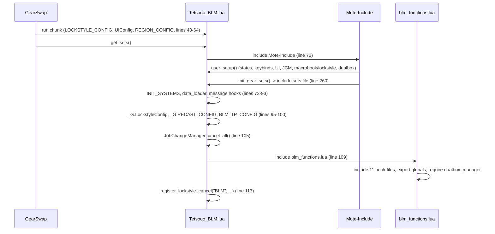
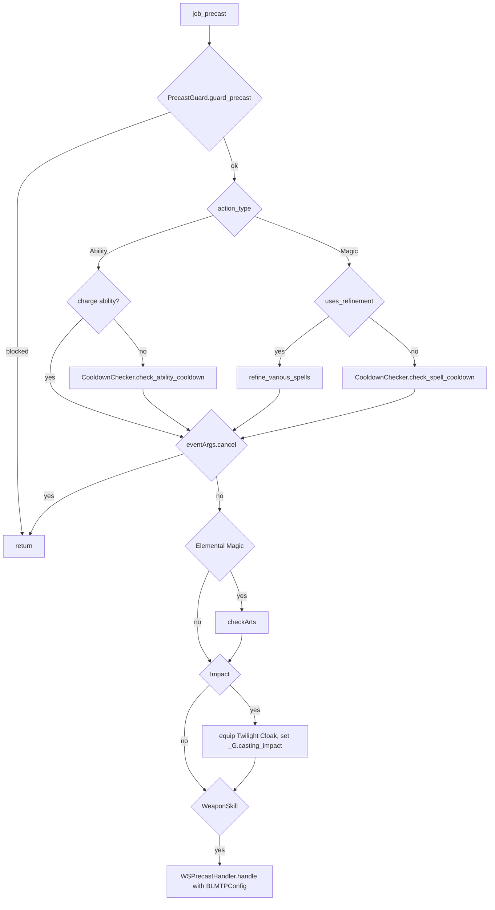
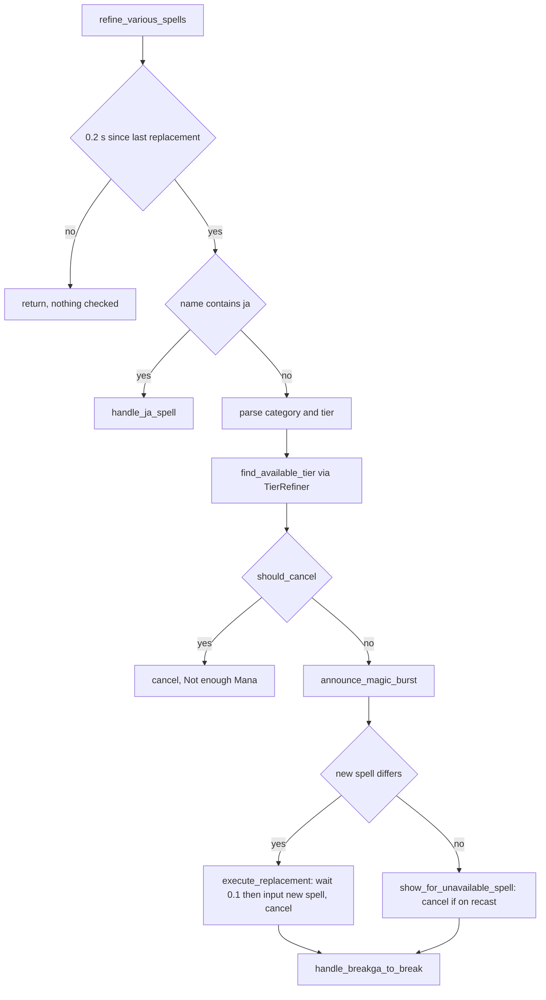
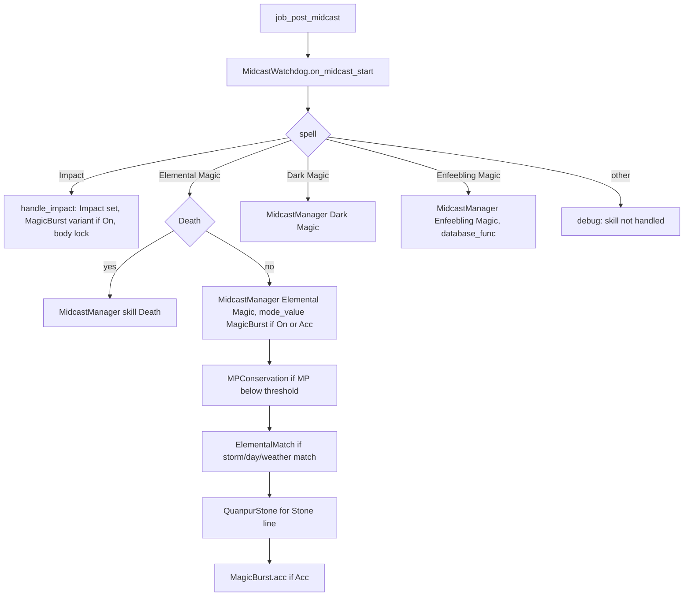

# BLM (Black Mage) job

The BLM job is the largest job area of the project: 12 hook modules plus 11
logic modules under `shared/jobs/blm/functions/` (3 434 lines), an entry point
per character, eight config files and one sets file. GearSwap loads it when the
main job becomes BLM (`Tetsouo_BLM.lua`). From then on Mote-Include calls its
hooks on every action (precast, midcast, aftercast), on status and buff changes,
on `//gs c` commands and on state cycles.

What BLM adds on top of the shared pipeline:

- **Tier refinement** of nukes and tiered enfeebles/dark spells in precast
  (Fire VI on recast becomes Fire V, Firaja becomes Firaga III, Breakga becomes
  Break), with a party-chat Magic Burst call.
- **Midcast overrides** layered after `MidcastManager`: MP conservation body,
  Hachirin-no-Obi on storm/day/weather match, Quanpur Necklace for the Stone
  line, a Magic Burst accuracy variant, and a Twilight Cloak lock for Impact.
- **Scholar subjob helpers**: Dark Arts put up automatically before a nuke,
  Klimaform + storm, `klima`, Arts toggles, party Sneak/Invisible, Dispel.
- **State-driven nuke commands** (`//gs c light`, `aoedark`, ...) built from
  element and tier states.

Every file in scope was read in full except the gear content of the sets files
(only structure and set names were read, as gear choice is out of scope). All
line numbers refer to the working tree on 2026-09-18.

## Files

| Path | Lines | Role |
|------|------:|------|
| `_master/entry/Tetsouo_BLM.lua` | 278 | Entry point (template): config preload, `get_sets`, `user_setup`, `job_sub_job_change`, `job_update`, `init_gear_sets`, `file_unload` |
| `shared/jobs/blm/functions/blm_functions.lua` | 328 | Facade: includes the 11 hook files, lazy logic loaders, global exports (`BuffSelf`, `SaveMP`, `refine_various_spells`, `checkArts`, `CastStorm`) |
| `shared/jobs/blm/functions/BLM_PRECAST.lua` | 186 | `job_precast` / `job_post_precast`: guard, recast-or-refine, Dark Arts, Impact lock, WS |
| `shared/jobs/blm/functions/BLM_MIDCAST.lua` | 192 | `job_midcast` (empty) / `job_post_midcast`: builds a context and dispatches to the router |
| `shared/jobs/blm/functions/BLM_AFTERCAST.lua` | 43 | `job_aftercast`: watchdog notify, clears the Impact lock |
| `shared/jobs/blm/functions/BLM_IDLE.lua` | 43 | `customize_idle_set` -> `SetBuilder.build_idle_set` |
| `shared/jobs/blm/functions/BLM_ENGAGED.lua` | 43 | `customize_melee_set` -> `SetBuilder.build_engaged_set` |
| `shared/jobs/blm/functions/BLM_STATUS.lua` | 19 | `job_status_change = LifecycleManager.status_change()` |
| `shared/jobs/blm/functions/BLM_BUFFS.lua` | 19 | `job_buff_change = LifecycleManager.buff_change()` |
| `shared/jobs/blm/functions/BLM_COMMANDS.lua` | 563 | `job_self_command` router and `job_state_change` (CombatMode weapon lock, UI refresh) |
| `shared/jobs/blm/functions/BLM_MOVEMENT.lua` | 56 | `job_handle_equipping_gear` (Impact body lock attempt), `get_blm_movement_status` |
| `shared/jobs/blm/functions/BLM_LOCKSTYLE.lua` | 49 | Lazy `LockstyleManager.create('BLM', ...)` wrappers |
| `shared/jobs/blm/functions/BLM_MACROBOOK.lua` | 44 | Lazy `MacrobookManager.create('BLM', ...)` wrapper |
| `shared/jobs/blm/functions/logic/midcast_router.lua` | 219 | Per-skill midcast handlers (Impact, Elemental, Dark, Enfeebling) and BLM overrides |
| `shared/jobs/blm/functions/logic/elemental_matcher.lua` | 195 | Storm / day / weather element match for Hachirin-no-Obi |
| `shared/jobs/blm/functions/logic/set_builder.lua` | 310 | Idle/engaged set construction (town, weapons, movement, Mana Wall); unused SaveMP API |
| `shared/jobs/blm/functions/logic/buff_manager.lua` | 35 | `//gs c buff` list for the shared `SelfBuffManager` |
| `shared/jobs/blm/functions/logic/storm_manager.lua` | 264 | Klimaform + storm casting with recast display |
| `shared/jobs/blm/functions/logic/spell_refiner.lua` | 159 | Refinement facade `refine_various_spells(spell, eventArgs)` |
| `shared/jobs/blm/functions/logic/refiner/correspondence.lua` | 122 | Tier downgrade table (Fire VI..base, -ga III..base, Sleep, Bio, ...) |
| `shared/jobs/blm/functions/logic/refiner/replacement_logic.lua` | 137 | Tier walk (delegates to `TierRefiner`), -ja fallback, MP cancel rule |
| `shared/jobs/blm/functions/logic/refiner/recast_display.lua` | 161 | Grouped recast display when nothing can be cast |
| `shared/jobs/blm/functions/logic/refiner/special_handlers.lua` | 155 | Magic Burst `/p` call, replacement execution, Breakga -> Break |
| `shared/jobs/blm/functions/logic/refiner/timing_guards.lua` | 92 | Module-local anti-spam timers |
| `shared/data/spells/BLM_SPELL_FILTERS.lua` | 126 | Which spells refine, which elemental spells do not, charge abilities |
| `_master/config/blm/BLM_STATES.lua` | 333 | All Mote states (`BLMStates.configure()`), unused `BLMStates.validate()` |
| `_master/config/blm/BLM_KEYBINDS.lua` | 147 | 18 numpad binds, `bind_all` / `unbind_all` / `show_intro` |
| `_master/config/blm/BLM_LOCKSTYLE.lua` | 24 | Lockstyle 5 (`default`, `by_subjob`) |
| `_master/config/blm/BLM_MACROBOOK.lua` | 43 | Book/page per subjob and per dual-box partner job |
| `_master/config/blm/BLM_MP_CONFIG.lua` | 45 | `mp_threshold = 1000` |
| `_master/config/blm/BLM_ELEMENTAL_CONFIG.lua` | 64 | `auto_hachirin`, `check_storm`, `check_day`, `check_weather` |
| `_master/config/blm/BLM_TP_CONFIG.lua` | 35 | `_G.BLMTPConfig` (Moonshade entry, see Known issues) |
| `_master/sets/blm_sets.lua` | 610 | Template sets (flat) |
| `shared/utils/messages/formatters/jobs/message_blm.lua` + `data/jobs/blm_messages.lua` | 309 + 163 | BLM chat messages (cycles, refinement, errors) |
| `shared/utils/messages/formatters/jobs/message_blm_midcast.lua` + `data/systems/blm_midcast_messages.lua` | 108 + 88 | `debugmidcast` trace lines for the BLM router |
| `shared/data/job_abilities/BLM_JA_DATABASE.lua` | 13 | `JA_DATABASE_FACTORY.create('BLM')`, read by `ability_message_handler.lua:81` |
| `shared/data/magic/BLM_SPELL_DATABASE.lua` | 165 | Merged BLM spell data, read by `data_loader.lua:67` and `spell_message_handler.lua:96` (messages only, not by BLM logic) |

Live copies (gitignored): `Tetsouo/Tetsouo_BLM.lua` (identical to the template
except line 260 includes `sets/blm/blm_sets.lua`), `Tetsouo/config/blm/*`
(identical except `BLM_MACROBOOK.lua` and the live-only `BLM_REFILL.lua`),
`Tetsouo/sets/blm/{blm_sets,armor,capes,weapons}.lua` (modular, 498 + 139 + 43 + 49
lines). `Kaories/`, `_master/Kaories/` and `_master/Tetsouo/` contain no BLM
files.

## How it works

### Load sequence

GearSwap runs the entry file chunk, then calls `get_sets()`. Mote-Include calls
`user_setup()` and `init_gear_sets()` from inside `include('Mote-Include.lua')`
(`Mote-Include.lua:170-175`, `init_include()` runs at include time,
`Mote-Include.lua:188`), that is **before** `INIT_SYSTEMS` and before the BLM
hook files exist.

`user_setup()` (`Tetsouo_BLM.lua:158-214`):

1. `BLMStates.configure()` creates every state (see [States](#mote-states)).
2. `require('Tetsouo/config/blm/BLM_KEYBINDS')`, stored in the global
   `BLMKeybinds`, then `bind_all()` (18 `bind` commands) and `show_intro()`.
3. `KeybindUI.smart_init("BLM", UIConfig.init_delay)`.
4. `JobChangeManager.initialize()`, then, if `select_default_macro_book` and
   `select_default_lockstyle` exist, the macro book is set immediately and the
   lockstyle is scheduled after `LockstyleConfig.initial_load_delay` (8 s).
   On a fresh load those two globals exist only because `show_intro()`
   (`BLM_KEYBINDS.lua:122,129`) `require`s `BLM_MACROBOOK.lua` and
   `BLM_LOCKSTYLE.lua`, which define them as a side effect (both files return
   nothing, so `show_intro` itself never finds `get_blm_macro_info` or
   `get_info` and falls back to `show_system_intro`). The facade includes the
   same two files again later, which creates a second, independent factory
   instance for each. See Known issues.
5. `pcall(require, 'shared/utils/dualbox/dualbox_manager')` (auto-init guarded
   by `windower._dualbox_init_counter`).

`blm_functions.lua` includes, in order: `message_buffs.lua` (41), `BLM_PRECAST`,
`BLM_MIDCAST`, `BLM_AFTERCAST` (96-100), `BLM_IDLE`, `BLM_ENGAGED` (107-109),
`BLM_STATUS`, `BLM_BUFFS` (116-118), `BLM_LOCKSTYLE`, `BLM_MACROBOOK`,
`BLM_COMMANDS`, `BLM_MOVEMENT` (126-130). Logic modules are loaded on first use
by `ensure_*` closures (59-90). It then exports five globals (304-308) and
requires `dualbox_manager` (316). `TIMER(...)` calls are no-ops unless
`//gs c perf start`.

### Precast

`job_precast` (`BLM_PRECAST.lua:132-159`):

- `uses_refinement` (78-91): every `Elemental Magic` spell except names in
  `ELEMENTAL_NO_TIERS`, plus the names in `REFINEMENT_SPELLS` (Sleep/Sleepga,
  Break/Breakga, Bind, Bio I-V, Poison I-V, Drain I-III, Aspir I-III, Burn..Drown).
  In practice `ELEMENTAL_NO_TIERS` never matches: storms are Enhancing Magic
  (`res/spells.lua:118`, `skill=34`) and Klimaform is Dark Magic
  (`res/spells.lua:290`, `skill=37`); they reach `CooldownChecker` through the
  non-refinement branch anyway.
- `has_charges` (71-73) skips the ability check for Addendum: White/Black,
  Accession, Manifestation. `CooldownChecker` already skips all stratagems
  itself (`cooldown_checker.lua:42-66`), so this list only duplicates it.
- `checkArts` (`blm_functions.lua:257-282`): only for Elemental Magic, only
  when `player.sub_job == 'SCH'`, `sub_job_level ~= 0` (Odyssey subjob lock),
  Dark Arts recast (id from `res.job_abilities`, fallback 232) is 0, and
  neither Dark Arts nor Addendum: Black is active. It calls `cancel_spell()`
  directly (not `eventArgs.cancel`), sends `input /ja "Dark Arts" <me>`, then
  hands the nuke to `AbilityHelper.follow_up`, which re-sends it once Dark Arts
  actually registers rather than after a fixed `wait 2`. It goes out either way
  — `cancel_spell()` has already killed the cast, so the follow-up is the only
  thing that will send it. `_G.BLM_ARTS_LAST_CAST` still stamps a 2 s guard, so
  a second nuke inside that window does not queue Dark Arts a second time.
  Because `eventArgs.cancel` stays false,
  Mote still runs `default_precast` and `job_post_precast` for the cancelled
  cast (`Mote-Include.lua:254-276`), and `job_precast` continues to the Impact
  lock.
- `job_post_precast` (166-171) only calls `WSPrecastHandler.apply_tp_gear`.
- The Mote default precast picks `sets.precast.FC[...]`, `sets.precast.JA[...]`
  or `sets.precast.WS`.

### Spell refinement

`SpellRefiner.refine_various_spells` (`spell_refiner.lua:100-157`):

- Tier walk: `TierRefiner.find_available_tier` (`tier_refiner.lua:57-85`) tests
  the requested tier, then each lower tier, and returns the first with recast 0
  and enough MP; otherwise the original name.
- -ja spells (`handle_ja_spell`, 47-88): if the -ja is on recast or too
  expensive, `find_ja_replacement` (`replacement_logic.lua:73-113`) walks
  `<Element>ga III..base`; if none is castable it still returns
  `<Element>ga III`.
- `announce_magic_burst` (`special_handlers.lua:36-80`) sends
  `wait 1|2; input /p Casting: [<name>] => Nuke` when `MagicBurstMode.value ==
  'On'` and the skill is Elemental Magic, at most once per 2.5 s
  (`timing_guards.lua:38`). It runs before the cancel decision.
- Replacement (`special_handlers.lua:90-109`) sends
  `wait 0.1; @input /ma "<new>" <original target.raw>`, sets `eventArgs.cancel`
  and prints `spell_refinement`. The replacement's own precast usually arrives
  within the 0.2 s guard and therefore skips refinement and the cooldown check.
- Breakga (`special_handlers.lua:120-153`): when Breakga is on recast, casts
  Break if ready (per-key 2 s guard), otherwise shows Break's recast.
- Refinement replaces the cooldown check for these spells: a refined spell never
  goes through `CooldownChecker`.

### Midcast

Mote first equips its own default midcast set (`get_midcast_set`: spell name,
spell map, skill, `CastingMode`), then calls `job_post_midcast`
(`BLM_MIDCAST.lua:135-179`). `job_midcast` is empty.

- The context (144-151) carries `debug_enabled` (`_G.MidcastManagerDebugState`),
  the midcast message module, `BLMMPConfig`, `BLMElementalConfig` and
  `ENHANCING_MAGIC_DATABASE.get_spell_family` as the enfeebling database. That
  function only knows enhancing spells, so it returns nil for every enfeeble.
- Per-character configs are loaded with `player.name .. '/config/blm/...'`
  (`BLM_MIDCAST.lua:44-50,105-117`) and fall back to built-in defaults.
- `MidcastManager.select_set` tries the exact spell name first
  (`midcast_manager.lua:376-391`), so a root set named after the spell wins over
  `mode_value`. `select_set` returns false immediately when
  `sets.midcast[skill]` does not exist (`midcast_manager.lua:624-629`).
- Enhancing (Stoneskin, Blink, Aquaveil, Ice Spikes, storms, /RDM buffs),
  Healing (/WHM cures) and Ninjutsu are not routed: only Mote's default set
  applies (`sets.midcast.Stoneskin`, `sets.midcast['Enhancing Magic']`,
  `sets.midcast.Cure` via spell map, ...).
- `ElementalMatcher.has_elemental_match` (`elemental_matcher.lua:139-178`)
  compares the spell element with active storm buffs (6 names, lines 36-43),
  `world.day_element` and `world.real_weather_element` (intensity > 0).

### Aftercast, idle, engaged, status, buffs

- `job_aftercast` (`BLM_AFTERCAST.lua:17-35`) notifies `MidcastWatchdog` and
  clears `_G.casting_impact` / `_G.impact_body` after Impact. Mote returns to
  idle/engaged gear.
- `customize_idle_set` -> `SetBuilder.build_idle_set` (`set_builder.lua:169-194`):
  Mote base set -> `sets.Adoulin` in Adoulin or `sets.idle.Town` in other cities
  (Dynamis excluded, `base_set_builder.lua:65-84`) -> `sets[state.MainWeapon]`
  and `sets[state.SubWeapon]` if they exist -> `sets.MoveSpeed` when
  `state.Moving.value == 'true'` outside town -> `sets.buff['Mana Wall']` while
  Mana Wall is up.
- `customize_melee_set` -> `build_engaged_set` (156-164): Mote base set + weapon
  sets. No Mana Wall or movement layer when engaged.
- Mote's own selection is `sets.idle[IdleMode]` and
  `sets.engaged[OffenseMode][HybridMode]`; `IdleMode` and `OffenseMode` are the
  Mote default `'Normal'` (`Modes.lua:154-158`), so `sets.idle.Normal` and
  `sets.engaged.Normal` are always the base, whatever `HybridMode` says.
- `job_status_change` / `job_buff_change` are the shared `LifecycleManager`
  handlers (Doom handling etc.), see [core lifecycle](../systems/core-lifecycle.md).
- `job_handle_equipping_gear` (`BLM_MOVEMENT.lua:39-49`) equips the Impact body
  while the lock is set, but Mote equips the full status set right after it
  (`Mote-Include.lua:443-450`), so this does not hold (Known issues).

## Mote states

Created by `BLMStates.configure()` (`_master/config/blm/BLM_STATES.lua:46-263`)
on every `user_setup()` (every load and every subjob change, so all values reset
to their defaults). Keybinds from `BLM_KEYBINDS.lua:43-75`; `^` = Ctrl, `#` =
Apps.

| State | Values | Default | Key | Read by |
|-------|--------|---------|-----|---------|
| `HybridMode` (Mote) | PDT, Normal | Normal | `^numpad9` | Mote `get_melee_set` only as `sets.engaged.Normal.PDT` (absent), UI |
| `CombatMode` | Off, On | Off | `^numpad8` | `job_state_change` (`BLM_COMMANDS.lua:540-551`) |
| `MagicBurstMode` | Off, On, Acc | On | `^numpad0` | `midcast_router.lua:105,146`; `special_handlers.lua:37` (On only) |
| `DeathMode` | Off, On | Off | `#numpad7` | nothing (no reader in the repo) |
| `MainWeapon` | Hvergelmir | Hvergelmir | none | `set_builder.lua:117` (`sets.Hvergelmir`, absent) |
| `SubWeapon` | Alber Strap | Alber Strap | none | `set_builder.lua:130` (`sets['Alber Strap']`, absent) |
| `MainLightSpell` | Fire, Aero, Thunder | Fire | `^numpad3` | `light`, `cyclemainlight`; UI readiness anchor (`ui_lifecycle.lua:40-41`); `spell_from_state` example in dual-box docs |
| `MainDarkSpell` | Blizzard, Stone, Water | Stone | `^numpad4` | `dark`, `cyclemaindark` |
| `SubLightSpell` | Thunder, Fire, Aero | Thunder | `#numpad3` | `sublight`, `cyclesublight` |
| `SubDarkSpell` | Water, Blizzard, Stone | Blizzard | `#numpad4` | `subdark`, `cyclesubdark` |
| `SpellTier` | VI, V, IV, III, II, I | VI | `^numpad1` | `light/dark/sublight/subdark` (`I` = base spell) |
| `MainLightAOE` | Firaga, Aeroga, Thundaga | Firaga | `^numpad5` | `aoelight` |
| `MainDarkAOE` | Blizzaga, Stonega, Waterga | Stonega | `^numpad6` | `aoedark` |
| `SubLightAOE` | Thundaga, Firaga, Aeroga | Thundaga | `#numpad5` | `subaoelight` |
| `SubDarkAOE` | Blizzaga, Stonega, Waterga | Blizzaga | `#numpad6` | `subaoedark` |
| `AOETier` | Aja, III, II, I | Aja | `^numpad2` | `aoe*` commands (`Aja` -> `<El>ja`, `I` -> base -ga) |
| `Storm` | Firestorm, Sandstorm, Thunderstorm, Hailstorm, Rainstorm, Windstorm, Voidstorm, Aurorastorm | Firestorm | `^numpad7` | `storm`, `cycle Storm` |
| `SneakInviAOE` | On, Off | On | `#numpad8` | `aoe sneak` / `aoe invi` (Accession on `<me>` vs single `<stal>`) |
| `KlimaformAOE` | On, Off | On | `#numpad9` | `klima` (Manifestation step) |
| `FastCast` | 0..80 step 10 | 80 | none | `midcast_watchdog.lua:58-60` |
| `AutoMedicine` | shared On/Off | persisted | `#numpad0` | created by `AutoMedicine.init(state, M)` (`BLM_STATES.lua:259-262`), see [precast pipeline](../systems/precast-pipeline.md) |

Mote defaults also exist: `OffenseMode`, `IdleMode`, `CastingMode` (all
`'Normal'`); `state.CastingMode` is only read by the unused `SetBuilder.SaveMP`.
`state.Moving` comes from AutoMove.

## Commands

`job_self_command` (`BLM_COMMANDS.lua:239-504`) lowercases the first word and
tests, in order: dual-box internals, `watchdog`, **CommonCommands** (built-in
names and warp aliases only), `ui`, `debugmidcast`, `cyclestate`, BLM cycles,
then BLM commands. A name none of them answers goes to Mote's
`selfCommandMaps`, whose last lookup is the dual-box partner's alt config
([dualbox](../systems/dualbox.md#alt-command-routing)), so a BLM command keeps its name even when the partner's alt
config has the same key.

| Command | Effect | Handler |
|---------|--------|---------|
| `altjobupdate <job>  ...` | Dual-box: receive the alt's job | `BLM_COMMANDS.lua:252-259` |
| `requestjob` | Dual-box: answer the main's request | 263-268 |
| `watchdog ...` | MidcastWatchdog commands | 273-278 |
| common commands | `reload`, `checksets`, `wa`, `wo`, `refill`, `craft`, `am`, `alt*`, `lockstyle`, `jump`, `waltz`, debug/perf..., warp commands | 283-294 -> `CommonCommands.handle_command(command, 'BLM', table.unpack(args))` |
| `ui ...` | UI toggles | 299-303 |
| `debugmidcast` | Toggle `MidcastManager` debug | 308-318 |
| `cyclestate <State>` | `CycleHandler.handle_cyclestate` (used by all keybinds) | 327-330 |
| `cyclemainlight` / `cyclemaindark` / `cyclesublight` / `cyclesubdark` | Cycle the element state with a colored message | 115-163 |
| `cycle Storm` | Cycle `Storm` with a colored message (other `cycle X` fall through to Mote) | 169-198 |
| `buff` / `buffs` / `buffself` / `selfbuff` | `BuffSelf()`: Stoneskin (8 s), Blink, Aquaveil, Ice Spikes through `SelfBuffManager` (skips missing spells, active buffs, recasts) | 352-362 |
| `lightarts` / `darkarts` | `ScholarActions.light_arts()` / `dark_arts()` (Arts, then Addendum on the next press) | 365-375 |
| `aoe sneak` / `aoe invi` / `aoe invisible` / `aoe erase` | `ScholarActions.try_aoe_subcommand` (Light Arts + Addendum/Accession as charges allow) | 381-386 |
| `klima` / `klimaform` | Dark Arts (if down and ready) + Manifestation (if `KlimaformAOE` On and a charge is left) + Klimaform, chained 2 s apart | 390-413 |
| `dispel` | /RDM: Dispel `<stnpc>`; /SCH: Addendum: Black (and Dark Arts) first; other subjobs: warning | 422-440 |
| `light` / `dark` / `sublight` / `subdark` | `windower.chat.input('/ma "<Element> <SpellTier>" <stnpc>')` | 447-465 |
| `aoelight` / `aoedark` / `subaoelight` / `subaoedark` | Same with the -ga state and `AOETier` | 468-486 |
| `storm` | `CastStorm(state.Storm.current)` | 489-503 |

`job_state_change(field, new, old)` (517-554): skips `Moving`; for
`CombatMode` / `Combat Mode` On it equips Bunzi's Rod, Ammurapi Shield, Sroda
Tathlum and `disable('main','sub','range','ammo')`; Off enables them unless
`_G.__CraftManagerState.active`. Always refreshes the UI.

`CastStorm` (`storm_manager.lua:185-226`): 2 s anti-spam; both Klimaform and
the storm ready -> Klimaform (if not active) then storm 4.5 s later; storm ready
but Klimaform on recast -> storm only if Klimaform is already active, otherwise
Klimaform's recast is shown and nothing is cast; storm on recast -> recast
display.

## Set names the code looks up

T = `_master/sets/blm_sets.lua`, L = `Tetsouo/sets/blm/blm_sets.lua`.

| Set | Looked up by | T | L |
|-----|--------------|---|---|
| `sets.idle.Normal`, `sets.engaged.Normal` | Mote base (Normal modes) | 146, 172 | 56, 82 |
| `sets.idle.PDT`, `sets.engaged.PDT` | nothing reaches them (HybridMode) | 165, 191 | 75, 101 |
| `sets.idle.Town`, `sets.Adoulin`, `sets.MoveSpeed` | `BaseSetBuilder`, Mote Town scope | 585 (`= sets.MoveSpeed`), 588, 580 | 475 (`set_combine(idle.PDT, MoveSpeed)`), 478, 470 |
| `sets[state.MainWeapon]`, `sets[state.SubWeapon]` | `set_builder.lua:118,131` | absent | absent |
| `sets.buff['Mana Wall']` | `set_builder.lua:186` | 600 | 486 |
| `sets.buff.Doom` | shared DoomManager | 606 | 492 |
| `sets.precast.FC` (+ `['Enhancing Magic']`, `['Elemental Magic']`, `Cure`, `Curaga`, `Impact`, `Stoneskin`) | Mote default precast | 201-247 | 111-150 |
| `sets.precast.JA['Mana Wall']`, `.Manafont`, `['Elemental Seal']` | Mote default precast | 256-267 | 158-169 |
| `sets.precast.WS` | Mote default precast | 276 | 178 |
| `sets.midcast['Elemental Magic']`, `.MagicBurst`, `.MagicBurst.acc` | router + MidcastManager | 448, 467, 486 | 345, 364, 383 |
| `sets.midcast.MPConservation`, `.ElementalMatch` | `midcast_router.lua:67,80` | 510, 515 | 395, 400 |
| `sets.midcast.QuanpurStone` | `midcast_router.lua:90` | **absent** | 405 |
| `sets.midcast['Impact']`, `.MagicBurst` (alias of itself) | `midcast_router.lua:102-107` | 520, 537 | 410, 427 |
| `sets.midcast['Death']` (alias of the Elemental base) | router, skill `Death` | 540 | 430 |
| `sets.midcast['Comet']`, `['Meteor']` (aliases of the Elemental base) | MidcastManager P0 exact name | 547, 544 | 437, 434 |
| `sets.midcast.Burn` and Rasp/Shock/Drown/Choke/Frost aliases | MidcastManager P0 | 551-573 | 441-463 |
| `sets.midcast['Dark Magic']`, `.Drain`, `.Aspir` | MidcastManager Dark Magic | 423-445 | 320-342 |
| `sets.midcast['Enfeebling Magic']` | MidcastManager base set for Enfeebling | **absent** | **absent** |
| `sets.midcast.IntEnfeebles` via Break/Breakga/Sleep/Sleep II/Sleepga/Sleepga II/Blind aliases | Mote default by spell name | 391-420 | 288-317 |
| `sets.midcast.MndEnfeebles` | nothing (no alias, no spell map) | 373 | 270 |
| `sets.midcast['Enhancing Magic']`, `.Stoneskin`, `.Phalanx`, `.Aquaveil`, `.Refresh`, `.Haste` | Mote default | 324-370 | 229-267 |
| `sets.midcast.Cure`, `.Curaga`, `.Raise` | Mote default (spell map) | 299-321 | 201-226 |
| `blm_dynamic_sets` (global) | unused `SetBuilder.get_dynamic_elemental_set` | absent | absent |

`sets.midcast['Death'].MagicBurst` and `sets.midcast['Comet'].MagicBurst`
assign to the shared Elemental base table (the two keys are the same table), so
they are self-assignments; no code path reads them.

## Configuration

| File / key | Default | Where the default lives | Read by |
|------------|---------|-------------------------|---------|
| `<char>/config/blm/BLM_STATES.lua` | see states | file itself | entry `user_setup` (path hard-coded `Tetsouo/...`, replaced by the clone script) |
| `<char>/config/blm/BLM_KEYBINDS.lua` | 18 binds | file itself | entry `user_setup`, `file_unload` |
| `<char>/config/blm/BLM_LOCKSTYLE.lua` `default`, `by_subjob` | 5 | file; factory fallback 1 (`BLM_LOCKSTYLE.lua:31`) | `LockstyleManager` uses `default` and `get_style()`; BLM defines no `get_style`, so `by_subjob` is never read |
| `<char>/config/blm/BLM_MACROBOOK.lua` `default`, `solo[sub]`, `dualbox[alt_job][sub]` | template book 8 page 1; live book 7 | file; factory fallback book 1 page 1 (`BLM_MACROBOOK.lua:31-33`) | `MacrobookManager`: dual-box entry if the alt is online, else `solo[sub]`, else `default` |
| `<char>/config/blm/BLM_MP_CONFIG.lua` `mp_threshold` | 1000 | file; fallback 1000 (`BLM_MIDCAST.lua:107-108`) | `apply_mp_conservation` |
| `<char>/config/blm/BLM_ELEMENTAL_CONFIG.lua` | all true | file; same fallback (`BLM_MIDCAST.lua:111-116`) | `apply_elemental_match` |
| `Tetsouo/config/blm/BLM_TP_CONFIG.lua` -> `_G.BLMTPConfig` | `moonshade = {name, tp_bonus=250}` | file | `WSPrecastHandler` -> `TPBonusCalculator` reads `pieces`, which BLM does not define |
| `Tetsouo/config/LOCKSTYLE_CONFIG.lua` | `initial_load_delay 8`, `job_change_delay 8`, `cooldown 15` | entry fallback 46-50 | entry |
| `Tetsouo/config/REGION_CONFIG.lua`, `RECAST_CONFIG.lua`, UI config | - | shared | entry (`_G.RegionConfig`, `_G.RECAST_CONFIG`) |
| `shared/data/spells/BLM_SPELL_FILTERS.lua` | - | - | `BLM_PRECAST.lua:52` |
| `<char>/config/blm/BLM_REFILL.lua` (live only) | Panacea, Remedy, Echo Drops, Vile Elixir, food | - | `refill/config_resolver.lua` (all REFILL files are live-only) |

## State & lifetime

- Module state: `TimingGuards` (last replacement, per-key cast times, last
  announce), `StormManager.last_cast_time`, lazy-load locals. All live in the
  sandbox and die on `gs reload` (the `require` cache is on the sandbox `_G`,
  `module_cache.lua:18-25`). Modules required before `INIT_SYSTEMS` runs (inside
  `user_setup`) are not cached and load again later.
- `_G` written: the Mote hooks (`job_precast`, `job_post_precast`, `job_midcast`,
  `job_post_midcast`, `job_aftercast`, `job_status_change`, `job_buff_change`,
  `customize_idle_set`, `customize_melee_set`, `job_self_command`,
  `job_state_change`, `job_handle_equipping_gear`), `BuffSelf`, `SaveMP`,
  `refine_various_spells`, `checkArts`, `CastStorm`, `BLM_ARTS_LAST_CAST`,
  `casting_impact`, `impact_body`, `BLMTPConfig`, `BLMKeybinds`,
  `LockstyleConfig`, `RECAST_CONFIG`, `RegionConfig`,
  `select_default_lockstyle`, `cancel_blm_lockstyle_operations`,
  `select_default_macro_book`, plus the factory exports
  (`set_blm_lockstyle_enabled`, `get_blm_lockstyle_info`,
  `show_blm_lockstyle_config`, `set_blm_dressup_management`,
  `get_blm_macro_info`, ...), `get_blm_movement_status`.
- `_G` read: `MidcastManagerDebugState`, `MidcastWatchdog`,
  `PERFORMANCE_PROFILING`, `AUTOMOVE_DEBUG`, `AUTOMOVE_DEBUG_START`,
  `__CraftManagerState`, `is_recast_ready` (from `RECAST_CONFIG.lua:95`).
- `windower.*`: BLM code writes nothing there. It registers no Windower events.
- Keybinds: bound in `user_setup`, unbound in `file_unload`
  (`Tetsouo_BLM.lua:275-277`).
- Coroutines: the 8 s lockstyle in `user_setup` (not registered anywhere, so
  nothing cancels it; `LockstyleManager.select_default_lockstyle` returns if the
  main job is no longer BLM). Chained actions (`wait N` in `send_command`) sit in
  the Windower command queue and survive a reload.
- `disable()` of main/sub/range/ammo by CombatMode lives in GearSwap's
  `disable_table` (`statics.lua:194`), which a `gs reload` or job change does
  not reset.
- Subjob change: Mote calls `user_setup()` again in the same environment
  (states reset, keybinds rebound), then `job_sub_job_change`
  (`Tetsouo_BLM.lua:128-152`) hands over to `JobChangeManager.on_job_change`,
  which schedules a `gs reload`. See
  [job change lifecycle](../architecture/job-change-lifecycle.md).
- Main job change: `file_unload` cancels `JobChangeManager` timers and unbinds.

## Interactions

- Precast: `PrecastGuard`, `CooldownChecker`, `WSPrecastHandler`, `TierRefiner`
  ([precast pipeline](../systems/precast-pipeline.md)). `TierRefiner` is shared
  with [RDM](rdm.md).
- Midcast: `MidcastManager`, `MidcastWatchdog`
  ([midcast and buffs](../systems/midcast-and-buffs.md)); `SelfBuffManager` for
  `buff`.
- Messages: `message_blm`, `message_blm_midcast`, `message_cooldowns`,
  `message_buffs` ([messages](../systems/messages.md)). `show_arts_already_active`
  and `show_stratagem_no_charges` in `message_blm` are also used by
  `scholar_actions.lua` for every job that subs Scholar.
- Scholar helpers: `shared/utils/scholar/scholar_actions.lua`,
  `stratagem_charges.lua` (also used by [PLD](pld.md)).
- Lockstyle / macrobook factories, `JobChangeManager`, `LifecycleManager`, UI
  ([UI overlay](../systems/ui-overlay.md)), `CommonCommands` and `CycleHandler`
  ([commands and debug](../systems/commands-and-debug.md)), dual-box
  ([dualbox](../systems/dualbox.md)).

## Invariants & gotchas

- `user_setup()` runs before the BLM hook files are loaded; anything it needs
  from them must be guarded or deferred.
- Refinement replaces the cooldown check: a spell that refines is never checked
  by `CooldownChecker`, and a spell arriving within 0.2 s of a replacement is
  not checked at all.
- A root set named after a spell beats `mode_value` in `MidcastManager`: aliasing
  `sets.midcast.X = sets.midcast['Elemental Magic']` removes Magic Burst gear
  from X.
- `MidcastManager` does nothing for a skill whose `sets.midcast[skill]` is
  missing.
- `GearSwap spell.element`, `world.day_element` and `world.real_weather_element`
  all use resource names (`Lightning`, not `Thunder`).
- `Addendum: Black` replaces `Dark Arts` in `buffactive`; `checkArts` and `klima`
  test both.
- `klima`, `storm` and `aoe` do not check that the subjob is SCH; the game
  refuses the actions, and `StratagemCharges` reports no charges.
- `CombatMode` equips a hard-coded weapon trio (`BLM_COMMANDS.lua:542`), not a
  set.

## Extending

- New nuke family or tier: add the family to `refiner/correspondence.lua`
  (`[tier] = {replace = next}`, `''` = base) and, for non-elemental spells, the
  names to `BLM_SPELL_FILTERS.REFINEMENT_SPELLS`.
- New midcast override: add a `local function apply_x(spell, ctx)` in
  `midcast_router.lua`, call it from `handle_elemental` after `select_set`, and
  define the set in both `_master/sets/blm_sets.lua` and the live sets.
- New skill routing: add a `Router.handle_<skill>` and a dispatch branch in
  `BLM_MIDCAST.lua`, and make sure `sets.midcast['<Skill>']` exists.
- New command: add a branch in `job_self_command` after the CommonCommands
  block. A name that is also a key of `Tetsouo/config/alt/*.lua` then runs here; the
  alt's version stays reachable as `//gs c alt <name>`.
- New state: add it in `BLM_STATES.lua`, a bind in `BLM_KEYBINDS.lua` (Ctrl =
  main side, Apps = sub side, same digit per family), in both `_master/` and the
  live copy.

## Known issues

- Hachirin-no-Obi never triggers for Thunder spells on Lightningsday or in
  thunder weather, nor under Aurorastorm/Voidstorm (`elemental_matcher.lua:23-43`).
- `sets.midcast['Enfeebling Magic']` is missing, so the Enfeebling route equips
  nothing; `MndEnfeebles` is unreachable (`midcast_router.lua:207`,
  `midcast_manager.lua:627`).
- Comet ignores Magic Burst mode because of its root alias
  (`_master/sets/blm_sets.lua:547`).
- CombatMode's weapon lock survives `gs reload`, subjob change and job change
  while the state resets to Off (`BLM_COMMANDS.lua:540-551`).
- `checkArts` re-casts the nuke on `<t>` (`blm_functions.lua:280`).
- The Impact body lock in `job_handle_equipping_gear` is overwritten by Mote
  (`BLM_MOVEMENT.lua:39-49`).
- Initial macrobook/lockstyle depend on a side effect of
  `BLM_KEYBINDS.show_intro` (`Tetsouo_BLM.lua:201`).
- `HybridMode = PDT` never selects the PDT sets (`set_builder.lua:156-171`).
- The Magic Burst `/p` call is sent even when the cast is then cancelled or
  cannot be paid (`spell_refiner.lua:144`).
- `should_cancel` can never be true (`replacement_logic.lua:129`).
- -ja fallback always casts `<El>ga III` even when every -ga tier is unavailable
  (`replacement_logic.lua:102-106`).
- `MagicBurstMode = Acc` is ignored by the `/p` call and by Impact, and its
  overlay replaces the Burn/Frost sets (`midcast_router.lua:168-174`).
- `BLM_TP_CONFIG` is never read by the TP calculator (`BLM_TP_CONFIG.lua:21`).
- `BLM_LOCKSTYLE.by_subjob` is never read (`BLM_LOCKSTYLE.lua:18`).
- Template `sets.idle.Town` / `sets.Adoulin` are 1-2 slot sets used as full idle
  bases (`_master/sets/blm_sets.lua:585,588`).
- Dead code: `SetBuilder.SaveMP` family, `cast_storm_only`,
  `get_spell_element_name`, `get_blm_movement_status`, `BLMStates.validate`,
  `cycle TierSpell`, `DeathMode`, weapon states, 11 BLM message functions.
- User docs out of date (`docs/user/jobs/blm/states.md`,
  `docs/user/guides/commands.md:233-240`).
