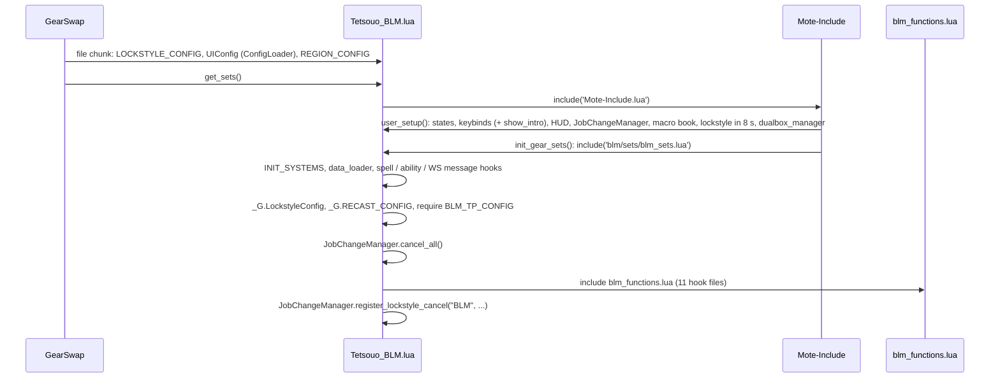
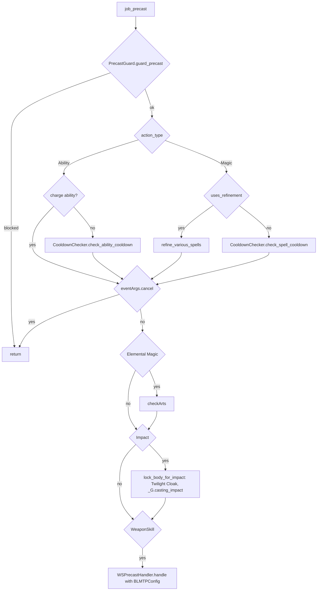
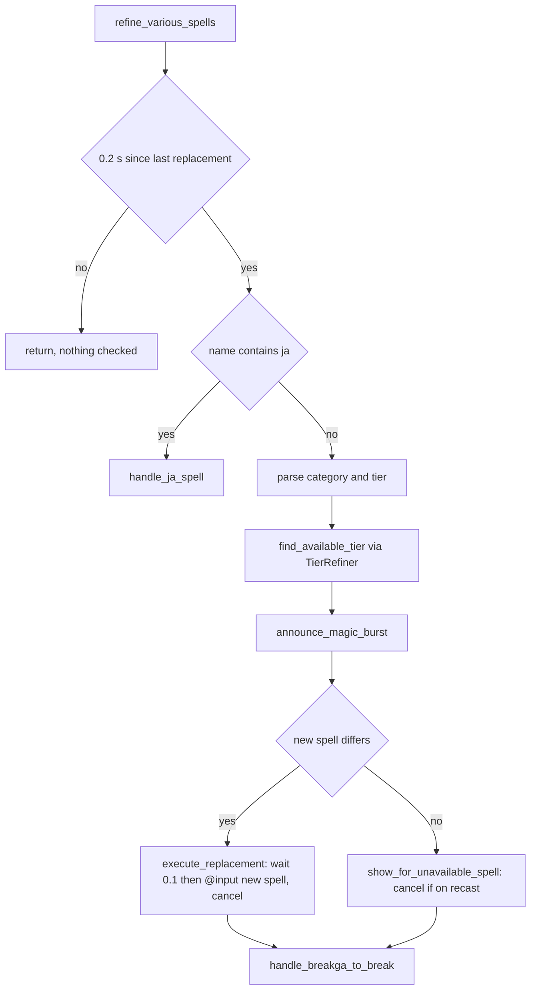
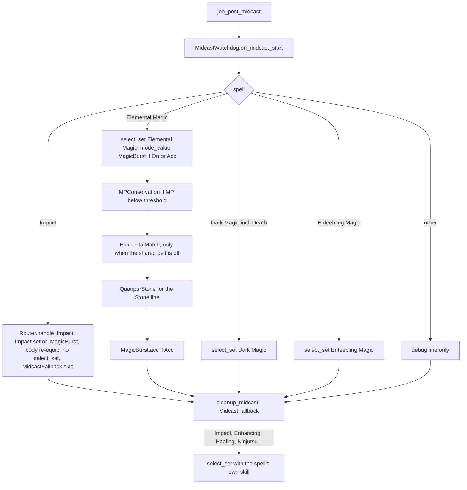

# BLM (Black Mage) job

The BLM job area is the facade plus 11 hook modules and 11 logic modules
under `shared/jobs/blm/functions/` (about 3 150 lines), an entry point per
character, nine config files and one sets file. GearSwap loads it when the main
job becomes BLM. From then on Mote-Include calls its hooks on every action
(precast, midcast, aftercast), on status and buff changes, on `//gs c`
commands and on state cycles.

What BLM adds on top of the shared pipeline:

- **Tier refinement** of nukes and tiered enfeebles / dark spells in precast
  (Fire VI on recast becomes Fire V, Firaja becomes Firaga III, Breakga
  becomes Break), with a party-chat Magic Burst call.
- **Midcast overrides** layered after `MidcastManager`: an MP conservation
  set, a Hachirin-no-Obi match (only when the shared automatic belt is off),
  Quanpur Necklace for the Stone line, a Magic Burst accuracy variant, and a
  Twilight Cloak lock for Impact.
- **Scholar subjob helpers**: Dark Arts put up automatically before a nuke,
  Klimaform + storm, `klima`, Arts toggles, party Sneak / Invisible, Dispel.
- **State-driven nuke commands** (`//gs c light`, `aoedark`, ...) built from
  element and tier states.

Player pages: [start page](../../user/jobs/blm/README.md),
[modes](../../user/jobs/blm/states.md), [sets](../../user/jobs/blm/sets.md).

Re-verified against the code on 2026-09-28. References name a file and a
function, not a line number.

## Files

| Path | Role |
|------|------|
| `_master/entry/Tetsouo_BLM.lua` | Entry point (template): config preload at file level, `get_sets`, `job_sub_job_change`, `user_setup`, `job_update` (HUD refresh only), `init_gear_sets`, `file_unload` |
| `shared/jobs/blm/functions/blm_functions.lua` | Facade: includes the 11 hook files, lazy logic loaders, globals `BuffSelf`, `refine_various_spells`, `checkArts`, `CastStorm`, requires `dualbox_manager` |
| `shared/jobs/blm/functions/BLM_PRECAST.lua` | `job_precast` (guard, `check_recast_or_refine`, `checkArts`, `lock_body_for_impact`, WS) / `job_post_precast` (TP gear) |
| `shared/jobs/blm/functions/BLM_MIDCAST.lua` | `job_midcast` (empty) / `job_post_midcast`: builds a context and dispatches to the router |
| `shared/jobs/blm/functions/BLM_AFTERCAST.lua` | `job_aftercast`: watchdog notify, clears the Impact lock |
| `shared/jobs/blm/functions/BLM_IDLE.lua` | `customize_idle_set` -> `SetBuilder.build_idle_set` |
| `shared/jobs/blm/functions/BLM_ENGAGED.lua` | `customize_melee_set` -> `SetBuilder.build_engaged_set` |
| `shared/jobs/blm/functions/BLM_STATUS.lua` | `job_status_change = LifecycleManager.status_change()` |
| `shared/jobs/blm/functions/BLM_BUFFS.lua` | `job_buff_change = LifecycleManager.buff_change()` |
| `shared/jobs/blm/functions/BLM_COMMANDS.lua` | `job_self_command` router, BLM cycle handlers, `job_state_change` (HUD refresh) |
| `shared/jobs/blm/functions/BLM_MOVEMENT.lua` | `job_handle_equipping_gear` (Impact body lock attempt) |
| `shared/jobs/blm/functions/BLM_LOCKSTYLE.lua` | Lazy `LockstyleManager.create('BLM', ...)` wrappers |
| `shared/jobs/blm/functions/BLM_MACROBOOK.lua` | Lazy `MacrobookManager.create('BLM', ...)` wrapper |
| `shared/jobs/blm/functions/logic/midcast_router.lua` | `Router.handle_impact`, `handle_elemental`, `handle_dark`, `handle_enfeebling`, and the override helpers |
| `shared/jobs/blm/functions/logic/elemental_matcher.lua` | Storm (all 8) / day / weather element match, by element id |
| `shared/jobs/blm/functions/logic/set_builder.lua` | `build_idle_set` / `build_engaged_set`: mode base, town, weapons, movement, Mana Wall |
| `shared/jobs/blm/functions/logic/buff_manager.lua` | `//gs c buff` list for the shared `SelfBuffManager` |
| `shared/jobs/blm/functions/logic/storm_manager.lua` | `cast_storm_with_klimaform`: Klimaform + storm with recast display |
| `shared/jobs/blm/functions/logic/spell_refiner.lua` | Refinement facade `refine_various_spells(spell, eventArgs)` |
| `shared/jobs/blm/functions/logic/refiner/correspondence.lua` | Tier downgrade table (Fire VI..base, -ga III..base, Sleep, Bind, Bio, ...) |
| `shared/jobs/blm/functions/logic/refiner/replacement_logic.lua` | Tier walk (delegates to `TierRefiner`), `find_ja_replacement` |
| `shared/jobs/blm/functions/logic/refiner/recast_display.lua` | Grouped recast display when nothing can be cast |
| `shared/jobs/blm/functions/logic/refiner/special_handlers.lua` | `announce_magic_burst`, `execute_replacement`, `handle_breakga_to_break` |
| `shared/jobs/blm/functions/logic/refiner/timing_guards.lua` | Module-local anti-spam timers (0.2 s replacement, 2 s per-key cast, 2.5 s announce) |
| `shared/data/spells/BLM_SPELL_FILTERS.lua` | `REFINEMENT_SPELLS`, `ELEMENTAL_NO_TIERS`, `CHARGE_ABILITIES` |
| `_master/config/blm/BLM_STATES.lua` | All Mote states (`BLMStates.configure()`) |
| `_master/config/blm/BLM_KEYBINDS.lua` | 17 numpad binds, data only; `KeybindManager.create('BLM', ...)` ([keybinds](../systems/keybinds-and-custom.md)) |
| `_master/config/blm/BLM_CUSTOM.lua` | Player modes and gear rules (all examples commented out) |
| `_master/config/blm/BLM_HUD.lua` | Per-job HUD section / row order (empty = defaults), rewritten by `//gs c ui order` |
| `_master/config/blm/BLM_LOCKSTYLE.lua` | `default = 5`, `by_subjob` (not read: no `get_style`) |
| `_master/config/blm/BLM_MACROBOOK.lua` | `default` book 8 page 1, `solo[sub]`, `dualbox[partner_job][sub]` |
| `_master/config/blm/BLM_MP_CONFIG.lua` | `mp_threshold = 1000` |
| `_master/config/blm/BLM_ELEMENTAL_CONFIG.lua` | `auto_hachirin`, `check_storm`, `check_day`, `check_weather` |
| `_master/config/blm/BLM_TP_CONFIG.lua` | `_G.BLMTPConfig` with a `moonshade` entry (see Known issues) |
| `_master/sets/blm_sets.lua` | Template sets (flat) |
| `shared/utils/messages/formatters/jobs/message_blm.lua` + `data/jobs/blm_messages.lua` | BLM chat messages (cycles, refinement, errors) |
| `shared/utils/messages/formatters/jobs/message_blm_midcast.lua` + `data/systems/blm_midcast_messages.lua` | `debugmidcast` trace lines for the router |
| `shared/data/job_abilities/BLM_JA_DATABASE.lua` | `JA_DATABASE_FACTORY.create('BLM')`, read by the ability message handler |
| `shared/data/magic/BLM_SPELL_DATABASE.lua` | Spell data for messages and `//gs c info` (not read by BLM logic) |

Character copies are gitignored. The author's overlay `_master/Tetsouo/`
holds its own `entry/Tetsouo_BLM.lua` (includes the modular
`blm/sets/blm_sets.lua`), `blm/BLM_MACROBOOK.lua` (book 7),
`blm/BLM_REFILL.lua` and `blm/{blm_sets,armor,capes,weapons}.lua`.
No other overlay has BLM files.

## How it works

### Load sequence

GearSwap runs the entry file chunk, then calls `get_sets()`. Mote-Include runs
`init_include()` while it is being included, and that calls `user_setup()` and
`init_gear_sets()`: both run **before** `INIT_SYSTEMS` and before any BLM hook
file exists.

```mermaid
sequenceDiagram
    participant GS as GearSwap
    participant E as Tetsouo_BLM.lua
    participant M as Mote-Include
    participant F as blm_functions.lua
    GS->>E: file chunk: LOCKSTYLE_CONFIG, UIConfig (ConfigLoader), REGION_CONFIG
    GS->>E: get_sets()
    E->>M: include('Mote-Include.lua')
    M->>E: user_setup(): states, keybinds (+ show_intro), HUD, JobChangeManager, macro book, lockstyle in 8 s, dualbox_manager
    M->>E: init_gear_sets(): include('blm/sets/blm_sets.lua')
    E->>E: INIT_SYSTEMS, data_loader, spell / ability / WS message hooks
    E->>E: _G.LockstyleConfig, _G.RECAST_CONFIG, require BLM_TP_CONFIG
    E->>E: JobChangeManager.cancel_all()
    E->>F: include blm_functions.lua (11 hook files)
    E->>E: JobChangeManager.register_lockstyle_cancel("BLM", ...)
```

`user_setup()`:

1. `BLMStates.configure()` creates every state (all values reset on every load
   and every subjob change).
2. `require('Tetsouo/blm/BLM_KEYBINDS')` returns
   `KeybindManager.create('BLM', ...)` (the player's `BLM_CUSTOM.lua` keys and
   the character's `COMMON_KEYBINDS.lua` keys are appended there), stored in
   the global `BLMKeybinds`, then `bind_all()`, which validates, binds and
   calls `show_intro()`. A failed require prints the Lua error.
3. `KeybindUI.smart_init("BLM", UIConfig.init_delay)`.
4. `JobChangeManager.initialize()`, then, if `select_default_macro_book` and
   `select_default_lockstyle` exist, the macro book is set now and the
   lockstyle after `LockstyleConfig.initial_load_delay` (8 s). On a fresh load
   those two globals exist only because `show_intro()` `require`s
   `BLM_MACROBOOK.lua` and `BLM_LOCKSTYLE.lua`, which define them as a side
   effect. The facade includes the same files again later, creating a second,
   independent factory instance of each.
5. `pcall(require, 'shared/utils/dualbox/dualbox_manager')` (auto-init).

The `Tetsouo/...` paths in the template are replaced by the clone script.

`blm_functions.lua` includes `message_buffs.lua`, then `BLM_PRECAST`,
`BLM_MIDCAST`, `BLM_AFTERCAST`, `BLM_IDLE`, `BLM_ENGAGED`, `BLM_STATUS`,
`BLM_BUFFS`, `BLM_LOCKSTYLE`, `BLM_MACROBOOK`, `BLM_COMMANDS`, `BLM_MOVEMENT`.
Logic modules load on first use (`ensure_buff_manager`,
`ensure_spell_refiner`, `ensure_storm_manager`). `TIMER(...)` calls are no-ops
unless `//gs c perf start`.

### Precast

```mermaid
flowchart TD
    A[job_precast] --> B{PrecastGuard.guard_precast}
    B -- blocked --> Z[return]
    B -- ok --> C{action_type}
    C -- Ability --> D{charge ability?}
    D -- no --> E[CooldownChecker.check_ability_cooldown]
    D -- yes --> G
    C -- Magic --> F{uses_refinement}
    F -- yes --> R[refine_various_spells]
    F -- no --> S[CooldownChecker.check_spell_cooldown]
    E --> G{eventArgs.cancel}
    R --> G
    S --> G
    G -- yes --> Z
    G -- no --> H{Elemental Magic}
    H -- yes --> I[checkArts]
    H -- no --> J
    I --> J{Impact}
    J -- yes --> K[lock_body_for_impact: Twilight Cloak, _G.casting_impact]
    J -- no --> L
    K --> L{WeaponSkill}
    L -- yes --> M[WSPrecastHandler.handle with BLMTPConfig]
```

- `uses_refinement` (`BLM_PRECAST.lua`): every `Elemental Magic` spell except
  `ELEMENTAL_NO_TIERS`, plus the names in `REFINEMENT_SPELLS` (Sleep /
  Sleepga, Break / Breakga, Bind, Bio I-V, Poison I-V, Drain I-III, Aspir
  I-III, Burn..Drown). `ELEMENTAL_NO_TIERS` never matches in practice: storms
  are Enhancing Magic and Klimaform is Dark Magic in `res/spells.lua`; they
  reach `CooldownChecker` through the other branch anyway.
- `has_charges` skips the ability check for Addendum: White / Black,
  Accession, Manifestation. `CooldownChecker` already skips stratagems itself,
  so this list only duplicates it.
- `checkArts` (`blm_functions.lua`): only for Elemental Magic, only on /SCH
  with `sub_job_level ~= 0` (Odyssey subjob lock), Dark Arts recast ready (id
  from `res.job_abilities`, fallback 232), and neither Dark Arts nor
  Addendum: Black active. It calls `cancel_spell()` directly (not
  `eventArgs.cancel`), sends `/ja "Dark Arts" <me>`, then
  `AbilityHelper.follow_up('Dark Arts', '/ma "<spell>" <t>', 2)`: the nuke is
  re-sent once Dark Arts registers. `_G.BLM_ARTS_LAST_CAST` is a 2 s guard.
  Because `eventArgs.cancel` stays false, Mote still runs `default_precast`
  and `job_post_precast` for the cancelled cast, and `job_precast` continues
  to the Impact lock.
- `job_post_precast` only calls `WSPrecastHandler.apply_tp_gear`.
- Mote's default precast picks `sets.precast.FC[...]`, `sets.precast.JA[...]`
  or `sets.precast.WS` ([precast pipeline](../systems/precast-pipeline.md)).
  The Impact cloak equipped in `job_precast` is overwritten by
  `sets.precast.FC.Impact` unless that set holds the cloak too.

### Spell refinement

`SpellRefiner.refine_various_spells` (`spell_refiner.lua`):

```mermaid
flowchart TD
    A[refine_various_spells] --> B{0.2 s since last replacement}
    B -- no --> X[return, nothing checked]
    B -- yes --> C{name contains ja}
    C -- yes --> J[handle_ja_spell]
    C -- no --> D[parse category and tier]
    D --> E[find_available_tier via TierRefiner]
    E --> G[announce_magic_burst]
    G --> H{new spell differs}
    H -- yes --> I[execute_replacement: wait 0.1 then @input new spell, cancel]
    H -- no --> K[show_for_unavailable_spell: cancel if on recast]
    I --> L[handle_breakga_to_break]
    K --> L
```

- Tier walk: `TierRefiner.find_available_tier` tests the requested tier, then
  each lower tier, and returns the first that is learned, off recast and
  affordable; otherwise the original name.
- -ja spells (`handle_ja_spell`): when the -ja is on recast or too expensive,
  `ReplacementLogic.find_ja_replacement` walks `<Element>ga III..base`; when
  none is castable it still returns `<Element>ga III`.
- `SpecialHandlers.announce_magic_burst` sends
  `wait 1|2; input /p Casting: [<name>] => Nuke` when `MagicBurstMode.value
  == 'On'` and the skill is Elemental Magic, at most once per 2.5 s. It runs
  before the cancel decision.
- `SpecialHandlers.execute_replacement` sends
  `wait 0.1; @input /ma "<new>" <original target.raw>`, sets
  `eventArgs.cancel` and prints `spell_refinement`. The replacement's own
  precast usually arrives within the 0.2 s guard, so it skips refinement and
  the cooldown check.
- `handle_breakga_to_break`: when Breakga is on recast, casts Break if ready
  (per-key 2 s guard), otherwise shows Break's recast.
- Refinement replaces the cooldown check: a refined spell never goes through
  `CooldownChecker`, so `RecastAnnounce` never speaks for it.

### Midcast

Mote first equips its own default midcast set (`get_midcast_set`: spell name,
spell map, skill, `CastingMode`), then calls `job_post_midcast`. After it,
Mote's `cleanup_midcast` runs, which `MidcastFallback` wraps
([midcast and buffs](../systems/midcast-and-buffs.md#midcastfallback)): any
magic that no `select_set` call saw during this midcast is routed again with
`{skill = spell.skill, spell = spell}`, then the shared Obi / Orpheus belt,
Treasure Hunter and the player's CUSTOM gear go on.

```mermaid
flowchart TD
    A[job_post_midcast] --> B[MidcastWatchdog.on_midcast_start]
    B --> C{spell}
    C -- Impact --> I[Router.handle_impact: Impact set or .MagicBurst, body re-equip; no select_set, MidcastFallback.skip]
    C -- Elemental Magic --> EM[select_set Elemental Magic, mode_value MagicBurst if On or Acc]
    EM --> O1[MPConservation if MP below threshold]
    O1 --> O2[ElementalMatch, only when the shared belt is off]
    O2 --> O3[QuanpurStone for the Stone line]
    O3 --> O4[MagicBurst.acc if Acc]
    C -- Dark Magic incl. Death --> D[select_set Dark Magic]
    C -- Enfeebling Magic --> F[select_set Enfeebling Magic]
    C -- other --> N[debug line only]
    I --> FB[cleanup_midcast: MidcastFallback]
    O4 --> FB
    D --> FB
    F --> FB
    N --> FB
    FB -- Impact, Enhancing, Healing, Ninjutsu... --> R2[select_set with the spell's own skill]
```

- **Death is Dark Magic** (`skill = 37` in `res/spells.lua`), so it reaches
  `Router.handle_dark`, and `select_set` resolves `sets.midcast['Death']` by
  exact name (P0); without that set, `sets.midcast['Dark Magic']`. There is no
  "skill `Death`" set: the `spell.english == 'Death'` branch that
  `Router.handle_elemental` used to carry could never run and was removed on
  2026-09-28.
- **Impact** is Elemental Magic. `Router.handle_impact` equips the Impact set
  (or `.MagicBurst` when `MagicBurstMode` is On) and re-equips the cloak
  without `select_set`, then calls `MidcastFallback.skip(spell)` (2026-09-28)
  so the fallback does not route Impact again as Elemental Magic. The template's `Impact.MagicBurst` is the Impact set itself,
  so the template gear is unchanged.
- The context built in `job_post_midcast` carries `debug_enabled`
  (`_G.MidcastManagerDebugState`), the midcast message module,
  `BLMMPConfig` and `BLMElementalConfig`. Both configs are read per character
  (`player.name .. '/config/blm/...'`, `load_blm_config`, called from
  `ensure_modules_loaded`) and fall back to built-in defaults.
- `select_set` tries the exact spell name first, so a root set named after
  the spell wins over `mode_value`. It returns false at once when
  `sets.midcast[skill]` does not exist, and Mote's set stays.
- `apply_elemental_match` returns at once while the shared `ElementalBelt` is
  enabled (the default): the shared module weighs Orpheus's Sash and the
  opposing-element penalty, which this match ignores.
  `ElementalMatcher.has_elemental_match` compares the spell element with the
  eight storm buffs, `world.day_element` and `world.real_weather_element`
  (intensity > 0), by element id.
- Enhancing (Stoneskin, Blink, Aquaveil, Ice Spikes, storms, /RDM buffs),
  Healing (/WHM cures) and Ninjutsu are routed by `MidcastFallback`:
  `sets.midcast.Stoneskin` etc. by exact name, `sets.midcast['Enhancing
  Magic']` otherwise. The template has no `sets.midcast['Healing Magic']`, so
  cures keep Mote's `sets.midcast.Cure` (spell map).
- Enfeebling (`handle_enfeebling`, since 2026-09-29): `select_set` with
  `skill = 'MndEnfeebles'` for `spell.type == 'WhiteMagic'`, else
  `'IntEnfeebles'` (`'Enfeebling Magic'` when that set is missing), and
  `database_func = ENFEEBLING_MAGIC_DATABASE.get_enfeebling_type` (P7:
  `sets.midcast.IntEnfeebles.duration`...). P0 keeps the name aliases (Break,
  Sleep, Blind...). Before, the missing `sets.midcast['Enfeebling Magic']` made
  `select_set` return false: Bind, Poison, Slow... kept the precast gear.

### Aftercast, idle, engaged, status, buffs

- `job_aftercast` notifies `MidcastWatchdog` and clears `_G.casting_impact` /
  `_G.impact_body` after Impact. Mote then returns to idle / engaged gear.
- `customize_idle_set` -> `SetBuilder.build_idle_set`: `mode_base` (DeathMode
  On -> `sets.idle.Death`, else HybridMode PDT -> `sets.idle.PDT`, each only
  when the set exists; otherwise Mote's set) -> `BaseSetBuilder.select_idle_base_town`
  (`sets.Adoulin` in Adoulin, `sets.idle.Town` in other cities, Dynamis
  excluded) -> `apply_weapon` (`WeaponResolver.set_for('main' / 'sub', value)`)
  -> `sets.MoveSpeed` when `state.Moving.value == 'true'` outside town ->
  `sets.buff['Mana Wall']` while Mana Wall is up.
- `customize_melee_set` -> `build_engaged_set`: `mode_base` (PDT only, no
  Death) + weapons. No Mana Wall or movement layer.
- Mote's defense (`sets.defense.*`) and Kiting layers are applied to Mote's
  set before `customize_idle_set`, so a Death or PDT base drops them.
- `job_status_change` / `job_buff_change` are the shared `LifecycleManager`
  handlers (Doom, status hold during an action); see
  [core lifecycle](../systems/core-lifecycle.md).
- `job_handle_equipping_gear` (`BLM_MOVEMENT.lua`) equips the Impact body
  while the lock is set, but Mote equips the full status set right after it
  (`handle_equipping_gear` -> `equip_gear_by_status`), so the lock does not
  hold.

## Mote states

Created by `BLMStates.configure()` on every `user_setup()`. Keys from
`BLM_KEYBINDS.lua`; `^` = Ctrl, `#` = Apps. `#numpad0` (AutoMedicine) comes from
the character's `common/keys/COMMON_KEYBINDS.lua`.

| State | Values | Default | Key | Read by |
|-------|--------|---------|-----|---------|
| `HybridMode` (Mote) | PDT, Normal | Normal | `^numpad9` | `set_builder.lua` `mode_base` |
| `CombatMode` | Off, On | Off | `^numpad8` | shared [Combat Mode](../systems/keybinds-and-custom.md#optional-states-combat-mode-and-treasure-mode) lock (main, sub, range, ammo); `CombatMode.apply` puts `sets.CombatMode` on before laying it |
| `MagicBurstMode` | Off, On, Acc | On | `^numpad0` | `Router.handle_elemental`, `Router.handle_impact` (On only), `announce_magic_burst` (On only) |
| `DeathMode` | Off, On | Off | `#numpad7` | `set_builder.lua` `mode_base` (idle only) |
| `MainWeapon` | Hvergelmir | Hvergelmir | none | `SetBuilder.apply_weapon` (`sets.Hvergelmir`, absent in the template) |
| `SubWeapon` | Alber Strap | Alber Strap | none | `SetBuilder.apply_weapon` (`sets['Alber Strap']`, absent) |
| `MainLightSpell` | Fire, Aero, Thunder | Fire | `^numpad3` | `light`, `cyclemainlight` |
| `MainDarkSpell` | Blizzard, Stone, Water | Stone | `^numpad4` | `dark`, `cyclemaindark` |
| `SubLightSpell` | Thunder, Fire, Aero | Thunder | `#numpad3` | `sublight`, `cyclesublight` |
| `SubDarkSpell` | Water, Blizzard, Stone | Blizzard | `#numpad4` | `subdark`, `cyclesubdark` |
| `SpellTier` | VI, V, IV, III, II, I | VI | `^numpad1` | single-target commands (`I` = base spell) |
| `MainLightAOE` | Firaga, Aeroga, Thundaga | Firaga | `^numpad5` | `aoelight` |
| `MainDarkAOE` | Blizzaga, Stonega, Waterga | Stonega | `^numpad6` | `aoedark` |
| `SubLightAOE` | Thundaga, Firaga, Aeroga | Thundaga | `#numpad5` | `subaoelight` |
| `SubDarkAOE` | Blizzaga, Stonega, Waterga | Blizzaga | `#numpad6` | `subaoedark` |
| `AOETier` | Aja, III, II, I | Aja | `^numpad2` | area commands (`Aja` -> `<El>ja`, `I` -> base -ga) |
| `Storm` | 8 storms | Firestorm | `^numpad7` | `storm`, `cycle Storm` |
| `SneakInviAOE` | On, Off | On | `#numpad8` | `aoe sneak` / `aoe invi`; `//gs c stealth` (`stealth_aoe.lua` `aoe_allowed`) |
| `KlimaformAOE` | On, Off | On | `#numpad9` | `klima` (Manifestation step) |
| `FastCast` | 0..80 step 10 | 80 | none | `midcast_watchdog.lua` `get_fast_cast_percent` (fallback when `_G._precast_cast_time` is missing) |
| `AutoMedicine` | shared On/Off | persisted | `#numpad0` | `AutoMedicine.init(state, M)` at the end of `configure` |

Mote defaults also exist (`OffenseMode`, `IdleMode`, `CastingMode`, all
`Normal`); no BLM code reads them. `state.Moving` comes from AutoMove.

## Commands

`job_self_command` lowercases the first word and tests, in order: dual-box
internals (`altjobupdate`, `requestjob`), `watchdog`, **CommonCommands**
(`is_common_command`: built-in names and warp aliases), `ui`, `debugmidcast`,
`cyclestate`, the BLM cycles, then the BLM commands. A name none of them
answers goes to Mote's `selfCommandMaps`, whose last lookup is the dual-box
alt config ([commands and debug](../systems/commands-and-debug.md#4-alt-commands-and-name-shadowing)),
so a BLM command keeps its name even when the alt config has the same key
(`klimaform`, `dispel`). `lightarts`, `darkarts` and `aoe sneak|invi|erase` are
common commands since 2026-09-30, the same on every job ([midcast and buffs](../systems/midcast-and-buffs.md#scholar-commands)).

| Command | Effect | Handler |
|---------|--------|---------|
| `altjobupdate <job>  <ml> <sl> <sender>` | Dual-box: receive the alt's job; `DualBoxManager.receive_alt_job` ignores a sender that is not the partner | router |
| `requestjob` | Dual-box: answer the main | router |
| `watchdog ...` | MidcastWatchdog commands | `WatchdogCommands.handle_command` |
| common commands | `CommonCommands.handle_command(command, 'BLM', table.unpack(args))` | router |
| `ui ...` | HUD | `UICommands.handle_ui_command` |
| `debugmidcast` | Toggle `MidcastManager` debug | router |
| `cyclestate <State>` | `CycleHandler.handle_cyclestate` (every key) | router |
| `cyclemainlight` / `cyclemaindark` / `cyclesublight` / `cyclesubdark` | Cycle with a coloured message | `handle_blm_cycle_commands` |
| `cycle Storm` | Cycle `Storm` with a coloured message (other `cycle X` go to Mote) | `handle_blm_standard_cycles` |
| `buff` / `buffs` / `buffself` / `selfbuff` | `BuffSelf()`: Stoneskin (8 s delay), Blink, Aquaveil, Ice Spikes through `SelfBuffManager` | router |
| `klima` / `klimaform` | Steps Dark Arts (down and ready), Manifestation (`KlimaformAOE` On and a charge), then Klimaform, through `ScholarActions.run_chain(..., finish_anyway = true)` | router |
| `dispel` | /RDM: `/ma "Dispel" <stnpc>`; /SCH: `ScholarActions.cast_under_black_addendum`; else a warning | router |
| `light` / `dark` / `sublight` / `subdark` | `cast_from_states(element, SpellTier, build_nuke_name)` -> `windower.chat.input('/ma "<name>" <stnpc>')` | router |
| `aoelight` / `aoedark` / `subaoelight` / `subaoedark` | Same with `build_aoe_name` and `AOETier` | router |
| `storm` | `CastStorm(state.Storm.current)` | router |

`job_state_change(field, new, old)` skips `Moving` and refreshes the HUD. The
Combat Mode weapons are no longer equipped here: `CombatMode.apply` puts on
`sets.CombatMode` (template: Bunzi's Rod, Ammurapi Shield, Sroda Tathlum) when
it first lays the lock.

`CastStorm` -> `StormManager.cast_storm_with_klimaform`: 2 s anti-spam; both
ready -> Klimaform (when not active) then the storm 4.5 s later; storm ready
and Klimaform on recast -> the storm only if Klimaform is already active,
otherwise Klimaform's recast is shown and nothing is cast; storm on recast ->
recast display.

## Set names the code looks up

T = in `_master/sets/blm_sets.lua`.

| Set | Looked up by | T |
|-----|--------------|---|
| `sets.idle.Normal`, `sets.engaged.Normal` | Mote base (Normal modes) | yes |
| `sets.idle.PDT`, `sets.engaged.PDT`, `sets.idle.Death` | `mode_base`; copies of Normal until filled | yes |
| `sets.idle.Town`, `sets.Adoulin`, `sets.MoveSpeed` | `BaseSetBuilder` | yes (`sets.idle.Town = sets.MoveSpeed`, a 1-2 slot set) |
| `sets[MainWeapon]`, `sets[SubWeapon]` | `SetBuilder.apply_weapon` via `WeaponResolver` | no |
| `sets.buff['Mana Wall']` | `build_idle_set` | yes |
| `sets.buff.Doom` | `DoomManager` | yes |
| `sets.CombatMode` | `CombatMode.apply` (shared), when Combat Mode first locks | yes (Bunzi's Rod, Ammurapi Shield, Sroda Tathlum) |
| `sets.precast.FC` (+ `['Enhancing Magic']`, `['Elemental Magic']`, `Cure`, `Curaga`, `Impact`, `Stoneskin`) | Mote default precast | yes |
| `sets.precast.JA['Mana Wall']`, `.Manafont`, `['Elemental Seal']` | Mote default precast | yes |
| `sets.precast.WS` | Mote default precast | yes |
| `sets.midcast['Elemental Magic']`, `.MagicBurst`, `.MagicBurst.acc` | `Router.handle_elemental` | yes |
| `sets.midcast.MPConservation`, `.ElementalMatch` | `apply_mp_conservation`, `apply_elemental_match` | yes |
| `sets.midcast.QuanpurStone` | `apply_quanpur` | **no** (overlay only) |
| `sets.midcast['Impact']`, `.MagicBurst` (= itself) | `Router.handle_impact`, then `MidcastFallback` P0 | yes |
| `sets.midcast['Death']` (= the Elemental base table) | Dark route, P0 exact name | yes |
| `sets.midcast['Comet']`, `['Meteor']` (= the Elemental base table) | P0 exact name | yes |
| `sets.midcast.Burn` and Rasp / Shock / Drown / Choke / Frost aliases | P0 exact name | yes |
| `sets.midcast['Dark Magic']`, `.Drain`, `.Aspir` | Dark route | yes |
| `sets.midcast['Enfeebling Magic']` | Enfeebling route base | **no** (Mote's choice stays) |
| `sets.midcast.IntEnfeebles`, `.MndEnfeebles` (+ `.<database type>`) | `handle_enfeebling` (Black / White Magic); the Break / Sleep / Blind aliases by P0 | yes |
| `sets.midcast['Enhancing Magic']`, `.Stoneskin`, `.Phalanx`, `.Aquaveil`, `.Refresh`, `.Haste` | Mote default, then `MidcastFallback` | yes |
| `sets.midcast.Cure`, `.Curaga`, `.Raise` | Mote default (spell map) | yes |

`sets.midcast['Death']`, `['Comet']` and `['Meteor']` **are** the
`sets.midcast['Elemental Magic']` table, so `sets.midcast['Death'].MagicBurst
= ...` and `['Comet'].MagicBurst = ...` are self-assignments. P0 takes the name
set's mode child, so Comet and Meteor in Magic Burst mode wear `MagicBurst`
(before 2026-09-29, P0 equipped the non-burst base).

## Configuration

| File / key | Default | Where the default lives | Read by |
|------------|---------|-------------------------|---------|
| `<char>/blm/BLM_STATES.lua` | see states | file | entry `user_setup` |
| `<char>/blm/BLM_KEYBINDS.lua` | 17 binds | file | entry `user_setup`, `file_unload` |
| `<char>/blm/BLM_CUSTOM.lua` | nothing active | file | `KeybindManager` / `CustomStates` |
| `<char>/blm/BLM_HUD.lua` | empty | file | HUD section / row order |
| `<char>/blm/BLM_LOCKSTYLE.lua` `default`, `by_subjob` | 5 | file; factory fallback 1 (`BLM_LOCKSTYLE.lua` wrapper) | `LockstyleManager`: `default` only (no `get_style`) |
| `<char>/blm/BLM_MACROBOOK.lua` `default`, `solo[sub]`, `dualbox[alt_job][sub]` | book 8 page 1 | file; factory fallback book 1 page 1 | `MacrobookManager` |
| `<char>/blm/BLM_MP_CONFIG.lua` `mp_threshold` | 1000 | file; fallback in `BLM_MIDCAST.lua` `ensure_modules_loaded` | `apply_mp_conservation` |
| `<char>/blm/BLM_ELEMENTAL_CONFIG.lua` | all true | file; same fallback | `apply_elemental_match` (only when `ElementalBelt` is off) |
| `<char>/common/combat/ELEMENTAL_BELT.lua` `enabled`, `min_bonus` | true, 5 | `elemental_belt.lua` `DEFAULTS` | shared belt, and the BLM match gate |
| `<char>/common/combat/WEAPON_CONFIG.lua` `equip_without_set` | false | `weapon_resolver.lua` | `apply_weapon`: with true, Hvergelmir / Alber Strap go on without a set |
| `<char>/blm/BLM_TP_CONFIG.lua` -> `_G.BLMTPConfig` | `moonshade = {name, tp_bonus = 250}` | file | `WSPrecastHandler` -> TP calculator, which reads `pieces` / `get_weapon_bonus`, neither defined |
| `<char>/blm/BLM_REFILL.lua` | none in the template | - | `refill/config_resolver.lua` (`FALLBACK_LIST` without it) |
| `<char>/common/display/LOCKSTYLE_CONFIG.lua`, `REGION_CONFIG.lua`, `RECAST_CONFIG.lua`, UI config | - | entry fallbacks | entry |

## State & lifetime

- Module state: `TimingGuards` (last replacement, per-key cast times, last
  announce), `StormManager` last cast time, lazy-load locals. All live in the
  sandbox and die on `gs reload` (the `require` cache is on the sandbox `_G`).
  Modules required inside `user_setup`, before `INIT_SYSTEMS` installs
  `ModuleCache`, are not cached and load again later.
- `_G` written: the Mote hooks (`job_precast`, `job_post_precast`,
  `job_midcast`, `job_post_midcast`, `job_aftercast`, `job_status_change`,
  `job_buff_change`, `customize_idle_set`, `customize_melee_set`,
  `job_self_command`, `job_state_change`, `job_handle_equipping_gear`),
  `BuffSelf`, `refine_various_spells`, `checkArts`, `CastStorm`,
  `BLM_ARTS_LAST_CAST`, `casting_impact`, `impact_body`, `BLMTPConfig`,
  `BLMKeybinds`, `LockstyleConfig`, `RECAST_CONFIG`, `RegionConfig`,
  `select_default_lockstyle`, `cancel_blm_lockstyle_operations`,
  `select_default_macro_book`, plus the factory exports.
- `_G` read: `MidcastManagerDebugState`, `MidcastWatchdog`,
  `PERFORMANCE_PROFILING`, `AUTOMOVE_DEBUG`, `AUTOMOVE_DEBUG_START`,
  `CraftManager`, `is_recast_ready` (from `RECAST_CONFIG.lua`).
- `windower.*`: BLM code writes nothing there itself (`KeybindManager`,
  `CombatMode`, `AbilityHelper` and `ScholarActions` keep their own records).
  No Windower events are registered.
- Coroutines: the 8 s lockstyle in `user_setup` (not cancelled by a reload;
  `LockstyleManager.select_default_lockstyle` returns if the main job changed),
  the `AbilityHelper` follow-up after Dark Arts, the `ScholarActions` polls
  (generation counter on `windower._sch_cast_seq`). `wait N` chains sent with
  `send_command` sit in the Windower command queue and survive a reload.
- Combat Mode slot locks live in GearSwap's `disable_table`, which survives a
  reload and a job change; `combat_mode.lua` records them in
  `windower._combat_mode_locked` and frees them at the next load.
- Subjob change: Mote calls `user_setup()` again in the same environment
  (states reset, keybinds rebound), then `job_sub_job_change` hands over to
  `JobChangeManager.on_job_change`, which schedules a `gs reload`. See
  [job change lifecycle](../architecture/job-change-lifecycle.md).
- Main job change: `file_unload` cancels `JobChangeManager` timers; keys
  stay down for the next load.

## Interactions

- Precast: `PrecastGuard`, `CooldownChecker`, `WSPrecastHandler`,
  `TierRefiner` (shared with [RDM](rdm.md) and [GEO](geo.md)),
  `AbilityHelper.follow_up` ([precast pipeline](../systems/precast-pipeline.md)).
- Midcast: `MidcastManager`, `MidcastFallback`, `MidcastWatchdog`
  ([midcast and buffs](../systems/midcast-and-buffs.md)); `SelfBuffManager`
  for `buff`; `ElementalBelt` ([factories and helpers](../systems/factories-and-helpers.md)).
- Messages: `message_blm`, `message_blm_midcast`, `message_cooldowns`,
  `message_buffs` ([messages](../systems/messages.md)).
  `show_arts_already_active` and `show_stratagem_no_charges` in
  `message_blm` are also used by `scholar_actions.lua` for every job that
  subs Scholar.
- Scholar helpers: `shared/utils/scholar/scholar_actions.lua`,
  `stratagem_charges.lua` (also used by [GEO](geo.md), [PLD](pld.md) and
  `//gs c stealth`). The chains read the Arts, Addendum, Accession and
  Manifestation buffs from `windower.ffxi.get_player().buffs` (`buff_up`),
  since `buffactive` lags in scheduled polls.
- Lockstyle / macrobook factories, `JobChangeManager`, `LifecycleManager`, UI
  ([UI overlay](../systems/ui-overlay.md)), `CommonCommands` and
  `CycleHandler` ([commands and debug](../systems/commands-and-debug.md)),
  dual-box ([dualbox](../systems/dualbox.md)), stealth
  ([stealth](../systems/stealth.md)).

## Invariants & gotchas

- `user_setup()` runs before the BLM hook files are loaded; anything it needs
  from them must be guarded or deferred.
- Refinement replaces the cooldown check: a refined spell is never checked by
  `CooldownChecker`, and a spell arriving within 0.2 s of a replacement is not
  checked at all.
- A root set named after a spell beats `mode_value` in `MidcastManager`:
  aliasing `sets.midcast.X = sets.midcast['Elemental Magic']` removes Magic
  Burst gear from X.
- `MidcastManager` does nothing for a skill whose `sets.midcast[skill]` is
  missing; Mote's set stays.
- A router branch that equips a set **without** calling `select_set` is
  undone by `MidcastFallback` (Impact today). Either call `select_set` in the
  branch, or set `eventArgs.handled`.
- `spell.element`, `world.day_element` and `world.real_weather_element` use
  resource names (`Lightning`, not `Thunder`); `elemental_matcher.lua`
  compares by element id.
- `Addendum: Black` replaces `Dark Arts` in `buffactive`; `checkArts` and
  `klima` test both.
- `klima`, `storm` and `aoe` do not check that the subjob is SCH; the game
  refuses the actions, and `StratagemCharges` reports no charges.

## Extending

- New nuke family or tier: add the family to `refiner/correspondence.lua`
  (`[tier] = {replace = next}`, `''` = base) and, for non-elemental spells,
  the names to `BLM_SPELL_FILTERS.REFINEMENT_SPELLS`.
- New midcast override: a `local function apply_x(spell, ctx)` in
  `midcast_router.lua`, called from `handle_elemental` after `select_set`, and
  the set in `_master/sets/blm_sets.lua` (and the character's sets).
- New skill routing: a `Router.handle_<skill>` that calls `select_set` and a
  dispatch branch in `BLM_MIDCAST.lua` `job_post_midcast`; make sure
  `sets.midcast['<Skill>']` exists.
- New command: a branch in `job_self_command` after the CommonCommands block,
  setting `eventArgs.handled = true` on every path.
- New state: `BLM_STATES.lua` and a bind in `BLM_KEYBINDS.lua` (Ctrl = main
  side, Apps = sub side, same digit per family), in `_master/config/blm/` and
  the character's copy. A player-only mode goes in `BLM_CUSTOM.lua` instead,
  with no code ([keybinds and custom states](../systems/keybinds-and-custom.md)).

## For maintainers / AI

### Invariants to keep

- Precast order: `PrecastGuard`, then `check_recast_or_refine` (refinement **in
  place of** the cooldown check for tiered spells), then `checkArts`, Impact,
  WS. Moving `CooldownChecker` before refinement cancels every tier
  step-down.
- Every midcast branch that equips gear must go through
  `MidcastManager.select_set` (or set `eventArgs.handled`), otherwise
  `MidcastFallback` re-routes the spell after `job_post_midcast`.
- BLM overrides are layered **after** `select_set` in `handle_elemental`;
  `MagicBurst.acc` is last on purpose.
- `apply_elemental_match` must stay gated on `ElementalBelt.settings().enabled`,
  or two belt rules fight over the waist.
- The `Tetsouo/...` require paths in the template entry and in
  `BLM_MIDCAST.lua`'s fallback character name are substituted by the clone
  script or replaced by `player.name` at run time; do not hard-code another
  name.

### Traps

- `res` is **not** a global in the job sandbox (GearSwap's `user_env` has no
  `res`). BLM's refiner files use `res or windower.res or require('resources')`
  and work; a new file must do the same (compare GEO's `geo_spell_refiner.lua`).
- `sets.midcast['Death']`, `['Comet']`, `['Meteor']` alias the Elemental base
  table: writing a key on one writes it on all.
- `spell.name:find('ja')` decides the -ja path in `refine_various_spells`: any
  refinable name containing "ja" would take it.
- `checkArts` cancels with `cancel_spell()`, not `eventArgs.cancel`, so the
  rest of `job_precast`, `default_precast` and `job_post_precast` still run.
- Subjob change runs `user_setup()` in the old sandbox before the reload;
  side effects there (binds, coroutines) happen twice.

### How to debug

- `//gs c debugmidcast`: the router's own trace lines plus the
  `MidcastManager` P0-P9 walk, including the fallback's second pass.
- `//gs c trace on`: every `select_set` choice is written to
  `<Character>/trace.log`.
- `//gs c belt`: whether the shared belt is on (and thus whether BLM's
  `ElementalMatch` can run).
- `//gs c debugprecast` does not cover BLM (`PrecastDebugState` is read by BRD,
  RDM and RUN only).

### Offline testing (lua5.1)

`lua5.1` and `luac5.1` are installed (`C:/ProgramData/chocolatey/bin/`).

- Syntax: from `data/`,
  `for f in shared/jobs/blm/functions/*.lua shared/jobs/blm/functions/logic/*.lua shared/jobs/blm/functions/logic/refiner/*.lua _master/entry/Tetsouo_BLM.lua _master/config/blm/*.lua _master/sets/blm_sets.lua; do luac5.1 -p "$f"; done`,
  or `python scripts/check_syntax.py` for the whole project.
- Midcast behaviour: from `data/`, with `package.path = './?.lua;' .. package.path`,
  stub `package.preload['shared/utils/messages/formatters/magic/message_midcast']`
  and `['shared/utils/midcast/midcast_trace']` with no-op tables, define
  `windower = {}`, `S`, an `equip` that records slots, then require
  `midcast_manager` and `midcast_fallback`, set `_G.cleanup_midcast = function() end`
  and call `MidcastFallback.install()`. Build `sets.midcast`, equip the Impact
  MagicBurst set as `handle_impact` does, call `cleanup_midcast(spell, nil, {})`
  and read the recorded slots: the plain Impact set wins. The same harness
  routes Death through `select_set({skill = 'Dark Magic', ...})`.
- Refinement: `TierRefiner.find_available_tier` needs `resources` (stub
  `package.preload.resources` with a `spells` table that has `:with`) and
  `windower.ffxi.get_spells`.

## Known issues

- **Impact MagicBurst variant and body re-equip are undone** by
  `MidcastFallback` (`Router.handle_impact` never calls `select_set`); without
  a `sets.midcast['Impact']`, the Elemental base ends the midcast without the
  cloak. Found 2026-09-28 by code reading and an offline harness; not tested
  in game.
- Fixed 2026-09-28 (dead code removed, midcast simulation identical before and
  after): `Router.handle_elemental`'s Death branch (Death is Dark Magic) and
  `ReplacementLogic.should_cancel` (it compared `replacement` with `''`, but
  `replacement` is a spell name or nil). A spell too expensive for the MP left
  still goes out and the game refuses it, as before.
- `checkArts` re-sends the nuke on `<t>`, whatever target the original cast
  had.
- The Impact body lock in `job_handle_equipping_gear` is overwritten by Mote.
- Initial macrobook / lockstyle depend on a side effect of
  `KeybindManager.show_intro` requiring the wrappers.
- The Magic Burst `/p` call is sent even when the cast is then cancelled or
  cannot be paid (`announce_magic_burst` runs before the decision).
- The -ja fallback always casts `<El>ga III` even when every -ga tier is
  unavailable.
- `MagicBurstMode = Acc` is ignored by the `/p` call and by Impact, and its
  overlay also replaces the Burn / Frost sets.
- `BLM_TP_CONFIG` is never read by the TP calculator (no `pieces`).
- `BLM_LOCKSTYLE.by_subjob` is never read (no `get_style`).
- Template `sets.idle.Town` / `sets.Adoulin` are 1-2 slot sets used as full
  idle bases.
- `sets.midcast.QuanpurStone` exists only in the author's overlay.
- Dead code: `show_mp_conservation` and `show_buff_status` in `message_blm`.
- The author's overlay entry `_master/Tetsouo/entry/Tetsouo_BLM.lua` still
  carries `@author Tetsouo` (convention: `ejouanchicot`).
