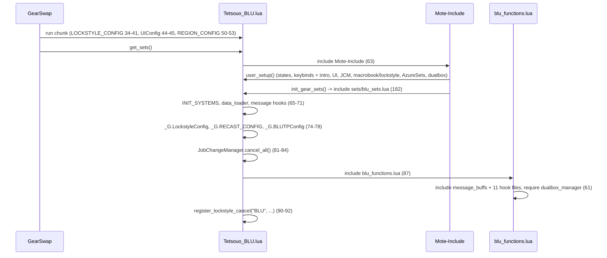
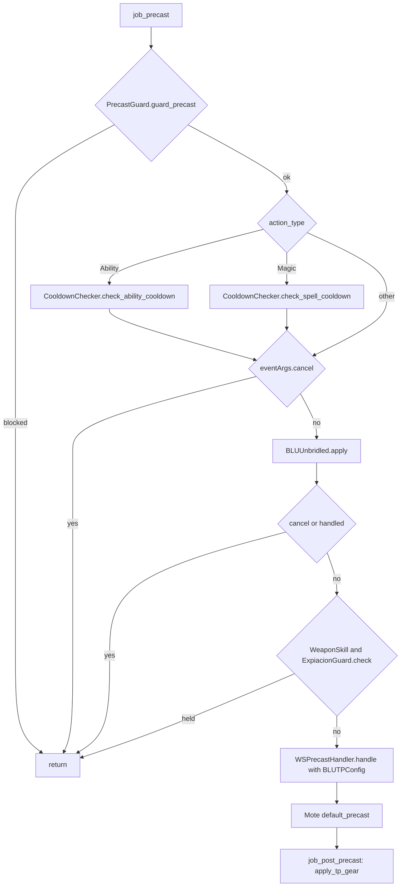

# BLU (Blue Mage) job

The BLU job was added on 2026-09-26 (`771da32`, keybind `weapon` field in
`de79122`, Gabvanstronger overlay in `f687ded`). It is a thin job built on the
shared systems: 11 hook modules plus 5 logic modules under
`shared/jobs/blu/functions/` (1 140 lines with the facade), a template entry
point, seven config files, one sets file, and an overlay for Gabvanstronger.
GearSwap loads it when the main job becomes BLU (`Tetsouo_BLU.lua`, renamed per
character by the clone script). From then on Mote-Include calls its hooks on
every action, on status and buff changes, on `//gs c` commands and on state
cycles.

What BLU adds on top of the shared pipeline:

- **Blue Magic by category**: each Blue Magic spell is given a gear category
  (`PhysicalDex`, `Magical`, `MagicAccuracy`, ... 24 categories) by the
  character's `config/blu/BLU_SPELL_MAP.lua` (else the broad category of the
  Blue Magic database), and `MidcastManager` picks
  `sets.midcast['Blue Magic'][category][CastingMode]` and its fallbacks. The
  same category is handed to Mote as the spell map, so Mote's own precast and
  midcast picks agree.
- **Blue Magic overlays**: `sets.buff[<buff>]` for Burst Affinity, Chain
  Affinity, Convergence, Diffusion and Efflux while the buff is up, and
  `sets.self_healing` for a Healing-category spell on oneself.
- **Single wield** (`.SW`) engaged sets, chosen from the off-hand item.
- Two **automatic abilities**, off by default: Unbridled Learning before an
  unbridled spell (`blu_unbridled`) and an Expiacion hold for the Tizona
  Aftermath: Lv.3 window (`blu_expiacion_window`).
- The **AzureSets** addon loaded while the character is BLU.

BLU has no `//gs c` command of its own, no tier refinement and no job-specific
message formatter.

Every file in scope was read in full except the gear content of the sets files
(only structure and set names were read, as gear choice is out of scope). Line
numbers are those of the working tree on 2026-09-26.

## Files

| Path | Lines | Role |
|------|------:|------|
| `_master/entry/Tetsouo_BLU.lua` | 203 | Entry (template): config preload, `get_sets`, `job_sub_job_change`, `user_setup` (+ AzureSets load), `job_update` (UI only), `init_gear_sets`, `file_unload` (+ AzureSets unload) |
| `shared/jobs/blu/functions/blu_functions.lua` | 66 | Facade: includes `message_buffs` and the 11 hook files, requires `dualbox_manager` (61) |
| `shared/jobs/blu/functions/BLU_PRECAST.lua` | 130 | `job_precast` (guard, cooldown, Unbridled Learning, Expiacion hold, WS handler) / `job_post_precast` (TP gear) |
| `shared/jobs/blu/functions/BLU_MIDCAST.lua` | 163 | `job_midcast` (empty) / `job_post_midcast` (Blue Magic by category + overlays, other skills) / `job_get_spell_map` |
| `shared/jobs/blu/functions/BLU_AFTERCAST.lua` | 21 | `job_aftercast = LifecycleManager.aftercast()` |
| `shared/jobs/blu/functions/BLU_IDLE.lua` | 30 | `customize_idle_set` -> `SetBuilder.build_idle_set` |
| `shared/jobs/blu/functions/BLU_ENGAGED.lua` | 30 | `customize_melee_set` -> `SetBuilder.build_engaged_set` |
| `shared/jobs/blu/functions/BLU_STATUS.lua` | 21 | `job_status_change = LifecycleManager.status_change()` |
| `shared/jobs/blu/functions/BLU_BUFFS.lua` | 22 | `job_buff_change = LifecycleManager.buff_change()` |
| `shared/jobs/blu/functions/BLU_COMMANDS.lua` | 115 | `job_self_command` router (shared commands only), `job_state_change = LifecycleManager.state_change()` |
| `shared/jobs/blu/functions/BLU_MOVEMENT.lua` | 16 | Header only (returns an empty table), kept for the 12-module layout |
| `shared/jobs/blu/functions/BLU_LOCKSTYLE.lua` | 45 | Lazy `LockstyleManager.create('BLU', 'config/blu/BLU_LOCKSTYLE', 1, 'WAR')` wrappers |
| `shared/jobs/blu/functions/BLU_MACROBOOK.lua` | 37 | Lazy `MacrobookManager.create('BLU', 'config/blu/BLU_MACROBOOK', 'WAR', 1, 1)` wrapper |
| `shared/jobs/blu/functions/logic/spell_map.lua` | 117 | `category(name)` from the character's `BLU_SPELL_MAP.lua`, else the database category; `is_unbridled(name)` from the Blue Magic database |
| `shared/jobs/blu/functions/logic/set_builder.lua` | 156 | Idle and engaged construction: `.SW` detection, `[OffenseMode]`, Mote defense/Kiting layers, weapons, town, movement |
| `shared/jobs/blu/functions/logic/unbridled.lua` | 41 | Option `blu_unbridled`: Unbridled Learning first, through `AbilityHelper.try_ability` |
| `shared/jobs/blu/functions/logic/expiacion_guard.lua` | 87 | Option `blu_expiacion_window`: first Expiacion press cancelled under 3000 TP (Tizona, no Aftermath: Lv.3), 3 s window |
| `shared/jobs/blu/functions/logic/azure_sets.lua` | 49 | `lua load` / `lua unload` of the AzureSets addon, state on `windower._blu_azuresets_loaded` |
| `shared/data/magic/BLU_SPELL_DATABASE.lua` (+ `blu/**/*.lua`, 19 files) | 325 + 3 344 | Blue Magic spell data (196 spells); BLU code reads `get_spell_data(name).unbridled` (18 spells carry `unbridled = true`) and `.category` for a spell the map does not list |
| `shared/data/job_abilities/BLU_JA_DATABASE.lua` + `blu/*.lua` | 13 + 146 | JA data for the messages (existed before the job) |
| `shared/utils/core/auto_options.lua` | 35 | `AutoOptions.on(name)`: reads `config/AUTO_ABILITIES.lua` once per load into `_G._auto_options` |
| `_master/config/blu/BLU_STATES.lua` | 66 | Mote mode options, `MainWeapon` / `SubWeapon`, `FastCast`, `AutoMedicine` |
| `_master/config/blu/BLU_KEYBINDS.lua` | 34 | Data only: 6 binds (+ 2 commented per-weapon examples), handed to `KeybindManager.create('BLU', ...)` |
| `_master/config/blu/BLU_CUSTOM.lua` | 119 | Player modes and gear rules, commented examples only ([keybinds and custom states](../systems/keybinds-and-custom.md)) |
| `_master/config/blu/BLU_SPELL_MAP.lua` | 143 | 24 categories -> spell names, all 196 database spells |
| `_master/config/blu/BLU_LOCKSTYLE.lua` | 23 | `default = 1`, empty `by_subjob` |
| `_master/config/blu/BLU_MACROBOOK.lua` | 26 | `default` book 1 page 1, empty `solo` and `dualbox` |
| `_master/config/blu/BLU_TP_CONFIG.lua` | 39 | `pieces` (Moonshade 250), empty `weapons`, `get_weapon_bonus`, sets `_G.BLUTPConfig` (37) |
| `_master/config_global/AUTO_ABILITIES.lua` | 25 | Template of `<Character>/config/AUTO_ABILITIES.lua`: both BLU options `false` (23-24) |
| `_master/sets/blu_sets.lua` | 168 | Template sets: every set the code reads, all empty |
| `_master/Gabvanstronger/config/blu/*` | 5 files | `BLU_STATES` (92), `BLU_KEYBINDS` (76), `BLU_CUSTOM` (121), `BLU_LOCKSTYLE` (18), `BLU_MACROBOOK` (19). No `BLU_SPELL_MAP` nor `BLU_TP_CONFIG` overlay: a clone gets the template ones |
| `_master/Gabvanstronger/config_global/AUTO_ABILITIES.lua` | 21 | Both BLU options `true` (19-20) |
| `_master/Gabvanstronger/sets/blu_sets.lua` | 553 | Gab's BLU sets, includes `sets/0_AugGear_Gabvanstronger.lua` (40) |
| `_master/config/alt/BLU_ALT_COMMANDS.lua` | 435 | Dual-box commands for a BLU partner (existed before the job; not read by the BLU job file) |

Other files touched by `771da32`: `shared/utils/ui/UI_FORMATTER.lua:32`
(HUD title "Blue Mage Settings"), `shared/utils/ui/ui_lifecycle.lua:62-63` (the
HUD waits for `state.MainWeapon`), `clone_character.py:256` and
`character_db.lua:93` (BLU in the job list), `character_db.lua:59`
(Gabvanstronger plays `RDM`, `THF`, `BLU`).

Live copies (gitignored): none in the working tree. `Tetsouo/` has no BLU file
and `character_db.lua:38` does not list BLU for Tetsouo; `Gabvanstronger/` is
frozen until its migration is delivered.

## How it works

### Load sequence

Same shape as every job (see [core lifecycle](../systems/core-lifecycle.md)):
Mote-Include calls `user_setup()` and `init_gear_sets()` from inside
`include('Mote-Include.lua')`, before `INIT_SYSTEMS` and before the BLU hook
files exist.



`user_setup()` (`Tetsouo_BLU.lua:121-161`):

1. `BLUStates.configure()` (122-123) creates the states (see
   [Mote states](#mote-states)).
2. `pcall(require, 'Tetsouo/config/blu/BLU_KEYBINDS')` into the global
   `BLUKeybinds`, then `bind_all()` (125-128). A failed `require` prints
   `[BLU] Keybinds failed to load: <error>` (134). `bind_all` ends with
   `show_intro()`, which `require`s `shared/jobs/blu/functions/BLU_MACROBOOK`
   and `BLU_LOCKSTYLE` (`keybind_manager.lua:271,274`). Neither returns a
   `get_blu_macro_info` / `get_info`, so the intro falls back to
   `show_system_intro`, but executing them defines `select_default_macro_book`
   and `select_default_lockstyle`.
3. `KeybindUI.smart_init("BLU", init_delay)` (138-142). The UI waits for
   `state.MainWeapon` (`ui_lifecycle.lua:62-63`).
4. `JobChangeManager.initialize()`; the gate at 147 passes thanks to step 2,
   so the macro book is set at once and the lockstyle is scheduled after
   `LockstyleConfig.initial_load_delay` (148-149).
5. `AzureSets.load()` (154-157), see [AzureSets](#azuresets).
6. `pcall(require, 'shared/utils/dualbox/dualbox_manager')` (160).

The facade (`blu_functions.lua`) includes `message_buffs.lua` (29),
`BLU_PRECAST`, `BLU_MIDCAST`, `BLU_AFTERCAST` (33-37), `BLU_IDLE`,
`BLU_ENGAGED` (41-43), `BLU_STATUS`, `BLU_BUFFS` (47-49), `BLU_LOCKSTYLE`,
`BLU_MACROBOOK`, `BLU_COMMANDS`, `BLU_MOVEMENT` (53-57), requires
`dualbox_manager` (61) and prints a debug line (63-64). Including
`BLU_LOCKSTYLE` / `BLU_MACROBOOK` again creates a second factory instance for
each, as on THF. `BLU_PRECAST` reads `_G.BLUTPConfig` on its first call
(`BLU_PRECAST.lua:50`), after the entry set it (`Tetsouo_BLU.lua:78`).

### Precast

`job_precast` (`BLU_PRECAST.lua:75-106`) and `job_post_precast` (113-118):



- Guard (79-81) and cooldown (84-87, `check_cooldown` 57-64) are the shared
  contract ([precast pipeline](../systems/precast-pipeline.md#the-job_precast-contract)).
  Nothing BLU does can drop a tier, so there is no exception before the
  cooldown check.
- Unbridled Learning (90-95), see [Automatic abilities](#automatic-abilities).
  It runs after the cooldown check: a spell still on recast is cancelled
  before Unbridled Learning is considered.
- Expiacion hold (98-100), weaponskills only.
- `WSPrecastHandler.handle` (103-105) is called for every action with
  `BLUTPConfig`.
- Mote's own precast picks the set: `sets.precast.FC` then the Blue Magic
  sub-table (Mote's `select_specific_set` tries the spell name, the spell map,
  then the skill, `Mote-Include.lua:929-951`), so `sets.precast.FC['Blue Magic']`
  for Blue Magic; `sets.precast.WS[name]` then `[WeaponskillMode]`
  (`Mote-Include.lua:798-828`); `sets.precast.JA[name]`, `sets.precast.Waltz`.
- `job_post_precast` only lays the TP bonus piece chosen by the WS handler
  (116).

### Midcast

Mote equips its default midcast set first (with BLU's spell map, so
`sets.midcast['Blue Magic'][category][CastingMode]` as far as Mote's walk
goes), then calls `job_post_midcast` (`BLU_MIDCAST.lua:126-139`): it loads
`MidcastManager` through `MidcastDeps` (127), notifies the watchdog (128-130),
returns for anything that is not magic with a skill (131-133), then routes:

| Skill | Handler | `MidcastManager.select_set` config | On top |
|-------|---------|------------------------------------|--------|
| Blue Magic | `midcast_blue_magic` (64-76) | `mode_state = state.CastingMode`, `database_func = BLUSpellMap.category` | `lay_blue_overlays` (48-61) |
| Enhancing Magic | `midcast_other_skill` (102-107) | `target_func = get_enhancing_target`, `database_func = get_spell_family` (86-89) | - |
| Enfeebling Magic | `midcast_other_skill` | `mode_state = state.CastingMode`, `database_func = get_enfeebling_type` (90-97, database required lazily) | - |
| any other skill | `midcast_other_skill` | skill + spell | - |

`select_set` returns without equipping when `sets.midcast[skill]` does not
exist (`midcast_manager.lua:636-639`); Mote's pick then stands. In the
template, `sets.midcast['Enfeebling Magic']` exists (`_master/sets/blu_sets.lua:138`),
`['Healing Magic']` and `['Enhancing Magic']` do not, so subjob cures and
enhancing spells keep Mote's pick (`sets.midcast['WhiteMagic']` by spell type,
`sets.midcast.Refresh`, `['Phalanx']` by name; 137-140).

#### How a Blue Magic spell finds its set

`MidcastManager`'s standard chain
([midcast and buffs](../systems/midcast-and-buffs.md#standard-chain-every-skill-except-singing)),
with `type` = the spell's category, `mode` = `CastingMode`, no target
(`midcast_manager.lua:559-607`):

| Step | Looks for | Example |
|------|-----------|---------|
| P0 | `sets.midcast[<spell name>]` | `sets.midcast['Sound Blast']`, `['Restoral']`, `['White Wind']` (template 132-134) |
| P1 | tier-less name at the root, then `sets.midcast['Blue Magic'][<name>]` | - |
| P3 | `sets.midcast['Blue Magic'][category][CastingMode]` | `.Magical.Resistant` (template 111) |
| P6 | `sets.midcast[category]` at the root | none: keep category names off the root (`BLU_MIDCAST.lua:14-15`) |
| P7 | `sets.midcast['Blue Magic'][category]` | `.PhysicalDex`, `.MagicAccuracy`, ... |
| P8 | `sets.midcast['Blue Magic'][CastingMode]` | none in either sets file |
| P9 | `sets.midcast['Blue Magic']` | spell listed in no category |

P2, P4 and P5 need a target and never apply (no `target_func`).

Then `lay_blue_overlays` (48-61) equips, in the order of `BLUE_MAGIC_BUFFS`
(38: Burst Affinity, Chain Affinity, Convergence, Diffusion, Efflux; a later
one wins a shared slot), `sets.buff[<buff>]` for each buff in `buffactive`
that has a set, then `sets.self_healing` when the category is `Healing` and
`spell.target.type == 'SELF'` (56). The buffs are read when the spell goes
off; `BLU_BUFFS.lua` does nothing for them (4-6). A trace line
`MIDCAST <spell> -> category ..., casting ..., on top: ...` goes to
`trace_log` (73-75; `//gs c trace on`).

`job_get_spell_map` (145-149) returns the category for Blue Magic (nil
otherwise, which leaves Mote's own map), so Mote's precast and midcast walks
use the same name.

#### The spell map

`logic/spell_map.lua` builds `spell name -> category` once per load, on the
first call (`category`), from `require('config/blu/BLU_SPELL_MAP')`
(54). GearSwap's `require` searches `data/<player name>/` before `data/`
(`GearSwap/refresh.lua:693-703`), so the character's own file is read.

- A spell the map does not list takes the database's broad category
  (`Physical`, `Magical`, `Buff`, `Breath`, `Healing`; `Debuff` becomes
  `MagicAccuracy`), and `sets.midcast['Blue Magic']` when that set is missing.
  The stat categories (`PhysicalStr`, `MagicalMnd`...) only come from the map:
  the database has no stat modifier.
- If the file does not load, a warning says Blue Magic uses its base set
  and every spell falls back to the database category.
- **Duplicates**: categories are sorted alphabetically (`sorted_categories`,
  30-39) and a spell keeps the first category it appears in; the others are
  listed in one warning `BLU_SPELL_MAP: listed twice, first kept: <name>
  (<kept>, not <dropped>)` (63-73, 43-49). The reason given in the code is that
  a Lua table has no order, so the winner would otherwise change between
  loads (9-11).
- Names are the game's (`BLU_SPELL_MAP.lua:9-10`): `'Winds of Promy.'`,
  `'Quad. Continuum'`, `'Evryone. Grudge'`, `'Tem. Upheaval'`,
  `'Nat. Meditation'`. A misspelt name is silently never matched.

The template map (`_master/config/blu/BLU_SPELL_MAP.lua`) has 24
categories, Mote-Include's Blue Mage categories as Gabvanstronger's file
listed them, with his spelling fixes and his duplicates resolved, plus the 13
spells added 2026-09-27 from BG-Wiki's stat modifiers (header of the file):

| Group | Categories |
|-------|-----------|
| Physical (10) | `Physical`, `PhysicalAcc`, `PhysicalStr`, `PhysicalDex`, `PhysicalVit`, `PhysicalAgi`, `PhysicalInt`, `PhysicalMnd`, `PhysicalChr`, `PhysicalHP` |
| Magical (6) | `Magical`, `MagicalEarth`, `MagicalMnd`, `MagicalChr`, `MagicalVit`, `MagicalDex` |
| Other (8) | `MagicAccuracy`, `TPRemoval`, `Enmity`, `Breath`, `Stun`, `Healing`, `SkillBasedBuff`, `Buff` |

Every spell of the database is in the map since 2026-09-27 (until then
Uproot, Crashing Thunder, Polar Roar, Tearing Gust, Cesspool, Sweeping Gouge,
Saurian Slide, Atra. Libations, Mighty Guard, O. Counterstance, Restoral,
White Wind and Sound Blast wore the base set unless given a named set). A set
with the spell's name (P0) still wins over its category.

### Idle and engaged

`logic/set_builder.lua` replaces Mote's base set for both:

- `build_engaged_set` (116-123): `select_engaged_base` (100-111) starts from
  `sets.engaged`, goes into `.SW` when single wielding and `sets.engaged.SW`
  exists, then into `[OffenseMode]` when that level has it (the walk Mote's
  `get_melee_set` makes for these sets, 4-6). Then Mote's defense and Kiting
  layers (`apply_defense`, `apply_kiting`, 60-64), laid again because the base
  was replaced, then the weapons. Trace line `ENGAGED offense ..., off hand ...
  -> <path>` (120-121).
- Single wield: `offhand_item` (72-83) is the item of the `SubWeapon` state's
  set, or the worn off hand while `CombatMode` is `On`, when `SubWeapon` has
  no set (`Free`), or when that set has no `sub` string. `is_single_wield`
  (88-91): nil, `''`, `'empty'`, or an item `WeaponResolver.is_offhand_weapon`
  reports as not a weapon (shield or grip, from the game's item list). A name
  the item list does not know returns nil there, which counts as dual wield.
- `build_idle_set` (146-154): `sets.idle[IdleMode]` if it exists, else Mote's
  set (135-141; `Normal` has no `sets.idle.Normal`, so Mote's `sets.idle`),
  then `BaseSetBuilder.select_idle_base_town` (`sets.idle.Town` / `sets.Adoulin`
  in a city), Mote layers, weapons, and `sets.MoveSpeed` outside a city
  (`BaseSetBuilder.apply_movement`, 129-130, 150-152).
- Weapons (`apply_weapon`, 52-55): `WeaponResolver.set_for('main' / 'sub',
  value)` then `pcall(set_combine)`; an error prints
  `BLU: failed to apply <slot> weapon` (45). `set_for` returns `sets[value]`,
  or `{[slot] = value}` for a plain weapon when `config/WEAPON_CONFIG.lua`
  has `equip_without_set = true` (`weapon_resolver.lua:63-75`). `Free` has
  neither, so the worn weapon stays (`BLU_STATES.lua:14-15`).

`job_aftercast`, `job_status_change`, `job_buff_change` and
`job_state_change` are the shared `LifecycleManager` handlers (watchdog, Doom,
HUD refresh), see [core lifecycle](../systems/core-lifecycle.md#lifecyclemanager).
A weapon cycle re-equips through Mote's `handle_update`, as on RDM.

### Automatic abilities

Both options are read by `AutoOptions.on(name)` (`auto_options.lua:25-33`):
`true` only if the character's `config/AUTO_ABILITIES.lua` sets it `true`,
read once per load. The template file has both `false`
(`_master/config_global/AUTO_ABILITIES.lua:23-24`), Gabvanstronger's both
`true` (`_master/Gabvanstronger/config_global/AUTO_ABILITIES.lua:19-20`);
`clone_character.py` copies `config_global/*.lua` to `<Character>/config/`
(`clone_character.py:750-763`). Blodykiller's file does not name them, so they
are off for him.

**`blu_unbridled`** (`logic/unbridled.lua:29-39`), called from precast step 3:

1. Only for `spell.type == 'BlueMagic'`, option on, and a spell whose database
   entry has `unbridled = true` (`spell_map.lua:87-95`).
2. Skipped when Unbridled Wisdom is up (`AbilityHelper.is_buff_active`, which
   also reads the game's buff list, `ability_helper.lua:93-104`).
3. `AbilityHelper.try_ability(spell, eventArgs, 'Unbridled Learning', 1.5)`
   (`ability_helper.lua:366-374`): if the replay marker, a JA-blocking debuff
   or `can_use_ability` says no (`may_try`, 335-339), or Unbridled Learning is
   not ready, or its buff is already up, nothing happens and the spell goes as
   is. Otherwise `fire_then_replay` (347-356) sets `eventArgs.handled`, cancels
   the spell, sends `input /ja "Unbridled Learning" <me>`, and `follow_up`
   sends `input /ma "<spell>" <target id>` once the buff is up. The replayed
   spell carries `windower._ability_replay`, so it is not tried twice.
4. Trace line `UNBRIDLED <spell> on <target> -> ...` (36-38).

**`blu_expiacion_window`** (`logic/expiacion_guard.lua:59-85`), precast step 4,
weaponskills only:

- Only for Expiacion with the option on (60). TP is read from the game
  (`shared/utils/core/live_tp.lua`; the header says GearSwap's copy can trail
  by up to 0.5 s).
- At 3000 TP or more, with Tizona in the main hand and no Aftermath: Lv.3, it
  goes with an info line `Expiacion at <tp> TP (no Aftermath: Lv.3)` (65-70).
- It is held only when `should_hold` (49-53): main hand `Tizona`, no
  `Aftermath: Lv.3`, and 1000 <= TP < 3000. Under 1000 TP the WS handler
  refuses it with its own message (10-11).
- First press: `eventArgs.cancel = true`, window open for 3 s
  (`WINDOW_SECONDS`, 23; `os.clock`), warning
  `Expiacion cancelled (<tp> TP, no Aftermath: Lv.3): press again within 3 s
  to use it anyway` (79-84). A press while the window is open goes, with the
  info line (73-77). The window is a module local: a reload closes it.

### AzureSets

`logic/azure_sets.lua` keeps the AzureSets addon (Blue Magic spell lists,
`//aset`) loaded while the character is BLU:

- `load()` (26-37), from `user_setup`: does nothing if
  `windower._blu_azuresets_loaded` is set; otherwise sets it, sends
  `lua load AzureSets`, and 3 s later shows
  `AzureSets: //aset setlist | //aset spellset <name>`.
- `unload()` (39-47), first thing in `file_unload` (`Tetsouo_BLU.lua:190-193`):
  2 s later reads `windower.ffxi.get_player().main_job`; still BLU (subjob
  change, `gs reload`) -> nothing; otherwise clears the flag and sends
  `lua unload AzureSets`. The delay is there so the game reports the new main
  job (21-23).
- The flag lives on `windower`, which outlives the job sandbox (7-11). An
  AzureSets loaded by hand before BLU is loaded again by `lua load`; one loaded
  by hand is unloaded when leaving BLU only if this module set the flag.

## Mote states

Created by `BLUStates.configure()` (`_master/config/blu/BLU_STATES.lua:30-64`)
on every `user_setup()` (every load and every subjob change, so values reset).
Keybinds from `BLU_KEYBINDS.lua:18-32`; `^` = Ctrl, `!` = Alt, `#` = Apps.
Mote's `:options` makes the first value the default.

| State | Values (template) | Default | Key | Read by |
|-------|--------|---------|-----|---------|
| `OffenseMode` (Mote) | Normal, Acc, DT, Subtle Blow, Refresh | Normal | `^numpad3` | `set_builder.lua:106-109`; Mote's WS mode fallback |
| `IdleMode` (Mote) | Normal, Evasion, DT, Regain | Normal | `^numpad4` | `set_builder.lua:136-138` |
| `CastingMode` (Mote) | Normal, Resistant | Normal | `^numpad5` | `BLU_MIDCAST.lua:69,95`; Mote default precast/midcast |
| `WeaponskillMode` (Mote) | Normal, Acc | Normal | `^numpad6` | Mote `get_weaponskill_set` |
| `MainWeapon` | Free | Free | `^numpad1` | `set_builder.lua:53` |
| `SubWeapon` | Free | Free | `^numpad2` | `set_builder.lua:54,74` |
| `FastCast` | 0..80 step 10 | 0 | none | `midcast_watchdog.lua` |
| `AutoMedicine` | shared | persisted | `#numpad0` (from `COMMON_KEYBINDS.lua`) | `AutoMedicine.init` (60-63) |
| `CombatMode` | Off, On | Off | none unless shown: `!numpad0` once `//gs c combatmode show` shows it (`combat_mode.lua:13-16,35`) | shared Combat Mode hook, `set_builder.lua:75` |

WeaponskillMode `Normal` takes the OffenseMode value when WeaponskillMode also
has it (`Mote-Include.lua:802-813`): OffenseMode `Acc` gives WS `Acc`
(`BLU_STATES.lua:7-9`).

The template gives no weapon values beyond `Free` (42-45): the player adds
theirs, each value being `sets[value]` or, with `equip_without_set`, a plain
weapon.

### Keys

The template binds only the six state rows above (`BLU_KEYBINDS.lua:20-27`),
plus two commented examples of per-weapon weaponskill keys (29-31):

```lua
-- { key = "numpad3", command = '/ws "Savage Blade" <t>', desc = "Savage Blade", weapon = "Sword" },
-- { key = "numpad3", command = '/ws "Black Halo" <t>',   desc = "Black Halo",   weapon = "Club" },
```

The `weapon` field (`keybind_manager.lua:23-30`, added in `de79122`) binds an
entry only while this character's main hand is of that weapon skill
(`applies`, 91-96, through `alt_states.lua` `own_weapon_matches`); an empty
main hand is `'None'`. When any entry uses it, `watch_own_weapon` (315-325)
registers `AltStates.on_weapon_change('keybinds', ...)`, which calls
`refresh_active()` when the main hand changes weapon type, so one key can
carry a different weaponskill per weapon. A command starting with `/` is sent
as `input <command>` (`bind_line`, 115-127).

## Commands

`job_self_command` (`BLU_COMMANDS.lua:38-94`) lowercases the first word and
tests, in order:

| Command | Effect | Lines |
|---------|--------|-------|
| `altjobupdate` / `requestjob` | Dual-box job exchange | 43-56 |
| `watchdog ...` | MidcastWatchdog commands | 58-63 |
| common commands | `CommonCommands.handle_command(command, 'BLU', table.unpack(args))` | 65-74 |
| `ui ...` | UI toggles | 76-80 |
| `debugmidcast` | Toggle `MidcastManager` debug | 82-87 |
| `cyclestate <State>` | `CycleHandler.handle_cyclestate` (every template key) | 90-93 |

Anything else is left unhandled, so Mote runs its own commands (`cycle`,
`set`, `update`, ...) and, last, the dual-box partner's alt commands
([commands](../systems/commands-and-debug.md#4-alt-commands-and-name-shadowing)).
BLU has no command of its own (header, 4-5).

## Set names the code looks up

T = `_master/sets/blu_sets.lua`, G = `_master/Gabvanstronger/sets/blu_sets.lua`.

| Set | Looked up by | T | G |
|-----|--------------|---|---|
| `sets[MainWeapon]`, `sets[SubWeapon]` | `WeaponResolver.set_for` | examples only (41-45) | none (plain weapons, `equip_without_set`) |
| `sets.MoveSpeed`, `sets.Kiting` | `BaseSetBuilder.apply_movement`, Mote Kiting | 50, 51 | 59, 460 |
| `sets.buff['Burst Affinity']`, `['Chain Affinity']`, `.Convergence`, `.Diffusion`, `.Efflux` | `lay_blue_overlays` | 57-61 | 50-55 |
| `sets.buff.Doom` | DoomManager | 62 | 57 |
| `sets.precast.JA['Azure Lore']`, `sets.precast.Waltz` (+ `['Healing Waltz']`) | Mote default precast | 69, 71-72 | 65, 67-69 |
| `sets.precast.FC`, `.FC['Blue Magic']` | Mote default precast | 74-75 | 71, 87 |
| `sets.precast.WS`, `.WS.Acc`, `WS['Expiacion' / 'Savage Blade' / 'Chant du Cygne' / 'Requiescat' / 'Sanguine Blade']` | Mote default precast | 80-87 | 105-168 |
| `sets.midcast.FastRecast` | Mote default midcast | 93 | 186 |
| `sets.midcast['Blue Magic']` + the 24 categories | MidcastManager P7/P9 | 95-129 | 201-356 |
| `sets.midcast['Blue Magic'].Magical.Resistant` | MidcastManager P3 (CastingMode Resistant) | 111 | 248 |
| `sets.self_healing` | `lay_blue_overlays` | 127 | 332 |
| `sets.midcast['Sound Blast']`, `['Restoral']`, `['White Wind']` | MidcastManager P0 | 132-134 | 290, 313, 315 |
| `sets.midcast['WhiteMagic']`, `['Phalanx']`, `.Refresh` | Mote (spell type / name) | 137, 139, 140 | 369, 377, 385 |
| `sets.midcast['Enfeebling Magic']` | MidcastManager (base set) | 138 | 376 |
| `sets.Learning` | nothing (worn by hand, `//gs equip sets.Learning`, T 142) | 143 | 397 |
| `sets.resting` | Mote | 148 | 413 |
| `sets.idle`, `.Evasion`, `.DT`, `.Regain` | `select_idle_base` / Mote | 150-153 | 415-451 |
| `sets.idle.Town`, `sets.Adoulin` | `BaseSetBuilder` | absent | absent (G 457 commented) |
| `sets.engaged`, `.Acc`, `.DT`, `['Subtle Blow']`, `.Refresh` | `select_engaged_base` | 158-162 | 476-544 |
| `sets.engaged.SW`, `.SW.Acc`, `.SW.Refresh` | `select_engaged_base` (single wield) | 166-168 | 550-552 |

G also has `sets['Pull']` (45) and `sets.CP` (47), used by its
`BLU_CUSTOM.lua` modes, and sets nothing reaches, each marked so in the file:
`sets.buff.Enchainment` (54), `sets.precast.WS['Expiacion'].LowBuffs` (129),
`sets.latent_refresh` (402), `sets.idle.Learning` (458), `sets.engaged.Eva`
(495), `sets.engaged.Learning` (545), `sets.engaged.SW.Learning` (553).

## Configuration

| File / key | Default | Where the default lives | Read by |
|------------|---------|-------------------------|---------|
| `<char>/config/blu/BLU_STATES.lua` | see states | file | entry `user_setup` (path `Tetsouo/...`, replaced by the clone script) |
| `<char>/config/blu/BLU_KEYBINDS.lua` | 6 binds (+ the character's `COMMON_KEYBINDS.lua`, Combat Mode row, custom keys) | file | entry `user_setup`, `file_unload` |
| `<char>/config/blu/BLU_CUSTOM.lua` | examples only | file | `KeybindManager` via `custom_states` |
| `<char>/config/blu/BLU_SPELL_MAP.lua` | 24 categories | file; no map = base set only | `spell_map.lua` |
| `<char>/config/blu/BLU_LOCKSTYLE.lua` `default`, `by_subjob` | 1 | file; factory argument 1 | `LockstyleManager` reads `default` and `get_style` only (`lockstyle_manager.lua:184-186`), so `by_subjob` is never read |
| `<char>/config/blu/BLU_MACROBOOK.lua` | book 1 page 1 | file; factory fallback 1/1 | `MacrobookManager` (`solo[sub]`, `dualbox[alt job][sub]`) |
| `<char>/config/blu/BLU_TP_CONFIG.lua` -> `_G.BLUTPConfig` | Moonshade ear1 +250, no weapon | file | `WSPrecastHandler` / `TPBonusCalculator` |
| `<char>/config/AUTO_ABILITIES.lua` `blu_unbridled`, `blu_expiacion_window` | `false` | `auto_options.lua:32` (`== true`) | `unbridled.lua:31`, `expiacion_guard.lua:60` |
| `<char>/config/WEAPON_CONFIG.lua` `equip_without_set` | `false` (template, 21) | file | `WeaponResolver` |
| Hard-coded | Unbridled delay 1.5 s (`unbridled.lua:24`); Expiacion window 3 s, thresholds 1000/3000 TP, weapon `Tizona` (`expiacion_guard.lua:23-25,50`); AzureSets delays 2 s / 3 s (`azure_sets.lua:22-23`); overlay buffs (`BLU_MIDCAST.lua:38`) | code | - |

## Gabvanstronger overlay

`_master/Gabvanstronger/` holds his BLU converted from his own `BLU.lua` and
BindManager files (`f687ded`). The entry is the template, renamed by
the clone script.

- **States** (`BLU_STATES.lua:39-55`): OffenseMode adds `Capped` (Normal,
  Capped, DT, Subtle Blow, Acc, Refresh; `Capped` has no set, it wears
  `sets.engaged`), WeaponskillMode Normal, Capped, Acc; CastingMode and
  IdleMode as the template. `MainWeapon`: Tizona, Naegling, Maxentius,
  Sequence, Extinction, Free (default Tizona). `SubWeapon`: Sakpata's Sword,
  Zantetsuken, Thibron, Tanmogayi +1, Nihility, Free. His `WeaponLock` is
  Combat Mode on `~f9` (`config_global/combat_mode.lua:4-6`, shown on every
  job), and his Aftermath state is the `blu_expiacion_window` option (19-20).
- **Custom modes** (`BLU_CUSTOM.lua:91-114`): `RangedSet` (Normal / Pull,
  key `` @` ``, Pull = `sets.Pull` with range and ammo locked) and `CP` (on/off,
  no key, `sets.CP` with the back locked). The Fucho-no-Obi rule is left
  commented (116-119).
- **Keys** (`BLU_KEYBINDS.lua:30-74`): `` ^` `` / `` ^~` `` MainWeapon / SubWeapon;
  `f9` OffenseMode, `@f9` WeaponskillMode, `^f11` CastingMode, `^f12`
  IdleMode; 18 BindManager keys sent raw (`` !` `` Temporal Shift, `!1`-`!6` self
  buffs, `@q` `@w` `@a` `@f` `@x` `@v` spells, `@1`-`@5` Chain Affinity, Burst
  Affinity, Efflux, Diffusion, Unbridled Learning); and the per-weapon
  weaponskill keys: with a sword, `numpad1` Requiescat, `numpad3` Expiacion,
  `numpad7` Chant du Cygne, `numpad9` Savage Blade (65-68); with a club,
  `numpad1` True Strike, `numpad3` Black Halo, `numpad9` Judgment (71-73).
  His subjob keys live in his `COMMON_KEYBINDS.lua` (17-20).
- **Lockstyle** 2, **macro book** 8 page 1 (`BLU_LOCKSTYLE.lua:15`,
  `BLU_MACROBOOK.lua:15`).
- **Weapons** are plain items: his `WEAPON_CONFIG.lua:13` sets
  `equip_without_set = true`.
- **Sets**: his layout and comments, his gear tables from
  `0_AugGear_Gabvanstronger.lua`; changes from his file are listed in the
  header (27-32).

## State & lifetime

- Sandbox `_G` (dies on every `gs reload`, including every subjob change):
  the Mote hooks (`job_precast`, `job_post_precast`, `job_midcast`,
  `job_post_midcast`, `job_get_spell_map`, `job_aftercast`,
  `job_status_change`, `job_buff_change`, `customize_idle_set`,
  `customize_melee_set`, `job_self_command`, `job_state_change`, `job_update`),
  `BLUKeybinds`, `BLUTPConfig`, `LockstyleConfig`, `RECAST_CONFIG`,
  `RegionConfig`, `_auto_options`, `select_default_lockstyle`,
  `cancel_blu_lockstyle_operations`, `select_default_macro_book`,
  `temp_tp_bonus_gear`.
- Module locals, lost on reload: the spell map (`by_spell`), the Expiacion
  window (`window_until`).
- `windower.*`: `_blu_azuresets_loaded` (AzureSets), `_ability_replay`
  (Unbridled replay marker, shared helper).
- Coroutines: the lockstyle in `user_setup`; the AzureSets hint (3 s) and the
  unload check (2 s); the Unbridled `follow_up` poll.
- Keybinds: bound in `user_setup`, unbound in `file_unload` (200-202).
- Subjob change: Mote calls `user_setup()` again, then `job_sub_job_change`
  (105-111) hands over to `JobChangeManager.on_job_change`
  ([job change lifecycle](../architecture/job-change-lifecycle.md)).

## Invariants & gotchas

- A set at the root of `sets.midcast` named after a category
  (`sets.midcast.Magical`) wins over `sets.midcast['Blue Magic'].Magical`
  (P6 before P7, `BLU_MIDCAST.lua:14-15`).
- `set_combine` does not copy sub-sets: `MagicalMnd = set_combine(Magical, {})`
  has no `.Resistant`, so CastingMode `Resistant` changes only the `Magical`
  category (template 110-116, G 230-254). Likewise `WS['Expiacion']` built
  from `sets.precast.WS` has no `.Acc`: WeaponskillMode `Acc` only changes a
  weaponskill without its own set (template 80-87, G 105-168).
- An OffenseMode with no `.SW` version wears `sets.engaged.SW` itself when
  single wielding (template 164-165, G 547-549): DT, Subtle Blow (and G's
  Capped) with a shield or nothing in the off hand do not wear their DT / SB
  set.
- `sets.engaged.SW.Refresh` is `set_combine(sets.engaged, {})`, not built from
  `sets.engaged.Refresh` (template 168, G 552), unlike `SW.Acc`.
- The spell map is read once per load: an edit needs `//gs reload`.
- The Blue Magic overlays read `buffactive` at midcast; a buff gained in the
  same instant may not be there yet.
- Unbridled Learning is tried after the cooldown check; a spell on recast is
  cancelled without it.

## Tested

Validated in game on Tetsouo on 2026-09-26 (reported by the player):

- the keys;
- Blue Magic categories `Healing`, `Buff`, the `Physical*` categories,
  `Magical.Resistant`, `MagicAccuracy`, and `Sound Blast` (own set);
- `sets.self_healing` on a Healing spell on oneself;
- the Chain Affinity overlay;
- the engaged DT set.

Not tested in game: the per-weapon numpad keys (`weapon` field), the automatic
Unbridled Learning (`blu_unbridled`), the Expiacion window
(`blu_expiacion_window`); Gabvanstronger will test them. The AzureSets load and
unload is not in the tested list either. The test setup is not in the working
tree: `Tetsouo/` has no BLU files and `character_db.lua:38` does not list BLU
for Tetsouo.

## Interactions

- Precast: `PrecastGuard`, `CooldownChecker`, `AbilityHelper` (shared with
  [PLD](pld.md), [RDM](rdm.md), [GEO](geo.md), ...), `WSPrecastHandler`,
  `TPBonusHandler` ([precast pipeline](../systems/precast-pipeline.md)).
- Midcast: `MidcastManager`, `MidcastDeps`, `MidcastWatchdog`, the enhancing
  and enfeebling databases ([midcast and buffs](../systems/midcast-and-buffs.md)),
  `BLU_SPELL_DATABASE` ([spell databases](../data/spell-databases.md)).
- `KeybindManager` (`weapon` field, `AltStates.on_weapon_change`), Combat Mode,
  custom states ([keybinds and custom states](../systems/keybinds-and-custom.md)).
- `BaseSetBuilder`, `WeaponResolver`, `LifecycleManager`, `DoomManager`,
  lockstyle/macrobook factories ([factories and helpers](../systems/factories-and-helpers.md)),
  `CommonCommands`, `CycleHandler` ([commands and debug](../systems/commands-and-debug.md)),
  `trace_log`, dual-box ([dualbox](../systems/dualbox.md)).

## Extending

- New Blue Magic spell or category: add the name to a category in the
  character's `BLU_SPELL_MAP.lua` and, for a new category,
  `sets.midcast['Blue Magic'].<Category>` in the sets. A spell that needs its
  own set: `sets.midcast['<Spell>']` (P0), no code change.
- New overlay buff: add it to `BLUE_MAGIC_BUFFS` (`BLU_MIDCAST.lua:38`) and a
  `sets.buff[...]` set.
- Per-weapon key: an entry with `weapon = '<Skill>'` in `BLU_KEYBINDS.lua`.
- New weapon: a value in `MainWeapon` / `SubWeapon` (`BLU_STATES.lua:44-45`)
  and `sets['<value>']`, or a plain item with `equip_without_set`.
- New command: add a branch before the `cyclestate` test; a name the router
  does not answer goes to Mote, then to the alt.

## Known issues

- `BLU_LOCKSTYLE.lua` describes "optional per-subjob overrides" (4, 18-21),
  but `by_subjob` is never read (no `get_style`), as on the other jobs.
- Two factory instances each for lockstyle and macrobook (intro `require` +
  facade `include`), as on THF.
- Gab's `@f` key sends `input /echo <recast="Fantod"> "Boost"; input /ma
  "Fantod" <me>` (`_master/Gabvanstronger/config/blu/BLU_KEYBINDS.lua:54`),
  copied as he wrote it; what the `/echo` part prints was not checked.
