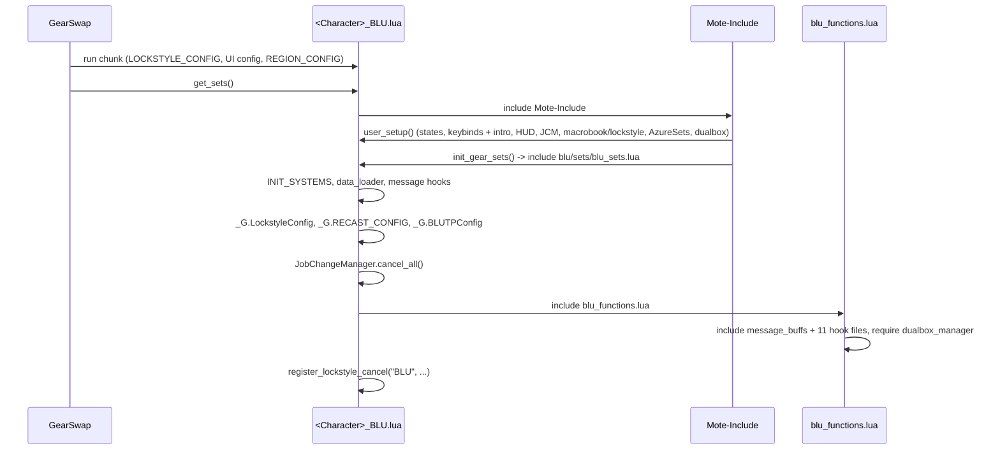
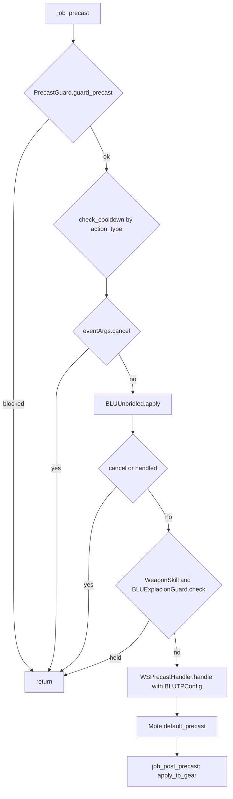

# BLU (Blue Mage) job

The BLU job was added on 2026-09-26. It is a thin job built on the shared
systems: 11 hook modules plus 5 logic modules under `shared/jobs/blu/functions/`
(about 1 140 lines with the facade), a template entry point, eight config files,
one sets file, and one character overlay. GearSwap loads it when the main job
becomes BLU (the entry file `<Character>_BLU.lua`, one `include` of `shared/entry/blu.lua`, copied from
`_master/entry/Tetsouo_BLU.lua` by the clone script). From then on Mote-Include
calls its hooks on every action, on status and buff changes, on `//gs c`
commands and on state cycles.

Player-facing pages: [hub](../../user/jobs/blu/README.md),
[modes](../../user/jobs/blu/states.md), [sets](../../user/jobs/blu/sets.md).

What BLU adds on top of the shared pipeline:

- **Blue Magic by category**: each Blue Magic spell is given a gear category
  (`PhysicalDex`, `Magical`, `MagicAccuracy`, ... 24 categories) by the
  character's `blu/combat/BLU_SPELL_MAP.lua` (else the broad category of the
  Blue Magic database), and `MidcastManager` picks
  `sets.midcast['Blue Magic'][category][CastingMode]` and its fallbacks. The
  same category is handed to Mote as the spell map, so Mote's own precast and
  midcast picks agree.
- **Blue Magic overlays**: `sets.buff[<buff>]` for Burst Affinity, Chain
  Affinity, Convergence, Diffusion and Efflux while the buff is up, and
  `sets.self_healing` for a Healing-category spell on oneself.
- **Single wield** (`.SW`) engaged sets, chosen from the off-hand item.
- Two **automatic abilities**, off by default: Unbridled Learning before an
  unbridled spell (option `blu_unbridled`, key `auto_unbridled`) and an Expiacion
  hold for the Tizona Aftermath: Lv.3 window (option `blu_expiacion_window`, key
  `expiacion_window`), both keys of `blu/combat/BLU_CONFIG.lua`.
- The **AzureSets** addon loaded while the character is BLU.

BLU has no `//gs c` command of its own, no tier refinement and no job-specific
message formatter.

Every file in scope was read in full on 2026-09-28, except the gear content of
the sets files (structure and set names only).

## Files

| Path | Lines | Role |
|------|------:|------|
| `shared/entry/blu.lua` | 205 | Entry (the same for every character; `<Char>_BLU.lua` and its template `_master/entry/Tetsouo_BLU.lua` are one `include` of it): config preload, `get_sets`, `job_sub_job_change`, `user_setup` (+ AzureSets load), `job_update` (HUD only), `init_gear_sets`, `file_unload` (+ AzureSets unload) |
| `shared/jobs/blu/functions/blu_functions.lua` | 66 | Facade: includes `message_buffs` and the 11 hook files, requires `dualbox_manager`, debug line |
| `shared/jobs/blu/functions/BLU_PRECAST.lua` | 130 | `job_precast` (guard, cooldown, Unbridled Learning, Expiacion hold, WS handler) / `job_post_precast` (TP gear) |
| `shared/jobs/blu/functions/BLU_MIDCAST.lua` | 163 | `job_midcast` (empty) / `job_post_midcast` (Blue Magic by category + overlays, other skills) / `job_get_spell_map` |
| `shared/jobs/blu/functions/BLU_AFTERCAST.lua` | 21 | `job_aftercast = LifecycleManager.aftercast()` |
| `shared/jobs/blu/functions/BLU_IDLE.lua` | 30 | `customize_idle_set` -> `SetBuilder.build_idle_set` |
| `shared/jobs/blu/functions/BLU_ENGAGED.lua` | 30 | `customize_melee_set` -> `SetBuilder.build_engaged_set` |
| `shared/jobs/blu/functions/BLU_STATUS.lua` | 21 | `job_status_change = LifecycleManager.status_change()` |
| `shared/jobs/blu/functions/BLU_BUFFS.lua` | 22 | `job_buff_change = LifecycleManager.buff_change()` |
| `shared/jobs/blu/functions/BLU_COMMANDS.lua` | 115 | `job_self_command` router (shared commands only), `job_state_change = LifecycleManager.state_change()` |
| `shared/jobs/blu/functions/BLU_MOVEMENT.lua` | 16 | Header only (`return {}`), kept for the 12-module layout; no `job_handle_equipping_gear` |
| `shared/jobs/blu/functions/BLU_LOCKSTYLE.lua` | 45 | Lazy `LockstyleManager.create('BLU', 'blu/display/BLU_LOCKSTYLE', 1, 'WAR')` wrappers |
| `shared/jobs/blu/functions/BLU_MACROBOOK.lua` | 37 | Lazy `MacrobookManager.create('BLU', 'blu/display/BLU_MACROBOOK', 'WAR', 1, 1)` wrapper |
| `shared/jobs/blu/functions/logic/spell_map.lua` | 119 | `BLUSpellMap.category(name)` from the character's map, else the database category; `is_unbridled(name)` |
| `shared/jobs/blu/functions/logic/set_builder.lua` | 148 | Idle and engaged: `.SW` detection, `[OffenseMode]`, Mote defense / Kiting layers, weapons, town, movement |
| `shared/jobs/blu/functions/logic/unbridled.lua` | 41 | Option `blu_unbridled` (`auto_unbridled` in `BLU_CONFIG.lua`): `BLUUnbridled.apply` -> `AbilityHelper.try_ability` |
| `shared/jobs/blu/functions/logic/expiacion_guard.lua` | 80 | Option `blu_expiacion_window` (`expiacion_window` in `BLU_CONFIG.lua`): `BLUExpiacionGuard.check` |
| `shared/jobs/blu/functions/logic/azure_sets.lua` | 51 | `BLUAzureSets.load` / `unload` of the AzureSets addon, flag on `windower._blu_azuresets_loaded` |
| `shared/data/magic/BLU_SPELL_DATABASE.lua` (+ `blu/**/*.lua`) | - | Blue Magic spell data; BLU reads `get_spell_data(name).category` (unlisted spells) and `.unbridled` |
| `shared/utils/core/auto_options.lua` | 72 | `AutoOptions.on(name)`: the option's key in `blu/combat/BLU_CONFIG.lua`, through `JobConfig.get('BLU', key)` at each call (`== true`) |
| `_master/config/blu/BLU_STATES.lua` | 66 | Mote mode options, `MainWeapon` / `SubWeapon`, `FastCast`, `AutoMedicine` |
| `_master/config/blu/BLU_KEYBINDS.lua` | 34 | Data only: 6 entries (+ 2 commented per-weapon examples) handed to `KeybindManager.create('BLU', ...)` |
| `_master/config/blu/BLU_CUSTOM.lua` | 119 | Player modes and gear rules, commented examples only |
| `_master/config/blu/BLU_SPELL_MAP.lua` | 154 | 24 categories -> spell names, every database spell |
| `_master/config/blu/BLU_HUD.lua` | 31 | HUD section / row order (empty = default) |
| `_master/config/blu/BLU_LOCKSTYLE.lua` | 23 | `default = 1`, empty `by_subjob` |
| `_master/config/blu/BLU_MACROBOOK.lua` | 26 | `default` book 1 page 1, empty `solo` and `dualbox` |
| `_master/config/blu/BLU_TP_CONFIG.lua` | 39 | `pieces` (Moonshade 250), empty `weapons`, `get_weapon_bonus`, sets `_G.BLUTPConfig` |
| `_master/config/blu/BLU_REFILL.lua` | 42 | Refill list, every line commented (`extra`, `default`, `subjobs` examples): `//gs c rf` uses the common list of `REFILL_CONFIG.lua` until one is uncommented |
| `_master/config/blu/BLU_CONFIG.lua` | 21 | Template of `<Character>/blu/combat/BLU_CONFIG.lua`: `auto_unbridled = false`, `expiacion_window = false` |
| `_master/config_global/WEAPON_CONFIG.lua` | - | `equip_without_set = false` |
| `_master/sets/blu_sets.lua` | 182 | Template sets: every set the code reads, all empty |
| `_master/Gabvanstronger/config/blu/*`, `.../config_global/AUTO_ABILITIES.lua`, `.../sets/blu_sets.lua` | 5 + 1 files, 553 | Character overlay (see [Overlay](#character-overlay)); its `AUTO_ABILITIES.lua` is the file of before 2026-10-10, folded into the job files when the overlay is cloned |
| `shared/data/alt/BLU_ALT_COMMANDS.lua` | - | Dual-box commands for a BLU partner (read by the main's alt system, not by the BLU job file) |

No live copy is tracked (live folders are gitignored).

## How it works

### Load sequence

Same shape as every job ([core lifecycle](../systems/core-lifecycle.md#how-a-job-file-boots)):
Mote-Include calls `user_setup()` and `init_gear_sets()` from inside
`include('Mote-Include.lua')`, before `INIT_SYSTEMS` and before the BLU hook
files exist.



`user_setup()`:

1. `BLUStates.configure()` creates the states (see [Mote states](#mote-states)).
2. `pcall(require, '<Character>/blu/keys/BLU_KEYBINDS')` into the global
   `BLUKeybinds`, then `bind_all()`; a failed require prints
   `[BLU] Keybinds failed to load: <error>`. `bind_all` ends with
   `show_intro()`, which requires `BLU_MACROBOOK` and `BLU_LOCKSTYLE`; neither
   returns the info the intro looks for, but running them defines
   `select_default_macro_book` and `select_default_lockstyle`.
3. `KeybindUI.smart_init("BLU", init_delay)`; the HUD waits for
   `state.MainWeapon` (`ui_lifecycle.lua`).
4. `JobChangeManager.initialize()`; macro book at once, lockstyle after
   `LockstyleConfig.initial_load_delay`.
5. `BLUAzureSets.load()` (see [AzureSets](#azuresets)).
6. `pcall(require, 'shared/utils/dualbox/dualbox_manager')`.

`BLU_PRECAST` reads `_G.BLUTPConfig` on its first action
(`ensure_modules_loaded`), after the entry set it. Including `BLU_LOCKSTYLE` /
`BLU_MACROBOOK` from the facade after the intro's `require` creates a second
factory instance of each, as on the other jobs.

### Precast

`job_precast` (`BLU_PRECAST.lua`) and `job_post_precast`:



- Guard and cooldown are the shared contract
  ([precast pipeline](../systems/precast-pipeline.md)). Nothing BLU does can
  drop a tier, so there is no exception before the cooldown check.
- Unbridled Learning runs after the cooldown check: a spell on recast is
  cancelled before Unbridled Learning is considered.
- Mote's own precast picks the set: `sets.precast.FC` then its sub-table by
  spell name, spell map (the category), skill (`FC['Blue Magic']`);
  `sets.precast.WS[name]` then `[WeaponskillMode]`; `sets.precast.JA[name]`;
  `sets.precast.Waltz`.
- `job_post_precast` only lays the TP bonus piece chosen by the WS handler.

### Midcast

Mote-Globals' `user_midcast` equips `sets.midcast.FastRecast` first for every
magic spell. Mote's default midcast then runs with BLU's spell map (so
`sets.midcast['Blue Magic']...` as far as Mote's walk goes, with
`CastingMode`), then `job_post_midcast`: `MidcastDeps.load()`, watchdog notify,
return for anything that is not magic with a skill, then:

| Skill | Handler | `MidcastManager.select_set` config | On top |
|-------|---------|------------------------------------|--------|
| Blue Magic | `midcast_blue_magic` | `mode_state = state.CastingMode`, `database_func = BLUSpellMap.category` | `lay_blue_overlays` |
| Enhancing Magic | `midcast_other_skill` (`skill_options`) | `target_func = get_enhancing_target`, `database_func = get_spell_family` | - |
| Enfeebling Magic | `midcast_other_skill` | `mode_state = state.CastingMode`, `database_func = get_enfeebling_type` (database required lazily) | - |
| any other skill | `midcast_other_skill` | skill + spell | - |

Every magic spell goes through `select_set`, so `MidcastFallback` never acts on
BLU. `select_set` returns without equipping when `sets.midcast[skill]` does
not exist; Mote's pick then stands. In the template,
`sets.midcast['Enfeebling Magic']` exists; `['Healing Magic']` and
`['Enhancing Magic']` do not, so subjob cures and enhancing spells keep Mote's
pick (`sets.midcast['WhiteMagic']` by spell type, `sets.midcast.Refresh`,
`['Phalanx']` by name).

#### How a Blue Magic spell finds its set

The [standard chain](../systems/midcast-and-buffs.md) with `type` = the
category, `mode` = `CastingMode`, no target:

| Step | Looks for | Example |
|------|-----------|---------|
| P0 | `sets.midcast[<spell name>]` | `sets.midcast['Sound Blast']`, `['Restoral']`, `['White Wind']` (template) |
| P1 | tier-less name at the root, then `sets.midcast['Blue Magic'][<name>]` | - |
| P3 | `sets.midcast['Blue Magic'][category][CastingMode]` | `.Magical.Resistant` (template); a `.Normal` level would be picked in Normal |
| P6 | `sets.midcast[category]` at the root | none: keep category names off the root |
| P7 | `sets.midcast['Blue Magic'][category]` | `.PhysicalDex`, `.MagicAccuracy`, ... |
| P8 | `sets.midcast['Blue Magic'][CastingMode]` | none in the template |
| P8b | the spell map (= the category) again, root then under the skill | same as P6 / P7 |
| P9 | `sets.midcast['Blue Magic']` | spell with no category set |

P2, P4 and P5 need a target and never apply (no `target_func`).

Then `lay_blue_overlays` equips, in the order of `BLUE_MAGIC_BUFFS` (Burst
Affinity, Chain Affinity, Convergence, Diffusion, Efflux; a later one wins a
shared slot), `sets.buff[<buff>]` for each buff in `buffactive` that has a
set, then `sets.self_healing` when the category is `Healing` and
`spell.target.type == 'SELF'`. It covers a P0 name set too, which is why the
map keeps White Wind (`HealingHP`) and Restoral (`HealingSkill`) out of
`Healing`, as Gabvanstronger's file did; unlisted, the database would make them
`Healing` again (they were in `Healing` from 2026-09-27 to 2026-09-29, and White
Wind wore the Healing set). The buffs are read when the spell goes off. A
trace line `MIDCAST <spell> -> category ..., casting ..., on top: ...` goes to
`trace_log` (`//gs c trace on`).

`job_get_spell_map` returns the category for Blue Magic (nil otherwise, which
leaves Mote's own map), so Mote's precast and midcast walks use the same name.

#### The spell map

`logic/spell_map.lua` builds `spell name -> category` once per load, on the
first `category` call, from `require('blu/combat/BLU_SPELL_MAP')`. GearSwap's
`require` searches `data/<player name>/` before `data/`, so the character's own
file is read.

- A spell the map does not list takes the database's broad category
  (`Physical`, `Magical`, `Buff`, `Breath`, `Healing`; `Debuff` becomes
  `MagicAccuracy`), and `sets.midcast['Blue Magic']` when that set is missing.
  The stat categories (`PhysicalStr`, `MagicalMnd`...) only come from the map.
- If the file does not load, a warning says Blue Magic uses its base set and
  every spell falls back to the database category.
- **Duplicates**: categories are sorted alphabetically (`sorted_categories`)
  and a spell keeps the first category it appears in; the others are listed in
  one warning `BLU_SPELL_MAP: listed twice, first kept: <name> (<kept>, not
  <dropped>)`. Without that rule the winner would change between loads (a Lua
  table has no order).
- Names are the game's: `'Winds of Promy.'`, `'Quad. Continuum'`,
  `'Evryone. Grudge'`, `'Tem. Upheaval'`, `'Nat. Meditation'`. A misspelt name
  is silently never matched.

The template map has 24 categories:

| Group | Categories |
|-------|-----------|
| Physical (10) | `Physical`, `PhysicalAcc`, `PhysicalStr`, `PhysicalDex`, `PhysicalVit`, `PhysicalAgi`, `PhysicalInt`, `PhysicalMnd`, `PhysicalChr`, `PhysicalHP` |
| Magical (6) | `Magical`, `MagicalEarth`, `MagicalMnd`, `MagicalChr`, `MagicalVit`, `MagicalDex` |
| Other (8) | `MagicAccuracy`, `TPRemoval`, `Enmity`, `Breath`, `Stun`, `Healing`, `SkillBasedBuff`, `Buff` |

### Idle and engaged

`logic/set_builder.lua` replaces Mote's base set for both:

- `build_engaged_set`: `select_engaged_base` starts from `sets.engaged`, goes
  into `.SW` when single wielding and `sets.engaged.SW` exists, then into
  `[OffenseMode]` when that level has it. Then Mote's defense and Kiting layers
  (`apply_defense`, `apply_kiting`, laid again because the base was replaced),
  then the weapons. Trace line `ENGAGED offense ..., off hand ... -> <path>`.
- Single wield: `offhand_item` is the `sub` of the set `SubWeapon` names, or the
  worn off hand while Combat Mode is On, when `SubWeapon` has no set (`Free`),
  or when that set has no `sub` string. `is_single_wield`: nil, `''`,
  `'empty'`, or an item `WeaponResolver.is_offhand_weapon` reports as not a
  weapon (shield or grip). A name the item list does not know returns nil
  there, which counts as dual wield.
- `build_idle_set`: `sets.idle[IdleMode]` if it exists, else Mote's set
  (`Normal` has no `sets.idle.Normal`, so Mote's `sets.idle`), then
  `BaseSetBuilder.select_idle_base_town` (`sets.idle.Town` / `sets.Adoulin` in a
  city), Mote layers, weapons, and `sets.MoveSpeed` outside a city.
- `apply_weapon`: `WeaponResolver.set_for('main' / 'sub', value)` then
  `pcall(set_combine)`; an error prints `BLU: failed to apply <slot> weapon`.
  `Free` has no set, so the worn weapon stays. Unlike RDM, `apply_weapon` does
  not test Combat Mode: with the mode On, the weapon slots are disabled and
  GearSwap ignores the weapon pieces anyway.

`job_aftercast`, `job_status_change`, `job_buff_change` and
`job_state_change` are the shared `LifecycleManager` handlers (watchdog, Doom,
HUD refresh), see [core lifecycle](../systems/core-lifecycle.md#lifecyclemanager).
A weapon cycle re-equips through Mote's `handle_update`.

### Automatic abilities

Both options are read by `AutoOptions.on(name)`: `true` only if the character's
`blu/combat/BLU_CONFIG.lua` sets the option's key `true` (`blu_unbridled` ->
`auto_unbridled`, `blu_expiacion_window` -> `expiacion_window`; `HOME` in
`auto_options.lua`, read through [JobConfig](../systems/factories-and-helpers.md#jobconfig-sharedutilscorejob_configlua) at each call). A folder that still has
`_common/combat/AUTO_ABILITIES.lua` is read there first, under the option's own
name. The template `_master/config/blu/BLU_CONFIG.lua` has both `false`;
`clone_character.py` copies it with the job's other config files.

**`blu_unbridled`** (key `auto_unbridled`; `BLUUnbridled.apply`), precast step 3:

1. Only for `spell.type == 'BlueMagic'`, option on, and a spell whose database
   entry has `unbridled = true` (`BLUSpellMap.is_unbridled`).
2. Skipped when Unbridled Wisdom is up.
3. `AbilityHelper.try_ability(spell, eventArgs, 'Unbridled Learning', 1.5)`:
   if the replay marker, a JA-blocking debuff or `can_use_ability` says no
   (`may_try`), or Unbridled Learning is not ready, or its buff is already up,
   nothing happens and the spell goes as is. Otherwise `fire_then_replay` sets
   `eventArgs.handled`, cancels the spell, sends `input /ja "Unbridled
   Learning" <me>`, and `follow_up` sends `input /ma "<spell>" <target id>` once
   the buff is up. The replayed spell carries `windower._ability_replay`, so it
   is not tried twice.
4. Trace line `UNBRIDLED <spell> on <target> -> ...`.

**`blu_expiacion_window`** (key `expiacion_window`; `BLUExpiacionGuard.check`), precast step 4,
weaponskills only:

- Only for Expiacion with the option on. TP is read from the game
  (`shared/utils/core/live_tp.lua`: GearSwap's copy can trail by up to 0.5 s).
- At 3000 TP or more, with Tizona in the main hand and no Aftermath: Lv.3, it
  goes with an info line `Expiacion at <tp> TP (no Aftermath: Lv.3)`.
- It is held only when `should_hold`: main hand `Tizona`, no
  `Aftermath: Lv.3`, and 1000 <= TP < 3000. Under 1000 TP the WS handler
  refuses it with its own message.
- First press: `eventArgs.cancel = true`, window open for `WINDOW_SECONDS` (3 s,
  `os.clock`), warning `Expiacion cancelled (<tp> TP, no Aftermath: Lv.3):
  press again within 3 s to use it anyway`. A press while the window is open
  goes, with the info line. The window is a module local: a reload closes it.

### AzureSets

`logic/azure_sets.lua` keeps the AzureSets addon (Blue Magic spell lists,
`//aset`) loaded while the character is BLU:

- `load()`, from `user_setup`: does nothing if `windower._blu_azuresets_loaded`
  is set, or if `JobAddons.allowed('AzureSets')` is false (`AzureSets = false` in
  `_common/tools/ADDONS_CONFIG.lua`, [JobAddons](../systems/factories-and-helpers.md#jobaddons-sharedutilscorejob_addonslua)); otherwise sets it, sends `lua load AzureSets`, and 3 s later shows
  `AzureSets: //aset setlist | //aset spellset <name>`.
- `unload()`, first thing in `file_unload` (GearSwap runs `file_unload` under
  one `pcall`, so an error further down would skip it): 2 s later reads
  `windower.ffxi.get_player().main_job`; still BLU (subjob change,
  `gs reload`) -> nothing; otherwise clears the flag and sends
  `lua unload AzureSets`.
- The flag lives on `windower`, which outlives the job sandbox. An AzureSets
  loaded by hand before BLU gets a second `lua load`; one loaded by hand is
  unloaded when leaving BLU only if this module set the flag.

## Mote states

Created by `BLUStates.configure()` on every `user_setup()` (every load and
every subjob change, so values reset). Keys from `BLU_KEYBINDS.lua`; Mote's
`:options` makes the first value the default.

| State | Values (template) | Default | Key | Read by |
|-------|--------|---------|-----|---------|
| `OffenseMode` (Mote) | Normal, Acc, DT, Subtle Blow, Refresh | Normal | `^numpad3`, Mote's `f9` | `SetBuilder.select_engaged_base`; Mote's WS mode fallback |
| `IdleMode` (Mote) | Normal, Evasion, DT, Regain | Normal | `^numpad4`, Mote's `^f12` | `SetBuilder.select_idle_base` |
| `CastingMode` (Mote) | Normal, Resistant | Normal | `^numpad5`, Mote's `^f11` | `midcast_blue_magic`, `skill_options` (Enfeebling); Mote default precast / midcast |
| `WeaponskillMode` (Mote) | Normal, Acc | Normal | `^numpad6`, Mote's `@f9` | Mote `get_weaponskill_set` |
| `HybridMode` (Mote) | Normal | Normal | Mote's `^f9` | nothing on BLU |
| `MainWeapon` | Free | Free | `^numpad1` | `SetBuilder.apply_weapon` |
| `SubWeapon` | Free | Free | `^numpad2` | `SetBuilder.apply_weapon`, `offhand_item` |
| `FastCast` | 0..80 by 10 | 0 | none | midcast watchdog fallback estimate |
| `AutoMedicine` | ON, OFF | persisted | `#numpad0` (common key) | `AutoMedicine.init` |
| `CombatMode` (optional state) | Off, On | Off | `!numpad0` once `//gs c combatmode show` | shared Combat Mode hook, `offhand_item` |
| `TreasureMode` (optional state) | Off, Tag, Full | Off | `!numpad.` once `//gs c th show` | shared Treasure Hunter |

WeaponskillMode `Normal` takes the OffenseMode value when WeaponskillMode also
has it (Mote's `get_weaponskill_set`): OffenseMode `Acc` gives WS `Acc`.

The template gives no weapon values beyond `Free`: the player adds theirs,
each value being `sets[value]` or, with `equip_without_set`, a plain weapon.

### Keys

The template binds only the six state rows above, plus two commented examples
of per-weapon weaponskill keys:

```lua
-- { key = "numpad3", command = '/ws "Savage Blade" <t>', desc = "Savage Blade", weapon = "Sword" },
-- { key = "numpad3", command = '/ws "Black Halo" <t>',   desc = "Black Halo",   weapon = "Club" },
```

The `weapon` field (`keybind_manager.lua`, `applies`) binds an entry only while
this character's main hand is of that weapon skill; an empty main hand is
`'None'`. When any entry uses it, `watch_own_weapon` registers
`AltStates.on_weapon_change('keybinds', ...)`, which calls `refresh_active()`
when the main hand changes weapon type. A command starting with `/` is sent as
`input <command>` (`bind_line`).

## Commands

`job_self_command` (`BLU_COMMANDS.lua`) lowercases the first word and tests, in
order: `altjobupdate` / `requestjob` (dual-box), watchdog, `CommonCommands`
(`handle_command(command, 'BLU', table.unpack(args))`), UI, `debugmidcast`,
`cyclestate`. Anything else is left unhandled, so Mote runs its own commands
(`cycle`, `set`, `update`, ...) and, last, the dual-box partner's alt commands
([commands](../systems/commands-and-debug.md#4-alt-commands-and-name-shadowing)).

## Set names the code looks up

T = `_master/sets/blu_sets.lua`, G = the overlay's `blu_sets.lua`. Player
version: [sets.md](../../user/jobs/blu/sets.md).

| Set | Looked up by | T | G |
|-----|--------------|---|---|
| `sets[MainWeapon]`, `sets[SubWeapon]` | `WeaponResolver.set_for` | examples only | none (plain weapons, `equip_without_set`) |
| `sets.MoveSpeed`, `sets.Kiting` | `BaseSetBuilder.apply_movement`, Mote Kiting | yes | yes |
| `sets.buff['Burst Affinity']`, `['Chain Affinity']`, `.Convergence`, `.Diffusion`, `.Efflux` | `lay_blue_overlays` | yes | yes |
| `sets.buff.Doom` | DoomManager | yes | yes |
| `sets.precast.JA['Azure Lore']`, `sets.precast.Waltz` (+ `['Healing Waltz']`) | Mote default precast | yes | yes |
| `sets.precast.FC`, `.FC['Blue Magic']` | Mote default precast | yes | yes |
| `sets.precast.WS`, `.WS.Acc`, `WS['Expiacion' / 'Savage Blade' / 'Chant du Cygne' / 'Requiescat' / 'Sanguine Blade']` | Mote default precast | yes | yes |
| `sets.midcast.FastRecast` | Mote-Globals `user_midcast` | yes | yes |
| `sets.midcast['Blue Magic']` + the 24 categories | MidcastManager P7 / P9 | yes | yes |
| `sets.midcast['Blue Magic'].Magical.Resistant` | MidcastManager P3 (CastingMode Resistant) | yes | yes |
| `sets.self_healing` | `lay_blue_overlays` | yes | yes |
| `sets.midcast['Sound Blast']`, `['Restoral']`, `['White Wind']` | MidcastManager P0 | yes | yes |
| `sets.midcast['WhiteMagic']`, `['Phalanx']`, `.Refresh` | Mote (spell type / name) | yes | yes |
| `sets.midcast['Enfeebling Magic']` | MidcastManager (base set) | yes | yes |
| `sets.Learning` | nothing (worn by hand, `//gs equip sets.Learning`) | yes | yes |
| `sets.resting` | Mote | yes | yes |
| `sets.idle`, `.Evasion`, `.DT`, `.Regain` | `select_idle_base` / Mote | yes | yes |
| `sets.idle.Town`, `sets.Adoulin` | `BaseSetBuilder` | no | no |
| `sets.engaged`, `.Acc`, `.DT`, `['Subtle Blow']`, `.Refresh` | `select_engaged_base` | yes | yes |
| `sets.engaged.SW`, `.SW.Acc`, `.SW.Refresh` | `select_engaged_base` (single wield) | yes | yes |
| `sets.DW.<tier>` | shared DualWield | commented example | - |
| `sets.TreasureHunter` | shared Treasure Hunter | no | - |

G also has `sets['Pull']` and `sets.CP`, used by its `BLU_CUSTOM.lua` modes,
and a few sets nothing reaches, each marked so in the file.

## Configuration

| File / key | Default | Where the default lives | Read by |
|------------|---------|-------------------------|---------|
| `<char>/blu/BLU_STATES.lua` | see states | file | entry `user_setup` (path substituted by the clone script) |
| `<char>/blu/BLU_KEYBINDS.lua` | 6 entries (+ `COMMON_KEYBINDS.lua`, optional states, custom keys) | file | entry `user_setup`, `file_unload` |
| `<char>/blu/BLU_CUSTOM.lua` | examples only | file | custom states |
| `<char>/blu/BLU_SPELL_MAP.lua` | 24 categories | file; no map = base set only | `spell_map.lua` |
| `<char>/blu/BLU_HUD.lua` | empty | file | HUD layout |
| `<char>/blu/BLU_LOCKSTYLE.lua` `default`, `by_subjob` | 1 | file; factory argument 1 | `LockstyleManager` reads `default` and `get_style` only, so `by_subjob` is never read |
| `<char>/blu/BLU_MACROBOOK.lua` | book 1 page 1 | file; factory fallback 1/1 | `MacrobookManager` (`solo[sub]`, `dualbox[alt job][sub]`) |
| `<char>/blu/BLU_TP_CONFIG.lua` -> `_G.BLUTPConfig` | Moonshade ear1 +250, no weapon | file | `WSPrecastHandler` / TP bonus calculator |
| `<char>/blu/combat/BLU_CONFIG.lua` `auto_unbridled`, `expiacion_window` (options `blu_unbridled`, `blu_expiacion_window`) | `false` | `AutoOptions.on` (`== true`) | `BLUUnbridled.apply`, `BLUExpiacionGuard.check` |
| `<char>/_common/gear/WEAPON_CONFIG.lua` `equip_without_set` | `false` | file | `WeaponResolver` |
| Hard-coded | Unbridled delay 1.5 s (`SPELL_DELAY`); Expiacion window 3 s, thresholds 1000 / 3000 TP, weapon `Tizona`; AzureSets delays 2 s / 3 s; overlay buffs (`BLUE_MAGIC_BUFFS`) | code | - |

## Character overlay

`_master/Gabvanstronger/` holds a converted BLU (from the character's own
GearSwap file and BindManager files). The entry is the template, renamed by
the clone script.

- **States**: OffenseMode adds `Capped` (no set: it wears `sets.engaged`),
  WeaponskillMode Normal, Capped, Acc; CastingMode and IdleMode as the
  template. `MainWeapon`: Tizona, Naegling, Maxentius, Sequence, Extinction,
  Free (default Tizona). `SubWeapon`: Sakpata's Sword, Zantetsuken, Thibron,
  Tanmogayi +1, Nihility, Free. Its weapon lock is Combat Mode on `~f9` (its
  `config_global/combat_mode.lua`, shown on every job); its Aftermath state is
  the `blu_expiacion_window` option (key `expiacion_window`).
- **Custom modes** (`BLU_CUSTOM.lua`): `RangedSet` (Normal / Pull, `sets.Pull`
  with range and ammo locked) and `CP` (on / off, `sets.CP` with the back
  locked).
- **Keys**: F-keys for the modes, raw BindManager keys for abilities and
  spells, per-weapon weaponskill keys for sword and club.
- **Lockstyle** 2, **macro book** 8 page 1; weapons are plain items
  (`equip_without_set = true`); both BLU options `true` in its
  `config_global/AUTO_ABILITIES.lua` (the file of before 2026-10-10, under the
  names `blu_unbridled` / `blu_expiacion_window`: a clone writes them into
  `blu/combat/BLU_CONFIG.lua`).

## State & lifetime

- Sandbox `_G` (dies on every `gs reload`, including every subjob change):
  the Mote hooks (`job_precast`, `job_post_precast`, `job_midcast`,
  `job_post_midcast`, `job_get_spell_map`, `job_aftercast`,
  `job_status_change`, `job_buff_change`, `customize_idle_set`,
  `customize_melee_set`, `job_self_command`, `job_state_change`, `job_update`),
  `BLUKeybinds`, `BLUTPConfig`, `LockstyleConfig`, `RECAST_CONFIG`,
  `RegionConfig`, `_auto_options`, `select_default_lockstyle`,
  `cancel_blu_lockstyle_operations`, `select_default_macro_book`.
- Module locals, lost on reload: the spell map (`by_spell`), the Expiacion
  window (`window_until`).
- `windower.*`: `_blu_azuresets_loaded` (AzureSets), `_ability_replay`
  (Unbridled replay marker, shared helper).
- Coroutines: the lockstyle in `user_setup`; the AzureSets hint (3 s) and the
  unload check (2 s); the Unbridled `follow_up` poll.
- Keybinds: bound in `user_setup`, kept at `file_unload` (the next load sends only what changed).
- Subjob change: Mote calls `user_setup()` again, then `job_sub_job_change`
  hands over to `JobChangeManager.on_job_change`
  ([job change lifecycle](../architecture/job-change-lifecycle.md)).

## Invariants & gotchas

- A set at the root of `sets.midcast` named after a category
  (`sets.midcast.Magical`) wins over `sets.midcast['Blue Magic'].Magical`
  (P6 before P7).
- `set_combine` does not copy sub-sets: `MagicalMnd = set_combine(Magical, {})`
  has no `.Resistant`, so CastingMode `Resistant` changes only the `Magical`
  category. Likewise `WS['Expiacion']` built from `sets.precast.WS` has no
  `.Acc`: WeaponskillMode `Acc` only changes a weaponskill without its own set.
- An OffenseMode with no `.SW` version wears `sets.engaged.SW` itself when
  single wielding: DT and Subtle Blow with a shield or nothing in the off hand
  do not wear their DT / SB set.
- `sets.engaged.SW.Refresh` is `set_combine(sets.engaged, {})`, not built from
  `sets.engaged.Refresh`, unlike `SW.Acc`.
- The spell map is read once per load: an edit needs `//gs reload`.
- The Blue Magic overlays read `buffactive` at midcast; a buff gained in the
  same instant may not be there yet.
- Unbridled Learning is tried after the cooldown check.

## For maintainers / AI

**Invariants to keep**

- Precast order: guard, cooldown, Unbridled, Expiacion, WS. Unbridled must stay
  after the cooldown check (a spell on recast must not burn the ability).
- Every magic spell must go through `select_set` in `job_post_midcast` (it
  does today); an equip without it would be overridden by `MidcastFallback`.
- `BLUAzureSets.unload()` must stay first in `file_unload`.
- `job_get_spell_map` and `midcast_blue_magic` must use the same
  `BLUSpellMap.category`, or Mote's precast / midcast picks and the manager's
  disagree.
- Keybind files are data only; the `weapon` field needs no code in the job.

**Traps**

- `BLU_MOVEMENT.lua` returns `{}` and defines no hook: that is deliberate
  (AutoMove handles movement through the set builder).
- Category names at the root of `sets.midcast` shadow the Blue Magic sets.
- `WeaponResolver` returns nil for `Free`: nothing is laid, the worn weapon
  stays; with `equip_without_set` a value that is a weapon name is laid as a
  plain item.
- Grep does not see the gitignored live folders: check `<Character>/` with
  `grep -r` before calling something unused.

**Offline testing** (no game needed)

- Syntax: `python scripts/check_syntax.py` (runs `lua5.1`, live folders
  included), or `luac5.1 -p shared/jobs/blu/functions/BLU_MIDCAST.lua`.
- Spell map with `lua5.1` from `data/`: stub `package.loaded['blu/combat/BLU_SPELL_MAP']`
  (a `dofile` of the template) and the message formatter, `dofile` the module,
  call `category('Sound Blast')`; add a duplicate to check the warning.
- Midcast chain: stub `sets.midcast`, `equip`, `buffactive`, `state.CastingMode`,
  pre-fill `package.loaded` for `message_midcast` and `midcast_trace`, `dofile`
  `midcast_manager.lua`, then `select_set({skill = 'Blue Magic', spell =
  {english = 'Sinker Drill'}, mode_state = state.CastingMode, database_func =
  function() return 'PhysicalDex' end})`.
- In game: `//gs c debugmidcast`, `//gs c trace on` (MIDCAST, ENGAGED,
  UNBRIDLED, EXPIACION lines), `//gs c checksets`.

## Tested

Validated in game on 2026-09-26 (reported by the player): the keys; Blue Magic
categories `Healing`, `Buff`, the `Physical*` categories, `Magical.Resistant`,
`MagicAccuracy`, and `Sound Blast` (own set); `sets.self_healing` on a Healing
spell on oneself; the Chain Affinity overlay; the engaged DT set.

Not tested in game: the per-weapon numpad keys (`weapon` field), the automatic
Unbridled Learning, the Expiacion window, the AzureSets load and unload.

## Interactions

- Precast: `PrecastGuard`, `CooldownChecker`, `AbilityHelper`,
  `WSPrecastHandler` ([precast pipeline](../systems/precast-pipeline.md)).
- Midcast: `MidcastManager`, `MidcastDeps`, `MidcastWatchdog`, the enhancing
  and enfeebling databases ([midcast and buffs](../systems/midcast-and-buffs.md)),
  `BLU_SPELL_DATABASE` ([spell databases](../data/spell-databases.md)).
- `KeybindManager` (`weapon` field, `AltStates.on_weapon_change`), Combat Mode,
  custom states ([keybinds and custom states](../systems/keybinds-and-custom.md)).
- Common features (Obi / Orpheus on Magical Blue Magic, DualWield, Treasure
  Mode, AutoMove, Doom): [factories and helpers](../systems/factories-and-helpers.md#common-features-per-job).
- `BaseSetBuilder`, `WeaponResolver`, `LifecycleManager`, `DoomManager`,
  lockstyle / macrobook factories, `CommonCommands`, `CycleHandler`
  ([commands and debug](../systems/commands-and-debug.md)), `trace_log`,
  dual-box ([dualbox](../systems/dualbox.md)).

## Extending

- New Blue Magic spell or category: add the name to a category in the
  character's `BLU_SPELL_MAP.lua` and, for a new category,
  `sets.midcast['Blue Magic'].<Category>` in the sets. A spell that needs its
  own set: `sets.midcast['<Spell>']` (P0), no code change.
- New overlay buff: add it to `BLUE_MAGIC_BUFFS` (`BLU_MIDCAST.lua`) and a
  `sets.buff[...]` set.
- Per-weapon key: an entry with `weapon = '<Skill>'` in `BLU_KEYBINDS.lua`.
- New weapon: a value in `MainWeapon` / `SubWeapon` (`BLU_STATES.lua`) and
  `sets['<value>']`, or a plain item with `equip_without_set`.
- New command: add a branch before the `cyclestate` test; a name the router
  does not answer goes to Mote, then to the alt.

## Known issues

- `BLU_LOCKSTYLE.lua` describes per-subjob overrides, but `by_subjob` is never
  read (no `get_style`), as on the other jobs.
- Two factory instances each for lockstyle and macrobook (intro `require` +
  facade `include`).
- `factories-and-helpers.md` (Combat Mode notes) says BLU's set builder skips
  the weapon states while Combat Mode is On; it does not (`apply_weapon` has no
  test), the result is the same because the slots are disabled.
- The overlay's `@f` key sends `input /echo <recast="Fantod"> "Boost"; input /ma
  "Fantod" <me>`, copied as written; what the `/echo` part prints was not
  checked.
- Comments in `expiacion_guard.lua` (`BLUExpiacionGuard.check`) and in the
  `BLU_MIDCAST.lua` header name the overlay's player instead of saying "the
  overlay".
