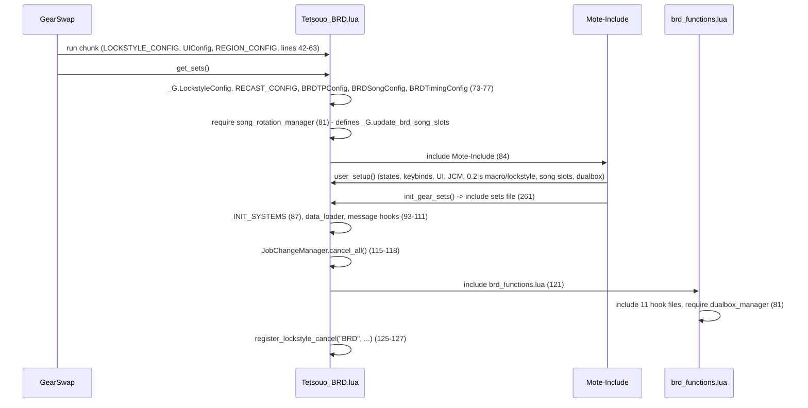
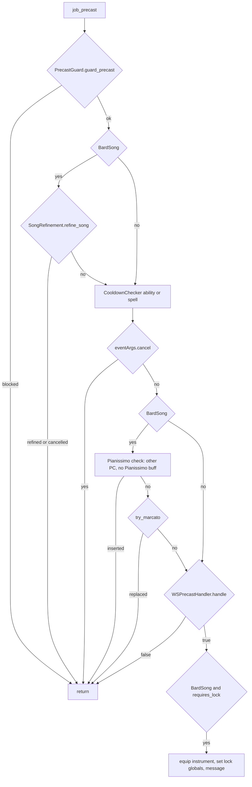
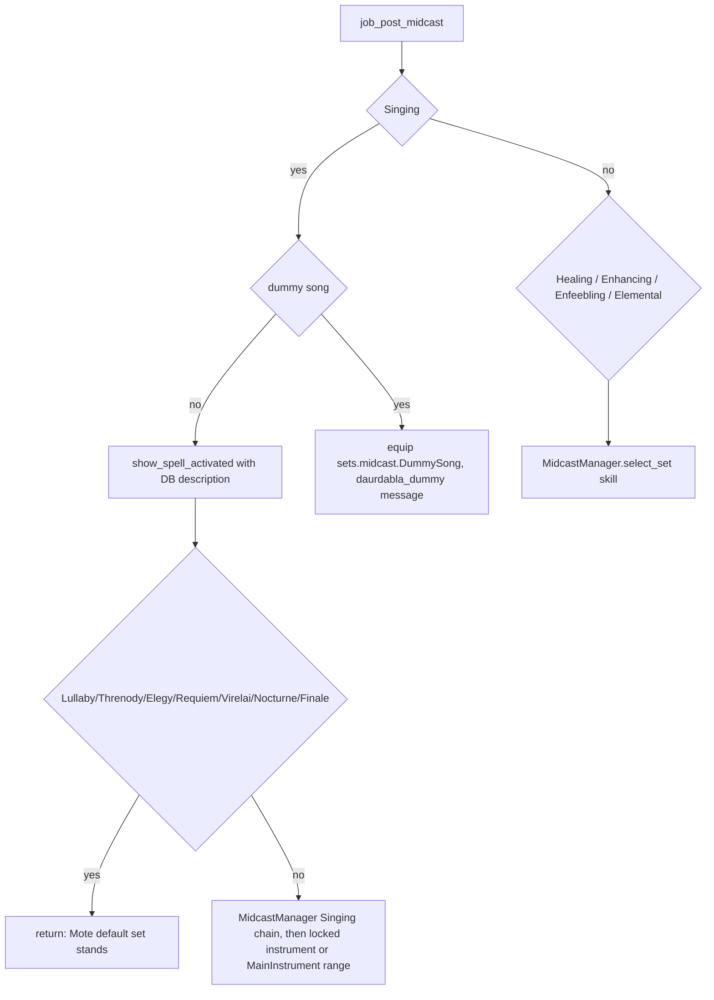

# BRD (Bard) job

The BRD job area is 11 hook modules plus 5 logic modules under
`shared/jobs/brd/functions/` (2 384 lines), one entry point, seven config
files, one sets file and a song database. GearSwap loads it when the main job
becomes BRD (`Tetsouo_BRD.lua`). From then on Mote-Include calls its hooks on
every action (precast, midcast, aftercast), on status and buff changes, on
`//gs c` commands and on state cycles.

What BRD adds on top of the shared pipeline:

- **Song refinement** in precast: a debuff song on recast is replaced by its
  configured lower (or, for Horde Lullaby, higher) tier. It runs **before**
  `CooldownChecker`, the one documented exception to the precast order.
- **Automatic Pianissimo** when a song targets another player, and **automatic
  Marcato** in front of the song chosen by `MarcatoSong` while Nightingale and
  Troubadour are both up.
- **Instrument lock**: Honor March (Marsyas) and Aria of Passion (Loughnashade)
  keep their instrument from precast to aftercast. Other buff songs are sung
  with the instrument chosen by `MainInstrument` (`^numpad3`).
- **Song packs**: `//gs c songs` casts a 4- or 5-song rotation with a dummy-song
  phase, swaps Victory March out when Haste is up, and shows the pack in five
  HUD rows.
- **Singing midcast**: the Singing branch of `MidcastManager`, plus dummy-song
  and debuff-song routing in a BRD router.
- **Commands** for debuff songs, element/stat songs, song slots and the BRD job
  abilities.

Every file in scope was read in full except the gear content of the sets files
and the song databases (structure and names only; gear choice is out of scope).
All line numbers refer to the working tree on 2026-09-19.

## Files

| Path | Lines | Role |
|------|------:|------|
| `_master/entry/Tetsouo_BRD.lua` | 261 | Entry point (template): config preload, `get_sets`, `job_sub_job_change`, `user_setup`, `job_update`, `init_gear_sets`, `file_unload` |
| `shared/jobs/brd/functions/brd_functions.lua` | 88 | Facade: includes the 11 hook files, requires `dualbox_manager` |
| `shared/jobs/brd/functions/BRD_PRECAST.lua` | 296 | `job_precast` (guard, refinement, cooldown, Pianissimo, Marcato, WS, instrument lock) / `job_post_precast` (TP gear, precast debug) |
| `shared/jobs/brd/functions/BRD_MIDCAST.lua` | 134 | `job_midcast` (empty), `job_customize_midcast_set` (passthrough), `job_post_midcast` (context + skill dispatch) |
| `shared/jobs/brd/functions/BRD_AFTERCAST.lua` | 69 | `job_aftercast`: watchdog, clears the Pianissimo flag and the instrument lock |
| `shared/jobs/brd/functions/BRD_IDLE.lua` | 43 | `customize_idle_set` -> `SetBuilder.build_idle_set` |
| `shared/jobs/brd/functions/BRD_ENGAGED.lua` | 43 | `customize_melee_set` -> `SetBuilder.build_engaged_set` |
| `shared/jobs/brd/functions/BRD_STATUS.lua` | 19 | `job_status_change = LifecycleManager.status_change()` |
| `shared/jobs/brd/functions/BRD_BUFFS.lua` | 19 | `job_buff_change = LifecycleManager.buff_change()` |
| `shared/jobs/brd/functions/BRD_COMMANDS.lua` | 543 | `job_self_command` router, `job_state_change = LifecycleManager.state_change()` |
| `shared/jobs/brd/functions/BRD_MOVEMENT.lua` | 59 | `get_brd_movement_status`, `job_handle_equipping_gear` (instrument lock) |
| `shared/jobs/brd/functions/BRD_LOCKSTYLE.lua` | 53 | Lazy `LockstyleManager.create('BRD', ..., 1, 'WHM')` wrappers |
| `shared/jobs/brd/functions/BRD_MACROBOOK.lua` | 48 | Lazy `MacrobookManager.create('BRD', ..., 'WHM', 1, 1)` wrapper |
| `shared/jobs/brd/functions/logic/midcast_router.lua` | 261 | Per-skill midcast handlers (Singing, Healing, Enhancing, Enfeebling, Elemental), locked instrument and `MainInstrument` |
| `shared/jobs/brd/functions/logic/song_rotation_manager.lua` | 301 | Pack lookup, Victory March replacement, HUD slots, rotations, required instrument |
| `shared/jobs/brd/functions/logic/song_refinement.lua` | 113 | `refine_song(spell, eventArgs)` |
| `shared/jobs/brd/functions/logic/instrument_lock_config.lua` | 70 | `LOCKED_SONGS` (Honor March, Aria of Passion) |
| `shared/jobs/brd/functions/logic/set_builder.lua` | 217 | Idle/engaged construction (town, IdleMode, EngagedMode, Kraken Club, weapons, movement) |
| `_master/config/brd/BRD_STATES.lua` | 246 | All states (`BRDStates.configure()`), unused `validate()` |
| `_master/config/brd/BRD_KEYBINDS.lua` | 137 | 12 numpad binds, `bind_all` / `unbind_all` / `show_intro` |
| `_master/config/brd/BRD_SONG_CONFIG.lua` | 292 | Packs, dummy songs, Etudes, Victory March replacement, short names, refinement tiers |
| `_master/config/brd/BRD_TIMING_CONFIG.lua` | 159 | Song and ability delays, `get_song_delay` |
| `_master/config/brd/BRD_TP_CONFIG.lua` | 70 | `_G.BRDTPConfig` (Moonshade, Aeneas, Centovente) |
| `_master/config/brd/BRD_LOCKSTYLE.lua` | 26 | `default = 7`, `by_subjob` |
| `_master/config/brd/BRD_MACROBOOK.lua` | 45 | Book/page per subjob and per dual-box partner job |
| `_master/Tetsouo/config/brd/BRD_REFILL.lua` | 35 | Refill template (Tetsouo) |
| `_master/sets/brd_sets.lua` | 501 | Template sets (flat) |
| `shared/utils/messages/formatters/jobs/message_brd.lua` + `data/jobs/brd_messages.lua` | 511 + 292 | BRD chat messages (JA, instrument lock, packs, refinement, errors) |
| `shared/utils/messages/formatters/magic/message_precast.lua` | 133 | `debugprecast` output used by `job_post_precast` |
| `shared/data/magic/BRD_SPELL_DATABASE.lua` (+ `song/song_buffs`, `song_debuffs`, `song_special`) | 181 (+ 893, 426, 49) | Song descriptions and elements for the midcast "Spell Activated" line |
| `shared/data/job_abilities/BRD_JA_DATABASE.lua` | 13 | `JA_DATABASE_FACTORY.create('BRD')` for ability messages |

Live copies (gitignored): `Tetsouo/Tetsouo_BRD.lua` (identical to the template
except line 261 includes `sets/brd/brd_sets.lua`), `Tetsouo/config/brd/*`
(identical except `BRD_MACROBOOK.lua`, whose books are 7/8 instead of 31-40, and
`BRD_STATES.lua`: `SongMode` default `Madrigal`, `VictoryMarch` default `Etude`,
`MainWeapon` = Mpu Gandring/Naegling, `SubWeapon` = Kraken/Centovente/Genmei with
default `Kraken`), `Tetsouo/config/brd/BRD_REFILL.lua` (identical to its
template), `Tetsouo/sets/brd/{brd_sets,armor,capes,instruments,weapons}.lua`
(modular, 417 + 89 + 54 + 37 + 41 lines). `Kaories/` and `_master/Kaories/`
contain no BRD files.

## How it works

### Load sequence

BRD is the only one of BRD/GEO/COR that publishes its configs **before**
`include('Mote-Include.lua')` (`Tetsouo_BRD.lua:72-77`, comment: "BEFORE
Mote-Include so they're available in user_setup"). The eager `require` of the
rotation manager (81) runs before `INIT_SYSTEMS` installs the module cache, so
that instance is not cached; the command and midcast modules later load a second
instance, which re-points `_G.update_brd_song_slots`
(`song_rotation_manager.lua:299`). Both instances are stateless apart from the
config tables they captured at load (`:16-17`), so the duplication is harmless.

`user_setup()` (`Tetsouo_BRD.lua:158-217`):

1. `BRDStates.configure()` (163-164) creates every state (see
   [Mote states](#mote-states)).
2. `require('Tetsouo/config/brd/BRD_KEYBINDS')`, stored in the global
   `BRDKeybinds`, then `bind_all()` (12 binds). Unlike BLM/GEO/COR, BRD's
   `show_intro()` does not require the macrobook/lockstyle wrappers
   (`BRD_KEYBINDS.lua:126-130`).
3. `KeybindUI.smart_init("BRD", init_delay)` (178-182).
4. `JobChangeManager.initialize()`, then a 0.2 s coroutine that calls
   `select_default_macro_book()` and schedules `select_default_lockstyle` after
   `LockstyleConfig.initial_load_delay` (187-200). Because the check runs 0.2 s
   later, after `get_sets()` has finished and the facade has defined both
   globals, this block works on a fresh load (the synchronous version in 11
   other templates does not, see
   [core lifecycle](../systems/core-lifecycle.md)).
5. `_G.update_brd_song_slots()` after `UIConfig.init_delay + 0.5` s (205-209),
   so the HUD song rows show the pack.
6. `pcall(require, 'shared/utils/dualbox/dualbox_manager')` (216).

`brd_functions.lua` includes `BRD_LOCKSTYLE`, `BRD_MACROBOOK` (35-36),
`BRD_PRECAST`, `BRD_MIDCAST`, `BRD_AFTERCAST` (42-46), `BRD_IDLE`, `BRD_ENGAGED`
(53-55), `BRD_STATUS`, `BRD_BUFFS` (62-64), `BRD_COMMANDS`, `BRD_MOVEMENT`
(71-73), requires `dualbox_manager` (81) and prints a debug line (83-84). BRD
does not include `message_buffs.lua` (BLM, GEO and COR do).

### Precast

`job_precast` (`BRD_PRECAST.lua:183-230`):

- Refinement runs first on purpose; the comment at `BRD_PRECAST.lua:190-194`
  records why (checking the cooldown first would cancel the song before it can
  be downgraded).
- `CooldownChecker` (199-205) and the cancel check (207) come next, then the
  Pianissimo and Marcato insertions (211-219): both spend a job ability and
  re-send the song, so a song on recast is refused before either is sent
  (until 2026-09-19 they ran before the cooldown check and wasted the
  ability).
- `WSPrecastHandler.handle` is called for every action; it returns true at once
  for anything that is not a weaponskill (`ws_precast_handler.lua:35-38`).
- `job_post_precast` (237-282) applies the stored TP gear. With
  `_G.PrecastDebugState` (`//gs c debugprecast`) and a spell it prints which
  precast set it believes Mote chose. It tests `sets.precast.BardSong` first,
  but Mote itself never reads that key (it reads `sets.precast.FC[...]`,
  `Mote-Include.lua:643-673`). Lines 243-246 are an empty `if`.
- Mote's default precast for a song is `sets.precast.FC` refined by name, spell
  map, skill `Singing` or type `BardSong` inside `FC` (`Mote-Include.lua:929-951`).

### Song refinement

`SongRefinement.refine_song` (`song_refinement.lua:41-94`) applies only to
`BardSong` whose name contains Lullaby, Elegy, Requiem or Threnody (28-35) and
only while `BRDSongConfig.SONG_REFINE.enabled`. When the spell's recast is above
0 it cancels the cast and either sends the mapped spell with
`input /ma "<tier>" <target id>` (73-76; the raw id keeps the sub-target the
player picked, comment 70-72) and prints `song_refinement`, or, with no mapping,
cancels and prints `song_refinement_failed`. The mapping is
`BRD_SONG_CONFIG.lua:269-289`: Horde Lullaby -> Horde Lullaby II (an upgrade),
Foe Lullaby II -> Foe Lullaby, Carnage Elegy -> Battlefield Elegy, Foe Requiem
VII -> VI, each `<Element> Threnody II` -> `<Element> Threnody` (the Lightning
pair is `Ltng. Threnody II` -> `Ltng. Threnody`, the resource names).

### Pianissimo and Marcato

- **Pianissimo** (`job_precast_bardsong`, 79-109): when the song's target is
  another character that is a PC (`spawn_type == 13`), in party or in alliance,
  and not charmed, and Pianissimo is not active, it sets
  `_G.pianissimo_in_progress`, cancels the cast, sends
  `input /ja "Pianissimo" <me>` then `wait 2; input /ma "<song>" "<name>"`, and
  sets `eventArgs.cancel`. The flag blocks a second insertion until the next
  `BardSong` aftercast clears it (`BRD_AFTERCAST.lua:32-34`). A cast cancelled
  in precast produces no aftercast, so the flag can outlive a failed attempt
  until the next song completes.
- **Marcato** (`try_marcato`, 151-181): only for the song named by
  `state.MarcatoSong` (`HonorMarch` -> Honor March, `AriaPassion` -> Aria of
  Passion), not on another player, only with Nightingale **and** Troubadour, not
  under Soul Voice or an active Marcato, and only when Marcato's recast (id 48)
  is 0. It cancels, sends `input /ja "Marcato" <me>` then
  `wait 2; input /ma "<song>" <me>`. `show_marcato_honor_march` is a no-op
  (`message_brd.lua:100-107`, "DISABLED: Too verbose").
- Commands do not send Marcato themselves: `cast_song` (`BRD_COMMANDS.lua:115-118`)
  only picks the target, and the song reaches `try_marcato` in precast like any
  other cast. The command-side copy (`try_marcato_auto_cast`) was removed on
  2026-09-19 because it sent Marcato before the song's recast was checked.

### Instrument lock

`InstrumentLockConfig.LOCKED_SONGS` (`instrument_lock_config.lua:33-36`) maps
Honor March to Marsyas and Aria of Passion to Loughnashade. At the end of
precast (`BRD_PRECAST.lua:227-229`, `job_precast_bardsong_2` 112-125) the
instrument is equipped in `range` and `_G.casting_locked_song`,
`_G.locked_song_name`, `_G.locked_instrument` are set. Midcast re-applies it
after `MidcastManager` (`midcast_router.lua:189-195`). Aftercast clears the
three globals after **any** action and prints `instrument_released` when the
same song completed uninterrupted (`BRD_AFTERCAST.lua:38-56`).
`job_handle_equipping_gear` (`BRD_MOVEMENT.lua:39-49`) also equips it, but does
not set `eventArgs.handled`, so Mote equips the full status set right after it
(`Mote-Include.lua:443-450`).

### Main instrument

`state.MainInstrument` (`^numpad3`: Gjallarhorn, Daurdabla, Marsyas) picks the
instrument of every normal song that has no required instrument.
`apply_main_instrument` (`midcast_router.lua:160-176`) runs at the end of
`equip_normal_song`, after `MidcastManager` and only when the locked-instrument
override did not apply, and equips `{range = sets.midcast.Songs[<value>].range}`:

- only the `range` slot is taken, because each `sets.midcast.Songs.<instrument>`
  is a whole `BardSong` copy and equipping it would undo the family piece
  (Minne legs, Etude head...) the song set has just put on;
- a song for which `MidcastManager.get_song_instrument` returns an instrument
  (Honor March, Aria of Passion) is left alone, even if the lock globals are
  missing;
- dummy songs (`sets.midcast.DummySong`) and debuff songs (their own sets, left
  to Mote) never reach it;
- a value with no `sets.midcast.Songs[<value>].range` changes nothing.

It acts at midcast only, like the rest of the song instrument handling;
precast keeps the Fast Cast set's instrument.

### Song rotations and HUD slots

- `get_current_pack()` (`song_rotation_manager.lua:28-42`) returns
  `SONG_PACKS[state.SongMode.current]`, or the `March` pack with a
  `pack_not_found` message.
- `get_songs_with_replacement()` (60-87) copies the pack and, when
  `VICTORY_MARCH_REPLACE.enabled` and Haste or Haste II is active, replaces the
  first Victory March by `replacements[state.VictoryMarch]` (Blade Madrigal,
  Valor Minuet III), or by the Etude of `state.EtudeType` for `Etude`; `None`
  has no entry and keeps Victory March (comment `BRD_SONG_CONFIG.lua:178-180`).
- `cast_songs_with_phases(false, '<me>')` (216-267): 4 songs without Clarion
  Call (songs 1-2, dummies 1-2, songs 3-4), 5 with it (songs 1-3, dummies 1-2,
  songs 4-5). Each cast is a `send_command('wait <t>; input /ma ...')` spaced by
  `BRDTimingConfig.get_song_delay(NI, TR, false)`: 6.0 s normally, 2.5 s under
  Nightingale + Troubadour (`BRD_TIMING_CONFIG.lua:20-29,93-106`). The
  `marcato_used` argument is always `false` (228).
- `cast_dummy_songs()` (271-292) casts 4 or 5 dummies from
  `DUMMY_SONGS.standard`.
- `update_song_slots()` (102-117) writes short names into `state.BRDSong1..5`
  by assigning `.value` and `.current` directly (Mote's `M{}` has no
  `__newindex`, `Modes.lua:187-218`, so these become raw fields). It runs from
  `job_update` (`Tetsouo_BRD.lua:227-229`) and once after load (205-209).
  `UI_LOADER.lua:100-110` appends the five display rows.

### Midcast

Mote first equips its default midcast set (spell name, spell map, skill,
type `BardSong`, `CastingMode`), then calls `job_post_midcast`
(`BRD_MIDCAST.lua:76-119`), which notifies `MidcastWatchdog`, builds a context
(`debug_enabled`, formatter, `BRD_SPELL_DATABASE`, `ENHANCING_MAGIC_DATABASE.get_spell_family`)
and dispatches on `spell.skill`:

- The Singing chain (name, name without spaces, tier-less name, song type, first
  word, instrument layer, Troubadour layer, BardSong) is described in
  [midcast and buffs](../systems/midcast-and-buffs.md#singing-chain-brd). Its
  instrument layer calls `_G.SongRotationManager.get_required_instrument`,
  published by `BRD_MIDCAST.lua:48-50` on first midcast.
- Dummy detection reads `BRDSongConfig.DUMMY_SONGS.standard`
  (`midcast_router.lua:59-71`); debuff detection uses `match` on the names at
  44-51 and on Lullaby/Threnody (74-88).
- Enhancing passes `get_enhancing_target` (Composure) and the enhancing family
  database (211-219); Healing, Enfeebling and Elemental pass only the skill.
  `select_set` returns false when `sets.midcast[skill]` is missing
  (`midcast_manager.lua:620-629`), which is the case for Healing, Enfeebling and
  Elemental in both BRD set files (see [Set names](#set-names-the-code-looks-up)).
- `job_customize_midcast_set` (`BRD_MIDCAST.lua:71-73`) is exported but Mote
  never calls a hook of that name (no match in `libs/Mote-*.lua`).

### Aftercast, idle, engaged, status, buffs

- `job_aftercast` (`BRD_AFTERCAST.lua:24-61`): watchdog, Pianissimo flag,
  instrument lock (above). Mote then re-equips idle/engaged gear.
- `customize_idle_set` -> `SetBuilder.build_idle_set` (`set_builder.lua:191-211`):
  town (`sets.Adoulin` in Adoulin, `sets.idle.Town` in other cities, Dynamis
  excluded, `base_set_builder.lua:62-82`) else `sets.idle[state.IdleMode]`
  (34-51) -> `sets[MainWeapon]` and `sets[SubWeapon]` (97-146) -> `sets.MoveSpeed`
  when moving outside town.
- `customize_melee_set` -> `build_engaged_set` (162-177): `sets.engaged.PDTKC`
  when the **currently worn** sub is Kraken Club (69-74), else
  `sets.engaged[state.EngagedMode]`, else Mote's base -> weapons -> movement
  (BRD is the only job of the three that adds movement gear while engaged).
- `job_status_change` / `job_buff_change` are the shared `LifecycleManager`
  handlers (Doom), see [core lifecycle](../systems/core-lifecycle.md).

## Mote states

Created by `BRDStates.configure()` (`_master/config/brd/BRD_STATES.lua:39-211`)
on every `user_setup()`. Keys from `BRD_KEYBINDS.lua:26-57`; `^` = Ctrl, `#` =
Apps.

| State | Values | Default | Key | Read by |
|-------|--------|---------|-----|---------|
| `IdleMode` | Refresh, DT, Regen | DT | `^numpad4` | Mote `get_idle_set` (`sets.idle[IdleMode]`), `set_builder.lua:42-47` |
| `EngagedMode` | STP, Acc, DT, SB | STP | `^numpad5` | `set_builder.lua:77-84` |
| `SongMode` | Dirge, March, Madrigal, Minne, Etude, Tank, Healer, Carol, Scherzo, Arebati, Ngai | Ngai (live Madrigal) | `^numpad6` | `song_rotation_manager.lua:29-41,256` |
| `MainInstrument` | Gjallarhorn, Daurdabla, Marsyas | Gjallarhorn | `^numpad3` | `midcast_router.lua:160-176` (range of normal songs with no required instrument) |
| `VictoryMarch` | Madrigal, Minuet, Etude, None | Madrigal (live Etude) | `^numpad7` | `song_rotation_manager.lua:46-56` |
| `EtudeType` | STR, DEX, VIT, AGI, INT, MND, CHR | STR | `#numpad1` | `etude` command, `VictoryMarch = Etude` |
| `CarolElement` | Fire, Ice, Wind, Earth, Lightning, Water, Light, Dark | Fire | `^numpad0` | `carol` (`BRD_COMMANDS.lua:133-135`) |
| `ThrenodyElement` | Fire, Ice, Wind, Earth, Lightning, Water, Light, Dark | Fire | `^numpad.` | `threnody` (128-130) |
| `MarcatoSong` | HonorMarch, AriaPassion, Off | HonorMarch | `^numpad8` | `BRD_PRECAST.lua:129-139` |
| `MainWeapon` | Naegling, Twashtar, Carnwenhan, Mpu Gandring | Mpu Gandring | `^numpad1` | `set_builder.lua:97-114` |
| `SubWeapon` | Kraken, Demersal, Genmei, Centovente | Genmei (live Kraken) | `^numpad2` | `set_builder.lua:120-137` |
| `BRDSong1`..`BRDSong5` | Empty (overwritten with short names) | Empty | none | HUD rows only |
| `FastCast` | 0..80 step 10 | 80 | none | `MidcastWatchdog` |
| `AutoMedicine` | shared On/Off | persisted | `#numpad0` | `AutoMedicine.init(state, M)` (`BRD_STATES.lua:207-210`) |

Mote defaults also exist: `OffenseMode`, `HybridMode`, `CastingMode` (all
`'Normal'`, nothing binds them). `^numpad9` (the `HybridMode` anchor) is left
empty, as `.claude/rules/keybinds.md` prescribes for a job without
`HybridMode`. `state.Moving` comes from AutoMove.

## Commands

`job_self_command` (`BRD_COMMANDS.lua:152-528`) lowercases the first word and
tests, in order: `altjobupdate` (165), `requestjob` (176), `ui` (184),
`forceidle` (193), `debugmidcast` (246), `cyclestate` (265), watchdog (271),
**CommonCommands** (279, built-in names and warp aliases only), then the BRD
commands. A name none of them answers goes to Mote, whose last lookup is the
dual-box partner's alt config
([commands and debug](../systems/commands-and-debug.md#4-alt-commands-and-name-shadowing)),
so `marcato`, `nightingale`, `pianissimo`, `troubadour` run here even when the
partner plays BRD.

| Command | Effect | Lines |
|---------|--------|-------|
| `forceidle` | `gs enable ring1`, then 1 s later `/equip ring1` with the idle set's `left_ring` | 193-241 |
| `soul_voice` / `sv`, `nightingale` / `ni`, `troubadour` / `tr` | `/ja <name> <me>` + `ability_command` message | 296-315 |
| `nt` | Nightingale, then Troubadour after `ABILITY_DELAYS.nt_combo_delay` (2.0; fallback 1.5) | 317-331 |
| `marcato` / `ma`, `pianissimo` / `pi` | `/ja` + message | 333-345 |
| `lullaby` | `/ma "Horde Lullaby" <stnpc>` (refinement may upgrade to II) | 351-356 |
| `lullaby2` / `foe` | `/ma "Foe Lullaby II" <stnpc>` | 358-363 |
| `elegy`, `requiem` | Carnage Elegy / Foe Requiem VII on `<stnpc>` | 365-377 |
| `songs` / `meleesong` / `melee` / `allsongs` | `cast_songs_with_phases(false, '<me>')` | 383-388 |
| `dummy` / `dummysongs` | `cast_dummy_songs()` | 390-395 |
| `dummy1`, `dummy2` | `cast_song(<dummy n>)` | 397-417 |
| `threnody` | `<ThrenodyElement> Threnody II` on `<stnpc>` | 419-432 |
| `carol` | `cast_song("<CarolElement> Carol II")` | 434-447 |
| `etude` | `cast_song(ETUDES[EtudeType])` | 449-462 |
| `song1`..`song5` | `cast_song(<slot n of the current pack, after Victory March replacement>)` | 468-527 |
| `cycle <State>` (Mote) | Mote cycle with chat message; used by `cyclestate` when the HUD is hidden | Mote |

`cast_song` (115-118) hands the song to `cast_song_to_target` (95-108): `<me>`
when targeting yourself, the target's name when it is a PC (precast then
inserts Pianissimo), `<stpc>` otherwise. Marcato is added by precast, after the
recast check (see [Pianissimo and Marcato](#pianissimo-and-marcato)).
The header block (6-43) also lists `refresh`, `meleerefresh`, `tanksong`,
`tank`, `tankrefresh`, `healersong`, `healer`, `healerrefresh`; none of them
exists in the router.

`job_state_change` is `LifecycleManager.state_change()` (532-534): a HUD
refresh for any state except `Moving`. The only name it reads is `Moving`, a
state with no description, so it acts the same whether it receives a state's
key (`SongMode`) or its description (`Song Pack`, what Mote passes,
`Mote-SelfCommands.lua:157-159`). The song rows are refreshed by `job_update`,
not here.

## Set names the code looks up

T = `_master/sets/brd_sets.lua`, L = `Tetsouo/sets/brd/brd_sets.lua` (weapon
sets in L come from `weapons.lua:22-39`, copied by the loop at 47-49).

| Set | Looked up by | T | L |
|-----|--------------|---|---|
| `sets.idle`, `.Refresh`, `.DT`, `.Regen` | Mote `get_idle_set`, `set_builder.lua:44-46` | 94, 110, 113, 129 | 56, 72, 75, 91 |
| `sets.idle.Town`, `sets.Adoulin`, `sets.MoveSpeed` | `BaseSetBuilder`, Mote Town scope, `apply_movement` | 488 (`= sets.MoveSpeed`, 1 slot), 491, 485 | 402 (`set_combine(idle.DT, MoveSpeed)`), 405, 399 |
| `sets.engaged`, `.STP`, `.Acc`, `.SB` | `set_builder.lua:81-83` | 142, 159, 162, 165 | 104, 120-122 |
| `sets.engaged.DT` (EngagedMode `DT`) | `set_builder.lua:81` | **absent** | **absent** |
| `sets.engaged.PDTKC` | `set_builder.lua:71` | 171 | 123 |
| `sets[MainWeapon]`, `sets[SubWeapon]` (Naegling, Twashtar, Carnwenhan, Mpu Gandring, Kraken, Demersal, Genmei, Centovente) | `set_builder.lua:103,126` | 74-87 | loop 47-49 |
| `sets.precast.FC`, `sets.precast.JA.Nightingale/Troubadour/['Soul Voice']`, `sets.precast.WS[...]` | Mote default precast | 181, 206-212, 220-307 | 133, 155-157, 164-253 |
| `sets.precast.BardSong`, `sets.precast['Honor March']`, `['Aria of Passion']` | not read by Mote (root of `sets.precast`, Mote reads `FC[...]`); `BardSong` only by the debug display (256) | 196, 199, 202 | 148, 151, 152 |
| `sets.midcast.BardSong` | Singing base, Mote type fallback | 331 | 277 |
| `sets.midcast.Songs.Gjallarhorn/.Marsyas/.Daurdabla` | Singing instrument layer; their `range` by `apply_main_instrument` (`MainInstrument`) | 351-353 | 297-299 |
| `sets.midcast.Songs.Loughnashade`, `.Songs.Duration` | Singing layers | **absent** | **absent** |
| `sets.midcast.HonorMarch` | Singing step 1.5 | 358 | 302 |
| `sets.midcast.AriaPassion` | nothing (step 1.5 builds `AriaofPassion`) | 361 | 303 |
| Family sets `Ballad`, `Madrigal`, `Minuet`, `Minne`, `Etude`, `March`, `Dirge`, `Paeon`, `Scherzo`, `Carol`, `Mambo`, `["Army's Paeon"]`, `["Sentinel's Scherzo"]` | Singing steps 3/3.5, Mote spell map | 366-396 | 306-321 |
| `sets.midcast.DummySong` (+ 4 name aliases) | `midcast_router.lua:142-150`, Mote by name | 399, 415-418 | 324, 340-343 |
| `sets.midcast.Lullaby` (+ 4 aliases), `DebuffSong`, Nocturne, Finale, Elegies, `['Foe Requiem VII']`, Virelai, `Threnody` | Mote default for debuff songs | 423-478 | 348-392 |
| `sets.midcast.Requiem` or `['Foe Requiem VI']` (refinement target) | Mote default | **absent** (falls to `BardSong`) | **absent** |
| `sets.midcast['Enhancing Magic']` | `midcast_router.lua:241` | 328 (empty table) | 274 (empty table) |
| `sets.midcast['Healing Magic']`, `['Enfeebling Magic']`, `['Elemental Magic']` | `midcast_router.lua:235,252,258` | **absent** | **absent** |
| `sets.buff.Doom` | shared `DoomManager` | 497 | 411 |

The template engaged set uses the `ranged` key for Linos (T 143, L 105), which
`//gs c checksets` does not read (see
[equipment and inventory](../systems/equipment-and-inventory.md)).

## Configuration

| File / key | Default | Where the default lives | Read by |
|------------|---------|-------------------------|---------|
| `<char>/config/brd/BRD_STATES.lua` | see states | file | entry `user_setup` |
| `<char>/config/brd/BRD_KEYBINDS.lua` | 12 binds | file | entry `user_setup`, `file_unload` |
| `<char>/config/brd/BRD_LOCKSTYLE.lua` `default`, `by_subjob` | 7 | file; factory fallback 1 (`BRD_LOCKSTYLE.lua:32-37`) | `LockstyleManager` uses `default`; no `get_style`, so `by_subjob` is never read |
| `<char>/config/brd/BRD_MACROBOOK.lua` `default`, `solo[sub]`, `dualbox[alt_job][sub]` | template book 40 page 1; live books 7/8 | file; factory fallback book 1 page 1 (`BRD_MACROBOOK.lua:32-38`) | `MacrobookManager` |
| `<char>/config/brd/BRD_SONG_CONFIG.lua` -> `_G.BRDSongConfig` | 11 packs, 5 dummies, Etudes, `VICTORY_MARCH_REPLACE`, `SHORT_NAMES`, `SONG_REFINE` | file | rotation manager, refinement, router (`is_dummy_song`), commands (`ETUDES`) |
| `<char>/config/brd/BRD_TIMING_CONFIG.lua` -> `_G.BRDTimingConfig` | normal 6.0, nitro 2.5, `nt_combo_delay` 2.0 | file | only `get_song_delay` and `ABILITY_DELAYS.nt_combo_delay`; `nitro_marcato`, the other `ABILITY_DELAYS`, `ROTATION_DELAYS`, `ADJUSTMENTS`, `get_initial_delay`, `apply_adjustments` have no reader |
| `<char>/config/brd/BRD_TP_CONFIG.lua` -> `_G.BRDTPConfig` | Moonshade 250; Aeneas 500, Centovente 1000 | file | `WSPrecastHandler` -> `TPBonusCalculator`, which passes the **main** weapon (`tp_bonus_handler.lua:61`) |
| `<char>/config/brd/BRD_REFILL.lua` (template `_master/Tetsouo/config/brd/`) | Panacea, Antacid, ..., food | file | refill system |
| `Tetsouo/config/LOCKSTYLE_CONFIG.lua`, `REGION_CONFIG`, `RECAST_CONFIG`, UI config | - | entry fallback 42-50 | entry |

## State & lifetime

- Sandbox `_G` written: the Mote hooks (`job_precast`, `job_post_precast`,
  `job_midcast`, `job_customize_midcast_set`, `job_post_midcast`,
  `job_aftercast`, `job_status_change`, `job_buff_change`,
  `customize_idle_set`, `customize_melee_set`, `job_self_command`,
  `job_state_change`, `job_handle_equipping_gear`),
  `pianissimo_in_progress`, `casting_locked_song`, `locked_song_name`,
  `locked_instrument`, `BRDTPConfig`, `BRDSongConfig`, `BRDTimingConfig`,
  `update_brd_song_slots`, `SongRotationManager`, `BRDKeybinds`,
  `LockstyleConfig`, `RECAST_CONFIG`, `RegionConfig`,
  `select_default_lockstyle`, `cancel_brd_lockstyle_operations`,
  `select_default_macro_book`, the factory exports, `get_brd_movement_status`.
  All die with the sandbox on `gs reload` and job change.
- `_G` read: `MidcastManagerDebugState`, `PrecastDebugState`,
  `MidcastWatchdog`, `UIConfig`.
- `windower.*`: BRD writes nothing there and registers no events.
- Coroutines and queued commands: the 0.2 s macro/lockstyle block, the song
  slot refresh, `nt`, `forceidle`, and every rotation step (`wait N` inside
  `send_command`) survive a reload; nothing cancels them.
- Keybinds: bound in `user_setup`, unbound in `file_unload`
  (`Tetsouo_BRD.lua:258-260`).
- Subjob change: Mote re-runs `user_setup()` (states reset, keys rebound, the
  0.2 s block and song-slot refresh scheduled again), then
  `job_sub_job_change` (143-152) hands over to `JobChangeManager`, which
  schedules `gs reload`. See
  [job change lifecycle](../architecture/job-change-lifecycle.md).

## Interactions

- Precast: `PrecastGuard`, `CooldownChecker`, `WSPrecastHandler`
  ([precast pipeline](../systems/precast-pipeline.md)). `//gs c debugprecast`
  output comes from `message_precast`.
- Midcast: `MidcastManager` Singing chain and standard chain, `MidcastWatchdog`
  ([midcast and buffs](../systems/midcast-and-buffs.md)).
- Messages: `message_brd`, `MessageCombat.show_spell_activated` (router),
  `message_precast` ([messages](../systems/messages.md),
  [catalog](../systems/messages-catalog.md)). The unreachable `SONGS` namespace
  duplicates part of `BRD`.
- HUD: `UI_LOADER.lua:100-110` song rows ([UI overlay](../systems/ui-overlay.md)).
- Factories, `JobChangeManager`, `LifecycleManager`, `CommonCommands`,
  `CycleHandler`, dual-box ([dualbox](../systems/dualbox.md)): the BRD macrobook
  has dual-box pages for a GEO, COR or RDM partner.
- Other jobs: COR's Choral Roll lists BRD as its job bonus
  (`roll_data.lua:135`).

## Invariants & gotchas

- `SongRefinement` must stay before `CooldownChecker`; anything else that
  spends a job ability before the song's recast is known wastes it, which is
  why Pianissimo and Marcato come after the cooldown check and commands never
  send them.
- Refinement replaces the cooldown check for Lullaby/Elegy/Requiem/Threnody:
  a song with no mapping is cancelled with "No downgrade available".
- Song names come from the resources: the Lightning songs are
  `Ltng. Threnody` / `Ltng. Threnody II` (`res/spells.lua:461,818`) but
  `Lightning Carol` / `Lightning Carol II` (`:445,453`). The element states
  use `Lightning` as their key for both (`THRENODIES` / `CAROLS`,
  `BRD_COMMANDS.lua:79-85`); commit `443d422` fixed the Carol state that said
  `Thunder` and every `Lightning Threnody` name.
- A root set named after a song beats every family set; `AriaPassion` is not the
  name Step 1.5 builds.
- `select_set` does nothing when `sets.midcast[skill]` is missing; subjob
  Healing/Enfeebling/Elemental keep Mote's choice.
- `MarcatoSong` only acts under Nightingale + Troubadour; outside that window
  the song is cast plainly.
- `PDTKC` is chosen from the sub that is **worn** when the set is built, not
  from `SubWeapon`: the first rebuild after selecting `Kraken` still uses
  `EngagedMode`.
- `HUD` song rows only refresh through `job_update` (every `gs c update`, and
  every state cycle, HUD shown or not, since both cycle paths end in Mote's
  `handle_update`).

## Extending

- New pack: add it to `SONG_PACKS` in `BRD_SONG_CONFIG.lua` and its name to
  `SongMode` in `BRD_STATES.lua`, in both `_master/` and the live copy; add
  short names to `SHORT_NAMES`.
- New refinement: add `[<song>] = <replacement>` to `SONG_REFINE.tiers` and make
  sure `needs_refinement` (`song_refinement.lua:28-35`) matches the family.
  Use resource names.
- New locked song: add it to `LOCKED_SONGS` and to
  `get_required_instrument` (`song_rotation_manager.lua:153-174`), and define
  `sets.midcast.Songs.<instrument>`. `MainInstrument` then leaves it alone.
- New `MainInstrument` value: add it to the state in `BRD_STATES.lua` (both
  copies) and define `sets.midcast.Songs.<value>` with its `range`.
- New debuff song that must not swap weapons: add it to `DEBUFF_SONGS`
  (`midcast_router.lua:44-51`) and give it a set Mote finds by name or spell
  map.
- New command: add a branch after the CommonCommands block. A name that is also a key of `Tetsouo/config/alt/*.lua` then runs here; the
  alt's version stays reachable as `//gs c alt <name>`.

## Known issues

- A `songs` rotation under Nightingale + Troubadour does not leave room for the
  Marcato that precast inserts in front of Honor March (2 s wait vs 2.5 s song
  spacing; `nitro_marcato` is never used) (`song_rotation_manager.lua:228`,
  `BRD_PRECAST.lua:175-177`).
- `job_handle_equipping_gear` is registered although the comment says it must
  not be: `function name()` in an included file defines a sandbox global
  (`BRD_MOVEMENT.lua:39,55-57`; `refresh.lua:149`, `user_functions.lua:327`).
- `job_customize_midcast_set` is never called (`BRD_MIDCAST.lua:71-73`).
- Three different "other player" tests: Marcato (`BRD_PRECAST.lua:158`),
  Pianissimo (`BRD_PRECAST.lua:83-90`) and the command target choice
  (`BRD_COMMANDS.lua:95-108`).
- `lullaby` prints "Casting Horde Lullaby II" while casting Horde Lullaby
  (`brd_messages.lua:187-190`, `BRD_COMMANDS.lua:352-353`).
- The command header lists eight commands that do not exist
  (`BRD_COMMANDS.lua:20-26`); the keybind comments still say `Alt+1..=` and
  list an empty Ctrl section (`BRD_KEYBINDS.lua:25-83`).
- `forceidle` has no sender (`BRD_COMMANDS.lua:193`).
- `BRD_LOCKSTYLE.by_subjob` is never read (`_master/config/brd/BRD_LOCKSTYLE.lua:19-24`).
- Template `sets.idle.Town` is the 1-slot `MoveSpeed` set used as a full idle
  base (`_master/sets/brd_sets.lua:488`); the live file fixed it.
- The refined Foe Requiem VI falls to `sets.midcast.BardSong`
  (`BRD_SONG_CONFIG.lua:278`, no Requiem set in T or L).
- Dead code: `BRDStates.validate`, `SongRefinement.get_downgrade` /
  `is_enabled`, `InstrumentLockConfig.get_all_locked_songs`,
  `get_brd_movement_status`, most of `BRD_TIMING_CONFIG`, the empty `if` at
  `BRD_PRECAST.lua:243-246`, and the `honor_march_*`, `songs_refresh`,
  `tank_*`, `healer_*`, `song_guidance`, `marcato_skip_*`, `doom_*`,
  `no_pack_configured` BRD messages (see the
  [catalog](../systems/messages-catalog.md)).
- User docs list `Alt+N` keys (`docs/user/jobs/brd/states.md:228-235`).
