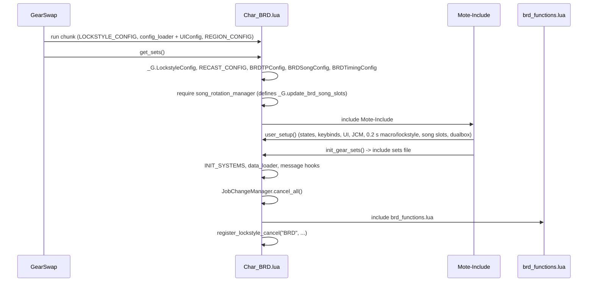
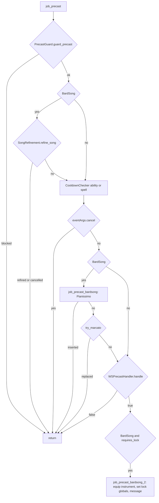
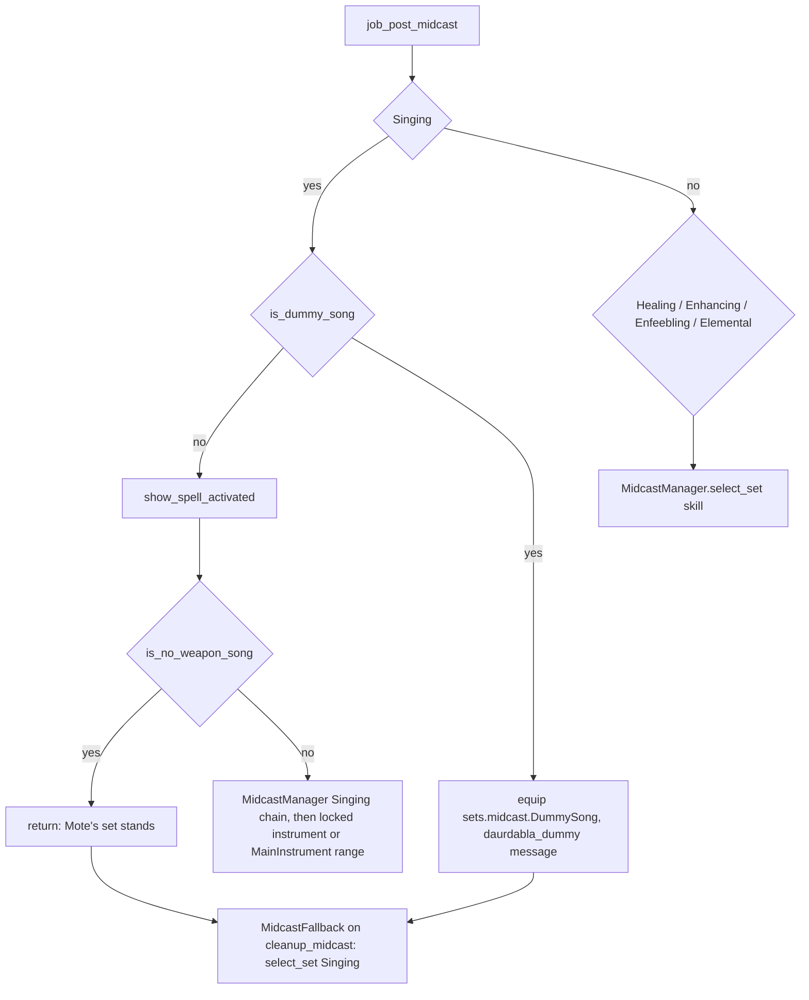

# BRD (Bard) job

The BRD job area is 11 hook modules, the facade and 8 logic modules under
`shared/jobs/brd/functions/` (2 703 lines), one entry point, nine config files,
one sets file and a song database. GearSwap loads it when the main job becomes
BRD. From then on Mote-Include calls its hooks on every action (precast,
midcast, aftercast), on status and buff changes, on `//gs c` commands and on
state cycles.

Player-facing pages: [start page](../../user/jobs/brd/README.md),
[modes](../../user/jobs/brd/states.md), [sets](../../user/jobs/brd/sets.md).

What BRD adds on top of the shared pipeline:

- **Song refinement** in precast: a debuff song on recast is replaced by its
  configured lower (or, for Horde Lullaby, higher) tier. It runs **before**
  `CooldownChecker` (documented exception, `CODE_QUALITY.md` §4.1).
- **Automatic Pianissimo** when a song targets another player (the song is
  re-sent once Pianissimo registers), and **automatic Marcato** in front of the
  song chosen by `MarcatoSong` while Nightingale and Troubadour are both up.
- **Instrument lock**: Honor March (Marsyas) and Aria of Passion
  (Loughnashade) keep their instrument from precast to aftercast. Other buff
  songs get the `range` of `sets.midcast.Songs[MainInstrument]`.
- **Song packs**: `//gs c songs` sings a pack through a **song queue**: each song
  goes out after the previous one's aftercast, with retries; how many songs and
  dummies comes from `song_slots.lua` (instruments owned, Clarion Call, own
  songs up). Victory March is swapped out when Haste is up; `AutoNitro` opens
  with Nightingale + Troubadour.
- **Singing midcast**: the Singing branch of `MidcastManager` for buff songs;
  dummy songs equip `sets.midcast.DummySong`; debuff songs are left to Mote's
  choice and then re-picked by `MidcastFallback` through the same Singing chain.
- **Commands** for debuff songs, element/stat songs, song slots and the BRD job
  abilities.

Checked against the working tree on 2026-09-28. Code is cited by file and
function; line numbers are given only where no function name fits.

## Files

| Path | Lines | Role |
|------|------:|------|
| `_master/entry/Tetsouo_BRD.lua` | 291 | Entry point (template): config preload, `get_sets`, `job_sub_job_change`, `user_setup`, `job_update`, `init_gear_sets`, `file_unload` |
| `shared/jobs/brd/functions/brd_functions.lua` | 85 | Facade: includes the 11 hook files, requires `dualbox_manager` |
| `shared/jobs/brd/functions/BRD_PRECAST.lua` | 313 | `job_precast` (guard, `SongRefinement.refine_song`, cooldown, `job_precast_bardsong` Pianissimo, `try_marcato`, WS, `job_precast_bardsong_2` instrument lock) / `job_post_precast` (TP gear, precast debug) |
| `shared/jobs/brd/functions/BRD_MIDCAST.lua` | 145 | `job_midcast` (empty), `job_customize_midcast_set` (passthrough, never called), `job_post_midcast` (context + skill dispatch to the router) |
| `shared/jobs/brd/functions/BRD_AFTERCAST.lua` | 73 | `job_aftercast`: watchdog, Pianissimo flag, `SongSlots.record`, `SongQueue.on_aftercast`, instrument lock release |
| `shared/jobs/brd/functions/BRD_IDLE.lua` | 42 | `customize_idle_set` -> `SetBuilder.build_idle_set` |
| `shared/jobs/brd/functions/BRD_ENGAGED.lua` | 42 | `customize_melee_set` -> `SetBuilder.build_engaged_set` |
| `shared/jobs/brd/functions/BRD_STATUS.lua` | 20 | `job_status_change = LifecycleManager.status_change()` |
| `shared/jobs/brd/functions/BRD_BUFFS.lua` | 19 | `job_buff_change = LifecycleManager.buff_change()` |
| `shared/jobs/brd/functions/BRD_COMMANDS.lua` | 570 | `job_self_command` router, `cast_song_to_target`, `job_state_change = LifecycleManager.state_change()` |
| `shared/jobs/brd/functions/BRD_MOVEMENT.lua` | 39 | `job_handle_equipping_gear` (re-equips the locked instrument) |
| `shared/jobs/brd/functions/BRD_LOCKSTYLE.lua` | 55 | Lazy `LockstyleManager.create('BRD', ..., 1, 'WHM')` wrappers |
| `shared/jobs/brd/functions/BRD_MACROBOOK.lua` | 49 | Lazy `MacrobookManager.create('BRD', ..., 'WHM', 1, 1)` wrapper |
| `shared/jobs/brd/functions/logic/midcast_router.lua` | 271 | `handle_singing` (dummy / debuff / normal), `handle_healing`, `handle_enhancing`, `handle_enfeebling`, `handle_elemental`; `apply_main_instrument` |
| `shared/jobs/brd/functions/logic/song_rotation_manager.lua` | 250 | `get_current_pack`, `get_songs_with_replacement`, `update_song_slots` (HUD), `get_required_instrument`, `start_with_nitro`, `cast_songs_with_phases`, `cast_dummy_songs` |
| `shared/jobs/brd/functions/logic/song_slots.lua` | 170 | `plan`, `inputs`, `songs_up` (own-song ledger), `record`, `instrument_extra` |
| `shared/jobs/brd/functions/logic/song_queue.lua` | 156 | `start`, `stop`, `on_aftercast`; retry / timeout logic |
| `shared/jobs/brd/functions/logic/song_refinement.lua` | 115 | `refine_song(spell, eventArgs)` |
| `shared/jobs/brd/functions/logic/instrument_lock_config.lua` | 70 | `LOCKED_SONGS` (Honor March, Aria of Passion), `requires_lock`, `get_instrument` |
| `shared/jobs/brd/functions/logic/set_builder.lua` | 219 | `select_idle_base` (town, IdleMode), `select_engaged_base` (Kraken Club, EngagedMode), `apply_weapons`, `build_idle_set`, `build_engaged_set` |
| `_master/config/brd/BRD_STATES.lua` | 223 | All states (`BRDStates.configure()`) |
| `_master/config/brd/BRD_KEYBINDS.lua` | 62 | 12 binds, data only; `KeybindManager.create('BRD', ...)` ([keybinds and custom states](../systems/keybinds-and-custom.md)) |
| `_master/config/brd/BRD_CUSTOM.lua` | 119 | Player modes and gear rules (all examples commented out) |
| `_master/config/brd/BRD_HUD.lua` | 32 | Per-job HUD `section_order` / `row_order` (empty) |
| `_master/config/brd/BRD_SONG_CONFIG.lua` | 293 | Packs, dummy songs, Etudes, Victory March replacement, short names, refinement tiers |
| `_master/config/brd/BRD_TIMING_CONFIG.lua` | 30 | `ROTATION_DELAYS.after_song` 3.0 / `after_locked_song` 1.0 (song queue), `ABILITY_DELAYS.nt_combo_delay` 2.0 (`//gs c nt`) |
| `_master/config/brd/BRD_TP_CONFIG.lua` | 70 | `_G.BRDTPConfig` (Moonshade, Aeneas, Centovente) |
| `_master/config/brd/BRD_LOCKSTYLE.lua` | 26 | `default = 7`, `by_subjob` (never read: no `get_style`) |
| `_master/config/brd/BRD_MACROBOOK.lua` | 46 | Book/page per subjob and per dual-box partner job |
| `_master/sets/brd_sets.lua` | 519 | Template sets (flat) |
| `shared/utils/messages/formatters/jobs/message_brd.lua` + `data/jobs/brd_messages.lua` | 513 + 269 | BRD chat messages |
| `shared/utils/messages/formatters/magic/message_precast.lua` | 135 | `debugprecast` output used by `job_post_precast` |
| `shared/data/magic/BRD_SPELL_DATABASE.lua` (+ `song/song_buffs`, `song_debuffs`, `song_special`) | 181 (+ 893, 426, 49) | Song descriptions and elements for the midcast "Spell Activated" line. `song_buffs.lua` is over the 800-line limit (listed in `CLAUDE.md`) |
| `shared/data/job_abilities/BRD_JA_DATABASE.lua` | 13 | `JA_DATABASE_FACTORY.create('BRD')` |
| `shared/utils/core/cast_tracker.lua`, `shared/utils/precast/cast_time.lua` | 58, 241 | "Cast started" packets and the cast time computed at precast, read by the song queue; `cast_time.owned_ids()` also feeds `instrument_extra` |

Character overlay: `_master/<Character>/config/brd/` holds `BRD_STATES.lua`
(the author's defaults: SongMode Madrigal, VictoryMarch Etude, other weapon
lists), `BRD_MACROBOOK.lua` and `BRD_REFILL.lua`; the author's live BRD uses the
modular `sets/brd/{brd_sets,armor,capes,instruments,weapons}.lua`.

## How it works

### Load sequence


```mermaid
sequenceDiagram
    participant GS as GearSwap
    participant E as Char_BRD.lua
    participant M as Mote-Include
    participant F as brd_functions.lua
    GS->>E: run chunk (LOCKSTYLE_CONFIG, config_loader + UIConfig, REGION_CONFIG)
    GS->>E: get_sets()
    E->>E: _G.LockstyleConfig, RECAST_CONFIG, BRDTPConfig, BRDSongConfig, BRDTimingConfig
    E->>E: require song_rotation_manager (defines _G.update_brd_song_slots)
    E->>M: include Mote-Include
    M->>E: user_setup() (states, keybinds, UI, JCM, 0.2 s macro/lockstyle, song slots, dualbox)
    M->>E: init_gear_sets() -> include sets file
    E->>E: INIT_SYSTEMS, data_loader, message hooks
    E->>E: JobChangeManager.cancel_all()
    E->>F: include brd_functions.lua
    E->>E: register_lockstyle_cancel("BRD", ...)
```

- BRD publishes its configs **before** `include('Mote-Include.lua')`, so they
  exist during `user_setup()`.
- The eager `require` of the rotation manager is cached: `config_loader`
  installs the module cache at file level (`module_cache.lua`), so the command
  and midcast modules get the same instance. The manager captures
  `_G.BRDSongConfig` at load, which is why the entry sets it first.
- `user_setup()`: `BRDStates.configure()`; `BRD_KEYBINDS` ->
  global `BRDKeybinds`, `bind_all()` (whose `show_intro` requires the macrobook
  and lockstyle wrappers); `KeybindUI.smart_init("BRD", ...)`;
  `JobChangeManager.initialize()` plus a 0.2 s coroutine that calls
  `select_default_macro_book()` and schedules `select_default_lockstyle` after
  `LockstyleConfig.initial_load_delay` (checked 0.2 s later, when the facade
  has defined both globals); `_G.update_brd_song_slots()` after
  `UIConfig.init_delay + 0.5` s; `dualbox_manager` require.
- BRD does not include `message_buffs.lua` (COR and DNC do).

### Precast

`job_precast` (`BRD_PRECAST.lua`):


```mermaid
flowchart TD
    A[job_precast] --> B{PrecastGuard.guard_precast}
    B -- blocked --> Z[return]
    B -- ok --> C{BardSong}
    C -- yes --> R{SongRefinement.refine_song}
    R -- refined or cancelled --> Z
    R -- no --> D
    C -- no --> D[CooldownChecker ability or spell]
    D --> E{eventArgs.cancel}
    E -- yes --> Z
    E -- no --> S{BardSong}
    S -- yes --> P[job_precast_bardsong: Pianissimo]
    P -- inserted --> Z
    P -- no --> Q{try_marcato}
    Q -- replaced --> Z
    Q -- no --> W
    S -- no --> W{WSPrecastHandler.handle}
    W -- false --> Z
    W -- true --> L{BardSong and requires_lock}
    L -- yes --> K[job_precast_bardsong_2: equip instrument, set lock globals, message]
```

- Refinement runs first on purpose (the comment in `job_precast` says why:
  checking the cooldown first would cancel the song before it can be
  downgraded).
- Pianissimo and Marcato come after the cooldown check: both spend a job
  ability and re-send the song, so a song on recast is refused before either is
  sent.
- `WSPrecastHandler.handle` is called for every action; it returns true at
  once for anything that is not a weaponskill.
- `job_post_precast` applies the stored TP gear. With `_G.PrecastDebugState`
  (`//gs c debugprecast`) and a spell it prints which precast set it believes
  Mote chose. It tests `sets.precast.BardSong` first, but Mote itself never
  reads that key (it reads `sets.precast.FC[...]`).
- Mote's default precast for a song is `sets.precast.FC` refined by name,
  spell map, skill `Singing` or type `BardSong` inside `FC`.

### Song refinement

`SongRefinement.refine_song` applies only to `BardSong` whose name contains
Lullaby, Elegy, Requiem or Threnody (`needs_refinement`) and only while
`BRDSongConfig.SONG_REFINE.enabled`. When the spell's recast is above 0 it
cancels the cast and either sends the mapped spell with
`input /ma "<tier>" <target id>` (the raw id keeps the sub-target the player
picked) and prints `song_refinement`, or, with no mapping, prints
`song_refinement_failed`. Mapping (`SONG_REFINE.tiers`): Horde Lullaby ->
Horde Lullaby II (an upgrade), Foe Lullaby II -> Foe Lullaby, Carnage Elegy ->
Battlefield Elegy, Foe Requiem VII -> VI, each `<Element> Threnody II` ->
`<Element> Threnody` (Lightning is `Ltng. Threnody II` -> `Ltng. Threnody`, the
resource names).

### Pianissimo and Marcato

- **Pianissimo** (`job_precast_bardsong`): when the target is another
  character with `spawn_type == 13`, or in party / alliance, not charmed, and
  Pianissimo is not active, it sets `_G.pianissimo_in_progress`, cancels,
  sends `input /ja "Pianissimo" <me>` and hands the song to
  `AbilityHelper.follow_up_or_abort` (song re-sent once Pianissimo registers,
  abandoned with a warning if refused; `on_abort` clears the flag). The flag is
  otherwise cleared by the next `BardSong` aftercast.
- **Marcato** (`try_marcato`): only for the song named by `state.MarcatoSong`
  (`HonorMarch` -> Honor March, `AriaPassion` -> Aria of Passion), not on
  another player, only with Nightingale **and** Troubadour, not under Soul
  Voice or an active Marcato, and only when Marcato's recast (id 48) is 0. It
  cancels, sends `input /ja "Marcato" <me>` then
  `wait 2; input /ma "<song>" <me>`. The song queue tolerates it: an action
  other than a cast inside the start window buys `JA_FIRST_WAIT` (3 s).
- Commands never send Marcato or Pianissimo themselves: `cast_song` only picks
  the target.

### Instrument lock

`InstrumentLockConfig.LOCKED_SONGS` maps Honor March to Marsyas and Aria of
Passion to Loughnashade. At the end of precast (`job_precast_bardsong_2`) the
instrument is equipped in `range` and `_G.casting_locked_song`,
`_G.locked_song_name`, `_G.locked_instrument` are set. Midcast re-applies it
after `MidcastManager` (`equip_normal_song`). Aftercast clears the three
globals after **any** action and prints `instrument_released` when the same
song completed uninterrupted. `job_handle_equipping_gear` (`BRD_MOVEMENT.lua`)
also equips it, but does not set `eventArgs.handled`, so Mote equips the full
status set right after it.

GearSwap's own `check_spell` lets Honor March / Aria of Passion through
without the instrument worn only while the `range` slot is enabled
(`helper_functions.lua`); see Combat Mode in Known issues.

### Main instrument

`apply_main_instrument` (`midcast_router.lua`) runs at the end of
`equip_normal_song`, after `MidcastManager` and only when the locked-instrument
override did not apply, and equips `{range = sets.midcast.Songs[<value>].range}`:

- only the `range` slot is taken, because each `sets.midcast.Songs.<instrument>`
  is a whole `BardSong` copy and equipping it would undo the family piece the
  song set has just put on;
- a song for which `MidcastManager.get_song_instrument` returns an instrument
  (Honor March, Aria of Passion) is left alone;
- dummy songs and debuff songs never reach it;
- a value with no `sets.midcast.Songs[<value>].range` changes nothing.

### Song rotations, slots and queue

- `get_current_pack()` returns `SONG_PACKS[state.SongMode.current]`, or the
  `March` pack with a `pack_not_found` message.
- `get_songs_with_replacement()` copies the pack and, when
  `VICTORY_MARCH_REPLACE.enabled` and Haste or Haste II is active, replaces the
  first Victory March by `replacements[state.VictoryMarch]` (Blade Madrigal,
  Valor Minuet III), or by the Etude of `state.EtudeType` for `Etude`; `None`
  has no entry and keeps Victory March.
- **Slots** (`SongSlots.plan(pack_size, full)`): `base = 2 + main_extra +
  clarion`, `total = min(pack, 2 + max(main_extra, dummy_extra) + clarion)`,
  `dummies = max(0, total - max(own songs up, base))` (`full` counts no song
  up). `instrument_extra` reads the description of the version of the
  instrument this character owns ("Grants one / an / two additional song
  effect(s)"; an item whose description ties the extra song to Reives is ignored). The main instrument is
  `state.MainInstrument`; the dummy instrument is `sets.midcast.DummySong.range`.
  Own songs up come from a ledger on `windower._brd_own_songs`
  (`SongSlots.record`, called from `BRD_AFTERCAST.lua` for songs finished on
  self), capped per family by the song buffs actually up
  (`windower.ffxi.get_player().buffs`). `//gs c songplan` shows the inputs and
  the plan.
- `cast_songs_with_phases(false, '<me>', full)`: `base` pack songs, the
  dummies, the rest of the pack; handed to `start_with_nitro`. With
  `AutoNitro = On`, both abilities ready and Nightingale not up, it fires
  Nightingale, waits for its buff (`AbilityHelper.follow_up`, soft deadline),
  then Troubadour likewise, then starts the queue 1 s later; otherwise the
  queue starts at once. The `use_marcato` argument is unused.
- `cast_dummy_songs()` queues `total - base` dummies from
  `DUMMY_SONGS.standard` (`plan(99)`).
- **Song queue** (`logic/song_queue.lua`). State on `windower._brd_song_queue`
  with a sequence number every timer checks. `send_step` sends the next
  `/ma`; `watch_start` after `START_WINDOW` (2.5 s): started
  (`CastTracker.started_since`) -> wait the computed cast time + 3 s (12 s when
  unknown) before calling it lost; another action first (a Marcato) -> 3 s
  more; not started -> refused. `on_aftercast` (any `BardSong`): interrupted ->
  `retry`, else `advance` after `gap()` (`after_song`, + `after_locked_song`
  after a locked song). `retry` tries twice more, then skips with a warning.
  `SongQueue.start` drops a running queue; `//gs c songstop` calls `stop`.
- `update_song_slots()` writes short names into `state.BRDSong1..5` by
  assigning `.value` and `.current` directly (Mote's `M{}` has no
  `__newindex`, so these become raw fields). It runs from `job_update` and
  once after load. `UI_LOADER.lua` appends the five display rows.

### Midcast

Mote first equips its default midcast set (spell name, spell map, skill, type
`BardSong`, `CastingMode`), then calls `job_post_midcast` (`BRD_MIDCAST.lua`),
which notifies `MidcastWatchdog`, builds a context (`debug_enabled`,
formatter, `BRD_SPELL_DATABASE`, `ENHANCING_MAGIC_DATABASE.get_spell_family`),
publishes `_G.SongRotationManager` on first use, and dispatches on
`spell.skill`:


```mermaid
flowchart TD
    A[job_post_midcast] --> S{Singing}
    S -- yes --> D{is_dummy_song}
    D -- no --> M1[show_spell_activated]
    D -- yes --> DS[equip sets.midcast.DummySong, daurdabla_dummy message]
    M1 --> N{is_no_weapon_song}
    N -- yes --> X[return: Mote's set stands]
    N -- no --> MM[MidcastManager Singing chain, then locked instrument or MainInstrument range]
    S -- no --> H{Healing / Enhancing / Enfeebling / Elemental}
    H --> SS[MidcastManager.select_set skill]
    DS --> FB
    X --> FB[MidcastFallback on cleanup_midcast: select_set Singing]
```

- The Singing chain (name, PascalCase name, tier-less name, song family, first
  word, instrument layer, Troubadour `Songs.Duration` layer, `BardSong` base)
  is described in [midcast and buffs](../systems/midcast-and-buffs.md).
- **`MidcastFallback`** (`shared/utils/midcast/midcast_fallback.lua`, since
  2026-09-27) wraps `cleanup_midcast`: a magic spell that no
  `MidcastManager.select_set` saw during this midcast (`_G._midcast_routed`)
  and that is not cancelled or `handled` is routed with its own skill. Dummy
  songs and debuff songs do not call `select_set` in the router: both branches
  call `MidcastFallback.skip(spell)` (2026-09-28), so the dummy song keeps
  `sets.midcast.DummySong` and the debuff song keeps Mote's pick. Before that,
  both were re-picked through the Singing chain: the fifth dummy song
  (Shining Fantasia) was sung in `sets.midcast.BardSong` with Gjallarhorn, and
  debuff songs got `sets.midcast.Songs.Duration` under Troubadour.
- Dummy detection reads `BRDSongConfig.DUMMY_SONGS.standard`
  (`is_dummy_song`); debuff detection uses `match` on `DEBUFF_SONGS` and on
  Lullaby / Threnody (`is_no_weapon_song`).
- Enhancing passes `get_enhancing_target` and the enhancing family database;
  Healing, Enfeebling and Elemental pass only the skill. `select_set` returns
  false when `sets.midcast[skill]` is missing, which is the case for Healing,
  Enfeebling and Elemental in the template.
- `job_customize_midcast_set` is exported but Mote never calls a hook of that
  name.

### Aftercast, idle, engaged, status, buffs

- `job_aftercast`: watchdog; for a `BardSong`, clears the Pianissimo flag,
  `SongSlots.record(spell)`, `SongQueue.on_aftercast(spell)`; then the
  instrument lock release. Mote then re-equips idle / engaged gear.
- `customize_idle_set` -> `build_idle_set`: `select_idle_base` (town:
  `sets.Adoulin` in Adoulin, `sets.idle.Town` in other cities, Dynamis
  excluded; else `sets.idle[IdleMode]`, else Mote's base) -> `apply_weapons`
  (`WeaponResolver.set_for('main' / 'sub', ...)`) -> `sets.MoveSpeed` when
  moving outside town.
- `customize_melee_set` -> `build_engaged_set`: `select_engaged_base`
  (`sets.engaged.PDTKC` when the **worn** sub is Kraken Club, else
  `sets.engaged[EngagedMode]`, else Mote's base) -> weapons ->
  `apply_movement`. AutoMove stops tracking while engaged and sets
  `state.Moving` to false, so the movement layer only applies to the engaged
  set built at the moment of engaging while running (Known issues).
- Because both builders return a mode set instead of Mote's base, Mote's
  defense and kiting layers are dropped whenever the mode's set exists.
- `job_status_change` / `job_buff_change` are the shared `LifecycleManager`
  handlers (Doom, hold during an action).

## Mote states

Created by `BRDStates.configure()` on every `user_setup()`. Keys from
`_master/config/brd/BRD_KEYBINDS.lua`; `^` = Ctrl, `#` = Apps. `#numpad0`
(AutoMedicine) comes from the character's `config/COMMON_KEYBINDS.lua`.

| State | Values | Default | Key | Read by |
|-------|--------|---------|-----|---------|
| `IdleMode` | Refresh, DT, Regen | DT | `^numpad4` (Mote `^f12` too) | `SetBuilder.select_idle_base`, Mote `get_idle_set` |
| `EngagedMode` | STP, Acc, DT, SB | STP | `^numpad5` | `SetBuilder.select_engaged_base` |
| `SongMode` | Dirge, March, Madrigal, Minne, Etude, Tank, Healer, Carol, Scherzo, Arebati, Ngai | Ngai | `^numpad6` | `get_current_pack` |
| `MainInstrument` | Gjallarhorn, Daurdabla, Marsyas | Gjallarhorn | `^numpad3` | `apply_main_instrument`, `SongSlots.inputs` |
| `VictoryMarch` | Madrigal, Minuet, Etude, None | Madrigal | `^numpad7` | `resolve_victory_replacement` |
| `EtudeType` | STR, DEX, VIT, AGI, INT, MND, CHR | STR | `#numpad1` | `etude` command, `VictoryMarch = Etude` |
| `CarolElement` | Fire, Ice, Wind, Earth, Lightning, Water, Light, Dark | Fire | `^numpad0` | `carol` (`CAROLS`) |
| `ThrenodyElement` | same | Fire | `^numpad.` | `threnody` (`THRENODIES`) |
| `MarcatoSong` | HonorMarch, AriaPassion, Off | HonorMarch | `^numpad8` | `marcato_target_song` |
| `AutoNitro` | On, Off | On | `#numpad2` | `start_with_nitro` |
| `MainWeapon` | Naegling, Twashtar, Carnwenhan, Mpu Gandring | Mpu Gandring | `^numpad1` | `SetBuilder.apply_main_weapon` |
| `SubWeapon` | Kraken, Demersal, Genmei, Centovente | Genmei | `^numpad2` | `SetBuilder.apply_sub_weapon` |
| `BRDSong1`..`BRDSong5` | Empty (overwritten with short names) | Empty | none | HUD rows only |
| `FastCast` | 0..80 step 10 | 80 | none | `MidcastWatchdog` |
| `AutoMedicine` | shared On/Off | persisted | `#numpad0` (common key) | `PrecastGuard` |
| `CombatMode`, `TreasureMode` (optional states) | Off/On, Off/Tag/Full | Off, hidden | `!numpad0`, `!numpad.` once shown | `combat_mode.lua`, `treasure_hunter.lua` |

Mote defaults also exist: `OffenseMode`, `HybridMode`, `CastingMode`,
`RangedMode`, `WeaponskillMode` (all `Normal` only). `^numpad9` is left empty.

`job_state_change` is `LifecycleManager.state_change()`: a HUD refresh for any
state except `Moving`. The song rows are refreshed by `job_update`, which both
cycle paths reach through Mote's `handle_update`.

## Commands

`job_self_command` (`BRD_COMMANDS.lua`) lowercases the first word and tests,
in order: `altjobupdate`, `requestjob`, `ui`, `forceidle`, `debugmidcast`,
`cyclestate`, watchdog, **CommonCommands** (with `table.unpack(args)`), then
the BRD commands. `marcato` / `ma`, `nightingale` / `ni`, `pianissimo` / `pi`,
`troubadour` / `tr` run here even when the dual-box partner plays BRD (the
alt's version stays reachable as `//gs c alt <name>`).

| Command | Effect |
|---------|--------|
| `forceidle` | `gs enable ring1`, then 1 s later `/equip ring1` with the left ring (`left_ring`, `ring1` or `lring`) of `sets.idle[IdleMode]` or `sets.idle` (until 2026-09-28 it read `left_ring` only, which the template never uses) |
| `soul_voice` / `sv`, `nightingale` / `ni`, `troubadour` / `tr`, `marcato` / `ma`, `pianissimo` / `pi` | `/ja <name> <me>` + `ability_command` message |
| `nt` | Nightingale, then Troubadour after `ABILITY_DELAYS.nt_combo_delay` (2.0; fallback 1.5) |
| `lullaby` | `/ma "Horde Lullaby" <stnpc>` |
| `lullaby2` / `foe` | `/ma "Foe Lullaby II" <stnpc>` |
| `elegy`, `requiem` | Carnage Elegy / Foe Requiem VII on `<stnpc>` |
| `songs` / `meleesong` / `melee` / `allsongs` `[full]` | `cast_songs_with_phases(false, '<me>', cmdParams[2] == 'full')` |
| `songplan` | InfoBlock of `SongSlots.inputs()` and `plan()` |
| `songstop` | `SongQueue.stop()` |
| `dummy` / `dummysongs` | `cast_dummy_songs()` |
| `dummy1`, `dummy2` | `cast_song(<dummy n>)` |
| `threnody` | `<ThrenodyElement> Threnody II` on `<stnpc>` |
| `carol` | `cast_song("<CarolElement> Carol II")` |
| `etude` | `cast_song(ETUDES[EtudeType])` |
| `song1`..`song5` | `cast_song(<slot n of get_songs_with_replacement()>)` |

`cast_song` hands the song to `cast_song_to_target`: `<me>` when targeting
yourself, the target's name when it is a PC (`spawn_type == 13`; precast then
inserts Pianissimo), `<stpc>` otherwise. The header block of
`BRD_COMMANDS.lua` does not list `songplan`, `songstop` nor `songs full`.

## Set names the code looks up

Full player-facing list: [sets.md](../../user/jobs/brd/sets.md).

| Set | Looked up by |
|-----|--------------|
| `sets.idle`, `.Refresh`, `.DT`, `.Regen` | Mote `get_idle_set`, `select_idle_base` |
| `sets.idle.Town` (template: `= sets.MoveSpeed`, 1 slot), `sets.Adoulin`, `sets.MoveSpeed` | `BaseSetBuilder`, `apply_movement` |
| `sets.engaged`, `.STP`, `.Acc`, `.SB`, `.DT` (absent in T) | `select_engaged_base` |
| `sets.engaged.PDTKC` | `select_engaged_base` |
| `sets[MainWeapon]`, `sets[SubWeapon]` | `apply_main_weapon` / `apply_sub_weapon` through `WeaponResolver` |
| `sets.precast.FC`, `sets.precast.JA[...]`, `sets.precast.WS[...]` | Mote default precast |
| `sets.precast.BardSong`, `sets.precast['Honor March']`, `['Aria of Passion']` | not read by Mote; `BardSong` only by the debug display |
| `sets.midcast.BardSong` | Singing base, Mote type fallback |
| `sets.midcast.Songs.<instrument>` | Singing instrument layer (locked songs); `range` by `apply_main_instrument` |
| `sets.midcast.Songs.Loughnashade`, `.Songs.Duration` (absent in T) | Singing layers |
| `sets.midcast.HonorMarch` | Singing PascalCase step |
| `sets.midcast.AriaPassion` | nothing (the PascalCase step builds `AriaofPassion`) |
| Family sets `Ballad`, `Madrigal`, `Minuet`, `Minne`, `Etude`, `March`, `Dirge`, `Paeon`, `Scherzo`, `Carol`, `Mambo` | Singing family step, Mote spell map |
| `sets.midcast.DummySong` + one set per dummy name | `handle_dummy_song`, then `MidcastFallback` by name |
| Debuff sets by name, `sets.midcast.Lullaby`, `.Threnody`, `.DebuffSong` (base only) | Mote default, then `MidcastFallback` (Singing chain) |
| `sets.midcast['Enhancing Magic']` (empty table in T), `['Healing Magic' / 'Enfeebling Magic' / 'Elemental Magic']` (absent) | `midcast_router.lua` handlers |
| `sets.DW.*` (commented in T), `sets.TreasureHunter` (absent in T) | `DualWield`, `TreasureHunter` |
| `sets.buff.Doom` | `DoomManager` |

## Configuration

| File / key | Default | Read by |
|------------|---------|---------|
| `<char>/config/brd/BRD_STATES.lua` | see states | entry `user_setup` |
| `<char>/config/brd/BRD_KEYBINDS.lua` | 12 binds | entry `user_setup`, `file_unload`, KeybindGuard |
| `<char>/config/brd/BRD_CUSTOM.lua` | nothing active | `CustomStates`; `custom_guards.lua` keeps `range` / `ammo` out of every `BardSong` |
| `<char>/config/brd/BRD_HUD.lua` | empty lists | HUD section / row order |
| `<char>/config/brd/BRD_LOCKSTYLE.lua` `default`, `by_subjob` | 7 (factory fallback 1) | `LockstyleManager` uses `default`; no `get_style`, so `by_subjob` is never read |
| `<char>/config/brd/BRD_MACROBOOK.lua` `default`, `solo[sub]`, `dualbox[alt_job][sub]` | book 40 page 1 (factory fallback book 1 page 1) | `MacrobookManager` |
| `<char>/config/brd/BRD_SONG_CONFIG.lua` -> `_G.BRDSongConfig` | 11 packs, 5 dummies, Etudes, `VICTORY_MARCH_REPLACE`, `SHORT_NAMES`, `SONG_REFINE` | rotation manager, refinement, router (`is_dummy_song`), commands (`ETUDES`) |
| `<char>/config/brd/BRD_TIMING_CONFIG.lua` -> `_G.BRDTimingConfig` | `after_song` 3.0, `after_locked_song` 1.0, `nt_combo_delay` 2.0 | song queue `gap()`, `//gs c nt` |
| `<char>/config/brd/BRD_TP_CONFIG.lua` -> `_G.BRDTPConfig` | Moonshade 250; Aeneas 500, Centovente 1000 | `WSPrecastHandler` -> `TPBonusCalculator` (main **and** sub weapon) |
| `<char>/config/brd/BRD_REFILL.lua` | none in the template | refill system |
| Constants | `START_WINDOW` 2.5, `JA_FIRST_WAIT` 3.0, `END_MARGIN` 3.0, `CAST_TIMEOUT` 12, `MAX_RETRIES` 2 (`song_queue.lua`); `BASE_SLOTS` 2, `LEDGER_MAX_AGE` 1200 (`song_slots.lua`); Marcato recast id 48, `wait 2` (`try_marcato`) | code |

## State & lifetime

- Sandbox `_G` written: the Mote hooks (`job_precast`, `job_post_precast`,
  `job_midcast`, `job_customize_midcast_set`, `job_post_midcast`,
  `job_aftercast`, `job_status_change`, `job_buff_change`,
  `customize_idle_set`, `customize_melee_set`, `job_self_command`,
  `job_state_change`, `job_handle_equipping_gear`), `pianissimo_in_progress`,
  `casting_locked_song`, `locked_song_name`, `locked_instrument`,
  `BRDTPConfig`, `BRDSongConfig`, `BRDTimingConfig`, `update_brd_song_slots`,
  `SongRotationManager`, `BRDKeybinds`, `LockstyleConfig`, `RECAST_CONFIG`,
  `RegionConfig`, the lockstyle / macrobook wrappers.
- `_G` read: `MidcastManagerDebugState`, `PrecastDebugState`,
  `MidcastWatchdog`, `UIConfig`, `_precast_cast_time`.
- `windower.*`: `_brd_song_queue`, `_brd_song_queue_seq` (the queue survives a
  `gs reload`: the next load's aftercast carries it on), `_brd_own_songs`
  (ledger, survives reloads, lost on `lua reload`). No events registered.
- Coroutines and queued commands: the 0.2 s macro/lockstyle block, the song
  slot refresh, `nt`, `forceidle`, Marcato's `wait 2`, the song queue timers
  (each checks the queue sequence) and the AutoNitro chain. None is cancelled
  by a reload.
- Keybinds: bound in `user_setup`, unbound in `file_unload`.
- Subjob change: Mote re-runs `user_setup()`, then `job_sub_job_change` hands
  over to `JobChangeManager` (reload). See
  [job change lifecycle](../architecture/job-change-lifecycle.md).

## Interactions

- Precast: `PrecastGuard`, `CooldownChecker`, `WSPrecastHandler`,
  `AbilityHelper` (`follow_up_or_abort`, `follow_up`, `is_ability_ready`,
  `is_buff_active`) ([precast pipeline](../systems/precast-pipeline.md)).
- Midcast: `MidcastManager` Singing and standard chains, `MidcastFallback`,
  `MidcastWatchdog` ([midcast and buffs](../systems/midcast-and-buffs.md)).
- Equipment hooks: `ElementalBelt` (weaponskills, subjob nukes), `DualWield`,
  `TreasureHunter`, `CombatMode`, `CustomStates`
  ([factories and helpers](../systems/factories-and-helpers.md#common-features-per-job)).
- Messages: `message_brd`, `MessageCombat.show_spell_activated` (router),
  `message_precast`, `InfoBlock` (`songplan`) ([messages](../systems/messages.md)).
- HUD: `UI_LOADER.lua` song rows ([UI overlay](../systems/ui-overlay.md)).
- Dual-box: the BRD macrobook has pages for a GEO, COR or RDM partner
  ([dualbox](../systems/dualbox.md)).
- Other jobs: COR's Choral Roll lists BRD as its job bonus (`roll_data.lua`).

## Invariants & gotchas

- `SongRefinement` must stay before `CooldownChecker`; anything that spends a
  job ability before the song's recast is known wastes it, which is why
  Pianissimo and Marcato come after the cooldown check and commands never send
  them.
- Refinement replaces the cooldown check for Lullaby / Elegy / Requiem /
  Threnody: a song on recast with no mapping is cancelled with "No downgrade
  available".
- Song names come from the resources: `Ltng. Threnody` / `Ltng. Threnody II`
  but `Lightning Carol` / `Lightning Carol II`. The element states use
  `Lightning` as their key for both (`THRENODIES` / `CAROLS`).
- A root set named after a song beats every family set; `AriaPassion` is not
  the name the PascalCase step builds.
- `select_set` does nothing when `sets.midcast[skill]` is missing; subjob
  Healing / Enfeebling / Elemental keep Mote's choice.
- The router must call `select_set` (or set `eventArgs.handled`) for a song
  whose set it chose itself, or `MidcastFallback` re-picks it after the router.
- `PDTKC` is chosen from the sub that is **worn** when the set is built, not
  from `SubWeapon`.
- `SongQueue.on_aftercast` advances on **any** `BardSong` aftercast, including
  a song the player sang by hand during a rotation.

## For maintainers / AI

### Testing offline

Lua 5.1 is installed (`lua5.1`, `luac5.1`):

```bash
for f in $(git ls-files 'shared/jobs/brd/*.lua' '_master/config/brd/*.lua' _master/entry/Tetsouo_BRD.lua _master/sets/brd_sets.lua); do luac5.1 -p "$f"; done
```

Pure logic to exercise with stubs: `SongSlots.plan` (stub `state`, `sets`,
`buffactive`, `windower.ffxi.get_player`, and `package.loaded['resources']` /
`cast_time`), `SongRotationManager.get_songs_with_replacement` (stub
`_G.BRDSongConfig`, `state`, `buffactive` before the first `require`: the
module captures the config at load), `SongRefinement.refine_song` (stub
`windower.ffxi.get_spell_recasts`, `send_command`), `SongQueue` (stub
`coroutine.schedule` to run synchronously, `send_command`, `CastTracker`).
Set `package.path` to the `data/` folder. The gitignored `scripts/audit/`
holds differential tests (`difftest_*.lua`) to copy from.

In game: `//gs c songplan`, `//gs c debugmidcast` (Singing chain steps),
`//gs c debugprecast`, `//gs c trace on` (`MIDCAST`, `CYCLE` lines).

### Traps

- `BRD_MOVEMENT.lua` has its `_G` export commented out, but
  `function job_handle_equipping_gear` in an included file already defines a
  sandbox global: Mote calls it.
- Anything added to `BRD_AFTERCAST.lua` for songs must stay before or
  independent of the instrument lock release, which runs for every action.
- The song queue lives on `windower`; code that changes a queue field must keep
  the `seq` / `index` / `tries` check of `later()`.
- `cast_songs_with_phases`' first argument is ignored; Marcato belongs to
  precast.
- Adding a dummy song means adding its name to `DUMMY_SONGS.standard` **and**
  a `sets.midcast['<name>'] = sets.midcast.DummySong` line in the set files,
  because `MidcastFallback` re-picks it by name.

### Extending

- New pack: `SONG_PACKS` in `BRD_SONG_CONFIG.lua` and the name in `SongMode`
  (`BRD_STATES.lua`), in `_master/` and the live copy; short names in
  `SHORT_NAMES`.
- New refinement: `[<song>] = <replacement>` in `SONG_REFINE.tiers`; check
  `needs_refinement` matches the family. Use resource names.
- New locked song: `LOCKED_SONGS` (`instrument_lock_config.lua`) and
  `sets.midcast.Songs.<instrument>`; also `check_spell` in GearSwap only knows
  Honor March and Aria of Passion.
- New `MainInstrument` value: the state in `BRD_STATES.lua` and
  `sets.midcast.Songs.<value>` with its `range`.
- New debuff song that must not swap weapons: `DEBUFF_SONGS`
  (`midcast_router.lua`) and a set Mote and the Singing chain both find by name.
- New command: a branch after the CommonCommands block.

## Known issues

- **Combat Mode breaks the instruments on BRD** (confirmed in code). When shown
  and On, `combat_mode.lua` disables `range` (`DEFAULT_SLOTS`), so every
  instrument `equip` is dropped: dummy songs use the worn instrument, the main
  instrument never changes, and GearSwap's `check_spell` refuses Honor March /
  Aria of Passion ("You do not know that spell") unless Marsyas / Loughnashade
  is already worn. `spell_gear_lock.lua` only opens the lock for Dispelga.
  Combat Mode is hidden on BRD by default.
- Fixed 2026-09-28: Shining Fantasia (fifth dummy song) was sung in
  `sets.midcast.BardSong` because `MidcastFallback` re-routed dummy songs; the
  router now calls `MidcastFallback.skip(spell)`.
- **Movement gear can stick on the engaged set** (plausible, code path
  confirmed, not seen in game). `build_engaged_set` calls `apply_movement`;
  when you engage while running, `state.Moving` is still `true` at that moment,
  and AutoMove then clears it while engaged without sending `gs c update`, so
  `sets.MoveSpeed` stays on until the next gear change.
- **The song queue outlives BRD** (plausible). It lives on `windower` and its
  timers keep running after a main-job change (`file_unload` does not call
  `SongQueue.stop`): the remaining songs are sent as `/ma` on the new job,
  refused, retried and skipped with warnings.
- The refined Foe Requiem VI falls to `sets.midcast.BardSong` (no Requiem set
  in the template), weapons included.
- `lullaby` prints "Casting Horde Lullaby II" while casting Horde Lullaby
  (`brd_messages.lua` `lullaby_cast` template).
- `job_customize_midcast_set` is never called.
- Three different "other player" tests: Marcato (`try_marcato`,
  `target.type == 'PLAYER'`), Pianissimo (`job_precast_bardsong`,
  `spawn_type == 13` or party / alliance) and the command target
  (`cast_song_to_target`, `spawn_type == 13`).
- `forceidle` has no sender (manual use only).
- `BRD_LOCKSTYLE.by_subjob` is never read.
- Template `sets.idle.Town` is the 1-slot `MoveSpeed` set used as a full idle
  base.
- `song1`..`song5` are five copies of the same branch in `BRD_COMMANDS.lua`
  (duplication); the header does not list `songplan`, `songstop`,
  `songs full`.
- Dead code: `SongRefinement.get_downgrade` / `is_enabled`,
  `InstrumentLockConfig.get_all_locked_songs`, and several BRD message keys
  (see the [catalog](../systems/messages-catalog.md)).
- Pending in-game checks: the song queue with a Marcato in front, a refused
  song retried then skipped; `songplan` numbers with each instrument owned.
- Fixed, no longer issues: the fixed-wait rotation (`wait <t>` per song) is
  replaced by the song queue (2026-09-25), which also removes the "no room for
  Marcato" issue (`JA_FIRST_WAIT`); dummy count from instruments owned
  (`song_slots.lua`); the second song-to-instrument table; the eight
  non-existent commands in the header; the rotation manager no longer loads
  twice (module cache).
