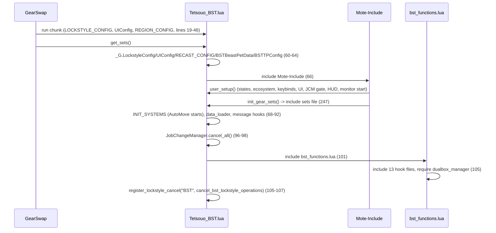
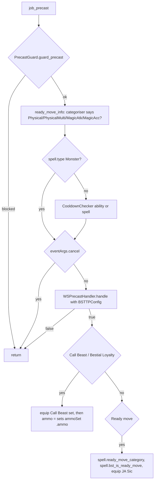
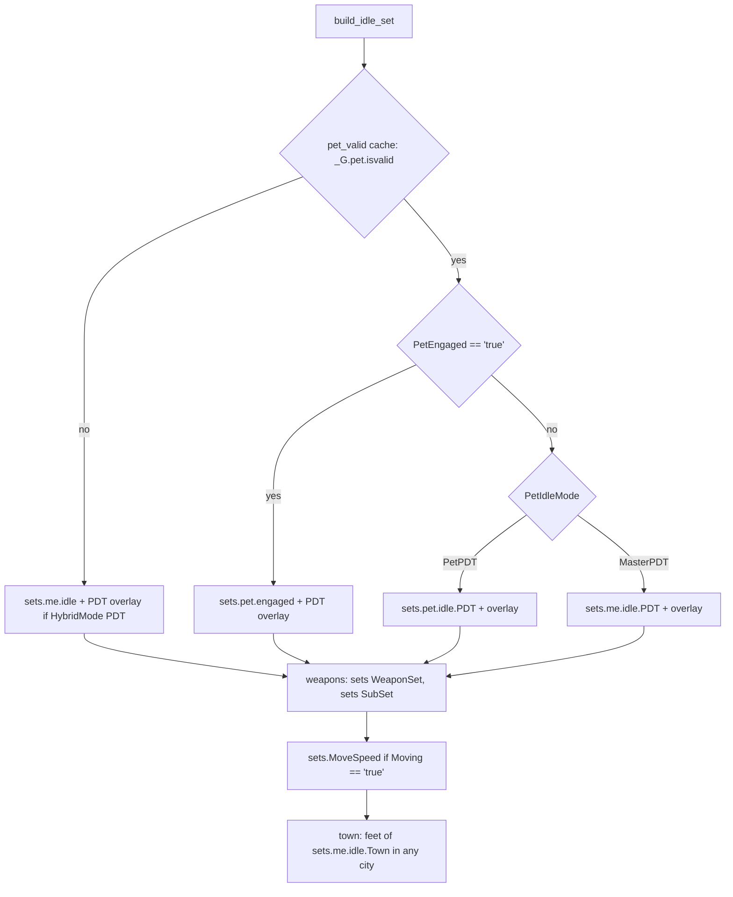

# BST (Beastmaster) job

The BST job area is 14 hook modules plus 4 logic modules under
`shared/jobs/bst/functions/` (2 639 lines), one entry point, eight config files
and one sets file. GearSwap loads it when the main job becomes BST
(`Tetsouo_BST.lua`). From then on Mote-Include calls its hooks on every action
(precast, midcast, aftercast, and the pet's own actions), on status and buff
changes, on `//gs c` commands and on state cycles.

What BST adds on top of the shared pipeline:

- **Jug selection by ecosystem and species**: two dynamic states
  (`state.species`, `state.ammoSet`) are rebuilt from the pet database every
  time the ecosystem or species changes, and the matching broth is forced into
  the ammo slot at Call Beast / Bestial Loyalty precast.
- **Ready moves**: a name-based categoriser splits them into Physical,
  PhysicalMulti, MagicAtk and MagicAcc. Precast wears the Ready-recast set,
  the player's aftercast switches to the category's pet damage set, and the
  pet's own aftercast returns to idle/engaged gear.
- **Pet-aware idle and engaged sets**: a set builder picks master sets, pet
  sets or a "both fighting" set from pet presence, `PetEngaged`,
  `PetIdleMode` and `HybridMode`.
- **A pet monitor** in the entry file that keeps `PetEngaged` in step with the
  pet and sends `/pet "Fight"` when auto-engage is on. The template and the live
  copy implement it differently (see [Pet monitor](#pet-monitor)).
- **Commands**: ecosystem/species cycling, broth count, `pet engage|disengage`,
  `rdylist` and `rdymove N` (numbered Ready moves with an automatic
  Fight/Heel sequence).
- **BST-HUD**: the external `BST-HUD` addon is unloaded and reloaded on every
  BST load and unloaded on `file_unload`.

Every file in scope was read in full except the gear content of the sets files
(structure and set names only; gear choice is out of scope). All line numbers
refer to the working tree on 2026-09-19. GearSwap engine and Mote-Include line
numbers refer to `D:\Windower Tetsouo\addons\GearSwap\` (outside the repo).

## Files

| Path | Lines | Role |
|------|------:|------|
| `_master/entry/Tetsouo_BST.lua` | 431 | Entry point (template): config preload, `get_sets`, `user_setup`, `job_update`, `init_gear_sets`, `job_sub_job_change`, coroutine pet monitor, `file_unload` |
| `shared/jobs/bst/functions/bst_functions.lua` | 117 | Facade: includes the 13 hook files, requires `dualbox_manager` (105) |
| `shared/jobs/bst/functions/BST_PRECAST.lua` | 189 | `job_precast` / `job_post_precast`: guard, cooldown (skipped for Ready moves), WS, summon broth, Ready-move marking |
| `shared/jobs/bst/functions/BST_MIDCAST.lua` | 201 | `job_midcast` (no-op returns) / `job_post_midcast`: subjob magic through `MidcastManager` |
| `shared/jobs/bst/functions/BST_AFTERCAST.lua` | 139 | `job_aftercast`: pet damage set for Ready moves that were not interrupted, delayed `start_pet_monitoring`; dead `monitor_pet_after_command` |
| `shared/jobs/bst/functions/BST_PET_PRECAST.lua` | 103 | `job_pet_precast`: never called (no such hook in Mote or GearSwap) |
| `shared/jobs/bst/functions/BST_PET_MIDCAST.lua` | 73 | `job_pet_midcast`: returns without doing anything |
| `shared/jobs/bst/functions/BST_IDLE.lua` | 43 | `customize_idle_set` -> `SetBuilder.build_idle_set` |
| `shared/jobs/bst/functions/BST_ENGAGED.lua` | 43 | `customize_melee_set` -> `SetBuilder.build_engaged_set` |
| `shared/jobs/bst/functions/BST_STATUS.lua` | 19 | `job_status_change = LifecycleManager.status_change()` |
| `shared/jobs/bst/functions/BST_BUFFS.lua` | 19 | `job_buff_change = LifecycleManager.buff_change()` |
| `shared/jobs/bst/functions/BST_COMMANDS.lua` | 490 | `job_self_command` router; `job_state_change = LifecycleManager.state_change()` |
| `shared/jobs/bst/functions/BST_MOVEMENT.lua` | 49 | Empty `job_handle_equipping_gear` |
| `shared/jobs/bst/functions/BST_LOCKSTYLE.lua` | 47 | Lazy `LockstyleManager.create('BST', ...)` wrappers |
| `shared/jobs/bst/functions/BST_MACROBOOK.lua` | 42 | Lazy `MacrobookManager.create('BST', ...)` wrapper |
| `shared/jobs/bst/functions/logic/ecosystem_manager.lua` | 253 | Rebuilds `state.species` / `state.ammoSet`, broth "equip", jug count |
| `shared/jobs/bst/functions/logic/pet_manager.lua` | 316 | Pet-valid cache, auto-engage, engage/disengage, Ready-move list (30 s cache), `monitor_pet_status` |
| `shared/jobs/bst/functions/logic/ready_move_categorizer.lua` | 282 | Four name lists (`S{}`) covering the 120 Ready moves, `get_category`, `_G.pet*Moves` exports |
| `shared/jobs/bst/functions/logic/set_builder.lua` | 222 | Idle/engaged set construction (pet vs master, PDT overlays, weapons, movement, town feet) |
| `_master/config/bst/BST_STATES.lua` | 77 | `BSTStates.configure()` |
| `_master/config/bst/BST_KEYBINDS.lua` | 137 | 8 binds, `bind_all` / `unbind_all` / `show_intro` |
| `_master/config/bst/BST_LOCKSTYLE.lua` | 65 | Lockstyle 6 (`default`, `by_subjob`, `get_style`) |
| `_master/config/bst/BST_MACROBOOK.lua` | 62 | Book/page per subjob and per dual-box partner job |
| `_master/config/bst/BST_PET_DATA.lua` | 180 | 25 jug pets (broth, species, ecosystem, job) and three list getters -> `_G.BSTBeastPetData` |
| `_master/config/bst/BST_TP_CONFIG.lua` | 170 | Moonshade piece, Fencer bonus -> `_G.BSTTPConfig` |
| `_master/config/bst/BST_ECOSYSTEM_DATA.lua` | 178 | Ecosystem correlation matrix; **no reader anywhere** |
| `_master/Tetsouo/config/bst/BST_REFILL.lua` | 36 | Refill list overlay (Pet Food Theta, medicines, food) |
| `_master/sets/bst_sets.lua` | 818 | Template sets (flat) |
| `shared/utils/messages/formatters/jobs/message_bst.lua` + `data/jobs/bst_messages.lua` | 546 + 306 | BST chat messages; 30 of the facade wrappers (`message_formatter.lua:359-426`) have no caller |
| `shared/data/job_abilities/BST_JA_DATABASE.lua` + `bst/*.lua` (5 files) | 17 + 293 | `JA_DATABASE_FACTORY.create('BST', {modules = {subjob, mainjob, pet_commands_mainjob, pet_commands_subjob, sp}})`, read by `ability_message_handler.lua:81` |

Live copies (gitignored): `Tetsouo/Tetsouo_BST.lua` (381 lines) differs from
the template in 196 lines: a `prerender` pet monitor replaces the coroutine
loop (`:276-348`), the delayed monitor start has a job guard and a
`_G.start_pet_monitoring` guard (`:223-227`), `user_setup` requires
`dualbox_manager` (`:234`), `job_sub_job_change` no longer calls
`send_job_update` (`:264-273`), `job_update` calls `_G.LagDebugger`
(`:244`) and `init_gear_sets` includes `sets/bst/bst_sets.lua` (`:257`).
`Tetsouo/config/bst/*` is identical to the template except
`BST_MACROBOOK.lua` (book 11 instead of 12, different dual-box pages) and
`BST_STATES.lua:30` (`Ecosystem` default `Amorph` instead of `Aquan`);
`BST_REFILL.lua` is identical to the `_master/Tetsouo/` overlay.
`Tetsouo/sets/bst/{bst_sets,armor,capes,pets,weapons}.lua` are the modular live
sets (511 + 238 + 77 + 45 + 32 lines). `Kaories/` and `_master/Kaories/` have no
BST files.

## How it works

### Load sequence

GearSwap runs the entry chunk, then `get_sets()`. Mote-Include calls
`user_setup()` and `init_gear_sets()` from inside `include('Mote-Include.lua')`
(`Mote-Include.lua:170-175`), before `INIT_SYSTEMS` and before any BST hook file
exists. See [job change lifecycle](../architecture/job-change-lifecycle.md) for
the environment model.



`user_setup()` (`_master/entry/Tetsouo_BST.lua:116-226`):

1. `BSTStates.configure()` creates every state (see [Mote states](#mote-states)).
2. `EcosystemManager.initialize()` builds `state.species` and `state.ammoSet`
   from `state.Ecosystem` and schedules `equip_pet_broth()` 0.2 s later
   (`ecosystem_manager.lua:212-251`). It must run before the HUD so `species`
   exists when the HUD first reads it.
3. `pcall(require, 'Tetsouo/config/bst/BST_KEYBINDS')`, stored in the global
   `BSTKeybinds`, then `bind_all()` (8 binds, then `show_intro()`).
4. `KeybindUI.smart_init("BST", UIConfig.init_delay)`, `_G.KeybindUI` exported.
5. JobChangeManager gate (164-196): `select_default_lockstyle` /
   `select_default_macro_book` do not exist yet (the facade has not been
   included; `BST_KEYBINDS.show_intro` does not require them), so the `else`
   branch re-tests in a 0.2 s coroutine, then initialises JCM, applies the
   macro book and schedules the lockstyle after
   `LockstyleConfig.initial_load_delay`.
6. BST-HUD (201-216): bumps `_G.bst_hud_load_id`, then after 2 s sends
   `lua unload bst-hud` and after 1.5 s more `lua load bst-hud`, each step
   guarded by the counter and `player.main_job == 'BST'`.
7. Pet monitor start after 3 s (223-225, live 223-227).

The facade includes, in order: `message_buffs.lua` (24), `BST_PRECAST`,
`BST_MIDCAST`, `BST_AFTERCAST` (31-36), `BST_PET_PRECAST`, `BST_PET_MIDCAST`
(39-42), `BST_IDLE`, `BST_ENGAGED` (48-51), `BST_STATUS`, `BST_BUFFS` (57-60),
`BST_LOCKSTYLE`, `BST_MACROBOOK`, `BST_COMMANDS`, `BST_MOVEMENT` (67-72).
`BST_AFTERCAST` and `BST_PET_MIDCAST` require `pet_manager` and
`ready_move_categorizer` at include time (`BST_AFTERCAST.lua:18-29`,
`BST_PET_MIDCAST.lua:18-21`); the other logic modules load on first use.

AutoMove runs on BST. Nothing in the repo sets `_G.DISABLE_AUTOMOVE` today
(the only reader is `INIT_SYSTEMS.lua:202`); commit 0563ff9 (2026-07-29)
removed it from the BST template because `state.Moving` had no other writer,
and the live entry does not set it either.

### Precast

`job_precast` (`BST_PRECAST.lua:128-163`):



- The cooldown check is skipped for every `spell.type == 'Monster'` action
  (137-146). Ready moves share recast id 102, the charge timer
  (`res/job_abilities.lua`), which runs while charges remain, so
  `CooldownChecker` would cancel a move the game allows. Until 2026-09-19 the
  skip depended on the categoriser, and the 11 moves it did not know were
  cancelled that way.
- `ready_move_info` (70-80) only trusts the categoriser: a `'Default'` answer
  means "not a Ready move" for the Sic set and the category. The categoriser
  knows all 120 `Monster` entries of `res/job_abilities.lua`.
- `WSPrecastHandler.handle` returns true for anything that is not a
  weaponskill (`ws_precast_handler.lua:35-38`), so it is called for every
  action.
- `equip_for_summon` (87-113) equips `sets.precast.JA['Call Beast']`, then only
  the `ammo` of `sets[state.ammoSet.value]`. Mote's `default_precast` still runs
  afterwards (`job_precast` never sets `handled`, `Mote-Include.lua:253-265`)
  and re-equips `sets.precast.JA['Call Beast']`; the broth survives only because
  `summonSet` has no ammo (`_master/sets/bst_sets.lua:581-588`).
- `prepare_ready_move` (120-126) stores the category on the spell table. The
  same table reaches midcast (`flow.lua:428-431` passes
  `command_registry[ts].spell`), but aftercast receives a new table built from
  the action packet (`triggers.lua:218`, `:268`), which is why aftercast
  recomputes the category.
- Mote's default precast for a Ready move (`spell.type == 'Monster'`) falls
  back to `sets.precast.JA` itself (`Mote-Include.lua:646-654`), a table of
  named sets with no slot keys, so it equips nothing.
- `job_post_precast` (170-175) only calls `WSPrecastHandler.apply_tp_gear`.

### Ready moves and pet actions

A Ready move goes through two GearSwap action chains: the player's command,
then the pet's move.

```mermaid
sequenceDiagram
    participant P as Player command
    participant GS as GearSwap
    participant J as BST hooks
    participant Pet as Pet action
    P->>GS: /pet "Foot Kick" <me>
    GS->>J: precast: JA Sic set (Ready recast)
    GS->>J: midcast (same spell table): job_midcast/job_post_midcast return early
    GS->>J: aftercast (player's action packet): pet_<category>_moves or _ww set, handled = true
    Pet->>GS: pet readies (category 7) -> pet_midcast
    GS->>J: job_pet_midcast returns; Mote default equips sets.midcast.Pet ({})
    Pet->>GS: pet finishes -> pet_aftercast
    GS->>J: Mote default_pet_aftercast -> handle_equipping_gear (idle/engaged)
```

- Aftercast (`BST_AFTERCAST.lua:83-110`): only for `spell.type == 'Monster'`,
  not `spell.interrupted`, and a known category. A move the game refuses or
  interrupts comes back with `spell.interrupted` set
  (`triggers.lua:228-233,343-353`) and no pet aftercast follows, so it falls
  through to Mote's `default_aftercast`, which re-equips idle/engaged gear. `_ww` is chosen when `player.status == 'Engaged'`; in
  both sets files every `_ww` set is an alias of its non-`_ww` set
  (`_master/sets/bst_sets.lua:694-697`). `eventArgs.handled = true` stops
  Mote's `default_aftercast`, so the pet set stays on until the pet's
  aftercast.
- Pet hooks: GearSwap fires `pet_midcast` when the pet readies a move
  (`triggers.lua:284-289`) and `pet_aftercast` when it finishes; Mote maps them
  to `job_pet_midcast` / `default_pet_midcast` / `default_pet_aftercast`
  (`Mote-Include.lua:312-318`, `:342-348`). `job_pet_midcast`
  (`BST_PET_MIDCAST.lua:48-60`) returns without `handled`, so Mote equips
  `get_pet_midcast_set` = `sets.midcast.Pet`, which BST never defines (Mote's
  empty table, `Mote-Include.lua:119`): no change. The pet aftercast then
  rebuilds idle/engaged gear.
- There is no pet precast event in GearSwap or Mote, so `job_pet_precast`
  (`BST_PET_PRECAST.lua:27-90`) is never called. Reward, Killer Instinct and
  Spur get their gear from Mote's default precast (`sets.precast.JA[name]`).
- The ordering above (player aftercast before the pet readies) is what the code
  assumes; it has not been traced in game for this document.
- Every Ready move also reaches the ability message handler. The moves are in
  no JA database (the BST database has Ready/Sic/Fight/..., not the moves), so
  the lookup misses the main/sub databases and walks the other 19 plus the SMN
  spell database (`ability_message_handler.lua:134-152`). The per-job loads are
  memoised in a module-local table, so the cost is paid by the first Ready
  move after each load.

### Pet summon, jug selection, ecosystem

- `ecosystem` command -> `EcosystemManager.change_ecosystem()` (23-56): cycles
  `state.Ecosystem`, recreates `state.species` from
  `get_species_for_ecosystem` and `state.ammoSet` from
  `get_pets_for_ecosystem` (every pet of the ecosystem, not only the first
  species), schedules `equip_pet_broth()` 0.1 s later, prints the count and
  refreshes the HUD.
- `species` command -> `change_species()` (60-97): cycles `state.species`,
  recreates `state.ammoSet` from `get_pets_for_species`, schedules the broth,
  counts the jugs of that species in inventory and wardrobes 1-8
  (`count_species_jugs`, 151-207).
- List order comes from `pairs()` over the pet table
  (`BST_PET_DATA.lua:124,146,167`), not from definition order as the comments
  say. `species[1]` still matches `ammoSet[1]` because both lists are built by
  the same traversal and every species has exactly one pet in the data.
- `equip_pet_broth()` (102-126) calls `equip()` from a bare
  `coroutine.schedule` callback. `equip()` only stages into `equip_list`
  (`user_functions.lua:127-129`) and every event empties it on entry
  (`flow.lua:60`), so the broth is never put on by this path, although the
  "Equipping <broth> for <pet>" line is printed. The broth that matters is the
  one equipped in Call Beast precast.
- After Call Beast / Bestial Loyalty (and any `Monster` action that is not a
  categorised Ready move), `job_aftercast` schedules
  `_G.start_pet_monitoring()` 2 s later (`BST_AFTERCAST.lua:117-124`). The
  monitor is already running from `user_setup`, so this call is a no-op.
- Pet gain and loss: GearSwap fires `pet_change`, Mote's `pet_change`
  (`Mote-Include.lua:1048-1061`) calls `handle_equipping_gear` because BST
  defines no `job_pet_change`. BST defines no `job_pet_status_change` either,
  so the engine's pet status events do nothing; `PetEngaged` is driven only by
  the monitor.

### Pet monitor

**Live** (`Tetsouo/Tetsouo_BST.lua:284-348`): a `prerender` listener registered
through `windower.raw_register_event` (the sandbox's `user_windower`, so the
engine records it and unregisters it at the next load, `user_functions.lua:265-273`,
`refresh.lua:69-71`; `file_unload` also unregisters it). Throttled to once per
second (`os.clock`), inside a `pcall`:

1. `get_mob('pet')`; engaged means `pet.status == 1`.
2. Pet idle, player engaged (`get_player().status == 1`), `AutoPetEngage` On
   and no `_G.bst_rdymove_active`: `input /pet "Fight" <t>`.
3. `state.PetEngaged` set to the pet's status; on a change it sends
   `gs c update` (and notifies `_G.LagDebugger`).
4. Errors are printed with `print('[BST] Monitor error: ...')`.

It does not touch `state.Moving` (AutoMove owns it). Start: `user_setup`
schedules it after 3 s; the closure returns if the main job is no longer BST or
`_G.start_pet_monitoring` is nil, which is how a closure from a dying
environment (subjob change reloads after 0.5 s) is stopped. A second
`user_setup` in the same environment is harmless (`monitor_event_id` guard).

**Template** (`_master/entry/Tetsouo_BST.lua:277-398`): a
`coroutine.schedule` chain every 1 s (`smart_pet_monitor`, 291-379):

1. With a pet (`_G.pet.id`), `PetManager.monitor_pet_status()` then, unless a
   `rdymove` sequence is active, `PetManager.check_and_engage_pet(pet)`.
2. Without a pet, `PetEngaged` forced to `'false'`.
3. Movement: compares the player's position with the previous second and
   writes `state.Moving` (while idle), or forces it `'false'` (not idle), on
   top of AutoMove.
4. `gs c update` when `PetEngaged` or `Moving` changed, then reschedules.

The template monitor has three defects the live copy does not (see Known
issues): the chain stops for good when a tick arrives less than 1.0 s after the
previous check (297-300 return without rescheduling, and
`start_pet_monitoring` then refuses to restart because `pet_monitor_active` is
still true); `monitor_pet_status` tests `pet.isvalid` on a raw Windower mob
table, which never has that field, so it always resets `PetEngaged` to
`'false'` and `check_and_engage_pet` re-sends Fight every second while engaged;
and the delayed start in `user_setup` calls a global that `file_unload` has
already cleared.

### Midcast

Mote first runs `job_midcast` (`BST_MIDCAST.lua:58-85`). Its early returns for
pet commands and Ready moves do not set `handled`, so they change nothing: Mote's
`default_midcast` still equips `get_midcast_set`, which for abilities resolves
to the `sets.midcast` root (named sub-sets, no slot keys). Then
`job_post_midcast` (158-187):

- notifies `MidcastWatchdog` (it ignores non-magic, `midcast_watchdog.lua:165-179`);
- returns for a Ready move (`spell.ready_move_category`);
- dispatches Healing, Enhancing (with `MidcastManager.get_enhancing_target` and
  `ENHANCING_MAGIC_DATABASE.get_spell_family`), Enfeebling, Elemental and Blue
  Magic to `MidcastManager.select_set` (95-151).

No `sets.midcast['<skill>']` exists in either sets file, and `select_set`
returns false when the skill's base set is missing
(`midcast_manager.lua:619-629`). Subjob spells therefore get no midcast gear, and
no fast cast either (`sets.precast.FC` is Mote's empty table). See
[midcast and buffs](../systems/midcast-and-buffs.md).

### Aftercast, idle, engaged, status, buffs

- `job_aftercast` (`BST_AFTERCAST.lua:71-131`): watchdog notify, Ready-move
  pet set (above), delayed monitor start. Everything else falls to Mote's
  `default_aftercast`. The old `gs c update` is gone (129-130).
- `customize_idle_set` -> `SetBuilder.build_idle_set` (`set_builder.lua:125-136`):



- `with_pdt` (51-57) combines `sets.<group>.<situation>.PDT`, else
  `sets.<group>.PDT` (neither `sets.me.PDT` nor `sets.pet.PDT` exists; every
  specific `.PDT` does). With a pet out, `MasterPDT` and `PetPDT` start from a
  `.PDT` set whatever `HybridMode` says.
- The pet-valid flag comes from `PetManager.update_pet_mode(_G.pet)`, cached
  for 1.0 s (`pet_manager.lua:35`, `:59-71`). A rebuild within 1 s of the
  previous one reuses the old answer even if the pet appeared or vanished in
  between.
- `customize_melee_set` -> `build_engaged_set` (171-177): `engagedBoth` when
  the master is engaged and the pet is valid and engaged, else `sets.me.engaged`,
  with the PDT overlay, then weapons. The "pet only" branch (162-165) cannot
  run from here because Mote calls `customize_melee_set` only while the player
  is engaged; the idle builder covers that case with `sets.pet.engaged`.
- `job_status_change` / `job_buff_change` / `job_state_change` are the shared
  `LifecycleManager` handlers ([core lifecycle](../systems/core-lifecycle.md)).
  The state handler reads no name but `Moving` (description `Moving` on BST),
  so it acts the same whether it receives a state's key (`WeaponSet`) or its
  description (`Weapon`, what Mote passes).
- `job_handle_equipping_gear` (`BST_MOVEMENT.lua:38-41`) is empty.

## Mote states

Created by `BSTStates.configure()` (`_master/config/bst/BST_STATES.lua:16-75`) on
every `user_setup()`; `species` and `ammoSet` are created by `EcosystemManager`.
Keybinds from `BST_KEYBINDS.lua:28-52`; `^` = Ctrl, `#` = Apps. The file's
comments say "Alt+Numbers (!5,!6)" (5, 26-27, 43) but every bind uses `^`.

| State | Values | Default | Key | Read by |
|-------|--------|---------|-----|---------|
| `AutoPetEngage` | Off, On | On | `^numpad4` | live monitor (`Tetsouo/Tetsouo_BST.lua:310-313`); template via `check_and_engage_pet` (`pet_manager.lua:139`) |
| `PetIdleMode` | MasterPDT, PetPDT | MasterPDT | `^numpad3` | `set_builder.lua:73` |
| `Ecosystem` | Aquan, Beast, Amorph, Bird, Lizard, Plantoid, Vermin | Aquan (live: Amorph) | `^numpad5` (`gs c ecosystem`) | `ecosystem_manager`; HUD readiness anchor (`ui_lifecycle.lua:42-43`) |
| `species` (dynamic) | species of the ecosystem | first in `pairs` order | `^numpad6` (`gs c species`) | `ecosystem_manager`, HUD |
| `ammoSet` (dynamic) | pet names | first in `pairs` order | none | `BST_PRECAST.lua:100`, `equip_pet_broth` |
| `PetEngaged` | 'false', 'true' (strings) | 'false' | none | `set_builder.lua:68,154`; written by the monitor, `engage_pet`/`disengage_pet` |
| `WeaponSet` | Aymur, Tauret | Aymur | `^numpad1` | `set_builder.lua:94` (`sets[value]`) |
| `SubSet` | Agwu's Axe, Adapa Shield, Diamond Aspis, Kraken Club | Agwu's Axe | `^numpad2` | `set_builder.lua:98` |
| `HybridMode` | PDT, Normal | PDT | `^numpad9` | `set_builder.lua:31` (idle and engaged) |
| `Moving` | 'false', 'true' | 'false' | none | AutoMove (reuses this state, `automove.lua:126-128`), `set_builder.lua:110`; the template monitor also writes it |
| `FastCast` | 0..80 step 10 | 0 | none | `MidcastWatchdog` |
| `AutoMedicine` | shared On/Off | persisted | `#numpad0` | `AutoMedicine.init(state, M)` (`BST_STATES.lua:71-74`) |

The `Moving` comment (`BST_STATES.lua:48-50`) still says AutoMove is disabled
for BST and to toggle it by hand; that stopped being true in 0563ff9. The HUD
patterns in `UI_DISPLAY_BUILDER.lua:26,40,44` match the current names
(`Ecosystem`, `species`, `WeaponSet`, `SubSet`, `PetIdleMode`,
`AutoPetEngage`).

## Commands

`job_self_command` (`BST_COMMANDS.lua:140-475`) lowercases the first word and
tests, in order: dual-box internals, `ui`, `debugmidcast`, `debugprecast`,
`cyclestate`, watchdog, **CommonCommands** (built-in names and warp aliases
only), then BST commands. A name none of them answers goes to Mote, whose last
lookup is the dual-box partner's alt config. No BST command name appears in any
`config/alt/*_ALT_COMMANDS.lua`. See
[commands and debug](../systems/commands-and-debug.md#4-alt-commands-and-name-shadowing).

| Command | Effect | Handler |
|---------|--------|---------|
| `altjobupdate <job> <sub> ...` / `requestjob` | Dual-box job exchange | 154-170 |
| `ui ...` | HUD commands | 176-180 |
| `debugmidcast` | Toggle `MidcastManager` debug | 185-195 |
| `debugprecast` | Toggle `_G.BST_DEBUG_PRECAST` (summon and pet-precast traces). Shadows the common `debugprecast` (`COMMON_COMMANDS.lua:567-576`), which BST never reaches | 197-207 |
| `cyclestate <State>` | `CycleHandler.handle_cyclestate` (used by all state keybinds) | 216-221 |
| common commands | `reload`, `checksets`, `wa`, `wo`, `refill`, `am`, `alt*`, `lockstyle`, warp commands, ... | 238-247 -> `CommonCommands.handle_command(command, 'BST', table.unpack(args))` |
| `ecosystem` | `EcosystemManager.change_ecosystem()` | 253-261 |
| `species` | `EcosystemManager.change_species()` | 263-271 |
| `broth` / `broths` | Count items whose name contains "Broth" in inventory only (misses Crumbly Soil, Aged Humus, Gassy Sap, Windy Greens, T. Pristine Sap); no footer separator | 96-130, 273-277 |
| `pet engage` / `pet disengage` | `/pet "Fight" <t>` / `/pet "Heel" <me>` and set `PetEngaged` | 283-315 |
| `rdylist` | List the current pet's Ready moves, numbered by ability id | 321-356 |
| `rdymove N` | Pet engaged: `/pet "<move>" <me>`. Pet idle, player engaged: `Fight <stnpc>`, move after 3.5 s, `_G.bst_rdymove_active` for 4.5 s. Both idle: `Fight <stnpc>`, move after 3.5 s, `Heel` after 6 s, flag for 6.5 s | 358-474 |

`PetManager.update_ready_moves` (`pet_manager.lua:203-255`) takes every id in
`windower.ffxi.get_abilities().job_abilities` with type `Monster` and id 640-899
(the moves are 672-798 in `res/job_abilities.lua`), sorted by id, and caches the
list for 30 s without keying it on the pet.

## Set names the code looks up

T = `_master/sets/bst_sets.lua`, L = `Tetsouo/sets/bst/bst_sets.lua` (plus
`weapons.lua`, `pets.lua` merged into `sets` at `bst_sets.lua:55-65`).

| Set | Looked up by | T | L |
|-----|--------------|---|---|
| `sets.idle`, `sets.engaged` | Mote base (fallback only) | 441, 501 | 152, 217 |
| `sets.me.idle`, `.PDT`, `.Town` (feet only used) | `set_builder.lua:79,87,117-119` | 442-444 | 153-155 |
| `sets.pet.idle`, `.PDT` | `set_builder.lua:74` | 453, 469 | 160, 176 |
| `sets.me.engaged`, `.PDT` | `set_builder.lua:158,167` | 486, 504 | 192, 206 |
| `sets.pet.engaged`, `.PDT` (built from `sets.pet.idle`) | `set_builder.lua:69,163` | 516, 533 | 220, 237 |
| `sets.pet.engagedBoth`, `.PDT` | `set_builder.lua:158` | 544, 561 | 248, 251 |
| `sets.me.PDT`, `sets.pet.PDT` | `with_pdt` fallback | absent (never needed) | absent |
| `sets['Aymur']`, `['Tauret']`, `["Agwu's Axe"]`, `['Adapa Shield']`, `['Diamond Aspis']`, `['Kraken Club']` | `set_builder.lua:94-99` | 211-217 | `weapons.lua:22-30` |
| `sets['Blur Knife']` | nothing (not a `SubSet` value) | 214 | `weapons.lua:27` |
| `sets['<pet name>']` x 25 (ammo only) | `BST_PRECAST.lua:100`, `equip_pet_broth` | 220-244 (all 25 match `BST_PET_DATA`) | `pets.lua:19-43` |
| `sets.precast.JA['Call Beast']`, `['Bestial Loyalty']` (`summonSet`, no ammo) | `equip_for_summon`, Mote default | 602-603 | 287-288 |
| `sets.precast.JA['Sic']`, `['Ready']` (alias) | `prepare_ready_move`, Mote default | 596, 601 | 281, 286 |
| `sets.precast.JA['Reward']`, `['Killer Instinct']`, `['Spur']` | Mote default precast | 606, 623, 630 | 291, 308, 315 |
| `sets.precast.JA['Misc Idle']`, `['Default']` | nothing in BST (only `PUP_PET_PRECAST`) | 636, 640 | 321, 325 |
| `sets.midcast.pet_{physical,physicalMulti,magicAtk,magicAcc}_moves` and `_ww` aliases | `BST_AFTERCAST.lua:93-101` | 647-697 | 334-387 |
| `sets.midcast.Pet` | Mote `default_pet_midcast` | absent (Mote `{}`) | absent |
| `sets.precast.WS`, `['Primal Rend']`, `['Decimation']`, `['Bora Axe']`, `['Calamity']`, `.TPBonus` variants | Mote default precast, TP bonus | 705-800 | 394-491 |
| `sets.MoveSpeed` | `set_builder.lua:110` | 807 | 498 |
| `sets.buff.Doom` | shared DoomManager | 813 | 504 |
| `sets.midcast['Healing Magic']` / Enhancing / Enfeebling / Elemental / Blue | `MidcastManager` base set | **absent** | **absent** |
| `sets.precast.FC` | Mote default precast (magic) | absent (Mote `{}`) | absent |

Both sets files also assign the globals `petPhysicalMoves`,
`petPhysicalMultiMoves`, `petMagicAtkMoves`, `petMagicAccMoves` (T 251-381,
L 72-122). The categoriser overwrites them at load
(`ready_move_categorizer.lua:277-280`, loaded after the sets through
`BST_AFTERCAST.lua:26`) and nothing reads the globals. The 11 moves the
categoriser lacked until 2026-09-19 were given the category these lists give
them (Frenzied Rage, in none of them, went with `Rage`); the two sources still
disagree on several older moves.

## Configuration

| File / key | Default | Where the default lives | Read by |
|------------|---------|-------------------------|---------|
| `<char>/config/bst/BST_STATES.lua` | see states | file | entry `user_setup` (path hard-coded `Tetsouo/...`, replaced by the clone script) |
| `<char>/config/bst/BST_KEYBINDS.lua` | 8 binds | file | entry `user_setup`, `file_unload` |
| `<char>/config/bst/BST_LOCKSTYLE.lua` `default`, `by_subjob`, `get_style` | 6 everywhere | file (20-59); factory fallback 1 (`BST_LOCKSTYLE.lua:29`) | `LockstyleManager` ([factories](../systems/factories-and-helpers.md)) |
| `<char>/config/bst/BST_MACROBOOK.lua` `default`, `solo[sub]`, `dualbox[alt_job][sub]` | template book 12 page 1 (GEO/DNC 13, COR/DNC 14); live book 11 | file (20-56); factory fallback book 1 page 1 | `MacrobookManager` |
| `<char>/config/bst/BST_PET_DATA.lua` -> `_G.BSTBeastPetData` | 25 pets | file | `ecosystem_manager.lua` (`job` field unused) |
| `<char>/config/bst/BST_TP_CONFIG.lua` -> `_G.BSTTPConfig` | Moonshade 250, `fencer_jp_gifts = 4` | file | `WSPrecastHandler` -> `tp_bonus_calculator.lua:73-115` |
| `<char>/config/bst/BST_ECOSYSTEM_DATA.lua` | correlation matrix | file | **nothing** |
| `<char>/config/bst/BST_REFILL.lua` (overlay `_master/Tetsouo/`) | medicines, Pet Food Theta (`all`), food; DNC variant | file | refill system |
| `Tetsouo/config/LOCKSTYLE_CONFIG.lua` | `initial_load_delay 8` | entry fallback 21-25 | entry |
| `Tetsouo/config/RECAST_CONFIG.lua`, `REGION_CONFIG.lua`, `UI_CONFIG.lua` | - | shared | entry |

`get_fencer_bonus` (`BST_TP_CONFIG.lua:97-161`) treats any sub item as
dual-wielding under /NIN or /DNC, shields included, although its comment says a
shield keeps Fencer active.

## State & lifetime

- Module state (sandbox, dies on every load): PetManager caches (pet mode 1 s,
  pet status 0.5 s, Ready moves 30 s), `last_monitor_time`; lazy-load locals;
  the live monitor's `monitor_event_id`, `last_check`, `prev_pet_eng`; the
  template monitor's `pet_monitor_active`, `last_position`, `previous_states`.
- `_G` written: the Mote hooks (`job_precast`, `job_post_precast`,
  `job_midcast`, `job_post_midcast`, `job_aftercast`, `job_pet_precast`,
  `job_pet_midcast`, `job_status_change`, `job_buff_change`,
  `customize_idle_set`, `customize_melee_set`, `job_self_command`,
  `job_state_change`, `job_handle_equipping_gear`), `BSTBeastPetData`,
  `BSTTPConfig`, `BSTKeybinds`, `KeybindUI`, `LockstyleConfig`, `UIConfig`,
  `RECAST_CONFIG`, `RegionConfig`, `BST_DEBUG_PRECAST`, `bst_rdymove_active`,
  `bst_hud_load_id`, `start_pet_monitoring`, `stop_pet_monitoring`,
  `petPhysicalMoves` (and the three other lists), `select_default_lockstyle`,
  `cancel_bst_lockstyle_operations`, `select_default_macro_book` plus the
  factory exports.
- Events: live only, one `prerender` listener, removed by `file_unload` and by
  the engine at the next load. The template registers none.
- Coroutines (never cancelled by the engine): 0.2 s JCM gate, 8 s lockstyle,
  2 s + 1.5 s HUD reload (counter-guarded), 3 s monitor start, 0.1-0.2 s broth
  equips, 2 s monitor start from aftercast, the `rdymove` steps (3.5 s, 4.5 s,
  6 s, 6.5 s), the template's 1 s monitor chain.
- `windower.*`: BST writes nothing. External addon `BST-HUD` stays loaded
  across `gs reload` and is unloaded by `file_unload`.
- Keybinds: bound in `user_setup`, unbound in `file_unload`.
- Subjob change: Mote runs `user_setup()` again in the old environment (states
  reset, ecosystem back to its default, HUD reload and monitor start scheduled),
  then `job_sub_job_change` -> `JobChangeManager.on_job_change` -> `gs reload`
  after 0.5 s. See [job change lifecycle](../architecture/job-change-lifecycle.md).

## Interactions

- Precast: `PrecastGuard`, `CooldownChecker`, `WSPrecastHandler` / TP bonus
  ([precast pipeline](../systems/precast-pipeline.md)).
- Midcast: `MidcastManager`, `MidcastWatchdog`
  ([midcast and buffs](../systems/midcast-and-buffs.md)); `BaseSetBuilder.is_in_town`.
- Movement: AutoMove ([factories and helpers](../systems/factories-and-helpers.md)).
- Messages: `message_bst` through the facade; `message_buffs`
  ([messages](../systems/messages.md)). `show_error_module_not_loaded` and the
  other `show_error_*` wrappers are also referenced by PUP.
- Lockstyle / macrobook factories, `JobChangeManager`, `LifecycleManager`, HUD
  ([UI overlay](../systems/ui-overlay.md)), `CommonCommands`, `CycleHandler`,
  dual-box ([dualbox](../systems/dualbox.md)). The template's
  `job_sub_job_change` still sends `DualBoxManager.send_job_update()`
  (`_master/entry/Tetsouo_BST.lua:262-266`); commit ba783ae says it removed
  that call from 10 templates, but its BST hunk only renamed `petEngaged`. The
  live entry has the new pattern.
- `PetManager` (`engage_pet`, `disengage_pet`, `get_ready_moves`) is also
  required, under a PUP path, by `PUP_COMMANDS.lua`.

## Invariants & gotchas

- `user_setup()` runs before the facade; anything it calls from the hook files
  must be deferred (the JCM gate and the monitor start are).
- `equip()` from a bare coroutine does nothing; use `send_command('gs c update')`
  (`equip_pet_broth` is the counter-example).
- The spell table is shared by precast and midcast but not by aftercast: carry
  data to aftercast by recomputing it, as `BST_AFTERCAST.lua:85` does.
- `PetEngaged`, `Moving` hold the strings `'true'`/`'false'`.
- Windower mob tables (`windower.ffxi.get_mob_by_target('pet')`) have no
  `isvalid`; only GearSwap's `pet` global does (`refresh.lua:245-257`).
- A `Monster` action is never cooldown-checked. One the categoriser does not
  know (a move added to the game later) gets no Sic set and no pet damage
  set.
- Returning from `job_midcast` without `eventArgs.handled` does not stop Mote's
  default midcast.
- Mote's default precast runs after `job_precast`; adding an ammo to
  `summonSet` would override the broth.
- With `AutoPetEngage` On, a manual Heel while engaged is undone within 1 s, and
  auto-engage uses `<t>` (whatever is targeted), not `<bt>`.
- `debugprecast` on BST toggles the BST flag, not the shared precast debug.

## Extending

- New Ready move: add it to the right list in `ready_move_categorizer.lua`
  (the name must match `res/job_abilities.lua` exactly). The sets-file lists are
  not read.
- New jug pet: add it to `BST_PET_DATA.lua` in both `_master/config/bst/` and
  the live copy, and add `sets['<exact pet name>'] = {ammo = '<broth>'}` to the
  sets (`pets.lua` for the live sets).
- New pet set situation: add a branch in `idle_with_pet` or
  `engaged_for_situation` and define the set in both sets files.
- Event-driven pet status: define `job_pet_status_change` (Mote calls it,
  `Mote-Include.lua:1068-1076`) instead of polling.
- New command: add a branch after the CommonCommands block. A name that is also an alt config key then runs here; the alt's
  version stays reachable as `//gs c alt <name>`.
- Any change to the entry: the live `Tetsouo/Tetsouo_BST.lua` has diverged;
  port it both ways.

## Known issues

- **Template pet monitor sends Fight every second while engaged** (P2,
  template only; P1 if deployed): `monitor_pet_status` tests `pet.isvalid` on a
  raw mob (`pet_manager.lua:284-292`), resets `PetEngaged` to `'false'`, then
  `check_and_engage_pet` sends `/pet "Fight" <t>` and a chat line
  (`pet_manager.lua:158-164`, `_master/entry/Tetsouo_BST.lua:309-316`). The same
  reset hides a fighting pet from the idle builder.
- **Template monitor chain can stop for good** (P2, template only, plausible):
  `smart_pet_monitor` returns without rescheduling when called < 1.0 s
  (`os.clock`) after the last check (`_master/entry/Tetsouo_BST.lua:297-300`),
  and `start_pet_monitoring` then refuses to restart (383-385).
- **Template delayed monitor start errors after every subjob change** (P3):
  the 3 s closure calls `start_pet_monitoring()` (223-225) after the 0.5 s
  reload's `file_unload` set it to nil (424).
- **Template monitor writes `state.Moving`** alongside AutoMove (328-356).
- **Live and template entries diverged** (196 lines, see [Files](#files)).
- **Categories of some Ready moves are unverified** (P3): `Fantod`,
  `Crossthrash`, `??? Needles` and `Needleshot` are Physical, `Aqua Breath`
  MagicAtk, `Geist Wall`, `Nihility Song`, `Digest`, `Rhino Guard`,
  `Water Wall` MagicAcc, as the sets-file lists place them; `Frenzied Rage` is
  in no list and was put next to `Rage` (MagicAcc buffs). The resources give no
  physical/magical field (`ready_move_categorizer.lua:24-179`).
- **Ready-move list is not keyed on the pet** (P3): after a pet swap, `rdylist`
  / `rdymove N` use the previous pet's moves for up to 30 s
  (`pet_manager.lua:203-210`).
- **Broth pre-equip never happens** (P3): `equip()` from a coroutine
  (`ecosystem_manager.lua:45-47,81-83,248-250`); the "Equipping" message is
  printed anyway.
- **Pet-valid cache can be stale on pet change** (P3, plausible): 1 s cache
  (`pet_manager.lua:35,63-65`) used by the rebuild that `pet_change` triggers.
- **Aftercast monitor start can error after a reload** (P3): the 2 s closure
  calls `_G.start_pet_monitoring()` without re-checking it
  (`BST_AFTERCAST.lua:119-123`); `file_unload` sets it to nil.
- `BST_MIDCAST.lua:46` calls the undefined
  `MessageFormatter.error_bst_module_not_loaded` if the categoriser fails to
  load, and `modules_loaded` is then never set.
- First Ready move after each load loads every JA database
  (`ability_message_handler.lua:134-152`).
- `debugprecast` shadows the common command (`BST_COMMANDS.lua:197`).
- `broth` counts only items named "...Broth" in inventory (`BST_COMMANDS.lua:109-116`).
- Stale comments: `BST_STATES.lua:48-50` (AutoMove), `BST_KEYBINDS.lua:5,26-27,43`
  (Alt binds), `BST_PET_DATA.lua:122-123,144-145` and
  `ecosystem_manager.lua:240` (list order), `BST_PRECAST.lua:82-86` (summon set
  ammo), `BST_MIDCAST.lua:65,81` (midcast skip).
- Dead code: `job_pet_precast` (whole `BST_PET_PRECAST.lua`),
  `monitor_pet_after_command`, `PetManager.get_pet_status` / `is_pet_valid`,
  `SetBuilder.should_use_pet_sets` / `is_pet_engaged` / `get_current_mode`,
  `EcosystemManager.cycle_ammo`, `ReadyMoveCategorizer.is_physical` /
  `is_magical` / `get_midcast_set_name` / `get_category_counts` and the
  `_G.pet*Moves` exports, `BST_ECOSYSTEM_DATA.lua`, the sets-file move lists,
  `sets.precast.JA['Misc Idle']` / `['Default']`, 30 BST message wrappers.
- `core-lifecycle.md:351` says BST/PUP set `_G.DISABLE_AUTOMOVE`; neither does.
- User doc out of date (`docs/user/jobs/bst/states.md`: lowercase state names,
  number-key binds, AutoMove disabled, missing `species`/`ammoSet`/`AutoMedicine`,
  `BST_ECOSYSTEM_DATA` described as used, "pet ability data").
