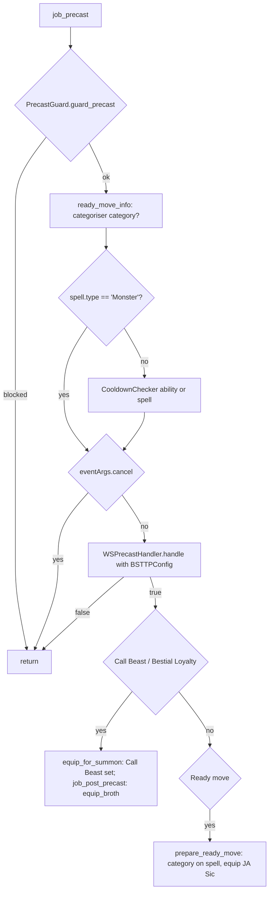
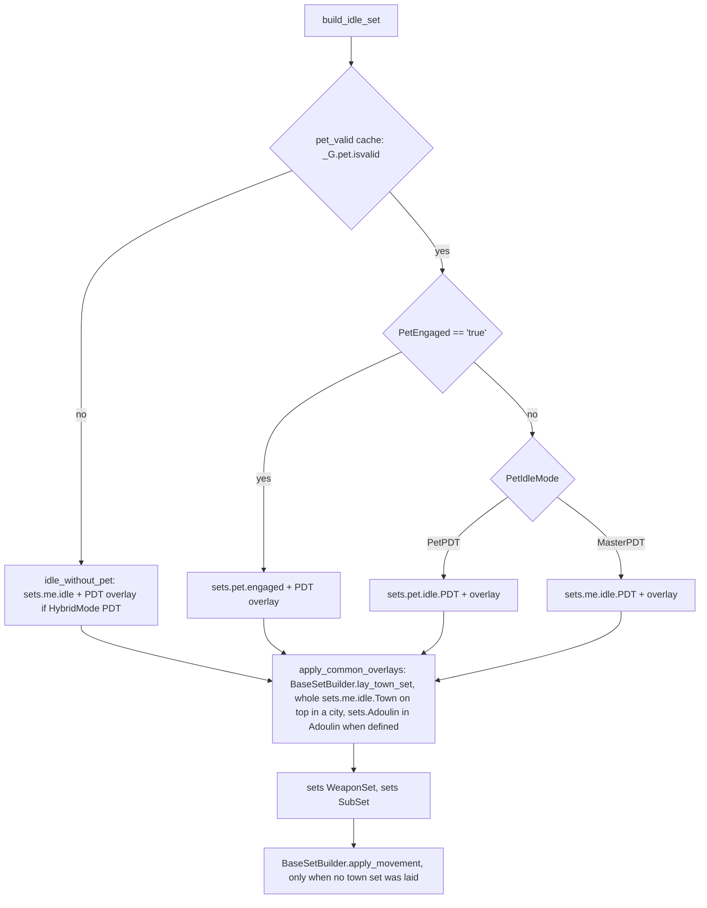

# BST (Beastmaster) job

The BST job area is 14 hook modules plus 4 logic modules under
`shared/jobs/bst/functions/` (about 2 600 lines), one entry point, nine config
files and one sets file. GearSwap loads it when the main job becomes BST
(`<Char>/<Char>_BST.lua`, template `_master/entry/Tetsouo_BST.lua`). From then
on Mote-Include calls its hooks on every action (precast, midcast, aftercast,
and the pet's own actions), on status and buff changes, on `//gs c` commands and
on state cycles.

What BST adds on top of the shared pipeline:

- **Jug selection by ecosystem and species**: two dynamic states
  (`state.species`, `state.ammoSet`) are rebuilt from the pet database every
  time the ecosystem or species changes, and the matching broth is put into the
  ammo slot at Call Beast / Bestial Loyalty precast.
- **Ready moves**: a name-based categoriser splits the 120 moves into Physical,
  PhysicalMulti, MagicAtk and MagicAcc. Precast wears the Ready-recast set
  (`sets.precast.JA['Sic']`), the player's aftercast switches to the category's
  pet damage set, and the pet's own aftercast returns to idle/engaged gear.
- **Pet-aware idle and engaged sets**: a set builder picks master sets, pet
  sets or a "both fighting" set from pet presence, `PetEngaged`,
  `PetIdleMode` and `HybridMode`.
- **A pet monitor** in the entry file (a throttled `prerender` listener) that
  keeps `PetEngaged` in step with the pet and sends `/pet "Fight"` when
  auto-engage is on (see [Pet monitor](#pet-monitor)).
- **Commands**: ecosystem/species cycling, broth count, `pet engage|disengage`,
  `rdylist` and `rdymove N` (numbered Ready moves with an automatic
  Fight/Heel sequence).
- **BST-HUD**: the external `BST-HUD` addon is unloaded and reloaded on every
  BST load and unloaded on `file_unload`, unless `['bst-hud'] = false` in
  `_common/display/ADDONS_CONFIG.lua` ([JobAddons](../systems/factories-and-helpers.md#jobaddons-sharedutilscorejob_addonslua)).

Player pages: [docs/user/jobs/bst/README.md](../../user/jobs/bst/README.md)
(hub), [states.md](../../user/jobs/bst/states.md),
[sets.md](../../user/jobs/bst/sets.md).

Every file in scope was read in full except the gear content of the sets files
(structure and set names only). References are file + function; GearSwap engine
and Mote-Include files are in `addons/GearSwap/` and `addons/GearSwap/libs/`
(outside the repository). Re-verified against the working tree on 2026-09-28;
idle overlays of `logic/set_builder.lua` re-read on 2026-09-29.

## Files

| Path | Lines | Role |
|------|------:|------|
| `_master/entry/Tetsouo_BST.lua` | 399 | Entry point (template): config preload, `get_sets`, `user_setup`, `job_update`, `init_gear_sets`, `job_sub_job_change`, `prerender` pet monitor (`start_pet_monitoring` / `stop_pet_monitoring`), `file_unload` |
| `shared/jobs/bst/functions/bst_functions.lua` | 110 | Facade: includes `message_buffs.lua` and the 13 hook files, requires `dualbox_manager` for its auto-init |
| `shared/jobs/bst/functions/BST_PRECAST.lua` | 202 | `job_precast` / `job_post_precast`; locals `ready_move_info`, `equip_for_summon`, `equip_broth`, `prepare_ready_move` |
| `shared/jobs/bst/functions/BST_MIDCAST.lua` | 204 | `job_midcast` (early returns, no `handled`) / `job_post_midcast` (subjob magic through `MidcastManager`, table `JOB_POST_MIDCAST_HANDLERS`) |
| `shared/jobs/bst/functions/BST_AFTERCAST.lua` | 112 | `job_aftercast`: pet damage set for Ready moves that were not interrupted, delayed `start_pet_monitoring` |
| `shared/jobs/bst/functions/BST_PET_PRECAST.lua` | 105 | `job_pet_precast`: never called (no such hook in Mote or GearSwap; the file header says so) |
| `shared/jobs/bst/functions/BST_PET_MIDCAST.lua` | 57 | `job_pet_midcast`: returns without doing anything |
| `shared/jobs/bst/functions/BST_IDLE.lua` | 41 | `customize_idle_set` -> `SetBuilder.build_idle_set` |
| `shared/jobs/bst/functions/BST_ENGAGED.lua` | 41 | `customize_melee_set` -> `SetBuilder.build_engaged_set` |
| `shared/jobs/bst/functions/BST_STATUS.lua` | 20 | `job_status_change = LifecycleManager.status_change()` |
| `shared/jobs/bst/functions/BST_BUFFS.lua` | 19 | `job_buff_change = LifecycleManager.buff_change()` |
| `shared/jobs/bst/functions/BST_COMMANDS.lua` | 479 | `job_self_command` router, local `display_broth_count`; `job_state_change = LifecycleManager.state_change()` |
| `shared/jobs/bst/functions/BST_MOVEMENT.lua` | 41 | Empty `job_handle_equipping_gear` |
| `shared/jobs/bst/functions/BST_LOCKSTYLE.lua` | 49 | Lazy `LockstyleManager.create('BST', 'bst/display/BST_LOCKSTYLE', 1, 'SAM')` wrappers |
| `shared/jobs/bst/functions/BST_MACROBOOK.lua` | 43 | Lazy `MacrobookManager.create('BST', 'bst/display/BST_MACROBOOK', 'SAM', 1, 1)` wrapper |
| `shared/jobs/bst/functions/logic/ecosystem_manager.lua` | 241 | `initialize`, `change_ecosystem`, `change_species`, `equip_pet_broth`, `count_species_jugs` |
| `shared/jobs/bst/functions/logic/pet_manager.lua` | 170 | Pet-valid cache (`update_pet_mode` / `get_pet_mode`), `engage_pet` / `disengage_pet`, Ready-move list (`update_ready_moves`, 30 s cache) |
| `shared/jobs/bst/functions/logic/ready_move_categorizer.lua` | 217 | Four `S{}` name lists (47 + 9 + 22 + 42 = the 120 `Monster` entries of `res/job_abilities.lua`), `get_category`, `_G.pet*Moves` exports |
| `shared/jobs/bst/functions/logic/set_builder.lua` | 193 | `build_idle_set`, `build_engaged_set`; locals `wants_pdt`, `pdt_overlay`, `with_pdt`, `idle_with_pet`, `idle_without_pet`, `apply_weapon_sets`, `apply_common_overlays`, `engaged_for_situation` |
| `_master/config/bst/BST_STATES.lua` | 77 | `BSTStates.configure()` |
| `_master/config/bst/BST_KEYBINDS.lua` | 48 | 7 binds, data only; `KeybindManager.create('BST', ...)` adds `bind_all` / `unbind_all` / `show_intro` (see [keybinds and custom states](../systems/keybinds-and-custom.md)) |
| `_master/config/bst/BST_CUSTOM.lua` | 119 | Player modes and gear rules (all examples commented out), read through `KeybindManager` |
| `_master/config/bst/BST_HUD.lua` | 31 | Per-job HUD section / row order (empty) |
| `_master/config/bst/BST_LOCKSTYLE.lua` | 65 | Lockstyle 6 (`default`, `by_subjob`, `get_style`) |
| `_master/config/bst/BST_MACROBOOK.lua` | 61 | Book 12 page 1; `dualbox` GEO/DNC 13, COR/DNC 14, RDM/DNC 12 |
| `_master/config/bst/BST_PET_DATA.lua` | 179 | 25 jug pets (broth, species, ecosystem, job), `ecosystems` index, three list getters -> `_G.BSTBeastPetData` |
| `_master/config/bst/BST_TP_CONFIG.lua` | 172 | Moonshade piece, `fencer_jp_gifts`, `get_weapon_bonus`, `get_fencer_bonus` -> `_G.BSTTPConfig` |
| `_master/config/bst/BST_ECOSYSTEM_DATA.lua` | 178 | Ecosystem correlation matrix; **no reader anywhere** (its header says so) |
| `_master/config/bst/BST_REFILL.lua` | 42 | Refill list, every line commented (`extra`, `default`, `subjobs` examples): `//gs c rf` uses the common list of `REFILL_CONFIG.lua` until one is uncommented |
| `_master/Tetsouo/bst/inventory/BST_REFILL.lua`, `BST_MACROBOOK.lua`, `BST_STATES.lua` | 36, 61, 77 | Character overlay: refill list; book 11; `Ecosystem` default Amorph |
| `_master/Tetsouo/entry/Tetsouo_BST.lua` | 400 | Character overlay entry: the template plus `LagDebugger.on_job_update()` in `job_update` and the modular sets path |
| `_master/sets/bst_sets.lua` | 834 | Template sets (flat) |
| `shared/utils/messages/formatters/jobs/message_bst.lua` + `data/jobs/bst_messages.lua` | 546 + 271 | BST chat messages; several facade wrappers have no caller (see the [catalog](../systems/messages-catalog.md)) |
| `shared/data/job_abilities/BST_JA_DATABASE.lua` + `bst/*.lua` (5 files) | 17 + 293 | `JA_DATABASE_FACTORY.create('BST', ...)` with `subjob`, `mainjob`, `pet_commands_mainjob`, `pet_commands_subjob`, `sp`; read by `ability_message_handler.lua` |

Live copies (gitignored): the live BST entry is the overlay entry above. The
live `bst/*` files differ from the template only in their header
(`@author`, `@file`) and in the two overlay files (`BST_MACROBOOK`,
`BST_STATES`). The live sets are modular
(`<Char>/bst/{bst_sets,armor,capes,pets,weapons}.lua`), mirrored in
`_master/Tetsouo/bst/`. No other character overlay has BST files.

## How it works

### Load sequence

GearSwap runs the entry chunk, then `get_sets()`. Mote-Include calls
`user_setup()` and `init_gear_sets()` from inside `include('Mote-Include.lua')`
(`Mote-Include.lua` `init_include`), before `INIT_SYSTEMS` (the next line of
`get_sets`) and before any BST hook file exists. See
[job change lifecycle](../architecture/job-change-lifecycle.md) for the
environment model.

```mermaid
sequenceDiagram
    participant GS as GearSwap
    participant E as <Char>_BST.lua
    participant M as Mote-Include
    participant F as bst_functions.lua
    GS->>E: run chunk (LOCKSTYLE_CONFIG, config_loader + UIConfig, JCM, UI_MANAGER, REGION_CONFIG; defines the monitor functions)
    GS->>E: get_sets()
    E->>E: _G.LockstyleConfig/UIConfig/RECAST_CONFIG/BSTBeastPetData/BSTTPConfig (plain require)
    E->>M: include Mote-Include
    M->>E: user_setup() (states, ecosystem, keybinds, UI, JCM gate, HUD reload, monitor start, dualbox require)
    M->>E: init_gear_sets() -> include sets file
    E->>E: INIT_SYSTEMS (AutoMove +0.5 s, hooks), data_loader, message hooks
    E->>E: JobChangeManager.cancel_all()
    E->>F: include bst_functions.lua
    F->>F: include 13 hook files, require dualbox_manager
    E->>E: register_lockstyle_cancel("BST", cancel_bst_lockstyle_operations)
```

`user_setup()`:

1. `BSTStates.configure()` creates every state (see [Mote states](#mote-states)).
2. `EcosystemManager.initialize()` builds `state.species` and `state.ammoSet`
   from `state.Ecosystem` and schedules `equip_pet_broth()` 0.2 s later. It
   must run before the HUD so `species` exists when the HUD first reads it.
3. `pcall(require, 'Tetsouo/bst/keys/BST_KEYBINDS')` (the clone script
   replaces `Tetsouo` with the character), stored in the global `BSTKeybinds`,
   then `bind_all()` (7 BST binds, the optional-state entries, `_CUSTOM` keys,
   common keys, then `show_intro()`). A failed require prints the Lua error.
4. `KeybindUI.smart_init("BST", UIConfig.init_delay)`; `_G.KeybindUI` exported
   (read by `ecosystem_manager`).
5. JobChangeManager gate: `bind_all()` -> `show_intro()` requires
   `BST_MACROBOOK` / `BST_LOCKSTYLE`, so `select_default_lockstyle` /
   `select_default_macro_book` already exist and the first branch runs:
   `JobChangeManager.initialize()`, the macro book, and the lockstyle after
   `LockstyleConfig.initial_load_delay` (8 s). The `else` branch (re-test in a
   0.2 s coroutine) remains as a fallback.
6. BST-HUD: bumps `_G.bst_hud_load_id`, then after 2 s sends
   `lua unload bst-hud` and after 1.5 s more `lua load bst-hud`, each step
   guarded by the counter and `player.main_job == 'BST'`, and first by
   `JobAddons.allowed('bst-hud')` (checked when the 2 s timer fires). `file_unload`
   sends the unload through `JobAddons.run('unload', 'bst-hud')`.
7. Pet monitor start after 3 s, guarded by the main job and
   `_G.start_pet_monitoring`.
8. `pcall(require, 'shared/utils/dualbox/dualbox_manager')`: the module's
   auto-init schedules the job exchange once per load (`request_alt_job` as
   MAIN, `send_job_update` as ALT). Covers main job changes;
   `job_sub_job_change` does not call it again.

The facade includes, in order: `message_buffs.lua`, `BST_PRECAST`,
`BST_MIDCAST`, `BST_AFTERCAST`, `BST_PET_PRECAST`, `BST_PET_MIDCAST`,
`BST_IDLE`, `BST_ENGAGED`, `BST_STATUS`, `BST_BUFFS`, `BST_LOCKSTYLE`,
`BST_MACROBOOK`, `BST_COMMANDS`, `BST_MOVEMENT`. `BST_AFTERCAST` and
`BST_PET_MIDCAST` require `pet_manager` / `ready_move_categorizer` at include
time; the other logic modules load on first use.

AutoMove runs on BST. Nothing in the repository sets `_G.DISABLE_AUTOMOVE`
(readers: `INIT_SYSTEMS.lua` and `system_checker.lua`); `state.Moving` has no
other writer, so disabling AutoMove would remove movement gear.

### Precast

`job_precast`:

```mermaid
flowchart TD
    A[job_precast] --> B{PrecastGuard.guard_precast}
    B -- blocked --> Z[return]
    B -- ok --> C[ready_move_info: categoriser category?]
    C --> D{spell.type == 'Monster'?}
    D -- no --> E[CooldownChecker ability or spell]
    D -- yes --> G
    E --> G{eventArgs.cancel}
    G -- yes --> Z
    G -- no --> H[WSPrecastHandler.handle with BSTTPConfig]
    H -- false --> Z
    H -- true --> I{Call Beast / Bestial Loyalty}
    I -- yes --> J[equip_for_summon: Call Beast set; job_post_precast: equip_broth]
    I -- no --> K{Ready move}
    K -- yes --> L[prepare_ready_move: category on spell, equip JA Sic]
```

- The cooldown check is skipped for every `spell.type == 'Monster'` action.
  Ready moves share recast id 102, the charge timer, which runs while charges
  remain, so `CooldownChecker` would cancel a move the game allows.
- `ready_move_info` only trusts the categoriser: a `'Default'` answer means
  "not a Ready move" for the Sic set and the category.
- `WSPrecastHandler.handle` returns true for anything that is not a
  weaponskill, so it is called for every action.
- `equip_for_summon` equips `sets.precast.JA['Call Beast']`. `job_precast`
  never sets `handled`, so Mote's `default_precast` runs after it and
  re-equips the Call Beast / Bestial Loyalty set; `job_post_precast` then
  calls `equip_broth` (the `ammo` of `sets[state.ammoSet.value]`), so the
  broth wins over any ammo of the summon set. Before 2026-09-28 the broth
  went on in `job_precast` and survived only because `summonSet` had no ammo.
- `prepare_ready_move` stores the category on the spell table. The same table
  reaches midcast (engine `flow.lua` `send_action` passes the registry's
  spell), but aftercast receives a new table built from the action packet
  (`triggers.lua`, the 0x028 parser), which is why aftercast recomputes the
  category.
- Mote's default precast for a Ready move (`spell.type == 'Monster'`) resolves
  to the `sets.precast.JA` table itself (`get_precast_set`), which has only
  named sub-sets and no slot keys, so it equips nothing over the Sic set.
- `job_post_precast` only calls `WSPrecastHandler.apply_tp_gear` (Moonshade).

### Ready moves and pet actions

A Ready move goes through two GearSwap action chains: the player's command,
then the pet's move.

```mermaid
sequenceDiagram
    participant P as Player command
    participant GS as GearSwap
    participant J as BST hooks
    participant Pet as Pet action
    P->>GS: /pet "Foot Kick" <me>
    GS->>J: precast: JA Sic set (Ready recast)
    GS->>J: midcast (same spell table): job_midcast / job_post_midcast return early
    GS->>J: aftercast (new table): pet_<category>_moves or _ww set, handled = true
    Pet->>GS: pet readies -> pet_midcast
    GS->>J: job_pet_midcast returns; Mote default equips sets.midcast.Pet ({})
    Pet->>GS: pet finishes -> pet_aftercast
    GS->>J: Mote default_pet_aftercast -> handle_equipping_gear (idle/engaged)
```

- Aftercast (`job_aftercast`): only for `spell.type == 'Monster'`, not
  `spell.interrupted`, and a known category. A move the game refuses or
  interrupts comes back with `spell.interrupted` set and no pet aftercast
  follows, so it falls through to Mote's `default_aftercast`, which re-equips
  idle/engaged gear. `_ww` is chosen when `player.status == 'Engaged'`; in the
  template every `_ww` set is an alias of its non-`_ww` set.
  `eventArgs.handled = true` stops Mote's `default_aftercast`, so the pet set
  stays on until the pet's aftercast.
- Pet hooks: GearSwap fires `pet_midcast` when the pet readies a move and
  `pet_aftercast` when it finishes; Mote maps them to `job_pet_midcast` /
  `default_pet_midcast` / `default_pet_aftercast`. `job_pet_midcast` returns
  without `handled`, so Mote equips `get_pet_midcast_set` = `sets.midcast.Pet`,
  which BST never defines (Mote's empty table): no change.
- There is no pet precast event in GearSwap or Mote, so `job_pet_precast` is
  never called. Reward, Killer Instinct and Spur get their gear from Mote's
  default precast (`sets.precast.JA[name]`).
- The ordering above (player aftercast before the pet readies) is what the code
  assumes; it has not been traced in game for this document.
- Every Ready move also reaches the ability message handler. The moves are in
  no JA database, so the lookup misses the main/sub databases and stops there:
  type `Monster` is not in `DATABASE_TYPES`
  (`ability_message_handler.lua` `find_ability_in_databases`), so the other
  job databases are not walked.

### Pet summon, jug selection, ecosystem

- `ecosystem` command -> `EcosystemManager.change_ecosystem()`: cycles
  `state.Ecosystem`, recreates `state.species` from
  `get_species_for_ecosystem` and `state.ammoSet` from
  `get_pets_for_ecosystem` (every pet of the ecosystem), schedules
  `equip_pet_broth()` 0.1 s later, prints the species count and refreshes the
  HUD.
- `species` command -> `change_species()`: cycles `state.species`, recreates
  `state.ammoSet` from `get_pets_for_species`, schedules the broth, counts the
  jugs of that species in inventory and wardrobes 1-8 (`count_species_jugs`,
  80 slots per bag).
- List order comes from `pairs()` over the pet table (the getters' comments say
  so), not from definition order. `species[1]` still matches `ammoSet[1]`
  because both lists are built by the same traversal and every species has
  exactly one pet in the data.
- `equip_pet_broth()` calls `equip()` from a bare `coroutine.schedule`
  callback. `equip()` only stages into the engine's equip list
  (`user_functions.lua` `equip`) and every event empties it on entry
  (`flow.lua` `equip_sets`), so the broth is never put on by this path,
  although "Equipping <broth> for <pet>" is printed. The broth that matters is
  the one equipped in Call Beast precast.
- After Call Beast / Bestial Loyalty (and any `Monster` action that is not a
  categorised Ready move), `job_aftercast` schedules
  `_G.start_pet_monitoring()` 2 s later. The monitor is already running from
  `user_setup`, so this call is a no-op.
- Pet gain and loss: GearSwap fires `pet_change`; Mote's `pet_change` calls
  `handle_equipping_gear` because BST defines no `job_pet_change`. BST defines
  no `job_pet_status_change` either, so the engine's pet status events do
  nothing; `PetEngaged` is driven only by the monitor (and by `pet engage` /
  `pet disengage`).

### Pet monitor

`start_pet_monitoring` (entry file, local, exported as `_G.start_pet_monitoring`)
registers one `prerender` listener through `windower.raw_register_event` (the
sandbox's `raw_register_event_user`, so the engine records it and unregisters
it at the next load in `refresh.lua` `load_user_files`; `file_unload` also
unregisters it through `stop_pet_monitoring`). `raw_` avoids the per-event
`refresh_globals` + `equip_sets` of the plain `register_event`. Throttled to
once per second (`os.clock`), inside a `pcall`:

1. `windower.ffxi.get_mob_by_target('pet')`; a pet exists when `pet.id` is set
   and non-zero; engaged means `pet.status == 1`.
2. Pet idle, player engaged (`windower.ffxi.get_player().status == 1`),
   `AutoPetEngage` On and no `_G.bst_rdymove_active`:
   `input /pet "Fight" <t>`.
3. `state.PetEngaged` set to the pet's status (`'false'` with no pet); on a
   change from the previous tick it sends `gs c update` (and notifies
   `_G.LagDebugger.on_prerender_check`).
4. Errors are printed with `print('[BST] Monitor error: ...')`.

It does not touch `state.Moving` (AutoMove owns it). Start: `user_setup`
schedules it after 3 s; the closure returns if the main job is no longer BST or
`_G.start_pet_monitoring` is nil, which is how a closure from a dying
environment (a subjob change reloads after 2.0 s and `file_unload` clears the
global) is stopped. A second call in the same environment is harmless
(`monitor_event_id` guard).

History: until 2026-09-27 (`302e3f2`) the template ran an older
`coroutine.schedule` chain that went through `PetManager.monitor_pet_status`,
which tested `pet.isvalid` on a raw Windower mob (never set), so `PetEngaged`
went back to `'false'` every second and Fight was re-sent while engaged. The
template now has the prerender monitor and the dual-box pattern of the live
entry. `PetManager.monitor_pet_status` and `check_and_engage_pet` were removed
on 2026-10-01 (no caller left: the PUP rewrite of 2026-09-29 dropped the last
ones). Old pre-2026-09-30 entry files (Gab's v12 package) still call them: a
package must ship the character's current entries with the current `shared/`.

### Midcast

Mote first runs `job_midcast`. Its early returns for pet commands (`Call
Beast`, `Reward`, `Fight`, `Heel`...) and Ready moves do not set `handled`, so
they change nothing: Mote's `default_midcast` still equips
`get_midcast_set`, which for abilities resolves to the `sets.midcast` root
(named sub-sets, no slot keys). The comments "Don't override precast set" /
"handled in precast ONLY" describe an intent the code does not implement; the
result is the same only because the root has no slot keys. Then
`job_post_midcast`:

- notifies `MidcastWatchdog.on_midcast_start` (it ignores non-magic);
- returns for a Ready move (`spell.ready_move_category`);
- dispatches Healing, Enhancing (with `MidcastManager.get_enhancing_target`
  and `ENHANCING_MAGIC_DATABASE.get_spell_family`), Enfeebling, Elemental and
  Blue Magic to `MidcastManager.select_set` through
  `JOB_POST_MIDCAST_HANDLERS`.

Any other magic skill (Ninjutsu, Dark Magic, Divine...) is routed with its own
skill by `midcast_fallback.lua` (`MidcastFallback.route`, wrapped around
`cleanup_midcast`). No `sets.midcast['<skill>']` exists in the template, and
`select_set` returns false when the skill's base set is missing, leaving Mote's
set by spell name / map. See [midcast and buffs](../systems/midcast-and-buffs.md).

### Aftercast, idle, engaged, status, buffs

- `job_aftercast`: watchdog notify, Ready-move pet set (above), delayed monitor
  start. Everything else falls to Mote's `default_aftercast`. No forced
  `gs c update`.
- `customize_idle_set` -> `SetBuilder.build_idle_set`:

```mermaid
flowchart TD
    A[build_idle_set] --> B{pet_valid cache: _G.pet.isvalid}
    B -- no --> C[idle_without_pet: sets.me.idle + PDT overlay if HybridMode PDT]
    B -- yes --> D{PetEngaged == 'true'}
    D -- yes --> E[sets.pet.engaged + PDT overlay]
    D -- no --> F{PetIdleMode}
    F -- PetPDT --> G[sets.pet.idle.PDT + overlay]
    F -- MasterPDT --> H[sets.me.idle.PDT + overlay]
    C --> T[apply_common_overlays: BaseSetBuilder.lay_town_set, whole sets.me.idle.Town on top in a city, sets.Adoulin in Adoulin when defined]
    E --> T
    G --> T
    H --> T
    T --> W[sets WeaponSet, sets SubSet]
    W --> M[BaseSetBuilder.apply_movement, only when no town set was laid]
```

- `apply_common_overlays` (idle only) runs in the order the other jobs use.
  `BaseSetBuilder.lay_town_set(final_set, sets.me.idle.Town)` lays the whole
  town set on top of the pet or master idle in any `areas.Cities` zone
  (Adoulin included, Dynamis excluded); in Western/Eastern Adoulin
  `sets.Adoulin` goes on instead when it exists. Weapon sets follow, then
  `BaseSetBuilder.apply_movement` only when no town set was laid (a city with
  neither set still gets `sets.MoveSpeed` while moving). The town set covers
  the pet sets too; with the provided sets (`sets.me.idle.Town` =
  `sets.me.idle` + Skd. Jambeaux +1, the same feet as `sets.MoveSpeed`) the
  result in game is unchanged from the previous order.

- `with_pdt` (through `pdt_overlay`) combines `sets.<group>.<situation>.PDT`,
  else `sets.<group>.PDT` (neither `sets.me.PDT` nor `sets.pet.PDT` exists;
  every specific `.PDT` does). With a pet out and idle, `MasterPDT` and
  `PetPDT` start from a `.PDT` set whatever `HybridMode` says.
- The base set Mote passes in is used only as a last fallback. Mote's own
  layers on it (defense mode F10/F11, Kiting, `sets.idle.Town`) are therefore
  dropped on BST whenever `sets.me.idle` / `sets.me.engaged` exist.
- The pet-valid flag comes from `PetManager.update_pet_mode(_G.pet)`, cached
  for 1.0 s. A rebuild within 1 s of the previous one reuses the old answer
  even if the pet appeared or vanished in between.
- `customize_melee_set` -> `build_engaged_set` (`engaged_for_situation`):
  `sets.pet.engagedBoth` when the master is engaged and the pet is valid and
  engaged, else `sets.me.engaged`, with the PDT overlay, then weapons. The
  "pet only" branch cannot run from here because Mote calls
  `customize_melee_set` only while the player is engaged; the idle builder
  covers that case with `sets.pet.engaged`. No MoveSpeed or town set while
  engaged.
- `job_status_change` / `job_buff_change` / `job_state_change` are the shared
  `LifecycleManager` handlers ([core lifecycle](../systems/core-lifecycle.md)).
  The state handler reads no name but `Moving`, so it acts the same whether it
  receives a state's key (`WeaponSet`) or its description (`Weapon`, what Mote
  passes).
- `job_handle_equipping_gear` (`BST_MOVEMENT.lua`) is empty.

## Mote states

Created by `BSTStates.configure()` on every `user_setup()`; `species` and
`ammoSet` are created by `EcosystemManager`. Keys from `BST_KEYBINDS.lua`;
`^` = Ctrl, `#` = Apps. Common keys come from the character's
`_common/keys/COMMON_KEYBINDS.lua`.

| State | Values | Default | Key | Read by |
|-------|--------|---------|-----|---------|
| `AutoPetEngage` | Off, On | On | `^numpad4` | the entry's pet monitor |
| `PetIdleMode` | MasterPDT, PetPDT | MasterPDT | `^numpad3` | `set_builder.lua` `idle_with_pet` |
| `Ecosystem` | Aquan, Beast, Amorph, Bird, Lizard, Plantoid, Vermin | Aquan (overlay: Amorph) | `^numpad5` (`gs c ecosystem`) | `ecosystem_manager`; HUD readiness anchor (`ui_lifecycle.lua` `are_states_ready`) |
| `species` (dynamic) | species of the ecosystem | first in `pairs` order | `^numpad6` (`gs c species`) | `ecosystem_manager`, HUD |
| `ammoSet` (dynamic) | pet names | first in `pairs` order | none | `BST_PRECAST.lua` `equip_for_summon`, `equip_pet_broth` |
| `PetEngaged` | 'false', 'true' (strings) | 'false' | none | `set_builder.lua` `idle_with_pet`, `engaged_for_situation`; written by the monitor, `engage_pet` / `disengage_pet` |
| `WeaponSet` | Aymur, Tauret | Aymur | `^numpad1` | `set_builder.lua` `apply_weapon_sets` (`sets[value]`) |
| `SubSet` | Agwu's Axe, Adapa Shield, Diamond Aspis, Kraken Club | Agwu's Axe | `^numpad2` | `apply_weapon_sets` |
| `HybridMode` | PDT, Normal | PDT | `^numpad9` (also Mote's `^f9`) | `set_builder.lua` `wants_pdt` |
| `Moving` | 'false', 'true' | 'false' | none | AutoMove (reuses this state), `apply_common_overlays` |
| `FastCast` | 0..80 step 10 | 0 | none | `MidcastWatchdog` |
| `AutoMedicine` | shared On/Off | persisted | `#numpad0` (common key) | `AutoMedicine.init(state, M)` at the end of `configure` |
| `CombatMode`, `TreasureMode` | optional states | Off, hidden | `!numpad0`, `!numpad.` once shown | [keybinds and custom](../systems/keybinds-and-custom.md#optional-states-combat-mode-and-treasure-mode) |
| `JumpAuto` | Off, On (created by `AutoJump.attach`) | Off | `!numpad-`, shown on /DRG only | `auto_jump.lua`, through `WSPrecastHandler.handle` |

The HUD patterns in `UI_DISPLAY_BUILDER.lua` match the current names
(`Ecosystem`, `species`, `WeaponSet`, `SubSet`, `PetIdleMode`,
`AutoPetEngage`).

## Commands

`job_self_command` lowercases the first word and tests, in order: dual-box
internals (`altjobupdate`, `requestjob`), `ui`, `debugmidcast`,
`debugprecast`, `cyclestate`, watchdog, **CommonCommands** (names that
`is_common_command` claims, forwarded with `table.unpack(args)`), then BST
commands. A name none of them answers goes to Mote, whose last lookup is the
dual-box partner's alt config. See
[commands and debug](../systems/commands-and-debug.md#4-alt-commands-and-name-shadowing).

| Command | Effect | Handler |
|---------|--------|---------|
| `altjobupdate <job>  ...` / `requestjob` | Dual-box job exchange | `DualBoxManager.receive_alt_job` / `handle_job_request` |
| `ui ...` | HUD commands | `UICommands.handle_ui_command` |
| `debugmidcast` | Toggle `MidcastManager` debug | `MidcastManager.toggle_debug` |
| `debugprecast` | Toggle `_G.BST_DEBUG_PRECAST` (summon traces in `equip_for_summon`). Shadows the common `debugprecast` (`DEBUG_COMMANDS.lua` `handle_debugprecast`), which BST never reaches | router branch |
| `cyclestate <State>` | `CycleHandler.handle_cyclestate` (used by the state keys) | router branch |
| common commands | `reload`, `checksets`, `wa`, `wo`, `refill`, `am`, `alts`, `lockstyle`, warp, `th`, `combatmode`, `dw`, `belt`, `tb`, `kc`... | `CommonCommands.handle_command(command, 'BST', ...)` |
| `ecosystem` | `EcosystemManager.change_ecosystem()` | router branch |
| `species` | `EcosystemManager.change_species()` | router branch |
| `broth` / `broths` | Count items whose name contains "Broth" in inventory only (misses Crumbly Soil, Aged Humus, Gassy Sap, Windy Greens, T. Pristine Sap) | `display_broth_count` |
| `pet engage` / `pet disengage` | `/pet "Fight" <t>` / `/pet "Heel" <me>` and set `PetEngaged` | `PetManager.engage_pet` / `disengage_pet` |
| `rdylist` | List the current pet's Ready moves, numbered by ability id | `PetManager.get_ready_moves` -> `show_bst_ready_moves_list` |
| `rdymove N` | Pet engaged: `/pet "<move>" <me>`. Pet idle, player engaged: `Fight <stnpc>`, move after 3.5 s, `_G.bst_rdymove_active` for 4.5 s. Both idle: `Fight <stnpc>`, move after 3.5 s, `Heel` after 6 s, flag for 6.5 s | router branch |

`PetManager.update_ready_moves` takes every id in
`windower.ffxi.get_abilities().job_abilities` with type `Monster` and id
640-899 (the moves are 672-798 in `res/job_abilities.lua`), sorted by id, and
caches the list for 30 s without keying it on the pet.

## Set names the code looks up

T = `_master/sets/bst_sets.lua`, L = the modular live sets (`bst_sets.lua`
plus `weapons.lua`, `pets.lua` merged into `sets`). Player-facing version:
[sets.md](../../user/jobs/bst/sets.md).

| Set | Looked up by | T | L |
|-----|--------------|---|---|
| `sets.idle`, `sets.engaged` | Mote base (fallback only) | yes | yes |
| `sets.me.idle`, `.PDT`, `.Town` (whole set, in town) | `idle_without_pet`, `idle_with_pet`, `apply_common_overlays` (`BaseSetBuilder.lay_town_set`) | yes | yes |
| `sets.Adoulin` | `BaseSetBuilder.lay_town_set` (from `apply_common_overlays`), Western/Eastern Adoulin only | absent | absent |
| `sets.pet.idle`, `.PDT` | `idle_with_pet` | yes | yes |
| `sets.me.engaged`, `.PDT` | `engaged_for_situation` | yes | yes |
| `sets.pet.engaged`, `.PDT` | `idle_with_pet`, `engaged_for_situation` | yes | yes |
| `sets.pet.engagedBoth`, `.PDT` | `engaged_for_situation` | yes | yes |
| `sets.me.PDT`, `sets.pet.PDT` | `with_pdt` fallback | absent (never needed) | absent |
| `sets['Aymur']`, `['Tauret']`, `["Agwu's Axe"]`, `['Adapa Shield']`, `['Diamond Aspis']`, `['Kraken Club']` | `apply_weapon_sets` | yes | `weapons.lua` |
| `sets['Blur Knife']` | nothing (not a `SubSet` value) | yes | `weapons.lua` |
| `sets['<pet name>']` x 25 (ammo only) | `equip_for_summon`, `equip_pet_broth` | yes, all 25 match `BST_PET_DATA` | `pets.lua` |
| `sets.precast.JA['Call Beast']`, `['Bestial Loyalty']` (`summonSet`) | `equip_for_summon`, Mote default; the broth goes on after (`equip_broth`) | yes | yes |
| `sets.precast.JA['Sic']`, `['Ready']` (alias) | `prepare_ready_move`, Mote default | yes | yes |
| `sets.precast.JA['Reward']`, `['Killer Instinct']`, `['Spur']` | Mote default precast | yes | yes |
| `sets.midcast.pet_{physical,physicalMulti,magicAtk,magicAcc}_moves` and `_ww` aliases | `job_aftercast` | yes | yes |
| `sets.midcast.Pet` | Mote `default_pet_midcast` | absent (Mote `{}`) | absent |
| `sets.precast.WS`, `['Primal Rend']`, `['Decimation']`, `['Bora Axe']`, `['Calamity']` | Mote default precast | yes | yes |
| `sets.MoveSpeed` | `BaseSetBuilder.apply_movement` (from `apply_common_overlays`, outside town) | yes | yes |
| `sets.buff.Doom` | shared DoomManager | yes | yes |
| `sets.DW.*` | `DualWield` | commented example | - |
| `sets.TreasureHunter` | `TreasureHunter` | absent | - |
| `sets.midcast['Healing Magic']` / Enhancing / Enfeebling / Elemental / Blue | `MidcastManager` base set | **absent** | **absent** |
| `sets.precast.FC` | Mote default precast (magic) | absent (Mote `{}`) | absent |

The Ready move lists live only in the categoriser (the copies the sets files
carried, overwritten at load and read by nothing, were removed on 2026-09-28).

## Configuration

| File / key | Default | Where the default lives | Read by |
|------------|---------|-------------------------|---------|
| `<Char>/bst/keys/BST_STATES.lua` | see states | file | entry `user_setup` (plain `require`: a broken file aborts the load) |
| `<Char>/bst/keys/BST_KEYBINDS.lua` | 7 binds | file | entry `user_setup` (`pcall`), `file_unload`, HUD |
| `<Char>/bst/keys/BST_CUSTOM.lua` | nothing active | file | `KeybindManager` / `CustomStates` ([keybinds and custom states](../systems/keybinds-and-custom.md)) |
| `<Char>/bst/display/BST_HUD.lua` | empty lists | file | HUD ([UI overlay](../systems/ui-overlay.md)) |
| `<Char>/bst/display/BST_LOCKSTYLE.lua` `default`, `by_subjob`, `get_style` | 6 everywhere | file; factory fallback 1 | `LockstyleManager` ([factories](../systems/factories-and-helpers.md)) |
| `<Char>/bst/display/BST_MACROBOOK.lua` `default`, `solo[sub]`, `dualbox[alt_job][sub]` | book 12 page 1 (GEO/DNC 13, COR/DNC 14) | file; factory fallback book 1 page 1 | `MacrobookManager` |
| `<Char>/bst/combat/BST_PET_DATA.lua` -> `_G.BSTBeastPetData` | 25 pets | file | `ecosystem_manager.lua` (`job` field unused); plain `require` in `get_sets` |
| `<Char>/bst/combat/BST_TP_CONFIG.lua` -> `_G.BSTTPConfig` | Moonshade 250, `fencer_jp_gifts = 4` | file | `WSPrecastHandler` -> `tp_bonus_calculator.lua`; plain `require` in `get_sets` |
| `<Char>/bst/combat/BST_ECOSYSTEM_DATA.lua` | correlation matrix | file | **nothing** |
| `<Char>/bst/inventory/BST_REFILL.lua` | overlay: medicines, Pet Food Theta (`all`), food; `/DNC` variant; template: all comments | file; the common list of `REFILL_CONFIG.lua` without a list in it | refill system ([equipment and inventory](../systems/equipment-and-inventory.md)) |
| `<Char>/_common/display/LOCKSTYLE_CONFIG.lua` | `initial_load_delay 8` | entry fallback table | entry |
| `<Char>/_common/combat/RECAST_CONFIG.lua` (plain `require`), `REGION_CONFIG.lua`, `UI_CONFIG.lua` | - | shared | entry |

`BSTTPConfig.get_fencer_bonus` treats any sub item as dual-wielding under /NIN
or /DNC, shields included (its comment now says so).

## State & lifetime

- Module state (sandbox, dies on every load): PetManager caches (pet mode 1 s,
  Ready moves 30 s); lazy-load locals;
  the monitor's `monitor_event_id`, `last_check`, `prev_pet_eng`.
- `_G` written: the Mote hooks (`job_precast`, `job_post_precast`,
  `job_midcast`, `job_post_midcast`, `job_aftercast`, `job_pet_precast`,
  `job_pet_midcast`, `job_status_change`, `job_buff_change`,
  `customize_idle_set`, `customize_melee_set`, `job_self_command`,
  `job_state_change`, `job_handle_equipping_gear`), `BSTBeastPetData`,
  `BSTTPConfig`, `BSTKeybinds`, `KeybindUI`, `LockstyleConfig`, `UIConfig`,
  `RECAST_CONFIG`, `RegionConfig`, `BST_DEBUG_PRECAST`, `bst_rdymove_active`,
  `bst_hud_load_id`, `start_pet_monitoring`, `stop_pet_monitoring`,
  `petPhysicalMoves` (and the three other lists, from the categoriser), `select_default_lockstyle`,
  `cancel_bst_lockstyle_operations`, `select_default_macro_book` plus the
  factory exports.
- Events: one `prerender` listener (raw), removed by `file_unload` and by the
  engine at the next load.
- Coroutines (never cancelled by the engine): 0.2 s JCM gate, 8 s lockstyle,
  2 s + 1.5 s HUD reload (counter-guarded), 3 s monitor start, 0.1-0.2 s broth
  equips, 2 s monitor start from aftercast, the `rdymove` steps (3.5 s, 4.5 s,
  6 s, 6.5 s).
- `windower.*`: BST writes nothing. The external `BST-HUD` addon stays loaded
  across `gs reload` and is unloaded by `file_unload`.
- Keybinds: bound in `user_setup`, kept at `file_unload` (the next load sends only what changed).
- Subjob change: Mote runs `user_setup()` again in the old environment (states
  reset, ecosystem back to its default, HUD reload and monitor start
  scheduled), then `job_sub_job_change` -> `JobChangeManager.on_job_change`
  -> `gs reload` after 2.0 s. See
  [job change lifecycle](../architecture/job-change-lifecycle.md).

## Interactions

- Precast: `PrecastGuard`, `CooldownChecker`, `WSPrecastHandler` / TP bonus
  ([precast pipeline](../systems/precast-pipeline.md)).
- Midcast: `MidcastManager`, `MidcastFallback`, `MidcastWatchdog`
  ([midcast and buffs](../systems/midcast-and-buffs.md));
  `BaseSetBuilder.lay_town_set` and `BaseSetBuilder.apply_movement` (idle).
- Movement: AutoMove ([factories and helpers](../systems/factories-and-helpers.md)).
- Obi / Orpheus: `ElementalBelt` covers Primal Rend and Cloudsplitter.
- Messages: `message_bst` through the facade; `message_buffs`
  ([messages](../systems/messages.md)).
- Lockstyle / macrobook factories, `JobChangeManager`, `LifecycleManager`, HUD
  ([UI overlay](../systems/ui-overlay.md)), `CommonCommands`, `CycleHandler`,
  dual-box ([dualbox](../systems/dualbox.md)).
- `LagDebugger.on_prerender_check` is called by the monitor (template and
  overlay); `on_job_update` only by the overlay entry.

## Invariants & gotchas

- `user_setup()` runs before the facade; anything it calls from the hook files
  must be deferred (the JCM gate and the monitor start are).
- `equip()` from a bare coroutine does nothing; use `send_command('gs c update')`
  (`equip_pet_broth` is the counter-example).
- The spell table is shared by precast and midcast but not by aftercast: carry
  data to aftercast by recomputing it, as `job_aftercast` does.
- `PetEngaged`, `Moving` hold the strings `'true'` / `'false'`.
- Windower mob tables (`windower.ffxi.get_mob_by_target('pet')`) have no
  `isvalid`; only GearSwap's `pet` global does (engine `refresh.lua`
  `refresh_player`). Test `id` on raw mobs.
- A `Monster` action is never cooldown-checked. One the categoriser does not
  know (a move added to the game later) gets no Sic set and no pet damage set.
- Returning from `job_midcast` without `eventArgs.handled` does not stop Mote's
  default midcast.
- Mote's default precast runs after `job_precast`; adding an ammo to
  `summonSet` would override the broth.
- With `AutoPetEngage` On, a manual Heel while engaged is undone within 1 s,
  and auto-engage uses `<t>` (whatever is targeted), not `<bt>`.
- `debugprecast` on BST toggles the BST flag, not the shared precast debug.
- The set builder ignores Mote's base set when `sets.me.*` exist: Mote's
  defense modes, Kiting and `sets.idle.Town` have no effect on BST.

## Extending

- New Ready move: add it to the right list in `ready_move_categorizer.lua`
  (the name must match `res/job_abilities.lua` exactly). The sets-file lists
  are not read.
- New jug pet: add it to `BST_PET_DATA.lua` (template and each character copy)
  and add `sets['<exact pet name>'] = {ammo = '<broth>'}` to the sets
  (`pets.lua` for the modular live sets).
- New pet set situation: add a branch in `idle_with_pet` or
  `engaged_for_situation` and define the set in both sets files.
- Event-driven pet status: define `job_pet_status_change` (Mote's
  `pet_status_change` calls it) instead of polling.
- New command: add a branch after the CommonCommands block. A name that is
  also an alt config key then runs here; the alt's version stays reachable as
  `//gs c alt <name>`.
- Any change to the entry: make it in the template and the overlay
  `_master/Tetsouo/entry/Tetsouo_BST.lua` (same code apart from the lines listed
  in [Files](#files)); the live entry follows the overlay.

## For maintainers / AI

**Invariants to keep**

- Precast order: `PrecastGuard` -> (skip cooldown for `Monster`) ->
  `CooldownChecker` -> `if eventArgs.cancel then return end` ->
  `WSPrecastHandler.handle` -> summon / Ready logic. Never cooldown-check a
  `Monster` action.
- The broth must stay in `job_post_precast` (`equip_broth`): Mote re-equips
  the summon set after `job_precast`, so a broth equipped there loses to any
  ammo of that set.
- Apart from `pet engage` / `pet disengage`, the monitor is the only writer of
  `state.PetEngaged`. Do not add another (for example a `job_pet_status_change`) without
  removing the monitor's write, or they will fight.
- The monitor must stay on `raw_register_event` (a plain `register_event` from
  job code runs `refresh_globals` + `equip_sets` on every frame).
- The monitor start closures must keep their `_G.start_pet_monitoring` nil
  check: it is what stops a closure scheduled by a dying environment.
- `EcosystemManager.initialize()` must run before `KeybindUI.smart_init`
  (the HUD reads `state.species` once).
- Every `species` has one pet in `BST_PET_DATA`; if you add a second pet for a
  species, `species[1]` and `ammoSet[1]` can diverge after `change_ecosystem`.

**Traps**

- Line numbers drift; cite functions. `rg` skips the gitignored character
  folders: check live copies with `grep -r` before calling code dead.
  (`SetBuilder.should_use_pet_sets`, `is_pet_engaged` and `get_current_mode`, dead
  the same way, were removed on 2026-09-29.)
- `BST_MIDCAST` reports a categoriser that failed to load with
  `MessageFormatter.show_error` (until 2026-09-28 it called the undefined
  `error_bst_module_not_loaded` and raised).
- `BST_AFTERCAST`, `BST_COMMANDS`, `BST_IDLE`, `BST_ENGAGED`, `BST_STATUS`,
  `BST_BUFFS`, `BST_MOVEMENT`, `BST_LOCKSTYLE`, `BST_MACROBOOK` export only
  through `_G` (no `return`), unlike the dual-export rule.

**Offline testing**

- Syntax of every BST file:
  `for f in shared/jobs/bst/functions/*.lua shared/jobs/bst/functions/logic/*.lua _master/entry/Tetsouo_BST.lua _master/config/bst/*.lua; do luac5.1 -p "$f"; done`
- The categoriser can be loaded outside GearSwap with a stub `S`
  (`function S(t) ... end` building a set with `contains`) and
  `dofile('shared/jobs/bst/functions/logic/ready_move_categorizer.lua')`, then
  compared with `dofile('../../../res/job_abilities.lua')` (all `type ==
  'Monster'` entries must get a category other than `Default`). Checked on
  2026-09-28: 120 / 120.
- `BST_PET_DATA.lua` loads with plain `lua5.1` (no GearSwap globals): useful to
  check that each `sets['<pet>']` of a sets file has a pet entry.
- Anything touching `state`, `sets`, `equip`, `player`, `pet`, events or
  coroutines needs the game: `//lua reload gearswap`, `//gs c checksets`,
  `//gs c debugprecast` (summon trace), `//gs c lagdebug` (each monitor change
  is logged as a `BST_PRERENDER` event).

## Known issues

- **Categories of some Ready moves are unverified** (P3): `Fantod`,
  `Crossthrash`, `??? Needles` and `Needleshot` are Physical, `Aqua Breath`
  MagicAtk, `Geist Wall`, `Nihility Song`, `Digest`, `Rhino Guard`,
  `Water Wall` MagicAcc, as the sets-file lists place them; `Frenzied Rage` is
  in no sets-file list and was put next to `Rage` (MagicAcc). The resources
  give no physical/magical field.
- **Ready-move list is not keyed on the pet** (P3): after a pet swap, `rdylist`
  / `rdymove N` use the previous pet's moves for up to 30 s
  (`PetManager.update_ready_moves`).
- **Broth pre-equip never happens** (P3): `equip()` from a coroutine
  (`EcosystemManager.equip_pet_broth`); the "Equipping" message is printed
  anyway.
- **Pet-valid cache can be stale on pet change** (P3, plausible): the 1 s cache
  of `update_pet_mode` is used by the rebuild that `pet_change` triggers.
- Fixed 2026-09-29 (checked offline with the Tetsouo BST sets, not yet in
  game): the idle town layer laid only the feet of `sets.me.idle.Town`, after
  weapons and after an inline `sets.MoveSpeed` that also went on in town, and
  never read `sets.Adoulin`. `apply_common_overlays` now lays the whole town set
  (or `sets.Adoulin`) through `BaseSetBuilder.lay_town_set`, then weapons, then
  `BaseSetBuilder.apply_movement` outside town only.
- Fixed 2026-09-28: the 2 s closure in `job_aftercast` re-checks
  `_G.start_pet_monitoring` (a reload inside the wait cleared it and the call
  raised); `BST_MIDCAST` no longer calls the undefined
  `error_bst_module_not_loaded`.
- Not a bug (checked 2026-09-28 on BG-Wiki): `Sic` has its own 1:30 recast and
  no charges; Ready is the charge-based command, and with a jug pet Sic becomes
  Ready. The cooldown check on Sic is right.
- `debugprecast` shadows the common command.
- `broth` counts only items named "...Broth", in inventory only.
- The pet monitor reports its errors with `print()` (console only), not
  `MessageFormatter`.
- Wrong or stale comments: `BST_MIDCAST.lua`
  `job_midcast` ("Don't override precast set", "handled in precast ONLY": the
  return does not stop Mote's default midcast); `BST_PET_MIDCAST.lua` (says
  it keeps the precast set "during the ENTIRE cast"; the player's aftercast has
  already swapped to the pet damage set by then); `BST_AFTERCAST.lua` keeps a
  `pet_manager` require that nothing uses ("kept so the module keeps loading at
  the same point").
- Dead code: `job_pet_precast` (whole `BST_PET_PRECAST.lua`), the
  `_G.pet*Moves` exports, `BST_ECOSYSTEM_DATA.lua`, BST message wrappers with
  no caller.
- Fixed, no longer issues: the template's pet monitor re-sending Fight every
  second (`302e3f2`, 2026-09-27); the user states page (lowercase state names,
  AutoMove, missing states) rewritten 2026-09-28.
