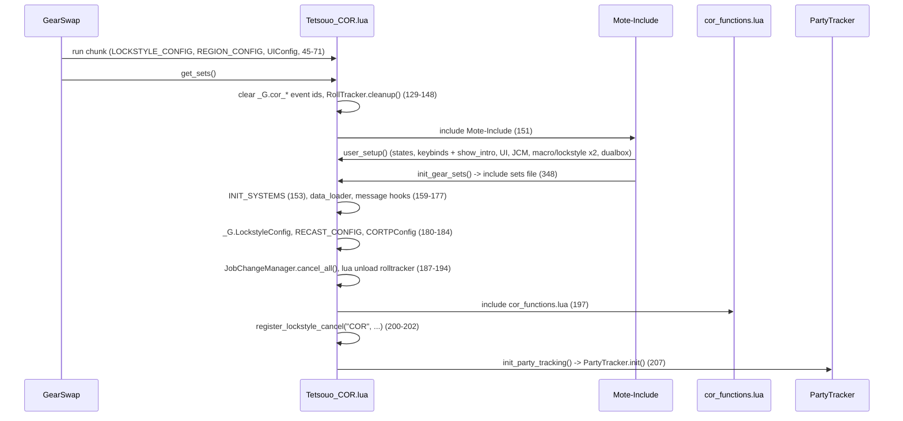
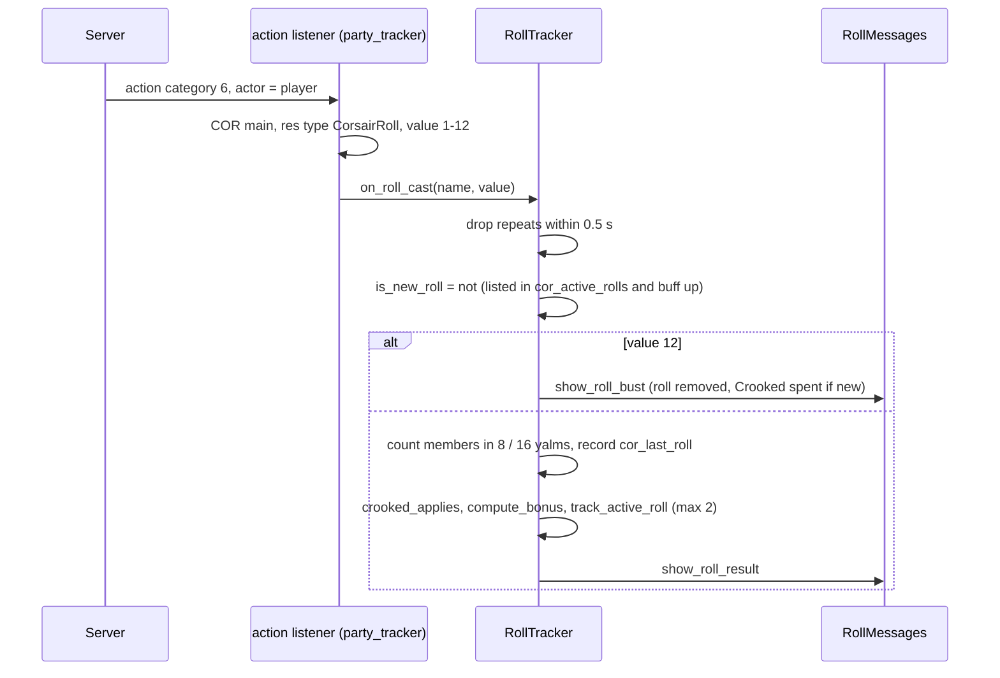

# COR (Corsair) job

The COR job area is 11 hook modules plus 4 logic modules under
`shared/jobs/cor/functions/` (2 776 lines), an entry point per character (the
Tetsouo template and a Kaories overlay), six config files and one sets file.
Both characters play COR. GearSwap loads it when the main job becomes COR; from
then on Mote-Include calls its hooks on every action, on status and buff
changes, on `//gs c` commands and on state cycles, and two raw Windower events
registered by COR watch the packet stream.

What COR adds on top of the shared pipeline:

- **Phantom Roll tracking**: an `action` event listener detects the player's own
  rolls and Double-Ups and prints a result block (value, lucky/unlucky, bonus
  with gear, job bonus and Crooked Cards, party coverage, bust risk).
- **Party job detection** from `0xDD`/`0xDF` packets, kept in the `windower`
  table so it survives reloads, to decide whether a roll's job bonus applies.
- **Roll precast**: the roll-specific precast set, Double-Up wearing the gear of
  the roll it doubles, Crooked Cards timestamping, and a Luzaf's Ring switch.
- **Weapon handling**: main weapon (with its sub only on /NIN or /DNC) and the
  gun from states, `HybridMode` PDT overlay, Refresh overlay under 50 % MP.
- **External addon swap**: the `rolltracker` addon is unloaded while COR is
  loaded. (The DressUp lockstyle watchdog and the forced re-equip after
  `user_setup()` were removed on 2026-09-25: the watchdog called
  `windower.ffxi.get_addons`, which does not exist, so it could never fire.)

Every file in scope was read in full except the gear content of the sets files
(structure and names only). Line numbers were rechecked against the working
tree on 2026-09-25 (after that day's COR fixes: roll listener, DressUp watchdog
and re-equip removed, `CustomClass` removed, `REGION_CONFIG` moved before
`config_loader`); where a line number added nothing, the function name is cited
instead.

## Files

| Path | Lines | Role |
|------|------:|------|
| `_master/entry/Tetsouo_COR.lua` | 393 | Entry point (template): `REGION_CONFIG` at file level, `init_party_tracking`, `get_sets`, `job_sub_job_change`, `user_setup` (two macro/lockstyle blocks), `job_update`, `init_gear_sets`, `file_unload` |
| `_master/Kaories/entry/Kaories_COR.lua` | 391 | Kaories overlay: same code with `Kaories/` paths; one comment moved (226) and a shorter dual-box comment (294-295) |
| `shared/jobs/cor/functions/cor_functions.lua` | 120 | Facade: `message_buffs.lua`, the 11 hook files, `dualbox_manager` |
| `shared/jobs/cor/functions/COR_PRECAST.lua` | 179 | `job_precast` (guard, cooldown, COR step, WS) / `job_post_precast` (TP gear, Luzaf) |
| `shared/jobs/cor/functions/COR_MIDCAST.lua` | 97 | `job_midcast` (empty) / `job_post_midcast` (RA, Enhancing, pass-through skills) |
| `shared/jobs/cor/functions/COR_AFTERCAST.lua` | 57 | `job_aftercast` (watchdog, bullet pouch refill), empty `job_post_aftercast` |
| `shared/jobs/cor/functions/COR_IDLE.lua` | 41 | `customize_idle_set` -> `SetBuilder.build_idle_set` |
| `shared/jobs/cor/functions/COR_ENGAGED.lua` | 41 | `customize_melee_set` -> `SetBuilder.build_engaged_set` |
| `shared/jobs/cor/functions/COR_STATUS.lua` | 20 | `job_status_change = LifecycleManager.status_change()` |
| `shared/jobs/cor/functions/COR_BUFFS.lua` | 40 | `job_buff_change = LifecycleManager.buff_change(retire_lost_roll)` |
| `shared/jobs/cor/functions/COR_COMMANDS.lua` | 361 | `job_self_command` router (incl. `shot`, `roll1`, `roll2`), `job_state_change` via `LifecycleManager.state_change` |
| `shared/jobs/cor/functions/COR_MOVEMENT.lua` | 53 | `get_cor_movement_status`, empty `job_handle_equipping_gear` |
| `shared/jobs/cor/functions/COR_LOCKSTYLE.lua` | 49 | Lazy `LockstyleManager.create('COR', ..., 1, 'SAM')` wrappers |
| `shared/jobs/cor/functions/COR_MACROBOOK.lua` | 43 | Lazy `MacrobookManager.create('COR', ..., 'SAM', 1, 1)` wrapper |
| `shared/jobs/cor/functions/logic/party_tracker.lua` | 257 | Roll `action` listener, `0xDD`/`0xDF` party job listener, cleanup |
| `shared/jobs/cor/functions/logic/roll_tracker.lua` | 778 | Roll state, Crooked, bonus, party cache validation, coverage, display, cleanup |
| `shared/jobs/cor/functions/logic/roll_data.lua` | 439 | 31 rolls: values 1-11, lucky/unlucky, bust effect, `+Phantom Roll` step, job bonus |
| `shared/jobs/cor/functions/logic/set_builder.lua` | 201 | Town, weapons (DW-aware), PDT, Refresh, movement; unused `apply_buff_gear` |
| `_master/config/cor/COR_STATES.lua` | 219 | All states (`CORStates.configure()`), unused `validate()` |
| `_master/config/cor/COR_KEYBINDS.lua` | 37 | 8 binds, data only; `KeybindManager.create('COR', ...)` adds `bind_all` / `unbind_all` / `show_intro` (see [keybinds and custom states](../systems/keybinds-and-custom.md)) |
| `_master/config/cor/COR_CUSTOM.lua` | 118 | Player modes and gear rules (all examples commented out), read through `KeybindManager` |
| `_master/config/cor/COR_LOCKSTYLE.lua` | 51 | `default = 3`, `by_subjob`, `get_style` |
| `_master/config/cor/COR_MACROBOOK.lua` | 68 | Book 3 page 1; dual-box block commented; unused `get_macrobook` |
| `_master/config/cor/COR_TP_CONFIG.lua` | 60 | `_G.CORTPConfig` (Moonshade; `ranged_weapons` Anarchy +2 1000, Fomalhaut 500) |
| `_master/Kaories/config/cor/*.lua` | 37, 51, 68, 219, 60 + `COR_REFILL.lua` 23 | Overlay: identical to the templates (line endings aside); plus the refill list |
| `_master/Tetsouo/config/cor/COR_REFILL.lua` | 20 | Refill template (Tetsouo) |
| `_master/sets/cor_sets.lua` = `_master/Kaories/sets/cor_sets.lua` | 413 | Template sets (flat); the overlay is identical (line endings aside) |
| `shared/utils/messages/utilities/roll_messages.lua` | 516 | Roll result block, bust, Double-Up window, active rolls |
| `shared/utils/messages/utilities/party_messages.lua` | 73 | `//gs c party` listing |
| `shared/utils/messages/formatters/jobs/message_cor.lua` + `data/jobs/cor_messages.lua` | 41 + 31 | PartyTracker load failures |
| `shared/data/job_abilities/COR_JA_DATABASE.lua` | 21 | Factory with the roll modules (`rolls_subjob`, `rolls_mainjob`) |
| `shared/utils/midcast/midcast_deps.lua` | 44 | Lazy `MidcastManager` + enhancing database pair |
| `shared/utils/inventory/quiver_manager.lua` | 170 | `after_ranged_attack` (called from aftercast) -> `check_and_refill` |

Live copies (gitignored): `Kaories/Kaories_COR.lua`, `Kaories/config/cor/*` and
`Kaories/sets/cor_sets.lua` are identical to the overlay.
`Tetsouo/Tetsouo_COR.lua` is the template except `@file` and line 348
(`sets/cor/cor_sets.lua`); `_master/Tetsouo/entry/Tetsouo_COR.lua` is identical
to it. `Tetsouo/config/cor/*` equal the templates except `@file` and two
comments (`COR_STATES.lua:65`, `COR_TP_CONFIG.lua:35`); every header now says
`@author Tetsouo`. `COR_REFILL.lua` equals its template.
`Tetsouo/sets/cor/{cor_sets,armor,capes,weapons}.lua` are modular
(324 + 79 + 34 + 44 lines), mirrored in `_master/Tetsouo/sets/cor/`.

## How it works

### Load sequence

- `init_party_tracking()` (`Tetsouo_COR.lua:82-112`) runs from `get_sets()`
  after the facade; its comment (73-81) records why it left `user_setup()`
  (Mote runs `user_setup()` inside the Mote include, before the COR modules
  exist, and an earlier throw there silently removed roll detection). If
  `init()` throws, it re-arms only the roll listener (105-111).
- The cleanup at the top of `get_sets()` (129-148) runs in a fresh sandbox, so
  `_G.cor_action_event_id` / `_G.cor_party_event_id` are always nil there, and
  `RollTracker.cleanup()` runs on a module instance loaded before the cache
  exists. GearSwap itself unregisters every event registered from a user file
  on each file load (`refresh.lua:68-70`), and the old sandbox's `file_unload`
  (359-393) already unregistered both handlers.
- `user_setup()` (243-321): `CORStates.configure()` (247-248); `COR_KEYBINDS`
  (which returns `KeybindManager.create('COR', ...)`) -> global `CORKeybinds`,
  `bind_all()` (256), whose `show_intro` (`keybind_manager.lua` `show_intro`)
  `require`s `COR_MACROBOOK.lua` and `COR_LOCKSTYLE.lua` and thereby defines
  `select_default_macro_book` / `select_default_lockstyle`;
  `KeybindUI.smart_init` (275); `JobChangeManager.initialize()` and a first
  macrobook + 8 s lockstyle (282-291); dual-box require (299); a **second**
  macrobook + 8 s lockstyle, each call guarded (303-320; its comment now
  names the `show_intro` side effect correctly). Both blocks run on a fresh
  load, so the macro book is set twice and two lockstyles are scheduled.
- The facade (`cor_functions.lua`) includes `message_buffs.lua` (40),
  `COR_PRECAST`, `COR_MIDCAST`, `COR_AFTERCAST` (47-51), `COR_IDLE`,
  `COR_ENGAGED` (58-60), `COR_STATUS`, `COR_BUFFS` (67-69), `COR_LOCKSTYLE`,
  `COR_MACROBOOK`, `COR_COMMANDS`, `COR_MOVEMENT` (77-81), requires
  `dualbox_manager` (110) and prints a debug line (117-118).
- COR sets `_G.RegionConfig` at file level (`Tetsouo_COR.lua:61-64`), before
  `config_loader` is required (70), like the other entries (see
  [messages](../systems/messages.md) on the colour load order). Until
  2026-09-25 it was set inside `get_sets()` after `INIT_SYSTEMS`, too late for
  `message_colors`, so Kaories (EU region) got the wrong warning orange on
  COR. Fixed 2026-09-25, not yet checked in game (`//gs c trace on` on Kaories,
  load COR, `trace.log` should show the region orange).

### Precast

`job_precast` (`COR_PRECAST.lua:115-138`): `PrecastGuard` (118), then
`CooldownChecker` (122-128; Quick Draw is skipped by the checker's
multi-charge list, `cooldown_checker.lua` `MULTI_CHARGE_ABILITIES`), return on
cancel (129-131), then `apply_cor_precast` (91-108), then
`WSPrecastHandler.handle` (135). The COR step runs before the WS handler; its
comment (86-89) states the checks must not stop the precast.

- **Crooked Cards**: `_G.cor_crooked_timestamp = os.time()` (95-97).
- **Phantom Roll** (`type == 'CorsairRoll'`): `_G.cor_last_roll.name =
  spell.english` (`job_precast_corsairroll`, 67-73). Mote selects
  `sets.precast.CorsairRoll` from the type (`Mote-Include.lua:647-654`) and
  then the roll's own sub-set by name (`Mote-Include.lua:929-951`). The
  `classes.CustomClass = 'CorsairRoll'` line and the `CUSTOM_CLASS_BY_TYPE`
  table were removed on 2026-09-25: Mote already finds both sets from the type.
- **Double-Up**: equips `sets.precast.CorsairRoll[<last roll>]`, else the base
  roll set (`job_precast_double_up`, 76-84, called at 105-107). Mote's own
  choice for Double-Up is the `sets.precast.JA` table, which holds no slot of
  its own.
- A `/ra` has `type` `"Misc"` (`GearSwap/statics.lua:134`,
  `triggers.lua:128-129`) and Mote reaches `sets.precast.RA` through
  `action_type` (`Mote-Include.lua:645-646`); `CorsairShot` reaches
  `sets.precast.CorsairShot` from its type.
- `job_post_precast` (146-164): TP gear, then for `type == 'CorsairRoll'` only,
  `left_ring = "Luzaf's Ring"` when `LuzafRing` is `ON` or `Gurebu's Ring` when
  `OFF`. Double-Up (`type == 'JobAbility'`) keeps the ring of the roll set.

### Roll detection and tracking

- Listener: `PartyTracker.init_roll_listener()` (`party_tracker.lua:58-99`),
  one `raw_register_event('action')` stored in `_G.cor_action_event_id`.
  Since 2026-09-25 a category-6 action counts as a roll only when
  `res.job_abilities[act.param].type == 'CorsairRoll'` (Double-Up arrives
  under the id of the roll it doubles). The old fallback on ids 98-192 and
  the Fold exclusion (195) are gone: they let a Curing Waltz or a Quick Draw
  be reported as a roll. Not yet tested in game (a roll plus a Waltz or a
  Quick Draw: only the roll should be reported).
- `RollTracker.on_roll_cast` (`roll_tracker.lua:297-346`). The Double-Up test
  `roll_is_active` (142-149) needs both the entry in `_G.cor_active_rolls` and
  `buffactive[roll]`; the comment (130-141) records why (a roll cannot be
  re-cast while it is up).
- Crooked (`crooked_applies`, 162-181): a Double-Up inherits the roll's
  `has_crooked`; a fresh roll takes Crooked when the buff is still visible or
  the precast timestamp is at most 60 s old, and then spends the timestamp
  (`consume_crooked`, 265). Bonus x1.2 (`compute_bonus`, 223).
- Bonus (`compute_bonus`, 223; `RollData.calculate_bonus`,
  `roll_data.lua:378-398`): value for the roll number + job bonus +
  highest `+Phantom Roll` gear (`PHANTOM_ROLL_GEAR`, 562: Rostam 8, Lanun Knife 7,
  Regal Necklace 7, Commodore's Knife 6, Barataria 5, Merirosvo 3) x the roll's step.
- Both are settled per roll, not per cast (`roll_bonus_sources`, 206; BG-Wiki,
  Phantom Roll): the initial Phantom Roll reads the gear and
  `is_job_in_party_zone`; a Double-Up keeps the record's job bonus as it was and
  the higher of the record's gear value and the gear worn now (gear counts from
  the cast it was worn on). `track_active_roll` stores them as `gear_bonus` /
  `job_bonus` on the active-roll record.
- Job bonus source (`is_job_in_party_zone`, 533): own main/sub, then
  `_G.AltJobState.job` (the dual-box partner), then the packet cache (main job
  only). `validate_party_cache` (480) clears the cache on a zone or
  party-size change and drops departed or 600 s-old entries.
- Coverage (`count_party_members_with_buff`, 595): the COR always counts;
  other members count when within 8 yalms, or 16 with `LuzafRing = ON`.
- Expiry: `COR_BUFFS.lua:24-35` (`retire_lost_roll`) removes the roll from the
  active list when a buff ending in `" Roll"` is lost (`on_roll_buff_lost`,
  81-89).
- State lives in the sandbox `_G` (`cor_active_rolls`, `cor_last_roll`,
  `cor_last_roll_display`, `cor_natural_eleven_active`,
  `cor_crooked_timestamp`), initialised at module load (34-63) and reset by
  `cleanup()` (741-772).

### Party job detection

`PartyTracker.init()` (`party_tracker.lua:104-230`) cleans up, registers the
roll listener, points `_G.cor_party_jobs` / `_G.cor_party_state` at
`windower._cor_party_jobs` / `windower._cor_party_state` (127-133, comment
119-126: the jobs only arrive when the server sends `0xDD`, so they must survive
a sandbox rebuild), then registers an `incoming chunk` handler for `0xDD` and
`0xDF` (158-229) that stores `{id, name, main_job, sub_job, main_job_level,
timestamp}` per member, skipping the player. On either dual-box character,
`receive_alt_job` rewrites the partner's entry (`dualbox_manager.lua:302-318`).

### Midcast

`job_post_midcast` (`COR_MIDCAST.lua:54-83`) loads the manager through
`MidcastDeps.load()` (55), notifies `MidcastWatchdog` (57-59), then:

- `spell.action_type == 'Ranged Attack'` -> `select_set({skill = 'RA'})`
  (63-66). `sets.midcast.RA` is a flat set, so MidcastManager equips it as
  its base, the same set Mote's default already chose through `action_type`
  (`Mote-Include.lua:721-751`); `//gs c debugmidcast` now shows `/ra`.
- Enhancing Magic with `get_enhancing_target` and the enhancing family database
  (70-78).
- Healing, Elemental and Enfeebling Magic by skill name (`PASSTHROUGH_SKILLS`,
  43-47, 80-82). No COR
  set file defines those base sets, so `select_set` returns false and Mote's
  choice stands.

Phantom Rolls and Quick Draw are instant and have no midcast.

### Aftercast, idle, engaged, status, buffs

- `job_aftercast` (`COR_AFTERCAST.lua:24-39`): watchdog, then
  `QuiverManager.after_ranged_attack(spell, 'Bronze Bullet', 'Brz. Bull. Pouch', 15)`
  (31-34, `quiver_manager.lua:154-168`): after a non-interrupted
  `action_type == 'Ranged Attack'` with `Bronze Bullet` equipped, it runs
  `check_and_refill` 1 s later. `job_post_aftercast` (47-48) is empty.
- `customize_idle_set` -> `build_idle_set` (`set_builder.lua:134-174`): town
  (`sets.Adoulin` in Adoulin; `sets.idle.Town` does not exist, so other cities
  count as field) -> weapons -> (outside town) `sets.idle.PDT` when
  `HybridMode = PDT` -> `sets.idle.Refresh` when MP < 50 % -> `sets.MoveSpeed`
  when moving.
- `customize_melee_set` -> `build_engaged_set` (103-129): Mote base
  (`sets.engaged.Normal`) + `sets.engaged.PDT` when `PDT` + weapons.
- Weapons (`apply_weapon`, 41-91): `sets[MainWeapon]` in full on /NIN or /DNC,
  otherwise only its `main` slot; `sets[RangeWeapon]` always.
- The entry no longer schedules `status_change(player.status, player.status)`
  after `user_setup()` (the "FORCE GEAR RE-EQUIP" block was removed on
  2026-09-25: from a bare coroutine its `equip()` calls were dropped).
- `job_status_change` is the shared handler; `job_buff_change` is the shared
  handler with `retire_lost_roll` as its extra (skipped when Doom handled the
  buff).
- `job_handle_equipping_gear` (`COR_MOVEMENT.lua:44-45`) is empty.

### External addon

- `get_sets()` sends `lua unload rolltracker` (194) and `file_unload` sends
  `lua load rolltracker` (381), comment 378-380.
- The DressUp lockstyle watchdog that used to live in `user_setup()` was
  removed on 2026-09-25 from all five COR entries: it relied on
  `windower.ffxi.get_addons`, which does not exist. A loop started before the
  update keeps running, without effect, until `//lua reload gearswap`.

## Mote states

Created by `CORStates.configure()` (`_master/config/cor/COR_STATES.lua:42-179`)
on every `user_setup()`. Keys from `_master/config/cor/COR_KEYBINDS.lua:20-34`;
`#numpad0` (AutoMedicine) comes from the character's
`config/COMMON_KEYBINDS.lua`.

| State | Values | Default | Key | Read by |
|-------|--------|---------|-----|---------|
| `HybridMode` | PDT, Normal | PDT | `^numpad9` | `set_builder.lua:113,151`; Mote `get_melee_set` |
| `MainWeapon` | Naegling | Naegling | `^numpad1` | `set_builder.lua:53-76`; `job_state_change` |
| `RangeWeapon` | Anarchy, Compensator | Anarchy | `^numpad2` | `set_builder.lua:78-88`; `job_state_change` |
| `QuickDraw` | Light, Fire, Ice, Wind, Earth, Thunder, Water, Dark | Light | `^numpad3` | `//gs c shot` (`COR_COMMANDS.lua:60-64`) |
| `LuzafRing` | ON, OFF | ON | `^numpad6` | `COR_PRECAST.lua:152-163`, `roll_tracker.lua:625,687` |
| `MainRoll` | 20 rolls | Chaos Roll | `^numpad4` | `//gs c roll1` |
| `SubRoll` | 20 rolls | Samurai Roll | `^numpad5` | `//gs c roll2` |
| `FastCast` | 0..80 step 10 | 0 | none | `MidcastWatchdog` |
| `AutoMedicine` | shared On/Off | persisted | `#numpad0` (from `COMMON_KEYBINDS.lua`) | `AutoMedicine.init` (`COR_STATES.lua:175-178`) |

`job_state_change` (`COR_COMMANDS.lua:352`) is
`LifecycleManager.state_change(on_state_change)`: the shared part refreshes the
HUD (skipping `Moving`); `on_state_change` (342-350) re-equips when the field,
with spaces stripped, is `MainWeapon` or `RangeWeapon`, so the state key and
Mote's description (`Main Weapon`, `Range Weapon`;
`Mote-SelfCommands.lua:157-159`) both match. The cycle then re-equips again
through `handle_update` (`Mote-SelfCommands.lua:163,238-250`); the second pass
sends nothing new.

## Commands

`job_self_command` (`COR_COMMANDS.lua:88-324`) tests `altjobupdate` (101;
passes the sender name, 5th argument, since 2026-09-25), `requestjob` (111),
`ui` (119), `debugmidcast` (128), `cyclestate` (147), watchdog (153),
**CommonCommands** (161), then:

| Command | Effect | Lines |
|---------|--------|-------|
| `track_roll` / `trackroll <short> <value>` | Maps a short name (`chaos`, `sam`, `hunters`, ...) and feeds `RollTracker.on_roll_cast` | 174-248 |
| `rolls` | `show_active_rolls(_G.cor_active_rolls)` | 249-263 |
| `doubleup` / `du` | `display_double_up_status()` (45 s from the last roll or Double-Up) | 264-274 |
| `clearrolls` | `RollTracker.clear_all()` | 275-286 |
| `party` | `show_party_members(_G.cor_party_jobs)` (no cache validation first) | 287-292 |
| `clearparty` | Empties the cache in place | 293-303 |
| `shot` | `input /ja "<QuickDraw> Shot" <t>` | 304-308 |
| `roll1` | `input /ja "<MainRoll>" <me>` | 304-308 |
| `roll2` | `input /ja "<SubRoll>" <me>` | 304-308 |
| `testcolors` / `colors` | Colour table 1-255 | 309-322 |

`shot`, `roll1` and `roll2` come from `SELECTED_ABILITY_COMMANDS` (60-64):
`use_selected_ability` (70-78) sends a normal `/ja`, so the ability goes
through `job_precast` like a macro (debuff guard, recast check, roll gear,
Luzaf ring). No key is bound to them; the names are checked against the
common commands and every `config/alt/*_ALT_COMMANDS.lua`.

`testcolors`/`colors` are claimed first by the common commands of the same
names. `doubleup` and `du` reach the COR branch: `du` is no longer an alias of
the common `debugupdate`, and a `doubleup` key in the COR alt config is only
Mote's last lookup, so it never takes the name from the job (see
[commands and debug](../systems/commands-and-debug.md#4-alt-commands-and-name-shadowing)).

## Set names the code looks up

T = `_master/sets/cor_sets.lua` (the Kaories overlay and live file are
identical), L = `Tetsouo/sets/cor/cor_sets.lua` (weapon sets from
`Tetsouo/sets/cor/weapons.lua`, copied by the loop at 53).

| Set | Looked up by | T | L |
|-----|--------------|---|---|
| `sets['Naegling']`, `sets['Anarchy']`, `sets['Compensator']` | `set_builder.lua:54,79` | 54, 60, 64 | loop 53 (+ `Rostam`) |
| `sets.idle.Normal` | Mote base | 74 | 63 |
| `sets.idle.PDT`, `sets.idle.Refresh` | `set_builder.lua:151-152,162` | 98, 108 | 81, 91 |
| `sets.idle.Town` | `BaseSetBuilder` | **absent** | **absent** |
| `sets.Adoulin`, `sets.MoveSpeed` | `BaseSetBuilder`, `apply_movement` | 397 (2 slots), 392 | 310, 307 |
| `sets.engaged.Normal`, `sets.engaged.PDT` | Mote base, `set_builder.lua:113` | 119, 143 | 102, 120 |
| `sets.engaged.DW`, `.DW.PDT` | nothing | - | 132, 138 |
| `sets.precast.CorsairRoll` + `["Caster's Roll"]`, `["Courser's Roll"]`, `["Blitzer's Roll"]`, `["Tactician's Roll"]`, `["Allies' Roll"]` | Mote by type/name, `COR_PRECAST.lua:78-83` | 163, 193-209 | 156, 177-193 |
| `sets.precast.CorsairShot` | Mote by type | 215 | 200 |
| `sets.precast.JA['Snake Eye'/'Fold'/'Wild Card'/'Random Deal']` | Mote default | 230-245 | 214-223 |
| `sets.precast.RA`, `sets.midcast.RA` | Mote by `action_type` | 250, 362 | 226, 284 |
| `sets.precast.WS`, `WS['Savage Blade']` | Mote default | 282 (after `= {}` at 279), 319 | 246, 262 |
| `sets.midcast['Enhancing Magic']`, `['Healing Magic']`, `['Elemental Magic']`, `['Enfeebling Magic']` | `COR_MIDCAST.lua:71,81` | **absent** | **absent** |
| `sets.buff.Doom` | shared `DoomManager` | 408 | 319 |

## Configuration

| File / key | Default | Where the default lives | Read by |
|------------|---------|-------------------------|---------|
| `<char>/config/cor/COR_STATES.lua` | see states | file | entry `user_setup` |
| `<char>/config/cor/COR_KEYBINDS.lua` | 8 binds | file | entry `user_setup`, `file_unload` |
| `<char>/config/cor/COR_CUSTOM.lua` | nothing active | file | `KeybindManager` / `CustomStates` ([keybinds and custom states](../systems/keybinds-and-custom.md)) |
| `<char>/config/cor/COR_LOCKSTYLE.lua` `default`, `by_subjob`, `get_style` | 3 | file; factory fallback 1 (`shared/jobs/cor/functions/COR_LOCKSTYLE.lua:26-31`) | `LockstyleManager` via `get_style` |
| `<char>/config/cor/COR_MACROBOOK.lua` `default`, `solo`, `dualbox` | book 3 page 1; `dualbox` empty | file; factory fallback book 1 | `MacrobookManager` (`get_macrobook`, 58-66, is not called) |
| `<char>/config/cor/COR_TP_CONFIG.lua` -> `_G.CORTPConfig` | Moonshade 250; `ranged_weapons` Anarchy +2 1000, Fomalhaut 500 (34-37) | file | `TPBonusCalculator` through `get_weapon_bonus` (45-55), called with the main and sub weapons, never the ranged one (`tp_bonus_handler.lua:71-74`) |
| `<char>/config/cor/COR_REFILL.lua` | Tetsouo: 20-line template; Kaories: includes `Brz. Bull. Pouch` | `_master/Tetsouo/`, `_master/Kaories/` | refill system |
| `roll_data.lua` | game data, not user config | - | `RollTracker` |
| Constants | TTL 600 s, duplicate window 0.5 s, Crooked window 60 s, Double-Up window 45 s | `roll_tracker.lua:466,127,180,704` | `RollTracker` |

## State & lifetime

- Sandbox `_G` written: the Mote hooks (`job_precast`, `job_post_precast`,
  `job_midcast`, `job_post_midcast`, `job_aftercast`, `job_post_aftercast`,
  `job_status_change`, `job_buff_change`, `customize_idle_set`,
  `customize_melee_set`, `job_self_command`, `job_state_change`,
  `job_handle_equipping_gear`), the roll state above, `cor_crooked_timestamp`,
  `cor_action_event_id`, `cor_party_event_id`, `cor_party_jobs`,
  `cor_party_state`, `CORTPConfig`, `CORKeybinds`, `LockstyleConfig`, `RECAST_CONFIG`,
  `RegionConfig`, the lockstyle/macrobook wrappers and factory exports,
  `get_cor_movement_status`.
- `_G` read: `AltJobState` (roll job bonus), `MidcastWatchdog`,
  `MidcastManagerDebugState`.
- `windower.*`: `_cor_party_jobs`, `_cor_party_state` (persist across
  `gs reload` and job changes; reset by `lua reload gearswap`; emptied in place
  by `clearparty`, zone change or party-size change).
- Events: the `action` and `incoming chunk` handlers, unregistered by
  `file_unload` / `PartyTracker.cleanup` and by GearSwap on every file load.
- Coroutines: the two 8 s lockstyles and the 1 s pouch check after `/ra`;
  none is cancelled by a reload.
- Outside GearSwap: the `rolltracker` addon is unloaded while COR is loaded and
  loaded again by `file_unload`.
- Subjob change: Mote re-runs `user_setup()` in the same sandbox (states reset,
  both macro/lockstyle blocks), then `job_sub_job_change` (224-233) hands over to
  `JobChangeManager`. The reload wipes the sandbox roll state, so rolls still up
  are no longer in `cor_active_rolls`.

## Interactions

- Precast: `PrecastGuard`, `CooldownChecker`, `WSPrecastHandler`
  ([precast pipeline](../systems/precast-pipeline.md)).
- Midcast: `MidcastDeps`, `MidcastManager`, `MidcastWatchdog`
  ([midcast and buffs](../systems/midcast-and-buffs.md)).
- Messages: `roll_messages`, `party_messages`, `message_cor`, `message_buffs`
  ([messages](../systems/messages.md), [formatters](../systems/messages-formatters.md)).
  The ability message handler skips `CorsairRoll` because the tracker prints its
  own line.
- Dual-box: `_G.AltJobState` and `receive_alt_job`'s cache patch
  ([dualbox](../systems/dualbox.md)). Both boxes send their job at auto-init and
  answer `requestjob` (`dualbox_manager.lua:501-502`, auto-init), so on either box the
  partner's job in `_G.AltJobState` and in its `_G.cor_party_jobs` entry follows
  the partner after any reload, not only after a `0xDD`.
- Inventory: `QuiverManager` and the COR refill lists
  ([equipment and inventory](../systems/equipment-and-inventory.md)).
- HUD: `UI_DISPLAY_BUILDER.lua:30-31` patterns for `QuickDraw`, `Roll`,
  `Luzaf`; `UI_LOADER.lua:61-65` has a COR fallback bind list with state names
  (`WeaponSet`, `SubSet`) that COR does not define, used only without a
  keybind file.

## Invariants & gotchas

- The roll listener and the party listener are `windower.raw_register_event`
  handlers; their ids live in the sandbox `_G`, so only the same sandbox's
  `file_unload` (or GearSwap's own cleanup) can remove them.
- A Double-Up and a fresh roll produce the same packet; only
  `roll_is_active` tells them apart, and it depends on sandbox state that a
  reload clears.
- Crooked Cards belongs to the roll: a Double-Up keeps it, a fresh roll spends
  the precast timestamp.
- Party jobs outlive reloads on purpose; `RollTracker.cleanup()` does not clear
  them (`cleanup`, 766-771).
- `/ra` is `type = "Misc"` with `action_type = 'Ranged Attack'`; test
  `action_type` for ranged attacks.
- The sub weapon of `sets[MainWeapon]` is dropped unless the subjob is NIN or
  DNC.
- In a city other than Adoulin, COR idle is built as in the field.

## Extending

- New roll: add it to `RollData.rolls` with 11 values, lucky/unlucky, bust
  effect, `phantom_roll_bonus` and `job_bonus`; add a shortcut to
  `track_roll` (`COR_COMMANDS.lua:174-248`) and the name to `MainRoll`/`SubRoll`
  (then `roll1`/`roll2` can cast it).
- Roll-specific precast gear: `sets.precast.CorsairRoll["<Roll>"] =
  set_combine(sets.precast.CorsairRoll, {...})`; Double-Up picks it up.
- New `+Phantom Roll` item: add it to `PHANTOM_ROLL_GEAR` (`roll_tracker.lua:562`,
  read by `get_phantom_roll_bonus`).
- New command: branch after the CommonCommands block; check the name against
  the common list. A name that is also a key of `Tetsouo/config/alt/COR_ALT_*.lua`
  runs here; the alt's version stays reachable as `//gs c alt <name>`.

## Known issues

- `COR_TP_CONFIG.ranged_weapons` is matched against the main weapon, so the gun
  TP bonus is never counted (`COR_TP_CONFIG.lua:34-55`,
  `tp_bonus_handler.lua:71-74`, which now passes the sub weapon too but not
  the ranged one). Left open: nothing in the config or the
  calculator says whether a gun's TP bonus applies to every weaponskill or only
  to ranged ones (Savage Blade vs Leaden Salute), and the fix depends on it.
- `rolltracker` is unloaded on every COR load and loaded on every COR unload,
  including each subjob change and for players who never used it
  (`Tetsouo_COR.lua:194,381`).
- Both macrobook/lockstyle blocks run on a fresh load: the macro book is set
  twice and two lockstyles are scheduled (`Tetsouo_COR.lua:282-291,303-320`).
- The event cleanup at the top of `get_sets()` never finds anything, and its
  comment describes a duplicate-handler scenario that cannot happen
  (`Tetsouo_COR.lua:125-148`).
- After a reload with a roll still up, the next Double-Up is reported as a fresh
  roll and loses Crooked (`roll_tracker.lua:35-37,142-149,170-171`).
- `_G.AltJobState.job` counts for the job bonus whether or not the partner is
  online, in the party or in the zone (`roll_tracker.lua:543-546`).
- `LuzafRing = OFF` is not applied to Double-Up (`COR_PRECAST.lua:153`, a
  `CorsairRoll`-only test).
- `party` lists the cache without validating it (`COR_COMMANDS.lua:291`).
- Pending in-game checks for today's COR fixes (2026-09-25): a Curing Waltz,
  a Divine Waltz or a Quick Draw right after a roll must not be reported as a
  roll; on Kaories, the region warning colour must be right on COR.
- `testcolors` and `colors` are shadowed by the common commands (see
  [commands and debug](../systems/commands-and-debug.md)).
- Template `sets.Adoulin` is a 2-slot set used as the full idle base; no
  `sets.idle.Town` exists (`_master/sets/cor_sets.lua:397`).
- `party_messages.lua:46-66` and `roll_messages.lua:417` call `add_to_chat`
  directly. Both files are under `shared/utils/messages/`, which
  `CODE_QUALITY.md` §6 now allows as the rendering layer.
- Dead code: `_G.cor_natural_eleven_active` (written, never read),
  `RollData.get_roll_names`, `clear_natural_eleven` / `clear_last_roll`
  outside `clear_all`, `_G.cor_pending_roll_*`, `job_post_aftercast`,
  `job_handle_equipping_gear`, `get_cor_movement_status`,
  `SetBuilder.apply_buff_gear`, `CORStates.validate`, `COR_MACROBOOK.get_macrobook`,
  `show_roll_natural_eleven` / `show_roll_bust_rate` / `show_roll_not_found`,
  live `sets.engaged.DW`.
- Fixed, no longer issues: the roll listener's 98-192 id fallback and Fold
  exclusion, the DressUp watchdog, the forced re-equip block and
  `CustomClass` (all 2026-09-25); `REGION_CONFIG` loaded too late for the
  warning colour (2026-09-25); `has_job_bonus_proc_gear` removed and roll gear
  kept in a table (`1b9249d`); roll gear and job bonus settled per roll
  (`818d5dd`); `@author Kaories` in the live Tetsouo configs (now
  `@author Tetsouo`).
- User docs list `Alt+N` keys (`docs/user/jobs/cor/states.md:169-171`) and do not
  mention `//gs c shot`, `roll1` or `roll2`, which use the `QuickDraw`,
  `MainRoll` and `SubRoll` states they describe.
