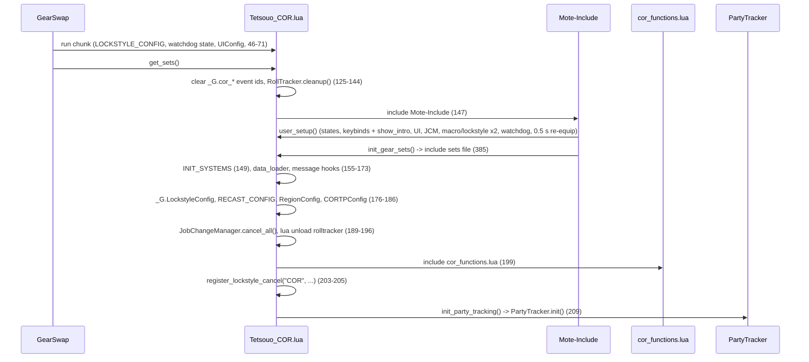
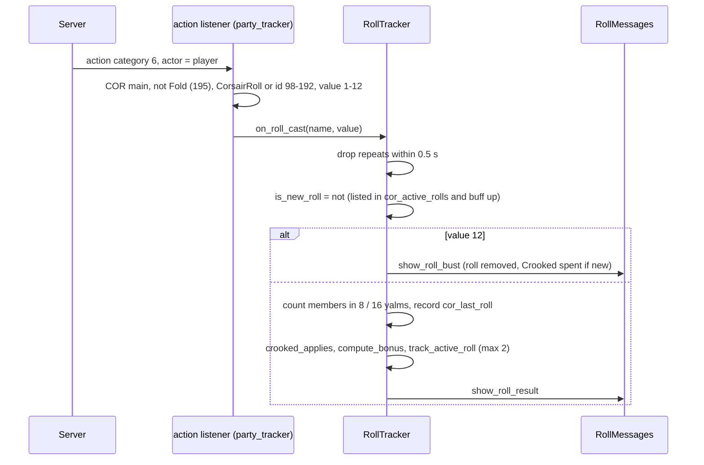

# COR (Corsair) job

The COR job area is 11 hook modules plus 4 logic modules under
`shared/jobs/cor/functions/` (2 807 lines), an entry point per character (the
Tetsouo template and a Kaories overlay), five config files and one sets file.
Both characters play COR. GearSwap loads it when the main job becomes COR; from
then on Mote-Include calls its hooks on every action, on status and buff
changes, on `//gs c` commands and on state cycles, and two raw Windower events
registered by COR watch the packet stream.

What COR adds on top of the shared pipeline:

- **Phantom Roll tracking**: an `action` event listener detects the player's own
  rolls and Double-Ups and prints a result block (value, lucky/unlucky, bonus
  with gear, job bonus and Crooked Cards, party coverage, bust risk).
- **Party job detection** from `0xDD`/`0xDF` packets, kept in the `windower`
  table so it survives reloads, to decide whether a roll's job bonus applies.
- **Roll precast**: the roll-specific precast set, Double-Up wearing the gear of
  the roll it doubles, Crooked Cards timestamping, and a Luzaf's Ring switch.
- **Weapon handling**: main weapon (with its sub only on /NIN or /DNC) and the
  gun from states, `HybridMode` PDT overlay, Refresh overlay under 50 % MP.
- **Lockstyle watchdog** that re-applies the lockstyle when DressUp is reloaded,
  and a swap of the external `rolltracker` addon while COR is loaded.

Every file in scope was read in full except the gear content of the sets files
(structure and names only). All line numbers refer to the working tree on
2026-09-19, including the uncommitted changes to `_master/entry/Tetsouo_COR.lua`
and `_master/Kaories/entry/Kaories_COR.lua` (party tracking moved from
`user_setup()` into `init_party_tracking()` in `get_sets()`, and the
macrobook/lockstyle calls of the second `user_setup()` block guarded).

## Files

| Path | Lines | Role |
|------|------:|------|
| `_master/entry/Tetsouo_COR.lua` | 431 | Entry point (template): watchdog state, `init_party_tracking`, `get_sets`, `job_sub_job_change`, `user_setup` (two macro/lockstyle blocks, DressUp watchdog, forced re-equip), `job_update`, `init_gear_sets`, `file_unload` |
| `_master/Kaories/entry/Kaories_COR.lua` | 429 | Kaories overlay: same code with `Kaories/` paths; one comment moved (227) and a shorter dual-box comment (281-282) |
| `shared/jobs/cor/functions/cor_functions.lua` | 122 | Facade: `message_buffs.lua`, the 11 hook files, `dualbox_manager` |
| `shared/jobs/cor/functions/COR_PRECAST.lua` | 194 | `job_precast` (guard, cooldown, COR step, WS) / `job_post_precast` (TP gear, Luzaf) |
| `shared/jobs/cor/functions/COR_MIDCAST.lua` | 94 | `job_midcast` (empty) / `job_post_midcast` (RA, Enhancing, pass-through skills) |
| `shared/jobs/cor/functions/COR_AFTERCAST.lua` | 62 | `job_aftercast` (watchdog, bullet pouch refill), empty `job_post_aftercast` |
| `shared/jobs/cor/functions/COR_IDLE.lua` | 43 | `customize_idle_set` -> `SetBuilder.build_idle_set` |
| `shared/jobs/cor/functions/COR_ENGAGED.lua` | 43 | `customize_melee_set` -> `SetBuilder.build_engaged_set` |
| `shared/jobs/cor/functions/COR_STATUS.lua` | 19 | `job_status_change = LifecycleManager.status_change()` |
| `shared/jobs/cor/functions/COR_BUFFS.lua` | 38 | `job_buff_change = LifecycleManager.buff_change(retire_lost_roll)` |
| `shared/jobs/cor/functions/COR_COMMANDS.lua` | 354 | `job_self_command` router (incl. `shot`, `roll1`, `roll2`), `job_state_change` via `LifecycleManager.state_change` |
| `shared/jobs/cor/functions/COR_MOVEMENT.lua` | 56 | `get_cor_movement_status`, empty `job_handle_equipping_gear` |
| `shared/jobs/cor/functions/COR_LOCKSTYLE.lua` | 47 | Lazy `LockstyleManager.create('COR', ..., 1, 'SAM')` wrappers |
| `shared/jobs/cor/functions/COR_MACROBOOK.lua` | 42 | Lazy `MacrobookManager.create('COR', ..., 'SAM', 1, 1)` wrapper |
| `shared/jobs/cor/functions/logic/party_tracker.lua` | 266 | Roll `action` listener, `0xDD`/`0xDF` party job listener, cleanup |
| `shared/jobs/cor/functions/logic/roll_tracker.lua` | 787 | Roll state, Crooked, bonus, party cache validation, coverage, display, cleanup |
| `shared/jobs/cor/functions/logic/roll_data.lua` | 439 | 31 rolls: values 1-11, lucky/unlucky, bust effect, `+Phantom Roll` step, job bonus |
| `shared/jobs/cor/functions/logic/set_builder.lua` | 201 | Town, weapons (DW-aware), PDT, Refresh, movement; unused `apply_buff_gear` |
| `_master/config/cor/COR_STATES.lua` | 218 | All states (`CORStates.configure()`), unused `validate()` |
| `_master/config/cor/COR_KEYBINDS.lua` | 128 | 8 binds, `bind_all` / `unbind_all` / `show_intro` |
| `_master/config/cor/COR_LOCKSTYLE.lua` | 53 | `default = 3`, `by_subjob`, `get_style` |
| `_master/config/cor/COR_MACROBOOK.lua` | 67 | Book 3 page 1; dual-box block commented; unused `get_macrobook` |
| `_master/config/cor/COR_TP_CONFIG.lua` | 60 | `_G.CORTPConfig` (Moonshade; `ranged_weapons` Anarchy +2 1000, Fomalhaut 500) |
| `_master/Kaories/config/cor/*.lua` | 128, 53, 67, 218, 60 + `COR_REFILL.lua` 23 | Overlay: identical to the templates except `@requires Kaories` in the keybinds header; plus the refill list |
| `_master/Tetsouo/config/cor/COR_REFILL.lua` | 20 | Refill template (Tetsouo) |
| `_master/sets/cor_sets.lua` = `_master/Kaories/sets/cor_sets.lua` | 410 | Template sets (flat); the overlay is identical |
| `shared/utils/messages/utilities/roll_messages.lua` | 515 | Roll result block, bust, Double-Up window, active rolls |
| `shared/utils/messages/utilities/party_messages.lua` | 74 | `//gs c party` listing |
| `shared/utils/messages/formatters/jobs/message_cor.lua` + `data/jobs/cor_messages.lua` | 41 + 31 | PartyTracker load failures |
| `shared/data/job_abilities/COR_JA_DATABASE.lua` | 21 | Factory with the roll modules (`rolls_subjob`, `rolls_mainjob`) |
| `shared/utils/midcast/midcast_deps.lua` | 44 | Lazy `MidcastManager` + enhancing database pair |
| `shared/utils/inventory/quiver_manager.lua` | 167 | `after_ranged_attack` (called from aftercast) -> `check_and_refill` |

Live copies (gitignored): `Kaories/Kaories_COR.lua`, `Kaories/config/cor/*` and
`Kaories/sets/cor_sets.lua` are identical to the overlay (including the
uncommitted change). `Tetsouo/Tetsouo_COR.lua` is the template except line 385
(`sets/cor/cor_sets.lua`). `Tetsouo/config/cor/*` equal the templates except the
headers `@author Kaories` in `COR_LOCKSTYLE.lua:8`, `COR_MACROBOOK.lua:8`,
`COR_STATES.lua:29`, `COR_TP_CONFIG.lua:9`; `COR_REFILL.lua` equals its template.
`Tetsouo/sets/cor/{cor_sets,armor,capes,weapons}.lua` are modular
(326 + 79 + 34 + 44 lines).

## How it works

### Load sequence

- `init_party_tracking()` (`Tetsouo_COR.lua:82-112`) runs from `get_sets()`
  after the facade; its comment (73-81) records why it left `user_setup()`
  (Mote runs `user_setup()` inside the Mote include, before the COR modules
  exist, and an earlier throw there silently removed roll detection). If
  `init()` throws, it re-arms only the roll listener (105-111).
- The cleanup at the top of `get_sets()` (125-144) runs in a fresh sandbox, so
  `_G.cor_action_event_id` / `_G.cor_party_event_id` are always nil there, and
  `RollTracker.cleanup()` runs on a module instance loaded before the cache
  exists. GearSwap itself unregisters every event registered from a user file
  on each file load (`refresh.lua:68-70`), and the old sandbox's `file_unload`
  (394-414) already unregistered both handlers.
- `user_setup()` (240-364): `CORStates.configure()` (244-245); `COR_KEYBINDS`
  -> global `CORKeybinds`, `bind_all()` (250-254), whose `show_intro`
  `require`s `COR_MACROBOOK.lua` and `COR_LOCKSTYLE.lua` (`COR_KEYBINDS.lua:101,108`)
  and thereby defines `select_default_macro_book` / `select_default_lockstyle`;
  `KeybindUI.smart_init` (259-263); `JobChangeManager.initialize()` and a first
  macrobook + 8 s lockstyle (268-278); dual-box require (286); a **second**
  macrobook + 8 s lockstyle that also sets `lockstyle_applied` (292-306); the
  DressUp watchdog (309-350); `status_change(player.status, player.status)`
  after 0.5 s to re-equip for the subjob's weapon rules (359-363). Both
  macrobook/lockstyle blocks run on a fresh load; the comment at 293-295 says
  the globals are absent then, which the `show_intro` side effect contradicts.
- The facade (`cor_functions.lua`) includes `message_buffs.lua` (43),
  `COR_PRECAST`, `COR_MIDCAST`, `COR_AFTERCAST` (50-54), `COR_IDLE`,
  `COR_ENGAGED` (61-63), `COR_STATUS`, `COR_BUFFS` (70-72), `COR_LOCKSTYLE`,
  `COR_MACROBOOK`, `COR_COMMANDS`, `COR_MOVEMENT` (80-84), requires
  `dualbox_manager` (110) and prints a debug line (117-118).
- COR sets `_G.RegionConfig` inside `get_sets()` after `INIT_SYSTEMS`
  (180-183), unlike BRD and GEO which set it at file level (see
  [messages](../systems/messages.md) on the colour load order).

### Precast

`job_precast` (`COR_PRECAST.lua:130-153`): `PrecastGuard` (133), then
`CooldownChecker` (137-143; Quick Draw is skipped by the checker's
multi-charge list, `cooldown_checker.lua:86-89`), return on cancel (144-146),
then `apply_cor_precast` (106-128), then `WSPrecastHandler.handle` (150). The
COR step runs before the WS handler; its comment (96-105) states the checks are
independent and must not stop the precast.

- **Crooked Cards**: `_G.cor_crooked_timestamp = os.time()` (110-112).
- **Phantom Roll** (`type == 'CorsairRoll'`): `classes.CustomClass =
  'CorsairRoll'` and `_G.cor_last_roll.name = spell.english` (67-76). Mote
  selects `sets.precast.CorsairRoll` from the type and then the roll's own
  sub-set by name (`Mote-Include.lua:647-655,929-951`).
- **Double-Up**: equips `sets.precast.CorsairRoll[<last roll>]`, else the base
  roll set (79-87, 120-122). Mote's own choice for Double-Up is the
  `sets.precast.JA` table, which holds no slot of its own.
- `CUSTOM_CLASS_BY_TYPE` (89-94) maps `CorsairShot` -> `CorsairShot`. A `/ra`
  needs no entry: its `type` is `"Misc"` (`GearSwap/statics.lua:134`,
  `triggers.lua:128-129`) and Mote reaches `sets.precast.RA` through
  `action_type` (`Mote-Include.lua:645-646`). The former `Ranged Attack -> RA`
  entry could never match, and would only have looked up a
  `sets.precast.RA.RA` that no set file defines.
- `job_post_precast` (161-179): TP gear, then for `type == 'CorsairRoll'` only,
  `left_ring = "Luzaf's Ring"` when `LuzafRing` is `ON` or `Gurebu's Ring` when
  `OFF`. Double-Up (`type == 'JobAbility'`) keeps the ring of the roll set.

### Roll detection and tracking

- Listener: `PartyTracker.init_roll_listener()` (`party_tracker.lua:58-110`),
  one `raw_register_event('action')` stored in `_G.cor_action_event_id`.
- `RollTracker.on_roll_cast` (`roll_tracker.lua:264-311`). The Double-Up test
  `roll_is_active` (141-148) needs both the entry in `_G.cor_active_rolls` and
  `buffactive[roll]`; the comment (129-139) records why (a roll cannot be
  re-cast while it is up).
- Crooked (`crooked_applies`, 161-180): a Double-Up inherits the roll's
  `has_crooked`; a fresh roll takes Crooked when the buff is still visible or
  the precast timestamp is at most 60 s old, and then spends the timestamp
  (`consume_crooked`, 232-236). Bonus x1.2 (196-198).
- Bonus (`compute_bonus`, 184-201; `RollData.calculate_bonus`,
  `roll_data.lua:378-398`): value for the roll number + job bonus when
  `is_job_in_party_zone` + highest `+Phantom Roll` gear (Rostam 8, Lanun Knife 7,
  Regal Necklace 7, Commodore's Knife 6, Barataria 5, Merirosvo 3;
  `roll_tracker.lua:544-591`) x the roll's step.
- Job bonus source (`is_job_in_party_zone`, 488-513): own main/sub, then
  `_G.AltJobState.job` (the dual-box partner), then the packet cache (main job
  only). `validate_party_cache` (435-472) clears the cache on a zone or
  party-size change and drops departed or 600 s-old entries.
- Coverage (`count_party_members_with_buff`, 602-653): the COR always counts;
  other members count when within 8 yalms, or 16 with `LuzafRing = ON`.
- Expiry: `COR_BUFFS.lua:22-33` removes the roll from the active list when a
  buff ending in `" Roll"` is lost (`on_roll_buff_lost`, 80-88).
- State lives in the sandbox `_G` (`cor_active_rolls`, `cor_last_roll`,
  `cor_last_roll_display`, `cor_natural_eleven_active`,
  `cor_crooked_timestamp`), initialised at module load (34-62) and reset by
  `cleanup()` (750-781).

### Party job detection

`PartyTracker.init()` (`party_tracker.lua:114-240`) cleans up, registers the
roll listener, points `_G.cor_party_jobs` / `_G.cor_party_state` at
`windower._cor_party_jobs` / `windower._cor_party_state` (137-143, comment
129-136: the jobs only arrive when the server sends `0xDD`, so they must survive
a sandbox rebuild), then registers an `incoming chunk` handler for `0xDD` and
`0xDF` (168-239) that stores `{id, name, main_job, sub_job, main_job_level,
timestamp}` per member, skipping the player. On either dual-box character,
`receive_alt_job` rewrites the partner's entry (`dualbox_manager.lua:300-309`).

### Midcast

`job_post_midcast` (`COR_MIDCAST.lua:51-80`) loads the manager through
`MidcastDeps.load()` (52), notifies `MidcastWatchdog` (54-56), then:

- `spell.action_type == 'Ranged Attack'` -> `select_set({skill = 'RA'})`
  (58-63). `sets.midcast.RA` is a flat set, so MidcastManager equips it as
  its base, the same set Mote's default already chose through `action_type`
  (`Mote-Include.lua:721-751`); `//gs c debugmidcast` now shows `/ra`.
- Enhancing Magic with `get_enhancing_target` and the enhancing family database
  (67-75).
- Healing, Elemental and Enfeebling Magic by skill name (40-44, 77-79). No COR
  set file defines those base sets, so `select_set` returns false and Mote's
  choice stands.

Phantom Rolls and Quick Draw are instant and have no midcast.

### Aftercast, idle, engaged, status, buffs

- `job_aftercast` (`COR_AFTERCAST.lua:23-43`): watchdog, then
  `QuiverManager.after_ranged_attack(spell, 'Bronze Bullet', 'Brz. Bull. Pouch', 15)`
  (34-38, `quiver_manager.lua:151-165`): after a non-interrupted
  `action_type == 'Ranged Attack'` with `Bronze Bullet` equipped, it runs
  `check_and_refill` 1 s later. `job_post_aftercast` (51-53) is empty.
- `customize_idle_set` -> `build_idle_set` (`set_builder.lua:134-174`): town
  (`sets.Adoulin` in Adoulin; `sets.idle.Town` does not exist, so other cities
  count as field) -> weapons -> (outside town) `sets.idle.PDT` when
  `HybridMode = PDT` -> `sets.idle.Refresh` when MP < 50 % -> `sets.MoveSpeed`
  when moving.
- `customize_melee_set` -> `build_engaged_set` (103-129): Mote base
  (`sets.engaged.Normal`) + `sets.engaged.PDT` when `PDT` + weapons.
- Weapons (`apply_weapon`, 40-90): `sets[MainWeapon]` in full on /NIN or /DNC,
  otherwise only its `main` slot; `sets[RangeWeapon]` always.
- The entry schedules `status_change(player.status, player.status)` 0.5 s after
  each `user_setup()` so the subjob's weapon rule applies at once
  (`Tetsouo_COR.lua:356-363`).
- `job_status_change` is the shared handler; `job_buff_change` is the shared
  handler with `retire_lost_roll` as its extra (skipped when Doom handled the
  buff).
- `job_handle_equipping_gear` (`COR_MOVEMENT.lua:44-48`) is empty.

### Lockstyle watchdog and external addon

- The watchdog (`Tetsouo_COR.lua:309-350`) starts 15 s after `user_setup()` and
  polls every 10 s. Once `lockstyle_applied` is set, it records whether the
  DressUp addon is loaded and, on a not-loaded -> loaded transition, prints an
  info line and calls `select_default_lockstyle()` 2 s later. It stops when
  `file_unload` clears `_G.cor_lockstyle_watchdog_active` (400-402), which the
  loop reads from its own sandbox. `LockstyleManager` itself unloads DressUp for
  about 3 s around every lockstyle it applies (`lockstyle_manager.lua:138-161`),
  so a poll that lands in that window reads it as a reload.
- `get_sets()` sends `lua unload rolltracker` (196) and `file_unload` sends
  `lua load rolltracker` (419), comment 416-418.

## Mote states

Created by `CORStates.configure()` (`_master/config/cor/COR_STATES.lua:41-178`)
on every `user_setup()`. Keys from `COR_KEYBINDS.lua:26-44`.

| State | Values | Default | Key | Read by |
|-------|--------|---------|-----|---------|
| `HybridMode` | PDT, Normal | PDT | `^numpad9` | `set_builder.lua:112,151`; Mote `get_melee_set` |
| `MainWeapon` | Naegling | Naegling | `^numpad1` | `set_builder.lua:52-74`; `job_state_change` |
| `RangeWeapon` | Anarchy, Compensator | Anarchy | `^numpad2` | `set_builder.lua:77-87`; `job_state_change` |
| `QuickDraw` | Light, Fire, Ice, Wind, Earth, Thunder, Water, Dark | Light | `^numpad3` | `//gs c shot` (`COR_COMMANDS.lua:53-57`) |
| `LuzafRing` | ON, OFF | ON | `^numpad6` | `COR_PRECAST.lua:169-177`, `roll_tracker.lua:632-634,696-698` |
| `MainRoll` | 20 rolls | Chaos Roll | `^numpad4` | `//gs c roll1` |
| `SubRoll` | 20 rolls | Samurai Roll | `^numpad5` | `//gs c roll2` |
| `FastCast` | 0..80 step 10 | 0 | none | `MidcastWatchdog` |
| `AutoMedicine` | shared On/Off | persisted | `#numpad0` | `AutoMedicine.init` (174-177) |

`job_state_change` (`COR_COMMANDS.lua:345`) is
`LifecycleManager.state_change(on_state_change)`: the shared part refreshes the
HUD (skipping `Moving`); `on_state_change` (335-343) re-equips when the field,
with spaces stripped, is `MainWeapon` or `RangeWeapon`, so the state key and
Mote's description (`Main Weapon`, `Range Weapon`;
`Mote-SelfCommands.lua:157-159`) both match. The cycle then re-equips again
through `handle_update` (`Mote-SelfCommands.lua:163,238-250`); the second pass
sends nothing new.

## Commands

`job_self_command` (`COR_COMMANDS.lua:81-317`) tests `altjobupdate` (94),
`requestjob` (104), `ui` (112), `debugmidcast` (121), `cyclestate` (140), watchdog
(146), **CommonCommands** (154), then:

| Command | Effect | Lines |
|---------|--------|-------|
| `track_roll` / `trackroll <short> <value>` | Maps a short name (`chaos`, `sam`, `hunters`, ...) and feeds `RollTracker.on_roll_cast` | 167-240 |
| `rolls` | `show_active_rolls(_G.cor_active_rolls)` | 242-255 |
| `doubleup` / `du` | `display_double_up_status()` (45 s from the last roll or Double-Up) | 257-266 |
| `clearrolls` | `RollTracker.clear_all()` | 268-278 |
| `party` | `show_party_members(_G.cor_party_jobs)` (no cache validation first) | 280-284 |
| `clearparty` | Empties the cache in place | 286-295 |
| `shot` | `input /ja "<QuickDraw> Shot" <t>` | 297-300 |
| `roll1` | `input /ja "<MainRoll>" <me>` | 297-300 |
| `roll2` | `input /ja "<SubRoll>" <me>` | 297-300 |
| `testcolors` / `colors` | Colour table 1-255 | 302-315 |

`shot`, `roll1` and `roll2` come from `SELECTED_ABILITY_COMMANDS` (53-57):
`use_selected_ability` (63-71) sends a normal `/ja`, so the ability goes
through `job_precast` like a macro (debuff guard, recast check, roll gear,
Luzaf ring). No key is bound to them; the names are checked against the
common commands and every `config/alt/*_ALT_COMMANDS.lua`.

`testcolors`/`colors` are claimed first by the common commands of the same
names. `doubleup` and `du` reach the COR branch: `du` is no longer an alias of
the common `debugupdate`, and a `doubleup` key in the COR alt config is only
Mote's last lookup, so it never takes the name from the job (see
[commands and debug](../systems/commands-and-debug.md#4-alt-commands-and-name-shadowing)).

## Set names the code looks up

T = `_master/sets/cor_sets.lua` (the Kaories overlay and live file are
identical), L = `Tetsouo/sets/cor/cor_sets.lua` (weapon sets from
`weapons.lua:22-37`, copied by the loop at 54).

| Set | Looked up by | T | L |
|-----|--------------|---|---|
| `sets['Naegling']`, `sets['Anarchy']`, `sets['Compensator']` | `set_builder.lua:53,78` | 51, 57, 61 | loop 54 (+ `Rostam`) |
| `sets.idle.Normal` | Mote base | 71 | 63 |
| `sets.idle.PDT`, `sets.idle.Refresh` | `set_builder.lua:152,162` | 95, 105 | 81, 91 |
| `sets.idle.Town` | `BaseSetBuilder` | **absent** | **absent** |
| `sets.Adoulin`, `sets.MoveSpeed` | `BaseSetBuilder`, `apply_movement` | 394 (2 slots), 389 | 310, 307 |
| `sets.engaged.Normal`, `sets.engaged.PDT` | Mote base, `set_builder.lua:113` | 116, 140 | 102, 120 |
| `sets.engaged.DW`, `.DW.PDT` | nothing | - | 132, 138 |
| `sets.precast.CorsairRoll` + `["Caster's Roll"]`, `["Courser's Roll"]`, `["Blitzer's Roll"]`, `["Tactician's Roll"]`, `["Allies' Roll"]` | Mote by type/name, `COR_PRECAST.lua:81-85` | 160, 190-206 | 156, 177-193 |
| `sets.precast.CorsairShot` | Mote by type | 212 | 200 |
| `sets.precast.JA['Snake Eye'/'Fold'/'Wild Card'/'Random Deal']` | Mote default | 227-242 | 214-223 |
| `sets.precast.RA`, `sets.midcast.RA` | Mote by `action_type` | 247, 359 | 226, 284 |
| `sets.precast.WS`, `WS['Savage Blade']` | Mote default | 279 (after `= {}` at 276), 316 | 246, 262 |
| `sets.midcast['Enhancing Magic']`, `['Healing Magic']`, `['Elemental Magic']`, `['Enfeebling Magic']` | `COR_MIDCAST.lua:68,78` | **absent** | **absent** |
| `sets.buff.Doom` | shared `DoomManager` | 405 | 319 |

## Configuration

| File / key | Default | Where the default lives | Read by |
|------------|---------|-------------------------|---------|
| `<char>/config/cor/COR_STATES.lua` | see states | file | entry `user_setup` |
| `<char>/config/cor/COR_KEYBINDS.lua` | 8 binds | file | entry `user_setup`, `file_unload` |
| `<char>/config/cor/COR_LOCKSTYLE.lua` `default`, `by_subjob`, `get_style` | 3 | file; factory fallback 1 (`COR_LOCKSTYLE.lua:26-31`) | `LockstyleManager` via `get_style` |
| `<char>/config/cor/COR_MACROBOOK.lua` `default`, `solo`, `dualbox` | book 3 page 1; `dualbox` empty | file; factory fallback book 1 | `MacrobookManager` (`get_macrobook`, 57-65, is not called) |
| `<char>/config/cor/COR_TP_CONFIG.lua` -> `_G.CORTPConfig` | Moonshade 250; `ranged_weapons` Anarchy +2 1000, Fomalhaut 500 (34-37) | file | `TPBonusCalculator` through `get_weapon_bonus` (45-55), called with the **main** weapon (`tp_bonus_handler.lua:61`) |
| `<char>/config/cor/COR_REFILL.lua` | Tetsouo: 20-line template; Kaories: includes `Brz. Bull. Pouch` | `_master/Tetsouo/`, `_master/Kaories/` | refill system |
| `roll_data.lua` | game data, not user config | - | `RollTracker` |
| Constants | TTL 600 s, duplicate window 0.5 s, Crooked window 60 s, Double-Up window 45 s | `roll_tracker.lua:421,126,179,713` | `RollTracker` |

## State & lifetime

- Sandbox `_G` written: the Mote hooks (`job_precast`, `job_post_precast`,
  `job_midcast`, `job_post_midcast`, `job_aftercast`, `job_post_aftercast`,
  `job_status_change`, `job_buff_change`, `customize_idle_set`,
  `customize_melee_set`, `job_self_command`, `job_state_change`,
  `job_handle_equipping_gear`), the roll state above, `cor_crooked_timestamp`,
  `cor_action_event_id`, `cor_party_event_id`, `cor_party_jobs`,
  `cor_party_state`, `cor_lockstyle_watchdog`, `cor_lockstyle_watchdog_active`,
  `CORTPConfig`, `CORKeybinds`, `LockstyleConfig`, `RECAST_CONFIG`,
  `RegionConfig`, the lockstyle/macrobook wrappers and factory exports,
  `get_cor_movement_status`.
- `_G` read: `AltJobState` (roll job bonus), `MidcastWatchdog`,
  `MidcastManagerDebugState`.
- `windower.*`: `_cor_party_jobs`, `_cor_party_state` (persist across
  `gs reload` and job changes; reset by `lua reload gearswap`; emptied in place
  by `clearparty`, zone change or party-size change).
- Events: the `action` and `incoming chunk` handlers, unregistered by
  `file_unload` / `PartyTracker.cleanup` and by GearSwap on every file load.
- Coroutines: the two 8 s lockstyles, the watchdog loop, the 0.5 s re-equip, the
  1 s pouch check after `/ra`; none is cancelled by a reload (the watchdog
  stops itself).
- Outside GearSwap: the `rolltracker` addon is unloaded while COR is loaded and
  loaded again by `file_unload`.
- Subjob change: Mote re-runs `user_setup()` in the same sandbox (states reset,
  both macro/lockstyle blocks, a new 0.5 s re-equip; the watchdog is already
  active), then `job_sub_job_change` (225-234) hands over to
  `JobChangeManager`. The reload wipes the sandbox roll state, so rolls still up
  are no longer in `cor_active_rolls`.

## Interactions

- Precast: `PrecastGuard`, `CooldownChecker`, `WSPrecastHandler`
  ([precast pipeline](../systems/precast-pipeline.md)).
- Midcast: `MidcastDeps`, `MidcastManager`, `MidcastWatchdog`
  ([midcast and buffs](../systems/midcast-and-buffs.md)).
- Messages: `roll_messages`, `party_messages`, `message_cor`, `message_buffs`
  ([messages](../systems/messages.md), [formatters](../systems/messages-formatters.md)).
  The ability message handler skips `CorsairRoll` because the tracker prints its
  own line.
- Dual-box: `_G.AltJobState` and `receive_alt_job`'s cache patch
  ([dualbox](../systems/dualbox.md)). Both boxes send their job at auto-init and
  answer `requestjob` (`dualbox_manager.lua:492-496`), so on either box the
  partner's job in `_G.AltJobState` and in its `_G.cor_party_jobs` entry follows
  the partner after any reload, not only after a `0xDD`.
- Inventory: `QuiverManager` and the COR refill lists
  ([equipment and inventory](../systems/equipment-and-inventory.md)).
- HUD: `UI_DISPLAY_BUILDER.lua:29-30` patterns for `QuickDraw`, `Roll`,
  `Luzaf`; `UI_LOADER.lua:62-65` has a COR fallback bind list with state names
  (`WeaponSet`, `SubSet`) that COR does not define, used only without a
  keybind file.

## Invariants & gotchas

- The roll listener and the party listener are `windower.raw_register_event`
  handlers; their ids live in the sandbox `_G`, so only the same sandbox's
  `file_unload` (or GearSwap's own cleanup) can remove them.
- A Double-Up and a fresh roll produce the same packet; only
  `roll_is_active` tells them apart, and it depends on sandbox state that a
  reload clears.
- Crooked Cards belongs to the roll: a Double-Up keeps it, a fresh roll spends
  the precast timestamp.
- Party jobs outlive reloads on purpose; `RollTracker.cleanup()` does not clear
  them (777-780).
- `/ra` is `type = "Misc"` with `action_type = 'Ranged Attack'`; test
  `action_type` for ranged attacks.
- The sub weapon of `sets[MainWeapon]` is dropped unless the subjob is NIN or
  DNC.
- In a city other than Adoulin, COR idle is built as in the field.

## Extending

- New roll: add it to `RollData.rolls` with 11 values, lucky/unlucky, bust
  effect, `phantom_roll_bonus` and `job_bonus`; add a shortcut to
  `track_roll` (`COR_COMMANDS.lua:185-222`) and the name to `MainRoll`/`SubRoll`
  (then `roll1`/`roll2` can cast it).
- Roll-specific precast gear: `sets.precast.CorsairRoll["<Roll>"] =
  set_combine(sets.precast.CorsairRoll, {...})`; Double-Up picks it up.
- New `+Phantom Roll` item: add it to `get_phantom_roll_bonus`
  (`roll_tracker.lua:544-591`).
- New command: branch after the CommonCommands block; check the name against
  the common list. A name that is also a key of `Tetsouo/config/alt/COR_ALT_*.lua`
  runs here; the alt's version stays reachable as `//gs c alt <name>`.

## Known issues

- `COR_TP_CONFIG.ranged_weapons` is matched against the main weapon, so the gun
  TP bonus is never counted (`COR_TP_CONFIG.lua:34-55`,
  `tp_bonus_handler.lua:61`). Left open: nothing in the config or the
  calculator says whether a gun's TP bonus applies to every weaponskill or only
  to ranged ones (Savage Blade vs Leaden Salute), and the fix depends on it.
- `rolltracker` is unloaded on every COR load and loaded on every COR unload,
  including each subjob change and for players who never used it
  (`Tetsouo_COR.lua:196,419`).
- Both macrobook/lockstyle blocks run on a fresh load, and the comment claiming
  otherwise is wrong (`Tetsouo_COR.lua:274-277,293-306`, `COR_KEYBINDS.lua:101,108`).
- The DressUp watchdog can mistake `LockstyleManager`'s own DressUp unload for a
  reload and re-apply the lockstyle once (`Tetsouo_COR.lua:331-341`,
  `lockstyle_manager.lua:138-161`).
- The event cleanup at the top of `get_sets()` never finds anything, and its
  comment describes a duplicate-handler scenario that cannot happen
  (`Tetsouo_COR.lua:119-144`).
- After a reload with a roll still up, the next Double-Up is reported as a fresh
  roll and loses Crooked (`roll_tracker.lua:34-36,141-148,170-171`).
- `_G.AltJobState.job` counts for the job bonus whether or not the partner is
  online, in the party or in the zone (`roll_tracker.lua:499-502`).
- `LuzafRing = OFF` is not applied to Double-Up (`COR_PRECAST.lua:168`).
- `party` lists the cache without validating it (`COR_COMMANDS.lua:284`).
- `testcolors` and `colors` are shadowed by the common commands (see
  [commands and debug](../systems/commands-and-debug.md)).
- Template `sets.Adoulin` is a 2-slot set used as the full idle base; no
  `sets.idle.Town` exists (`_master/sets/cor_sets.lua:394`).
- `party_messages.lua:47-67` and `roll_messages.lua:416` call `add_to_chat`
  directly instead of `MessageCore.raw`.
- Dead code: `_G.cor_natural_eleven_active` (written, never read),
  `has_job_bonus_proc_gear`, `RollData.get_roll_names`, `clear_natural_eleven`
  / `clear_last_roll` outside `clear_all`, `_G.cor_pending_roll_*`,
  `job_post_aftercast`, `job_handle_equipping_gear`, `get_cor_movement_status`,
  `SetBuilder.apply_buff_gear`, `CORStates.validate`, `COR_MACROBOOK.get_macrobook`,
  `show_roll_natural_eleven` / `show_roll_bust_rate` / `show_roll_not_found`,
  live `sets.engaged.DW`.
- Live Tetsouo COR configs carry `@author Kaories` (`Tetsouo/config/cor/COR_STATES.lua:29`).
- User docs list `Alt+N` keys (`docs/user/jobs/cor/states.md:169-171`) and do not
  mention `//gs c shot`, `roll1` or `roll2`, which use the `QuickDraw`,
  `MainRoll` and `SubRoll` states they describe.
