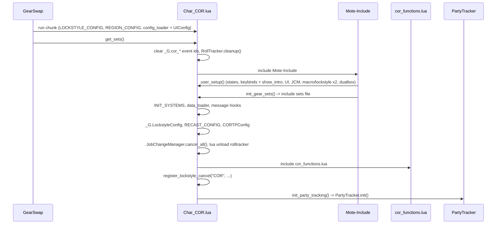
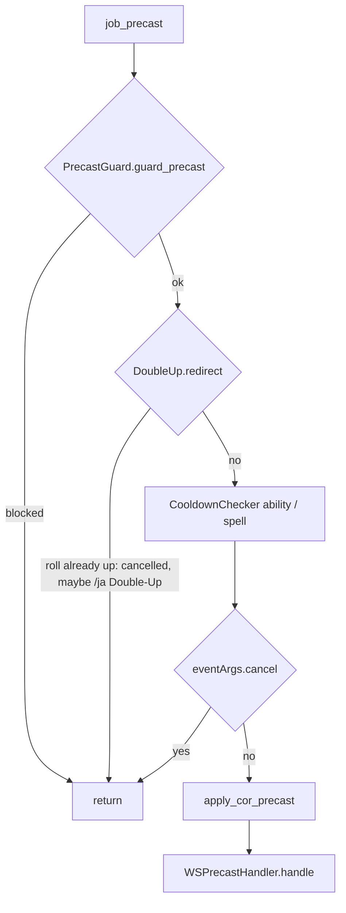
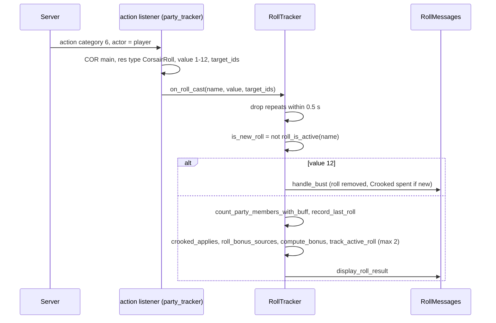

# COR (Corsair) job

The COR job area is 11 hook modules, the facade and 8 logic modules under
`shared/jobs/cor/functions/` (3 378 lines, facade included), one entry point
per character, eight config files and one sets file. GearSwap loads it when the
main job becomes COR; from then on Mote-Include calls its hooks on every
action, on status and buff changes, on `//gs c` commands and on state cycles,
and two raw Windower events registered by COR watch the packet stream.

Player-facing pages: [start page](../../user/jobs/cor/README.md),
[modes](../../user/jobs/cor/states.md), [sets](../../user/jobs/cor/sets.md).

What COR adds on top of the shared pipeline:

- **Phantom Roll tracking**: a raw `action` listener detects the player's own
  rolls and Double-Ups and prints a result block (value, lucky/unlucky, bonus
  with gear, job bonus and Crooked Cards, party coverage from the packet, bust
  risk of the next Double-Up).
- **Party job detection** from `0xDD`/`0xDF` packets, kept on `windower` so it
  survives reloads, to decide whether a roll's job bonus applies.
- **Roll precast**: a roll already up becomes a Double-Up (`DoubleUp.redirect`,
  before the cooldown check), Double-Up wears the set of the roll it doubles,
  Crooked Cards is timestamped, Luzaf's Ring follows `LuzafRing`, Fold's gear is
  held back unless two Busts are up.
- **Roll hold**: from the roll's `job_post_precast` to its `job_aftercast`,
  every gear update is marked handled, so the roll set is still worn when the
  roll lands.
- **Ranged**: `sets.precast.RA.Flurry1/2` through `classes.CustomRangedGroups`,
  `sets.midcast.RA[RangedMode]` through `MidcastManager`, a Triple Shot layer,
  and a bullet-pouch refill after `/ra`.
- **Weapon handling**: main weapon (its off hand only on /NIN or /DNC) and the
  gun from states, `HybridMode` PDT overlay, Refresh overlay under 50 % MP.
- **External addon swap**: the `rolltracker` addon is unloaded while COR is
  loaded and loaded again by `file_unload`.

Checked against the working tree on 2026-09-28. Code is cited by file and
function; line numbers are given only where no function name fits.

## Files

| Path | Lines | Role |
|------|------:|------|
| `_master/entry/Tetsouo_COR.lua` | 393 | Entry point (template): `LOCKSTYLE_CONFIG`, `REGION_CONFIG` and `UIConfig` at file level, `init_party_tracking`, `get_sets`, `job_sub_job_change`, `user_setup` (two macro/lockstyle blocks), `job_update`, `init_gear_sets`, `file_unload` |
| `shared/jobs/cor/functions/cor_functions.lua` | 120 | Facade: `message_buffs.lua`, the 11 hook files, `dualbox_manager` (its header still says "Logic modules (4)") |
| `shared/jobs/cor/functions/COR_PRECAST.lua` | 225 | `job_precast` (guard, `DoubleUp.redirect`, cooldown, `apply_cor_precast`, WS) / `job_post_precast` (TP gear, `apply_luzaf`, `hold_fold_gear`, `RollDebug.note_precast`, `RollHold.start`); starts `flurry_tracker` at load |
| `shared/jobs/cor/functions/COR_MIDCAST.lua` | 103 | `job_midcast` (empty) / `job_post_midcast` (RA with `RangedMode` + Triple Shot, Enhancing, `PASSTHROUGH_SKILLS`) |
| `shared/jobs/cor/functions/COR_AFTERCAST.lua` | 61 | `job_aftercast` (`RollHold.stop`, watchdog, bullet pouch), empty `job_post_aftercast` |
| `shared/jobs/cor/functions/COR_IDLE.lua` | 41 | `customize_idle_set` -> `SetBuilder.build_idle_set` |
| `shared/jobs/cor/functions/COR_ENGAGED.lua` | 41 | `customize_melee_set` -> `SetBuilder.build_engaged_set` |
| `shared/jobs/cor/functions/COR_STATUS.lua` | 20 | `job_status_change = LifecycleManager.status_change()` |
| `shared/jobs/cor/functions/COR_BUFFS.lua` | 40 | `job_buff_change = LifecycleManager.buff_change(retire_lost_roll)` |
| `shared/jobs/cor/functions/COR_COMMANDS.lua` | 370 | `job_self_command` router, `use_selected_ability` (`shot`, `roll1`, `roll2`), `job_state_change = LifecycleManager.state_change(on_state_change)` |
| `shared/jobs/cor/functions/COR_MOVEMENT.lua` | 34 | `job_handle_equipping_gear` -> `RollHold.hold_update` |
| `shared/jobs/cor/functions/COR_LOCKSTYLE.lua` | 49 | Lazy `LockstyleManager.create('COR', ..., 1, 'SAM')` wrappers |
| `shared/jobs/cor/functions/COR_MACROBOOK.lua` | 43 | Lazy `MacrobookManager.create('COR', ..., 'SAM', 1, 1)` wrapper |
| `shared/jobs/cor/functions/logic/party_tracker.lua` | 309 | `init_roll_listener` (raw `action`), `init` (raw `incoming chunk` `0xDD`/`0xDF`), `members_for_display`, `cleanup` |
| `shared/jobs/cor/functions/logic/roll_tracker.lua` | 834 | Roll state, `sync_with_buffs`, Crooked, bonus, party cache validation, coverage, display, `cleanup`. **Over the 800-line hard limit** |
| `shared/jobs/cor/functions/logic/roll_data.lua` | 439 | 31 rolls: values 1-11, lucky/unlucky, bust effect, `+Phantom Roll` step, job bonus |
| `shared/jobs/cor/functions/logic/roll_gear.lua` | 73 | `PHANTOM_ROLL_GEAR` and `RollGear.bonus()` read from the game |
| `shared/jobs/cor/functions/logic/roll_hold.lua` | 68 | `RollHold.start` / `stop` / `hold_update`, `HOLD_MAX` 5 s |
| `shared/jobs/cor/functions/logic/roll_debug.lua` | 261 | `//gs c rolldebug`: gear sent vs worn at landing, held updates, pieces out of reach, locked slots; summary; `<Char>/rolldebug.log` |
| `shared/jobs/cor/functions/logic/double_up.lua` | 45 | `DoubleUp.redirect(spell, eventArgs)` |
| `shared/jobs/cor/functions/logic/set_builder.lua` | 202 | Town, weapons (DW-aware), PDT, Refresh, movement; unused `apply_buff_gear` |
| `_master/config/cor/COR_STATES.lua` | 184 | All states (`CORStates.configure()`) |
| `_master/config/cor/COR_KEYBINDS.lua` | 37 | 7 binds, data only; `KeybindManager.create('COR', ...)` ([keybinds and custom states](../systems/keybinds-and-custom.md)) |
| `_master/config/cor/COR_CUSTOM.lua` | 119 | Player modes and gear rules (all examples commented out) |
| `_master/config/cor/COR_HUD.lua` | 31 | Per-job HUD `section_order` / `row_order` (empty) |
| `_master/config/cor/COR_LOCKSTYLE.lua` | 51 | `default = 3`, `by_subjob`, `get_style` |
| `_master/config/cor/COR_MACROBOOK.lua` | 68 | Book 3 page 1; `dualbox` commented; unused `get_macrobook` |
| `_master/config/cor/COR_TP_CONFIG.lua` | 60 | `_G.CORTPConfig` (Moonshade; `ranged_weapons` Anarchy +2 1000, Fomalhaut 500, never matched) |
| `_master/sets/cor_sets.lua` | 430 | Template sets (flat) |
| `shared/utils/messages/utilities/roll_messages.lua` | 596 | Roll result block (full / compact / line), bust, Double-Up window, active rolls |
| `shared/utils/messages/utilities/party_messages.lua` | 48 | `//gs c party` listing |
| `shared/utils/messages/formatters/jobs/message_cor.lua` + `data/jobs/cor_messages.lua` | 39 + 32 | PartyTracker load failures |
| `shared/utils/dualbox/roll_share.lua` | 108 | A COR alt's roll result re-printed on the main (`rollshow`) |
| `shared/utils/precast/flurry_tracker.lua` | 73 | Flurry I / II on this character -> `classes.CustomRangedGroups` |
| `shared/utils/inventory/quiver_manager.lua` | 170 | `after_ranged_attack` -> `check_and_refill` |
| `shared/data/job_abilities/COR_JA_DATABASE.lua` | 21 | Factory with the roll modules |

Character overlays: `_master/<Character>/config/cor/COR_REFILL.lua` for the
characters that ship refill lists, and one full overlay
(`_master/<Character>/entry/<Character>_COR.lua`, `config/cor/*`,
`sets/cor_sets.lua`) that adds a `RangedMode` (`Normal`, `Acc`) with a
`^numpad7` key and Quick Draw damage sets. Its headers still say
`@author Tetsouo`. Live folders are gitignored; the author's live COR uses the
modular `sets/cor/{cor_sets,armor,capes,weapons}.lua` (flat templates vs
modular live sets: `.claude/CODE_QUALITY.md` §15.1).

## How it works

### Load sequence


```mermaid
sequenceDiagram
    participant GS as GearSwap
    participant E as Char_COR.lua
    participant M as Mote-Include
    participant F as cor_functions.lua
    participant P as PartyTracker
    GS->>E: run chunk (LOCKSTYLE_CONFIG, REGION_CONFIG, config_loader + UIConfig)
    GS->>E: get_sets()
    E->>E: clear _G.cor_* event ids, RollTracker.cleanup()
    E->>M: include Mote-Include
    M->>E: user_setup() (states, keybinds + show_intro, UI, JCM, macro/lockstyle x2, dualbox)
    M->>E: init_gear_sets() -> include sets file
    E->>E: INIT_SYSTEMS, data_loader, message hooks
    E->>E: _G.LockstyleConfig, RECAST_CONFIG, CORTPConfig
    E->>E: JobChangeManager.cancel_all(), lua unload rolltracker
    E->>F: include cor_functions.lua
    E->>E: register_lockstyle_cancel("COR", ...)
    E->>P: init_party_tracking() -> PartyTracker.init()
```

- `init_party_tracking()` runs from `get_sets()` after the facade. Its comment
  records why it left `user_setup()`: Mote runs `user_setup()` inside the Mote
  include, before the COR modules exist, and an earlier throw there silently
  removed roll detection. If `init()` throws, it re-arms only the roll listener.
- The cleanup at the top of `get_sets()` runs in a fresh sandbox, so
  `_G.cor_action_event_id` / `_G.cor_party_event_id` are always nil there, and
  `RollTracker.cleanup()` runs on a module instance loaded before any state
  exists. GearSwap itself unregisters every event registered from a user file
  on each file load, and the old sandbox's `file_unload` already unregistered
  both handlers. Harmless, kept.
- `user_setup()`: `CORStates.configure()`; `COR_KEYBINDS` (which returns
  `KeybindManager.create('COR', ...)`) -> global `CORKeybinds`, `bind_all()`,
  whose `show_intro` `require`s `COR_MACROBOOK.lua` and `COR_LOCKSTYLE.lua` and
  thereby defines `select_default_macro_book` / `select_default_lockstyle`;
  `KeybindUI.smart_init("COR", ...)`; `JobChangeManager.initialize()` plus a
  first macrobook + 8 s lockstyle; `dualbox_manager` require; a **second**
  macrobook + 8 s lockstyle block, each call guarded. Both blocks run on a
  fresh load.
- `_G.RegionConfig` is set at file level, before `config_loader` is required,
  so `message_colors` reads the right region orange (see
  [messages](../systems/messages.md)).
- `config_loader` installs the module cache at file level
  (`shared/utils/core/module_cache.lua`), so every `require` in `user_setup()`
  and later is cached per sandbox.

### Precast

`job_precast` (`COR_PRECAST.lua`):


```mermaid
flowchart TD
    A[job_precast] --> B{PrecastGuard.guard_precast}
    B -- blocked --> Z[return]
    B -- ok --> R{DoubleUp.redirect}
    R -- "roll already up: cancelled, maybe /ja Double-Up" --> Z
    R -- no --> C[CooldownChecker ability / spell]
    C --> D{eventArgs.cancel}
    D -- yes --> Z
    D -- no --> E[apply_cor_precast]
    E --> W[WSPrecastHandler.handle]
```

- **`DoubleUp.redirect`** (`logic/double_up.lua`) runs before the cooldown
  check, the documented exception in `CODE_QUALITY.md` §4.1: a
  `CorsairRoll` whose buff is up is cancelled. With `Double-Up Chance` up and
  the roll equal to `_G.cor_last_roll.name` (or no last roll known), it sends
  `input /ja "Double-Up" <me>`; otherwise it warns (no chance, or Double-Up
  would go to the other roll).
- **`CooldownChecker`**: Quick Draw is skipped by its `MULTI_CHARGE_ABILITIES`
  list (charges). Every roll shares the `Phantom Roll` recast, which
  `recast_announce.lua` can report to the party (`RECAST_CONFIG.party_announce`).
- **`apply_cor_precast`** never stops the precast (its comment says so):
  - Crooked Cards: `_G.cor_crooked_timestamp = os.time()`;
  - Phantom Roll: `job_precast_corsairroll` records `_G.cor_last_roll.name`.
    Mote itself selects `sets.precast.CorsairRoll` by type and the roll's
    sub-set by name;
  - ranged attack (`action_type == 'Ranged Attack'`, type `Misc`):
    `FlurryTracker.apply_ranged_groups()` puts `Flurry1` / `Flurry2` in
    `classes.CustomRangedGroups` while that Flurry is up, so Mote's
    `get_ranged_set` picks `sets.precast.RA.Flurry1 / Flurry2`;
  - Double-Up: `job_precast_double_up` equips
    `sets.precast.CorsairRoll[<last roll>]`, else the base roll set (Mote's own
    choice for Double-Up is `sets.precast.JA`, which holds no slot).
- **`job_post_precast`**: `WSPrecastHandler.apply_tp_gear`, then
  `apply_luzaf` (roll or Double-Up: `ON` equips `sets.precast.LuzafRing` or
  `{left_ring = "Luzaf's Ring"}`; `OFF` equips `sets.precast.LuzafRingOff` when
  defined, else nothing), then `hold_fold_gear` (Fold with fewer than two
  `Bust` buffs: the slots of `sets.precast.JA.Fold` are re-equipped with what is
  worn), then `RollDebug.note_precast`, then `RollHold.start`.

### Roll hold

`logic/roll_hold.lua`, since 2026-09-28:

- `RollHold.start(spell)` (end of `job_post_precast`) sets
  `_G.cor_roll_hold = {name, until_time = os.clock() + 5}` for a `CorsairRoll`
  or Double-Up.
- `job_handle_equipping_gear` (`COR_MOVEMENT.lua`) calls
  `RollHold.hold_update(eventArgs)`: while the hold is open it sets
  `eventArgs.handled`, so Mote's `handle_equipping_gear` equips nothing, notes
  the held update for `rolldebug` and writes `ROLL gear update held during
  <roll>` to the trace. Past `until_time` it clears the hold.
- `RollHold.stop(spell)` is the first line of `job_aftercast`, so Mote's own
  aftercast re-equips normally.
- `DualWield` (`dual_wield.lua`) also skips while `cor_roll_hold` is set.
- `LifecycleManager.status_change` holds an engage or disengage that lands
  during any action (`midaction()`), so engaging while a roll goes out keeps
  the roll gear too.

The hold stops Mote's equip only. The wrappers laid over
`handle_equipping_gear` after Mote (Treasure Hunter engaged overlay, the
`<JOB>_CUSTOM.lua` idle / engaged gear) still run during it; see
[Known issues](#known-issues).

### Roll detection and tracking


```mermaid
sequenceDiagram
    participant S as Server
    participant L as action listener (party_tracker)
    participant RT as RollTracker
    participant MF as RollMessages
    S->>L: action category 6, actor = player
    L->>L: COR main, res type CorsairRoll, value 1-12, target_ids
    L->>RT: on_roll_cast(name, value, target_ids)
    RT->>RT: drop repeats within 0.5 s
    RT->>RT: is_new_roll = not roll_is_active(name)
    alt value 12
        RT->>MF: handle_bust (roll removed, Crooked spent if new)
    else
        RT->>RT: count_party_members_with_buff, record_last_roll
        RT->>RT: crooked_applies, roll_bonus_sources, compute_bonus, track_active_roll (max 2)
        RT->>MF: display_roll_result
    end
```

- **Listener**: `PartyTracker.init_roll_listener()`, one
  `raw_register_event('action')` stored in `_G.cor_action_event_id`. A
  category-6 action counts as a roll only when
  `res.job_abilities[act.param].type == 'CorsairRoll'` (Double-Up arrives under
  the id of the roll it doubles). It builds `target_ids` from every
  `act.targets[i].id` and passes it to `RollTracker.on_roll_cast`.
- **Double-Up vs fresh roll**: `roll_is_active` needs both an entry in
  `_G.cor_active_rolls` and `buffactive[roll]` (a roll cannot be re-cast while
  it is up). A reload empties the list, see Known issues.
- **Crooked** (`crooked_applies`, `consume_crooked`): a Double-Up inherits the
  record's `has_crooked`; a fresh roll takes Crooked when the buff is still
  visible or the precast timestamp is at most 60 s old, then the timestamp is
  spent. A bust of a fresh roll spends it too. Bonus x1.2 (`compute_bonus`).
- **Bonus** (`compute_bonus`, `RollData.calculate_bonus`): value for the roll
  number + job bonus + highest `+Phantom Roll` piece
  (`logic/roll_gear.lua` `PHANTOM_ROLL_GEAR`: Rostam 8, Lanun Knife 7, Regal
  Necklace 7, Commodore's Knife 6, Barataria Ring 5, Merirosvo Ring 3, only the
  highest counts) x the roll's step. The gear is read from the game
  (`windower.ffxi.get_items('equipment')`): in the raw listener
  `player.equipment` is GearSwap's copy from before the roll's precast.
- **Settled per roll** (`roll_bonus_sources`): the initial roll reads the gear
  and `is_job_in_party_zone`; a Double-Up keeps the record's job bonus and the
  higher of the record's gear value and the gear worn now.
- **Job bonus** (`is_job_in_party_zone`): own main / sub, then
  `_G.AltJobState.job` (the dual-box partner), then the packet cache (main job
  only). `validate_party_cache` clears the cache on a zone or party-size change
  and drops departed or 600 s-old entries.
- **Coverage** (`count_party_members_with_buff(roll_name, target_ids)`): the
  COR always counts; with `target_ids` a member counts when its `mob.id` is in
  the packet, else it is listed as missed. Without ids (`track_roll`, typed by
  hand) the old estimate stays: 8 yalms, or 16 with `LuzafRing = ON`, from
  `sqrt(mob.distance)` (which includes height, and trusts the mode, not the
  ring worn).
- **Expiry**: `retire_lost_roll` (`COR_BUFFS.lua`) calls
  `RollTracker.on_roll_buff_lost` when a buff ending in `" Roll"` is lost.
- **Values past a reload**: `track_active_roll` also writes
  `windower._cor_roll_values[roll] = {value, timestamp, has_crooked}`.
  `RollTracker.sync_with_buffs()` (called by `//gs c rolls` only) rebuilds the
  active list from the roll buffs worn, taking the value back when it is at
  most `ROLL_MAX_DURATION` (600 s) old.
- **Sandbox state**: `cor_active_rolls`, `cor_last_roll`,
  `cor_last_roll_display`, `cor_natural_eleven_active`,
  `cor_crooked_timestamp`, created at module load and reset by `cleanup()`.
- **Remote display**: when the COR is the dual-box alt, `roll_share.lua` sends
  each result to the main (`//gs c rollshow`), printed with the caster's name
  (`[<Name> COR]`) in the `ui rollremote` style.

### Party job detection

`PartyTracker.init()` cleans up, registers the roll listener, points
`_G.cor_party_jobs` / `_G.cor_party_state` at `windower._cor_party_jobs` /
`windower._cor_party_state` (the jobs only arrive when the server sends
`0xDD`, so they must survive a sandbox rebuild), then registers an
`incoming chunk` handler for `0xDD` / `0xDF` that stores
`{id, name, main_job, sub_job, main_job_level, timestamp}` per member, skipping
the player. `DualBoxManager.receive_alt_job` rewrites the partner's entry on
either box. `//gs c party` lists `windower.ffxi.get_party()` p1-p5, each with
its job from the cache (by id, else by name), else from `AltJobState` for the
alt, else "job unknown" (`PartyTracker.members_for_display`).

### Midcast

`job_post_midcast` (`COR_MIDCAST.lua`) loads the manager through
`MidcastDeps.load()`, notifies `MidcastWatchdog`, then:

- `spell.action_type == 'Ranged Attack'` ->
  `select_set({skill = 'RA', mode_state = state.RangedMode})`:
  `sets.midcast.RA[RangedMode]`, else `sets.midcast.RA`. Mote's `RangedMode`
  has only `Normal` unless the character's `COR_STATES` adds values. Under
  Triple Shot, `sets.midcast.RA.TripleShot` on top when defined (traced under
  `MIDCAST`).
- Enhancing Magic with `get_enhancing_target` and the enhancing family
  database.
- Healing, Elemental and Enfeebling Magic by skill name
  (`PASSTHROUGH_SKILLS`). No COR set file defines those base sets, so
  `select_set` returns false and Mote's choice stands.
- Any other magic skill from a subjob (Dark Magic on /DRK, Ninjutsu on /NIN) is
  routed afterwards by `MidcastFallback` (`shared/utils/midcast/midcast_fallback.lua`,
  hooked on `cleanup_midcast` by `INIT_SYSTEMS`), with its own skill.

Phantom Rolls and Quick Draw are instant and have no midcast. Obi / Orpheus
for Quick Draw (not Light / Dark Shot) and magical weaponskills is added at the
end of precast by `ElementalBelt` ([factories and helpers](../systems/factories-and-helpers.md#elementalbelt)).

### Aftercast, idle, engaged, status, buffs

- `job_aftercast` (`COR_AFTERCAST.lua`): `RollHold.stop`, watchdog, then
  `QuiverManager.after_ranged_attack(spell, 'Bronze Bullet', 'Brz. Bull. Pouch', 15)`:
  after a non-interrupted ranged attack with `Bronze Bullet` equipped, it runs
  `check_and_refill` 1 s later (inventory + wardrobes count, pouch used from the
  inventory when 15 or fewer are left). `job_post_aftercast` is empty.
- `customize_idle_set` -> `build_idle_set`: town (`sets.Adoulin` in Adoulin,
  `sets.idle.Town` elsewhere; the template has no `sets.idle.Town`, so other
  cities count as field) -> weapons -> (outside town) `sets.idle.PDT` when
  `HybridMode = PDT` -> `sets.idle.Refresh` when MP < 50 % -> `sets.MoveSpeed`
  when `state.Moving`.
- `customize_melee_set` -> `build_engaged_set`: Mote's base (keeps Mote's
  defense and kiting layers) + `sets.engaged.PDT` when `PDT` + weapons. No
  movement gear (AutoMove keeps `state.Moving` false while engaged anyway).
- Weapons (`apply_weapon`): `WeaponResolver.set_for('main', MainWeapon)` in full
  on /NIN or /DNC, otherwise only its `main` slot; `sets[RangeWeapon]` always
  (no resolver for the gun).
- `job_status_change` is the shared handler (Doom, hold during an action).
  `job_buff_change` is the shared handler with `retire_lost_roll` as its extra
  (skipped when Doom handled the buff).

## Mote states

Created by `CORStates.configure()` on every `user_setup()`. Keys from
`_master/config/cor/COR_KEYBINDS.lua`; `#numpad0` (AutoMedicine) comes from the
character's `config/COMMON_KEYBINDS.lua`.

| State | Values | Default | Key | Read by |
|-------|--------|---------|-----|---------|
| `HybridMode` | PDT, Normal | PDT | `^numpad9` | `SetBuilder.build_engaged_set` / `build_idle_set`; Mote `get_melee_set` |
| `MainWeapon` | Naegling | Naegling | `^numpad1` | `SetBuilder.apply_weapon`; `on_state_change` |
| `RangeWeapon` | Anarchy, Compensator | Anarchy | `^numpad2` | `SetBuilder.apply_weapon`; `on_state_change` |
| `QuickDraw` | Light, Fire, Ice, Wind, Earth, Thunder, Water, Dark | Light | `^numpad3` | `//gs c shot` (`SELECTED_ABILITY_COMMANDS`) |
| `LuzafRing` | ON, OFF | ON | `^numpad6` | `apply_luzaf`, `count_party_members_with_buff` (fallback estimate) |
| `MainRoll` | 20 rolls | Chaos Roll | `^numpad4` | `//gs c roll1` |
| `SubRoll` | 20 rolls | Samurai Roll | `^numpad5` | `//gs c roll2` |
| `FastCast` | 0..80 step 10 | 0 | none | `MidcastWatchdog` |
| `AutoMedicine` | shared On/Off | persisted | `#numpad0` (common key) | `PrecastGuard` |
| `RangedMode` (Mote) | Normal | Normal | Mote `!f9` | `COR_MIDCAST` (`mode_state`) |
| `CombatMode`, `TreasureMode` (optional states) | Off/On, Off/Tag/Full | Off, hidden | `!numpad0`, `!numpad.` once shown | `combat_mode.lua`, `treasure_hunter.lua` |

`job_state_change` is `LifecycleManager.state_change(on_state_change)`: the
shared part repaints the HUD (skipping `Moving`); `on_state_change` calls
`handle_equipping_gear(player.status)` when the field, with spaces stripped, is
`MainWeapon` or `RangeWeapon`, so both the state key and Mote's description
(`Main Weapon`) match. The cycle then re-equips again through Mote's
`handle_update`; the second pass sends nothing new.

## Commands

`job_self_command` (`COR_COMMANDS.lua`) tests, in order: `altjobupdate`
(passes up to six arguments, the 5th being the sender), `requestjob`, `ui`,
`debugmidcast`, `cyclestate`, watchdog, **CommonCommands** (with
`table.unpack(args)`), then:

| Command | Effect |
|---------|--------|
| `track_roll` / `trackroll <short> <value>` | Maps a short name (`chaos`, `sam`, `hunters`, ...) and calls `RollTracker.on_roll_cast` without `target_ids` |
| `rolls` | `RollTracker.sync_with_buffs()` then `show_active_rolls(_G.cor_active_rolls)` |
| `doubleup` / `du` | `RollTracker.display_double_up_status()` (45 s from the last roll or Double-Up) |
| `clearrolls` | `RollTracker.clear_all()` |
| `rolldebug` | `RollDebug.toggle()` |
| `party` | `show_party_members(PartyTracker.members_for_display())` |
| `clearparty` | Empties `_G.cor_party_jobs` in place (the `windower` table) |
| `shot` / `roll1` / `roll2` | `use_selected_ability`: `input /ja "<QuickDraw> Shot" <t>`, `"<MainRoll>" <me>`, `"<SubRoll>" <me>` |
| `testcolors` / `colors` | Colour table 1-255; unreachable, the common commands of the same names answer first |

`shot`, `roll1`, `roll2` send a normal `/ja`, so the ability goes through
`job_precast` like a macro. No key is bound to them. `du` reaches the COR
branch (it is no longer an alias of the common `debugupdate`).

## Set names the code looks up

Full player-facing list: [sets.md](../../user/jobs/cor/sets.md).

| Set | Looked up by |
|-----|--------------|
| `sets[<MainWeapon>]`, `sets[<RangeWeapon>]` | `SetBuilder.apply_weapon` (main through `WeaponResolver`) |
| `sets.idle` / `.Normal` | Mote base |
| `sets.idle.PDT`, `sets.idle.Refresh` | `build_idle_set` |
| `sets.idle.Town` (absent in T), `sets.Adoulin`, `sets.MoveSpeed` | `BaseSetBuilder` |
| `sets.engaged.Normal`, `sets.engaged.PDT` | Mote base, `build_engaged_set` |
| `sets.precast.CorsairRoll` + `[<roll>]` | Mote by type / name; `job_precast_double_up` |
| `sets.precast.LuzafRing` (absent in T), `sets.precast.LuzafRingOff` | `apply_luzaf` |
| `sets.precast.CorsairShot` (+ `[<shot>]`) | Mote by type / name |
| `sets.precast.JA[...]`, `.JA.Fold` | Mote; `hold_fold_gear` |
| `sets.precast.RA` (+ `.Flurry1/.Flurry2`), `sets.midcast.RA` (+ `[<RangedMode>]`, `.TripleShot`) | Mote `get_ranged_set`; `COR_MIDCAST` |
| `sets.precast.WS` + `[<ws>]` | Mote default |
| `sets.midcast['Enhancing Magic' / 'Healing Magic' / 'Elemental Magic' / 'Enfeebling Magic']` (absent) | `COR_MIDCAST` |
| `sets.DW.NoHaste/Haste/HasteII/MaxHaste` (commented in T) | `DualWield` |
| `sets.TreasureHunter` (absent in T) | `TreasureHunter` once shown |
| `sets.buff.Doom` | `DoomManager` |

## Configuration

| File / key | Default | Read by |
|------------|---------|---------|
| `<char>/config/cor/COR_STATES.lua` | see states | entry `user_setup` |
| `<char>/config/cor/COR_KEYBINDS.lua` | 7 binds | entry `user_setup`, `file_unload`, KeybindGuard |
| `<char>/config/cor/COR_CUSTOM.lua` | nothing active | `CustomStates` ([keybinds and custom states](../systems/keybinds-and-custom.md)) |
| `<char>/config/cor/COR_HUD.lua` | empty lists | HUD section / row order |
| `<char>/config/cor/COR_LOCKSTYLE.lua` `default`, `by_subjob`, `get_style` | 3 (factory fallback 1) | `LockstyleManager` via `get_style` |
| `<char>/config/cor/COR_MACROBOOK.lua` `default`, `solo`, `dualbox` | book 3 page 1 (factory fallback book 1) | `MacrobookManager` (`get_macrobook` is not called) |
| `<char>/config/cor/COR_TP_CONFIG.lua` -> `_G.CORTPConfig` | Moonshade 250; `ranged_weapons` | `TPBonusCalculator` through `get_weapon_bonus`, called with the main and sub weapons (`tp_bonus_handler.lua` `calculate_tp_gear`), never the ranged one |
| `<char>/config/cor/COR_REFILL.lua` | none in the template | refill system |
| `<char>/config/RECAST_CONFIG.lua` `party_announce['Phantom Roll']` | none | `recast_announce.lua` |
| `<char>/config/UI_CONFIG.lua` `rolls` block | full style, remote `same`, every detail on (template lines commented) | `roll_messages.lua` (`//gs c ui roll...`) |
| Constants | duplicate window 0.5 s, Crooked window 60 s, Double-Up window 45 s, party TTL 600 s, `ROLL_MAX_DURATION` 600 s, `HOLD_MAX` 5 s, pouch threshold 15 | `roll_tracker.lua` (`is_duplicate_report`, `crooked_applies`, `display_double_up_status`, `drop_departed_and_expired`), `roll_hold.lua`, `COR_AFTERCAST.lua` |

## State & lifetime

- Sandbox `_G` written: the Mote hooks (`job_precast`, `job_post_precast`,
  `job_midcast`, `job_post_midcast`, `job_aftercast`, `job_post_aftercast`,
  `job_status_change`, `job_buff_change`, `customize_idle_set`,
  `customize_melee_set`, `job_self_command`, `job_state_change`,
  `job_handle_equipping_gear`), the roll state above, `cor_roll_hold`,
  `cor_action_event_id`, `cor_party_event_id`, `cor_party_jobs`,
  `cor_party_state` (both point at `windower` tables), `CORTPConfig`,
  `CORKeybinds`, `LockstyleConfig`, `RECAST_CONFIG`, `RegionConfig`, the
  lockstyle / macrobook wrappers.
- `_G` read: `AltJobState` (job bonus), `DualBoxConfig` (party listing),
  `MidcastWatchdog`, `MidcastManagerDebugState`.
- `windower.*`: `_cor_party_jobs`, `_cor_party_state`, `_cor_roll_values`
  (survive `gs reload` and job changes; reset by `lua reload gearswap`).
- Events: the raw `action` and `incoming chunk` handlers, unregistered by
  `file_unload` / `PartyTracker.cleanup` and by GearSwap on every file load.
- Coroutines: the two 8 s lockstyles and the 1 s pouch check after `/ra`; none
  is cancelled by a reload.
- Outside GearSwap: `rolltracker` unloaded while COR is loaded, loaded again by
  `file_unload` (also on every subjob change).
- Subjob change: `job_sub_job_change` hands over to `JobChangeManager`, which
  reloads. The reload wipes `cor_active_rolls` and `cor_last_roll`.

## Interactions

- Precast: `PrecastGuard`, `CooldownChecker`, `WSPrecastHandler`,
  `RecastAnnounce` ([precast pipeline](../systems/precast-pipeline.md)).
- Midcast: `MidcastDeps`, `MidcastManager`, `MidcastFallback`,
  `MidcastWatchdog` ([midcast and buffs](../systems/midcast-and-buffs.md)).
- Equipment hooks: `ElementalBelt`, `DualWield` (skips during the roll hold),
  `TreasureHunter`, `CombatMode`, `CustomStates`
  ([factories and helpers](../systems/factories-and-helpers.md#common-features-per-job)).
- Messages: `roll_messages`, `party_messages`, `message_cor`, `message_buffs`
  ([messages](../systems/messages.md)). The ability message handler skips
  `CorsairRoll` because the tracker prints its own line.
- Dual-box: `_G.AltJobState`, `receive_alt_job`'s cache patch, `roll_share`
  ([dualbox](../systems/dualbox.md)).
- HUD: `UI_DISPLAY_BUILDER.lua` patterns for `QuickDraw`, `Roll`, `Luzaf`;
  `UI_LOADER.lua` has a COR fallback bind list with states COR does not define
  (`WeaponSet`), used only without a keybind file.

## Invariants & gotchas

- `DoubleUp.redirect` must stay before `CooldownChecker`: the `Phantom Roll`
  recast would cancel the press before it could become a Double-Up.
- `RollHold.start` must stay the last call of `job_post_precast` and
  `RollHold.stop` the first of `job_aftercast`.
- The roll listener and the party listener are raw handlers; their ids live in
  the sandbox `_G`, so only the same sandbox's `file_unload` (or GearSwap's own
  cleanup) can remove them.
- A Double-Up and a fresh roll produce the same packet; only `roll_is_active`
  tells them apart, and it depends on sandbox state that a reload clears.
- Crooked Cards belongs to the roll: a Double-Up keeps it, a fresh roll spends
  the precast timestamp.
- Roll gear is read from the game, never from `player.equipment`, inside the
  raw listener.
- `/ra` is `type = "Misc"` with `action_type = 'Ranged Attack'`: test
  `action_type` for ranged attacks.
- The off hand of `sets[MainWeapon]` is dropped unless the subjob is NIN or DNC.

## For maintainers / AI

### Testing offline

Lua 5.1 is installed (`lua5.1`, `luac5.1`):

```bash
# syntax of every COR file
for f in $(git ls-files 'shared/jobs/cor/*.lua' '_master/config/cor/*.lua' _master/entry/Tetsouo_COR.lua _master/sets/cor_sets.lua); do luac5.1 -p "$f"; done
```

Pure logic runs outside the game with stubs: `roll_data.lua` needs nothing;
`double_up.lua` needs `buffactive`, `_G.cor_last_roll`, `send_command` and a
stub `MessageFormatter` in `package.loaded`; `roll_hold.lua` needs `os.clock`
and `rawget`. `roll_tracker.lua` needs `windower.ffxi.get_party`,
`get_mob_by_id`, `buffactive`, `player` and `state`. Load a module with
`package.path = 'D:/Windower Tetsouo/addons/GearSwap/data/?.lua;' .. package.path`
and call its functions; the gitignored `scripts/audit/` folder holds the
existing differential tests (`difftest_*.lua`) as models.

In game: `//gs c rolldebug` (per-roll gear report and `rolldebug.log`),
`//gs c trace on` (roll hold lines `ROLL`, `MIDCAST`, `TP`), `//gs c debugmidcast`,
`//gs c party`, `//gs c rolls`.

### Traps

- `COR_TP_CONFIG.get_weapon_bonus` receives the main and sub weapon, never the
  gun: the `ranged_weapons` list matches nothing.
- The COR facade still includes `message_buffs.lua`; BRD does not.
- The template `COR_KEYBINDS.lua` leaves `^numpad7`, `^numpad8` and `^numpad0`
  free; one character overlay uses `^numpad7` for `RangedMode`.
- A new command name must be checked against the common commands and every
  `config/alt/*_ALT_COMMANDS.lua` key: the job command wins over an alt command
  of the same name, which stays reachable as `//gs c alt <name>`.
- Changing a roll set's `main` or `range` costs the player's TP in game; the
  template roll set holds Rostam and Compensator on purpose.

### Extending

- New roll: add it to `RollData.rolls` (11 values, lucky/unlucky, bust effect,
  `phantom_roll_bonus`, `job_bonus`), a shortcut to `track_roll`'s table, and
  the name to `MainRoll` / `SubRoll`.
- Roll-specific precast gear: `sets.precast.CorsairRoll["<Roll>"] =
  set_combine(sets.precast.CorsairRoll, {...})`; Double-Up picks it up.
- New `+Phantom Roll` item: add it to `PHANTOM_ROLL_GEAR` (`roll_gear.lua`).
- New command: add a branch after the CommonCommands block.

## Known issues

- **Roll hold does not cover the post-Mote wrappers** (confirmed in code, not
  seen in game). `RollHold.hold_update` only sets `eventArgs.handled`, which
  stops Mote's `handle_equipping_gear`. The Treasure Hunter engaged overlay
  (`treasure_hunter.lua` `install`, when Treasure Mode is shown and Tag/Full
  while engaged) and the `COR_CUSTOM.lua` idle / engaged gear
  (`custom_states.lua` `hooks.gear`; `Guards.hands_off` has no roll-hold test)
  still equip during the hold. With the empty template CUSTOM and Treasure
  Mode hidden, nothing happens.
- `roll_tracker.lua` is 834 lines, above the 800-line hard limit (not in the
  `CLAUDE.md` list of oversized files).
- After a reload with a roll still up, the next Double-Up is reported as a
  fresh roll and loses Crooked: `cor_active_rolls` starts empty and only
  `//gs c rolls` calls `sync_with_buffs` (`roll_is_active`, `on_roll_cast`).
- After a reload, `DoubleUp.redirect` sends Double-Up for any roll that is up
  (no last roll known), even when the other roll was the last one.
- `COR_TP_CONFIG.ranged_weapons` is never matched (see Traps). Open question:
  whether a gun's TP bonus should count for every weaponskill or only ranged
  ones.
- `rolltracker` is unloaded on every COR load and loaded on every COR unload,
  including each subjob change and for players who never used it.
- Both macrobook/lockstyle blocks of `user_setup()` run on a fresh load: the
  macro book is set twice and two lockstyles are scheduled.
- The event cleanup at the top of `get_sets()` never finds anything, and its
  comment describes a duplicate-handler scenario that cannot happen.
- `_G.AltJobState.job` counts for the job bonus whether or not the partner is
  online, in the party or in the zone (`is_job_in_party_zone`).
- The `on_roll_cast` docstring says `target_ids` is nil for "//gs c roll typed
  by hand"; the manual command is `track_roll`.
- `testcolors` / `colors` in `COR_COMMANDS.lua` are unreachable (the common
  commands answer first).
- `COR_MOVEMENT.lua` and `COR_BUFFS.lua` export to `_G` only, with no module
  `return` (the dual-export rule of `CODE_QUALITY.md` §5.2).
- The `COR_TP_CONFIG.lua` comment says the handler passes the main weapon
  only; it passes main and sub.
- Template `sets.Adoulin` is a 2-slot set used as the full idle base; no
  `sets.idle.Town` exists.
- Dead code: `_G.cor_natural_eleven_active` (written, never read),
  `RollData.get_roll_names`, `clear_natural_eleven` / `clear_last_roll` outside
  `clear_all`, `_G.cor_pending_roll_*` (cleared, never set),
  `job_post_aftercast`, `SetBuilder.apply_buff_gear`,
  `COR_MACROBOOK.get_macrobook`, `show_roll_natural_eleven` /
  `show_roll_bust_rate` / `show_roll_not_found`.
- Pending in-game checks: a member out of reach listed as missed from the
  packet; engage / disengage while a roll goes out keeps the roll gear; a
  Curing Waltz, a Divine Waltz or a Quick Draw right after a roll is not
  reported as a roll; the roll hold (2026-09-28) keeps Regal Necklace on a roll
  pressed while running.
- Fixed, no longer issues: `LuzafRing = OFF` not applied to Double-Up
  (`apply_luzaf` tests Double-Up since 2026-09-25); ON with no
  `sets.precast.LuzafRing` puts Luzaf's Ring in the left ring;
  `job_handle_equipping_gear` is live (roll hold, 2026-09-28); `party` lists
  the live party instead of the raw cache; the roll listener's 98-192 id
  fallback, the DressUp watchdog, the forced re-equip block and `CustomClass`
  (2026-09-25); `REGION_CONFIG` loaded too late for the warning colour
  (2026-09-25); roll gear read from the game (2026-09-28); the user doc now
  documents `shot`, `roll1`, `roll2`.
