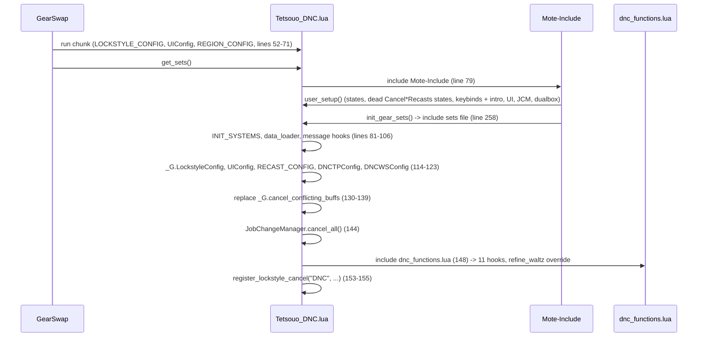
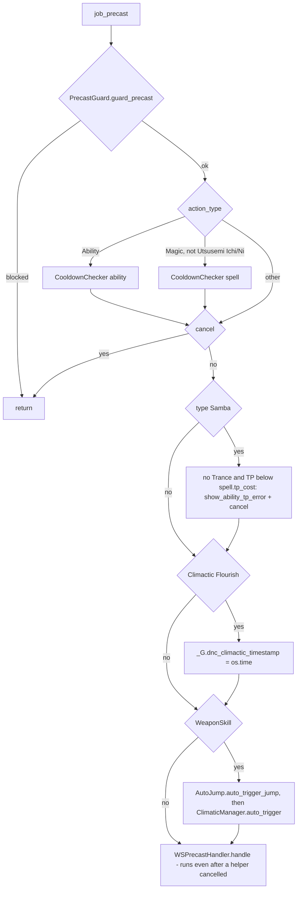
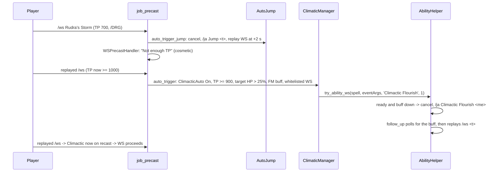

# DNC (Dancer) job

The DNC job area has 11 hook modules plus 5 logic modules under
`shared/jobs/dnc/functions/` (1 645 lines with the facade), an entry point per
character, six config files, one refill overlay and one sets file. It also owns,
or is the main user of, three shared helpers: `shared/utils/dnc/waltz_manager.lua`,
`shared/utils/drg/auto_jump.lua` and `shared/utils/precast/ability_helper.lua`.
GearSwap loads it when the main job becomes DNC (`Tetsouo_DNC.lua`). From then on
Mote-Include calls its hooks on every action, on status and buff changes, on
`//gs c` commands and on state cycles.

What DNC adds on top of the shared pipeline:

- **Weaponskill auto-triggers**: Jump / High Jump when TP is short on /DRG
  (`AutoJump`), then Climactic Flourish before configured weaponskills
  (`AbilityHelper.try_ability_ws`), each cancelling the WS and replaying it.
- **Buff-driven set selection**: engaged base from Saber Dance / Fan Dance /
  HybridMode, and weaponskill variants `.SaberDance`, `.FanDance`, `.Clim` and
  their combinations, applied before the TP-bonus earring.
- **Dancer commands**: `step` (Presto + MainStep/AltStep rotation), `dance`,
  `smartbuff` (dance + samba + subjob buffs), plus the shared `waltz` /
  `aoewaltz` (WaltzManager).
- **Mote overrides**: `refine_waltz` becomes a no-op (waltz on full-HP targets,
  wake-up utility) and `cancel_conflicting_buffs` keeps only the Sneak /
  Spectral Jig / Stoneskin cancels, which also removes Mote's recast abort
  message on DNC.

Every file in scope was read in full except the gear content of the sets files
(only structure and set names were read, as gear choice is out of scope). All
line numbers refer to the working tree on 2026-09-19.

## Files

| Path | Lines | Role |
|------|------:|------|
| `_master/entry/Tetsouo_DNC.lua` | 272 | Entry point (template): config preload, `get_sets` (with the `cancel_conflicting_buffs` override), `job_sub_job_change`, `user_setup`, `job_update`, `init_gear_sets`, `file_unload` |
| `shared/jobs/dnc/functions/dnc_functions.lua` | 116 | Facade: includes `message_buffs` and the 11 hook files, requires `dualbox_manager` |
| `shared/jobs/dnc/functions/DNC_PRECAST.lua` | 216 | `refine_waltz` override, `job_precast` (guard, cooldown, Samba TP, Climactic timestamp, Jump/Climactic triggers, WS handler), `job_post_precast` (WS variant, TP gear) |
| `shared/jobs/dnc/functions/DNC_MIDCAST.lua` | 95 | `job_midcast` (Utsusemi: Ichi shadow cancel) / `job_post_midcast` (MidcastManager for Ninjutsu, Healing, Enhancing) |
| `shared/jobs/dnc/functions/DNC_AFTERCAST.lua` | 48 | `job_aftercast`: watchdog tick only |
| `shared/jobs/dnc/functions/DNC_IDLE.lua` | 43 | `customize_idle_set` -> `SetBuilder.build_idle_set` |
| `shared/jobs/dnc/functions/DNC_ENGAGED.lua` | 43 | `customize_melee_set` -> `SetBuilder.build_engaged_set` |
| `shared/jobs/dnc/functions/DNC_STATUS.lua` | 19 | `LifecycleManager.status_change()` |
| `shared/jobs/dnc/functions/DNC_BUFFS.lua` | 43 | `LifecycleManager.buff_change(on_dance_change)`: Doom, then a gear refresh on Saber/Fan Dance gain or loss |
| `shared/jobs/dnc/functions/DNC_COMMANDS.lua` | 189 | `job_self_command` router; `job_state_change = LifecycleManager.state_change()` |
| `shared/jobs/dnc/functions/DNC_MOVEMENT.lua` | 48 | Unused `get_dnc_movement_status` |
| `shared/jobs/dnc/functions/DNC_LOCKSTYLE.lua` | 47 | Lazy `LockstyleManager.create('DNC', ...)` wrappers |
| `shared/jobs/dnc/functions/DNC_MACROBOOK.lua` | 42 | Lazy `MacrobookManager.create('DNC', ...)` wrapper |
| `shared/jobs/dnc/functions/logic/climactic_manager.lua` | 84 | Climactic Flourish auto-trigger conditions |
| `shared/jobs/dnc/functions/logic/ws_variant_selector.lua` | 121 | WS variant from dance buff + Climactic (buff or 5 s timestamp) |
| `shared/jobs/dnc/functions/logic/step_manager.lua` | 97 | `step`: recast check, Presto, Main/Alt rotation |
| `shared/jobs/dnc/functions/logic/smartbuff_manager.lua` | 272 | `smartbuff` (dance, samba, subjob buffs) and `dance` |
| `shared/jobs/dnc/functions/logic/set_builder.lua` | 165 | Engaged base (Saber/Fan Dance, HybridMode), weapon + sub override, town, movement |
| `shared/utils/dnc/waltz_manager.lua` | 261 | `//gs c waltz` / `aoewaltz` tier selection (any job with DNC main or sub) |
| `shared/utils/drg/auto_jump.lua` | 222 | Jump before WS on /DRG (shared with WAR) |
| `shared/utils/precast/ability_helper.lua` | 138 | `try_ability_ws` used for Climactic Flourish |
| `shared/utils/smartbuff/subjob_war_buffs.lua` | 73 | /WAR buffs (shared with THF) |
| `_master/config/dnc/DNC_STATES.lua` | 278 | All Mote states, unused `DNCStates.validate()` |
| `_master/config/dnc/DNC_KEYBINDS.lua` | 131 | 11 numpad binds, `bind_all` / `unbind_all` / `show_intro` |
| `_master/config/dnc/DNC_LOCKSTYLE.lua` | 64 | Lockstyle 2, `by_subjob`, `get_style` |
| `_master/config/dnc/DNC_MACROBOOK.lua` | 78 | Book/page per subjob and per dual-box partner job |
| `_master/config/dnc/DNC_TP_CONFIG.lua` | 68 | Moonshade piece, weapon TP bonus table, `_G.DNCTPConfig` |
| `_master/config/dnc/DNC_WS_CONFIG.lua` | 70 | Climactic whitelist, `min_tp` 900, `min_target_hpp` 25 |
| `_master/Tetsouo/config/dnc/DNC_REFILL.lua` | 22 | Refill list (Tetsouo overlay) |
| `_master/sets/dnc_sets.lua` | 1014 | Template sets (flat) |
| `shared/data/job_abilities/DNC_JA_DATABASE.lua` + `dnc/*.lua` (15) | 26 + 650 | Ability data for chat messages (`ability_message_handler.lua:77-83`); not read by DNC logic |

Live copies (gitignored): `Tetsouo/Tetsouo_DNC.lua` (identical to the template
except the header line 33 and line 258, which includes `sets/dnc/dnc_sets.lua`),
`Tetsouo/config/dnc/*` (identical except `DNC_MACROBOOK.lua`: default book 5,
solo only `DRG` book 6 and `default` book 6, dual-box entries only for `DRG`),
`DNC_REFILL.lua` identical to the overlay, and
`Tetsouo/sets/dnc/{dnc_sets,armor,capes,weapons}.lua` (modular, 950 + 119 + 52
+ 44 lines; weapon sets copied by the loop at `dnc_sets.lua:62-64`).
`Kaories/` and `_master/Kaories/` contain no DNC files.

## How it works

### Load sequence

Same shape as [BLM](blm.md#load-sequence) and every job
([core lifecycle](../systems/core-lifecycle.md)): `user_setup()` and
`init_gear_sets()` run inside `include('Mote-Include.lua')`, before
`INIT_SYSTEMS` and before the DNC hook files exist.

`user_setup()` (`Tetsouo_DNC.lua:186-241`): `DNCStates.configure()`; two states
`CancelAbilityRecasts` / `CancelSpellRecasts` that nothing reads (198-199);
`DNCKeybinds.bind_all()` (which calls `show_intro()` and, through its `require`s
of `DNC_MACROBOOK` / `DNC_LOCKSTYLE`, defines `select_default_macro_book` and
`select_default_lockstyle` as on BLM); `KeybindUI.smart_init("DNC", ...)` (the UI
waits for `state.MainStep`, `ui_lifecycle.lua:50-51`); `JobChangeManager.initialize()`
plus immediate macro book and lockstyle after 8 s; `dualbox_manager`.

The two Mote overrides:

- `refine_waltz` (`DNC_PRECAST.lua:89-92`) is a global no-op defined when the
  facade includes `DNC_PRECAST`. Mote's `user_precast` calls it on every action
  (`Mote-Globals.lua:90-93`), so a waltz typed or macroed by hand is never
  re-tiered, never downgraded for TP and never blocked on full HP.
- `_G.cancel_conflicting_buffs` (`Tetsouo_DNC.lua:130-139`) keeps Spectral Jig
  / Sneak / Stoneskin. It drops Mote's recast abort for Waltz/Samba, the
  Monomi and Utsusemi: Ichi cancels, and the Saber Dance (waltz, Trance) / Fan
  Dance (samba) cancels (`Mote-Utility.lua:15-50`). The comment (125-129) says
  the dance cancels are skipped to keep the dance set variants.

### Precast

`job_precast` (`DNC_PRECAST.lua:144-184`):

- `job_precast_samba` (104-115) cancels a samba when TP is below its own
  `spell.tp_cost` (`res/job_abilities.lua`: Drain Samba 100, II 250, III 400,
  Aspir Samba 100, II 250, Haste Samba 350), and lets every samba through under
  Trance. Before commit `5530584` it used a flat 350 for all of them.
- `job_precast_weaponskill` (118-137) returns early after a helper cancels, but
  `job_precast` does not check `eventArgs.cancel` before line 181, so
  `WSPrecastHandler.handle` still runs: after an AutoJump takeover it prints
  "Not enough TP" for the cancelled WS.
- The 5-line guard/cooldown contract is shared
  ([precast pipeline](../systems/precast-pipeline.md#the-job_precast-contract)).
  Utsusemi Ichi/Ni skip the spell cooldown check (156).
- `job_post_precast` (195-210): `WSVariantSelector.apply_variant` first, then
  `WSPrecastHandler.apply_tp_gear`, so the Moonshade Earring survives the
  variant (the order THF gets wrong, see [THF](thf.md#known-issues)).
- Mote's default precast uses the resource type as category
  (`Mote-Include.lua:647-655`): `sets.precast.Step[name]`, `.Flourish1[name]`,
  `.Flourish2[name]`, `.Waltz[name]`, `.Samba`, `.Jig`, `.JA[name]` for
  `JobAbility` (Saber/Fan Dance, Trance, Presto, No Foot Rise, Jump). Climactic
  Flourish is `Flourish3`; there is no `sets.precast.Flourish3`, so it falls back
  to `sets.precast.JA`.

### Weaponskill auto-triggers

- AutoJump is documented in [factories and helpers](../systems/factories-and-helpers.md#autojump-sharedutilsdrgauto_jumplua)
  (Jump 158 / High Jump 159, below 1000 TP, `state.JumpAuto`, re-entrancy flag
  `_G.AUTO_JUMP_SEQUENCE_ACTIVE`, replay on `spell.target.raw`).
- `ClimaticManager.auto_trigger` (`climactic_manager.lua:57-78`) requires at
  least 3 Finishing Moves: `has_three_finishing_moves` (45-52) looks for any of
  `Finishing Move 3`, `4`, `5` or `Finishing Move (6+)` (`FINISHING_MOVES_3_PLUS`,
  32-37). The game shows one buff per count up to 5, then the single `(6+)` buff
  (`res/buffs.lua:376-380,580`). Before 2026-09-19 it tested
  `Finishing Move (3+)`, which is not a buff name, so only 6+ moves triggered it.
- `DNCWSConfig` is captured when the module is first required (29), at the first
  DNC precast, after the entry has set `_G.DNCWSConfig`.
- `try_ability_ws` (`ability_helper.lua:118-136`) replays on `<t>`, not on the
  original target, and sets `_G.DNC_AUTO_WS_RECAST`, which nothing reads.
  `can_use_ability` is always true because Windower resources have no `levels`
  ([precast pipeline](../systems/precast-pipeline.md#abilityhelper)).

### Weaponskill variants and engaged sets

`WSVariantSelector.apply_variant` (`ws_variant_selector.lua:99-115`):

| Buffs | Set equipped (first that exists) |
|-------|----------------------------------|
| dance + Climactic | `WS[ws][dance].Clim`, `WS[ws][dance]`, `WS[ws].Clim` |
| dance only | `WS[ws][dance]` |
| Climactic only | `WS[ws].Clim` |
| none | Mote's base WS set stays |

`dance` is `SaberDance` if `buffactive['Saber Dance']`, else `FanDance` if
`buffactive['Fan Dance']` (63-73). Climactic is the buff, or the precast
timestamp younger than 5 s, consumed on first use (44-56).

`SetBuilder.select_engaged_base` (`set_builder.lua:42-82`):

1. Saber Dance up and `sets.engaged.SaberDance` exists -> `.SaberDance.PDT` in
   PDT mode if defined, else `.SaberDance`.
2. HybridMode PDT -> `sets.engaged.FanDance` if Fan Dance is up, else
   `sets.engaged.PDT`.
3. Other HybridMode -> `sets.engaged[mode]` (`Normal`).
4. Otherwise Mote's set.

Then `apply_weapon` (96-125): `sets[MainWeapon]` (main + sub pair) and, when
`SubWeaponOverride` is not `Off`, `result.sub = sets[override].sub`. The field is
written into `result`, which is a fresh table only when the weapon set was
combined; with a missing weapon set it is the sets table itself.

Mote's `buff_change` does not re-equip (`Mote-Include.lua:1023-1043`), so
`DNC_BUFFS.lua` passes `on_dance_change` (25-38) to `LifecycleManager.buff_change`:
when `Saber Dance` or `Fan Dance` (the exact resource names, 16-19) is gained or
lost while engaged, it calls `handle_equipping_gear(player.status)` inside the
buff event, so the engaged base follows at once. It skips the refresh while
`midaction()` is true (the aftercast re-equips anyway) and when idle (the idle
builder does not read the dances). A Doom event is handled by `DoomManager`
and never reaches it.

`build_idle_set` (147-159): town / Adoulin base (`base_set_builder.lua:65-84`),
weapon, then `sets.MoveSpeed` outside town while moving.

### Steps, dances, smartbuff

`StepManager.execute_step` (`step_manager.lua:39-91`): picks `MainStep`, or
`AltStep` when `UseAltStep` is On and `CurrentStep` is `Alt`; aborts with a
cooldown message if the shared step recast (id 220) is on cooldown; sends
`input /ja "Presto" <me>` and hands the step to `AbilityHelper.follow_up`,
which replays it once Presto registers rather than after a fixed second, when
Presto (236) is ready, not active and level >= 77, else `input /ja "<step>" <t>` (78-80); flips
`CurrentStep`. Steps are job abilities (`prefix="/jobability"`), so they go out
as `/ja`, the prefix GearSwap intercepts for them (`statics.lua:51-59`,
`triggers.lua:74-82`); until 2026-09-19 they were sent as `/ma`.

`SmartbuffManager.apply()` (`smartbuff_manager.lua:242-266`) builds one queue,
cast 2 s apart (`cast_queue`, 72-82):

1. The dance from `state.Dance` (Saber 219 / Fan 224) unless already active.
2. The samba from `state.Samba` (shared recast 216) unless Fan Dance is the
   selected dance, the samba buff is up (`Drain Samba II` grants
   `Drain Samba`), or TP is below its own cost (45-49, 147-174). The queued
   samba then passes `job_precast_samba`, which checks the same cost.
3. Subjob: /WAR `SubjobWarBuffs`, /NIN Utsusemi Ni then Ichi, /SAM Hasso (138);
   others nothing (223-234).

`dance` / `fandance` (`apply_dance`, 127-136) casts `state.Dance` even when
active.

### Waltzes

`//gs c waltz` / `aoewaltz` are common commands (`COMMON_COMMANDS.lua:58-84`):
DNC main or sub only, `cancel Saber Dance` first, then
`WaltzManager.cast_curing_waltz('<stpc>')` or `cast_divine_waltz()`. Tier choice
from the missing HP of the current target (self exact; party member estimated
only when `isallymember` is set, which a raw `windower.ffxi.get_mob_by_target`
table never carries, `waltz_manager.lua:109`), falling back through every tier
by recast and TP. TP comparisons ignore Trance. Full description in
[factories and helpers](../systems/factories-and-helpers.md#dnc-waltzmanager).

### Midcast

Mote equips its default (`sets.midcast.FastRecast`, empty on DNC, then
name/map/skill), then `job_post_midcast` (`DNC_MIDCAST.lua:45-81`) notifies the
watchdog and calls `MidcastManager.select_set` for Ninjutsu, Healing and
Enhancing. None of the three base sets exists in template or live sets, so each
call returns at `midcast_manager.lua:627` and `sets.midcast.Utsusemi` from Mote
stands. `job_midcast` (29-38) schedules `cancel 66/444/445/446` (every Copy
Image buff) 2.3 s after an Utsusemi: Ichi midcast starts, whatever happens to
the cast.

### Aftercast, idle, engaged, status, buffs

- `job_aftercast` (`DNC_AFTERCAST.lua:28-40`): watchdog tick. It is a local
  function exported only to `_G` (no module return).
- Idle/engaged: `SetBuilder` above. Mote's own base is `sets.idle` /
  `sets.idle.Town` and `sets.engaged.Normal` (OffenseMode `Normal` exists,
  `Mote-Include.lua:569-577`); `set_builder` replaces it.
- Status: shared `LifecycleManager` handler (Doom). Buffs: the shared handler
  plus the dance refresh above. See
  [core lifecycle](../systems/core-lifecycle.md).

## Mote states

Created by `DNCStates.configure()` (`_master/config/dnc/DNC_STATES.lua:38-207`)
on every `user_setup()`. Keybinds from `DNC_KEYBINDS.lua:31-54`, all
`cyclestate`; `^` = Ctrl, `#` = Apps. No bind is filtered by subjob.

| State | Values | Default | Key | Read by |
|-------|--------|---------|-----|---------|
| `HybridMode` (Mote) | PDT, Normal | PDT | `^numpad9` | `set_builder.lua:52,64-78` |
| `MainWeapon` | Twashtar, Mpu Gandring, Demersal | Mpu Gandring | `^numpad1` | `set_builder.lua:98-99` |
| `SubWeaponOverride` | Off, Blurred | Off | `^numpad2` | `set_builder.lua:112-121` |
| `MainStep` | Box Step, Quickstep, Feather Step | Box Step | `^numpad3` | `step_manager.lua:52,56`; UI readiness |
| `AltStep` | Quickstep, Box Step, Feather Step | Quickstep | `^numpad4` | `step_manager.lua:50` |
| `UseAltStep` | On, Off | On | `^numpad5` | `step_manager.lua:41` |
| `CurrentStep` | Main, Alt | Main | none | `step_manager.lua:49,84-89` |
| `ClimacticAuto` | On, Off | On | `^numpad6` | `climactic_manager.lua:64` |
| `JumpAuto` | On, Off | On | `^numpad7` | `auto_jump.lua:144` |
| `Dance` | Saber Dance, Fan Dance | Saber Dance | `^numpad8` | `smartbuff_manager.lua:105,150` |
| `Samba` | Haste Samba, Drain Samba II, Aspir Samba | Haste Samba | `^numpad0` | `smartbuff_manager.lua:153` |
| `CombatWeaponMode` | Normal, TPBonus, Clim, ClimTPBonus | Normal | none | nothing |
| `FastCast` | 0..80 step 10 | 0 | none | `midcast_watchdog.lua:58-60` |
| `AutoMedicine` | shared On/Off | persisted | `#numpad0` | `DNC_STATES.lua:203-206` |
| `Buff['Climactic Flourish']` (Mote) | boolean | from `buffactive` | none | nothing (Mote keeps it updated) |
| `CancelAbilityRecasts`, `CancelSpellRecasts` | false | false | none | nothing (`Tetsouo_DNC.lua:198-199`) |

Step values are the resource names (`Quickstep`, `res/job_abilities.lua` id
201, as in `shared/data/job_abilities/dnc/dnc_steps_subjob.lua:16`); they were
`Quick Step` until 2026-09-19, a name no ability has.

## Commands

`job_self_command` (`DNC_COMMANDS.lua:60-170`): `altjobupdate`, `requestjob`,
`watchdog`, CommonCommands (98-108, `table.unpack(args)`), `ui`,
`debugmidcast`, `cyclestate`, then DNC commands. `fandance` is also a key of
`Tetsouo/config/alt/DNC_ALT_COMMANDS.lua:47`; the DNC command answers first, so it
runs here even when the dual-box partner plays DNC (`//gs c alt fandance` sends
the partner's).

| Command | Effect | Handler |
|---------|--------|---------|
| dual-box, `watchdog`, common, `ui`, `debugmidcast`, `cyclestate` | shared | 71-142 |
| `waltz` / `aoewaltz` | WaltzManager (common command) | `COMMON_COMMANDS.lua:58-94` |
| `jump` | `DRGJumpManager.execute_jump` (common command, no WS replay) | `COMMON_COMMANDS.lua:43-53` |
| `smartbuff` / `buffself` | `SmartbuffManager.apply()` | 145-149 |
| `step` | `StepManager.execute_step()` | 152-156 |
| `dance` / `fandance` | `SmartbuffManager.apply_dance()` (uses `state.Dance`) | 159-163 |

`job_state_change` is `LifecycleManager.state_change()` (178-180): UI refresh
except for `Moving`. `CycleHandler` re-equips after a cycle, so weapon and
HybridMode changes apply at once. The only name it reads is `Moving`, a state
with no description, so it acts the same whether it receives a state's key
(`HybridMode`) or its description (`Hybrid Mode`, what Mote passes).

## Set names the code looks up

T = `_master/sets/dnc_sets.lua`, L = `Tetsouo/sets/dnc/dnc_sets.lua`.

| Set | Looked up by | T | L |
|-----|--------------|---|---|
| `sets.idle`, `sets.idle.Town`, `sets.Adoulin`, `sets.MoveSpeed` | Mote, `BaseSetBuilder` | 111, 967 (`= sets.MoveSpeed`, 2 slots), 970, 961 | 71, 907 (full), 910, 901 |
| `sets.idle.PDT` | nothing (IdleMode `Normal`) | 128 | 88 |
| `sets.engaged`, `.Normal`, `.PDT` | Mote, `select_engaged_base` | 144, 147, 164 | 99, 102, 119 |
| `sets.engaged.FanDance`, `.SaberDance`, `.SaberDance.PDT` | `set_builder.lua:50-67` | 181, 198, 215 | 136, 153, 170 |
| `sets['Mpu Gandring']`, `['Twashtar']`, `['Demersal']`, `['Blurred']` (needs `.sub`) | `set_builder.lua:99,114` | 84, 90, 96, 102 | `weapons.lua:22-41` |
| `sets.precast.WS[ws].Clim/.FanDance/.FanDance.Clim/.SaberDance/.SaberDance.Clim` for Ruthless Stroke, Dancing Edge, Rudra's Storm, Shark Bite | `ws_variant_selector.lua:85-95` | 472-866 | 412-806 |
| `sets.precast.WS`, Pyrrhic Kleos, Evisceration, Exenterator, Aeolian Edge | Mote default precast | 448, 883-931 | 394, 823-871 |
| `sets.precast.Step` + `['Feather Step']`, `['Quickstep']`, `['Box Step']` | Mote (type `Step`) | 239, 255, 259, 263 | 194, 210, 214, 218 |
| `sets.precast.Flourish1` + Violent/Animated/Desperate, `.Flourish2` + Reverse | Mote | 268-313 | 223-268 |
| `sets.precast.Waltz` (+ `['Healing Waltz']`), `.Samba`, `.Jig` | Mote | 319-343 | 274-298 |
| `sets.precast.JA['No Foot Rise' / 'Trance' / 'Provoke' / 'Fan Dance' / 'Jump' / 'High Jump']` | Mote | 349-394 | 304-346 |
| `sets.precast.FC`, `.FC.Utsusemi` | Mote | 420, 439 | 369, 385 |
| `sets.midcast.FastRecast` (empty), `.Utsusemi` | Mote | 953, 954 | 893, 894 |
| `sets.midcast['Ninjutsu' / 'Healing Magic' / 'Enhancing Magic']` | MidcastManager base | **absent** | **absent** |
| `sets.buff.Doom` | DoomManager | 988 | 928 |
| `sets.buff['Saber Dance']`, `['Climactic Flourish']`, `sets.TreasureHunter` | nothing | 980, 984, 1005 | 920, 924, 945 |

## Configuration

| File / key | Default | Where the default lives | Read by |
|------------|---------|-------------------------|---------|
| `<char>/config/dnc/DNC_STATES.lua` | see states | file | entry `user_setup` |
| `<char>/config/dnc/DNC_KEYBINDS.lua` | 11 binds | file | entry `user_setup`, `file_unload` |
| `<char>/config/dnc/DNC_LOCKSTYLE.lua` `default`, `by_subjob`, `get_style` | 2 | file (30, 35-41, 51-58); factory fallback 1 (`DNC_LOCKSTYLE.lua:29`) | `LockstyleManager` through `get_style` |
| `<char>/config/dnc/DNC_MACROBOOK.lua` `default`, `solo`, `dualbox` | template book 4 (WAR 5); live book 5/6 | file (33, 37-45, 56-72); factory 1/1 | `MacrobookManager` |
| `Tetsouo/config/dnc/DNC_TP_CONFIG.lua` -> `_G.DNCTPConfig` | Moonshade ear1 +250; Aeneas 500, Centovente 1000 | file | `TPBonusCalculator` (main weapon only) |
| `Tetsouo/config/dnc/DNC_WS_CONFIG.lua` -> `_G.DNCWSConfig` | Rudra's Storm, Ruthless Stroke, Shark Bite; `min_tp` 900; `min_target_hpp` 25 | file | `climactic_manager.lua:29,69-73` |
| `Tetsouo/config/dnc/DNC_REFILL.lua` | 7 items | overlay | refill system |
| Hard-coded | step recast 220, Presto 236 and level 77 (`step_manager.lua:61,71-74`), samba costs (`smartbuff_manager.lua:45-49`), Utsusemi cancel delay 2.3 s, auto-jump 1000 TP | code | - |

`DNC_WS_CONFIG.min_tp` (900) is lower than the 1000 TP `WSPrecastHandler`
requires. When TP really is between 900 and 999, Climactic Flourish is used and
the replayed WS is then cancelled by the TP check. The config comment (38-40)
says the 900 compensates for GearSwap reading a stale TP value.

## State & lifetime

- Sandbox `_G`: `dnc_climactic_timestamp`, `DNC_AUTO_WS_RECAST`,
  `AUTO_JUMP_SEQUENCE_ACTIVE`, `temp_tp_bonus_gear`, `DNCTPConfig`,
  `DNCWSConfig`, `UIConfig`, `LockstyleConfig`, `RECAST_CONFIG`,
  `is_recast_ready`, `is_on_cooldown`, `cancel_conflicting_buffs` (replaced),
  `refine_waltz` (replaced), `DNCKeybinds`, the Mote hooks, factory exports,
  `get_dnc_movement_status`. All reset on `gs reload`.
- Module locals: lazy-loaded modules, `ClimaticManager`'s captured
  `DNCWSConfig`, AbilityHelper's resource cache.
- `windower.*`: nothing written by DNC code; no Windower events.
- Coroutines and command queue: 8 s lockstyle; AutoJump chain (1-3 s);
  `wait` chains of `smartbuff`, `step`, Climactic replay and the Utsusemi
  cancels (Windower command queue, they survive a reload).
- Subjob change: `job_sub_job_change` (`Tetsouo_DNC.lua:171-180`) ->
  `JobChangeManager.on_job_change` -> `gs reload`.

## Interactions

- Precast: `PrecastGuard`, `CooldownChecker`, `WSPrecastHandler`,
  `AbilityHelper`, `AutoJump` ([precast pipeline](../systems/precast-pipeline.md),
  [factories and helpers](../systems/factories-and-helpers.md#drg-jumps)).
  AutoJump is shared with WAR.
- Midcast: `MidcastManager`, `MidcastDeps`, `MidcastWatchdog`
  ([midcast and buffs](../systems/midcast-and-buffs.md)).
- `WaltzManager` and `DRGJumpManager` serve every job with DNC or DRG as
  subjob; `SubjobWarBuffs` is shared with [THF](thf.md).
- Messages: `message_buffs`, `show_ability_tp_error`, `show_ability_cooldown`,
  `show_waltz_heal`, `show_multi_status` ([messages](../systems/messages.md)).
- Lockstyle/macrobook factories, `LifecycleManager`, `CommonCommands`,
  `CycleHandler`, UI, dual-box ([dualbox](../systems/dualbox.md)).

## Invariants & gotchas

- `user_setup()` runs before the DNC hook files; the Mote overrides are
  installed in `get_sets` after it.
- A helper that cancels a WS (`AutoJump`, `try_ability_ws`) does not stop
  `job_precast`: code added after line 169 runs for a cancelled WS unless it
  checks `eventArgs.cancel`.
- The WS variant must be equipped before the TP piece (`DNC_PRECAST.lua:198-209`).
- Saber Dance blocks waltzes and Fan Dance blocks sambas in game; DNC does not
  cancel them for manual macros (only `//gs c waltz` cancels Saber Dance).
- The Climactic timestamp is written for any Climactic precast, even one the
  server then refuses; the next WS within 5 s uses `.Clim`.
- `set_builder` returns set tables directly (`sets.engaged.PDT`, ...); any
  in-place write to `result` without a prior `set_combine` edits the sets.
- The two `Cancel*Recasts` states in `user_setup` do nothing; the real
  suppression of Mote's recast abort is the `cancel_conflicting_buffs` override.

## Extending

- New Climactic weaponskill: add its name to `DNCWSConfig.climactic_ws` and
  `.Clim` (and dance) variants to both set files.
- New WS variant key: extend `best_variant` in `ws_variant_selector.lua`; keep
  the call before `apply_tp_gear`.
- New samba: add it to `SAMBAS` with its real TP cost and buff name, and to
  `state.Samba`. `job_precast_samba` already reads the cost from `spell.tp_cost`.
- New step: add the **resource** name (`Quickstep`, `Stutter Step`) to
  `MainStep` / `AltStep` and a `sets.precast.Step['<name>']`.
- New smartbuff subjob: add a `collect__buffs` returning
  `(abilities, status)` and a branch in `collect_subjob_buffs`.
- New command: add it after the CommonCommands block. A name that is also an alt config key then runs here; the alt's
  version stays reachable as `//gs c alt <name>`.

## Known issues

- DNC prints "Not enough TP" for a WS that AutoJump has just taken over:
  `DNC_PRECAST.lua:177-181`.
- Waltz tier is never sized for a targeted party member (`isallymember`):
  `waltz_manager.lua:109`.
- `DNC_WS_CONFIG.min_tp` 900 lets Climactic fire for a WS that the 1000 TP
  check then cancels: `DNC_WS_CONFIG.lua:41`.
- Utsusemi: Ichi cancels every Copy Image buff 2.3 s after midcast starts; a
  cast shorter than that loses its new shadows: `DNC_MIDCAST.lua:32-37`.
- The override drops Mote's Monomi Sneak cancel: `Tetsouo_DNC.lua:130-139`.
- /SAM smartbuff queues Hasso, which needs a two-handed weapon:
  `smartbuff_manager.lua:202-215`.
- `Centovente` in the TP config never matches (sub slot):
  `DNC_TP_CONFIG.lua:44`.
- Midcast routing is a no-op (base sets absent) and duplicates THF's skeleton:
  `DNC_MIDCAST.lua:45-81`.
- Initial macrobook/lockstyle depend on the `show_intro` side effect
  (`DNC_KEYBINDS.lua:111,118`).
- Template `sets.idle.Town` is a 2-slot set used as a full idle base:
  `_master/sets/dnc_sets.lua:967`.
- Dead code and states: `CombatWeaponMode`, `Buff['Climactic Flourish']`,
  `Cancel*Recasts`, `_G.DNC_AUTO_WS_RECAST`, `get_dnc_movement_status`,
  `DNCStates.validate`, `sets.buff['Saber Dance' / 'Climactic Flourish']`,
  `sets.TreasureHunter`; headers still list `jump_manager`
  (`Tetsouo_DNC.lua:43`, `dnc_functions.lua:90`) and claim subjob-filtered
  keybinds (`Tetsouo_DNC.lua:24`).
- User doc out of date (`docs/user/jobs/dnc/states.md`: Alt keys, missing
  `Samba` and `AutoMedicine`, `CombatWeaponMode` described as auto-managed,
  `Quick Step`).
