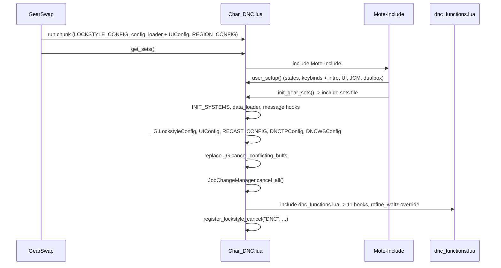
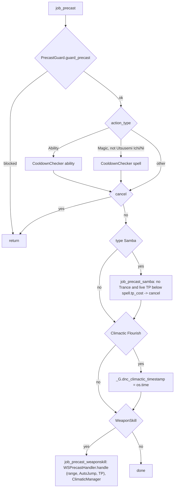
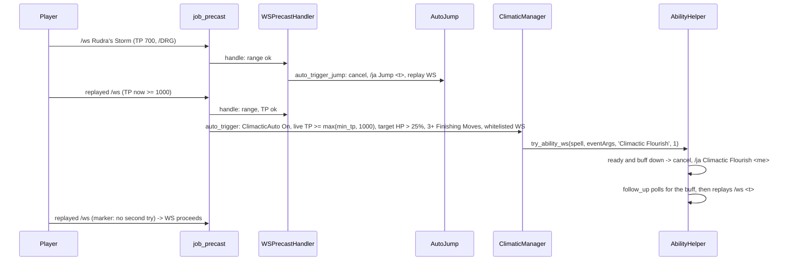

# DNC (Dancer) job

The DNC job area has 11 hook modules, the facade and 5 logic modules under
`shared/jobs/dnc/functions/` (1 625 lines), one entry point per character,
eight config files and one sets file. It also owns, or is the main user of,
two shared helpers: `shared/utils/dnc/waltz_manager.lua` and
`shared/utils/precast/ability_helper.lua`; it uses two more that serve every
job, `shared/utils/drg/auto_jump.lua` (through `WSPrecastHandler.handle`) and
the buff command `shared/utils/buffs/buff_command.lua` (with its engine `self_buff_manager.lua`). GearSwap loads it when the main
job becomes DNC. From then on Mote-Include calls its hooks on every action, on
status and buff changes, on `//gs c` commands and on state cycles.

Player-facing pages: [start page](../../user/jobs/dnc/README.md),
[modes](../../user/jobs/dnc/states.md), [sets](../../user/jobs/dnc/sets.md).

What DNC adds on top of the shared pipeline:

- **Weaponskill auto-triggers**: Jump / High Jump when TP is short on /DRG
  (`AutoJump`, run by `WSPrecastHandler.handle` after the range check, as on
  every job), then Climactic Flourish before
  configured weaponskills (`ClimaticManager` -> `AbilityHelper.try_ability_ws`,
  after the full check), each cancelling the WS and replaying it. A WS out of
  range spends neither (2026-09-28).
- **Buff-driven set selection**: engaged base from Saber Dance / Fan Dance /
  HybridMode (refreshed on the dance's buff change), and weaponskill variants
  `.SaberDance`, `.FanDance`, `.Clim` and their combinations, applied before the
  TP-bonus earring.
- **Dancer commands**: `step` (Presto + MainStep/AltStep rotation), `dance`,
  and its part of the common `buff` (dance + samba through `_G.job_buff_extra`,
  before the job and subjob lists), plus the shared `waltz` /
  `aoewaltz` (WaltzManager).
- **Mote overrides**: `refine_waltz` becomes a no-op and
  `cancel_conflicting_buffs` keeps only the Sneak / Spectral Jig / Stoneskin
  cancels, which also removes Mote's recast abort message on DNC.

Checked against the working tree on 2026-09-28. Code is cited by file and
function; line numbers are given only where no function name fits.

## Files

| Path | Lines | Role |
|------|------:|------|
| `shared/entry/dnc.lua` | 297 | Entry point (the same for every character; `<Char>_DNC.lua` and its template `_master/entry/Tetsouo_DNC.lua` are one `include` of it): config preload, `get_sets` (with the `cancel_conflicting_buffs` override), `job_sub_job_change`, `user_setup`, `job_update`, `init_gear_sets`, `file_unload` |
| `shared/jobs/dnc/functions/dnc_functions.lua` | 107 | Facade: includes `message_buffs` and the 11 hook files, requires `dualbox_manager` |
| `shared/jobs/dnc/functions/DNC_PRECAST.lua` | 206 | `refine_waltz` override, `job_precast` (guard, cooldown, `job_precast_samba`, Climactic timestamp, `job_precast_weaponskill`, WS handler), `job_post_precast` (WS variant, TP gear) |
| `shared/jobs/dnc/functions/DNC_MIDCAST.lua` | 89 | `job_midcast` (empty) / `job_post_midcast` (MidcastManager for Ninjutsu, Healing, Enhancing) |
| `shared/jobs/dnc/functions/DNC_AFTERCAST.lua` | 38 | `job_aftercast`: watchdog tick only (exported to `_G` only) |
| `shared/jobs/dnc/functions/DNC_IDLE.lua` | 41 | `customize_idle_set` -> `SetBuilder.build_idle_set` |
| `shared/jobs/dnc/functions/DNC_ENGAGED.lua` | 40 | `customize_melee_set` -> `SetBuilder.build_engaged_set` |
| `shared/jobs/dnc/functions/DNC_STATUS.lua` | 19 | `LifecycleManager.status_change()` |
| `shared/jobs/dnc/functions/DNC_BUFFS.lua` | 43 | `LifecycleManager.buff_change(on_dance_change)`: Doom, then a gear refresh on Saber/Fan Dance gain or loss |
| `shared/jobs/dnc/functions/DNC_COMMANDS.lua` | 194 | `job_buff_extra` (global: DNC's part of `//gs c buff`), `job_self_command` router; `job_state_change = LifecycleManager.state_change()` |
| `shared/jobs/dnc/functions/DNC_MOVEMENT.lua` | 13 | Header only, kept for the 12-module layout |
| `shared/jobs/dnc/functions/DNC_LOCKSTYLE.lua` | 47 | Lazy `LockstyleManager.create('DNC', ...)` wrappers |
| `shared/jobs/dnc/functions/DNC_MACROBOOK.lua` | 42 | Lazy `MacrobookManager.create('DNC', ...)` wrapper |
| `shared/jobs/dnc/functions/logic/climactic_manager.lua` | 84 | `ClimaticManager.auto_trigger`, `has_three_finishing_moves`, `WS_MIN_TP` 1000 |
| `shared/jobs/dnc/functions/logic/ws_variant_selector.lua` | 121 | `apply_variant`: WS variant from dance buff + Climactic (buff or 5 s timestamp) |
| `shared/jobs/dnc/functions/logic/step_manager.lua` | 96 | `execute_step`: recast check, Presto, Main/Alt rotation |
| `shared/jobs/dnc/functions/logic/smartbuff_manager.lua` | 199 | `collect_dance`, `collect_samba`, `collect_extra` (dance then samba, for `job_buff_extra`), `apply_dance`; `apply` calls the common `BuffCommand.apply()` |
| `shared/jobs/dnc/functions/logic/set_builder.lua` | 167 | `select_engaged_base` (Saber/Fan Dance, HybridMode), `apply_weapon` (+ sub override), idle base (`BaseSetBuilder.select_idle_base`: town, HybridMode), movement |
| `shared/utils/dnc/waltz_manager.lua` | 261 | `//gs c waltz` / `aoewaltz` tier selection (any job with DNC main or sub) |
| `shared/utils/drg/auto_jump.lua` | 218 | Jump before WS on /DRG, run by `WSPrecastHandler.handle` (every job) |
| `shared/utils/precast/ability_helper.lua` | 409 | `try_ability_ws` (Climactic Flourish), `follow_up` (`step`) |
| `shared/utils/buffs/buff_command.lua` | 59 | `//gs c buff` of every job: `_G.job_buff_extra` (DNC), then the `job` and `subjob` lists of `_common/combat/BUFF_CONFIG.lua`, through `self_buff_manager.lua` |
| `_master/config/dnc/DNC_STATES.lua` | 211 | All Mote states |
| `_master/config/dnc/DNC_KEYBINDS.lua` | 42 | 10 binds, data only; `KeybindManager.create('DNC', ...)` ([keybinds and custom states](../systems/keybinds-and-custom.md)) |
| `_master/config/dnc/DNC_CUSTOM.lua` | 119 | Player modes and gear rules (all examples commented out) |
| `_master/config/dnc/DNC_HUD.lua` | 32 | Per-job HUD `section_order` / `row_order` (empty) |
| `_master/config/dnc/DNC_LOCKSTYLE.lua` | 62 | Lockstyle 2, `by_subjob`, `get_style` |
| `_master/config/dnc/DNC_MACROBOOK.lua` | 78 | Book/page per subjob and per dual-box partner job |
| `_master/config/dnc/DNC_TP_CONFIG.lua` | 68 | Moonshade piece, weapon TP bonus table (Aeneas, Centovente), `_G.DNCTPConfig` |
| `_master/config/dnc/DNC_WS_CONFIG.lua` | 71 | Climactic whitelist, `min_tp` 1000, `min_target_hpp` 25, `should_use_climactic` |
| `_master/config/dnc/DNC_REFILL.lua` | 42 | Refill list, every line commented (`extra`, `default`, `subjobs` examples): `//gs c rf` uses the common list of `REFILL_CONFIG.lua` until one is uncommented |
| `_master/sets/dnc_sets.lua` | 1040 | Template sets (flat; data, size not a defect) |
| `shared/data/job_abilities/DNC_JA_DATABASE.lua` + `dnc/*.lua` | 26 + ... | Ability data for chat messages; not read by DNC logic |

Character overlay: `_master/<Character>/dnc/` holds `DNC_MACROBOOK.lua`
and `DNC_REFILL.lua`; the author's live DNC uses the modular
`dnc/{dnc_sets,armor,capes,weapons}.lua`.

## How it works

### Load sequence

Same shape as every job ([core lifecycle](../systems/core-lifecycle.md)):
`user_setup()` and `init_gear_sets()` run inside `include('Mote-Include.lua')`,
before `INIT_SYSTEMS` and before the DNC hook files exist.


```mermaid
sequenceDiagram
    participant GS as GearSwap
    participant E as Char_DNC.lua
    participant M as Mote-Include
    participant F as dnc_functions.lua
    GS->>E: run chunk (LOCKSTYLE_CONFIG, config_loader + UIConfig, REGION_CONFIG)
    GS->>E: get_sets()
    E->>M: include Mote-Include
    M->>E: user_setup() (states, keybinds + intro, UI, JCM, dualbox)
    M->>E: init_gear_sets() -> include sets file
    E->>E: INIT_SYSTEMS, data_loader, message hooks
    E->>E: _G.LockstyleConfig, UIConfig, RECAST_CONFIG, DNCTPConfig, DNCWSConfig
    E->>E: replace _G.cancel_conflicting_buffs
    E->>E: JobChangeManager.cancel_all()
    E->>F: include dnc_functions.lua -> 11 hooks, refine_waltz override
    E->>E: register_lockstyle_cancel("DNC", ...)
```

`user_setup()`: `DNCStates.configure()`; `DNCKeybinds.bind_all()` (the module
is `KeybindManager.create('DNC', ...)`, whose `show_intro()`, through its
`require`s of `DNC_MACROBOOK` / `DNC_LOCKSTYLE`, defines
`select_default_macro_book` and `select_default_lockstyle`);
`KeybindUI.smart_init("DNC", ...)` (the UI waits for `state.MainStep`);
`JobChangeManager.initialize()` plus immediate macro book and lockstyle after
8 s; `dualbox_manager`.

The two Mote overrides:

- `refine_waltz` (`DNC_PRECAST.lua`) is a global no-op defined when the facade
  includes `DNC_PRECAST`. Mote's `user_precast` calls it on every action
  (`Mote-Globals.lua`), so a waltz typed or macroed by hand is never re-tiered,
  never downgraded for TP and never blocked on full HP. On other jobs with
  /DNC, Mote's own `refine_waltz` stays (it re-tiers a waltz on self).
- `_G.cancel_conflicting_buffs` (entry, `get_sets`) keeps Spectral Jig / Sneak
  / Stoneskin. It drops Mote's recast abort for Waltz / Samba, the Monomi and
  Utsusemi: Ichi cancels, and the Saber Dance (waltz, Trance) / Fan Dance
  (samba) cancels (`Mote-Utility.lua` `cancel_conflicting_buffs`). The
  Utsusemi: Ichi shadow cancel now comes from `utsusemi_shadows.lua` for every
  job; the entry comment still says "Utsusemi handled by DNC_MIDCAST".

### Precast

`job_precast` (`DNC_PRECAST.lua`):


```mermaid
flowchart TD
    A[job_precast] --> B{PrecastGuard.guard_precast}
    B -- blocked --> Z[return]
    B -- ok --> C{action_type}
    C -- Ability --> D[CooldownChecker ability]
    C -- "Magic, not Utsusemi Ichi/Ni" --> E[CooldownChecker spell]
    D --> F{cancel}
    E --> F
    C -- other --> F
    F -- yes --> Z
    F -- no --> G{type Samba}
    G -- yes --> H["job_precast_samba: no Trance and live TP below spell.tp_cost -> cancel"]
    G -- no --> I
    H --> I{Climactic Flourish}
    I -- yes --> J[_G.dnc_climactic_timestamp = os.time]
    I -- no --> K
    J --> K{WeaponSkill}
    K -- yes --> L["job_precast_weaponskill: WSPrecastHandler.handle (range, AutoJump, TP), ClimaticManager"]
    K -- no --> Z3[done]
```

- `job_precast_samba` cancels a samba when the live TP
  (`shared/utils/core/live_tp.lua`) is below its own `spell.tp_cost`
  (resources: Drain Samba 100, II 250, III 400, Aspir Samba 100, II 250, Haste
  Samba 350), and lets every samba through under Trance.
- `job_precast_weaponskill`: `WSPrecastHandler.handle`, which checks range
  first (a WS out of range spends no Jump), then runs AutoJump (it builds the
  TP the WS lacks, so it comes before the TP check; a WS it took over makes
  `handle` return false, with no false "Not enough TP"), then the TP check;
  then Climactic, which needs 1000 TP anyway. Until 2026-09-28 both helpers
  ran before any check; until 2026-09-30 DNC called `WSPrecastHandler.validate`
  and AutoJump itself.
- Utsusemi Ichi / Ni skip the spell cooldown check.
- `job_post_precast`: `WSVariantSelector.apply_variant` first, then
  `WSPrecastHandler.apply_tp_gear`, so the Moonshade Earring survives the
  variant.
- Mote's default precast uses the resource type as category:
  `sets.precast.Step[name]`, `.Flourish1[name]`, `.Flourish2[name]`,
  `.Waltz[name]`, `.Samba`, `.Jig`, `.JA[name]` for `JobAbility`. Climactic
  Flourish is `Flourish3`; there is no `sets.precast.Flourish3`, so it falls
  back to `sets.precast.JA`.

### Weaponskill auto-triggers


```mermaid
sequenceDiagram
    participant U as Player
    participant P as job_precast
    participant W as WSPrecastHandler
    participant J as AutoJump
    participant C as ClimaticManager
    participant H as AbilityHelper
    U->>P: /ws Rudra's Storm (TP 700, /DRG)
    P->>W: handle: range ok
    W->>J: auto_trigger_jump: cancel, /ja Jump <t>, replay WS
    U->>P: replayed /ws (TP now >= 1000)
    P->>W: handle: range, TP ok
    P->>C: auto_trigger: ClimacticAuto On, live TP >= max(min_tp, 1000), target HP > 25%, 3+ Finishing Moves, whitelisted WS
    C->>H: try_ability_ws(spell, eventArgs, 'Climactic Flourish', 1)
    H->>H: ready and buff down -> cancel, /ja Climactic Flourish <me>
    H->>H: follow_up polls for the buff, then replays /ws <t>
    U->>P: replayed /ws (marker: no second try) -> WS proceeds
```

- AutoJump: [factories and helpers](../systems/factories-and-helpers.md#autojump-sharedutilsdrgauto_jumplua)
  (Jump 158 / High Jump 159, below 1000 live TP, `state.JumpAuto`, re-entrancy
  flag `_G.AUTO_JUMP_SEQUENCE_ACTIVE`).
- `ClimaticManager.auto_trigger` needs at least 3 Finishing Moves:
  `has_three_finishing_moves` looks for `Finishing Move 3`, `4`, `5` or
  `Finishing Move (6+)` (the game shows one buff per count up to 5, then the
  single `(6+)` buff). It reads the live TP and never fires below 1000:
  `DNC_WS_CONFIG.min_tp` can only raise that.
- `DNCWSConfig` is captured when `climactic_manager.lua` is first required, at
  the first DNC precast, after the entry has set `_G.DNCWSConfig`.
- `try_ability_ws` replays on `<t>`, not on the original target. The ability is
  tried at most once per WS (the replayed WS carries a marker on
  `windower._ability_replay`); nothing is tried under Amnesia or Impairment;
  `can_use_ability` reads `windower.ffxi.get_abilities().job_abilities`
  ([precast pipeline](../systems/precast-pipeline.md)).

### Weaponskill variants and engaged sets

`WSVariantSelector.apply_variant`:

| Buffs | Set equipped (first that exists) |
|-------|----------------------------------|
| dance + Climactic | `WS[ws][dance].Clim`, `WS[ws][dance]`, `WS[ws].Clim` |
| dance only | `WS[ws][dance]` |
| Climactic only | `WS[ws].Clim` |
| none | Mote's base WS set stays |

`dance` is `SaberDance` if `buffactive['Saber Dance']`, else `FanDance` if
`buffactive['Fan Dance']`. Climactic is the buff, or the precast timestamp
younger than 5 s, consumed on first use (`climactic_active`, now read first,
for every weaponskill). Under Climactic, `sets.buff['Climactic Flourish']` is
equipped after the variant, on any weaponskill (since 2026-09-29).

`SetBuilder.select_engaged_base`:

1. Saber Dance up and `sets.engaged.SaberDance` exists -> `.SaberDance.PDT` in
   PDT mode if defined, else `.SaberDance`.
2. HybridMode PDT -> `sets.engaged.FanDance` if Fan Dance is up, else
   `sets.engaged.PDT`.
3. Other HybridMode -> `sets.engaged[mode]` (`Normal`).
4. Otherwise Mote's set.

Then, with Saber Dance up, `sets.buff['Saber Dance']` is combined on top
(since 2026-09-29), then `apply_weapon`: `WeaponResolver.set_for('main', MainWeapon)` (the weapon
set, main + sub; with `equip_without_set` in `_common/combat/WEAPON_CONFIG.lua`, a
value with no set but a weapon name gives `{main = value}`), then, when
`SubWeaponOverride` is not `Off`, `result.sub = sets[override].sub`. That field
is written into `result`, which is a fresh table only when the weapon set was
combined; with no weapon set it is the engaged set table itself.

Because the engaged base is a sets table, not Mote's result, Mote's defense
and kiting layers never reach DNC's engaged gear. `build_idle_set` starts from
`BaseSetBuilder.select_idle_base` (since 2026-09-29): in a city, the idle set
with the town / Adoulin set on top (`select_idle_base_town`); outside town,
`sets.idle[HybridMode]` when it is a table (`sets.idle.PDT` in PDT, the
default), else Mote's base (so `sets.idle.Weak` is only reached in a mode with
no idle set of its own). Then the weapon, then `sets.MoveSpeed` outside town
while moving.

Mote's `buff_change` does not re-equip, so `DNC_BUFFS.lua` passes
`on_dance_change` to `LifecycleManager.buff_change`: when `Saber Dance` or
`Fan Dance` is gained or lost while engaged, it calls
`handle_equipping_gear(player.status)` inside the buff event. It skips the
refresh while `midaction()` is true (the aftercast re-equips anyway) and when
idle. A Doom event is handled by `DoomManager` and never reaches it.

### Steps, dances, buff

`StepManager.execute_step`: picks `MainStep`, or `AltStep` when `UseAltStep`
is On and `CurrentStep` is `Alt`; aborts with a cooldown message if the shared
step recast (id 220) is running; when Presto (236) is ready, not active and
`player.main_job_level >= 77`, sends `input /ja "Presto" <me>` and hands the
step to `AbilityHelper.follow_up` (replayed once Presto registers, soft
deadline), else `input /ja "<step>" <t>`; flips `CurrentStep` when alternating.

`//gs c buff` (and `buffs`, `buffself`, `selfbuff`, `smartbuff`) is the common
command (`BuffCommand.apply()`, see
[midcast and buffs](../systems/midcast-and-buffs.md#buff-command-and-engine)).
It first calls `_G.job_buff_extra` (`DNC_COMMANDS.lua` ->
`SmartbuffManager.collect_extra()`):

1. The dance from `state.Dance` (Saber 219 / Fan 224) unless already active.
2. The samba from `state.Samba` (shared recast 216) unless Fan Dance is the
   selected dance, the value is not in `SAMBAS` (the template's `Off`, since
   2026-09-30), the samba buff is up (`Drain Samba II` grants
   `Drain Samba`), or the live TP is below its cost (`SAMBAS`) without Trance
   (under Trance the cost is not checked, since 2026-09-28; TP short stays
   silent). The queued samba then passes `job_precast_samba`, which applies the
   same rule.

Then `job.DNC` of `_common/combat/BUFF_CONFIG.lua` (empty by default) and the
`subjob` list (by default /WAR Berserk, Aggressor, Warcry; /NIN Utsusemi Ni
then Ichi; /SAM Hasso (only with a two-handed weapon) then Third Eye; nothing
on a level-0 subjob). Everything goes through the shared action queue, each
action when the previous has ended. `job_buff_extra` counts as a list, so DNC
never gets the "nothing set" warning.

`dance` / `fandance` (`apply_dance`) casts `state.Dance` even when active.

### Waltzes

`//gs c waltz` / `aoewaltz` are common commands (`COMMON_COMMANDS.lua`
`handle_waltz_generic`): DNC main or sub only, `cancel Saber Dance` first, then
`WaltzManager.cast_curing_waltz('<stpc>')` or `cast_divine_waltz()`. Tier from
the missing HP of the current target (self exact; a party or alliance member
estimated from its HP %; tier bands 200 / 600 / 1100 / 1500 by default, `waltz_from`
in `_common/combat/TUNING.lua`), falling back through every tier by recast and TP.
Full description in
[factories and helpers](../systems/factories-and-helpers.md#dnc-waltzmanager).

### Midcast

Mote equips its default (`sets.midcast.FastRecast`, empty on DNC, then
name / map / skill), then `job_post_midcast` notifies the watchdog and calls
`MidcastManager.select_set` for Ninjutsu, Healing and Enhancing. None of the
three base sets exists in the template, so each call returns false and Mote's
choice (`sets.midcast.Utsusemi`...) stands. Any other magic skill (from a
subjob) is routed afterwards by `MidcastFallback`. The Utsusemi: Ichi shadow
cancel (every Copy Image buff, 2.3 s into the cast, needs the Cancel addon)
lives in `shared/utils/midcast/utsusemi_shadows.lua`, called for every job
from `shared/hooks/init_spell_messages.lua`.

### Aftercast, status

- `job_aftercast`: watchdog tick.
- Status: shared `LifecycleManager` handler (Doom, hold during an action).

## Mote states

Created by `DNCStates.configure()` on every `user_setup()`. Keybinds from
`_master/config/dnc/DNC_KEYBINDS.lua`, all `cyclestate`; `#numpad0`
(AutoMedicine) comes from the character's `_common/keys/COMMON_KEYBINDS.lua`. No bind
is filtered by subjob.

| State | Values | Default | Key | Read by |
|-------|--------|---------|-----|---------|
| `HybridMode` (Mote) | PDT, Normal | PDT | `^numpad9` (Mote `^f9` too) | `select_engaged_base`, `select_idle_base` |
| `MainWeapon` | Twashtar, Mpu Gandring, Demersal | Mpu Gandring | `^numpad1` | `apply_weapon` |
| `SubWeaponOverride` | Off, Blurred | Off | `^numpad2` | `apply_weapon` |
| `MainStep` | Box Step, Quickstep, Feather Step | Box Step | `^numpad3` | `execute_step`; UI readiness |
| `AltStep` | Quickstep, Box Step, Feather Step | Quickstep | `^numpad4` | `execute_step` |
| `UseAltStep` | On, Off | On | `^numpad5` | `execute_step` |
| `CurrentStep` | Main, Alt | Main | none | `execute_step` |
| `ClimacticAuto` | On, Off | On | `^numpad6` | `ClimaticManager.auto_trigger` |
| `JumpAuto` | On, Off | Off | `^numpad7`, /DRG only (`subjob = 'DRG'` set by `AutoJump.attach`) | `auto_jump.lua` (through `WSPrecastHandler.handle`) |
| `Dance` | Saber Dance, Fan Dance | Saber Dance | `^numpad8` | `collect_dance`, `collect_samba` |
| `Samba` | Haste Samba, Drain Samba II, Aspir Samba, Off | Haste Samba | `^numpad0` | `collect_samba` (`Off`, absent from `SAMBAS`: no samba) |
| `CombatWeaponMode` | Normal, TPBonus, Clim, ClimTPBonus | Normal | none | nothing |
| `FastCast` | 0..80 step 10 | 0 | none | `MidcastWatchdog` |
| `AutoMedicine` | shared On/Off | persisted | `#numpad0` (common key) | `PrecastGuard` |
| `Buff['Climactic Flourish']` (Mote) | boolean | from `buffactive` | none | nothing (Mote keeps it updated) |
| `CombatMode`, `TreasureMode` (optional states) | Off/On, Off/Tag/Full | Off, hidden | `!numpad0`, `!numpad.` once shown | `combat_mode.lua`, `treasure_hunter.lua` |

Step values are the resource names (`Quickstep`, not `Quick Step`).

## Commands

`job_self_command` (`DNC_COMMANDS.lua`): `altjobupdate`, `requestjob`,
watchdog, CommonCommands (`table.unpack(args)`, `buff` among them), `ui`, `debugmidcast`,
`cyclestate`, then DNC commands. `fandance` is also a key of the DNC alt
command config; the DNC command answers first, so it runs here even when the
dual-box partner plays DNC (`//gs c alt fandance` sends the partner's).

| Command | Effect |
|---------|--------|
| `waltz` / `aoewaltz` | WaltzManager (common command) |
| `jump` | `DRGJumpManager.execute_jump` (common command, no WS replay) |
| `buff` / `buffs` / `buffself` / `selfbuff` / `smartbuff` | `BuffCommand.apply()` (common command), which calls `job_buff_extra` first |
| `step` | `StepManager.execute_step()` |
| `dance` / `fandance` | `SmartbuffManager.apply_dance()` |

`job_state_change` is `LifecycleManager.state_change()`: HUD refresh except
for `Moving`. `CycleHandler` re-equips after a cycle, so weapon and HybridMode
changes apply at once.

## Set names the code looks up

Full player-facing list: [sets.md](../../user/jobs/dnc/sets.md).

| Set | Looked up by |
|-----|--------------|
| `sets.idle`, `sets.idle.Town` (template: 2 slots), `sets.Adoulin`, `sets.MoveSpeed` | Mote, `BaseSetBuilder` |
| `sets.idle.PDT`, `sets.idle.Normal` (not in the template) | `select_idle_base` (`sets.idle[HybridMode]`, outside town) |
| `sets.engaged`, `.Normal`, `.PDT`, `.FanDance`, `.SaberDance`, `.SaberDance.PDT` | Mote, `select_engaged_base` |
| `sets['Mpu Gandring']`, `['Twashtar']`, `['Demersal']`, `['Blurred']` (needs `.sub`) | `apply_weapon` |
| `sets.precast.WS[ws].Clim/.FanDance/.FanDance.Clim/.SaberDance/.SaberDance.Clim` | `ws_variant_selector.lua` |
| `sets.precast.WS` + `[ws]` | Mote default precast |
| `sets.precast.Step` + `[step]`, `.Flourish1`, `.Flourish2`, `.Waltz`, `.Samba`, `.Jig`, `.JA[...]` | Mote (type) |
| `sets.precast.FC`, `.FC.Utsusemi`, `sets.midcast.FastRecast`, `.Utsusemi` | Mote |
| `sets.midcast['Ninjutsu' / 'Healing Magic' / 'Enhancing Magic']` (absent) | MidcastManager base |
| `sets.TreasureHunter` | shared `TreasureHunter` once Treasure Mode is shown (`//gs c th show`) |
| `sets.DW.*` (commented in T) | `DualWield` |
| `sets.buff.Doom` | `DoomManager` |
| `sets.buff['Saber Dance']` | `SetBuilder.build_engaged_set`, Saber Dance up |
| `sets.buff['Climactic Flourish']` | `WSVariantSelector.apply_variant`, weaponskill under Climactic |

## Configuration

| File / key | Default | Read by |
|------------|---------|---------|
| `<char>/dnc/DNC_STATES.lua` | see states | entry `user_setup` |
| `<char>/dnc/DNC_KEYBINDS.lua` | 10 binds | entry `user_setup`, `file_unload`, KeybindGuard |
| `<char>/dnc/DNC_CUSTOM.lua` | nothing active | `CustomStates` ([keybinds and custom states](../systems/keybinds-and-custom.md)) |
| `<char>/dnc/DNC_HUD.lua` | empty lists | HUD section / row order |
| `<char>/dnc/DNC_LOCKSTYLE.lua` `default`, `by_subjob`, `get_style` | 2 (factory fallback 1) | `LockstyleManager` through `get_style` |
| `<char>/dnc/DNC_MACROBOOK.lua` `default`, `solo`, `dualbox` | book 4 (WAR 5) (factory 1/1) | `MacrobookManager` |
| `<char>/dnc/DNC_TP_CONFIG.lua` -> `_G.DNCTPConfig` | Moonshade ear1 +250; Aeneas 500, Centovente 1000 | `TPBonusCalculator` (main and sub weapons) |
| `<char>/dnc/DNC_WS_CONFIG.lua` -> `_G.DNCWSConfig` | Rudra's Storm, Ruthless Stroke, Shark Bite; `min_tp` 1000 (lower counts as 1000); `min_target_hpp` 25 | `ClimaticManager` |
| `<char>/dnc/DNC_REFILL.lua` | the commented template (common list of `REFILL_CONFIG.lua` until edited) | refill system |
| Hard-coded | step recast 220, Presto 236 and level 77 (`execute_step`), samba costs (`SAMBAS`), `CAST_SPACING` 2 s, Climactic window 5 s, `WS_MIN_TP` 1000, auto-jump 1000 TP | code |

## State & lifetime

- Sandbox `_G`: `dnc_climactic_timestamp`, `AUTO_JUMP_SEQUENCE_ACTIVE`,
  `temp_tp_bonus_gear`, `DNCTPConfig`, `DNCWSConfig`, `UIConfig`,
  `LockstyleConfig`, `RECAST_CONFIG`, `is_recast_ready`, `is_on_cooldown`,
  `cancel_conflicting_buffs` (replaced), `refine_waltz` (replaced),
  `DNCKeybinds`, the Mote hooks, factory exports. All reset on `gs reload`.
- Module locals: lazy-loaded modules, `ClimaticManager`'s captured
  `DNCWSConfig`, AbilityHelper's resource cache.
- `windower.*`: nothing written by DNC code itself; `AbilityHelper` keeps its
  replay marker in `windower._ability_replay`. No Windower events.
- Coroutines and command queue: 8 s lockstyle; AutoJump chain (1-3 s);
  `wait` chains of `dance`; the `buff` steps in the shared `ActionQueue`
  (`windower._action_queue`); `step` and Climactic follow-ups; the Utsusemi
  cancel. They survive a reload.
- Subjob change: `job_sub_job_change` -> `JobChangeManager.on_job_change` ->
  reload.

## Interactions

- Precast: `PrecastGuard`, `CooldownChecker`, `WSPrecastHandler` (which runs
  `AutoJump`), `AbilityHelper` ([precast pipeline](../systems/precast-pipeline.md),
  [factories and helpers](../systems/factories-and-helpers.md#drg-jumps)).
- Midcast: `MidcastManager`, `MidcastDeps`, `MidcastFallback`,
  `MidcastWatchdog`, `UtsusemiShadows`
  ([midcast and buffs](../systems/midcast-and-buffs.md)).
- Equipment hooks: `ElementalBelt` (Aeolian Edge and other magical WS),
  `DualWield`, `TreasureHunter` (uses the template's `sets.TreasureHunter` once
  shown), `CombatMode`, `CustomStates`
  ([factories and helpers](../systems/factories-and-helpers.md#common-features-per-job)).
- `WaltzManager` and `DRGJumpManager` serve every job with DNC or DRG as
  subjob; `BuffCommand` answers `buff` on every job.
- Messages: `message_buffs`, `show_ability_tp_error`, `show_ability_cooldown`,
  `show_waltz_heal`, `show_multi_status` ([messages](../systems/messages.md)).

## Invariants & gotchas

- `user_setup()` runs before the DNC hook files; the Mote overrides are
  installed in `get_sets` after it.
- A helper that cancels a WS (`AutoJump` inside `WSPrecastHandler.handle`,
  `try_ability_ws`) stops `job_precast` through the `handle` return value and
  the `eventArgs.cancel` checks in `job_precast_weaponskill` and
  `job_precast`; code added there must keep them.
- The WS variant must be equipped before the TP piece (`job_post_precast`).
- Saber Dance blocks waltzes and Fan Dance blocks sambas in game; DNC does not
  cancel them for manual macros (only `//gs c waltz` cancels Saber Dance).
- The Climactic timestamp is written for any Climactic precast, even one the
  server then refuses; the next WS within 5 s uses `.Clim`.
- `set_builder` returns set tables directly (`sets.engaged.PDT`, ...); any
  in-place write to `result` without a prior `set_combine` edits the sets.

## For maintainers / AI

### Testing offline

Lua 5.1 is installed (`lua5.1`, `luac5.1`):

```bash
for f in $(git ls-files 'shared/jobs/dnc/*.lua' '_master/config/dnc/*.lua' shared/entry/dnc.lua _master/entry/Tetsouo_DNC.lua _master/sets/dnc_sets.lua); do luac5.1 -p "$f"; done
```

Pure logic to exercise with stubs (`package.path` set to the `data/` folder):
`ws_variant_selector.lua` (stub `sets`, `buffactive`, `equip`),
`set_builder.lua` (stub `sets`, `state`, `buffactive`, `set_combine`,
`package.loaded['shared/utils/equipment/weapon_resolver']`),
`climactic_manager.lua` (set `_G.DNCWSConfig` and stub `live_tp` and
`AbilityHelper` **before** the first require), `smartbuff_manager.lua` (stub
`windower.ffxi.get_ability_recasts`, `is_recast_ready`, `send_command`). The
gitignored `scripts/audit/` holds differential tests (`difftest_*.lua`) to
copy from.

In game: `//gs c trace on` (`TP` lines for the weaponskill TP piece),
`//gs c debugmidcast`, `//gs c debugprecast`.

### Traps

- `ClimaticManager` captures `_G.DNCWSConfig` at its first require: editing the
  file needs a `gs reload`.
- Step, samba and dance names must be the resource names; steps are job
  abilities (`/ja`, the prefix GearSwap intercepts).
- `Drain Samba II` grants the buff `Drain Samba`: test the buff name, not the
  ability name.
- A new command name must be checked against the common commands and the alt
  command configs.

### Extending

- New Climactic weaponskill: add its name to `DNCWSConfig.climactic_ws` and
  `.Clim` (and dance) variants to the set files.
- New WS variant key: extend `best_variant` in `ws_variant_selector.lua`; keep
  the call before `apply_tp_gear`.
- New samba: add it to `SAMBAS` with its real TP cost and buff name, and to
  `state.Samba`.
- New step: add the resource name to `MainStep` / `AltStep` and a
  `sets.precast.Step['<name>']`.
- New buff for `//gs c buff`: a list under `job` or `subjob` in the
  character's `BUFF_CONFIG.lua` (or in `BuffConfig.DEFAULTS` plus the template
  for everyone); a name with a rule of its own gets a `SPECIAL[name]` in
  `shared/utils/buffs/self_buff_manager.lua`. DNC and every other job pick it up
  ([midcast and buffs](../systems/midcast-and-buffs.md#buff-command-and-engine)).

## Known issues

- The override drops Mote's Monomi Sneak cancel (entry,
  `cancel_conflicting_buffs`).
- Fixed 2026-09-28: `collect_samba` skips its TP test under Trance, like
  `job_precast_samba`, so `buff` no longer leaves out a samba the game
  allows for free.
- Midcast routing is a no-op (base sets absent) and duplicates THF's skeleton.
- Utsusemi: Ichi (shared `utsusemi_shadows.lua`, every job) cancels every Copy
  Image buff 2.3 s after the midcast starts, whatever happens to the cast: a
  cast shorter than that (high Fast Cast) loses its new shadows, and an
  interrupted cast loses the old ones.
- Initial macrobook / lockstyle depend on the `show_intro` side effect.
- Stale comments: the entry header claims subjob-filtered keybinds and says
  "Utsusemi handled by DNC_MIDCAST"; the facade calls `DNC_MOVEMENT` a
  "movement status accessor" (it is empty).
- Dead code and states: `CombatWeaponMode`, `Buff['Climactic Flourish']`,
  `sets.buff['Saber Dance' / 'Climactic Flourish']`.
- `DNC_AFTERCAST.lua` exports to `_G` only, with no module `return`.
- Pending in-game checks: `//gs c waltz` on a party member picks a tier sized
  to its missing HP; a refused Climactic Flourish does not loop.
- Fixed, no longer issues: "Not enough TP" printed after an automatic Jump or
  Climactic (both `job_precast` returns, 2026-09-27); Climactic below 1000 TP
  (`WS_MIN_TP` 1000 on the live TP, `min_tp` 1000 in the template,
  2026-09-27); `sets.TreasureHunter` unused (the shared Treasure Hunter reads it,
  2026-09-28); weapon lookup through `WeaponResolver`; waltz tier never sized
  for a party member; `Centovente` in the TP config; `CancelAbilityRecasts` /
  `CancelSpellRecasts` removed; the user doc now lists `Samba`,
  `AutoMedicine`, `Quickstep`. Since 2026-09-29 HybridMode does change idle
  outside town (`BaseSetBuilder.select_idle_base`), and the user doc says so.
