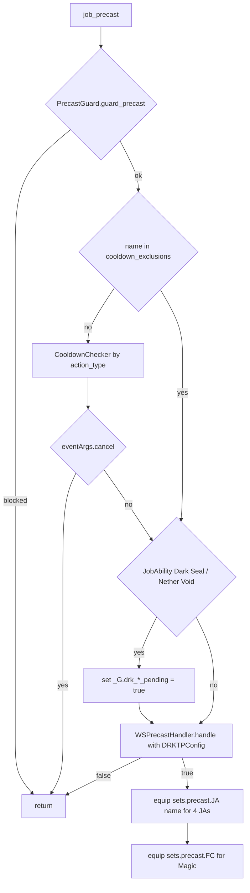
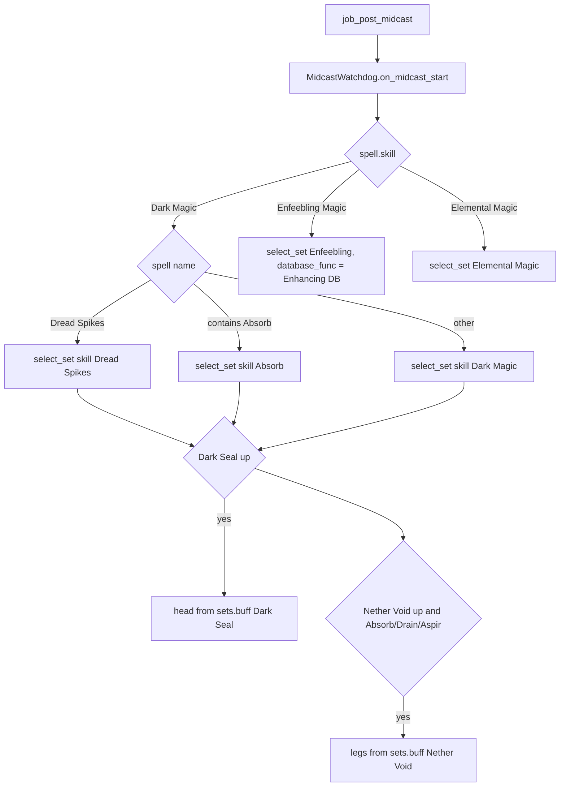

# DRK (Dark Knight) job

The DRK job has 11 hook modules plus 2 logic modules under
`shared/jobs/drk/functions/` (1 234 lines), an entry point template, six config
files and one sets file. There is no live Tetsouo DRK entry: DRK exists
as a template in `_master/` (Hysoka's live DRK is a frozen clone, out of scope).
GearSwap loads it when the main job becomes DRK (`<char>_DRK.lua`).

What DRK adds on top of the shared pipeline:

- **Dark Magic midcast routing** by spell: Dread Spikes and Absorb spells get
  their own pseudo-skills in `MidcastManager`, then Dark Seal (head) and Nether
  Void (legs) overlays are equipped while those buffs are up.
- **Engaged set selection** like WAR: Aftermath Lv.3 with Liberator ->
  `sets.engaged.AM3`, `HybridMode` PDT -> `sets.engaged.PDT`, otherwise the
  `sets.engaged` root; then the weapon set and optional Dark Seal / Nether Void
  engaged variants.
- **Pending flags** for Dark Seal and Nether Void, which let the engaged set
  variants switch before the buff shows in `buffactive`; the buff's loss
  clears them.
- **JA precast gear** equipped explicitly in `job_precast` (Last Resort, Weapon
  Bash, Souleater, Arcane Circle) and Fast Cast for spells.
- **TP bonus configuration** (Moonshade, Anguta).

DRK has no job-specific `//gs c` command.

Every file in scope was read in full except the gear content of the sets file
(only structure and set names were read, as gear choice is out of scope). Line
numbers were rechecked against the working tree on 2026-09-25; where a line
number added nothing, the function name is cited instead.

## Files

| Path | Lines | Role |
|------|------:|------|
| `_master/entry/Tetsouo_DRK.lua` | 253 | Entry point (template): config preload, `get_sets`, `job_sub_job_change`, `user_setup`, `job_update`, `init_gear_sets`, `file_unload` |
| `shared/jobs/drk/functions/drk_functions.lua` | 99 | Facade: includes `message_buffs.lua` and the 11 hook files, requires `dualbox_manager` |
| `shared/jobs/drk/functions/DRK_PRECAST.lua` | 132 | `job_precast` (guard, cooldown, pending flags, WS handler, JA gear, FC) / `job_post_precast` (TP gear) |
| `shared/jobs/drk/functions/DRK_MIDCAST.lua` | 160 | `job_midcast` (empty) / `job_post_midcast`: watchdog + handler table (Dark, Enfeebling, Elemental) |
| `shared/jobs/drk/functions/DRK_AFTERCAST.lua` | 86 | `job_aftercast` (watchdog, pending flags), empty `job_post_aftercast` |
| `shared/jobs/drk/functions/DRK_IDLE.lua` | 41 | `customize_idle_set` -> `SetBuilder.build_idle_set` |
| `shared/jobs/drk/functions/DRK_ENGAGED.lua` | 46 | `customize_melee_set` -> `SetBuilder.build_engaged_set(weapon, hybrid)` |
| `shared/jobs/drk/functions/DRK_STATUS.lua` | 33 | `job_status_change`: `DoomManager.handle_status_change` |
| `shared/jobs/drk/functions/DRK_BUFFS.lua` | 59 | `job_buff_change`: Doom, clears the Dark Seal / Nether Void pending flags on buff loss, Aftermath Lv.3 refresh |
| `shared/jobs/drk/functions/DRK_COMMANDS.lua` | 161 | `job_self_command` router (shared commands only), `job_state_change = LifecycleManager.state_change()` |
| `shared/jobs/drk/functions/DRK_MOVEMENT.lua` | 24 | Placeholder for the 12-module layout (comments only, no code) |
| `shared/jobs/drk/functions/DRK_LOCKSTYLE.lua` | 47 | Lazy `LockstyleManager.create('DRK', ..., 1, 'SAM')` wrappers |
| `shared/jobs/drk/functions/DRK_MACROBOOK.lua` | 42 | Lazy `MacrobookManager.create('DRK', ..., 'SAM', 1, 1)` wrapper |
| `shared/jobs/drk/functions/logic/set_builder.lua` | 175 | Engaged base (AM3, PDT), weapon layer, buff variants, idle weapon + movement |
| `shared/jobs/drk/functions/logic/drk_buff_anticipation.lua` | 129 | `has_dark_seal`, `has_nether_void`, engaged buff variants |
| `_master/config/drk/DRK_STATES.lua` | 119 | `DRKStates.configure()` (HybridMode, MainWeapon, FastCast, AutoMedicine), unused `validate()` |
| `_master/config/drk/DRK_KEYBINDS.lua` | 35 | 2 binds (HybridMode, MainWeapon), data only; `KeybindManager.create('DRK', ...)` adds `get_active_binds`, `bind_all`, `unbind_all`, `show_intro`, `show_binds` (see [keybinds and custom states](../systems/keybinds-and-custom.md)) |
| `_master/config/drk/DRK_CUSTOM.lua` | 118 | Player modes and gear rules (all examples commented out), read through `KeybindManager` |
| `_master/config/drk/DRK_TP_CONFIG.lua` | 77 | `_G.DRKTPConfig`: Moonshade +250, Anguta +500, `get_weapon_bonus` |
| `_master/config/drk/DRK_LOCKSTYLE.lua` | 70 | `default = 1`, `by_subjob` (SAM/WAR 1, NIN 2, DNC 3), `get_style` |
| `_master/config/drk/DRK_MACROBOOK.lua` | 77 | `default`, `solo[sub]` (book 1 pages 1-4), `dualbox` RDM/COR/GEO (books 2-4) |
| `_master/sets/drk_sets.lua` | 595 | Template sets (flat) |
| `shared/data/job_abilities/DRK_JA_DATABASE.lua` + `drk/drk_{mainjob,subjob,sp}.lua` | 13 + ... | JA data for the ability message hooks |

Live copies: none in `Tetsouo/`, `Kaories/`, `_master/Kaories/` or
`_master/Tetsouo/`.

## How it works

### Load sequence

```mermaid
sequenceDiagram
    participant GS as GearSwap
    participant E as Tetsouo_DRK.lua
    participant M as Mote-Include
    participant F as drk_functions.lua
    GS->>E: run chunk (LOCKSTYLE_CONFIG, UIConfig, REGION_CONFIG; lines 35-57)
    GS->>E: get_sets()
    E->>M: include Mote-Include (line 68)
    M->>E: user_setup(): states, keybinds, UI, JCM, macrobook/lockstyle, dualbox
    M->>E: init_gear_sets() -> include sets/drk_sets.lua (line 236)
    E->>E: INIT_SYSTEMS, data_loader, message hooks (70-94)
    E->>E: _G.LockstyleConfig, _G.RECAST_CONFIG (97-98), require DRK_TP_CONFIG (102)
    E->>E: JobChangeManager.cancel_all() (105-108)
    E->>F: include drk_functions.lua (111)
    E->>E: register_lockstyle_cancel("DRK", ...) (116-118)
```

- `DRK_TP_CONFIG` sets `_G.DRKTPConfig` itself (`DRK_TP_CONFIG.lua:75`); the
  entry only requires it.
- `ConfigLoader.load_ui_config` already writes `_G.UIConfig`
  (`config_loader.lua:67`); `user_setup` reads `_G.UIConfig.init_delay` with
  a 5.0 fallback (187).
- The comment at 120-121 now says it right: the initial macro book and
  lockstyle come from `user_setup()` (197-203), subjob changes from
  `JobChangeManager`.

`user_setup()` (`Tetsouo_DRK.lua:155-213`): `DRKStates.configure()`, the
keybinds stored in the global `DRKKeybinds` and `bind_all()` (which calls
`KeybindManager`'s `show_intro()` and so `require`s `DRK_MACROBOOK` /
`DRK_LOCKSTYLE`, defining the `select_default_*` globals),
`KeybindUI.smart_init`, `JobChangeManager` initialisation + macro book +
lockstyle after 8 s, the `dualbox_manager` require. `job_sub_job_change`
(136-145) no longer calls `JobChangeManager.initialize({...})` (removed
2026-09-25); it only hands the reload to `JobChangeManager.on_job_change`.

The facade includes `message_buffs.lua` (30, unused by DRK), then
`DRK_PRECAST` .. `DRK_MOVEMENT` (37-71), requires `dualbox_manager` (88) and
prints a debug line (94-95).

### Precast

`job_precast` (`DRK_PRECAST.lua:54-106`):



- `cooldown_exclusions` (46-48) is empty.
- The explicit `equip` calls (90-105) run before Mote's `default_precast`, which
  equips `get_precast_set` afterwards (`Mote-Include.lua:263-265, 328-330`):
  the same `sets.precast.JA[name]` for the four JAs, and `sets.precast.FC` or a
  more specific FC child for spells. They change nothing except keeping base FC
  slots that a specific FC child does not define.
- `job_post_precast` (113-118) equips the TP bonus gear.
- No AutoJump on DRK; `//gs c jump` (/DRG) works through `DRGJumpManager`
  because the entry loads `RECAST_CONFIG`.

### Dark Magic midcast

Mote equips its default midcast set first, then `job_post_midcast`
(`DRK_MIDCAST.lua:134-146`) loads `MidcastDeps`, calls
`MidcastWatchdog.on_midcast_start(spell)` and dispatches through
`JOB_POST_MIDCAST_HANDLERS[spell.skill]` (123-127):



- `MidcastManager.select_set` tries the exact spell name first, so `Drain III`,
  `Aspir` and the ten `Absorb-*` aliases (`_master/sets/drk_sets.lua:334-359`) are found by
  name; `Dread Spikes` and `Absorb` resolve to `sets.midcast['Dread Spikes']` /
  `sets.midcast.Absorb` as base sets.
- The overlays read `buffactive` only (ids 345 and 439, `res/buffs.lua`), not
  the pending flags (74, 83). The Nether Void test matches any name containing
  `Absorb`, so Absorb-TP gets the legs although the set comment says it should
  not (`_master/sets/drk_sets.lua:592`).
- Enfeebling passes `ENHANCING_MAGIC_DATABASE.get_spell_family` as
  `database_func` (107); that database only knows enhancing spells, so it returns
  nil and the base `sets.midcast['Enfeebling Magic']` is used.
- Elemental Magic has no `sets.midcast['Elemental Magic']`, so `select_set`
  returns false (`midcast_manager.lua:637-640`).
- Healing and Enhancing (subjob spells) are not routed; only Mote's default
  applies.

### Pending flags

`DRK_PRECAST.lua:75-81` sets `_G.drk_dark_seal_pending` /
`_G.drk_nether_void_pending` to true on the JA press; `DRK_AFTERCAST.lua:50-58`
confirms them, or withdraws them when the JA was interrupted.
`job_buff_change` (`DRK_BUFFS.lua:41-47`) clears a flag when its buff is lost
(consumed by the next dark spell or worn off), as the module header says
(`drk_buff_anticipation.lua:19-24`); this is fixed since `89ea984`, and the
comments explaining why the flags exist were rewritten on 2026-09-25 (they
serve the engaged variants; the Dark Magic midcast reads `buffactive`).
`has_dark_seal()` / `has_nether_void()` (44-52) read the buff or the flag. The
only reader is the engaged builder below, which needs
`sets.engaged[<weapon>][<hybrid>].DarkSeal` style sets; the template defines
none, so the flags have no visible effect today.

### Aftercast, idle, engaged, status, buffs

- `job_aftercast` (`DRK_AFTERCAST.lua:43-64`): loads the anticipation module on
  first use, `MidcastWatchdog.on_aftercast()`, the pending-flag confirmation
  above. `job_post_aftercast` (76-77) is empty.
- `customize_idle_set` -> `build_idle_set` (`set_builder.lua:124-143`): Mote's
  base (`sets.idle` through `IdleMode` `Normal`, whose child is `sets.idle`
  itself, or `sets.idle.Town` in cities) + `sets[state.MainWeapon.current]` +
  `sets.MoveSpeed` when `state.Moving.value == 'true'` (inline, not
  `BaseSetBuilder.apply_movement`; also in town). `HybridMode` is not read, so
  `sets.idle.PDT` is never used.
- `customize_melee_set` (`DRK_ENGAGED.lua` `customize_melee_set`) ignores Mote's `meleeSet` and
  calls `build_engaged_set(MainWeapon, HybridMode)` (`set_builder.lua:158-169`):
  `select_engaged_base` (52-67) -> `sets.engaged.AM3` when `buffactive[272]` and
  the weapon is Liberator, `sets.engaged.PDT` when `HybridMode == 'PDT'`, else
  the `sets.engaged` root (Accu); then the weapon set; then
  `DRKBuffAnticipation.apply_buff_variants` (`drk_buff_anticipation.lua:72-123`), which looks up
  `sets.engaged[weapon][hybrid]` (falling back to `.Accu`) and its
  `DarkSealNetherVoid` / `DarkSeal` / `NetherVoid` children.
- `job_status_change` (`DRK_STATUS.lua` `job_status_change`): `DoomManager.handle_status_change`
  after a `pcall` require, without a nil check.
- `job_buff_change` (`DRK_BUFFS.lua:29-56`): Doom; pending-flag clear on loss
  of Dark Seal / Nether Void; on gain or loss of `"Aftermath: Lv.3"` re-equips
  through `handle_equipping_gear` unless Doom is up. Close to
  `WAR_BUFFS.job_buff_change` (open duplication finding).
- `DRK_MOVEMENT.lua` holds only comments, which now say it is a placeholder
  and that the movement layer is `logic/set_builder.lua` (`set_builder.lua:138-139`,
  reading AutoMove's `state.Moving`).

## Mote states

Created by `DRKStates.configure()` (`_master/config/drk/DRK_STATES.lua:34-90`)
on every load. Keybinds from `_master/config/drk/DRK_KEYBINDS.lua:19-33`;
`#numpad0` (AutoMedicine) comes from the character's `config/COMMON_KEYBINDS.lua`.

| State | Values | Default | Key | Read by |
|-------|--------|---------|-----|---------|
| `HybridMode` (Mote's, options replaced) | PDT, Accu | PDT | `^numpad9` | `DRK_ENGAGED.lua:42` -> `select_engaged_base`, `apply_buff_variants` |
| `MainWeapon` | Caladbolg, Liberator, Redemption, Lycurgos, Loxotic (Apocalypse, Foenaria, Naegling commented out) | Caladbolg | `^numpad1` | `DRK_ENGAGED.lua:39`, `set_builder.lua:54,86,132`; `apply_buff_variants` |
| `FastCast` | 0..80 step 10 | 0 | none | `midcast_watchdog.lua` |
| `AutoMedicine` | shared On/Off | persisted | `#numpad0` (from `COMMON_KEYBINDS.lua`) | `AutoMedicine.init` (`_master/config/drk/DRK_STATES.lua:86-89`) |

`Accu` has no set of its own: it selects the `sets.engaged` root. Mote's
`OffenseMode`, `IdleMode`, `WeaponskillMode` stay `'Normal'`.

## Commands

`job_self_command` (`DRK_COMMANDS.lua:49-142`): dual-box internals (62-79;
`altjobupdate` passes the sender name, 5th argument, since 2026-09-25),
`watchdog` (84-89), CommonCommands with `table.unpack(args)` (94-105), `ui`
(110-114), `debugmidcast` (119-129), `cyclestate` (138-141). No DRK command.
The body is the same as `SAM_COMMANDS.lua` apart from the job name (open
duplication finding).
`job_state_change = LifecycleManager.state_change()` (152). It tests no state name except `Moving` (which has no description, so Mote and the UI-aware `cyclestate` both pass `Moving`), so it accepts the state key and the description alike.

## Set names the code looks up

T = `_master/sets/drk_sets.lua` (no live copy).

| Set | Looked up by | T |
|-----|--------------|---|
| `sets['Caladbolg']`, `['Liberator']`, `['Redemption']`, `['Lycurgos']`, `['Loxotic']` | `set_builder.lua:86` | 89, 90, 92, 97, 101 |
| `sets.idle` (and `sets.idle.Normal = sets.idle`) | Mote base | 109, 147 |
| `sets.idle.PDT` | nothing reaches it | 126 |
| `sets.idle.Town` (= `sets.MoveSpeed`, legs only) | Mote Town scope | 565 |
| `sets.MoveSpeed` | `set_builder.lua:138` | 560 |
| `sets.engaged`, `.PDT`, `.AM3` | `select_engaged_base` | 154, 180, 194 |
| `sets.engaged[weapon][hybrid].DarkSeal` / `.NetherVoid` / `.DarkSealNetherVoid` | `apply_buff_variants` | **absent** (feature inert) |
| `sets.precast.JA` Jump, High Jump, Diabolic Eye, Arcane Circle, Nether Void, Souleater, Last Resort, Weapon Bash, Blood Weapon, Dark Seal | Mote default precast (+ `DRK_PRECAST.lua:90-99` for four) | 221-235 |
| `sets.precast.FC` | `DRK_PRECAST.lua:103-105`, Mote | 238 |
| `sets.precast.WS` base (the default VIT gear) | Mote default precast for any WS without a named set | 367 |
| `sets.precast.WS.Acc` | nothing: `WeaponskillMode` is `Normal` | 393 |
| `sets.precast.WS` Entropy, Origin, Resolution, Torcleaver, Quietus, Judgment, Savage Blade | Mote default precast | 396-530 |
| `sets.midcast['Dark Magic']`, `['Dread Spikes']`, `.Absorb` (+ 10 aliases), `.Drain`, `['Drain III']`, `.Aspir` | `DRK_MIDCAST.lua:46-60` | 267, 294, 324-343, 346-359 |
| `sets.midcast['Enfeebling Magic']` | `DRK_MIDCAST.lua:103-110` | 284 |
| `sets.midcast['Elemental Magic']` | `DRK_MIDCAST.lua:115-121` | **absent** |
| `sets.buff['Dark Seal']`, `['Nether Void']` | `DRK_MIDCAST.lua:74,83` | 585, 593 |
| `sets.buff.Doom` | `DoomManager` | 574 |

`sets['Apocalypse']`, `['Foenaria']`, `['Tokko']`, `['Naegling']` (91-100) are
not reachable while their `MainWeapon` options stay commented out.

Weaponskills of the listed weapons with no named set (Insurgency, Cross Reaper,
Catastrophe, Spinning Slash, Ground Strike, Upheaval, Fell Cleave, Steel
Cyclone, Black Halo, ...) resolve to `sets.precast.WS` itself, which holds the
default VIT gear: Mote's `get_named_set` / `select_specific_set` try the spell
name, the spell map, the skill and the type (`Mote-Include.lua:929-970`), then
use the table. Until 2026-09-19 that gear sat under a child named `'default'`,
which Mote never reads, and the base table was empty.

## Configuration

| File / key | Default | Where the default lives | Read by |
|------------|---------|-------------------------|---------|
| `<char>/config/drk/DRK_STATES.lua` | see states | file | entry `user_setup` |
| `<char>/config/drk/DRK_KEYBINDS.lua` | 2 binds | file | entry `user_setup`, `file_unload` |
| `<char>/config/drk/DRK_CUSTOM.lua` | nothing active | file | `KeybindManager` / `CustomStates` ([keybinds and custom states](../systems/keybinds-and-custom.md)) |
| `<char>/config/drk/DRK_TP_CONFIG.lua` | Moonshade ear1 +250; Anguta +500 | file (`pieces` 30, `weapons` 43) | `WSPrecastHandler` via `_G.DRKTPConfig` (captured on first action) |
| `<char>/config/drk/DRK_LOCKSTYLE.lua` | default 1; SAM/WAR 1, NIN 2, DNC 3 | file (28, 33-39); factory fallback 1 | `LockstyleManager` through `get_style` (50-58) |
| `<char>/config/drk/DRK_MACROBOOK.lua` | book 1, page 1 (SAM), 2 (WAR), 3 (NIN), 4 (DNC); dual-box RDM book 2, COR 3, GEO 4 | file (31-70); factory fallback book 1 page 1 | `MacrobookManager` |
| `Tetsouo/config/RECAST_CONFIG.lua` | tolerance 2.0 | shared | entry line 98 |
| `Tetsouo/config/LOCKSTYLE_CONFIG.lua`, `REGION_CONFIG.lua`, UI config | - | entry fallbacks 35-41 | entry chunk |

## State & lifetime

- Module state: lazy module locals (`DRK_PRECAST`, `DRK_AFTERCAST`
  `module_initialized`, set builder), `MidcastDeps` cache. All die on
  `gs reload`.
- `_G` written: the Mote hooks (`job_precast`, `job_post_precast`,
  `job_midcast`, `job_post_midcast`, `job_aftercast`, `job_post_aftercast`,
  `customize_idle_set`, `customize_melee_set`, `job_status_change`,
  `job_buff_change`, `job_self_command`, `job_state_change`),
  `drk_dark_seal_pending`, `drk_nether_void_pending`,
  `select_default_lockstyle`, `cancel_drk_lockstyle_operations`,
  `select_default_macro_book`, `DRKKeybinds`, `DRKTPConfig`, `LockstyleConfig`,
  `RECAST_CONFIG`, `RegionConfig`, `temp_tp_bonus_gear`.
- `windower.*`: nothing. No events, no job coroutines besides the 8 s lockstyle.
- Keybinds: bound in `user_setup`, unbound in `file_unload` (242-253).
- The pending flags live in the sandbox `_G`: the buff's loss or a `gs reload`
  (every subjob change ends in one) resets them.

## Interactions

- `PrecastGuard`, `CooldownChecker`, `WSPrecastHandler`, `TPBonusCalculator`
  ([precast pipeline](../systems/precast-pipeline.md)).
- `MidcastManager` (pseudo-skills `Dread Spikes`, `Absorb`), `MidcastWatchdog`
  ([midcast and buffs](../systems/midcast-and-buffs.md)).
- `LifecycleManager.state_change` only; status and buffs keep their own copies
  ([core lifecycle](../systems/core-lifecycle.md)).
- `DRGJumpManager` through `//gs c jump`
  ([factories and helpers](../systems/factories-and-helpers.md#drg-jumps)).
- Factories, `JobChangeManager`, `CommonCommands`, `CycleHandler`, UI, dual-box
  ([commands and debug](../systems/commands-and-debug.md)).
- Set builder shape copied from [WAR](war.md) ("like WAR" comments,
  `set_builder.lua` header); `DRK_COMMANDS` mirrors [SAM](sam.md).

## Invariants & gotchas

- The engaged builder never uses Mote's selection; any Mote-side engaged naming
  (`sets.engaged.Normal`, CombatForm, CustomMeleeGroups) is ignored on DRK.
- A weaponskill needs a set named exactly after it, or gear on the
  `sets.precast.WS` table itself; a child named `default` is invisible to Mote.
- `sets.idle.Town` is a one-slot table; Mote uses it as the whole idle base in
  every city, so the other slots keep whatever was worn before.
- `HybridMode` affects engaged gear only.
- Dark Seal / Nether Void midcast overlays read `buffactive`; the engaged
  variants read `buffactive` **or** the pending flags.
- `job_precast` equips before Mote's default precast; anything that must win
  belongs in `job_post_precast`.

## Extending

- New weapon: uncomment or add the `MainWeapon` option (`_master/config/drk/DRK_STATES.lua:55-67`)
  and a `sets[key]` in the sets file.
- New Dark Magic special case: add a branch in `job_post_midcast_dark_magic`
  (`DRK_MIDCAST.lua:43-60`) with a pseudo-skill and define
  `sets.midcast['<PseudoSkill>']` (the base set is mandatory).
- New skill: add a handler to `JOB_POST_MIDCAST_HANDLERS` and the base set.
- Engaged buff variants: define `sets.engaged[<weapon>][<PDT|Accu>]` with
  `DarkSeal` / `NetherVoid` / `DarkSealNetherVoid` children; the pending flags
  already reset on buff loss.
- New command: add it in the DRK section of `job_self_command`. A name that is
  also an alt config key (DRK_ALT has `lastresort`, `souleater`, ...) then runs
  here; the alt's version stays reachable as `//gs c alt <name>`.

## Known issues

- Enfeebling Magic routed with the Enhancing database function
  (`DRK_MIDCAST.lua:107`).
- Elemental Magic routing is a no-op: no `sets.midcast['Elemental Magic']`
  (`DRK_MIDCAST.lua:115-121`).
- `sets.idle.PDT` unreachable (`set_builder.lua:124-143`).
- `sets.idle.Town = sets.MoveSpeed` is used as the whole town idle
  (`_master/sets/drk_sets.lua:565`).
- `sets.precast.WS.Acc` unreachable (`_master/sets/drk_sets.lua:393`).
- Nether Void legs applied to Absorb-TP against the set comment
  (`DRK_MIDCAST.lua:85`, `_master/sets/drk_sets.lua:592`).
- Redundant JA/FC equips in `job_precast` (`DRK_PRECAST.lua:90-105`); empty
  `cooldown_exclusions` (46-48).
- `DRK_STATUS` / `DRK_BUFFS` repeat `LifecycleManager` / `WAR_BUFFS` bodies,
  `DRK_COMMANDS` repeats `SAM_COMMANDS` (open duplication findings).
- Movement layer inline instead of `BaseSetBuilder.apply_movement`
  (`set_builder.lua:138-139`, already listed in
  [midcast and buffs](../systems/midcast-and-buffs.md#known-issues)).
- Dead code: `job_post_aftercast`, `DRKStates.validate`, `message_buffs` include,
  `DRK_MOVEMENT.lua` (comments only).
- Fixed, no longer issues: pending flags never cleared (`89ea984`); the stale
  comments of `DRK_MOVEMENT`, `DRK_IDLE`, `DRK_ENGAGED`, `DRK_BUFFS`, the entry
  (macrobook/lockstyle) and `DRK_STATES` (`b6c7dc6`, `22e1816`); the false
  "why" of the pending flags in `DRK_BUFFS` / `drk_buff_anticipation`
  (2026-09-25); `JobChangeManager.initialize({...})` in `job_sub_job_change`
  (removed 2026-09-25).
- User docs out of date (`docs/user/jobs/drk/states.md`, `abilities.md`).
