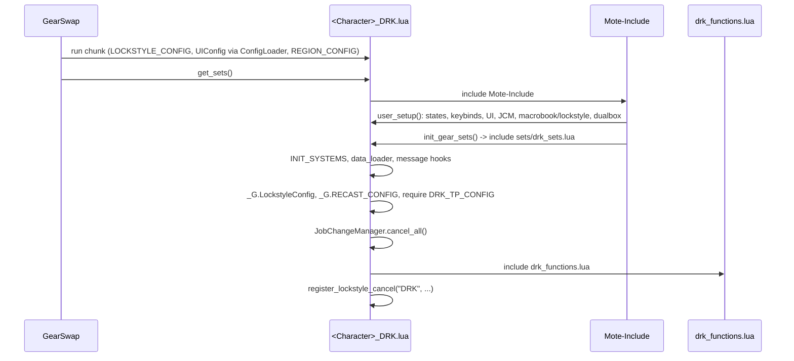
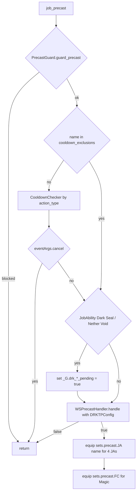
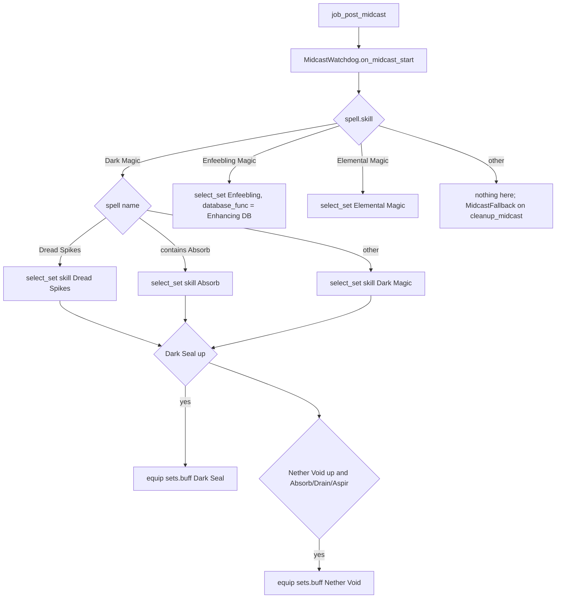

# DRK (Dark Knight) job

The DRK job area: 11 hook modules plus 2 logic modules under
`shared/jobs/drk/functions/` (about 1 240 lines), an entry point template,
seven config files and one sets file. DRK exists only as a template in
`_master/` (no character overlay, no maintained live copy); GearSwap loads it
when the main job becomes DRK (`<Character>_DRK.lua`).

What DRK adds on top of the shared pipeline:

- **Dark Magic midcast routing** by spell: Dread Spikes and Absorb spells get
  their own pseudo-skills in `MidcastManager`, then Dark Seal (head) and Nether
  Void (legs) pieces are equipped while those buffs are up.
- **Engaged set selection** in the style of WAR: Aftermath Lv.3 with Liberator
  -> `sets.engaged.AM3`, `HybridMode` PDT -> `sets.engaged.PDT`, Accu ->
  `sets.engaged.Accu`, else the `sets.engaged` root; then the weapon set and
  optional Dark Seal / Nether Void engaged variants. Mote's own selection is
  ignored.
- **Pending flags** for Dark Seal and Nether Void, which let the engaged
  variants switch before the buff shows in `buffactive`; the buff's loss
  clears them.
- **Aftermath refresh**: gaining or losing `Aftermath: Lv.3` re-equips at once
  (unless Doomed); during a spell or weaponskill the action's aftercast does it.
- **JA precast gear** equipped explicitly in `job_precast` (Last Resort, Weapon
  Bash, Souleater, Arcane Circle) and Fast Cast for spells, both redundant
  with Mote's default precast.
- **TP bonus configuration** (Moonshade, Anguta).

DRK has no job-specific `//gs c` command.

Every file listed below was read in full on 2026-09-28, except the gear content
of the sets file (structure and set names only). References are to file and
function; line numbers are deliberately not used.

## Files

| Path | Lines | Role |
|------|------:|------|
| `_master/entry/Tetsouo_DRK.lua` | 253 | Entry point (template): config preload, `get_sets`, `job_sub_job_change`, `user_setup`, `job_update`, `init_gear_sets`, `file_unload` |
| `shared/jobs/drk/functions/drk_functions.lua` | 99 | Facade: includes `message_buffs.lua` and the 11 hook files, requires `dualbox_manager` |
| `shared/jobs/drk/functions/DRK_PRECAST.lua` | 132 | `job_precast` (guard, cooldown, pending flags, WS handler, JA gear, FC) / `job_post_precast` (TP gear) |
| `shared/jobs/drk/functions/DRK_MIDCAST.lua` | 160 | `job_midcast` (empty) / `job_post_midcast`: watchdog + `JOB_POST_MIDCAST_HANDLERS` (Dark, Enfeebling, Elemental) |
| `shared/jobs/drk/functions/DRK_AFTERCAST.lua` | 86 | `job_aftercast` (watchdog, pending flags), empty `job_post_aftercast` |
| `shared/jobs/drk/functions/DRK_IDLE.lua` | 41 | `customize_idle_set` -> `SetBuilder.build_idle_set` |
| `shared/jobs/drk/functions/DRK_ENGAGED.lua` | 46 | `customize_melee_set` -> `SetBuilder.build_engaged_set(weapon, hybrid)` (Mote's set is discarded) |
| `shared/jobs/drk/functions/DRK_STATUS.lua` | 27 | `job_status_change = LifecycleManager.status_change()` |
| `shared/jobs/drk/functions/DRK_BUFFS.lua` | 61 | `job_buff_change`: Doom, pending-flag clear on loss, Aftermath Lv.3 refresh |
| `shared/jobs/drk/functions/DRK_COMMANDS.lua` | 161 | `job_self_command` router (shared commands only), `job_state_change = LifecycleManager.state_change()` |
| `shared/jobs/drk/functions/DRK_MOVEMENT.lua` | 24 | Placeholder for the 12-module layout (comments only) |
| `shared/jobs/drk/functions/DRK_LOCKSTYLE.lua` | 47 | Lazy `LockstyleManager.create('DRK', ...)` wrappers |
| `shared/jobs/drk/functions/DRK_MACROBOOK.lua` | 42 | Lazy `MacrobookManager.create('DRK', ...)` wrapper |
| `shared/jobs/drk/functions/logic/set_builder.lua` | 180 | `select_engaged_base` (AM3, PDT, Accu), `apply_weapon` (`WeaponResolver.set_for('main', weapon)`), `apply_buff_variants`, `build_idle_set` (weapon + movement) |
| `shared/jobs/drk/functions/logic/drk_buff_anticipation.lua` | 129 | `has_dark_seal`, `has_nether_void`, `apply_buff_variants` |
| `_master/config/drk/DRK_STATES.lua` | 100 | `DRKStates.configure()` (HybridMode, WeaponskillMode, MainWeapon, FastCast, AutoMedicine) |
| `_master/config/drk/DRK_KEYBINDS.lua` | 42 | Data only: 3 binds handed to `KeybindManager.create('DRK', ...)` |
| `_master/config/drk/DRK_CUSTOM.lua` | 119 | Player modes and gear rules (examples commented out) |
| `_master/config/drk/DRK_HUD.lua` | 30 | Per-job HUD section / row order (empty lists) |
| `_master/config/drk/DRK_TP_CONFIG.lua` | 77 | `_G.DRKTPConfig`: Moonshade +250, Anguta +500, `get_weapon_bonus` |
| `_master/config/drk/DRK_LOCKSTYLE.lua` | 70 | `default = 1`, `by_subjob` (SAM/WAR 1, NIN 2, DNC 3), `get_style` |
| `_master/config/drk/DRK_MACROBOOK.lua` | 77 | `default`, `solo[sub]` (book 1 pages 1-4), `dualbox` RDM/COR/GEO (books 2-4) |
| `_master/sets/drk_sets.lua` | 601 | Template sets (flat) |
| `shared/data/job_abilities/DRK_JA_DATABASE.lua` + `drk/drk_{mainjob,subjob,sp}.lua` | | JA data for the ability message hooks |

## How it works

### Load sequence

```mermaid
sequenceDiagram
    participant GS as GearSwap
    participant E as <Character>_DRK.lua
    participant M as Mote-Include
    participant F as drk_functions.lua
    GS->>E: run chunk (LOCKSTYLE_CONFIG, UIConfig via ConfigLoader, REGION_CONFIG)
    GS->>E: get_sets()
    E->>M: include Mote-Include
    M->>E: user_setup(): states, keybinds, UI, JCM, macrobook/lockstyle, dualbox
    M->>E: init_gear_sets() -> include sets/drk_sets.lua
    E->>E: INIT_SYSTEMS, data_loader, message hooks
    E->>E: _G.LockstyleConfig, _G.RECAST_CONFIG, require DRK_TP_CONFIG
    E->>E: JobChangeManager.cancel_all()
    E->>F: include drk_functions.lua
    E->>E: register_lockstyle_cancel("DRK", ...)
```

- `DRK_TP_CONFIG` sets `_G.DRKTPConfig` itself; the entry only requires it.
- `ConfigLoader.load_ui_config` writes `_G.UIConfig`; `user_setup` reads
  `_G.UIConfig.init_delay` with a 5.0 fallback.

`user_setup()`: `DRKStates.configure()`, the keybinds stored in the global
`DRKKeybinds` and `bind_all()` (3 binds, the optional states, the common keys,
then `show_intro()`, which `require`s `DRK_MACROBOOK` / `DRK_LOCKSTYLE` and so
defines the `select_default_*` globals), `KeybindUI.smart_init`,
`JobChangeManager` initialisation + macro book + lockstyle after 8 s, the
`dualbox_manager` require. `job_sub_job_change` only hands the reload to
`JobChangeManager.on_job_change`.

The facade includes `message_buffs.lua` (unused by DRK), then `DRK_PRECAST`
.. `DRK_MOVEMENT`, requires `dualbox_manager` and prints a debug line.

### Precast

`DRK_PRECAST.lua` `job_precast`:

```mermaid
flowchart TD
    A[job_precast] --> B{PrecastGuard.guard_precast}
    B -- blocked --> Z[return]
    B -- ok --> C{name in cooldown_exclusions}
    C -- no --> D[CooldownChecker by action_type]
    D --> E{eventArgs.cancel}
    E -- yes --> Z
    C -- yes --> F
    E -- no --> F{JobAbility Dark Seal / Nether Void}
    F -- yes --> G[set _G.drk_*_pending = true]
    F -- no --> H
    G --> H[WSPrecastHandler.handle with DRKTPConfig]
    H -- false --> Z
    H -- true --> I[equip sets.precast.JA name for 4 JAs]
    I --> J[equip sets.precast.FC for Magic]
```

- `cooldown_exclusions` is empty.
- The explicit `equip` calls run before Mote's `default_precast`, which equips
  `get_precast_set` afterwards: the same `sets.precast.JA[name]` for the four
  JAs, and `sets.precast.FC` or a more specific FC child for spells. They
  change nothing except keeping base FC slots that a specific FC child does
  not define.
- `job_post_precast` equips the TP bonus gear.
- No AutoJump on DRK; `//gs c jump` (/DRG) works through `DRGJumpManager`
  because the entry loads `RECAST_CONFIG`.

### Dark Magic midcast

Mote equips its default midcast set first, then `job_post_midcast` loads
`MidcastDeps`, calls `MidcastWatchdog.on_midcast_start(spell)` and dispatches
through `JOB_POST_MIDCAST_HANDLERS[spell.skill]`:

```mermaid
flowchart TD
    A[job_post_midcast] --> W[MidcastWatchdog.on_midcast_start]
    W --> B{spell.skill}
    B -- Dark Magic --> C{spell name}
    C -- Dread Spikes --> D[select_set skill Dread Spikes]
    C -- "contains Absorb" --> E[select_set skill Absorb]
    C -- other --> F[select_set skill Dark Magic]
    D --> G{Dark Seal up}
    E --> G
    F --> G
    G -- yes --> H[equip sets.buff Dark Seal]
    G --> I{Nether Void up and Absorb/Drain/Aspir}
    I -- yes --> J[equip sets.buff Nether Void]
    B -- Enfeebling Magic --> K[select_set Enfeebling, database_func = Enhancing DB]
    B -- Elemental Magic --> L[select_set Elemental Magic]
    B -- other --> N[nothing here; MidcastFallback on cleanup_midcast]
```

- `MidcastManager.select_set` tries the exact spell name first, so `Drain III`,
  `Aspir` and the ten `Absorb-*` aliases are found by name; `Dread Spikes` and
  `Absorb` resolve to `sets.midcast['Dread Spikes']` / `sets.midcast.Absorb`
  as base sets.
- The overlays read `buffactive` only (ids 345 and 439), not the pending
  flags. The whole buff sets are equipped (only the head / legs were taken
  before 2026-09-29). The Nether Void test matches any name containing
  `Absorb`, so Absorb-TP gets it too.
- Enfeebling passes `ENHANCING_MAGIC_DATABASE.get_spell_family` as
  `database_func`; that database only knows enhancing spells, so it returns
  nil and the base `sets.midcast['Enfeebling Magic']` is used.
- Elemental Magic has no `sets.midcast['Elemental Magic']`, so `select_set`
  returns at the missing base set and Mote's choice stands.
- Healing and Enhancing (subjob spells) are not routed by DRK; since
  `MidcastFallback` exists they are routed with their own skill on
  `cleanup_midcast`. With no base set in the template, Mote's choice stands.

### Pending flags

`job_precast` sets `_G.drk_dark_seal_pending` / `_G.drk_nether_void_pending`
to true on the JA press; `job_aftercast` confirms them, or withdraws them when
the JA was interrupted. `job_buff_change` clears a flag when its buff is lost
(consumed by the next dark spell or worn off). `has_dark_seal()` /
`has_nether_void()` read the buff or the flag. The only reader is the engaged
builder, which needs `sets.engaged[<weapon>][<hybrid>].DarkSeal` style sets;
the template defines none, so the flags have no visible effect out of the box.

### Aftercast, idle, engaged, status, buffs

- `job_aftercast`: loads the anticipation module on first use,
  `MidcastWatchdog.on_aftercast()`, the pending-flag confirmation above.
  `job_post_aftercast` is empty.
- `customize_idle_set` -> `build_idle_set`: Mote's base (`sets.idle` through
  `IdleMode` `Normal`, whose child is `sets.idle` itself, or `sets.idle.Town`
  in cities; defense and kiting layers included) + `sets[MainWeapon]` +
  `sets.MoveSpeed` when `state.Moving.value == 'true'` (inline, not
  `BaseSetBuilder.apply_movement`; also in town). `HybridMode` is not read, so
  `sets.idle.PDT` is never used.
- `customize_melee_set` ignores Mote's `meleeSet` and calls
  `build_engaged_set(MainWeapon, HybridMode)`: `select_engaged_base` ->
  `sets.engaged.AM3` when `buffactive[272]` and the weapon is Liberator,
  `sets.engaged.PDT` when `HybridMode == 'PDT'`, `sets.engaged.Accu` when
  `HybridMode == 'Accu'` and it exists, else the `sets.engaged` root; then
  `apply_weapon` (`WeaponResolver.set_for('main', weapon)`, since 2026-09-28:
  `sets[weapon]` unchanged while `equip_without_set` is off; with it on, a
  weapon with no set is equipped by name); then
  `DRKBuffAnticipation.apply_buff_variants`, which looks up
  `sets.engaged[weapon][hybrid]` (falling back to `.Accu`, then the built set)
  and its `DarkSealNetherVoid` / `DarkSeal` / `NetherVoid` children.
- `job_status_change` (`DRK_STATUS.lua`) is `LifecycleManager.status_change()`
  since 2026-09-28: `DoomManager.handle_status_change`, then an engage /
  disengage that lands during an action is held until the aftercast (3 s
  fallback), as on the other jobs.
- `job_buff_change` (`DRK_BUFFS.lua`): Doom; pending-flag clear on loss of
  Dark Seal / Nether Void; on gain or loss of `"Aftermath: Lv.3"` calls
  `handle_equipping_gear(player.status)` unless Doom is up (whatever the
  weapon) or an action is under way (`midaction()`, since 2026-09-28: the
  action's aftercast then rebuilds with the new buff state). Close to
  `WAR_BUFFS.job_buff_change`.
- `DRK_MOVEMENT.lua` holds only comments.

## Mote states

Created by `DRKStates.configure()` on every load. Keybinds from
`DRK_KEYBINDS.lua`; `#numpad0` (AutoMedicine) and the other common keys come
from the character's `config/COMMON_KEYBINDS.lua`.

| State | Values | Default | Key | Read by |
|-------|--------|---------|-----|---------|
| `HybridMode` (Mote's, options replaced) | PDT, Accu | PDT | `^numpad9` | `customize_melee_set` -> `select_engaged_base`, `apply_buff_variants` |
| `WeaponskillMode` (Mote's, options replaced) | Normal, Acc | Normal | `^numpad2` | Mote default precast (`sets.precast.WS[name].Acc`, else `sets.precast.WS.Acc`) |
| `MainWeapon` | Caladbolg, Liberator, Redemption, Lycurgos, Loxotic (Apocalypse, Foenaria, Naegling commented out) | Caladbolg | `^numpad1` | `customize_melee_set`, `build_idle_set`, `select_engaged_base` (Liberator test), `apply_buff_variants` |
| `FastCast` | 0..80 step 10 | 0 | none | `midcast_watchdog.lua` |
| `AutoMedicine` | shared On/Off | persisted | `#numpad0` | `AutoMedicine.init` |
| `CombatMode` | Off, On | Off | `!numpad0`, hidden | `CombatMode` lock |
| `TreasureMode` | Off, Tag, Full | Off | `!numpad.`, hidden | shared `TreasureHunter` (needs `sets.TreasureHunter`, absent from the template) |

`Accu` selects `sets.engaged.Accu` (a copy of the root in the template).
Mote's `OffenseMode`, `IdleMode`, `CastingMode`, `RangedMode` keep the single
value `Normal`.

## Commands

`job_self_command`: dual-box internals (`altjobupdate` with the sender name,
`requestjob`), `watchdog`, CommonCommands with `table.unpack(args)`, `ui`,
`debugmidcast`, `cyclestate`. No DRK command. The body is the same as
`SAM_COMMANDS.lua` minus SAM's `hasso` / `seigan` branch.
`job_state_change = LifecycleManager.state_change()`: skips `Moving`,
refreshes the UI; it accepts the state key and the description alike.

## Set names the code looks up

T = `_master/sets/drk_sets.lua` (no live copy in the repository).

| Set | Looked up by | In T |
|-----|--------------|------|
| `sets['Caladbolg']`, `['Liberator']`, `['Redemption']`, `['Lycurgos']`, `['Loxotic']` | `apply_weapon` | yes |
| `sets['Apocalypse']`, `['Foenaria']`, `['Naegling']` | `apply_weapon`, once their `MainWeapon` line is uncommented | yes |
| `sets['Tokko']` (and Apocalypse, Foenaria, Naegling) | `apply_weapon` once the name is a `MainWeapon` value (none of them is; a comment in the sets file says so) | yes |
| `sets.idle` (and `sets.idle.Normal = sets.idle`) | Mote base | yes |
| `sets.idle.PDT` | nothing reaches it | yes |
| `sets.idle.Town` (= `sets.MoveSpeed`, legs only) | Mote Town scope | yes |
| `sets.MoveSpeed` | `build_idle_set` | yes |
| `sets.engaged`, `.PDT`, `.Accu`, `.AM3` | `select_engaged_base` | yes |
| `sets.engaged[weapon][hybrid].DarkSeal` / `.NetherVoid` / `.DarkSealNetherVoid` | `apply_buff_variants` | **no** (feature inert) |
| `sets.precast.JA` Jump, High Jump, Diabolic Eye, Arcane Circle, Nether Void, Souleater, Last Resort, Weapon Bash, Blood Weapon, Dark Seal | Mote default precast (+ `job_precast` for four) | yes |
| `sets.precast.FC` | `job_precast`, Mote | yes |
| `sets.precast.WS` base (the default VIT gear) | Mote default precast for any WS without a named set | yes |
| `sets.precast.WS.Acc` | Mote, `WeaponskillMode` Acc | yes |
| `sets.precast.WS` Entropy, Origin, Resolution, Torcleaver, Quietus, Judgment, Savage Blade | Mote default precast | yes |
| `sets.midcast['Dark Magic']`, `['Dread Spikes']`, `.Absorb` (+ 10 aliases), `.Drain`, `['Drain III']`, `.Aspir` | `job_post_midcast_dark_magic` | yes |
| `sets.midcast['Enfeebling Magic']` | `job_post_midcast_enfeebling_magic` | yes |
| `sets.midcast['Elemental Magic']` | `job_post_midcast_elemental_magic` | **no** |
| `sets.buff['Dark Seal']`, `['Nether Void']` | `job_post_midcast_dark_magic` | yes |
| `sets.buff.Doom` | `DoomManager` | yes |

Weaponskills of the listed weapons with no named set (Insurgency, Cross
Reaper, Catastrophe, Spinning Slash, Ground Strike, Upheaval, Fell Cleave,
Steel Cyclone, Black Halo, ...) resolve to `sets.precast.WS` itself: Mote's
`get_named_set` / `select_specific_set` try the spell name, the spell map, the
skill and the type, then use the table. A child named `default` would be
invisible to Mote.

## Configuration

| File / key | Default | Where the default lives | Read by |
|------------|---------|-------------------------|---------|
| `<char>/config/drk/DRK_STATES.lua` | see states | file | entry `user_setup` |
| `<char>/config/drk/DRK_KEYBINDS.lua` | 3 binds (+ common keys, optional states) | file | entry `user_setup`, `file_unload` |
| `<char>/config/drk/DRK_CUSTOM.lua` | nothing active | file | `KeybindManager` / `CustomStates` |
| `<char>/config/drk/DRK_HUD.lua` | empty orders | file | `hud_job_config.lua` |
| `<char>/config/drk/DRK_TP_CONFIG.lua` | Moonshade ear1 +250; Anguta +500 (not a `MainWeapon` value) | file | `WSPrecastHandler` via `_G.DRKTPConfig` (captured on first action) |
| `<char>/config/drk/DRK_LOCKSTYLE.lua` | default 1; SAM/WAR 1, NIN 2, DNC 3 | file; factory fallback 1 | `LockstyleManager` through `get_style` |
| `<char>/config/drk/DRK_MACROBOOK.lua` | book 1, page 1 (SAM), 2 (WAR), 3 (NIN), 4 (DNC); dual-box RDM book 2, COR 3, GEO 4 | file; factory fallback book 1 page 1 | `MacrobookManager` |
| `<char>/config/RECAST_CONFIG.lua` | tolerance 2.0 | shared | entry |
| `<char>/config/LOCKSTYLE_CONFIG.lua`, `REGION_CONFIG.lua`, UI config | - | entry fallbacks | entry chunk |
| `<char>/config/WEAPON_CONFIG.lua` `equip_without_set` | false | file | `WeaponResolver.set_for` in `apply_weapon` |

## State & lifetime

- Module state: lazy module locals (`DRK_PRECAST`, `DRK_AFTERCAST`
  `module_initialized`, set builder), `MidcastDeps` cache. All die on
  `gs reload`.
- `_G` written: the Mote hooks (`job_precast`, `job_post_precast`,
  `job_midcast`, `job_post_midcast`, `job_aftercast`, `job_post_aftercast`,
  `customize_idle_set`, `customize_melee_set`, `job_status_change`,
  `job_buff_change`, `job_self_command`, `job_state_change`),
  `drk_dark_seal_pending`, `drk_nether_void_pending`,
  `select_default_lockstyle`, `cancel_drk_lockstyle_operations`,
  `select_default_macro_book`, `DRKKeybinds`, `DRKTPConfig`, `LockstyleConfig`,
  `RECAST_CONFIG`, `RegionConfig`, `temp_tp_bonus_gear`.
- `windower.*`: nothing. No events, no job coroutines besides the 8 s
  lockstyle.
- Keybinds: bound in `user_setup`, unbound in `file_unload`.
- The pending flags live in the sandbox `_G`: the buff's loss or a
  `gs reload` (every subjob change ends in one) resets them.

## Interactions

- `PrecastGuard`, `CooldownChecker`, `WSPrecastHandler`, `TPBonusCalculator`
  ([precast pipeline](../systems/precast-pipeline.md)).
- `MidcastManager` (pseudo-skills `Dread Spikes`, `Absorb`), `MidcastWatchdog`,
  `MidcastFallback` ([midcast and buffs](../systems/midcast-and-buffs.md)).
- `LifecycleManager.status_change` and `state_change`; buffs keep their own
  copy ([core lifecycle](../systems/core-lifecycle.md)).
- `DRGJumpManager` through `//gs c jump`
  ([factories and helpers](../systems/factories-and-helpers.md#drg-jumps)).
- Gear hooks from `INIT_SYSTEMS`: `ElementalBelt` (Sanguine Blade, Dark
  Harvest, Shadow of Death, Infernal Scythe, elemental spells),
  `TreasureHunter`, `DualWield`, `CustomStates`, `CombatMode`.
- Factories, `JobChangeManager`, `CommonCommands`, `CycleHandler`, UI,
  dual-box ([commands and debug](../systems/commands-and-debug.md)).
- Set builder shape copied from [WAR](war.md); `DRK_COMMANDS` mirrors
  [SAM](sam.md).

## For maintainers / AI

### Invariants

- The engaged builder never uses Mote's selection; any Mote-side engaged
  naming (`sets.engaged.Normal`, CombatForm, CustomMeleeGroups, defense and
  kiting layers) is ignored on DRK.
- A weaponskill needs a set named exactly after it, or gear on the
  `sets.precast.WS` table itself.
- `sets.idle.Town` is a one-slot table; Mote uses it as the whole idle base in
  every city, so the other slots keep whatever was worn before.
- `HybridMode` affects engaged gear only.
- Dark Seal / Nether Void midcast overlays read `buffactive`; the engaged
  variants read `buffactive` **or** the pending flags. Any new path that raises
  a flag needs a matching clear (buff loss, interrupted aftercast).
- `job_precast` equips before Mote's default precast; anything that must win
  belongs in `job_post_precast`.

### Traps

- A pseudo-skill passed to `select_set` (`Dread Spikes`, `Absorb`) must have a
  base set `sets.midcast['<PseudoSkill>']`, or `select_set` returns and Mote's
  set stays; `MidcastFallback` will not retry, because `select_set` already
  marked the spell as routed.
- `apply_weapon` goes through `WeaponResolver.set_for('main', ...)`: with
  `equip_without_set` on, a weapon set that does not name `main` stops
  applying, and a value with no set equips the weapon by name.
- `handle_equipping_gear` from `job_buff_change` runs synchronously inside the
  buff event; it is skipped while `midaction()` is true.
- The template keeps `Tetsouo/...` require paths; the clone script rewrites
  them.

### Extending

- New weapon: uncomment or add the `MainWeapon` option in `DRK_STATES.lua` and
  a `sets[key]` in the sets file (needed unless `equip_without_set` is on). Tokko needs a
  new `'Tokko'` line.
- New Dark Magic special case: add a branch in `job_post_midcast_dark_magic`
  with a pseudo-skill and define its base set.
- New skill: add a handler to `JOB_POST_MIDCAST_HANDLERS` and the base set.
- Engaged buff variants: define `sets.engaged[<weapon>][<PDT|Accu>]` with
  `DarkSeal` / `NetherVoid` / `DarkSealNetherVoid` children.
- New command: add it in the DRK section of `job_self_command`. A name that is
  also an alt config key (DRK_ALT has `lastresort`, `souleater`, ...) then
  runs here; the alt's version stays reachable as `//gs c alt <name>`.

### Offline testing

- Syntax: from `data/`,
  `luac5.1 -p shared/jobs/drk/functions/*.lua shared/jobs/drk/functions/logic/*.lua _master/entry/Tetsouo_DRK.lua _master/config/drk/*.lua _master/sets/drk_sets.lua`.
- Behaviour: `logic/set_builder.lua` loads with stubs for `sets`, `state`,
  `buffactive`, `set_combine`, and `package.loaded` entries for
  `drk_buff_anticipation` and `message_formatter`; drive `build_engaged_set`
  with each weapon x hybrid x buff combination. The local, gitignored
  `scripts/audit/difftest_midcast_routing.lua` routes a spread of spells
  through a job's midcast module and compares two versions.
- In game: `//gs c debugmidcast` shows the set chosen for each Dark Magic
  spell; `//gs c trace on` records precast lines.

## Known issues

- Enfeebling Magic routed with the Enhancing database function
  (`DRK_MIDCAST.lua` `job_post_midcast_enfeebling_magic`).
- Elemental Magic routing is a no-op: no `sets.midcast['Elemental Magic']`.
- `sets.idle.PDT` unreachable (`set_builder.lua` `build_idle_set`).
- `sets.idle.Town = sets.MoveSpeed` is used as the whole town idle.
- Nether Void legs applied to Absorb-TP against the set comment.
- Redundant JA/FC equips in `job_precast`; empty `cooldown_exclusions`.
- Fixed 2026-09-28: `DRK_STATUS` is `LifecycleManager.status_change()` (an
  engage during an action waits for the aftercast); the Aftermath Lv.3
  refresh waits for the action too; `apply_weapon` goes through
  `WeaponResolver`, so `equip_without_set` works on DRK.
- `DRK_BUFFS` repeats `WAR_BUFFS`; `DRK_COMMANDS` repeats `SAM_COMMANDS`
  (open duplication findings).
- `sets['Tokko']` has no `MainWeapon` line; the Anguta TP bonus applies only
  to a weapon that no `MainWeapon` value equips.
- Movement layer inline instead of `BaseSetBuilder.apply_movement`.
- Dead code: `job_post_aftercast`, `message_buffs` include, `DRK_MOVEMENT.lua`
  (comments only).
