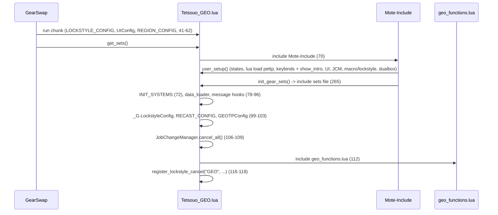
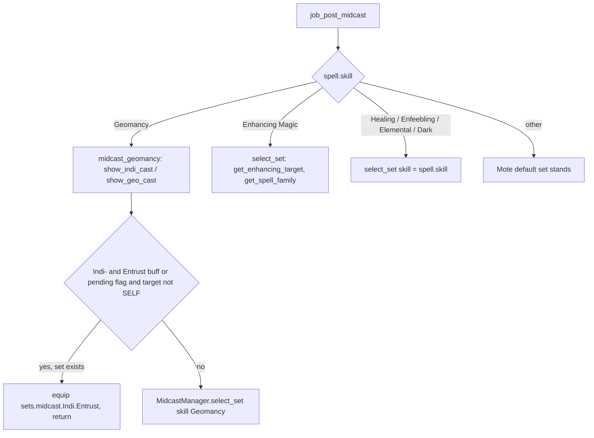

# GEO (Geomancer) job

The GEO job area is 11 hook modules plus 2 logic modules under
`shared/jobs/geo/functions/` (1 366 lines), an entry point per character (the
Tetsouo template and a Kaories overlay), five config files and one sets file.
GearSwap loads it when the main job becomes GEO. From then on Mote-Include calls
its hooks on every action, on status, buff and pet changes, on `//gs c`
commands and on state cycles. Only Kaories plays GEO today (no live
`Tetsouo_GEO.lua`).

What GEO adds on top of the shared pipeline:

- **Luopan-aware gear**: idle and engaged sets are built from the `HybridMode`
  set (`sets.idle.PDT`/`.Normal`, `sets.engaged.PDT`/`.Normal`, falling back to
  `sets.me.*`) without a luopan and `sets.luopan.*` with one (`LuopanMode`
  DT/DPS while engaged); Mote's own base set is ignored.
- **Midcast through `MidcastManager`**: Geomancy with an Entrust override for an
  Indi- spell cast on a party member; Healing, Enhancing (spell family +
  Composure target), Enfeebling, Elemental and Dark Magic on
  `sets.midcast[skill]`.
- **Indi/Geo commands** built from states (`indi`, `geo`, `entrust`), with the
  Geo- target chosen from a buff list.
- **Nuke commands with tier fallback** (`lightspell`, `darkaoe`, ...) that walk
  down from the selected tier to the first learned, ready spell.
- **Scholar subjob helpers** (Arts toggles, `aoe` Accession chains, `dispel`).
- **CombatMode** weapon lock in `job_update`, the PetTP addon loaded while GEO
  is the main job, and Entrust reporting to the dual-box main.

Every file in scope was read in full except the gear content of the sets files
and the geomancy databases (structure and names only). All line numbers refer to
the working tree on 2026-09-19.

## Files

| Path | Lines | Role |
|------|------:|------|
| `_master/entry/Tetsouo_GEO.lua` | 287 | Entry point (template): config preload, `get_sets`, `job_sub_job_change`, `user_setup`, `job_update` (CombatMode), `init_gear_sets`, `file_unload` |
| `_master/Kaories/entry/Kaories_GEO.lua` | 286 | Kaories overlay: same code, `Kaories/` paths, shorter dual-box comment (222-223) |
| `shared/jobs/geo/functions/geo_functions.lua` | 106 | Facade: `message_buffs.lua`, the 11 hook files, `dualbox_manager` |
| `shared/jobs/geo/functions/GEO_PRECAST.lua` | 115 | `job_precast` (guard, cooldown, Entrust flag, WS) / `job_post_precast` |
| `shared/jobs/geo/functions/GEO_MIDCAST.lua` | 138 | `job_midcast` (empty) / `job_post_midcast` (Geomancy + the other skills through `MidcastManager`) |
| `shared/jobs/geo/functions/GEO_AFTERCAST.lua` | 54 | `job_aftercast`: watchdog, Entrust flag set/clear |
| `shared/jobs/geo/functions/GEO_IDLE.lua` | 43 | `customize_idle_set` -> `SetBuilder.build_idle_set` |
| `shared/jobs/geo/functions/GEO_ENGAGED.lua` | 43 | `customize_melee_set` -> `SetBuilder.build_engaged_set` |
| `shared/jobs/geo/functions/GEO_STATUS.lua` | 19 | `job_status_change = LifecycleManager.status_change()` |
| `shared/jobs/geo/functions/GEO_BUFFS.lua` | 46 | Own `job_buff_change`: `AltBuffReporter.report`, then Doom |
| `shared/jobs/geo/functions/GEO_COMMANDS.lua` | 342 | `job_self_command` router, `job_state_change = LifecycleManager.state_change()` |
| `shared/jobs/geo/functions/GEO_MOVEMENT.lua` | 40 | `get_geo_movement_status` only |
| `shared/jobs/geo/functions/GEO_LOCKSTYLE.lua` | 47 | Lazy `LockstyleManager.create('GEO', ..., 1, 'SAM')` wrappers |
| `shared/jobs/geo/functions/GEO_MACROBOOK.lua` | 42 | Lazy `MacrobookManager.create('GEO', ..., 'SAM', 1, 1)` wrapper |
| `shared/jobs/geo/functions/logic/geo_spell_refiner.lua` | 173 | `refine_spell` / `refine_and_cast` tier fallback |
| `shared/jobs/geo/functions/logic/set_builder.lua` | 185 | HybridMode / `sets.luopan` selection, town, weapons, movement; unused `apply_buff_gear` |
| `_master/config/geo/GEO_STATES.lua` | 328 | All states (`GEOStates.configure()`), unused `validate()` |
| `_master/config/geo/GEO_KEYBINDS.lua` | 133 | 13 binds, `bind_all` / `unbind_all` / `show_intro` |
| `_master/config/geo/GEO_LOCKSTYLE.lua` | 53 | `default = 5`, `by_subjob`, `get_style` |
| `_master/config/geo/GEO_MACROBOOK.lua` | 66 | Book 5 page 1 for every subjob; dual-box block all commented |
| `_master/config/geo/GEO_TP_CONFIG.lua` | 62 | `_G.GEOTPConfig` (Moonshade; no weapon bonus) |
| `_master/Kaories/config/geo/*.lua` | 133, 53, 66, 328, 62 + `GEO_REFILL.lua` 22 | Overlay: identical to the templates except line endings; plus the refill list |
| `_master/sets/geo_sets.lua` | 444 | Template sets (flat) |
| `_master/Kaories/sets/geo_sets.lua` | 444 | Overlay sets: identical except the Exudation WS neck/waist (402-403) |
| `shared/utils/messages/formatters/jobs/message_geo.lua` + `data/jobs/geo_messages.lua` | 185 + 40 | Indi/Geo cast line with element colour, tier refinement messages |
| `shared/data/magic/geomancy/geomancy_indi.lua`, `geomancy_geo.lua` | 349, 364 | 30 Indi- / 30 Geo- entries (description, element) read by `message_geo` at load |
| `shared/data/magic/GEO_SPELL_DATABASE.lua` | 191 | Read by `data_loader` and the spell message handler (messages only) |
| `shared/data/job_abilities/GEO_JA_DATABASE.lua` | 13 | `JA_DATABASE_FACTORY.create('GEO')` for ability messages |
| `shared/utils/scholar/scholar_actions.lua` | 163 | `aoe` Accession chains (shared with BLM, PLD) |

Live copies (gitignored): `Kaories/Kaories_GEO.lua` and `Kaories/config/geo/*`
are identical to the overlay. `Kaories/sets/geo_sets.lua` equals the overlay
except line 402, which reads `'Sybil Scarf'` (the item is `Sibyl Scarf`,
`res/items.lua:20450`). `Tetsouo/` has no GEO files; `_master/Tetsouo/` has no
GEO overlay.

## How it works

### Load sequence

`user_setup()` (`Tetsouo_GEO.lua:164-227`):

1. `GEOStates.configure()` (169-170).
2. `send_command('lua load pettp')` (175): the PetTP addon, unloaded again in
   `file_unload` (280). This runs on every `user_setup()`, so a subjob change
   loads it in the old sandbox, unloads it in that sandbox's `file_unload`, and
   loads it again in the new one.
3. `GEO_KEYBINDS` -> global `GEOKeybinds`, `bind_all()` (181-190). `show_intro`
   (`GEO_KEYBINDS.lua:105-127`) `require`s `GEO_MACROBOOK.lua` and
   `GEO_LOCKSTYLE.lua` (108, 115). Both return nothing, so `show_intro` always
   falls back to `show_system_intro`, but executing them defines
   `select_default_macro_book` / `select_default_lockstyle` as a side effect.
4. `KeybindUI.smart_init("GEO", UIConfig.init_delay)` (195-203).
5. `JobChangeManager.initialize()`, then, only because of the side effect in
   step 3, `select_default_macro_book()` and `select_default_lockstyle` after
   8 s (208-218). The facade later includes the two wrapper files again, which
   creates a second, independent factory instance for each (same situation as
   [BLM](blm.md)).
6. `pcall(require, 'shared/utils/dualbox/dualbox_manager')` (226).

`geo_functions.lua` includes `message_buffs.lua` (29), `GEO_PRECAST`,
`GEO_MIDCAST`, `GEO_AFTERCAST` (36-40), `GEO_IDLE`, `GEO_ENGAGED` (47-49),
`GEO_STATUS`, `GEO_BUFFS` (56-58), `GEO_LOCKSTYLE`, `GEO_MACROBOOK`,
`GEO_COMMANDS`, `GEO_MOVEMENT` (66-70), requires `dualbox_manager` (94) and
prints a debug line (101-102).

The Kaories overlay differs only in the character name in paths and in the
dual-box comment (`_master/Kaories/entry/Kaories_GEO.lua:222-223`).

### Precast

`job_precast` (`GEO_PRECAST.lua:58-88`) follows the standard order:
`PrecastGuard` (62), `CooldownChecker` for abilities or spells (67-73), return
on cancel (75-77), then the GEO step: `spell.type == 'JobAbility'` and
`Entrust` sets `_G.geo_entrust_pending = true` (80-82), then
`WSPrecastHandler.handle(spell, eventArgs, GEOTPConfig)` (85-87).
`job_post_precast` (95-100) applies the stored TP gear. Mote's default precast
picks `sets.precast.FC`, `sets.precast.JA[...]` or `sets.precast.WS`. There is
no tier refinement of hand-typed spells; only the nuke commands refine.

### Midcast

Mote first equips its default midcast set, then `job_post_midcast`
(`GEO_MIDCAST.lua:100-123`) notifies `MidcastWatchdog` (105-107) and routes by
skill:

- The message line comes from `message_geo.lua:93-157`, which requires both
  geomancy databases at load and prints an error for a spell missing from them.
- `select_set({skill = 'Geomancy'})` resolves to `sets.midcast.Geomancy` (P9),
  because no set is named after an Indi-/Geo- spell. In both set files
  `sets.midcast.Geomancy` **is** `sets.luopan.idle` (`geo_sets.lua:287`), so
  every Indi- and Geo- cast wears the luopan idle set. `sets.midcast.Geo` (313)
  is looked up by nothing.
- `sets.midcast.Indi = sets.luopan.idle` (290) is the same table, so line 294
  writes the `Entrust` sub-table **into** `sets.luopan.idle`. GearSwap ignores
  non-slot keys when equipping (`helper_functions.lua:313-315`), so this has no
  gear effect.
- The other skills go through `MidcastManager` (`PLAIN_SKILLS`, 88-93, and the
  Enhancing branch, 111-117), so `//gs c debugmidcast` traces them. With the
  current set files the gear is the same as Mote's default: there is no
  `sets.midcast['Healing Magic']` or `['Dark Magic']`, so those calls return
  false and Mote's choice (`sets.midcast.Cure` by spell map) stands;
  `['Enhancing Magic']` and `['Enfeebling Magic']` are empty tables, so they
  equip nothing; `['Elemental Magic']` is the set Mote already picked. A set
  named after a spell, its tier-less name or an enhancing family
  (`sets.midcast.Refresh`, ...) now takes effect through the manager.

### Idle, engaged, pet

- `customize_idle_set` -> `SetBuilder.build_idle_set` (`set_builder.lua:133-158`):
  `sets.luopan.idle` when `pet.isvalid`, else `sets.idle[HybridMode]` falling
  back to `sets.me.idle` (`select_hybrid_base`, 82-88; Mote's base is
  ignored); then town (`sets.Adoulin` in Adoulin, `sets.idle.Town` in other
  cities, Dynamis excluded, which overrides the luopan set: comment 129); then
  `sets[state.MainWeapon]` and `sets[state.SubWeapon]` (38-70); then
  `sets.MoveSpeed` when moving outside town.
- `customize_melee_set` -> `build_engaged_set` (98-128): with a luopan,
  `sets.luopan.engaged.DT` or `.DPS` from `LuopanMode` (fallback DT, then
  `sets.me.engaged`); without, `sets.engaged[HybridMode]` falling back to
  `sets.me.engaged`; then weapons. No movement layer.
- `HybridMode` has no gear effect yet: in the template, the Kaories overlay and
  the live Kaories file, `sets.idle.PDT`, `.Normal`, `sets.engaged.PDT` and
  `.Normal` are all aliases of `sets.me.idle` / `sets.me.engaged`
  (`geo_sets.lua:117-118,187-188`, "GEO uses same for now"). Giving
  `sets.idle.PDT` / `sets.engaged.PDT` (or `.Normal`) their own gear is enough
  for the mode to change it; with a luopan out the mode is not read.
- The luopan appearing or leaving re-equips through Mote's `pet_change`, which
  calls `handle_equipping_gear` (`Mote-Include.lua:1048-1061`).
- CombatMode: `job_update` (`Tetsouo_GEO.lua:235-258`) calls
  `disable('main','sub','range','ammo')` when On and `enable(...)` when Off
  unless `_G.__CraftManagerState.active`. The lock is applied when `job_update`
  runs: `gs c update` and every state cycle, HUD shown or not (the HUD-visible
  `cyclestate` ends in Mote's `handle_update`, `CYCLE_HANDLER.lua:60-63`). The
  `disable` survives `gs reload` and main job changes.

### Aftercast, status, buffs

- `job_aftercast` (`GEO_AFTERCAST.lua:25-46`): watchdog; sets
  `_G.geo_entrust_pending` after an uninterrupted Entrust (34-36) and clears it
  after an uninterrupted Indi- spell (39-41). The flag is initialised when the
  file loads (17-19). Precast also sets it (`GEO_PRECAST.lua:80-82`), so a
  failed Entrust leaves it set until the next completed Indi-.
- `job_status_change` is the shared `LifecycleManager` handler.
- `job_buff_change` (`GEO_BUFFS.lua:29-43`) is GEO's own: it calls
  `AltBuffReporter.report(buff, gain)` (35), which only sends when this
  character is the dual-box ALT (GEO is the only job that calls it), then
  `DoomManager.handle_buff_change` (38-40). See
  [dualbox](../systems/dualbox.md#alt-buff-reporter).

### Nuke tier fallback

`GeoSpellRefiner.refine_and_cast(base, tier, is_aoe, target)`
(`geo_spell_refiner.lua:146-167`) walks `V, IV, III, II, I` (or `III, II, I` for
-ra spells, 86-89) from the requested tier down and casts the first spell that
is learned (`has_spell`, 28-48) and off recast (`is_spell_ready`, 53-79),
printing `spell_refined` when it differs from the request, or
`no_tier_available` when none qualifies. Tier `I` means the bare name. Both
helpers scan `res.spells` linearly (known, not repeated here).

## Mote states

Created by `GEOStates.configure()` (`_master/config/geo/GEO_STATES.lua:49-267`)
on every `user_setup()`. Keys from `GEO_KEYBINDS.lua:30-60`.

| State | Values | Default | Key | Read by |
|-------|--------|---------|-----|---------|
| `HybridMode` | PDT, Normal | PDT | `^numpad9` | `set_builder.lua:82-88` (base without a luopan); both modes wear the same gear today (see Idle, engaged, pet) |
| `CombatMode` | Off, On | Off | `^numpad0` | `job_update` (`Tetsouo_GEO.lua:237-251`) |
| `LuopanMode` | DT, DPS | DT | `^numpad.` | `set_builder.lua:103-114` (engaged with a luopan only) |
| `MainWeapon` | Idris | Idris | none | `set_builder.lua:44-54` |
| `SubWeapon` | Genmei Shield | Genmei Shield | none | `set_builder.lua:57-67` |
| `IndicolureMode` | Self, Entrust | Self | `^numpad+` | nothing (HUD only) |
| `MainIndi` | 30 Indi- spells | Indi-Haste | `^numpad3` | `indi`, `entrust` |
| `MainGeo` | 28 Geo- spells | Geo-Frailty | `^numpad4` | `geo` |
| `MainLightSpell` | Fire, Aero, Thunder | Fire | `^numpad5` | `lightspell` |
| `MainDarkSpell` | Blizzard, Stone, Water | Blizzard | `^numpad6` | `darkspell` |
| `SpellTier` | V, IV, III, II, I | V | `^numpad1` | `lightspell`, `darkspell` |
| `MainLightAOE` | Fira, Aera, Thundara | Fira | `^numpad7` | `lightaoe` |
| `MainDarkAOE` | Blizzara, Stonera, Watera | Blizzara | `^numpad8` | `darkaoe` |
| `AOETier` | III, II, I | III | `^numpad2` | `lightaoe`, `darkaoe` |
| `FastCast` | 0..80 step 10 | 80 | none | `MidcastWatchdog` |
| `AutoMedicine` | shared On/Off | persisted | `#numpad0` | `AutoMedicine.init` (263-266) |

The state comments classify Indi-/Geo-Fend as "Physical Defense-" debuffs
(`GEO_STATES.lua:138,162`); the command buff list and the geomancy database
treat Geo-Fend as a buff (`GEO_COMMANDS.lua:52`, `geomancy_geo.lua:87-95`).

## Commands

`job_self_command` (`GEO_COMMANDS.lua:78-327`) lowercases the first word and
tests `altjobupdate` (91), `requestjob` (102), `ui` (110), `debugmidcast` (119),
`cyclestate` (138), watchdog (144), **CommonCommands** (152), then:

| Command | Effect | Lines |
|---------|--------|-------|
| `indi` | `/ma "<MainIndi>" <me>` | 167-173 |
| `geo` | `/ma "<MainGeo>" <stpc>` for the 19 names in `GEO_BUFFS` (45-65), `<stnpc>` otherwise | 178-187 |
| `entrust` | `/ja "Entrust" <me>`, then after 1.5 s `/ma "<MainIndi>" <stal>` (the Indi is sent even if Entrust was refused) | 190-200 |
| `lightspell` / `darkspell` | `refine_and_cast(<Main*Spell>, SpellTier, false, '<t>')` | 203-226 |
| `lightaoe` / `darkaoe` | `refine_and_cast(<Main*AOE>, AOETier, true, '<t>')` | 229-252 |
| `lightarts` / `darkarts` | Arts, then Addendum on the next press; own copy of `ScholarActions.light_arts`/`dark_arts` using `MessageCore.info` | 264-289 |
| `aoe sneak` / `invi` / `invisible` / `erase` | `ScholarActions.try_aoe_subcommand(cmdParams[2], nil)` (always AoE, no state) | 295-301 |
| `dispel` | /RDM: Dispel `<stnpc>`; /SCH: Addendum: Black (and Dark Arts) first; else warning. Same logic as `BLM_COMMANDS.lua:422-440` | 308-326 |

`job_state_change` is `LifecycleManager.state_change()` (331-333); it ignores
the state name, so the key (CycleHandler) vs description (Mote) difference does
not matter. CombatMode is handled in `job_update`, not here.

## Set names the code looks up

T = `_master/sets/geo_sets.lua`; the Kaories overlay and live file have the same
line numbers.

| Set | Looked up by | T |
|-----|--------------|---|
| `sets['Idris']`, `sets['Genmei Shield']` | `set_builder.lua:45,58` | 51, 57 |
| `sets.idle.PDT`, `.Normal`, `sets.engaged.PDT`, `.Normal` (aliases of `sets.me.*`) | `select_hybrid_base` by `HybridMode` (`set_builder.lua:82-88,121,141`) | 117-118, 187-188 |
| `sets.me.idle`, `sets.me.engaged` (fallback), `sets.luopan.idle` | `set_builder.lua:121,138,141` | 68, 126, 88 |
| `sets.luopan.engaged.DT`, `.DPS` | `set_builder.lua:107-117` | 145, 170 |
| `sets.idle.Town` (= `sets.me.idle.Town`), `sets.Adoulin`, `sets.MoveSpeed` | `BaseSetBuilder` | 425 (421), 428 (2 slots), 416 |
| `sets.idle.Pet` | only Mote's base, which the builder discards | 119 |
| `sets.precast.FC`, `.FC.Cure`, `sets.precast.JA[...]` (Bolster, Life Cycle, Blaze of Glory, Dematerialization, Entrust, Ecliptic Attrition, Radial Arcana), `sets.precast.WS`, `WS['Exudation']` | Mote default precast | 197, 236, 245-276, 376, 395 |
| `sets.midcast.Geomancy` (= `sets.luopan.idle`) | `MidcastManager` base | 287 |
| `sets.midcast.Indi.Entrust` | `GEO_MIDCAST.lua:70-71` | 294 |
| `sets.midcast.Indi`, `sets.midcast.Geo` | nothing | 290, 313 |
| `sets.midcast.Cure` | Mote default (spell map); no `['Healing Magic']` base, so `MidcastManager` returns false | 316 |
| `sets.midcast['Enhancing Magic']` (empty), `['Enfeebling Magic']` (empty), `['Elemental Magic']` | Mote default, then `MidcastManager` base (`GEO_MIDCAST.lua:111-122`) | 341, 344, 347 |
| `sets.midcast['Healing Magic']`, `['Dark Magic']` | `MidcastManager` base | **absent** (routes are no-ops) |
| `sets.buff.Doom` | shared `DoomManager` | 439 |

The two absent sets make their `MidcastManager` routes no-ops; nothing else the
code looks up is missing.

## Configuration

| File / key | Default | Where the default lives | Read by |
|------------|---------|-------------------------|---------|
| `<char>/config/geo/GEO_STATES.lua` | see states | file | entry `user_setup` |
| `<char>/config/geo/GEO_KEYBINDS.lua` | 13 binds (`pairs`, so bind order is unspecified, 75) | file | entry `user_setup`, `file_unload` |
| `<char>/config/geo/GEO_LOCKSTYLE.lua` `default`, `by_subjob`, `get_style` | 5 | file; factory fallback 1 (`GEO_LOCKSTYLE.lua:26-31`) | `LockstyleManager` via `get_style` |
| `<char>/config/geo/GEO_MACROBOOK.lua` `default`, `solo`, `dualbox` | book 5 page 1 everywhere; `dualbox` empty | file; factory fallback book 1 (`GEO_MACROBOOK.lua:26-32`) | `MacrobookManager` |
| `<char>/config/geo/GEO_TP_CONFIG.lua` -> `_G.GEOTPConfig` | Moonshade 250 (37), `weapons = {}` (46), `get_weapon_bonus` returns 0 (54-57) | file | `TPBonusCalculator` |
| `Kaories/config/geo/GEO_REFILL.lua` (template `_master/Kaories/config/geo/`) | Panacea, ..., Echo Drops, Vile Elixir(+1), Tropical Crepe | file | refill system |
| `Tetsouo/config/LOCKSTYLE_CONFIG.lua`, `REGION_CONFIG`, `RECAST_CONFIG`, UI config | - | entry fallback 41-49 | entry |
| PetTP addon | - | Windower addon | loaded by `user_setup`, unloaded by `file_unload` |

## State & lifetime

- Sandbox `_G` written: the Mote hooks (`job_precast`, `job_post_precast`,
  `job_midcast`, `job_post_midcast`, `job_aftercast`, `job_status_change`,
  `job_buff_change`, `customize_idle_set`, `customize_melee_set`,
  `job_self_command`, `job_state_change`), `geo_entrust_pending`,
  `GEOTPConfig`, `GEOKeybinds`, `LockstyleConfig`, `RECAST_CONFIG`,
  `RegionConfig`, `select_default_lockstyle`, `cancel_geo_lockstyle_operations`,
  `select_default_macro_book`, the factory exports, `get_geo_movement_status`.
- `_G` read: `MidcastManagerDebugState`, `MidcastWatchdog`,
  `__CraftManagerState`, `AltBuffState` / `AltJobState` (through the dual-box
  modules).
- `windower.*`: nothing written by GEO code. No events registered.
- Outside the sandbox: the PetTP addon (load/unload), the `disable_table` slot
  locks of CombatMode (they survive `gs reload` and job change).
- Coroutines: the 8 s lockstyle and the 1.5 s `entrust` follow-up, neither
  cancelled on reload. `dispel` no longer chains `wait N`: it goes through
  `ScholarActions.cast_under_black_addendum`, which polls for the stratagem
  buffs and aborts with a warning if they never arrive.
- Subjob change: Mote re-runs `user_setup()` (PetTP load, states reset, keys
  rebound, macrobook/lockstyle again), then `job_sub_job_change`
  (`Tetsouo_GEO.lua:134-158`) calls `JobChangeManager.initialize({...})`, whose
  argument is ignored (`job_change_manager.lua:104`), and `on_job_change`,
  which schedules `gs reload`.

## Interactions

- Precast: `PrecastGuard`, `CooldownChecker`, `WSPrecastHandler`
  ([precast pipeline](../systems/precast-pipeline.md)).
- Midcast: `MidcastManager` (every magic skill GEO casts), `MidcastWatchdog`
  ([midcast and buffs](../systems/midcast-and-buffs.md)).
- Scholar: `scholar_actions.lua` for `aoe`; the Arts toggles are GEO's own
  copy ([midcast and buffs](../systems/midcast-and-buffs.md#scholaractions-and-stratagemcharges)).
- Messages: `message_geo` (hard-codes `GEO` in the refinement templates),
  `message_buffs` ([messages](../systems/messages.md)).
- Dual-box: `GEO_BUFFS.lua:35` reports Entrust; on the MAIN,
  `GEO_ALT_CUSTOM.lua` retargets Indi- alt commands while the ALT's Entrust is
  up ([dualbox](../systems/dualbox.md)).
- Factories, `JobChangeManager`, `LifecycleManager`, `CommonCommands`,
  `CycleHandler`, UI ([UI overlay](../systems/ui-overlay.md); `UI_LOADER.lua:68-76`
  has a GEO fallback bind list used only when the keybind file is missing).
- COR: Naturalist's Roll lists GEO as its job bonus (`roll_data.lua:335`).

## Invariants & gotchas

- The idle/engaged base comes from `sets.idle[HybridMode]` /
  `sets.engaged[HybridMode]` (else `sets.me`) without a luopan, and from
  `sets.luopan` with one; Mote's own selection (`IdleMode`, `sets.idle.Pet`,
  ...) is discarded.
- In town the town set wins over the luopan set.
- `sets.midcast.Geomancy`, `sets.midcast.Indi` and `sets.luopan.idle` are one
  table: a `set_combine` into one of them is not needed, but assigning a key on
  one writes it on all three.
- Every skill except Geomancy and Enhancing goes through `MidcastManager` with
  no mode, type or target: a skill-specific rule needs its own branch in
  `job_post_midcast`.
- Commands that depend on the subjob (`lightarts`, `aoe`, `dispel`) do not check
  it; the game refuses the actions.
- `lightarts`, `darkarts`, `dispel`, `entrust` run here even when the dual-box
  partner's alt config has those names; `//gs c alt <name>` sends the partner's
  (see [commands and debug](../systems/commands-and-debug.md#4-alt-commands-and-name-shadowing)).
- The `aoe` form was introduced because the alt configs have `sneak`/`invi` keys,
  which CommonCommands used to answer first; the comment at
  `GEO_COMMANDS.lua:291-294` still gives that reason, which no longer holds.

## Extending

- New Geomancy override: add it in `GEO_MIDCAST.lua` after the Entrust block,
  before `select_set`; give it its own set (not a key on `sets.midcast.Indi`,
  which is the luopan idle set).
- Route another skill through `MidcastManager`: add it to `PLAIN_SKILLS`
  (`GEO_MIDCAST.lua:88-93`), or give it a branch when it needs a mode, type or
  target; make sure `sets.midcast[skill]` exists.
- Make `HybridMode` change gear: replace the alias lines
  `sets.idle.PDT = sets.me.idle` / `sets.engaged.PDT = sets.me.engaged` (or the
  `.Normal` ones) with their own sets, in the template, the Kaories overlay and
  the live Kaories file.
- New Geo- buff: add it to `GEO_BUFFS` (`GEO_COMMANDS.lua:45-65`) so `geo`
  targets `<stpc>`, and to `MainGeo`.
- New state: `GEO_STATES.lua` and `GEO_KEYBINDS.lua`, in `_master/config/geo/`,
  `_master/Kaories/config/geo/` and the live `Kaories/config/geo/`.

## Known issues

- `HybridMode` (the `^numpad9` anchor, default PDT) is read by the set builder
  but changes no gear yet: no set file has PDT gear, `sets.idle.PDT` /
  `sets.engaged.PDT` alias the Normal sets (`_master/sets/geo_sets.lua:117-118,187-188`,
  same lines in the overlay and live file). The mode is not read while a
  luopan is out.
- `IndicolureMode` has no reader (`GEO_STATES.lua:97-102`).
- PetTP is loaded on every `user_setup()`, including the old sandbox's run on a
  subjob change, and unloaded on every `file_unload` (`Tetsouo_GEO.lua:175,280`).
- No `sets.midcast['Healing Magic']` or `['Dark Magic']`: those
  `MidcastManager` routes return false and Cures keep Mote's
  `sets.midcast.Cure` (`_master/sets/geo_sets.lua:316`).
- `sets.midcast.Geo` is unreachable and the Entrust set is stored inside
  `sets.luopan.idle` (`_master/sets/geo_sets.lua:287-313`).
- Initial macrobook/lockstyle depend on `GEO_KEYBINDS.show_intro` requiring the
  wrappers (`GEO_KEYBINDS.lua:108,115`).
- `job_sub_job_change` passes a config table that `initialize` ignores
  (`Tetsouo_GEO.lua:139-150`).
- `entrust` casts the Indi on `<stal>` 1.5 s later even when Entrust was
  refused (`GEO_COMMANDS.lua:190-200`).
- `lightarts`/`darkarts` duplicate `ScholarActions.light_arts`/`dark_arts`, and
  `dispel` duplicates BLM's (`GEO_COMMANDS.lua:264-326`,
  `scholar_actions.lua:54-60`, `BLM_COMMANDS.lua:422-440`).
- Template/overlay `sets.Adoulin` is a 2-slot set used as the full idle base in
  Adoulin (`_master/sets/geo_sets.lua:428`).
- Live Kaories `Sybil Scarf` typo (`Kaories/sets/geo_sets.lua:402`).
- Dead code: `SetBuilder.apply_buff_gear`, `get_geo_movement_status`,
  `GEOStates.validate`, `GEO_LOCKSTYLE.style` (`set_builder.lua:168-179`,
  `GEO_MOVEMENT.lua:20-40`, `GEO_STATES.lua:276-322`,
  `_master/config/geo/GEO_LOCKSTYLE.lua:51`).
- User docs list `Alt+N` keys (`docs/user/jobs/geo/states.md:305-312`).
