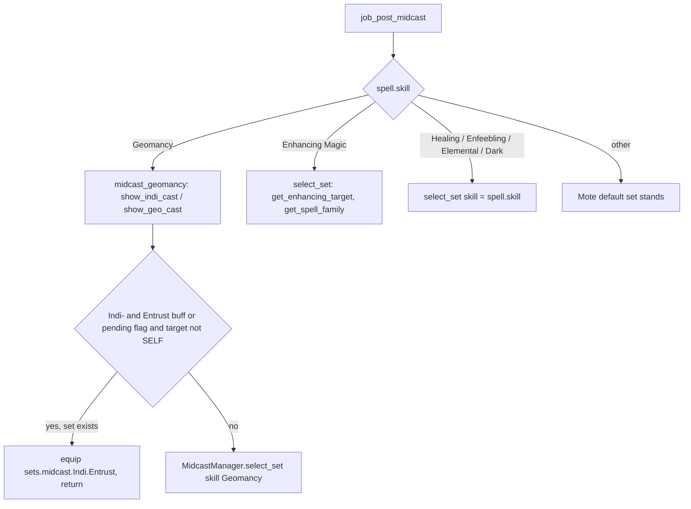

# GEO (Geomancer) job

The GEO job area is 11 hook modules plus 2 logic modules under
`shared/jobs/geo/functions/` (1 452 lines), an entry point per character (the
Tetsouo template and a Kaories overlay), six config files and one sets file.
GearSwap loads it when the main job becomes GEO. From then on Mote-Include calls
its hooks on every action, on status, buff and pet changes, on `//gs c`
commands and on state cycles. Only Kaories plays GEO today (no live
`Tetsouo_GEO.lua`).

What GEO adds on top of the shared pipeline:

- **Luopan-aware gear**: idle and engaged sets are built from the `HybridMode`
  set (`sets.idle.PDT`/`.Normal`, `sets.engaged.PDT`/`.Normal`, falling back to
  `sets.me.*`) without a luopan and `sets.luopan.*` with one (`LuopanMode`
  DT/DPS while engaged); Mote's own base set is ignored.
- **Midcast through `MidcastManager`**: Geomancy with an Entrust override for an
  Indi- spell cast on a party member; Healing, Enhancing (spell family +
  Composure target), Enfeebling, Elemental and Dark Magic on
  `sets.midcast[skill]`.
- **Indi/Geo commands** built from states (`indi`, `geo`, `entrust`), with the
  Geo- target chosen from a buff list, and `escort` (Full Circle, Indi- on self,
  then follow a leader; added with the Sortie commands in `7a833d4`).
- **Nuke commands with tier fallback** (`lightspell`, `darkaoe`, ...) that walk
  down from the selected tier to the first learned, ready spell.
- **Scholar subjob helpers** (Arts toggles, `aoe` Accession chains, `dispel`).
- The shared **CombatMode** weapon lock, the PetTP addon loaded while GEO
  is the main job, and Entrust reporting to the dual-box main.

Every file in scope was read in full except the gear content of the sets files
and the geomancy databases (structure and names only). Line numbers were
rechecked against the working tree on 2026-09-25; where a line number added
nothing, the function name is cited instead.

## Files

| Path | Lines | Role |
|------|------:|------|
| `_master/entry/Tetsouo_GEO.lua` | 276 | Entry point (template): config preload, `get_sets`, `job_sub_job_change`, `user_setup`, `job_update` (UI only), `init_gear_sets`, `file_unload` |
| `_master/Kaories/entry/Kaories_GEO.lua` | 275 | Kaories overlay: same code, `Kaories/` paths, shorter dual-box comment (218-219) |
| `shared/jobs/geo/functions/geo_functions.lua` | 101 | Facade: `message_buffs.lua`, the 11 hook files, `dualbox_manager` |
| `shared/jobs/geo/functions/GEO_PRECAST.lua` | 114 | `job_precast` (guard, cooldown, Entrust flag, WS) / `job_post_precast` |
| `shared/jobs/geo/functions/GEO_MIDCAST.lua` | 135 | `job_midcast` (empty) / `job_post_midcast` (Geomancy + the other skills through `MidcastManager`) |
| `shared/jobs/geo/functions/GEO_AFTERCAST.lua` | 66 | `job_aftercast`: watchdog, Entrust flag set/clear |
| `shared/jobs/geo/functions/GEO_IDLE.lua` | 42 | `customize_idle_set` -> `SetBuilder.build_idle_set` |
| `shared/jobs/geo/functions/GEO_ENGAGED.lua` | 42 | `customize_melee_set` -> `SetBuilder.build_engaged_set` |
| `shared/jobs/geo/functions/GEO_STATUS.lua` | 20 | `job_status_change = LifecycleManager.status_change()` |
| `shared/jobs/geo/functions/GEO_BUFFS.lua` | 51 | Own `job_buff_change`: `AltBuffReporter.report`, then Doom |
| `shared/jobs/geo/functions/GEO_COMMANDS.lua` | 408 | `job_self_command` router (incl. `escort`), `geo_escort_on_aftercast`, `job_state_change = LifecycleManager.state_change()` |
| `shared/jobs/geo/functions/GEO_MOVEMENT.lua` | 40 | `get_geo_movement_status` only |
| `shared/jobs/geo/functions/GEO_LOCKSTYLE.lua` | 49 | Lazy `LockstyleManager.create('GEO', ..., 1, 'SAM')` wrappers |
| `shared/jobs/geo/functions/GEO_MACROBOOK.lua` | 43 | Lazy `MacrobookManager.create('GEO', ..., 'SAM', 1, 1)` wrapper |
| `shared/jobs/geo/functions/logic/geo_spell_refiner.lua` | 158 | `refine_spell` / `refine_and_cast` tier fallback |
| `shared/jobs/geo/functions/logic/set_builder.lua` | 183 | HybridMode / `sets.luopan` selection, town, weapons, movement; unused `apply_buff_gear` |
| `_master/config/geo/GEO_STATES.lua` | 329 | All states (`GEOStates.configure()`), unused `validate()` |
| `_master/config/geo/GEO_KEYBINDS.lua` | 58 | 12 binds, data only; `KeybindManager.create('GEO', ...)` adds `bind_all` / `unbind_all` / `show_intro` (see [keybinds and custom states](../systems/keybinds-and-custom.md)) |
| `_master/config/geo/GEO_CUSTOM.lua` | 118 | Player modes and gear rules (all examples commented out), read through `KeybindManager`; no Kaories overlay copy (the live `Kaories/config/geo/GEO_CUSTOM.lua` is the player's own) |
| `_master/config/geo/GEO_LOCKSTYLE.lua` | 51 | `default = 5`, `by_subjob`, `get_style` |
| `_master/config/geo/GEO_MACROBOOK.lua` | 68 | Book 5 page 1 for every subjob; dual-box block all commented |
| `_master/config/geo/GEO_TP_CONFIG.lua` | 62 | `_G.GEOTPConfig` (Moonshade; no weapon bonus) |
| `_master/Kaories/config/geo/*.lua` | 58, 51, 68, 329, 62 + `GEO_REFILL.lua` 22 | Overlay: identical to the templates except line endings; plus the refill list |
| `_master/sets/geo_sets.lua` | 447 | Template sets (flat) |
| `_master/Kaories/sets/geo_sets.lua` | 447 | Overlay sets: identical except the Exudation WS neck/waist (405-406) |
| `shared/utils/messages/formatters/jobs/message_geo.lua` + `data/jobs/geo_messages.lua` | 183 + 41 | Indi/Geo cast line with element colour, tier refinement messages |
| `shared/data/magic/geomancy/geomancy_indi.lua`, `geomancy_geo.lua` | 349, 364 | 30 Indi- / 30 Geo- entries (description, element) read by `message_geo` at load |
| `shared/data/magic/GEO_SPELL_DATABASE.lua` | 191 | Read by `data_loader` and the spell message handler (messages only) |
| `shared/data/job_abilities/GEO_JA_DATABASE.lua` | 13 | `JA_DATABASE_FACTORY.create('GEO')` for ability messages |
| `shared/utils/scholar/scholar_actions.lua` | 346 | `aoe` Accession chains (shared with BLM, PLD) |

Live copies (gitignored): `Kaories/Kaories_GEO.lua` and `Kaories/config/geo/*`
are identical to the overlay (plus the live-only `GEO_CUSTOM.lua`).
`Kaories/sets/geo_sets.lua` equals the overlay (the old `'Sybil Scarf'` typo is
gone; the item is `Sibyl Scarf`, `res/items.lua:20450`). `Tetsouo/` has no GEO
files; `_master/Tetsouo/` has no GEO overlay.

## How it works

### Load sequence

`user_setup()` (`Tetsouo_GEO.lua:160-223`):

1. `GEOStates.configure()` (165-166).
2. `send_command('lua load pettp')` (171): the PetTP addon, unloaded again in
   `file_unload` (285). This runs on every `user_setup()`, so a subjob change
   loads it in the old sandbox, unloads it in that sandbox's `file_unload`, and
   loads it again in the new one.
3. `GEO_KEYBINDS` (which returns `KeybindManager.create('GEO', ...)`) ->
   global `GEOKeybinds`, `bind_all()` (180). `KeybindManager`'s `show_intro`
   (`keybind_manager.lua` `show_intro`) `require`s `GEO_MACROBOOK.lua` and
   `GEO_LOCKSTYLE.lua`. Both return nothing, so `show_intro` always falls back
   to `show_system_intro`, but executing them defines
   `select_default_macro_book` / `select_default_lockstyle` as a side effect.
   A failed require prints the Lua error (`'[GEO] Keybinds failed to load: '
   .. tostring(keybinds)`, since 2026-09-25).
4. `KeybindUI.smart_init("GEO", UIConfig.init_delay)` (193).
5. `JobChangeManager.initialize()`, then, only because of the side effect in
   step 3, `select_default_macro_book()` and `select_default_lockstyle` after
   8 s (207-213). The facade later includes the two wrapper files again, which
   creates a second, independent factory instance for each (same situation as
   [BLM](blm.md)).
6. `pcall(require, 'shared/utils/dualbox/dualbox_manager')` (222).

`geo_functions.lua` includes `message_buffs.lua` (28), `GEO_PRECAST`,
`GEO_MIDCAST`, `GEO_AFTERCAST` (35-39), `GEO_IDLE`, `GEO_ENGAGED` (46-48),
`GEO_STATUS`, `GEO_BUFFS` (55-57), `GEO_LOCKSTYLE`, `GEO_MACROBOOK`,
`GEO_COMMANDS`, `GEO_MOVEMENT` (65-69), requires `dualbox_manager` (90) and
prints a debug line (96-97).

The Kaories overlay differs only in the character name in paths and in the
dual-box comment (`_master/Kaories/entry/Kaories_GEO.lua:218-219`).

### Precast

`job_precast` (`GEO_PRECAST.lua:57-87`) follows the standard order:
`PrecastGuard` (61), `CooldownChecker` for abilities or spells (66-72), return
on cancel (74-76), then the GEO step: `spell.type == 'JobAbility'` and
`Entrust` sets `_G.geo_entrust_pending = true` (79-81), then
`WSPrecastHandler.handle(spell, eventArgs, GEOTPConfig)` (84-86).
`job_post_precast` (94-99) applies the stored TP gear. Mote's default precast
picks `sets.precast.FC`, `sets.precast.JA[...]` or `sets.precast.WS`. There is
nuke commands refine through `geo_spell_refiner`; since 2026-09-26 a nuke, -ra or
Aspir cast from a macro also drops to the highest learned, ready tier
(`TierRefiner` with `shared/data/spells/NUKE_TIERS.lua`, in place of
`CooldownChecker` in `job_precast`).

### Midcast

Mote first equips its default midcast set, then `job_post_midcast`
(`GEO_MIDCAST.lua:99-121`) notifies `MidcastWatchdog` (102-104) and routes by
skill:

- The message line comes from `message_geo.lua` `show_indi_cast` /
  `show_geo_cast` (93-162), which require both geomancy databases at load
  (18-19) and print an error for a spell missing from them.
- `select_set({skill = 'Geomancy'})` resolves to `sets.midcast.Geomancy` (P9),
  because no set is named after an Indi-/Geo- spell. In both set files
  `sets.midcast.Geomancy` **is** `sets.luopan.idle` (`_master/sets/geo_sets.lua:290`), so
  every Indi- and Geo- cast wears the luopan idle set. `sets.midcast.Geo` (316)
  is looked up by nothing.
- `sets.midcast.Indi = sets.luopan.idle` (293) is the same table, so line 297
  writes the `Entrust` sub-table **into** `sets.luopan.idle`. GearSwap ignores
  non-slot keys when equipping (`helper_functions.lua:313-315`), so this has no
  gear effect.
- The other skills go through `MidcastManager` (`PLAIN_SKILLS`, 87-92, and the
  Enhancing branch, 108-114), so `//gs c debugmidcast` traces them. With the
  current set files the gear is the same as Mote's default: there is no
  `sets.midcast['Healing Magic']` or `['Dark Magic']`, so those calls return
  false and Mote's choice (`sets.midcast.Cure` by spell map) stands;
  `['Enhancing Magic']` and `['Enfeebling Magic']` are empty tables, so they
  equip nothing; `['Elemental Magic']` is the set Mote already picked. A set
  named after a spell, its tier-less name or an enhancing family
  (`sets.midcast.Refresh`, ...) now takes effect through the manager.

### Idle, engaged, pet

- `customize_idle_set` -> `SetBuilder.build_idle_set` (`set_builder.lua:131-156`):
  `sets.luopan.idle` when `pet.isvalid`, else `sets.idle[HybridMode]` falling
  back to `sets.me.idle` (`select_hybrid_base`, 81-87; Mote's base is
  ignored); then town (`sets.Adoulin` in Adoulin, `sets.idle.Town` in other
  cities, Dynamis excluded, which overrides the luopan set: 142-145); then
  `sets[state.MainWeapon]` and `sets[state.SubWeapon]` (`apply_weapon`, 39-69); then
  `sets.MoveSpeed` when moving outside town.
- `customize_melee_set` -> `build_engaged_set` (96-126): with a luopan,
  `sets.luopan.engaged.DT` or `.DPS` from `LuopanMode` (fallback DT, then
  `sets.me.engaged`); without, `sets.engaged[HybridMode]` falling back to
  `sets.me.engaged`; then weapons. No movement layer.
- `HybridMode` has no gear effect yet: in the template, the Kaories overlay and
  the live Kaories file, `sets.idle.PDT`, `.Normal`, `sets.engaged.PDT` and
  `.Normal` are all aliases of `sets.me.idle` / `sets.me.engaged`
  (`_master/sets/geo_sets.lua:120-121,190-191`, "GEO uses same for now"). Giving
  `sets.idle.PDT` / `sets.engaged.PDT` (or `.Normal`) their own gear is enough
  for the mode to change it; with a luopan out the mode is not read.
- The luopan appearing or leaving re-equips through Mote's `pet_change`, which
  calls `handle_equipping_gear` (`Mote-Include.lua:1048-1061`).
- CombatMode: since 2026-09-25 the shared [Combat Mode](../systems/keybinds-and-custom.md#combat-mode-sharedutilscorecombat_modelua-2026-09-25)
  hook on `handle_equipping_gear` disables main/sub/range/ammo when On and
  enables them when Off unless a craft session is active; `job_update` only
  refreshes the HUD. The lock follows every gear update: `gs c update` and every
  state cycle, HUD shown or not (the HUD-visible `cyclestate` ends in Mote's
  `handle_update`, `CYCLE_HANDLER.lua:60-63`). A lock left by a reload or job
  change is freed at the next load.

### Aftercast, status, buffs

- `job_aftercast` (`GEO_AFTERCAST.lua:30-58`): watchdog; sets
  `_G.geo_entrust_pending` to `not spell.interrupted` after Entrust (41-43),
  so an interrupted Entrust lowers the flag precast raised; calls
  `_G.geo_escort_on_aftercast` (46-48, the `escort` follow); clears the flag
  after an uninterrupted Indi- spell (51-53). The flag is initialised when the
  file loads (17-19). Precast sets it (`GEO_PRECAST.lua:79-81`); an Entrust
  refused before any aftercast still leaves it set until the next completed
  Indi-.
- `job_status_change` is the shared `LifecycleManager` handler.
- `job_buff_change` (`GEO_BUFFS.lua:31-48`) is GEO's own: it calls
  `AltBuffReporter.report(buff, gain)` (36), which only sends when this
  character is the dual-box ALT (GEO is the only job that calls it), then
  `DoomManager.handle_buff_change` (38). See
  [dualbox](../systems/dualbox.md#alt-buff-reporter).

### Nuke tier fallback

`GeoSpellRefiner.refine_and_cast(base, tier, is_aoe, target)`
(`geo_spell_refiner.lua:134-152`) walks `V, IV, III, II, I` (or `III, II, I` for
-ra spells, `refine_spell` 89-126) from the requested tier down and casts the
first spell that is learned (`has_spell`, 27-44) and off recast
(`is_spell_ready`, 49-72),
printing `spell_refined` when it differs from the request, or
`no_tier_available` when none qualifies. Tier `I` means the bare name. Both
helpers scan `res.spells` linearly (known, not repeated here).

## Mote states

Created by `GEOStates.configure()` (`_master/config/geo/GEO_STATES.lua:50-268`)
on every `user_setup()`. Keys from `_master/config/geo/GEO_KEYBINDS.lua:28-55`;
`#numpad0` (AutoMedicine) comes from the character's `config/COMMON_KEYBINDS.lua`.

| State | Values | Default | Key | Read by |
|-------|--------|---------|-----|---------|
| `HybridMode` | PDT, Normal | PDT | `^numpad9` | `set_builder.lua:81-87` (base without a luopan); both modes wear the same gear today (see Idle, engaged, pet) |
| `CombatMode` | Off, On | Off | `^numpad0` | shared [Combat Mode](../systems/keybinds-and-custom.md#combat-mode-sharedutilscorecombat_modelua-2026-09-25) hook |
| `LuopanMode` | DT, DPS | DT | `^numpad.` | `set_builder.lua:101-115` (engaged with a luopan only) |
| `MainWeapon` | Idris | Idris | none | `set_builder.lua:44-54` |
| `SubWeapon` | Genmei Shield | Genmei Shield | none | `set_builder.lua:56-66` |
| `IndicolureMode` | Self, Entrust | Self | `^numpad+` | nothing (HUD only) |
| `MainIndi` | 30 Indi- spells | Indi-Haste | `^numpad3` | `indi`, `entrust` |
| `MainGeo` | 28 Geo- spells | Geo-Frailty | `^numpad4` | `geo` |
| `MainLightSpell` | Fire, Aero, Thunder | Fire | `^numpad5` | `lightspell` |
| `MainDarkSpell` | Blizzard, Stone, Water | Blizzard | `^numpad6` | `darkspell` |
| `SpellTier` | V, IV, III, II, I | V | `^numpad1` | `lightspell`, `darkspell` |
| `MainLightAOE` | Fira, Aera, Thundara | Fira | `^numpad7` | `lightaoe` |
| `MainDarkAOE` | Blizzara, Stonera, Watera | Blizzara | `^numpad8` | `darkaoe` |
| `AOETier` | III, II, I | III | `^numpad2` | `lightaoe`, `darkaoe` |
| `FastCast` | 0..80 step 10 | 80 | none | `MidcastWatchdog` |
| `AutoMedicine` | shared On/Off | persisted | `#numpad0` (from `COMMON_KEYBINDS.lua`) | `AutoMedicine.init` (264-266) |

The state comments now call Indi-/Geo-Fend "Magic Defense+ (buff)"
(`_master/config/geo/GEO_STATES.lua:139,163`), matching the command buff list
and the geomancy database (`GEO_COMMANDS.lua:73`, `geomancy_geo.lua:87-95`);
Languor / Vex / Fade were corrected on 2026-09-25 as well.

## Commands

`job_self_command` (`GEO_COMMANDS.lua:101-393`) lowercases the first word and
tests `altjobupdate` (114; passes the sender name, 5th argument, since
2026-09-25), `requestjob` (126), `ui` (134), `debugmidcast` (143),
`cyclestate` (162), watchdog (168), **CommonCommands** (176), then:

| Command | Effect | Lines |
|---------|--------|-------|
| `indi` | `/ma "<MainIndi>" <me>` | 191-197 |
| `geo` | `/ma "<MainGeo>" <stpc>` for the 18 names in `GEO_BUFFS` (66-85), `<stnpc>` otherwise. Geo-Poison left the list on 2026-09-25: it is a debuff (`targets` 32 in `res/spells.lua`), so it now goes to `<stnpc>` | 202-211 |
| `escort [Indi-X] [leader]` | Full Circle if a luopan is out, `/ma "<Indi-X>" <me>` (default Indi-Regen) 2 s later (at once without a luopan), then `sm follow <leader>` when the Indi- aftercast arrives (`geo_escort_on_aftercast`), with a timer as a safety net; `MessageSortie.show_alt_escort` | 218-256 |
| `entrust` | `/ja "Entrust" <me>`, then `AbilityHelper.follow_up_or_abort('Entrust', '/ma "<MainIndi>" <stal>', 1.5)`: the Indi goes out once Entrust registers, and is abandoned with a warning if Entrust was refused | 259-273 |
| `lightspell` / `darkspell` | `refine_and_cast(<Main*Spell>, SpellTier, false, '<t>')` | 276-299 |
| `lightaoe` / `darkaoe` | `refine_and_cast(<Main*AOE>, AOETier, true, '<t>')` | 302-325 |
| `lightarts` / `darkarts` | Arts, then Addendum on the next press; own copy of `ScholarActions.light_arts`/`dark_arts` using `MessageCore.info` | 337-362 |
| `aoe sneak` / `invi` / `invisible` / `erase` | `ScholarActions.try_aoe_subcommand(cmdParams[2], nil)` (always AoE, no state) | 366-372 |
| `dispel` | /RDM: Dispel `<stnpc>`; /SCH: `ScholarActions.cast_under_black_addendum('Dispel', '<stnpc>')`, shared with BLM; else warning | 379-392 |

`job_state_change` is `LifecycleManager.state_change()` (399); it ignores
the state name, so the key (CycleHandler) vs description (Mote) difference does
not matter. CombatMode is the shared `combat_mode.lua` hook, not here.

## Set names the code looks up

T = `_master/sets/geo_sets.lua`; the Kaories overlay and live file have the same
line numbers.

| Set | Looked up by | T |
|-----|--------------|---|
| `sets['Idris']`, `sets['Genmei Shield']` | `set_builder.lua:45,57` | 54, 60 |
| `sets.idle.PDT`, `.Normal`, `sets.engaged.PDT`, `.Normal` (aliases of `sets.me.*`) | `select_hybrid_base` by `HybridMode` (`set_builder.lua:81-87,119,139`) | 120-121, 190-191 |
| `sets.me.idle`, `sets.me.engaged` (fallback), `sets.luopan.idle` | `set_builder.lua:119,136,139` | 71, 129, 91 |
| `sets.luopan.engaged.DT`, `.DPS` | `set_builder.lua:105-115` | 148, 173 |
| `sets.idle.Town` (= `sets.me.idle.Town`), `sets.Adoulin`, `sets.MoveSpeed` | `BaseSetBuilder` | 428 (424), 431 (2 slots), 419 |
| `sets.idle.Pet` | only Mote's base, which the builder discards | 122 |
| `sets.precast.FC`, `.FC.Cure`, `sets.precast.JA[...]` (Bolster, Life Cycle, Blaze of Glory, Dematerialization, Entrust, Ecliptic Attrition, Radial Arcana), `sets.precast.WS`, `WS['Exudation']` | Mote default precast | 200, 239, 248-279, 379, 398 |
| `sets.midcast.Geomancy` (= `sets.luopan.idle`) | `MidcastManager` base | 290 |
| `sets.midcast.Indi.Entrust` | `GEO_MIDCAST.lua:70-71` | 297 |
| `sets.midcast.Indi`, `sets.midcast.Geo` | nothing | 293, 316 |
| `sets.midcast.Cure` | Mote default (spell map); no `['Healing Magic']` base, so `MidcastManager` returns false | 319 |
| `sets.midcast['Enhancing Magic']` (empty), `['Enfeebling Magic']` (empty), `['Elemental Magic']` | Mote default, then `MidcastManager` base (`GEO_MIDCAST.lua:108-119`) | 344, 347, 350 |
| `sets.midcast['Healing Magic']`, `['Dark Magic']` | `MidcastManager` base | **absent** (routes are no-ops) |
| `sets.buff.Doom` | shared `DoomManager` | 442 |

The two absent sets make their `MidcastManager` routes no-ops; nothing else the
code looks up is missing.

## Configuration

| File / key | Default | Where the default lives | Read by |
|------------|---------|-------------------------|---------|
| `<char>/config/geo/GEO_STATES.lua` | see states | file | entry `user_setup` |
| `<char>/config/geo/GEO_KEYBINDS.lua` | 12 binds (laid down in file order by `KeybindManager`) | file | entry `user_setup`, `file_unload` |
| `<char>/config/geo/GEO_CUSTOM.lua` | nothing active (template) | file | `KeybindManager` / `CustomStates` ([keybinds and custom states](../systems/keybinds-and-custom.md)) |
| `<char>/config/geo/GEO_LOCKSTYLE.lua` `default`, `by_subjob`, `get_style` | 5 | file; factory fallback 1 (`shared/jobs/geo/functions/GEO_LOCKSTYLE.lua:26-31`) | `LockstyleManager` via `get_style` |
| `<char>/config/geo/GEO_MACROBOOK.lua` `default`, `solo`, `dualbox` | book 5 page 1 everywhere; `dualbox` empty | file; factory fallback book 1 (`shared/jobs/geo/functions/GEO_MACROBOOK.lua:26-32`) | `MacrobookManager` |
| `<char>/config/geo/GEO_TP_CONFIG.lua` -> `_G.GEOTPConfig` | Moonshade 250 (37), `weapons = {}` (46), `get_weapon_bonus` returns 0 (54-57) | file | `TPBonusCalculator` |
| `Kaories/config/geo/GEO_REFILL.lua` (template `_master/Kaories/config/geo/`) | Panacea, ..., Echo Drops, Vile Elixir(+1), Tropical Crepe | file | refill system |
| `Tetsouo/config/LOCKSTYLE_CONFIG.lua`, `REGION_CONFIG`, `RECAST_CONFIG`, UI config | - | entry fallback 42-48 | entry |
| PetTP addon | - | Windower addon | loaded by `user_setup`, unloaded by `file_unload` |

## State & lifetime

- Sandbox `_G` written: the Mote hooks (`job_precast`, `job_post_precast`,
  `job_midcast`, `job_post_midcast`, `job_aftercast`, `job_status_change`,
  `job_buff_change`, `customize_idle_set`, `customize_melee_set`,
  `job_self_command`, `job_state_change`), `geo_entrust_pending`,
  `GEOTPConfig`, `GEOKeybinds`, `LockstyleConfig`, `RECAST_CONFIG`,
  `RegionConfig`, `select_default_lockstyle`, `cancel_geo_lockstyle_operations`,
  `select_default_macro_book`, the factory exports, `get_geo_movement_status`.
- `_G` read: `MidcastManagerDebugState`, `MidcastWatchdog`,
  `CraftManager`, `AltBuffState` / `AltJobState` (through the dual-box
  modules), `geo_escort_on_aftercast`.
- `windower.*`: nothing written by GEO code itself (`AbilityHelper` and the
  keybind manager keep their own `windower._*` records). No events registered.
- Outside the sandbox: the PetTP addon (load/unload), the `disable_table` slot
  locks of CombatMode (they survive `gs reload` and job change; the shared
  `combat_mode.lua` frees them at the next load).
- Coroutines: the 8 s lockstyle, the `escort` cast and follow timers, and the
  polls behind `entrust` and `dispel`.
  Neither chains `wait N` any more: `entrust` uses
  `AbilityHelper.follow_up_or_abort`, `dispel` goes through
  `ScholarActions.cast_under_black_addendum`. Both wait for the buff and
  abort with a warning instead of casting without it. The lockstyle is not
  cancelled on reload; the polls carry a generation counter and are.
- Subjob change: Mote re-runs `user_setup()` (PetTP load, states reset, keys
  rebound, macrobook/lockstyle again), then `job_sub_job_change`
  (`Tetsouo_GEO.lua:140-150`) calls `JobChangeManager.on_job_change`, which
  schedules `gs reload` (the `initialize({...})` call whose argument was
  ignored was removed on 2026-09-25).

## Interactions

- Precast: `PrecastGuard`, `CooldownChecker`, `WSPrecastHandler`
  ([precast pipeline](../systems/precast-pipeline.md)).
- Midcast: `MidcastManager` (every magic skill GEO casts), `MidcastWatchdog`
  ([midcast and buffs](../systems/midcast-and-buffs.md)).
- Scholar: `scholar_actions.lua` for `aoe`; the Arts toggles are GEO's own
  copy ([midcast and buffs](../systems/midcast-and-buffs.md#scholaractions-and-stratagemcharges)).
- Messages: `message_geo` (hard-codes `GEO` in the refinement templates),
  `message_buffs` ([messages](../systems/messages.md)).
- Dual-box: `GEO_BUFFS.lua:36` reports Entrust; on the MAIN,
  `GEO_ALT_CUSTOM.lua` retargets Indi- alt commands while the ALT's Entrust is
  up ([dualbox](../systems/dualbox.md)).
- Factories, `JobChangeManager`, `LifecycleManager`, `CommonCommands`,
  `CycleHandler`, UI ([UI overlay](../systems/ui-overlay.md); `UI_LOADER.lua:67-76`
  has a GEO fallback bind list used only when the keybind file is missing).
- COR: Naturalist's Roll lists GEO as its job bonus (`roll_data.lua:335`).

## Invariants & gotchas

- The idle/engaged base comes from `sets.idle[HybridMode]` /
  `sets.engaged[HybridMode]` (else `sets.me`) without a luopan, and from
  `sets.luopan` with one; Mote's own selection (`IdleMode`, `sets.idle.Pet`,
  ...) is discarded.
- In town the town set wins over the luopan set.
- `sets.midcast.Geomancy`, `sets.midcast.Indi` and `sets.luopan.idle` are one
  table: a `set_combine` into one of them is not needed, but assigning a key on
  one writes it on all three.
- Every skill except Geomancy and Enhancing goes through `MidcastManager` with
  no mode, type or target: a skill-specific rule needs its own branch in
  `job_post_midcast`.
- Commands that depend on the subjob (`lightarts`, `aoe`, `dispel`) do not check
  it; the game refuses the actions.
- `lightarts`, `darkarts`, `dispel`, `entrust`, `escort` run here even when the dual-box
  partner's alt config has those names; `//gs c alt <name>` sends the partner's
  (see [commands and debug](../systems/commands-and-debug.md#4-alt-commands-and-name-shadowing)).
- The `aoe` form was introduced because the alt configs have `sneak`/`invi` keys,
  which CommonCommands used to answer first; that reason no longer holds, and
  the comment above the branch (`GEO_COMMANDS.lua:364-365`) no longer gives
  it (rewritten 2026-09-25).

## Extending

- New Geomancy override: add it in `GEO_MIDCAST.lua` after the Entrust block,
  before `select_set`; give it its own set (not a key on `sets.midcast.Indi`,
  which is the luopan idle set).
- Route another skill through `MidcastManager`: add it to `PLAIN_SKILLS`
  (`GEO_MIDCAST.lua:87-92`), or give it a branch when it needs a mode, type or
  target; make sure `sets.midcast[skill]` exists.
- Make `HybridMode` change gear: replace the alias lines
  `sets.idle.PDT = sets.me.idle` / `sets.engaged.PDT = sets.me.engaged` (or the
  `.Normal` ones) with their own sets, in the template, the Kaories overlay and
  the live Kaories file.
- New Geo- buff: add it to `GEO_BUFFS` (`GEO_COMMANDS.lua:66-85`) so `geo`
  targets `<stpc>`, and to `MainGeo`. Only real buffs belong there: the target
  follows `targets` in `res/spells.lua`.
- New state: `GEO_STATES.lua` and `GEO_KEYBINDS.lua`, in `_master/config/geo/`,
  `_master/Kaories/config/geo/` and the live `Kaories/config/geo/`.

## Auto abilities (2026-09-25)

Off unless `<Character>/config/AUTO_ABILITIES.lua` turns them on (template
`_master/config_global/AUTO_ABILITIES.lua`, reader `shared/utils/core/auto_options.lua`).
`GEO_PRECAST.lua` calls `logic/geo_auto_abilities.lua` right after the cooldown check:

- `geo_entrust`: an `Indi-` aimed at a party member (PLAYER or trust in party, not self)
  goes through `AbilityHelper.try_ability(spell, eventArgs, 'Entrust', 1.5)`: cancelled,
  Entrust fired, recast on the same target once Entrust is up.
- `geo_full_circle`: a `Geo-` cast while `pet.isvalid` and Full Circle is ready is
  cancelled; Full Circle goes out and the Geo- is sent again 2 s later (the ability delay,
  as `//gs c escort`). `windower._geo_full_circle_replay` (5 s) lets that recast through.

## Known issues

- `HybridMode` (the `^numpad9` anchor, default PDT) is read by the set builder
  but changes no gear yet: no set file has PDT gear, `sets.idle.PDT` /
  `sets.engaged.PDT` alias the Normal sets (`_master/sets/geo_sets.lua:120-121,190-191`,
  same lines in the overlay and live file). The mode is not read while a
  luopan is out.
- `IndicolureMode` has no reader (`_master/config/geo/GEO_STATES.lua:98-103`).
- PetTP is loaded on every `user_setup()`, including the old sandbox's run on a
  subjob change, and unloaded on every `file_unload` (`Tetsouo_GEO.lua:171,269`).
- No `sets.midcast['Healing Magic']` or `['Dark Magic']`: those
  `MidcastManager` routes return false and Cures keep Mote's
  `sets.midcast.Cure` (`_master/sets/geo_sets.lua:319`).
- `sets.midcast.Geo` is unreachable and the Entrust set is stored inside
  `sets.luopan.idle` (`_master/sets/geo_sets.lua:290-316`).
- Initial macrobook/lockstyle depend on `KeybindManager`'s `show_intro`
  requiring the wrappers (`keybind_manager.lua` `show_intro`).
- `lightarts`/`darkarts` duplicate `ScholarActions.light_arts`/`dark_arts`
  (`GEO_COMMANDS.lua:337-362`, `scholar_actions.lua:59-84`).
- Template/overlay `sets.Adoulin` is a 2-slot set used as the full idle base in
  Adoulin (`_master/sets/geo_sets.lua:431`).
- `_master/Kaories/config/geo/` has no `GEO_CUSTOM.lua`: a re-clone of Kaories
  would put the generic template over the live one.
- Pending in-game check (2026-09-25): `//gs c geo` with `MainGeo = Geo-Poison`
  opens the enemy target cursor (`<stnpc>`).
- Dead code: `SetBuilder.apply_buff_gear`, `get_geo_movement_status`,
  `GEOStates.validate`, `GEO_LOCKSTYLE.style` (`GEO_MOVEMENT.lua:20-40`,
  `_master/config/geo/GEO_STATES.lua:277-322`,
  `_master/config/geo/GEO_LOCKSTYLE.lua:49`).
- Fixed, no longer issues: `entrust` casting the Indi although Entrust was
  refused (`033846e`, `follow_up_or_abort`); `dispel` duplicating BLM's (both
  use `ScholarActions.cast_under_black_addendum`); the live `Sybil Scarf`
  typo; Geo-Poison sent to `<stpc>` (2026-09-25); the Fend / Languor / Vex /
  Fade state comments (2026-09-25); the `initialize({...})` call in
  `job_sub_job_change` (removed 2026-09-25); the keybind load error printed
  without its cause (2026-09-25).
- User docs list `Alt+N` keys (`docs/user/jobs/geo/states.md:305-312`).
