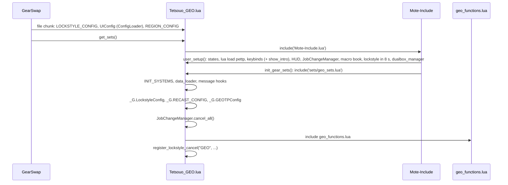
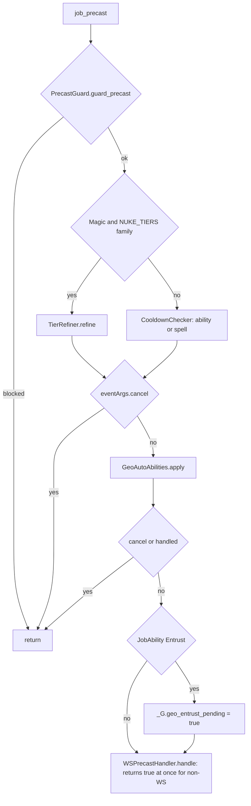
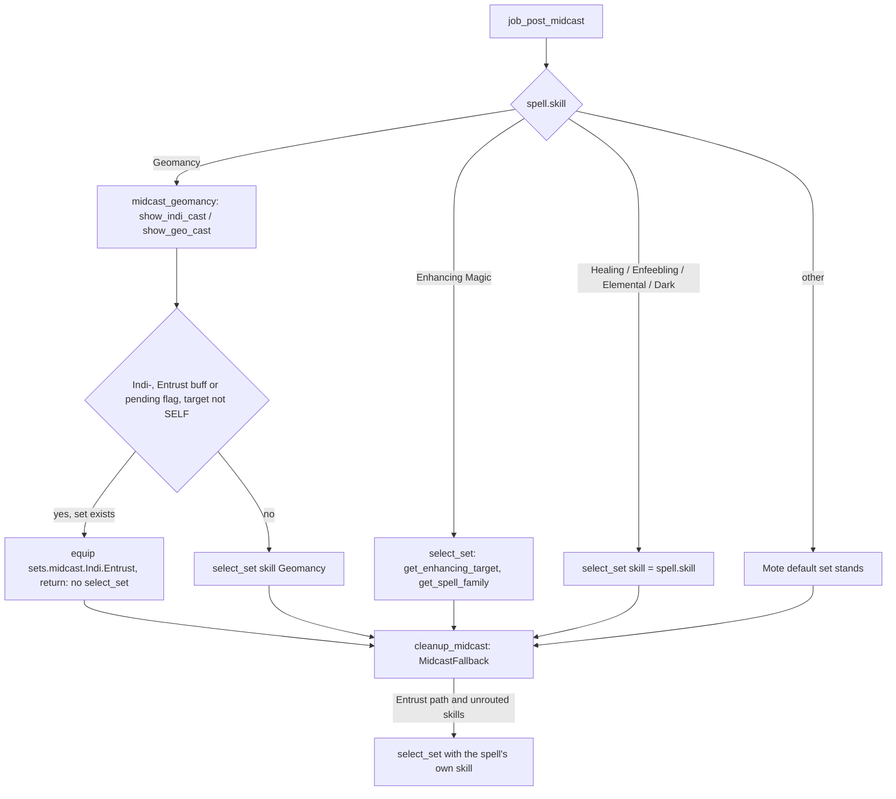

# GEO (Geomancer) job

The GEO job area is the facade plus 11 hook modules and 3 logic modules under
`shared/jobs/geo/functions/` (about 1 500 lines), an entry point per
character, seven config files and one sets file. GearSwap loads it when the
main job becomes GEO. From then on Mote-Include calls its hooks on every
action, on status, buff and pet changes, on `//gs c` commands and on state
cycles. Today GEO is played through a character overlay only (the author's
alt), not through the author's main overlay.

What GEO adds on top of the shared pipeline:

- **Luopan-aware gear**: idle and engaged sets are built from the
  `HybridMode` set (`sets.idle.PDT` / `.Normal`, `sets.engaged.PDT` /
  `.Normal`, falling back to `sets.me.*`) without a luopan and from
  `sets.luopan.*` with one (`LuopanMode` DT / DPS while engaged); Mote's own
  base set is ignored.
- **Midcast through `MidcastManager`**: Geomancy (with an Entrust override for
  an Indi- on a party member), Healing, Enhancing (spell family + Composure
  target), Enfeebling, Elemental and Dark Magic on `sets.midcast[skill]`.
- **Tier step-down in precast** for nukes, -ra and Aspir (`TierRefiner` with
  `NUKE_TIERS`), in place of the cooldown check.
- **Automatic abilities** (opt-in): Entrust before an Indi- on a party member,
  Full Circle before a Geo- while a luopan is out (`geo_auto_abilities.lua`).
- **Indi / Geo commands** built from states (`indi`, `geo`, `entrust`), the
  Geo- target chosen from a buff list, and `escort` (Full Circle, Indi- on
  self, then follow a leader).
- **Nuke commands with tier fallback** (`lightspell`, `darkspell`,
  `lightaoe`, `darkaoe`).
- **Scholar subjob helpers** (Arts toggles, `aoe` Accession chains, `dispel`).
- The PetTP addon loaded while GEO is the main job, and Entrust reporting to
  the dual-box main.

Player pages: [start page](../../user/jobs/geo/README.md),
[modes](../../user/jobs/geo/states.md), [sets](../../user/jobs/geo/sets.md).

Re-verified against the code on 2026-09-28. References name a file and a
function, not a line number.

## Files

| Path | Role |
|------|------|
| `_master/entry/Tetsouo_GEO.lua` | Entry point (template): config preload, `get_sets`, `job_sub_job_change`, `user_setup` (loads PetTP), `job_update` (HUD only), `init_gear_sets`, `file_unload` (unloads PetTP) |
| `shared/jobs/geo/functions/geo_functions.lua` | Facade: `message_buffs.lua`, the 11 hook files, `dualbox_manager` |
| `shared/jobs/geo/functions/GEO_PRECAST.lua` | `job_precast` (guard, tier refine or cooldown, auto abilities, Entrust flag, WS) / `job_post_precast` |
| `shared/jobs/geo/functions/GEO_MIDCAST.lua` | `job_midcast` (empty) / `job_post_midcast` (`midcast_geomancy`, Enhancing branch, `PLAIN_SKILLS`) |
| `shared/jobs/geo/functions/GEO_AFTERCAST.lua` | `job_aftercast`: watchdog, Entrust flag, `geo_escort_on_aftercast` |
| `shared/jobs/geo/functions/GEO_IDLE.lua` | `customize_idle_set` -> `SetBuilder.build_idle_set` |
| `shared/jobs/geo/functions/GEO_ENGAGED.lua` | `customize_melee_set` -> `SetBuilder.build_engaged_set` |
| `shared/jobs/geo/functions/GEO_STATUS.lua` | `job_status_change = LifecycleManager.status_change()` |
| `shared/jobs/geo/functions/GEO_BUFFS.lua` | Own `job_buff_change`: `AltBuffReporter.report`, Doom, Entrust expiry |
| `shared/jobs/geo/functions/GEO_COMMANDS.lua` | `job_self_command` router, `geo_escort_on_aftercast`, `job_state_change = LifecycleManager.state_change()` |
| `shared/jobs/geo/functions/GEO_MOVEMENT.lua` | Header only, kept for the 12-module layout |
| `shared/jobs/geo/functions/GEO_LOCKSTYLE.lua` | Lazy `LockstyleManager.create('GEO', ..., 1, 'SAM')` wrappers |
| `shared/jobs/geo/functions/GEO_MACROBOOK.lua` | Lazy `MacrobookManager.create('GEO', ..., 'SAM', 1, 1)` wrapper |
| `shared/jobs/geo/functions/logic/geo_auto_abilities.lua` | `GeoAutoAbilities.apply`: `geo_entrust`, `geo_full_circle` options |
| `shared/jobs/geo/functions/logic/geo_spell_refiner.lua` | `refine_spell` / `refine_and_cast` for the nuke commands |
| `shared/jobs/geo/functions/logic/set_builder.lua` | HybridMode / `sets.luopan` selection, town, weapons, movement; unused `apply_buff_gear` |
| `shared/data/spells/NUKE_TIERS.lua` | Tier table for Fire..Water (V-base), the -ra (III-base) and Aspir (III-base), shared with RDM |
| `shared/utils/core/auto_options.lua` | Reads `<Character>/config/AUTO_ABILITIES.lua` |
| `_master/config/geo/GEO_STATES.lua` | All states (`GEOStates.configure()`) |
| `_master/config/geo/GEO_KEYBINDS.lua` | 12 binds, data only; `KeybindManager.create('GEO', ...)` ([keybinds](../systems/keybinds-and-custom.md)) |
| `_master/config/geo/GEO_CUSTOM.lua` | Player modes and gear rules (all examples commented out) |
| `_master/config/geo/GEO_HUD.lua` | Per-job HUD section / row order (empty = defaults) |
| `_master/config/geo/GEO_LOCKSTYLE.lua` | `default = 5`, `by_subjob`, `get_style`, dead `style` field |
| `_master/config/geo/GEO_MACROBOOK.lua` | Book 5 page 1 for every subjob; dual-box block empty |
| `_master/config/geo/GEO_TP_CONFIG.lua` | `_G.GEOTPConfig`: `pieces` (Moonshade 250), `weapons = {}` |
| `_master/config_global/AUTO_ABILITIES.lua` | Template of the option file (`geo_entrust`, `geo_full_circle` false) |
| `_master/sets/geo_sets.lua` | Template sets (flat) |
| `shared/utils/messages/formatters/jobs/message_geo.lua` + `data/jobs/geo_messages.lua` | Indi / Geo cast line with element colour, nuke refinement messages |
| `shared/data/magic/geomancy/geomancy_indi.lua`, `geomancy_geo.lua` | Indi- / Geo- entries (description, element) read by `message_geo` |
| `shared/data/magic/GEO_SPELL_DATABASE.lua` | Spell data for messages and `//gs c info` |
| `shared/data/job_abilities/GEO_JA_DATABASE.lua` | `JA_DATABASE_FACTORY.create('GEO')` for ability messages |
| `shared/utils/scholar/scholar_actions.lua` | `aoe` Accession chains and `cast_under_black_addendum` (shared with BLM, PLD and `//gs c stealth`) |

Character copies are gitignored. The alt's overlay (`_master/<Alt>/`) holds
`entry/<Alt>_GEO.lua` (same code, its own paths),
`config/geo/{GEO_CUSTOM,GEO_KEYBINDS,GEO_LOCKSTYLE,GEO_MACROBOOK,GEO_REFILL,GEO_STATES,GEO_TP_CONFIG}.lua`
(`GEO_STATES` differs by `CombatMode` defaulting to On) and `sets/geo_sets.lua`
(differs only in the Exudation weaponskill neck / waist). The author's main
overlay has no GEO files.

## How it works

### Load sequence

```mermaid
sequenceDiagram
    participant GS as GearSwap
    participant E as Tetsouo_GEO.lua
    participant M as Mote-Include
    participant F as geo_functions.lua
    GS->>E: file chunk: LOCKSTYLE_CONFIG, UIConfig (ConfigLoader), REGION_CONFIG
    GS->>E: get_sets()
    E->>M: include('Mote-Include.lua')
    M->>E: user_setup(): states, lua load pettp, keybinds (+ show_intro), HUD, JobChangeManager, macro book, lockstyle in 8 s, dualbox_manager
    M->>E: init_gear_sets(): include('sets/geo_sets.lua')
    E->>E: INIT_SYSTEMS, data_loader, message hooks
    E->>E: _G.LockstyleConfig, _G.RECAST_CONFIG, _G.GEOTPConfig
    E->>E: JobChangeManager.cancel_all()
    E->>F: include geo_functions.lua
    E->>E: register_lockstyle_cancel("GEO", ...)
```

`user_setup()`:

1. `GEOStates.configure()`.
2. `send_command('lua load pettp')`: the PetTP addon, unloaded again in
   `file_unload`. This runs on every `user_setup()`, so a subjob change loads
   it in the old sandbox, unloads it in that sandbox's `file_unload`, and
   loads it again in the new one.
3. `GEO_KEYBINDS` (which returns `KeybindManager.create('GEO', ...)`) ->
   global `GEOKeybinds`, `bind_all()`. `show_intro` `require`s
   `GEO_MACROBOOK.lua` and `GEO_LOCKSTYLE.lua`; both return nothing, but
   executing them defines `select_default_macro_book` /
   `select_default_lockstyle` as a side effect. A failed require prints the
   Lua error.
4. `KeybindUI.smart_init("GEO", UIConfig.init_delay)`.
5. `JobChangeManager.initialize()`, then (thanks to step 3)
   `select_default_macro_book()` and `select_default_lockstyle` after 8 s. The
   facade later includes the two wrapper files again, creating a second,
   independent factory instance of each (same as [BLM](blm.md)).
6. `pcall(require, 'shared/utils/dualbox/dualbox_manager')`.

`geo_functions.lua` includes `message_buffs.lua`, then `GEO_PRECAST`,
`GEO_MIDCAST`, `GEO_AFTERCAST`, `GEO_IDLE`, `GEO_ENGAGED`, `GEO_STATUS`,
`GEO_BUFFS`, `GEO_LOCKSTYLE`, `GEO_MACROBOOK`, `GEO_COMMANDS`, `GEO_MOVEMENT`,
requires `dualbox_manager` and prints a debug line.

### Precast

```mermaid
flowchart TD
    A[job_precast] --> B{PrecastGuard.guard_precast}
    B -- blocked --> Z[return]
    B -- ok --> C{Magic and NUKE_TIERS family}
    C -- yes --> T[TierRefiner.refine]
    C -- no --> CC[CooldownChecker: ability or spell]
    T --> D{eventArgs.cancel}
    CC --> D
    D -- yes --> Z
    D -- no --> AA[GeoAutoAbilities.apply]
    AA --> E{cancel or handled}
    E -- yes --> Z
    E -- no --> F{JobAbility Entrust}
    F -- yes --> FF[_G.geo_entrust_pending = true]
    F -- no --> W
    FF --> W[WSPrecastHandler.handle: returns true at once for non-WS]
```

- **Tier step-down.** `NukeTiers.get(spell.name:match('^(%a+)'))` finds the
  family (Fire, Blizzard, Aero, Stone, Thunder, Water, the six -ra, Aspir).
  For those, `TierRefiner.refine` runs **in place of** `CooldownChecker`: the
  checker would cancel the cast before any downgrade could happen. The
  refiner casts the highest lower tier that is learned, off recast and
  affordable (`wait 0.1; @input /ma "<tier>" <target.raw>`, cancelling the
  original), or cancels with every tier's recast shown. A replacement's own
  precast arrives inside the refiner's 0.2 s guard and skips it. This is the
  path a macro takes; the `lightspell` family of commands has its own refiner
  (below).
- **Automatic abilities** (`geo_auto_abilities.lua`, only for
  `spell.skill == 'Geomancy'`, each gated by `AutoOptions.on(...)`):
  - `geo_entrust`: an `Indi-` whose target is a party member other than self
    (PLAYER, or an NPC trust in party) goes through
    `AbilityHelper.try_ability(spell, eventArgs, 'Entrust', 1.5)`: when Entrust
    is ready and not up, the cast is cancelled (`cancel_spell`,
    `eventArgs.handled`), Entrust is sent, and the Indi- is re-sent on the
    same target id once the Entrust buff registers.
  - `geo_full_circle`: a `Geo-` while `pet.isvalid` and Full Circle is ready
    is cancelled (`eventArgs.cancel`), Full Circle goes out, and the Geo- is
    re-sent on the same target id 2 s later. `windower._geo_full_circle_replay`
    (5 s) lets that re-send through without a second Full Circle.
- `_G.geo_entrust_pending` is raised optimistically on the Entrust ability;
  aftercast lowers it again when Entrust was interrupted.
- `job_post_precast` applies the stored TP gear. Mote's default precast picks
  `sets.precast.FC`, `sets.precast.JA[...]` or `sets.precast.WS`.

### Midcast

Mote first equips its default midcast set, then `job_post_midcast` notifies
`MidcastWatchdog` and routes by skill. Mote's `cleanup_midcast` then runs,
wrapped by `MidcastFallback`, the shared Obi / Orpheus belt, Treasure Hunter
and the CUSTOM gear ([midcast and buffs](../systems/midcast-and-buffs.md#midcastfallback)).

```mermaid
flowchart TD
    A[job_post_midcast] --> G{spell.skill}
    G -- Geomancy --> M[midcast_geomancy: show_indi_cast / show_geo_cast]
    M --> E{Indi-, Entrust buff or pending flag, target not SELF}
    E -- yes, set exists --> S[equip sets.midcast.Indi.Entrust, return: no select_set]
    E -- no --> MM[select_set skill Geomancy]
    G -- Enhancing Magic --> EN[select_set: get_enhancing_target, get_spell_family]
    G -- Healing / Enfeebling / Elemental / Dark --> PL[select_set skill = spell.skill]
    G -- other --> Z[Mote default set stands]
    S --> FB[cleanup_midcast: MidcastFallback]
    MM --> FB
    EN --> FB
    PL --> FB
    Z --> FB
    FB -- Entrust path and unrouted skills --> R2[select_set with the spell's own skill]
```

- The cast line comes from `message_geo.lua` `show_indi_cast` /
  `show_geo_cast`, which require both geomancy databases at load and print an
  error for a spell missing from them.
- `select_set({skill = 'Geomancy'})` resolves to `sets.midcast.Geomancy` (P9),
  because no set is named after an Indi- / Geo- spell. In the template
  `sets.midcast.Geomancy` **is** `sets.luopan.idle`, so every Indi- and Geo-
  cast wears the luopan idle set. `sets.midcast.Geo` is looked up by nothing.
- `sets.midcast.Indi = sets.luopan.idle` is the same table, so the template
  line creating `sets.midcast.Indi.Entrust` writes the Entrust sub-table
  **into** `sets.luopan.idle`. GearSwap ignores non-slot keys when equipping,
  so this has no gear effect by itself.
- The Entrust branch equips `sets.midcast.Indi.Entrust` without
  `select_set` and calls `MidcastFallback.skip(spell)`. Until 2026-09-28 it did
  not, and the fallback put `sets.midcast.Geomancy` back over the Entrust set.
- The other skills go through `MidcastManager` (`PLAIN_SKILLS` and the
  Enhancing branch), so `//gs c debugmidcast` traces them. With the template
  sets: no `sets.midcast['Healing Magic']` or `['Dark Magic']`, so those calls
  return false and Mote's choice (`sets.midcast.Cure` / `.Curaga` by spell
  map) stands; `['Enhancing Magic']` and `['Enfeebling Magic']` are empty
  tables, so they equip nothing; `['Elemental Magic']` is the set Mote already
  picked. A set named after a spell, its tier-less name or an enhancing family
  (`sets.midcast.Refresh`, ...) takes effect through the manager.

### Idle, engaged, pet

- `customize_idle_set` -> `SetBuilder.build_idle_set`: `sets.luopan.idle` when
  `pet.isvalid`, else `sets.idle[HybridMode]` falling back to `sets.me.idle`
  (`select_hybrid_base`; Mote's base is ignored); then town (`sets.Adoulin`
  in Adoulin, `sets.idle.Town` in other cities, Dynamis excluded), which
  overrides the luopan set; then `apply_weapon` (`WeaponResolver.set_for`);
  then `sets.MoveSpeed` when moving outside town.
- `customize_melee_set` -> `build_engaged_set`: with a luopan,
  `sets.luopan.engaged.DT` or `.DPS` from `LuopanMode` (fallback DT, then
  `sets.me.engaged`); without, `sets.engaged[HybridMode]` falling back to
  `sets.me.engaged`; then weapons. No movement layer.
- `HybridMode` has no gear effect yet: `sets.idle.Normal` /
  `sets.engaged.Normal` alias `sets.me.idle` / `sets.me.engaged`, and
  `sets.idle.PDT` / `sets.engaged.PDT` are empty `set_combine` copies of
  them. With a luopan out the mode is not read.
- Because the builder ignores Mote's base, Mote's defense and Kiting layers
  (F10 / F11 / Alt+F10) and `sets.idle.Pet` have no effect on GEO.
- The luopan appearing or leaving re-equips through Mote's `pet_change`,
  which calls `handle_equipping_gear`.
- Combat Mode: the shared hook on `handle_equipping_gear` disables main, sub,
  range and ammo when On and enables them when Off unless a craft session is
  active ([keybinds](../systems/keybinds-and-custom.md#optional-states-combat-mode-and-treasure-mode)).
  `job_update` only refreshes the HUD.

### Aftercast, status, buffs

- `job_aftercast`: watchdog; after Entrust, `_G.geo_entrust_pending = not
  spell.interrupted`; calls `_G.geo_escort_on_aftercast` (the `escort`
  follow); clears the flag after an uninterrupted Indi-. The flag is
  initialised when `GEO_AFTERCAST.lua` loads.
- `job_status_change` is the shared `LifecycleManager` handler.
- `job_buff_change` is GEO's own: `AltBuffReporter.report(buff, gain)` (sends
  only when this character is the dual-box ALT), then
  `DoomManager.handle_buff_change`, then, when Entrust is **lost**,
  `_G.geo_entrust_pending = false` (an unspent Entrust expiring used to leave
  the flag up). See [dualbox](../systems/dualbox.md#alt-buff-reporter).

### Nuke commands (`geo_spell_refiner.lua`)

`GeoSpellRefiner.refine_and_cast(base, tier, is_aoe, target)` walks `V, IV,
III, II, I` (or `III, II, I` for -ra) from the requested tier down and casts
the first spell that `has_spell` (learned) and `is_spell_ready` (off recast)
accept, printing `spell_refined` when it differs, or `no_tier_available` when
none qualifies. Tier `I` means the bare name.

Both helpers read `res`, a file-level `local res = require('resources')`: in
the sandbox that `require` is `include_user`, which returns the engine's
already-loaded `resources` table (`package.loaded`), so the lookup works.
`has_spell` walks `res.spells` for the name and checks
`windower.ffxi.get_spells()[id]`; `is_spell_ready` checks
`get_spell_recasts()[id] == 0` (strict, no RECAST_CONFIG tolerance). Checked
offline on 2026-09-28 with Windower's `res/spells.lua`: Fire V learned and
ready casts Fire V; on recast or not learned, Fire IV with `spell_refined`;
Stonera III on recast, Stonera II; nothing learned, `no_tier_available`. (A
review that night wrongly reported these commands as broken, reading `res` as
a global; the RDM trace line it quoted, `res global false`, is RDM's own
diagnostic.)

## Mote states

Created by `GEOStates.configure()` on every `user_setup()`. Keys from
`GEO_KEYBINDS.lua`; `#numpad0` (AutoMedicine) comes from the character's
`config/COMMON_KEYBINDS.lua`.

| State | Values | Default | Key | Read by |
|-------|--------|---------|-----|---------|
| `HybridMode` | PDT, Normal | PDT | `^numpad9` | `set_builder.lua` `select_hybrid_base` (no gear difference today) |
| `CombatMode` | Off, On | Off (On in the alt overlay) | `^numpad0` | shared Combat Mode hook |
| `LuopanMode` | DT, DPS | DT | `^numpad.` | `SetBuilder.build_engaged_set` (luopan out only) |
| `MainWeapon` | Idris | Idris | none | `SetBuilder.apply_weapon` |
| `SubWeapon` | Genmei Shield | Genmei Shield | none | `SetBuilder.apply_weapon` |
| `IndicolureMode` | Self, Entrust | Self | `^numpad+` | nothing (HUD only) |
| `MainIndi` | 30 Indi- spells | Indi-Haste | `^numpad3` | `indi`, `entrust` |
| `MainGeo` | 28 Geo- spells (no Geo-CHR) | Geo-Frailty | `^numpad4` | `geo` |
| `MainLightSpell` | Fire, Aero, Thunder | Fire | `^numpad5` | `lightspell` |
| `MainDarkSpell` | Blizzard, Stone, Water | Blizzard | `^numpad6` | `darkspell` |
| `SpellTier` | V, IV, III, II, I | V | `^numpad1` | `lightspell`, `darkspell` |
| `MainLightAOE` | Fira, Aera, Thundara | Fira | `^numpad7` | `lightaoe` |
| `MainDarkAOE` | Blizzara, Stonera, Watera | Blizzara | `^numpad8` | `darkaoe` |
| `AOETier` | III, II, I | III | `^numpad2` | `lightaoe`, `darkaoe` |
| `FastCast` | 0..80 step 10 | 80 | none | `MidcastWatchdog` fallback estimate |
| `AutoMedicine` | shared On/Off | persisted | `#numpad0` | `AutoMedicine.init` |

## Commands

`job_self_command` lowercases the first word and tests, in order:
`altjobupdate` (forwards the sender name), `requestjob`, `ui`, `debugmidcast`,
`cyclestate`, `watchdog`, **CommonCommands**, then:

| Command | Effect |
|---------|--------|
| `indi` | `/ma "<MainIndi>" <me>` |
| `geo` | `/ma "<MainGeo>" <stpc>` for the 18 names in `GEO_BUFFS`, `<stnpc>` otherwise (`is_geo_buff`) |
| `escort [Indi-X] [leader]` | Full Circle if a luopan is out and `/ma "<Indi-X>" <me>` 2 s later (at once without a luopan; default Indi-Regen); with a leader, `sm follow <leader>` when the Indi- aftercast arrives (`geo_escort_on_aftercast`), with a timer (`cast_start + cast_time + 3` s) as a safety net; `MessageSortie.show_alt_escort` |
| `entrust` | `/ja "Entrust" <me>`, then `AbilityHelper.follow_up_or_abort('Entrust', '/ma "<MainIndi>" <stal>', 1.5)`: the Indi- goes out once Entrust registers, abandoned with a warning if Entrust was refused |
| `lightspell` / `darkspell` | `refine_and_cast(<Main*Spell>, SpellTier, false, '<t>')` |
| `lightaoe` / `darkaoe` | `refine_and_cast(<Main*AOE>, AOETier, true, '<t>')` (broken) |
| `lightarts` / `darkarts` | Arts, then Addendum on the next press; GEO's own copy of `ScholarActions.light_arts` / `dark_arts`, using `buffactive` and `MessageCore.info` |
| `aoe sneak` / `invi` / `invisible` / `erase` | `ScholarActions.try_aoe_subcommand(cmdParams[2], nil)` (no state: always the Accession version) |
| `dispel` | /RDM: `/ma "Dispel" <stnpc>`; /SCH: `ScholarActions.cast_under_black_addendum('Dispel', '<stnpc>')`; else a warning |

`job_state_change` is `LifecycleManager.state_change()`: it ignores the state
name, so the key (CycleHandler) vs description (Mote) difference does not
matter.

## Set names the code looks up

T = in `_master/sets/geo_sets.lua`.

| Set | Looked up by | T |
|-----|--------------|---|
| `sets['Idris']`, `sets['Genmei Shield']` | `apply_weapon` | yes |
| `sets.idle.PDT`, `.Normal`, `sets.engaged.PDT`, `.Normal` (Normal = `sets.me.*`; PDT = empty copies) | `select_hybrid_base` | yes |
| `sets.me.idle`, `sets.me.engaged` (fallback), `sets.luopan.idle` | `set_builder.lua` | yes |
| `sets.luopan.engaged.DT`, `.DPS` | `build_engaged_set` | yes |
| `sets.idle.Town` (= `sets.me.idle.Town`), `sets.Adoulin`, `sets.MoveSpeed` | `BaseSetBuilder` | yes (`sets.Adoulin` is a 2-slot set) |
| `sets.idle.Pet` | Mote's base only, which the builder discards | yes (unused) |
| `sets.precast.FC`, `.FC.Cure`, `sets.precast.JA[...]` (Bolster, Life Cycle, Blaze of Glory, Dematerialization, Entrust, Ecliptic Attrition, Radial Arcana), `sets.precast.WS`, `WS['Exudation']` | Mote default precast | yes |
| `sets.midcast.Geomancy` (= `sets.luopan.idle`) | `MidcastManager` base | yes |
| `sets.midcast.Indi.Entrust` | `midcast_geomancy` (then undone, see Midcast) | yes |
| `sets.midcast.Indi`, `sets.midcast.Geo` | nothing | yes (unused) |
| `sets.midcast.Cure`, `.Curaga` | Mote default (spell map) | yes |
| `sets.midcast['Enhancing Magic']` (empty), `['Enfeebling Magic']` (empty), `['Elemental Magic']` | Mote default, then `MidcastManager` base | yes |
| `sets.midcast['Healing Magic']`, `['Dark Magic']` | `MidcastManager` base | **no** (routes are no-ops) |
| `sets.buff.Doom` | `DoomManager` | yes |

## Configuration

| File / key | Default | Read by |
|------------|---------|---------|
| `<char>/config/geo/GEO_STATES.lua` | see states | entry `user_setup` |
| `<char>/config/geo/GEO_KEYBINDS.lua` | 12 binds | entry `user_setup`, `file_unload` |
| `<char>/config/geo/GEO_CUSTOM.lua` | nothing active | `KeybindManager` / `CustomStates` |
| `<char>/config/geo/GEO_HUD.lua` | empty | HUD section / row order |
| `<char>/config/geo/GEO_LOCKSTYLE.lua` `default`, `by_subjob`, `get_style` | 5 | `LockstyleManager` via `get_style` (factory fallback 1) |
| `<char>/config/geo/GEO_MACROBOOK.lua` `default`, `solo`, `dualbox` | book 5 page 1; `dualbox` empty | `MacrobookManager` (factory fallback book 1) |
| `<char>/config/geo/GEO_TP_CONFIG.lua` -> `_G.GEOTPConfig` | Moonshade 250 in `pieces` | TP bonus calculator |
| `<char>/config/AUTO_ABILITIES.lua` `geo_entrust`, `geo_full_circle` | false, false | `AutoOptions.on` from `GeoAutoAbilities.apply` |
| `<char>/config/geo/GEO_REFILL.lua` | none in the template (the alt overlay has one) | refill system (`FALLBACK_LIST` without it) |
| `<char>/config/LOCKSTYLE_CONFIG.lua`, `REGION_CONFIG`, `RECAST_CONFIG`, UI config | - | entry |
| PetTP addon | - | loaded by `user_setup`, unloaded by `file_unload` |

## State & lifetime

- Sandbox `_G` written: the Mote hooks (`job_precast`, `job_post_precast`,
  `job_midcast`, `job_post_midcast`, `job_aftercast`, `job_status_change`,
  `job_buff_change`, `customize_idle_set`, `customize_melee_set`,
  `job_self_command`, `job_state_change`), `geo_entrust_pending`,
  `geo_escort_on_aftercast`, `GEOTPConfig`, `GEOKeybinds`, `LockstyleConfig`,
  `RECAST_CONFIG`, `RegionConfig`, `select_default_lockstyle`,
  `cancel_geo_lockstyle_operations`, `select_default_macro_book`, the factory
  exports.
- `_G` read: `MidcastManagerDebugState`, `MidcastWatchdog`, `CraftManager`,
  `AltBuffState` / `AltJobState` (through the dual-box modules).
- `windower.*`: `_geo_full_circle_replay` (auto Full Circle), plus the
  records kept by `AbilityHelper`, `ScholarActions`, `KeybindManager` and
  `CombatMode`. No events registered.
- Outside the sandbox: the PetTP addon (load / unload) and the Combat Mode
  slot locks in GearSwap's `disable_table` (freed at the next load by
  `combat_mode.lua`).
- Coroutines: the 8 s lockstyle, the `escort` cast and follow timers, the
  Full Circle re-send (2 s), and the `AbilityHelper` / `ScholarActions` polls
  behind `entrust`, auto Entrust and `dispel`. The polls carry a generation
  counter; the lockstyle and the escort timers are not cancelled by a reload.
- Module-local `escort_pending` / `escort_seq` die with the sandbox: an escort
  follow pending at a reload is only kept by its timer, which the old sandbox
  still runs.
- Subjob change: Mote re-runs `user_setup()` (PetTP load, states reset, keys
  rebound, macrobook / lockstyle again), then `job_sub_job_change` calls
  `JobChangeManager.on_job_change`, which schedules `gs reload`.

## Interactions

- Precast: `PrecastGuard`, `CooldownChecker`, `TierRefiner`, `AbilityHelper`,
  `WSPrecastHandler` ([precast pipeline](../systems/precast-pipeline.md)).
- Midcast: `MidcastManager`, `MidcastFallback`, `MidcastWatchdog`
  ([midcast and buffs](../systems/midcast-and-buffs.md)); `ElementalBelt`
  on nukes ([factories and helpers](../systems/factories-and-helpers.md)).
- Scholar: `scholar_actions.lua` for `aoe` and `dispel`; the Arts toggles are
  GEO's own copy.
- Messages: `message_geo` (hard-codes `GEO` in the refinement templates),
  `message_buffs`, `message_sortie` ([messages](../systems/messages.md)).
- Dual-box: `GEO_BUFFS.lua` reports Entrust; on the MAIN, the GEO alt
  command config retargets Indi- alt commands while the ALT's Entrust is up
  ([dualbox](../systems/dualbox.md)); `sortie escort` drives a GEO alt.
- Factories, `JobChangeManager`, `LifecycleManager`, `CommonCommands`,
  `CycleHandler`, UI ([UI overlay](../systems/ui-overlay.md)).
- COR: Naturalist's Roll lists GEO as its job bonus (`roll_data.lua`).

## Invariants & gotchas

- The idle / engaged base comes from `sets.idle[HybridMode]` /
  `sets.engaged[HybridMode]` (else `sets.me`) without a luopan, and from
  `sets.luopan` with one; Mote's own selection is discarded.
- In town the town set wins over the luopan set.
- `sets.midcast.Geomancy`, `sets.midcast.Indi` and `sets.luopan.idle` are one
  table: assigning a key on one writes it on all three.
- A midcast branch that equips without `select_set` must call
  `MidcastFallback.skip(spell)`, or the fallback lays the Geomancy chain over it.
- Commands that depend on the subjob (`lightarts`, `aoe`, `dispel`) do not
  check it; the game refuses the actions.
- `lightarts`, `darkarts`, `dispel`, `entrust` run here even when the dual-box
  alt's config has those names; `//gs c alt <name>` sends the alt's
  ([commands and debug](../systems/commands-and-debug.md#4-alt-commands-and-name-shadowing)).
- The `aoe <spell>` form exists because the alt configs claim `sneak` /
  `invi` / `erase`.

## Extending

- New Geomancy override: add it in `midcast_geomancy` and **call
  `select_set`** (or set `eventArgs.handled`, passed down from
  `job_post_midcast`); give it its own set, not a key on `sets.midcast.Indi`.
- Route another skill through `MidcastManager`: add it to `PLAIN_SKILLS`, or
  give it a branch when it needs a mode, type or target; make sure
  `sets.midcast[skill]` exists.
- Make `HybridMode` change gear: fill `sets.idle.PDT` / `sets.engaged.PDT`.
- New Geo- buff: add it to `GEO_BUFFS` in `GEO_COMMANDS.lua` so `geo` targets
  `<stpc>`, and to `MainGeo`. Only real buffs belong there (the target
  follows `targets` in `res/spells.lua`).
- New auto ability: an option key in `_master/config_global/AUTO_ABILITIES.lua`
  (with its header line) and a branch in `GeoAutoAbilities.apply`.
- New state: `GEO_STATES.lua` and `GEO_KEYBINDS.lua`, in `_master/config/geo/`
  and in every character copy.

## For maintainers / AI

### Invariants to keep

- Precast order: `PrecastGuard`, then tier refine **or** `CooldownChecker`,
  then the auto abilities, then the Entrust flag and WS. Moving the checker
  before the refiner kills the step-down; moving the auto abilities before
  the cooldown check would fire Entrust / Full Circle for a spell that is
  on recast.
- `GeoAutoAbilities.apply` must return early for anything but Geomancy and
  must stay opt-in (`AutoOptions.on`).
- `_G.geo_entrust_pending` has three writers (precast raise, aftercast,
  buff loss); a new one must keep "raised only between Entrust and the next
  Indi-".
- Target ids sent in `/ma` re-sends are raw mob ids without angle brackets.

### Traps

- `res` is not a sandbox global: use
  `rawget(_G, 'res') or windower.res or require('resources')` (as `escort`
  does), never bare `res`.
- `geo_spell_refiner.lua` scans `res.spells` linearly twice per tier; fixing
  the `res` lookup will expose that cost on every command.
- `sets.midcast.Indi.Entrust = set_combine(sets.midcast.Indi, {...})` stores a
  sub-table inside `sets.luopan.idle`.
- A subjob change runs `user_setup()` twice (old and new sandbox), so PetTP
  is loaded, unloaded and loaded again.

### How to debug

- `//gs c debugmidcast`: Geomancy walk, including `MidcastFallback`'s second
  pass that replaces the Entrust set.
- `//gs c trace on`: `select_set` choices and the RDM-style `res global` line
  if you add one.
- `//gs c belt` for the nuke belt.

### Offline testing (lua5.1)

- Syntax: from `data/`,
  `for f in shared/jobs/geo/functions/*.lua shared/jobs/geo/functions/logic/*.lua _master/entry/Tetsouo_GEO.lua _master/config/geo/*.lua _master/sets/geo_sets.lua; do luac5.1 -p "$f"; done`,
  or `python scripts/check_syntax.py`.
- Entrust midcast: the harness described in [BLM](blm.md#offline-testing-lua51)
  (stubbed `message_midcast` and `midcast_trace`, recording `equip`,
  `MidcastFallback.install()` over an empty `cleanup_midcast`). Build
  `sets.luopan.idle`, alias `sets.midcast.Geomancy` and `sets.midcast.Indi`
  to it, add `.Entrust`, equip the Entrust set, then call
  `cleanup_midcast({english = 'Indi-Haste', skill = 'Geomancy', action_type = 'Magic'}, nil, {})`:
  the luopan set's pieces win.
- Nuke commands: loading `geo_spell_refiner.lua` with `res = nil` shows
  `refine_spell` returning nil for every tier.

## Known issues

- The nuke commands test the recast with `== 0`, not the RECAST_CONFIG
  tolerance: a tier with under 2 s of recast left is skipped for the next one
  down.
- `HybridMode` (default PDT) changes no gear yet: `sets.idle.PDT` /
  `sets.engaged.PDT` are empty copies of Normal; not read while a luopan is
  out.
- `IndicolureMode` has no reader.
- `MainGeo` lacks Geo-CHR although `GEO_BUFFS` knows it.
- PetTP is loaded on every `user_setup()`, including the old sandbox's run on
  a subjob change, and unloaded on every `file_unload`.
- No `sets.midcast['Healing Magic']` or `['Dark Magic']` in the template:
  those `MidcastManager` routes return false.
- `sets.midcast.Geo` is unreachable and the Entrust set is stored inside
  `sets.luopan.idle`.
- Initial macrobook / lockstyle depend on `KeybindManager.show_intro`
  requiring the wrappers.
- `lightarts` / `darkarts` duplicate `ScholarActions.light_arts` / `dark_arts`
  and read `buffactive` (the shared version reads the game's buff list).
- Template `sets.Adoulin` is a 2-slot set used as the full idle base in
  Adoulin.
- Stale comment: `set_builder.lua` `apply_weapon` says Combat Mode locks
  through `disable()` in `job_update()`; the lock is `combat_mode.lua`'s.
- Dead code: `SetBuilder.apply_buff_gear`, `GEO_LOCKSTYLE.style`.
- The alt overlay's `GEO_STATES.lua`, `GEO_KEYBINDS.lua`, entry and sets
  carry `@author Tetsouo` (convention: `ejouanchicot`).
