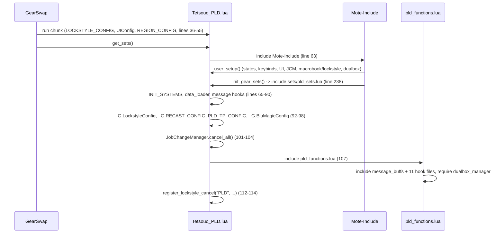
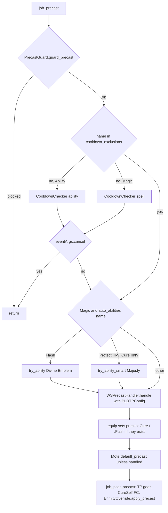
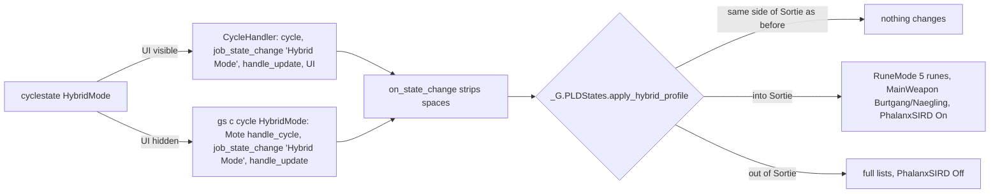
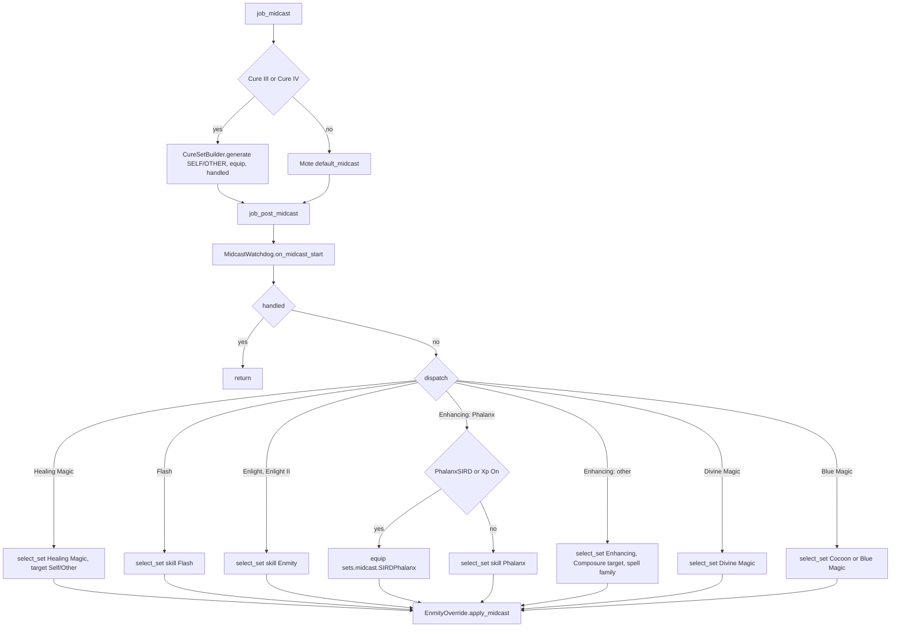
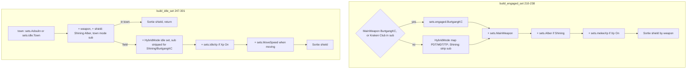

# PLD (Paladin) job

The PLD job area is 12 hook files plus 5 logic modules under
`shared/jobs/pld/functions/` (1 764 lines), one entry template, one Kaories
entry overlay, six config files and two sets files (template and Kaories
overlay). GearSwap loads it when the main job becomes PLD (`Tetsouo_PLD.lua`,
`Kaories_PLD.lua`). From then on Mote-Include calls its hooks on every action
(precast, midcast, aftercast), on status and buff changes, on `//gs c` commands
and on state cycles.

What PLD adds on top of the shared pipeline:

- **Auto-abilities** in precast through `AbilityHelper`: Divine Emblem before
  Flash, Majesty before Protect III-V and Cure III/IV.
- **Target-aware cures**: Cure III/IV pick `sets.midcast.CureSelf` or
  `CureOther` in the pre-midcast hook, and a low-HP fast-cast set for self
  cures in post-precast.
- **Enmity routing** in midcast: Flash and Enlight are caught by name before the
  Divine skill, Phalanx has a SIRD override (`Xp`, and `PhalanxSIRD` where the
  character defines it).
- **Weapon/shield/hybrid set builder**: weapon state, Shining (grip) and
  Burtgang + Kraken Club exceptions, HybridMode sets, XP sets.
- **Sortie HybridMode** (`df01a96`): its own engaged/idle mapping, a
  shield chosen by the weapon, a reshaped state profile, and `sets.EnmityMax`
  replacing `sets.FullEnmity` for job abilities and the spells that wear it.
- **Subjob helpers**: BLU AOE enmity rotation (`aoe`), rune casting (`rune`),
  and the shared /SCH Accession chains (`aoe sneak|invi|erase`, `lightarts`).

Every file in scope was read in full except the gear content of the sets files
(only structure and set names were read, as gear choice is out of scope). All
line numbers refer to the code as of 2026-09-19, after the Sortie work
(`df01a96`).

## Files

| Path | Lines | Role |
|------|------:|------|
| `_master/entry/Tetsouo_PLD.lua` | 252 | Entry point (template): config preload, `get_sets`, `job_sub_job_change`, `user_setup`, `job_update`, `init_gear_sets`, `file_unload` |
| `_master/Kaories/entry/Kaories_PLD.lua` | 252 | Kaories overlay: identical except the `Kaories/...` paths (lines 25, 36, 49, 52, 93, 97-98, 162, 168) |
| `shared/jobs/pld/functions/pld_functions.lua` | 121 | Facade: includes `message_buffs` and the 11 hook files, requires `dualbox_manager` |
| `shared/jobs/pld/functions/PLD_PRECAST.lua` | 188 | `job_precast` (guard, cooldown, auto-abilities, WS) / `job_post_precast` (TP gear, CureSelf FC, Sortie override) |
| `shared/jobs/pld/functions/PLD_MIDCAST.lua` | 203 | `job_midcast` (Cure III/IV) / `job_post_midcast` (name-before-skill dispatch, Sortie override) |
| `shared/jobs/pld/functions/PLD_AFTERCAST.lua` | 27 | `LifecycleManager.aftercast()`, empty `job_post_aftercast` |
| `shared/jobs/pld/functions/PLD_IDLE.lua` | 49 | `customize_idle_set` -> `SetBuilder.build_idle_set` (+ `UPDATE_DEBUG` trace) |
| `shared/jobs/pld/functions/PLD_ENGAGED.lua` | 49 | `customize_melee_set` -> `SetBuilder.build_engaged_set` (+ trace) |
| `shared/jobs/pld/functions/PLD_STATUS.lua` | 19 | `job_status_change = LifecycleManager.status_change()` |
| `shared/jobs/pld/functions/PLD_BUFFS.lua` | 19 | `job_buff_change = LifecycleManager.buff_change()` |
| `shared/jobs/pld/functions/PLD_COMMANDS.lua` | 247 | `job_self_command` router, `job_state_change` (HybridMode profile hook) |
| `shared/jobs/pld/functions/PLD_MOVEMENT.lua` | 32 | Comments only (AutoMove needs no registration) |
| `shared/jobs/pld/functions/PLD_LOCKSTYLE.lua` | 47 | Lazy `LockstyleManager.create('PLD', 'config/pld/PLD_LOCKSTYLE', 1, 'SAM')` wrappers |
| `shared/jobs/pld/functions/PLD_MACROBOOK.lua` | 42 | Lazy `MacrobookManager.create('PLD', ..., 'SAM', 1, 1)` wrapper |
| `shared/jobs/pld/functions/logic/set_builder.lua` | 307 | Idle/engaged construction: weapon, shield, HybridMode map, XP, movement, town, Sortie shield |
| `shared/jobs/pld/functions/logic/enmity_override.lua` | 141 | Sortie: FullEnmity spells wear `sets.EnmityMax`; JAs keep their set and gain what EnmityMax adds |
| `shared/jobs/pld/functions/logic/cure_set_builder.lua` | 53 | CureSelf / CureOther choice for Cure III/IV |
| `shared/jobs/pld/functions/logic/aoe_manager.lua` | 172 | `//gs c aoe` BLU rotation (identical to RUN's copy) |
| `shared/jobs/pld/functions/logic/rune_manager.lua` | 79 | `//gs c rune` (identical to RUN's copy) |
| `_master/config/pld/PLD_STATES.lua` | 243 | States, rune/weapon option lists, `apply_hybrid_profile`, unused `validate`, `_G.PLDStates` |
| `_master/config/pld/PLD_KEYBINDS.lua` | 195 | 6 binds, subjob filter, unbind-all-then-bind, intro |
| `_master/config/pld/PLD_LOCKSTYLE.lua` | 73 | Style 3 (`default`, `by_subjob`, `get_style`) |
| `_master/config/pld/PLD_MACROBOOK.lua` | 78 | Book 15/18/20 per subjob, dual-box table |
| `_master/config/pld/PLD_TP_CONFIG.lua` | 75 | `_G.PLDTPConfig` (Moonshade piece, Sequence weapon) |
| `_master/config/pld/PLD_BLU_MAGIC.lua` | 203 | `_G.BluMagicConfig`: AOE spell table, dynamic/manual rotation |
| `_master/sets/pld_sets.lua` | 756 | Template sets (flat) |
| `_master/Kaories/sets/pld_sets.lua` | 808 | Kaories overlay sets (no Sortie sets, see below) |
| `shared/data/job_abilities/PLD_JA_DATABASE.lua` + `pld/*.lua` | 13 + 194 | JA descriptions for `ability_message_handler` (messages only) |
| `shared/utils/scholar/scholar_actions.lua`, `stratagem_charges.lua` | 163 + 104 | /SCH chains, shared with BLM and others |

Live copies (gitignored): `Tetsouo/Tetsouo_PLD.lua` (identical to the template
except line 238 includes `sets/pld/pld_sets.lua`), `Tetsouo/sets/pld/` (modular:
`pld_sets.lua` + `armor`, `capes`, `weapons`), `Tetsouo/config/pld/`:
`PLD_STATES.lua` and `PLD_KEYBINDS.lua` are identical to the template since
2026-09-19 (the template took the live `PhalanxSIRD` state, `KC` weapon and
Sulpor Sortie rune); `PLD_MACROBOOK.lua` has other book numbers; `PLD_REFILL.lua` (template overlay
`_master/Tetsouo/config/pld/PLD_REFILL.lua`). `Kaories/Kaories_PLD.lua` is
identical to its overlay; `Kaories/sets/pld_sets.lua` differs in gear only;
`Kaories/config/pld/PLD_STATES.lua` and `PLD_KEYBINDS.lua` were redeployed
from the template on 2026-09-19; her lockstyle 4 and book 4 are still held
only in her live folder (no `_master/Kaories/config/pld/` overlay). Full comparison:
[characters and templates](../architecture/characters-and-templates.md).

## How it works

### Load sequence

`user_setup()` and `init_gear_sets()` run inside `include('Mote-Include.lua')`,
before `INIT_SYSTEMS` and before the PLD hook files exist (same model as
[BLM](blm.md#load-sequence) and [core lifecycle](../systems/core-lifecycle.md)).

`user_setup()` (`Tetsouo_PLD.lua:157-205`):

1. `require('Tetsouo/config/pld/PLD_STATES').configure()` creates every state and
   ends with `apply_hybrid_profile(state.HybridMode.value)` (`PLD_STATES.lua:155`).
2. `require('Tetsouo/config/pld/PLD_KEYBINDS')` into the global `PLDKeybinds`,
   then `bind_all()`: unbind every key of the list, bind the ones whose `subjob`
   matches (`PLD_KEYBINDS.lua:97-119`), then `show_intro()`.
3. `KeybindUI.smart_init("PLD", _G.UIConfig.init_delay or 5)`. The UI readiness
   anchor for PLD is `state.HybridMode` (`ui_lifecycle.lua:48-49`).
4. `JobChangeManager.initialize()`; if `select_default_macro_book` and
   `select_default_lockstyle` exist, the macro book is set at once and the
   lockstyle is scheduled after 8 s. As on BLM, they exist only because
   `show_intro()` `require`s `PLD_MACROBOOK.lua` and `PLD_LOCKSTYLE.lua`
   (`PLD_KEYBINDS.lua:159,166`), which define them as a side effect and return
   nothing; see [factories](../systems/factories-and-helpers.md#job-wrappers).
5. `pcall(require, 'shared/utils/dualbox/dualbox_manager')`.

`pld_functions.lua` includes `message_buffs.lua` (29), `PLD_PRECAST`,
`PLD_MIDCAST`, `PLD_AFTERCAST` (36-40), `PLD_IDLE`, `PLD_ENGAGED` (47-49),
`PLD_STATUS`, `PLD_BUFFS` (56-58), `PLD_LOCKSTYLE`, `PLD_MACROBOOK`,
`PLD_COMMANDS`, `PLD_MOVEMENT` (65-71), then requires `dualbox_manager` (109) and
prints a debug line that still says "4 logic modules" (117). Logic modules are
required lazily by the hooks (`ensure_modules_loaded`, `ensure_commands_loaded`,
first idle/engage).

### Precast

`job_precast` (`PLD_PRECAST.lua:111-150`), then Mote's `default_precast`
(unless `handled`), then `job_post_precast` (`:157-175`):

- `cooldown_exclusions` (56-81) lists 23 Scholar names; `CooldownChecker`
  already skips stratagems itself (see
  [precast pipeline](../systems/precast-pipeline.md#recast-check)).
- The helper abilities: when ready and their buff is down, `AbilityHelper`
  calls `cancel_spell()`, sends `input /ja "<JA>" <me>; wait 2; input /ma
  "<spell>" <target id>` and sets `eventArgs.handled`, not `cancel`
  (`ability_helper.lua:79-116`). `job_precast` goes on to line 150 and Mote
  still runs `job_post_precast` for the cancelled spell.
- `WSPrecastHandler.handle` returns true at once for anything that is not a
  weaponskill (`ws_precast_handler.lua:35-38`); for a WS it validates range,
  computes TP-bonus gear from `_G.PLDTPConfig` and refuses below 1000 TP.
- Lines 143-149 equip `sets.precast['Cure']` / `['Flash']`, which no PLD sets
  file defines; even if they existed, Mote's `default_precast` runs after
  `job_precast` (`Mote-Include.lua:254-264`) and would replace them.
- Mote's default picks `sets.precast.FC[name|map|skill]`, `sets.precast.JA[name]`
  (JA base is FullEnmity), or `sets.precast.WS[name]`.
- `job_post_precast`: `apply_tp_gear`, then `sets.precast.FC.CureSelf` for Cure
  III/IV on self (only the live Tetsouo sets define it), then the Sortie
  override below.

### Sortie profile (HybridMode)

`HybridMode` has three values (`PLD_STATES.lua:85-86`). `PLD_COMMANDS.lua:228-239`
wires `job_state_change = LifecycleManager.state_change(on_state_change)`:

- `apply_hybrid_profile` (`_master/config/pld/PLD_STATES.lua:202-222`) returns immediately unless `state.RuneMode`,
  `state.PhalanxSIRD` and `state.MainWeapon` all exist. All three are created
  by `configure()` (`PhalanxSIRD` at `:137`, added to the template on
  2026-09-19; before, the profile did nothing on a character built from the
  template).
- It only acts when the mode crosses the Sortie boundary: a module flag
  (`sortie_profile`, reset by `configure()`) remembers which lists are in place,
  so PDT <-> MDT changes nothing, the `PhalanxSIRD` toggle included. When the
  lists do change, `reshape()` keeps the current weapon and rune if the new list
  has them: `Modes:options()` alone resets a mode to its first entry
  (`Modes.lua:273-299`), which for `MainWeapon` meant a weapon swap and lost TP.
  A weapon missing from the Sortie list (e.g. Shining) falls back to Burtgang.
  Changed on 2026-09-19 at the player's request (`df01a96`, with the rest
  of the Sortie work).
- The profile lives in the character config and is reached through
  `_G.PLDStates` (`PLD_STATES.lua:241`); a config without it (Kaories today) just
  gets no profile.
- Gear side (`set_builder.lua:43-61`): engaged `PDT -> sets.engaged.PDT`,
  `MDT -> .MDT`, `Sortie -> sets.engaged.TP`; idle `PDT -> sets.idle.PDT`,
  `MDT` and `Sortie -> sets.idle.MDT`. In Sortie the shield follows the weapon:
  Burtgang -> Aegis, Naegling -> Blurred Shield +1 (`:58-61`), applied last
  (`apply_sortie_shield`, `:127-139`).

### Enmity override (Sortie)

`logic/enmity_override.lua` is active when `HybridMode == 'Sortie'`
and `sets.EnmityMax` exists (`:35-40`).

- `apply_precast` (102-116), called last in `job_post_precast`: every
  `action_type == 'Ability'` except weaponskills gets `enmity_max_extra()`
  (82-91), i.e. the slots where `sets.EnmityMax` differs from
  `sets.FullEnmity` (today only `sub = 'Srivatsa'`), compared by item name
  after both go through `set_combine`. Mote's default precast has already
  equipped the JA's own set, so its specific piece (Sentinel feet, Rampart
  head...) stays. Before 2026-09-19 the whole of `sets.EnmityMax` was
  equipped and replaced those pieces.
  That covers PLD JAs, /RUN runes and wards, /SCH stratagems, /DNC waltzes.
  Atonement (a WS, `sets.precast.WS['Atonement'] = sets.FullEnmity`) keeps
  FullEnmity.
- `apply_midcast` (94-104), called last in `job_post_midcast`: a spell is
  swapped only when its name set, or failing that its skill set, **is**
  `sets.FullEnmity` (identity test, `:49-65`). In the template that is Flash
  (`pld_sets.lua:708`) and Jettatura (`:695`); in the live Tetsouo sets also
  Crusade (`Tetsouo/sets/pld/pld_sets.lua:707`). The module comment
  (`enmity_override.lua:89-90`) names Crusade, which is true only for the live
  file.
- `sets.EnmityMax = set_combine(sets.FullEnmity, {sub = 'Srivatsa'})`
  (`pld_sets.lua:302`): the only difference is the shield. Because the whole
  set is equipped, the JA-specific pieces of `sets.precast.JA['Sentinel']`,
  `['Rampart']`, `['Invincible']`, `['Fealty']`, `['Shield Bash']`,
  `['Holy Circle']` (`:315-320`) are overwritten in Sortie (Known issues).
- Cure III/IV never reach the override: `job_post_midcast` returns early for
  them (`PLD_MIDCAST.lua:166-168`). They do not wear FullEnmity, so nothing is
  lost today, but any future override added after the dispatch has the same
  blind spot.

### Midcast

Mote runs `job_midcast`; unless it set `handled`, Mote's `default_midcast`
equips `get_midcast_set` (name, spell map, skill); then `job_post_midcast` runs
in every case except cancel (`Mote-Include.lua:254-276`).

- `MidcastManager.select_set` returns false at once when `sets.midcast[skill]`
  is missing (`midcast_manager.lua:624-629`). No PLD sets file defines
  `sets.midcast['Healing Magic']`, `['Divine Magic']` or `['Blue Magic']`, so
  those three routes equip nothing; what the spell wears is Mote's default by
  name (`sets.midcast.Banishga`, `['Geist Wall']`, ...) or, for Cure I/II, the
  `sets.midcast.Cure` table that `CureSetBuilder` writes (below). Blue spells
  of the AOE rotation without a named set (Sound Blast, Soporific) wear the
  precast gear through midcast.
- Pseudo-skills: `Flash` uses `sets.midcast.Flash` as base; `Enmity` uses
  `sets.midcast.Enmity` and P0/P1 find `sets.midcast.Enlight` for Enlight and
  Enlight II (tier stripped, `midcast_manager.lua:399`); `Phalanx` uses
  `sets.midcast.Phalanx` (= `PhalanxPotency`).
- `CureSetBuilder.generate` (`cure_set_builder.lua:30-47`) only answers for Cure
  III/IV and writes the chosen set into `sets.midcast.Cure` (`:44`) before
  returning it. Mote maps every Cure tier to spell map `Cure`
  (`Mote-Mappings.lua:149`), so Cure and Cure II later wear the CureSelf or
  CureOther set of the last Cure III/IV, and nothing before the first one.
- Enhancing uses `ENHANCING_MAGIC_DATABASE.get_spell_family` (Refresh, Phalanx,
  Stoneskin, BarElement, ...) and the P1 base-name rule, so Protect V finds
  `sets.midcast.Protect`. Stoneskin has its own HP-ordered set since commit
  `6f325e9` (template and live Tetsouo only).

### Aftercast, idle, engaged, status, buffs

- `job_aftercast` is `LifecycleManager.aftercast()`: MidcastWatchdog tick only;
  Mote returns to idle/engaged gear. `job_post_aftercast` is empty.
- Mote's own bases: idle `sets.idle[Town]` in cities else `sets.idle`
  (`IdleMode` Normal has no set); engaged `sets.engaged[HybridMode]`
  (`sets.engaged.PDT`/`.MDT`; Sortie has no `sets.engaged.Sortie`, so the base
  is `sets.engaged`). The set builder then replaces that base.

- Town detection is `BaseSetBuilder.select_idle_base_town`
  (`base_set_builder.lua:65-84`, Adoulin first, Dynamis excluded).
- `SetBuilder.apply_shield` outside town does nothing (`:101-121`): in the field
  the shield comes from the HybridMode set's `sub` (Duban for PDT, Aegis for
  MDT).
- `job_status_change` / `job_buff_change` are the shared Doom handlers
  ([core lifecycle](../systems/core-lifecycle.md#lifecyclemanager)).

## Mote states

Created by `PLDStates.configure()` (`_master/config/pld/PLD_STATES.lua:73-164`)
on every `user_setup()`. Keybinds from `PLD_KEYBINDS.lua:32-61`; `^` = Ctrl,
`#` = Apps.

| State | Values | Default | Key | Read by |
|-------|--------|---------|-----|---------|
| `HybridMode` (Mote) | PDT, MDT, Sortie | PDT | `^numpad9` | Mote `get_melee_set`; `set_builder.lua:67-71,128`; `enmity_override.lua:36`; profile hook `PLD_COMMANDS.lua:228-237`; UI anchor |
| `MainWeapon` | Burtgang, BurtgangKC, Naegling, Shining, Malevo (Sortie profile: Burtgang, Naegling) | Burtgang | `^numpad1` | `set_builder.lua:87,103,132,172,188,217-218,254-255` |
| `Xp` | Off, On | Off | `^numpad4` (/RDM) | `set_builder.lua:230,290`; `PLD_MIDCAST.lua:111` |
| `RuneMode` | Ignis .. Tenebrae (8) (Sortie profile: Ignis, Tenebrae, Tellus, Flabra, Unda) | Ignis | `^numpad3` (/RUN) | `rune_manager.lua:95` |
| `SneakInviAOE` | On, Off | On | `^numpad7` (/SCH) | `PLD_COMMANDS.lua:179` -> `scholar_actions.lua:90` (missing state counts as On) |
| `FastCast` | 0..80 step 10 | 80 | none | `midcast_watchdog.lua` |
| `AutoMedicine` | shared On/Off | persisted | `#numpad0` | `AutoMedicine.init(state, M)` (`PLD_STATES.lua:160-163`), see [precast pipeline](../systems/precast-pipeline.md) |
| `PhalanxSIRD` | Off, On | Off | `^numpad2` | read by `PLD_MIDCAST.lua:110` and required by `apply_hybrid_profile`; `On` on entering Sortie, `Off` on leaving it |

Mote defaults also exist: `OffenseMode`, `IdleMode`, `CastingMode` (all
`'Normal'`, no set reads them), `DefenseMode` (None). `state.Moving` comes from
AutoMove.

## Commands

`job_self_command` (`PLD_COMMANDS.lua:78-208`) lowercases the first word and
tests, in order: watchdog, dual-box internals, **CommonCommands** (built-in
names and warp aliases only), `ui`, `debugmidcast`, `cyclestate`, then PLD
commands. A name none of them answers goes to Mote, whose last lookup is the
dual-box partner's alt config, so `lightarts` runs here even when the partner
has SCH. See
[commands and debug](../systems/commands-and-debug.md#4-alt-commands-and-name-shadowing).

| Command | Effect | Handler |
|---------|--------|---------|
| `watchdog ...` | MidcastWatchdog commands | 91-94 |
| `altjobupdate <job>  ...` / `requestjob` | Dual-box job exchange | 99-115 |
| common commands | `reload`, `checksets`, `wa`, `wo`, `refill`, `am`, `alt*`, `ls`, `jump`, `waltz`, debug, warp | 120-131 -> `CommonCommands.handle_command(command, 'PLD', table.unpack(args))` |
| `ui ...` | UI toggles | 136-140 |
| `debugmidcast` | Toggle MidcastManager debug | 145-155 |
| `cyclestate <State>` | `CycleHandler.handle_cyclestate` (all keybinds) | 164-167 |
| `aoe` | BLU rotation: first castable spell of `BluMagicConfig.get_rotation()` on `<stnpc>`, 5 s anti-spam per spell; otherwise recast list and `/target <stnpc>` | 178-188 -> `aoe_manager.lua:111-166` |
| `aoe sneak` / `aoe invi` / `aoe invisible` / `aoe erase` | /SCH chain: Light Arts + Addendum: White (Erase) + Accession as charges allow; `SneakInviAOE` Off casts on `<stal>` without Accession | 179 -> `scholar_actions.lua:154-161` |
| `rune` | `/ja "<RuneMode>" <me>` unless on recast (no subjob check) | 191-197 -> `rune_manager.lua:89-126` |
| `lightarts` | Light Arts, then Addendum: White on the next press | 203-207 |

`job_state_change` (239) repaints the HUD for every state except `Moving`, then
runs the HybridMode profile hook (see Sortie profile).

BLU rotation detail: `PLD_BLU_MAGIC.get_rotation()` (`:166-177`) keeps the spells
of `aoe_spell_database` it finds among `windower.ffxi.get_mjob_data().spells`,
sorted by enmity per second, else returns `manual_rotation` (Geist Wall,
Stinking Gas, Sound Blast, Sheep Song, Soporific). `can_cast_spell` rejects
names absent from `res.spells`, spells cast in the last 5 s, and spells with
recast above the `RECAST_CONFIG` tolerance (`is_on_cooldown`).

## Set names the code looks up

T = `_master/sets/pld_sets.lua`, K = `_master/Kaories/sets/pld_sets.lua`,
L = `Tetsouo/sets/pld/pld_sets.lua` (weapon sets come from `weapons.lua:35-56`
through the loop at `:58-60`).

| Set | Looked up by | T | K | L |
|-----|--------------|---|---|---|
| `sets[MainWeapon]` (Burtgang, BurtgangKC, Naegling, Shining, Malevo) | `set_builder.lua:87` | 95-99 | 95-99 | weapons.lua (+ `KC`) |
| `sets.Alber` | `set_builder.lua:104,226` | 106 | 106 | weapons.lua |
| `sets.Duban`, `sets.Aegis`, `sets['Blurred Shield +1']` | nothing (shields come from mode sets or literals) | 104-107 | 104-107 | weapons.lua |
| `sets.idle`, `sets.idle.PDT`, `sets.idle.MDT` | Mote base, `IDLE_SET_BY_MODE` | 114, 131, 140 | 114, 131, 140 | 67, 87, 96 |
| `sets.engaged`, `.PDT`, `.MDT` | Mote base, `ENGAGED_SET_BY_MODE` | 191, 212, 221 | 209, 230, 239 | 153, 175, 184 |
| `sets.engaged.TP` | Sortie engaged (`set_builder.lua:46`) | 228 | **absent** | 191 |
| `sets.engaged.BurtgangKC` | `set_builder.lua:172-181` | 244 | 244 | 215 |
| `sets.idleXp`, `sets.meleeXp` | `set_builder.lua:290,230` | 176, 265 | 176, 265 | 138, 236 |
| `sets.idle.Town`, `sets.Adoulin`, `sets.MoveSpeed` | BaseSetBuilder, Mote Town scope, movement | 737 (`= MoveSpeed`), 740, 732 | 789, 792, 784 | 731 (`idle.PDT + MoveSpeed`), 734, 726 |
| `sets.FullEnmity` | identity test `enmity_override.lua:50-64` | 279 | 279 | 258 |
| `sets.EnmityMax` | `enmity_override.lua:39,84,102` | 302 | **absent** | 280 |
| `sets.precast.JA` + 16 named JAs | Mote default precast | 305-320 | 299-... | 283-310 |
| `sets.precast.FC` (+ 17 name/skill aliases) | Mote default precast | 326-358 | 320-... | 316-368 |
| `sets.precast.FC.CureSelf` | `PLD_PRECAST.lua:165-168` | **absent** | **absent** | 343 |
| `sets.precast.Cure`, `sets.precast.Flash` | `PLD_PRECAST.lua:143-149` | absent | absent | absent |
| `sets.precast.WS` + named WS, `['Atonement'] = FullEnmity` | Mote default precast | 369-477, 392 | 363-... | 379-493, 402 |
| `sets.precast.WS.TPBonus`, `['<WS>'].TPBonus` | nothing (TP gear comes from `PLD_TP_CONFIG`) | 484-492 | yes | 494-502 |
| `sets.midcast.Enmity` (= FullEnmity) | skill `Enmity` (Enlight) | 505 | 499 | 515 |
| `sets.midcast['Flash']` (= FullEnmity) | skill `Flash`, Mote by name | 708 | 735 | 702 |
| `sets.midcast['Enlight']` | P0/P1 under skill Enmity | 580 | 588 | 585 |
| `sets.midcast.SIRDPhalanx` | `PLD_MIDCAST.lua:113-114` | 554 | 559 | 562 |
| `sets.midcast['Phalanx']` (= PhalanxPotency) | skill `Phalanx` | 712 | 739 | 706 |
| `sets.midcast['Enhancing Magic']` | skill base | 594 | 602 | 599 |
| `sets.midcast['Stoneskin']` | P0 name | 615 | **absent** | 610 |
| `sets.midcast.Crusade/Reprisal/Protect/Shell/Refresh/Haste/Foil` | P0/P1/P6 | 713-725 | 740-777 | 707-719 |
| `sets.midcast.CureSelf`, `.CureOther` | `cure_set_builder.lua:37` | 648, 669 | 643, 680 | 642, 663 |
| `sets.midcast.Cure` | written at runtime by `cure_set_builder.lua:44`, read by Mote for Cure/Cure II | runtime | runtime | runtime |
| `sets.midcast['Healing Magic']`, `['Divine Magic']`, `['Blue Magic']` | `select_set` base | absent | absent | absent |
| `sets.midcast['Cocoon']` and 7 other BLU names, `['Banishga']` | skill `Cocoon`; Mote by name | 694-709 | 721-736 | 688-703 |
| `sets.buff.Doom` | DoomManager | 752 | 804 | 746 |

## Configuration

| File / key | Default | Where the default lives | Read by |
|------------|---------|-------------------------|---------|
| `<char>/config/pld/PLD_STATES.lua` | see states | file | entry `user_setup` (path hard-coded `Tetsouo/...`, rewritten by the clone script) |
| `SORTIE_RUNE_OPTIONS`, `SORTIE_WEAPON_OPTIONS` | 5 runes, 2 weapons | `PLD_STATES.lua:42-63` | `apply_hybrid_profile` |
| `<char>/config/pld/PLD_KEYBINDS.lua` | 6 binds | file | entry `user_setup`, `job_sub_job_change` (passed to JCM, unused), `file_unload` |
| `<char>/config/pld/PLD_LOCKSTYLE.lua` `default`, `by_subjob`, `get_style` | 3 | file; factory fallback 1 (`PLD_LOCKSTYLE.lua:29`) | `LockstyleManager` |
| `<char>/config/pld/PLD_MACROBOOK.lua` `default`, `solo[sub]`, `dualbox[alt][sub]` | book 15 page 1 | file; factory fallback book 1 page 1 | `MacrobookManager` |
| `<char>/config/pld/PLD_TP_CONFIG.lua` -> `_G.PLDTPConfig` | Moonshade 250, Sequence 500 | file | `PLD_PRECAST.lua:49` -> `TPBonusHandler` |
| `<char>/config/pld/PLD_BLU_MAGIC.lua` -> `_G.BluMagicConfig` | 5 AOE spells | file | `aoe_manager.lua:34` (captured when the module is first required) |
| `<char>/config/pld/PLD_REFILL.lua` (live only) | - | `_master/Tetsouo/config/pld/` | refill system |
| `<char>/config/RECAST_CONFIG.lua` | tolerance | shared | `is_on_cooldown` in aoe/rune managers, `is_recast_ready` in AbilityHelper |
| `LOCKSTYLE_CONFIG`, `REGION_CONFIG`, UI config | - | shared | entry |

## State & lifetime

- Module state: `aoe_manager` `SpellTracker` (spell -> `os.time()`, pruned after
  60 s), lazy-load locals, `sets.midcast.Cure` rewritten by `CureSetBuilder`.
  All sandbox-local; they die on `gs reload`.
- `_G` written: the Mote hooks (`job_precast`, `job_post_precast`,
  `job_midcast`, `job_post_midcast`, `job_aftercast`, `job_post_aftercast`,
  `job_status_change`, `job_buff_change`, `customize_idle_set`,
  `customize_melee_set`, `job_self_command`, `job_state_change`),
  `PLDKeybinds`, `PLDStates`, `PLDTPConfig`, `BluMagicConfig`,
  `LockstyleConfig`, `RECAST_CONFIG`, `RegionConfig`,
  `select_default_lockstyle`, `cancel_pld_lockstyle_operations`,
  `select_default_macro_book` and the factory exports, `temp_tp_bonus_gear`
  (WS only).
- `_G` read: `MidcastManagerDebugState`, `MidcastWatchdog`, `UPDATE_DEBUG`,
  `_update_sent_time`, `is_on_cooldown`, `is_recast_ready`, `UIConfig`.
- `windower.*`: PLD code writes nothing there and registers no events.
- Keybinds: bound in `user_setup`, unbound in `file_unload`
  (`Tetsouo_PLD.lua:249-251`); `bind_all` first unbinds the whole list.
- Coroutines: the 8 s lockstyle from `user_setup` (not cancelled by a reload);
  chained `send_command` waits (AbilityHelper 2 s, Scholar chains 2 s per step)
  sit in the Windower queue and survive a reload.
- States reset on every load. Every subjob change ends in a `gs reload`
  (0.5 s, JobChangeManager), so HybridMode goes back to PDT and the Sortie
  profile to standard after any subjob change. See
  [job change lifecycle](../architecture/job-change-lifecycle.md).

## Interactions

- Precast: `PrecastGuard`, `CooldownChecker`, `AbilityHelper`,
  `WSPrecastHandler` / `TPBonusHandler`
  ([precast pipeline](../systems/precast-pipeline.md)).
- Midcast: `MidcastManager`, `MidcastWatchdog`, `ENHANCING_MAGIC_DATABASE`
  ([midcast and buffs](../systems/midcast-and-buffs.md)).
- Set building: `BaseSetBuilder` (movement, town), AutoMove (`state.Moving`).
- Commands: `CommonCommands`, `UICommands`, `WatchdogCommands`, `CycleHandler`,
  `LifecycleManager` ([commands and debug](../systems/commands-and-debug.md),
  [core lifecycle](../systems/core-lifecycle.md)); `ScholarActions` and
  `StratagemCharges` (shared with [BLM](blm.md)).
- Messages: generic `MessageFormatter` / `MessageCooldowns`; JA descriptions
  from `PLD_JA_DATABASE` through `ability_message_handler`.
- Lockstyle / macrobook factories, JobChangeManager, UI
  ([UI overlay](../systems/ui-overlay.md)), dual-box
  ([dualbox](../systems/dualbox.md)).
- [RUN](run.md) carries byte-identical copies of `aoe_manager`,
  `cure_set_builder` and `rune_manager`.

## Invariants & gotchas

- `user_setup()` runs before the PLD hook files exist; the initial macrobook and
  lockstyle rely on `PLDKeybinds.show_intro()` requiring the two wrapper files.
- `job_state_change` receives the description (`'Hybrid Mode'`) from both
  `CycleHandler` and Mote's cycle; the hook strips spaces, so a caller passing
  the key also works (`PLD_COMMANDS.lua:229`).
- `Modes:options()` resets the value to the first option; use `reshape()` in
  `PLD_STATES.lua` to change a list and keep the current value.
- The Sortie spell override is an identity test: writing
  `sets.midcast.X = set_combine(sets.FullEnmity, {})` instead of
  `= sets.FullEnmity` silently takes X out of the override.
- `select_set` is a no-op for a skill without a root set: Healing, Divine and
  Blue Magic routes rely on Mote's name lookup today.
- Anything equipped in `job_precast` is overwritten by Mote's default precast;
  gear that must win goes in `job_post_precast`.
- In Sortie the shield is decided last, by the weapon; a `sub` in any Sortie set
  is ignored.
- `BurtgangKC` (state or Kraken Club actually in the sub slot) wins over every
  HybridMode, Sortie included, for the engaged base.
- `aoe_manager` captures `_G.BluMagicConfig` when first required; the entry must
  set it before the first `//gs c` command.

## Extending

- New HybridMode: add it to `state.HybridMode:options` and to both
  `ENGAGED_SET_BY_MODE` / `IDLE_SET_BY_MODE` (`set_builder.lua:43-53`), define
  the sets in template, Kaories overlay and live, and decide what
  `apply_hybrid_profile` does for it.
- New Sortie weapon: add it to `SORTIE_WEAPON_OPTIONS` and a shield to
  `SORTIE_SHIELD_BY_WEAPON` (`set_builder.lua:58-61`).
- New enmity spell covered by Sortie: alias its midcast set to
  `sets.FullEnmity` (no code change).
- New auto-ability: add a `[spell] = function` entry to `auto_abilities`
  (`PLD_PRECAST.lua:85-104`).
- New command: add a branch after the CommonCommands block. A name that is also an alt config key then runs here; the alt's
  version stays reachable as `//gs c alt <name>`.
- New state: define it in `PLD_STATES.lua`, bind it in `PLD_KEYBINDS.lua`
  following `.claude/rules/keybinds.md`, in `_master/` and in both live copies.

## Known issues

- `job_post_midcast` returns before `EnmityOverride` for Cure III/IV
  (`PLD_MIDCAST.lua:166-168`).
- The Kaories overlay has no `sets.EnmityMax`, `sets.engaged.TP`,
  `sets.midcast.Stoneskin` or `sets.precast.FC.CureSelf`
  (`_master/Kaories/sets/pld_sets.lua`); in Sortie she keeps her normal sets.
  Left as is on purpose (player's decision, 2026-09-19).
- AbilityHelper sets only `handled`: the cancelled Cure/Protect/Flash still goes
  through the rest of `job_precast` and `job_post_precast`, so precast gear
  flickers for a spell that is not cast (`ability_helper.lua:89-92,111-114`).
- Cure and Cure II wear the set of the last Cure III/IV target, or none
  (`cure_set_builder.lua:44`); the Healing route is a no-op without
  `sets.midcast['Healing Magic']` (`PLD_MIDCAST.lua:79-87`).
- `sets.precast['Cure']` / `['Flash']` equips are dead: no such sets, and Mote
  overwrites them (`PLD_PRECAST.lua:143-149`).
- BLU dynamic rotation reads the main job's data, so on PLD/BLU it always falls
  back to the manual list, including unset spells
  (`_master/config/pld/PLD_BLU_MAGIC.lua:104`).
- "No Blue Magic AOE spells equipped" can never show: every name exists in
  `res.spells` (`aoe_manager.lua:139`).
- `rune` sends the JA on any subjob (`rune_manager.lua:89-125`).
- Atonement is in no WS database, so in `wsmsg full` it prints no WS line
  (`resolve` merges only the Sword file and returns nil,
  `UNIVERSAL_WS_DATABASE.lua:136-143`).
- Kraken Club stays in the sub slot while engaged after leaving BurtgangKC,
  because an equipped Kraken Club selects the BurtgangKC set
  (`set_builder.lua:177-182`).
- Template `sets.idle.Town` is the one-slot MoveSpeed set used as a full idle
  base (`_master/sets/pld_sets.lua:737`).
- Dead or unread: `PLDStates.validate`, `sets.precast.WS.TPBonus` family,
  `sets.Duban/Aegis/['Blurred Shield +1']`, `cooldown_exclusions` (duplicates
  CooldownChecker), `job_sub_job_change` config table (JCM ignores it).
- Stale text: `PLD_STATES.lua:12,106,117,128` (Alt keys, `//gs c sneak`),
  `pld_functions.lua:117` and `Tetsouo_PLD.lua:8,18,23` ("4 logic modules"),
  `PLD_IDLE.lua:4`, `PLD_ENGAGED.lua:4` (modes that do not exist),
  `PLD_MACROBOOK.lua` comment "PLD/WAR" on the RDM key,
  `enmity_override.lua:89-90` (Crusade), `PLD_MOVEMENT.lua:189-190` duplicate
  line, no file header in `PLD_AFTERCAST.lua`.
- User doc out of date: `docs/user/jobs/pld/states.md` (no Sortie,
  SneakInviAOE, AutoMedicine; Alt keys; Shining called a Great Sword),
  `docs/user/guides/commands.md:201-207` (no `aoe sneak|invi|erase`,
  `lightarts`).
