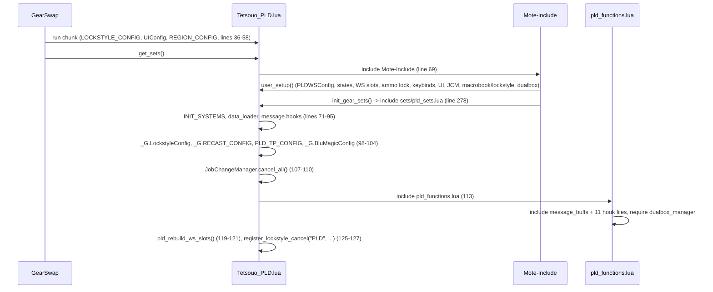
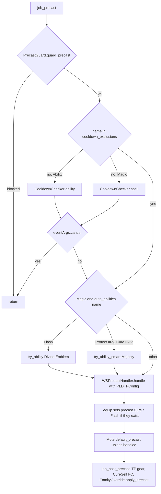
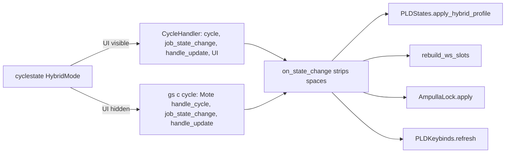
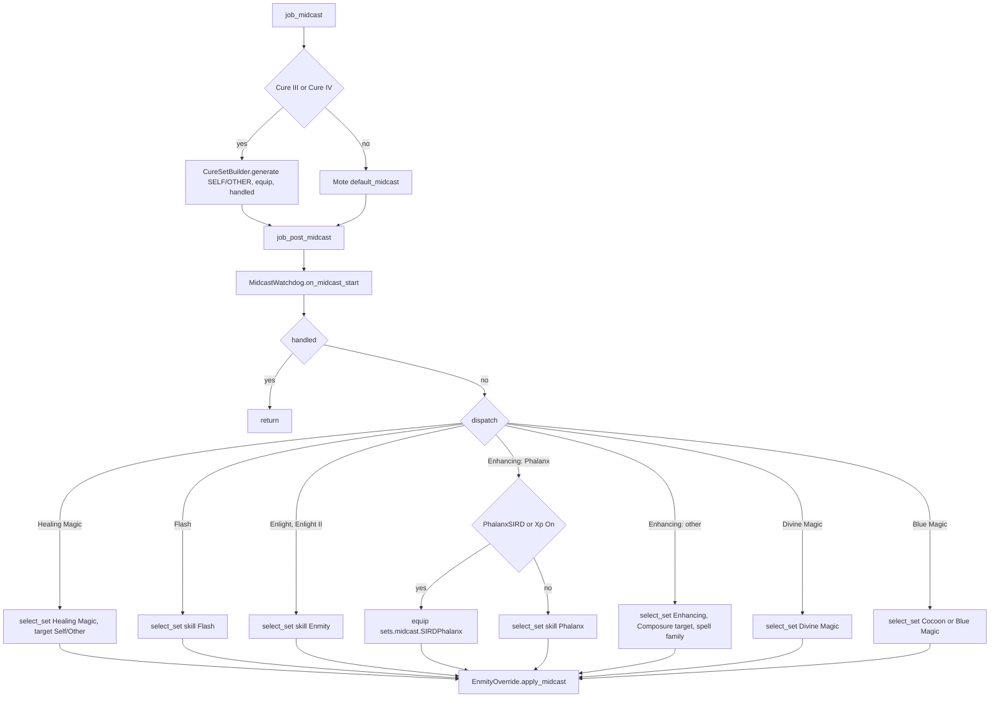
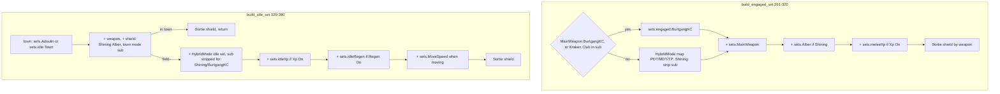

# PLD (Paladin) job

The PLD job area is 12 hook files plus 5 logic modules under
`shared/jobs/pld/functions/` (1 981 lines), one entry template, one Kaories
entry overlay, eight config files and two sets files (template and Kaories
overlay). GearSwap loads it when the main job becomes PLD (`Tetsouo_PLD.lua`,
`Kaories_PLD.lua`). From then on Mote-Include calls its hooks on every action
(precast, midcast, aftercast), on status and buff changes, on `//gs c` commands
and on state cycles.

What PLD adds on top of the shared pipeline:

- **Auto-abilities** in precast through `AbilityHelper`: Divine Emblem before
  Flash, Majesty before Protect III-V and Cure III/IV.
- **Target-aware cures**: Cure III/IV pick `sets.midcast.CureSelf` or
  `CureOther` in the pre-midcast hook, and a low-HP fast-cast set for self
  cures in post-precast.
- **Enmity routing** in midcast: Flash and Enlight are caught by name before the
  Divine skill, Phalanx has a SIRD override (`Xp`, and `PhalanxSIRD` where the
  character defines it).
- **Weapon/shield/hybrid set builder**: weapon state, Shining (grip) and
  Burtgang + Kraken Club exceptions, HybridMode sets, XP sets.
- **Sortie HybridMode** (`df01a96`): its own engaged/idle mapping, a
  shield chosen by the weapon, a reshaped state profile, and `sets.EnmityMax`
  replacing `sets.FullEnmity` for job abilities and the spells that wear it.
- **Subjob helpers**: BLU AOE enmity rotation (`aoe`), rune casting (`rune`),
  and the shared /SCH Accession chains (`aoe sneak|invi|erase`, `lightarts`).

Every file in scope was read in full except the gear content of the sets files
(only structure and set names were read, as gear choice is out of scope). Line
numbers were rechecked against the working tree on 2026-09-25; where a line
number added nothing, the function name is cited instead.

## Files

| Path | Lines | Role |
|------|------:|------|
| `_master/entry/Tetsouo_PLD.lua` | 307 | Entry point (template): config preload, `get_sets`, `job_sub_job_change`, `user_setup`, `job_update`, `init_gear_sets`, `file_unload` |
| `_master/Kaories/entry/Kaories_PLD.lua` | 271 | Kaories overlay: `Kaories/...` paths, and an older body: no `PLD_WS_CONFIG` / `pld_rebuild_ws_slots` (no weaponskill slots) and no `AmpullaLock` in `user_setup` / `file_unload` (a decision left to the player, not a bug) |
| `shared/jobs/pld/functions/pld_functions.lua` | 121 | Facade: includes `message_buffs` and the 11 hook files, requires `dualbox_manager` |
| `shared/jobs/pld/functions/PLD_PRECAST.lua` | 207 | `job_precast` (guard, cooldown, auto-abilities, WS) / `job_post_precast` (/SCH weaponskill variants, TP gear, CureSelf FC, enmity override) |
| `shared/jobs/pld/functions/PLD_MIDCAST.lua` | 204 | `job_midcast` (Cure III/IV) / `job_post_midcast` (name-before-skill dispatch, enmity override) |
| `shared/jobs/pld/functions/PLD_AFTERCAST.lua` | 36 | `LifecycleManager.aftercast()`, empty `job_post_aftercast` |
| `shared/jobs/pld/functions/PLD_IDLE.lua` | 51 | `customize_idle_set` -> `SetBuilder.build_idle_set` (+ `UPDATE_DEBUG` trace) |
| `shared/jobs/pld/functions/PLD_ENGAGED.lua` | 51 | `customize_melee_set` -> `SetBuilder.build_engaged_set` (+ trace) |
| `shared/jobs/pld/functions/PLD_STATUS.lua` | 20 | `job_status_change = LifecycleManager.status_change()` |
| `shared/jobs/pld/functions/PLD_BUFFS.lua` | 20 | `job_buff_change = LifecycleManager.buff_change()` |
| `shared/jobs/pld/functions/PLD_COMMANDS.lua` | 306 | `job_self_command` router (incl. `ws`/`wsN`), `rebuild_ws_slots`, `job_state_change` (profile, WS slots, ammo lock, keybind refresh) |
| `shared/jobs/pld/functions/PLD_MOVEMENT.lua` | 23 | Placeholder for the 12-module layout (comments only; header rewritten 2026-09-25) |
| `shared/jobs/pld/functions/PLD_LOCKSTYLE.lua` | 49 | Lazy `LockstyleManager.create('PLD', 'config/pld/PLD_LOCKSTYLE', 1, 'SAM')` wrappers |
| `shared/jobs/pld/functions/PLD_MACROBOOK.lua` | 43 | Lazy `MacrobookManager.create('PLD', ..., 'SAM', 1, 1)` wrapper |
| `shared/jobs/pld/functions/logic/set_builder.lua` | 396 | Idle/engaged construction: weapon, shield, ammo, HybridMode map, XP, movement, town; `current_weapon()` is the authority on what is in hand |
| `shared/jobs/pld/functions/logic/enmity_override.lua` | 151 | Sortie and /SCH Tanking: FullEnmity spells wear `sets.EnmityMax`; JAs keep their set and gain what EnmityMax adds |
| `shared/utils/equipment/ampulla_lock.lua` | 172 | Hoxne stance: closes the ammo slot on Hoxne Ampulla once it is worn, or leaves it open and says so. Moved out of `shared/jobs/pld/functions/logic/` by `a810d92` and shared with WAR |
| `shared/jobs/pld/functions/logic/cure_set_builder.lua` | 49 | CureSelf / CureOther choice for Cure III/IV |
| `shared/jobs/pld/functions/logic/aoe_manager.lua` | 178 | `//gs c aoe` BLU rotation (same code as RUN's copy; only the headers and the error text differ) |
| `shared/jobs/pld/functions/logic/rune_manager.lua` | 76 | `//gs c rune` (same code as RUN's copy) |
| `_master/config/pld/PLD_STATES.lua` | 401 | States (incl. `WS1`/`WS2`), three option profiles (`standard`/`sortie`/`sch`), `apply_hybrid_profile`, unused `validate`, `_G.PLDStates` |
| `_master/config/pld/PLD_KEYBINDS.lua` | 79 | 8 keyed binds + the `Regen` HUD row, `subjob` / `exclude_subjob` filters and a `visible` predicate; data only, `KeybindManager.create('PLD', ...)` does the binding, the delta-only `refresh()` and the loud failure (see [keybinds and custom states](../systems/keybinds-and-custom.md)) |
| `_master/config/pld/PLD_CUSTOM.lua` | 118 | Player modes and gear rules (all examples commented out), read through `KeybindManager` |
| `_master/config/pld/PLD_WS_CONFIG.lua` | 64 | `_G.PLDWSConfig`: the two weaponskills each sword offers |
| `_master/config/pld/PLD_LOCKSTYLE.lua` | 72 | Style 3 (`default`, `by_subjob`, `get_style`) |
| `_master/config/pld/PLD_MACROBOOK.lua` | 76 | Book 15/18/20 per subjob, dual-box table |
| `_master/config/pld/PLD_TP_CONFIG.lua` | 75 | `_G.PLDTPConfig` (Moonshade piece, Sequence weapon) |
| `_master/config/pld/PLD_BLU_MAGIC.lua` | 203 | `_G.BluMagicConfig`: AOE spell table, dynamic/manual rotation |
| `_master/sets/pld_sets.lua` | 848 | Template sets (flat); families derive from local bases so variants are not inherited as slots |
| `_master/Kaories/sets/pld_sets.lua` | 777 | Kaories overlay sets (no Sortie sets, see below) |
| `shared/data/job_abilities/PLD_JA_DATABASE.lua` + `pld/*.lua` | 13 + 194 | JA descriptions for `ability_message_handler` (messages only) |
| `shared/utils/scholar/scholar_actions.lua`, `stratagem_charges.lua` | 270 + 104 | /SCH chains, shared with BLM and GEO; waits on the stratagem buffs |
| `shared/utils/weaponskill/ws_slots.lua` | 141 | Weapon-aware weaponskill slot states, shared with WAR |

Live copies (gitignored): `Tetsouo/Tetsouo_PLD.lua` differs from the template
only in comments, `@file`, the keybind error text and line 277, which includes
`sets/pld/pld_sets.lua`; `_master/Tetsouo/entry/Tetsouo_PLD.lua` is identical to
it. `Tetsouo/sets/pld/` is modular (`pld_sets.lua` + `armor`, `capes`,
`weapons`, mirrored in `_master/Tetsouo/sets/pld/`). `Tetsouo/config/pld/*`
equals the template except `PLD_MACROBOOK.lua` (other book numbers; overlay
`_master/Tetsouo/config/pld/PLD_MACROBOOK.lua`) and the live-only
`PLD_REFILL.lua` (overlay `_master/Tetsouo/config/pld/PLD_REFILL.lua`).
`Kaories/Kaories_PLD.lua`, `Kaories/sets/pld_sets.lua` and
`Kaories/config/pld/*` are identical to her overlay, which since `f6f1683`
also holds her configs (`_master/Kaories/config/pld/`: keybinds, lockstyle 4,
macrobook, refill, an older `PLD_STATES.lua` without the weaponskill slots).
Full comparison: [characters and templates](../architecture/characters-and-templates.md).

## How it works

### Load sequence

`user_setup()` and `init_gear_sets()` run inside `include('Mote-Include.lua')`,
before `INIT_SYSTEMS` (included on the next line of `get_sets`) and before the
PLD hook files exist (same model as
[BLM](blm.md#load-sequence) and [core lifecycle](../systems/core-lifecycle.md)).

`user_setup()` (`Tetsouo_PLD.lua:164-239`):

1. `_G.PLDWSConfig = require(... PLD_WS_CONFIG)` (169), then
   `require('Tetsouo/config/pld/PLD_STATES').configure()` (171-172) creates
   every state and ends with `apply_hybrid_profile(state.HybridMode.value)`.
   `pld_rebuild_ws_slots()` (178-180) runs when the job modules already exist
   (subjob change), and `AmpullaLock.apply(state.HybridMode.value)` (186-189)
   gives back an ammo lock left by a stance that is no longer selected.
2. `require('Tetsouo/config/pld/PLD_KEYBINDS')` (a `KeybindManager` module) into
   the global `PLDKeybinds`, then `bind_all()` (197): `KeybindManager` clears
   keys no longer wanted, binds the ones whose `subjob` / `exclude_subjob` /
   `visible` rules apply (`keybind_manager.lua` `applies`), then `show_intro()`.
   A failed require prints `'PLD keybinds failed to load: ' .. <error>`.
3. `KeybindUI.smart_init("PLD", _G.UIConfig.init_delay or 5)` (214). The UI
   readiness anchor for PLD is `state.HybridMode` (`ui_lifecycle.lua:50-51`).
4. `JobChangeManager.initialize()` (223); if `select_default_macro_book` and
   `select_default_lockstyle` exist, the macro book is set at once and the
   lockstyle is scheduled after 8 s. As on BLM, they exist only because
   `KeybindManager`'s `show_intro()` `require`s `PLD_MACROBOOK.lua` and
   `PLD_LOCKSTYLE.lua`, which define them as a side effect and return
   nothing; see [factories](../systems/factories-and-helpers.md#job-wrappers).
5. `pcall(require, 'shared/utils/dualbox/dualbox_manager')`.

`job_sub_job_change` (145-154) only calls `JobChangeManager.on_job_change`; the
`initialize({...})` call that passed an ignored config table was removed on
2026-09-25.

`pld_functions.lua` includes `message_buffs.lua` (28), `PLD_PRECAST`,
`PLD_MIDCAST`, `PLD_AFTERCAST` (35-39), `PLD_IDLE`, `PLD_ENGAGED` (46-48),
`PLD_STATUS`, `PLD_BUFFS` (55-57), `PLD_LOCKSTYLE`, `PLD_MACROBOOK`,
`PLD_COMMANDS`, `PLD_MOVEMENT` (64-70), then requires `dualbox_manager` (110) and
prints a debug line, "11 hooks + 5 logic modules" (117). Logic modules are
required lazily by the hooks (`ensure_modules_loaded`, `ensure_commands_loaded`,
first idle/engage).

### Precast

`job_precast` (`PLD_PRECAST.lua:109-148`), then Mote's `default_precast`
(unless `handled`), then `job_post_precast` (`:173-194`):

- `cooldown_exclusions` (56-80) lists 23 Scholar names; `CooldownChecker`
  already skips stratagems itself (see
  [precast pipeline](../systems/precast-pipeline.md#recast-check)).
- The helper abilities: when ready and their buff is down, `AbilityHelper`
  calls `cancel_spell()`, sends `input /ja "<JA>" <me>`, then replays the
  spell through `follow_up`, which waits for the buff to land instead of a
  fixed delay (`ability_helper.lua` `follow_up`, `try_ability`,
  `try_ability_smart`). It sets `eventArgs.handled`, not `cancel`, so
  `job_precast` goes on to the end and Mote still runs `job_post_precast` for
  the cancelled spell. Since 2026-09-25 the ability is tried at most once per
  spell: the re-sent spell carries a marker (`windower._ability_replay`) and
  goes out as is, and nothing is tried under Amnesia or Impairment. Before
  that, a Majesty the game refused (Amnesia, level sync) made the Cure loop.
  Not yet tested in game.
- `WSPrecastHandler.handle` returns true at once for anything that is not a
  weaponskill (`ws_precast_handler.lua:48-49`); for a WS it validates range,
  computes TP-bonus gear from `_G.PLDTPConfig` and refuses below 1000 TP.
- Lines 141-147 equip `sets.precast['Cure']` / `['Flash']`, which no PLD sets
  file defines; even if they existed, Mote's `default_precast` runs after
  `job_precast` (`Mote-Include.lua:254-264`) and would replace them.
- Mote's default picks `sets.precast.FC[name|map|skill]`, `sets.precast.JA[name]`
  (JA base is FullEnmity), or `sets.precast.WS[name]`.
- `job_post_precast`: `apply_tp_gear`, then `sets.precast.FC.CureSelf` for Cure
  III/IV on self (only the live Tetsouo sets define it), then the Sortie
  override below.

### HybridMode profiles

`HybridMode` carries a different set of values depending on the subjob, chosen
in `configure()` (`_master/config/pld/PLD_STATES.lua:72,81`):

| subjob | values | default |
|---|---|---|
| anything but /SCH | `PDT` / `MDT` / `Sortie` | `PDT` |
| /SCH | `DPS` / `Tanking` / `Hoxne` | `Tanking` |

PLD/SCH is played for Sortie and nothing else, so it drops the general split
for three stances of its own. `PLD_COMMANDS.lua:298` wires
`job_state_change = LifecycleManager.state_change(on_state_change)`.

Four things react to a stance change, in that order
(`PLD_COMMANDS.lua:259-296`). The order matters: everything runs inside
`job_state_change`, which Mote calls **before** `handle_update`, so gear posted
here would be overwritten by the set `handle_update` re-equips.

- **`apply_hybrid_profile`** (`_master/config/pld/PLD_STATES.lua:343`) asks `profile_for`
  (`:286`) which of three profiles should be in place — `sch`, `sortie` or
  `standard`. The subjob decides first: /SCH never reaches the PDT/MDT/Sortie
  question. `install_profile` (`:296`) then reshapes the option lists, and is
  skipped while the profile is already the one in place, so PDT <-> MDT and
  DPS <-> Hoxne change nothing.
  `reshape()` keeps the current weapon and rune when the new list has them:
  `Modes:options()` alone resets a mode to its first entry
  (`Modes.lua:273-299`), which for `MainWeapon` is a weapon swap and lost TP.
  The /SCH profile is the exception — it sets `MainWeapon` outright, entering
  the setup being the one moment where resetting it is intended.
- **`rebuild_ws_slots`** (`PLD_COMMANDS.lua:228`) refills `state.WS1`/`WS2`
  from the weapon now in hand. See *Weaponskill slots* below.
- **`AmpullaLock.apply`** (`shared/utils/equipment/ampulla_lock.lua:164`) closes or releases the
  ammo slot. See *Ammo lock* below.
- **`PLDKeybinds.refresh`** (`keybind_manager.lua` `refresh`) re-lays only the keys that
  changed, since a stance can add or remove a bind.

#### Stances under /SCH

The stance owns the set, the ammo and the lock; the weapon is a separate axis.

| stance | engaged set | ammo | EnmityMax | ammo locked |
|---|---|---|---|---|
| `DPS` | `sets.engaged.DPS` | from the set | no | no |
| `Tanking` | `sets.engaged.MDT` | from the set | **yes** | no |
| `Hoxne` | `sets.engaged.Hoxne` | **Hoxne Ampulla** | no | **yes** |

Gear side (`set_builder.lua:47,56`): engaged `PDT -> .PDT`, `MDT -> .MDT`,
`Sortie -> .TP`, `DPS -> .DPS`, `Tanking -> .MDT`, `Hoxne -> .Hoxne`; every
mode idles in its own set except the three /SCH stances, which share
`sets.idle.MDT`.

The shield follows the **weapon**, not the stance, in both Sortie and /SCH:
`SORTIE_SHIELD_BY_WEAPON` (`:68`) pairs Burtgang with Aegis and Naegling with
Blurred Shield +1; `SCH_SHIELD_BY_WEAPON` (`:90`) gives Duban to the damage
swords and Aegis to Burtgang. `apply_mode_shield` (`:205`) runs last so it wins
over the sub carried by the mode's own set.

`SCH_AMMO_BY_MODE` (`:112`) names the Ampulla for the Hoxne stance and
`apply_mode_ammo` (`:189`) applies it. This, not the lock, is what puts the
piece on: it is in the set, so every later `handle_update` wears it again.

#### The weapon is its own axis

`MainWeapon` offers `Naegling` / `Excalibur` under /SCH
(`_master/config/pld/PLD_STATES.lua:92`, `SCH_WEAPON_OPTIONS`), Naegling first. Burtgang is deliberately absent: the
Tanking stance holds it outright through `SCH_WEAPON_BY_MODE`
(`set_builder.lua:81`), that weapon being what makes it the hate stance, so
cycling never lands on it by accident.

`SetBuilder.current_weapon()` (`:135`) is the authority on what is in hand —
the stance override first, then `state.MainWeapon`. Anything that has to know
what is being swung asks here rather than reading the state, which would be
wrong in Tanking.

The `Main Weapon` bind disappears in Tanking: it carries a `visible` predicate
(`_master/config/pld/PLD_KEYBINDS.lua:44`) that `KeybindManager`'s
`get_active_binds` asks on every HUD refresh (`keybind_manager.lua` `applies`).

### Enmity override (Sortie, and /SCH Tanking)

`logic/enmity_override.lua` is active on a hate-holding mode -
`ENMITY_MAX_MODES` (`:34`) lists `Sortie` and `Tanking` - and when
`sets.EnmityMax` exists (`is_active`, `:45-51`). The /SCH `DPS` and `Hoxne` stances are left
out for the same reason the main hand is: they are the TP builds, and swapping
their shield mid-fight is a cost the stance was chosen to avoid.

- `apply_precast` (112-126), called last in `job_post_precast`: every
  `action_type == 'Ability'` except weaponskills gets `enmity_max_extra()`
  (92-101), i.e. the slots where `sets.EnmityMax` differs from
  `sets.FullEnmity` (today only `sub = 'Srivatsa'`), compared by item name
  after both go through `set_combine`. Mote's default precast has already
  equipped the JA's own set, so its specific piece (Sentinel feet, Rampart
  head...) stays. Before 2026-09-19 the whole of `sets.EnmityMax` was
  equipped and replaced those pieces.
  That covers PLD JAs, /RUN runes and wards, /SCH stratagems, /DNC waltzes.
  Atonement (a WS, `sets.precast.WS['Atonement'] = sets.FullEnmity`) keeps
  FullEnmity.
- `apply_midcast` (135-145), called last in `job_post_midcast`: a spell is
  swapped only when its name set, or failing that its skill set, **is**
  `sets.FullEnmity` (identity test, `uses_full_enmity`, `:60-76`). In the
  template that is Flash (`_master/sets/pld_sets.lua:800`) and Jettatura
  (`:787`); in the live Tetsouo sets also Crusade
  (`Tetsouo/sets/pld/pld_sets.lua:888`). The module comment
  (`enmity_override.lua:130`) now says so ("plus Crusade in the live sets").
- `sets.EnmityMax = set_combine(sets.FullEnmity, {sub = 'Srivatsa'})`
  (`_master/sets/pld_sets.lua:389`): the only difference is the shield. Since
  2026-09-19 `apply_precast` adds only that difference to a JA, so the
  JA-specific pieces of `sets.precast.JA['Sentinel']`, `['Rampart']`,
  `['Invincible']`, `['Fealty']`, `['Shield Bash']`, `['Holy Circle']`
  (`:398-407`) stay; spells still swap to the whole set.
- Cure III/IV never reach the override: `job_post_midcast` returns early for
  them (`PLD_MIDCAST.lua:167-169`). They do not wear FullEnmity, so nothing is
  lost today, but any future override added after the dispatch has the same
  blind spot.

### Weaponskill slots

Two fixed macros (`//gs c ws1`, `//gs c ws2`, and `//gs c ws` for the first)
fire whatever the weapon in hand put in that slot, through the same
`shared/utils/weaponskill/ws_slots.lua` WAR uses. The slots are real Mote
states, so the HUD picks them up on its own: `"WS"` is already in the HUD
state patterns (`UI_DISPLAY_BUILDER.lua`).

`Tetsouo/config/pld/PLD_WS_CONFIG.lua` holds the lists. Savage Blade takes
slot 1 on every sword - the one weaponskill all three can use, so the same key
always does the same thing - and slot 2 holds what the weapon alone unlocks:

| weapon | WS 1 | WS 2 |
|---|---|---|
| Excalibur | Savage Blade | Knights of Round |
| Burtgang | Savage Blade | Atonement |
| Naegling | Savage Blade | Chant du Cygne |

Two things about the wiring are easy to get wrong:

- The slots follow `SetBuilder.current_weapon()`, **not** `state.MainWeapon`.
  In Tanking the state says Naegling or Excalibur while Burtgang is in hand, so
  a state-driven rebuild would offer the wrong weaponskill. Both a `MainWeapon`
  and a `HybridMode` change rebuild them (`PLD_COMMANDS.lua:259-296`).
- They are created in `configure()` (`_master/config/pld/PLD_STATES.lua:252`), with every other
  state, and only refreshed later from `get_sets()`. The keybind HUD fixes its
  row structure during `user_setup`, so a state born after that reads `N/A`
  however live the value lookup is - the same reason `AutoMedicine` is created
  there (`:271`).

### Ammo lock (Hoxne stance)

The Hoxne Ampulla is an ammo-slot item with a single charge and a 60s recast,
so it has to stay equipped to be usable - and every PLD set names its own ammo.

`shared/utils/equipment/ampulla_lock.lua` (shared with WAR since `a810d92`)
closes the slot on it. Two halves, both needed:

- **SetBuilder wears it.** `apply_mode_ammo` names the Ampulla in the Hoxne
  idle and engaged sets, so every `handle_update` puts it back. This module
  equips nothing itself: `equip()` from a scheduled callback is dropped, since
  `flow.lua:59-60` clears `equip_list` at the top of every `equip_sets` cycle.
- **The lock keeps it.** `disable('ammo')` stops the weaponskill, midcast and
  precast sets - none of them built by SetBuilder - from taking it back.

The lock reads `player.equipment.ammo` until the Ampulla is there
(`lock_when_worn`, `:114`) rather than waiting a fixed delay. Order is forced
by the engine: `equip()` is `set_merge(true, ...)` and `set_merge` sends any
disabled slot to `not_sent_out_equip` instead of wearing it
(`helper_functions.lua:321`), so a slot closed early can no longer receive the
piece it was closed for.

If the Ampulla never arrives the slot is **left open** and the player is told
what is worn instead (`warn_not_worn`, `:86-92`). That is the harmless failure: an open slot
follows the sets, while a lock shut on the wrong ammo would hold it for the
whole stance without saying anything.

`disable_table` survives `gs reload` and job changes, so the slot is given back
at both ends - `file_unload` (`Tetsouo_PLD.lua:292-295`) and, on the way back
up, `user_setup` right after `configure()` has reset `HybridMode` to its
default. Since 2026-09-25 `//gs c wo` also releases it: the organizer's
`clean_exit` (and `alt_finish` for `wo alt`) calls `AmpullaLock.release()`,
which also cancels a lock still polling, and prints one warning; re-selecting
the stance locks again. Not yet tested in game.

### Midcast

Mote runs `job_midcast`; unless it set `handled`, Mote's `default_midcast`
equips `get_midcast_set` (name, spell map, skill); then `job_post_midcast` runs
in every case except cancel (`Mote-Include.lua:254-276`).

- `MidcastManager.select_set` returns false at once when `sets.midcast[skill]`
  is missing (`midcast_manager.lua:637-640`). No PLD sets file defines
  `sets.midcast['Healing Magic']`, `['Divine Magic']` or `['Blue Magic']`, so
  those three routes equip nothing; what the spell wears is Mote's default by
  name (`sets.midcast.Banishga`, `['Geist Wall']`, ...) or, for Cure I/II, the
  `sets.midcast.Cure` table that `CureSetBuilder` writes (below). Blue spells
  of the AOE rotation without a named set (Sound Blast, Soporific) wear the
  precast gear through midcast.
- Pseudo-skills: `Flash` uses `sets.midcast.Flash` as base; `Enmity` uses
  `sets.midcast.Enmity` and P0/P1 find `sets.midcast.Enlight` for Enlight and
  Enlight II (tier stripped, `midcast_manager.lua` `resolve_base_name`); `Phalanx` uses
  `sets.midcast.Phalanx` (= `PhalanxPotency`).
- `CureSetBuilder.generate` (`cure_set_builder.lua:25-43`) only answers for Cure
  III/IV and writes the chosen set into `sets.midcast.Cure` (`:40`) before
  returning it. Mote maps every Cure tier to spell map `Cure`
  (`Mote-Mappings.lua:149`), so Cure and Cure II later wear the CureSelf or
  CureOther set of the last Cure III/IV, and nothing before the first one.
- Enhancing uses `ENHANCING_MAGIC_DATABASE.get_spell_family` (Refresh, Phalanx,
  Stoneskin, BarElement, ...) and the P1 base-name rule, so Protect V finds
  `sets.midcast.Protect`. Stoneskin has its own HP-ordered set since commit
  `6f325e9` (template and live Tetsouo only).

### Aftercast, idle, engaged, status, buffs

- `job_aftercast` is `LifecycleManager.aftercast()`: MidcastWatchdog tick only;
  Mote returns to idle/engaged gear. `job_post_aftercast` is empty.
- Mote's own bases: idle `sets.idle[Town]` in cities else `sets.idle`
  (`IdleMode` Normal has no set); engaged `sets.engaged[HybridMode]`
  (`sets.engaged.PDT`/`.MDT`; Sortie has no `sets.engaged.Sortie`, so the base
  is `sets.engaged`). The set builder then replaces that base.

- Town detection is `BaseSetBuilder.select_idle_base_town`
  (`base_set_builder.lua`, Adoulin first, Dynamis excluded).
- `SetBuilder.apply_shield` outside town does nothing (`:164-183`): in the field
  the shield comes from the HybridMode set's `sub` (Duban for PDT, Aegis for
  MDT).
- `job_status_change` / `job_buff_change` are the shared Doom handlers
  ([core lifecycle](../systems/core-lifecycle.md#lifecyclemanager)).

## Mote states

Created by `PLDStates.configure()` (`_master/config/pld/PLD_STATES.lua:128-275`)
on every `user_setup()`. Keybinds from `_master/config/pld/PLD_KEYBINDS.lua:28-70`;
`^` = Ctrl, `#` = Apps. `#numpad0` (AutoMedicine) comes from the character's
`config/COMMON_KEYBINDS.lua`.

| State | Values | Default | Key | Read by |
|-------|--------|---------|-----|---------|
| `HybridMode` (Mote) | PDT, MDT, Sortie — **/SCH: DPS, Tanking, Hoxne** | PDT, **Tanking** under /SCH | `^numpad9` | Mote `get_melee_set`; `set_builder.lua:47,56,99,121,190,206`; `enmity_override.lua:34`; profile hook `PLD_COMMANDS.lua:259-296`; UI anchor |
| `MainWeapon` | Excalibur, Burtgang, KC, BurtgangKC, Naegling, Shining, Malevo (Sortie: Burtgang, Naegling — **/SCH: Naegling, Excalibur**) | Burtgang, **Naegling** under /SCH | `^numpad1`, hidden in /SCH Tanking (`visible`, `_master/config/pld/PLD_KEYBINDS.lua:44`) | `set_builder.lua:104,136,166,213,253` and the weaponskill slots |
| `Xp` | Off, On | Off | `^numpad4` (/RDM) | `set_builder.lua:311,372`; `PLD_MIDCAST.lua:111` |
| `RuneMode` | Ignis .. Tenebrae (8) (Sortie profile: Ignis, Tenebrae, Sulpor, Flabra, Unda) | Ignis | `^numpad3` (/RUN) | `rune_manager.lua:43` |
| `SneakInviAOE` | On, Off | On, **held On under /SCH** | none (held On under /SCH, so nothing to cycle) | `PLD_COMMANDS.lua:181` -> `scholar_actions.lua` (missing state counts as On) |
| `FastCast` | 0..80 step 10 | 80 | none | `midcast_watchdog.lua` |
| `AutoMedicine` | shared On/Off | persisted | `#numpad0` (from `COMMON_KEYBINDS.lua`) | `AutoMedicine.init(state, M)` (`_master/config/pld/PLD_STATES.lua:271-273`), see [precast pipeline](../systems/precast-pipeline.md) |
| `PhalanxSIRD` | Off, On | Off, **held On under /SCH** | `^numpad2`, excluded in /SCH | read by `PLD_MIDCAST.lua:110` and required by `apply_hybrid_profile`; `On` on entering Sortie or /SCH, `Off` on the standard profile |
| `WS1`, `WS2` | that weapon's list (`PLD_WS_CONFIG.lua`) | entry 1 and 2 | `^numpad5`, `^numpad6` | `ws_slots.lua`; rebuilt from `SetBuilder.current_weapon()` on a `MainWeapon` **or** `HybridMode` change |
| `Regen` | Off, On | Off, **forced Off outside /SCH** | none - macros only, `gs c set Regen On\|Off` | `set_builder.lua:376-380` (step 6b): lays `sets.idleRegen` over the idle set |

`Regen` is idle-only and seven slots wide - Sacro Breastplate, Regal Gauntlets,
Bathy Choker +1, Infused Earring, Null Belt and a Chirich Ring +1 in each ring
slot, laid over whatever the stance chose. **Regen+34 and Refresh+1** in total,
and DPS, Tanking and Hoxne each keep the rest of their mitigation; nothing
changes in combat.

Two details worth keeping: the Chirich come from `common/rings.lua`, each
pinned to its own wardrobe, because GearSwap cannot tell two copies of one
item apart and would equip the same ring twice. And Infused takes the **right**
ear, the one `sets.idle.MDT` fills with Eabani - both are evasion earrings, so
Regen+1 costs five evasion there, where the left ear holds Tuisto and its
~150 HP.

It has no key: it is driven by `gs c set Regen On` / `Off` from FFXI macros,
which name the value instead of toggling. It is still listed in
`PLD_KEYBINDS.lua` with an empty `key` (`:68`), the convention the BRD song slots use
(`UI_LOADER.lua:104`), so the HUD shows the row and its current value with no
key beside it - `KeybindManager` skips empty keys. `subjob = "SCH"`
keeps the row out of the other subjobs, and `apply_hybrid_profile` forces the
state Off there for the same reason.

Mote defaults also exist: `OffenseMode`, `IdleMode`, `CastingMode` (all
`'Normal'`, no set reads them), `DefenseMode` (None). `state.Moving` comes from
AutoMove.

## Commands

`job_self_command` (`PLD_COMMANDS.lua:83-222`) lowercases the first word and
tests, in order: watchdog, dual-box internals, **CommonCommands** (built-in
names and warp aliases only), `ui`, `debugmidcast`, `cyclestate`, then PLD
commands. A name none of them answers goes to Mote, whose last lookup is the
dual-box partner's alt config, so `lightarts` runs here even when the partner
has SCH. See
[commands and debug](../systems/commands-and-debug.md#4-alt-commands-and-name-shadowing).

| Command | Effect | Handler |
|---------|--------|---------|
| `watchdog ...` | MidcastWatchdog commands | 95-98 |
| `altjobupdate <job>  ...` / `requestjob` | Dual-box job exchange (`altjobupdate` passes the sender name, 5th argument, since 2026-09-25) | 103-120 |
| common commands | `reload`, `checksets`, `wa`, `wo`, `refill`, `am`, `alt*`, `ls`, `jump`, `waltz`, debug, warp | 125-136 -> `CommonCommands.handle_command(command, 'PLD', table.unpack(args))` |
| `ui ...` | UI toggles | 141-145 |
| `debugmidcast` | Toggle MidcastManager debug | 150-160 |
| `cyclestate <State>` | `CycleHandler.handle_cyclestate` (all keybinds) | 169-172 |
| `aoe` | BLU rotation: first castable spell of `BluMagicConfig.get_rotation()` on `<stnpc>`, 5 s anti-spam per spell; otherwise recast list and `/target <stnpc>`. Since 2026-09-25 it refuses with "AOE needs the BLU subjob (PLD/BLU)" when the subjob is not BLU (not yet tested in game) | 180-190 -> `aoe_manager.lua:114-172` |
| `aoe sneak` / `aoe invi` / `aoe invisible` / `aoe erase` | /SCH chain: Light Arts + Addendum: White (Erase) + Accession as charges allow; the spell leaves only once every stratagem it queued is actually up, and is **cancelled with a message** if they never come; `SneakInviAOE` Off casts on `<stal>` without Accession | 181 -> `scholar_actions.cast_with_stratagems` |
| `ws` / `ws1` / `ws2` | Fire the weaponskill that slot holds for the weapon in hand; `ws` is slot 1 | 214-221 -> `ws_slots.cast` |
| `rune` | `/ja "<RuneMode>" <me>` unless on recast (no subjob check) | 193-199 -> `rune_manager.lua:37-70` |
| `lightarts` | Light Arts, then Addendum: White on the next press | 205-209 |

`job_state_change` (298) repaints the HUD for every state except `Moving`, then
runs the HybridMode profile hook (see Sortie profile).

BLU rotation detail: `PLD_BLU_MAGIC.get_rotation()` (`:166-177`) keeps the spells
of `aoe_spell_database` it finds among `windower.ffxi.get_mjob_data().spells`,
sorted by enmity per second, else returns `manual_rotation` (Geist Wall,
Stinking Gas, Sound Blast, Sheep Song, Soporific). `can_cast_spell` rejects
names absent from `res.spells`, spells cast in the last 5 s, and spells with
recast above the `RECAST_CONFIG` tolerance (`is_on_cooldown`).

## Set names the code looks up

T = `_master/sets/pld_sets.lua`, K = `_master/Kaories/sets/pld_sets.lua`,
L = `Tetsouo/sets/pld/pld_sets.lua` (weapon sets come from
`Tetsouo/sets/pld/weapons.lua:36-58` through the loop at `:90-92`).

| Set | Looked up by | T | K | L |
|-----|--------------|---|---|---|
| `sets[MainWeapon]` (Burtgang, Excalibur, KC, BurtgangKC, Shining, Naegling, Malevo) | `set_builder.lua` `apply_weapon` (143-156) | 106-112 | 95-99 (no Excalibur, no KC) | weapons.lua |
| `sets.Alber` | `set_builder.lua:167,307` | 119 | 106 | weapons.lua |
| `sets.Duban`, `sets.Aegis`, `sets['Blurred Shield +1']` | nothing (shields come from mode sets or literals) | 117-120 | 104-107 | weapons.lua |
| `sets.idle`, `sets.idle.PDT`, `sets.idle.MDT` | Mote base, `IDLE_SET_BY_MODE` | 149, 152, 161 | 114, 131, 140 | 124, 127, 136 |
| `sets.engaged`, `.PDT`, `.MDT` | Mote base, `ENGAGED_SET_BY_MODE` | 232, 235, 246 | 209, 230, 239 | 233, 236, 247 |
| `sets.engaged.TP` | Sortie engaged (`ENGAGED_SET_BY_MODE`) | 253 | **absent** | 255 |
| `sets.engaged.DPS` | /SCH DPS stance | 277 | **absent** | 287 |
| `sets.engaged.Hoxne` | /SCH Hoxne stance | 308 | **absent** | 318 |
| `sets.precast.WS.SCH['Knights of Round']` | `PLD_PRECAST.apply_sch_ws_set` | **absent** | **absent** | 660 |
| `sets.engaged.BurtgangKC` | `set_builder.lua:251-282` (`select_engaged_base`) | 331 | 244 | 341 |
| `sets.idleXp`, `sets.meleeXp` | `set_builder.lua:372,311` | 194, 352 | 176, 265 | 169, 362 |
| `sets.idleRegen` | `set_builder.lua:378-380` | **absent** | **absent** | 195 |
| `sets.idle.Town`, `sets.Adoulin`, `sets.MoveSpeed` | BaseSetBuilder, Mote Town scope, movement | 829 (`= MoveSpeed`), 832, 824 | 758, 761, 753 | 912 (`idle.PDT + MoveSpeed`), 915, 907 |
| `sets.FullEnmity` | identity test `enmity_override.lua:60-76` | 366 | 279 | 384 |
| `sets.EnmityMax` | `enmity_override.lua:50,95,143` | 389 | **absent** | 406 |
| `sets.precast.JA` + 16 named JAs | Mote default precast | 392-407 | 299-314 | 409-436 |
| `sets.precast.FC` (+ 17 name/skill aliases) | Mote default precast | 413-445 | 320-352 | 442-485 |
| `sets.precast.FC.CureSelf` | `PLD_PRECAST.lua:184-187` | **absent** | **absent** | 460 |
| `sets.precast.Cure`, `sets.precast.Flash` | `PLD_PRECAST.lua:141-147` | absent | absent | absent |
| `sets.precast.WS` + named WS, `['Atonement'] = FullEnmity` | Mote default precast | 476-551, 484 | 363-453, 386 | 519-613, 527 |
| `sets.precast.WS.TPBonus`, `['<WS>'].TPBonus` | nothing (TP gear comes from `PLD_TP_CONFIG`) | 576-584 | 478-486 | 638-646 |
| `sets.midcast.Enmity` (= FullEnmity) | skill `Enmity` (Enlight) | 597 | 499 | 683 |
| `sets.midcast['Flash']` (= FullEnmity) | skill `Flash`, Mote by name | 800 | 707 | 883 |
| `sets.midcast['Enlight']` | P0/P1 under skill Enmity | 672 | 579 | 753 |
| `sets.midcast.SIRDPhalanx` | `PLD_MIDCAST.lua:113-114` | 646 | 553 | 730 |
| `sets.midcast['Phalanx']` (= PhalanxPotency) | skill `Phalanx` | 804 | 711 | 887 |
| `sets.midcast['Enhancing Magic']` | skill base | 686 | 593 | 767 |
| `sets.midcast['Stoneskin']` | P0 name | 707 | **absent** | 782 |
| `sets.midcast.Crusade/Reprisal/Protect/Shell/Refresh/Haste/Foil` | P0/P1/P6 | 805-817 | 712-746 | 888-900 |
| `sets.midcast.CureSelf`, `.CureOther` | `cure_set_builder.lua:32` | 740, 761 | 631, 660 | 825, 844 |
| `sets.midcast.Cure` | written at runtime by `cure_set_builder.lua:40`, read by Mote for Cure/Cure II | runtime | runtime | runtime |
| `sets.midcast['Healing Magic']`, `['Divine Magic']`, `['Blue Magic']` | `select_set` base | absent | absent | absent |
| `sets.midcast['Cocoon']` and 7 other BLU names, `['Banishga']` | skill `Cocoon`; Mote by name | 786-801 | 693-708 | 869-884 |
| `sets.buff.Doom` | DoomManager | 844 | 773 | 927 |

## Configuration

| File / key | Default | Where the default lives | Read by |
|------------|---------|-------------------------|---------|
| `<char>/config/pld/PLD_STATES.lua` | see states | file | entry `user_setup` (path hard-coded `Tetsouo/...`, rewritten by the clone script) |
| `SORTIE_RUNE_OPTIONS`, `SORTIE_WEAPON_OPTIONS` | 5 runes, 2 weapons | `_master/config/pld/PLD_STATES.lua:43-65` | `apply_hybrid_profile` |
| `<char>/config/pld/PLD_KEYBINDS.lua` | 8 keyed binds + `Regen` row | file | entry `user_setup`, `file_unload` |
| `<char>/config/pld/PLD_CUSTOM.lua` | nothing active | file | `KeybindManager` / `CustomStates` ([keybinds and custom states](../systems/keybinds-and-custom.md)) |
| `<char>/config/pld/PLD_LOCKSTYLE.lua` `default`, `by_subjob`, `get_style` | 3 (Kaories overlay 4) | file; factory fallback 1 (`shared/jobs/pld/functions/PLD_LOCKSTYLE.lua:29`) | `LockstyleManager` |
| `<char>/config/pld/PLD_MACROBOOK.lua` `default`, `solo[sub]`, `dualbox[alt][sub]` | book 15 page 1 | file; factory fallback book 1 page 1 | `MacrobookManager` |
| `<char>/config/pld/PLD_TP_CONFIG.lua` -> `_G.PLDTPConfig` | Moonshade 250, Sequence 500 | file | `PLD_PRECAST.lua:50` -> `TPBonusHandler` |
| `<char>/config/pld/PLD_BLU_MAGIC.lua` -> `_G.BluMagicConfig` | 5 AOE spells | file | `aoe_manager.lua:36` (captured when the module is first required) |
| `<char>/config/pld/PLD_REFILL.lua` (live only) | - | `_master/Tetsouo/config/pld/` | refill system |
| `<char>/config/RECAST_CONFIG.lua` | tolerance | shared | `is_on_cooldown` in aoe/rune managers, `is_recast_ready` in AbilityHelper |
| `LOCKSTYLE_CONFIG`, `REGION_CONFIG`, UI config | - | shared | entry |

## State & lifetime

- Module state: `aoe_manager` `SpellTracker` (spell -> `os.time()`, pruned after
  60 s), lazy-load locals, `sets.midcast.Cure` rewritten by `CureSetBuilder`.
  All sandbox-local; they die on `gs reload`.
- `_G` written: the Mote hooks (`job_precast`, `job_post_precast`,
  `job_midcast`, `job_post_midcast`, `job_aftercast`, `job_post_aftercast`,
  `job_status_change`, `job_buff_change`, `customize_idle_set`,
  `customize_melee_set`, `job_self_command`, `job_state_change`),
  `PLDKeybinds`, `PLDStates`, `PLDTPConfig`, `BluMagicConfig`,
  `LockstyleConfig`, `RECAST_CONFIG`, `RegionConfig`,
  `select_default_lockstyle`, `cancel_pld_lockstyle_operations`,
  `select_default_macro_book` and the factory exports, `temp_tp_bonus_gear`
  (WS only).
- `_G` read: `MidcastManagerDebugState`, `MidcastWatchdog`, `UPDATE_DEBUG`,
  `_update_sent_time`, `is_on_cooldown`, `is_recast_ready`, `UIConfig`.
- `windower.*`: PLD code writes nothing there and registers no events
  (`KeybindManager` records the keys it bound in
  `windower._keybind_manager_bound`; `AbilityHelper` its replay marker in
  `windower._ability_replay`).
- Keybinds: bound in `user_setup`, unbound in `file_unload`
  (`Tetsouo_PLD.lua:304-306`); `bind_all` unbinds only keys that are no longer
  wanted and overwrites the rest.
- Coroutines: the 8 s lockstyle from `user_setup` (not cancelled by a reload);
  chained `send_command` waits (AbilityHelper 2 s, Scholar chains 2 s per step)
  sit in the Windower queue and survive a reload.
- States reset on every load. Every subjob change ends in a `gs reload`
  (0.5 s, JobChangeManager), so HybridMode goes back to PDT and the Sortie
  profile to standard after any subjob change. See
  [job change lifecycle](../architecture/job-change-lifecycle.md).

## Interactions

- Precast: `PrecastGuard`, `CooldownChecker`, `AbilityHelper`,
  `WSPrecastHandler` / `TPBonusHandler`
  ([precast pipeline](../systems/precast-pipeline.md)).
- Midcast: `MidcastManager`, `MidcastWatchdog`, `ENHANCING_MAGIC_DATABASE`
  ([midcast and buffs](../systems/midcast-and-buffs.md)).
- Set building: `BaseSetBuilder` (movement, town), AutoMove (`state.Moving`).
- Commands: `CommonCommands`, `UICommands`, `WatchdogCommands`, `CycleHandler`,
  `LifecycleManager` ([commands and debug](../systems/commands-and-debug.md),
  [core lifecycle](../systems/core-lifecycle.md)); `ScholarActions` and
  `StratagemCharges` (shared with [BLM](blm.md)).
- Messages: generic `MessageFormatter` / `MessageCooldowns`; JA descriptions
  from `PLD_JA_DATABASE` through `ability_message_handler`.
- Lockstyle / macrobook factories, JobChangeManager, UI
  ([UI overlay](../systems/ui-overlay.md)), dual-box
  ([dualbox](../systems/dualbox.md)).
- [RUN](run.md) carries copies of `aoe_manager`, `cure_set_builder` and
  `rune_manager` (same code; headers and the `aoe` error text differ).
- `AmpullaLock` is shared with [WAR](war.md) (Hoxne stance) and released by
  the wardrobe organizer (`//gs c wo`).

## Invariants & gotchas

- `user_setup()` runs before the PLD hook files exist; the initial macrobook and
  lockstyle rely on `KeybindManager`'s `show_intro()` requiring the two wrapper files.
- `job_state_change` receives the description (`'Hybrid Mode'`) from both
  `CycleHandler` and Mote's cycle; the hook strips spaces, so a caller passing
  the key also works (`PLD_COMMANDS.lua:259-266`).
- `Modes:options()` resets the value to the first option; use `reshape()` in
  `PLD_STATES.lua` to change a list and keep the current value.
- The Sortie spell override is an identity test: writing
  `sets.midcast.X = set_combine(sets.FullEnmity, {})` instead of
  `= sets.FullEnmity` silently takes X out of the override.
- `select_set` is a no-op for a skill without a root set: Healing, Divine and
  Blue Magic routes rely on Mote's name lookup today.
- Anything equipped in `job_precast` is overwritten by Mote's default precast;
  gear that must win goes in `job_post_precast`.
- In Sortie the shield is decided last, by the weapon; a `sub` in any Sortie set
  is ignored.
- `BurtgangKC` (state or Kraken Club actually in the sub slot) wins over every
  HybridMode, Sortie included, for the engaged base.
- `aoe_manager` captures `_G.BluMagicConfig` when first required; the entry must
  set it before the first `//gs c` command.

## Extending

- New HybridMode: add it to `state.HybridMode:options` and to both
  `ENGAGED_SET_BY_MODE` / `IDLE_SET_BY_MODE` (`set_builder.lua:47-65`), define
  the sets in template, Kaories overlay and live, and decide what
  `apply_hybrid_profile` does for it.
- New Sortie weapon: add it to `SORTIE_WEAPON_OPTIONS` and a shield to
  `SORTIE_SHIELD_BY_WEAPON` (`set_builder.lua:68`).
- New enmity spell covered by Sortie: alias its midcast set to
  `sets.FullEnmity` (no code change).
- New auto-ability: add a `[spell] = function` entry to `auto_abilities`
  (`PLD_PRECAST.lua:83-102`).
- New command: add a branch after the CommonCommands block. A name that is also an alt config key then runs here; the alt's
  version stays reachable as `//gs c alt <name>`.
- New state: define it in `PLD_STATES.lua`, bind it in `PLD_KEYBINDS.lua`
  following the key layout in
  [keybinds and custom states](../systems/keybinds-and-custom.md) (numpad
  with a modifier, Ctrl first, Ctrl 9 for HybridMode), in `_master/` and in the
  live copies. A player-only mode can go in `PLD_CUSTOM.lua` without code.

## Known issues

- `job_post_midcast` returns before `EnmityOverride` for Cure III/IV
  (`PLD_MIDCAST.lua:167-169`).
- The Kaories sets have no `sets.engaged.DPS` / `.Hoxne` / `.TP`, so the /SCH
  stances fall back to `sets.engaged` there; the template has them, and only
  the live Tetsouo sets define `sets.precast.WS.SCH` and `sets.idleRegen`.
- The Hoxne ammo lock can still fire in a new sandbox: a pending check
  scheduled before a job change survives the reload, and its sequence counter
  is a module local rather than a `windower.*` value
  (`shared/utils/equipment/ampulla_lock.lua:75`). Worst case is one stray `disable('ammo')`, which
  `file_unload` and `user_setup` both release.
- `//gs c wo reset` and the organizer's two "crashed" paths call
  `Phases.enable_slots()` without releasing the stance lock, so the Hoxne
  state can still believe the slot is closed; re-select the stance or
  `//lua r gearswap` (open since the 2026-09-25 fix covered only the normal
  exit and `wo alt`).
- The Kaories overlay has no `sets.EnmityMax`, `sets.engaged.TP`,
  `sets.midcast.Stoneskin` or `sets.precast.FC.CureSelf`
  (`_master/Kaories/sets/pld_sets.lua`); in Sortie she keeps her normal sets.
  Left as is on purpose (player's decision, 2026-09-19).
- AbilityHelper sets only `handled`: the cancelled Cure/Protect/Flash still goes
  through the rest of `job_precast` and `job_post_precast`, so precast gear
  flickers for a spell that is not cast (`ability_helper.lua` `fire_then_replay`).
- Cure and Cure II wear the set of the last Cure III/IV target, or none
  (`cure_set_builder.lua:40`); the Healing route is a no-op without
  `sets.midcast['Healing Magic']` (`PLD_MIDCAST.lua:79-87`).
- `sets.precast['Cure']` / `['Flash']` equips are dead: no such sets, and Mote
  overwrites them (`PLD_PRECAST.lua:141-147`).
- BLU dynamic rotation reads the main job's data, so on PLD/BLU it always falls
  back to the manual list, including unset spells
  (`_master/config/pld/PLD_BLU_MAGIC.lua:104`).
- "No Blue Magic AOE spells equipped" can never show: every name exists in
  `res.spells` (`aoe_manager.lua:148-149`); with the /BLU guard added on
  2026-09-25 the counter only catches a typo in the rotation config.
- `rune` sends the JA on any subjob (`rune_manager.lua:37-70`).
- Atonement is in no WS database, so in `wsmsg full` it prints no WS line
  (`UniversalWS.resolve`, `UNIVERSAL_WS_DATABASE.lua:127`; the file's comment
  at 122 says so).
- Kraken Club stays in the sub slot while engaged after leaving BurtgangKC,
  because an equipped Kraken Club selects the BurtgangKC set
  (`set_builder.lua:257-262`).
- Template `sets.idle.Town` is the one-slot MoveSpeed set used as a full idle
  base (`_master/sets/pld_sets.lua:829`).
- Dead or unread: `PLDStates.validate`, `sets.precast.WS.TPBonus` family,
  `sets.Duban/Aegis/['Blurred Shield +1']`, `cooldown_exclusions` (duplicates
  CooldownChecker).
- Pending in-game checks (2026-09-25 fixes): PLD/SCH `//gs c aoe` shows the
  /BLU message while `aoe sneak` still runs the /SCH chain; Hoxne stance then
  `//gs c wo` frees the ammo slot with a warning, and re-selecting Hoxne locks
  it again; a refused Majesty no longer loops the Cure.
- Fixed, no longer issues: the stale text of `PLD_STATES` (Alt keys,
  `//gs c sneak`), `pld_functions.lua` / the entry header ("4 logic modules"),
  `PLD_IDLE` / `PLD_ENGAGED` headers, the `PLD_MACROBOOK` RDM comment, the
  missing `PLD_AFTERCAST` header (`b6c7dc6`); the `enmity_override` Crusade
  comment; the `PLD_MOVEMENT` header and the Regen "pair" comments
  (2026-09-25); the `initialize({...})` config table in `job_sub_job_change`
  (removed 2026-09-25); the JA pieces lost to `sets.EnmityMax` in Sortie
  (2026-09-19).
- User doc out of date: `docs/user/jobs/pld/states.md` (no Sortie,
  SneakInviAOE, AutoMedicine; Alt keys; Shining called a Great Sword),
  `docs/user/guides/commands.md:201-207` (no `aoe sneak|invi|erase`,
  `lightarts`).
