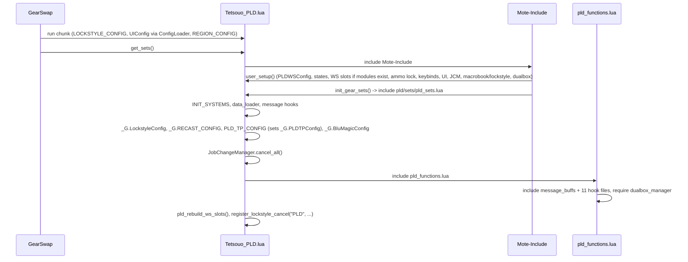
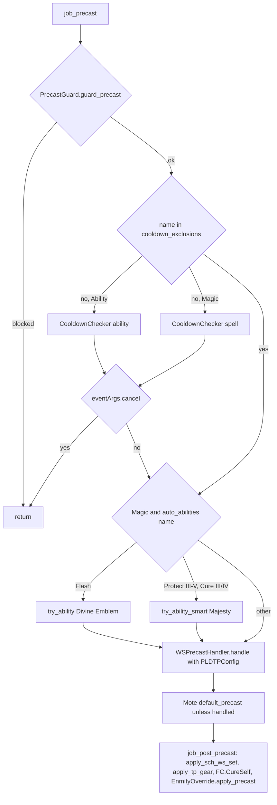
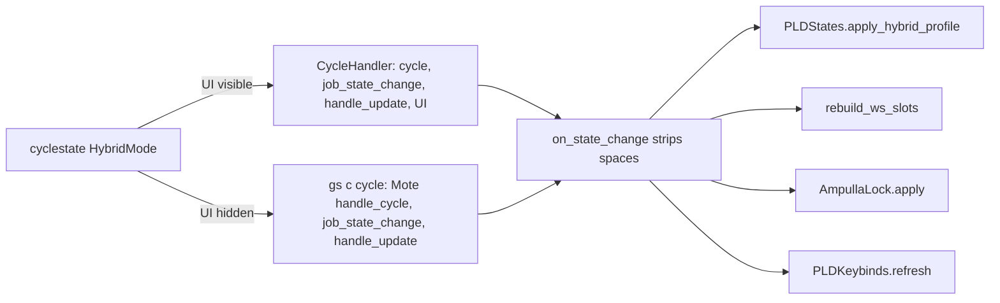
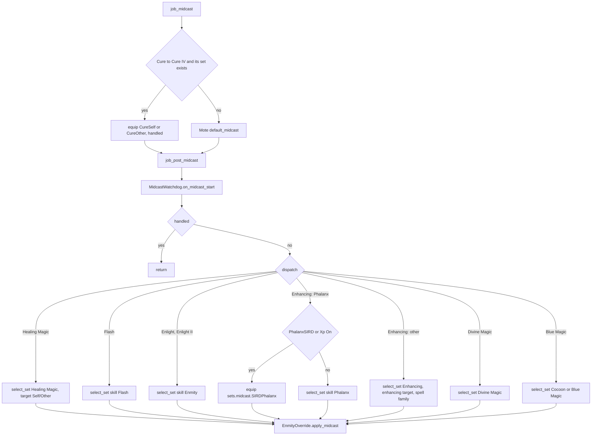
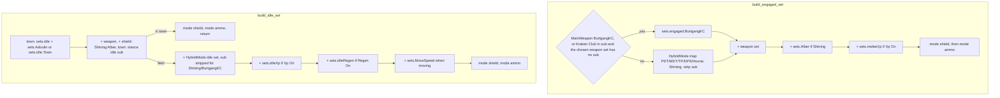

# PLD (Paladin) job

The PLD job area is 12 hook files plus 5 logic modules under
`shared/jobs/pld/functions/` (1 977 lines on 2026-09-28), one entry template, one
Kaories entry overlay, nine config files and two sets files (template and Kaories
overlay). GearSwap loads it when the main job becomes PLD (`Tetsouo_PLD.lua`,
`Kaories_PLD.lua`). From then on Mote-Include calls its hooks on every action
(precast, midcast, aftercast), on status and buff changes, on `//gs c` commands
and on state cycles.

What PLD adds on top of the shared pipeline:

- **Auto-abilities** in precast through `AbilityHelper`: Divine Emblem before
  Flash, Majesty before Protect III-V and Cure III/IV.
- **Target-aware cures**: Cure to Cure IV pick `sets.midcast.CureSelf` or
  `CureOther` in the pre-midcast hook; Cure III/IV on yourself also get a low-HP
  fast-cast set (`sets.precast.FC.CureSelf`) in post-precast.
- **Enmity routing** in midcast: Flash and Enlight are caught by name before the
  Divine skill; Phalanx has a SIRD override (`PhalanxSIRD` or `Xp`).
- **Weapon / shield / hybrid set builder**: weapon state, Shining (grip) and
  Burtgang + Kraken Club exceptions, HybridMode sets, XP sets, Regen idle layer.
- **Two HybridMode profiles**: PDT / MDT / Sortie on every subjob but /SCH, and
  DPS / Tanking / Hoxne on /SCH. Sortie and Tanking wear `sets.EnmityMax`
  instead of `sets.FullEnmity`; Hoxne locks the ammo slot on the Hoxne Ampulla.
- **Weaponskill slots** `WS1` / `WS2` that follow the weapon actually in hand.
- **Subjob helpers**: BLU AOE enmity rotation (`aoe`), rune casting (`rune`),
  and the /SCH commands (`lightarts`, `darkarts`, `aoe sneak|invi|erase`),
  which are common commands.

Player-facing pages: [PLD hub](../../user/jobs/pld/README.md),
[modes](../../user/jobs/pld/states.md), [sets](../../user/jobs/pld/sets.md).

Every file in scope was read in full on 2026-09-28 except the gear content of the
sets files (structure and set names only). References are `file` + function; line
numbers are avoided because they drift.

## Files

| Path | Lines | Role |
|------|------:|------|
| `_master/entry/Tetsouo_PLD.lua` | 307 | Entry point (template): config preload, `get_sets`, `job_sub_job_change`, `user_setup`, `job_update`, `init_gear_sets`, `file_unload` |
| `_master/Kaories/entry/Kaories_PLD.lua` | 271 | Kaories overlay: `Kaories/...` paths and an older body: no `PLD_WS_CONFIG` / `pld_rebuild_ws_slots` (no weaponskill slots) and no `AmpullaLock` in `user_setup` / `file_unload` (a decision left to the player, not a bug) |
| `shared/jobs/pld/functions/pld_functions.lua` | 121 | Facade: includes `message_buffs` and the 11 hook files, requires `dualbox_manager` |
| `shared/jobs/pld/functions/PLD_PRECAST.lua` | 200 | `job_precast` (guard, cooldown, auto-abilities, WS) / `job_post_precast` (/SCH weaponskill variants, TP gear, CureSelf FC, enmity override) |
| `shared/jobs/pld/functions/PLD_MIDCAST.lua` | 202 | `job_midcast` (Cure to Cure IV) / `job_post_midcast` (name-before-skill dispatch, enmity override) |
| `shared/jobs/pld/functions/PLD_AFTERCAST.lua` | 36 | `LifecycleManager.aftercast()`, empty `job_post_aftercast` |
| `shared/jobs/pld/functions/PLD_IDLE.lua` | 51 | `customize_idle_set` -> `SetBuilder.build_idle_set` (+ `UPDATE_DEBUG` trace) |
| `shared/jobs/pld/functions/PLD_ENGAGED.lua` | 51 | `customize_melee_set` -> `SetBuilder.build_engaged_set` (+ trace) |
| `shared/jobs/pld/functions/PLD_STATUS.lua` | 20 | `job_status_change = LifecycleManager.status_change()` |
| `shared/jobs/pld/functions/PLD_BUFFS.lua` | 20 | `job_buff_change = LifecycleManager.buff_change()` |
| `shared/jobs/pld/functions/PLD_COMMANDS.lua` | 306 | `job_self_command` router (incl. `ws`/`wsN`), local `rebuild_ws_slots` (exported `_G.pld_rebuild_ws_slots`), `job_state_change` (profile, WS slots, ammo lock, keybind refresh) |
| `shared/jobs/pld/functions/PLD_MOVEMENT.lua` | 23 | Placeholder for the 12-module layout (comments only) |
| `shared/jobs/pld/functions/PLD_LOCKSTYLE.lua` | 49 | Lazy `LockstyleManager.create('PLD', 'pld/PLD_LOCKSTYLE', 1, 'SAM')` wrappers |
| `shared/jobs/pld/functions/PLD_MACROBOOK.lua` | 43 | Lazy `MacrobookManager.create('PLD', ..., 'SAM', 1, 1)` wrapper |
| `shared/jobs/pld/functions/logic/set_builder.lua` | 376 | Idle/engaged construction: weapon, shield, ammo, HybridMode map, XP, Regen, movement, town; `current_weapon()` is the authority on what is in hand |
| `shared/jobs/pld/functions/logic/enmity_override.lua` | 151 | Sortie and /SCH Tanking: FullEnmity spells wear `sets.EnmityMax`; JAs keep their set and gain what EnmityMax adds |
| `shared/jobs/pld/functions/logic/cure_set_builder.lua` | 54 | CureSelf / CureOther choice for Cure to Cure IV, `is_cure` |
| `shared/jobs/pld/functions/logic/aoe_manager.lua` | 178 | `//gs c aoe` BLU rotation (same code as RUN's copy; only headers and error text differ) |
| `shared/jobs/pld/functions/logic/rune_manager.lua` | 76 | `//gs c rune` (same code as RUN's copy) |
| `shared/utils/equipment/ampulla_lock.lua` | 194 | Hoxne stance: closes the ammo slot on Hoxne Ampulla once it is worn, or leaves it open and says so; records the lock with Combat Mode's lock registry (`'ampulla'`). Shared with WAR |
| `shared/utils/weaponskill/ws_slots.lua` | 159 | Weapon-aware weaponskill slot states, shared with WAR (PLD uses `rebuild` / `get` / `cast`; the weapon-in-hand detection, `detect_weapon` / `sync`, is WAR's) |
| `shared/utils/scholar/scholar_actions.lua`, `stratagem_charges.lua` | 366 + 104 | /SCH chains, shared with BLM and GEO (and `//gs c stealth`); stratagem buffs read from `windower.ffxi.get_player().buffs` (`buff_up`), see [midcast and buffs](../systems/midcast-and-buffs.md) |
| `_master/config/pld/PLD_STATES.lua` | 364 | States (incl. `WS1`/`WS2`), three option profiles (`standard`/`sortie`/`sch`), `apply_hybrid_profile`, `_G.PLDStates` |
| `_master/config/pld/PLD_KEYBINDS.lua` | 81 | 9 bind entries (Regen on `^numpad2` and Phalanx SIRD on `^numpad3` under /SCH), `subjob` / `exclude_subjob` filters, a `visible` predicate, `retired_keys = {'^numpad7'}`; data only, `KeybindManager.create('PLD', ...)` does the rest ([keybinds and custom states](../systems/keybinds-and-custom.md)) |
| `_master/config/pld/PLD_CUSTOM.lua` | 119 | Player modes and gear rules (all examples commented out) |
| `_master/config/pld/PLD_HUD.lua` | 31 | HUD section / row order for PLD (empty lists = the `UI_CONFIG` default) |
| `_master/config/pld/PLD_WS_CONFIG.lua` | 64 | `_G.PLDWSConfig`: `max_slots = 2`, the two weaponskills each sword offers |
| `_master/config/pld/PLD_LOCKSTYLE.lua` | 72 | Style 3 (`default`, `by_subjob`, `get_style`) |
| `_master/config/pld/PLD_MACROBOOK.lua` | 76 | Book 15/18/20 per subjob, dual-box table |
| `_master/config/pld/PLD_TP_CONFIG.lua` | 75 | `_G.PLDTPConfig` (Moonshade piece, Sequence weapon) |
| `_master/config/pld/PLD_BLU_MAGIC.lua` | 203 | `_G.BluMagicConfig`: AOE spell table, dynamic / manual rotation |
| `_master/sets/pld_sets.lua` | 848 | Template sets (flat); families derive from local bases so variants are not inherited as slots |
| `_master/Kaories/pld/pld_sets.lua` | 777 | Kaories overlay sets (no Sortie or /SCH sets, see Known issues) |
| `shared/data/job_abilities/PLD_JA_DATABASE.lua` + `pld/*.lua` | 13 + 194 | JA descriptions for `ability_message_handler` (messages only) |

Live copies (gitignored): `Tetsouo/Tetsouo_PLD.lua` differs from the template only in
comments, `@file` / `@author`, the keybind error text and `init_gear_sets`, which
includes `pld/sets/pld_sets.lua`; `_master/Tetsouo/entry/Tetsouo_PLD.lua` is
identical to it. `Tetsouo/pld/` is modular (`pld_sets.lua` + `armor`, `capes`,
`weapons`, mirrored in `_master/Tetsouo/pld/`). `_master/Tetsouo/pld/`
holds only `PLD_MACROBOOK.lua` (other book numbers) and `PLD_REFILL.lua`.
`_master/Kaories/pld/` holds keybinds (with the old `^numpad7` SneakInviAOE
bind on /SCH), lockstyle 4, macrobook, refill and an older `PLD_STATES.lua` without
the weaponskill slots or the /SCH profile. Full comparison:
[characters and templates](../architecture/characters-and-templates.md).

## How it works

### Load sequence

`user_setup()` and `init_gear_sets()` run inside `include('Mote-Include.lua')`,
before `INIT_SYSTEMS` (included on the next line of `get_sets`) and before the
PLD hook files exist (same model as [BLM](blm.md#load-sequence) and
[core lifecycle](../systems/core-lifecycle.md)).


```mermaid
sequenceDiagram
    participant GS as GearSwap
    participant E as Tetsouo_PLD.lua
    participant M as Mote-Include
    participant F as pld_functions.lua
    GS->>E: run chunk (LOCKSTYLE_CONFIG, UIConfig via ConfigLoader, REGION_CONFIG)
    GS->>E: get_sets()
    E->>M: include Mote-Include
    M->>E: user_setup() (PLDWSConfig, states, WS slots if modules exist, ammo lock, keybinds, UI, JCM, macrobook/lockstyle, dualbox)
    M->>E: init_gear_sets() -> include pld/sets/pld_sets.lua
    E->>E: INIT_SYSTEMS, data_loader, message hooks
    E->>E: _G.LockstyleConfig, _G.RECAST_CONFIG, PLD_TP_CONFIG (sets _G.PLDTPConfig), _G.BluMagicConfig
    E->>E: JobChangeManager.cancel_all()
    E->>F: include pld_functions.lua
    F->>F: include message_buffs + 11 hook files, require dualbox_manager
    E->>E: pld_rebuild_ws_slots(), register_lockstyle_cancel("PLD", ...)
```

`user_setup()` (`Tetsouo_PLD.lua`):

1. `_G.PLDWSConfig = require(... PLD_WS_CONFIG)`, then
   `require('Tetsouo/pld/PLD_STATES').configure()` creates every state and
   ends with `apply_hybrid_profile(state.HybridMode.value)`.
   `_G.pld_rebuild_ws_slots()` runs only when the job modules already exist (a
   subjob change re-runs `user_setup` in the same sandbox); on a cold load
   `get_sets` calls it after including the facade. Then
   `AmpullaLock.apply(state.HybridMode.value)` gives back an ammo lock left by a
   stance that is no longer selected.
2. `require('Tetsouo/pld/PLD_KEYBINDS')` (a `KeybindManager` module) into
   the global `PLDKeybinds`, then `bind_all()`: `KeybindManager` clears keys no
   longer wanted, binds the ones whose `subjob` / `exclude_subjob` / `visible`
   rules apply, then `show_intro()`. A failed require prints
   `'PLD keybinds failed to load: ' .. <error>` through `MessageFormatter.show_error`.
3. `KeybindUI.smart_init("PLD", _G.UIConfig.init_delay or 5)`. The UI readiness
   anchor for PLD is `state.HybridMode` (`ui_lifecycle.lua` `are_states_ready`).
4. `JobChangeManager.initialize()`; if `select_default_macro_book` and
   `select_default_lockstyle` exist, the macro book is set at once and the lockstyle
   is scheduled after `LockstyleConfig.initial_load_delay` (8 s). They exist only
   because `KeybindManager`'s `show_intro()` requires `PLD_MACROBOOK.lua` and
   `PLD_LOCKSTYLE.lua`, which define them as a side effect and return nothing; see
   [factories](../systems/factories-and-helpers.md#job-wrappers).
5. `pcall(require, 'shared/utils/dualbox/dualbox_manager')`.

`job_sub_job_change` only calls `JobChangeManager.on_job_change`. `file_unload`
releases the ammo lock **first** (GearSwap runs the whole of `file_unload` in one
`pcall`, so an error further down would leak the lock), then
`JobChangeManager.cancel_all()`, then `PLDKeybinds.unbind_all()`.

`pld_functions.lua` includes `message_buffs.lua`, `PLD_PRECAST`, `PLD_MIDCAST`,
`PLD_AFTERCAST`, `PLD_IDLE`, `PLD_ENGAGED`, `PLD_STATUS`, `PLD_BUFFS`,
`PLD_LOCKSTYLE`, `PLD_MACROBOOK`, `PLD_COMMANDS`, `PLD_MOVEMENT`, then requires
`dualbox_manager` and prints a debug line. Logic modules are required lazily by
the hooks (`ensure_modules_loaded`, `ensure_commands_loaded`, first idle/engage).

### Precast

`job_precast` (`PLD_PRECAST.lua`), then Mote's `default_precast` (unless
`handled`), then `job_post_precast`:


```mermaid
flowchart TD
    A[job_precast] --> B{PrecastGuard.guard_precast}
    B -- blocked --> Z[return]
    B -- ok --> C{name in cooldown_exclusions}
    C -- no, Ability --> D[CooldownChecker ability]
    C -- no, Magic --> E[CooldownChecker spell]
    C -- yes --> F
    D --> G{eventArgs.cancel}
    E --> G
    G -- yes --> Z
    G -- no --> F{Magic and auto_abilities name}
    F -- Flash --> H[try_ability Divine Emblem]
    F -- Protect III-V, Cure III/IV --> I[try_ability_smart Majesty]
    F -- other --> J
    H --> J[WSPrecastHandler.handle with PLDTPConfig]
    I --> J
    J --> L[Mote default_precast unless handled]
    L --> M[job_post_precast: apply_sch_ws_set, apply_tp_gear, FC.CureSelf, EnmityOverride.apply_precast]
```

- `cooldown_exclusions` lists 22 Scholar names; `CooldownChecker` already skips
  stratagems itself (see [precast pipeline](../systems/precast-pipeline.md#recast-check)).
  Weaponskills have `action_type == 'Ability'`, so they pass
  `check_ability_cooldown` too.
- The helper abilities: when ready and their buff is down, `AbilityHelper` calls
  `cancel_spell()`, sends `input /ja "<JA>" <me>`, then replays the spell through
  `follow_up`, which waits for the buff to land instead of a fixed delay
  (`ability_helper.lua` `follow_up`, `try_ability`, `try_ability_smart`). It sets
  `eventArgs.handled`, not `cancel`, so `job_precast` goes on to the end and Mote
  still runs `job_post_precast` for the cancelled spell. The ability is tried at
  most once per spell (replay marker `windower._ability_replay`), and nothing is
  tried under Amnesia or Impairment ([AbilityHelper](../systems/precast-pipeline.md#abilityhelper)).
- `WSPrecastHandler.handle` returns true at once for anything that is not a
  weaponskill; for a WS it validates range, computes TP-bonus gear from
  `_G.PLDTPConfig` and refuses below 1000 TP read from the game.
- Precast gear comes from Mote's default: `sets.precast.FC[name|map|skill]`,
  `sets.precast.JA[name]` (JA base is FullEnmity), or `sets.precast.WS[name]`.
  `job_precast` equips nothing itself.
- `job_post_precast`, in order:
  1. `apply_sch_ws_set`: on /SCH, `sets.precast.WS.SCH[<ws>]` when it exists
     (only the live Tetsouo sets define one, for Knights of Round);
  2. `WSPrecastHandler.apply_tp_gear`;
  3. `sets.precast.FC.CureSelf` for Cure III / IV on self (only the live Tetsouo
     sets define it);
  4. `EnmityOverride.apply_precast` (below).

### HybridMode profiles

`HybridMode` carries a different list depending on the subjob, chosen in
`PLDStates.configure()`:

| subjob | values | default |
|---|---|---|
| anything but /SCH | `PDT` / `MDT` / `Sortie` | `PDT` |
| /SCH | `DPS` / `Tanking` / `Hoxne` | `Tanking` |

PLD/SCH is played for Sortie and nothing else, so it drops the general split
for three stances of its own. `PLD_COMMANDS.lua` wires
`job_state_change = LifecycleManager.state_change(on_state_change)`: the shared
handler repaints the HUD (except for `Moving`), then runs `on_state_change`.


```mermaid
flowchart LR
    A[cyclestate HybridMode] -->|UI visible| B[CycleHandler: cycle, job_state_change, handle_update, UI]
    A -->|UI hidden| C[gs c cycle: Mote handle_cycle, job_state_change, handle_update]
    B --> D[on_state_change strips spaces]
    C --> D
    D --> E[PLDStates.apply_hybrid_profile]
    D --> F[rebuild_ws_slots]
    D --> G[AmpullaLock.apply]
    D --> H[PLDKeybinds.refresh]
```

On `MainWeapon`, `on_state_change` only rebuilds the WS slots. On `HybridMode`,
four things react, in that order. Everything runs inside `job_state_change`, which
Mote calls **before** `handle_update`, so gear posted here would be overwritten by
the set `handle_update` re-equips.

- **`PLDStates.apply_hybrid_profile`** (`PLD_STATES.lua`) asks the local
  `profile_for` which profile should be in place: `sch`, `sortie` or `standard`.
  The subjob decides first. `install_profile` then reshapes the option lists, and
  is skipped while the profile is already in place (module local
  `active_profile`), so PDT <-> MDT and DPS <-> Hoxne change nothing.
  - `standard`: full rune and weapon lists, `PhalanxSIRD` Off, `Regen` Off.
  - `sortie`: `SORTIE_RUNE_OPTIONS` (Ignis, Tenebrae, Sulpor, Flabra, Unda),
    `SORTIE_WEAPON_OPTIONS` (Burtgang, Naegling), `PhalanxSIRD` On, `Regen` Off.
  - `sch`: `SCH_WEAPON_OPTIONS` (Naegling, Excalibur) and `MainWeapon` forced to
    Naegling, `PhalanxSIRD` On, `SneakInviAOE` On; the rune list is left alone.

  `reshape()` keeps the current weapon and rune when the new list has them:
  `Modes:options()` alone resets a mode to its first entry (Mote `Modes.lua`),
  which for `MainWeapon` is a weapon swap and lost TP. The /SCH profile is the
  exception: it sets `MainWeapon` outright.
- **`rebuild_ws_slots`** (`PLD_COMMANDS.lua`, local) refills `state.WS1`/`WS2`
  from `SetBuilder.current_weapon()`.
- **`AmpullaLock.apply(newValue)`** closes or releases the ammo slot.
- **`PLDKeybinds.refresh()`** re-lays only the keys that changed: entering or
  leaving /SCH Tanking hides or shows `MainWeapon`.

#### Stances under /SCH

The stance owns the set, the ammo and the lock; the weapon is a separate axis.

| stance | engaged set | idle set | weapon | shield | EnmityMax | ammo locked |
|---|---|---|---|---|---|---|
| `DPS` | `sets.engaged.DPS` | `sets.idle.MDT` | `MainWeapon` | Duban | no | no |
| `Tanking` | `sets.engaged.MDT` | `sets.idle.MDT` | Burtgang | Aegis | **yes** | no |
| `Hoxne` | `sets.engaged.Hoxne` | `sets.idle.MDT` | `MainWeapon` | Duban | no | **yes** (Hoxne Ampulla) |

Gear side (`set_builder.lua`, tables `ENGAGED_SET_BY_MODE` / `IDLE_SET_BY_MODE`):
engaged `PDT -> .PDT`, `MDT -> .MDT`, `Sortie -> .TP`, `DPS -> .DPS`,
`Tanking -> .MDT`, `Hoxne -> .Hoxne`; every mode idles in its own set except
Sortie and the three /SCH stances, which idle in `sets.idle.MDT`.

The shield follows the **weapon**, not the stance, in both Sortie and /SCH:
`SORTIE_SHIELD_BY_WEAPON` pairs Burtgang with Aegis and Naegling with Blurred
Shield +1; `SCH_SHIELD_BY_WEAPON` gives Duban to Excalibur and Naegling and Aegis to
Burtgang. `apply_mode_shield` runs last so it wins over the sub carried by the
mode's own set.

`apply_mode_ammo` (= `AmpullaLock.stance_ammo`, shared with WAR since 2026-09-29) puts
the Ampulla on under the Hoxne stance. This, not the lock, is what puts the piece on: it is in the built set,
so every later `handle_update` wears it again.

#### The weapon is its own axis

`MainWeapon` offers Naegling / Excalibur under /SCH, Naegling first. Burtgang is
deliberately absent: the Tanking stance holds it outright through
`SCH_WEAPON_BY_MODE`, so cycling never lands on it by accident.

`SetBuilder.current_weapon()` is the authority on what is in hand: the stance
override first (local `sch_weapon`), then `state.MainWeapon`. Anything that has to
know what is being swung asks here rather than reading the state, which would be
wrong in Tanking.

The `Main Weapon` bind disappears in Tanking: it carries a `visible` predicate
(`PLD_KEYBINDS.lua`) that `KeybindManager` asks on every `refresh()`.

### Enmity override (Sortie, and /SCH Tanking)

`logic/enmity_override.lua` is active on a hate-holding mode (`ENMITY_MAX_MODES`:
`Sortie` and `Tanking`) when `sets.EnmityMax` exists (local `is_active`). The /SCH
`DPS` and `Hoxne` stances are left out: they are the TP builds.

- `EnmityOverride.apply_precast`, called last in `job_post_precast`: every
  `action_type == 'Ability'` except weaponskills gets `enmity_max_extra()`, i.e.
  the slots where `sets.EnmityMax` differs from `sets.FullEnmity` (in the template
  only `sub = 'Srivatsa'`), compared by item name after both go through
  `set_combine`. Mote's default precast has already equipped the JA's own set, so
  its specific piece (Sentinel feet, Rampart head...) stays. That covers PLD JAs,
  /RUN runes and wards, /SCH stratagems, /DNC waltzes. Atonement (a WS,
  `sets.precast.WS['Atonement'] = sets.FullEnmity`) keeps FullEnmity.
- `EnmityOverride.apply_midcast`, called last in `job_post_midcast`: a spell is
  swapped only when its name set, or failing that its skill set, **is**
  `sets.FullEnmity` (identity test, local `uses_full_enmity`). In the template that
  is Flash and Jettatura; the live Tetsouo sets add Crusade.
- Cure to Cure IV never reach the override: `job_post_midcast` returns early for
  them (they are `handled` by `job_midcast`). They do not wear FullEnmity, so
  nothing is lost today, but any future override added after the dispatch has the
  same blind spot.

### Weaponskill slots

Two fixed macros (`//gs c ws1`, `//gs c ws2`, and `//gs c ws` for the first) fire
whatever the weapon in hand put in that slot, through the same
`shared/utils/weaponskill/ws_slots.lua` WAR uses. The slots are real Mote states,
so the HUD picks them up on its own (`"WS"` is in the HUD state patterns,
`UI_DISPLAY_BUILDER.lua`).

`PLD_WS_CONFIG.lua` holds the lists. Savage Blade takes slot 1 on every sword and
slot 2 holds what the weapon alone unlocks:

| weapon | WS 1 | WS 2 |
|---|---|---|
| Excalibur | Savage Blade | Knights of Round |
| Burtgang | Savage Blade | Atonement |
| Naegling | Savage Blade | Chant du Cygne |

Any other weapon (KC, BurtgangKC, Shining, Malevo) has no list: both slots show
`None` and `wsN` warns.

- The slots follow `SetBuilder.current_weapon()`, **not** `state.MainWeapon`. In
  Tanking the state says Naegling or Excalibur while Burtgang is in hand. Both a
  `MainWeapon` and a `HybridMode` change rebuild them.
- They are created in `configure()`, with every other state, and only refreshed
  later from `get_sets()`. The keybind HUD fixes its row structure during
  `user_setup`, so a state born after that reads `N/A` however live the value
  lookup is (the same reason `AutoMedicine` is created there).

### Ammo lock (Hoxne stance)

The Hoxne Ampulla is an ammo-slot item with a single charge and a 60 s recast, so
it has to stay equipped to be usable, and every PLD set names its own ammo.
`shared/utils/equipment/ampulla_lock.lua` (shared with WAR) closes the slot on it.
Two halves, both needed:

- **SetBuilder wears it.** `apply_mode_ammo` names the Ampulla in the Hoxne idle and
  engaged sets, so every `handle_update` puts it back. The lock module equips
  nothing itself: `equip()` from a scheduled callback is dropped, since GearSwap's
  `equip_sets` clears `equip_list` at the top of every cycle (`flow.lua`).
- **The lock keeps it.** `disable('ammo')` stops the weaponskill, midcast and
  precast sets, none of them built by SetBuilder, from taking it back.

The lock polls `player.equipment.ammo` until the Ampulla is there (local
`lock_when_worn`) rather than waiting a fixed delay: `equip()` is
`set_merge(true, ...)` and `set_merge` sends a disabled slot to
`not_sent_out_equip` instead of wearing it (`helper_functions.lua`), so a slot
closed early could never receive the piece. If the Ampulla never arrives the slot
is **left open** and the player is told what is worn instead (`warn_not_worn`).

`disable_table` survives `gs reload` and job changes, so the slot is given back at
both ends: `file_unload`, and `user_setup` right after `configure()` has reset
`HybridMode`. `//gs c wo` also releases it (the organizer's `clean_exit` and
`alt_finish` call `AmpullaLock.release()`, after their own `gs enable all`, which
also cancels a lock still polling), so after `wo` the slot stays open until the
stance is selected again.

`AmpullaLock.set_slot` also records the lock with `CombatMode.hold('ampulla', {'ammo'})` and forgets it with `CombatMode.release('ampulla')` (since 2026-09-29), so Combat Mode's `handle_equipping_gear` wrapper disables the ammo slot again after the gear of every update, outside a craft session: after `//po` (PorterPacker ends with `gs enable all`) the next update puts the Ampulla back and locks it again. The lock the poll lays is
the one recorded; the poll itself is unchanged (see
[core-lifecycle.md](../systems/core-lifecycle.md#combatmode-hook-sharedutilscorecombat_modelua)).

### Midcast

Mote runs `job_midcast`; unless it set `handled`, Mote's `default_midcast` equips
`get_midcast_set` (name, spell map, skill); then `job_post_midcast` runs in every
case except cancel. After it, `midcast_fallback.lua` (hooked on `cleanup_midcast`)
routes a spell nothing routed, and skips `handled` cures.


```mermaid
flowchart TD
    A[job_midcast] --> B{Cure to Cure IV and its set exists}
    B -- yes --> C[equip CureSelf or CureOther, handled]
    B -- no --> D[Mote default_midcast]
    C --> E[job_post_midcast]
    D --> E
    E --> F[MidcastWatchdog.on_midcast_start]
    F --> G{handled}
    G -- yes --> Z[return]
    G -- no --> H{dispatch}
    H -- Healing Magic --> H1[select_set Healing Magic, target Self/Other]
    H -- Flash --> H2[select_set skill Flash]
    H -- Enlight, Enlight II --> H3[select_set skill Enmity]
    H -- Enhancing: Phalanx --> H4{PhalanxSIRD or Xp On}
    H4 -- yes --> H5[equip sets.midcast.SIRDPhalanx]
    H4 -- no --> H6[select_set skill Phalanx]
    H -- Enhancing: other --> H7[select_set Enhancing, enhancing target, spell family]
    H -- Divine Magic --> H8[select_set Divine Magic]
    H -- Blue Magic --> H9[select_set Cocoon or Blue Magic]
    H1 & H2 & H3 & H5 & H6 & H7 & H8 & H9 --> O[EnmityOverride.apply_midcast]
```

- `CureSetBuilder.generate(spell, target_type)` answers for Cure to Cure IV only
  (`CURES` table), by target: `sets.midcast.CureSelf` on yourself,
  `sets.midcast.CureOther` otherwise. It writes nothing: `sets.midcast.Cure` is
  **not** used by PLD (since 2026-09-27; before, the builder wrote the chosen set
  there, so Cure and Cure II wore the set of the last Cure III/IV). A missing set
  leaves `handled` false: the cure then goes through Mote's default and the
  Healing route.
- `MidcastManager.select_set` returns false at once when `sets.midcast[skill]` is
  missing (`midcast_manager.lua` `select_set`: "Mote's set stays"). No PLD sets
  file defines `sets.midcast['Healing Magic']`, `['Divine Magic']` or
  `['Blue Magic']`, so those three routes equip nothing; what the spell wears is
  Mote's default by name (`sets.midcast.Banishga`, `['Geist Wall']`, ...). Blue
  spells of the AOE rotation without a named set (Sound Blast, Soporific) keep
  their precast gear through the cast.
- Pseudo-skills: `Flash` uses `sets.midcast.Flash` as base; `Enmity` uses
  `sets.midcast.Enmity` and the P0/P1 steps find `sets.midcast.Enlight` for
  Enlight and Enlight II (tier stripped, `resolve_base_name`); `Phalanx` uses
  `sets.midcast.Phalanx` (= `PhalanxPotency`); `Cocoon` uses `sets.midcast.Cocoon`.
- Enhancing uses `ENHANCING_MAGIC_DATABASE.get_spell_family` (Refresh, Phalanx,
  Stoneskin, BarElement, ...) and the P1 base-name rule, so Protect V finds
  `sets.midcast.Protect`. Stoneskin has its own HP-ordered set (template and live
  Tetsouo only).

### Aftercast, idle, engaged, status, buffs

- `job_aftercast` is `LifecycleManager.aftercast()`: MidcastWatchdog tick only;
  Mote returns to idle/engaged gear. `job_post_aftercast` is empty.
- `job_status_change` / `job_buff_change` are the shared handlers
  ([core lifecycle](../systems/core-lifecycle.md#lifecyclemanager)): Doom first;
  the status handler also holds back an engage / disengage that lands during an
  action until the aftercast.
- Mote's own bases: idle `sets.idle[Town]` in cities else `sets.idle` (`IdleMode`
  Normal has no set); engaged `sets.engaged[HybridMode]`. The set builder then
  replaces the engaged base and lays its sets on top of the idle one.


```mermaid
flowchart TD
    subgraph Engaged [build_engaged_set]
    E1{MainWeapon BurtgangKC, or Kraken Club in sub and the chosen weapon set has no sub} -- yes --> E2[sets.engaged.BurtgangKC]
    E1 -- no --> E3[HybridMode map PDT/MDT/TP/DPS/Hoxne; Shining: strip sub]
    E2 --> E4[+ weapon set]
    E3 --> E4
    E4 --> E5[+ sets.Alber if Shining]
    E5 --> E6[+ sets.meleeXp if Xp On]
    E6 --> E7[mode shield, then mode ammo]
    end
    subgraph Idle [build_idle_set]
    I1[town: sets.idle + sets.Adoulin or sets.idle.Town] --> I2[+ weapon, + shield: Shining Alber, town: stance idle sub]
    I2 -- in town --> I7[mode shield, mode ammo, return]
    I2 -- field --> I3[+ HybridMode idle set, sub stripped for Shining/BurtgangKC]
    I3 --> I4[+ sets.idleXp if Xp On]
    I4 --> I4b[+ sets.idleRegen if Regen On]
    I4b --> I5[+ sets.MoveSpeed when moving]
    I5 --> I6[mode shield, mode ammo]
    end
```

- Town detection is `BaseSetBuilder.select_idle_base_town` (Adoulin first, Dynamis
  excluded).
- `SetBuilder.apply_shield` outside town does nothing: in the field the shield
  comes from the HybridMode set's `sub` (Duban for PDT, Aegis for MDT in the
  template).

## Mote states

Created by `PLDStates.configure()` on every `user_setup()`. Keys from
`PLD_KEYBINDS.lua`; `^` = Ctrl, `#` = Apps. `#numpad0` (AutoMedicine) comes from
the character's `common/COMMON_KEYBINDS.lua`.

| State | Values | Default | Key | Read by |
|-------|--------|---------|-----|---------|
| `HybridMode` (Mote's, options replaced) | PDT, MDT, Sortie; **/SCH: DPS, Tanking, Hoxne** | PDT; **Tanking** under /SCH | `^numpad9` | Mote `get_melee_set`; `set_builder.lua` (`hybrid_set`, `sch_weapon`, `apply_mode_shield`, `apply_mode_ammo`); `enmity_override.lua` `is_active`; `on_state_change`; UI anchor |
| `MainWeapon` | Excalibur, Burtgang, KC, BurtgangKC, Naegling, Shining, Malevo (Sortie: Burtgang, Naegling; **/SCH: Naegling, Excalibur**) | Excalibur (first option); Burtgang on entering Sortie (Excalibur is not in its list); **Naegling** under /SCH | `^numpad1`, hidden in /SCH Tanking (`visible`) | `set_builder.lua` (`current_weapon`, `apply_weapon`, `apply_shield`, `select_engaged_base`, `build_*`); WS slots |
| `Xp` | Off, On | Off | `^numpad4` (/RDM only) | `set_builder.lua` build functions; `PLD_MIDCAST.lua` `midcast_phalanx` |
| `RuneMode` | Ignis .. Tenebrae (8); Sortie profile: Ignis, Tenebrae, Sulpor, Flabra, Unda | Ignis | `^numpad3` (/RUN only) | `rune_manager.lua` `execute_rune` |
| `SneakInviAOE` | On, Off | On; set On again whenever the /SCH profile installs | none (retired `^numpad7`) | `PLD_COMMANDS.lua` `aoe` -> `scholar_actions.lua` (missing state counts as On); `stealth_aoe.lua` (`Off` = no Accession for the box group, see [stealth](../systems/stealth.md)) |
| `PhalanxSIRD` | Off, On | Off; **On** on the /SCH and Sortie profiles | `^numpad2` except /SCH; `^numpad3` under /SCH | `PLD_MIDCAST.lua` `midcast_phalanx`; required by `apply_hybrid_profile`. `//gs c sortie aminon` / `aminontest` set it Off, every other Sortie target On; `gab` (a target without stance) leaves it alone (`sortie_commands.lua` `engage_target`) |
| `Regen` | Off, On | Off; forced Off by the standard and Sortie profiles | `^numpad2` under /SCH, or `gs c set Regen On\|Off` | `set_builder.lua` `build_idle_set` (step 6b): lays `sets.idleRegen` over the idle set |
| `WS1`, `WS2` | that weapon's list (`PLD_WS_CONFIG.lua`), or `None` | entry 1 and 2 | `^numpad5`, `^numpad6` | `ws_slots.lua`; rebuilt from `SetBuilder.current_weapon()` on a `MainWeapon` or `HybridMode` change |
| `FastCast` | 0..80 step 10 | 80 | none | `midcast_watchdog.lua` (fallback cast time) |
| `AutoMedicine` | On, Off | On on a cold start, then kept across loads | `#numpad0` (from `COMMON_KEYBINDS.lua`) | `AutoMedicine.init(state, M)` at the end of `configure()` |

`Regen` is idle-only; in the live Tetsouo sets `sets.idleRegen` is seven slots
(Regen+34 and Refresh+1 in total) laid over whatever the stance chose. The template
has no `sets.idleRegen`, so the key does nothing until the player adds one.

Optional states added to every job: `CombatMode` (hidden on PLD, default key
`!numpad0`) and `TreasureMode` (hidden, `!numpad.`), see
[keybinds and custom states](../systems/keybinds-and-custom.md#optional-states-combat-mode-and-treasure-mode).
Mote defaults also exist: `OffenseMode`, `IdleMode`, `CastingMode`,
`WeaponskillMode`, `RangedMode` (all `'Normal'`), `DefenseMode` (None).
`state.Moving` comes from AutoMove.

## Commands

`job_self_command` (`PLD_COMMANDS.lua`) lowercases the first word and tests, in
order: watchdog, dual-box internals, **CommonCommands** (built-in names and warp
aliases), `ui`, `debugmidcast`, `cyclestate`, then PLD commands. A name none of
them answers goes to Mote, whose last lookup is the dual-box partner's alt config,
and `//gs c alt <name>` sends the alt's. See
[commands and debug](../systems/commands-and-debug.md#4-alt-commands-and-name-shadowing).

| Command | Effect | Handler |
|---------|--------|---------|
| `watchdog ...` | MidcastWatchdog commands | `WatchdogCommands.handle_command` |
| `altjobupdate <job> <sub> ...` / `requestjob` | Dual-box job exchange (sender name forwarded) | `DualBoxManager.receive_alt_job` / `handle_job_request` |
| common commands | every [common command](../systems/commands-and-debug.md#common-commands-commoncommandshandle_command) | `CommonCommands.handle_command(command, 'PLD', table.unpack(args))` |
| `ui ...` | HUD | `UICommands.handle_ui_command` |
| `debugmidcast` | Toggle MidcastManager debug | `MidcastManager.toggle_debug` |
| `cyclestate <State> [reverse]` | UI-aware cycle (all keybinds) | `CycleHandler.handle_cyclestate` |
| `aoe` (bare word, checked before the common commands) | BLU rotation: first castable spell of `BluMagicConfig.get_rotation()` on `<stnpc>`, 5 s anti-spam per spell; otherwise recast list and `/target <stnpc>`. Refuses with "AOE needs the BLU subjob (PLD/BLU)" when the subjob is not BLU | `aoe_manager.lua` `execute_aoe` |
| `aoe sneak` / `invi` / `invisible` / `erase` | common command (/SCH chain): Light Arts + Addendum: White (Erase) + Accession as charges allow; the spell leaves once every stratagem it queued is up, and is cancelled with a message if they never come; `SneakInviAOE` Off casts on `<stal>` without Accession | `ScholarActions.handle_command` -> `cast_with_stratagems` |
| `ws` / `ws1` / `ws2` | Fire the weaponskill that slot holds for the weapon in hand (`ws` = slot 1; `ws3`..`ws9` warn) | `WSSlots.cast` |
| `rune` | `/ja "<RuneMode>" <me>` unless on recast (no subjob check) | `rune_manager.lua` `execute_rune` |

BLU rotation detail: `PLD_BLU_MAGIC.get_rotation()` keeps the spells of
`aoe_spell_database` it finds among `windower.ffxi.get_mjob_data().spells`, sorted
by enmity per second, else returns `manual_rotation` (Geist Wall, Stinking Gas,
Sound Blast, Sheep Song, Soporific). The local `can_cast_spell` rejects names
absent from `res.spells`, spells cast in the last 5 s, and spells with a recast
above the `RECAST_CONFIG` tolerance (global `is_on_cooldown`).

## Set names the code looks up

T = `_master/sets/pld_sets.lua`, K = `_master/Kaories/pld/pld_sets.lua`,
L = `Tetsouo/pld/pld_sets.lua` (weapon sets in `Tetsouo/pld/sets/weapons.lua`).
The player-facing list is [pld/sets.md](../../user/jobs/pld/sets.md).

| Set | Looked up by | T | K | L |
|-----|--------------|---|---|---|
| `sets[MainWeapon]` (Excalibur, Burtgang, KC, BurtgangKC, Shining, Naegling, Malevo) | `set_builder.lua` `apply_weapon` | yes | no Excalibur, no KC | yes |
| `sets.Alber` | `apply_shield`, `build_engaged_set` (Shining) | yes | yes | yes |
| `sets.Duban`, `sets.Aegis`, `sets['Blurred Shield +1']` | nothing (shields come from mode sets or literals) | yes | Duban, Aegis | yes |
| `sets.idle`, `sets.idle.PDT`, `sets.idle.MDT` | Mote base, `IDLE_SET_BY_MODE` | yes | yes | yes |
| `sets.engaged`, `.PDT`, `.MDT` | Mote base, `ENGAGED_SET_BY_MODE` | yes | yes | yes |
| `sets.engaged.TP` | Sortie engaged | yes | **absent** | yes |
| `sets.engaged.DPS`, `sets.engaged.Hoxne` | /SCH DPS / Hoxne stances | yes | **absent** | yes |
| `sets.precast.WS.SCH['<ws>']` | `PLD_PRECAST.lua` `apply_sch_ws_set` | **absent** | **absent** | Knights of Round |
| `sets.engaged.BurtgangKC` | `select_engaged_base` | yes | yes | yes |
| `sets.idleXp`, `sets.meleeXp` | build functions (Xp On) | yes | yes | yes |
| `sets.idleRegen` | `build_idle_set` (Regen On) | **absent** | **absent** | yes |
| `sets.idle.Town`, `sets.Adoulin`, `sets.MoveSpeed` | BaseSetBuilder, movement | Town = `sets.MoveSpeed` | yes | Town = `idle.PDT + MoveSpeed` |
| `sets.FullEnmity` | identity test `uses_full_enmity`, `enmity_max_extra` | yes | yes | yes |
| `sets.EnmityMax` | `enmity_override.lua` | `FullEnmity + Srivatsa` | **absent** | yes |
| `sets.precast.JA` + 16 named JAs | Mote default precast | yes | yes | yes |
| `sets.precast.FC` (+ 17 name/skill entries) | Mote default precast | yes | yes | yes |
| `sets.precast.FC.CureSelf` | `job_post_precast` | **absent** | **absent** | yes |
| `sets.precast.WS` + named WS, `['Atonement'] = FullEnmity` | Mote default precast | yes | yes | yes (+ Knights of Round) |
| `sets.precast.WS.TPBonus`, `['<WS>'].TPBonus` | nothing (TP gear comes from `PLD_TP_CONFIG`) | yes | yes | yes |
| `sets.midcast.Enmity` (= FullEnmity) | skill `Enmity` (Enlight) | yes | yes | yes |
| `sets.midcast['Flash']` (= FullEnmity) | skill `Flash`, Mote by name | yes | yes | yes |
| `sets.midcast['Enlight']` | P0/P1 under skill Enmity | yes | yes | yes |
| `sets.midcast.SIRDPhalanx` | `midcast_phalanx` | yes | yes | yes |
| `sets.midcast['Phalanx']` (= PhalanxPotency) | skill `Phalanx` | yes | yes | yes |
| `sets.midcast['Enhancing Magic']` | skill base | yes | yes | yes |
| `sets.midcast['Stoneskin']` | P0 name | yes | **absent** | yes |
| `sets.midcast.Crusade/Reprisal/Protect/Shell/Refresh/Haste/Foil` | P0/P1/P6 | yes | yes | yes (Crusade = FullEnmity) |
| `sets.midcast.CureSelf`, `.CureOther` | `cure_set_builder.lua` `generate` | yes | yes | yes |
| `sets.Cure` | nothing by name: base of CureSelf / CureOther | yes | yes | yes |
| `sets.midcast['Healing Magic']`, `['Divine Magic']`, `['Blue Magic']` | `select_set` base | absent | absent | absent |
| `sets.midcast['Cocoon']` and 7 other BLU names, `['Banishga']` | skill `Cocoon`; Mote by name | yes | yes | yes |
| `sets.buff.Doom` | DoomManager | yes | yes | yes |

## Configuration

| File / key | Default | Where the default lives | Read by |
|------------|---------|-------------------------|---------|
| `<char>/pld/PLD_STATES.lua` | see states | file | entry `user_setup` (path hard-coded `Tetsouo/...`, rewritten by the clone script) |
| `SORTIE_RUNE_OPTIONS`, `SORTIE_WEAPON_OPTIONS`, `SCH_WEAPON_OPTIONS` | 5 runes, 2 weapons, 2 weapons | `PLD_STATES.lua` | `install_profile` |
| `<char>/pld/PLD_KEYBINDS.lua` | 9 entries | file | entry `user_setup`, `file_unload`, HUD |
| `<char>/pld/PLD_CUSTOM.lua` | nothing active | file | `KeybindManager` / `CustomStates` ([keybinds and custom states](../systems/keybinds-and-custom.md)) |
| `<char>/pld/PLD_HUD.lua` | empty lists | file | HUD ([UI overlay](../systems/ui-overlay.md)); rewritten by `//gs c ui order` / `roworder` |
| `<char>/pld/PLD_WS_CONFIG.lua` -> `_G.PLDWSConfig` | 2 slots, 3 swords | file (no pcall: a missing file aborts `user_setup`) | `configure`, `rebuild_ws_slots` |
| `<char>/pld/PLD_LOCKSTYLE.lua` `default`, `by_subjob`, `get_style` | 3 (Kaories overlay 4) | file; factory fallback 1 (`PLD_LOCKSTYLE.lua` wrapper) | `LockstyleManager` |
| `<char>/pld/PLD_MACROBOOK.lua` `default`, `solo[sub]`, `dualbox[alt][sub]` | book 15 page 1 | file; factory fallback book 1 page 1 | `MacrobookManager` |
| `<char>/pld/PLD_TP_CONFIG.lua` -> `_G.PLDTPConfig` | Moonshade 250, Sequence 500 | file | `PLD_PRECAST.lua` (captured on first action) -> `TPBonusHandler` |
| `<char>/pld/PLD_BLU_MAGIC.lua` -> `_G.BluMagicConfig` | 5 AOE spells | file | `aoe_manager.lua` (captured when the module is first required) |
| `<char>/pld/PLD_REFILL.lua` | not in the template (overlay only) | player-created | refill system (fallback list without it) |
| `<char>/common/RECAST_CONFIG.lua` | tolerance | shared | `is_on_cooldown` in aoe/rune managers, `is_recast_ready` in AbilityHelper |
| `LOCKSTYLE_CONFIG`, `REGION_CONFIG`, UI config | - | shared | entry |

## State & lifetime

- Module state: `aoe_manager` `SpellTracker` (spell -> `os.time()`, pruned after
  60 s), `PLD_STATES.lua` `active_profile` (cleared by every `configure()`),
  `ampulla_lock.lua` `lock_sequence`, lazy-load locals. All sandbox-local; they die
  on `gs reload`.
- `_G` written: the Mote hooks (`job_precast`, `job_post_precast`, `job_midcast`,
  `job_post_midcast`, `job_aftercast`, `job_post_aftercast`, `job_status_change`,
  `job_buff_change`, `customize_idle_set`, `customize_melee_set`,
  `job_self_command`, `job_state_change`), `PLDKeybinds`, `PLDStates`,
  `PLDWSConfig`, `PLDTPConfig`, `BluMagicConfig`, `pld_rebuild_ws_slots`,
  `LockstyleConfig`, `RECAST_CONFIG`, `RegionConfig`, `select_default_lockstyle`,
  `cancel_pld_lockstyle_operations`, `select_default_macro_book` and the factory
  exports, `temp_tp_bonus_gear` (WS only).
- `_G` read: `MidcastManagerDebugState`, `MidcastWatchdog`, `UPDATE_DEBUG`,
  `_update_sent_time`, `is_on_cooldown`, `is_recast_ready`, `UIConfig`.
- `windower.*`: PLD code writes nothing there and registers no events
  (`KeybindManager` records the keys it bound in `windower._keybind_manager_bound`;
  `AbilityHelper` its replay marker in `windower._ability_replay`).
- GearSwap slot lock: `disable('ammo')` under Hoxne survives reloads and job
  changes; released by `file_unload`, `user_setup`, a stance change and `//gs c wo`.
- Keybinds: bound in `user_setup`, kept at `file_unload`; `bind_all` unbinds only
  keys that are no longer wanted and sends only keys that changed.
- Coroutines: the 8 s lockstyle from `user_setup` (not cancelled by a reload), the
  AmpullaLock poll (sequence-guarded, module-local), the AbilityHelper and Scholar
  chain polls. `send_command` waits sit in the Windower queue and survive a reload.
- States reset on every load. Every subjob change ends in a `gs reload` (2.0 s,
  JobChangeManager), so HybridMode goes back to PDT (Tanking on /SCH) and the
  Sortie profile to standard. See
  [job change lifecycle](../architecture/job-change-lifecycle.md).

## Interactions

- Precast: `PrecastGuard`, `CooldownChecker`, `AbilityHelper`, `WSPrecastHandler` /
  `TPBonusHandler` ([precast pipeline](../systems/precast-pipeline.md)).
- Midcast: `MidcastManager`, `MidcastWatchdog`, `midcast_fallback`,
  `ENHANCING_MAGIC_DATABASE` ([midcast and buffs](../systems/midcast-and-buffs.md)).
- Set building: `BaseSetBuilder` (movement, town), AutoMove (`state.Moving`).
  Shared hooks added by `INIT_SYSTEMS` apply on PLD too: ElementalBelt, DualWield,
  TreasureHunter, CombatMode, CustomStates ([factories and helpers](../systems/factories-and-helpers.md#common-features-per-job)).
  HP priority skips PLD (`hp_priority.lua` `SKIP_JOBS`).
- Commands: `CommonCommands`, `UICommands`, `WatchdogCommands`, `CycleHandler`,
  `LifecycleManager` ([commands and debug](../systems/commands-and-debug.md),
  [core lifecycle](../systems/core-lifecycle.md)); `ScholarActions` and
  `StratagemCharges` (shared with [BLM](blm.md) and GEO); `SortieCommands` sets
  `HybridMode`, `MainWeapon`, `Regen` and `PhalanxSIRD` on PLD.
- Messages: generic `MessageFormatter` / `MessageCooldowns`; JA descriptions from
  `PLD_JA_DATABASE` through `ability_message_handler`.
- Lockstyle / macrobook factories, JobChangeManager, UI
  ([UI overlay](../systems/ui-overlay.md)), dual-box ([dualbox](../systems/dualbox.md)).
- [RUN](run.md) carries copies of `aoe_manager`, `cure_set_builder` and
  `rune_manager` (same code; headers and the `aoe` error text differ).
- `AmpullaLock` is shared with [WAR](war.md) and released by the wardrobe organizer.

## Invariants & gotchas

- `user_setup()` runs before the PLD hook files exist; the initial macrobook and
  lockstyle rely on `KeybindManager`'s `show_intro()` requiring the two wrapper files.
- `job_state_change` receives the state's description (`'Hybrid Mode'`, `'Main
  Weapon'`) from every caller (Mote's cycle / set, `CycleHandler`,
  `SortieCommands`), the key only for a state with no description;
  `on_state_change` strips spaces, so both spellings match. The comment above
  `on_state_change` that says the UI-aware handler sends the key is stale.
- `Modes:options()` resets the value to the first option; use `reshape()` in
  `PLD_STATES.lua` to change a list and keep the current value.
- The Sortie spell override is an identity test: writing
  `sets.midcast.X = set_combine(sets.FullEnmity, {})` instead of
  `= sets.FullEnmity` silently takes X out of the override.
- `select_set` is a no-op for a skill without a root set: Healing, Divine and Blue
  Magic routes rely on Mote's name lookup today.
- Anything equipped in `job_precast` is overwritten by Mote's default precast; gear
  that must win goes in `job_post_precast`.
- In Sortie and /SCH the shield is decided last, by the weapon; a `sub` in the
  stance set is ignored there.
- `BurtgangKC` (the state, or Kraken Club actually in the sub slot while the chosen
  `sets[MainWeapon]` sets no `sub` of its own) wins over every HybridMode, Sortie
  included, for the engaged base. The "no sub" condition (2026-09-28) keeps the club
  still in hand for one rebuild after leaving BurtgangKC from selecting the KC set.
- `aoe_manager` captures `_G.BluMagicConfig` when first required; the entry must set
  it before the first `//gs c` command.
- Gear posted from `job_state_change` is lost: Mote calls it before `handle_update`.

## For maintainers / AI

### Change recipes

- **New HybridMode value**: add it to `STANDARD_HYBRID_OPTIONS` or
  `SCH_HYBRID_OPTIONS` (`PLD_STATES.lua`), to `ENGAGED_SET_BY_MODE` /
  `IDLE_SET_BY_MODE` (`set_builder.lua`), to `ENMITY_MAX_MODES` if it holds hate,
  to `SCH_MODES` / `SCH_WEAPON_BY_MODE` if it is a /SCH stance; define the sets in
  the template, the Kaories overlay and live; decide what `profile_for` returns for it.
- **New Sortie weapon**: `SORTIE_WEAPON_OPTIONS` + `SORTIE_SHIELD_BY_WEAPON`, and its
  list in `PLD_WS_CONFIG.by_weapon`.
- **New enmity spell covered in Sortie**: alias its midcast set to `sets.FullEnmity`
  (no code change).
- **New auto-ability**: a `[spell] = function` entry in `auto_abilities`
  (`PLD_PRECAST.lua`), using `try_ability` or `try_ability_smart`.
- **New command**: after the CommonCommands block; set `eventArgs.handled = true` on
  every path; check the name against common names and warp aliases.
- **New state / key**: `PLD_STATES.lua` (inside `configure()`, never later: the HUD
  fixes its rows in `user_setup`) and `PLD_KEYBINDS.lua`, in `_master/` and in the
  live copies; follow the key layout in
  [keybinds and custom states](../systems/keybinds-and-custom.md#key-layout-project-convention).
  A player-only mode goes in `PLD_CUSTOM.lua` without code. Update
  `docs/user/jobs/pld/README.md` and `states.md`.

### Traps

- Two sources of truth for the weapon: never read `state.MainWeapon` to know what is
  in hand; call `SetBuilder.current_weapon()`.
- `install_profile` is skipped while the profile is unchanged. A test that flips
  `PhalanxSIRD` then cycles PDT -> MDT must expect the flip to survive.
- The ammo lock lives in GearSwap's `disable_table`, outside the sandbox. Any new
  exit path (another organizer mode, a crash handler) must call
  `AmpullaLock.release()`.
- Ripgrep skips the gitignored live folders: confirm "no caller" claims with
  `grep -r` over `Tetsouo/` and `Kaories/` too.
- `PLD_STATES.lua` and `PLD_KEYBINDS.lua` exist in three shapes (template, Kaories
  overlay, live). A change to the template does not reach the overlays.

### Testing offline

`lua5.1` and `luac5.1` are installed (Chocolatey, `C:\ProgramData\chocolatey\bin`).

```bash
# Syntax of every PLD file (fast, catches the error that silently aborts get_sets)
for f in shared/jobs/pld/functions/*.lua shared/jobs/pld/functions/logic/*.lua \
         _master/config/pld/*.lua _master/entry/Tetsouo_PLD.lua _master/sets/pld_sets.lua; do
    luac5.1 -p "$f" || echo "FAIL $f"
done
# Whole project, live folders included (local script, gitignored)
python scripts/check_syntax.py
# Differential test of the midcast routing: old vs new version of PLD_MIDCAST.lua
git show HEAD:shared/jobs/pld/functions/PLD_MIDCAST.lua > /tmp/old_midcast.lua
lua5.1 scripts/audit/difftest_pld_midcast.lua /tmp/old_midcast.lua shared/jobs/pld/functions/PLD_MIDCAST.lua
```

`scripts/` is gitignored and local; `difftest_tp.lua` covers the TP bonus
calculator the same way. Offline tests cannot show packet timing (AbilityHelper
replay, ammo lock poll, HUD refresh): check those in game with `//gs c trace on`,
`//gs c debugmidcast` and `//gs c checksets`.

## Known issues

- `job_post_midcast` returns before `EnmityOverride` for Cure to Cure IV (they are
  `handled` in `job_midcast`).
- The Kaories sets have no `sets.engaged.TP` / `.DPS` / `.Hoxne`, `sets.EnmityMax`,
  `sets.midcast.Stoneskin`, `sets.precast.FC.CureSelf`, `sets.idleRegen` or
  `sets.precast.WS.SCH`, so in Sortie she keeps her normal sets. Left as is on
  purpose (player's decision, 2026-09-19).
- The template has no `sets.idleRegen`, `sets.precast.FC.CureSelf` or
  `sets.precast.WS.SCH`: the `Regen` key and those code paths do nothing until the
  player adds them.
- Fixed 2026-09-29 (checked offline, not yet in game): a pending Hoxne ammo check
  scheduled before a job change could still lock in the new sandbox (its sequence
  counter is a module local). Every job load now bumps `windower._weapon_lock_gen`
  (`combat_mode.lua` `on_attach`), and `lock_when_worn` gives up when the value it
  was started under has changed, so a stray lock cannot reach the new job or its
  `'ampulla'` record in `windower._weapon_locks`.
- Fixed 2026-09-29 (checked offline, not yet in game): after `//po` the Hoxne
  ammo lock stayed open while the stance still showed Hoxne; the lock is now
  recorded with `CombatMode.hold` and laid again after every update.
- `//gs c wo reset` and the organizer's two "crashed" paths call
  `Phases.enable_slots()` without releasing the stance lock, so the Hoxne state can
  still believe the slot is closed; re-select the stance or `//lua r gearswap`.
  Since 2026-09-29 the `'ampulla'` record survives those paths, so the next update
  closes the slot again (checked offline only).
- AbilityHelper sets only `handled`: the cancelled Cure/Protect/Flash still goes
  through the rest of `job_precast` and `job_post_precast`, so precast gear flickers
  for a spell that is not cast (`ability_helper.lua` `fire_then_replay`).
- The Healing route (Curaga, -na from the sub) is a no-op without
  `sets.midcast['Healing Magic']` (`PLD_MIDCAST.lua` `midcast_healing`).
- BLU dynamic rotation reads the **main** job's data
  (`PLD_BLU_MAGIC.lua` `get_equipped_blu_spells`, `get_mjob_data`), so on PLD/BLU it
  always falls back to the manual list, including spells the player has not set.
- "No Blue Magic AOE spells equipped" can never show: every rotation name exists in
  `res.spells`; with the /BLU guard the counter only catches a typo in the config.
- `rune` sends the JA on any subjob (`rune_manager.lua` `execute_rune`).
- Fixed 2026-09-28: `//gs c sortie escort` sets `Regen` On only on /SCH
  (`sortie_commands.lua` `escort`); before, it did so on any subjob, where the
  Regen row and key are hidden.
- Atonement is in no WS database, so in `wsmsg full` it prints no WS line
  (`UNIVERSAL_WS_DATABASE.lua`, `UniversalWS.resolve`).
- Fixed 2026-09-28: after leaving BurtgangKC, the club still in hand no longer
  selects `sets.engaged.BurtgangKC` when the new weapon set names a `sub`
  (`select_engaged_base`), so the new weapon and its shield go on at once. A club
  equipped by hand with a weapon set that has no `sub` still selects it.
- Dead or unread: `sets.precast.WS.TPBonus` family,
  `sets.Duban/Aegis/['Blurred Shield +1']`, `cooldown_exclusions` (duplicates
  CooldownChecker), the `require` of `message_formatter` kept in `set_builder.lua`.
- `PLD_COMMANDS.lua` header still says "Updated: 2025-10-06" and the `aoe` / `rune`
  logic modules are required eagerly in `ensure_commands_loaded` (not a bug).
- Pending in-game checks: PLD/SCH `//gs c aoe` shows the /BLU message while
  `aoe sneak` still runs the /SCH chain; Hoxne stance then `//gs c wo` frees the
  ammo slot with a warning, and re-selecting Hoxne locks it again; a refused Majesty
  no longer loops the Cure.
