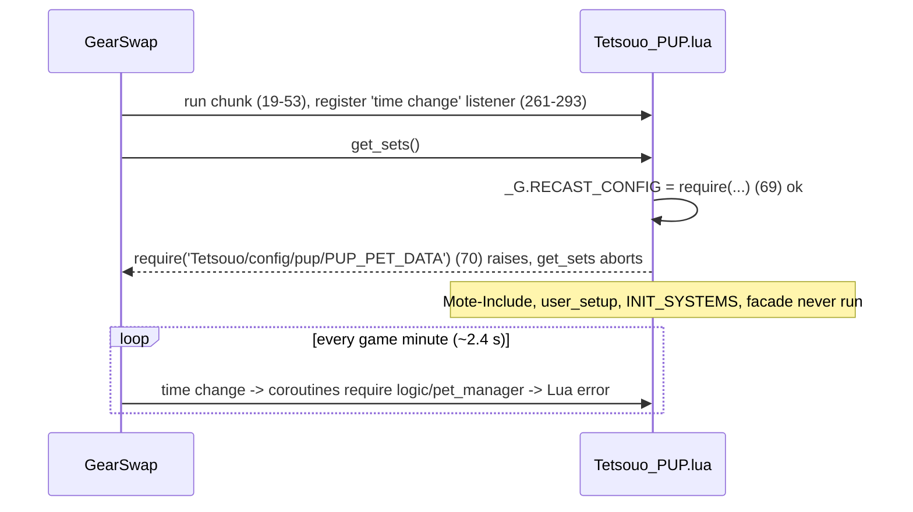

# PUP (Puppetmaster) job

PUP is a scaffold, not a working job. Its 14 hook modules under
`shared/jobs/pup/functions/` (1 394 lines) and its entry template are a copy of
the BST job with paths renamed: they handle Call Beast, broths, ecosystems and
Ready moves, which do not exist on Puppetmaster, and nothing handles the
automaton. The files they depend on were never created: there is no
`_master/config/pup/`, no `shared/jobs/pup/functions/logic/`, no PUP message
formatter, and the sets file is a 25-line skeleton. No character has a live PUP
entry (`Tetsouo/` has none; `character_db.lua` lists PUP for nobody), and
`clone_character.py` no longer offers PUP: it was removed from `ALL_VALID_JOBS`
on 2026-09-25 because the entry requires a missing config without `pcall`.

What the PUP files contain on top of the shared pipeline:

- The standard wiring (PrecastGuard, CooldownChecker, WSPrecastHandler,
  `MidcastManager` for subjob magic, `LifecycleManager` status/buff/state/
  aftercast handlers, lockstyle/macrobook factories, CommonCommands).
- BST logic under PUP names: summon-broth precast, Ready-move categorisation,
  a pet-precast hook, a Ready-move pet-midcast hook, and the BST command set
  (`ecosystem`, `species`, `broth`, `pet engage|disengage`, `rdylist`,
  `rdymove N`).
- A chunk-level `time change` listener in the entry that is meant to auto-engage
  the pet and track `PetEngaged`.

This page documents what exists, what is scaffold and what breaks. Every file
in scope was read in full. Line numbers were re-checked against the working
tree on 2026-09-25; where a line adds nothing, the function is named instead.

## Files

| Path | Lines | Role / state |
|------|------:|------|
| `_master/entry/Tetsouo_PUP.lua` | 321 | Entry template, BST structure. Requires `Tetsouo/config/pup/*` (none exists) |
| `shared/jobs/pup/functions/pup_functions.lua` | 114 | Facade: same include order as BST (29-69), requires `dualbox_manager` (105) |
| `shared/jobs/pup/functions/PUP_PRECAST.lua` | 135 | `job_precast`: guard, cooldown, WS, **Call Beast broth**, Ready-move set |
| `shared/jobs/pup/functions/PUP_MIDCAST.lua` | 245 | `job_midcast`: Ready-move sets, `handled`; `job_post_midcast`: subjob magic via `MidcastManager` |
| `shared/jobs/pup/functions/PUP_AFTERCAST.lua` | 28 | `job_aftercast = LifecycleManager.aftercast()` |
| `shared/jobs/pup/functions/PUP_PET_PRECAST.lua` | 65 | `job_pet_precast` (Reward/Killer Instinct/Spur, `Misc Idle`/`Default`): never called |
| `shared/jobs/pup/functions/PUP_PET_MIDCAST.lua` | 98 | `job_pet_midcast`: Ready-move category sets on the pet's action |
| `shared/jobs/pup/functions/PUP_IDLE.lua` / `PUP_ENGAGED.lua` | 40 + 40 | `require('.../pup/functions/logic/set_builder')` without `pcall` (file absent) |
| `shared/jobs/pup/functions/PUP_STATUS.lua` / `PUP_BUFFS.lua` | 20 + 20 | Shared `LifecycleManager` handlers (work) |
| `shared/jobs/pup/functions/PUP_COMMANDS.lua` | 461 | BST command router; 25 calls to 14 undefined `MessageFormatter.error_pup_*` / `show_pup_*` |
| `shared/jobs/pup/functions/PUP_MOVEMENT.lua` | 39 | Empty `job_handle_equipping_gear` |
| `shared/jobs/pup/functions/PUP_LOCKSTYLE.lua` / `PUP_MACROBOOK.lua` | 47 + 42 | Lazy factories on `config/pup/PUP_LOCKSTYLE` / `PUP_MACROBOOK` (factories fall back when absent) |
| `_master/sets/pup_sets.lua` | 25 | Defines `define_pup_sets()`, which nothing calls |
| `shared/data/job_abilities/PUP_JA_DATABASE.lua` + `pup/*.lua` (4 files) | 20 + 287 | `JA_DATABASE_FACTORY.create('PUP', {modules = {'subjob','mainjob','sp','pet_commands_subjob'}})`: the pet commands (Deploy, Retrieve, Deactivate, 8 maneuvers) are loaded since `45e28d9` |
| `_master/config/alt/PUP_ALT_COMMANDS.lua` | 54 | Generated alt-command config (used when the dual-box partner is PUP, not by this job) |
| `docs/user/jobs/pup/README.md` | 37 | User doc (see Known issues) |

Missing: `_master/config/pup/` (every config the entry and factories name),
`shared/jobs/pup/functions/logic/{set_builder,pet_manager,ecosystem_manager,ready_move_categorizer}.lua`,
`shared/utils/messages/formatters/jobs/message_pup.lua` and
`data/jobs/pup_messages.lua`, and a live `Tetsouo/Tetsouo_PUP.lua`.

## How it works

### Load sequence (what actually happens)

The entry has the BST shape (see [BST](bst.md#load-sequence)), so the intended
order is chunk -> `get_sets` -> Mote-Include (`user_setup`, `init_gear_sets`) ->
`INIT_SYSTEMS` -> facade. With the repo as it is, a PUP load stops early:

- `get_sets` requires `Tetsouo/config/pup/PUP_PET_DATA` and `PUP_TP_CONFIG`
  without `pcall` (`_master/entry/Tetsouo_PUP.lua:70-71`). In the sandbox
  `require` is GearSwap's `include_user`, which raises when the file is missing
  (`user_functions.lua:313-317`); GearSwap prints the error and keeps the
  default `sets` (`refresh.lua:180-183`). No hook exists, so gear never swaps.
- The chunk-level listener survives the failed `get_sets` until the next load
  (the engine unregisters it then, `refresh.lua:69-71`). On PUP it schedules one
  coroutine per game minute (two while engaged) that plain-`require`s the
  missing `shared/jobs/pup/functions/logic/pet_manager` (273-291): a Lua error
  every ~2.4 s.
- `user_setup` would also require `Tetsouo/config/pup/PUP_STATES` without
  `pcall` (131) and `pcall`-require `logic/ecosystem_manager` and
  `PUP_KEYBINDS` (138, 151).

### If the configs existed

Creating the config files moves the failures further in. Traced statically:

- **Idle/engaged**: `customize_idle_set` / `customize_melee_set` require
  `logic/set_builder` without `pcall` (`PUP_IDLE.lua:29`,
  `PUP_ENGAGED.lua:29`) and raise on every gear rebuild.
- **Midcast**: `ensure_modules_loaded` pcall-requires the missing
  `logic/ready_move_categorizer`, then calls the undefined
  `MessageFormatter.error_pup_module_not_loaded` (`PUP_MIDCAST.lua:48-50`). It
  raises before `modules_loaded = true` (54), so every `job_midcast` raises and
  Mote skips the default midcast and `job_post_midcast` for that action.
- **Commands**: the first `//gs c` of a load raises at `PUP_COMMANDS.lua:76`
  (`error_pup_module_not_loaded('EcosystemManager')`). `MessageFormatter`,
  `CommonCommands`, `UICommands`, `CycleHandler` and `MessageCommands` were
  assigned before the error, so later commands reach common commands, but
  `ecosystem`, `species`, `broth`, `pet`, `rdylist`, `rdymove` all end in a
  nil call. Mote calls `job_self_command` before its own handlers
  (`Mote-SelfCommands.lua:22-24`), so the first `gs c update` of a load is
  lost as well.
- **Sets**: `init_gear_sets` includes `sets/pup_sets.lua`, which only defines
  `define_pup_sets()` (`_master/sets/pup_sets.lua:13-25`); nothing calls it, and
  calling it would replace Mote's tables with empty ones.

### Precast

`job_precast` (`PUP_PRECAST.lua:57-110`) follows the pipeline order: guard
(61-63), cooldown unless the categoriser recognised a Ready move (66-80), WS
(83-85). Then BST logic: Call Beast / Bestial Loyalty set plus the
`sets[state.ammoSet.value].ammo` broth (88-99), and for a Ready move
`sets.precast.JA['Ready']` or `['Sic']` and `spell.ready_move_category`
(102-109). With the categoriser missing, `is_ready_move` is always false.
`job_post_precast` (117-122) applies WS TP gear.

### Pet handling

- No automaton logic exists: no maneuver tracking, no pet midcast by automaton
  head/frame or action type, no Repair/Maintenance/Overdrive/Deploy handling,
  no `job_pet_change` or `job_pet_status_change`.
- `job_pet_midcast` (`PUP_PET_MIDCAST.lua:31-86`) is called by Mote on every
  pet action (`Mote-Include.lua:312-314`). It skips the BST pet commands, asks
  the (missing) categoriser for a category and otherwise equips
  `sets.midcast.pet_physical_moves` if it exists. It does not set `handled`, so
  Mote then equips `sets.midcast.Pet` (Mote's empty table) and the pet
  aftercast restores idle/engaged gear.
- `job_pet_precast` (`PUP_PET_PRECAST.lua:20-53`) is never called: neither
  GearSwap nor Mote has a pet precast event.
- The entry's `time change` listener (261-293) calls
  `PetManager.check_and_engage_pet(get_mob_by_target('pet'))` while engaged and
  `PetManager.monitor_pet_status()` every game minute, both from the missing
  PUP `pet_manager`. The BST version of that module tests `pet.isvalid` on raw
  mob tables (see [BST Known issues](bst.md#known-issues)); a copy would inherit
  it.

### Midcast

`job_midcast` (`PUP_MIDCAST.lua:120-139`) returns for the BST pet commands in
`PRECAST_ONLY` (59-63), equips the Ready-move category set and sets `handled`.
`job_post_midcast` (217-232) notifies `MidcastWatchdog` and dispatches Healing,
Enhancing, Enfeebling, Elemental and Blue Magic to `MidcastManager`
(150-213), the skeleton shared with `BST_MIDCAST.lua`.

### Aftercast, idle, engaged, status, buffs

`job_aftercast`, `job_status_change`, `job_buff_change` and `job_state_change`
are the shared `LifecycleManager` handlers and work
([core lifecycle](../systems/core-lifecycle.md)). Idle and engaged depend on
the missing set builder. `job_handle_equipping_gear` is empty.

## Mote states

None are defined in the repo: `PUP_STATES.lua` does not exist. The code reads
`state.ammoSet` (`PUP_PRECAST.lua:92`), `state.Moving` (AutoMove) and, through
the missing logic modules, whatever the BST equivalents read
(`AutoPetEngage`, `PetEngaged`, `Ecosystem`, `species`, `WeaponSet`,
`SubSet`, `HybridMode`, `PetIdleMode`). The HUD has no PUP readiness anchor
(`ui_lifecycle.lua` `are_states_ready` returns true for PUP) and no PUP title
(`UI_FORMATTER.lua` job title table).

## Commands

`job_self_command` (`PUP_COMMANDS.lua:137-443`) is BST's router: dual-box
internals, `ui`, `debugmidcast`, `cyclestate`, watchdog, CommonCommands, then
`ecosystem`, `species`, `broth`, `pet engage|disengage`, `rdylist`,
`rdymove N` (3.0 s / 5.5 s sequence, no `rdymove` flag). None of the PUP-specific
branches can succeed (see above). There is no `debugprecast` branch, so the
common one is reachable. `job_state_change = LifecycleManager.state_change()`
(453).

## Set names the code looks up

`_master/sets/pup_sets.lua` defines no set at run time.

| Set | Looked up by | Template |
|-----|--------------|----------|
| `sets.precast.JA['Call Beast']`, `sets['<pet>']` | `PUP_PRECAST.lua:88-99` | absent |
| `sets.precast.JA['Ready']` / `['Sic']` | `PUP_PRECAST.lua:102-107` | absent |
| `sets.precast.JA['Reward']`, `['Killer Instinct']`, `['Spur']`, `['Misc Idle']`, `['Default']` | `job_pet_precast` (never called) | absent |
| `sets.midcast.pet_{physical,physicalMulti,magicAtk,magicAcc}_moves` (+ `_ww`) | `PUP_MIDCAST.lua` `set_for_category`, `PUP_PET_MIDCAST.lua` `job_pet_midcast` | absent |
| `sets.midcast['<skill>']` | `MidcastManager` | absent |
| `sets.idle`, `sets.engaged`, `sets.precast.WS`, `sets.midcast.Pet` | Mote | Mote's empty tables |

## Configuration

Every config file the code names is missing: `Tetsouo/config/pup/PUP_PET_DATA`,
`PUP_TP_CONFIG` (entry 70-71), `PUP_STATES` (131), `PUP_KEYBINDS` (151),
`config/pup/PUP_LOCKSTYLE` (`PUP_LOCKSTYLE.lua:28`, factory falls back to
lockstyle 1, `lockstyle_manager.lua` `load_config_or_fallback`),
`config/pup/PUP_MACROBOOK` (`PUP_MACROBOOK.lua:28`, factory falls back to book
1 page 1, `macrobook_manager.lua` `load_macrobooks`). The user doc's setup step "copy
`_master/config/pup/`" cannot be followed.

## State & lifetime

- `_G` written (on a load that got that far): the Mote hooks,
  `PUPBeastPetData`, `PUPTPConfig`, `PUPKeybinds`, `KeybindUI`,
  `pup_time_change_event_id`, lockstyle/macrobook globals.
- Events: the `time change` listener, registered through `user_windower` so the
  engine removes it at the next load; `file_unload` also unregisters it
  (303-306). The "cleanup previous handler" block (262-265) reads
  `_G.pup_time_change_event_id` from a fresh `_G`, so it never finds anything.
- Coroutines: 0.2 s JCM gate, 8 s lockstyle, 0.1 s listener tasks, `rdymove`
  steps. `file_unload` (301-321) unregisters the listener, cancels JCM,
  unbinds.

## Interactions

Same shared systems as BST ([precast pipeline](../systems/precast-pipeline.md),
[midcast and buffs](../systems/midcast-and-buffs.md),
[factories](../systems/factories-and-helpers.md),
[core lifecycle](../systems/core-lifecycle.md),
[UI overlay](../systems/ui-overlay.md), [dualbox](../systems/dualbox.md)).
`PUP_MIDCAST.lua:150-213` duplicates `BST_MIDCAST.lua:95-151`. The template's
`job_sub_job_change` still sends `DualBoxManager.send_job_update()`
(247-251), the pre-ba783ae pattern.

## Invariants & gotchas

- Plain `require` of a missing file raises in the sandbox; only `pcall(require)`
  is safe for optional modules, and the fallback branch must not call an
  undefined function.
- A job with no entry file in the character folder is never loaded, so the
  scaffold is harmless until someone copies the entry.
- Copying BST logic brings BST's known defects (raw-mob `isvalid`, coroutine
  `equip()`, 30 s Ready-move cache).

## Extending

To make PUP functional (minimum):

1. Replace the BST concepts in the entry (`PUPBeastPetData`, ecosystem init,
   `time change` monitor) with PUP ones, or delete them; `pcall` every config
   require.
2. Create `_master/config/pup/{PUP_STATES,PUP_KEYBINDS,PUP_LOCKSTYLE,PUP_MACROBOOK,PUP_TP_CONFIG}.lua`.
3. Create `shared/jobs/pup/functions/logic/set_builder.lua` (idle/engaged with
   automaton up or down) and a pet status source (event-driven
   `job_pet_status_change` is simpler than polling).
4. Rewrite `PUP_PRECAST`, `PUP_MIDCAST`, `PUP_PET_MIDCAST`, `PUP_COMMANDS` for
   automaton actions (maneuvers, Repair/Maintenance, Deploy/Retrieve,
   Overdrive, automaton weaponskills and spells in `sets.midcast.Pet`), and
   delete `PUP_PET_PRECAST.lua`.
5. Either add `message_pup.lua` + `pup_messages.lua` and facade wrappers, or
   call existing `MessageFormatter` functions.
6. Write real sets in `_master/sets/pup_sets.lua` (plain assignments, no
   wrapper function).

## Known issues

- **The template cannot load** (P1 if deployed; not deployed):
  `_master/entry/Tetsouo_PUP.lua:70-71,131` require missing configs without
  `pcall`; `_master/config/pup/` does not exist. The clone script no longer
  offers PUP (fixed 2026-09-25, `ALL_VALID_JOBS`), so a new clone cannot pick
  up the broken entry.
- **Error every game minute on PUP after a failed load** (P2 if deployed): the
  chunk-level listener's coroutines `require` the missing `logic/pet_manager`
  (273-291).
- **Every midcast raises** (known open): `PUP_MIDCAST.lua:48-50` calls the
  undefined `error_pup_module_not_loaded` after the categoriser fails to load.
- **Idle/engaged raise** (known open): `PUP_IDLE.lua:29`, `PUP_ENGAGED.lua:29`.
- **Commands call 14 undefined formatter functions** (25 call sites, e.g.
  `PUP_COMMANDS.lua:43,76,118,315,334,404`); no `message_pup.lua` exists.
- **The job logic is BST's** (Call Beast, broths, ecosystems, Ready moves,
  Reward/Spur) and does nothing for an automaton.
- `pup_sets.lua` wraps its tables in `define_pup_sets()`, never called.
- Fixed in `45e28d9`: `pup_pet_commands_subjob.lua` is now loaded into the JA
  database (`PUP_JA_DATABASE.lua` passes `pet_commands_subjob`).
- `job_pet_precast` is dead.
- Skeleton duplication `PUP_MIDCAST.lua:150-213` / `BST_MIDCAST.lua:95-151`
  (known open).
- User doc (`docs/user/jobs/pup/README.md`): "working 12-module structure",
  "Allows Tetsouo_PUP.lua to load without errors" (quoted skeleton comment),
  "copy `_master/config/pup/`", "PET modules for automaton command handling"
  and "no PUP-specific commands" are all untrue.
