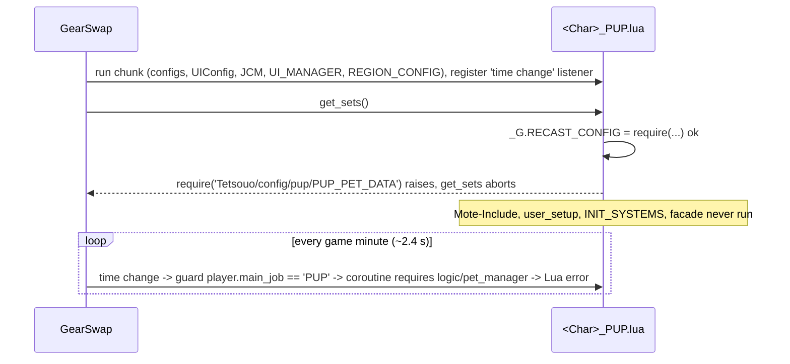

# PUP (Puppetmaster) job

PUP is a scaffold, not a working job. Its 14 hook modules under
`shared/jobs/pup/functions/` (1 394 lines) and its entry template are a copy of
the BST job with paths renamed: they handle Call Beast, broths, ecosystems and
Ready moves, which do not exist on Puppetmaster, and nothing handles the
automaton. The files they depend on were never created: there is no
`_master/config/pup/`, no `shared/jobs/pup/functions/logic/`, no PUP message
formatter, and the sets file is a 25-line skeleton. No character has a live PUP
entry and `character_db.lua` lists PUP for nobody. `clone_character.py` does not
offer PUP: it is left out of `ALL_VALID_JOBS` (with a comment) because the entry
requires a missing config without `pcall`.

What the PUP files contain on top of the shared pipeline:

- The standard wiring (PrecastGuard, CooldownChecker, WSPrecastHandler,
  `MidcastManager` for subjob magic, `LifecycleManager` status/buff/state/
  aftercast handlers, lockstyle/macrobook factories, CommonCommands).
- BST logic under PUP names: summon-broth precast, Ready-move categorisation,
  a pet-precast hook, a Ready-move pet-midcast hook, and the BST command set
  (`ecosystem`, `species`, `broth`, `pet engage|disengage`, `rdylist`,
  `rdymove N`).
- A chunk-level `time change` listener in the entry that is meant to auto-engage
  the pet and track `PetEngaged` (the pattern BST's template used before
  2026-09-27; BST now uses a `prerender` monitor, see [BST](bst.md#pet-monitor)).

Player page: [docs/user/jobs/pup/README.md](../../user/jobs/pup/README.md)
(hub with the "does not load" warning) and
[sets.md](../../user/jobs/pup/sets.md).

This page documents what exists, what is scaffold and what breaks. Every file in
scope was read in full. References are file + function; re-verified against
the working tree on 2026-09-28.

## Files

| Path | Lines | Role / state |
|------|------:|------|
| `_master/entry/Tetsouo_PUP.lua` | 322 | Entry template, BST structure (pre-2026-09-27 BST). Requires `Tetsouo/config/pup/*` (none exists) |
| `shared/jobs/pup/functions/pup_functions.lua` | 114 | Facade: same include order as BST, requires `dualbox_manager` |
| `shared/jobs/pup/functions/PUP_PRECAST.lua` | 135 | `job_precast`: guard, cooldown, WS, **Call Beast broth**, Ready-move set |
| `shared/jobs/pup/functions/PUP_MIDCAST.lua` | 245 | `job_midcast`: Ready-move sets (`ready_move_category`, `set_for_category`), `handled`; `job_post_midcast`: subjob magic via `MidcastManager` |
| `shared/jobs/pup/functions/PUP_AFTERCAST.lua` | 28 | `job_aftercast = LifecycleManager.aftercast()` |
| `shared/jobs/pup/functions/PUP_PET_PRECAST.lua` | 65 | `job_pet_precast` (Reward/Killer Instinct/Spur, `Misc Idle`/`Default`): never called |
| `shared/jobs/pup/functions/PUP_PET_MIDCAST.lua` | 98 | `job_pet_midcast`: Ready-move category sets on the pet's action |
| `shared/jobs/pup/functions/PUP_IDLE.lua` / `PUP_ENGAGED.lua` | 40 + 40 | `require('.../pup/functions/logic/set_builder')` without `pcall` (file absent) |
| `shared/jobs/pup/functions/PUP_STATUS.lua` / `PUP_BUFFS.lua` | 20 + 20 | Shared `LifecycleManager` handlers (work) |
| `shared/jobs/pup/functions/PUP_COMMANDS.lua` | 461 | BST command router; 25 calls to 14 undefined `MessageFormatter.error_pup_*` / `show_pup_*` |
| `shared/jobs/pup/functions/PUP_MOVEMENT.lua` | 39 | Empty `job_handle_equipping_gear` |
| `shared/jobs/pup/functions/PUP_LOCKSTYLE.lua` / `PUP_MACROBOOK.lua` | 47 + 42 | Lazy factories on `config/pup/PUP_LOCKSTYLE` / `PUP_MACROBOOK` (factories fall back when absent) |
| `_master/sets/pup_sets.lua` | 25 | Defines `define_pup_sets()`, which nothing calls |
| `shared/data/job_abilities/PUP_JA_DATABASE.lua` + `pup/*.lua` (4 files) | 20 + 287 | `JA_DATABASE_FACTORY.create('PUP', {modules = {'subjob','mainjob','sp','pet_commands_subjob'}})`: the pet commands (Deploy, Retrieve, Deactivate, maneuvers) are loaded |
| `_master/config/alt/PUP_ALT_COMMANDS.lua` | 54 | Generated alt-command config (used when the dual-box partner is PUP, not by this job) |

Missing: `_master/config/pup/` (every config the entry and factories name),
`shared/jobs/pup/functions/logic/{set_builder,pet_manager,ecosystem_manager,ready_move_categorizer}.lua`,
`shared/utils/messages/formatters/jobs/message_pup.lua` and
`data/jobs/pup_messages.lua`, `_master/config/pup/PUP_CUSTOM.lua` (every other
job has a `_CUSTOM` template), and any live PUP entry.

## How it works

### Load sequence (what actually happens)

The entry has the BST shape (see [BST](bst.md#load-sequence)), so the intended
order is chunk -> `get_sets` -> Mote-Include (`user_setup`, `init_gear_sets`) ->
`INIT_SYSTEMS` -> facade. With the repository as it is, a PUP load stops early:

```mermaid
sequenceDiagram
    participant GS as GearSwap
    participant E as <Char>_PUP.lua
    GS->>E: run chunk (configs, UIConfig, JCM, UI_MANAGER, REGION_CONFIG), register 'time change' listener
    GS->>E: get_sets()
    E->>E: _G.RECAST_CONFIG = require(...) ok
    E-->>GS: require('Tetsouo/config/pup/PUP_PET_DATA') raises, get_sets aborts
    Note over E: Mote-Include, user_setup, INIT_SYSTEMS, facade never run
    loop every game minute (~2.4 s)
        GS->>E: time change -> guard player.main_job == 'PUP' -> coroutine requires logic/pet_manager -> Lua error
    end
```

- `get_sets` requires `Tetsouo/config/pup/PUP_PET_DATA` and `PUP_TP_CONFIG`
  without `pcall`. In the sandbox `require` is GearSwap's `include_user`
  (`user_functions.lua`), which raises when the file is missing; GearSwap
  prints the error and keeps the default `sets` (`refresh.lua`
  `load_user_files`). No hook exists, so gear never swaps.
- The chunk-level listener survives the failed `get_sets` until the next load
  (the engine unregisters sandbox events in `load_user_files`). On PUP it
  schedules one coroutine per game minute (two while engaged) that plain-
  `require`s the missing `shared/jobs/pup/functions/logic/pet_manager`: a Lua
  error every ~2.4 s. Inferred from the code, never observed (no one loads PUP).
  It is also a plain `register_event`, which runs GearSwap's
  `refresh_globals` + `equip_sets` on each call.
- `user_setup` would also require `Tetsouo/config/pup/PUP_STATES` without
  `pcall` and `pcall`-require `logic/ecosystem_manager` and `PUP_KEYBINDS`.

### If the configs existed

Creating the config files moves the failures further in. Traced statically:

- **Idle/engaged**: `customize_idle_set` / `customize_melee_set` require
  `logic/set_builder` without `pcall` and raise on every gear rebuild.
- **Midcast**: `PUP_MIDCAST.lua` `ensure_modules_loaded` pcall-requires the
  missing `logic/ready_move_categorizer`, then calls the undefined
  `MessageFormatter.error_pup_module_not_loaded`. It raises before
  `modules_loaded = true`, so every `job_midcast` raises and Mote skips the
  default midcast and `job_post_midcast` for that action.
- **Commands**: the first `//gs c` of a load raises in `PUP_COMMANDS.lua`
  `ensure_commands_loaded` (`error_pup_module_not_loaded('EcosystemManager')`).
  `MessageFormatter`, `CommonCommands`, `WatchdogCommands`, `UICommands`,
  `CycleHandler` and `MessageCommands` were assigned before the error, so later
  commands reach the common ones, but `ecosystem`, `species`, `broth`, `pet`,
  `rdylist`, `rdymove` all end in a nil call. Mote calls `job_self_command`
  before its own handlers (`Mote-SelfCommands.lua`), so the first `gs c update`
  of a load is lost as well.
- **Sets**: `init_gear_sets` includes `sets/pup_sets.lua`, which only defines
  `define_pup_sets()`; nothing calls it, and calling it would replace Mote's
  tables with empty ones.
- **Keys**: no `PUP_KEYBINDS.lua`, so no job keys, no common keys, no Combat
  Mode or Treasure Mode row ([keybinds and custom](../systems/keybinds-and-custom.md)).

### Precast

`job_precast` follows the pipeline order: guard, cooldown unless the
categoriser recognised a Ready move, WS. Then BST logic: Call Beast / Bestial
Loyalty set plus the `sets[state.ammoSet.value].ammo` broth, and for a Ready
move `sets.precast.JA['Ready']` or `['Sic']` and `spell.ready_move_category`.
With the categoriser missing, `is_ready_move` is always false. Unlike BST, the
cooldown skip depends on the categoriser, not on `spell.type == 'Monster'`.
`job_post_precast` applies WS TP gear.

### Pet handling

- No automaton logic exists: no maneuver tracking, no pet midcast by automaton
  head/frame or action type, no Repair/Maintenance/Overdrive/Deploy handling,
  no `job_pet_change` or `job_pet_status_change`.
- `job_pet_midcast` is called by Mote on every pet action (`Mote-Include.lua`
  `pet_midcast`). It skips the BST pet commands, asks the (missing)
  categoriser for a category and otherwise equips
  `sets.midcast.pet_physical_moves` if it exists. It does not set `handled`, so
  Mote then equips `sets.midcast.Pet` (Mote's empty table) and the pet
  aftercast restores idle/engaged gear.
- `job_pet_precast` is never called: neither GearSwap nor Mote has a pet
  precast event.
- The entry's `time change` listener calls
  `PetManager.check_and_engage_pet(get_mob_by_target('pet'))` while engaged and
  `PetManager.monitor_pet_status()` every game minute, both from the missing
  PUP `pet_manager`. The BST module of the same name has both functions and
  tests `pet.id` (fixed 2026-09-27); a copy of an older version would test
  `isvalid` on raw mobs and always see no pet.

### Midcast

`job_midcast` returns for the BST pet commands in `PRECAST_ONLY`, equips the
Ready-move category set and sets `handled`. `job_post_midcast` notifies
`MidcastWatchdog` and dispatches Healing, Enhancing, Enfeebling, Elemental and
Blue Magic to `MidcastManager`, the skeleton shared with `BST_MIDCAST.lua`.

### Aftercast, idle, engaged, status, buffs

`job_aftercast`, `job_status_change`, `job_buff_change` and `job_state_change`
are the shared `LifecycleManager` handlers and work
([core lifecycle](../systems/core-lifecycle.md)). Idle and engaged depend on the
missing set builder. `job_handle_equipping_gear` is empty.

## Mote states

None are defined in the repository: `PUP_STATES.lua` does not exist. The code
reads `state.ammoSet` (`job_precast`), `state.Moving` (AutoMove) and, through
the missing logic modules, whatever the BST equivalents read (`AutoPetEngage`,
`PetEngaged`, `Ecosystem`, `species`, `WeaponSet`, `SubSet`, `HybridMode`,
`PetIdleMode`). The HUD has no PUP readiness anchor (`ui_lifecycle.lua`
`are_states_ready` returns true for PUP) and no PUP title (`UI_FORMATTER.lua`
job title table).

## Commands

`job_self_command` is BST's router: dual-box internals, `ui`,
`debugmidcast`, `cyclestate`, watchdog, CommonCommands, then `ecosystem`,
`species`, `broth`, `pet engage|disengage`, `rdylist`, `rdymove N` (3.0 s /
5.5 s sequence, no `rdymove` flag). None of the PUP-specific branches can
succeed (see above). There is no `debugprecast` branch, so the common one is
reachable. `job_state_change = LifecycleManager.state_change()`.

## Set names the code looks up

`_master/sets/pup_sets.lua` defines no set at run time. Player version:
[sets.md](../../user/jobs/pup/sets.md).

| Set | Looked up by | Template |
|-----|--------------|----------|
| `sets.precast.JA['Call Beast']`, `sets['<pet>']` | `job_precast` | absent |
| `sets.precast.JA['Ready']` / `['Sic']` | `job_precast` | absent |
| `sets.precast.JA['Reward']`, `['Killer Instinct']`, `['Spur']`, `['Misc Idle']`, `['Default']` | `job_pet_precast` (never called) | absent |
| `sets.midcast.pet_{physical,physicalMulti,magicAtk,magicAcc}_moves` (+ `_ww`) | `PUP_MIDCAST.lua` `set_for_category`, `PUP_PET_MIDCAST.lua` `job_pet_midcast` | absent |
| `sets.midcast['<skill>']` | `MidcastManager` | absent |
| `sets.idle`, `sets.engaged`, `sets.precast.WS`, `sets.midcast.Pet` | Mote | Mote's empty tables |

## Configuration

Every config file the code names is missing: `Tetsouo/config/pup/PUP_PET_DATA`,
`PUP_TP_CONFIG` (entry `get_sets`), `PUP_STATES`, `PUP_KEYBINDS` (entry
`user_setup`), `config/pup/PUP_LOCKSTYLE` (`PUP_LOCKSTYLE.lua`, factory falls
back to lockstyle 1, `lockstyle_manager.lua` `load_config_or_fallback`),
`config/pup/PUP_MACROBOOK` (`PUP_MACROBOOK.lua`, factory falls back to book 1
page 1, `macrobook_manager.lua` `load_macrobooks`).

## State & lifetime

- `_G` written (on a load that got that far): the Mote hooks,
  `PUPBeastPetData`, `PUPTPConfig`, `PUPKeybinds`, `KeybindUI`,
  `pup_time_change_event_id`, lockstyle/macrobook globals.
- Events: the `time change` listener, registered through the sandbox's
  `register_event` so the engine removes it at the next load; `file_unload`
  also unregisters it. The "cleanup previous handler" block at the top of the
  listener section reads `_G.pup_time_change_event_id` from a fresh `_G`, so it
  never finds anything.
- Coroutines: 0.2 s JCM gate, 8 s lockstyle, 0.1 s listener tasks, `rdymove`
  steps. `file_unload` unregisters the listener, cancels JCM, unbinds.

## Interactions

Same shared systems as BST ([precast pipeline](../systems/precast-pipeline.md),
[midcast and buffs](../systems/midcast-and-buffs.md),
[factories](../systems/factories-and-helpers.md),
[core lifecycle](../systems/core-lifecycle.md),
[UI overlay](../systems/ui-overlay.md), [dualbox](../systems/dualbox.md)).
The five `job_post_midcast_*` handlers of `PUP_MIDCAST.lua` duplicate those of
`BST_MIDCAST.lua`. The template's `job_sub_job_change` still calls
`DualBoxManager.send_job_update()` itself, while the other templates rely on
the module's auto-init from `user_setup` (the facade's require also triggers
it here).

## Invariants & gotchas

- Plain `require` of a missing file raises in the sandbox; only `pcall(require)`
  is safe for optional modules, and the fallback branch must not call an
  undefined function.
- A job with no entry file in the character folder is never loaded, so the
  scaffold is harmless until someone copies the entry by hand.
- Copying BST logic brings BST's known defects (coroutine `equip()`, 30 s
  Ready-move cache not keyed on the pet).

## Extending

To make PUP functional (minimum):

1. Replace the BST concepts in the entry (`PUPBeastPetData`, ecosystem init,
   `time change` monitor) with PUP ones, or delete them; `pcall` every config
   require. Take the current BST entry as the model (prerender monitor through
   `raw_register_event`, dual-box require in `user_setup`).
2. Create `_master/config/pup/{PUP_STATES,PUP_KEYBINDS,PUP_CUSTOM,PUP_HUD,PUP_LOCKSTYLE,PUP_MACROBOOK,PUP_TP_CONFIG}.lua`.
3. Create `shared/jobs/pup/functions/logic/set_builder.lua` (idle/engaged with
   automaton up or down) and a pet status source (event-driven
   `job_pet_status_change` is simpler than polling).
4. Rewrite `PUP_PRECAST`, `PUP_MIDCAST`, `PUP_PET_MIDCAST`, `PUP_COMMANDS` for
   automaton actions (maneuvers, Repair/Maintenance, Deploy/Retrieve,
   Overdrive, automaton weaponskills and spells in `sets.midcast.Pet`), and
   delete `PUP_PET_PRECAST.lua`.
5. Either add `message_pup.lua` + `pup_messages.lua` and facade wrappers, or
   call existing `MessageFormatter` functions.
6. Write real sets in `_master/sets/pup_sets.lua` (plain assignments, no
   wrapper function).
7. Add PUP back to `ALL_VALID_JOBS` in `clone_character.py`, and to the HUD
   readiness and title tables.

## For maintainers / AI

**Invariants to keep until PUP is rewritten**

- Keep PUP out of `ALL_VALID_JOBS`: a clone would copy an entry that aborts
  `get_sets` and leaves an erroring listener behind.
- Do not "fix" PUP by copying BST logic modules under `pup/`: it would load, but
  it would drive jugs and Ready moves on a job that has neither. The logic has
  to be written for the automaton.
- PUP shares `CommonCommands`, `LifecycleManager`, `MidcastManager` and the
  factories with every job: a change there needs no PUP-specific care, and PUP
  cannot serve as a test of it.

**Traps**

- Documentation and audits that count "16 jobs wired to the 9 systems" include
  PUP on paper only: its files call the systems, but nothing of it has run.
- `rg` / Grep skip the gitignored character folders; a PUP entry could exist in
  a character folder that is not tracked. Check with `grep -r` before claiming
  none exists (none did on 2026-09-28).
- The undefined `MessageFormatter.error_pup_*` / `show_pup_*` calls do not fail
  at load, only when their branch runs: a load test alone will not find them.

**Offline testing**

- Syntax: `for f in shared/jobs/pup/functions/*.lua _master/entry/Tetsouo_PUP.lua _master/sets/pup_sets.lua; do luac5.1 -p "$f"; done`
  (all parse on 2026-09-28).
- Missing modules: `grep -n "require" shared/jobs/pup/functions/*.lua` and
  check each path exists; undefined formatter functions:
  `grep -on "MessageFormatter\.[a-z_]*pup[a-z_]*" shared/jobs/pup/functions/*.lua`
  against `shared/utils/messages/` (no match there today).
- Anything past that needs the game (`//lua reload gearswap` on PUP), after the
  configs exist.

## Known issues

- **The template cannot load** (P1 if deployed; not deployed): the entry's
  `get_sets` and `user_setup` require missing configs without `pcall`;
  `_master/config/pup/` does not exist. The clone script does not offer PUP, so
  a new clone cannot pick up the broken entry.
- **Error every game minute on PUP after a failed load** (P2 if deployed,
  inferred): the chunk-level listener's coroutines `require` the missing
  `logic/pet_manager`.
- **Every midcast raises** (known open): `PUP_MIDCAST.lua`
  `ensure_modules_loaded` calls the undefined `error_pup_module_not_loaded`
  after the categoriser fails to load.
- **Idle/engaged raise** (known open): `PUP_IDLE.lua` / `PUP_ENGAGED.lua`
  plain-require the missing set builder.
- **Commands call 14 undefined formatter functions** (25 call sites in
  `PUP_COMMANDS.lua`, 1 more in `PUP_MIDCAST.lua`); no `message_pup.lua`
  exists.
- **The job logic is BST's** (Call Beast, broths, ecosystems, Ready moves,
  Reward/Spur) and does nothing for an automaton.
- `pup_sets.lua` wraps its tables in `define_pup_sets()`, never called.
- `job_pet_precast` is dead.
- Skeleton duplication of the subjob-magic handlers with `BST_MIDCAST.lua`
  (known open).
- Fixed 2026-09-28: the user README no longer claims a working structure or a
  `config/pup/` to copy; it is a hub with the "does not load" warning.
