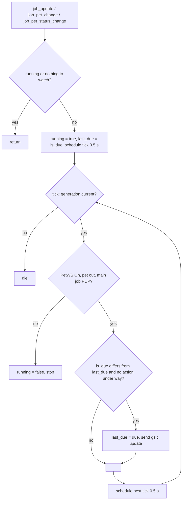

# PUP (Puppetmaster) job

PUP was rewritten on 2026-09-29. Until then it was a copy of the BST code
(jugs, Ready moves, ecosystems) that did not even load: its entry file required
a `pup/` folder that did not exist. It is now a thin job built on the
shared systems, like BLU: 12 hook modules plus 3 logic modules under
`shared/jobs/pup/functions/`, a template entry point, seven config files and
one sets file. GearSwap loads it when the main job becomes PUP (the entry file
`<Character>_PUP.lua`, made from `_master/entry/Tetsouo_PUP.lua` by the clone
script, which offers PUP again).

Player-facing pages: [hub](../../user/jobs/pup/README.md),
[modes](../../user/jobs/pup/states.md), [sets](../../user/jobs/pup/sets.md).

What PUP adds on top of the shared pipeline:

- **Pet Mode from the automaton's head**: `state.PetMode` (Melee, Tank, Ranged,
  Magic, Heal, Nuke) is set from the head the game reports
  (`windower.ffxi.get_mjob_data()`), the frame when the head is unknown.
- **Pet layers** in the idle and engaged sets: `sets.idle.Pet`,
  `sets.idle.Pet.Engaged[PetMode]`, `sets.engaged.Pet` (you and the automaton
  both fighting).
- **Automaton weaponskill gear laid in advance**: `sets.midcast.Pet.WeaponSkill
  [PetMode]` on top of idle / engaged while the automaton fights with enough
  TP, timed by a 0.5 s poll.
- **Overdrive layer**: `sets.buff.Overdrive` while the buff is up.
- **Maneuvers**: one set for all eight (`sets.precast.JA.Maneuver`, through
  `job_get_spell_map`); on recast they are cancelled like any ability (one shared 10-second recast, no charges).
- One job command, `//gs c petmode [auto]`.

## Files

| Path | Lines | Role |
|------|------:|------|
| `_master/entry/Tetsouo_PUP.lua` | 210 | Entry (template): config preload, `get_sets`, `job_sub_job_change`, `user_setup` (+ first PetMode detection), `job_update` (PetMode, poll, HUD), `init_gear_sets`, `file_unload` (+ poll stop) |
| `shared/jobs/pup/functions/pup_functions.lua` | 67 | Facade: includes `message_buffs` and the 12 hook files, requires `dualbox_manager`, debug line |
| `shared/jobs/pup/functions/PUP_PRECAST.lua` | 108 | `job_precast` (guard, cooldown, WS handler) / `job_post_precast` (TP gear) |
| `shared/jobs/pup/functions/PUP_MIDCAST.lua` | 99 | `job_midcast` (empty) / `job_post_midcast` (subjob magic via MidcastManager) / `job_get_spell_map` (Maneuver) |
| `shared/jobs/pup/functions/PUP_PET_MIDCAST.lua` | 58 | `job_pet_midcast`: automaton weaponskills; automaton spells left to Mote |
| `shared/jobs/pup/functions/PUP_AFTERCAST.lua` | 21 | `job_aftercast = LifecycleManager.aftercast()` |
| `shared/jobs/pup/functions/PUP_IDLE.lua` | 31 | `customize_idle_set` -> `SetBuilder.build_idle_set` |
| `shared/jobs/pup/functions/PUP_ENGAGED.lua` | 31 | `customize_melee_set` -> `SetBuilder.build_engaged_set` |
| `shared/jobs/pup/functions/PUP_STATUS.lua` | 55 | `job_status_change` (LifecycleManager), `job_pet_change`, `job_pet_status_change` |
| `shared/jobs/pup/functions/PUP_BUFFS.lua` | 23 | `LifecycleManager.buff_change` + `refresh_after_buff` (Overdrive) |
| `shared/jobs/pup/functions/PUP_COMMANDS.lua` | 158 | `job_self_command` router (+ `petmode`), `job_state_change = LifecycleManager.state_change()` |
| `shared/jobs/pup/functions/PUP_MOVEMENT.lua` | 16 | Header only (`return {}`), kept for the 12-module layout |
| `shared/jobs/pup/functions/PUP_LOCKSTYLE.lua` | 45 | Lazy `LockstyleManager.create('PUP', 'pup/display/PUP_LOCKSTYLE', 1, 'WAR')` wrappers |
| `shared/jobs/pup/functions/PUP_MACROBOOK.lua` | 37 | Lazy `MacrobookManager.create('PUP', 'pup/display/PUP_MACROBOOK', 'WAR', 1, 1)` wrapper |
| `shared/jobs/pup/functions/logic/automaton.lua` | 151 | Live reads: pet out / fighting / TP; head and frame; `refresh_mode` |
| `shared/jobs/pup/functions/logic/pet_ws.lua` | 117 | `is_due`, `threshold`, the poll (`ensure_running`, `stop`) |
| `shared/jobs/pup/functions/logic/set_builder.lua` | 181 | Idle and engaged: master base, town, pet layers, Overdrive, pet WS, Mote layers, weapon, movement |
| `_master/config/pup/PUP_STATES.lua` | 83 | Mote mode options, `MainWeapon`, `PetMode`, `PetWS`, `FastCast`, `AutoMedicine` |
| `_master/config/pup/PUP_KEYBINDS.lua` | 37 | Data only: 5 entries (+ 1 commented per-weapon example) handed to `KeybindManager.create('PUP', ...)` |
| `_master/config/pup/PUP_TP_CONFIG.lua` | 49 | `pieces` (Moonshade 250), empty `weapons`, `pet_ws_tp = 1000`, `get_weapon_bonus`, sets `_G.PUPTPConfig` |
| `_master/config/pup/PUP_CUSTOM.lua` | 119 | Player modes and gear rules, commented examples only |
| `_master/config/pup/PUP_HUD.lua` | 31 | HUD section / row order (empty = default) |
| `_master/config/pup/PUP_LOCKSTYLE.lua` | 27 | `default = 1`, empty `by_subjob` |
| `_master/config/pup/PUP_MACROBOOK.lua` | 30 | `default` book 1 page 1, empty `solo` and `dualbox` |
| `_master/sets/pup_sets.lua` | 155 | Template sets: every set the code reads, all empty |
| `_master/config/alt/PUP_ALT_COMMANDS.lua` | - | Dual-box commands for a PUP partner (read by the main's alt system, not by the PUP job file) |

Removed on 2026-09-29: `PUP_PET_PRECAST.lua` (`job_pet_precast` is called by
neither Mote nor the GearSwap engine), the `time change` listener of the entry,
every BST concept (Ready moves, jugs, Call Beast, ecosystems, species, broth,
`rdylist` / `rdymove` commands) and the references to logic modules that never
existed (`ecosystem_manager`, `pet_manager`, `ready_move_categorizer`).

Shared files changed for PUP:

- None in the recast checker: maneuvers share one 10-second recast (id 210)
  and have no charges (up to three can be active at once, but each use waits
  for the recast), so `CooldownChecker` cancels a maneuver on recast like any
  other ability.
- `shared/utils/core/lifecycle_manager.lua`: `Overdrive` added to
  `GEAR_BUFFS`, so `refresh_after_buff('Overdrive')` rebuilds the gear 0.1 s
  after the buff comes or goes. No other job gets that buff.

## How it works

### Load sequence

Same shape as BLU ([core lifecycle](../systems/core-lifecycle.md#how-a-job-file-boots)):
Mote-Include calls `user_setup()` and `init_gear_sets()` from inside
`include('Mote-Include.lua')`, before `INIT_SYSTEMS` and before the PUP hook
files exist. The entry sets `_G.RegionConfig` first, then loads the UI config
(`config_loader`), as the WAR entry does.

`user_setup()`:

1. `PUPStates.configure()` creates the states (see [Mote states](#mote-states)).
2. `Automaton.refresh_mode(true)`: PetMode from the automaton's head before the
   HUD first draws it (the HUD caches what it reads in `user_setup`).
3. `PUP_KEYBINDS` into the global `PUPKeybinds`, `bind_all()` (whose intro
   requires `PUP_MACROBOOK` / `PUP_LOCKSTYLE` and so defines their globals);
   a failed require prints `[PUP] Keybinds failed to load: <error>`.
4. `KeybindUI.smart_init("PUP", init_delay)`.
5. `JobChangeManager.initialize()`; macro book at once, lockstyle after
   `LockstyleConfig.initial_load_delay`.
6. `pcall(require, 'shared/utils/dualbox/dualbox_manager')`.

`get_sets()` then sets `_G.LockstyleConfig`, `_G.RECAST_CONFIG`,
`_G.PUPTPConfig`, cancels pending job-change work, includes the facade and
registers `cancel_pup_lockstyle_operations`.

`job_update` (every `gs c update`, cycle, set, toggle; Mote calls it before it
equips): `Automaton.refresh_mode()`, `PetWS.ensure_running()`, `KeybindUI.update()`.

`file_unload`: `PetWS.stop()` first (GearSwap runs `file_unload` under one
`pcall`), then `JobChangeManager.cancel_all()`, then `PUPKeybinds.unbind_all()`.

### Reading the automaton

`logic/automaton.lua` reads the game, never GearSwap's `pet` copy: `pet` is
refreshed only at the start of a GearSwap event, and the poll runs in a
coroutine. The set builder uses the same reads, so the poll and the gear it
asks for agree.

| Read | Source | Fallback |
|------|--------|----------|
| out | `windower.ffxi.get_mob_by_target('pet') ~= nil` | - |
| fighting | that mob's `status == 1` (a number there; `'Engaged'` accepted too) | - |
| TP | `gearswap._ExtraData.pet.tp`: GearSwap writes it from packets 0x067 / 0x068 as they arrive (`packet_parsing.lua`), 0-3000, and empties it when the pet goes | `pet.tp` (the same number, copied into `pet` by `refresh_globals`) |
| head, frame | `windower.ffxi.get_mjob_data()` `head` / `frame` item ids, named through `res.items`, only while `get_player().main_job == 'PUP'` | `pet.head` / `pet.frame` (GearSwap sets them from the same call) |

`gearswap` is the addon's own `_G`, which GearSwap puts in the job
environment (`refresh.lua`, `user_env.gearswap`); other shared code reads
`gearswap.equip_list` and `gearswap.res` the same way. The mob's own `tp` field
is not used: GearSwap divides it by 10 when it builds `pet`, and the packet
value then overwrites it, which says nothing reliable about its scale.

### PetMode

| Head | PetMode |
|------|---------|
| Harlequin Head | Melee |
| Valoredge Head | Tank |
| Sharpshot Head | Ranged |
| Stormwaker Head | Magic |
| Soulsoother Head | Heal |
| Spiritreaver Head | Nuke |

An unknown head falls back to the frame (Harlequin / Valoredge / Sharpshot /
Stormwaker Frame -> Melee / Tank / Ranged / Magic); neither known: PetMode is
left as it is.

`Automaton.refresh_mode(force)` sets `state.PetMode` when forced, or when the
`head|frame` pair read differs from the last detection (a module local).
Callers: `user_setup` (forced), `job_pet_change` on a gained pet (forced),
`job_update` (not forced), `//gs c petmode auto` (forced).

**Design choice: a value cycled by hand holds** until the head or frame
changes or a new automaton comes out. Without the "changed since last
detection" test, `job_update` (which every cycle runs) would undo the cycle at
once. A reload resets every state and detects again.

### Precast

`job_precast`: PrecastGuard, then `CooldownChecker` by action type (abilities
and spells), `eventArgs.cancel` return, then `WSPrecastHandler.handle(spell,
eventArgs, PUPTPConfig)`. `job_post_precast` lays the TP bonus piece. Nothing
PUP does can drop a tier, so there is no exception before the cooldown check.

Mote's own precast picks the set. Maneuvers are `PetCommand` in the game's
data: Mote looks for `sets.precast.PetCommand` first and, not finding it, uses
`sets.precast.JA`; there it tries the name, then the spell map, which
`job_get_spell_map` makes `Maneuver` for every name ending in ` Maneuver`. So
`sets.precast.JA.Maneuver` covers all eight, and a set named after one
maneuver wins. Deploy, Retrieve and the other pet commands go the same way
(`sets.precast.JA['Deploy']` if the player adds it).

### Midcast (the master)

Mote-Globals' `user_midcast` equips `sets.midcast.FastRecast` first for every
spell. Mote's default midcast then picks by name / map / skill / type
(`sets.midcast.Utsusemi` for Utsusemi by its map). `job_post_midcast`:
`MidcastDeps.load()`, watchdog notify, return for anything that is not magic
with a skill, then `MidcastManager.select_set` on the skill, with
`target_func` / enhancing family for Enhancing Magic and the enfeebling type
database for Enfeebling Magic. `select_set` equips nothing when
`sets.midcast[skill]` does not exist, so the template's Utsusemi keeps Mote's
pick.

### The automaton's actions

GearSwap calls `pet_midcast` on the automaton's "readies" packet: at the start
of a spell, and as a weaponskill goes off.

- **Spells** (`action_type == 'Magic'`): `job_pet_midcast` returns, Mote's
  `default_pet_midcast` runs `get_pet_midcast_set`: `sets.midcast.Pet` then,
  through `select_specific_set`, the spell name, the spell map (`Cure`...), the
  skill (`'Healing Magic'`, `'Elemental Magic'`, `'Enfeebling Magic'`,
  `'Enhancing Magic'`, `'Dark Magic'`), the spell type, then a `CastingMode`
  child. Nothing PUP-specific was needed.
- **Anything else** (weaponskills): if `sets.midcast.Pet[<name>]` exists,
  `job_pet_midcast` returns and Mote picks it; otherwise it equips
  `sets.midcast.Pet.WeaponSkill[PetMode]` (or `.WeaponSkill`) and sets
  `eventArgs.handled`.

Mote's `pet_aftercast` puts the idle / engaged gear back. The custom gear
(`PUP_CUSTOM.lua`) is never laid on pet actions: the custom hooks wrap
`cleanup_precast` / `cleanup_midcast` only, and pet commands (`PetCommand`) are
in `custom_guards.lua`'s hands-off types.

### Automaton weaponskill gear: the poll

The weaponskill's `pet_midcast` comes too late for its gear to count, so the
gear goes on before. `PetWS.is_due()`: `state.PetWS == 'On'`, automaton
fighting, and its TP >= `PetWS.threshold()` (`PUPTPConfig.pet_ws_tp`, 1000 when
missing). The set builder lays the WS set whenever it is due.

The TP crossing the line is no GearSwap event, hence `logic/pet_ws.lua`'s poll:

```mermaid
flowchart TD
    E[job_update / job_pet_change / job_pet_status_change] --> R{running or nothing to watch?}
    R -- yes --> X[return]
    R -- no --> S[running = true, last_due = is_due, schedule tick 0.5 s]
    S --> T{tick: generation current?}
    T -- no --> D[die]
    T -- yes --> W{PetWS On, pet out, main job PUP?}
    W -- no --> F[running = false, stop]
    W -- yes --> Q{is_due differs from last_due and no action under way?}
    Q -- yes --> U[last_due = due, send gs c update]
    Q -- no --> N[ ]
    U --> N
    N --> T2[schedule next tick 0.5 s]
    T2 --> T
```

- A coroutine, not `register_event('prerender')`: a listener registered from a
  job file runs `refresh_globals` and `equip_sets` on every call.
- `gs c update` (a new event) and not `equip()`: an `equip` from a coroutine
  is lost.
- During an action of the player or the pet (`midaction()` /
  `pet_midaction()`) the flip is not recorded, so the next tick tries again;
  the action's aftercast rebuilds the gear anyway.
- Generation: `windower._pup_pet_ws_seq` (on `windower`, which outlives the
  sandbox) is bumped when `pet_ws.lua` loads and by `PetWS.stop()`
  (`file_unload`). A tick of an older generation returns, so a reload or a job
  change ends the old loop within 0.5 s.
- Cost while running: two `get_mob_by_target('pet')`, one `get_player()` and a
  table read every 0.5 s; nothing when no pet is out or Pet WS is Off.

### Idle and engaged

`logic/set_builder.lua` replaces Mote's base for both.

Idle (`build_idle_set`):

1. `master_idle`: `sets.idle.DT` under HybridMode DT when defined; else Mote's
   base, except that Mote's own walk goes into `sets.idle.Pet(.Engaged)` while
   a pet is out (`get_idle_set`), and that pick is replaced by `sets.idle`.
2. `BaseSetBuilder.select_idle_base_town`: `sets.idle.Town` / `sets.Adoulin`
   on top in a city (Mote's `sets.idle.Town` base is rebuilt as the field idle
   plus Town on top).
3. `pet_idle_layer`: pet fighting -> `sets.idle.Pet.Engaged[PetMode]` or
   `sets.idle.Pet.Engaged`; pet out -> `sets.idle.Pet`; `set_combine` on top.
4. `finish`: `sets.buff.Overdrive` (buffactive), the pet WS set when due,
   Mote's defense / Kiting layers, `BaseSetBuilder.lay_weapons` (MainWeapon).
5. `BaseSetBuilder.apply_movement` outside a city.

Engaged (`build_engaged_set` / `select_engaged_base`): group `sets.engaged`,
or `sets.engaged.Pet` when it exists and the automaton fights; then
`group[OffenseMode]` when a table; then under HybridMode DT the level's `.DT`,
else the group's `.DT`. Then `finish` as above.

Trace lines (`//gs c trace on`): `IDLE <base>, pet mode <m>, on top: ...` and
`ENGAGED <path>, pet mode <m>, on top: ...`.

`job_pet_status_change` equips (`handle_equipping_gear(player.status)`) unless
an action is under way: Mote equips nothing on a pet status change, and the
pet layers depend on it. `job_pet_change` needs nothing more: Mote's
`pet_change` equips after it.

Overdrive: `job_buff_change` = `LifecycleManager.buff_change` + 
`refresh_after_buff(buff)`, which sends `gs c update` 0.1 s after an
Overdrive gain or loss (inside `buff_change`, `buffactive` still holds the old
list).

## Mote states

Created by `PUPStates.configure()` on every `user_setup()`.

| State | Values (template) | Default | Key | Read by |
|-------|--------|---------|-----|---------|
| `MainWeapon` | Free | Free | `^numpad1` | `BaseSetBuilder.lay_weapons` |
| `OffenseMode` (Mote) | Normal, Acc | Normal | `^numpad2`, Mote's `f9` | `select_engaged_base`; Mote's WS mode fallback |
| `HybridMode` (Mote) | Normal, DT | Normal | `^numpad9`, Mote's `^f9` | `master_idle`, `select_engaged_base` |
| `PetMode` | Melee, Tank, Ranged, Magic, Heal, Nuke | set from the head (Melee before) | `^numpad3` | `pet_idle_layer`, pet WS set, `job_pet_midcast` |
| `PetWS` | On, Off | On | `^numpad4` (row in the modes section: `section = "mode"`, its name holds `WS`) | `PetWS.is_due` / poll |
| `FastCast` | 0..80 by 10 | 0 | none | midcast watchdog fallback estimate |
| `AutoMedicine` | ON, OFF | persisted | `#numpad0` (common key) | `AutoMedicine.init` |
| `IdleMode`, `CastingMode`, `WeaponskillMode`, `RangedMode` (Mote) | Normal | Normal | Mote's F-keys | Mote only (`CastingMode` refines Mote's pet spell set) |
| `CombatMode`, `TreasureMode` (optional states) | | Off | hidden | shared hooks |
| `JumpAuto` (created by `AutoJump.attach`) | Off, On | Off | `!numpad-`, shown on /DRG only | `auto_jump.lua`, through `WSPrecastHandler.handle` |

## Commands

`job_self_command` (`PUP_COMMANDS.lua`): `altjobupdate` / `requestjob`,
`petmode`, watchdog, `CommonCommands.handle_command(command, 'PUP',
table.unpack(args))`, UI, `debugmidcast`, `cyclestate`; anything else falls to
Mote and then to the alt commands.

`//gs c petmode`: one `InfoBlock` (`PUP :: Automaton`) with head, frame, the
mode they give, PetMode in use, Pet WS, the automaton's state and its TP /
threshold (green when WS gear is due). `//gs c petmode auto` first runs
`refresh_mode(true)` and sends `gs c update`.

## Set names the code looks up

T = `_master/sets/pup_sets.lua`. Player version:
[sets.md](../../user/jobs/pup/sets.md).

| Set | Looked up by | T |
|-----|--------------|---|
| `sets[MainWeapon]` | `WeaponResolver.set_for` | example only |
| `sets.MoveSpeed`, `sets.Kiting` | `BaseSetBuilder.apply_movement`, Mote Kiting | yes |
| `sets.Adoulin` | `BaseSetBuilder` | commented |
| `sets.buff.Overdrive` | `lay_pet_layers` | yes |
| `sets.buff.Doom` | DoomManager | yes |
| `sets.precast.JA[<name>]` (Activate, Deus Ex Automata, Repair, Maintenance, Overdrive, Tactical Switch, Ventriloquy, Role Reversal, Cooldown), `sets.precast.JA.Maneuver` | Mote default precast (+ `job_get_spell_map`) | yes |
| `sets.precast.Waltz`, `['Healing Waltz']` | Mote | yes |
| `sets.precast.FC`, `.FC.Utsusemi` | Mote | yes |
| `sets.precast.WS`, `.WS.Acc`, `WS['Victory Smite' / 'Shijin Spiral' / 'Stringing Pummel' / 'Howling Fist' / 'Asuran Fists']` | Mote | yes |
| `sets.midcast.FastRecast`, `.Utsusemi` | Mote-Globals / Mote | yes |
| `sets.midcast.Pet.WeaponSkill`, `.Melee`, `.Tank`, `.Ranged` (any PetMode child works) | `lay_pet_layers`, `job_pet_midcast` | yes |
| `sets.midcast.Pet[<ws name>]` | Mote (`job_pet_midcast` defers to it) | commented |
| `sets.midcast.Pet.Cure`, `['Elemental Magic']`, `['Enfeebling Magic']` (and `['Healing Magic']`, `['Enhancing Magic']`, `['Dark Magic']`, names) | Mote `get_pet_midcast_set` | first three |
| `sets.resting` | Mote | yes |
| `sets.idle`, `.DT`, `.Town` | `master_idle`, `BaseSetBuilder` | yes |
| `sets.idle.Pet`, `.Pet.Engaged`, `.Pet.Engaged[PetMode]` (six) | `pet_idle_layer` | yes |
| `sets.engaged`, `.Acc`, `.DT` | `select_engaged_base` | yes |
| `sets.engaged.Pet`, `.Pet.DT` (and `.Pet.Acc`, `.Pet.Acc.DT`) | `select_engaged_base` | first two |
| `sets.defense.PDT` / `.MDT` | Mote defense layer | no |
| `sets.TreasureHunter` | shared Treasure Hunter | commented |

## Configuration

| File / key | Default | Read by |
|------------|---------|---------|
| `<char>/pup/PUP_STATES.lua` | see states | entry `user_setup` |
| `<char>/pup/PUP_KEYBINDS.lua` | 5 entries | entry `user_setup`, `file_unload` |
| `<char>/pup/PUP_TP_CONFIG.lua` `pieces`, `weapons` | Moonshade 250 | `WSPrecastHandler` |
| `<char>/pup/PUP_TP_CONFIG.lua` `pet_ws_tp` | 1000 | `PetWS.threshold` |
| `<char>/pup/PUP_CUSTOM.lua` | examples only | shared custom states |
| `<char>/pup/PUP_HUD.lua` | empty | HUD |
| `<char>/pup/PUP_LOCKSTYLE.lua`, `PUP_MACROBOOK.lua` | 1 / book 1 page 1 | factories |

`character_db.lua` still lists PUP in `ARCHIVE_JOBS` (no character plays it).
That list is only read by the Lua side of the DB; `clone_character.py` offers
every job of `ALL_VALID_JOBS` for a character the DB does not know, so a PUP
clone works without touching it.

## Left out on purpose (later options)

Automatic maneuvers, automatic Repair, automatic Deploy, pet enmity gear
(Ventriloquy / Provoke on the automaton), a party announce of automaton
weaponskills. The attachments and the automaton's MP / HP are not read.

## Needs an in-game check

- The pet TP source: `gearswap._ExtraData.pet.tp` is expected 0-3000 as sent by
  the server; `//gs c petmode` prints it next to the threshold.
- That `windower.ffxi.get_mob_by_target('pet').status` reads 1 while the
  automaton fights (the pet layers and the poll depend on it).
- How early the WS gear must be on: the poll's 0.5 s step against the
  automaton's own WS timing at 1000 TP. Raise `pet_ws_tp` if the automaton
  holds its TP.
