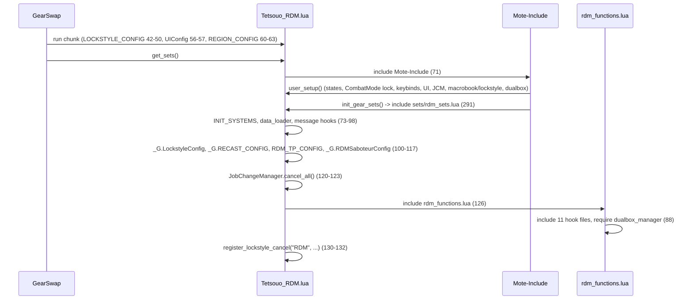
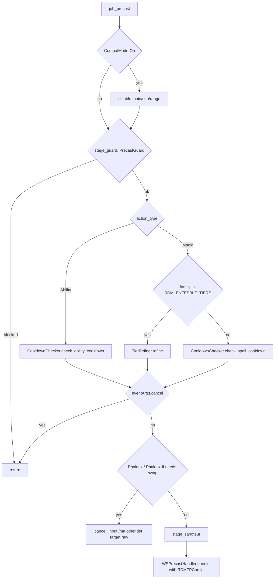

# RDM (Red Mage) job

The RDM job is a caster/melee hybrid built mostly from shared systems: 12 hook
modules plus one logic module under `shared/jobs/rdm/functions/` (1 811 lines),
an entry point per character (template + Kaories overlay), six config files and
one sets file. GearSwap loads it when the main job becomes RDM
(`Tetsouo_RDM.lua`, or `Kaories_RDM.lua` for Kaories, who is the only character
that plays RDM live). From then on Mote-Include calls its hooks on every action,
on status and buff changes, on `//gs c` commands and on state cycles.

What RDM adds on top of the shared pipeline:

- **Enfeeble tier refinement** in precast: Dia III, Distract III, Slow II and
  the other families listed in `RDM_ENFEEBLE_TIERS.lua` go through the shared
  `TierRefiner` instead of `CooldownChecker`, so a spell on recast is replaced
  by the next castable lower tier.
- **Phalanx tier by target**: Phalanx II on yourself becomes Phalanx, Phalanx on
  someone else becomes Phalanx II.
- **Auto-Saboteur** before the enfeebles listed in `RDM_SABOTEUR_CONFIG.lua`
  when `SaboteurMode` is On (through the shared `AbilityHelper`).
- **Skill-routed midcast** through `MidcastManager` with the enfeebling type
  database, the enhancing family database and the Composure target, plus a
  Saboteur hands overlay and an Accession + Phalanx exception.
- **Weapon states and dual-wield detection** for idle/engaged sets
  (`MainWeapon`, `SubWeapon`, `EngagedMode`, `.DW` variants, `sets.shields`),
  and a `CombatMode` weapon lock.
- **State-driven cast commands** (`castlight`, `castenspell`, `castgain`, ...)
  and a catch-all that turns any unknown command into `/ja`, `/ws` or `/ma`.

Every file in scope was read in full except the gear content of the sets files
(only structure and set names were read, as gear choice is out of scope). All
line numbers refer to the working tree on 2026-09-19.

## Files

| Path | Lines | Role |
|------|------:|------|
| `_master/entry/Tetsouo_RDM.lua` | 309 | Entry (template): config preload, `get_sets`, `job_sub_job_change`, `user_setup`, `job_update` (CombatMode lock), `init_gear_sets`, `file_unload` |
| `_master/Kaories/entry/Kaories_RDM.lua` | 307 | Kaories overlay entry: identical except `Kaories/...` paths and two comments (see below) |
| `shared/jobs/rdm/functions/rdm_functions.lua` | 92 | Facade: includes the 11 hook files, requires `dualbox_manager` (88) |
| `shared/jobs/rdm/functions/RDM_PRECAST.lua` | 366 | `job_precast` as four stages (guard, cooldown/refine, Phalanx, Saboteur) + WS; `job_post_precast` (TP gear, spell FC set, `debugprecast` trace) |
| `shared/jobs/rdm/functions/RDM_MIDCAST.lua` | 384 | `job_midcast` (empty) / `job_post_midcast`: `SKILL_HANDLERS` table dispatch to `MidcastManager` |
| `shared/jobs/rdm/functions/RDM_AFTERCAST.lua` | 23 | `job_aftercast = LifecycleManager.aftercast()` |
| `shared/jobs/rdm/functions/RDM_IDLE.lua` | 43 | `customize_idle_set` -> `SetBuilder.build_idle_set` |
| `shared/jobs/rdm/functions/RDM_ENGAGED.lua` | 43 | `customize_melee_set` -> `SetBuilder.build_engaged_set` |
| `shared/jobs/rdm/functions/RDM_STATUS.lua` | 19 | `job_status_change = LifecycleManager.status_change()` |
| `shared/jobs/rdm/functions/RDM_BUFFS.lua` | 19 | `job_buff_change = LifecycleManager.buff_change()` |
| `shared/jobs/rdm/functions/RDM_COMMANDS.lua` | 437 | `job_self_command` router (cast-by-name fallback resolved from `res`) and `job_state_change` (UI refresh, weapon re-equip on key or description) |
| `shared/jobs/rdm/functions/RDM_MOVEMENT.lua` | 47 | Empty `job_handle_equipping_gear` |
| `shared/jobs/rdm/functions/RDM_LOCKSTYLE.lua` | 53 | Lazy `LockstyleManager.create('RDM', 'config/rdm/RDM_LOCKSTYLE', 1, 'NIN')` wrappers |
| `shared/jobs/rdm/functions/RDM_MACROBOOK.lua` | 48 | Lazy `MacrobookManager.create('RDM', ..., 'NIN', 1, 1)` wrapper |
| `shared/jobs/rdm/functions/logic/set_builder.lua` | 259 | Idle/engaged construction: mode sets, shield/DW detection, weapons, town, movement |
| `shared/data/spells/RDM_ENFEEBLE_TIERS.lua` | 55 | Tier correspondence for 11 enfeeble families, read by `RDM_PRECAST.lua:65` |
| `shared/data/magic/ENFEEBLING_MAGIC_DATABASE.lua` (+ `enfeebling/*.lua`) | - | `get_enfeebling_type` (macc, mnd_potency, int_potency, skill_potency, skill_mnd_potency, potency, duration) |
| `shared/data/magic/ENHANCING_MAGIC_DATABASE.lua` (+ `enhancing/*.lua`) | - | `get_spell_family` (Enspell, Gain, BarElement, BarAilment, Refresh, Regen, Phalanx, Stoneskin, Aquaveil, Spikes, Boost, Storm) |
| `_master/config/rdm/RDM_STATES.lua` | 381 | All states (`configure`), `configure_storm`, unused `validate` |
| `_master/config/rdm/RDM_KEYBINDS.lua` | 148 | 16 binds (Storm only on /SCH), `get_active_binds` / `bind_all` (unbinds the whole list first) / `unbind_all` / `show_intro` |
| `_master/config/rdm/RDM_LOCKSTYLE.lua` | 26 | `default = 1`, `by_subjob` |
| `_master/config/rdm/RDM_MACROBOOK.lua` | 42 | `default` book 2 page 1, `solo[sub]`, empty `dualbox` |
| `_master/config/rdm/RDM_SABOTEUR_CONFIG.lua` | 40 | `auto_trigger_spells` (Distract III, Gravity II), `wait_time = 2` |
| `_master/config/rdm/RDM_TP_CONFIG.lua` | 75 | `pieces` (Moonshade 250), `get_weapon_bonus`, sets `_G.RDMTPConfig` (73) |
| `_master/sets/rdm_sets.lua` | 537 | Template sets (flat) |
| `_master/Kaories/sets/rdm_sets.lua` | 537 | Overlay sets (Viti. Tabard +4 instead of +3 at 182, 264, 354) |
| `_master/Kaories/config/rdm/*` | 7 files | Identical to the template configs, plus `RDM_REFILL.lua` (22) |
| `shared/utils/messages/formatters/jobs/message_rdm.lua` + `data/jobs/rdm_messages.lua` | 167 + 107 | RDM chat messages (errors, Phalanx swap, storm) |
| `shared/utils/messages/formatters/jobs/message_rdm_midcast.lua` + `data/systems/rdm_midcast_messages.lua` | 203 + 24 | `debugmidcast` trace lines |

Live copies (gitignored): `Kaories/Kaories_RDM.lua` (identical to the overlay
entry), `Kaories/config/rdm/*` (identical to the overlay except
`RDM_STATES.lua:91,93,110`: `Maxentius` replaces `Daybreak`, default
`MainWeapon` is `Maxentius`, default `CombatMode` is `On`), and
`Kaories/sets/rdm_sets.lua` (634 lines, reformatted, adds `sets['Maxentius']`
at 45 and `sets.precast.WS['Black Halo']` at 574). The live Kaories files are
ahead of the overlay. `Tetsouo/` has no RDM files; `Hysoka/` and
`Gabvanstronger/` are frozen and out of scope.

The overlay entry differs from the template only in the character name of every
config path (`Kaories_RDM.lua:42,57,60,101,105,108,150,192,215`), the
position of the "DUALBOX IPC" comment in `job_sub_job_change`, and the older
wording of the dual-box comment in `user_setup` (247-248).

## How it works

### Load sequence

GearSwap runs the entry chunk, then `get_sets()`. Mote-Include calls
`user_setup()` and `init_gear_sets()` from inside `include('Mote-Include.lua')`,
before `INIT_SYSTEMS` and before the RDM hook files exist (see
[core lifecycle](../systems/core-lifecycle.md#how-a-job-file-boots)).

`user_setup()` (`Tetsouo_RDM.lua:188-253`):

1. `RDMStates.configure()` creates every state (see [Mote states](#mote-states)),
   including `Storm` when the subjob is SCH.
2. If `CombatMode` is On, `disable('main','sub','range')` and an info line
   (205-211). The template default is Off; the live Kaories default is On.
3. `require` of `RDM_KEYBINDS`, stored in the global `RDMKeybinds`, then
   `bind_all()`: `unbind` of all 16 keys, then `bind` of the binds
   `get_active_binds()` keeps for the subjob (15, or 16 on /SCH), then
   `show_intro()` (`RDM_KEYBINDS.lua:76-108`). `show_intro` `require`s
   `RDM_MACROBOOK.lua` and `RDM_LOCKSTYLE.lua` (127, 134); both files return nothing, so the intro falls
   back to `show_system_intro`, but executing them defines the globals
   `select_default_macro_book` and `select_default_lockstyle` as a side effect.
4. `KeybindUI.smart_init("RDM", init_delay)`.
5. `JobChangeManager.initialize()`; because of step 3 the gate at 240 passes on
   a fresh load, so the macro book is set at once and the lockstyle is
   scheduled after `LockstyleConfig.initial_load_delay` (8 s).
6. `pcall(require, 'shared/utils/dualbox/dualbox_manager')`.

The facade (`rdm_functions.lua`) includes `RDM_LOCKSTYLE`, `RDM_MACROBOOK` (32,
34), `RDM_PRECAST`, `RDM_MIDCAST`, `RDM_AFTERCAST` (41-45), `RDM_IDLE`,
`RDM_ENGAGED` (52-54), `RDM_STATUS`, `RDM_BUFFS` (61-63), `RDM_MOVEMENT` (70),
`RDM_COMMANDS` (77), then requires `dualbox_manager` (88). Every hook file
lazy-loads its dependencies on first use. `RDM_PRECAST.lua:88,91` capture
`_G.RDMTPConfig` and `_G.RDMSaboteurConfig` at include time; the entry sets both
before the facade include, so the captures are valid.

### Precast

`job_precast` (`RDM_PRECAST.lua:250-283`):

- The weapon lock at 256-258 runs before anything else, for every action.
- `get_enfeeble_tiers` (75-81) takes the first word of `spell.name`
  (`^(%a+)`) and looks it up in `RDM_ENFEEBLE_TIERS.TIERS`: Dia, Bio, Distract,
  Frazzle (III -> II -> base), Blind, Slow, Paralyze, Poison, Addle, Sleep,
  Gravity (II -> base). The lookup runs for every spell, not only enfeebles,
  so Bio (Dark Magic) is refined too. Base-tier spells of these families (Dia,
  Slow, ...) also go through `TierRefiner`, which lets them through when their
  recast is 0 and cancels with a multi-line recast display otherwise.
- `TierRefiner.refine` is described in
  [precast pipeline](../systems/precast-pipeline.md#tier-refinement): first
  castable tier (recast exactly 0 and enough MP), replacement through
  `wait 0.1; @input /ma "<new>" <target.raw>`, 0.2 s re-entry guard. Its return
  value is ignored at 162 (Known issues).
- `stage_phalanx` (184-213): only Enhancing Magic named Phalanx / Phalanx II;
  `is_self` compares `spell.target.name` with `player.name`. A swap cancels and
  sends `input /ma "<other>" <target.raw>` (no guard: the re-sent cast already
  has the right tier, so it passes).
- `stage_saboteur` (217-248): Enfeebling Magic only, `SaboteurMode` On, and the
  spell's English name listed in `auto_trigger_spells`. It calls
  `AbilityHelper.try_ability_smart(spell, eventArgs, 'Saboteur', wait_time)`,
  which, when Saboteur is ready and not up, calls `cancel_spell()`, sets
  `eventArgs.handled`, sends `input /ja "Saboteur" <me>` and replays the
  spell through `follow_up` once Saboteur registers, rather than after a
  fixed `wait 2` (`ability_helper.lua:146-235`). Because only `handled` is
  set, Mote skips the default precast but still runs `job_post_precast`.
- `WSPrecastHandler.handle` is called for every action (it returns true for
  non-WS). `RDMTPConfig` defines `pieces` and `get_weapon_bonus`, so the TP
  calculator works for RDM (compare BLM).
- `job_post_precast` (331-352): `WSPrecastHandler.apply_tp_gear`, then
  `sets.precast.FC[spell.english]` when it exists (only `Stoneskin` in the sets).
  With `_G.PrecastDebugState` (`//gs c debugprecast`) it prints the set that
  `describe_equipped_set` (298-329) believes Mote chose. That function reports
  "No FC (Chainspell active)" under Chainspell, but no code skips the FC set
  under Chainspell. A ranged attack, recognised by
  `spell.action_type == 'Ranged Attack'` (324; `/ra` has `type` `'Misc'`), is
  reported as `sets.precast.RA`.

### Midcast

Mote equips its default midcast set first (spell name, spell map, skill,
`CastingMode`), then calls `job_post_midcast` (`RDM_MIDCAST.lua:342-369`):
watchdog notify (346-348), then `SKILL_HANDLERS[spell.skill]` (329-335).

| Skill | Handler | `MidcastManager.select_set` config | Overrides after |
|-------|---------|------------------------------------|-----------------|
| Enfeebling Magic | `midcast_enfeebling` (93-148) | `mode_state = EnfeebleMode`, `database_func = get_enfeebling_type` | `sets.midcast['Enfeebling Magic'].Saboteur` while `buffactive['Saboteur']` (140-145) |
| Enhancing Magic | `midcast_enhancing` (193-236) | `mode_state = state.EnhancingMode` (never defined, always nil), `target_func = get_enhancing_target`, `database_func = get_spell_family` | Accession + `^Phalanx` short-circuits to `equip(sets.midcast['Enhancing Magic'])` before the manager (206-213) |
| Healing Magic | `midcast_healing` (241-258) | skill + spell | - |
| Elemental Magic | `midcast_elemental` (263-281) | `mode_state = NukeMode` | - |
| Dark Magic | `midcast_dark` (286-303) | skill + spell | - |
| other | `midcast_subjob` (308-325) | never reached (`spell.type == 'Magic'` at 362 is never true) | - |

How the [standard chain](../systems/midcast-and-buffs.md#standard-chain-every-skill-except-singing)
resolves RDM casts with the template sets:

- Enfeebles: every spell in the enfeebling database has a type, and every type
  has a set under `sets.midcast['Enfeebling Magic']` (`macc`, `mnd_potency`,
  `int_potency`, `skill_potency`, `skill_mnd_potency`, `potency`, `duration`).
  P3 (`base[type][mode]`) never exists, so P7 `base[type]` wins and the
  `EnfeebleMode` sets (`.Potency`, `.Mixed`, `.Acc`) are never reached. See
  Known issues.
- Refresh / Regen / Phalanx: P1 finds `sets.midcast.Refresh` (etc.) on self,
  `sets.midcast.Refresh.Composure` on others under Composure (`target_func`
  returns `'Composure'` only when the target is not the player).
- Enspells, Gains, Bar-spells, Spikes, Aquaveil: P6 `sets.midcast[family]`
  (root sets at `_master/sets/rdm_sets.lua:427-432`). `BarAilment` family set
  exists; Boost and Storm fall to the base.
- Temper, Stoneskin, Impact, Stun, Drain, Aspir: P0/P1 by name.
- Haste II on others with Composure: P5 `base.Composure`.
- Cures: P1 `sets.midcast.Cure` / `Curaga` (tier stripped); `CureSelf` is never
  looked up.
- Elemental: `NukeMode` values are `FreeNuke` and `Magic Burst` (with a space);
  P8 finds `base.FreeNuke` / `base['Magic Burst']`.

The Saboteur overlay is a full set (`set_combine` of the base plus hands), so
while Saboteur is up it replaces whatever type set the manager chose.

### Aftercast, idle, engaged, status, buffs

- `job_aftercast`, `job_status_change`, `job_buff_change` are the shared
  `LifecycleManager` handlers (watchdog notify, Doom handling), see
  [core lifecycle](../systems/core-lifecycle.md#lifecyclemanager).
- `customize_idle_set` -> `SetBuilder.build_idle_set` (`set_builder.lua:232-253`):
  `sets.idle[IdleMode]` (29-48; falls back to `sets.idle.PDT` when
  `HybridMode = PDT`, unreachable because `IdleMode` always has a set) ->
  `BaseSetBuilder.select_idle_base_town` (198: `sets.Adoulin` in Adoulin,
  `sets.idle.Town` in other cities, Dynamis excluded) -> weapons -> `sets.MoveSpeed`
  outside town when `state.Moving.value == 'true'`.
- `customize_melee_set` -> `build_engaged_set` (207-223):
  `select_engaged_base` (57-99) picks `sets.engaged[EngagedMode]`, or its `.DW`
  child when the sub weapon is not a shield. The sub weapon comes from
  `state.SubWeapon` whenever it is not `'None'` (it never is), so the equipped
  item is never consulted. `has_shield_equipped` (160-182) treats nil, `""`,
  `'empty'` and any name in `sets.shields` as single-wield.
- `apply_weapon` (110-147) combines `sets[state.MainWeapon.current]` and
  `sets[state.SubWeapon.current]` unless `CombatMode` is On. With
  `SubWeapon = Malevolence` (a dagger) the `.DW` set is chosen and the dagger is
  equipped whatever the subjob, so it only works on /NIN or /DNC.
- Mote's own base (`sets.idle[scope][IdleMode]`, `sets.engaged` + OffenseMode
  `Normal`) is discarded by the builders.
- `job_handle_equipping_gear` is empty (`RDM_MOVEMENT.lua:36-39`).

## Mote states

Created by `RDMStates.configure()` (`_master/config/rdm/RDM_STATES.lua:56-284`)
on every `user_setup()` (every load and every subjob change, so values reset).
Keybinds from `RDM_KEYBINDS.lua:19-51`; `^` = Ctrl, `#` = Apps. The file's
headers call the second group "Alt+NUMPAD", but the binds use `^`.

| State | Values | Default | Key | Read by |
|-------|--------|---------|-----|---------|
| `HybridMode` (Mote) | PDT, Normal | Normal | none | `set_builder.lua:41,92` fallback only (unreachable) |
| `EngagedMode` | DT, Acc, TP, Enspell | DT | `^numpad6` | `set_builder.lua:59-88` |
| `IdleMode` (replaced) | Refresh, DT | Refresh | `^numpad4` | Mote `get_idle_set`, `set_builder.lua:31-37` |
| `MainWeapon` | Naegling, Colada, Daybreak (live: Maxentius) | Naegling (live: Maxentius) | `^numpad1` | `set_builder.lua:121-131`, `job_state_change` re-equip |
| `SubWeapon` | Ammurapi, Genmei, Malevolence | Genmei | `^numpad2` | `set_builder.lua:65-66,134-144` |
| `CombatMode` | Off, On | Off (live: On) | `^numpad5` | entry `user_setup`/`job_sub_job_change`/`job_update`, `RDM_PRECAST.lua:256`, `set_builder.lua:116` |
| `EnfeebleMode` | Potency, Skill, Duration | Potency | `^numpad3` | `RDM_MIDCAST.lua:130` (no effect, see Known issues) |
| `NukeMode` | FreeNuke, Magic Burst | FreeNuke | `^numpad7` | `RDM_MIDCAST.lua:273` |
| `MainLightSpell` / `SubLightSpell` | Fire, Aero, Thunder | Fire / Thunder | none | `castlight` / `castsublight` |
| `MainDarkSpell` / `SubDarkSpell` | Blizzard, Stone, Water | Blizzard / Stone | none | `castdark` / `castsubdark` |
| `NukeTier` | V, IV, III, II, I | V | `^numpad8` | `cast*` nuke commands (`I` = base spell) |
| `EnSpell` | Enfire..Enwater (6) | Enfire | `^numpad.` | `castenspell`, `enspell` (no arg) |
| `GainSpell` | Gain-STR..Gain-CHR (7) | Gain-STR | `^numpad+` | `castgain` |
| `Barspell` | Barfire..Barwater (6) | Barfire | `^numpad-` | `castbar` |
| `BarAilment` | 8 ailments | Baramnesia | `^numpad*` | `castbarailment` |
| `Spike` | Blaze/Ice/Shock Spikes | Blaze Spikes | `^numpad/` | `castspike` |
| `SaboteurMode` | Off, On | Off | `^numpad0` | `RDM_PRECAST.lua:230` |
| `Storm` (only with /SCH) | 8 storms | Firestorm | `#numpad1` (bound on /SCH only) | `caststorm`, `cyclestorm` |
| `FastCast` | 0..80 | 80 | none | `midcast_watchdog.lua:58-60` |
| `AutoMedicine` | shared | persisted | `#numpad0` | `AutoMedicine.init` (280-283), see [precast pipeline](../systems/precast-pipeline.md) |

`configure_storm` (293-314) creates `state.Storm` when the subjob is SCH and it
does not exist yet, and sets it to nil otherwise. The `#numpad1` bind carries
`subjob = "SCH"`: `get_active_binds` (`RDM_KEYBINDS.lua:61-73`) leaves it out on
any other subjob, and `bind_all` unbinds the whole list first, so the key is
freed after leaving /SCH. The HUD shows the same filtered list (`UI_LOADER`
calls `get_active_binds`). Mote's `OffenseMode` and `CastingMode`
keep their `'Normal'` defaults and are read only by Mote.

## Commands

`job_self_command` (`RDM_COMMANDS.lua:146-394`) lowercases the first word and
tests, in order: dual-box internals, UI, watchdog, **CommonCommands**, Mote's
own commands (any key of `selfCommandMaps`, read with `rawget` so the alt's
commands do not count; returned unhandled so Mote runs them, 214-221),
`debugmidcast`, `cyclestate`, RDM commands, and finally a catch-all.

| Command | Effect | Handler |
|---------|--------|---------|
| `altjobupdate` / `requestjob` | Dual-box job exchange | 160-176 |
| `ui ...` | UI toggles | 183-187 |
| `watchdog ...` | MidcastWatchdog commands | 190-195 |
| common commands | `reload`, `checksets`, `wa`, `wo`, `refill`, `craft`, `naked`, `help`, `lockstyle`, warp... | 198-208 -> `CommonCommands.handle_command(command, 'RDM', table.unpack(args))` |
| `update`, `cycle`, `set`, `unset`, `showtp`, ... (Mote) | Left unhandled for Mote | 218-221 |
| `debugmidcast` | Toggle `MidcastManager` debug | 227-237 |
| `cyclestate <State>` | `CycleHandler.handle_cyclestate` (every keybind) | 246-249 |
| `enspell <element>` | `input /ma "En<element>" <me>` (fire, ice/blizzard, wind/aero, earth/stone, thunder, water) | 255-281 |
| `enspell` | Cycle `EnSpell` silently, call `job_update()` | 282-291 |
| `convert` / `chainspell` / `saboteur` / `composure` | `input /ja "<Name>" <me>` | 293-296 |
| `castlight` / `castsublight` / `castdark` / `castsubdark` | `input /ma "<Element> <NukeTier>" <t>` | 298-318 |
| `castenspell` / `castgain` / `castbar` / `castbarailment` / `castspike` / `caststorm` | `input /ma "<state value>" <me>` | 320-337 |
| `cyclestorm` | Cycle `Storm` with a message, or "requires SCH" | 339-348 |
| anything else | Catch-all: the words are a JA, WS or spell name (optional last word `<target>`, default `<me>`), resolved by `resolve_action_prefix` (49-61) from the game resources in the order `res.job_abilities` (only prefix `/jobability`: the 51 pet moves that share a spell's name, such as Fire II or Hastega, are skipped), `res.weapon_skills`, `res.spells`; a name that is no action but that `selfCommandMaps` answers (the dual-box alt's commands) is left unhandled for Mote; anything else -> "Command not recognized" | 350-393 |

The catch-all sets `eventArgs.handled` only when it sends an action or prints
the error (381, 388). A name that is no action but that `selfCommandMaps`
answers is returned unhandled (383-386): Mote then runs it, and for a name Mote
lacks, the `__index` that `AltCommands.install_fallback` puts on the table sends
it to the alt ([dualbox](../systems/dualbox.md#alt-command-routing)).
`ensure_commands_loaded` (24-33) loads only the command modules; no action
database is loaded by `//gs c`. A name is accepted when the game knows it, not
only when the player's jobs can use it: another job's ability goes out as `/ja`
and the game refuses it (the old universal JA database held the main and sub
job only).

`job_state_change` (408-429): skips `Moving`, refreshes the UI, and on
`MainWeapon` / `SubWeapon` calls Mote's `handle_equipping_gear(player.status)`.
It compares the field with spaces stripped (420), so both the description
(`Main Weapon`, passed by Mote's cycle and by the UI-aware `cyclestate`) and
the key (`MainWeapon`) match.
It does not handle `CombatMode`: that lock lives in the entry's `job_update`
(261-284; enable is skipped while `_G.__CraftManagerState.active`) and in
`job_precast`.

## Set names the code looks up

T = `_master/sets/rdm_sets.lua`, K = `Kaories/sets/rdm_sets.lua` (live). The
overlay `_master/Kaories/sets/rdm_sets.lua` has the same line numbers as T.

| Set | Looked up by | T | K |
|-----|--------------|---|---|
| `sets['Naegling']`, `['Daybreak']`, `['Colada']` (K adds `['Maxentius']`) | `apply_weapon` via `MainWeapon` | 43-45 | 43-46 |
| `sets['Ammurapi']`, `['Genmei']`, `['Malevolence']` | `apply_weapon` via `SubWeapon` | 48-50 | 49-51 |
| `sets.shields` (list) | `has_shield_equipped` | 53 | 54 |
| `sets.idle.DT`, `sets.idle.Refresh` | `select_idle_base`, Mote | 71, 94 | 72, 95 |
| `sets.idle.PDT`, `sets.engaged.PDT` | HybridMode fallback | **absent** | **absent** |
| `sets.idle.Town`, `sets.Adoulin`, `sets.MoveSpeed` | `BaseSetBuilder` | 520, 515, 510 | 612, 603, 598 |
| `sets.engaged.DT/Acc/TP/Enspell` + `.DW` | `select_engaged_base` | 108-167 | 113-177 |
| `sets.engaged.Refresh` (+ `.DW`) | nothing (`EngagedMode` has no Refresh) | 135, 161 | 144, 171 |
| `sets.precast.FC`, `.FC['Stoneskin']` | Mote default precast, `job_post_precast` | 179, 199 | 189, 209 |
| `sets.precast.JA['Chainspell']`, `['Convert']` | Mote default precast | 211, 217 | 225, 231 |
| `sets.precast.WS` + Savage Blade, Sanguine, Seraph, Chant du Cygne, Requiescat (K adds Black Halo) | Mote default precast | 464-504 | 530-574 |
| `sets.midcast['Enfeebling Magic']` + 7 type sets | MidcastManager P7/P9 | 290-328 | 302-377 |
| `sets.midcast['Enfeebling Magic'].Potency`, `.Mixed`, `.Acc` | EnfeebleMode (never reached) | 332-338 | 381-387 |
| `sets.midcast['Enfeebling Magic'].Skill`, `.Duration` | EnfeebleMode Skill/Duration | **absent** | **absent** |
| `sets.midcast['Enfeebling Magic'].Saboteur` | `RDM_MIDCAST.lua:140` | 341 | 390 |
| `sets.midcast['Enhancing Magic']`, `.Composure` | MidcastManager P9/P5, Accession Phalanx | 349, 370 | 402, 424 |
| `sets.midcast.Refresh/Regen/Phalanx` (+ `.Composure`), `.Stoneskin`, `.Temper` | P0/P1 | 389-419, 437 | 443-481, 503 |
| `sets.midcast.Enspell/Gain/BarElement/BarAilment/Spikes/Aquaveil` | P6 family | 427-432 | 493-498 |
| `sets.midcast['Healing Magic']`, `.Cure`, `.Curaga` | MidcastManager | 259-281 | 271-293 |
| `sets.midcast.CureSelf` | nothing | 284 | 296 |
| `sets.midcast['Elemental Magic']`, `.FreeNuke`, `['Magic Burst']` | NukeMode P8 | 230-253 | 242-265 |
| `sets.midcast['Dark Magic']`, `.Impact`, `.Stun`, `.Drain`, `.Aspir` | MidcastManager / Mote | 444-457 | 510-523 |
| `sets.buff.Doom` | shared DoomManager | 532 | 629 |

## Configuration

| File / key | Default | Where the default lives | Read by |
|------------|---------|-------------------------|---------|
| `<char>/config/rdm/RDM_STATES.lua` | see states | file | entry `user_setup`, `job_sub_job_change` (hard-coded `Tetsouo/` or `Kaories/`) |
| `<char>/config/rdm/RDM_KEYBINDS.lua` | 16 binds | file | entry `user_setup`, `file_unload` |
| `<char>/config/rdm/RDM_LOCKSTYLE.lua` `default`, `by_subjob` | 1 | file; factory argument 1 | `LockstyleManager` reads `default`; there is no `get_style`, so `by_subjob` is never read ([factories](../systems/factories-and-helpers.md#configuration)) |
| `<char>/config/rdm/RDM_MACROBOOK.lua` | book 2 page 1 for every subjob | file; factory fallback 1/1 | `MacrobookManager` |
| `<char>/config/rdm/RDM_SABOTEUR_CONFIG.lua` `auto_trigger_spells`, `wait_time` | Distract III, Gravity II; 2 | file; entry fallback `{}` / 2 (`Tetsouo_RDM.lua:113-116`) | `stage_saboteur` |
| `<char>/config/rdm/RDM_TP_CONFIG.lua` -> `_G.RDMTPConfig` | Moonshade 250 | file | `WSPrecastHandler` / `TPBonusCalculator` |
| `<char>/config/rdm/RDM_REFILL.lua` (overlay + live only) | Panacea, Antacid, Holy Water, Remedy, Echo Drops, Vile Elixirs, Tropical Crepe; `store_bag = 'case'` | file | `refill/config_resolver.lua` |
| `shared/data/spells/RDM_ENFEEBLE_TIERS.lua` | 11 families | file | `RDM_PRECAST.lua:65` |
| `<char>/config/LOCKSTYLE_CONFIG.lua`, `REGION_CONFIG.lua`, `RECAST_CONFIG.lua`, UI config | shared | entry fallbacks 45-49 | entry |

## State & lifetime

- Module state: lazy-load locals, `TierRefiner.last_replacement_time`
  (module-local in the shared refiner). All die on `gs reload`.
- `_G` written: the Mote hooks (`job_precast`, `job_post_precast`,
  `job_midcast`, `job_post_midcast`, `job_aftercast`, `job_status_change`,
  `job_buff_change`, `customize_idle_set`, `customize_melee_set`,
  `job_self_command`, `job_state_change`, `job_handle_equipping_gear`,
  `job_update`), `RDMKeybinds`, `RDMTPConfig`, `RDMSaboteurConfig`,
  `LockstyleConfig`, `RECAST_CONFIG`, `RegionConfig`, `PrecastDebugState`
  (initialised to false, 101-103), `select_default_lockstyle`,
  `cancel_rdm_lockstyle_operations`, `select_default_macro_book`, plus the
  factory exports.
- `_G` read: `MidcastManagerDebugState`, `MidcastWatchdog`,
  `__CraftManagerState`, `UIConfig`.
- `windower.*`: RDM code writes nothing and registers no events.
- Keybinds: bound in `user_setup`, unbound in `file_unload` (306-308).
- Slot locks: `disable('main','sub','range')` lives in GearSwap's
  `disable_table` and survives `gs reload`, subjob and main job changes. RDM
  re-applies or releases it from `user_setup` (On only), `job_sub_job_change`
  (both ways, no craft check) and `job_update` (both ways, craft-aware).
- Coroutines: the 8 s lockstyle from `user_setup`; `wait N` chains
  (Saboteur, refinement) sit in the Windower queue and survive a reload.
- Subjob change: Mote calls `user_setup()` again (states reset), then
  `job_sub_job_change` (148-182), which re-runs `configure_storm`, re-applies the
  weapon lock and hands over to `JobChangeManager.on_job_change`, which schedules
  a `gs reload` 0.5 s later ([job change lifecycle](../architecture/job-change-lifecycle.md)).

## Interactions

- Precast: `PrecastGuard`, `CooldownChecker`, `TierRefiner` (shared with
  [BLM](blm.md)), `AbilityHelper` (shared with [PLD](pld.md) and DNC),
  `WSPrecastHandler` ([precast pipeline](../systems/precast-pipeline.md)).
- Midcast: `MidcastManager`, `MidcastWatchdog`, the enfeebling and enhancing
  databases ([midcast and buffs](../systems/midcast-and-buffs.md),
  [spell databases](../data/spell-databases.md)).
- Messages: `message_rdm` (lazy through `MessageFormatter`), `message_rdm_midcast`,
  `message_precast`, `message_commands` ([messages](../systems/messages.md)).
- `BaseSetBuilder`, lockstyle/macrobook factories, `JobChangeManager`,
  `LifecycleManager`, `CycleHandler`, `CommonCommands`, UI, dual-box.
- The cast-by-name fallback reads the game resources (`res.job_abilities`,
  `res.weapon_skills`, `res.spells`) instead of the universal databases, which
  RDM no longer loads.

## Invariants & gotchas

- A spell whose family is in `RDM_ENFEEBLE_TIERS` is never checked by
  `CooldownChecker`; `TierRefiner` uses recast exactly 0, without the
  `RECAST_CONFIG` tolerance.
- The tier lookup is keyed on the first word of the name, for every spell: a new
  family name that matches a non-enfeeble (like Bio, Dark Magic) is refined too.
- `EnfeebleMode` can only matter for a spell with no database type or no type
  set; add mode sets under the type (`base.mnd_potency.Potency`) if the mode
  should count.
- `state.EnhancingMode` does not exist; the Composure target is the only
  enhancing variant.
- The Saboteur overlay is a full set and replaces the type set.
- The enfeebling base set carries `main`, `sub` and `range`; with `CombatMode`
  Off, every enfeeble swaps weapons (TP loss).
- `CombatMode` cycled from its key applies or releases the weapon lock at once,
  HUD shown or not: both cycle paths end in Mote's `handle_update`, which runs
  the entry's `job_update` (`Tetsouo_RDM.lua:261-284`)
  ([core lifecycle](../systems/core-lifecycle.md#cyclehandler-and-state-display)).
- `SubWeapon` decides single vs dual wield; the subjob is not considered.
- Command names `convert`, `chainspell`, `saboteur`, `composure` also exist in
  `Tetsouo/config/alt/RDM_ALT_COMMANDS.lua`. RDM's own commands answer first, so
  they run on this character; the alt's version is reachable only as
  `//gs c alt <name>`.

## Extending

- New tiered enfeeble family: add `Family = { [tier] = { replace = next } }` to
  `RDM_ENFEEBLE_TIERS.TIERS` (`''` = base).
- New auto-Saboteur spell: add its English name to
  `RDM_SABOTEUR_CONFIG.auto_trigger_spells` in the template, the overlay and the
  live Kaories copy.
- New midcast behaviour: add a handler to `SKILL_HANDLERS` (329-335) and make
  sure `sets.midcast['<Skill>']` exists (the manager returns false without it).
- New weapon: add the value to `MainWeapon`/`SubWeapon` in `RDM_STATES.lua` and
  `sets['<Name>'] = {main = ...}` in the sets; shields go in `sets.shields`.
- New command: add a branch before the catch-all at 350. A name that is also an
  alt config key then runs here; the alt's version stays reachable as
  `//gs c alt <name>`.

## Known issues

- `EnfeebleMode` changes no gear: every enfeeble has a type set, so the mode sets
  are never reached, and `Skill`/`Duration` have no set at all
  (`RDM_MIDCAST.lua:127-132`, `_master/sets/rdm_sets.lua:310-338`). Left open on
  purpose: in the template, the overlay and the live Kaories file the mode sets
  (`.Potency`, `.Mixed`, `.Acc`) are `set_combine(base, {})` with no gear of
  their own, and `.Mixed`/`.Acc` do not match any `EnfeebleMode` value
  (Potency, Skill, Duration), so no combination of existing sets gives the
  mode an effect. Whether Skill/Duration should replace the spell's type set
  (for example use `.skill_potency` / `.duration` for every enfeeble) or add
  pieces on top of it is a gear decision to make first; then either
  `base[type][mode]` entries (P3) or a mode-aware `database_func`.
- The `TierRefiner.refine` return value is ignored; a spell arriving within
  0.2 s of a replacement gets no recast check (`RDM_PRECAST.lua:161-165`).
- `midcast_subjob` is unreachable (`spell.type == 'Magic'` is never true);
  subjob magic only gets Mote's default set (`RDM_MIDCAST.lua:362`).
- "Storm spells enabled/disabled" never prints: `user_setup()` has already
  updated `state.Storm` when `job_sub_job_change` compares
  (`Tetsouo_RDM.lua:151-164`, `Mote-Include.lua:981-988`).
- `job_sub_job_change` enables the weapon slots without the craft check that
  `job_update` has (`Tetsouo_RDM.lua:167-172` vs 268-275).
- Six `MessageFormatter` entries point at functions `message_rdm.lua` does not
  define (`show_convert_activated`, `show_convert_used`,
  `show_chainspell_activated`, `show_chainspell_ended`,
  `show_composure_activated`, `show_composure_active`;
  `message_formatter.lua:303-308`); none has a caller.
- `message_rdm_midcast.lua` passes `(color, text)` to
  `MessageRenderer.send(message, color)` in 48 calls; GearSwap's `add_to_chat`
  swaps them back (`GearSwap/user_functions.lua:385-388`), so the trace prints
  but every line is in colour 8. The trace also uses emoji (69, 76, 83) and
  describes priority orders that differ from the real chain (82-97, 144-170).
- PLAUSIBLE: Dispelga (Daybreak) with `CombatMode` Off equips `main = "Bunzi's
  Rod"` from the enfeebling base at midcast (`_master/sets/rdm_sets.lua:291`).
- `by_subjob` in `RDM_LOCKSTYLE.lua` is never read (no `get_style`).
- `sets.Adoulin` is a 2-slot set used as a full idle base in Adoulin
  (`_master/sets/rdm_sets.lua:515`); `set_builder.lua:197` says RDM does not use
  it.
- `HybridMode`, `sets.engaged.Refresh`, `sets.midcast.CureSelf`, the
  `check_off` path of `castenspell` (no `EnSpell` value is `Off`) and
  `RDMStates.validate` are dead; `show_doom_warning`, `show_doom_removed`,
  `show_spell_casting`, `show_enspell_current`, `show_phalanx_detected` in
  `message_rdm.lua` have no caller.
- Stale text: state header (`RDM_STATES.lua:7-39`: RefreshMode, Regen, NukeTier
  VI), keybind comments ("Alt+NUMPAD"), `no_enspell_selected` ("Alt+8",
  `rdm_messages.lua:60`), `describe_equipped_set` Chainspell line
  (`RDM_PRECAST.lua:314-315`).
- The live Kaories files are ahead of `_master/Kaories/` (Maxentius, CombatMode
  On, Black Halo); a re-clone would revert them.
