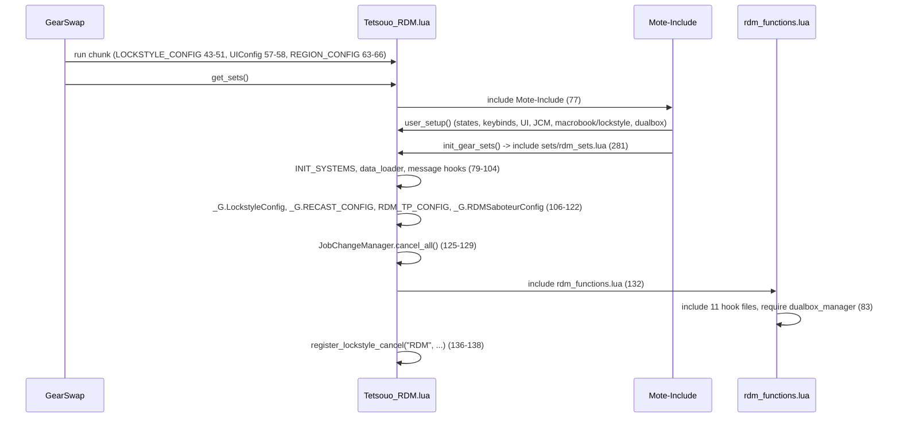
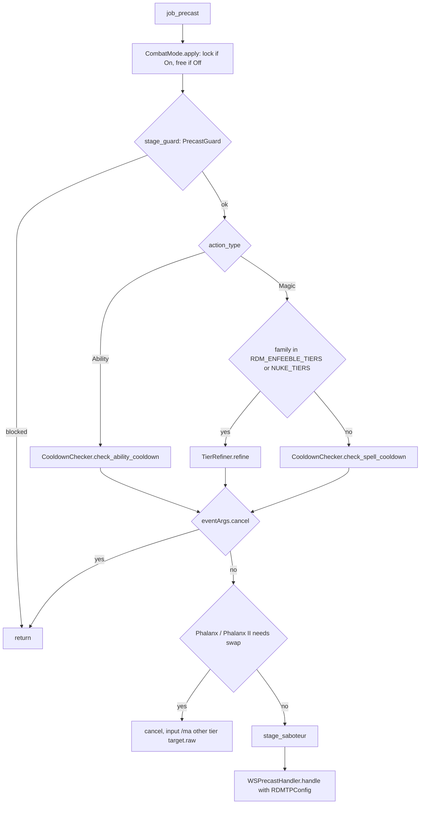

# RDM (Red Mage) job

The RDM job is a caster/melee hybrid built mostly from shared systems: 12 hook
modules plus one logic module under `shared/jobs/rdm/functions/` (1 798 lines),
an entry point per character (template + Kaories overlay), seven config files and
one sets file. GearSwap loads it when the main job becomes RDM
(`Tetsouo_RDM.lua`, or `Kaories_RDM.lua` for Kaories, who is the only character
that plays RDM live). From then on Mote-Include calls its hooks on every action,
on status and buff changes, on `//gs c` commands and on state cycles.

What RDM adds on top of the shared pipeline:

- **Tier refinement** in precast: Dia III, Distract III, Slow II and the other
  families listed in `RDM_ENFEEBLE_TIERS.lua`, and the elemental nukes of
  `shared/data/spells/NUKE_TIERS.lua` (Fire V -> IV -> ... since 2026-09-26),
  go through the shared `TierRefiner` instead of `CooldownChecker`, so a spell
  on recast or short on MP is replaced by the next learned, castable lower tier.
  `state.EnfeebleTier` (On by default; Ctrl+Numpad9, Gab Ctrl+F9) turns the
  enfeeble part off: a tiered enfeeble on recast is then cancelled with its
  recast shown, so the player keeps the tier (Gravity II a second from ready
  must not become Gravity). Nukes drop either way; enhancing never drops a
  tier on recast (Phalanx only swaps by target).
- **Phalanx tier by target**: Phalanx II on yourself becomes Phalanx, Phalanx on
  someone else becomes Phalanx II.
- **Auto-Saboteur** before the enfeebles listed in `RDM_SABOTEUR_CONFIG.lua`
  when `SaboteurMode` is On (through the shared `AbilityHelper`).
- **Skill-routed midcast** through `MidcastManager` with the enfeebling type
  database, the enhancing family database and the Composure target, plus a
  Saboteur hands overlay and an Accession + Phalanx exception.
- **Weapon states and dual-wield detection** for idle/engaged sets
  (`MainWeapon`, `SubWeapon`, `EngagedMode`, `.DW` variants, `sets.shields`),
  and the shared `CombatMode` weapon lock.
- **State-driven cast commands** (`castlight`, `castenspell`, `castgain`, ...)
  and a catch-all that turns any unknown command into `/ja`, `/ws` or `/ma`.

Every file in scope was read in full except the gear content of the sets files
(only structure and set names were read, as gear choice is out of scope). Line
numbers were re-checked against the working tree on 2026-09-25.

## Files

| Path | Lines | Role |
|------|------:|------|
| `_master/entry/Tetsouo_RDM.lua` | 302 | Entry (template): config preload, `get_sets`, `job_sub_job_change`, `user_setup`, `job_update` (UI only), `init_gear_sets`, `file_unload` |
| `_master/Kaories/entry/Kaories_RDM.lua` | 300 | Kaories overlay entry: identical except `Kaories/...` paths and two comments (see below) |
| `shared/jobs/rdm/functions/rdm_functions.lua` | 85 | Facade: includes the 11 hook files, requires `dualbox_manager` (83) |
| `shared/jobs/rdm/functions/RDM_PRECAST.lua` | 364 | `job_precast` as four stages (guard, cooldown/refine, Phalanx, Saboteur) + WS; `job_post_precast` (TP gear, spell FC set, `debugprecast` trace) |
| `shared/jobs/rdm/functions/RDM_MIDCAST.lua` | 369 | `job_midcast` (empty) / `job_post_midcast`: `SKILL_HANDLERS` table dispatch to `MidcastManager` |
| `shared/jobs/rdm/functions/RDM_AFTERCAST.lua` | 24 | `job_aftercast = LifecycleManager.aftercast()` |
| `shared/jobs/rdm/functions/RDM_IDLE.lua` | 43 | `customize_idle_set` -> `SetBuilder.build_idle_set` |
| `shared/jobs/rdm/functions/RDM_ENGAGED.lua` | 42 | `customize_melee_set` -> `SetBuilder.build_engaged_set` |
| `shared/jobs/rdm/functions/RDM_STATUS.lua` | 20 | `job_status_change = LifecycleManager.status_change()` |
| `shared/jobs/rdm/functions/RDM_BUFFS.lua` | 20 | `job_buff_change = LifecycleManager.buff_change()` |
| `shared/jobs/rdm/functions/RDM_COMMANDS.lua` | 432 | `job_self_command` router (cast-by-name fallback resolved from `res`) and `job_state_change` (UI refresh) |
| `shared/jobs/rdm/functions/RDM_MOVEMENT.lua` | 42 | Empty `job_handle_equipping_gear` |
| `shared/jobs/rdm/functions/RDM_LOCKSTYLE.lua` | 53 | Lazy `LockstyleManager.create('RDM', 'config/rdm/RDM_LOCKSTYLE', 1, 'NIN')` wrappers |
| `shared/jobs/rdm/functions/RDM_MACROBOOK.lua` | 48 | Lazy `MacrobookManager.create('RDM', ..., 'NIN', 1, 1)` wrapper |
| `shared/jobs/rdm/functions/logic/set_builder.lua` | 254 | Idle/engaged construction: mode sets, shield/DW detection, weapons, town, movement |
| `shared/data/spells/RDM_ENFEEBLE_TIERS.lua` | 55 | Tier correspondence for 11 enfeeble families, read by `RDM_PRECAST.lua` `get_spell_tiers` |
| `shared/data/spells/NUKE_TIERS.lua` | 56 | Nuke / -ra / Aspir tiers, read by `RDM_PRECAST.lua` `get_spell_tiers` and `GEO_PRECAST.lua` |
| `shared/data/magic/ENFEEBLING_MAGIC_DATABASE.lua` (+ `enfeebling/*.lua`) | - | `get_enfeebling_type` (macc, mnd_potency, int_potency, skill_potency, skill_mnd_potency, potency, duration) |
| `shared/data/magic/ENHANCING_MAGIC_DATABASE.lua` (+ `enhancing/*.lua`) | - | `get_spell_family` (Enspell, Gain, BarElement, BarAilment, Refresh, Regen, Phalanx, Stoneskin, Aquaveil, Spikes, Boost, Storm) |
| `_master/config/rdm/RDM_STATES.lua` | 384 | All states (`configure`), `configure_storm`, unused `validate` |
| `_master/config/rdm/RDM_KEYBINDS.lua` | 49 | Data only: 15 binds (Storm only on /SCH), handed to `KeybindManager.create('RDM', ...)`, which adds `get_active_binds` / `bind_all` / `refresh` / `unbind_all` / `show_intro` and appends the character's `COMMON_KEYBINDS.lua` keys (AutoMedicine `#numpad0`, the alts keys) |
| `_master/config/rdm/RDM_CUSTOM.lua` | 118 | Player modes and gear rules, commented examples only ([keybinds and custom states](../systems/keybinds-and-custom.md)) |
| `_master/config/rdm/RDM_LOCKSTYLE.lua` | 26 | `default = 1`, `by_subjob` |
| `_master/config/rdm/RDM_MACROBOOK.lua` | 42 | `default` book 2 page 1, `solo[sub]`, empty `dualbox` |
| `_master/config/rdm/RDM_SABOTEUR_CONFIG.lua` | 41 | `auto_trigger_spells` (Distract III, Gravity II), `wait_time = 2` |
| `_master/config/rdm/RDM_TP_CONFIG.lua` | 75 | `pieces` (Moonshade 250), `get_weapon_bonus`, sets `_G.RDMTPConfig` (73) |
| `_master/sets/rdm_sets.lua` | 539 | Template sets (flat) |
| `_master/Kaories/sets/rdm_sets.lua` | 634 | Overlay sets (Kaories' gear; adds `sets['Maxentius']` at 45 and `sets.precast.WS['Black Halo']` at 574) |
| `_master/Kaories/config/rdm/*` | 7 files | The template configs with Kaories' values (`RDM_STATES.lua:92-95,112`: `Maxentius` replaces `Daybreak`, default `MainWeapon` is `Maxentius`, default `CombatMode` is `On`), plus `RDM_REFILL.lua` (22). No `RDM_CUSTOM.lua` overlay: a clone gets the template one |
| `shared/utils/messages/formatters/jobs/message_rdm.lua` + `data/jobs/rdm_messages.lua` | 169 + 108 | RDM chat messages (errors, Phalanx swap, storm) |
| `shared/utils/messages/formatters/jobs/message_rdm_midcast.lua` + `data/systems/rdm_midcast_messages.lua` | 203 + 25 | `debugmidcast` trace lines |

Live copies (gitignored): `Kaories/Kaories_RDM.lua`, `Kaories/config/rdm/*`
and `Kaories/sets/rdm_sets.lua` are identical to the overlay since the resync
of `f6f1683` (2026-09-24); live Kaories also has `RDM_CUSTOM.lua`, identical to
the template. `Tetsouo/` has no RDM files; `Hysoka/` and `Gabvanstronger/` are
frozen and out of scope.

The overlay entry differs from the template only in the character name of every
config path (`Kaories_RDM.lua:43,58,63,107,111,114,157,197,206`), the
position of the "DUALBOX IPC" comment in `job_sub_job_change`, and the wording
of the dual-box comment in `user_setup`.

## How it works

### Load sequence

GearSwap runs the entry chunk, then `get_sets()`. Mote-Include calls
`user_setup()` and `init_gear_sets()` from inside `include('Mote-Include.lua')`,
before `INIT_SYSTEMS` and before the RDM hook files exist (see
[core lifecycle](../systems/core-lifecycle.md#how-a-job-file-boots)).

`user_setup()` (`Tetsouo_RDM.lua:193-254`):

1. `RDMStates.configure()` creates every state (see [Mote states](#mote-states)),
   including `Storm` when the subjob is SCH. `CombatMode` defaults to Off
   (Kaories: On); its lock is the shared [Combat Mode](../systems/keybinds-and-custom.md#combat-mode-sharedutilscorecombat_modelua-2026-09-25) hook.
2. `require` of `RDM_KEYBINDS`, stored in the global `RDMKeybinds`, then
   `bind_all()` (`keybind_manager.lua` `bind_all`): keys of the file that no
   longer apply are unbound, the binds `get_active_binds()` keeps for the
   subjob are bound (the keys about to be bound are not unbound first), then
   `show_intro()`. `show_intro` `require`s `RDM_MACROBOOK.lua` and
   `RDM_LOCKSTYLE.lua`; both files return nothing, so the intro falls back to
   `show_system_intro`, but executing them defines the globals
   `select_default_macro_book` and `select_default_lockstyle` as a side effect.
   A failed `require` prints `[RDM] Keybinds failed to load: <error>`.
3. `KeybindUI.smart_init("RDM", init_delay)`.
4. `JobChangeManager.initialize()`; because of step 2 the gate at 241 passes on
   a fresh load, so the macro book is set at once and the lockstyle is
   scheduled after `LockstyleConfig.initial_load_delay` (8 s).
5. `pcall(require, 'shared/utils/dualbox/dualbox_manager')`.

The facade (`rdm_functions.lua`) includes `RDM_LOCKSTYLE`, `RDM_MACROBOOK` (27,
29), `RDM_PRECAST`, `RDM_MIDCAST`, `RDM_AFTERCAST` (36-40), `RDM_IDLE`,
`RDM_ENGAGED` (47-49), `RDM_STATUS`, `RDM_BUFFS` (56-58), `RDM_MOVEMENT` (65),
`RDM_COMMANDS` (72), then requires `dualbox_manager` (83). Every hook file
lazy-loads its dependencies on first use. `RDM_PRECAST.lua:89,91` capture
`_G.RDMTPConfig` and `_G.RDMSaboteurConfig` at include time; the entry sets both
before the facade include, so the captures are valid.

### Precast

`job_precast` (`RDM_PRECAST.lua:251-281`):

- `require('shared/utils/core/combat_mode').apply()` (256) runs before anything
  else, for every action, so the lock holds before precast gear.
- `get_enfeeble_tiers` (76-82) takes the first word of `spell.name`
  (`^(%a+)`) and looks it up with `RDM_ENFEEBLE_TIERS.get` in `TIERS`: Dia, Bio, Distract,
  Frazzle (III -> II -> base), Blind, Slow, Paralyze, Poison, Addle, Sleep,
  Gravity (II -> base). The lookup runs for every spell, not only enfeebles,
  so Bio (Dark Magic) is refined too. Base-tier spells of these families (Dia,
  Slow, ...) also go through `TierRefiner`, which lets them through when their
  recast is 0 and cancels with a multi-line recast display otherwise.
- `TierRefiner.refine` is described in
  [precast pipeline](../systems/precast-pipeline.md#tier-refinement): first
  castable tier (recast exactly 0 and enough MP), replacement through
  `wait 0.1; @input /ma "<new>" <target.raw>`, 0.2 s re-entry guard. Its return
  value is ignored at 154 (Known issues).
- `stage_phalanx` (176-205): only Enhancing Magic named Phalanx / Phalanx II;
  `is_self` compares `spell.target.name` with `player.name`. A swap cancels and
  sends `input /ma "<other>" <target.raw>` (no guard: the re-sent cast already
  has the right tier, so it passes).
- `stage_saboteur` (209-240): Enfeebling Magic only, `SaboteurMode` On, and the
  spell's English name listed in `auto_trigger_spells`. It calls
  `AbilityHelper.try_ability_smart(spell, eventArgs, 'Saboteur', wait_time)`,
  which, when Saboteur is ready and not up, calls `cancel_spell()`, sets
  `eventArgs.handled`, sends `input /ja "Saboteur" <me>` and replays the
  spell through `follow_up` once Saboteur registers, rather than after a
  fixed `wait 2` (`ability_helper.lua` `follow_up`). Since 2026-09-25 the
  replay carries a marker (`windower._ability_replay`, `fire_then_replay`):
  the re-sent spell goes out without a second Saboteur attempt, so a refused
  Saboteur (Amnesia, level sync) no longer loops; under a JA-blocking debuff
  other than Paralysis no attempt is made at all (`may_try`). Because only
  `handled` is set, Mote skips the default precast but still runs
  `job_post_precast`.
- `WSPrecastHandler.handle` is called for every action (it returns true for
  non-WS). `RDMTPConfig` defines `pieces` and `get_weapon_bonus`, so the TP
  calculator works for RDM (compare BLM).
- `job_post_precast` (329-350): `WSPrecastHandler.apply_tp_gear`, then
  `sets.precast.FC[spell.english]` when it exists (only `Stoneskin` in the sets).
  With `_G.PrecastDebugState` (`//gs c debugprecast`) it prints the set that
  `describe_equipped_set` (290-321) believes Mote chose. That function reports
  "No FC (Chainspell active)" under Chainspell, but no code skips the FC set
  under Chainspell. A ranged attack, recognised by
  `spell.action_type == 'Ranged Attack'` (316; `/ra` has `type` `'Misc'`), is
  reported as `sets.precast.RA`.

### Midcast

Mote equips its default midcast set first (spell name, spell map, skill,
`CastingMode`), then calls `job_post_midcast` (`RDM_MIDCAST.lua:329-354`):
watchdog notify (331-333), then `SKILL_HANDLERS[spell.skill]` (316-322).

| Skill | Handler | `MidcastManager.select_set` config | Overrides after |
|-------|---------|------------------------------------|-----------------|
| Enfeebling Magic | `midcast_enfeebling` (86-139) | `mode_state = EnfeebleMode`, `database_func = get_enfeebling_type` | `sets.midcast['Enfeebling Magic'].Saboteur` while `buffactive['Saboteur']` (130-136) |
| Enhancing Magic | `midcast_enhancing` (183-227) | `mode_state = state.EnhancingMode` (never defined, always nil), `target_func = get_enhancing_target`, `database_func = get_spell_family` | Accession + `^Phalanx` short-circuits to `equip(sets.midcast['Enhancing Magic'])` before the manager (196-203) |
| Healing Magic | `midcast_healing` | skill + spell; a Cure (not a Curaga) on oneself then gets `sets.midcast.CureSelf` on top when the character's sets define it (2026-09-25, Gab's sets) | - |
| Elemental Magic | `midcast_elemental` (253-270) | `mode_state = NukeMode` | - |
| Dark Magic | `midcast_dark` (275-291) | skill + spell | - |
| other | `midcast_subjob` (296-312) | never reached (`spell.type == 'Magic'` at 347 is never true) | - |

How the [standard chain](../systems/midcast-and-buffs.md#standard-chain-every-skill-except-singing)
resolves RDM casts with the template sets:

- Enfeebles: every spell in the enfeebling database has a type, and every type
  has a set under `sets.midcast['Enfeebling Magic']` (`macc`, `mnd_potency`,
  `int_potency`, `skill_potency`, `skill_mnd_potency`, `potency`, `duration`).
  P3 (`base[type][mode]`) never exists, so P7 `base[type]` wins and the
  `EnfeebleMode` sets (`.Potency`, `.Mixed`, `.Acc`) are never reached. See
  Known issues.
- Refresh / Regen / Phalanx: P1 finds `sets.midcast.Refresh` (etc.) on self,
  `sets.midcast.Refresh.Composure` on others under Composure (`target_func`
  returns `'Composure'` only when the target is not the player).
- Enspells, Gains, Bar-spells, Spikes, Aquaveil: P6 `sets.midcast[family]`
  (root sets at `_master/sets/rdm_sets.lua:429-434`). `BarAilment` family set
  exists; Boost and Storm fall to the base.
- Temper, Stoneskin, Impact, Stun, Drain, Aspir: P0/P1 by name.
- Haste II on others with Composure: P5 `base.Composure`.
- Cures: P1 `sets.midcast.Cure` / `Curaga` (tier stripped); `CureSelf` is never
  looked up.
- Elemental: `NukeMode` values are `FreeNuke` and `Magic Burst` (with a space);
  P8 finds `base.FreeNuke` / `base['Magic Burst']`.

The Saboteur overlay is a full set (`set_combine` of the base plus hands), so
while Saboteur is up it replaces whatever type set the manager chose.

### Aftercast, idle, engaged, status, buffs

- `job_aftercast`, `job_status_change`, `job_buff_change` are the shared
  `LifecycleManager` handlers (watchdog notify, Doom handling), see
  [core lifecycle](../systems/core-lifecycle.md#lifecyclemanager).
- `customize_idle_set` -> `SetBuilder.build_idle_set` (`shared/jobs/rdm/functions/logic/set_builder.lua:227-248`):
  `sets.idle[IdleMode]` (30-48; falls back to `sets.idle.PDT` when
  `HybridMode = PDT`, unreachable because `IdleMode` always has a set) ->
  `BaseSetBuilder.select_idle_base_town` (197: `sets.Adoulin` in Adoulin,
  `sets.idle.Town` in other cities, Dynamis excluded) -> weapons -> `sets.MoveSpeed`
  outside town when `state.Moving.value == 'true'`.
- `customize_melee_set` -> `build_engaged_set` (206-218):
  `select_engaged_base` (57-99) picks `sets.engaged[EngagedMode]`, or its `.DW`
  child when the off hand holds a weapon. `offhand_item` names the off hand:
  the worn item while `CombatMode` is On (the state can change then without the
  gear following), otherwise the item of the set `state.SubWeapon` names
  (`sets['Genmei'].sub`), or the value itself. `has_shield_equipped` asks
  `WeaponResolver.is_offhand_weapon` (game item list): a weapon with a combat
  skill means `.DW`; a shield (`shield_size`), a grip (skill 0), nil, `""` or
  `'empty'` means the normal set. Only a name the game does not know falls back
  to `sets.shields` (2026-09-26; before, that list alone decided, and a shield
  missing from it picked the `.DW` sets).
- `apply_weapon` (110-147) combines `sets[state.MainWeapon.current]` and
  `sets[state.SubWeapon.current]` unless `CombatMode` is On. With
  `SubWeapon = Malevolence` (a dagger) the `.DW` set is chosen and the dagger is
  equipped whatever the subjob, so it only works on /NIN or /DNC.
- Mote's own base (`sets.idle[scope][IdleMode]`, `sets.engaged` + OffenseMode
  `Normal`) is discarded by the builders.
- `job_handle_equipping_gear` is empty (`RDM_MOVEMENT.lua:33-34`).

## Mote states

Created by `RDMStates.configure()` (`_master/config/rdm/RDM_STATES.lua:57-285`)
on every `user_setup()` (every load and every subjob change, so values reset).
Keybinds from `RDM_KEYBINDS.lua:18-44`; `^` = Ctrl, `#` = Apps.

| State | Values | Default | Key | Read by |
|-------|--------|---------|-----|---------|
| `HybridMode` (Mote) | PDT, Normal | Normal | none | `set_builder.lua:41,92` fallback only (unreachable) |
| `EngagedMode` | DT, Acc, TP, Enspell | DT | `^numpad6` | `set_builder.lua` `select_engaged_base` |
| `IdleMode` (replaced) | Refresh, DT | Refresh | `^numpad4` | Mote `get_idle_set`, `set_builder.lua` `select_idle_base` |
| `MainWeapon` | Naegling, Colada, Daybreak (Kaories: Maxentius) | Naegling (Kaories: Maxentius) | `^numpad1` | `set_builder.lua:121-131` |
| `SubWeapon` | Ammurapi, Genmei, Malevolence | Genmei | `^numpad2` | `set_builder.lua:65-66,134-144` |
| `CombatMode` | Off, On | Off (Kaories: On) | `^numpad5` | shared [Combat Mode](../systems/keybinds-and-custom.md#combat-mode-sharedutilscorecombat_modelua-2026-09-25) hook, `RDM_PRECAST.lua:256`, `set_builder.lua:116` |
| `EnfeebleMode` | Potency, Skill, Duration | Potency | `^numpad3` | `RDM_MIDCAST.lua:122` (no effect, see Known issues) |
| `NukeMode` | FreeNuke, Magic Burst | FreeNuke | `^numpad7` | `RDM_MIDCAST.lua:262` |
| `MainLightSpell` / `SubLightSpell` | Fire, Aero, Thunder | Fire / Thunder | none | `castlight` / `castsublight` |
| `MainDarkSpell` / `SubDarkSpell` | Blizzard, Stone, Water | Blizzard / Stone | none | `castdark` / `castsubdark` |
| `NukeTier` | V, IV, III, II, I | V | `^numpad8` | `cast*` nuke commands (`I` = base spell) |
| `EnSpell` | Enfire..Enwater (6) | Enfire | `^numpad.` | `castenspell`, `enspell` (no arg) |
| `GainSpell` | Gain-STR..Gain-CHR (7) | Gain-STR | `^numpad+` | `castgain` |
| `Barspell` | Barfire..Barwater (6) | Barfire | `^numpad-` | `castbar` |
| `BarAilment` | 8 ailments | Baramnesia | `^numpad*` | `castbarailment` |
| `Spike` | Blaze/Ice/Shock Spikes | Blaze Spikes | `^numpad/` | `castspike` |
| `SaboteurMode` | Off, On | Off | `^numpad0` | `RDM_PRECAST.lua` `stage_saboteur` |
| `Storm` (only with /SCH) | 8 storms | Firestorm | `#numpad1` (bound on /SCH only) | `caststorm`, `cyclestorm` |
| `FastCast` | 0..80 | 80 | none | `midcast_watchdog.lua` (reads `state.FastCast`, capped at 80) |
| `AutoMedicine` | shared | persisted | `#numpad0` (from `config/COMMON_KEYBINDS.lua`) | `AutoMedicine.init` (`RDM_STATES.lua:281-284`), see [precast pipeline](../systems/precast-pipeline.md) |

`configure_storm` (293-314) creates `state.Storm` when the subjob is SCH and it
does not exist yet, and sets it to nil otherwise. The `#numpad1` bind carries
`subjob = "SCH"`: `get_active_binds` (`keybind_manager.lua`) leaves it out on
any other subjob, and `bind_all` unbinds a key of the file that no longer
applies, so the key is freed after leaving /SCH. The HUD shows the same
filtered list (`UI_LOADER` calls `get_active_binds`). Mote's `OffenseMode` and `CastingMode`
keep their `'Normal'` defaults and are read only by Mote.

## Commands

`job_self_command` (`RDM_COMMANDS.lua:151-401`) lowercases the first word and
tests, in order: dual-box internals, UI, watchdog, **CommonCommands**, Mote's
own commands (any key of `selfCommandMaps`, read with `rawget` so the alt's
commands do not count; returned unhandled so Mote runs them, 223-226),
`debugmidcast`, `cyclestate`, RDM commands, and finally a catch-all.

| Command | Effect | Handler |
|---------|--------|---------|
| `altjobupdate` / `requestjob` | Dual-box job exchange (`altjobupdate` forwards the sender name, 5th argument, since 2026-09-25) | 164-180 |
| `ui ...` | UI toggles | 188-192 |
| `watchdog ...` | MidcastWatchdog commands | 195-200 |
| common commands | `reload`, `checksets`, `wa`, `wo`, `refill`, `craft`, `naked`, `help`, `lockstyle`, warp... | 203-213 -> `CommonCommands.handle_command(command, 'RDM', table.unpack(args))` |
| `update`, `cycle`, `set`, `unset`, `showtp`, ... (Mote) | Left unhandled for Mote | 223-226 |
| `debugmidcast` | Toggle `MidcastManager` debug | 232-242 |
| `cyclestate <State>` | `CycleHandler.handle_cyclestate` (every keybind) | 251-254 |
| `enspell <element>` | `input /ma "En<element>" <me>` (fire, ice/blizzard, wind/aero, earth/stone, thunder, water) | 260-285 |
| `enspell` | Cycle `EnSpell` silently, call `job_update()` | 286-295 |
| `convert` / `chainspell` / `saboteur` / `composure` | `input /ja "<Name>" <me>` | 297-300 |
| `castlight` / `castsublight` / `castdark` / `castsubdark` | `input /ma "<Element> <NukeTier>" <t>` | 302-322 |
| `castenspell` / `castgain` / `castbar` / `castbarailment` / `castspike` / `caststorm` | `input /ma "<state value>" <me>` | 323-340 |
| `cyclestorm` | Cycle `Storm` with a message, or "requires SCH" | 341-350 |
| anything else | Catch-all: the words are a JA, WS or spell name (optional last word `<target>`, default `<me>`), resolved by `resolve_action_prefix` (52-66) from the game resources in the order `res.job_abilities` (only prefix `/jobability`: the 51 pet moves that share a spell's name, such as Fire II or Hastega, are skipped), `res.weapon_skills`, `res.spells`; a name that is no action but that `selfCommandMaps` answers (the dual-box alt's commands) is left unhandled for Mote; anything else -> "Command not recognized" | 351-399 |

The catch-all sets `eventArgs.handled` only when it sends an action or prints
the error (388, 395). A name that is no action but that `selfCommandMaps`
answers is returned unhandled (390-393): Mote then runs it, and for a name Mote
lacks, the `__index` that `AltCommands.install_fallback` puts on the table sends
it to the alt ([dualbox](../systems/dualbox.md#alt-command-routing)).
`ensure_commands_loaded` (27-36) loads only the command modules; no action
database is loaded by `//gs c`. A name is accepted when the game knows it, not
only when the player's jobs can use it: another job's ability goes out as `/ja`
and the game refuses it (the old universal JA database held the main and sub
job only).

`job_state_change` (413-424): skips `Moving` and refreshes the UI. It no
longer re-equips on `MainWeapon` / `SubWeapon` (removed 2026-09-25): a cycle
(`cyclestate`, Mote's `cycle`/`set`) ends in Mote's `handle_update`
(`Mote-SelfCommands.lua`), which rebuilds the idle/engaged set and so equips
the new weapon. It does not handle `CombatMode`: since 2026-09-25 that lock is
the shared [Combat Mode](../systems/keybinds-and-custom.md#combat-mode-sharedutilscorecombat_modelua-2026-09-25) hook (craft-aware), also
applied from `job_precast`.

## Set names the code looks up

T = `_master/sets/rdm_sets.lua`, K = `_master/Kaories/sets/rdm_sets.lua`
(overlay, identical to the live `Kaories/sets/rdm_sets.lua`).

| Set | Looked up by | T | K |
|-----|--------------|---|---|
| `sets['Naegling']`, `['Daybreak']`, `['Colada']` (K adds `['Maxentius']`) | `apply_weapon` via `MainWeapon` | 45-47 | 43-46 |
| `sets['Ammurapi']`, `['Genmei']`, `['Malevolence']` | `apply_weapon` via `SubWeapon` | 50-52 | 49-51 |
| `sets.shields` (list) | `has_shield_equipped`, only for a name the game's item list does not know | 55 | 54 |
| `sets.idle.DT`, `sets.idle.Refresh` | `select_idle_base`, Mote | 73, 96 | 72, 95 |
| `sets.idle.PDT`, `sets.engaged.PDT` | HybridMode fallback | **absent** | **absent** |
| `sets.idle.Town`, `sets.Adoulin`, `sets.MoveSpeed` | `BaseSetBuilder` | 522, 517, 512 | 612, 603, 598 |
| `sets.engaged.DT/Acc/TP/Enspell` + `.DW` | `select_engaged_base` | 110-169 | 113-177 |
| `sets.engaged.Refresh` (+ `.DW`) | nothing (`EngagedMode` has no Refresh) | 137, 163 | 144, 171 |
| `sets.precast.FC`, `.FC['Stoneskin']` | Mote default precast, `job_post_precast` | 181, 201 | 189, 209 |
| `sets.precast.JA['Chainspell']`, `['Convert']` | Mote default precast | 213, 219 | 225, 231 |
| `sets.precast.WS` + Savage Blade, Sanguine, Seraph, Chant du Cygne, Requiescat (K adds Black Halo) | Mote default precast | 466-506 | 530-574 |
| `sets.midcast['Enfeebling Magic']` + 7 type sets | MidcastManager P7/P9 | 292-330 | 302-377 |
| `sets.midcast['Enfeebling Magic'].Potency`, `.Mixed`, `.Acc` | EnfeebleMode (never reached) | 334-340 | 381-387 |
| `sets.midcast['Enfeebling Magic'].Skill`, `.Duration` | EnfeebleMode Skill/Duration | **absent** | **absent** |
| `sets.midcast['Enfeebling Magic'].Saboteur` | `RDM_MIDCAST.lua:131-135` | 343 | 390 |
| `sets.midcast['Enhancing Magic']`, `.Composure` | MidcastManager P9/P5, Accession Phalanx | 351, 372 | 402, 424 |
| `sets.midcast.Refresh/Regen/Phalanx` (+ `.Composure`), `.Stoneskin`, `.Temper` | P0/P1 | 391-421, 439 | 443-481, 503 |
| `sets.midcast.Enspell/Gain/BarElement/BarAilment/Spikes/Aquaveil` | P6 family | 429-434 | 493-498 |
| `sets.midcast['Healing Magic']`, `.Cure`, `.Curaga` (+ optional `.CureSelf`, on top for a Cure on oneself; precast `FC.Cure` / `FC.Curaga` found by Mote through the spell map) | MidcastManager | 261-283 | 271-293 |
| `sets.midcast.CureSelf` | nothing | 286 | 296 |
| `sets.midcast['Elemental Magic']`, `.FreeNuke`, `['Magic Burst']` | NukeMode P8 | 232-255 | 242-265 |
| `sets.midcast['Dark Magic']`, `.Impact`, `.Stun`, `.Drain`, `.Aspir` | MidcastManager / Mote | 446-459 | 510-523 |
| `sets.buff.Doom` | shared DoomManager | 534 | 629 |

## Configuration

| File / key | Default | Where the default lives | Read by |
|------------|---------|-------------------------|---------|
| `<char>/config/rdm/RDM_STATES.lua` | see states | file | entry `user_setup`, `job_sub_job_change` (hard-coded `Tetsouo/` or `Kaories/`) |
| `<char>/config/rdm/RDM_KEYBINDS.lua` | 15 binds (+ the character's `COMMON_KEYBINDS.lua`) | file | entry `user_setup`, `file_unload` |
| `<char>/config/rdm/RDM_CUSTOM.lua` | examples only | file | `KeybindManager` via `custom_states` ([keybinds and custom states](../systems/keybinds-and-custom.md)) |
| `<char>/config/rdm/RDM_LOCKSTYLE.lua` `default`, `by_subjob` | 1 | file; factory argument 1 | `LockstyleManager` reads `default`; there is no `get_style`, so `by_subjob` is never read ([factories](../systems/factories-and-helpers.md#configuration)) |
| `<char>/config/rdm/RDM_MACROBOOK.lua` | book 2 page 1 for every subjob | file; factory fallback 1/1 | `MacrobookManager` |
| `<char>/config/rdm/RDM_SABOTEUR_CONFIG.lua` `auto_trigger_spells`, `wait_time` | Distract III, Gravity II; 2 | file; entry fallback `{}` / 2 (`Tetsouo_RDM.lua:114-122`) | `stage_saboteur` |
| `<char>/config/rdm/RDM_TP_CONFIG.lua` -> `_G.RDMTPConfig` | Moonshade 250 | file | `WSPrecastHandler` / `TPBonusCalculator` |
| `<char>/config/rdm/RDM_REFILL.lua` (overlay + live only) | Panacea, Antacid, Holy Water, Remedy, Echo Drops, Vile Elixirs, Tropical Crepe; `store_bag = 'case'` | file | `refill/config_resolver.lua` |
| `shared/data/spells/RDM_ENFEEBLE_TIERS.lua` | 11 families | file | `RDM_PRECAST.lua` `get_enfeeble_tiers` |
| `<char>/config/LOCKSTYLE_CONFIG.lua`, `REGION_CONFIG.lua`, `RECAST_CONFIG.lua`, UI config | shared | entry fallbacks 44-51 | entry |

## State & lifetime

- Module state: lazy-load locals, `TierRefiner.last_replacement_time`
  (module-local in the shared refiner). All die on `gs reload`.
- `_G` written: the Mote hooks (`job_precast`, `job_post_precast`,
  `job_midcast`, `job_post_midcast`, `job_aftercast`, `job_status_change`,
  `job_buff_change`, `customize_idle_set`, `customize_melee_set`,
  `job_self_command`, `job_state_change`, `job_handle_equipping_gear`,
  `job_update`), `RDMKeybinds`, `RDMTPConfig`, `RDMSaboteurConfig`,
  `LockstyleConfig`, `RECAST_CONFIG`, `RegionConfig`, `PrecastDebugState`
  (initialised to false, `RDM_PRECAST.lua:102-103`), `select_default_lockstyle`,
  `cancel_rdm_lockstyle_operations`, `select_default_macro_book`, plus the
  factory exports.
- `_G` read: `MidcastManagerDebugState`, `MidcastWatchdog`,
  `CraftManager`, `UIConfig`.
- `windower.*`: RDM code writes nothing and registers no events.
- Keybinds: bound in `user_setup`, unbound in `file_unload` (299-301).
- Slot locks: `disable('main','sub','range')` lives in GearSwap's
  `disable_table` and survives `gs reload`, subjob and main job changes. Since
  2026-09-25 the shared [Combat Mode](../systems/keybinds-and-custom.md#combat-mode-sharedutilscorecombat_modelua-2026-09-25) lock records
  it in `windower._combat_mode_locked` and frees it at the next load, then
  re-applies it on the first gear update if `CombatMode` is On.
- Coroutines: the 8 s lockstyle from `user_setup`; `wait N` chains
  (Saboteur, refinement) sit in the Windower queue and survive a reload.
- Subjob change: Mote calls `user_setup()` again (states reset), then
  `job_sub_job_change` (155-182), which re-runs `configure_storm` and hands over to `JobChangeManager.on_job_change`, which schedules
  a `gs reload` 0.5 s later ([job change lifecycle](../architecture/job-change-lifecycle.md)).

## Interactions

- Precast: `PrecastGuard`, `CooldownChecker`, `TierRefiner` (shared with
  [BLM](blm.md)), `AbilityHelper` (shared with [PLD](pld.md) and DNC),
  `WSPrecastHandler` ([precast pipeline](../systems/precast-pipeline.md)).
- Midcast: `MidcastManager`, `MidcastWatchdog`, the enfeebling and enhancing
  databases ([midcast and buffs](../systems/midcast-and-buffs.md),
  [spell databases](../data/spell-databases.md)).
- Messages: `message_rdm` (lazy through `MessageFormatter`), `message_rdm_midcast`,
  `message_precast`, `message_commands` ([messages](../systems/messages.md)).
- `BaseSetBuilder`, lockstyle/macrobook factories, `JobChangeManager`,
  `LifecycleManager`, `CycleHandler`, `CommonCommands`, UI, dual-box.
- The cast-by-name fallback reads the game resources (`res.job_abilities`,
  `res.weapon_skills`, `res.spells`) instead of the universal databases, which
  RDM no longer loads.

## Invariants & gotchas

- A spell whose family is in `RDM_ENFEEBLE_TIERS` is never checked by
  `CooldownChecker`; `TierRefiner` uses recast exactly 0, without the
  `RECAST_CONFIG` tolerance.
- The tier lookup is keyed on the first word of the name, for every spell: a new
  family name that matches a non-enfeeble (like Bio, Dark Magic) is refined too.
- `EnfeebleMode` can only matter for a spell with no database type or no type
  set; add mode sets under the type (`base.mnd_potency.Potency`) if the mode
  should count.
- `state.EnhancingMode` does not exist; the Composure target is the only
  enhancing variant.
- The Saboteur overlay is a full set and replaces the type set.
- The enfeebling base set carries `main`, `sub` and `range`; with `CombatMode`
  Off, every enfeeble swaps weapons (TP loss).
- `CombatMode` cycled from its key applies or releases the weapon lock at once,
  HUD shown or not: both cycle paths end in Mote's `handle_update`, whose
  `handle_equipping_gear` is wrapped by the shared `combat_mode.lua` hook
  ([core lifecycle](../systems/core-lifecycle.md#cyclehandler-and-state-display)).
- The off-hand item decides single vs dual wield (item list, see above); the subjob is not considered.
- Command names `convert`, `chainspell`, `saboteur`, `composure` also exist in
  `Tetsouo/config/alt/RDM_ALT_COMMANDS.lua`. RDM's own commands answer first, so
  they run on this character; the alt's version is reachable only as
  `//gs c alt <name>`.
- A weapon change must go through a path that ends in `handle_update`
  (`cyclestate`, Mote's `cycle` / `set`): `job_state_change` no longer equips.

## Extending

- New tiered enfeeble family: add `Family = { [tier] = { replace = next } }` to
  `RDM_ENFEEBLE_TIERS.TIERS` (`''` = base).
- New auto-Saboteur spell: add its English name to
  `RDM_SABOTEUR_CONFIG.auto_trigger_spells` in the template, the overlay and the
  live Kaories copy.
- New midcast behaviour: add a handler to `SKILL_HANDLERS` (316-322) and make
  sure `sets.midcast['<Skill>']` exists (the manager returns false without it).
- New weapon: add the value to `MainWeapon`/`SubWeapon` in `RDM_STATES.lua` and
  `sets['<Name>'] = {main = ...}` in the sets; a shield needs nothing more (the
  game's item list says it is one).
- New command: add a branch before the catch-all at 351. A name that is also an
  alt config key then runs here; the alt's version stays reachable as
  `//gs c alt <name>`.

## Known issues

- `EnfeebleMode` changes no gear: every enfeeble has a type set, so the mode sets
  are never reached, and `Skill`/`Duration` have no set at all
  (`RDM_MIDCAST.lua:118-123`, `_master/sets/rdm_sets.lua:312-340`). Left open on
  purpose: in the template, the overlay and the live Kaories file the mode sets
  (`.Potency`, `.Mixed`, `.Acc`) are `set_combine(base, {})` with no gear of
  their own, and `.Mixed`/`.Acc` do not match any `EnfeebleMode` value
  (Potency, Skill, Duration), so no combination of existing sets gives the
  mode an effect. Whether Skill/Duration should replace the spell's type set
  (for example use `.skill_potency` / `.duration` for every enfeeble) or add
  pieces on top of it is a gear decision to make first; then either
  `base[type][mode]` entries (P3) or a mode-aware `database_func`.
- The `TierRefiner.refine` return value is ignored; a spell arriving within
  0.2 s of a replacement gets no recast check (`RDM_PRECAST.lua:154`).
- `midcast_subjob` is unreachable (`spell.type == 'Magic'` is never true);
  subjob magic only gets Mote's default set (`RDM_MIDCAST.lua:347`).
- "Storm spells enabled/disabled" never prints: `user_setup()` has already
  updated `state.Storm` when `job_sub_job_change` compares
  (`Tetsouo_RDM.lua:157-171`, `Mote-Include.lua:981-988`).
- Superseded 2026-09-25: `job_sub_job_change` and `job_update` no longer touch
  the lock (fixed in `34ba527` before); the shared hook is craft-aware.
- To check in game (change of 2026-09-25): changing weapon (`^numpad1` cycle
  and `//gs c set MainWeapon ...`) still equips the weapon now that
  `job_state_change` no longer calls `handle_equipping_gear`.
- To check in game (change of 2026-09-25): a Saboteur refused by the game
  (Amnesia, level sync) sends the enfeeble once, without a loop.
- Six `MessageFormatter` entries point at functions `message_rdm.lua` does not
  define (`show_convert_activated`, `show_convert_used`,
  `show_chainspell_activated`, `show_chainspell_ended`,
  `show_composure_activated`, `show_composure_active`;
  `message_formatter.lua:312-317`); none has a caller.
- `message_rdm_midcast.lua` passes `(color, text)` to
  `MessageRenderer.send(message, color)` in 48 calls; GearSwap's `add_to_chat`
  swaps them back (`GearSwap/user_functions.lua:385-388`), so the trace prints
  but every line is in colour 8. The trace also uses emoji (69, 76, 83, 93) and
  describes priority orders that differ from the real chain (83-97, 145-170).
- PLAUSIBLE: Dispelga (Daybreak) with `CombatMode` Off equips `main = "Bunzi's
  Rod"` from the enfeebling base at midcast (`_master/sets/rdm_sets.lua:293`).
- `by_subjob` in `RDM_LOCKSTYLE.lua` is never read (no `get_style`).
- `sets.Adoulin` is a 2-slot set used as a full idle base in Adoulin
  (`_master/sets/rdm_sets.lua:517`). The comment above `SetBuilder.check_town`
  now says so (fixed in `b6c7dc6`).
- `HybridMode`, `sets.engaged.Refresh`, `sets.midcast.CureSelf`, the
  `check_off` path of `castenspell` (no `EnSpell` value is `Off`) and
  `RDMStates.validate` are dead; `show_doom_warning`, `show_doom_removed`,
  `show_spell_casting`, `show_enspell_current`, `show_phalanx_detected` in
  `message_rdm.lua` have no caller.
- Stale text: `no_enspell_selected` ("Alt+8", `rdm_messages.lua:61`; the key is
  `^numpad.`), `describe_equipped_set` Chainspell line
  (`RDM_PRECAST.lua:306-307`). The state header and the "Alt+NUMPAD" keybind
  comments were fixed in `b6c7dc6` / `22e1816`.
- Fixed in `f6f1683`: the live Kaories files and `_master/Kaories/` are
  identical again (Maxentius, CombatMode On, Black Halo are in the overlay).
