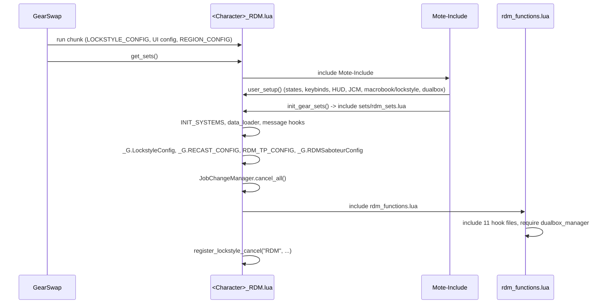
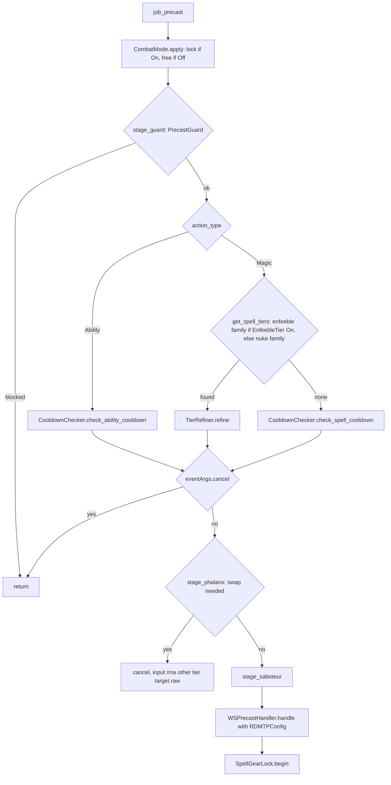

# RDM (Red Mage) job

The RDM job is a caster/melee hybrid built mostly from shared systems: 12 hook
modules plus one logic module under `shared/jobs/rdm/functions/` (about 1 850
lines), a template entry point (plus character overlays), eight config files and
one sets file. GearSwap loads it when the main job becomes RDM (the entry file
`<Character>_RDM.lua`, made from `_master/entry/Tetsouo_RDM.lua` by the clone
script). From then on Mote-Include calls its hooks on every action, on status
and buff changes, on `//gs c` commands and on state cycles.

Player-facing pages: [hub](../../user/jobs/rdm/README.md),
[modes](../../user/jobs/rdm/states.md), [sets](../../user/jobs/rdm/sets.md).

What RDM adds on top of the shared pipeline:

- **Tier refinement** in precast: the enfeeble families of
  `shared/data/spells/RDM_ENFEEBLE_TIERS.lua` (Dia, Bio, Distract, Frazzle,
  Blind, Slow, Paralyze, Poison, Addle, Sleep, Gravity) and the nukes of
  `shared/data/spells/NUKE_TIERS.lua` (Fire..Water I-V, the -ra III-I, Aspir
  III-I) go through the shared `TierRefiner` instead of `CooldownChecker`: a
  spell on recast or short of MP is replaced by the next learned, castable
  lower tier. `state.EnfeebleTier` (On by default) switches the enfeeble part
  off: a tiered enfeeble on recast is then cancelled with its recast shown, so
  the player keeps the tier. Nukes step down either way; enhancing spells never
  do (Phalanx only swaps by target).
- **Phalanx tier by target**: Phalanx II on yourself becomes Phalanx, Phalanx on
  someone else becomes Phalanx II.
- **Auto-Saboteur** before the enfeebles listed in `RDM_SABOTEUR_CONFIG.lua`
  when `SaboteurMode` is On (shared `AbilityHelper`).
- **Skill-routed midcast** through `MidcastManager`, with the enfeebling type
  database, the enhancing family database and the Composure target, a Saboteur
  overlay, a `CureSelf` overlay and an Accession + Phalanx exception.
- **Weapon states and single/dual-wield detection** for idle and engaged sets
  (`MainWeapon`, `SubWeapon`, `EngagedMode`, `.DW` variants), and the shared
  Combat Mode weapon lock (native on RDM).
- **Dispelga** through the shared `SpellGearLock` (Daybreak held for the cast,
  even through Combat Mode).
- **State-driven cast commands** (`castlight`, `castenspell`, `castgain`, ...)
  and a cast-by-name catch-all that turns any action name into `/ja`, `/ws` or
  `/ma`.

Every file in scope was read in full on 2026-09-28, except the gear content of
the sets files (structure and set names only).

## Files

| Path | Lines | Role |
|------|------:|------|
| `_master/entry/Tetsouo_RDM.lua` | 302 | Entry (template): config preload, `get_sets`, `job_sub_job_change`, `user_setup`, `job_update` (HUD only), `init_gear_sets`, `file_unload` |
| `_master/Kaories/entry/Kaories_RDM.lua` | - | Overlay entry: the template with the character name in every config path |
| `shared/jobs/rdm/functions/rdm_functions.lua` | 85 | Facade: includes the 11 hook files, then requires `dualbox_manager` |
| `shared/jobs/rdm/functions/RDM_PRECAST.lua` | 378 | `job_precast` as stages (guard, cooldown/refine, Phalanx, Saboteur) + WS + `SpellGearLock.begin`; `job_post_precast` (TP gear, spell FC set, lock hold, `debugprecast` trace) |
| `shared/jobs/rdm/functions/RDM_MIDCAST.lua` | 362 | `job_midcast` (empty), `job_post_midcast` -> `route_midcast` (`SKILL_HANDLERS` table) + `SpellGearLock.hold` |
| `shared/jobs/rdm/functions/RDM_AFTERCAST.lua` | 27 | `job_aftercast = LifecycleManager.aftercast(...)` with `SpellGearLock.release` as the extra step |
| `shared/jobs/rdm/functions/RDM_IDLE.lua` | 43 | `customize_idle_set` -> `SetBuilder.build_idle_set` |
| `shared/jobs/rdm/functions/RDM_ENGAGED.lua` | 42 | `customize_melee_set` -> `SetBuilder.build_engaged_set` |
| `shared/jobs/rdm/functions/RDM_STATUS.lua` | 20 | `job_status_change = LifecycleManager.status_change()` |
| `shared/jobs/rdm/functions/RDM_BUFFS.lua` | 20 | `job_buff_change = LifecycleManager.buff_change()` |
| `shared/jobs/rdm/functions/RDM_COMMANDS.lua` | 439 | `job_self_command` router (cast-by-name resolved from `res`), `job_state_change` (HUD refresh) |
| `shared/jobs/rdm/functions/RDM_MOVEMENT.lua` | 42 | Empty `job_handle_equipping_gear` |
| `shared/jobs/rdm/functions/RDM_LOCKSTYLE.lua` | 53 | Lazy `LockstyleManager.create('RDM', 'config/rdm/RDM_LOCKSTYLE', 1, 'NIN')` wrappers |
| `shared/jobs/rdm/functions/RDM_MACROBOOK.lua` | 48 | Lazy `MacrobookManager.create('RDM', 'config/rdm/RDM_MACROBOOK', 'NIN', 1, 1)` wrapper |
| `shared/jobs/rdm/functions/logic/set_builder.lua` | 273 | Idle / engaged construction: mode sets, single vs dual wield (off-hand item and subjob), weapons, town, movement |
| `shared/data/spells/RDM_ENFEEBLE_TIERS.lua` | 55 | Tier table of 11 enfeeble families (`RDM_ENFEEBLE_TIERS.get`) |
| `shared/data/spells/NUKE_TIERS.lua` | 56 | Nuke / -ra / Aspir tier table (`NUKE_TIERS.get`), shared with GEO |
| `shared/utils/precast/tier_refiner.lua` | - | `TierRefiner.refine` (shared with BLM and GEO) |
| `shared/utils/equipment/spell_gear_lock.lua` | 135 | `SpellGearLock.cast/begin/hold/release`, `REQUIRED = {Dispelga = {main = 'Daybreak'}}`; RDM is its only caller |
| `shared/data/magic/ENFEEBLING_MAGIC_DATABASE.lua` (+ `enfeebling/*.lua`) | - | `get_enfeebling_type` (macc, mnd_potency, int_potency, skill_potency, skill_mnd_potency, potency, duration) |
| `shared/data/magic/ENHANCING_MAGIC_DATABASE.lua` (+ `enhancing/*.lua`) | - | `get_spell_family` (Enspell, Gain, BarElement, BarAilment, Refresh, Regen, Phalanx, Stoneskin, Aquaveil, Spikes, Boost, Storm...) |
| `_master/config/rdm/RDM_STATES.lua` | 323 | `RDMStates.configure`, `RDMStates.configure_storm` |
| `_master/config/rdm/RDM_KEYBINDS.lua` | 50 | Data only: 16 entries (Storm only on /SCH) handed to `KeybindManager.create('RDM', ...)` |
| `_master/config/rdm/RDM_CUSTOM.lua` | 119 | Player modes and gear rules, commented examples only ([keybinds and custom states](../systems/keybinds-and-custom.md)) |
| `_master/config/rdm/RDM_HUD.lua` | 33 | HUD section / row order for this job (empty lists = default) |
| `_master/config/rdm/RDM_LOCKSTYLE.lua` | 26 | `default = 1`, `by_subjob` (never read, see Known issues) |
| `_master/config/rdm/RDM_MACROBOOK.lua` | 42 | `default` book 2 page 1, `solo[sub]`, empty `dualbox` |
| `_master/config/rdm/RDM_SABOTEUR_CONFIG.lua` | 41 | `auto_trigger_spells` (Distract III, Gravity II), `wait_time = 2` |
| `_master/config/rdm/RDM_TP_CONFIG.lua` | 75 | `pieces` (Moonshade 250), `get_weapon_bonus`; sets `_G.RDMTPConfig` itself |
| `_master/sets/rdm_sets.lua` | 562 | Template sets (flat) |
| `_master/Kaories/config/rdm/*`, `_master/Kaories/sets/rdm_sets.lua` | 7 files, 634 | Overlay: `Maxentius` replaces `Daybreak` and is the default `MainWeapon`, `CombatMode` starts On; adds `RDM_REFILL.lua`; no `RDM_CUSTOM.lua` / `RDM_HUD.lua` (a clone gets the template's) |
| `_master/Gabvanstronger/config/rdm/*`, `_master/Gabvanstronger/sets/rdm_sets.lua` | 5 files, 930 | Overlay: its own `EngagedMode` / `IdleMode` / weapon values, keys, custom modes, lockstyle and macro book |
| `shared/utils/messages/formatters/jobs/message_rdm.lua` + `data/jobs/rdm_messages.lua` | 169 + 108 | RDM chat messages (errors, Phalanx swap, storm) |
| `shared/utils/messages/formatters/jobs/message_rdm_midcast.lua` + `data/systems/rdm_midcast_messages.lua` | 203 + 25 | `debugmidcast` trace lines |

Live copies are gitignored (`<Character>/...`); a live copy can differ from
its overlay until it is re-cloned.

## How it works

### Load sequence

GearSwap runs the entry chunk, then `get_sets()`. Mote-Include calls
`user_setup()` and `init_gear_sets()` from inside `include('Mote-Include.lua')`,
before `INIT_SYSTEMS` and before the RDM hook files exist (see
[core lifecycle](../systems/core-lifecycle.md#how-a-job-file-boots)).

```mermaid
sequenceDiagram
    participant GS as GearSwap
    participant E as <Character>_RDM.lua
    participant M as Mote-Include
    participant F as rdm_functions.lua
    GS->>E: run chunk (LOCKSTYLE_CONFIG, UI config, REGION_CONFIG)
    GS->>E: get_sets()
    E->>M: include Mote-Include
    M->>E: user_setup() (states, keybinds, HUD, JCM, macrobook/lockstyle, dualbox)
    M->>E: init_gear_sets() -> include sets/rdm_sets.lua
    E->>E: INIT_SYSTEMS, data_loader, message hooks
    E->>E: _G.LockstyleConfig, _G.RECAST_CONFIG, RDM_TP_CONFIG, _G.RDMSaboteurConfig
    E->>E: JobChangeManager.cancel_all()
    E->>F: include rdm_functions.lua
    F->>F: include 11 hook files, require dualbox_manager
    E->>E: register_lockstyle_cancel("RDM", ...)
```

`user_setup()`:

1. `RDMStates.configure()` creates every state (see [Mote states](#mote-states)),
   including `Storm` when the subjob is SCH.
2. `pcall(require, '<Character>/config/rdm/RDM_KEYBINDS')`, stored in the
   global `RDMKeybinds`, then `bind_all()`: keys of the file that no longer
   apply are unbound, the entries `get_active_binds()` keeps are bound, then
   `show_intro()`. `show_intro` requires `RDM_MACROBOOK.lua` and
   `RDM_LOCKSTYLE.lua`; neither returns the info table it looks for, so the
   intro never shows the book or the style, but running them defines
   `select_default_macro_book` and `select_default_lockstyle`, which step 4
   needs. A failed require prints `[RDM] Keybinds failed to load: <error>`.
3. `KeybindUI.smart_init("RDM", init_delay)`.
4. `JobChangeManager.initialize()`; the macro book is set at once and the
   lockstyle scheduled after `LockstyleConfig.initial_load_delay` (8 s).
5. `pcall(require, 'shared/utils/dualbox/dualbox_manager')` (its auto-init does
   the job exchange once per load).

`get_sets()` then sets `_G.RDMSaboteurConfig` (fallback
`{auto_trigger_spells = {}, wait_time = 2}`) and requires `RDM_TP_CONFIG`
(which writes `_G.RDMTPConfig`) **before** including the facade:
`RDM_PRECAST.lua` captures both into file locals when it is included.

### Precast

`job_precast` (`RDM_PRECAST.lua`):

```mermaid
flowchart TD
    A[job_precast] --> D0[CombatMode.apply: lock if On, free if Off]
    D0 --> G{stage_guard: PrecastGuard}
    G -- blocked --> Z[return]
    G -- ok --> C{action_type}
    C -- Ability --> CA[CooldownChecker.check_ability_cooldown]
    C -- Magic --> T{get_spell_tiers: enfeeble family if EnfeebleTier On, else nuke family}
    T -- found --> TR[TierRefiner.refine]
    T -- none --> CS[CooldownChecker.check_spell_cooldown]
    CA --> X{eventArgs.cancel}
    TR --> X
    CS --> X
    X -- yes --> Z
    X -- no --> P{stage_phalanx: swap needed}
    P -- yes --> PS[cancel, input /ma other tier target.raw]
    P -- no --> S[stage_saboteur]
    S --> W[WSPrecastHandler.handle with RDMTPConfig]
    W --> L[SpellGearLock.begin]
```

- `require('shared/utils/core/combat_mode').apply()` runs first for every
  action, so the lock holds before any precast gear.
- `get_spell_tiers` takes the first word of `spell.name` (`^(%a+)`). With
  `EnfeebleTier` On it tries `RDM_ENFEEBLE_TIERS.get(family)`, then
  `NUKE_TIERS.get(family)`; with Off only the nuke table. The lookup runs for
  every spell, not only enfeebles, so Bio (Dark Magic) is refined too, and a
  base-tier spell of a listed family (Dia, Fire) also goes through the refiner.
- `TierRefiner.refine` ([precast pipeline](../systems/precast-pipeline.md)):
  first castable tier (learned, recast exactly 0, enough MP), replacement sent
  as `wait 0.1; @input /ma "<new>" <target.raw>`, a 0.2 s re-entry guard; no
  castable tier -> cancel with a multi-line recast display. Its boolean return
  is ignored by `stage_cooldown` (Known issues).
- `stage_phalanx`: Enhancing Magic named Phalanx / Phalanx II only; `is_self`
  compares `spell.target.name` with `player.name`. A swap cancels and sends
  `input /ma "<other>" <target.raw>`; the re-sent cast already has the right
  tier and passes.
- `stage_saboteur`: Enfeebling Magic, `SaboteurMode` On, English name listed in
  `auto_trigger_spells`. `AbilityHelper.try_ability_smart(spell, eventArgs,
  'Saboteur', wait_time)` does nothing when Saboteur is already up or not
  ready; otherwise it sets `eventArgs.handled`, cancels the spell, sends
  `input /ja "Saboteur" <me>` and replays the spell (`follow_up`) once the
  buff registers. The replay carries `windower._ability_replay`, so it is not
  tried twice (a refused Saboteur does not loop); under a JA-blocking debuff
  other than Paralysis nothing is tried (`may_try`).
- `WSPrecastHandler.handle` is called for every action (true for non-WS).
- `SpellGearLock.begin(spell)` last: a spell in `REQUIRED` (Dispelga) gets its
  piece (Daybreak), the slot opened first when Combat Mode locks it.
- `job_post_precast`: `WSPrecastHandler.apply_tp_gear`, then
  `sets.precast.FC[spell.english]` when it exists (`Stoneskin`, `Dispelga` in
  the template), then `SpellGearLock.hold()`. With `//gs c debugprecast` it
  prints the set `describe_equipped_set` believes Mote chose; that function is
  a description, not a measurement (its Chainspell line claims "No FC", but no
  code skips the FC set under Chainspell).

### Midcast

Mote-Globals' `user_midcast` equips `sets.midcast.FastRecast` first for every
magic spell (on every job; RDM's template has none), then Mote's default
midcast (spell name, spell map, skill, `CastingMode`), then
`job_post_midcast` -> `route_midcast`: watchdog notify, then
`SKILL_HANDLERS[spell.skill]`; finally `SpellGearLock.hold()`.

| Skill | Handler | `MidcastManager.select_set` config | After the manager |
|-------|---------|------------------------------------|-------------------|
| Enfeebling Magic | `midcast_enfeebling` | `mode_state = EnfeebleMode`, `database_func = get_enfeebling_type` | `sets.midcast['Enfeebling Magic'].Saboteur` while `buffactive['Saboteur']` |
| Enhancing Magic | `midcast_enhancing` | `mode_state = state.EnhancingMode` (never defined, nil), `target_func = get_enhancing_target`, `database_func = get_spell_family` | Before the manager: Accession + `^Phalanx` equips `sets.midcast['Enhancing Magic']` and returns and calls `MidcastFallback.skip(spell)` so the fallback leaves it alone |
| Healing Magic | `midcast_healing` | skill + spell | `sets.midcast.CureSelf` for a Cure (not a Curaga: `^Cure`) on oneself, when the set exists |
| Elemental Magic | `midcast_elemental` | `mode_state = NukeMode` | - |
| Dark Magic | `midcast_dark` | skill + spell | - |
| any other skill | none in RDM | - | the shared `MidcastFallback` routes the spell with its own skill from `cleanup_midcast` |

`MidcastFallback` (`shared/utils/midcast/midcast_fallback.lua`, installed by
`INIT_SYSTEMS` on Mote's `cleanup_midcast`) runs after `job_post_midcast` for
any magic that no `select_set` call saw during this midcast
(`_G._midcast_routed`), unless the action was cancelled or `eventArgs.handled`.
On RDM that is subjob magic (Utsusemi, Divine...) and the Accession Phalanx
branch. A skill with no `sets.midcast[skill]` keeps Mote's pick.

How the [standard chain](../systems/midcast-and-buffs.md) resolves RDM casts
with the template sets:

- **Enfeebles**: every spell in the database has a type, and every type has a
  set under `sets.midcast['Enfeebling Magic']` (`macc`, `mnd_potency`,
  `int_potency`, `skill_potency`, `skill_mnd_potency`, `potency`, `duration`).
  `.<type>.<mode>` (P3) exists for none, so `.<type>` (P7) wins and the mode
  sets (`.Potency`, `.Mixed`, `.Acc`) are never reached. `Dispelga` has its
  own name set (P0).
- **Refresh / Regen / Phalanx**: P1 (tier-less name) finds
  `sets.midcast.Refresh` (etc.) on self and on others without Composure;
  `sets.midcast.Refresh.Composure` on others under Composure
  (`get_enhancing_target` returns `'Composure'` only when Composure is up and
  the target is not the player).
- **Enspells, Gains, Bar-spells, Spikes, Aquaveil**: P6 `sets.midcast[family]`
  (root family sets). Boost and Storm fall to the base.
- **Temper, Stoneskin, Impact, Stun, Drain, Aspir**: P0/P1 by name.
- **Haste II on others with Composure**: P5 `base.Composure`.
- **Cures**: P1 `sets.midcast.Cure` / `Curaga` (tier stripped), then
  `sets.midcast.CureSelf` on top for a Cure on oneself.
- **Elemental**: `NukeMode` values are `FreeNuke` and `Magic Burst` (with a
  space); P8 finds `base.FreeNuke` / `base['Magic Burst']`.

The Saboteur overlay is a full set (the base plus hands), so while Saboteur is
up it replaces whatever type set the manager chose.

### Aftercast, idle, engaged, status, buffs

- `job_aftercast`: shared `LifecycleManager.aftercast` (watchdog) plus
  `SpellGearLock.release()` (the weapon worn before Dispelga comes back, and the
  lock is laid again if Combat Mode was On). `job_status_change`,
  `job_buff_change`: shared handlers (Doom). See
  [core lifecycle](../systems/core-lifecycle.md#lifecyclemanager).
- `customize_idle_set` -> `SetBuilder.build_idle_set`: `select_idle_base`
  (`sets.idle[IdleMode]`; `sets.idle.PDT` under `HybridMode = PDT` only when
  that set is missing) -> `SetBuilder.check_town` =
  `BaseSetBuilder.select_idle_base_town` (`sets.Adoulin` in the Adoulin
  cities, `sets.idle.Town` in other cities, Dynamis excluded) ->
  `apply_weapon` -> `sets.MoveSpeed` outside town while `state.Moving.value ==
  'true'`.
- `customize_melee_set` -> `SetBuilder.build_engaged_set`:
  `select_engaged_base` picks `sets.engaged[EngagedMode]`, or its `.DW` child
  when the off hand is a weapon, then `apply_weapon`. No town or movement layer.
- `SetBuilder.offhand_item`: the worn off hand while Combat Mode is On (the
  state can change then without the gear following), otherwise the `sub` of
  the set `SubWeapon` names, or the value itself. `has_shield_equipped`: nil,
  `""` or `'empty'` -> normal set; a subjob other than NIN or DNC -> normal set
  (RDM has no Dual Wield trait, so only /NIN and /DNC let it hold a weapon in
  the off hand; since 2026-09-28); otherwise it asks
  `WeaponResolver.is_offhand_weapon` (game item list): a weapon with a combat
  skill -> `.DW`; a shield or a grip -> normal set; only a name the game does
  not know falls back to the `sets.shields` list.
- `apply_weapon` lays `WeaponResolver.set_for('main' / 'sub', value)` unless
  Combat Mode is On. With `SubWeapon = Malevolence` (a dagger) the `.DW` sets
  are chosen on /NIN or /DNC only; on another subjob the normal sets are used
  (the game refuses the dagger in the off hand there anyway). Before
  2026-09-28 the `.DW` sets were chosen whatever the subjob.
- Mote's own base (`sets.idle[scope][IdleMode]`, `sets.engaged` + OffenseMode
  `Normal`) is discarded by both builders, and with it Mote's defense and
  Kiting layers: F10, F11 and Alt+F10 change nothing on RDM.
- `job_handle_equipping_gear` is empty.

## Mote states

Created by `RDMStates.configure()` on every `user_setup()` (every load and
every subjob change, so values reset). Keys from `RDM_KEYBINDS.lua`;
`^` = Ctrl, `#` = Apps.

| State | Values | Default | Key | Read by |
|-------|--------|---------|-----|---------|
| `HybridMode` (Mote) | PDT, Normal | Normal | Mote's `^f9` only | `set_builder.lua` fallback only (unreachable while the mode sets exist) |
| `EngagedMode` | DT, Acc, TP, Enspell | DT | `^numpad6` | `SetBuilder.select_engaged_base` |
| `IdleMode` (replaced) | Refresh, DT | Refresh | `^numpad4`, Mote's `^f12` | Mote `get_idle_set`, `SetBuilder.select_idle_base` |
| `MainWeapon` | Naegling, Colada, Daybreak | Naegling | `^numpad1` | `SetBuilder.apply_weapon` |
| `SubWeapon` | Ammurapi, Genmei, Malevolence | Genmei | `^numpad2` | `SetBuilder.offhand_item`, `apply_weapon` |
| `CombatMode` | Off, On | Off | `^numpad5` | shared Combat Mode hook, `job_precast`, `SetBuilder` |
| `EnfeebleMode` | Potency, Skill, Duration | Potency | `^numpad3` | `midcast_enfeebling` (`mode_state`), only through `.<type>.<mode>` sets |
| `NukeMode` | FreeNuke, Magic Burst | FreeNuke | `^numpad7` | `midcast_elemental` |
| `MainLightSpell` / `SubLightSpell` | Fire, Aero, Thunder | Fire / Thunder | none | `castlight` / `castsublight` |
| `MainDarkSpell` / `SubDarkSpell` | Blizzard, Stone, Water | Blizzard / Stone | none | `castdark` / `castsubdark` |
| `NukeTier` | V, IV, III, II, I | V | `^numpad8` | the four nuke commands (`I` = base spell) |
| `EnfeebleTier` | On, Off | On | `^numpad9` | `get_spell_tiers` |
| `EnSpell` | Enfire..Enwater (6) | Enfire | `^numpad.` | `castenspell`, `enspell` (no argument) |
| `GainSpell` | Gain-STR..Gain-CHR (7) | Gain-STR | `^numpad+` | `castgain` |
| `Barspell` | Barfire..Barwater (6) | Barfire | `^numpad-` | `castbar` |
| `BarAilment` | 8 ailments | Baramnesia | `^numpad*` | `castbarailment` |
| `Spike` | Blaze / Ice / Shock Spikes | Blaze Spikes | `^numpad/` | `castspike` |
| `SaboteurMode` | Off, On | Off | `^numpad0` | `stage_saboteur` |
| `Storm` (/SCH only) | 8 storms | Firestorm | `#numpad1` (entry has `subjob = "SCH"`) | `caststorm`, `cyclestorm` |
| `FastCast` | 0..80 by 10 | 80 | none | midcast watchdog fallback estimate |
| `AutoMedicine` | ON, OFF | persisted | `#numpad0` (common key) | `AutoMedicine.init` at the end of `configure` |
| `TreasureMode` (optional state) | Off, Tag, Full | Off | `!numpad.` once shown | shared Treasure Hunter |

`configure_storm` creates `state.Storm` when the subjob is SCH and it does not
exist yet, and sets it to nil otherwise. The `#numpad1` entry carries
`subjob = "SCH"`, so `get_active_binds` leaves it out on any other subjob and
`bind_all` unbinds it. Mote's `OffenseMode`, `RangedMode`, `WeaponskillMode`
and `CastingMode` keep their single `Normal` value.

## Commands

`job_self_command` (`RDM_COMMANDS.lua`) lowercases the first word and tests,
in order: dual-box internals, UI, watchdog, `CommonCommands`, Mote's own
commands (a `rawget` on `selfCommandMaps`, so the alt's command names do not
count; returned unhandled so Mote runs them), `debugmidcast`, `cyclestate`,
`SpellGearLock.cast` (`dispelga`), the RDM commands, and last the catch-all.

| Command | Effect |
|---------|--------|
| `altjobupdate` / `requestjob` | Dual-box job exchange (`DualBoxManager`) |
| `ui ...` | HUD (`UICommands`) |
| `watchdog ...` | Midcast watchdog (`WatchdogCommands`) |
| common commands | `CommonCommands.handle_command(command, 'RDM', table.unpack(args))` |
| `update`, `cycle`, `set`, `toggle`, `reset`, ... (Mote) | Left unhandled for Mote |
| `debugmidcast` | `MidcastManager.toggle_debug()` + confirmation |
| `cyclestate <State> [reverse]` | `CycleHandler.handle_cyclestate` (every key) |
| `dispelga [target]` | `SpellGearLock.cast`: `enable` Daybreak's slot, `input /ma "Dispelga" <target or <t>>` |
| `enspell <element>` | `input /ma "En<element>" <me>` (fire, ice/blizzard, wind/aero, earth/stone, thunder, water); unknown element -> error + element list |
| `enspell` | `state.EnSpell:cycle()` then `job_update()` (HUD only, no chat line) |
| `convert` / `chainspell` / `saboteur` / `composure` | `input /ja "<Name>" <me>` (`quick_ja_commands`) |
| `castlight` / `castsublight` / `castdark` / `castsubdark` | `input /ma "<Element>[ <NukeTier>]" <t>` (`nuke_commands`) |
| `castenspell` / `castgain` / `castbar` / `castbarailment` / `castspike` / `caststorm` | `input /ma "<state value>" <me>` (`spell_state_commands`); missing state -> its error message |
| `cyclestorm` | Cycle `Storm` with a message, or "requires SCH" |
| anything else | Catch-all, below |

The catch-all joins the words (an optional last word `<...>` is the target,
default `<me>`) and resolves the name with `resolve_action_prefix` from the game
resources, in the order `res.job_abilities` (only prefix `/jobability`: 51 pet
moves share a spell's name), `res.weapon_skills`, `res.spells`. A found name is
sent as `/ja`, `/ws` or `/ma`. A name that is no action but that
`selfCommandMaps` answers (through the `__index` that
`AltCommands.install_fallback` adds: the alt's commands) is left unhandled for
Mote. Anything else prints "Command not recognized". A name is accepted when
the game knows it, not only when the player's jobs can use it. Every step is
logged by `trace_log` (`RDM` tag).

`job_state_change` skips `Moving` and refreshes the HUD. It does not equip:
every cycle path ends in Mote's `handle_update`, which rebuilds the idle /
engaged set (new weapon included) through `handle_equipping_gear`, which the
Combat Mode hook wraps.

## Set names the code looks up

T = `_master/sets/rdm_sets.lua`. Player version: [sets.md](../../user/jobs/rdm/sets.md).

| Set | Looked up by | In T |
|-----|--------------|------|
| `sets['Naegling']`, `['Colada']`, `['Daybreak']` | `apply_weapon` via `MainWeapon` | yes |
| `sets['Ammurapi']`, `['Genmei']`, `['Malevolence']` | `apply_weapon`, `offhand_item` via `SubWeapon` | yes |
| `sets.shields` (list of names) | `has_shield_equipped`, only for a name the item list does not know | yes |
| `sets.idle.DT`, `sets.idle.Refresh` | `select_idle_base`, Mote | yes |
| `sets.idle.PDT`, `sets.engaged.PDT` | `HybridMode` fallback | no |
| `sets.idle.Town`, `sets.Adoulin`, `sets.MoveSpeed` | `BaseSetBuilder` | yes |
| `sets.engaged.DT/Acc/TP/Enspell` + `.DW` | `select_engaged_base` | yes |
| `sets.engaged.Refresh` (+ `.DW`) | nothing (`EngagedMode` has no Refresh) | yes |
| `sets.precast.FC`, `.FC['Stoneskin']`, `.FC['Dispelga']` | Mote default precast, `job_post_precast` | yes |
| `sets.precast.JA['Chainspell']`, `['Convert']` | Mote default precast | yes |
| `sets.precast.WS` + Savage Blade, Sanguine Blade, Seraph Blade, Chant du Cygne, Requiescat | Mote default precast | yes |
| `sets.midcast.FastRecast` | Mote-Globals `user_midcast`, first for every spell | no |
| `sets.midcast['Enfeebling Magic']` + 7 type sets | MidcastManager P7 / P9 | yes |
| `sets.midcast['Enfeebling Magic'].Potency`, `.Mixed`, `.Acc` | `EnfeebleMode` P8, never reached (every enfeeble has a type set) | yes |
| `sets.midcast['Enfeebling Magic'].<type>.<Mode>` | `EnfeebleMode` P3 | no |
| `sets.midcast.Dispelga` | MidcastManager P0 | yes |
| `sets.midcast['Enfeebling Magic'].Saboteur` | `midcast_enfeebling` overlay | yes |
| `sets.midcast['Enhancing Magic']`, `.Composure` | MidcastManager P9 / P5, Accession Phalanx | yes |
| `sets.midcast.Refresh/Regen/Phalanx` (+ `.Composure`), `.Stoneskin`, `.Temper` | P0 / P1 | yes |
| `sets.midcast.Enspell/Gain/BarElement/BarAilment/Spikes/Aquaveil` | P6 family | yes |
| `sets.midcast['Healing Magic']`, `.Cure`, `.Curaga` | MidcastManager | yes |
| `sets.midcast.CureSelf` | `midcast_healing` overlay (Cure on oneself) | yes |
| `sets.midcast['Elemental Magic']`, `.FreeNuke`, `['Magic Burst']` | `NukeMode` P8 | yes |
| `sets.midcast['Dark Magic']`, `.Impact`, `.Stun`, `.Drain`, `.Aspir` | MidcastManager | yes |
| `sets.buff.Doom` | shared DoomManager | yes |
| `sets.DW.<tier>` | shared DualWield | commented example |
| `sets.TreasureHunter` | shared Treasure Hunter | no |

## Configuration

| File / key | Default | Where the default lives | Read by |
|------------|---------|-------------------------|---------|
| `<char>/config/rdm/RDM_STATES.lua` | see states | file | entry `user_setup`, `job_sub_job_change` (path substituted by the clone script) |
| `<char>/config/rdm/RDM_KEYBINDS.lua` | 16 entries (+ `COMMON_KEYBINDS.lua`) | file | entry `user_setup`, `file_unload` |
| `<char>/config/rdm/RDM_CUSTOM.lua` | examples only | file | custom states ([keybinds and custom states](../systems/keybinds-and-custom.md)) |
| `<char>/config/rdm/RDM_HUD.lua` | empty lists | file | HUD layout |
| `<char>/config/rdm/RDM_LOCKSTYLE.lua` `default`, `by_subjob` | 1 | file; factory argument 1 | `LockstyleManager` reads `default` (and `get_style`, absent); `by_subjob` is never read |
| `<char>/config/rdm/RDM_MACROBOOK.lua` | book 2 page 1 for every subjob | file; factory fallback 1/1 | `MacrobookManager` (`solo[sub]`, `dualbox[alt job][sub]`) |
| `<char>/config/rdm/RDM_SABOTEUR_CONFIG.lua` | Distract III, Gravity II; 2 s | file; entry fallback `{}` / 2 | `stage_saboteur` |
| `<char>/config/rdm/RDM_TP_CONFIG.lua` -> `_G.RDMTPConfig` | Moonshade 250 | file | `WSPrecastHandler` / TP bonus calculator |
| `<char>/config/rdm/RDM_REFILL.lua` | none in the template | overlay / player | `//gs c rf` |
| `<char>/config/WEAPON_CONFIG.lua` `equip_without_set` | false | file | `WeaponResolver.set_for` |
| `<char>/config/combat_mode.lua`, `treasure_mode.lua` | absent (native / hidden) | `OptionalState` | Combat Mode, Treasure Mode |
| `shared/data/spells/RDM_ENFEEBLE_TIERS.lua`, `NUKE_TIERS.lua` | 11 families, nukes | file | `get_spell_tiers` |

## State & lifetime

- Module state: lazy-load locals of each hook file,
  `TierRefiner`'s `last_replacement_time`, `_G._spell_gear_lock` (Dispelga's
  held piece). All die on `gs reload`.
- `_G` written: the Mote hooks (`job_precast`, `job_post_precast`,
  `job_midcast`, `job_post_midcast`, `job_aftercast`, `job_status_change`,
  `job_buff_change`, `customize_idle_set`, `customize_melee_set`,
  `job_self_command`, `job_state_change`, `job_handle_equipping_gear`,
  `job_update`), `RDMKeybinds`, `RDMTPConfig`, `RDMSaboteurConfig`,
  `LockstyleConfig`, `RECAST_CONFIG`, `RegionConfig`, `PrecastDebugState`,
  `select_default_lockstyle`, `cancel_rdm_lockstyle_operations`,
  `select_default_macro_book`, plus the factory exports.
- `windower.*`: `_ability_replay` (Saboteur replay marker, shared helper);
  RDM registers no event.
- Keybinds: bound in `user_setup`, unbound in `file_unload`.
- Slot locks: `disable('main', 'sub', 'range')` lives in GearSwap's
  `disable_table` and survives `gs reload`. The shared Combat Mode records it in
  `windower._combat_mode_locked`, frees it on the next load's `attach` and lays
  it again on the first gear update if the mode is On.
- Coroutines: the 8 s lockstyle from `user_setup`; the Saboteur `follow_up`
  poll; `wait` chains from the refiner sit in the Windower queue and survive a
  reload.
- Subjob change: Mote calls `user_setup()` (states reset, Storm created or
  dropped), then `job_sub_job_change` (re-runs `configure_storm`, then
  `JobChangeManager.on_job_change`, which reloads 0.5 s later,
  [job change lifecycle](../architecture/job-change-lifecycle.md)).

## Interactions

- Precast: `PrecastGuard`, `CooldownChecker`, `TierRefiner` (with BLM and GEO),
  `AbilityHelper`, `WSPrecastHandler`, `SpellGearLock`
  ([precast pipeline](../systems/precast-pipeline.md)).
- Midcast: `MidcastManager`, `MidcastFallback`, `MidcastWatchdog`, the
  enfeebling and enhancing databases
  ([midcast and buffs](../systems/midcast-and-buffs.md),
  [spell databases](../data/spell-databases.md)).
- Common features (Obi / Orpheus, DualWield, Treasure Mode, AutoMove, Doom,
  HP priority): [factories and helpers](../systems/factories-and-helpers.md#common-features-per-job).
- Keys, Combat Mode, custom states: [keybinds and custom states](../systems/keybinds-and-custom.md).
- Messages: `message_rdm`, `message_rdm_midcast`, `message_precast`,
  `message_commands` ([messages](../systems/messages.md)).

## Invariants & gotchas

- A spell whose family is in a tier table is never checked by
  `CooldownChecker`; `TierRefiner` uses recast exactly 0, without the
  `RECAST_CONFIG` tolerance.
- The tier lookup is keyed on the first word of the name, for every spell.
- `EnfeebleMode` only matters through `.<type>.<mode>` sets (or for a spell with
  no type set).
- `state.EnhancingMode` does not exist; the Composure target is the only
  enhancing variant.
- The Saboteur overlay is a full set and replaces the type set.
- The template's enfeebling base set carries `main`, `sub` and `range`: with
  Combat Mode Off every enfeeble swaps weapons (TP lost).
- Combat Mode applies or releases at once when cycled, HUD shown or not: both
  cycle paths end in `handle_update`, whose `handle_equipping_gear` is wrapped
  by the shared hook.
- The off-hand item and the subjob decide single vs dual wield: `.DW` needs /NIN or /DNC and a weapon in the off hand.
- `convert`, `chainspell`, `saboteur`, `composure` are also names in the alt
  command files; RDM's own commands answer first, the alt's version stays
  reachable as `//gs c alt <name>`.
- A weapon change must go through a path that ends in `handle_update`
  (`cyclestate`, Mote's `cycle` / `set`): `job_state_change` does not equip.

## For maintainers / AI

**Invariants to keep**

- Precast order is a contract: Combat Mode apply, guard, cooldown **or**
  refiner, Phalanx, Saboteur, WS, SpellGearLock. The refiner must stay before
  (instead of) `CooldownChecker` for tiered spells, or the checker cancels them
  before a step-down can happen (CODE_QUALITY section 4.1).
- Anything that equips in `job_post_midcast` without calling
  `MidcastManager.select_set` for that spell will be overridden by
  `MidcastFallback` in `cleanup_midcast`. Either call `select_set` (even with a
  one-off skill) or set `eventArgs.handled` in `job_midcast`.
- `SpellGearLock.hold()` must stay last in `job_post_precast` and
  `job_post_midcast`, and `release()` in `job_aftercast`.
- `_G.RDMTPConfig` and `_G.RDMSaboteurConfig` must be set by the entry before
  the facade include (captured at include time).
- Keybind files are data only; add a key in the template and in the live copy.

**Traps**

- Subjob magic is routed by `MidcastFallback`, not by `RDM_MIDCAST.lua`
  (`SKILL_HANDLERS` lists RDM's own skills only). The old `midcast_subjob`
  branch tested `spell.type == 'Magic'` (a value `spell.type` never has; that
  is `spell.action_type`) and was removed on 2026-09-28.
- The cast-by-name catch-all only sees words no earlier branch answered: a
  spell whose first word is a common command (`warp`, `jump`, `escape`...)
  never reaches it.
- `describe_equipped_set` mirrors Mote's lookup; when it disagrees with the
  worn gear, trust `//gs c debugmidcast` / the trace.
- Grep does not see the gitignored live folders: check `<Character>/` with
  `grep -r` before calling something unused.

**Offline testing** (no game needed)

- Syntax of every Lua file, live folders included: `python scripts/check_syntax.py`
  (runs `lua5.1`), or one file: `luac5.1 -p shared/jobs/rdm/functions/RDM_PRECAST.lua`.
- Logic: `lua5.1` with stubs. The modules only need a few globals: stub
  `player`, `state`, `buffactive`, `sets`, `equip`, `send_command`,
  `windower.ffxi.get_spell_recasts` / `get_spells`, and pre-fill
  `package.loaded[...]` for the message modules, then `dofile` the module
  and call it (for example `TierRefiner.find_available_tier` with a fake
  recast table, or `MidcastManager.select_set` with a fake `sets.midcast`).
  Run from `data/` so relative paths resolve.
- In game: `//gs c debugprecast`, `//gs c debugmidcast`, `//gs c trace on`
  (writes `<Character>/trace.log`), `//gs c checksets`.

## Extending

- New tiered enfeeble family: add `Family = { [tier] = { replace = next } }` to
  `RDM_ENFEEBLE_TIERS.TIERS` (`''` = base).
- New auto-Saboteur spell: add its English name to `auto_trigger_spells` in the
  template, the overlays and the live copies.
- New midcast behaviour: add a handler to `SKILL_HANDLERS` and make sure
  `sets.midcast['<Skill>']` exists (the manager returns false without it).
- New weapon: add the value to `MainWeapon` / `SubWeapon` in `RDM_STATES.lua`
  and `sets['<Name>'] = {main = ...}`; with `equip_without_set` a real weapon
  name needs no set. A shield needs nothing more (the item list says so).
- New command: add a branch before the catch-all. A name that is also an alt
  command then runs here; the alt's stays reachable as `//gs c alt <name>`.

## Known issues

- Fixed 2026-09-28: Accession + Phalanx was overridden by `MidcastFallback`
  (`sets.midcast.Phalanx` over the plain Enhancing set); the branch now calls
  `MidcastFallback.skip(spell)`.
- `EnfeebleMode` changes no gear with the template (no `.<type>.<mode>` set).
  Kept on purpose (player's choice, 2026-09-27).
- `stage_cooldown` ignores `TierRefiner.refine`'s return value: a spell arriving
  within 0.2 s of a replacement gets no recast check.
- Fixed 2026-09-28: the unreachable `midcast_subjob` branch is removed (midcast simulation identical before and after); the `.DW` sets are chosen only on /NIN or /DNC.
- "Storm spells enabled/disabled" never prints: Mote's `sub_job_change` runs
  `user_setup()` (which already updated `state.Storm`) before
  `job_sub_job_change` compares.
- Six `MessageFormatter` entries point at functions `message_rdm.lua` does not
  define (`show_convert_activated`, `show_convert_used`,
  `show_chainspell_activated`, `show_chainspell_ended`,
  `show_composure_activated`, `show_composure_active`); none has a caller.
- `message_rdm_midcast.lua` calls `MessageRenderer.send(color, text)` (48
  calls) while the signature is `send(message, color)`; the trace still prints,
  in one colour. It also uses emoji and describes priority orders that differ
  from the real chain.
- `by_subjob` in `RDM_LOCKSTYLE.lua` is never read (no `get_style`).
- `sets.Adoulin` is a 2-slot set used as a full idle base in Adoulin.
- Dead: `HybridMode` (in practice), `sets.engaged.Refresh`, the `check_off` path
  of `castenspell` (no `EnSpell` value is `Off`), `show_doom_warning`,
  `show_doom_removed`, `show_spell_casting`, `show_enspell_current`,
  `show_phalanx_detected` in `message_rdm.lua`.
- Stale text: `no_enspell_selected` says "Alt+8" (`rdm_messages.lua`; the key
  is `^numpad.`); the `RDM_STATES.lua` header describes `HybridMode` as "PDT =
  50% damage reduction"; the `RDM_COMMANDS.lua` header says
  `job_state_change` re-equips weapons (it does not).
- To check in game (2026-09-25 changes): a weapon cycle still equips the weapon;
  a Saboteur refused by the game sends the enfeeble once, without a loop.
