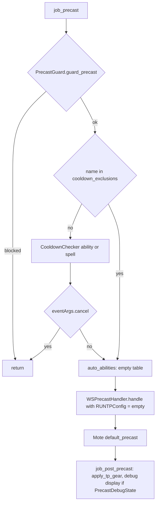
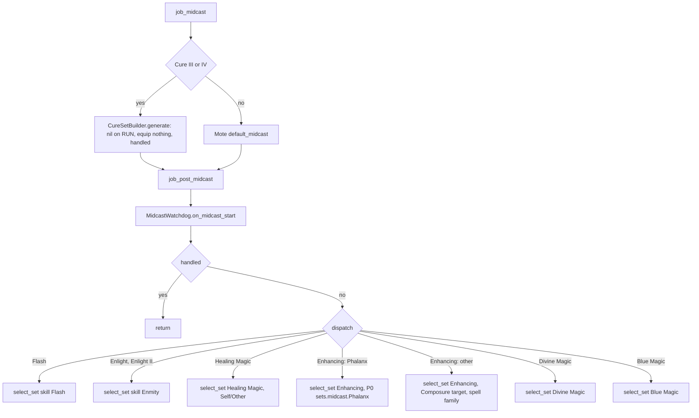

# RUN (Rune Fencer) job

The RUN job area is 12 hook files plus 4 logic modules under
`shared/jobs/run/functions/` (1 408 lines), one entry template, six config
files and one sets file. No live character plays it: `character_db.lua` lists
RUN in `ARCHIVE_JOBS`, there is no `Tetsouo_RUN.lua`, and the only deployed copy
is the frozen `Hysoka/` clone (not analysed here). GearSwap would load it when
the main job becomes RUN; from then on Mote-Include calls its hooks on every
action, on status and buff changes, on `//gs c` commands and on state cycles.

RUN is structurally a copy of [PLD](pld.md) with less in it. What it adds on top
of the shared pipeline:

- **Weapon + grip set builder**: `MainWeapon` (Epeolatry, Lycurgos) and
  `SubWeapon` (Utu, Refined grip), grip skipped for Lycurgos, HybridMode
  PDT/MDT sets.
- **Name-before-skill midcast**: Flash and Enlight caught before the Divine
  skill, target-aware Cure III/IV, Phalanx by name, Enhancing by spell family,
  Blue Magic under one set.
- **Rune command** (`//gs c rune`) from `state.RuneMode`, and a BLU AOE rotation
  (`//gs c aoe`) with the BLU config loaded by the entry.
- **No gear swap for runes**: `sets.precast.JA` is empty on purpose.

It has no ward/rune tracking, no Gambit/Rayke logic and no Dark Magic routing,
whatever the entry header says (`Tetsouo_RUN.lua:9-13,23`).

Every file in scope was read in full except the gear content of the sets file.
All line numbers refer to the working tree on 2026-09-19, uncommitted changes
included (only `RUN_KEYBINDS.lua` is modified).

## Files

| Path | Lines | Role |
|------|------:|------|
| `_master/entry/Tetsouo_RUN.lua` | 252 | Entry point (template): same shape as PLD, BLU config preloaded (no TP config), keybinds deferred 0.5 s, initial macro book / lockstyle deferred 0.2 s |
| `shared/jobs/run/functions/run_functions.lua` | 116 | Facade: includes `message_buffs` and the 11 hook files, requires `dualbox_manager` |
| `shared/jobs/run/functions/RUN_PRECAST.lua` | 173 | `job_precast` (guard, cooldown, WS) / `job_post_precast` (TP gear, precast debug display) |
| `shared/jobs/run/functions/RUN_MIDCAST.lua` | 153 | `job_midcast` (Cure III/IV) / `job_post_midcast` (dispatch) |
| `shared/jobs/run/functions/RUN_AFTERCAST.lua` | 27 | `LifecycleManager.aftercast()`, empty `job_post_aftercast` |
| `shared/jobs/run/functions/RUN_IDLE.lua` | 43 | `customize_idle_set` -> `SetBuilder.build_idle_set` |
| `shared/jobs/run/functions/RUN_ENGAGED.lua` | 43 | `customize_melee_set` -> `SetBuilder.build_engaged_set` |
| `shared/jobs/run/functions/RUN_STATUS.lua` | 19 | `LifecycleManager.status_change()` |
| `shared/jobs/run/functions/RUN_BUFFS.lua` | 19 | `LifecycleManager.buff_change()` |
| `shared/jobs/run/functions/RUN_COMMANDS.lua` | 199 | `job_self_command` router, `job_state_change` (UI refresh only) |
| `shared/jobs/run/functions/RUN_MOVEMENT.lua` | 35 | Comments only |
| `shared/jobs/run/functions/RUN_LOCKSTYLE.lua` | 47 | Lazy `LockstyleManager.create('RUN', 'config/run/RUN_LOCKSTYLE', 1, 'SAM')` |
| `shared/jobs/run/functions/RUN_MACROBOOK.lua` | 42 | Lazy `MacrobookManager.create('RUN', ..., 'SAM', 1, 1)` |
| `shared/jobs/run/functions/logic/set_builder.lua` | 188 | Idle/engaged: HybridMode, weapon, grip, town, movement |
| `shared/jobs/run/functions/logic/aoe_manager.lua` | 172 | BLU rotation (byte-identical to PLD's except two strings) |
| `shared/jobs/run/functions/logic/cure_set_builder.lua` | 53 | CureSelf / CureOther for Cure III/IV (identical to PLD's) |
| `shared/jobs/run/functions/logic/rune_manager.lua` | 79 | `//gs c rune` (identical to PLD's) |
| `_master/config/run/RUN_STATES.lua` | 154 | States, unused `validate` |
| `_master/config/run/RUN_KEYBINDS.lua` | 171 | 5 binds, unbind-all-then-bind (uncommitted), intro without macro/lockstyle info |
| `_master/config/run/RUN_LOCKSTYLE.lua` | 73 | Style 3 (`default`, `by_subjob`, `get_style`) |
| `_master/config/run/RUN_MACROBOOK.lua` | 78 | Books 15-20 (same numbers as PLD) |
| `_master/config/run/RUN_TP_CONFIG.lua` | 74 | `_G.RUNTPConfig` - **never loaded** |
| `_master/config/run/RUN_BLU_MAGIC.lua` | 203 | Copy of `PLD_BLU_MAGIC`; loaded by the entry as `_G.BluMagicConfig` |
| `_master/sets/run_sets.lua` | 401 | Template sets (flat) |
| `shared/data/job_abilities/RUN_JA_DATABASE.lua` + `run/*.lua` | 13 + 276 | JA descriptions (runes, wards, SP) for `ability_message_handler` |
| `shared/utils/messages/data/jobs/run_messages.lua` | 28 | Valiance/Vallation expiry templates - no caller |

Live copies: none under `Tetsouo/` or `Kaories/`. `Hysoka/` has RUN and is a
frozen clone; it was not read.

## How it works

### Load sequence

```mermaid
sequenceDiagram
    participant GS as GearSwap
    participant E as Tetsouo_RUN.lua
    participant M as Mote-Include
    participant F as run_functions.lua
    GS->>E: run chunk (LOCKSTYLE_CONFIG, UIConfig, REGION_CONFIG)
    GS->>E: get_sets()
    E->>M: include Mote-Include (line 63)
    M->>E: user_setup(): states, schedule keybinds +0.5 s, UI, JCM, schedule macro/lockstyle gate +0.2 s, dualbox
    M->>E: init_gear_sets() -> include sets/run_sets.lua (238)
    E->>E: INIT_SYSTEMS, data_loader, message hooks (65-90)
    E->>E: _G.LockstyleConfig, _G.RECAST_CONFIG (92-93); _G.BluMagicConfig (97); TP / ward configs commented out (99-101)
    E->>E: JobChangeManager.cancel_all() (104-107)
    E->>F: include run_functions.lua (110)
    E->>E: register_lockstyle_cancel("RUN", ...) (114-116)
    Note over E: +0.2 s: select_default_macro_book(), lockstyle after 8 s (193-198)
    Note over E: +0.5 s: RUNKeybinds.bind_all() (164-170)
```

`user_setup()` (`Tetsouo_RUN.lua:156-221`):

1. `RUNStates.configure()` (158-159).
2. Keybinds in a `coroutine.schedule(..., 0.5)` (164-170): `require` into the
   global `RUNKeybinds`, `bind_all()`. Why they are deferred is not recorded.
3. `KeybindUI.smart_init("RUN", UIConfig.init_delay)` (175-178).
4. `JobChangeManager.initialize()`, then the macrobook/lockstyle gate is
   scheduled 0.2 s later (193-198), the same pattern as BRD. The gate needs
   `select_default_macro_book` and `select_default_lockstyle`; at `user_setup`
   time nothing defines them on RUN (the keybinds are not loaded yet and
   `RUNKeybinds.show_intro()` does not `require` the wrapper files,
   `RUN_KEYBINDS.lua:151-157`). The facade defines them during the rest of
   `get_sets()` (`run_functions.lua:66-67`), so 0.2 s later the gate passes:
   macro book at once, lockstyle after `initial_load_delay` (8 s). Before
   2026-09-19 the gate ran synchronously and a fresh load or main job change
   applied neither.
5. `pcall(require, 'shared/utils/dualbox/dualbox_manager')`; a dual-box alt job
   update that brings a new job or subjob later calls `select_default_macro_book()`
   (`dualbox_manager.lua:324-328`).
6. A commented-out WarpInit block (209-220).

`run_functions.lua` includes `message_buffs.lua` (29), `RUN_PRECAST`,
`RUN_MIDCAST`, `RUN_AFTERCAST` (36-40), `RUN_IDLE`, `RUN_ENGAGED` (47-49),
`RUN_STATUS`, `RUN_BUFFS` (56-58), `RUN_LOCKSTYLE`, `RUN_MACROBOOK`,
`RUN_COMMANDS`, `RUN_MOVEMENT` (66-70), then `dualbox_manager` (104). Its
header names the file `pld_functions.lua` (12).

### Precast

`job_precast` (`RUN_PRECAST.lua:87-116`) then Mote's `default_precast`, then
`job_post_precast` (`:123-160`):



- `cooldown_exclusions` (49-74) is the same Scholar list as PLD's, redundant
  with `CooldownChecker` ([precast pipeline](../systems/precast-pipeline.md)).
- `auto_abilities` is an empty table and the loop over it at 106-109 never
  fires.
- `RUNTPConfig = _G.RUNTPConfig or {}` (42): the entry never loads
  `RUN_TP_CONFIG.lua` (the line is commented out and spells the global
  `RUNTPCONFIG`, `Tetsouo_RUN.lua:100`), so no TP-bonus gear is computed.
- Mote's default precast: `sets.precast.FC` for magic (no name/skill variants
  defined), `sets.precast.JA[name]` for JAs, `sets.precast.WS[name]` for WS.
  `sets.precast.JA` is `{}` (`run_sets.lua:139`): runes and any JA without a
  named set swap nothing, by design ("No set defined = no equipment change",
  `run_sets.lua:158-160`).
- `sets.precast.WS['Resolution'|'Dimidiation'|'Herculean Slash'|'Spinning
  Slash'|'Ground Strike']` are `set_combine(sets.precast.WS, {})`
  (`run_sets.lua:260-264`): the generic gear until each gets its own. Mote's
  `get_named_set` returns the named table when it exists
  (`Mote-Include.lua:963-965`), so an empty `{}` there (as before 2026-09-19)
  equipped nothing and hid the generic set.
- `job_post_precast` debug block (134-159): when `_G.PrecastDebugState`
  (`//gs c debugprecast`), prints which FC set Mote picked.

### Midcast

Same Mote order as PLD: `job_midcast`, `default_midcast` unless handled,
`job_post_midcast` (`Mote-Include.lua:254-276`).



- `CureSetBuilder` needs `sets.midcast.CureSelf` / `CureOther`
  (`cure_set_builder.lua:37`), which `run_sets.lua` does not define: it returns
  nil, and `handled` still suppresses Mote's default, so Cure III/IV wear the
  precast set through the cast.
- `sets.midcast['Healing Magic']` and `['Divine Magic']` are absent, so those
  routes are no-ops (`midcast_manager.lua:624-629`). Enlight is a PLD spell;
  the branch only matters for a /PLD subjob that cannot learn it.
- Flash, Foil and Crusade alias `sets.midcast.SIRDEnmity`
  (`run_sets.lua:348-350`); Phalanx and Regen have named sets (`:331,354`,
  Regen IV reaches `Regen` through the P1 tier strip); every Blue spell wears
  `sets.midcast['Blue Magic']` (`:372`).
- The file header still describes a PLD-style "XP mode (SIRD vs Potency)" for
  Phalanx (`RUN_MIDCAST.lua:9`); RUN has no such state.

### Aftercast, idle, engaged, status, buffs

- `job_aftercast` = MidcastWatchdog tick; status and buff changes are the
  shared Doom handlers ([core lifecycle](../systems/core-lifecycle.md)).
- `build_engaged_set` (`set_builder.lua:108-136`): Mote base
  (`sets.engaged.PDT`/`.MDT` through `HybridMode`) -> the HybridMode set again
  (`set_combine`, 115-127) -> `sets[MainWeapon]` -> `sets[SubWeapon]` unless
  MainWeapon is Lycurgos (`apply_grip`, 62-84).
- `build_idle_set` (145-182): town base (`sets.Adoulin` / `sets.idle.Town`) or
  Mote's idle -> HybridMode idle set (field only) -> weapon -> grip -> return in
  town, else `sets.MoveSpeed` when moving.
- For Lycurgos the grip is skipped, not removed: whatever grip was in the sub
  slot stays there, while the header says "sub=empty"
  (`set_builder.lua:19` vs `:62-70`).

### Differences from PLD

The two jobs were cloned from the same files; this is what diverged.

| Area | PLD | RUN |
|------|-----|-----|
| Entry configs | `PLD_TP_CONFIG` and `PLD_BLU_MAGIC` loaded (`Tetsouo_PLD.lua:97-98`) | `RUN_BLU_MAGIC` loaded (`Tetsouo_RUN.lua:97`), TP config commented out (100) |
| Keybinds | loaded synchronously, intro requires the factory wrappers | deferred 0.5 s, intro does not require them; initial macro book / lockstyle gate deferred 0.2 s instead |
| Precast | Divine Emblem / Majesty auto-abilities, Cure/Flash precast equips, CureSelf FC, Sortie override | none of these; precast debug display instead |
| Midcast order | Healing checked before Flash | Flash and Enlight checked first |
| Phalanx | SIRD override (`Xp`, `PhalanxSIRD`) or pseudo-skill `Phalanx` | plain Enhancing, name set wins |
| Blue Magic | `Cocoon` pseudo-skill, else `Blue Magic` (no base set) | `Blue Magic` with a base set |
| Enmity override | `EnmityOverride` after dispatch | none |
| Set builder | weapon + shield, BurtgangKC, Shining grip, XP, Sortie map | weapon + grip, Lycurgos skip |
| HybridMode | PDT, MDT, Sortie; profile hook in `job_state_change` | PDT, MDT; UI refresh only |
| Subjob-filtered binds | Xp (/RDM), RuneMode (/RUN), SneakInviAOE (/SCH) | none |
| /SCH helpers | `aoe sneak` / `invi` / `erase`, `lightarts` | none |

## Mote states

Created by `RUNStates.configure()` (`_master/config/run/RUN_STATES.lua:36-115`).
Keybinds from `RUN_KEYBINDS.lua:32-58`; none of them has a `subjob` filter.

| State | Values | Default | Key | Read by |
|-------|--------|---------|-----|---------|
| `HybridMode` (Mote) | PDT, MDT | PDT | `^numpad9` | Mote `get_melee_set`; `set_builder.lua:116-121,154-160` |
| `MainWeapon` | Epeolatry, Lycurgos | Epeolatry | `^numpad1` | `set_builder.lua:48,64` |
| `SubWeapon` | Utu, Refined | Refined | `^numpad2` | `set_builder.lua:73-74` |
| `RuneMode` | Ignis .. Tenebrae (8) | Ignis | `^numpad3` | `rune_manager.lua:95` |
| `FastCast` | 0..80 step 10 | 30 | none | `midcast_watchdog.lua` |
| `AutoMedicine` | shared On/Off | persisted | `#numpad0` | `AutoMedicine.init` (`RUN_STATES.lua:111-114`) |

The UI readiness anchor for RUN is `state.RuneElement`
(`ui_lifecycle.lua:56-57`), a state RUN never creates: `smart_init` always
polls to its timeout, and a `gs reload` inside that window can leave a second,
frozen HUD (see [UI overlay](../systems/ui-overlay.md)).

## Commands

`job_self_command` (`RUN_COMMANDS.lua:69-181`): watchdog, dual-box internals,
CommonCommands, `ui`, `debugmidcast`, `cyclestate`, then RUN commands.

| Command | Effect | Handler |
|---------|--------|---------|
| `watchdog ...` | MidcastWatchdog | 82-85 |
| `altjobupdate` / `requestjob` | Dual-box job exchange | 90-106 |
| common commands | as on every job | 111-122 |
| `ui ...` | UI toggles | 127-131 |
| `debugmidcast` | MidcastManager debug toggle | 136-146 |
| `cyclestate <State>` | `CycleHandler` | 155-158 |
| `aoe` | BLU rotation (`_G.BluMagicConfig` from `RUN_BLU_MAGIC`) | 165-171 -> `aoe_manager.lua:111-114` |
| `rune` | `/ja "<RuneMode>" <me>` unless on recast | 174-180 -> `rune_manager.lua:89-126` |

`job_state_change = LifecycleManager.state_change()` (191): HUD refresh only. It tests no state name except `Moving` (which has no description, so Mote and the UI-aware `cyclestate` both pass `Moving`), so it accepts the state key and the description alike.
No RUN command name is claimed by any alt-command config.

## Set names the code looks up

T = `_master/sets/run_sets.lua` (the only sets file in scope).

| Set | Looked up by | T |
|-----|--------------|---|
| `sets.Epeolatry`, `sets.Lycurgos` | `set_builder.lua:48` | 58, 61 |
| `sets.Utu`, `sets.Refined` | `set_builder.lua:74` | 64, 65 |
| `sets.idle`, `.PDT`, `.MDT` | Mote base, `set_builder.lua:156-159` | 72, 88, 91 |
| `sets.engaged`, `.PDT`, `.MDT` | Mote base, `set_builder.lua:118-121` | 98, 115, 118 |
| `sets.idle.Town`, `sets.Adoulin`, `sets.MoveSpeed` | BaseSetBuilder, movement | 384 (`= MoveSpeed`), 387, 379 |
| `sets.precast.JA` (empty) + 14 named JAs on `sets.FullEnmity` | Mote default precast | 139, 142, 163-200 |
| `sets.precast.FC` | Mote default precast | 221 |
| `sets.precast.WS`, `['Armor Break']` | Mote default precast | 242, 267 |
| `sets.precast.WS['Resolution']` and 4 other GS WS | Mote default precast | 260-264 (`set_combine(sets.precast.WS, {})`) |
| `sets.midcast.Enmity`, `.SIRDEnmity` | skill `Enmity`; aliases | 293, 296 |
| `sets.midcast['Flash']`, `['Foil']`, `['Crusade']` | skill `Flash`; P0 | 348-350 |
| `sets.midcast['Enhancing Magic']`, `['Regen']`, `['Phalanx']` | skill base, P0/P1 | 314, 331, 354 |
| `sets.midcast['Blue Magic']` | skill base | 372 |
| `sets.midcast.CureSelf`, `.CureOther` | `cure_set_builder.lua:37` | **absent** |
| `sets.midcast['Healing Magic']`, `['Divine Magic']` | `select_set` base | **absent** |
| `sets.buff.Doom` | DoomManager | 396 |

## Configuration

| File / key | Default | Where the default lives | Read by |
|------------|---------|-------------------------|---------|
| `<char>/config/run/RUN_STATES.lua` | see states | file | entry `user_setup` (hard-coded `Tetsouo/...`) |
| `<char>/config/run/RUN_KEYBINDS.lua` | 5 binds | file | entry (deferred), `job_sub_job_change`, `file_unload` |
| `<char>/config/run/RUN_LOCKSTYLE.lua` | 3 | file; factory fallback 1 | `LockstyleManager` (8 s after load, see above) |
| `<char>/config/run/RUN_MACROBOOK.lua` | book 15 page 1 | file; fallback book 1 page 1 | `MacrobookManager` (0.2 s after load, dual-box update) |
| `<char>/config/run/RUN_TP_CONFIG.lua` | Moonshade | file | nothing (entry line 100 commented) |
| `<char>/config/run/RUN_BLU_MAGIC.lua` | 5 AOE spells | file | entry `_G.BluMagicConfig` (97) -> `aoe_manager` |
| `RUN_WARD_CONFIG` | - | does not exist | commented reference, `Tetsouo_RUN.lua:101` |
| `RECAST_CONFIG`, `LOCKSTYLE_CONFIG`, `REGION_CONFIG`, UI config | - | shared | entry, `is_on_cooldown` |

## State & lifetime

- Module state: `aoe_manager` `SpellTracker`, lazy-load locals; all
  sandbox-local.
- `_G` written: the Mote hooks, `RUNKeybinds` (0.5 s after load),
  `LockstyleConfig`, `RECAST_CONFIG`, `RegionConfig`, the factory wrappers and
  exports. Nothing on `windower.*`, no events.
- Keybinds: bound 0.5 s after `user_setup`, unbound in `file_unload`
  (`Tetsouo_RUN.lua:249-251`). `bind_all` unbinds the full list first.
- Coroutines: the 0.5 s keybind load; the scheduled keybind coroutine is not
  cancelled by a reload, so a reload inside those 0.5 s binds from the old
  sandbox.
- Every subjob change ends in a `gs reload`; states reset to defaults. See
  [job change lifecycle](../architecture/job-change-lifecycle.md).

## Interactions

- Precast: `PrecastGuard`, `CooldownChecker`, `WSPrecastHandler`
  ([precast pipeline](../systems/precast-pipeline.md)); no `AbilityHelper`.
- Midcast: `MidcastManager`, `MidcastWatchdog`, `ENHANCING_MAGIC_DATABASE`
  ([midcast and buffs](../systems/midcast-and-buffs.md)).
- Commands: `CommonCommands`, `UICommands`, `WatchdogCommands`,
  `CycleHandler`, `LifecycleManager`
  ([commands and debug](../systems/commands-and-debug.md)).
- Factories, JobChangeManager, UI ([UI overlay](../systems/ui-overlay.md)),
  dual-box ([dualbox](../systems/dualbox.md)).
- [PLD](pld.md): the three shared-by-copy logic modules and the BLU config.

## Invariants & gotchas

- `RUNKeybinds` is nil during the first 0.5 s of every sandbox; anything that
  reads it (`job_sub_job_change`, `file_unload`) must guard it, and does.
- The initial macrobook and lockstyle rely on the 0.2 s deferred gate in
  `user_setup` (see Load sequence), not on a `show_intro` side effect: moving
  that gate back to a synchronous call would make it fail again.
- An empty named set is not a fallback: `sets.precast.WS['X'] = {}` hides
  `sets.precast.WS`. Use `set_combine(sets.precast.WS, {})`.
- `sets.precast.JA = {}` is intentional: runes keep the tank set.
- `aoe_manager` captures `_G.BluMagicConfig` when first required.

## Extending

- Load the TP config in the entry next to the BLU one:
  `require('Tetsouo/config/run/RUN_TP_CONFIG')` (sets `_G.RUNTPConfig`).
- New weapon: add it to `state.MainWeapon` and `sets.<Name>`; if it takes no
  grip, extend the Lycurgos test in `apply_grip` (`set_builder.lua:64`).
- New midcast route: add a branch in `job_post_midcast` (`RUN_MIDCAST.lua:127-139`)
  and define `sets.midcast['<Skill>']`, or the route is a no-op.
- New state/bind: `RUN_STATES.lua` + `RUN_KEYBINDS.lua`, keeping `^numpad9` =
  HybridMode and `^numpad3` = RuneMode (`.claude/rules/keybinds.md`).

## Known issues

- No TP-bonus gear: `RUN_TP_CONFIG` is never loaded (`Tetsouo_RUN.lua:100`,
  `RUN_PRECAST.lua:42`).
- Cure III/IV get no midcast set (no CureSelf/CureOther) and Healing/Divine
  routes are no-ops (`RUN_MIDCAST.lua:59-67`, `cure_set_builder.lua:37`).
- UI readiness anchor `RuneElement` does not exist (`ui_lifecycle.lua:56-57`).
- Empty `auto_abilities` table and loop (`RUN_PRECAST.lua:76-80,106-109`).
- Lycurgos leaves the previous grip in place, unlike its header
  (`set_builder.lua:19,62-70`).
- BLU dynamic rotation reads the main job's data
  (`_master/config/run/RUN_BLU_MAGIC.lua:104`), as on PLD.
- Rune descriptions for Gelus, Tellus and Unda disagree with the RUN/PLD state
  comments (`shared/data/job_abilities/run/run_subjob.lua:35,51,67` vs
  `RUN_STATES.lua:85-89`).
- The uncommitted unbind loop in `bind_all` fixes nothing today: no RUN bind
  has a `subjob` filter (`RUN_KEYBINDS.lua:32-58,100-102`).
- Duplicated with PLD: `aoe_manager`, `cure_set_builder`, `rune_manager`,
  `RUN_BLU_MAGIC`, `cooldown_exclusions`, the `job_midcast` skeleton
  (`RUN_MIDCAST.lua:50-68`).
- Dead: `RUNStates.validate`, `run_messages.lua` (no caller), commented
  WarpInit block (`Tetsouo_RUN.lua:209-220`).
- Stale headers: `Tetsouo_RUN.lua:9-13,18,23` (modules that do not exist),
  `run_functions.lua:12`, `RUN_IDLE.lua:4-7` and `RUN_ENGAGED.lua:4-7` (modes
  and dual wield that do not exist), `RUN_KEYBINDS.lua:9`, `RUN_STATES.lua:11,45,54,65,80`
  (Alt keys), `RUN_MIDCAST.lua:9`.
- User docs: `docs/user/jobs/run/README.md` calls `cure_set_builder`
  "priority-based cure target selection", omits `SubWeapon`/`AutoMedicine`,
  and its setup steps do not mention the `Tetsouo/...` paths hard-coded in the
  entry; `docs/user/guides/commands.md:209-214` lists `aoe` as working.
