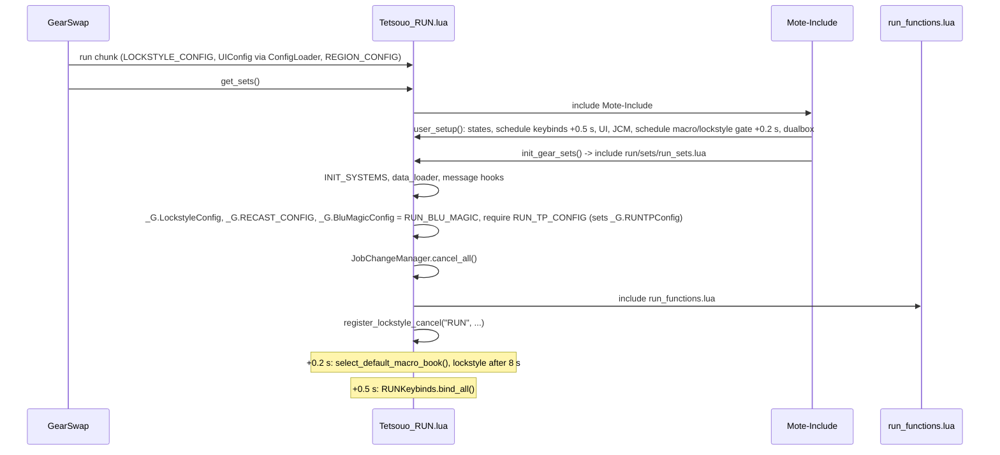
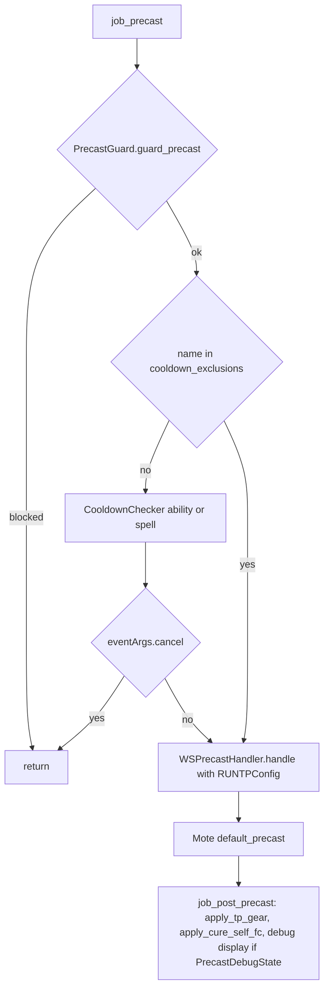
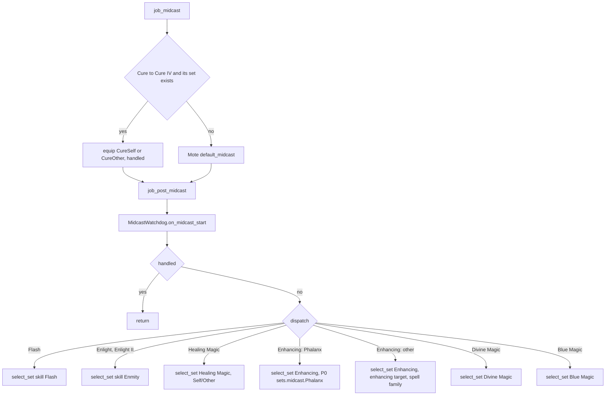

# RUN (Rune Fencer) job

The RUN job area is 12 hook files plus 4 logic modules under
`shared/jobs/run/functions/` (1 429 lines on 2026-09-28), one entry template, eight
config files and one sets file. No live character plays it: `character_db.lua` lists
RUN in `ARCHIVE_JOBS`, there is no `Tetsouo_RUN.lua` under `Tetsouo/`, and the only
deployed copy is the frozen `Hysoka/` clone (not analysed here). GearSwap would load
it when the main job becomes RUN; from then on Mote-Include calls its hooks on every
action, on status and buff changes, on `//gs c` commands and on state cycles.

RUN is structurally a copy of [PLD](pld.md) with less in it. What it adds on top of
the shared pipeline:

- **Weapon + grip set builder**: `MainWeapon` (Epeolatry, Lycurgos) and `SubWeapon`
  (Utu, Refined grip), the grip worn with every weapon (Lycurgos included since
  2026-09-29), HybridMode PDT/MDT sets.
- **Name-before-skill midcast**: Flash and Enlight caught before the Divine skill,
  target-aware Cure to Cure IV (subjob), Phalanx by name, Enhancing by spell family,
  Blue Magic under one set.
- **Self-cure HP gap**: `sets.precast.FC.CureSelf` on a self cure, as on PLD.
- **Rune command** (`//gs c rune`) from `state.RuneMode`, and a BLU AOE rotation
  (`//gs c aoe`) with the BLU config loaded by the entry.
- **No gear swap for runes**: `sets.precast.JA` is empty on purpose.
- **TP bonus**: `RUN_TP_CONFIG.lua` (Moonshade, Lionheart) is loaded by the entry.

It has no ward / rune tracking, no Gambit / Rayke logic, no AbilityHelper call and
no Dark Magic routing.

Player-facing pages: [RUN hub](../../user/jobs/run/README.md),
[modes](../../user/jobs/run/states.md), [sets](../../user/jobs/run/sets.md).

Every file in scope was read in full on 2026-09-28 except the gear content of the
sets file. References are `file` + function; line numbers are avoided because they
drift.

## Files

| Path | Lines | Role |
|------|------:|------|
| `_master/entry/Tetsouo_RUN.lua` | 268 | Entry point (template): same shape as PLD; BLU and TP configs loaded in `get_sets`; keybinds deferred 0.5 s; initial macro book / lockstyle deferred 0.2 s |
| `shared/jobs/run/functions/run_functions.lua` | 113 | Facade: includes `message_buffs` and the 11 hook files, requires `dualbox_manager` |
| `shared/jobs/run/functions/RUN_PRECAST.lua` | 180 | `job_precast` (guard, cooldown, WS) / `job_post_precast` (TP gear, self-cure FC, precast debug display) |
| `shared/jobs/run/functions/RUN_MIDCAST.lua` | 157 | `job_midcast` (Cure to Cure IV) / `job_post_midcast` (dispatch) |
| `shared/jobs/run/functions/RUN_AFTERCAST.lua` | 38 | `LifecycleManager.aftercast()`, empty `job_post_aftercast` |
| `shared/jobs/run/functions/RUN_IDLE.lua` | 43 | `customize_idle_set` -> `SetBuilder.build_idle_set` |
| `shared/jobs/run/functions/RUN_ENGAGED.lua` | 41 | `customize_melee_set` -> `SetBuilder.build_engaged_set` |
| `shared/jobs/run/functions/RUN_STATUS.lua` | 20 | `LifecycleManager.status_change()` |
| `shared/jobs/run/functions/RUN_BUFFS.lua` | 19 | `LifecycleManager.buff_change()` |
| `shared/jobs/run/functions/RUN_COMMANDS.lua` | 202 | `job_self_command` router, `job_state_change = LifecycleManager.state_change()` (HUD refresh only) |
| `shared/jobs/run/functions/RUN_MOVEMENT.lua` | 24 | Comments only |
| `shared/jobs/run/functions/RUN_LOCKSTYLE.lua` | 47 | Lazy `LockstyleManager.create('RUN', 'run/display/RUN_LOCKSTYLE', 1, 'SAM')` |
| `shared/jobs/run/functions/RUN_MACROBOOK.lua` | 42 | Lazy `MacrobookManager.create('RUN', ..., 'SAM', 1, 1)` |
| `shared/jobs/run/functions/logic/set_builder.lua` | 174 | Idle/engaged: HybridMode, weapon, grip, town, movement |
| `shared/jobs/run/functions/logic/aoe_manager.lua` | 182 | BLU rotation (same code as PLD's except strings; refuses without /BLU) |
| `shared/jobs/run/functions/logic/cure_set_builder.lua` | 57 | CureSelf / CureOther for Cure to Cure IV (subjob), `is_cure` |
| `shared/jobs/run/functions/logic/rune_manager.lua` | 76 | `//gs c rune` (same code as PLD's) |
| `_master/config/run/RUN_STATES.lua` | 118 | States |
| `_master/config/run/RUN_KEYBINDS.lua` | 45 | Data only: 4 bind entries handed to `KeybindManager.create('RUN', ...)`, plus the character's `COMMON_KEYBINDS.lua` keys |
| `_master/config/run/RUN_CUSTOM.lua` | 119 | Player modes and gear rules, commented examples only ([keybinds and custom states](../systems/keybinds-and-custom.md)) |
| `_master/config/run/RUN_HUD.lua` | 31 | HUD section / row order for RUN (empty lists = the default) |
| `_master/config/run/RUN_LOCKSTYLE.lua` | 72 | Style 3 (`default`, `by_subjob`, `get_style`) |
| `_master/config/run/RUN_MACROBOOK.lua` | 76 | Books 15-20 (same numbers as PLD) |
| `_master/config/run/RUN_TP_CONFIG.lua` | 74 | `_G.RUNTPConfig` (Moonshade piece, Lionheart weapon), loaded by the entry |
| `_master/config/run/RUN_BLU_MAGIC.lua` | 203 | Copy of `PLD_BLU_MAGIC`; loaded by the entry as `_G.BluMagicConfig` |
| `_master/sets/run_sets.lua` | 432 | Template sets (flat) |
| `shared/data/job_abilities/RUN_JA_DATABASE.lua` + `run/*.lua` | 13 + 276 | JA descriptions (runes, wards, SP) for `ability_message_handler` |

Live copies: none under `Tetsouo/` or `Kaories/`, and no RUN overlay under
`_master/<Character>/`. `Hysoka/` has RUN and is a frozen clone; it was not read.

## How it works

### Load sequence


```mermaid
sequenceDiagram
    participant GS as GearSwap
    participant E as Tetsouo_RUN.lua
    participant M as Mote-Include
    participant F as run_functions.lua
    GS->>E: run chunk (LOCKSTYLE_CONFIG, UIConfig via ConfigLoader, REGION_CONFIG)
    GS->>E: get_sets()
    E->>M: include Mote-Include
    M->>E: user_setup(): states, schedule keybinds +0.5 s, UI, JCM, schedule macro/lockstyle gate +0.2 s, dualbox
    M->>E: init_gear_sets() -> include run/sets/run_sets.lua
    E->>E: INIT_SYSTEMS, data_loader, message hooks
    E->>E: _G.LockstyleConfig, _G.RECAST_CONFIG, _G.BluMagicConfig = RUN_BLU_MAGIC, require RUN_TP_CONFIG (sets _G.RUNTPConfig)
    E->>E: JobChangeManager.cancel_all()
    E->>F: include run_functions.lua
    E->>E: register_lockstyle_cancel("RUN", ...)
    Note over E: +0.2 s: select_default_macro_book(), lockstyle after 8 s
    Note over E: +0.5 s: RUNKeybinds.bind_all()
```

`user_setup()` (`Tetsouo_RUN.lua`):

1. `RUNStates.configure()`.
2. Keybinds in a `coroutine.schedule(..., 0.5)`: `require` into the global
   `RUNKeybinds`, `bind_all()`; a failed `require` prints
   `[RUN] Keybinds failed to load: <error>`. Why they are deferred is not recorded.
3. `KeybindUI.smart_init("RUN", UIConfig.init_delay)`.
4. `JobChangeManager.initialize()`, then the macrobook / lockstyle gate is scheduled
   0.2 s later, the same pattern as BRD. At `user_setup` time nothing defines
   `select_default_macro_book` / `select_default_lockstyle` on RUN (the keybinds,
   whose `KeybindManager` intro requires the wrapper files, come 0.5 s later). The
   facade defines them during the rest of `get_sets()`, so 0.2 s later the gate
   passes: macro book at once, lockstyle after `initial_load_delay` (8 s).
5. `pcall(require, 'shared/utils/dualbox/dualbox_manager')`; a dual-box alt job
   update that brings a new job or subjob later calls `select_default_macro_book()`
   (`dualbox_manager.lua` `receive_alt_job`).
6. A commented-out WarpInit block (`WarpInit.init()` runs for every job from
   `INIT_SYSTEMS`).

`file_unload` cancels pending JobChangeManager operations and calls
`RUNKeybinds.unbind_all()` when the global exists. RUN has no ammo lock to release.

`run_functions.lua` includes `message_buffs.lua`, `RUN_PRECAST`, `RUN_MIDCAST`,
`RUN_AFTERCAST`, `RUN_IDLE`, `RUN_ENGAGED`, `RUN_STATUS`, `RUN_BUFFS`,
`RUN_LOCKSTYLE`, `RUN_MACROBOOK`, `RUN_COMMANDS`, `RUN_MOVEMENT`, then requires
`dualbox_manager`.

### Precast

`job_precast` (`RUN_PRECAST.lua`), then Mote's `default_precast`, then
`job_post_precast`:


```mermaid
flowchart TD
    A[job_precast] --> B{PrecastGuard.guard_precast}
    B -- blocked --> Z[return]
    B -- ok --> C{name in cooldown_exclusions}
    C -- no --> D[CooldownChecker ability or spell]
    D --> E{eventArgs.cancel}
    E -- yes --> Z
    E -- no --> G
    C -- yes --> G[WSPrecastHandler.handle with RUNTPConfig]
    G --> H[Mote default_precast]
    H --> I[job_post_precast: apply_tp_gear, apply_cure_self_fc, debug display if PrecastDebugState]
```

- `cooldown_exclusions` is the same 22-name Scholar list as PLD's, redundant with
  `CooldownChecker` ([precast pipeline](../systems/precast-pipeline.md#recast-check)).
- `RUNTPConfig = _G.RUNTPConfig or {}` is captured on the first action. The entry
  requires `RUN_TP_CONFIG.lua` in `get_sets`, and that file sets `_G.RUNTPConfig`,
  so the TP bonus is computed (Moonshade +250, Lionheart +500). The comment above
  that line in `ensure_modules_loaded` ("The entry does not load RUN_TP_CONFIG, so
  this is normally {}") is stale.
- Mote's default precast: `sets.precast.FC` for magic (no name / skill variants
  defined), `sets.precast.JA[name]` for JAs, `sets.precast.WS[name]` for WS.
  `sets.precast.JA` is `{}`: runes and any JA without a named set swap nothing, by
  design. The 15 named JAs (Vallation ... Odyllic Subterfuge) are built on
  `sets.FullEnmity`.
- `sets.precast.WS['Resolution'|'Dimidiation'|'Herculean Slash'|'Spinning Slash'|'Ground Strike']`
  are `set_combine(sets.precast.WS, {})`: the generic gear until each gets its own.
  Mote's `get_named_set` returns the named table when it exists, so an empty `{}`
  there would equip nothing and hide the generic set.
- `apply_cure_self_fc` (local): on a self-targeted Cure to Cure IV
  (`CureSetBuilder.is_cure`), equips `sets.precast.FC.CureSelf` over Mote's FC set.
- Debug block: when `_G.PrecastDebugState` is on (`//gs c debugprecast`), prints which
  FC set Mote picked (name, then skill, then base) through `MessagePrecast`.

### Midcast

Same Mote order as PLD: `job_midcast`, `default_midcast` unless handled,
`job_post_midcast`, then `midcast_fallback.lua` for unrouted spells.


```mermaid
flowchart TD
    A[job_midcast] --> B{Cure to Cure IV and its set exists}
    B -- yes --> C[equip CureSelf or CureOther, handled]
    B -- no --> D[Mote default_midcast]
    C --> E[job_post_midcast]
    D --> E
    E --> F[MidcastWatchdog.on_midcast_start]
    F --> G{handled}
    G -- yes --> Z[return]
    G -- no --> H{dispatch}
    H -- Flash --> H1[select_set skill Flash]
    H -- Enlight, Enlight II --> H2[select_set skill Enmity]
    H -- Healing Magic --> H3[select_set Healing Magic, Self/Other]
    H -- Enhancing: Phalanx --> H4[select_set Enhancing, P0 sets.midcast.Phalanx]
    H -- Enhancing: other --> H5[select_set Enhancing, enhancing target, spell family]
    H -- Divine Magic --> H6[select_set Divine Magic]
    H -- Blue Magic --> H7[select_set Blue Magic]
```

- RUN has no Cure of its own: Cure to Cure IV come from /WHM /RDM (I-IV) or
  /PLD /SCH (I-III). `CureSetBuilder.generate` returns `sets.midcast.CureSelf` on
  yourself, `CureOther` otherwise, and writes nothing. When the set is missing,
  `handled` stays false and the cure goes through Mote and the Healing Magic route.
- Self cure HP gap, as on PLD: `sets.precast.FC.CureSelf` (Fast Cast low on max HP),
  the midcast CureSelf puts the HP back, the cure lands on a bigger gap.
- `sets.midcast['Divine Magic']` is absent, so that route is a no-op
  (`MidcastManager.select_set` returns when `sets.midcast[skill]` is missing).
  Enlight is a PLD spell RUN cannot learn; the branch is inherited.
- Flash, Foil and Crusade alias `sets.midcast.SIRDEnmity`; Phalanx and Regen have
  named sets (Regen IV reaches `Regen` through the P1 tier strip); every Blue spell
  wears `sets.midcast['Blue Magic']`; `sets.midcast['Healing Magic'] = sets.Cure`.

### Aftercast, idle, engaged, status, buffs

- `job_aftercast` = MidcastWatchdog tick; status and buff changes are the shared
  Doom handlers, plus the status hold during an action
  ([core lifecycle](../systems/core-lifecycle.md#lifecyclemanager)).
- `SetBuilder.build_engaged_set`: Mote base (`sets.engaged.PDT` / `.MDT` through
  `HybridMode`) -> the HybridMode set again (`set_combine`) -> weapon
  (`apply_weapon`, `WeaponResolver.set_for('main', ...)`) -> grip (`apply_grip`,
  `WeaponResolver.set_for('sub', SubWeapon)`), whatever the weapon.
- `SetBuilder.build_idle_set`: Mote's idle; in a city `sets.idle` with the town
  set (`sets.Adoulin` / `sets.idle.Town`) on top -> HybridMode idle set (field only) -> weapon -> grip -> return in
  town, else `sets.MoveSpeed` when moving.
- Since 2026-09-29 `apply_grip` has no weapon test: the Lycurgos Great Axe takes
  the SubWeapon grip like Epeolatry (WAR and DRK sets pair Lycurgos with a grip too).
  Before, with Lycurgos the sub slot kept whatever was worn.

### Differences from PLD

| Area | PLD | RUN |
|------|-----|-----|
| Entry configs | `PLD_TP_CONFIG`, `PLD_BLU_MAGIC`, `PLD_WS_CONFIG` | `RUN_TP_CONFIG`, `RUN_BLU_MAGIC` |
| Keybinds | loaded synchronously; the `KeybindManager` intro requires the factory wrappers | deferred 0.5 s; initial macro book / lockstyle gate deferred 0.2 s instead |
| Precast | Divine Emblem / Majesty auto-abilities, CureSelf FC for Cure III/IV, Sortie override, /SCH WS variants | CureSelf FC for every Cure tier; precast debug display |
| Midcast order | Healing checked before Flash | Flash and Enlight checked first |
| Phalanx | SIRD override (`Xp`, `PhalanxSIRD`) or pseudo-skill `Phalanx` | plain Enhancing, name set wins |
| Blue Magic | `Cocoon` pseudo-skill, else `Blue Magic` (no base set) | `Blue Magic` with a base set |
| Enmity override | `EnmityOverride` after dispatch | none |
| Set builder | weapon + shield, BurtgangKC, Shining grip, XP, Regen, Sortie / /SCH maps | weapon + grip (every weapon) |
| HybridMode | PDT, MDT, Sortie (/SCH: DPS, Tanking, Hoxne); profile hook in `job_state_change` | PDT, MDT; HUD refresh only |
| Subjob-filtered binds | Xp (/RDM), RuneMode (/RUN), Regen / Phalanx SIRD (/SCH) | none |
| WS slots | `WS1`, `WS2` | none |
| /SCH helpers | `aoe sneak` / `invi` / `erase`, `lightarts`, `darkarts`: common commands on every job; RUN answers the bare `aoe` (BLU rotation) before them | none |

## Mote states

Created by `RUNStates.configure()` on every `user_setup()`. Keys from
`RUN_KEYBINDS.lua`; none of them has a `subjob` filter.

| State | Values | Default | Key | Read by |
|-------|--------|---------|-----|---------|
| `HybridMode` (Mote's, options replaced) | PDT, MDT | PDT | `^numpad9` | Mote `get_melee_set`; `set_builder.lua` `build_engaged_set`, `build_idle_set` |
| `MainWeapon` | Epeolatry, Lycurgos (Loxotic, Lionheart, Aettir commented out) | Epeolatry | `^numpad1` | `set_builder.lua` `apply_weapon`, `apply_grip` |
| `SubWeapon` | Utu, Refined | Refined | `^numpad2` | `set_builder.lua` `apply_grip` |
| `RuneMode` | Ignis .. Tenebrae (8) | Ignis | `^numpad3` | `rune_manager.lua` `execute_rune` |
| `FastCast` | 0..80 step 10 | 30 | none | `midcast_watchdog.lua` (fallback cast time) |
| `AutoMedicine` | On, Off | On on a cold start, then kept across loads | `#numpad0` (from `_common/keys/COMMON_KEYBINDS.lua`) | `AutoMedicine.init` at the end of `configure()` |

Optional states added to every job: `CombatMode` (hidden, `!numpad0`) and
`TreasureMode` (hidden, `!numpad.`), see
[keybinds and custom states](../systems/keybinds-and-custom.md#optional-states-combat-mode-and-treasure-mode).

The UI readiness anchor for RUN is `state.RuneMode` (`ui_lifecycle.lua`
`are_states_ready`). Until 2026-09-28 it was `state.RuneElement`, a state RUN never
creates, so the HUD always waited the full 5 s `init_delay`.

## Commands

`job_self_command` (`RUN_COMMANDS.lua`): watchdog, dual-box internals,
CommonCommands, `ui`, `debugmidcast`, `cyclestate`, then RUN commands.

| Command | Effect | Handler |
|---------|--------|---------|
| `watchdog ...` | MidcastWatchdog | `WatchdogCommands.handle_command` |
| `altjobupdate` / `requestjob` | Dual-box job exchange (sender name forwarded) | `DualBoxManager` |
| common commands | as on every job | `CommonCommands.handle_command(command, 'RUN', table.unpack(args))` |
| `ui ...` | HUD | `UICommands.handle_ui_command` |
| `debugmidcast` | MidcastManager debug toggle | `MidcastManager.toggle_debug` |
| `cyclestate <State>` | UI-aware cycle | `CycleHandler.handle_cyclestate` |
| `aoe` | BLU rotation (`_G.BluMagicConfig` from `RUN_BLU_MAGIC`); without /BLU it prints "AOE needs the BLU subjob (RUN/BLU)" and casts nothing | `aoe_manager.lua` `execute_aoe` |
| `rune` | `/ja "<RuneMode>" <me>` unless on recast (then `show_ability_cooldown`) | `rune_manager.lua` `execute_rune` |

`job_state_change = LifecycleManager.state_change()`: HUD refresh only, nothing for
`Moving`. No RUN command name is claimed by any alt-command config. `debugprecast`
(common) has an effect on RUN: it is one of the three jobs that read
`_G.PrecastDebugState`.

## Set names the code looks up

T = `_master/sets/run_sets.lua` (the only sets file in scope). The player-facing list
is [run/sets.md](../../user/jobs/run/sets.md), which also covers Mote's optional
`sets.precast.Rune` / `Ward` / `Effusion` groups.

| Set | Looked up by | T |
|-----|--------------|---|
| `sets.Epeolatry`, `sets.Lycurgos` | `apply_weapon` (`WeaponResolver.set_for('main', ...)`) | yes |
| `sets.Utu`, `sets.Refined` | `apply_grip` (`WeaponResolver.set_for('sub', ...)`) | yes |
| `sets.idle`, `.PDT`, `.MDT` | Mote base, `build_idle_set` | yes |
| `sets.engaged`, `.PDT`, `.MDT` | Mote base, `build_engaged_set` | yes |
| `sets.idle.Town`, `sets.Adoulin`, `sets.MoveSpeed` | BaseSetBuilder, movement | Town = `sets.MoveSpeed`; Adoulin = MoveSpeed + body |
| `sets.precast.JA` (empty) + 15 named JAs on `sets.FullEnmity` | Mote default precast | yes |
| `sets.precast.FC`, `sets.precast.FC.CureSelf` | Mote default precast, `apply_cure_self_fc` | yes |
| `sets.precast.WS`, `['Armor Break']` | Mote default precast | yes |
| `sets.precast.WS['Resolution']` and 4 other Great Sword WS | Mote default precast | `set_combine(sets.precast.WS, {})` |
| `sets.midcast.Enmity`, `.SIRDEnmity` | skill `Enmity` (Enlight); aliases | yes |
| `sets.midcast['Flash']`, `['Foil']`, `['Crusade']` | skill `Flash`; P0 | `= SIRDEnmity` |
| `sets.midcast['Enhancing Magic']`, `['Regen']`, `['Phalanx']` | skill base, P0/P1 | yes |
| `sets.midcast['Blue Magic']` | skill base | yes |
| `sets.Cure`, `sets.midcast.CureSelf`, `.CureOther` | `cure_set_builder.lua` `generate` (`sets.Cure` only as their base) | yes |
| `sets.midcast['Healing Magic']` | `select_set` base | `= sets.Cure` |
| `sets.midcast['Divine Magic']` | `select_set` base | **absent** |
| `sets.buff.Doom` | DoomManager | yes |

## Configuration

| File / key | Default | Where the default lives | Read by |
|------------|---------|-------------------------|---------|
| `<char>/run/RUN_STATES.lua` | see states | file | entry `user_setup` (hard-coded `Tetsouo/...`, rewritten by the clone script) |
| `<char>/run/RUN_KEYBINDS.lua` | 4 entries (+ `COMMON_KEYBINDS.lua`) | file | entry (deferred), `file_unload`, HUD |
| `<char>/run/RUN_CUSTOM.lua` | examples only | file | `KeybindManager` via `custom_states` |
| `<char>/run/RUN_HUD.lua` | empty lists | file | HUD; rewritten by `//gs c ui order` / `roworder` |
| `<char>/run/RUN_LOCKSTYLE.lua` | 3 | file; factory fallback 1 | `LockstyleManager` (8 s after load) |
| `<char>/run/RUN_MACROBOOK.lua` | book 15 page 1 | file; fallback book 1 page 1 | `MacrobookManager` (0.2 s after load, dual-box update) |
| `<char>/run/RUN_TP_CONFIG.lua` -> `_G.RUNTPConfig` | Moonshade 250, Lionheart 500 | file | entry `get_sets` (`require`), `RUN_PRECAST.lua` (captured on first action) -> `TPBonusHandler` |
| `<char>/run/RUN_BLU_MAGIC.lua` -> `_G.BluMagicConfig` | 5 AOE spells | file | entry `get_sets` -> `aoe_manager` (captured on first require) |
| `<char>/run/RUN_REFILL.lua` | not in the template | player-created | refill system (fallback list without it) |
| `RECAST_CONFIG`, `LOCKSTYLE_CONFIG`, `REGION_CONFIG`, UI config | - | shared | entry, `is_on_cooldown` |

## State & lifetime

- Module state: `aoe_manager` `SpellTracker`, lazy-load locals; all sandbox-local.
- `_G` written: the Mote hooks, `RUNKeybinds` (0.5 s after load), `LockstyleConfig`,
  `RECAST_CONFIG`, `RegionConfig`, `BluMagicConfig`, `RUNTPConfig`, the factory
  wrappers and exports, `temp_tp_bonus_gear` (WS only). Nothing on `windower.*`, no
  events.
- Keybinds: bound 0.5 s after `user_setup`, kept at `file_unload`. `bind_all`
  unbinds only keys that no longer apply, then sends only keys that changed.
- Coroutines: the 0.5 s keybind load and the 0.2 s macro/lockstyle gate have no
  generation guard and are not cancelled by a reload, so a reload inside those
  0.5 s binds from the old sandbox (still open; no managed character plays RUN).
- Every subjob change ends in a `gs reload`; states reset to defaults. See
  [job change lifecycle](../architecture/job-change-lifecycle.md).

## Interactions

- Precast: `PrecastGuard`, `CooldownChecker`, `WSPrecastHandler`
  ([precast pipeline](../systems/precast-pipeline.md)); no `AbilityHelper`.
- Midcast: `MidcastManager`, `MidcastWatchdog`, `midcast_fallback`,
  `ENHANCING_MAGIC_DATABASE` ([midcast and buffs](../systems/midcast-and-buffs.md)).
- Commands: `CommonCommands`, `UICommands`, `WatchdogCommands`, `CycleHandler`,
  `LifecycleManager` ([commands and debug](../systems/commands-and-debug.md)).
- Shared hooks from `INIT_SYSTEMS` (ElementalBelt, DualWield, TreasureHunter,
  CombatMode, CustomStates) apply as on every job
  ([factories and helpers](../systems/factories-and-helpers.md#common-features-per-job)).
  ElementalBelt covers Herculean Slash, not the Lunge / Swipe job abilities.
- Factories, JobChangeManager, UI ([UI overlay](../systems/ui-overlay.md)),
  dual-box ([dualbox](../systems/dualbox.md)).
- [PLD](pld.md): the three shared-by-copy logic modules and the BLU config.

## Invariants & gotchas

- `RUNKeybinds` is nil during the first 0.5 s of every sandbox; anything that reads
  it (`file_unload`, KeybindGuard at 2 s) must guard it, and does.
- The initial macrobook and lockstyle rely on the 0.2 s deferred gate in
  `user_setup`, not on a `show_intro` side effect: moving that gate back to a
  synchronous call would make it fail again.
- An empty named set is not a fallback: `sets.precast.WS['X'] = {}` hides
  `sets.precast.WS`. Use `set_combine(sets.precast.WS, {})`.
- `sets.precast.JA = {}` is intentional: runes keep the tank set.
- `aoe_manager` captures `_G.BluMagicConfig` when first required; `RUN_PRECAST`
  captures `_G.RUNTPConfig` on the first action.

## For maintainers / AI

### Change recipes

- **New weapon**: add it to `state.MainWeapon` and define `sets.<Name>`. `apply_grip`
  puts the SubWeapon grip on with every weapon; a weapon that must not take one
  (a one-hander with a shield) needs a test added there. A weapon that gives TP bonus
  goes in `RUN_TP_CONFIG.weapons`.
- **New midcast route**: add a branch in `job_post_midcast` (`RUN_MIDCAST.lua`) and
  define `sets.midcast['<Skill>']`, or the route is a no-op.
- **New state / key**: `RUN_STATES.lua` + `RUN_KEYBINDS.lua`, keeping `^numpad9` =
  HybridMode and `^numpad3` = RuneMode (see
  [keybinds and custom states](../systems/keybinds-and-custom.md#key-layout-project-convention));
  update `docs/user/jobs/run/README.md` and `states.md`.
- **Fixing the HUD anchor**: change the `RUN` branch of `ui_lifecycle.lua`
  `are_states_ready` to `state.RuneMode`; it changes RUN HUD timing (5 s -> at once),
  so check the first render in game.
- **Sharing code with PLD**: `aoe_manager`, `cure_set_builder`, `rune_manager` and
  the BLU config are copies. A fix in one belongs in the other; a merge into
  `shared/utils/` would remove the duplication.

### Traps

- RUN is untested in game in its current form: any change here has no player to
  confirm it. Prefer the offline checks below, and say so in the commit.
- The entry's paths are hard-coded to `Tetsouo/run/...` in the template; the
  clone script rewrites them. Do not "fix" them in `_master/entry/`.
- Ripgrep skips the gitignored live folders (`Hysoka/` has RUN): confirm "no caller"
  claims with `grep -r`.

### Testing offline

`lua5.1` and `luac5.1` are installed (Chocolatey, `C:\ProgramData\chocolatey\bin`).

```bash
for f in shared/jobs/run/functions/*.lua shared/jobs/run/functions/logic/*.lua \
         _master/config/run/*.lua _master/entry/Tetsouo_RUN.lua _master/sets/run_sets.lua; do
    luac5.1 -p "$f" || echo "FAIL $f"
done
python scripts/check_syntax.py        # whole project, live folders included (local, gitignored)
```

`scripts/audit/difftest_tp.lua <old> <new>` sweeps the TP bonus calculator used by
RUN weaponskills. There is no RUN-specific differential test.

## Known issues

- Divine route is a no-op (no `sets.midcast['Divine Magic']`).
- Fixed 2026-09-29 (checked offline, not yet in game): with Lycurgos the grip set was
  skipped and the sub slot kept whatever was worn; `apply_grip` now puts the
  SubWeapon grip on with every weapon.
- Fixed 2026-09-28: the UI readiness anchor was `RuneElement` (no such state); it is `RuneMode`.
- Stale comment in `RUN_PRECAST.lua` `ensure_modules_loaded`: it says the entry
  does not load `RUN_TP_CONFIG`; the entry does, since 2026-09-27.
- `RUN_MACROBOOK.lua` used a `RUN` subjob key (RUN/RUN cannot exist), so with an
  alt online every subjob but BLU fell to the solo book. Since 2026-09-29 each
  alt has a `default` (any other subjob: RDM 15, GEO 16, COR 17), which
  `macrobook_manager` reads after the subjob's key. Hysoka's frozen copy keeps
  the dead `RUN` keys.
- The 0.5 s keybind coroutine and the 0.2 s gate have no generation guard.
- `//gs c aoe` without /BLU refuses with "AOE needs the BLU subjob (RUN/BLU)". The
  `unknown_spell` counter only catches a misspelled name in the rotation config.
  Not checked in game.
- BLU dynamic rotation reads the main job's data (`RUN_BLU_MAGIC.lua`
  `get_equipped_blu_spells`), as on PLD, so it always uses the manual list.
- Duplicated with PLD: `aoe_manager`, `cure_set_builder`, `rune_manager`,
  `RUN_BLU_MAGIC`, `cooldown_exclusions`, the `job_midcast` skeleton.
- Dead: the commented WarpInit block in the entry. Removed 2026-09-28:
  `run_messages.lua` (nothing sent its keys; no `RUN` message namespace any more)
  and the `_G.DEBUG_RUN_WEAPONS` debug blocks of `set_builder.lua` (nothing set
  the flag), with the `MessageFormatter` require they alone used.
- ElementalBelt does not treat Lunge / Swipe (magic-damage job abilities): only
  weaponskills of its list and spells are covered.
