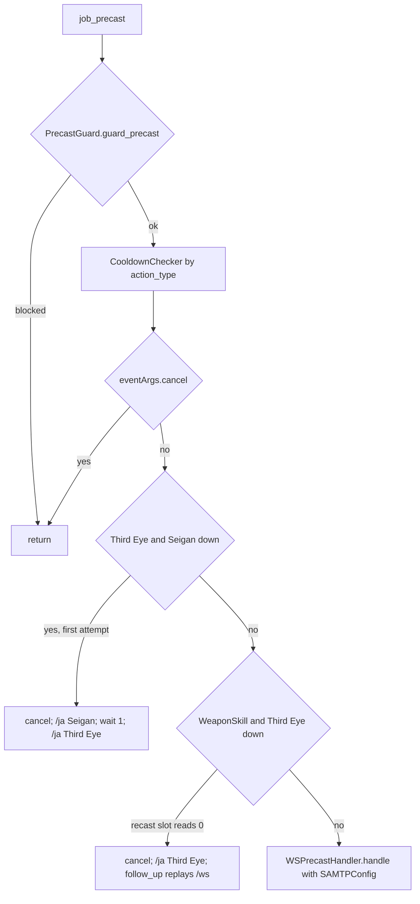

# SAM (Samurai) job

The SAM job is a small job area: 11 hook modules plus 1 logic module under
`shared/jobs/sam/functions/` (916 lines), an entry point template, five config
files and one sets file. There is no live `Tetsouo/Tetsouo_SAM.lua`: SAM exists
only as a template in `_master/` (and in the frozen clones, which are out of
scope). GearSwap loads it when the main job becomes SAM (`<char>_SAM.lua`).

What SAM adds on top of the shared pipeline:

- **Auto-Seigan before Third Eye**: pressing Third Eye without Seigan up cancels
  it, casts Seigan, then Third Eye one second later.
- **Auto-Third Eye before a weaponskill**: a weaponskill pressed while Third Eye
  is not up is cancelled, Third Eye is cast and the weaponskill replayed 1.5 s
  later.
- **WS buff layers** in `job_post_precast`: `sets.buff.Sekkanoki` and
  `sets.buff['Meikyo Shisui']` while `buffactive` says those buffs are up.
- **Set building** by HP (Weak below 50 %, Regen below 80 %), `HybridMode` PDT
  for idle, Seigan/Third Eye for engaged, weapon sets, a bow layer.
- **TP bonus configuration** with Hagakure and Dojikiri Yasutsuna.

SAM has no job-specific `//gs c` command. Both automations are currently broken
(see [Known issues](#known-issues)).

Every file in scope was read in full except the gear content of the sets file
(only structure and set names were read, as gear choice is out of scope). All
line numbers refer to the working tree on 2026-09-19.

## Files

| Path | Lines | Role |
|------|------:|------|
| `_master/entry/Tetsouo_SAM.lua` | 196 | Entry point (template): config preload, `get_sets`, `job_sub_job_change`, `user_setup`, `job_update`, `init_gear_sets`, `file_unload` |
| `shared/jobs/sam/functions/sam_functions.lua` | 49 | Facade: includes the 11 hook files, requires `dualbox_manager` |
| `shared/jobs/sam/functions/SAM_PRECAST.lua` | 193 | `job_precast` (guard, cooldown, auto-Seigan, auto-Third Eye, WS handler) / `job_post_precast` (TP gear, Sekkanoki, Meikyo Shisui by `buffactive`) |
| `shared/jobs/sam/functions/SAM_MIDCAST.lua` | 73 | `job_midcast` (empty) / `job_post_midcast`: watchdog, Healing and Enhancing via `MidcastManager` |
| `shared/jobs/sam/functions/SAM_AFTERCAST.lua` | 20 | `job_aftercast = LifecycleManager.aftercast()` |
| `shared/jobs/sam/functions/SAM_IDLE.lua` | 43 | `customize_idle_set` -> `SetBuilder.build_idle_set` |
| `shared/jobs/sam/functions/SAM_ENGAGED.lua` | 43 | `customize_melee_set` -> `SetBuilder.build_engaged_set` |
| `shared/jobs/sam/functions/SAM_STATUS.lua` | 19 | `job_status_change = LifecycleManager.status_change()` |
| `shared/jobs/sam/functions/SAM_BUFFS.lua` | 19 | `job_buff_change = LifecycleManager.buff_change()` |
| `shared/jobs/sam/functions/SAM_COMMANDS.lua` | 157 | `job_self_command` router (shared commands only), `job_state_change = LifecycleManager.state_change()` |
| `shared/jobs/sam/functions/SAM_MOVEMENT.lua` | 49 | `get_sam_movement_status` (no caller), empty `job_handle_equipping_gear` |
| `shared/jobs/sam/functions/SAM_LOCKSTYLE.lua` | 47 | Lazy `LockstyleManager.create('SAM', ..., 1, 'SAM')` wrappers |
| `shared/jobs/sam/functions/SAM_MACROBOOK.lua` | 42 | Lazy `MacrobookManager.create('SAM', ..., 'SAM', 1, 1)` wrapper |
| `shared/jobs/sam/functions/logic/set_builder.lua` | 165 | Idle (HP, PDT, weapon) and engaged (base from `select_engaged_base`: AM3 or `sets.engaged[HybridMode]`; Seigan, weapon, bow) builders |
| `_master/config/sam/SAM_STATES.lua` | 133 | `SAMStates.configure()` (HybridMode, MainWeapon, `state.Buff`, FastCast, AutoMedicine), unused `validate()` |
| `_master/config/sam/SAM_KEYBINDS.lua` | 100 | 3 binds, `show_intro`, `bind_all`, `unbind_all` |
| `_master/config/sam/SAM_TP_CONFIG.lua` | 111 | `_G.SAMTPConfig`: Hagakure JP, pieces, weapons, `get_weapon_bonus`, `get_hagakure_bonus` |
| `_master/config/sam/SAM_LOCKSTYLE.lua` | 32 | `default = 2`, `by_subjob` (no `get_style`) |
| `_master/config/sam/SAM_MACROBOOK.lua` | 63 | `default`, `solo[sub]` (book 2 page 1), empty `dualbox` |
| `_master/sets/sam_sets.lua` | 500 | Template sets (flat) |
| `shared/data/job_abilities/SAM_JA_DATABASE.lua` + `sam/sam_{mainjob,subjob,sp}.lua` | 13 + ... | JA data for the ability message hooks |

Live copies: none. `Tetsouo/` has no SAM entry, no `config/sam/` and no SAM
sets; `Kaories/`, `_master/Kaories/` and `_master/Tetsouo/` contain no SAM
files. The `Tetsouo/...` require paths in the template are replaced by the clone
script ([characters and templates](../architecture/characters-and-templates.md)).

## How it works

### Load sequence

Same order as every job: the entry chunk, then `get_sets()`; Mote-Include runs
`user_setup()` and `init_gear_sets()` from inside `include('Mote-Include.lua')`
(`Mote-Include.lua:170-175`), before `INIT_SYSTEMS` and the hook files.

```mermaid
sequenceDiagram
    participant GS as GearSwap
    participant E as Tetsouo_SAM.lua
    participant M as Mote-Include
    participant F as sam_functions.lua
    GS->>E: run chunk (LOCKSTYLE_CONFIG, UIConfig; lines 12-26)
    GS->>E: get_sets()
    E->>M: include Mote-Include (line 34)
    M->>E: user_setup(): states, keybinds, UI, JCM, macrobook/lockstyle, dualbox
    M->>E: init_gear_sets() -> include sets/sam_sets.lua (line 182)
    E->>E: INIT_SYSTEMS, data_loader, message hooks (36-61)
    E->>E: _G.LockstyleConfig, _G.UIConfig, _G.RECAST_CONFIG (66-68), REGION_CONFIG (71-74), _G.SAMTPConfig (77)
    E->>E: JobChangeManager.cancel_all() (80-83)
    E->>F: include sam_functions.lua (86)
    E->>E: register_lockstyle_cancel('SAM', ...) (90-92)
```

Differences from the other entries:

- `_G.RECAST_CONFIG` is loaded at the same point as on DRK/WAR (68), which also
  defines the globals `is_recast_ready` / `is_on_cooldown` used by
  `//gs c jump` and `//gs c waltz`. Until 2026-09-19 the SAM entry did not
  load it.
- `REGION_CONFIG` is loaded inside `get_sets()` after Mote, `INIT_SYSTEMS` and
  the message hooks (`Tetsouo_SAM.lua:70-74`), although its comment says it must
  load before the message system; WAR and DRK load it in the file chunk.

`user_setup()` (`Tetsouo_SAM.lua:119-165`): `SAMStates.configure()`, then
`SAM_KEYBINDS` stored in the global `SAMKeybinds` and `bind_all()` (3 binds,
then `show_intro()`, which `require`s `SAM_MACROBOOK` and `SAM_LOCKSTYLE` and so
defines the `select_default_*` globals as a side effect), `KeybindUI.smart_init`,
`JobChangeManager.initialize()` + macro book now + lockstyle after 8 s, and the
`dualbox_manager` require. No error message is shown if the keybind file fails
to load (129-133).

The facade (`sam_functions.lua`) includes `SAM_LOCKSTYLE`, `SAM_MACROBOOK`
(20-21), then `SAM_PRECAST` .. `SAM_MOVEMENT` (22-38), requires
`dualbox_manager` (42) and prints a debug line (44-45). It does not include
`message_buffs.lua` (nothing in SAM uses it).

### Precast

`job_precast` (`SAM_PRECAST.lua:115-150`):



- `try_seigan_before_third_eye` (51-70) uses the module flag
  `seigan_cast_attempted` (46) as its anti-loop guard: the first Third Eye with
  Seigan down sets it and re-queues; the next Third Eye with Seigan still down
  clears it and lets Third Eye through. After a successful Seigan the flag is
  never cleared, so the next time Seigan is down the first Third Eye goes
  through without Seigan (the behaviour alternates).
- `try_third_eye_ws` (75-104) walks `windower.ffxi.get_abilities().job_abilities`
  (ability ids), finds `Third Eye` (id 62) and reads
  `ability_recasts[res_ability.recast_id]`. `get_ability_recasts()` is indexed
  by **recast id** (Third Eye's is 133, `res/job_abilities.lua`). Before commit
  `0a51c06` it read slot 62, which belongs to Flee, so Third Eye always looked
  ready and every weaponskill was cancelled and resent while it was on recast.
- The replayed `/ja "Third Eye"` itself goes through precast, so with Seigan down
  the WS path also triggers the Seigan path: Hasso is replaced by Seigan.
- Neither path prints its own message: the ability message hook announces
  Seigan and Third Eye when they go out (both are in the SAM JA database). Until
  commit `0a51c06` both called `MessageFormatter.show_auto_ability`, which does
  not exist, and raised a precast error each time they fired.
- `WSPrecastHandler.handle` returns `true` for non-weaponskills; for a
  weaponskill see [precast pipeline](../systems/precast-pipeline.md#weaponskill-chain).
- `job_post_precast` (157-180): TP bonus gear, then for a weaponskill
  `sets.buff.Sekkanoki` if `buffactive['Sekkanoki']` and
  `sets.buff['Meikyo Shisui']` if `buffactive['Meikyo Shisui']` (171-179). It
  reads the buffs, not `state.Buff`: Mote sets `state.Buff[spell.english] = true`
  in its own `precast()` **before** `job_precast` (`Mote-Include.lua:294-297`),
  and only `buff_change` sets it back to false, so a Sekkanoki press cancelled
  by `CooldownChecker` would leave the flag true; and the flags start `false`
  on every load (`SAM_STATES.lua:70-76`) even when the buff is up.

### Midcast

Mote equips its default midcast set first (spell name, map, skill), then
`job_post_midcast` (`SAM_MIDCAST.lua:33-60`) loads `MidcastDeps`, calls
`MidcastWatchdog.on_midcast_start(spell)` and routes Healing Magic and Enhancing
Magic (target and `ENHANCING_MAGIC_DATABASE.get_spell_family`) to
`MidcastManager.select_set`. The sets define neither
`sets.midcast['Healing Magic']` nor `['Enhancing Magic']`, so both calls return
false at once (`midcast_manager.lua:624-629`); `sets.midcast.Phalanx` still
applies through Mote's name lookup.

### Aftercast, idle, engaged, status, buffs

- `job_aftercast = LifecycleManager.aftercast()` (`SAM_AFTERCAST.lua:14`):
  watchdog notification only (`lifecycle_manager.lua:68-77`).
- `customize_idle_set` -> `SetBuilder.build_idle_set` (`set_builder.lua:35-65`),
  on top of Mote's base (`sets.idle.Normal` through `IdleMode`, or
  `sets.idle.Weak` under the weakness buff, `Mote-Include.lua:495-511`):
  `sets.idle.Weak` if `player.hpp < 50`, else `sets.idle.Regen` if below 80;
  `sets.idle.PDT` when `HybridMode == 'PDT'`; `sets[state.MainWeapon.value]`.
  No town set, no movement layer: `sets.MoveSpeed` is never used.
- `customize_melee_set` -> `build_engaged_set` (84-119): the base is
  re-selected by `select_engaged_base` (135-159): `sets.engaged.AM3` under
  Aftermath: Lv.3 with Masamune or Kogarasumaru (no such set today), else
  `sets.engaged[HybridMode]` (`PDT` or `Normal`), else Mote's base. Then, with
  Seigan up, `sets.thirdeye` when `HybridMode == 'PDT'`, `sets.seigan`
  otherwise; then the weapon set; then `sets.bow` when the range slot holds
  Yoichinoyumi. The re-selection is needed because Mote's base is
  `sets.engaged.Normal`: `OffenseMode` is `Normal` and Mote then looks for
  `HybridMode` **under** `sets.engaged.Normal` (`Mote-Include.lua:569-577`),
  where no `PDT` child exists, so it never reaches the sibling
  `sets.engaged.PDT`.
- `job_status_change` / `job_buff_change` are the shared `LifecycleManager`
  handlers (Doom), see [core lifecycle](../systems/core-lifecycle.md#lifecyclemanager).
  Mote's `buff_change` keeps `state.Buff[...]` in step for the six names SAM
  registers (`Mote-Include.lua:1027-1029`).
- `job_handle_equipping_gear` (`SAM_MOVEMENT.lua:39-41`) is empty.

## Mote states

Created by `SAMStates.configure()` (`_master/config/sam/SAM_STATES.lua:34-99`)
on every load. Keybinds from `SAM_KEYBINDS.lua:22-39`.

| State | Values | Default | Key | Read by |
|-------|--------|---------|-----|---------|
| `HybridMode` (Mote's, options replaced) | PDT, Normal | PDT | `^numpad9` | idle PDT layer, engaged base `sets.engaged[HybridMode]`, Seigan branch (`set_builder.lua:53,93,151-156`) |
| `MainWeapon` | Masamune, Kusanagi, Shining, Dojikiri, Soboro, Norifusa | Masamune | `^numpad1` | `set_builder.lua:60,107,143` |
| `state.Buff.*` | Hasso, Seigan, Third Eye, Sekkanoki, Meikyo Shisui, Sengikori (booleans) | false | none | no reader (`job_post_precast` reads `buffactive`) |
| `FastCast` | 0..80 step 10 | 0 | none | `midcast_watchdog.lua` |
| `AutoMedicine` | shared On/Off | persisted | `#numpad0` | `AutoMedicine.init` (`SAM_STATES.lua:95-98`) |

`SAMStates.configure()` replaces the whole `state.Buff` table (70). Mote defaults
`OffenseMode`, `IdleMode`, `WeaponskillMode` stay `'Normal'`.

## Commands

`job_self_command` (`SAM_COMMANDS.lua:43-140`): dual-box internals (56-72),
`watchdog` (77-82), CommonCommands with `table.unpack(args)` (87-98), `ui`
(103-107), `debugmidcast` (112-122), `cyclestate` (131-134). There is no SAM
command; the router ends at a placeholder comment (139). The body is the same as
`DRK_COMMANDS.lua` apart from the job name (open duplication finding).
`job_state_change = LifecycleManager.state_change()` (150): skips `Moving`,
refreshes the UI. It tests no state name except `Moving` (which has no description, so Mote and the UI-aware `cyclestate` both pass `Moving`), so it accepts the state key and the description alike.

Useful shared commands on SAM: `//gs c jump` (/DRG) and `//gs c waltz` (/DNC)
use the `is_recast_ready` global that `RECAST_CONFIG` defines (loaded since 2026-09-19).

## Set names the code looks up

T = `_master/sets/sam_sets.lua` (no live copy).

| Set | Looked up by | T |
|-----|--------------|---|
| `sets['Masamune']`, `['Kusanagi']`, `['Shining']`, `['Dojikiri']`, `['Soboro']`, `['Norifusa']` | `set_builder.lua:60,107` | 14-20 |
| `sets.idle.Normal` | Mote base (`IdleMode`) | 53 |
| `sets.idle.Weak`, `.Regen`, `.PDT` | `set_builder.lua:44-55` | 83, 70, 88 |
| `sets.engaged.Normal` | Mote base, `select_engaged_base` (HybridMode Normal) | 137 |
| `sets.engaged.PDT` | `select_engaged_base` (HybridMode PDT, `set_builder.lua:151-156`) | 165 |
| `sets.engaged.Mid`, `.Acc`, `.Acc.PDT`, `.MDT`, `.SuBlow` | nothing (OffenseMode only `Normal`) | 154-203 |
| `sets.thirdeye` | `set_builder.lua:95` | 476 |
| `sets.seigan`, `sets.bow` | `set_builder.lua:100,113` | **absent** |
| `sets.engaged.AM3` | `select_engaged_base` (Aftermath: Lv.3, `set_builder.lua:137-148`) | **absent** (falls through to the HybridMode set) |
| `sets.buff.Sekkanoki`, `['Meikyo Shisui']` | `SAM_PRECAST.lua:171-179` (by `buffactive`) | 472, 474 |
| `sets.buff.Sengikori` | nothing | 473 |
| `sets.buff.Doom` | `DoomManager` | 495 |
| `sets.MoveSpeed` | nothing (no movement layer) | 485 |
| `sets.defense.PDT`, `.MDT` | Mote defense commands only (no bind) | 104, 114 |
| `sets.precast.JA` Meditate, Hasso, Seigan, Warding Circle, Third Eye, Blade Bash | Mote default precast | 227-249 |
| `sets.precast.FC`, `.Utsusemi` | Mote default precast | 257, 273 |
| `sets.precast.WS` base + Tachi: Fudo, Shoha, Mumei, Jinpu, Goten, Kagero, Koki, Rana, Ageha, Impulse Drive, Aeolian Edge | Mote default precast | 296-436 |
| `.Mid` / `.Acc` WS variants (Shoha, Rana) | nothing (`WeaponskillMode` `Normal`) | 339-412 |
| `sets.midcast['Healing Magic']`, `['Enhancing Magic']` | `SAM_MIDCAST.lua:43,52` | **absent** |
| `sets.midcast.Phalanx` | Mote default midcast by name | 458 |

`sets['Malevolence']`, `['Onion']`, `['Utu']` (18, 21, 22) are not in
`MainWeapon`.

## Configuration

| File / key | Default | Where the default lives | Read by |
|------------|---------|-------------------------|---------|
| `<char>/config/sam/SAM_STATES.lua` | see states | file | entry `user_setup` |
| `<char>/config/sam/SAM_KEYBINDS.lua` | 3 binds | file | entry `user_setup`, `file_unload` |
| `<char>/config/sam/SAM_TP_CONFIG.lua` | `hagakure_jp_gifts = 0`; Moonshade +250, Mpaca's Cap +200; Dojikiri Yasutsuna +500 | file | `WSPrecastHandler` via `_G.SAMTPConfig`; `get_hagakure_bonus` returns 1000 + 10 x gifts while Hagakure is up (90-101) |
| `<char>/config/sam/SAM_LOCKSTYLE.lua` `default`, `by_subjob` | 2 | file; factory fallback 1 (`SAM_LOCKSTYLE.lua` wrapper 29) | `LockstyleManager` uses `default` only (no `get_style`) |
| `<char>/config/sam/SAM_MACROBOOK.lua` | book 2 page 1 for every listed subjob | file; factory fallback book 1 page 1 | `MacrobookManager` |
| `Tetsouo/config/LOCKSTYLE_CONFIG.lua`, `REGION_CONFIG.lua`, UI config | - | entry fallbacks 12-19 | entry |
| `Tetsouo/config/RECAST_CONFIG.lua` | tolerance 2.0 | shared | entry line 68; `CooldownChecker`, `is_recast_ready` |

## State & lifetime

- Module state: `seigan_cast_attempted` (`SAM_PRECAST.lua:46`), lazy module
  locals, `MidcastDeps` cache. All die on `gs reload`.
- `_G` written: the Mote hooks (`job_precast`, `job_post_precast`,
  `job_midcast`, `job_post_midcast`, `job_aftercast`, `customize_idle_set`,
  `customize_melee_set`, `job_status_change`, `job_buff_change`,
  `job_self_command`, `job_state_change`, `job_handle_equipping_gear`),
  `get_sam_movement_status`, `select_default_lockstyle`,
  `cancel_sam_lockstyle_operations`, `select_default_macro_book`,
  `SAMKeybinds`, `SAMTPConfig`, `LockstyleConfig`, `UIConfig`, `RegionConfig`,
  `RECAST_CONFIG`, `is_recast_ready`, `is_on_cooldown`,
  `temp_tp_bonus_gear`.
- `windower.*`: nothing. No events, no coroutines of its own besides the 8 s
  lockstyle; the auto-Seigan and auto-Third Eye chains are `wait` chains in the
  Windower command queue and survive a reload.
- Keybinds: bound in `user_setup`, unbound in `file_unload` (185-196).

## Interactions

- `PrecastGuard`, `CooldownChecker`, `WSPrecastHandler`, `TPBonusCalculator`
  ([precast pipeline](../systems/precast-pipeline.md)).
- `LifecycleManager` for aftercast, status, buffs and state change;
  `MidcastManager`, `MidcastWatchdog`
  ([midcast and buffs](../systems/midcast-and-buffs.md),
  [core lifecycle](../systems/core-lifecycle.md)).
- Factories, `JobChangeManager`, `CommonCommands`, `CycleHandler`, UI, dual-box
  ([factories and helpers](../systems/factories-and-helpers.md),
  [commands and debug](../systems/commands-and-debug.md)).
- [WAR](war.md) implements the /SAM side (Hasso/Seigan + Third Eye, Meditate)
  separately; nothing is shared with SAM's own code.

## Invariants & gotchas

- `get_ability_recasts()` is keyed by recast id, `get_abilities().job_abilities`
  by ability id; they are different numbers for every JA.
- `state.Buff[name]` is set true by Mote in precast, before the job can cancel
  the action; gear that must follow a buff reads `buffactive`.
- Mote nests `HybridMode` under the `OffenseMode` node; a `sets.engaged.PDT`
  sibling of `sets.engaged.Normal` is invisible to Mote, which is why
  `build_engaged_set` re-selects its base.
- `sets.idle.Weak` has two meanings here: Mote's weakness scope and SAM's
  HP < 50 % layer.
- Seigan and Hasso are exclusive stances; both automations cast Seigan whenever
  Third Eye fires with Seigan down.
- `MessageFormatter` has no `__index`: calling an unknown `show_*` raises.

## Extending

- New weapon: `MainWeapon` option in `SAM_STATES.lua` and `sets[key]` in the sets
  file.
- New WS buff layer: a `buffactive['<res.buffs name>']` branch in
  `job_post_precast` and the `sets.buff` entry.
- New command: add it in the SAM-specific section of `job_self_command`. A name
  that is also an alt config key (SAM_ALT has `hasso`, `seigan`, `thirdeye`,
  `meditate`, ...) then runs here; the alt's version stays reachable as
  `//gs c alt <name>`.

## Known issues

- `REGION_CONFIG` loaded after the message system (`Tetsouo_SAM.lua:70-74`).
- Auto-Seigan guard alternates after a successful Seigan (`SAM_PRECAST.lua:57-67`).
- Auto-Third Eye replaces Hasso by Seigan (`SAM_PRECAST.lua:95` -> 56-76).
- No movement speed layer; `sets.MoveSpeed` unreachable (`set_builder.lua:35-65`).
- `recast == 0` strict test in the auto-Third Eye path (`SAM_PRECAST.lua:92`).
- `SAM_LOCKSTYLE.by_subjob` is never read (no `get_style`,
  `_master/config/sam/SAM_LOCKSTYLE.lua:21`).
- Dead code: `get_sam_movement_status`, `job_handle_equipping_gear`,
  `SAMStates.validate`, the six unread `state.Buff` entries,
  `sets.buff.Sengikori`.
- Comments copied from other jobs: `SAM_IDLE.lua:5` (IdleMode DT/Refresh/Regain),
  `SAM_ENGAGED.lua:5-6` (EngagedMode, NIN dual wield), `SAM_BUFFS.lua:4`
  (Chainspell), `SAM_STATES.lua:68` (WHM_BUFFS), `SAM_STATES.lua:9,43,52`
  (Alt+1/Alt+2).
- `SAM_COMMANDS` duplicates `DRK_COMMANDS` (open finding).
- User doc out of date (`docs/user/jobs/sam/states.md`).
