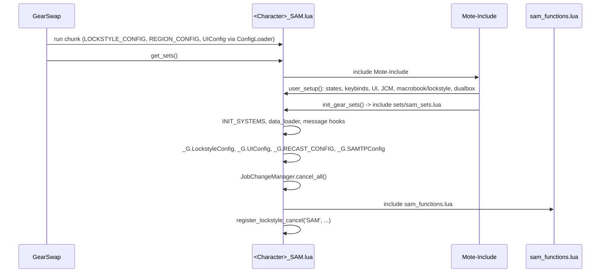
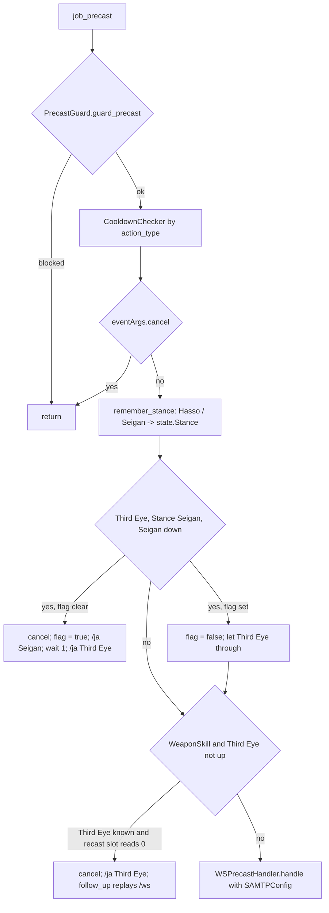

# SAM (Samurai) job

The SAM job area: 11 hook modules plus 1 logic module under
`shared/jobs/sam/functions/` (about 960 lines), an entry point template,
seven config files and one sets file. SAM exists only as a template in
`_master/` (no character overlay, no maintained live copy); GearSwap loads it
when the main job becomes SAM (`<Character>_SAM.lua`).

What SAM adds on top of the shared pipeline:

- **A chosen stance** (`state.Stance`, Hasso or Seigan), set by
  `//gs c hasso` / `//gs c seigan` and by any Hasso or Seigan the player uses.
- **Auto-Seigan before Third Eye**, in Seigan stance only: Third Eye pressed
  with Seigan down is cancelled, Seigan goes out, then Third Eye 1 s later.
  In Hasso stance Third Eye always goes out alone.
- **Auto-Third Eye before a weaponskill**, in either stance: a weaponskill
  that `WSPrecastHandler` accepted (range, 1000 TP), pressed while Third Eye
  is known, ready (RECAST_CONFIG tolerance) and not up, is cancelled, Third
  Eye goes out and `AbilityHelper.follow_up` replays the weaponskill.
- **Chosen stance on engage** (opt-in, `sam_hasso` in `AUTO_ABILITIES.lua`):
  Hasso, or Seigan when `state.Stance` is Seigan.
- **WS buff layers** in `job_post_precast`: `sets.buff.Sekkanoki` and
  `sets.buff['Meikyo Shisui']` while `buffactive` says those buffs are up.
- **Set building**: engaged base re-selected from `OffenseMode` x
  `HybridMode` (Mote cannot reach `sets.engaged.PDT`), Aftermath Lv.3 set,
  Seigan / Third Eye layers, weapon set, bow layer; idle HybridMode PDT, then
  by HP on top (Weak below 50 %, Regen below 80 %), then `sets.MoveSpeed` while
  running. In a town with `sets.idle.Town` (or in Adoulin with
  `sets.Adoulin`), that set on top of the idle set plus the weapon, as on the
  other jobs; the provided file has neither.
- **TP bonus configuration** with Hagakure and Dojikiri Yasutsuna.

Every file listed below was read in full on 2026-09-28, except the gear content
of the sets file (structure and set names only). References are to file and
function; line numbers are deliberately not used.

## Files

| Path | Lines | Role |
|------|------:|------|
| `_master/entry/Tetsouo_SAM.lua` | 219 | Entry point (template): config preload, `get_sets`, `job_sub_job_change`, `user_setup`, `job_update`, `init_gear_sets`, `file_unload` |
| `shared/jobs/sam/functions/sam_functions.lua` | 49 | Facade: includes the 11 hook files, requires `dualbox_manager` |
| `shared/jobs/sam/functions/SAM_PRECAST.lua` | 230 | `job_precast` (guard, cooldown, `remember_stance`, auto-Seigan, auto-Third Eye, WS handler) / `job_post_precast` (TP gear, Sekkanoki, Meikyo Shisui by `buffactive`) |
| `shared/jobs/sam/functions/SAM_MIDCAST.lua` | 75 | `job_midcast` (empty) / `job_post_midcast`: watchdog, Healing and Enhancing via `MidcastManager` |
| `shared/jobs/sam/functions/SAM_AFTERCAST.lua` | 22 | `job_aftercast = LifecycleManager.aftercast()` |
| `shared/jobs/sam/functions/SAM_IDLE.lua` | 42 | `customize_idle_set` -> `SetBuilder.build_idle_set` |
| `shared/jobs/sam/functions/SAM_ENGAGED.lua` | 42 | `customize_melee_set` -> `SetBuilder.build_engaged_set` |
| `shared/jobs/sam/functions/SAM_STATUS.lua` | 31 | `job_status_change = LifecycleManager.status_change(auto_hasso)` |
| `shared/jobs/sam/functions/SAM_BUFFS.lua` | 22 | `job_buff_change = LifecycleManager.buff_change(extra)`, `extra` calling `LifecycleManager.refresh_after_buff` (Aftermath Lv.3) |
| `shared/jobs/sam/functions/SAM_COMMANDS.lua` | 166 | `job_self_command` router (shared commands, `hasso`, `seigan`), `job_state_change = LifecycleManager.state_change()` |
| `shared/jobs/sam/functions/SAM_MOVEMENT.lua` | 28 | Empty `job_handle_equipping_gear` (movement gear is in the set builder) |
| `shared/jobs/sam/functions/SAM_LOCKSTYLE.lua` | 47 | Lazy `LockstyleManager.create('SAM', ...)` wrappers |
| `shared/jobs/sam/functions/SAM_MACROBOOK.lua` | 42 | Lazy `MacrobookManager.create('SAM', ...)` wrapper |
| `shared/jobs/sam/functions/logic/set_builder.lua` | 185 | `build_idle_set` (town, PDT, HP, weapon, `BaseSetBuilder.apply_movement`), `apply_main_weapon`, `build_engaged_set` (base from `select_engaged_base`; Seigan, weapon, bow) |
| `_master/config/sam/SAM_STATES.lua` | 118 | `SAMStates.configure()` (HybridMode, OffenseMode, WeaponskillMode, MainWeapon, Stance, FastCast, AutoMedicine) |
| `_master/config/sam/SAM_KEYBINDS.lua` | 53 | Data only: 4 binds handed to `KeybindManager.create('SAM', ...)` |
| `_master/config/sam/SAM_CUSTOM.lua` | 119 | Player modes and gear rules, commented examples only ([keybinds and custom states](../systems/keybinds-and-custom.md)) |
| `_master/config/sam/SAM_HUD.lua` | 30 | Per-job HUD section / row order (empty lists) |
| `_master/config/sam/SAM_TP_CONFIG.lua` | 110 | `_G.SAMTPConfig`: `hagakure_jp_gifts`, pieces, weapons, `get_weapon_bonus`, `get_hagakure_bonus` |
| `_master/config/sam/SAM_LOCKSTYLE.lua` | 32 | `default = 2`, `by_subjob` (no `get_style`) |
| `_master/config/sam/SAM_MACROBOOK.lua` | 62 | `default`, `solo[sub]` (book 2 page 1), empty `dualbox` |
| `_master/sets/sam_sets.lua` | 524 | Template sets (flat) |
| `_master/config_global/AUTO_ABILITIES.lua` | | `sam_hasso = false` (read through `shared/utils/core/auto_options.lua`) |
| `shared/data/job_abilities/SAM_JA_DATABASE.lua` + `sam/sam_{mainjob,subjob,sp}.lua` | | JA data for the ability message hooks |

The `Tetsouo/...` require paths in the template are replaced by the clone
script ([characters and templates](../architecture/characters-and-templates.md)).

## How it works

### Load sequence

Same order as every job: the entry chunk, then `get_sets()`; Mote-Include runs
`user_setup()` and `init_gear_sets()` from inside `include('Mote-Include.lua')`,
before `INIT_SYSTEMS` and the hook files.

```mermaid
sequenceDiagram
    participant GS as GearSwap
    participant E as <Character>_SAM.lua
    participant M as Mote-Include
    participant F as sam_functions.lua
    GS->>E: run chunk (LOCKSTYLE_CONFIG, REGION_CONFIG, UIConfig via ConfigLoader)
    GS->>E: get_sets()
    E->>M: include Mote-Include
    M->>E: user_setup(): states, keybinds, UI, JCM, macrobook/lockstyle, dualbox
    M->>E: init_gear_sets() -> include sets/sam_sets.lua
    E->>E: INIT_SYSTEMS, data_loader, message hooks
    E->>E: _G.LockstyleConfig, _G.UIConfig, _G.RECAST_CONFIG, _G.SAMTPConfig
    E->>E: JobChangeManager.cancel_all()
    E->>F: include sam_functions.lua
    E->>E: register_lockstyle_cancel('SAM', ...)
```

- `RECAST_CONFIG` defines the globals `is_recast_ready` / `is_on_cooldown`
  used by `//gs c jump` and `//gs c waltz`.
- `REGION_CONFIG` is loaded in the file chunk, before `INIT_SYSTEMS` loads
  `message_colors`, which reads `_G.RegionConfig` once per load.

`user_setup()`: `SAMStates.configure()`, then `SAM_KEYBINDS` stored in the
global `SAMKeybinds` and `bind_all()` (4 binds, the optional states, the
character's common keys, then `show_intro()`, which `require`s
`SAM_MACROBOOK` and `SAM_LOCKSTYLE` and so defines the `select_default_*`
globals as a side effect), `KeybindUI.smart_init('SAM', UIConfig.init_delay)`,
`JobChangeManager.initialize()` + macro book now + lockstyle after 8 s, and the
`dualbox_manager` require. A keybind file that fails to load prints
`[SAM] Keybinds failed to load: <error>`. `job_sub_job_change` only hands over
to `JobChangeManager.on_job_change`.

The facade includes `SAM_LOCKSTYLE`, `SAM_MACROBOOK`, then `SAM_PRECAST` ..
`SAM_MOVEMENT`, requires `dualbox_manager` and prints a debug line. It does
not include `message_buffs.lua` (nothing in SAM uses it).

### Precast

`SAM_PRECAST.lua` `job_precast`:

```mermaid
flowchart TD
    A[job_precast] --> B{PrecastGuard.guard_precast}
    B -- blocked --> Z[return]
    B -- ok --> C[CooldownChecker by action_type]
    C --> D{eventArgs.cancel}
    D -- yes --> Z
    D -- no --> R[remember_stance: Hasso / Seigan -> state.Stance]
    R --> E{Third Eye, Stance Seigan, Seigan down}
    E -- "yes, flag clear" --> S[cancel; flag = true; /ja Seigan; wait 1; /ja Third Eye]
    E -- "yes, flag set" --> E2[flag = false; let Third Eye through]
    E -- no --> F{WeaponSkill and Third Eye not up}
    E2 --> F
    F -- "Third Eye known and recast slot reads 0" --> T[cancel; /ja Third Eye; follow_up replays /ws]
    F -- no --> W[WSPrecastHandler.handle with SAMTPConfig]
```

- `chosen_stance()` reads `state.Stance.value`; a config without the state
  follows the buffs (Hasso when Hasso is up, Seigan otherwise).
- `remember_stance` runs on every accepted Hasso or Seigan precast, including
  the ones sent by `//gs c hasso`, by auto Hasso and by the auto-Seigan path.
- `try_seigan_before_third_eye` uses the module flag `seigan_cast_attempted`
  as its anti-loop guard: set when Seigan is queued, cleared as soon as a
  Third Eye press finds Seigan up, or when the replayed Third Eye finds Seigan
  still down (then that Third Eye goes out alone instead of looping). Until
  2026-09-28 it was not cleared when Seigan came up, so every other
  Seigan-down Third Eye went out without Seigan.
- `try_third_eye_ws` uses `AbilityHelper.can_use_ability('Third Eye')` (the
  player's ability list) and `AbilityHelper.is_ability_ready('Third Eye')`
  (recast by recast id, RECAST_CONFIG tolerance, 2.0 s by default). Until
  2026-09-28 it walked the ability list itself and required a recast of
  exactly 0.
- The replay goes through `AbilityHelper.follow_up('Third Eye', '/ws ...', 1.5)`:
  the weaponskill is sent as soon as Third Eye is up, or as soon as Third Eye
  is provably refused, and at the latest 1.5 + 3.0 s later. A newer
  `follow_up` invalidates a pending one (`windower._ability_follow_seq`).
- Auto-Seigan runs before `WSPrecastHandler.handle` (it only concerns the
  Third Eye press); auto-Third Eye runs **after** it (2026-09-28), so a
  weaponskill refused for range or TP no longer spends Third Eye.
- Neither path prints its own message: the ability message hook announces
  Seigan and Third Eye when they go out.
- `job_post_precast`: TP bonus gear, then for a weaponskill
  `sets.buff.Sekkanoki` if `buffactive['Sekkanoki']` and
  `sets.buff['Meikyo Shisui']` if `buffactive['Meikyo Shisui']`. It reads
  `buffactive`, not Mote's `state.Buff`: Mote sets an existing
  `state.Buff[name]` true on the JA press, and a press cancelled on recast never
  gains the buff, so no `buff_change` would set it back.

### Midcast

Mote equips its default midcast set first (spell name, map, skill), then
`job_post_midcast` loads `MidcastDeps`, calls
`MidcastWatchdog.on_midcast_start(spell)` and routes Healing Magic and
Enhancing Magic (target and `ENHANCING_MAGIC_DATABASE.get_spell_family`) to
`MidcastManager.select_set`. The template defines neither
`sets.midcast['Healing Magic']` nor `['Enhancing Magic']`, so both calls return
at the missing base set; `sets.midcast.Phalanx` still applies through Mote's
name lookup. Any other skill (/NIN Utsusemi, /DRK or /RDM spells) is routed by
`MidcastFallback` on `cleanup_midcast` with its own skill; with no base set
there either, Mote's choice stands (`sets.precast.FC.Utsusemi` for the precast,
no midcast set in the template).

### Aftercast, idle, engaged, status, buffs

- `job_aftercast = LifecycleManager.aftercast()`: watchdog notification only.
- `customize_idle_set` -> `SetBuilder.build_idle_set`, on top of Mote's base
  (`sets.idle.Normal` through `IdleMode`, `sets.idle.Weak` under the weakness
  buff; defense and kiting layers included): first
  `BaseSetBuilder.select_idle_base_town` (town set or `sets.Adoulin` on top of
  the idle set, see
  [equipment-and-inventory.md](../systems/equipment-and-inventory.md#movement-and-town-idle-basesetbuilder)).
  In town it returns that result plus `SetBuilder.apply_main_weapon`
  (`WeaponResolver.set_for('main', MainWeapon)`), without Weak, Regen, PDT or
  movement. Outside town: `sets.idle.PDT` when `HybridMode == 'PDT'`; then, on
  top of it, `sets.idle.Weak` if `player.hpp < 50`, else `sets.idle.Regen` if
  below 80 (order since 2026-09-29); then `apply_main_weapon`; then `BaseSetBuilder.apply_movement`
  (`sets.MoveSpeed` while `state.Moving.value == 'true'`, since 2026-09-28).
  The provided file has no `sets.idle.Town` and no `sets.Adoulin`, so
  `select_idle_base_town` reports "not in town" in every city and SAM builds
  its field idle there, `sets.MoveSpeed` included.
- `customize_melee_set` -> `build_engaged_set`: the base is re-selected by
  `select_engaged_base`: `sets.engaged.AM3` under Aftermath: Lv.3
  (`buffactive[272]`) with Masamune or Kogarasumaru (no such set in the
  template; a commented example shows how), else the `OffenseMode` node
  (`sets.engaged.Normal/Mid/Acc/SuBlow`, falling back to `sets.engaged.Normal`)
  and, for a `HybridMode` other than Normal, its child (`sets.engaged.Acc.PDT`),
  else `sets.engaged[HybridMode]` (`PDT`, `MDT`), else the node, else Mote's
  base. Then, with Seigan up, `sets.thirdeye` when `HybridMode == 'PDT'`,
  `sets.seigan` otherwise; then the weapon set; then `sets.bow` when the range
  slot holds Yoichinoyumi. The re-selection is needed because Mote looks for
  `HybridMode` **under** the `OffenseMode` node (`sets.engaged.Normal.PDT`),
  so it never reaches the sibling `sets.engaged.PDT`. Mote's defense and
  kiting layers are lost in the re-selection.
- `job_status_change = LifecycleManager.status_change(auto_hasso)`: Doom
  unlock, then `auto_hasso`, then the hold of the status rebuild during an
  action.
- `job_buff_change = LifecycleManager.buff_change(extra)`: Doom, then (unless
  Doom handled the event) `LifecycleManager.refresh_after_buff(buff)`: on gain
  or loss of `"Aftermath: Lv.3"`, unless Doom is up, `gs c update` 0.1 s later,
  skipped if an action is under way then. So `sets.engaged.AM3` goes on or off
  about 0.1 s after the buff changes (since 2026-09-29; before, nothing rebuilt
  the gear on an Aftermath change). Deferred because `buffactive` inside
  `buff_change` still holds the old buffs
  ([core-lifecycle.md](../systems/core-lifecycle.md#lifecyclemanager)).
- `job_handle_equipping_gear` (`SAM_MOVEMENT.lua`) is empty.

### Auto Hasso

`SAM_STATUS.lua` `auto_hasso(newStatus)`: on `Engaged`, when
`AutoOptions.on('sam_hasso')` is true (the character's
`config/AUTO_ABILITIES.lua`) and neither Hasso nor Seigan is up, it sends the
chosen stance (`state.Stance`: Seigan when Seigan, else Hasso) once
`AbilityHelper.is_ability_ready` says it is ready. The option keeps its old
name. Until 2026-09-28 it always sent Hasso, which then switched a Seigan
stance to Hasso through `remember_stance`. Off by default.

## Mote states

Created by `SAMStates.configure()` on every load (every subjob change too, so
values reset). Keybinds from `SAM_KEYBINDS.lua`.

| State | Values | Default | Key | Read by |
|-------|--------|---------|-----|---------|
| `HybridMode` (Mote's, options replaced) | PDT, Normal, MDT | PDT | `^numpad9` | idle PDT layer, `select_engaged_base`, Seigan branch |
| `OffenseMode` (Mote's, options replaced) | Normal, Mid, Acc, SuBlow | Normal | `^numpad2` | `select_engaged_base`, Mote `get_melee_set` |
| `WeaponskillMode` (Mote's, options replaced) | Normal, Mid, Acc | Normal | `^numpad3` | Mote default precast (`sets.precast.WS[name][mode]`) |
| `MainWeapon` | Masamune, Kusanagi, Shining, Dojikiri, Soboro, Norifusa | Masamune | `^numpad1` | `build_idle_set`, `build_engaged_set`, `select_engaged_base` (AM3 test) |
| `Stance` | Hasso, Seigan | Hasso | none (`//gs c hasso` / `seigan`, `cycle Stance`) | `chosen_stance` |
| `FastCast` | 0..80 step 10 | 0 | none | `midcast_watchdog.lua` |
| `AutoMedicine` | shared On/Off | persisted | `#numpad0` (common key) | `AutoMedicine.init` |
| `CombatMode` | Off, On | Off | `!numpad0`, hidden | `CombatMode` lock |
| `TreasureMode` | Off, Tag, Full | Off | `!numpad.`, hidden | shared `TreasureHunter` (needs `sets.TreasureHunter`, absent from the template) |

`SAMStates.configure()` declares no `state.Buff` entry (Mote's default empty
table remains). `IdleMode`, `CastingMode` and `RangedMode` keep Mote's single
value `Normal`.

## Commands

`job_self_command`: dual-box internals (`altjobupdate`, `requestjob`),
`watchdog`, CommonCommands with `table.unpack(args)`, `ui`, `debugmidcast`,
`hasso` / `seigan`, `cyclestate`.

| Command | Effect |
|---------|--------|
| `hasso` | `state.Stance:set('Hasso')`, `input /ja Hasso <me>` |
| `seigan` | `state.Stance:set('Seigan')`, `input /ja Seigan <me>` |

`job_state_change = LifecycleManager.state_change()`: skips `Moving`,
refreshes the UI. It tests no state name except `Moving`, so it accepts the
state key and the description alike. `hasso` / `seigan` are also keys of the
SAM alt config; on a SAM main they now run here, and the alt's version stays
reachable as `//gs c alt hasso`.

Useful shared commands on SAM: `//gs c jump` (/DRG) and `//gs c waltz` (/DNC).

## Set names the code looks up

T = `_master/sets/sam_sets.lua` (no live copy in the repository).

| Set | Looked up by | In T |
|-----|--------------|------|
| `sets['Masamune']`, `['Kusanagi']`, `['Shining']`, `['Dojikiri']`, `['Soboro']`, `['Norifusa']` | `WeaponResolver.set_for('main', ...)` | yes |
| `sets.idle.Normal` | Mote base (`IdleMode`) | yes |
| `sets.idle.Weak`, `.Regen`, `.PDT` | `build_idle_set` | yes |
| `sets.engaged.Normal` | Mote base, `select_engaged_base` | yes |
| `sets.engaged.PDT`, `.MDT` | `select_engaged_base` (HybridMode) | yes |
| `sets.engaged.Mid`, `.Acc`, `.Acc.PDT`, `.SuBlow`, `.Mid.PDT`, `.SuBlow.PDT` (copies of `.PDT` since 2026-09-29) | `select_engaged_base` (OffenseMode) | yes |
| `sets.engaged.AM3` | `select_engaged_base` (Aftermath: Lv.3) | **no** (commented example) |
| `sets.thirdeye` | `build_engaged_set` (Seigan, PDT) | yes |
| `sets.seigan`, `sets.bow` | `build_engaged_set` Seigan (not PDT) and bow layers | yes, empty |
| `sets.buff.Sekkanoki`, `['Meikyo Shisui']` | `job_post_precast` (by `buffactive`) | yes |
| `sets.buff.Sengikori` | nothing | yes |
| `sets.buff.Doom` | `DoomManager` | yes |
| `sets.MoveSpeed` | `build_idle_set` (`BaseSetBuilder.apply_movement`, outside town) | yes |
| `sets.idle.Town`, `sets.Adoulin` | `select_idle_base_town` (and Mote's Town scope for `sets.idle.Town`) | **no** |
| `sets.defense.PDT`, `.MDT` | Mote defense keys (`f10` / `f11`), idle only | yes |
| `sets.precast.JA` Meditate, Hasso, Seigan, Warding Circle, Third Eye, Blade Bash | Mote default precast | yes |
| `sets.precast.FC`, `.FC.Utsusemi` | Mote default precast | yes |
| `sets.precast.WS` base + Tachi: Fudo, Shoha, Mumei, Jinpu, Goten, Kagero, Koki, Rana, Ageha, Impulse Drive, Aeolian Edge | Mote default precast | yes |
| `.Mid` / `.Acc` WS variants (Shoha, Rana) | Mote, `WeaponskillMode` | yes |
| `sets.midcast['Healing Magic']`, `['Enhancing Magic']` | `MidcastManager` base | **no** |
| `sets.midcast.Phalanx` | Mote default midcast by name | yes |

`sets['Malevolence']`, `['Onion']`, `['Utu']` are not in `MainWeapon`.

## Configuration

| File / key | Default | Where the default lives | Read by |
|------------|---------|-------------------------|---------|
| `<char>/config/sam/SAM_STATES.lua` | see states | file | entry `user_setup` |
| `<char>/config/sam/SAM_KEYBINDS.lua` | 4 binds (+ `COMMON_KEYBINDS.lua`, optional states) | file | entry `user_setup`, `file_unload` |
| `<char>/config/sam/SAM_CUSTOM.lua` | examples only | file | `KeybindManager` via `custom_states` |
| `<char>/config/sam/SAM_HUD.lua` | empty orders | file | `hud_job_config.lua` |
| `<char>/config/sam/SAM_TP_CONFIG.lua` | `hagakure_jp_gifts = 0`; Moonshade +250, Mpaca's Cap +200; Dojikiri Yasutsuna +500 | file | `WSPrecastHandler` via `_G.SAMTPConfig`; `TPBonusCalculator` adds `get_hagakure_bonus()` (1000 + 10 x gifts while Hagakure is up) |
| `<char>/config/sam/SAM_LOCKSTYLE.lua` `default`, `by_subjob` | 2 | file; factory fallback 1 | `LockstyleManager` uses `default` only (no `get_style`) |
| `<char>/config/sam/SAM_MACROBOOK.lua` | book 2 page 1 for every listed subjob | file; factory fallback book 1 page 1 | `MacrobookManager` |
| `<char>/config/AUTO_ABILITIES.lua` `sam_hasso` | false | file | `SAM_STATUS.lua` `auto_hasso` |
| `<char>/config/WEAPON_CONFIG.lua` `equip_without_set` | false | file | `WeaponResolver` |
| `<char>/config/LOCKSTYLE_CONFIG.lua`, `REGION_CONFIG.lua`, UI config | - | entry fallbacks | entry |
| `<char>/config/RECAST_CONFIG.lua` | tolerance 2.0 | shared | `CooldownChecker`, `is_recast_ready` |

## State & lifetime

- Module state: `seigan_cast_attempted` (`SAM_PRECAST.lua`, module local),
  lazy module locals, `MidcastDeps` cache. All die on `gs reload`.
- `_G` written: the Mote hooks (`job_precast`, `job_post_precast`,
  `job_midcast`, `job_post_midcast`, `job_aftercast`, `customize_idle_set`,
  `customize_melee_set`, `job_status_change`, `job_buff_change`,
  `job_self_command`, `job_state_change`, `job_handle_equipping_gear`),
  `select_default_lockstyle`, `cancel_sam_lockstyle_operations`,
  `select_default_macro_book`, `SAMKeybinds`, `SAMTPConfig`, `LockstyleConfig`,
  `UIConfig`, `RegionConfig`, `RECAST_CONFIG`, `is_recast_ready`,
  `is_on_cooldown`, `temp_tp_bonus_gear`.
- `windower.*`: `_ability_follow_seq` (through `AbilityHelper.follow_up`),
  which outlives the sandbox on purpose.
- Coroutines: the 8 s lockstyle; the `follow_up` poll (it survives a reload,
  but a newer `follow_up` invalidates it). The auto-Seigan chain is a `wait`
  chain in the Windower command queue and survives a reload.
- Keybinds: bound in `user_setup`, kept at `file_unload` (the next load sends only what changed).

## Interactions

- `PrecastGuard`, `CooldownChecker`, `WSPrecastHandler`, `TPBonusCalculator`,
  `AbilityHelper` (`follow_up`, `is_ability_ready`)
  ([precast pipeline](../systems/precast-pipeline.md)).
- `LifecycleManager` for aftercast, status, buffs and state change;
  `MidcastManager`, `MidcastWatchdog`, `MidcastFallback`
  ([midcast and buffs](../systems/midcast-and-buffs.md),
  [core lifecycle](../systems/core-lifecycle.md)).
- `WeaponResolver`, `AutoOptions`, factories, `JobChangeManager`,
  `CommonCommands`, `CycleHandler`, UI, dual-box
  ([factories and helpers](../systems/factories-and-helpers.md),
  [commands and debug](../systems/commands-and-debug.md)).
- Gear hooks from `INIT_SYSTEMS`: `ElementalBelt` (Tachi: Goten, Kagero,
  Jinpu, Koki, Aeolian Edge), `TreasureHunter`, `DualWield`, `CustomStates`,
  `CombatMode`.
- [WAR](war.md) implements the /SAM side (Hasso/Seigan + Third Eye, Meditate)
  separately; nothing is shared with SAM's own code.

## For maintainers / AI

### Invariants

- `get_ability_recasts()` is keyed by recast id, `get_abilities().job_abilities`
  by ability id; they are different numbers for every JA.
- Gear that must follow a buff reads `buffactive`: Mote sets an existing
  `state.Buff[name]` true in precast, before the job can cancel the action.
- Mote nests `HybridMode` under the `OffenseMode` node; a `sets.engaged.PDT`
  sibling of `sets.engaged.Normal` is invisible to Mote, which is why
  `build_engaged_set` re-selects its base. Keep that re-selection when
  changing engaged naming.
- `sets.idle.Weak` has two meanings here: Mote's weakness scope and SAM's
  HP < 50 % layer.
- Hasso and Seigan are exclusive stances. Any code that sends one of them
  changes `state.Stance` through `remember_stance`.
- `MessageFormatter` has no `__index`: calling an unknown `show_*` raises.

### Traps

- The automations cancel the original action and rely on a replay; a replay
  path that can itself be cancelled needs a loop guard (as
  `seigan_cast_attempted` is meant to be).
- An automation that spends an ability before a weaponskill belongs after
  `WSPrecastHandler.handle`, never before: a refused weaponskill must not
  cost the ability.
- The template keeps `Tetsouo/...` require paths; the clone script rewrites
  them.

### Extending

- New weapon: `MainWeapon` option in `SAM_STATES.lua` and `sets[key]` (or
  `equip_without_set`). An Aftermath weapon other than Masamune / Kogarasumaru
  needs its name in `select_engaged_base`'s `am3_weapons`.
- New WS buff layer: a `buffactive['<res.buffs name>']` branch in
  `job_post_precast` and the `sets.buff` entry.
- New command: add it in the SAM section of `job_self_command`. A name that is
  also an alt config key (SAM_ALT has `thirdeye`, `meditate`, ...) then runs
  here; the alt's version stays reachable as `//gs c alt <name>`.

### Offline testing

- Syntax: from `data/`,
  `luac5.1 -p shared/jobs/sam/functions/*.lua shared/jobs/sam/functions/logic/*.lua _master/entry/Tetsouo_SAM.lua _master/config/sam/*.lua _master/sets/sam_sets.lua`.
- Behaviour: `SAM_PRECAST.lua` can be loaded with `dofile` after stubbing
  `send_command`, `buffactive`, `state.Stance` (a table with `value` and
  `set`), `windower.ffxi.get_abilities` / `get_ability_recasts`, and
  `package.loaded` entries for `cooldown_checker`, `precast_guard` and
  `ws_precast_handler`. Pressing `Third Eye` four times (Hasso stance;
  Seigan stance with Seigan down; Seigan up; Seigan down again) reproduces the
  alternation in Known issues. `set_builder.lua` needs only `sets`, `state`,
  `buffactive`, `player`, `set_combine` and a `WeaponResolver` stub.
- In game: `//gs c trace on` records precast lines; `//gs c debugmidcast`
  for the midcast routing.

## Known issues

- Fixed 2026-09-28 (checked with `scripts/audit/difftest_sam_precast.lua`, not
  yet in game): auto-Seigan alternating, auto-Third Eye spent on a refused
  weaponskill, auto stance ignoring `state.Stance`, strict `recast == 0`.
- Fixed 2026-09-28: `sets.MoveSpeed` was unreachable; `build_idle_set` now
  ends with `BaseSetBuilder.apply_movement` (checked offline, not yet in
  game).
- Fixed 2026-09-29 (checked offline, not yet in game): `sets.idle.PDT` was
  laid after Weak / Regen; being a whole set in the template, it covered them,
  so they were never worn in PDT (the default HybridMode). PDT now goes first
  and Weak / Regen on top. With the template (Regen and Weak built on
  `sets.idle.Normal`, whole sets) they now replace the PDT pieces below 80 % /
  50 % HP; to keep DT pieces there, list only the pieces to change in
  Regen / Weak.
- Fixed 2026-09-29 (checked offline, not yet in game): gaining or losing
  Aftermath Lv.3 did not rebuild the gear, so `sets.engaged.AM3` waited for the
  next gear change; `job_buff_change` now calls
  `LifecycleManager.refresh_after_buff`.
- `SAM_LOCKSTYLE.by_subjob` is never read (no `get_style`).
- Dead code: `job_handle_equipping_gear`, `sets.buff.Sengikori`.
- `SAM_COMMANDS` duplicates most of `DRK_COMMANDS` (open finding).
