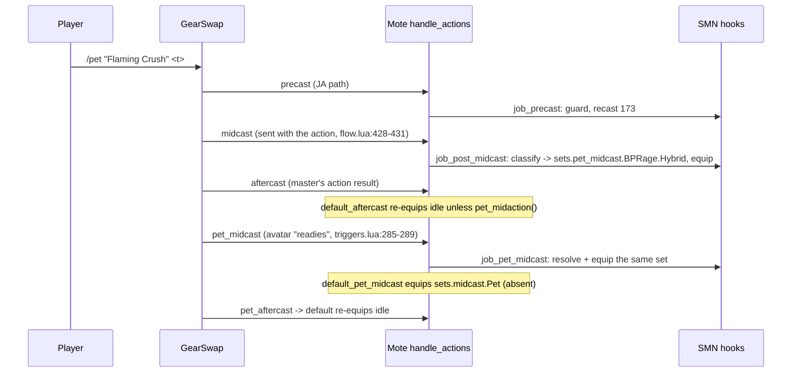

# SMN (Summoner) job

SMN is the 16th job area, added on 2026-07-29 (commit `c132cf2`, "feat(smn): add
Summoner as the 16th job"): 13 hook modules plus one logic module under
`shared/jobs/smn/functions/` (1 298 lines). Unlike every other job it has **no
generic template**: the entry, configs and sets exist in the gitignored live
folder `Tetsouo/` and, since commit `da68606`, as a byte-identical copy in the
Tetsouo overlay `_master/Tetsouo/`. GearSwap loads it when Tetsouo's main job becomes SMN
(`Tetsouo/Tetsouo_SMN.lua`). From then on Mote-Include calls its hooks on every
action (including the avatar's actions through the pet hooks), on status and
buff changes, on `//gs c` commands and on state cycles.

What SMN adds on top of the shared pipeline:

- **Blood Pact gear by category**: `blood_pact_classifier.lua` maps a pact name
  to `sets.pet_midcast.BPRage.{Physical,Magical,Hybrid,AstralFlow}` or
  `sets.pet_midcast.BPWard.{Buff,Debuff,Heal}`; the set is equipped in the
  master's `job_post_midcast` and again in `job_pet_midcast`.
- **Avatar's Favor idle**: a boolean state kept in sync with the buff selects
  `sets.idle.Avatar`; otherwise the town set in town and `sets.MoveSpeed` while
  moving, through the shared `BaseSetBuilder` steps.
- **Commands**: `smn summon <avatar>`, `smn bp <pact>`, JA shortcuts
  (`smn apogee`, `smn astralflow`, ...), and a Summoning Magic skill-up loop
  (`skillup`: Siren, Release, repeat).
- **Carbuncle auto-summon** 10 s after `user_setup` when no pet is out.

Every file in scope was read in full except the gear content of the sets file
(only structure and set names were read; the live sets are an empty skeleton).
Line numbers were re-checked against the working tree on 2026-09-25.

## Deployment status

Verified on 2026-09-25:

| Piece | Where it exists | Tracked |
|-------|-----------------|---------|
| Shared modules (`shared/jobs/smn/`, 14 files) | repo | yes |
| Blood Pact data (`shared/data/magic/SMN_SPELL_DATABASE.lua` + 15 `summoning/*.lua` files) | repo | yes |
| Reference notes (`docs/SMN_BLOOD_PACTS_REFERENCE.md`, `docs/CLAUDE_CODE_PROMPT_SMN.md`) | repo | yes |
| `character_db.lua:39` (Tetsouo roster), `:77` (all jobs) | repo | yes |
| Entry `Tetsouo_SMN.lua` | `Tetsouo/` (live) and `_master/Tetsouo/entry/` (overlay), identical | overlay yes (`da68606`) |
| Configs `SMN_KEYBINDS`, `SMN_LOCKSTYLE`, `SMN_MACROBOOK`, `SMN_STATES`, `SMN_CUSTOM` | `Tetsouo/config/smn/` and `_master/Tetsouo/config/smn/`, identical | overlay yes |
| Sets `smn_sets.lua` | `Tetsouo/sets/smn/` and `_master/Tetsouo/sets/smn/` | overlay yes |
| `_master/entry/Tetsouo_SMN.lua`, `_master/config/smn/`, `_master/sets/smn_sets.lua` | nowhere | - |
| `SMN_REFILL.lua`, `SMN_TP_CONFIG.lua`, `SMN_JA_DATABASE.lua`, SMN message formatter | nowhere | - |
| `clone_character.py` `ALL_VALID_JOBS` | lists 14 jobs, no SMN (and no PUP since 2026-09-25) | yes |

Consequence: `da68606` saved the entry, configs and sets in the Tetsouo overlay,
and the clone copies an overlay's `sets/<job>/` tree in place of the generic
flat file (step 3 of `clone_character.py`, "the modular tree wins over the
generic flat file", since `f6f1683`). A clone to Tetsouo, or any clone with
`--source Tetsouo`, therefore restores SMN whole (entry, `config/smn/`,
`sets/smn/`), and an existing folder is moved to
`addons/GearSwap/clone_backups/` after the final confirmation instead of being
deleted. Any other clone that lists SMN (from `character_db` or `--source
Kaories`) gets no SMN entry, and since 2026-09-25 the script says so:
`[WARN] No entry file for: SMN - these jobs will not load`. Manual job
selection cannot pick SMN (`ALL_VALID_JOBS`).

## Files

| Path | Lines | Role |
|------|------:|------|
| `Tetsouo/Tetsouo_SMN.lua` (live; same file in `_master/Tetsouo/entry/`) | 200 | Entry: config preload, `get_sets`, `init_gear_sets`, `job_sub_job_change`, `user_setup` (with Carbuncle auto-summon), `job_update` (UI only), `file_unload` (stops the skill-up loop) |
| `shared/jobs/smn/functions/smn_functions.lua` | 80 | Facade: `message_buffs.lua` (20), the 12 hook files, `dualbox_manager` (71), debug line (77-78) |
| `shared/jobs/smn/functions/SMN_PRECAST.lua` | 116 | Guard, cooldown, WS; `job_post_precast` (TP gear) |
| `shared/jobs/smn/functions/SMN_MIDCAST.lua` | 216 | `job_post_midcast`: Blood Pact set via classifier, else per-skill `MidcastManager` table |
| `shared/jobs/smn/functions/SMN_PET_MIDCAST.lua` | 44 | `job_pet_midcast`: re-equips the classified Blood Pact set |
| `shared/jobs/smn/functions/SMN_AFTERCAST.lua` | 29 | Watchdog notify only |
| `shared/jobs/smn/functions/SMN_IDLE.lua` | 60 | `customize_idle_set`: `sets.idle.Avatar` / `DT` / `Normal`, town set, `sets.MoveSpeed` (`BaseSetBuilder`) |
| `shared/jobs/smn/functions/SMN_ENGAGED.lua` | 21 | `customize_melee_set` returns Mote's set |
| `shared/jobs/smn/functions/SMN_STATUS.lua` | 29 | DoomManager status handling (own copy, not `LifecycleManager`) |
| `shared/jobs/smn/functions/SMN_BUFFS.lua` | 42 | DoomManager + Avatar's Favor state sync |
| `shared/jobs/smn/functions/SMN_COMMANDS.lua` | 433 | `job_self_command`, skill-up loop, `job_state_change` (`LifecycleManager.state_change()`), `_G.cancel_smn_skillup_loop` |
| `shared/jobs/smn/functions/SMN_MOVEMENT.lua` | 21 | Empty `job_handle_equipping_gear` (movement gear is in `SMN_IDLE`) |
| `shared/jobs/smn/functions/SMN_LOCKSTYLE.lua` | 40 | Lazy `LockstyleManager.create('SMN', 'config/smn/SMN_LOCKSTYLE', 1, 'WHM')` |
| `shared/jobs/smn/functions/SMN_MACROBOOK.lua` | 36 | Lazy `MacrobookManager.create('SMN', ..., 'WHM', 1, 1)` |
| `shared/jobs/smn/functions/logic/blood_pact_classifier.lua` | 131 | Seven name lists, `classify`, `get_set`, `resolve` |
| `Tetsouo/config/smn/SMN_STATES.lua` | 50 | `IdleMode`, `CastingMode`, `AvatarFavor`, `Moving`, `FastCast`, AutoMedicine |
| `Tetsouo/config/smn/SMN_KEYBINDS.lua` | 36 | Data only: 3 binds handed to `KeybindManager.create('SMN', ...)`, which adds `bind_all`, `unbind_all`, `show_intro` (also loads the macrobook/lockstyle wrappers), `show_binds`, and appends `COMMON_KEYBINDS.lua` |
| `Tetsouo/config/smn/SMN_CUSTOM.lua` | 118 | Player modes and gear rules, commented examples only ([keybinds and custom states](../systems/keybinds-and-custom.md)) |
| `Tetsouo/config/smn/SMN_LOCKSTYLE.lua` | 36 | `default = 1`, `by_subjob` (all 1), `get_style` |
| `Tetsouo/config/smn/SMN_MACROBOOK.lua` | 34 | book 1, page per subjob (WHM 1, SCH 2, RDM 3, BLM 4), empty `dualbox` |
| `Tetsouo/sets/smn/smn_sets.lua` | 172 | Skeleton sets (`empty_set()`), real gear only in `sets.precast.FC` |
| `shared/data/magic/SMN_SPELL_DATABASE.lua` + `summoning/*.lua` (15 files) | 418 + 2 205 | Avatar/pact data, read by `data_loader.lua:74`, `spell_message_handler.lua:74,97`, `ability_message_handler.lua:131` (messages and `//gs c info` only; SMN logic does not read it) |

There is no SMN message formatter or message data file; SMN prints through
`MessageFormatter.show_info/show_success/show_error/show_debug`.

## How it works

### Load sequence

The entry chunk (`Tetsouo_SMN.lua:18-37`) loads `LOCKSTYLE_CONFIG`,
`REGION_CONFIG`, **and requires `JobChangeManager` and `UI_MANAGER` at top
level** (32-33), before `INIT_SYSTEMS` installs `ModuleCache`, so those two are
pre-cache instances ([core lifecycle](../systems/core-lifecycle.md#modulecache)).
`get_sets()` (46-86) includes Mote-Include (51), which runs `user_setup()` and
`init_gear_sets()` (91-93, `include('sets/smn/smn_sets.lua')`), then
`INIT_SYSTEMS` (54), `data_loader` and the message hooks (57-66),
`_G.LockstyleConfig`, `_G.UIConfig`, `_G.RECAST_CONFIG` (69-71),
`JobChangeManager.cancel_all()` (74-76), the facade (78) and the lockstyle cancel
registration (81-83). There is no TP config.

`user_setup()` (119-161):

1. `SMNStates.configure()`.
2. `require` of `SMN_KEYBINDS`, global `SMNKeybinds`, `bind_all()` (3 binds
   plus the character's common keys), which calls `show_intro()`. The shared
   `KeybindManager` intro (`keybind_manager.lua` `show_intro`) `require`s
   `SMN_MACROBOOK` and `SMN_LOCKSTYLE`, whose bodies define
   `select_default_macro_book` and `select_default_lockstyle`. The facade has
   not run yet, so without this the next step would find both nil. A failed
   `require` prints `[SMN] Keybinds failed to load: <error>` (130).
3. `KeybindUI.smart_init("SMN", UIConfig.init_delay)` (the pre-cache instance).
4. `JobChangeManager.initialize()`, then the gate at 141 passes:
   `select_default_macro_book()` now, `select_default_lockstyle` scheduled
   `LockstyleConfig.initial_load_delay` (8 s) later. These are pre-cache
   instances of the two wrappers; the facade loads its own copies later
   (the other jobs work the same way).
5. A coroutine scheduled `initial_load_delay + 2` s later (10 s): if the main
   job is still SMN, the player is not dead and `get_mob_by_target('pet')` finds
   nothing, `input /ma "Carbuncle" <me>` (149-156).
6. `pcall(require, 'shared/utils/dualbox/dualbox_manager')`.

### Precast

`job_precast` (`SMN_PRECAST.lua:59-92`): `PrecastGuard` (63-65), then
`CooldownChecker` by `action_type` (70-77; Blood Pacts are `Ability` with
recast ids 173/174), cancel check, `WSPrecastHandler.handle(spell, eventArgs,
{})` for weaponskills only (80-84), and an empty Blood Pact branch (88-91).
`job_post_precast` applies TP gear (none, the config is `{}`).

- `PrecastGuard` routes Blood Pacts (`spell.type` `BloodPactRage` /
  `BloodPactWard`) to the generic `check_and_block` with the Ability list
  ([precast pipeline](../systems/precast-pipeline.md#precastguard-routing)).
- Mote uses `sets.precast[spell.type]` for a Blood Pact when it exists, else
  `sets.precast.JA` (`Mote-Include.lua:647-655`); SMN defines neither `BloodPactRage` nor
  `BloodPactWard`, and `sets.precast.JA` has only the seven SMN JA names, so a
  Blood Pact gets no precast gear (no Blood Pact delay set hook exists). The
  file header says so (`SMN_PRECAST.lua:6-8`); the old comment claiming Fast
  Cast was corrected in `b6c7dc6`.
- Avatar summons are Summoning Magic and get `sets.precast.FC['Summoning Magic']`.

### Blood Pacts

- `BloodPactClassifier.classify` (91-103) tests the lists in order: Astral
  Flow, Physical, Hybrid, Magical, Ward Buff, Ward Heal, Ward Debuff.
  `get_set` (108-120) walks the dotted path under `sets.pet_midcast`;
  `resolve` returns `set, category`.
- `job_post_midcast` (`SMN_MIDCAST.lua:177-194`) equips the set and prints the
  category with `debugmidcast`; an unknown pact is only reported in debug.
  `job_pet_midcast` (`SMN_PET_MIDCAST.lua:26-34`) equips it again.
- Whether the master's gear from midcast is still on when the pact fires
  depends on the order of the master's aftercast and the avatar's "readies"
  packet; the code does not record it. The pet hook is the one that runs when
  the avatar acts.
- Compared with `res/job_abilities.lua`, every classified name exists. Not
  classified: `Raise II` (Cait Sith; listed in
  `docs/SMN_BLOOD_PACTS_REFERENCE.md:313`), plus wyvern breaths and
  `Cacodemonia`, which carry Blood Pact types in the resources.
  `Deconstruction` and `Chronoshift` are `BloodPactRage` in the resources but
  classified as `BPWard.Debuff`.

### Midcast (master magic)

Mote's default midcast runs first, then `job_post_midcast` dispatches on
`spell.skill` through `JOB_POST_MIDCAST_HANDLERS` (154-162): Summoning,
Healing, Divine, Dark with skill + spell; Enhancing with the Composure target
(never true on SMN); Elemental and Enfeebling with `mode_state = CastingMode`
(P8 `base.Resistant`, which does not exist). Ninjutsu, songs and other skills
get only Mote's default. `job_midcast` only loads the modules.

### Aftercast, idle, engaged, status, buffs

- `job_aftercast` (`SMN_AFTERCAST.lua:19-23`) notifies the watchdog; Mote's
  `default_aftercast` returns to idle unless a pet action is in progress.
- `customize_idle_set` (`SMN_IDLE.lua:39-58`):
  1. `AvatarFavor` true (and `sets.idle.Avatar` defined): `sets.idle.Avatar`,
     in town too (the file's rule: Favor always wins).
  2. Otherwise `sets.idle.DT` / `.Avatar` / `.Normal` by `IdleMode`
     (`select_mode_set`, 21-34, Mote's set when none matches), passed to
     `BaseSetBuilder.select_idle_base_town`: in a city (Dynamis excluded)
     `sets.idle.Town` replaces it, in Adoulin `sets.Adoulin` if defined.
  3. In town (`is_in_town()` for the Favor case, a town set applied
     otherwise) the set is returned as is; elsewhere
     `BaseSetBuilder.apply_movement` lays `sets.MoveSpeed` over it while
     `state.Moving` is `'true'` (AutoMove sets it and sends `gs c update`).
  The Mote defense/kiting layers on the set Mote chose are still dropped when
  an `IdleMode` set replaces it.
- `customize_melee_set` returns Mote's set; `sets.engaged` is a flat skeleton.
- `job_status_change` (`SMN_STATUS.lua:18-27`) and `job_buff_change`
  (`SMN_BUFFS.lua:27-40`) call `DoomManager` themselves instead of
  `LifecycleManager`. On `Avatar's Favor` gain or loss, `job_buff_change` sets
  `state.AvatarFavor` to match and sends `gs c update`.

## Mote states

Created by `SMNStates.configure()` (`Tetsouo/config/smn/SMN_STATES.lua:18-48`).

| State | Values | Default | Key | Read by |
|-------|--------|---------|-----|---------|
| `IdleMode` (replaced) | Normal, DT, Avatar | Normal | `^numpad1` | `SMN_IDLE.lua:22-33` |
| `CastingMode` (replaced) | Normal, Resistant | Normal | `^numpad2` | Mote default precast/midcast, `SMN_MIDCAST.lua:135,148` |
| `AvatarFavor` | boolean | false | `^numpad3` | `SMN_IDLE.lua:47`, `SMN_BUFFS.lua:36-37` |
| `Moving` | false, true | false | none | AutoMove writes it; `BaseSetBuilder.apply_movement` from `SMN_IDLE.lua:57` |
| `FastCast` | 0..80 | 0 | none | `midcast_watchdog.lua` (reads `state.FastCast`) |
| `AutoMedicine` | shared | persisted | `#numpad0` (from `config/COMMON_KEYBINDS.lua`) | `AutoMedicine.init` (44-47) |

With `FastCast` at 0, the midcast watchdog uses the full resource cast time.
The `AvatarFavor` bind is reported not to appear on the HUD (see Known issues).

## Commands

`job_self_command` (`SMN_COMMANDS.lua:289-416`) lowercases the first word and
tests, in order: `altjobupdate`, `requestjob` (299-316; `altjobupdate`
forwards the sender name since 2026-09-25), UI (318-322), `debugmidcast`
(327-333), `cyclestate` (338-343), watchdog (348-353), `skillup` (358-364),
CommonCommands (369-378), `smn` (383-415). Anything else falls through to
Mote. The file header lists `skillup` since 2026-09-25.

| Command | Effect |
|---------|--------|
| `smn summon <avatar>` | `input /ma "<Avatar>" <me>` for the 15 avatars and 8 spirits in `KNOWN_AVATARS` (72-98, case-insensitive, `caitsith` accepted) |
| `smn astralflow` / `astralconduit` / `apogee` / `siphon` / `manacede` / `favor` / `release` / `retreat` | `input /ja "<Name>" <me>` (`JA_SHORTCUTS`, 101-111) |
| `smn assault` | `input /ja "Assault" <t>` |
| `smn bp <pact>` | `input /pet "<pact>" <target>`: `<me>` for a pact `BloodPactClassifier.classify` puts in `BPWard.Buff` / `BPWard.Heal`, `<t>` for every other pact and for a name it does not know (`handle_bp`, 264-280) |
| `skillup` / `skillup start|on|stop|off|status|<1-60>` | Toggle, start, stop or show the loop; a number sets the delay after Release and restarts |
| `debugmidcast`, `cyclestate`, `ui ...`, `watchdog ...`, common commands | as in the other jobs |

Skill-up loop (122-229): `skillup_iteration` casts Siren, schedules Release 5 s
later, then the next iteration `release_to_next_delay` (1.5 s) after that. Every
step checks `skillup_valid` (active, same counter, main job SMN, not dead);
`stop_skillup` bumps the counter. `file_unload` calls
`_G.cancel_smn_skillup_loop` (`Tetsouo_SMN.lua:189-191`) so a reload or job
change ends the loop.

`job_state_change` (421) is `LifecycleManager.state_change()`: skips `Moving`,
refreshes the UI, for the key and the description alike. It sends no
`gs c update`: Mote's state commands and `CycleHandler` both run
`handle_update` (job update and idle gear) right after the hook.

## Set names the code looks up

L = `Tetsouo/sets/smn/smn_sets.lua` (identical to the overlay copy
`_master/Tetsouo/sets/smn/smn_sets.lua`). Every set except
`sets.precast.FC` is `empty_set()` (28-35): all 16 slots set to `""`.

| Set | Looked up by | L |
|-----|--------------|---|
| `sets.idle.Normal`, `.DT`, `.Avatar` | `SMN_IDLE.lua` | 51-53 |
| `sets.idle.Town` | `BaseSetBuilder.select_idle_base_town` from `customize_idle_set`, in cities when Avatar's Favor is off | 55 |
| `sets.Adoulin` | same, in Adoulin | absent (Adoulin then counts as a city and gets `sets.idle.Town`) |
| `sets.MoveSpeed` | `BaseSetBuilder.apply_movement` from `customize_idle_set`, outside town while moving | 172 |
| `sets.engaged` | Mote `get_melee_set` | 61 |
| `sets.resting` | Mote resting | 67 |
| `sets.precast.FC` (+ `['Summoning Magic']`, `['Healing Magic']`, `['Enhancing Magic']`) | Mote default precast | 76-97 |
| `sets.precast.WS` | Mote default precast | 100 |
| `sets.precast.JA[...]` (7 SMN JAs) | Mote default precast | 106-113 |
| `sets.precast.BloodPactRage`, `.BloodPactWard` | Mote precast for Blood Pacts | **absent** |
| `sets.midcast['Summoning Magic']`, `['Healing Magic']`, `['Enhancing Magic']`, `['Divine Magic']`, `['Dark Magic']`, `['Elemental Magic']`, `['Enfeebling Magic']` | `MidcastManager` base sets | 122-139 |
| `sets.midcast.Cure`, `.Curaga`, `.Stoneskin`, `.Phalanx`, `.Refresh`, `.Haste` | MidcastManager P0/P1 | 128-135 |
| `sets.midcast['Elemental Siphon']` | Mote default midcast by name (JA) | 125 |
| `sets.pet_midcast.BPRage.Physical/Magical/Hybrid/AstralFlow` | classifier | 150-153 |
| `sets.pet_midcast.BPWard.Buff/Debuff/Heal` | classifier | 157-159 |
| `sets.midcast.Pet` | Mote `default_pet_midcast` | absent (Mote equips nothing) |
| `sets.weapons`, `sets.pet.Engaged` | nothing | 41, 166 |
| `sets.buff.Doom` | DoomManager | **absent** |

Because GearSwap skips `""` items (`GearSwap/equip_processing.lua:97`) but
`equip()` merges slot by slot (`GearSwap/helper_functions.lua:319-326`), an
all-`""` set equipped after another set in the same event cancels every slot
queued before it. With the current skeleton, only the precast Fast Cast set is
ever worn, and it stays on after the first cast.

## Configuration

| File / key | Default | Read by |
|------------|---------|---------|
| `Tetsouo/config/smn/SMN_STATES.lua` | see states | entry `user_setup` |
| `Tetsouo/config/smn/SMN_KEYBINDS.lua` | 3 binds (+ `COMMON_KEYBINDS.lua`) | entry `user_setup`, `file_unload` |
| `Tetsouo/config/smn/SMN_CUSTOM.lua` | examples only | `KeybindManager` via `custom_states` |
| `Tetsouo/config/smn/SMN_LOCKSTYLE.lua` `default`, `by_subjob`, `get_style` | 1 everywhere | `LockstyleManager` (uses `get_style`, unlike RDM/WHM) |
| `Tetsouo/config/smn/SMN_MACROBOOK.lua` | book 1, pages 1-4 | `MacrobookManager` |
| `SKILLUP_STATE` knobs (`SMN_COMMANDS.lua:122-128`) | 5.0 s cast-to-release, 1.5 s release-to-next | the loop; changed by `skillup <n>` |
| Carbuncle auto-summon delay | `initial_load_delay + 2.0` (10 s) | `Tetsouo_SMN.lua:156` |
| Refill | none (`FALLBACK_LIST`, `shared/utils/inventory/refill/config_resolver.lua:39-46`) | `refill` |

## State & lifetime

- Module state: `SKILLUP_STATE` (module-local, dies on reload), lazy-load
  locals, the classifier's name sets.
- `_G` written: Mote hooks including `job_pet_midcast`, `SMNKeybinds`,
  `LockstyleConfig`, `UIConfig`, `RECAST_CONFIG`, `RegionConfig`,
  `cancel_smn_skillup_loop`, factory globals.
- `windower.*`: none; no events registered.
- Coroutines: the Carbuncle summon (10 s) and the skill-up steps. The summon
  coroutine is not cancelled by a reload.
- Subjob change: Mote runs `user_setup()` in the current sandbox (states reset,
  keybinds rebound, a Carbuncle coroutine scheduled), then
  `job_sub_job_change` (104-109) calls `on_job_change`, which reloads 0.5 s
  later; the new sandbox's `user_setup` schedules a second Carbuncle
  coroutine. (The `JobChangeManager.initialize({...})` call it also made was
  removed on 2026-09-25.)
- `file_unload` stops the skill-up loop, cancels `JobChangeManager` timers and
  unbinds.

## Interactions

- `PrecastGuard`, `CooldownChecker`, `WSPrecastHandler`
  ([precast pipeline](../systems/precast-pipeline.md)); `MidcastManager`,
  `MidcastWatchdog` ([midcast and buffs](../systems/midcast-and-buffs.md));
  `DoomManager` directly.
- Messages: `MessageFormatter` generic calls, `message_buffs` (included by the
  facade), `message_commands`; Blood Pact activation messages come from the
  shared ability handler through `SMN_SPELL_DATABASE`
  ([messages](../systems/messages.md)).
- Pet hooks are shared with [BST](bst.md) and PUP (`job_pet_midcast`).
- Factories, `JobChangeManager`, `CycleHandler`, `CommonCommands`, UI, dual-box.

## Invariants & gotchas

- SMN has no generic template: a change to the entry, configs or sets is made in
  `Tetsouo/` for the game and must be copied into `_master/Tetsouo/` (same
  relative path, entry under `entry/`, configs under `config/smn/`, sets under
  `sets/smn/`) to be versioned. Today both copies are identical.
- Blood Pact gear depends on the exact English pact name being in one of the
  classifier lists; the header asks to keep them in sync with
  `docs/SMN_BLOOD_PACTS_REFERENCE.md`.
- `customize_idle_set` owns the whole idle choice; town and movement gear come
  from `BaseSetBuilder` there, after the Avatar's Favor / `IdleMode` choice.
- `empty_set()` skeleton slots are not neutral; delete unused slots rather than
  leave `""`.
- The Carbuncle summon fires after every load in which no pet is out, not only
  the first one.

## Extending

- Make SMN a templated job: copy the live entry to
  `_master/entry/Tetsouo_SMN.lua`, the four configs to `_master/config/smn/`,
  flatten the sets to `_master/sets/smn_sets.lua`, add `SMN` to
  `ALL_VALID_JOBS` in `clone_character.py`, and add `SMN_REFILL.lua`. Until
  then a non-Tetsouo clone prints `[WARN] No entry file for: SMN`.
- New Blood Pact: add the name to the right list in
  `blood_pact_classifier.lua` and to the reference doc.
- New Blood Pact category: add a list and a branch in `classify`, and the set
  under `sets.pet_midcast`.
- Blood Pact delay gear: define `sets.precast.BloodPactRage` /
  `BloodPactWard` (Mote picks them by `spell.type`).
- New JA shortcut: add it to `JA_SHORTCUTS`.

## Known issues

- `smn bp` matches pact names case-sensitively (`BloodPactClassifier` name
  sets): `smn bp healing ruby` is not recognised and targets `<t>`
  (`SMN_COMMANDS.lua:271`).
- The Carbuncle auto-summon is scheduled from both the old and the new sandbox
  on a subjob change and re-summons after every reload when no pet is out
  (`Tetsouo_SMN.lua:149-156`). PLAUSIBLE for the double cast.
- SMN has no generic template: its only tracked copy is the Tetsouo overlay
  (`da68606`), and `clone_character.py` still leaves it out of manual job
  selection (`ALL_VALID_JOBS`); a clone that is not to Tetsouo or from
  `--source Tetsouo` gets no SMN entry and, since 2026-09-25, prints
  `[WARN] No entry file for: SMN` (see [Deployment status](#deployment-status)).
- Skeleton sets blank every slot queued before them, so the Fast Cast set stays
  on (`Tetsouo/sets/smn/smn_sets.lua:28-35`). This now includes
  `sets.MoveSpeed` and `sets.idle.Town`, which the idle uses: once the idle
  sets hold gear, a still-skeleton `sets.MoveSpeed` blanks the whole idle set
  while moving (`set_combine` copies the `""` slots), so it must keep only the
  slots it really changes.
- `file_unload` prints "[SMN] Skillup loop is not running" on every unload, or
  raises under `pcall` when no `//gs c` command ran yet (`SMN_COMMANDS.lua:177-181`,
  `Tetsouo_SMN.lua:189-191`).
- `Raise II` is not classified and gets no Blood Pact set
  (`blood_pact_classifier.lua:63-75`).
- Blood Pacts get no precast gear (`SMN_PRECAST.lua:87-91`); the comment that
  claimed Fast Cast was fixed in `b6c7dc6`.
- No `SMN_REFILL.lua`: `refill` uses the hard-coded `FALLBACK_LIST`
  (`config_resolver.lua:39-46`) and moves anything else back to the Case.
- No `SMN_JA_DATABASE.lua`; the ability message handler's `JOBS` list has no SMN
  (`ability_message_handler.lua:66-70`), so the first SMN job ability after a load
  (Apogee, Astral Flow, ...) walks every job database (175-180). Blood Pacts are
  sent straight to the SMN spell database by their type (151-153).
- Reported during the audit, not re-derived here: 18 pact names collide with
  spell names in the shared spell namespace (`//gs c info` can never show them,
  see [spell databases](../data/spell-databases.md#known-issues)), and the
  `AvatarFavor` bind does not appear on the HUD.
- `CastingMode` has no effect (no `.Resistant` set); `sets.weapons` and
  `sets.pet.Engaged` are never used; `sets.buff.Doom` is missing.
- Standards: `SMN_STATUS`, `SMN_BUFFS`, `SMN_AFTERCAST` re-implement
  `LifecycleManager` (`SMN_STATUS.lua:18-27`); `SMN_SPELL_DATABASE.can_use_pact`
  is broken and dead (known).
- Not an issue: `Cacodemonia` (`res/job_abilities.lua`, id 663, `mp_cost` 0)
  is not classified, and should not be: it is not one of Diabolos' player
  pacts (BG-Wiki, Diabolos page, checked 2026-09-25).
