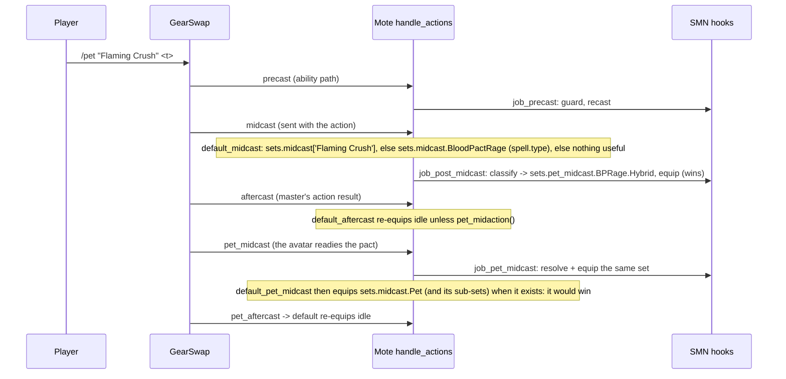

# SMN (Summoner) job

SMN is the 16th job area, added on 2026-07-29: the facade plus 12 hook
modules and one logic module under `shared/jobs/smn/functions/` (about 1 300
lines). Unlike every other job it has **no generic template**: the entry,
configs and sets exist only in the author's live character folder and in the
author's overlay `_master/Tetsouo/`, and **both are gitignored** (the
`.gitignore` pattern `Tetsouo/` matches `_master/Tetsouo/` as well). Nothing
but the shared modules, the Blood Pact data and this documentation is under
version control. GearSwap loads SMN when that character's main job becomes
SMN. From then on Mote-Include calls its hooks on every action (including the
avatar's actions through the pet hooks), on status and buff changes, on
`//gs c` commands and on state cycles.

What SMN adds on top of the shared pipeline:

- **Blood Pact gear by category**: `blood_pact_classifier.lua` maps a pact
  name to `sets.pet_midcast.BPRage.{Physical,Magical,Hybrid,AstralFlow}` or
  `sets.pet_midcast.BPWard.{Buff,Debuff,Heal}`; the set is equipped in the
  master's `job_post_midcast` and again in `job_pet_midcast`.
- **Avatar's Favor idle**: a boolean state kept in sync with the buff selects
  `sets.idle.Avatar`; otherwise the `IdleMode` set, the town set in town and
  `sets.MoveSpeed` while moving, through the shared `BaseSetBuilder` steps.
- **Commands**: `smn summon <avatar>`, `smn bp <pact>`, JA shortcuts
  (`smn apogee`, `smn astralflow`, ...), and a Summoning Magic skill-up loop
  (`skillup`: Siren, Release, repeat).
- **Carbuncle auto-summon** 10 s after `user_setup` when no pet is out.

Player pages: [start page](../../user/jobs/smn/README.md),
[modes](../../user/jobs/smn/states.md), [sets](../../user/jobs/smn/sets.md).

Re-verified against the code on 2026-09-28. References name a file and a
function, not a line number. Commit hashes quoted in older versions of this
page predate the 2026-09-27 history rewrite and were removed.

## Deployment status

Verified on 2026-09-28:

| Piece | Where it exists | Versioned |
|-------|-----------------|-----------|
| Shared modules (`shared/jobs/smn/`, 14 files) | repo | yes |
| Blood Pact data (`shared/data/magic/SMN_SPELL_DATABASE.lua` + `summoning/*.lua`) | repo | yes |
| Reference notes (`docs/SMN_BLOOD_PACTS_REFERENCE.md`) | repo | yes |
| Alt command configs (`_master/config/alt/SMN_ALT_COMMANDS.lua`, `SMN_ALT_CUSTOM.lua`) | repo | yes |
| `character_db.lua`: SMN in the author's roster and in the all-jobs list | repo | yes |
| Entry `Tetsouo_SMN.lua` | live folder and `_master/Tetsouo/entry/` | **no** (gitignored) |
| Configs `SMN_STATES`, `SMN_KEYBINDS`, `SMN_CUSTOM`, `SMN_HUD`, `SMN_LOCKSTYLE`, `SMN_MACROBOOK` | live `config/smn/` and `_master/Tetsouo/config/smn/` | **no** |
| Sets `smn_sets.lua` | live `sets/smn/` and `_master/Tetsouo/sets/smn/` | **no** |
| `_master/entry/Tetsouo_SMN.lua`, `_master/config/smn/`, `_master/sets/smn_sets.lua` | nowhere | - |
| `SMN_REFILL.lua`, `SMN_TP_CONFIG.lua`, `SMN_JA_DATABASE.lua`, SMN message formatter | nowhere | - |
| `clone_character.py` `ALL_VALID_JOBS` | 15 jobs, no SMN (and no PUP) | yes |

Consequence: the only copies of SMN's entry, configs and sets are on the
author's disk. A clone to the author's character, or any clone with
`--source Tetsouo`, copies them from the overlay (the overlay's
`sets/<job>/` tree wins over the generic flat file). Any other clone that
lists SMN gets no SMN entry and prints
`[WARN] No entry file for: SMN - these jobs will not load`; manual job
selection cannot pick SMN.

## Files

| Path | Role |
|------|------|
| `_master/Tetsouo/entry/Tetsouo_SMN.lua` (gitignored; same file in the live folder) | Entry: config preload, `get_sets`, `init_gear_sets`, `job_sub_job_change`, `user_setup` (Carbuncle auto-summon), `job_update` (HUD only), `file_unload` (stops the skill-up loop) |
| `shared/jobs/smn/functions/smn_functions.lua` | Facade: `message_buffs.lua`, the 12 hook files, `dualbox_manager`, a debug line |
| `shared/jobs/smn/functions/SMN_PRECAST.lua` | Guard, cooldown, WS; empty Blood Pact branch; `job_post_precast` (TP gear) |
| `shared/jobs/smn/functions/SMN_MIDCAST.lua` | `job_post_midcast`: Blood Pact set via the classifier, else `JOB_POST_MIDCAST_HANDLERS` by skill |
| `shared/jobs/smn/functions/SMN_PET_MIDCAST.lua` | `job_pet_midcast`: re-equips the classified Blood Pact set |
| `shared/jobs/smn/functions/SMN_AFTERCAST.lua` | Watchdog notify only |
| `shared/jobs/smn/functions/SMN_IDLE.lua` | `customize_idle_set`: `sets.idle.Avatar` / `DT` / `Normal`, town set, `sets.MoveSpeed` (`BaseSetBuilder`) |
| `shared/jobs/smn/functions/SMN_ENGAGED.lua` | `customize_melee_set` returns Mote's set |
| `shared/jobs/smn/functions/SMN_STATUS.lua` | `DoomManager.handle_status_change` (own copy, not `LifecycleManager`) |
| `shared/jobs/smn/functions/SMN_BUFFS.lua` | `DoomManager` + Avatar's Favor state sync |
| `shared/jobs/smn/functions/SMN_COMMANDS.lua` | `job_self_command`, skill-up loop, `job_state_change` (`LifecycleManager.state_change()`), `_G.cancel_smn_skillup_loop` |
| `shared/jobs/smn/functions/SMN_MOVEMENT.lua` | Empty `job_handle_equipping_gear` (movement gear is in `SMN_IDLE`) |
| `shared/jobs/smn/functions/SMN_LOCKSTYLE.lua` | Lazy `LockstyleManager.create('SMN', 'config/smn/SMN_LOCKSTYLE', 1, 'WHM')` |
| `shared/jobs/smn/functions/SMN_MACROBOOK.lua` | Lazy `MacrobookManager.create('SMN', ..., 'WHM', 1, 1)` |
| `shared/jobs/smn/functions/logic/blood_pact_classifier.lua` | Seven name sets, `classify`, `get_set`, `resolve` |
| `config/smn/SMN_STATES.lua` | `IdleMode`, `CastingMode`, `AvatarFavor`, `Moving`, `FastCast`, AutoMedicine |
| `config/smn/SMN_KEYBINDS.lua` | 3 binds handed to `KeybindManager.create('SMN', ...)` |
| `config/smn/SMN_CUSTOM.lua` | Player modes and gear rules, commented examples only |
| `config/smn/SMN_HUD.lua` | Per-job HUD section / row order (empty = defaults) |
| `config/smn/SMN_LOCKSTYLE.lua` | `default = 1`, `by_subjob` (all 1), `get_style` |
| `config/smn/SMN_MACROBOOK.lua` | Book 1; page per subjob (WHM 1, SCH 2, RDM 3, BLM 4); empty `dualbox` |
| `sets/smn/smn_sets.lua` | Skeleton sets (`empty_set()`), real gear only in `sets.precast.FC` |
| `shared/data/magic/SMN_SPELL_DATABASE.lua` + `summoning/*.lua` | Avatar / pact data for messages and `//gs c info` (SMN logic does not read it) |

The `config/` and `sets/` rows are relative to the character folder and to
`_master/Tetsouo/`. There is no SMN message formatter or message data file;
SMN prints through `MessageFormatter.show_info/show_success/show_error/show_debug`.

## How it works

### Load sequence

The entry chunk loads `LOCKSTYLE_CONFIG`, `REGION_CONFIG` and the UI config,
**and requires `JobChangeManager` and `UI_MANAGER` at file level**, before
`INIT_SYSTEMS` installs `ModuleCache`, so those two are pre-cache instances
([core lifecycle](../systems/core-lifecycle.md)). `get_sets()` includes
Mote-Include (which runs `user_setup()` and `init_gear_sets()` =
`include('sets/smn/smn_sets.lua')`), then `INIT_SYSTEMS`, `data_loader` and
the message hooks, sets `_G.LockstyleConfig`, `_G.UIConfig`,
`_G.RECAST_CONFIG`, calls `JobChangeManager.cancel_all()`, includes the facade
and registers the lockstyle cancel. It also marks each step for
`//gs c perf`. There is no TP config.

`user_setup()`:

1. `SMNStates.configure()`.
2. `require` of `SMN_KEYBINDS` -> global `SMNKeybinds`, `bind_all()` (3 binds
   plus the character's common keys), which calls `show_intro()`. The intro
   `require`s `SMN_MACROBOOK` and `SMN_LOCKSTYLE`, whose bodies define
   `select_default_macro_book` and `select_default_lockstyle`; the facade has
   not run yet, so without this the next step would find both nil. A failed
   require prints `[SMN] Keybinds failed to load: <error>`.
3. `KeybindUI.smart_init("SMN", UIConfig.init_delay)` (pre-cache instance).
4. `JobChangeManager.initialize()`, then `select_default_macro_book()` now and
   `select_default_lockstyle` after `initial_load_delay` (8 s).
5. A coroutine `initial_load_delay + 2` s later (10 s): if the main job is
   still SMN, the player is not `Dead` and `get_mob_by_target('pet')` finds
   nothing, `input /ma "Carbuncle" <me>`.
6. `pcall(require, 'shared/utils/dualbox/dualbox_manager')`.

### Precast

`job_precast`: `PrecastGuard`, then `CooldownChecker` by `action_type` (Blood
Pacts are `Ability` with their shared Rage / Ward recasts), cancel check,
`WSPrecastHandler.handle(spell, eventArgs, {})` for weaponskills only, and an
empty Blood Pact branch. `job_post_precast` applies TP gear (none).

- `PrecastGuard` routes Blood Pacts (`spell.type` `BloodPactRage` /
  `BloodPactWard`) to the generic ability check
  ([precast pipeline](../systems/precast-pipeline.md#precastguard-routing)).
- Mote uses `sets.precast[spell.type]` for a Blood Pact when it exists, else
  `sets.precast.JA` by name (`get_precast_set`); SMN defines neither
  `BloodPactRage` nor `BloodPactWard`, and `sets.precast.JA` has only the
  seven SMN ability names, so a Blood Pact gets no precast gear.
- Avatar summons are Summoning Magic and get
  `sets.precast.FC['Summoning Magic']`.
- A refused Blood Pact or ability goes through `CooldownChecker`, so
  `RecastAnnounce` can speak for it.

### Blood Pacts

```mermaid
sequenceDiagram
    participant U as Player
    participant GS as GearSwap
    participant M as Mote handle_actions
    participant J as SMN hooks
    U->>GS: /pet "Flaming Crush" <t>
    GS->>M: precast (ability path)
    M->>J: job_precast: guard, recast
    GS->>M: midcast (sent with the action)
    Note over M: default_midcast: sets.midcast['Flaming Crush'], else sets.midcast.BloodPactRage (spell.type), else nothing useful
    M->>J: job_post_midcast: classify -> sets.pet_midcast.BPRage.Hybrid, equip (wins)
    GS->>M: aftercast (master's action result)
    Note over M: default_aftercast re-equips idle unless pet_midaction()
    GS->>M: pet_midcast (the avatar readies the pact)
    M->>J: job_pet_midcast: resolve + equip the same set
    Note over M: default_pet_midcast then equips sets.midcast.Pet (and its sub-sets) when it exists: it would win
    GS->>M: pet_aftercast -> default re-equips idle
```

- `BloodPactClassifier.classify` tests the lists in order: Astral Flow,
  Physical, Hybrid, Magical, Ward Buff, Ward Heal, Ward Debuff. `get_set`
  walks the dotted path under `sets.pet_midcast`; `resolve` returns
  `set, category`.
- `job_post_midcast` equips the set and prints the category under
  `debugmidcast`; an unknown pact is only reported in debug. Mote's own
  midcast choice (by pact name, then `sets.midcast.BloodPactRage` /
  `BloodPactWard` by `spell.type`) runs first and is overwritten by it.
- `job_pet_midcast(spell)` ignores Mote's `eventArgs` and never sets
  `handled`, so Mote's `default_pet_midcast` runs **after** it and equips
  `get_pet_midcast_set`: `sets.midcast.Pet`, refined by pact name, spell map,
  type, then `OffenseMode` / `CastingMode`. The author's file has no
  `sets.midcast.Pet`, so this is harmless today; a player who writes one
  loses the classified Blood Pact set at the moment the avatar acts.
- Whether the master's gear from midcast is still on when the pact fires
  depends on the order of the master's aftercast and the avatar's "readies"
  packet; the pet hook is the one that runs when the avatar acts.
- Compared with `res/job_abilities.lua`, every classified name exists. Not
  classified: `Raise II` (Cait Sith), wyvern breaths and `Cacodemonia`, which
  carry Blood Pact types in the resources. `Deconstruction` and
  `Chronoshift` are `BloodPactRage` in the resources but classified as
  `BPWard.Debuff`.

### Midcast (master magic)

Mote's default midcast runs first, then `job_post_midcast` dispatches on
`spell.skill` through `JOB_POST_MIDCAST_HANDLERS`: Summoning, Healing,
Divine, Dark with skill + spell; Enhancing with the Composure target (never
true on SMN); Elemental and Enfeebling with `mode_state = CastingMode` (P8
`base.Resistant`, which does not exist). Skills outside the table (Ninjutsu,
Blue Magic...) are routed by `MidcastFallback` from Mote's `cleanup_midcast`
([midcast and buffs](../systems/midcast-and-buffs.md#midcastfallback)).
Blood Pacts are abilities, so the fallback leaves them alone. `job_midcast`
only loads the modules.

### Aftercast, idle, engaged, status, buffs

- `job_aftercast` notifies the watchdog; Mote's `default_aftercast` returns to
  idle unless a pet action is in progress.
- `customize_idle_set`:
  1. `AvatarFavor` true (and `sets.idle.Avatar` defined): `sets.idle.Avatar`,
     in town too.
  2. Otherwise `sets.idle.DT` / `.Avatar` / `.Normal` by `IdleMode`
     (`select_mode_set`; Mote's set when none matches), passed to
     `BaseSetBuilder.select_idle_base_town`: in a city (Dynamis excluded)
     `sets.idle.Town` replaces it, in Adoulin `sets.Adoulin` if defined.
  3. In town the set is returned as is; elsewhere
     `BaseSetBuilder.apply_movement` lays `sets.MoveSpeed` over it while
     `state.Moving` is `'true'`.
  Mote's defense / Kiting layers, applied to Mote's set before the hook, are
  dropped whenever an `IdleMode` set replaces it.
- `customize_melee_set` returns Mote's set; `sets.engaged` is a flat
  skeleton.
- `job_status_change` and `job_buff_change` call `DoomManager` themselves
  instead of `LifecycleManager`. SMN therefore lacks the shared
  "hold the status gear during an action" step (`LifecycleManager`
  `hold_during_action`). On `Avatar's Favor` gain or loss, `job_buff_change`
  sets `state.AvatarFavor` to match and sends `gs c update`.

## Mote states

Created by `SMNStates.configure()`.

| State | Values | Default | Key | Read by |
|-------|--------|---------|-----|---------|
| `IdleMode` (replaced) | Normal, DT, Avatar | Normal | `^numpad1` | `SMN_IDLE.lua` `select_mode_set` |
| `CastingMode` (replaced) | Normal, Resistant | Normal | `^numpad2` | Mote default precast / midcast, the Elemental and Enfeebling handlers |
| `AvatarFavor` | boolean (`M(false, 'Avatar Favor')`) | false | `^numpad3` | `customize_idle_set`, `job_buff_change` |
| `Moving` | false, true | false | none | AutoMove writes it; `BaseSetBuilder.apply_movement` |
| `FastCast` | 0..80 | 0 | none | `midcast_watchdog.lua` fallback estimate |
| `AutoMedicine` | shared | persisted | `#numpad0` (from `COMMON_KEYBINDS.lua`) | `AutoMedicine.init` |

`cyclestate AvatarFavor` toggles the boolean (Mote's `cycle` acts as a toggle
on a boolean mode). The `AvatarFavor` HUD row has been reported missing; not
re-derived here.

## Commands

`job_self_command` lowercases the first word and tests, in order:
`altjobupdate` (forwards the sender name), `requestjob`, UI, `debugmidcast`,
`cyclestate`, watchdog, `skillup`, CommonCommands, `smn`. Anything else falls
through to Mote (and the alt fallback).

| Command | Effect |
|---------|--------|
| `smn summon <avatar>` | `input /ma "<Avatar>" <me>` for the 15 avatars and 8 spirits in `KNOWN_AVATARS` (case-insensitive, `caitsith` accepted) |
| `smn astralflow` / `astralconduit` / `apogee` / `siphon` / `manacede` / `favor` / `release` / `retreat` | `input /ja "<Name>" <me>` (`JA_SHORTCUTS`) |
| `smn assault` | `input /ja "Assault" <t>` |
| `smn bp <pact>` | `input /pet "<pact>" <target>`: `<me>` for a pact `classify` puts in `BPWard.Buff` / `BPWard.Heal`, `<t>` for every other pact and for an unknown name (`handle_bp`); the words are joined as typed, so the match is case-sensitive |
| `smn` alone / unknown word | usage line / `Unknown smn subcommand` |
| `skillup` / `skillup start|on|stop|off|status|<1-60>` | Toggle, start, stop or show the loop; a number sets `release_to_next_delay` and restarts |
| `debugmidcast`, `cyclestate`, `ui ...`, `watchdog ...`, common commands | as in the other jobs |

Skill-up loop: `skillup_iteration` casts Siren, schedules Release
`cast_to_release_delay` (5 s) later, then the next iteration
`release_to_next_delay` (1.5 s) after that. Every step checks
`skillup_valid` (active, same counter, main job SMN, not dead);
`stop_skillup` bumps the counter. `file_unload` calls
`_G.cancel_smn_skillup_loop` under `pcall`, so a reload or job change ends
the loop.

`job_state_change` is `LifecycleManager.state_change()`: skips `Moving`,
refreshes the HUD. It sends no `gs c update`: Mote's state commands and
`CycleHandler` both run `handle_update` right after the hook.

## Set names the code looks up

In the author's `sets/smn/smn_sets.lua`, every set except `sets.precast.FC`
is `empty_set()`: all 16 slots set to `""`.

| Set | Looked up by | In the file |
|-----|--------------|-------------|
| `sets.idle.Normal`, `.DT`, `.Avatar` | `customize_idle_set` | yes (skeleton) |
| `sets.idle.Town` | `BaseSetBuilder.select_idle_base_town`, when Avatar's Favor is off | yes (skeleton) |
| `sets.Adoulin` | same, in Adoulin | no (Adoulin gets `sets.idle.Town`) |
| `sets.MoveSpeed` | `BaseSetBuilder.apply_movement`, outside town while moving | yes (skeleton) |
| `sets.engaged` | Mote `get_melee_set` | yes (skeleton) |
| `sets.resting` | Mote resting | yes (skeleton) |
| `sets.precast.FC` (+ `['Summoning Magic']`, `['Healing Magic']`, `['Enhancing Magic']`) | Mote default precast | yes (real gear) |
| `sets.precast.WS` | Mote default precast | yes (skeleton) |
| `sets.precast.JA[...]` (7 SMN abilities) | Mote default precast | yes (skeleton) |
| `sets.precast.BloodPactRage`, `.BloodPactWard` | Mote precast for Blood Pacts | **no** |
| `sets.midcast['Summoning Magic']`, `['Healing Magic']`, `['Enhancing Magic']`, `['Divine Magic']`, `['Dark Magic']`, `['Elemental Magic']`, `['Enfeebling Magic']` | `MidcastManager` base sets | yes (skeleton) |
| `sets.midcast.Cure`, `.Curaga`, `.Stoneskin`, `.Phalanx`, `.Refresh`, `.Haste` | `MidcastManager` P0 / P1 | yes (skeleton) |
| `sets.midcast['Elemental Siphon']` | Mote default midcast by name | yes (skeleton) |
| `sets.midcast.BloodPactRage`, `.BloodPactWard` | Mote default midcast by `spell.type` (then overwritten) | no |
| `sets.pet_midcast.BPRage.Physical/Magical/Hybrid/AstralFlow` | classifier | yes (skeleton) |
| `sets.pet_midcast.BPWard.Buff/Debuff/Heal` | classifier | yes (skeleton) |
| `sets.midcast.Pet` | Mote `default_pet_midcast`, **after** `job_pet_midcast` | no (keep it that way, or it overrides the pact set) |
| `sets.weapons`, `sets.pet.Engaged` | nothing | yes (unused) |
| `sets.buff.Doom` | `DoomManager` | **no** |

GearSwap skips `""` items but `equip()` merges slot by slot, so an all-`""`
set equipped after another set in the same event cancels every slot queued
before it. With the current skeleton, only the precast Fast Cast set is ever
worn, and it stays on after the first cast.

## Configuration

| File / key | Default | Read by |
|------------|---------|---------|
| `config/smn/SMN_STATES.lua` | see states | entry `user_setup` |
| `config/smn/SMN_KEYBINDS.lua` | 3 binds (+ `COMMON_KEYBINDS.lua`) | entry `user_setup`, `file_unload` |
| `config/smn/SMN_CUSTOM.lua` | examples only | `KeybindManager` via `custom_states` |
| `config/smn/SMN_HUD.lua` | empty | HUD section / row order |
| `config/smn/SMN_LOCKSTYLE.lua` `default`, `by_subjob`, `get_style` | 1 everywhere | `LockstyleManager` (uses `get_style`) |
| `config/smn/SMN_MACROBOOK.lua` | book 1, pages 1-4 | `MacrobookManager` |
| `SKILLUP_STATE` knobs in `SMN_COMMANDS.lua` | 5.0 s cast-to-release, 1.5 s release-to-next | the loop; `skillup <n>` changes the second |
| Carbuncle auto-summon delay | `initial_load_delay + 2.0` (10 s) | entry `user_setup` |
| Refill | none: `FALLBACK_LIST` in `shared/utils/inventory/refill/config_resolver.lua` | `refill` |

## State & lifetime

- Module state: `SKILLUP_STATE` (module-local, dies on reload), lazy-load
  locals, the classifier's name sets.
- `_G` written: Mote hooks including `job_pet_midcast`, `SMNKeybinds`,
  `LockstyleConfig`, `UIConfig`, `RECAST_CONFIG`, `RegionConfig`,
  `cancel_smn_skillup_loop`, factory globals.
- `windower.*`: none from SMN code; no events registered.
- Coroutines: the Carbuncle summon (10 s) and the skill-up steps. The summon
  coroutine is not cancelled by a reload.
- Subjob change: Mote runs `user_setup()` in the current sandbox (states reset,
  keybinds rebound, a Carbuncle coroutine scheduled), then
  `job_sub_job_change` calls `on_job_change`, which reloads 0.5 s later; the
  new sandbox's `user_setup` schedules a second Carbuncle coroutine.
- `file_unload` stops the skill-up loop, cancels `JobChangeManager` timers and
  unbinds.

## Interactions

- `PrecastGuard`, `CooldownChecker`, `RecastAnnounce`, `WSPrecastHandler`
  ([precast pipeline](../systems/precast-pipeline.md)); `MidcastManager`,
  `MidcastFallback`, `MidcastWatchdog`
  ([midcast and buffs](../systems/midcast-and-buffs.md)); `DoomManager`
  directly.
- Messages: `MessageFormatter` generic calls, `message_buffs` (included by the
  facade), `message_commands`; Blood Pact activation messages come from the
  shared ability handler through `SMN_SPELL_DATABASE`
  ([messages](../systems/messages.md)).
- Pet hooks are shared with [BST](bst.md) and PUP (`job_pet_midcast`).
- Factories, `JobChangeManager`, `CycleHandler`, `CommonCommands`, UI,
  dual-box.

## Invariants & gotchas

- SMN has no generic template and no versioned copy: a change to the entry,
  configs or sets made in the live folder must be copied into
  `_master/Tetsouo/` (entry under `entry/`, configs under `config/smn/`, sets
  under `sets/smn/`) to reach a re-clone, and neither copy is in git.
- Blood Pact gear depends on the exact English pact name being in one of the
  classifier lists; keep them in sync with
  `docs/SMN_BLOOD_PACTS_REFERENCE.md`.
- `customize_idle_set` owns the whole idle choice; town and movement gear come
  from `BaseSetBuilder` there, after the Avatar's Favor / `IdleMode` choice.
- `empty_set()` skeleton slots are not neutral; delete unused slots rather
  than leave `""`.
- The Carbuncle summon fires after every load in which no pet is out, not
  only the first one.

## Extending

- Make SMN a templated job: copy the entry to `_master/entry/Tetsouo_SMN.lua`,
  the configs to `_master/config/smn/`, flatten the sets to
  `_master/sets/smn_sets.lua`, add `SMN` to `ALL_VALID_JOBS` in
  `clone_character.py`, add `SMN_REFILL.lua`, and version the result.
- New Blood Pact: add the name to the right list in
  `blood_pact_classifier.lua` and to the reference doc.
- New Blood Pact category: a list and a branch in `classify`, and the set
  under `sets.pet_midcast`.
- Blood Pact delay gear: define `sets.precast.BloodPactRage` /
  `BloodPactWard` (Mote picks them by `spell.type`).
- New JA shortcut: add it to `JA_SHORTCUTS`.

## For maintainers / AI

### Invariants to keep

- Blood Pact gear must be equipped in **both** `job_post_midcast` (the order)
  and `job_pet_midcast` (the avatar's action).
- Anything that should win at the avatar's action must run after Mote's
  `default_pet_midcast`, i.e. in a `job_post_pet_midcast`, or
  `job_pet_midcast` must take Mote's `eventArgs` and set `handled = true`.
- `stop_skillup` must bump `SKILLUP_STATE.counter`: pending coroutines test it.
- Keep `_G.cancel_smn_skillup_loop` exported: the entry's `file_unload`
  calls it.

### Traps

- `Tetsouo/` in `.gitignore` also hides `_master/Tetsouo/`: `git status`
  never shows SMN config or set edits.
- Mote's `select_specific_set` checks `spell.skill` before `spell.type`; a
  Blood Pact has no skill, so `sets.midcast.BloodPactRage` is reachable by
  type.
- `state.AvatarFavor` is boolean: compare with `== true`, not `'On'`.
- The entry requires `JobChangeManager` and `UI_MANAGER` at file level,
  outside `ModuleCache`: a second instance exists after `INIT_SYSTEMS`.

### How to debug

- `//gs c debugmidcast`: prints `BP "<pact>" -> sets.pet_midcast.<category>`
  or `BP unclassified`, plus the `MidcastManager` walk for master magic.
- `//gs c trace on`: master-magic set choices.
- `//gs c skillup status`: loop state and delays.

### Offline testing (lua5.1)

- Syntax: from `data/`,
  `for f in shared/jobs/smn/functions/*.lua shared/jobs/smn/functions/logic/*.lua _master/Tetsouo/entry/Tetsouo_SMN.lua _master/Tetsouo/config/smn/*.lua _master/Tetsouo/sets/smn/smn_sets.lua; do luac5.1 -p "$f"; done`.
- Classifier: `lua5.1 -e "package.path='./?.lua;'..package.path; S=function(t) local s={} for _,v in ipairs(t) do s[v]=true end return setmetatable(s,{__index={contains=function(self,k) return rawget(self,k)==true end}}) end; local C=require('shared/jobs/smn/functions/logic/blood_pact_classifier'); print(C.classify('Flaming Crush'), C.classify('healing ruby'))"`
  prints `BPRage.Hybrid nil`, which shows the case sensitivity of `smn bp`.
- Pet midcast order: stub `equip` to record slots, call `job_pet_midcast`,
  then equip `sets.midcast.Pet` as Mote's `default_pet_midcast` would, and read
  the result.

## Known issues

- `sets.midcast.Pet`, if a player writes one, overrides the Blood Pact set
  when the avatar acts (`default_pet_midcast` runs after `job_pet_midcast`,
  which does not set `handled`).
- `smn bp` matches pact names case-sensitively: `smn bp healing ruby` is not
  recognised and targets `<t>`.
- The Carbuncle auto-summon is scheduled from both the old and the new
  sandbox on a subjob change and re-summons after every reload when no pet is
  out. PLAUSIBLE for the double cast.
- SMN has no generic template, and its only copies are gitignored (see
  Deployment status).
- Skeleton sets blank every slot queued before them, so the Fast Cast set
  stays on. This includes `sets.MoveSpeed` and `sets.idle.Town`: once the
  idle sets hold gear, a still-skeleton `sets.MoveSpeed` blanks the whole idle
  set while moving.
- `file_unload` prints "[SMN] Skillup loop is not running" on unload when the
  loop was off, or raises under `pcall` when no `//gs c` command ran yet
  (`MessageFormatter` still nil in `SMN_COMMANDS.lua`).
- `Raise II` is not classified and gets no Blood Pact set.
- Blood Pacts get no precast gear (no `sets.precast.BloodPactRage` /
  `BloodPactWard`).
- No `SMN_REFILL.lua`: `refill` uses the hard-coded `FALLBACK_LIST` and moves
  anything else back to the Case.
- No `SMN_JA_DATABASE.lua`; the ability message handler's job list has no SMN,
  so the first SMN job ability after a load walks every job database. Blood
  Pacts go straight to the SMN spell database by their type.
- Reported by an earlier audit, not re-derived here: 18 pact names collide
  with spell names in the shared spell namespace (`//gs c info` cannot show
  them, see [spell databases](../data/spell-databases.md#known-issues)), and
  the `AvatarFavor` row does not appear on the HUD.
- `CastingMode` has no effect (no `.Resistant` set); `sets.weapons` and
  `sets.pet.Engaged` are never used; `sets.buff.Doom` is missing.
- Standards: `SMN_STATUS`, `SMN_BUFFS`, `SMN_AFTERCAST` re-implement
  `LifecycleManager`, and `SMN_STATUS` misses its `hold_during_action` step;
  `SMN_SPELL_DATABASE.can_use_pact` is broken and dead (known).
- The overlay's `SMN_STATES.lua` and `SMN_KEYBINDS.lua` carry
  `@author Tetsouo` (convention: `ejouanchicot`).
- Not an issue: `Cacodemonia` (id 663, `mp_cost` 0) is not classified and
  should not be: it is not one of Diabolos' player pacts (BG-Wiki, Diabolos
  page, checked 2026-09-25).
