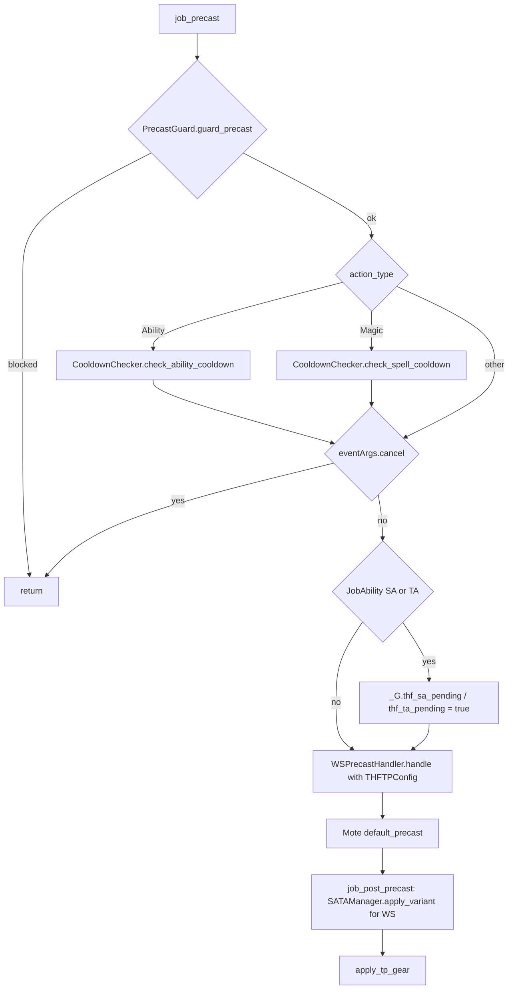
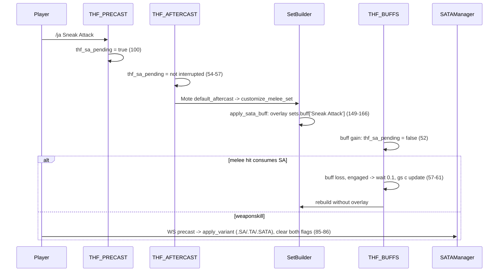

# THF (Thief) job

The THF job area is small: 11 hook modules plus 5 logic modules under
`shared/jobs/thf/functions/` (1 842 lines with the facade), an entry point per character, five
config files, one refill overlay and one sets file. GearSwap loads it when the
main job becomes THF (`Tetsouo_THF.lua`). From then on Mote-Include calls its
hooks on every action (precast, midcast, aftercast), on status and buff changes,
on `//gs c` commands and on state cycles.

What THF adds on top of the shared pipeline:

- **Sneak Attack / Trick Attack gear lifecycle**: pending flags set when SA/TA
  is used, an engaged overlay (`sets.buff['Sneak Attack']` /
  `['Trick Attack']`) kept on until the hit or weaponskill consumes the buff, a
  forced gear refresh on buff loss, and `.SA` / `.TA` / `.SATA` weaponskill
  variants.
- **Weapon states** applied to idle and engaged sets (`MainWeapon`,
  `SubWeapon`), an **Abyssea proc** mode that swaps in a proc weapon pair
  (`AbyProc`, `AbyWeapon`), and an **Aftermath** engaged set (`PDTAFM3`).
- **Ranged lock**: every `/ra` locks the range and ammo slots; `//gs c range`
  equips a crossbow, locks and shoots; the `RangeLock` key locks/unlocks; the
  lock is released when the job file unloads.
- **Treasure Hunter** (`TreasureMode`): TH gear on the engaged set until the
  target is tagged (`Tag`), plus TH SA/TA overlays (`SATA`), or always (`Full`).
- **Subjob smartbuff** (`//gs c smartbuff`: /DNC Haste Samba, /WAR Berserk,
  Aggressor, Warcry, /NIN Utsusemi) and the **Feint-Bully-Conspirator** opener
  (`//gs c fbc`), and Steal / Mug / Despoil on `<t>` (`//gs c steal`).

THF has no spell refinement, no midcast overrides and no job-specific message
formatter.

Every file in scope was read in full except the gear content of the sets files
(only structure and set names were read, as gear choice is out of scope). All
line numbers refer to the working tree on 2026-09-19.

## Files

| Path | Lines | Role |
|------|------:|------|
| `_master/entry/Tetsouo_THF.lua` | 245 | Entry point (template): config preload, `get_sets`, `job_sub_job_change`, `user_setup` (+ `RangeLock.sync_state`), `job_update`, `init_gear_sets`, `file_unload` (+ `RangeLock.release`) |
| `shared/jobs/thf/functions/thf_functions.lua` | 115 | Facade: includes `message_buffs` and the 11 hook files, registers the TH events (`TreasureHunter.init`), requires `dualbox_manager` |
| `shared/jobs/thf/functions/THF_PRECAST.lua` | 148 | `job_precast` / `job_post_precast`: guard, cooldown, SA/TA pending flags, WS handler, SA/TA WS variant, then TP gear |
| `shared/jobs/thf/functions/THF_MIDCAST.lua` | 92 | `job_midcast` (ranged lock via `RangeLock.engage`) / `job_post_midcast` (MidcastManager for Ninjutsu, Healing, Enhancing) |
| `shared/jobs/thf/functions/THF_AFTERCAST.lua` | 74 | `job_aftercast`: watchdog, SA/TA pending flags (cleared when refused), quiver auto-open |
| `shared/jobs/thf/functions/THF_IDLE.lua` | 43 | `customize_idle_set` -> `SetBuilder.build_idle_set` |
| `shared/jobs/thf/functions/THF_ENGAGED.lua` | 43 | `customize_melee_set` -> `SetBuilder.build_engaged_set` |
| `shared/jobs/thf/functions/THF_STATUS.lua` | 19 | `job_status_change = LifecycleManager.status_change()` |
| `shared/jobs/thf/functions/THF_BUFFS.lua` | 66 | `job_buff_change`: DoomManager, SA/TA pending reset, `gs c update` on SA/TA loss |
| `shared/jobs/thf/functions/THF_COMMANDS.lua` | 226 | `job_self_command` router, `job_state_change` (`LifecycleManager.state_change` + RangeLock lock/unlock) |
| `shared/jobs/thf/functions/THF_MOVEMENT.lua` | 66 | Empty AutoMove callback, unused `get_thf_movement_status` |
| `shared/jobs/thf/functions/THF_LOCKSTYLE.lua` | 47 | Lazy `LockstyleManager.create('THF', ...)` wrappers |
| `shared/jobs/thf/functions/THF_MACROBOOK.lua` | 42 | Lazy `MacrobookManager.create('THF', ...)` wrapper |
| `shared/jobs/thf/functions/logic/sa_ta_manager.lua` | 95 | WS variant (`SATA` > `SA` > `TA`) from buffs or pending flags; consumes the flags |
| `shared/jobs/thf/functions/logic/set_builder.lua` | 236 | Engaged base (Aftermath / HybridMode), weapons or Aby weapons, SA/TA overlay, TH overlay, town, movement |
| `shared/jobs/thf/functions/logic/smartbuff_manager.lua` | 281 | `smartbuff` per subjob, the FBC opener and the Steal chain |
| `shared/jobs/thf/functions/logic/range_lock.lua` | 63 | Range/ammo lock in step with `RangeLock`; `_G.thf_range_locked`; release at unload |
| `shared/jobs/thf/functions/logic/treasure_hunter.lua` | 236 | `TreasureMode`: TH engaged overlay, TH SA/TA overlay, tagged-mob tracking (4 raw events) |
| `shared/utils/smartbuff/subjob_war_buffs.lua` | 73 | Berserk / Aggressor / Warcry collection and casting (shared with DNC) |
| `_master/config/thf/THF_STATES.lua` | 179 | All Mote states (`THFStates.configure()`), unused `THFStates.validate()` |
| `_master/config/thf/THF_KEYBINDS.lua` | 179 | 8 numpad binds (2 only on /WAR), `get_active_binds` / `bind_all` / `unbind_all` / `show_intro` / unused `show_binds` |
| `_master/config/thf/THF_LOCKSTYLE.lua` | 40 | Lockstyle 1 (`default`, `by_subjob`, no `get_style`) |
| `_master/config/thf/THF_MACROBOOK.lua` | 72 | Book/page per subjob and per dual-box partner job |
| `_master/config/thf/THF_TP_CONFIG.lua` | 70 | Moonshade piece, weapon TP bonus table, `_G.THFTPConfig` |
| `_master/Tetsouo/config/thf/THF_REFILL.lua` | 38 | Refill list (Tetsouo overlay), includes `Ac. Bolt Quiver` |
| `_master/sets/thf_sets.lua` | 914 | Template sets (flat) |
| `shared/data/job_abilities/THF_JA_DATABASE.lua` + `thf/*.lua` | 13 + 201 | `JA_DATABASE_FACTORY.create('THF')`, read by `ability_message_handler.lua:77-83` (messages only) |

Live copies (gitignored): `Tetsouo/Tetsouo_THF.lua` (identical to the template
except the header line 25 and line 224, which includes `sets/thf/thf_sets.lua`),
`Tetsouo/config/thf/*` (identical except `THF_MACROBOOK.lua`, book 10 with pages
1/8/4 per partner job, and `THF_STATES.lua`, which adds `'Telop Knife'` to
`SubWeapon` at line 70), `THF_REFILL.lua` identical to the overlay, and
`Tetsouo/sets/thf/{thf_sets,armor,capes,weapons}.lua` (modular, 745 + 124 + 62
+ 72 lines, weapon sets copied from `weapons.lua` by a loop at
`thf_sets.lua:61-63`). `Kaories/` and `_master/Kaories/` contain no THF files.

## How it works

### Load sequence

Same shape as every job (see [core lifecycle](../systems/core-lifecycle.md)):
Mote-Include calls `user_setup()` and `init_gear_sets()` from inside
`include('Mote-Include.lua')`, **before** `INIT_SYSTEMS` and before the THF hook
files exist.

`user_setup()` (`Tetsouo_THF.lua:153-207`):

1. `THFStates.configure()` creates every state (see [States](#mote-states)),
   then `RangeLock.sync_state()` (160-165) turns `RangeLock` back on when the
   range/ammo lock is still held (subjob change, same sandbox).
2. `require('Tetsouo/config/thf/THF_KEYBINDS')` into the global `THFKeybinds`,
   then `bind_all()`, which unbinds all 8 keys, binds those of the current
   subjob (the two Abyssea keys only on /WAR) and calls `show_intro()`
   (`THF_KEYBINDS.lua:70-123`).
3. `KeybindUI.smart_init("THF", ...)`. The UI waits for `state.TreasureMode`
   (`ui_lifecycle.lua:44-45`).
4. `JobChangeManager.initialize()`, then, when `select_default_macro_book` and
   `select_default_lockstyle` exist, the macro book is set now and the lockstyle
   is scheduled after `LockstyleConfig.initial_load_delay` (8 s). As on BLM,
   those two globals exist on a fresh load only because `show_intro()`
   `require`s `THF_MACROBOOK.lua` and `THF_LOCKSTYLE.lua`
   (`THF_KEYBINDS.lua:145,152`), which define them as a side effect. Both files
   return nothing, so `show_intro` always falls back to `show_system_intro`.
   The facade includes the same files again (`thf_functions.lua:86-87`), which
   creates a second factory instance for each.
5. `pcall(require, 'shared/utils/dualbox/dualbox_manager')`.

`thf_functions.lua` includes `message_buffs.lua` (49), `THF_PRECAST`,
`THF_MIDCAST`, `THF_AFTERCAST` (56-60), `THF_IDLE`, `THF_ENGAGED` (67-69),
`THF_STATUS`, `THF_BUFFS` (76-78), `THF_LOCKSTYLE`, `THF_MACROBOOK`,
`THF_COMMANDS`, `THF_MOVEMENT` (86-90), then calls `TreasureHunter.init()`
(104-105, see [Treasure Hunter](#treasure-hunter)), requires `dualbox_manager`
(108) and prints a debug line (110-111). Other logic modules are required
lazily by the hooks.

### Precast

`job_precast` (`THF_PRECAST.lua:76-110`) and `job_post_precast` (121-135):

- The five-line guard/cooldown block is the shared contract
  ([precast pipeline](../systems/precast-pipeline.md#the-job_precast-contract)).
  THF uses no `AbilityHelper`.
- The pending flags are set before the JA is accepted by the server (98-104).
- `WSPrecastHandler.handle` (107) does the range check, stores the TP-bonus
  piece in `_G.temp_tp_bonus_gear` and cancels below 1000 TP
  (`ws_precast_handler.lua:35-67`).
- Mote's `default_precast` picks `sets.precast.WS[name]`, `sets.precast.JA[name]`,
  `sets.precast.Waltz`, `sets.precast.Step`, `sets.precast.Flourish1` (types
  from `res.job_abilities`), `sets.precast.FC` or `sets.precast.RA`.
- `job_post_precast` equips the SA/TA variant first (125-130), then the TP
  piece (132-134). The variants are full `set_combine` copies of the WS set, so
  the other order would overwrite `ear1` and the Moonshade Earring. DNC uses
  the same order (`DNC_PRECAST.lua:198-209`).
- Mote's `user_precast` (`Mote-Globals.lua:90-93`) runs before `job_precast`:
  `cancel_conflicting_buffs` (Sneak/Spectral Jig/Monomi/Utsusemi cancels, and
  "Abort: Ability waiting on recast" for Waltz/Samba types) and Mote's own
  `refine_waltz` for /DNC (THF does not override it).

### Sneak Attack / Trick Attack gear

- The flags exist only to cover the gap before `buffactive` carries the buff
  (`set_builder.lua:142-148`, commit `b30d8b7`).
- An SA/TA the server refuses after precast (recast inside the 2.0 s
  tolerance, paralysis, FBC suppression window) comes back as an interrupted
  aftercast, which lowers the flag again (`THF_AFTERCAST.lua:54-57`).
- Mote's `buff_change` does not re-equip (`Mote-Include.lua:1023-1043`), hence
  the explicit `gs c update` on loss, only while engaged (`THF_BUFFS.lua:57`).
- The overlay is engaged-only; idle sets never carry it.
- `sets.buff['Sneak Attack']` and `['Trick Attack']` are aliases of the JA
  precast sets (full 13-slot sets in template and live).

### Weapons, Aftermath, Abyssea

`SetBuilder.build_engaged_set` (`set_builder.lua:183-201`):

1. `select_engaged_base` (49-65): Aftermath Lv.3 (`buffactive[272]`) with
   `MainWeapon == 'Vajra'` -> `sets.engaged.PDTAFM3`; otherwise
   `sets.engaged[HybridMode]` if it exists; otherwise Mote's set. This replaces
   Mote's own selection (and any Mote defense/kiting layer).
2. `apply_weapon` (76-121): with `AbyProc` true, `sets[AbyWeapon]` (a
   main+sub pair); otherwise `sets[MainWeapon]` then `sets[SubWeapon]`, each
   through `pcall(set_combine)`. A missing weapon set is skipped silently.
3. `apply_sata_buff` (151-174); in `TreasureMode` SATA/Full the
   `TreasureHunterSA/TA/SATA` set replaces the `sets.buff` overlay (159-163).
4. `TreasureHunter.apply_engaged` (198), see [Treasure Hunter](#treasure-hunter).

`build_idle_set` (210-230): `BaseSetBuilder.select_idle_base_town`
(`sets.Adoulin` in Adoulin, `sets.idle.Town` in other cities, Dynamis excluded,
`base_set_builder.lua:65-84`), weapons, then `sets.MoveSpeed` outside town
when `state.Moving.value == 'true'`.

### Ranged attacks

All locking goes through `logic/range_lock.lua`, which records the lock in
`_G.thf_range_locked`:

- `job_midcast` (`THF_MIDCAST.lua:24-36`): on every non-interrupted
  `action_type == 'Ranged Attack'`, `RangeLock.engage()` (`range_lock.lua:35-45`):
  `disable('range','ammo')`, and when `RangeLock` was Off, `:set(true)` plus a
  HUD refresh (`M:set` does not call `job_state_change`).
- `//gs c range` (`THF_COMMANDS.lua:164-176`): equips the hard-coded
  `Exalted Crossbow` + `Acid Bolt`, `RangeLock.engage()`, then sends
  `wait 0.1; input /ra <stnpc>`. The equip is queued before the lock, so it is
  still sent.
- `job_state_change` (`THF_COMMANDS.lua:197-214`, built with
  `LifecycleManager.state_change`) matches `RangeLock` as key or description
  (spaces stripped; Mote's `toggle` passes the description,
  `Mote-SelfCommands.lua:193-196`), reads `state.RangeLock.value` and calls
  `RangeLock.set_slots` (lock or unlock) with a "Ranged weapons locked/unlocked"
  message.
- The lock lives in GearSwap's `disable_table`, which outlives the job file.
  The entry's `file_unload` calls `RangeLock.release()` (`Tetsouo_THF.lua:239-244`),
  so a reload, subjob change or main job change starts with the slots free and
  `RangeLock` Off. A subjob change re-runs `user_setup()` in the same sandbox
  first; `RangeLock.sync_state()` keeps the state On until that reload.
- Quiver auto-open (`THF_AFTERCAST.lua:60-63`):
  `QuiverManager.after_ranged_attack(spell, 'Acid Bolt', 'Ac. Bolt Quiver', 5)`
  (`quiver_manager.lua:151-165`) tests `spell.action_type` (a `/ra` has
  `type = "Misc"`, `statics.lua:134`), skips interrupted shots and runs only
  when the equipped ammo is `Acid Bolt`, then checks 1 s later.

### Treasure Hunter

`logic/treasure_hunter.lua` implements `TreasureMode` with the modes of
Mote-TreasureHunter (`libs/Mote-TreasureHunter.lua`), without its slot locks
(a lock would outlive the job file, see Ranged attacks):

| Mode | Engaged set | SA/TA overlay |
|------|-------------|---------------|
| `Tag` | `sets.TreasureHunter` on top while the current target (`<t>`) is not tagged | `sets.buff[...]` |
| `SATA` | as `Tag` | `sets.TreasureHunterSA` / `TA` / `SATA` (`set_builder.lua:159-163`) |
| `Full` | `sets.TreasureHunter` on top always | as `SATA` |

- `apply_engaged` (88-95) runs last in `build_engaged_set`, so it wins over
  HybridMode, Aftermath and the SA/TA overlay; it records `overlay_on`.
- Tagging (`on_action`, 175-189): one of our melee rounds (action category 1)
  tags its targets. When the current target becomes tagged while the TH overlay
  is on (Tag/SATA), it sends `gs c update` unless an action is in progress
  (the aftercast rebuilds the set anyway).
- A tagged mob is forgotten when it dies (`0x029` messages 6/20, 191-201), on
  zoning (213-215), or after 180 s without any action from or on it (166-173,
  Mote's rule), so a respawn under the same id is tagged again.
- `target change` while engaged (203-211) sends `gs c update` when the new
  target needs the overlay and the current set does not, or the reverse.
- The four events are raw events registered from the sandbox by `init()`
  (223-234), called once per load by the facade; GearSwap removes them at the
  next load. State (`tagged`, `overlay_on`, `listening`) lives in
  `_G.thf_treasure`, so it is lost on reload.
- Cycling `TreasureMode` ends in a gear update on both cycle paths (Mote's
  `cycle` and `cyclestate`), so the new mode applies at once.

### Smartbuff, FBC and Steal

`SmartbuffManager.apply()` (`smartbuff_manager.lua:126-144`) by `player.sub_job`:

| Subjob | Behaviour |
|--------|-----------|
| DNC | Haste Samba if not active, ready and TP >= 350, else a grouped TP message or a cooldown line (43-75). Reads recast id 191, which no ability uses (Known issues) |
| WAR | `SubjobWarBuffs.collect()` then `.cast()` 2 s apart (Berserk id 1, Aggressor 4, Warcry 2); status lines only when nothing is cast (79-90) |
| NIN | Utsusemi: Ni if ready, else Ichi, else both cooldowns (94-118); uses `windower.send_command` |
| other | warning "No smartbuff configured" |

`apply_fbc()` (255) and `apply_steal()` (269) share one runner, `run_sequence`
(226): `triage` (179) sorts a list into "cast" and "status", and
`cast_sequence` (212) sends the ones to cast 0, 1 and 2 s apart.
FBC: Feint (recast 68, buff `Feint`, `<me>`), Bully (240, no buff, `<t>`),
Conspirator (40, buff `Conspirator`, `<me>`). Steal: Steal (60), Mug (65),
Despoil (61, `main_only`: dropped silently with THF as subjob), all on `<t>`;
`apply_steal` sends nothing and shows an error unless `<t>` is a living monster
(`target_is_enemy`, 261: `spawn_type == 16`, `valid_target`, `hpp > 0`).
`_G.suppress_cooldown_messages` is set to true for the sequence and reset 3 s
later by `coroutine.schedule` inside the sandbox. While it is true,
`CooldownChecker.check_ability_cooldown` returns before checking anything
(`cooldown_checker.lua:92-94`), for every ability, not only the three.

Readiness uses the global `is_recast_ready` / `is_on_cooldown` from
`RECAST_CONFIG.lua` (tolerance 2.0 s, `_master/config_global/RECAST_CONFIG.lua:31,77-96`).

### Midcast

Mote equips its default midcast set first (`sets.midcast.FastRecast` for any
magic via `Mote-Globals.lua:96-101`, then name / spell map / skill), then
`job_post_midcast` (`THF_MIDCAST.lua:43-79`) notifies `MidcastWatchdog` and
calls `MidcastManager.select_set` for Ninjutsu, Healing Magic and Enhancing
Magic (with `get_enhancing_target` and `ENHANCING_MAGIC_DATABASE.get_spell_family`
from `MidcastDeps`). None of `sets.midcast['Ninjutsu']`, `['Healing Magic']`,
`['Enhancing Magic']` exists in template or live sets, so all three calls return
at `midcast_manager.lua:627` and Mote's choice stands (`sets.midcast.Utsusemi`
through the `Utsusemi` spell map, `Mote-Mappings.lua:186`). See
[midcast and buffs](../systems/midcast-and-buffs.md).

### Aftercast, idle, engaged, status, buffs

- `job_aftercast` (`THF_AFTERCAST.lua:45-68`): watchdog tick, SA/TA pending
  flag set on an accepted SA/TA and cleared on a refused one, quiver check
  after `/ra`. Mote's `default_aftercast` then re-equips idle/engaged gear.
- `customize_idle_set` / `customize_melee_set` delegate to `SetBuilder`
  (`THF_IDLE.lua:29-40`, `THF_ENGAGED.lua:29-40`).
- Mote's own base: `sets.idle` (Field/Normal), `sets.idle.Town`,
  `sets.idle.Weak` under weakness; `sets.engaged` then `[HybridMode]` because
  `sets.engaged.Normal` does not exist (`Mote-Include.lua:549-577`).
- `job_status_change` is the shared `LifecycleManager` handler.
  `job_buff_change` is THF's own (`THF_BUFFS.lua:27-63`): same Doom call as
  `LifecycleManager.buff_change`, plus the SA/TA handling above.

## Mote states

Created by `THFStates.configure()` (`_master/config/thf/THF_STATES.lua:41-139`)
on every `user_setup()` (every load and every subjob change, so values reset).
Keybinds from `THF_KEYBINDS.lua:43-61`; `^` = Ctrl, `#` = Apps.

| State | Values | Default | Key | Read by |
|-------|--------|---------|-----|---------|
| `HybridMode` (Mote) | PDT, Normal | PDT | `^numpad9` | `set_builder.lua:56-61`, Mote `get_melee_set` |
| `MainWeapon` | Vajra, TwashtarM, Mpu Gandring, Tauret, Naegling, Malevolence, Dagger | Vajra | `^numpad1` | `set_builder.lua:51,94-104` |
| `SubWeapon` | Centovente, Tanmogayi, Kraken (live adds Telop Knife) | Centovente | `^numpad2` | `set_builder.lua:107-117` |
| `TreasureMode` | Tag, SATA, Full | Tag | `^numpad3` | `treasure_hunter.lua:54-56` (see [Treasure Hunter](#treasure-hunter)); UI readiness (`ui_lifecycle.lua:45`) |
| `AbyProc` | false, true | false | `^numpad4` (`toggle`), /WAR only | `set_builder.lua:78` |
| `AbyWeapon` | Dagger2, Sword, Club, Great Sword, Polearm, Staff, Scythe | Sword | `^numpad5`, /WAR only | `set_builder.lua:80-81` |
| `RangeLock` | false, true | false | `^numpad6` (`toggle`) | `job_state_change` (`THF_COMMANDS.lua:197-212`) locks/unlocks; set On by `/ra` and `range`; kept On by `RangeLock.sync_state` |
| `FastCast` | 0..80 step 10 | 0 | none | `midcast_watchdog.lua:58-60` |
| `AutoMedicine` | shared On/Off | persisted | `#numpad0` | `AutoMedicine.init(state, M)` (`THF_STATES.lua:135-138`), see [precast pipeline](../systems/precast-pipeline.md) |

The `AbyProc` / `AbyWeapon` binds carry `subjob = "WAR"` (`THF_KEYBINDS.lua:55-56`):
`get_active_binds` (70-82) drops them on other subjobs, and `bind_all` (86-123)
unbinds the whole list before binding the active ones, as PLD does. The HUD
reads `get_active_binds` too (`UI_LOADER.lua:37-39`). Mote
defaults `OffenseMode`, `IdleMode`, `CastingMode` stay `'Normal'`, so
`sets.idle.PDT` and `sets.idle.Regen` are never selected. `state.Moving` comes
from AutoMove.

## Commands

`job_self_command` (`THF_COMMANDS.lua:66-182`) lowercases the first word and
tests, in order: `altjobupdate`, `requestjob`, `watchdog`, CommonCommands
(forwarded with `table.unpack(args)`, 104-114; built-in names and warp aliases
only), `ui`, `debugmidcast`, `cyclestate`, then THF commands. A name none of them
answers goes to Mote, whose last lookup is the dual-box partner's alt config
(see [commands](../systems/commands-and-debug.md#4-alt-commands-and-name-shadowing)).
None of `smartbuff`, `fbc`, `range` is a key of any current alt config. `steal` is (THF alt
config), so the router checks it before the common commands (98).

| Command | Effect | Handler |
|---------|--------|---------|
| `altjobupdate <job>  ...` / `requestjob` | Dual-box job exchange | 77-94 |
| `steal` | `SmartbuffManager.apply_steal()` | 98-102 |
| `watchdog ...` | MidcastWatchdog commands | 105-110 |
| common commands | `reload`, `checksets`, `wa`, `wo`, `refill`, `craft`, `am`, `jump`, `waltz`, `aoewaltz`, `alts`, `main`, debug, warp, alt names | 113-123 |
| `ui ...` | UI toggles | 126-130 |
| `debugmidcast` | Toggle MidcastManager debug | 135-145 |
| `cyclestate <State>` | `CycleHandler.handle_cyclestate` (all keybinds except the two `toggle`s) | 154-157 |
| `smartbuff` | `SmartbuffManager.apply()` | 160-164 |
| `fbc` | `SmartbuffManager.apply_fbc()` | 166-170 |
| `range` | Equip crossbow + bolts, `RangeLock.engage()`, `/ra <stnpc>` | 173-186 |
| `toggle AbyProc` / `toggle RangeLock` | Mote `handle_toggle` -> `job_state_change` + `handle_update` | Mote |

`job_state_change` (219) is `LifecycleManager.state_change(on_state_change)`:
the shared part skips `Moving` and refreshes the HUD; `on_state_change`
(197-212) handles `RangeLock` (key or description, see Ranged attacks).

## Set names the code looks up

T = `_master/sets/thf_sets.lua`, L = `Tetsouo/sets/thf/thf_sets.lua`
(weapon sets in L come from `Tetsouo/sets/thf/weapons.lua`).

| Set | Looked up by | T | L |
|-----|--------------|---|---|
| `sets.idle`, `sets.idle.Town`, `sets.idle.Weak` | Mote `get_idle_set`, `BaseSetBuilder` | 179, 196, 217 | 70, 106, 103 |
| `sets.idle.PDT`, `sets.idle.Regen` | nothing reaches them (IdleMode is `Normal`) | 212, 201 | 98, 87 |
| `sets.Adoulin`, `sets.MoveSpeed` | `BaseSetBuilder` | 863, 857 | 697, 691 |
| `sets.engaged`, `sets.engaged.PDT` | Mote, `select_engaged_base` | 225, 242 | 113, 130 |
| `sets.engaged.Normal` | `select_engaged_base` (falls back to Mote's set) | absent | absent |
| `sets.engaged.PDTAFM3` | `set_builder.lua:53` | 259 | 147 |
| `sets[MainWeapon]` (7 names) | `set_builder.lua:95` | 90-108 | `weapons.lua:32-38` |
| `sets[SubWeapon]` (Centovente, Tanmogayi, Kraken, Telop Knife) | `set_builder.lua:108` | 113, 125, 134, absent | `weapons.lua:44-52` |
| `sets[AbyWeapon]` (7 names) | `set_builder.lua:81` | 139-165 | `weapons.lua:58-69` |
| `sets.buff['Sneak Attack']`, `['Trick Attack']` | `set_builder.lua:165-171` (TreasureMode Tag) | 873-874 | 704-705 |
| `sets.buff.Doom` | DoomManager | 877 | 708 |
| `sets.precast.WS[ws].SA/.TA/.SATA` for Rudra's Storm, Evisceration, Exenterator, Savage Blade, Shark Bite, Mandalic Stab, Dancing Edge | `sa_ta_manager.lua:45-79` | 486-767 | 337-609 |
| `sets.precast.WS`, `['Aeolian Edge']`, `['Circle Blade']` | Mote default precast | 460, 736, 771 | 320, 582, 612 |
| `sets.precast.JA[...]` SA, TA, Hide, Flee, Perfect Dodge, Feint, Steal, Despoil, Collaborator, Accomplice, Conspirator, Provoke | Mote default precast | 283-396 | 171-259 |
| `sets.precast.JA['Animated Flourish']` | nothing: type `Flourish1` selects `sets.precast.Flourish1` first (`Mote-Include.lua:654`); same table via aliases | 381 | 244 |
| `sets.precast.Waltz`, `.Step`, `.Flourish1`, `.FC`, `.FC.Utsusemi`, `.RA` | Mote default precast | 399, 416, 432, 438, 453, 794 | 262, 279, 295, 301, 313, 632 |
| `sets.midcast.RA`, `.FastRecast`, `.Utsusemi` | Mote default midcast | 823, 833, 849 | 658, 668, 684 |
| `sets.midcast.Cure` | Mote (spell map), empty | 827 | 662 |
| `sets.midcast['Ninjutsu' / 'Healing Magic' / 'Enhancing Magic']` | MidcastManager base | **absent** | **absent** |
| `sets.midcast.EnhancingMagic` | nothing (Mote looks up `'Enhancing Magic'`) | 830 | 665 |
| `sets.TreasureHunter` | `treasure_hunter.lua:70,92` (engaged overlay) | 889 | 720 |
| `sets.TreasureHunterSA`, `TA`, `SATA` | `treasure_hunter.lua:107-112` (SA/TA overlay in SATA/Full) | 894-896 | 726-728 |
| `sets.TreasureHunterRA`, `sets.precast.RATH`, `sets.midcast.RA.TH`, `sets.AeolianTH`, `sets.engaged.TH` | nothing | 900, 811, 904, 909, 914 | 731, 649, 733, 736, 739 |

`sets.midcast.RA = sets.precast.RA` (T 823) makes `sets.midcast.RA.Acc` and
`.TH` fields of `sets.precast.RA` itself; `RA.Acc` is a self-reference. GearSwap
ignores non-slot keys when equipping.

## Configuration

| File / key | Default | Where the default lives | Read by |
|------------|---------|-------------------------|---------|
| `<char>/config/thf/THF_STATES.lua` | see states | file | entry `user_setup` (path hard-coded `Tetsouo/...`, replaced by the clone script) |
| `<char>/config/thf/THF_KEYBINDS.lua` | 8 binds | file | entry `user_setup`, `file_unload` |
| `<char>/config/thf/THF_LOCKSTYLE.lua` `default`, `by_subjob` | 1 | file; factory fallback 1 (`THF_LOCKSTYLE.lua:29`) | `LockstyleManager` uses `default`; no `get_style`, so `by_subjob` is never read |
| `<char>/config/thf/THF_MACROBOOK.lua` | template book 1/2/3; live book 10 | file; factory fallback 1/1 (`THF_MACROBOOK.lua:30-31`) | `MacrobookManager` |
| `Tetsouo/config/thf/THF_TP_CONFIG.lua` -> `_G.THFTPConfig` | Moonshade ear1 +250; weapons Aeneas 500, Centovente 1000 | file | `TPBonusHandler` -> `TPBonusCalculator` (main weapon only, `tp_bonus_handler.lua:151-155`) |
| `Tetsouo/config/thf/THF_REFILL.lua` | default list; /DNC drops Powder/Oil | overlay | `refill/config_resolver.lua` |
| `Tetsouo/config/LOCKSTYLE_CONFIG.lua`, `RECAST_CONFIG.lua`, `REGION_CONFIG.lua`, UI config | - | shared | entry |
| Hard-coded | crossbow/bolt names (`THF_COMMANDS.lua:167`), quiver names and threshold (`THF_AFTERCAST.lua:62`), FBC table (`smartbuff_manager.lua:155-159`), TH forget delay 180 s (`treasure_hunter.lua:32`) | code | - |

## State & lifetime

- Sandbox `_G` (dies on every `gs reload`, including every subjob change):
  `thf_sa_pending`, `thf_ta_pending`, `suppress_cooldown_messages`,
  `temp_tp_bonus_gear`, `THFTPConfig`, `THFKeybinds`, `LockstyleConfig`,
  `RECAST_CONFIG`, `is_recast_ready`, `is_on_cooldown`, the Mote hooks,
  `select_default_lockstyle`, `cancel_thf_lockstyle_operations`,
  `select_default_macro_book`, factory exports, `get_thf_movement_status`,
  `thf_range_locked` (range/ammo lock held), `thf_treasure` (tagged mobs,
  `overlay_on`, `listening`).
- `windower.*`: THF code writes nothing there.
- Events: `action`, `incoming chunk`, `target change`, `zone change`, raw
  events registered from the sandbox by `TreasureHunter.init()`; GearSwap
  removes them at the next load, and the facade registers them again.
- Coroutines: the 8 s lockstyle in `user_setup`; `gs c update` 0.1 s after
  SA/TA loss; the 3 s `suppress_cooldown_messages` reset; FBC and WAR buff
  `wait` chains in the Windower command queue (these survive a reload).
- `disable('range','ammo')` lives in GearSwap's `disable_table`
  (`statics.lua:194`), which only `enable()` clears (`user_functions.lua:154`)
  and which survives `gs reload`, subjob change and main job change. The
  entry's `file_unload` releases the lock THF placed (`RangeLock.release`,
  `Tetsouo_THF.lua:239-244`), since `RangeLock` starts Off in the next load. A
  lock left by a version without this release stays until `RangeLock` is
  toggled On then Off, or `//lua reload gearswap`.
- Subjob change: Mote calls `user_setup()` again, then `job_sub_job_change`
  (`Tetsouo_THF.lua:138-147`) hands over to `JobChangeManager.on_job_change`,
  which schedules a `gs reload`. See
  [job change lifecycle](../architecture/job-change-lifecycle.md).

## Interactions

- Precast: `PrecastGuard`, `CooldownChecker`, `WSPrecastHandler`,
  `TPBonusCalculator` ([precast pipeline](../systems/precast-pipeline.md)).
- Midcast: `MidcastManager`, `MidcastDeps`, `MidcastWatchdog`
  ([midcast and buffs](../systems/midcast-and-buffs.md)); `SubjobWarBuffs` is
  shared with [DNC](dnc.md).
- Messages: `message_buffs` (`show_buff_status`), `show_multi_status`,
  `show_success`, cooldown messages ([messages](../systems/messages.md)).
- `QuiverManager` ([equipment and inventory](../systems/equipment-and-inventory.md)),
  `BaseSetBuilder`, `LifecycleManager`, `DoomManager`, lockstyle/macrobook
  factories and AutoMove ([factories and helpers](../systems/factories-and-helpers.md)),
  `CommonCommands` and `CycleHandler` ([commands and debug](../systems/commands-and-debug.md)),
  dual-box ([dualbox](../systems/dualbox.md)).
- `//gs c waltz` / `jump` on THF/DNC and THF/DRG go through the common commands
  (`WaltzManager`, `DRGJumpManager`); THF has no AutoJump.

## Invariants & gotchas

- `user_setup()` runs before the THF hook files are loaded.
- The SA/TA flags must be cleared by something: buff gain/loss
  (`THF_BUFFS.lua:50-55`), a weaponskill (`sa_ta_manager.lua:85-86`) or a
  refused SA/TA (`THF_AFTERCAST.lua:54-57`). Any new path that sets them needs
  one of these to follow.
- `job_buff_change` must keep the Doom call first; it is THF's own copy, not
  `LifecycleManager.buff_change`.
- `set_builder` replaces Mote's engaged base, so a Mote-side feature (defense
  modes, `CustomMeleeGroups`, `sets.engaged.TH`) has no effect on THF engaged
  gear; TH comes from `treasure_hunter.lua` instead.
- Never lock slots for TH or RangeLock without a release in `file_unload`:
  `disable_table` outlives the job file.
- `job_state_change` handlers compare the field with spaces stripped, so the
  state key (`'RangeLock'`) and Mote's description (`'Range Lock'`) both match.
- `_G.suppress_cooldown_messages` disables every ability cooldown check for 3 s,
  not only the FBC ones.
- `sets.midcast.RA` is the same table as `sets.precast.RA`: editing one edits
  both.

## Extending

- New SA/TA weaponskill: add `sets.precast.WS['<ws>']` and optional `.SA`,
  `.TA`, `.SATA` in both template and live sets; no code change.
- New weapon: add a state value in `THF_STATES.lua` and a `sets['<value>']`
  (live: an entry in `Tetsouo/sets/thf/weapons.lua`).
- New smartbuff subjob: add an `apply__buffs` function and a branch in
  `SmartbuffManager.apply()`; reuse `SubjobWarBuffs` style collect/cast.
- New command: add a branch after the CommonCommands block. A name that is also an alt config key then runs here; the alt's
  version stays reachable as `//gs c alt <name>`.
- New state: `THF_STATES.lua` plus a bind in `THF_KEYBINDS.lua`, in `_master/`
  and the live copy. A bind for one subjob only takes `subjob = ""`.
- TH for another action (ranged, Aeolian Edge): equip the TH set in the hook
  and add the action category to the tagging rule in `on_action`.

## Known issues

- `TreasureMode` has no `None` option (Mote-TreasureHunter has one), so every
  fresh mob gets TH gear until the first melee round; ranged attacks and
  Aeolian Edge never carry TH, and `sets.TreasureHunterRA`,
  `sets.precast.RATH`, `sets.midcast.RA.TH` (no TH piece in the live set),
  `sets.AeolianTH`, `sets.engaged.TH` stay unused (`THF_STATES.lua:102-108`).
- Tagged mobs are lost on every reload (subjob change), so the current mob
  gets TH again until the next melee round (`treasure_hunter.lua:47-52`).
- `PDTAFM3` tests Aftermath Lv.3 (buff 272) with Vajra; a relic grants the
  plain `Aftermath` (buff 273, `res/buffs.lua:271`), so the set is likely
  unreachable (`set_builder.lua:51`).
- /DNC smartbuff reads Haste Samba recast at id 191; sambas use 216
  (`smartbuff_manager.lua:51`).
- `Centovente` in the TP config never matches: the calculator reads the main
  weapon only and THF equips it in the sub slot (`THF_TP_CONFIG.lua:46`).
- Midcast routing is a no-op for all three skills (base sets absent);
  `sets.midcast.EnhancingMagic` uses a key nothing reads (`THF_MIDCAST.lua:52-78`).
- Initial macrobook/lockstyle depend on the `show_intro` side effect
  (`THF_KEYBINDS.lua:145,152`).
- AutoMove callback is registered before AutoMove exists and is empty anyway
  (`THF_MOVEMENT.lua:30-36`).
- `job_post_midcast` skeleton is duplicated with DNC (`THF_MIDCAST.lua:43-79`).
- `job_buff_change` re-implements `LifecycleManager.buff_change`
  (`THF_BUFFS.lua:27-63`).
- Dead code: `get_thf_movement_status`, `THFStates.validate`,
  `THFKeybinds.show_binds`.
- User doc out of date (`docs/user/jobs/thf/states.md`: Alt keys, no
  AutoMedicine, TreasureMode behaviour not described, macrobook values).
