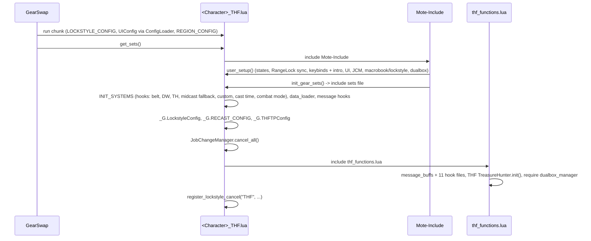
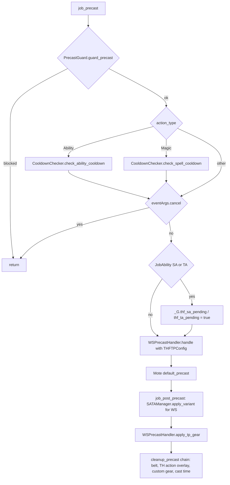
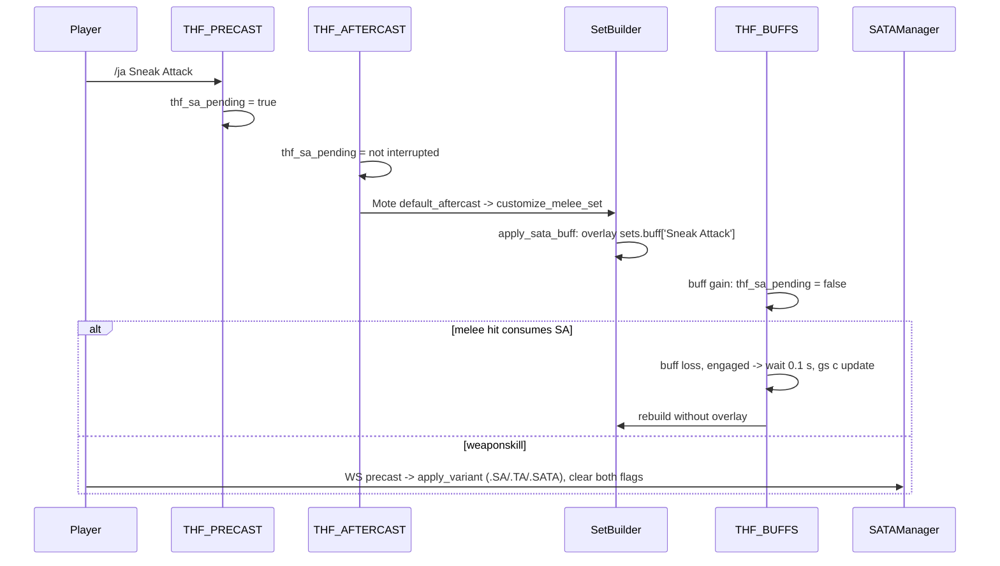

# THF (Thief) job

The THF job area: 11 hook modules plus 5 logic modules under
`shared/jobs/thf/functions/` (about 1 640 lines with the facade), an entry
point template, seven config files and one sets file. GearSwap loads it when
the main job becomes THF (`<Character>_THF.lua`). From then on Mote-Include
calls its hooks on every action (precast, midcast, aftercast), on status and
buff changes, on `//gs c` commands and on state cycles.

What THF adds on top of the shared pipeline:

- **Sneak Attack / Trick Attack gear lifecycle**: pending flags raised when
  SA/TA is used, an engaged overlay (`sets.buff['Sneak Attack']` /
  `['Trick Attack']`) kept on until the hit or weaponskill consumes the buff, a
  forced gear refresh on buff loss, and `.SA` / `.TA` / `.SATA` weaponskill
  variants.
- **Weapon states** applied to idle and engaged sets (`MainWeapon`,
  `SubWeapon`, through `WeaponResolver`), an **Abyssea proc** mode that swaps
  in a proc weapon pair (`AbyProc`, `AbyWeapon`), and an **Aftermath** engaged
  set (`sets.engaged.<Weapon>AFM3`, else `PDTAFM3` with Vajra).
- **Ranged lock**: every `/ra` locks the range and ammo slots; `//gs c range`
  equips a crossbow, locks and shoots; the `RangeLock` key locks/unlocks; the
  lock is released when the job file unloads.
- **Treasure Hunter**: THF is the one job where `TreasureMode` is native
  (defined in its STATES file, shown by default). The shared module
  (`shared/utils/equipment/treasure_hunter.lua`) does the tagging and the
  action overlay; the THF layer adds the `SATA` mode and builds the engaged
  TH itself.
- The **Feint-Bully-Conspirator** opener (`//gs c fbc`) and Steal / Mug /
  Despoil on `<t>` (`//gs c steal`). `//gs c buff` (also `smartbuff`) is the
  common command of every job since 2026-10-01 (`BuffCommand`, see
  [midcast and buffs](../systems/midcast-and-buffs.md#buff-command-and-engine)); THF has
  none of its own.

THF has no spell refinement, no midcast overrides and no job-specific message
formatter.

Every file listed below was read in full on 2026-09-28, except the gear content
of the sets files (structure and set names only). References are to file and
function; line numbers are deliberately not used.

## Files

| Path | Lines | Role |
|------|------:|------|
| `_master/entry/Tetsouo_THF.lua` | 281 | Entry point (template): config preload, `get_sets`, `job_sub_job_change`, `user_setup` (+ `RangeLock.sync_state`), `job_update`, `init_gear_sets`, `file_unload` (+ `RangeLock.release`, first) |
| `shared/jobs/thf/functions/thf_functions.lua` | 117 | Facade: includes `message_buffs` and the 11 hook files, calls `TreasureHunter.init()` (THF layer), requires `dualbox_manager` |
| `shared/jobs/thf/functions/THF_PRECAST.lua` | 147 | `job_precast` / `job_post_precast`: guard, cooldown, SA/TA pending flags, WS handler; post: SA/TA WS variant, then TP gear |
| `shared/jobs/thf/functions/THF_MIDCAST.lua` | 94 | `job_midcast` (ranged lock via `RangeLock.engage`) / `job_post_midcast` (watchdog, MidcastManager for Ninjutsu, Healing, Enhancing) |
| `shared/jobs/thf/functions/THF_AFTERCAST.lua` | 65 | `job_aftercast`: watchdog, SA/TA pending flags (lowered when refused), quiver auto-open |
| `shared/jobs/thf/functions/THF_IDLE.lua` | 42 | `customize_idle_set` -> `SetBuilder.build_idle_set` |
| `shared/jobs/thf/functions/THF_ENGAGED.lua` | 42 | `customize_melee_set` -> `SetBuilder.build_engaged_set` |
| `shared/jobs/thf/functions/THF_STATUS.lua` | 20 | `job_status_change = LifecycleManager.status_change()` |
| `shared/jobs/thf/functions/THF_BUFFS.lua` | 71 | `job_buff_change`: DoomManager, SA/TA pending reset, `gs c update` on SA/TA loss while engaged, Aftermath Lv.3 refresh (`LifecycleManager.refresh_after_buff`) |
| `shared/jobs/thf/functions/THF_COMMANDS.lua` | 218 | `job_self_command` router, `job_state_change` (`LifecycleManager.state_change` + RangeLock lock/unlock) |
| `shared/jobs/thf/functions/THF_MOVEMENT.lua` | 18 | Header only, kept for the 12-module layout |
| `shared/jobs/thf/functions/THF_LOCKSTYLE.lua` | 47 | Lazy `LockstyleManager.create('THF', ...)` wrappers |
| `shared/jobs/thf/functions/THF_MACROBOOK.lua` | 42 | Lazy `MacrobookManager.create('THF', ...)` wrapper |
| `shared/jobs/thf/functions/logic/sa_ta_manager.lua` | 95 | `apply_variant`: WS variant (`SATA` > `SA` > `TA`) from buffs or pending flags; consumes the flags |
| `shared/jobs/thf/functions/logic/set_builder.lua` | 250 | Engaged base (Aftermath / HybridMode), weapons or Aby weapons, SA/TA overlay, TH overlay, `sata_th_layer` (laid again after Dual Wield), idle base (`BaseSetBuilder.select_idle_base`: town, HybridMode), movement |
| `shared/jobs/thf/functions/logic/smartbuff_manager.lua` | 145 | `apply_fbc`, `apply_steal` |
| `shared/jobs/thf/functions/logic/range_lock.lua` | 68 | Range/ammo lock in step with `RangeLock`; `_G.thf_range_locked`, plus Combat Mode's lock registry (`'thf_range'`); `release` at unload |
| `shared/jobs/thf/functions/logic/treasure_hunter.lua` | 52 | THF layer over the shared module: `sata_overlay`, and `init` hands the shared wrapper the SA/TA + TH layer |
| `shared/utils/equipment/treasure_hunter.lua` | 290 | Shared Treasure Hunter: optional state, tagging, engaged / action overlays, 4 raw events, `//gs c th` fields |
| `shared/utils/equipment/weapon_resolver.lua` | 104 | `set_for(slot, value)`: `sets[value]`, or the plain weapon when `equip_without_set` is on |
| `shared/utils/buffs/buff_command.lua` | 59 | `//gs c buff` of every job (common command): the `job` list of the main job, then the `subjob` list, from `_common/combat/BUFF_CONFIG.lua` (defaults: no THF list; /WAR, /SAM, /NIN, /DNC), through `self_buff_manager.lua` |
| `_master/config/thf/THF_STATES.lua` | 145 | All Mote states (`THFStates.configure()`) |
| `_master/config/thf/THF_KEYBINDS.lua` | 37 | Data only: 7 binds (2 only on /WAR) handed to `KeybindManager.create('THF', ...)` |
| `_master/config/thf/THF_CUSTOM.lua` | 119 | Player modes and gear rules, commented examples only ([keybinds and custom states](../systems/keybinds-and-custom.md)) |
| `_master/config/thf/THF_HUD.lua` | 31 | Per-job HUD section / row order (empty lists) |
| `_master/config/thf/THF_LOCKSTYLE.lua` | 40 | `default = 1`, `by_subjob`, no `get_style` |
| `_master/config/thf/THF_MACROBOOK.lua` | 72 | Book/page per subjob and per dual-box partner job |
| `_master/config/thf/THF_TP_CONFIG.lua` | 70 | Moonshade piece, weapon TP bonus table, `_G.THFTPConfig` |
| `_master/config/thf/THF_REFILL.lua` | 42 | Refill list, every line commented (`extra`, `default`, `subjobs` examples): `//gs c rf` uses the common list of `REFILL_CONFIG.lua` until one is uncommented |
| `_master/sets/thf_sets.lua` | 929 | Template sets (flat) |
| `shared/data/job_abilities/THF_JA_DATABASE.lua` + `thf/*.lua` | | `JA_DATABASE_FACTORY.create('THF')`, read by the ability message handler (messages only) |

Author overlay (`_master/Tetsouo/`, tracked; deployed only by a clone to that
character): `entry/Tetsouo_THF.lua` (same as the template except the header and
`init_gear_sets`, which includes `thf/sets/thf_sets.lua`),
`thf/display/THF_MACROBOOK.lua`, `thf/keys/THF_STATES.lua` (adds
`'Telop Knife'` to `SubWeapon`), `thf/inventory/THF_REFILL.lua` (includes
`Ac. Bolt Quiver`), and `thf/{thf_sets,armor,capes,weapons}.lua`
(modular; the weapon sets are copied from `weapons.lua` by a loop in
`thf_sets.lua`). `_master/Kaories/` has no THF files.

## How it works

### Load sequence

Same shape as every job (see [core lifecycle](../systems/core-lifecycle.md)):
Mote-Include calls `user_setup()` and `init_gear_sets()` from inside
`include('Mote-Include.lua')`, **before** `INIT_SYSTEMS` and before the THF
hook files exist.

```mermaid
sequenceDiagram
    participant GS as GearSwap
    participant E as <Character>_THF.lua
    participant M as Mote-Include
    participant F as thf_functions.lua
    GS->>E: run chunk (LOCKSTYLE_CONFIG, UIConfig via ConfigLoader, REGION_CONFIG)
    GS->>E: get_sets()
    E->>M: include Mote-Include
    M->>E: user_setup() (states, RangeLock sync, keybinds + intro, UI, JCM, macrobook/lockstyle, dualbox)
    M->>E: init_gear_sets() -> include sets file
    E->>E: INIT_SYSTEMS (hooks: belt, DW, TH, midcast fallback, custom, cast time, combat mode), data_loader, message hooks
    E->>E: _G.LockstyleConfig, _G.RECAST_CONFIG, _G.THFTPConfig
    E->>E: JobChangeManager.cancel_all()
    E->>F: include thf_functions.lua
    F->>F: message_buffs + 11 hook files, THF TreasureHunter.init(), require dualbox_manager
    E->>E: register_lockstyle_cancel("THF", ...)
```

`user_setup()`:

1. `THFStates.configure()` creates every state (see [Mote states](#mote-states)),
   then `RangeLock.sync_state()` turns `RangeLock` back on when the range/ammo
   lock is still held (subjob change, same sandbox).
2. `require('<Character>/thf/keys/THF_KEYBINDS')` into the global
   `THFKeybinds`, then `bind_all()` (`keybind_manager.lua`), which unbinds the
   keys that no longer apply, binds those of the current subjob (the two
   Abyssea keys only on /WAR) and calls `show_intro()`. `KeybindManager.create`
   has already attached the two optional states: Combat Mode (hidden,
   `!numpad0`) and Treasure Mode, which reuses THF's own `^numpad3` entry. A
   failed `require` prints `[THF] Keybinds failed to load: <error>`.
3. `KeybindUI.smart_init("THF", ...)`. The UI waits for `state.TreasureMode`
   (`ui_lifecycle.lua` `are_states_ready`).
4. `JobChangeManager.initialize()`, then, when `select_default_macro_book` and
   `select_default_lockstyle` exist, the macro book is set now and the
   lockstyle is scheduled after `LockstyleConfig.initial_load_delay` (8 s).
   On a fresh load those two globals exist only because the `KeybindManager`
   intro `require`s `THF_MACROBOOK.lua` and `THF_LOCKSTYLE.lua`, which define
   them as a side effect. The facade includes the same files again, which
   creates a second factory instance for each.
5. `pcall(require, 'shared/utils/dualbox/dualbox_manager')`.

The facade includes `message_buffs.lua`, `THF_PRECAST`, `THF_MIDCAST`,
`THF_AFTERCAST`, `THF_IDLE`, `THF_ENGAGED`, `THF_STATUS`, `THF_BUFFS`,
`THF_LOCKSTYLE`, `THF_MACROBOOK`, `THF_COMMANDS`, `THF_MOVEMENT`, then calls
the THF `TreasureHunter.init()` (sets `_G._treasure_engaged_by_job` to the
`SetBuilder.sata_th_layer` provider, then the shared `init`), requires `dualbox_manager` and prints a debug line. The other
logic modules are required lazily by the hooks.

### Precast

`THF_PRECAST.lua` `job_precast` and `job_post_precast`:

```mermaid
flowchart TD
    A[job_precast] --> B{PrecastGuard.guard_precast}
    B -- blocked --> Z[return]
    B -- ok --> C{action_type}
    C -- Ability --> D[CooldownChecker.check_ability_cooldown]
    C -- Magic --> E[CooldownChecker.check_spell_cooldown]
    D --> F{eventArgs.cancel}
    E --> F
    C -- other --> F
    F -- yes --> Z
    F -- no --> G{JobAbility SA or TA}
    G -- yes --> H[_G.thf_sa_pending / thf_ta_pending = true]
    G -- no --> I
    H --> I[WSPrecastHandler.handle with THFTPConfig]
    I --> J[Mote default_precast]
    J --> K[job_post_precast: SATAManager.apply_variant for WS]
    K --> L[WSPrecastHandler.apply_tp_gear]
    L --> M[cleanup_precast chain: belt, TH action overlay, custom gear, cast time]
```

- The guard/cooldown block is the shared contract
  ([precast pipeline](../systems/precast-pipeline.md#the-job_precast-contract)).
  THF uses no `AbilityHelper`.
- The pending flags are raised before the server accepts the JA.
- `WSPrecastHandler.handle` returns `true` for anything but a weaponskill; for
  a weaponskill it runs the range check, stores the TP-bonus piece in
  `_G.temp_tp_bonus_gear` and cancels below 1000 TP (read live).
- Mote's `default_precast` picks `sets.precast.WS[name]`,
  `sets.precast.JA[name]`, `sets.precast.Waltz`, `.Step`, `.Flourish1` (types
  from `res.job_abilities`), `sets.precast.FC` or `sets.precast.RA`.
- `job_post_precast` equips the SA/TA variant first, then the TP piece. The
  variants are full `set_combine` copies of the WS set, so the other order
  would overwrite the Moonshade Earring. DNC uses the same order.
- After `job_post_precast`, the shared TreasureHunter wrapper on
  `cleanup_precast` equips `sets.TreasureHunter` for a weaponskill or job
  ability against a monster not tagged yet (any TH mode but hidden). It runs
  after the SA/TA variant and the TP piece, so TH pieces win their slots on
  that first action.
- Mote's `user_precast` (`Mote-Globals.lua`) runs before `job_precast`:
  `cancel_conflicting_buffs` and Mote's own `refine_waltz` for /DNC (THF does
  not override it).

### Sneak Attack / Trick Attack gear

```mermaid
sequenceDiagram
    participant U as Player
    participant P as THF_PRECAST
    participant A as THF_AFTERCAST
    participant S as SetBuilder
    participant B as THF_BUFFS
    participant W as SATAManager
    U->>P: /ja Sneak Attack
    P->>P: thf_sa_pending = true
    A->>A: thf_sa_pending = not interrupted
    A->>S: Mote default_aftercast -> customize_melee_set
    S->>S: apply_sata_buff: overlay sets.buff['Sneak Attack']
    B->>B: buff gain: thf_sa_pending = false
    alt melee hit consumes SA
        B->>B: buff loss, engaged -> wait 0.1 s, gs c update
        B->>S: rebuild without overlay
    else weaponskill
        U->>W: WS precast -> apply_variant (.SA/.TA/.SATA), clear both flags
    end
```

- The flags only cover the gap before `buffactive` carries the buff
  (`set_builder.lua` `apply_sata_buff`).
- An SA/TA the server refuses after precast (recast inside the 2.0 s
  tolerance, paralysis) comes back as an interrupted aftercast, which lowers
  the flag (`THF_AFTERCAST.lua` `job_aftercast`, `SATA_PENDING_FLAGS`). Every
  reader tests the flags for truth, so nil and false read the same.
- Mote's `buff_change` does not re-equip, hence the explicit `gs c update` on
  loss, only while engaged (`THF_BUFFS.lua` `job_buff_change`).
- The overlay is engaged-only; idle sets never carry it.
- `sets.buff['Sneak Attack']` and `['Trick Attack']` are aliases of the JA
  precast sets in the template.

### Weapons, Aftermath, Abyssea

`SetBuilder.build_engaged_set`:

1. `select_engaged_base`: `WeaponAftermath.set(MainWeapon)` first
   ([WeaponAftermath](../systems/factories-and-helpers.md#weaponaftermath), since 2026-09-30); else Aftermath Lv.3 (`buffactive[272]`) with
   `MainWeapon == 'Vajra'` -> `sets.engaged.PDTAFM3` when it exists; otherwise
   `sets.engaged[HybridMode]` if it exists; otherwise Mote's set. This replaces
   Mote's own selection, so Mote's defense and kiting layers never reach THF
   engaged gear. Gaining or losing Aftermath Lv.3 rebuilds the gear about 0.1 s
   later (`job_buff_change` -> `LifecycleManager.refresh_after_buff`: a
   `gs c update`, not under Doom, skipped if an action is under way then; since
   2026-09-29, before nothing rebuilt on an Aftermath change).
2. `apply_weapon`: with `AbyProc` true, `sets[AbyWeapon]` (a main+sub pair,
   read directly); otherwise `WeaponResolver.set_for('main', MainWeapon)` then
   `set_for('sub', SubWeapon)`, each through `pcall(set_combine)`. By default
   `set_for` returns `sets[value]`; with `equip_without_set = true` in the
   character's `_common/combat/WEAPON_CONFIG.lua` it returns the set only when it names
   that slot (for `sub`, only its `sub` piece), else `{main = value}` /
   `{sub = value}` when `value` is a weapon name in `res.items`. A missing
   weapon set is skipped silently.
3. `apply_sata_buff`; in `TreasureMode` SATA or Full the
   `TreasureHunterSA/TA/SATA` set (`TreasureHunter.sata_overlay`) replaces the
   `sets.buff` overlay.
4. `TreasureHunter.apply_engaged` (shared function), see
   [Treasure Hunter](#treasure-hunter).
5. A `TraceLog` line (`ENGAGED`): hybrid, TH mode, TH gear on/off, SA/TA.

`build_idle_set`: `SetBuilder.select_idle_base`, an alias of
`BaseSetBuilder.select_idle_base` (since 2026-09-29): in a city, the idle set
with `sets.Adoulin` (Adoulin) or `sets.idle.Town` (other cities, Dynamis
excluded) on top; outside town, `sets.idle[HybridMode]` when it is a table
(`sets.idle.PDT` in PDT, the default), else Mote's base. The HybridMode set
replaces Mote's base whole, so `sets.idle.Weak` and Mote's defense and kiting
layers only show in a mode with no idle set (`Normal` in the template). Then
weapons, then `BaseSetBuilder.apply_movement` (`sets.MoveSpeed` when
`state.Moving.value == 'true'`) outside town only.

### Ranged attacks

All locking goes through `logic/range_lock.lua`, which records the lock in
`_G.thf_range_locked`. `RangeLock.set_slots` also records the lock with
`CombatMode.hold('thf_range', {'range', 'ammo'})` and forgets it with
`CombatMode.release('thf_range')` (since 2026-09-29): Combat Mode's
`handle_equipping_gear` wrapper then disables range and ammo again after the
gear of every update, outside a craft session. `gs enable all`, sent at the
end of `//po` (PorterPacker), frees them while `RangeLock` still shows On;
the next update puts the job's range/ammo back and locks them again (see
[core-lifecycle.md](../systems/core-lifecycle.md#combatmode-hook-sharedutilscorecombat_modelua)).
The paths that lock:

- `THF_MIDCAST.lua` `job_midcast`: on every non-interrupted
  `action_type == 'Ranged Attack'`, `RangeLock.engage()`:
  `disable('range','ammo')`, and when `RangeLock` was Off, `:set(true)` plus a
  HUD refresh (`M:set` does not call `job_state_change`).
- `//gs c range` (`THF_COMMANDS.lua` -> `RangeLock.pull()`, `logic/range_lock.lua`): the pull set is
  `sets.RangeLock` when it has a `range`, else `{range, ammo}` of `sets.precast.RA`; none: lock what is
  worn and warn. It equips that range + ammo, `RangeLock.engage()` (the equip is queued before the
  lock, so it is still sent), then sends `wait 0.1; input /ra <stnpc>` unless the ammo is unsafe
  (`RangeLock.unsafe_ammo`): not found among the ranged items of `res.items` (a stat piece such as
  Coiste Bodhar), an `ammo_type` the weapon's `range_type` does not fire (Crossbow -> Bolt, Bow ->
  Arrow, Gun / Cannon -> Bullet), or precious: Rare, or `stack` 1 (Hauksbok). Ex alone is allowed
  (Chrono, Quelling, Eminent are Ex and sold by 99). Names match the short or long English name,
  case ignored (`Exalted C.bow` / `Exalted Crossbow`).
- `job_state_change` (built with `LifecycleManager.state_change(on_state_change)`)
  matches `RangeLock` as key or description (spaces stripped; Mote's `toggle`
  passes the description), reads `state.RangeLock.value` and calls
  `RangeLock.set_slots` with a "Ranged weapons locked/unlocked" message.
- The lock lives in GearSwap's `disable_table`, which outlives the job file.
  `file_unload` calls `RangeLock.release()` first, before anything that could
  throw (GearSwap runs `file_unload` inside one `pcall`), so a reload, subjob
  change or main job change starts with the slots free and `RangeLock` Off. A
  subjob change re-runs `user_setup()` in the same sandbox first;
  `RangeLock.sync_state()` keeps the state On until that reload.
  `//gs c wo` also releases the lock when it finishes
  (`wardrobe_organizer.lua` `release_stance_locks`, after its own
  `gs enable all`) and sets `RangeLock` back to Off, with a warning line, so
  after `wo` the lock stays off until `RangeLock` is turned on again.
- Quiver auto-open (`THF_AFTERCAST.lua`):
  `QuiverManager.after_ranged_attack(spell, nil, nil, 5)` runs for a
  non-interrupted `Ranged Attack`, with the ammo worn and its quiver
  (`ItemIndex.ammo_container`),
  then 1 s later opens the quiver when 5 bolts or fewer are left (inventory +
  wardrobes). `REFILL_CONFIG.lua` `quiver_open_at.THF` replaces the 5 (`false`:
  never), inside `QuiverManager`.
- The shared TH wrapper on `cleanup_midcast` equips `sets.TreasureHunter` on a
  ranged attack against an untagged monster.

### Treasure Hunter

Two layers:

- **Shared** (`shared/utils/equipment/treasure_hunter.lua`, see
  [factories and helpers](../systems/factories-and-helpers.md#treasurehunter)):
  `TreasureMode` as an optional state (`Off`, `Tag`, `Full` on other jobs),
  tagging, `wants_engaged_th`, `apply_engaged`, the action overlay on
  `cleanup_precast` (weaponskill, job ability) and `cleanup_midcast` (spell,
  ranged attack), 4 raw events, and the `//gs c th` fields.
- **THF** (`shared/jobs/thf/functions/logic/treasure_hunter.lua`): a table with
  the shared module as `__index`, plus `sata_overlay(has_sa, has_ta)` and an
  `init()` that sets `_G._treasure_engaged_by_job` to a function returning
  `SetBuilder.sata_th_layer()` (SA/TA overlay + TH, alone). The shared
  `handle_equipping_gear` wrapper equips that layer again after the Dual
  Wield pieces, instead of `sets.TreasureHunter`: SA/TA and TH win over DW on
  THF as TH does on every job (before 2026-09-28 DW went on last on THF).

THF's own STATES file defines `TreasureMode` as `Tag`, `SATA`, `Full` (default
`Tag`, no `Off`). `OptionalState.attach` records it as native, so it is shown
unless `hidden.THF` is set in the character's `_common/keys/treasure_mode.lua`.

| Mode | Engaged set | SA/TA overlay | Action overlay |
|------|-------------|---------------|----------------|
| `Tag` | `sets.TreasureHunter` on top while the current target (`<t>`) is not tagged | `sets.buff[...]` | first WS / JA / spell / ranged attack on an untagged monster |
| `SATA` | as `Tag` | `sets.TreasureHunterSA` / `TA` / `SATA` | as `Tag` |
| `Full` | `sets.TreasureHunter` on top always | as `SATA` | as `Tag` |

- `apply_engaged` runs last in `build_engaged_set`, so it wins over
  HybridMode, Aftermath and the SA/TA overlay; it records `overlay_on`.
- Tagging (`on_own_action`): any of our actions of category 1, 2, 3, 4, 6,
  14 or 15 (melee, ranged, weaponskill, spell, job ability, steps/flourishes)
  tags every NPC target. When the current target becomes tagged while the
  engaged overlay is on (not `Full`), it sends `gs c update` unless an action
  is in progress (the aftercast rebuilds the set anyway).
- A tagged mob is forgotten when it dies (`0x029` messages 6 / 20), on zoning,
  or after 180 s without any action from or on it, so a respawn under the
  same id is tagged again. `//gs c th clear` forgets them all.
- `target change` while engaged sends `gs c update` when the new target needs
  the overlay and the current set does not, or the reverse.
- The four events are raw events registered once per load (`d.listening`);
  GearSwap removes them at the next load. State (`tagged`, `overlay_on`,
  `listening`) lives in `_G._treasure`, so it is lost on every reload,
  including every subjob change.
- `//gs c th hide` on THF: `hidden.THF = true`, `value()` returns nil, so no
  TH gear at all and the `^numpad3` entry becomes invisible (not bound).
- The action overlay uses `sets.TreasureHunter` for every action; the per-action
  TH sets the files used to carry (`TreasureHunterRA`, `precast.RATH`,
  `midcast.RA.TH`, `AeolianTH`, `engaged.TH`) were removed on 2026-09-28.

### Buff, FBC and Steal

`//gs c buff` (and `buffs`, `buffself`, `selfbuff`, `smartbuff`) is not a THF
command: the common command (`BuffCommand.apply()`, [midcast and buffs](../systems/midcast-and-buffs.md#buff-command-and-engine))
answers it on THF as on every job: `job.THF` of `_common/combat/BUFF_CONFIG.lua`
(empty by default), then the `subjob` list (by default /DNC Haste Samba at 350 TP,
/WAR Berserk, Aggressor, Warcry, /NIN Utsusemi: Ni else Ichi, /SAM Hasso with a
two-handed weapon and Third Eye). No list for the jobs: a warning naming the file.

`apply_fbc()` and `apply_steal()` share one runner, `run_sequence`: `triage`
sorts a list into "cast" and "status", and `cast_sequence` sends the ones to
cast 0, 1 and 2 s apart. FBC: Feint (recast 68, buff `Feint`, `<me>`), Bully
(240, no buff, `<t>`), Conspirator (40, buff `Conspirator`, `<me>`). Steal:
Steal (60), Mug (65), Despoil (61), all on `<t>`. `apply_steal` sends nothing
and shows an error unless `<t>` is a living monster (`target_is_enemy`:
`spawn_type == 16`, `valid_target`, `hpp > 0`). No cooldown check is
suppressed: `triage` only sends ready abilities, and a second press before
they land is caught by `CooldownChecker` like any repeat.

Readiness uses the globals `is_recast_ready` / `is_on_cooldown` from
`RECAST_CONFIG.lua` (tolerance 2.0 s), loaded by the entry.

### Midcast

Mote equips its default midcast set first (`sets.midcast.FastRecast` for any
magic, then name / spell map / skill), then `job_post_midcast` notifies
`MidcastWatchdog` and calls `MidcastManager.select_set` for Ninjutsu, Healing
Magic and Enhancing Magic (with `get_enhancing_target` and
`ENHANCING_MAGIC_DATABASE.get_spell_family` from `MidcastDeps`). None of
`sets.midcast['Ninjutsu']`, `['Healing Magic']`, `['Enhancing Magic']` exists
in the template, so the three calls return at the missing base set
(`midcast_manager.lua` `select_set`) and Mote's choice stands
(`sets.midcast.Utsusemi` through the `Utsusemi` spell map). `select_set` still
marks the spell as routed, so `MidcastFallback` does not route it again. A
spell of any other skill (subjob Dark Magic, Elemental, ...) is routed by
`MidcastFallback` on `cleanup_midcast` with its own skill. See
[midcast and buffs](../systems/midcast-and-buffs.md).

### Aftercast, idle, engaged, status, buffs

- `job_aftercast`: watchdog tick, SA/TA pending flag set on an accepted SA/TA
  and cleared on a refused one, quiver check after `/ra`. Mote's
  `default_aftercast` then re-equips idle/engaged gear.
- `customize_idle_set` / `customize_melee_set` delegate to `SetBuilder`.
- Mote's own base: `sets.idle` (Field/Normal), `sets.idle.Town`,
  `sets.idle.Weak` under weakness; `sets.engaged` then `[HybridMode]`.
- `job_status_change` is the shared `LifecycleManager` handler (Doom unlock,
  status change held back during an action).
- `job_buff_change` is THF's own: the same Doom call as
  `LifecycleManager.buff_change`, plus the SA/TA handling above, then
  `LifecycleManager.refresh_after_buff(buff)` (Aftermath Lv.3, see
  [core-lifecycle.md](../systems/core-lifecycle.md#lifecyclemanager)).

## Mote states

Created by `THFStates.configure()` on every `user_setup()` (every load and
every subjob change, so values reset). Keybinds from `THF_KEYBINDS.lua`;
`^` = Ctrl, `#` = Apps, `!` = Alt.

| State | Values | Default | Key | Read by |
|-------|--------|---------|-----|---------|
| `HybridMode` (Mote, recreated) | PDT, Normal | PDT | `^numpad9` | `select_engaged_base`, `select_idle_base`, Mote `get_melee_set` |
| `MainWeapon` | Vajra, TwashtarM, Mpu Gandring, Tauret, Naegling, Malevolence, Dagger | Vajra | `^numpad1` | `select_engaged_base` (Vajra test), `apply_weapon` |
| `SubWeapon` | Centovente, Tanmogayi, Kraken (author overlay adds Telop Knife) | Centovente | `^numpad2` | `apply_weapon` |
| `TreasureMode` | Tag, SATA, Full | Tag | `^numpad3` (native optional-state entry) | shared `TreasureHunter.mode()`, `sata_overlay`; UI readiness |
| `AbyProc` | false, true | false | `^numpad4` (`toggle`), /WAR only | `apply_weapon` |
| `AbyWeapon` | Dagger2, Sword, Club, Great Sword, Polearm, Staff, Scythe | Sword | `^numpad5`, /WAR only | `apply_weapon` |
| `RangeLock` | false, true | false | `^numpad6` (`toggle`) | `job_state_change` locks/unlocks; set On by `/ra` and `range`; kept On by `sync_state`; set Off by `//gs c wo` |
| `FastCast` | 0..80 step 10 | 0 | none | `midcast_watchdog.lua` |
| `AutoMedicine` | shared On/Off | persisted | `#numpad0` (common key) | `AutoMedicine.init(state, M)` at the end of `configure` |
| `CombatMode` | Off, On | Off | `!numpad0`, hidden | `CombatMode` lock (see [keybinds and custom](../systems/keybinds-and-custom.md#optional-states-combat-mode-and-treasure-mode)) |

The `AbyProc` / `AbyWeapon` binds carry `subjob = "WAR"`: `get_active_binds`
drops them on other subjobs, and `bind_all` unbinds a file key that no longer
applies before binding the active ones. The HUD reads `get_active_binds` too.
Mote's `OffenseMode`, `IdleMode`, `CastingMode`, `WeaponskillMode`,
`RangedMode` keep the single value `Normal`, so `sets.idle.Regen` is never
selected; `sets.idle.PDT` comes from `HybridMode` (see above). `state.Moving` comes from AutoMove.

## Commands

`job_self_command` lowercases the first word and tests, in order:
`altjobupdate`, `requestjob`, `steal`, `watchdog`, CommonCommands (forwarded
with `table.unpack(args)`), `ui`, `debugmidcast`, `cyclestate`, then
`fbc`, `range` (`buff` / `smartbuff` are common commands). A name none of them answers goes to Mote, whose
last lookup is the dual-box partner's alt config (see
[commands](../systems/commands-and-debug.md#4-alt-commands-and-name-shadowing)).
`steal` is tested before the common commands, but it is not one, so the order
changes nothing.

| Command | Effect | Handler |
|---------|--------|---------|
| `altjobupdate <job>  ... <sender>` / `requestjob` | Dual-box job exchange | `DualBoxManager` |
| `steal` | `SmartbuffManager.apply_steal()` | `job_self_command` |
| `watchdog ...` | MidcastWatchdog commands | `WatchdogCommands` |
| common commands | every `CommonCommands` name, including `th` and `combatmode` | `CommonCommands.handle_command(command, 'THF', ...)` |
| `ui ...` | UI toggles | `UICommands` |
| `debugmidcast` | Toggle MidcastManager debug | `job_self_command` |
| `cyclestate <State>` | `CycleHandler.handle_cyclestate` (every bind except the two `toggle`s) | `job_self_command` |
| `fbc` | `SmartbuffManager.apply_fbc()` | `job_self_command` |
| `range` | Equip the pull set (`sets.RangeLock`, else `sets.precast.RA`), `RangeLock.engage()`, `/ra <stnpc>` unless the ammo is unsafe | `job_self_command` -> `RangeLock.pull` |
| `toggle AbyProc` / `toggle RangeLock` | Mote `handle_toggle` -> `job_state_change` + `handle_update` | Mote |

## Set names the code looks up

T = `_master/sets/thf_sets.lua`. Presence is for the template; the author
overlay has the same names (weapon sets in its `weapons.lua`).

| Set | Looked up by | In T |
|-----|--------------|------|
| `sets.idle`, `sets.idle.Town`, `sets.idle.Weak` | Mote `get_idle_set`, `BaseSetBuilder` | yes |
| `sets.idle.PDT` | `select_idle_base` (`sets.idle[HybridMode]`, outside town) | yes |
| `sets.idle.Normal` | `select_idle_base` (falls back to Mote's base) | no |
| `sets.idle.Regen` | nothing reaches it (`IdleMode` is `Normal`) | yes |
| `sets.Adoulin`, `sets.MoveSpeed` | `BaseSetBuilder` | yes |
| `sets.engaged`, `sets.engaged.PDT` | Mote, `select_engaged_base` | yes |
| `sets.engaged.Normal` | `select_engaged_base` (falls back to Mote's set) | no |
| `sets.engaged.PDTAFM3` | `select_engaged_base` | yes |
| `sets.engaged.<Weapon>AFM3` | `select_engaged_base` (`WeaponAftermath`) | no |
| `sets[MainWeapon]` (7 names) | `WeaponResolver.set_for('main', ...)` | yes |
| `sets[SubWeapon]` (Centovente, Tanmogayi, Kraken; Telop Knife in the overlay) | `WeaponResolver.set_for('sub', ...)` | yes (no Telop Knife) |
| `sets[AbyWeapon]` (7 names) | `apply_weapon` (direct lookup) | yes |
| `sets.buff['Sneak Attack']`, `['Trick Attack']` | `apply_sata_buff` (TreasureMode Tag) | yes |
| `sets.buff.Doom` | DoomManager | yes |
| `sets.precast.WS[ws].SA/.TA/.SATA` for Rudra's Storm, Evisceration, Exenterator, Savage Blade, Shark Bite, Mandalic Stab, Dancing Edge | `SATAManager.apply_variant` | yes |
| `sets.precast.WS`, `['Aeolian Edge']`, `['Circle Blade']` | Mote default precast | yes |
| `sets.precast.JA[...]` SA, TA, Hide, Flee, Perfect Dodge, Feint, Steal, Despoil, Collaborator, Accomplice, Conspirator, Provoke | Mote default precast | yes |
| `sets.precast.JA['Animated Flourish']` | nothing: type `Flourish1` selects `sets.precast.Flourish1` first | yes |
| `sets.precast.Waltz`, `.Step`, `.Flourish1`, `.FC`, `.FC.Utsusemi`, `.RA` | Mote default precast | yes |
| `sets.midcast.RA`, `.FastRecast`, `.Utsusemi` | Mote default midcast | yes |
| `sets.midcast.Cure` | Mote (spell map), empty | yes |
| `sets.midcast['Ninjutsu' / 'Healing Magic' / 'Enhancing Magic']` | MidcastManager base | **no** |
| `sets.midcast.EnhancingMagic` | nothing (the skill key is `'Enhancing Magic'`) | yes |
| `sets.TreasureHunter` | shared `wants_engaged_th` / `apply_engaged`, action overlay | yes |
| `sets.TreasureHunterSA`, `TA`, `SATA` | `TreasureHunter.sata_overlay` (SATA / Full) | yes |
| `sets.DW.*` | `DualWield` | commented example |

`sets.midcast.RA = sets.precast.RA` in T: both names are one table, so a
sub-set added under one (`sets.midcast.RA.X`) lands inside the other.

## Configuration

| File / key | Default | Where the default lives | Read by |
|------------|---------|-------------------------|---------|
| `<char>/thf/THF_STATES.lua` | see states | file | entry `user_setup` (path `Tetsouo/...` in the template, replaced by the clone script) |
| `<char>/thf/THF_KEYBINDS.lua` | 7 binds (+ `COMMON_KEYBINDS.lua`, optional states) | file | entry `user_setup`, `file_unload` |
| `<char>/thf/THF_CUSTOM.lua` | examples only | file | `KeybindManager` via `custom_states` |
| `<char>/thf/THF_HUD.lua` | empty orders | file | `hud_job_config.lua` |
| `<char>/thf/THF_LOCKSTYLE.lua` `default`, `by_subjob` | 1 | file; factory fallback 1 | `LockstyleManager` uses `default`; no `get_style`, so `by_subjob` is never read |
| `<char>/thf/THF_MACROBOOK.lua` | book 1 page 1 solo; dual-box RDM 1, GEO 2, COR 3 | file; factory fallback 1/1 | `MacrobookManager` |
| `<char>/thf/THF_TP_CONFIG.lua` -> `_G.THFTPConfig` | Moonshade ear1 +250; weapons Aeneas 500, Centovente 1000 | file | `TPBonusHandler` -> `TPBonusCalculator` (main and sub weapon) |
| `<char>/thf/THF_REFILL.lua` | the commented template (common list of `REFILL_CONFIG.lua` until edited); the author's overlay has its own list | file | `refill/config_resolver.lua` |
| `<char>/_common/keys/treasure_mode.lua` | absent (THF shown natively) | written by `//gs c th` | `OptionalState.settings` |
| `<char>/_common/combat/WEAPON_CONFIG.lua` `equip_without_set` | false | file | `WeaponResolver` |
| `<char>/_common/display/LOCKSTYLE_CONFIG.lua`, `RECAST_CONFIG.lua`, `REGION_CONFIG.lua`, UI config | - | shared | entry |
| Hard-coded | quiver threshold (`job_aftercast`, 5; per character `REFILL_CONFIG.lua` `quiver_open_at.THF`), FBC and Steal tables (`smartbuff_manager.lua`), TH forget delay 180 s (shared `FORGET_AFTER`) | code | - |

## State & lifetime

- Sandbox `_G` (dies on every `gs reload`, including every subjob change):
  `thf_sa_pending`, `thf_ta_pending`, `temp_tp_bonus_gear`, `THFTPConfig`,
  `THFKeybinds`, `LockstyleConfig`, `RECAST_CONFIG`, `is_recast_ready`,
  `is_on_cooldown`, the Mote hooks, `select_default_lockstyle`,
  `cancel_thf_lockstyle_operations`, `select_default_macro_book`, factory
  exports, `thf_range_locked`, `_treasure` (tagged mobs, `overlay_on`,
  `listening`), `_treasure_engaged_by_job`, `_treasure_installed`.
- `windower.*`: THF code writes nothing there.
- Events: `incoming chunk`, `target change`, `zone change`, raw events
  registered by the shared `TreasureHunter.init()`, plus its `ActionListener`
  subscription (`treasure_hunter`) for the action packets; GearSwap removes
  them at the next load, and the facade registers them again.
- Coroutines: the 8 s lockstyle in `user_setup`; `gs c update` 0.1 s after
  SA/TA loss; the quiver check 1 s after a shot. FBC, Steal and WAR buff
  `wait` chains sit in the Windower command queue (they survive a reload).
- `disable('range','ammo')` lives in GearSwap's `disable_table`, which only
  `enable()` clears and which survives `gs reload`, subjob change and main job
  change. `file_unload` releases the lock THF placed (`RangeLock.release`).
- Subjob change: Mote calls `user_setup()` again, then `job_sub_job_change`
  hands over to `JobChangeManager.on_job_change`, which schedules a
  `gs reload`. See [job change lifecycle](../architecture/job-change-lifecycle.md).

## Interactions

- Precast: `PrecastGuard`, `CooldownChecker`, `WSPrecastHandler`,
  `TPBonusCalculator` ([precast pipeline](../systems/precast-pipeline.md)).
- Midcast: `MidcastManager`, `MidcastDeps`, `MidcastWatchdog`,
  `MidcastFallback` ([midcast and buffs](../systems/midcast-and-buffs.md)).
- `//gs c buff`: `BuffCommand`, common command
  ([midcast and buffs](../systems/midcast-and-buffs.md#buff-command-and-engine)).
- Gear hooks installed by `INIT_SYSTEMS`: `ElementalBelt` (Aeolian Edge and
  other elemental WS, elemental ninjutsu), `DualWield` (needs `sets.DW`),
  `TreasureHunter` (action overlay; the engaged wrapper steps aside),
  `CustomStates`, `CastTime`, `CombatMode` ([factories and helpers](../systems/factories-and-helpers.md)).
- Messages: `message_buffs` (`show_buff_status`),
  `show_success`, cooldown messages ([messages](../systems/messages.md)).
- `QuiverManager` ([equipment and inventory](../systems/equipment-and-inventory.md)),
  `BaseSetBuilder`, `WeaponResolver`, `LifecycleManager`, `DoomManager`,
  lockstyle/macrobook factories and AutoMove, `CommonCommands` and
  `CycleHandler` ([commands and debug](../systems/commands-and-debug.md)),
  dual-box ([dualbox](../systems/dualbox.md)).
- `//gs c waltz` / `jump` on THF/DNC and THF/DRG go through the common
  commands (`WaltzManager`, `DRGJumpManager`). On /DRG, Auto-Jump before a
  weaponskill comes from `WSPrecastHandler.handle`, as on every job
  (`state.JumpAuto` created Off by `AutoJump.attach`, key `!numpad-`).

## For maintainers / AI

### Invariants

- `user_setup()` runs before the THF hook files are loaded: nothing it calls
  may depend on a THF hook global.
- The SA/TA flags must always be cleared by something: buff gain/loss
  (`job_buff_change`), a weaponskill (`SATAManager.apply_variant`) or a
  refused SA/TA (`job_aftercast`). Any new path that raises them needs one of
  these to follow.
- `job_buff_change` must keep the Doom call first; it is THF's own copy, not
  `LifecycleManager.buff_change`.
- `set_builder` replaces Mote's engaged base, so a Mote-side feature (defense
  modes, `CustomMeleeGroups`) has no effect on THF engaged gear.
- `_G._treasure_engaged_by_job` must be the THF layer function (THF
  `TreasureHunter.init`): without it the shared engaged wrapper would equip
  plain `sets.TreasureHunter` over the SATA overlay, and a Dual Wield piece
  would win over the SA/TA gear.
- Never lock slots without a release in `file_unload`, placed first there:
  `disable_table` outlives the job file. A new lock should also be released by
  `//gs c wo` (`wardrobe_organizer.lua` `release_stance_locks`).
- `job_state_change` handlers compare the field with spaces stripped, so the
  state key (`'RangeLock'`) and Mote's description (`'Range Lock'`) both match.
- `sets.midcast.RA` is the same table as `sets.precast.RA` in the template:
  editing one edits both.

### Traps

- `M:set()` does not call `job_state_change`: code that sets `RangeLock`
  itself must refresh the HUD (as `RangeLock.engage` does).
- `equip()` from a coroutine does nothing: send `gs c update` instead (as
  `job_buff_change` does on SA/TA loss).
- `AbyWeapon` is looked up with `sets[...]` directly, not through
  `WeaponResolver`: `equip_without_set` does not apply to it.
- The template keeps `Tetsouo/...` require paths; the clone script rewrites
  them. Edit `_master/` and, if you keep one, the live copy: they are separate
  files, and the live folders are gitignored (ripgrep skips them; use `grep -r`).

### Extending

- New SA/TA weaponskill: add `sets.precast.WS['<ws>']` and optional `.SA`,
  `.TA`, `.SATA`; no code change.
- New weapon: add a state value in `THF_STATES.lua` and a `sets['<value>']`
  (or rely on `equip_without_set`).
- New buff: a list under `job` (THF) or `subjob` in `BUFF_CONFIG.lua`
  (or in `BuffConfig.DEFAULTS` of
  `shared/utils/buffs/buff_config.lua` for everyone).
- New command: add a branch after the CommonCommands block. A name that is
  also an alt config key then runs here; the alt's version stays reachable as
  `//gs c alt <name>`.
- New state: `THF_STATES.lua` plus a bind in `THF_KEYBINDS.lua`. A bind for
  one subjob only takes `subjob = ""`.
- TH for a specific action with its own set (ranged, Aeolian Edge): the action
  overlay only knows `sets.TreasureHunter`; a per-action TH set needs a change
  in the shared `action_wants_th` / `action_hook`, not in THF.

### Offline testing

`lua5.1` and `luac5.1` are installed on the author's machine.

- Syntax: from `data/`,
  `luac5.1 -p shared/jobs/thf/functions/*.lua shared/jobs/thf/functions/logic/*.lua _master/entry/Tetsouo_THF.lua _master/config/thf/*.lua _master/sets/thf_sets.lua`;
  `python scripts/check_syntax.py` checks the whole tree, live folders included.
- Behaviour: stub the engine (`send_command`, `buffactive`, `state` with
  `M`-like tables holding `value` / `current` / `set`, `windower.ffxi.*`,
  `package.loaded[...]` for the shared modules) and `dofile` the module under
  test. The local, gitignored `scripts/audit/difftest_thf_fbc.lua` is a
  complete example for `apply_fbc` (3^3 buff/recast cases, commands and waits
  compared between two versions).
- What cannot be tested offline: the server's timing between the JA and
  `buffactive`, `disable_table` persistence across loads, and packet-driven
  tagging. Use `//gs c trace on` (the `ENGAGED` and `SAMBA` lines),
  `//gs c th` and `//gs c debugmidcast` in game.

## Known issues

- `TreasureMode` has no `Off` on THF: the only way to switch TH off is
  `//gs c th hide`. Every fresh mob gets TH gear until one action lands.
- Tagged mobs are lost on every reload (subjob change), so the current mob
  gets TH again until the next action.
- On the first weaponskill against an untagged mob, `sets.TreasureHunter` is
  equipped after the SA/TA variant and the TP piece: TH pieces win their slots
  over the weaponskill gear for that one action (by design of the shared
  action overlay; worth knowing when a TH piece shares a slot with WS gear).
- Not an issue: `PDTAFM3` tests Aftermath Lv.3 (buff 272) with Vajra, which is
  right. Vajra is a Mythic weapon (BG-Wiki), Mythic aftermath has three levels,
  `Aftermath: Lv.1/2/3` = buffs 270-272 (`res/buffs.lua`); buff 273 is the
  Relic aftermath. Do not change the test to 273.
- Fixed 2026-09-29 (checked offline, not yet in game): gaining or losing
  Aftermath Lv.3 did not rebuild the gear, so `sets.engaged.PDTAFM3` waited for
  the next gear change; `job_buff_change` now calls
  `LifecycleManager.refresh_after_buff`.
- Fixed 2026-09-29 (checked offline, not yet in game): after `//po` the range
  and ammo slots stayed unlocked while `RangeLock` showed On. The lock is now
  recorded with `CombatMode.hold` and laid again after every update.
- Midcast routing is a no-op for the three routed skills (base sets absent);
  `sets.midcast.EnhancingMagic` uses a key nothing reads.
- Initial macrobook/lockstyle depend on the `show_intro` side effect
  (`keybind_manager.lua` `show_intro`).
- `job_post_midcast` skeleton is duplicated with DNC.
- `job_buff_change` re-implements `LifecycleManager.buff_change`.
- The author overlay files (`_master/Tetsouo/entry/Tetsouo_THF.lua`,
  `thf/keys/THF_STATES.lua`) still carry `@author Tetsouo`, against the
  project rule (`@author ejouanchicot`).
