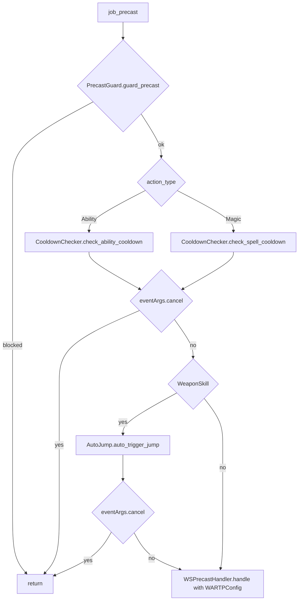

# WAR (Warrior) job

The WAR job is the only melee job with a live Tetsouo entry that carries its own
automation beyond the shared pipeline: 11 hook modules plus 2 logic modules
under `shared/jobs/war/functions/` (1 739 lines), an entry point per character,
six config files (plus a live-only refill list) and one sets file. GearSwap loads
it when the main job becomes WAR (`Tetsouo_WAR.lua`). From then on Mote-Include
calls its hooks on every action, on status and buff changes, on `//gs c`
commands and on state cycles.

What WAR adds on top of the shared pipeline:

- **Two-macro buff chains**: `//gs c berserk` and `//gs c defender` cast the WAR
  job abilities (Berserk or Defender, Aggressor, Retaliation, Restraint, Warcry
  or Blood Rage) and fold in the subjob part (/SAM Hasso or Seigan + Third Eye,
  /DNC Haste Samba). `thirdeye` and `tp` (Meditate on /SAM, the Jump rotation on
  /DRG) complete the set.
- **Weaponskill slots**: `//gs c ws1` .. `ws5` fire whatever the current
  `MainWeapon` puts in that slot (`WAR_WS_CONFIG.lua`), backed by real Mote
  states `WS1`..`WS5` shown on the HUD.
- **Auto-Jump** on /DRG: a weaponskill pressed below 1000 TP is cancelled, Jump
  (then High Jump) builds the TP, and the weaponskill is replayed.
- **TP bonus configuration** with Warcry/Savagery, Fencer and Chango bonuses.
- **Engaged set selection** by weapon and buff: Kraken Club -> `PDTKC`,
  Aftermath Lv.3 with Ukonvasara -> `PDTAFM3`, otherwise the `HybridMode` set.
- **Retaliation auto-cancel** after 5 s of continuous movement out of combat.

Every file in scope was read in full except the gear content of the sets files
(only structure and set names were read, as gear choice is out of scope). All
line numbers refer to the working tree on 2026-09-19.

## Files

| Path | Lines | Role |
|------|------:|------|
| `_master/entry/Tetsouo_WAR.lua` | 298 | Entry point (template): config preload, `get_sets`, `init_gear_sets` + `sync_weapon_with_hand`, `job_sub_job_change`, `user_setup`, `job_update`, `file_unload` |
| `shared/jobs/war/functions/war_functions.lua` | 108 | Facade: includes `message_buffs.lua` and the 11 hook files, requires `dualbox_manager` |
| `shared/jobs/war/functions/WAR_PRECAST.lua` | 154 | `job_precast` / `job_post_precast`: guard, cooldown, AutoJump, WS handler, TP gear |
| `shared/jobs/war/functions/WAR_MIDCAST.lua` | 73 | `job_midcast` (empty) / `job_post_midcast`: Healing and Enhancing routed to `MidcastManager` |
| `shared/jobs/war/functions/WAR_AFTERCAST.lua` | 39 | `job_aftercast`: empty |
| `shared/jobs/war/functions/WAR_IDLE.lua` | 57 | `customize_idle_set` -> `SetBuilder.build_idle_set` |
| `shared/jobs/war/functions/WAR_ENGAGED.lua` | 55 | `customize_melee_set` -> `SetBuilder.build_engaged_set` |
| `shared/jobs/war/functions/WAR_STATUS.lua` | 51 | `job_status_change`: `DoomManager.handle_status_change` |
| `shared/jobs/war/functions/WAR_BUFFS.lua` | 119 | `job_buff_change` (Doom, Aftermath Lv.3 refresh) and the globals `buff_war`, `buff_sam_sub`, `build_tp` |
| `shared/jobs/war/functions/WAR_COMMANDS.lua` | 302 | `job_self_command` router and `job_state_change` (WS slot rebuild, UI refresh) |
| `shared/jobs/war/functions/WAR_MOVEMENT.lua` | 194 | Retaliation auto-cancel (AutoMove callback), `get_war_movement_status`, Retaliation debug helpers |
| `shared/jobs/war/functions/WAR_LOCKSTYLE.lua` | 53 | Lazy `LockstyleManager.create('WAR', ..., 4, 'SAM')` wrappers |
| `shared/jobs/war/functions/WAR_MACROBOOK.lua` | 48 | Lazy `MacrobookManager.create('WAR', ..., 'SAM', 22, 1)` wrapper |
| `shared/jobs/war/functions/logic/set_builder.lua` | 213 | Engaged base selection (KC, AM3, HybridMode), weapon layer, town/movement idle |
| `shared/jobs/war/functions/logic/smartbuff_manager.lua` | 278 | `buff_war`, `buff_sam_sub`, `build_tp` |
| `shared/utils/weaponskill/ws_slots.lua` | 141 | `WSSlots.rebuild` / `detect_weapon` / `sync` / `get` / `cast` (used only by WAR) |
| `shared/utils/drg/auto_jump.lua` | 222 | Auto-Jump before a WS on /DRG (shared with DNC) |
| `shared/utils/drg/DRG_JUMP_MANAGER.lua` | 97 | Manual Jump rotation (`//gs c jump`, WAR `tp` on /DRG) |
| `shared/utils/weaponskill/tp_bonus_calculator.lua` | 276 | TP bonus piece selection (shared) |
| `_master/config/war/WAR_STATES.lua` | 146 | All WAR states (`WARStates.configure()`), unused `WARStates.validate()` |
| `_master/config/war/WAR_KEYBINDS.lua` | 181 | 9 binds, `bind_all` (calls `show_intro`), `unbind_all`, `show_binds` |
| `_master/config/war/WAR_WS_CONFIG.lua` | 95 | `max_slots = 5`, WS list per weapon key, `get(weapon)` |
| `_master/config/war/WAR_TP_CONFIG.lua` | 195 | `_G.WARTPConfig`: Savagery/Agoge, Fencer JP, pieces, weapons, Fencer detection |
| `_master/config/war/WAR_LOCKSTYLE.lua` | 72 | `default = 4`, `by_subjob`, `get_style` |
| `_master/config/war/WAR_MACROBOOK.lua` | 106 | `solo[sub]`, `dualbox[alt_job][sub]`, `default` (book 22 page 1) |
| `_master/Tetsouo/config/war/WAR_REFILL.lua` | 48 | Refill list (default + /DNC variant), overlay deployed to `Tetsouo/config/war/` |
| `_master/sets/war_sets.lua` | 545 | Template sets (flat) |
| `shared/data/job_abilities/WAR_JA_DATABASE.lua` + `war/war_{mainjob,subjob,sp}.lua` | 13 + ... | JA data for the ability message hooks (not read by WAR logic) |
| `shared/utils/messages/formatters/magic/message_buffs.lua` | - | `show_buff_status` used by the buff chains (WAR has no job formatter) |

Live copies (gitignored): `Tetsouo/Tetsouo_WAR.lua` differs from the template in
three places: the header comment (line 25), `init_gear_sets` includes
`sets/war/war_sets.lua` (line 146), and `job_update` also calls
`_G.LagDebugger.on_job_update()` (line 266). `Tetsouo/config/war/`:
`WAR_KEYBINDS`, `WAR_LOCKSTYLE`, `WAR_WS_CONFIG` are identical;
`WAR_MACROBOOK` uses books 3/5 instead of 22-30 (lines 37-39, 64-84);
`WAR_STATES` adds `SubtleBlow` to `HybridMode` (line 45) and lists `Chango`
second; `WAR_TP_CONFIG` still lists `Utu Grip` in `grips` (line 86, the
template moved to Telopanos Grip in commit b39e7e7); `WAR_REFILL` is identical
to the overlay. Sets are modular: `Tetsouo/sets/war/{war_sets,armor,capes,weapons}.lua`
(488 + 134 + 41 + 63 lines); weapon sets are created by a loop
(`war_sets.lua:56`). `Kaories/` and `_master/Kaories/` contain no WAR files.

## How it works

### Load sequence

GearSwap runs the entry chunk, then `get_sets()`. Mote-Include runs
`user_setup()` and then `init_gear_sets()` from inside
`include('Mote-Include.lua')` (`Mote-Include.lua:170-175`, `init_include()` at
188), that is **before** `INIT_SYSTEMS`, before the WAR hook files exist, and
before any gear set exists.

```mermaid
sequenceDiagram
    participant GS as GearSwap
    participant E as Tetsouo_WAR.lua
    participant M as Mote-Include
    participant F as war_functions.lua
    GS->>E: run chunk (LOCKSTYLE_CONFIG, REGION_CONFIG, JCM, UI_MANAGER, UIConfig; lines 34-58)
    GS->>E: get_sets()
    E->>E: _G.WARWSConfig = require WAR_WS_CONFIG (line 79)
    E->>M: include Mote-Include (line 82)
    M->>E: user_setup(): states + WS slots, keybinds, UI, JCM, macrobook/lockstyle, dualbox
    M->>E: init_gear_sets() -> include sets/war_sets.lua (line 146), then sync_weapon_with_hand() (147)
    E->>E: INIT_SYSTEMS, data_loader, message hooks (lines 85-110)
    E->>E: _G.LockstyleConfig, _G.UIConfig, _G.RECAST_CONFIG, _G.WARTPConfig (115-120)
    E->>E: JobChangeManager.cancel_all() (125)
    E->>F: include war_functions.lua (129)
    F->>F: include message_buffs + 11 hook files, require dualbox_manager
    E->>E: register_lockstyle_cancel("WAR", ...) (133-135)
```

`WAR_WS_CONFIG` is loaded before Mote-Include on purpose: `user_setup()` builds
the slot states from it (comment at 76-78, commit 63187a0: "Loaded with the other
configs it was still nil, and every slot showed N/A").

`user_setup()` (`Tetsouo_WAR.lua:209-255`):

1. `WARStates.configure()` creates every state (see [Mote states](#mote-states)),
   including `WSSlots.sync(state.MainWeapon, _G.WARWSConfig)`
   (`WAR_STATES.lua:71-76`). At this point the weapon sets do not exist, so
   this call only builds the slots for the default weapon;
   `sync_weapon_with_hand()` redoes it once the sets are loaded (see below).
2. `require('Tetsouo/config/war/WAR_KEYBINDS')`, stored in the global
   `WARKeybinds`, then `bind_all()` (9 `bind` commands), which calls
   `show_intro()` (`WAR_KEYBINDS.lua:111-113`). `show_intro` `require`s
   `WAR_MACROBOOK.lua` and `WAR_LOCKSTYLE.lua` (148, 155); both return nothing,
   so the intro falls back to `show_system_intro`, but the requires define
   `select_default_macro_book` / `select_default_lockstyle` as a side effect.
3. `KeybindUI.smart_init("WAR", UIConfig.init_delay)`.
4. `JobChangeManager.initialize()`; if both globals from step 2 exist, the macro
   book is set now and the lockstyle is scheduled after
   `LockstyleConfig.initial_load_delay` (8 s).
5. `pcall(require, 'shared/utils/dualbox/dualbox_manager')`.

The facade (`war_functions.lua`) includes `message_buffs.lua` (29), then
`WAR_PRECAST`, `WAR_MIDCAST`, `WAR_AFTERCAST` (36-40), `WAR_IDLE`,
`WAR_ENGAGED` (47-49), `WAR_STATUS`, `WAR_BUFFS` (56-58), `WAR_LOCKSTYLE`,
`WAR_MACROBOOK`, `WAR_COMMANDS`, `WAR_MOVEMENT` (65-71), requires
`dualbox_manager` (95) and prints a debug line (107-108). The lockstyle and
macrobook wrappers therefore run twice per sandbox (see
[factories](../systems/factories-and-helpers.md#job-wrappers)).

### Precast

`job_precast` (`WAR_PRECAST.lua:79-123`):



- All modules are loaded lazily on the first action (`ensure_modules_loaded`,
  33-61); `WARTPConfig` is captured from `_G.WARTPConfig` at that moment.
- AutoJump runs **before** `WSPrecastHandler` (comment 108-109): the handler
  would reject the weaponskill below 1000 TP before the jump could build it.
- `WSPrecastHandler.handle` returns `true` at once for non-weaponskills
  (`ws_precast_handler.lua:35-38`); for a weaponskill it validates range and
  Amnesia, computes the TP bonus gear and cancels below 1000 TP (60-70). See
  [precast pipeline](../systems/precast-pipeline.md#weaponskill-chain).
- `job_post_precast` (134-139) only equips the stored TP bonus gear.
- Gear comes from Mote's `default_precast` (`Mote-Include.lua:328-330`):
  `sets.precast.JA[name]`, `sets.precast.WS[name]` (else the `sets.precast.WS`
  base), `sets.precast.FC` (empty in WAR).

### Weaponskill slots

`WAR_WS_CONFIG.by_weapon` (`WAR_WS_CONFIG.lua:31-85`) maps each `MainWeapon`
option to an ordered list of weaponskills. `WSSlots.rebuild(list, 5)`
(`ws_slots.lua:40-55`) recreates `state.WS1`..`state.WS5`: slot *i* lists the
whole weapon list and is set to entry *i*; a slot past the end of the list gets
the single option `'None'`. Each slot can therefore be cycled in game to hold any
weaponskill of the weapon.

- `//gs c ws<N>` (`WAR_COMMANDS.lua:248-256`, pattern `^ws([1-9])$`) ->
  `WSSlots.cast(N)` (125-139): `'None'` or a missing state prints a warning;
  otherwise `input /ws "<name>" <t>`, which goes through the normal precast.
- Rebuild on weapon change: `job_state_change` (`WAR_COMMANDS.lua:279-287`)
  strips the spaces from `stateField` and rebuilds when it reads
  `MainWeapon`. Mote's `handle_cycle`/`set`/`reset` and `CycleHandler` (HUD
  visible) all pass the **description** `'Main Weapon'`
  (`Mote-SelfCommands.lua:156-158`, `CYCLE_HANDLER.lua:56-57`); the key form
  also matches, so every path rebuilds the slots.
- Load: `WSSlots.sync` (`ws_slots.lua:94-108`) is meant to align
  `state.MainWeapon` with the equipped main/sub by comparing them with
  `sets[key].main/sub` (`detect_weapon`, 63-85; Naegling and NaeglingKC are told
  apart by the sub). It runs in `user_setup()`, before `init_gear_sets()`
  (`Mote-Include.lua:171,175`), when `sets` holds only GearSwap's `naked` set and
  Mote's empty skeletons (`GearSwap/refresh.lua:143`, `Mote-Include.lua:112-124`).
  No weapon set exists yet, so detection fails there and the state keeps its
  first option. `init_gear_sets()` therefore calls `sync_weapon_with_hand()`
  (`Tetsouo_WAR.lua:145-169`) right after the set file: it runs the same sync
  with the sets present, then repaints the HUD when `MainWeapon` changed (the
  HUD was drawn in `user_setup()` with the default). Added in `f71d114`; before
  it, every reload left `MainWeapon` on `Ukonvasara` and the next idle/engaged
  update swapped the weapon.
- The HUD shows the slots in its `WS` section (`UI_DISPLAY_BUILDER.lua:36`).

### Buff chains (berserk, defender, thirdeye, tp)

`buff_war(param)` (`WAR_BUFFS.lua:51-54` -> `smartbuff_manager.lua:175-196`):

1. `exclude` = `{Defender}` for `'Berserk'`, `{Berserk}` for `'Defender'`.
2. `collect_main_abilities` (69-85) walks Berserk (recast 1), Defender (3),
   Aggressor (4), Retaliation (8), Restraint (9): active buff -> status
   `active`; `is_on_cooldown(recast)` -> status `cooldown` with `ceil(recast)`;
   otherwise queued.
3. `collect_warcry_bloodrage` (93-114): Warcry (2) is queued when ready and Blood
   Rage is not up; Blood Rage (11) only when Warcry is not up **and** Warcry is
   on cooldown.
4. `collect_subjob_abilities` (152-161): /SAM queues the stance paired with
   `param` (Hasso for Berserk, Seigan for Defender, `SAM_STANCE` 118-121) and
   Third Eye (133); /DNC queues Haste Samba (216) only when `player.tp >= 350`,
   silently skipped otherwise (comment 149-150). The stance follows `param`, not
   `buffactive`, because the Berserk/Defender cast is still queued at that point
   (comment 146-148, commit 63187a0).
5. `MessageBuffs.show_buff_status(status)` if anything is active or on cooldown,
   then `cast_sequentially` (164-173): first `/ja` now, the *i*-th after
   `2 * (i - 1)` seconds, all as `input /ja "<name>" <me>`.

`buff_sam_sub()` (210-230, command `thirdeye`) does the same for the stance +
Third Eye alone, only on /SAM, and reads the stance from `buffactive['Defender']`.

`build_tp()` (242-272, command `tp`): /SAM -> Meditate (134) through the same
collect/cast helpers; /DRG -> `DRGJumpManager.execute_jump()`; any other subjob
-> warning `No TP ability for /<sub>`.

Readiness uses the globals `is_recast_ready` / `is_on_cooldown` from
`RECAST_CONFIG.lua:45-96` (tolerance 2.0 s), loaded by the entry at line 117.
All recast ids above match `res/job_abilities.lua`.

### Auto-Jump (/DRG)

`AutoJump.auto_trigger_jump` (`auto_jump.lua:143-171`) is a no-op unless
`state.JumpAuto` is not `'Off'`, no sequence is running
(`_G.AUTO_JUMP_SEQUENCE_ACTIVE`), the subjob is DRG with level > 0, TP < 1000 and
Jump or High Jump is ready. It then cancels the weaponskill, fires the jump on
`<t>`, the other jump 1.0 s later if TP is still short, and replays the
weaponskill on the original `target.raw` 1.0 s after the last jump; the guard is
cleared 0.5 s after the replay. The replayed weaponskill goes through precast
again and is rejected by `WSPrecastHandler` if TP is still below 1000. Details in
[factories and helpers](../systems/factories-and-helpers.md#drg-jumps).

### TP bonus

`WARTPConfig` (`WAR_TP_CONFIG.lua`) supplies:

| Source | Code | Value |
|--------|------|-------|
| Pieces | `pieces` (45-53) | Moonshade Earring ear1 +250, Boii Cuisses +3 legs +100 |
| Weapon | `get_weapon_bonus` (114-126) | Chango +500 |
| Warcry | `get_warcry_bonus` (99-107), only while `buffactive['Warcry']` (`tp_bonus_calculator.lua:78`) | `savagery_merits` x 140 with Agoge Mask, x 100 without; 0 with no merits. Template: 5 merits + mask = 700 |
| Fencer | `get_fencer_bonus` (140-186) | 630 + 11.5 x `fencer_jp_gifts` (860 at 20) when the main is in `one_hand_weapons` and the sub is empty or in `shields`; 0 otherwise |

The calculator (`tp_bonus_calculator.lua:159-207`) adds those bonuses to the
current TP, targets the next of 2000/3000, and returns the **first** piece in
descending bonus order that covers the gap, else the greedy combination, else
nil. Examples: Ukonvasara at 1800 TP -> gap 200 -> Moonshade (not Boii, which
cannot cover it); at 1950 TP -> gap 50 -> Moonshade again, because a single
piece is preferred and the list is walked biggest first; Naegling + Blurred
Shield +1 at 1200 TP -> 2060 effective -> gap 940 > 350 -> nothing. The `grips`
list (86) changes nothing: a grip and any other non-shield sub both return 0
(177-185).

### Midcast

Mote equips its default midcast set first (`get_midcast_set`), then
`job_post_midcast` (`WAR_MIDCAST.lua:37-59`) loads `MidcastDeps` and routes
Healing Magic (skill only) and Enhancing Magic (`get_enhancing_target`,
`ENHANCING_MAGIC_DATABASE.get_spell_family`) to `MidcastManager.select_set`.
The WAR sets define no `sets.midcast` entry at all, so `select_set` returns
false at once (`midcast_manager.lua:624-629`) and subjob spells keep whatever
Mote equipped (nothing). `job_midcast` is empty. WAR is the only job whose
midcast does not call `MidcastWatchdog.on_midcast_start`, and its aftercast does
not call `on_aftercast` (see [core lifecycle](../systems/core-lifecycle.md#midcastwatchdog)).

### Aftercast, idle, engaged, status, buffs

- `job_aftercast` (`WAR_AFTERCAST.lua:27-31`) is empty; Mote's
  `default_aftercast` returns to idle/engaged gear. Its comment says the
  watchdog covers packet loss, which is not true for WAR (see Midcast).
- `customize_idle_set` -> `SetBuilder.build_idle_set` (`set_builder.lua:187-207`):
  `select_idle_base` (131-148) returns `sets.Adoulin` in Adoulin or
  `sets.idle.Town` in other cities (`base_set_builder.lua:65-84`), otherwise
  `sets.idle[HybridMode]` if it exists, otherwise Mote's base; then
  `sets[state.MainWeapon.current]` (91-108, also in town); then `sets.MoveSpeed`
  when `state.Moving.value == 'true'` outside town (`base_set_builder.lua:39-49`).
- `customize_melee_set` -> `build_engaged_set` (161-173): `select_engaged_base`
  (47-79) replaces Mote's set with, in order: `sets.engaged.PDTKC` when
  `MainWeapon == 'NaeglingKC'` or the equipped sub is Kraken Club;
  `sets.engaged.PDTAFM3` when `buffactive[272]` (Aftermath: Lv.3),
  `MainWeapon == 'Ukonvasara'` and `HybridMode ~= 'SubtleBlow'`;
  `sets.engaged[HybridMode]`; Mote's base. Then the weapon layer. No movement
  layer when engaged. The Kraken Club rule wins over any `HybridMode`.
- `job_status_change` (`WAR_STATUS.lua:37-46`) only calls
  `DoomManager.handle_status_change` (unlocks Doom slots after death); the same
  body as `LifecycleManager.status_change` (`lifecycle_manager.lua:38-45`).
- `job_buff_change` (`WAR_BUFFS.lua:97-112`): Doom through `DoomManager`; on
  gain or loss of `"Aftermath: Lv.3"` (exact `res.buffs` casing), calls
  `handle_equipping_gear(player.status)` unless Doom is up. Mote's
  `buff_change` does not re-equip by itself (`Mote-Include.lua:1023-1042`).

### Retaliation auto-cancel

`WAR_MOVEMENT.lua:46-125` schedules, 0.6 s after the facade runs, the
registration of an `AutoMove` callback (AutoMove is included by `INIT_SYSTEMS`'
0.5 s deferred block, scheduled earlier in the same `get_sets`). The callback
receives `(is_moving, distance, player_status)` on every moving tick and on the
stop transition, only while not engaged (AutoMove's engaged branch does not call
callbacks). While Retaliation is up (`buffactive` or buff id 405 in
`windower.ffxi.get_player().buffs`) and the player moves out of combat, it
starts a timer; after 5 s (`move_duration_needed`, 29) it sends
`cancel Retaliation` (109, needs the Windower Cancel addon) and resets. Any
stop, engage or missing buff resets the timer. `//gs c debugretaliation` toggles
per-tick debug lines, `//gs c retalstatus` prints the tracker.

## Mote states

Created by `WARStates.configure()` (`_master/config/war/WAR_STATES.lua:34-112`)
on every `user_setup()` (every load; a subjob change ends in a `gs reload`), so
all values reset to their defaults. Keybinds from `WAR_KEYBINDS.lua:31-80`;
`^` = Ctrl, `#` = Apps.

| State | Values | Default | Key | Read by |
|-------|--------|---------|-----|---------|
| `HybridMode` (replaces Mote's) | PDT, Normal (live: + SubtleBlow) | PDT | `^numpad9` | `set_builder.lua:64,71-76,139-144`; Mote `get_melee_set` |
| `MainWeapon` | Ukonvasara, Naegling, NaeglingKC, Shining, Chango, Ikenga, Loxotic (live order: Chango second) | the weapon in hand, set by `sync_weapon_with_hand()` after the sets load; first option (`Ukonvasara`) when the weapon matches no set | `^numpad1` | `set_builder.lua:49,63,97`; `job_state_change` (WS slots) |
| `JumpAuto` | On, Off | On | `^numpad2` | `auto_jump.lua:144` |
| `WS1`..`WS5` | the weapon's WS list, or `None` | entry *i* of the list | `^numpad3`..`^numpad7` | `WSSlots.get/cast`; HUD |
| `FastCast` | 0..80 step 10 | 0 | none | `midcast_watchdog.lua` (never reached for WAR) |
| `AutoMedicine` | shared On/Off | persisted | `#numpad0` | `AutoMedicine.init(state, M)` (`WAR_STATES.lua:108-111`), see [precast pipeline](../systems/precast-pipeline.md) |

Mote defaults also exist: `OffenseMode`, `IdleMode`, `CastingMode`,
`WeaponskillMode` (all `'Normal'`). `state.Moving` comes from AutoMove.

## Commands

`job_self_command` (`WAR_COMMANDS.lua:64-257`) lowercases the first word and
tests, in order: `watchdog` commands, dual-box internals, **CommonCommands**,
`ui`, `debugmidcast`, Retaliation debug, `cyclestate`, `perf`, then the WAR
commands. A name nothing here handles falls to Mote, whose `selfCommandMaps`
ends with the dual-box alt's commands
([commands](../systems/commands-and-debug.md#4-alt-commands-and-name-shadowing)).
`berserk`, `defender` and `thirdeye` therefore run on the main even when the
partner's alt config has the same names; `//gs c alt berserk` sends the alt's.

| Command | Effect | Handler |
|---------|--------|---------|
| `watchdog ...` | MidcastWatchdog commands | `WAR_COMMANDS.lua:77-80` |
| `altjobupdate <job> <sub> ...` / `requestjob` | Dual-box internals | 85-101 |
| common commands | `reload`, `checksets`, `jump`, `waltz`, `am`, `lockstyle`, `refill`, `perf`, warp commands, ... | 106-117 -> `CommonCommands.handle_command(command, 'WAR', table.unpack(args))` |
| `ui ...` | UI toggles | 122-126 |
| `debugmidcast` | Toggle `MidcastManager` debug | 131-141 |
| `debugretaliation` / `debugretal` | Toggle Retaliation tracker debug | 143-153 |
| `retalstatus` | Print tracker state | 155-169 |
| `cyclestate <State> [reverse]` | `CycleHandler.handle_cyclestate` (all keybinds) | 178-181 |
| `perf ...` | Unreachable: `perf` is claimed by CommonCommands first (`COMMON_COMMANDS.lua:678`) | 186-205 |
| `berserk` | `buff_war('Berserk')` | 212-218 |
| `defender` | `buff_war('Defender')` | 221-227 |
| `thirdeye` | `buff_sam_sub()` (/SAM only, silent otherwise) | 230-236 |
| `tp` | `build_tp()` | 239-245 |
| `ws1` .. `ws9` | `WSSlots.cast(N)` (`ws6`..`ws9` always warn: only 5 slots exist) | 248-256 |

`job_state_change(field, new, old)` (273-293): skips `Moving`; rebuilds the WS
slots when `field` with its spaces removed is `MainWeapon` (the key or Mote's
description `'Main Weapon'`); always refreshes the UI.

## Set names the code looks up

T = `_master/sets/war_sets.lua`, L = `Tetsouo/sets/war/war_sets.lua`
(weapon sets come from `weapons.lua` through the loop at line 56).

| Set | Looked up by | T | L |
|-----|--------------|---|---|
| `sets['Ukonvasara']`, `['Naegling']`, `['NaeglingKC']`, `['Shining']`, `['Chango']`, `['Ikenga']`, `['Loxotic']` | `set_builder.lua:97`, `ws_slots.lua:74` | 83-124 | loop 56 |
| `sets.engaged.PDTKC`, `.PDTAFM3` | `set_builder.lua:49-67` | 242, 222 | 191, 157 |
| `sets.engaged.PDT` (alias of `PDTTP`), `.Normal` | `set_builder.lua:72` | 211, 217 | 137, 140 |
| `sets.engaged.SubtleBlow` | `set_builder.lua:72` (live HybridMode only) | absent | 174 |
| `sets.idle.PDT` | `set_builder.lua:140` | 163 | 81 |
| `sets.idle.Normal` | `set_builder.lua:140` (falls back to Mote's base) | absent | absent |
| `sets.idle.Town`, `sets.Adoulin`, `sets.MoveSpeed` | `BaseSetBuilder`, Mote Town scope | 176, 527 (MoveSpeed + body only), 521 | 93, 470, 465 |
| `sets.buff.Doom` | `DoomManager` | 540 | 481 |
| `sets.precast.JA` Provoke, Jump, High Jump, Berserk, Defender, Warcry, Aggressor, Blood Rage, Tomahawk | Mote default precast | 293-327 | 241-275 |
| `sets.precast.WS` base + Armor Break, Ukko's Fury, Upheaval, Fell Cleave, King's Justice, Impulse Drive, Stardiver, Savage Blade, Calamity, Judgment | Mote default precast | 337-502 | 285-454 |
| WS in `WAR_WS_CONFIG` without a named set: Steel Cyclone, Leg Sweep, Sonic Thrust, Decimation, Bora Axe, Mistral Axe, Sanguine Blade, Circle Blade, Black Halo, True Strike | Mote default precast -> `sets.precast.WS` base | base | base |
| `sets.midcast['Healing Magic']`, `['Enhancing Magic']` | `WAR_MIDCAST.lua:42,51` | **absent** | **absent** |

`sets['Lycurgos']` and the sub-only sets (`Blurred Shield +1`, `Telopanos Grip`,
`Alber Strap`, `Aurgelmir Orb +1`, T 91-135) are not reachable from any state.

## Configuration

| File / key | Default | Where the default lives | Read by |
|------------|---------|-------------------------|---------|
| `<char>/config/war/WAR_STATES.lua` | see states | file itself | entry `user_setup` (path hard-coded `Tetsouo/...`, replaced by the clone script) |
| `<char>/config/war/WAR_KEYBINDS.lua` | 9 binds | file | entry `user_setup`, `file_unload` |
| `<char>/config/war/WAR_WS_CONFIG.lua` `max_slots`, `by_weapon` | 5, 7 weapons | file (no pcall: a missing file aborts `get_sets`, entry line 79) | `WSSlots` via `_G.WARWSConfig` |
| `<char>/config/war/WAR_TP_CONFIG.lua` | 5 merits, Agoge, 20 JP gifts | file | `WSPrecastHandler` via `_G.WARTPConfig` (captured on first action) |
| `<char>/config/war/WAR_LOCKSTYLE.lua` `default`, `by_subjob`, `get_style` | 4 (all subjobs) | file; factory fallback 4 (`WAR_LOCKSTYLE.lua` wrapper line 35) | `LockstyleManager` (`get_style` exists, so `by_subjob` is read) |
| `<char>/config/war/WAR_MACROBOOK.lua` | template book 22 page 1 (/DRG 25, /DNC 28, dual-box 23-30); live books 3/5 | file; factory fallback book 22 page 1 | `MacrobookManager` |
| `<char>/config/war/WAR_REFILL.lua` | Panacea, Antacid, Holy Water, Remedy, Powder, Oil, food (no Powder/Oil on /DNC) | overlay `_master/Tetsouo/config/war/` | `//gs c refill` |
| `Tetsouo/config/RECAST_CONFIG.lua` | tolerance 2.0 | shared | entry line 117 -> `is_recast_ready` / `is_on_cooldown` |
| `Tetsouo/config/LOCKSTYLE_CONFIG.lua`, `REGION_CONFIG.lua`, UI config | - | entry fallbacks 36-40 | entry |

## State & lifetime

- Module state: `retaliation_config` (`WAR_MOVEMENT.lua:28-32`), lazy module
  locals in every hook file, `MidcastDeps` cache. All die on `gs reload`.
- `_G` written: the Mote hooks (`job_precast`, `job_post_precast`,
  `job_midcast`, `job_post_midcast`, `job_aftercast`, `customize_idle_set`,
  `customize_melee_set`, `job_status_change`, `job_buff_change`,
  `job_self_command`, `job_state_change`), `buff_war`, `buff_sam_sub`,
  `build_tp`, `get_war_movement_status`, `toggle_retaliation_debug`,
  `get_retaliation_status`, `select_default_lockstyle`,
  `cancel_war_lockstyle_operations`, `select_default_macro_book`,
  `WARKeybinds`, `WARWSConfig`, `WARTPConfig`, `LockstyleConfig`, `UIConfig`,
  `RECAST_CONFIG`, `RegionConfig`, `AUTO_JUMP_SEQUENCE_ACTIVE`,
  `temp_tp_bonus_gear`, `state.WS1`..`WS5`.
- `_G` read: `is_recast_ready`, `is_on_cooldown`, `AutoMove`,
  `MidcastManagerDebugState`.
- `windower.*`: WAR code writes nothing there.
- Events: none registered directly; the Retaliation callback lives in AutoMove's
  callback list (dies with the sandbox).
- Coroutines: the 0.6 s AutoMove registration, the 8 s initial lockstyle, the
  AutoJump chain (1.0 s / 1.0 s / 0.5 s). None is cancelled by a reload; the
  AutoJump chain can replay a weaponskill into the next sandbox.
- `wait` chains (`cast_sequentially`, `SubjobWarBuffs`-style spacing) sit in the
  Windower command queue and survive a reload.
- Keybinds: bound in `user_setup`, unbound in `file_unload` (252-262).
- Subjob change: Mote's `sub_job_change` runs `user_setup()` again, then
  `job_sub_job_change` (158-178) hands over to `JobChangeManager.on_job_change`,
  which ends in a `gs reload`. See
  [job change lifecycle](../architecture/job-change-lifecycle.md).

## Interactions

- Precast: `PrecastGuard`, `CooldownChecker`, `AutoJump`, `WSPrecastHandler`,
  `TPBonusCalculator` ([precast pipeline](../systems/precast-pipeline.md)).
  AutoJump is shared with [DNC](dnc.md).
- Midcast: `MidcastManager` via `MidcastDeps`
  ([midcast and buffs](../systems/midcast-and-buffs.md)).
- `DRGJumpManager` for `tp` on /DRG and `//gs c jump`
  ([factories and helpers](../systems/factories-and-helpers.md#drg-jumps)).
- `SubjobWarBuffs` (`shared/utils/smartbuff/subjob_war_buffs.lua`) is the
  THF/DNC version of the Berserk/Aggressor/Warcry collection; WAR keeps its own.
- Messages: `message_buffs.show_buff_status`, ability/WS hooks
  ([messages](../systems/messages.md)).
- Lockstyle / macrobook factories, `JobChangeManager`, `CommonCommands`,
  `CycleHandler`, UI, dual-box ([commands and debug](../systems/commands-and-debug.md),
  [dualbox](../systems/dualbox.md), [core lifecycle](../systems/core-lifecycle.md)).
- Same set-builder shape as [DRK](drk.md) (weapon sets, AM3); the /SAM part
  mirrors [SAM](sam.md)'s stance logic.

## Invariants & gotchas

- `user_setup()` runs before the hook files **and before the sets**; anything in
  `WARStates.configure()` that reads `sets` sees only skeletons. Work that needs
  the sets goes in `init_gear_sets()`, after the include (as
  `sync_weapon_with_hand()` does).
- `ws_slots` is required from `user_setup()` before `INIT_SYSTEMS` installs
  ModuleCache, so the later require in `WAR_COMMANDS` loads a second copy. The
  module is stateless, so this is harmless.
- `job_state_change` receives the state **key** from `CycleHandler` but the
  **description** from Mote; any new check on `stateField` must accept both.
- Changing `MainWeapon` equips the new weapon on the next gear update (FFXI
  resets TP on a weapon swap).
- The /SAM stance is queued whatever the weapon; Hasso and Seigan need a
  two-handed weapon, so with Naegling, Ikenga or Loxotic the game refuses them
  and their 2 s slot in the chain is wasted.
- A weaponskill pressed out of range below 1000 TP on /DRG still fires Jump
  first (AutoJump runs before the range check).
- `buff_war(nil)` (only reachable by calling the global) excludes neither
  Berserk nor Defender; the second cancels the first in game.
- `select_engaged_base` ignores Mote's `meleeSet` whenever a hybrid set exists.
- `cancel Retaliation` depends on the Windower Cancel addon.

## Extending

- New weapon: add the option to `MainWeapon` (`WAR_STATES.lua`), a `sets[key]`
  with `main` and `sub` in both sets files, and a list in
  `WAR_WS_CONFIG.by_weapon` under the same key.
- New buff in the chain: add `{name, buff, id}` (recast id from
  `res/job_abilities.lua`) to `MAIN_ABILITIES` or a subjob branch in
  `collect_subjob_abilities`.
- New TP piece or weapon bonus: `pieces` / `weapons` in `WAR_TP_CONFIG.lua`.
- New engaged variant: a branch in `select_engaged_base` before the
  `HybridMode` step, and the set in both sets files.
- New command: add it after the CommonCommands block, set
  `eventArgs.handled = true` on every path, and pick a name that is not a
  common command or warp alias. A name the alt config also has runs locally.

## Known issues

- `berserk`, `defender`, `thirdeye` and `tp` set `eventArgs.handled` only when
  their global exists (`WAR_COMMANDS.lua:212-245`); if `buff_war` were nil,
  `berserk` would fall through to Mote and reach the dual-box alt's `berserk`.
  `altcmds` also lists the alt's `berserk`/`defender`/`thirdeye` in the bare
  form although the bare names run on the main.
- WAR subjob spells are not watched by `MidcastWatchdog`, while the aftercast
  comment says they are (`WAR_MIDCAST.lua:37-59`, `WAR_AFTERCAST.lua:28-30`).
- The Healing/Enhancing midcast routing is a no-op: no `sets.midcast` entry in
  either sets file (`WAR_MIDCAST.lua:41-58`).
- `sets.Adoulin` is a two-slot set used as the full idle base in Adoulin
  (`_master/sets/war_sets.lua:527`).
- `perf` branch unreachable (`WAR_COMMANDS.lua:186-205`).
- `WAR_STATUS` / `WAR_BUFFS` repeat `LifecycleManager` bodies (open
  duplication finding; `WAR_STATUS.lua:37-46` pcall-requires `DoomManager` and
  then calls it without a nil check).
- Dead code: `get_war_movement_status`, `WARStates.validate`, the `grips` list,
  the `SubtleBlow` test in the template (template `HybridMode` has no such
  value).
- Comments out of date: `WAR_STATES.lua:9,43,52` (Alt+1/Alt+2 binds),
  `WAR_STATES.lua:55,58,59` (Ukonvasara is the Empyrean, Chango the Aeonic,
  Shining One a polearm), `WAR_MACROBOOK.lua:21` ("Book range 1-20"),
  `smartbuff_manager.lua:40-53` (the `buff_war` doc block sits above
  `MAIN_ABILITIES`).
- `tp_bonus_calculator.lua:108-121` re-sorts the pieces on every weaponskill
  (open finding).
- User docs out of date (`docs/user/jobs/war/states.md`, `tp-bonus.md`).
