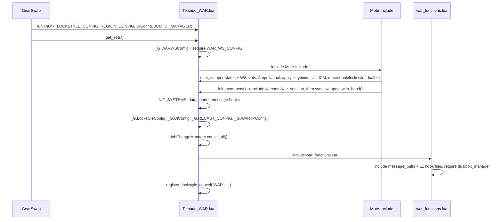
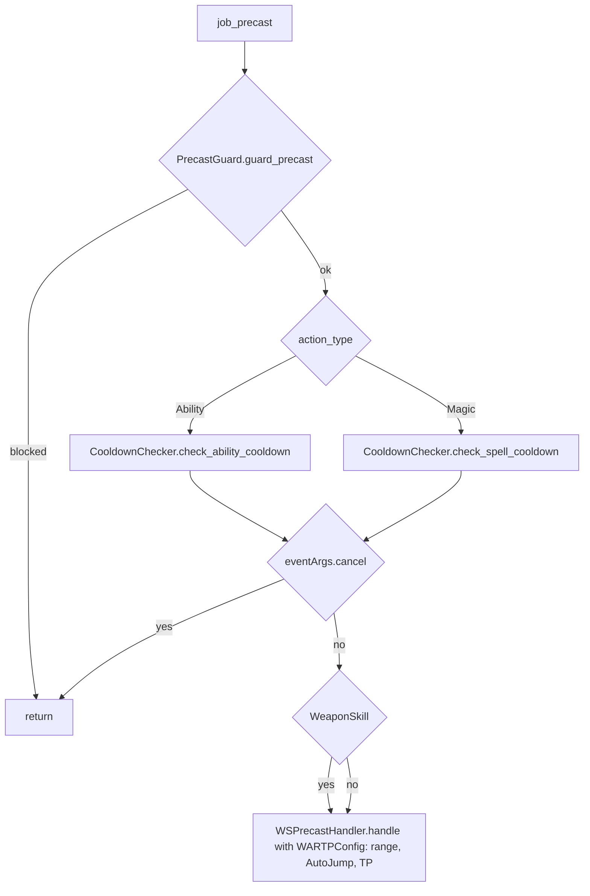

# WAR (Warrior) job

The WAR job area is 11 hook modules plus 2 logic modules under
`shared/jobs/war/functions/` (1 790 lines on 2026-09-28), an entry template, eight
config files and one sets file. GearSwap loads it when the main job becomes WAR
(`Tetsouo_WAR.lua`). From then on Mote-Include calls its hooks on every action, on
status and buff changes, on `//gs c` commands and on state cycles.

What WAR adds on top of the shared pipeline:

- **Two-macro buff chains**: `//gs c berserk` and `//gs c defender` cast the WAR job
  abilities (Berserk or Defender, Aggressor, Retaliation, Restraint, Warcry or Blood
  Rage) and fold in the subjob part (/SAM Hasso or Seigan + Third Eye). `thirdeye` and `tp` (Meditate on /SAM, the Jump rotation on /DRG)
  complete the set.
- **Weaponskill slots**: `//gs c ws1` .. `ws5` fire whatever the current
  `MainWeapon` puts in that slot (`WAR_WS_CONFIG.lua`), backed by real Mote states
  `WS1`..`WS5` shown on the HUD (`ws6`..`ws9` only warn).
- **Weapon read from the hands** after each load (`sync_weapon_with_hand`).
- **Auto-Jump** on /DRG (`JumpAuto`, Off in the template, WAR's own key
  `^numpad2`): a weaponskill pressed below 1000 TP is cancelled, Jump (then High
  Jump) builds the TP, and the weaponskill is replayed. Shared: it runs in
  `WSPrecastHandler.handle` for every job on /DRG.
- **TP bonus configuration** with Warcry / Savagery, Fencer and Chango bonuses.
- **Engaged set selection** by weapon, stance and buff, first match wins: Kraken
  Club (the `NaeglingKC` choice, or a club already in the off hand when the chosen
  weapon set names no sub) -> `PDTKC`; an explicit stance (`HybridMode` `SubtleBlow` or `Hoxne`, not in
  the template) -> its set, or `<stance>AFM3` under Ukonvasara Aftermath Lv.3;
  the weapon's own `<Weapon>AFM3` under its Aftermath (`AftermathSet` AFM3);
  Aftermath Lv.3 with Ukonvasara -> `PDTAFM3`; a set named after the weapon
  (`sets.engaged.Naegling`); otherwise the `HybridMode` set.
- **Hoxne stance** (when the player adds it to `HybridMode`): the engaged and idle
  builders put the Hoxne Ampulla on (`AmpullaLock.stance_ammo`, shared with PLD since 2026-09-29; since 2026-09-28)
  and the ammo slot is locked on it through the shared `AmpullaLock`.
- **Retaliation auto-cancel** after 5 s of continuous movement out of combat.

Player-facing pages: [WAR hub](../../user/jobs/war/README.md),
[modes](../../user/jobs/war/states.md), [sets](../../user/jobs/war/sets.md),
[TP bonus](../../user/jobs/war/tp-bonus.md).

Every file in scope was read in full on 2026-09-28 except the gear content of the
sets files (structure and set names only). References are `file` + function; line
numbers are avoided because they drift.

## Files

| Path | Lines | Role |
|------|------:|------|
| `_master/entry/Tetsouo_WAR.lua` | 313 | Entry point (template): config preload, `get_sets`, `init_gear_sets` + `sync_weapon_with_hand`, `job_sub_job_change`, `user_setup` (+ `AmpullaLock.apply`), `job_update`, `file_unload` (+ `AmpullaLock.release`), `show_keybind_error` |
| `shared/jobs/war/functions/war_functions.lua` | 110 | Facade: includes `message_buffs.lua` and the 11 hook files, requires `dualbox_manager` |
| `shared/jobs/war/functions/WAR_PRECAST.lua` | 138 | `job_precast` / `job_post_precast`: guard, cooldown, WS handler (which runs AutoJump), TP gear |
| `shared/jobs/war/functions/WAR_MIDCAST.lua` | 74 | `job_midcast` (empty) / `job_post_midcast`: Healing and Enhancing routed to `MidcastManager` |
| `shared/jobs/war/functions/WAR_AFTERCAST.lua` | 37 | `job_aftercast`: empty |
| `shared/jobs/war/functions/WAR_IDLE.lua` | 57 | `customize_idle_set` -> `SetBuilder.build_idle_set` |
| `shared/jobs/war/functions/WAR_ENGAGED.lua` | 53 | `customize_melee_set` -> `SetBuilder.build_engaged_set` |
| `shared/jobs/war/functions/WAR_STATUS.lua` | 27 | `job_status_change = LifecycleManager.status_change()` |
| `shared/jobs/war/functions/WAR_BUFFS.lua` | 117 | `job_buff_change` (Doom, Aftermath Lv.3 refresh through `LifecycleManager.refresh_after_buff`) and the globals `buff_war`, `buff_sam_sub`, `build_tp` |
| `shared/jobs/war/functions/WAR_COMMANDS.lua` | 320 | `job_self_command` router and `job_state_change` (WS slot rebuild, `AmpullaLock.apply` on `HybridMode`, UI refresh) |
| `shared/jobs/war/functions/WAR_MOVEMENT.lua` | 166 | Retaliation auto-cancel (AutoMove callback), Retaliation debug helpers |
| `shared/jobs/war/functions/WAR_LOCKSTYLE.lua` | 53 | Lazy `LockstyleManager.create('WAR', ..., 4, 'SAM')` wrappers |
| `shared/jobs/war/functions/WAR_MACROBOOK.lua` | 48 | Lazy `MacrobookManager.create('WAR', ..., 'SAM', 22, 1)` wrapper |
| `shared/jobs/war/functions/logic/set_builder.lua` | 230 | Engaged base selection (KC through `BaseSetBuilder.kraken_in_offhand`, stance, AM3, weapon set, HybridMode), weapon layer (`BaseSetBuilder.lay_weapon`), stance ammo (`apply_stance_ammo` = `AmpullaLock.stance_ammo`), town / movement idle |
| `shared/jobs/war/functions/logic/smartbuff_manager.lua` | 115 | `buff_war`, `buff_sam_sub`, `build_tp`: lists sent through the shared buff engine |
| `shared/utils/buffs/self_buff_manager.lua`, `buff_config.lua` | 284, 62 | The buff engine and the `BUFF_CONFIG.lua` settings (`war_berserk`, `war_defender`, `war_add_sam`), shared with `//gs c buff` ([midcast and buffs](../systems/midcast-and-buffs.md#buff-command-and-engine)) |
| `shared/utils/weaponskill/ws_slots.lua` | 159 | `WSSlots.rebuild` / `detect_weapon` / `sync` / `get` / `cast` (shared with PLD) |
| `shared/utils/drg/auto_jump.lua` | 263 | Auto-Jump before a WS on /DRG, run by `WSPrecastHandler.handle` for every job; `attach` gives every job `state.JumpAuto` |
| `shared/utils/drg/DRG_JUMP_MANAGER.lua` | 88 | Manual Jump rotation (`//gs c jump`, WAR `tp` on /DRG) |
| `shared/utils/weaponskill/tp_bonus_calculator.lua` | 275 | TP bonus piece selection (shared) |
| `shared/utils/equipment/ampulla_lock.lua` | 194 | Hoxne Ampulla ammo lock (shared with PLD); recorded with Combat Mode's lock registry (`'ampulla'`) |
| `_master/config/war/WAR_STATES.lua` | 124 | All WAR states (`WARStates.configure()`) |
| `_master/config/war/WAR_KEYBINDS.lua` | 68 | Data only: 8 bind entries handed to `KeybindManager.create('WAR', ...)`, plus the character's `COMMON_KEYBINDS.lua` keys |
| `_master/config/war/WAR_CUSTOM.lua` | 119 | Player modes and gear rules, commented examples only ([keybinds and custom states](../systems/keybinds-and-custom.md)) |
| `_master/config/war/WAR_HUD.lua` | 31 | HUD section / row order for WAR (empty lists = the default) |
| `_master/config/war/WAR_WS_CONFIG.lua` | 95 | `max_slots = 5`, WS list per weapon key, `get(weapon)` |
| `_master/config/war/WAR_TP_CONFIG.lua` | 195 | `_G.WARTPConfig`: Savagery / Agoge, Fencer JP, pieces, weapons, Fencer detection |
| `_master/config/war/WAR_LOCKSTYLE.lua` | 71 | `default = 4`, `by_subjob`, `get_style` |
| `_master/config/war/WAR_MACROBOOK.lua` | 106 | `solo[sub]`, `dualbox[alt_job][sub]`, `default` (book 22 page 1) |
| `_master/config/war/WAR_REFILL.lua` | 42 | Refill list, every line commented (`extra`, `default`, `subjobs` examples): `//gs c rf` uses the common list of `REFILL_CONFIG.lua` until one is uncommented |
| `_master/sets/war_sets.lua` | 541 | Template sets (flat) |
| `shared/data/job_abilities/WAR_JA_DATABASE.lua` + `war/war_{mainjob,subjob,sp}.lua` | 13 + ... | JA data for the ability message hooks (not read by WAR logic) |
| `shared/utils/messages/formatters/magic/message_buffs.lua` | - | `show_buff_status` used by the buff chains (WAR has no job formatter) |

Tetsouo overlay (`_master/Tetsouo/`, gitignored since 2026-09-27 like every
character overlay) and live copies (gitignored, identical to the overlay):
`Tetsouo_WAR.lua` differs from the template in the header comment (`@author` still
reads the character name), `init_gear_sets` includes `war/sets/war_sets.lua`, and
`job_update` also calls `_G.LagDebugger.on_job_update()`. `war/`:
`WAR_MACROBOOK` uses book 3 instead of 22-30; `WAR_STATES` adds `SubtleBlow` and
`Hoxne` to `HybridMode` and lists `Chango` second; `WAR_CUSTOM` holds only the
commented examples (the `FullEmpy` test mode was removed on 2026-09-30); its `WAR_REFILL` holds a list (the template's is all comments). Sets are modular:
`war/{war_sets,armor,capes,weapons}.lua`; weapon sets are created by a loop in
`war_sets.lua`. `Kaories/` and `_master/Kaories/` contain no WAR files.

## How it works

### Load sequence

GearSwap runs the entry chunk, then `get_sets()`. Mote-Include runs `user_setup()`
and then `init_gear_sets()` from inside `include('Mote-Include.lua')`
(`init_include()`), that is **before** `INIT_SYSTEMS`, before the WAR hook files
exist, and before any gear set exists.


```mermaid
sequenceDiagram
    participant GS as GearSwap
    participant E as Tetsouo_WAR.lua
    participant M as Mote-Include
    participant F as war_functions.lua
    GS->>E: run chunk (LOCKSTYLE_CONFIG, REGION_CONFIG, UIConfig, JCM, UI_MANAGER)
    GS->>E: get_sets()
    E->>E: _G.WARWSConfig = require WAR_WS_CONFIG
    E->>M: include Mote-Include
    M->>E: user_setup(): states + WS slots, AmpullaLock.apply, keybinds, UI, JCM, macrobook/lockstyle, dualbox
    M->>E: init_gear_sets() -> include war/sets/war_sets.lua, then sync_weapon_with_hand()
    E->>E: INIT_SYSTEMS, data_loader, message hooks
    E->>E: _G.LockstyleConfig, _G.UIConfig, _G.RECAST_CONFIG, _G.WARTPConfig
    E->>E: JobChangeManager.cancel_all()
    E->>F: include war_functions.lua
    F->>F: include message_buffs + 11 hook files, require dualbox_manager
    E->>E: register_lockstyle_cancel("WAR", ...)
```

`WAR_WS_CONFIG` is loaded before Mote-Include on purpose: `user_setup()` builds the
slot states from it. Loaded with the other configs it would still be nil, and every
slot would show `N/A`.

`user_setup()` (`Tetsouo_WAR.lua`):

1. `WARStates.configure()` creates every state (see [Mote states](#mote-states)),
   including `WSSlots.sync(state.MainWeapon, _G.WARWSConfig)`. At this point the
   weapon sets do not exist, so the sync only builds the slots for the default
   weapon; `sync_weapon_with_hand()` redoes it once the sets are loaded (below).
2. `AmpullaLock.apply(state.HybridMode.value)`: `configure()` has just reset
   `HybridMode`, so an ammo lock left by a Hoxne stance of the previous load is
   released here.
3. `require('Tetsouo/war/keys/WAR_KEYBINDS')`, stored in the global `WARKeybinds`,
   then `bind_all()`, which calls `show_intro()`. The `KeybindManager` intro
   requires `WAR_MACROBOOK.lua` and `WAR_LOCKSTYLE.lua`; both return nothing, but the
   requires define `select_default_macro_book` / `select_default_lockstyle` as a
   side effect. A failed `require` goes to `show_keybind_error`, which prints
   `[WAR] Keybinds failed to load: <error>`.
4. `KeybindUI.smart_init("WAR", UIConfig.init_delay)` (anchor `state.HybridMode`).
5. `JobChangeManager.initialize()`; if both globals from step 3 exist, the macro book
   is set now and the lockstyle is scheduled after `initial_load_delay` (8 s).
6. `pcall(require, 'shared/utils/dualbox/dualbox_manager')`.

The facade (`war_functions.lua`) includes `message_buffs.lua`, then `WAR_PRECAST`,
`WAR_MIDCAST`, `WAR_AFTERCAST`, `WAR_IDLE`, `WAR_ENGAGED`, `WAR_STATUS`, `WAR_BUFFS`,
`WAR_LOCKSTYLE`, `WAR_MACROBOOK`, `WAR_COMMANDS`, `WAR_MOVEMENT`, requires
`dualbox_manager` and prints a debug line. The lockstyle and macrobook wrappers
therefore run twice per sandbox (see
[factories](../systems/factories-and-helpers.md#job-wrappers)).

`file_unload` releases the ammo lock **first** (GearSwap runs `file_unload` in a
single `pcall`), then `JobChangeManager.cancel_all()`, then
`WARKeybinds.unbind_all()`.

### Precast

`job_precast` (`WAR_PRECAST.lua`):


```mermaid
flowchart TD
    A[job_precast] --> B{PrecastGuard.guard_precast}
    B -- blocked --> Z[return]
    B -- ok --> C{action_type}
    C -- Ability --> D[CooldownChecker.check_ability_cooldown]
    C -- Magic --> E[CooldownChecker.check_spell_cooldown]
    D --> F{eventArgs.cancel}
    E --> F
    F -- yes --> Z
    F -- no --> G{WeaponSkill}
    G -- yes --> J[WSPrecastHandler.handle with WARTPConfig: range, AutoJump, TP]
    G -- no --> J
```

- All modules are loaded lazily on the first action (`ensure_modules_loaded`);
  `WARTPConfig` is captured from `_G.WARTPConfig` at that moment.
- `WSPrecastHandler.handle` returns `true` at once for non-weaponskills; for a
  weaponskill it validates range and Amnesia (`ws_validator`), runs AutoJump
  (/DRG, `state.JumpAuto` On; it returns false when the jump takes the
  weaponskill over), computes the TP bonus gear and cancels below 1000 TP read
  from the game. AutoJump sits after the range check (a weaponskill out of range
  spends no Jump) and before the TP check (the jump builds the TP the check
  would ask for). WAR_PRECAST no longer wires AutoJump itself. See
  [precast pipeline](../systems/precast-pipeline.md#weaponskill-chain).
- `job_post_precast` only equips the stored TP bonus gear
  (`WSPrecastHandler.apply_tp_gear`).
- Gear comes from Mote's `default_precast`: `sets.precast.JA[name]`,
  `sets.precast.WS[name]` (else the `sets.precast.WS` base), `sets.precast.FC`
  (not defined by the WAR template: Mote's empty default).

### Weaponskill slots

`WAR_WS_CONFIG.by_weapon` maps each `MainWeapon` option to an ordered list of
weaponskills. `WSSlots.rebuild(list, 5)` recreates `state.WS1`..`state.WS5`: slot
*i* lists the whole weapon list and is set to entry *i*; a slot past the end of the
list gets the single option `'None'`. Each slot can therefore be cycled in game to
hold any weaponskill of the weapon.

| Weapon | WS list (slot order) |
|---|---|
| Ukonvasara | Ukko's Fury, Upheaval, Fell Cleave, Armor Break, Steel Cyclone |
| Chango | Upheaval, Ukko's Fury, Fell Cleave, Steel Cyclone |
| Shining | Impulse Drive, Stardiver, Leg Sweep, Sonic Thrust |
| Ikenga | Decimation, Calamity, Bora Axe, Mistral Axe |
| Naegling, NaeglingKC | Savage Blade, Sanguine Blade, Circle Blade |
| Loxotic | Judgment, Black Halo, True Strike |

- `//gs c ws<N>` (`WAR_COMMANDS.lua`, pattern `^ws([1-9])$`) -> `WSSlots.cast(N)`:
  `'None'` or a missing state prints a warning; otherwise `input /ws "<name>" <t>`,
  which goes through the normal precast. `ws6`..`ws9` match the pattern but have no
  slot and only warn. There is no bare `ws` on WAR (PLD has one).
- Rebuild on weapon change: `job_state_change` strips the spaces from `stateField`
  and rebuilds when it reads `MainWeapon`. Every caller (Mote's `handle_cycle` /
  `set` / `reset`, `CycleHandler`) passes the **description** `'Main Weapon'`
  (key only for a state without one), so every path rebuilds the slots.
- Load: `WSSlots.sync` aligns `state.MainWeapon` with the equipped main / sub by
  comparing them with `sets[key].main/sub` (`detect_weapon`; Naegling and
  NaeglingKC are told apart by the sub). The comparison is `same_item`: a set slot
  written as a string or as a table `{name = ..., augments = ...}`, in any case,
  with the short or the long name (matched through `item_index.lua` `Items.id`),
  names the item in hand; a slot absent from the set only matches an empty hand.
  Before 2026-09-28 it was a plain string compare, so a table entry was never
  recognised and the mode fell back to its first option. Inside `user_setup()` no weapon set exists
  yet, so detection fails and the state keeps its first option. `init_gear_sets()`
  therefore calls `sync_weapon_with_hand()` right after the set file: it runs the
  same sync with the sets present, then repaints the HUD when `MainWeapon` changed.
  Before that function existed, every reload left `MainWeapon` on `Ukonvasara` and
  the next idle/engaged update swapped the weapon.
- The HUD shows the slots in its `WS` section (`UI_DISPLAY_BUILDER.lua` patterns).

### Buff chains (berserk, defender, thirdeye, tp)

`buff_war(param)` (`WAR_BUFFS.lua` -> `smartbuff_manager.lua` `buff_war`):

1. `BuffConfig.get()` (`shared/utils/buffs/buff_config.lua`, the character's
   `_common/combat/BUFF_CONFIG.lua` over the defaults): the list is
   `war_defender` for `param == 'Defender'`, `war_berserk` for anything else
   (`'Berserk'`, nil). Defaults: `{'Berserk', 'Aggressor', 'Retaliation',
   'Restraint', 'Warcry'}` and `{'Defender', 'Aggressor', 'Retaliation',
   'Restraint', 'Warcry'}`. Berserk and Defender are kept apart only by being in
   different lists.
2. With `war_add_sam` (default `true`), `sam_part(param)` adds, on an enabled /SAM
   (`sub_job_level > 0`), `Seigan` for `'Defender'` else `Hasso`, then `Third Eye`.
   The stance follows `param`, not `buffactive`, because the Berserk / Defender
   cast is still queued at that point. Nothing for /DNC: Haste Samba was in the
   chain until 2026-09-30, removed because the player did not want it on every press.
3. `run(...)`: `SelfBuffManager.collect` of each list (names found in the game data,
   left out quietly when the jobs cannot use them; active buff -> `active`, on
   recast -> `cooldown`; `Warcry` / Blood Rage and the two-handed rule of Hasso /
   Seigan apply), `show_status`, then `cast` through the shared action queue (each
   action when the previous has ended, spells as `/ma`). Details:
   [midcast and buffs](../systems/midcast-and-buffs.md#buff-command-and-engine).

`buff_sam_sub()` (command `thirdeye`) runs the /SAM part alone, only on /SAM
(otherwise the warning `thirdeye: needs /SAM`), and reads the stance from
`buffactive['Defender']`.

`build_tp()` (command `tp`): /SAM -> `run({'Meditate'})`; /DRG ->
`DRGJumpManager.execute_jump()`; any other subjob -> warning
`No TP ability for /<sub>`.

Readiness uses the global `is_recast_ready` from `RECAST_CONFIG.lua` (tolerance
2.0 s), loaded by the entry in `get_sets`; ids and recast ids come from the game data.

### Auto-Jump (/DRG)

`AutoJump.auto_trigger_jump` (`auto_jump.lua`, called by `WSPrecastHandler.handle`)
is a no-op unless `state.JumpAuto` is `'On'`, while a sequence is running (`_G.AUTO_JUMP_SEQUENCE_ACTIVE`), or unless the
subjob is DRG with level > 0, the live TP is under 1000 and Jump or High Jump is
ready (`should_auto_jump`). It then cancels the weaponskill, fires the jump on
`<t>`, the other jump after the animation delay if TP is still short
(`chain_second_jump`), and replays the weaponskill on the original `target.raw`
after the last jump (`replay_ws`); the guard is cleared 0.5 s after the replay. The
replayed weaponskill goes through precast again and is refused by
`WSPrecastHandler` if TP is still below 1000. Details in
[factories and helpers](../systems/factories-and-helpers.md#drg-jumps).

### TP bonus

`WARTPConfig` (`WAR_TP_CONFIG.lua`) supplies:

| Source | Code | Value |
|--------|------|-------|
| Pieces | `pieces` | Moonshade Earring ear1 +250, Boii Cuisses +3 legs +100 |
| Weapon | `get_weapon_bonus` | Chango +500 |
| Warcry | `get_warcry_bonus`, only while `buffactive['Warcry']` (`tp_bonus_calculator.lua`) | `savagery_merits` x 140 with Agoge Mask, x 100 without; 0 with no merits. Template: 5 merits + mask = 700 |
| Fencer | `get_fencer_bonus` | 630 + 11.5 x `fencer_jp_gifts` (860 at 20) when the main is in `one_hand_weapons` and the sub is empty or in `shields`; 0 otherwise |

The calculator (`tp_bonus_calculator.lua` `calculate`) adds those bonuses to the
current TP, targets the next of 2000 / 3000, and returns the **first** piece in
descending bonus order that covers the gap, else the greedy combination, else nil.
Examples: Ukonvasara at 1800 TP -> gap 200 -> Moonshade (Boii cannot cover it); at
1950 TP -> gap 50 -> Moonshade again, because a single piece is preferred and the
list is walked biggest first; Naegling + Blurred Shield +1 at 1200 TP -> 2060
effective -> gap 940 > 350 -> nothing. The `grips` list changes nothing: a grip and
any other non-shield sub both return 0. Player page:
[tp-bonus.md](../../user/jobs/war/tp-bonus.md).

### Midcast

Mote equips its default midcast set first (`get_midcast_set`), then
`job_post_midcast` (`WAR_MIDCAST.lua`) loads `MidcastDeps` and routes Healing Magic
(skill only) and Enhancing Magic (`get_enhancing_target`,
`ENHANCING_MAGIC_DATABASE.get_spell_family`) to `MidcastManager.select_set`. The WAR
template defines no `sets.midcast` entry at all, so `select_set` returns false at
once (missing base set) and subjob spells keep whatever Mote equipped (nothing).
Other subjob skills (/NIN Utsusemi, /DRK Stun...) are routed by
`midcast_fallback.lua` after `job_post_midcast`. `job_midcast` is empty. WAR is the
only job whose midcast does not call `MidcastWatchdog.on_midcast_start`, and its
aftercast does not call `on_aftercast` (see
[core lifecycle](../systems/core-lifecycle.md#midcastwatchdog)), so `state.FastCast`
has no effect on WAR.

### Aftercast, idle, engaged, status, buffs

- `job_aftercast` is empty; Mote's `default_aftercast` returns to idle / engaged
  gear. Its comment says that WAR does not notify `MidcastWatchdog`.
- `customize_idle_set` -> `SetBuilder.build_idle_set`: `select_idle_base` (an alias
  of the shared `BaseSetBuilder.select_idle_base` since 2026-09-29, same behaviour;
  DNC, DRK and THF use it too) returns in a city `sets.idle` (or its IdleMode child) with `sets.Adoulin` (Adoulin) or
  `sets.idle.Town` on top (`base_set_builder.lua` `select_idle_base_town`, since
  2026-09-29), otherwise `sets.idle[HybridMode]`
  if it exists (overlay: `sets.idle.Hoxne` under the Hoxne stance), otherwise Mote's
  base; then `sets[state.MainWeapon.current]` through
  `WeaponResolver.set_for('main', ...)` (`apply_weapon`, also in town) and the
  stance's ammo (`apply_stance_ammo` = `AmpullaLock.stance_ammo`: `ammo = 'Hoxne Ampulla'` under the Hoxne
  stance, also in town); then
  `sets.MoveSpeed` when `state.Moving.value == 'true'` outside town
  (`BaseSetBuilder.apply_movement`).
- `customize_melee_set` -> `build_engaged_set`: `select_engaged_base` replaces
  Mote's set with, first match wins:
  1. `sets.engaged.PDTKC` when `MainWeapon == 'NaeglingKC'`, or when the equipped
     sub is Kraken Club **and** the chosen `sets[MainWeapon]` sets no `sub` of its
     own (a manual equip). Since 2026-09-28: right after leaving `NaeglingKC` the
     club is still in hand for one rebuild, and the new weapon used to get the KC
     set until the next action;
  2. an explicit stance (`STANCE_MODES`: `SubtleBlow`, `Hoxne`;
     `select_stance_engaged`): `sets.engaged[<stance>AFM3]` under Ukonvasara
     Aftermath Lv.3 when it exists, else `sets.engaged[<stance>]`;
  3. `sets.engaged[MainWeapon .. 'AFM3']` (e.g. `LaphriaAFM3`) when it exists and
     `buffactive[272]` (Aftermath: Lv.3) or `buffactive[273]` (plain "Aftermath",
     the name a Prime weapon's may carry) is up and `state.AftermathSet` is not
     `FastTP` (`weapon_am3_set` -> [WeaponAftermath](../systems/factories-and-helpers.md#weaponaftermath), shared with SAM, DRK and THF since
     2026-09-30; the `^numpad0` key is `visible` only
     for a weapon with such a set, re-asked through `WARKeybinds.refresh()` on a
     MainWeapon change in `job_state_change`);
     else `sets.engaged.PDTAFM3` when `buffactive[272]` and
     `MainWeapon == 'Ukonvasara'` (`ukonvasara_am3`);
  4. `sets.engaged[MainWeapon]` (`select_weapon_engaged`; the overlay defines
     `.Naegling` and `.Ukonvasara`);
  5. `sets.engaged[HybridMode]`; 6. Mote's base.

  Then the weapon layer, then the stance's ammo (`apply_stance_ammo`). No movement
  layer when engaged. The Kraken Club rule wins
  over any `HybridMode`, and a stance wins over Aftermath and the weapon set.
- `job_status_change` (`WAR_STATUS.lua`) is `LifecycleManager.status_change()`
  since 2026-09-28: `DoomManager.handle_status_change`, then an engage / disengage
  that lands during an action is held until the aftercast (3 s fallback). Before,
  it only called `DoomManager`, so the engaged / idle set replaced the action's gear.
- `job_buff_change` (`WAR_BUFFS.lua`): Doom through `DoomManager`; then
  `LifecycleManager.refresh_after_buff(buff)`: on gain or loss of
  `"Aftermath: Lv.3"` (exact `res.buffs` casing), unless Doom is up, `gs c update`
  0.1 s later, skipped if an action is under way then. So `PDTAFM3` /
  `<stance>AFM3` goes on or off about 0.1 s after the buff changes. It is deferred
  because `buffactive` inside `buff_change` still holds the old buffs
  ([core-lifecycle.md](../systems/core-lifecycle.md#lifecyclemanager)). Mote's
  `buff_change` does not re-equip by itself.

### Retaliation auto-cancel

`WAR_MOVEMENT.lua` schedules, 0.6 s after the facade runs, the registration of an
`AutoMove` callback (AutoMove is included by `INIT_SYSTEMS`' 0.5 s deferred block).
The callback receives `(is_moving, distance, player_status)` on every moving tick
and on the stop transition, only while not engaged (AutoMove's engaged branch does
not call callbacks). While Retaliation is up (`buffactive` or buff id 405 in
`windower.ffxi.get_player().buffs`) and the player moves out of combat, it starts a
timer; after 5 s (`retaliation_config.move_duration_needed`) it sends
`cancel Retaliation` (Windower Cancel addon) and resets. Any stop, engage or
missing buff resets the timer. `//gs c debugretaliation` toggles per-tick debug
lines, `//gs c retalstatus` prints the tracker.

## Mote states

Created by `WARStates.configure()` on every `user_setup()` (every load; a subjob
change ends in a `gs reload`), so all values reset to their defaults. Keys from
`WAR_KEYBINDS.lua`; `^` = Ctrl, `#` = Apps.

| State | Values | Default | Key | Read by |
|-------|--------|---------|-----|---------|
| `HybridMode` (replaced by a new `M{}`) | PDT, Normal (overlay: + SubtleBlow, Hoxne) | PDT | `^numpad9` | `set_builder.lua` `select_stance_engaged`, `select_engaged_base`, `select_idle_base`; `job_state_change` (`AmpullaLock.apply`); Mote `get_melee_set` |
| `MainWeapon` | Ukonvasara, Naegling, NaeglingKC, Shining, Chango, Ikenga, Loxotic (overlay order: Chango second) | the weapon in hand, set by `sync_weapon_with_hand()` after the sets load; first option (`Ukonvasara`) when it matches no set | `^numpad1` | `set_builder.lua` `ukonvasara_am3`, `select_weapon_engaged`, `apply_weapon`; `job_state_change` (WS slots) |
| `JumpAuto` | On, Off | Off (overlay: On) | `^numpad2`, /DRG only (`subjob = "DRG"`) | `auto_jump.lua` `auto_trigger_jump` (through `WSPrecastHandler.handle`) |
| `WS1`..`WS5` | the weapon's WS list, or `None` | entry *i* of the list | `^numpad3`..`^numpad7` | `WSSlots.get` / `cast`; HUD |
| `FastCast` | 0..80 step 10 | 0 | none | `midcast_watchdog.lua` (never reached for WAR) |
| `AutoMedicine` | On, Off | On on a cold start, then kept across loads | `#numpad0` (from `_common/keys/COMMON_KEYBINDS.lua`) | `AutoMedicine.init(state, M)` at the end of `configure()` |

Optional states added to every job: `CombatMode` (hidden, `!numpad0`) and
`TreasureMode` (hidden, `!numpad.`), see
[keybinds and custom states](../systems/keybinds-and-custom.md#optional-states-combat-mode-and-treasure-mode).
Mote defaults also exist: `OffenseMode`, `IdleMode`, `CastingMode`,
`WeaponskillMode`, `RangedMode` (all `'Normal'`). `state.Moving` comes from AutoMove.

## Commands

`job_self_command` (`WAR_COMMANDS.lua`) lowercases the first word and tests, in
order: `watchdog` commands, dual-box internals, **CommonCommands**, `ui`,
`debugmidcast`, Retaliation debug, `cyclestate`, `perf`, then the WAR commands. A
name nothing here handles falls to Mote, whose `selfCommandMaps` ends with the
dual-box alt's commands
([commands](../systems/commands-and-debug.md#4-alt-commands-and-name-shadowing)).
`berserk`, `defender` and `thirdeye` therefore run on the main even when the
partner's alt config has the same names; `//gs c alt berserk` sends the alt's.

| Command | Effect | Handler |
|---------|--------|---------|
| `watchdog ...` | MidcastWatchdog commands | `WatchdogCommands.handle_command` |
| `altjobupdate <job> <sub> ... <sender>` / `requestjob` | Dual-box internals | `DualBoxManager` |
| common commands | every [common command](../systems/commands-and-debug.md#common-commands-commoncommandshandle_command) | `CommonCommands.handle_command(command, 'WAR', table.unpack(args))` |
| `ui ...` | HUD | `UICommands.handle_ui_command` |
| `debugmidcast` | Toggle `MidcastManager` debug | `MidcastManager.toggle_debug` |
| `debugretaliation` / `debugretal` | Toggle Retaliation tracker debug | `toggle_retaliation_debug` (`WAR_MOVEMENT.lua`) |
| `retalstatus` | Print tracker state | `get_retaliation_status` |
| `cyclestate <State> [reverse]` | UI-aware cycle (all keybinds) | `CycleHandler.handle_cyclestate` |
| `perf ...` | Unreachable: `perf` is claimed by CommonCommands first | job branch kept, commented as unreachable |
| `berserk` | `buff_war('Berserk')` | `SmartbuffManager.buff_war` |
| `defender` | `buff_war('Defender')` | same |
| `thirdeye` | `buff_sam_sub()` (/SAM only, warning `thirdeye: needs /SAM` otherwise) | `SmartbuffManager.buff_sam_sub` |
| `tp` | `build_tp()` | `SmartbuffManager.build_tp` |
| `ws1` .. `ws9` | `WSSlots.cast(N)` (`ws6`..`ws9` always warn: only 5 slots exist) | `ws_slots.lua` |

`job_state_change(field, new, old)`: skips `Moving`; rebuilds the WS slots when
`field` with its spaces removed is `MainWeapon`; on `HybridMode` calls
`AmpullaLock.apply(new)` (locks the ammo slot on the Hoxne Ampulla for `Hoxne`,
releases it otherwise); always refreshes the UI.

## Set names the code looks up

T = `_master/sets/war_sets.lua`, L = `Tetsouo/war/war_sets.lua` (same as the
overlay `_master/Tetsouo/war/war_sets.lua`; weapon sets come from `weapons.lua`
through a loop). The player-facing list is [war/sets.md](../../user/jobs/war/sets.md).

| Set | Looked up by | T | L |
|-----|--------------|---|---|
| `sets['Ukonvasara']`, `['Naegling']`, `['NaeglingKC']`, `['Shining']`, `['Chango']`, `['Ikenga']`, `['Loxotic']` | `apply_weapon`, `ws_slots.lua` `detect_weapon` | yes | loop |
| `sets.engaged.PDTKC`, `.PDTAFM3` | `select_engaged_base` | yes | yes |
| `sets.engaged.<Weapon>AFM3` (`LaphriaAFM3`...) | `weapon_am3_set` (`WeaponAftermath`) | absent | `LaphriaAFM3` |
| `sets.engaged.SubtleBlow`, `.Hoxne`, `.HoxneAFM3` | `select_stance_engaged` (overlay `HybridMode` only) | absent | yes |
| `sets.engaged.Naegling`, `.Ukonvasara` | `select_weapon_engaged` | absent | yes |
| `sets.engaged.PDT` (alias of `PDTTP`), `.Normal` | `select_engaged_base` (HybridMode step) | yes | yes |
| `sets.idle.PDT`, `sets.idle.Hoxne` | `select_idle_base` (`sets.idle[HybridMode]`) | PDT only | yes |
| `sets.idle.Normal` | `select_idle_base` (falls back to Mote's base) | absent | absent |
| `sets.idle.Town`, `sets.Adoulin`, `sets.MoveSpeed` | `BaseSetBuilder`, Mote Town scope | yes (Adoulin = MoveSpeed + body) | yes |
| `sets.buff.Doom` | `DoomManager` | yes | yes |
| `sets.precast.JA` Provoke, Jump, High Jump, Berserk, Defender, Warcry, Aggressor, Blood Rage, Tomahawk | Mote default precast | yes | yes |
| `sets.precast.WS` base + Armor Break, Ukko's Fury, Upheaval, Fell Cleave, King's Justice, Impulse Drive, Stardiver, Savage Blade, Calamity, Judgment | Mote default precast | yes | yes |
| WS in `WAR_WS_CONFIG` without a named set: Steel Cyclone, Leg Sweep, Sonic Thrust, Decimation, Bora Axe, Mistral Axe, Sanguine Blade, Circle Blade, Black Halo, True Strike | Mote default precast -> `sets.precast.WS` base | base | base |
| `sets.midcast['Healing Magic']`, `['Enhancing Magic']` | `WAR_MIDCAST.lua` `job_post_midcast` | **absent** | **absent** |
| `sets.precast.FC` | Mote default precast (subjob spells) | **absent** (Mote's empty default) | - |

`sets['Lycurgos']` and the sub-only sets (`Blurred Shield +1`, `Telopanos Grip`,
`Alber Strap`, `Aurgelmir Orb +1`) in the template are not reachable from any state;
`sets.LessEnmity` / `sets.FullEnmity` are building blocks.

## Configuration

| File / key | Default | Where the default lives | Read by |
|------------|---------|-------------------------|---------|
| `<char>/war/WAR_STATES.lua` | see states | file itself | entry `user_setup` (path hard-coded `Tetsouo/...`, replaced by the clone script) |
| `<char>/war/WAR_KEYBINDS.lua` | 8 entries (+ `COMMON_KEYBINDS.lua`) | file | entry `user_setup`, `file_unload`, HUD |
| `<char>/war/WAR_CUSTOM.lua` | examples only (template and overlay) | file | `KeybindManager` via `custom_states` |
| `<char>/war/WAR_HUD.lua` | empty lists | file | HUD; rewritten by `//gs c ui order` / `roworder` |
| `<char>/war/WAR_WS_CONFIG.lua` `max_slots`, `by_weapon` | 5, 7 weapons | file (no pcall: a missing file aborts `get_sets`) | `WSSlots` via `_G.WARWSConfig` |
| `<char>/war/WAR_TP_CONFIG.lua` | 5 merits, Agoge, 20 JP gifts | file | `WSPrecastHandler` via `_G.WARTPConfig` (captured on first action) |
| `<char>/war/WAR_LOCKSTYLE.lua` `default`, `by_subjob`, `get_style` | 4 (all subjobs) | file; factory fallback 4 (`WAR_LOCKSTYLE.lua` wrapper) | `LockstyleManager` |
| `<char>/war/WAR_MACROBOOK.lua` | template book 22 page 1 (/DRG 25, /DNC 28, dual-box 22-30); overlay book 3 | file; factory fallback book 22 page 1 | `MacrobookManager` |
| `<char>/war/WAR_REFILL.lua` | the commented template (common list of `REFILL_CONFIG.lua` until edited); the author's overlay has its own list | file | `//gs c refill` (the common list without a list in it) |
| `<char>/_common/combat/RECAST_CONFIG.lua` | tolerance 2.0 | shared | entry `get_sets` -> `is_recast_ready` / `is_on_cooldown` |
| `<char>/_common/combat/BUFF_CONFIG.lua` `war_berserk`, `war_defender`, `war_add_sam` (and `job.WAR`, `subjob` for `//gs c buff`) | the two lists above, `true` (no `job.WAR`) | `BuffConfig.DEFAULTS` (`shared/utils/buffs/buff_config.lua`); missing key or file = default | `buff_war` / `BuffCommand.apply` at each press |
| `<char>/_common/display/LOCKSTYLE_CONFIG.lua`, `REGION_CONFIG.lua`, UI config | - | entry fallbacks | entry |

## State & lifetime

- Module state: `retaliation_config` (`WAR_MOVEMENT.lua`), lazy module locals in
  every hook file, `MidcastDeps` cache. All die on `gs reload`.
- `_G` written: the Mote hooks (`job_precast`, `job_post_precast`, `job_midcast`,
  `job_post_midcast`, `job_aftercast`, `customize_idle_set`, `customize_melee_set`,
  `job_status_change`, `job_buff_change`, `job_self_command`, `job_state_change`),
  `buff_war`, `buff_sam_sub`, `build_tp`, `toggle_retaliation_debug`,
  `get_retaliation_status`, `sync_weapon_with_hand`, `show_keybind_error`,
  `select_default_lockstyle`, `cancel_war_lockstyle_operations`,
  `select_default_macro_book`, `WARKeybinds`, `WARWSConfig`, `WARTPConfig`,
  `LockstyleConfig`, `UIConfig`, `RECAST_CONFIG`, `RegionConfig`,
  `AUTO_JUMP_SEQUENCE_ACTIVE`, `temp_tp_bonus_gear`, `state.WS1`..`WS5`.
- `_G` read: `is_recast_ready`, `is_on_cooldown`, `AutoMove`,
  `MidcastManagerDebugState`.
- `windower.*`: WAR code writes nothing there.
- Events: none registered directly; the Retaliation callback lives in AutoMove's
  callback list (dies with the sandbox).
- Coroutines: the 0.6 s AutoMove registration, the 8 s initial lockstyle, the
  AutoJump chain. None is cancelled by a reload; the AutoJump chain can replay a
  weaponskill into the next sandbox.
- Buff chains wait in the shared `ActionQueue` (`windower._action_queue`): a chain
  under way goes on across a reload or job change.
- Keybinds: bound in `user_setup`, kept at `file_unload` (the next load sends only what changed).
- Slot locks: under a Hoxne stance the ammo slot is locked through `AmpullaLock`;
  `file_unload` releases it first, and `//gs c wo` releases it at the end of its run
  (after its own `gs enable all`), so after `wo` it stays off until the stance is
  selected again. `AmpullaLock.set_slot` also records the lock with `CombatMode.hold('ampulla', {'ammo'})` and forgets it with `CombatMode.release('ampulla')` (since 2026-09-29), so Combat Mode's `handle_equipping_gear` wrapper disables the ammo slot again after the gear of every update, outside a craft session: after `//po` (PorterPacker ends with `gs enable all`) the next update puts the Ampulla back and locks it again (see
  [core-lifecycle.md](../systems/core-lifecycle.md#combatmode-hook-sharedutilscorecombat_modelua)).
- Subjob change: Mote's `sub_job_change` runs `user_setup()` again, then
  `job_sub_job_change` hands over to `JobChangeManager.on_job_change`, which ends in
  a `gs reload`. See [job change lifecycle](../architecture/job-change-lifecycle.md).

## Interactions

- Precast: `PrecastGuard`, `CooldownChecker`, `WSPrecastHandler` (which runs
  `AutoJump`), `TPBonusCalculator` ([precast pipeline](../systems/precast-pipeline.md)).
  AutoJump runs for every job on /DRG.
- Midcast: `MidcastManager` via `MidcastDeps`, `midcast_fallback`
  ([midcast and buffs](../systems/midcast-and-buffs.md)).
- `DRGJumpManager` for `tp` on /DRG and `//gs c jump`
  ([factories and helpers](../systems/factories-and-helpers.md#drg-jumps)).
- `BuffCommand` (`shared/utils/buffs/buff_command.lua`) answers the common
  `//gs c buff` (and `smartbuff`) on every job, WAR included: `job.WAR` (empty by
  default), then the `subjob` list of `BUFF_CONFIG.lua` (by default /SAM Hasso and
  Third Eye, /NIN Utsusemi, /DNC Haste Samba). WAR's `berserk` / `defender` /
  `thirdeye` / `tp` stay in its own `smartbuff_manager.lua`, on the same engine.
- Shared hooks from `INIT_SYSTEMS` (ElementalBelt, DualWield, TreasureHunter,
  CombatMode, CustomStates, HP priority) apply as on every job
  ([factories and helpers](../systems/factories-and-helpers.md#common-features-per-job)).
- Messages: `message_buffs.show_buff_status`, ability / WS hooks
  ([messages](../systems/messages.md)).
- Lockstyle / macrobook factories, `JobChangeManager`, `CommonCommands`,
  `CycleHandler`, UI, dual-box ([commands and debug](../systems/commands-and-debug.md),
  [dualbox](../systems/dualbox.md), [core lifecycle](../systems/core-lifecycle.md)).
- Same set-builder shape as [DRK](drk.md) (weapon sets, AM3); the /SAM part mirrors
  [SAM](sam.md)'s stance logic; `AmpullaLock` and `WSSlots` are shared with
  [PLD](pld.md).

## Invariants & gotchas

- `user_setup()` runs before the hook files **and before the sets**; anything in
  `WARStates.configure()` that reads `sets` sees only skeletons. Work that needs the
  sets goes in `init_gear_sets()`, after the include (as `sync_weapon_with_hand()`
  does).
- `ws_slots` is required from `user_setup()` before `INIT_SYSTEMS` installs
  ModuleCache, so the later require in `WAR_COMMANDS` may load a second copy. The
  module is stateless, so this is harmless.
- `job_state_change` receives the state's description from every caller; any new
  check on `stateField` must strip spaces (or compare descriptions).
- Changing `MainWeapon` equips the new weapon on the next gear update (FFXI resets TP
  on a weapon swap).
- The /SAM stance goes through the engine's two-handed rule: with Naegling, Ikenga
  or Loxotic in hand, Hasso and Seigan are left out.
- `buff_war(nil)` (only reachable by calling the global) uses `war_berserk` and
  Hasso, like `'Berserk'`.
- A spell put in `war_berserk` / `war_defender` (Utsusemi on /NIN, for instance) is
  sent as `/ma` since 2026-10-01 (it was sent as `/ja` and failed).
- `select_engaged_base` ignores Mote's `meleeSet` whenever a hybrid set exists.
- `cancel Retaliation` depends on the Windower Cancel addon.

## For maintainers / AI

### Change recipes

- **New weapon**: add the option to `MainWeapon` (`WAR_STATES.lua`), a `sets[key]`
  with `main` and `sub` in both sets files (the sub is what tells `NaeglingKC` from
  `Naegling` in `detect_weapon`), and a list in `WAR_WS_CONFIG.by_weapon` under the
  same key. A one-handed weapon that should count for Fencer goes in
  `WAR_TP_CONFIG.one_hand_weapons`.
- **New buff in the chain**: a player adds its name to `war_berserk` /
  `war_defender` in `BUFF_CONFIG.lua` (and the default in
  `BuffConfig.DEFAULTS` plus the template `_master/config_global/BUFF_CONFIG.lua`
  for everyone). A name that needs a rule of its own gets a `SPECIAL[name]` in
  `shared/utils/buffs/self_buff_manager.lua`. The /SAM part stays in `sam_part`.
- **New TP piece or weapon bonus**: `pieces` / `weapons` in `WAR_TP_CONFIG.lua`.
- **New engaged variant**: a branch in `select_engaged_base` before the `HybridMode`
  step, and the set in both sets files. A new explicit stance goes in `STANCE_MODES`
  and in the `HybridMode` list of `WAR_STATES.lua`.
- **New command**: after the CommonCommands block, set `eventArgs.handled = true` on
  every path, and pick a name that is not a common command or warp alias. A name the
  alt config also has runs locally.
- Update `docs/user/jobs/war/README.md` and `states.md` with any key or command.

### Traps

- WAR does not feed the midcast watchdog; adding `on_midcast_start` /
  `on_aftercast` makes `state.FastCast` (default 0) matter.
- Ripgrep skips the gitignored live folders and overlays: confirm "no caller" claims
  with `grep -r`.
- The overlay `WAR_STATES.lua` diverges (stances, order): a template change does not
  reach it.

### Testing offline

`lua5.1` and `luac5.1` are installed (Chocolatey, `C:\ProgramData\chocolatey\bin`).

```bash
for f in shared/jobs/war/functions/*.lua shared/jobs/war/functions/logic/*.lua \
         _master/config/war/*.lua _master/entry/Tetsouo_WAR.lua _master/sets/war_sets.lua; do
    luac5.1 -p "$f" || echo "FAIL $f"
done
python scripts/check_syntax.py        # whole project, live folders included (local, gitignored)
# TP bonus: every TP from 0 to 3200, old vs new calculator
git show HEAD:shared/utils/weaponskill/tp_bonus_calculator.lua > /tmp/old_tp.lua
lua5.1 scripts/audit/difftest_tp.lua /tmp/old_tp.lua shared/utils/weaponskill/tp_bonus_calculator.lua
```

`scripts/` is gitignored and local. The buff chains, Auto-Jump and the Retaliation
cancel depend on recasts, packets and timing: check them in game with
`//gs c trace on` (`WSTP` / `TP` tags) and `//gs c retalstatus`.

## Known issues

- `berserk`, `defender`, `thirdeye` and `tp` set `eventArgs.handled` only when their
  global exists; if `buff_war` were nil, `berserk` would fall through to Mote and
  reach the dual-box alt's `berserk`. `altcmds` also lists the alt's `berserk` /
  `defender` / `thirdeye` in the bare form although the bare names run on the main.
- WAR subjob spells are not watched by `MidcastWatchdog` (`WAR_MIDCAST.lua`,
  `WAR_AFTERCAST.lua`); `state.FastCast` is therefore unused on WAR.
- Fixed 2026-09-28: `WAR_STATUS.lua` is the shared `LifecycleManager.status_change()`
  (hold during an action, `DoomManager` required once); `detect_weapon` recognises
  table / other-case / long-name set entries; the Hoxne stance wears its Ampulla;
  leaving `NaeglingKC` drops `PDTKC` at once; `thirdeye` off /SAM warns.
- Fixed 2026-09-29 (confirmed in game on WAR the same day): `job_buff_change` rebuilt
  the gear inside the buff event, where `buffactive` still holds the old buffs, so
  gaining Aftermath Lv.3 kept the non-AM3 set and losing it put `PDTAFM3` back on.
  It now calls `LifecycleManager.refresh_after_buff`.
- Fixed 2026-09-29 (checked offline, not yet in game): after `//po` the Hoxne
  Ampulla lock stayed open while the stance still showed Hoxne; the lock is now
  recorded with `CombatMode.hold` and laid again after every update.
- The Healing / Enhancing midcast routing is a no-op: no `sets.midcast` entry in
  either sets file.
- `perf` branch unreachable (`WAR_COMMANDS.lua`).
- `WAR_BUFFS` repeats the `LifecycleManager.buff_change` body (duplication finding).
- Dead code: the `grips` list in `WAR_TP_CONFIG.lua` (used only to return 0 for
  Fencer, like any non-shield sub).
- `tp_bonus_calculator.lua` `ranked_pieces` re-sorts the pieces on every weaponskill
  (open finding).
- The character overlay entry still has `@author` set to the character name
  (`_master/Tetsouo/entry/Tetsouo_WAR.lua`, gitignored).
- To check in game: Hoxne stance then `//gs c wo`: a warning line, the ammo slot
  free after the run, and choosing Hoxne again locks it.
