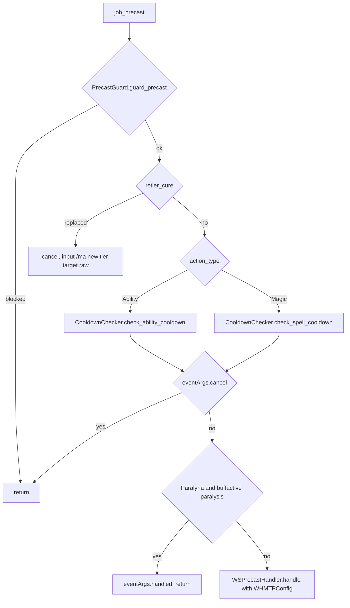
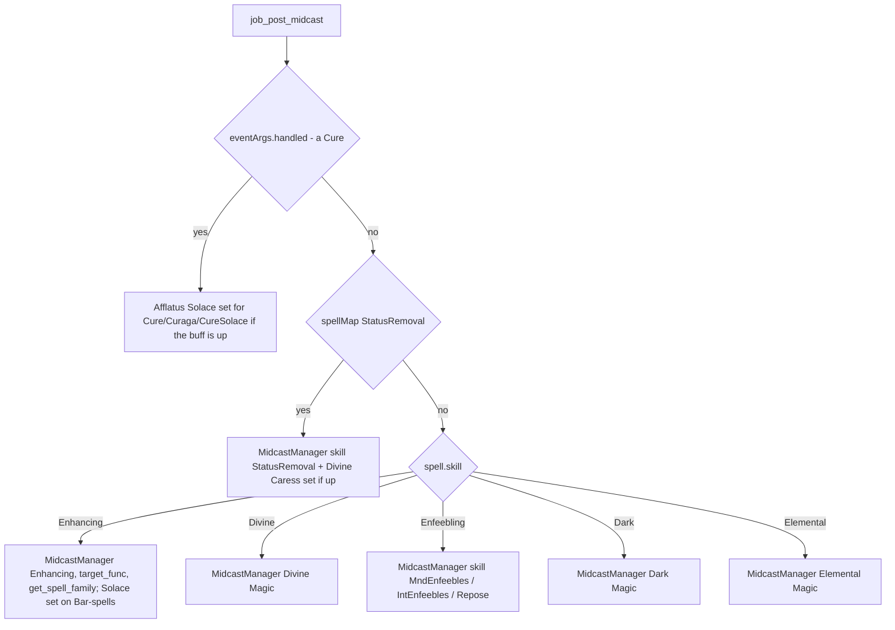

# WHM (White Mage) job

The WHM job is the healer of the project: 12 hook modules plus one logic module
under `shared/jobs/whm/functions/` (1 093 lines), two job-specific utilities
under `shared/utils/whm/` (806 lines), an entry point, seven config files and one
sets file. GearSwap loads it when the main job becomes WHM (`Tetsouo_WHM.lua`).
From then on Mote-Include calls its hooks on every action, on status and buff
changes, on `//gs c` commands and on state cycles. No character plays WHM live
today: the job exists only as the `_master/` template.

What WHM adds on top of the shared pipeline:

- **Cure re-tiering** in precast (`CureManager`): with `CureAutoTier` On, a Cure
  or Curaga is swapped for the tier sized to the target's missing HP; in all
  cases a chosen tier on recast falls back to a ready lower, then higher, tier.
- **Cure midcast by mode**: `CureMode` Potency/SIRD picks `Cure`/`CureSIRD`
  (`Curaga`/`CuragaSIRD`) directly in `job_midcast`, with Afflatus Solace and
  Divine Caress overlays in `job_post_midcast`.
- **Custom spell maps** (`job_get_spell_map`): `CureMelee` while engaged (only when that set holds gear),
  `CureSolace` under Afflatus Solace, `MndEnfeebles`/`IntEnfeebles` by spell
  type.
- **Pseudo-skill routing** through `MidcastManager`: `StatusRemoval`,
  `MndEnfeebles`, `IntEnfeebles`, `Repose`.
- **Latent-refresh idle** below 51 % MP, and an `afflatus` command.

Every file in scope was read in full except the gear content of the sets file
(only structure and set names were read, as gear choice is out of scope). Line
numbers were re-checked against the working tree on 2026-09-25.

## Files

| Path | Lines | Role |
|------|------:|------|
| `_master/entry/Tetsouo_WHM.lua` | 264 | Entry (template): config preload, `get_sets`, `job_sub_job_change`, `user_setup`, `job_update` (UI only), `init_gear_sets`, `file_unload` (releases the `Melee ON` weapon lock) |
| `shared/jobs/whm/functions/whm_functions.lua` | 51 | Facade: includes the 11 hook files, requires `dualbox_manager` (44), debug line (46-47) |
| `shared/jobs/whm/functions/WHM_PRECAST.lua` | 179 | `job_precast`: guard, `retier_cure`, cooldown, Paralyna guard, WS; `job_post_precast` (TP gear) |
| `shared/jobs/whm/functions/WHM_MIDCAST.lua` | 258 | `job_midcast` (Cure/Curaga sets by mode), `job_post_midcast` (overlays + `MidcastManager`), `job_get_spell_map` |
| `shared/jobs/whm/functions/WHM_AFTERCAST.lua` | 27 | `job_aftercast = LifecycleManager.aftercast()` |
| `shared/jobs/whm/functions/WHM_IDLE.lua` | 42 | `customize_idle_set` -> `SetBuilder.build_idle_set` |
| `shared/jobs/whm/functions/WHM_ENGAGED.lua` | 40 | `customize_melee_set` -> `SetBuilder.build_engaged_set` |
| `shared/jobs/whm/functions/WHM_STATUS.lua` | 20 | `job_status_change = LifecycleManager.status_change()` |
| `shared/jobs/whm/functions/WHM_BUFFS.lua` | 19 | `job_buff_change = LifecycleManager.buff_change()` |
| `shared/jobs/whm/functions/WHM_COMMANDS.lua` | 224 | `job_self_command` router, `job_state_change` (`Melee ON` weapon lock on key or description, UI) |
| `shared/jobs/whm/functions/WHM_MOVEMENT.lua` | 39 | Empty `job_handle_equipping_gear` |
| `shared/jobs/whm/functions/WHM_LOCKSTYLE.lua` | 47 | Lazy `LockstyleManager.create('WHM', 'config/whm/WHM_LOCKSTYLE', 1, 'SAM')` |
| `shared/jobs/whm/functions/WHM_MACROBOOK.lua` | 42 | Lazy `MacrobookManager.create('WHM', ..., 'SAM', 1, 1)` |
| `shared/jobs/whm/functions/logic/set_builder.lua` | 90 | Idle: town, latent refresh, movement; engaged: unchanged |
| `shared/utils/whm/cure_manager.lua` | 392 | `CureManager.select_cure_tier` (auto-tier + recast fallback) |
| `shared/utils/whm/whm_message_formatter.lua` | 414 | Cure tier / Afflatus messages and CureManager debug lines (direct `add_to_chat`, a documented exception) |
| `shared/utils/messages/formatters/jobs/message_whm.lua` + `data/jobs/whm_messages.lua` | 29 + 22 | One message (`show_curemanager_not_loaded`), never called |
| `_master/config/whm/WHM_STATES.lua` | 185 | States (`configure`), unused `validate` |
| `_master/config/whm/WHM_KEYBINDS.lua` | 78 | Data only: 6 binds handed to `KeybindManager.create('WHM', ...)` (`show_intro` / `bind_all` / `unbind_all`), plus the character's `COMMON_KEYBINDS.lua` keys |
| `_master/config/whm/WHM_CUSTOM.lua` | 118 | Player modes and gear rules, commented examples only ([keybinds and custom states](../systems/keybinds-and-custom.md)) |
| `_master/config/whm/WHM_CURE_CONFIG.lua` | 102 | `cure_tiers`, `curaga_tiers`, `safety_margin`, `debug_messages` |
| `_master/config/whm/WHM_LOCKSTYLE.lua` | 52 | `default = 3`, `by_subjob` |
| `_master/config/whm/WHM_MACROBOOK.lua` | 85 | `default` book 11 page 1, `solo[sub]`, empty `dualbox` |
| `_master/config/whm/WHM_TP_CONFIG.lua` | 73 | `pieces` (Moonshade 250), `get_weapon_bonus`, sets `_G.WHMTPConfig` |
| `_master/sets/whm_sets.lua` | 809 | Template sets (flat) |

Live copies: none. `Tetsouo/` and `Kaories/` have no WHM files (Tetsouo's live
roster is BLM/BRD/BST/COR/DNC/PLD/SMN/THF/WAR per `character_db.lua:39`);
`Hysoka/` and `Gabvanstronger/` are frozen and out of scope. There is no
`WHM_REFILL.lua` in `_master/`.

## How it works

### Load sequence

Same shape as every job ([core lifecycle](../systems/core-lifecycle.md#how-a-job-file-boots)):
the entry chunk loads `LOCKSTYLE_CONFIG` (37-43), the UI config (49-50) and
`REGION_CONFIG` (55-58); `get_sets()` includes Mote-Include (69), which runs
`user_setup()` and `init_gear_sets()` (235-237, `include('sets/whm_sets.lua')`)
before `INIT_SYSTEMS` (71), `data_loader` and the message hooks (77-95),
`_G.LockstyleConfig`, `_G.RECAST_CONFIG`, `_G.WHMTPConfig` (98-102),
`JobChangeManager.cancel_all()` (105-108), the facade (111) and the lockstyle
cancel registration (116-118).

`user_setup()` (155-213):

1. `WHMStates.configure()` (see [Mote states](#mote-states)).
2. `require` of `WHM_KEYBINDS`, stored in the global `WHMKeybinds`, then
   `bind_all()` (6 binds plus the character's common keys), which ends with
   `show_intro()`. The `KeybindManager` intro `require`s `WHM_MACROBOOK.lua`
   and `WHM_LOCKSTYLE.lua`; both return nothing, so the intro falls back to
   `show_system_intro`, but they define `select_default_macro_book` and
   `select_default_lockstyle` as a side effect. A failed `require` prints
   `[WHM] Keybinds failed to load: <error>` (178).
3. `KeybindUI.smart_init("WHM", init_delay)`.
4. `JobChangeManager.initialize()`; the gate at 200 passes (step 2), so the macro
   book is set and the lockstyle scheduled after 8 s.
5. `pcall(require, 'shared/utils/dualbox/dualbox_manager')`.

The facade includes `WHM_LOCKSTYLE`, `WHM_MACROBOOK`, `WHM_PRECAST`,
`WHM_MIDCAST`, `WHM_AFTERCAST`, `WHM_IDLE`, `WHM_ENGAGED`, `WHM_STATUS`,
`WHM_BUFFS`, `WHM_COMMANDS`, `WHM_MOVEMENT` (22-40), then requires
`dualbox_manager` (44). The entry header no longer lists a `SETUP` hook
(fixed in `b6c7dc6`).

### Precast

`job_precast` (`WHM_PRECAST.lua:118-150`):

- `retier_cure` (77-94) runs **before** the recast check (132-139), the way
  RDM and BLM send tiered spells to their refiners: otherwise `CooldownChecker`
  would cancel a requested tier on recast before CureManager could swap it.
  It takes Magic whose name contains `Cure` or `Curaga` (so Full
  Cure too, not Cura), resolves the target with
  `windower.ffxi.get_mob_by_id(spell.target.id)` and calls
  `CureManager.select_cure_tier`. A different name cancels the cast and sends
  `input /ma "<new>" <spell.target.raw>` (the numeric id at precast time). The
  re-sent cast goes through precast again; `select_cure_tier` then returns the
  same tier and nil, so there is no loop.
- A cure CureManager leaves as it is still goes through `CooldownChecker`: when
  every tier is on recast (CureManager tests for exactly 0) the checker cancels
  it with its usual message and the `RECAST_CONFIG` tolerance, so a tier a
  fraction of a second from ready still goes out.
- `paralyna_on_self` (105-111) skips precast gear for Paralyna while paralysed:
  it tests `buffactive['paralysis']`, the lowercase resource name
  (`GearSwap/refresh.lua:588`, `res/buffs.lua:8`). It does not check the target.
- `job_post_precast` (160-166) only applies the TP bonus gear.
- Mote's default precast picks `sets.precast.FC[...]` by spell name, spell map
  (`Cure`, `Curaga`, `CureSolace`, `StatusRemoval`) or skill, then
  `.Resistant` under `CastingMode` (no such set exists), and
  `sets.precast.JA[...]` for Benediction, Devotion, Martyr and the Afflatus
  stances.

### Cure tier selection (CureManager)

`CureManager.select_cure_tier(spell, target)` (`cure_manager.lua:307-386`) is
documented with its flowchart in
[factories and helpers](../systems/factories-and-helpers.md#whm-curemanager). In
short:

- Tier tables come from `<player.name>/config/whm/WHM_CURE_CONFIG.lua`
  (`cure_manager.lua:34-42`); on failure it `print`s (36) and uses a table with
  no tier lists.
- With `CureAutoTier` On, missing HP is exact for yourself, estimated for party
  members from `hpp` and a fixed 2 000 max HP (`member.max_hp` does not exist in
  Windower's party table, 134), and never matched for alliance members (keys
  `a1p1..a3p6` at 147-150; Windower uses `a10..a15`, `a20..a25`, compare
  `shared/utils/dnc/waltz_manager.lua:72`); anyone else falls back to
  `target.hpp` x 2 000. 0 missing -> lowest tier; otherwise the tier whose
  `[min, max]` contains `missing + safety_margin` (50).
- Availability is `recast == 0` exactly (`is_spell_available`, 81-96), not the
  `RECAST_CONFIG` tolerance. An unavailable choice walks down, then up; all on
  recast -> `nil` with no message (`cure_manager.lua:347-352`): the original
  cast continues to `CooldownChecker`, which reports and cancels it.

### Midcast

Cures do not use `MidcastManager` for their base set. Mote calls `job_midcast`
first (`WHM_MIDCAST.lua:35-79`):

| spellMap | Equipped | Then |
|----------|----------|------|
| `Cure` / `Curaga` | `CureSIRD` / `CuragaSIRD` (fallback `Cure` / `Curaga`) when `CureMode = SIRD`, else `Cure` / `Curaga` | `eventArgs.handled` (Mote's default midcast is skipped) |
| `CureSolace` | `CureSIRD` or `CureSolace` | handled |
| `CureMelee` | `sets.midcast.CureMelee` (the map is only produced when this set holds gear) | handled |

The spell map comes from `job_get_spell_map` (209-243): Cure or Curaga while
`player.status == 'Engaged'` -> `CureMelee`, but only when
`sets.midcast.CureMelee` holds gear (`next(set) ~= nil`), otherwise the cure
keeps its `Cure`/`Curaga` map and the CureMode choice. Before commit `1f2232c`
the template's placeholder `{}` was used, so engaged cures got no midcast gear; Cure with
`buffactive['Afflatus Solace']` -> `CureSolace` (227); Enfeebling Magic ->
`MndEnfeebles` (White Magic) or `IntEnfeebles` (Black Magic). Mote-Mappings
gives the rest (`Cura` -> `Curaga`, Poisona..Erase -> `StatusRemoval`).

`job_post_midcast` (170-197) loads the manager and the enhancing database through
`MidcastDeps.load()` (171), notifies the watchdog, then:

- Healing Magic outside the Cure spell maps (Raise, Reraise, Arise, Esuna,
  Sacrifice) has no branch: only Mote's default applies, which finds
  `sets.midcast.Raise`, `.Arise`, `.Reraise` by name and nothing for Esuna or
  Sacrifice (there is no `sets.midcast['Healing Magic']`). Full Cure is mapped
  to `Cure` by Mote-Mappings and takes the Cure path.
- StatusRemoval: P0 `sets.midcast.Cursna`, otherwise the `StatusRemoval` base.
- Enhancing: P0 by name (`Haste`, `Sneak`, `Invisible`, `Stoneskin`,
  `Aquaveil`, `Refresh`, `Auspice`), P1 `Regen` for Regen II-IV, P6
  `sets.midcast.BarElement` for Bar-element spells, otherwise the base.
  There is no `mode_state`; the Composure target can never occur on WHM.
- Repose is Divine Magic in the resources (`res/spells.lua:101`, `skill=32`), so
  it reaches `sets.midcast['Repose']` through the Divine branch (P0);
  `enfeeble_skill_for`'s Repose case (139-148) is never used; its comment
  says so since `b6c7dc6`.
- `CastingMode` is not passed to the manager.

### Aftercast, idle, engaged, status, buffs

- `job_aftercast`, `job_status_change`, `job_buff_change` are the shared
  `LifecycleManager` handlers.
- `customize_idle_set` -> `SetBuilder.build_idle_set` (`shared/jobs/whm/functions/logic/set_builder.lua:40-67`):
  Mote's base (`sets.idle.Town` in cities, else `sets.idle[IdleMode]`) ->
  `BaseSetBuilder.select_idle_base_town` (no `sets.Adoulin`, so Adoulin uses
  `sets.idle.Town`, which Mote-Mappings lists as a city) -> `sets.latent_refresh`
  when `player.mpp < 51` (the template set is empty) -> `sets.MoveSpeed` when
  moving, in town too.
- `customize_melee_set` returns Mote's set unchanged (76-84). Mote picks
  `sets.engaged[OffenseMode]` (no `None` or `Melee ON` set) then
  `sets.engaged[HybridMode]` (`Normal`, the only HybridMode value), so
  `sets.engaged.Normal` is always used.
- `job_handle_equipping_gear` is empty.

## Mote states

Created by `WHMStates.configure()` (`_master/config/whm/WHM_STATES.lua:34-134`)
on every `user_setup()`. Keybinds from `WHM_KEYBINDS.lua:22-76`.

| State | Values | Default | Key | Read by |
|-------|--------|---------|-----|---------|
| `OffenseMode` (Mote) | None, Melee ON | None | none | Mote `get_melee_set` (no matching set), `job_state_change` 213-223, entry `file_unload` |
| `CastingMode` (Mote) | Normal, Resistant | Normal | `^numpad6` | Mote default precast/midcast (`.Resistant` sets absent) |
| `IdleMode` (Mote) | PDT, Refresh | PDT | `^numpad1` | Mote `get_idle_set` |
| `CureMode` | Potency, SIRD | Potency | `^numpad3` | `WHM_MIDCAST.lua:43,64` |
| `AfflatusMode` | Solace, Misery | Solace | `^numpad5` | `afflatus` command (151) |
| `CureAutoTier` | On, Off | On | `^numpad4` | `cure_manager.lua:318` |
| `CombatMode` | Off, On | Off | `^numpad2` | shared [Combat Mode](../systems/keybinds-and-custom.md#combat-mode-sharedutilscorecombat_modelua-2026-09-25) lock (main/sub/range/ammo) |
| `FastCast` | 0..80 | 80 | none | `midcast_watchdog.lua` (reads `state.FastCast`) |
| `AutoMedicine` | shared | persisted | `#numpad0` (from `config/COMMON_KEYBINDS.lua`) | `AutoMedicine.init` (130-133) |

`CureMode`, `AfflatusMode` and `CureAutoTier` are built as `M('Potency', 'Cure
Mode')` then `:options(...)` (75-77, 86-88, 96-98). Mote's `M(string, ...)`
makes a list of values with no description (`libs/Modes.lua:101-115`), so the
second argument is not a description. WHM keeps no `state.Buff` entry: the
Afflatus Solace tests read `buffactive` (`WHM_MIDCAST.lua:90,124,227`), since
Mote only updates `state.Buff` keys that already exist
(`Mote-Include.lua:1027-1028`).

## Commands

`job_self_command` (`WHM_COMMANDS.lua:54-168`) lowercases the first word and
tests, in order: `altjobupdate`, `requestjob` (67-84; `altjobupdate` forwards
the sender name since 2026-09-25), watchdog (89-94), CommonCommands (99-108),
UI (113-117), `debugmidcast` (122-132), `cyclestate` (141-144), `afflatus`
(151-167). Anything else falls through to Mote's own
`cycle`, `set`, `update`, ... handlers, and last to the dual-box alt's commands
([dualbox](../systems/dualbox.md#alt-command-routing)).

| Command | Effect |
|---------|--------|
| common commands | `reload`, `checksets`, `wa`, `wo`, `refill`, `craft`, `naked`, `help`, `lockstyle`, `waltz`... -> `CommonCommands.handle_command(command, 'WHM', table.unpack(args))` |
| `debugmidcast` | Toggle `MidcastManager` debug |
| `cyclestate <State>` | `CycleHandler.handle_cyclestate` (every keybind) |
| `afflatus` | `input /ja "Afflatus Solace|Misery" <me>` from `AfflatusMode`, plus `show_afflatus_change` |

`job_state_change(stateField, new, old)` (184-217): skips `Moving`; strips the
spaces from the field (190) so the description (`Offense Mode`, which Mote's
cycle and the UI-aware `cyclestate` both pass) and the key (`OffenseMode`) both
match; on `OffenseMode` disables or enables main/sub/range (198-208); always
refreshes the UI
([core lifecycle](../systems/core-lifecycle.md#cyclehandler-and-state-display)).
Since 2026-09-25 the `CombatMode` lock is no longer here: it is the shared
[Combat Mode](../systems/keybinds-and-custom.md#combat-mode-sharedutilscorecombat_modelua-2026-09-25) hook.

## Set names the code looks up

T = `_master/sets/whm_sets.lua` (no live copy).

| Set | Looked up by | T |
|-----|--------------|---|
| `sets.idle.PDT`, `.Refresh`, `.Town` | Mote `get_idle_set`, `BaseSetBuilder` | 38, 63, 89 |
| `sets.latent_refresh` | `set_builder.lua:55-56` | 120 (empty) |
| `sets.MoveSpeed`, `sets.Kiting` | `BaseSetBuilder.apply_movement`, Mote Kiting | 767, 762 |
| `sets.Adoulin` | `BaseSetBuilder` | absent (falls back to Town) |
| `sets.engaged.Normal` | Mote (HybridMode Normal) | 130 |
| `sets.engaged.PDT` | nothing (HybridMode has no PDT) | 150 |
| `sets.precast.FC` + `['Healing Magic']`, `.Cure`, `.Curaga`, `.StatusRemoval`, `['Enhancing Magic']`, `['Stoneskin']` | Mote default precast | 223-265 |
| `sets.precast.FC.CureSolace` | Mote by spell map (Cure under Afflatus Solace) | 256 |
| `sets.precast.JA['Benediction'/'Devotion'/'Martyr'/'Afflatus Solace'/'Afflatus Misery']` | Mote default precast | 160-214 |
| `sets.precast.WS` + Mystic Boon, Flash Nova, `sets.precast.Waltz` | Mote default precast | 281-324 |
| `sets.midcast.Cure`, `.CureSIRD`, `.Curaga`, `.CuragaSIRD` | `job_midcast` | 405, 371, 434, 461 |
| `sets.midcast.CureSolace` | `job_midcast` (Cure under Afflatus Solace, `CureMode` Potency) | 342 |
| `sets.midcast.CureMelee` | `job_midcast`, only when non-empty (the template's is `{}`, so engaged cures use `Cure`/`Curaga`) | 495 |
| `sets.midcast['Cursna']`, `.StatusRemoval` | MidcastManager pseudo-skill | 502, 526 |
| `sets.midcast['Enhancing Magic']` + Haste, Sneak, Invisible, Stoneskin, Aquaveil, Refresh, Auspice, Regen, `.BarElement` | MidcastManager | 537-631 |
| `sets.midcast['Reraise']`, `['Arise']`, `['Raise']` | Mote default by name | 650-678 |
| `sets.midcast['Divine Magic']`, `['Holy']`, `['Holy II']`, `['Repose']` | MidcastManager Divine | 685-732 |
| `sets.midcast.MndEnfeebles`, `.IntEnfeebles` | MidcastManager pseudo-skills | 751, 754 |
| `sets.midcast['Enfeebling Magic']` | only when the spell map is neither (never) | absent |
| `sets.midcast['Dark Magic']`, `['Elemental Magic']` | MidcastManager | 722, 725 |
| `sets.midcast.FastRecast` | nothing | 334 |
| `sets.buff['Divine Caress']`, `['Afflatus Solace']` | `job_post_midcast` overlays | 781 (empty), 788 |
| `sets.resting`, `sets.buff.Doom` | Mote resting, DoomManager | 797, 804 |

## Configuration

| File / key | Default | Where the default lives | Read by |
|------------|---------|-------------------------|---------|
| `<char>/config/whm/WHM_STATES.lua` | see states | file | entry `user_setup` |
| `<char>/config/whm/WHM_KEYBINDS.lua` | 6 binds (+ `COMMON_KEYBINDS.lua`) | file | entry `user_setup`, `file_unload` |
| `<char>/config/whm/WHM_CUSTOM.lua` | examples only | file | `KeybindManager` via `custom_states` |
| `<char>/config/whm/WHM_CURE_CONFIG.lua` `cure_tiers`, `curaga_tiers`, `safety_margin`, `debug_messages` | Cure 0-200 .. VI 1600+; Curaga 0-300 .. V 1400+; 50; false | file; failure fallback has no tier lists (`cure_manager.lua:35-42`) | `CureManager` |
| same, `auto_tier_enabled`, `message_color` | true, 8 | file | nothing (auto-tier is `state.CureAutoTier`) |
| `<char>/config/whm/WHM_LOCKSTYLE.lua` `default`, `by_subjob` | 3 | file; factory argument 1 | `default` only (no `get_style`) |
| `<char>/config/whm/WHM_MACROBOOK.lua` | book 11 page 1 (RDM), pages 2-5 for SCH/BLM/BLU/GEO | file; factory fallback 1/1 | `MacrobookManager` |
| `<char>/config/whm/WHM_TP_CONFIG.lua` -> `_G.WHMTPConfig` | Moonshade 250 | file | `WSPrecastHandler` (captured at first precast, `WHM_PRECAST.lua:52`) |
| `<char>/config/LOCKSTYLE_CONFIG.lua` etc. | shared | entry fallback 37-43 | entry |

## State & lifetime

- Module state: lazy-load locals (`WHM_PRECAST.lua:28-63`,
  `WHM_MIDCAST.lua:25-26`), the CureManager config captured at its first load.
  All die on `gs reload`.
- `_G` written: the Mote hooks (`job_precast`, `job_post_precast`,
  `job_midcast`, `job_post_midcast`, `job_get_spell_map`, `job_aftercast`,
  `job_status_change`, `job_buff_change`, `customize_idle_set`,
  `customize_melee_set`, `job_self_command`, `job_state_change`,
  `job_handle_equipping_gear`, `job_update`), `WHMKeybinds`, `WHMTPConfig`,
  `LockstyleConfig`, `RECAST_CONFIG`, `RegionConfig`, the factory globals.
- `windower.*`: none. No events registered.
- Slot locks: since 2026-09-25 the entry's `file_unload` releases the
  `Melee ON` lock (main/sub/range) unless a craft session owns it
  (`Tetsouo_WHM.lua:248-252`), so a reload or job change no longer leaves the
  weapons locked while `OffenseMode` comes back as `None`. It does not cover a
  subjob change (no `file_unload` there). The `CombatMode` lock
  (main/sub/range/ammo) is the shared [Combat Mode](../systems/keybinds-and-custom.md#combat-mode-sharedutilscorecombat_modelua-2026-09-25) one,
  freed by the next load, so it no longer survives a reload or job change.
- Subjob change: `user_setup()` re-runs, then `job_sub_job_change` (136-145)
  calls `on_job_change`, which reloads 0.5 s later. (The
  `JobChangeManager.initialize({...})` call it also made was removed on
  2026-09-25.)

## Interactions

- Precast: `PrecastGuard`, `CooldownChecker`, `WSPrecastHandler`
  ([precast pipeline](../systems/precast-pipeline.md)); `CureManager`
  ([factories and helpers](../systems/factories-and-helpers.md#whm-curemanager)).
- Midcast: `MidcastDeps` + `MidcastManager` with pseudo-skills, `MidcastWatchdog`
  ([midcast and buffs](../systems/midcast-and-buffs.md)).
- Messages: `whm_message_formatter` (direct `add_to_chat` / `MessageCore.raw`;
  the project standard allows it there because this file is itself a message
  formatter, only stored outside `shared/utils/messages/`, as its header says),
  `message_commands`.
- `BaseSetBuilder`, factories, `JobChangeManager`, `LifecycleManager`,
  `CycleHandler`, `CommonCommands`, UI, dual-box.

## Invariants & gotchas

- `job_midcast` sets `eventArgs.handled` for every Cure spell map, so Mote's
  default midcast never runs for Cures: the equipped set is exactly what
  `job_midcast` chose. An empty or partial Cure set leaves precast gear on.
- `sets.X or sets.Y` fallbacks treat an empty table as a real set.
- Cures reach CureManager before `CooldownChecker`; a cure CureManager leaves
  unchanged still gets the recast check afterwards.
- `job_state_change` receives the state's description (`Offense Mode`) from both
  cycle paths; it strips spaces, so a caller passing the key also works.
- Adding a `.Resistant` set is the only way `CastingMode` can matter, and only
  for spells that reach Mote's default midcast (not Cures).
- `retier_cure` matches "Cure" anywhere in the name, which includes Full Cure.

## Extending

- New Cure behaviour: tier tables live in the character's `WHM_CURE_CONFIG.lua`
  (ascending `{min, max, spell}`), plus `CURE_IDS` in `cure_manager.lua:59-71`.
- New Cure variant: add a spell map in `job_get_spell_map`, a branch in
  `job_midcast`, and the set; remember `handled`.
- New skill routing: add a branch in `job_post_midcast`; for a pseudo-skill make
  sure `sets.midcast['<name>']` exists.
- Afflatus-style state that must follow a buff: initialise `state.Buff['<Buff>']
  = buffactive['<Buff>'] or false` in the job setup, or read `buffactive`
  directly as `job_post_midcast` does.

## Known issues

- Already documented in [factories and helpers](../systems/factories-and-helpers.md#known-issues):
  party HP estimate (fixed 2 000 max, alliance keys never match,
  `cure_manager.lua:134,147-150`), Full Cure re-tiered, fallback config raises
  on every Cure, exact-zero recast vs 2.0 s tolerance.
- `cure_manager.lua:36` uses `print`.
- `CastingMode` has no effect (no `.Resistant` set); `sets.engaged.PDT`,
  `sets.midcast.FastRecast`, the Repose branch of `enfeeble_skill_for`
  (`WHM_MIDCAST.lua:140`) and the Divine Caress branch inside the handled path
  (85-87) are unreachable.
- Fixed 2026-09-25: `file_unload` releases the `Melee ON` weapon lock (see
  State & lifetime). The `CombatMode` lock is freed at the next load by the
  shared `combat_mode.lua` (resolved 2026-09-25). To check in game: `Melee ON`, then `//gs reload` or a job change,
  weapons free.
- `MessageWHM` is loaded and never used (`WHM_PRECAST.lua:54-56`);
  `show_curemanager_not_loaded` has no caller; 10 of the 12 non-debug
  `whm_message_formatter` functions have no caller (`show_cure_heal`,
  `show_cure_stoneskin`, `show_benediction`, `show_devotion`, `show_martyr`,
  `show_cursna`, `show_status_removal`, `show_auto_tier_toggle`, `warning`,
  `error`).
- Inaccurate comment: `WHM_STATES.lua:75,86,96` (the second `M()` argument is
  not a description). Fixed in `b6c7dc6`: the `WHM_MIDCAST` comments about the
  target's missing HP and the enfeeble split, the keybind comments, the
  `SETUP` hook in the entry header, and `//gs c cure max` /
  `force_max_cure` in `WHM_CURE_CONFIG.lua`.
- `by_subjob` in `WHM_LOCKSTYLE.lua` is never read.
- Standards: the Cure sets are chosen by a manual `or` fallback in `job_midcast`
  instead of `MidcastManager` (`WHM_MIDCAST.lua:42-78`).
