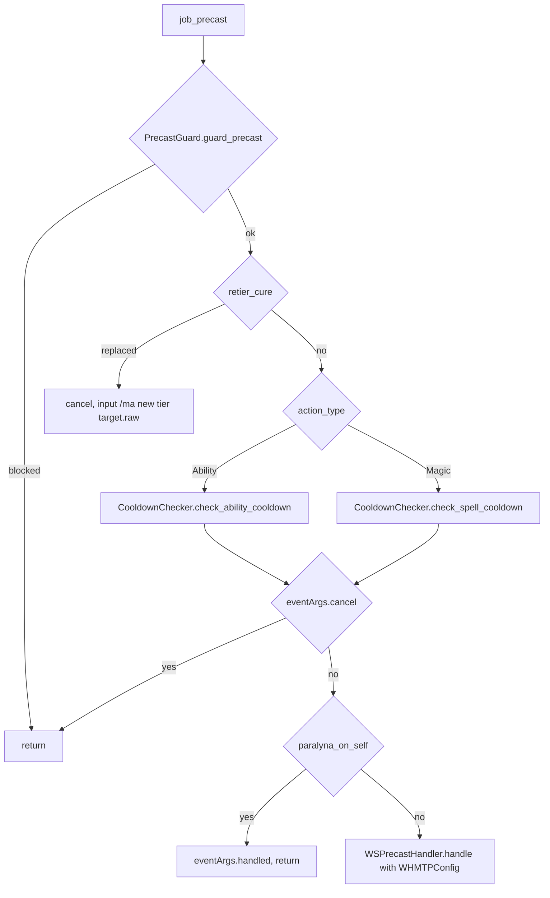
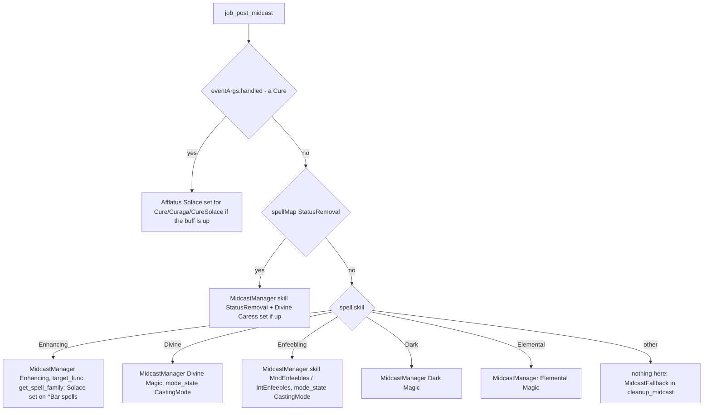

# WHM (White Mage) job

The WHM job is the healer of the project: 12 hook modules plus one logic module
under `shared/jobs/whm/functions/` (about 1 090 lines), two job-specific
utilities under `shared/utils/whm/` (830 lines), a template entry point, eight
config files and one sets file. GearSwap loads it when the main job becomes WHM
(the entry file `<Character>_WHM.lua`, made from `_master/entry/Tetsouo_WHM.lua`
by the clone script). From then on Mote-Include calls its hooks on every action,
on status and buff changes, on `//gs c` commands and on state cycles. No
maintained character plays WHM: the job exists as the `_master/` template only,
and no overlay carries WHM files.

Player-facing pages: [hub](../../user/jobs/whm/README.md),
[modes](../../user/jobs/whm/states.md), [sets](../../user/jobs/whm/sets.md).

What WHM adds on top of the shared pipeline:

- **Cure re-tiering** in precast (`CureManager`): with `CureAutoTier` On, a Cure
  or Curaga is swapped for the tier sized to the target's missing HP; in all
  cases a chosen tier on recast falls back to a ready lower, then higher, tier.
- **Cure midcast by mode**: `CureMode` Potency / SIRD picks `Cure` / `CureSIRD`
  (`Curaga` / `CuragaSIRD`) directly in `job_midcast`, with the Afflatus Solace
  overlay in `job_post_midcast`.
- **Custom spell maps** (`job_get_spell_map`): `CureMelee` while engaged (only
  when that set holds gear), `CureSolace` under Afflatus Solace,
  `MndEnfeebles` / `IntEnfeebles` by spell type.
- **Pseudo-skill routing** through `MidcastManager`: `StatusRemoval`,
  `MndEnfeebles`, `IntEnfeebles` (and a `Repose` branch that is never used).
- **Latent-refresh idle** below 51 % MP, an `afflatus` command, and an
  `OffenseMode = 'Melee ON'` weapon lock beside the shared Combat Mode.

Every file in scope was read in full on 2026-09-28, except the gear content of
the sets file (structure and set names only).

## Files

| Path | Lines | Role |
|------|------:|------|
| `_master/entry/Tetsouo_WHM.lua` | 268 | Entry (template): config preload, `get_sets`, `job_sub_job_change`, `user_setup`, `job_update` (HUD only), `init_gear_sets`, `file_unload` (releases the `Melee ON` lock and clears its `windower._weapon_locks.whm_melee` record) |
| `shared/jobs/whm/functions/whm_functions.lua` | 51 | Facade: includes the 11 hook files, requires `dualbox_manager`, debug line |
| `shared/jobs/whm/functions/WHM_PRECAST.lua` | 179 | `job_precast`: guard, `retier_cure`, cooldown, `paralyna_on_self`, WS; `job_post_precast` (TP gear) |
| `shared/jobs/whm/functions/WHM_MIDCAST.lua` | 261 | `job_midcast` (Cure sets by mode), `job_post_midcast` (overlays + `MidcastManager`), `job_get_spell_map` |
| `shared/jobs/whm/functions/WHM_AFTERCAST.lua` | 27 | `job_aftercast = LifecycleManager.aftercast()` |
| `shared/jobs/whm/functions/WHM_IDLE.lua` | 42 | `customize_idle_set` -> `SetBuilder.build_idle_set` |
| `shared/jobs/whm/functions/WHM_ENGAGED.lua` | 40 | `customize_melee_set` -> `SetBuilder.build_engaged_set` |
| `shared/jobs/whm/functions/WHM_STATUS.lua` | 20 | `job_status_change = LifecycleManager.status_change()` |
| `shared/jobs/whm/functions/WHM_BUFFS.lua` | 19 | `job_buff_change = LifecycleManager.buff_change()` |
| `shared/jobs/whm/functions/WHM_COMMANDS.lua` | 235 | `job_self_command` router, `job_state_change` (`Melee ON` lock, HUD) |
| `shared/jobs/whm/functions/WHM_MOVEMENT.lua` | 39 | Empty `job_handle_equipping_gear` |
| `shared/jobs/whm/functions/WHM_LOCKSTYLE.lua` | 47 | Lazy `LockstyleManager.create('WHM', 'whm/WHM_LOCKSTYLE', 1, 'SAM')` |
| `shared/jobs/whm/functions/WHM_MACROBOOK.lua` | 42 | Lazy `MacrobookManager.create('WHM', 'whm/WHM_MACROBOOK', 'SAM', 1, 1)` |
| `shared/jobs/whm/functions/logic/set_builder.lua` | 90 | Idle: town, latent refresh, movement; engaged: unchanged |
| `shared/utils/whm/cure_manager.lua` | 392 | `CureManager.select_cure_tier` (auto-tier + recast fallback) |
| `shared/utils/whm/whm_message_formatter.lua` | 438 | Cure tier / Afflatus messages and CureManager debug lines (direct `add_to_chat`, a documented exception: it is a formatter stored outside `utils/messages/`) |
| `shared/utils/messages/formatters/jobs/message_whm.lua` + `data/jobs/whm_messages.lua` | 29 + 22 | One message (`show_curemanager_not_loaded`), never called |
| `shared/utils/midcast/midcast_deps.lua` | 44 | `MidcastDeps.load()`: MidcastManager + enhancing database, lazy |
| `_master/config/whm/WHM_STATES.lua` | 139 | `WHMStates.configure` |
| `_master/config/whm/WHM_KEYBINDS.lua` | 78 | Data only: 6 entries handed to `KeybindManager.create('WHM', ...)` |
| `_master/config/whm/WHM_CUSTOM.lua` | 119 | Player modes and gear rules, commented examples only |
| `_master/config/whm/WHM_CURE_CONFIG.lua` | 102 | `cure_tiers`, `curaga_tiers`, `safety_margin`, `debug_messages` (+ unread `auto_tier_enabled`, `message_color`) |
| `_master/config/whm/WHM_HUD.lua` | 31 | HUD section / row order (empty = default) |
| `_master/config/whm/WHM_LOCKSTYLE.lua` | 52 | `default = 3`, `by_subjob` (never read) |
| `_master/config/whm/WHM_MACROBOOK.lua` | 85 | `default` book 11 page 1, `solo[sub]` pages 1-5, empty `dualbox` |
| `_master/config/whm/WHM_TP_CONFIG.lua` | 73 | `pieces` (Moonshade 250), `get_weapon_bonus`, sets `_G.WHMTPConfig` |
| `_master/sets/whm_sets.lua` | 820 | Template sets (flat) |

There is no `WHM_REFILL.lua` in `_master/`, and no live copy is maintained.

## How it works

### Load sequence

Same shape as every job ([core lifecycle](../systems/core-lifecycle.md#how-a-job-file-boots)):
the entry chunk loads `LOCKSTYLE_CONFIG`, the UI config and `REGION_CONFIG`;
`get_sets()` includes Mote-Include, which runs `user_setup()` and
`init_gear_sets()` (`include('whm/whm_sets.lua')`) before `INIT_SYSTEMS`,
`data_loader` and the message hooks; then `_G.LockstyleConfig`,
`_G.RECAST_CONFIG`, `_G.WHMTPConfig`, `JobChangeManager.cancel_all()`, the
facade and the lockstyle cancel registration.

`user_setup()`:

1. `WHMStates.configure()` (see [Mote states](#mote-states)).
2. `pcall(require, '<Character>/whm/WHM_KEYBINDS')` into the global
   `WHMKeybinds`, then `bind_all()` (ends with `show_intro()`, whose requires of
   `WHM_MACROBOOK.lua` and `WHM_LOCKSTYLE.lua` define
   `select_default_macro_book` and `select_default_lockstyle`). A failed
   require prints `[WHM] Keybinds failed to load: <error>`.
3. `KeybindUI.smart_init("WHM", init_delay)`.
4. `JobChangeManager.initialize()`; macro book at once, lockstyle after 8 s.
5. `pcall(require, 'shared/utils/dualbox/dualbox_manager')`.

`WHM_PRECAST` reads `_G.WHMTPConfig` on its first action (`ensure_modules_loaded`),
after the entry set it.

### Precast

`job_precast` (`WHM_PRECAST.lua`):

```mermaid
flowchart TD
    A[job_precast] --> G{PrecastGuard.guard_precast}
    G -- blocked --> Z[return]
    G -- ok --> R{retier_cure}
    R -- replaced --> Z2[cancel, input /ma new tier target.raw]
    R -- no --> C{action_type}
    C -- Ability --> CA[CooldownChecker.check_ability_cooldown]
    C -- Magic --> CS[CooldownChecker.check_spell_cooldown]
    CA --> X{eventArgs.cancel}
    CS --> X
    X -- yes --> Z
    X -- no --> P{paralyna_on_self}
    P -- yes --> H[eventArgs.handled, return]
    P -- no --> W[WSPrecastHandler.handle with WHMTPConfig]
```

- `retier_cure` runs **before** the recast check, the way RDM, BLM and GEO send
  tiered spells to their refiners (CODE_QUALITY section 4.1): otherwise
  `CooldownChecker` would cancel a requested tier on recast before CureManager
  could swap it. It takes Magic whose name starts with `Cure` or `Curaga`
  (`CureManager.is_tiered_cure`: not Full Cure, not Cura), resolves the target with
  `windower.ffxi.get_mob_by_id(spell.target.id)` and calls
  `CureManager.select_cure_tier`. A different name cancels the cast and sends
  `input /ma "<new>" <spell.target.raw>`. The re-sent cast goes through precast
  again; `select_cure_tier` then returns nil (same tier), so there is no loop.
- A cure CureManager leaves as it is still goes through `CooldownChecker`: when
  every tier is on recast (CureManager tests for exactly 0) the checker cancels
  it with its usual message and the `RECAST_CONFIG` tolerance.
- `paralyna_on_self` sets `eventArgs.handled` for Paralyna while
  `buffactive['paralysis']`: Mote skips its default precast, so no gear swaps
  while the spell is retried. It does not check the target.
- `job_post_precast` only applies the TP bonus gear.
- Mote's default precast picks `sets.precast.FC[...]` by spell name, spell map
  (`Cure`, `Curaga`, `CureSolace`, `StatusRemoval`...) or skill, then
  `.Resistant` under `CastingMode` (no such precast set exists), and
  `sets.precast.JA[...]` for Benediction, Devotion, Martyr and the Afflatus
  stances.

### Cure tier selection (CureManager)

`CureManager.select_cure_tier(spell, target)` is documented with its flowchart
in [factories and helpers](../systems/factories-and-helpers.md#whm-curemanager).
In short:

- The tier tables come from `require(<player.name> .. '/config/whm/WHM_CURE_CONFIG')`
  at module load (so once per sandbox); on failure it `print`s and uses a table
  with no tier lists.
- With `CureAutoTier` On, missing HP is exact for yourself; for a party member
  it is estimated from `hpp` and a fixed 2 000 max HP (Windower's party table
  has no `max_hp`); alliance members are looked up under keys `a1p1..a3p6`,
  which Windower does not use (it uses `a10..a15`, `a20..a25`), so they fall
  through to the last resort, `target.hpp` x 2 000, which gives the same
  number. 0 missing -> lowest tier; otherwise the tier whose `[min, max]`
  contains `missing + safety_margin` (50); above every range -> highest tier.
- Availability is `recast == 0` exactly (`is_spell_available`, spell ids from
  `CURE_IDS`), not the `RECAST_CONFIG` tolerance. An unavailable choice walks
  down, then up; all on recast -> `nil`, the original cast continues to
  `CooldownChecker`.
- A change prints `show_cure_tier_change` (old -> new, missing HP, reason).

### Midcast

Mote-Globals' `user_midcast` equips `sets.midcast.FastRecast` first for every
magic spell (on every job; the WHM template's is `{}`). Then Mote calls
`job_midcast` (`WHM_MIDCAST.lua`):

| spellMap | Equipped | Then |
|----------|----------|------|
| `Cure` / `Curaga` | `CureSIRD` / `CuragaSIRD` (fallback `Cure` / `Curaga`) when `CureMode = SIRD`, else `Cure` / `Curaga` | `eventArgs.handled`: Mote's default midcast is skipped, and so is `MidcastFallback` |
| `CureSolace` | `CureSIRD` (fallback `CureSolace`) in SIRD, else `CureSolace` | handled |
| `CureMelee` | `sets.midcast.CureMelee` (fallback `Cure`) | handled |

The spell map comes from `job_get_spell_map`: Cure or Curaga while
`player.status == 'Engaged'` -> `CureMelee`, but only when
`sets.midcast.CureMelee` holds gear (`next(set) ~= nil`), otherwise the cure
keeps its map and the CureMode choice; Cure (not Curaga) with
`buffactive['Afflatus Solace']` -> `CureSolace`; Enfeebling Magic ->
`MndEnfeebles` (White Magic) or `IntEnfeebles` (Black Magic). Mote-Mappings
gives the rest (`Full Cure` -> `Cure`, `Cura` -> `Curaga`, Poisona..Erase ->
`StatusRemoval`).

`job_post_midcast` loads the manager and the enhancing database through
`MidcastDeps.load()`, notifies the watchdog, then:

```mermaid
flowchart TD
    A[job_post_midcast] --> H{eventArgs.handled - a Cure}
    H -- yes --> O[Afflatus Solace set for Cure/Curaga/CureSolace if the buff is up]
    H -- no --> S{spellMap StatusRemoval}
    S -- yes --> SR[MidcastManager skill StatusRemoval + Divine Caress set if up]
    S -- no --> E{spell.skill}
    E -- Enhancing --> EN[MidcastManager Enhancing, target_func, get_spell_family; Solace set on ^Bar spells]
    E -- Divine --> DV[MidcastManager Divine Magic, mode_state CastingMode]
    E -- Enfeebling --> EF[MidcastManager skill MndEnfeebles / IntEnfeebles, mode_state CastingMode]
    E -- Dark --> DK[MidcastManager Dark Magic]
    E -- Elemental --> EL[MidcastManager Elemental Magic]
    E -- other --> FB[nothing here: MidcastFallback in cleanup_midcast]
```

- **Healing Magic outside the Cure maps** (Raise, Reraise, Arise, Esuna,
  Sacrifice) and **subjob skills** (Ninjutsu...) have no branch. Since
  2026-09-27 `MidcastFallback` routes them with their own skill from
  `cleanup_midcast`; with no `sets.midcast['Healing Magic']` (or
  `['Ninjutsu']`) in the template, `select_set` returns false and Mote's
  default pick stays (`sets.midcast.Raise`, `.Arise`, `.Reraise` by name;
  nothing for Esuna or Sacrifice). `//gs c debugmidcast` now reports these
  spells ("missing - Mote's set stays").
- **StatusRemoval**: P0 `sets.midcast.Cursna`, otherwise the `StatusRemoval`
  base, then `sets.buff['Divine Caress']` while the buff is up.
- **Enhancing**: P0 by name (`Haste`, `Sneak`, `Invisible`, `Stoneskin`,
  `Aquaveil`, `Refresh`, `Auspice`), P1 `Regen` for Regen II-IV, P6
  `sets.midcast.BarElement` for Bar-element spells, otherwise the base. No
  `mode_state`; the Composure target never occurs on WHM. Then
  `sets.buff['Afflatus Solace']` on any `^Bar` spell (elemental and ailment)
  while Solace is up.
- **Divine**: `CastingMode` is `mode_state`. Repose, Holy and Holy II have name
  sets (P0), which win before any mode level; P0 takes the name set's mode
  child when there is one, so `sets.midcast.Repose.Resistant` is worn in
  Resistant (never reached before 2026-09-29: the manager replaced Mote's pick
  with `sets.midcast.Repose`). Banish, Flash and the rest reach
  `sets.midcast['Divine Magic'].Resistant` through P8.
- **Enfeebling**: pseudo-skill `MndEnfeebles` / `IntEnfeebles` with
  `CastingMode`: `.Resistant` through P8. Repose is Divine Magic in the
  resources, so `enfeeble_skill_for`'s Repose case is never used.

### Aftercast, idle, engaged, status, buffs

- `job_aftercast`, `job_status_change`, `job_buff_change` are the shared
  `LifecycleManager` handlers (watchdog, Doom).
- `customize_idle_set` -> `SetBuilder.build_idle_set`: Mote's base
  (`sets.idle.Town` in cities via Mote's scope, else `sets.idle[IdleMode]`,
  with Mote's defense and Kiting layers) -> `BaseSetBuilder.select_idle_base_town`
  (no `sets.Adoulin` in the template, so Adoulin uses `sets.idle.Town`; the
  Town set goes on top of `sets.idle[IdleMode]`, rebuilt from Mote's town pick;
  with a defense or Kiting layer on, on top of Mote's layered Town set) -> `sets.latent_refresh`
  when `player.mpp < 51` (empty in the template) -> `sets.MoveSpeed` while
  moving, in town too.
- `customize_melee_set` returns Mote's set unchanged. Mote picks
  `sets.engaged[OffenseMode]` (no `None` or `Melee ON` set), then
  `sets.engaged[HybridMode]` (`Normal`, Mote's only default value), so
  `sets.engaged.Normal` is always used, with Mote's defense / Kiting layers.
- `job_handle_equipping_gear` is empty.

## Mote states

Created by `WHMStates.configure()` on every `user_setup()`. Keys from
`WHM_KEYBINDS.lua`.

| State | Values | Default | Key | Read by |
|-------|--------|---------|-----|---------|
| `OffenseMode` (Mote) | None, Melee ON | None | Mote's `f9` only | Mote `get_melee_set` (no matching set), `job_state_change`, entry `file_unload` |
| `CastingMode` (Mote) | Normal, Resistant | Normal | `^numpad6`, Mote's `^f11` | `mode_state` of the Enfeebling and Divine routes; Mote default precast / midcast |
| `IdleMode` (Mote) | PDT, Refresh | PDT | `^numpad1`, Mote's `^f12` | Mote `get_idle_set` |
| `HybridMode` (Mote) | Normal | Normal | Mote's `^f9` | Mote `get_melee_set` (`sets.engaged.Normal`) |
| `CureMode` | Potency, SIRD | Potency | `^numpad3` | `job_midcast` |
| `AfflatusMode` | Solace, Misery | Solace | `^numpad5` | `afflatus` command |
| `CureAutoTier` | On, Off | On | `^numpad4` | `CureManager.select_cure_tier` |
| `CombatMode` | Off, On | Off | `^numpad2` | shared Combat Mode lock (main / sub / range / ammo) |
| `FastCast` | 0..80 by 10 | 80 | none | midcast watchdog fallback estimate |
| `AutoMedicine` | ON, OFF | persisted | `#numpad0` (common key) | `AutoMedicine.init` at the end of `configure` |
| `TreasureMode` (optional state) | Off, Tag, Full | Off | `!numpad.` once shown | shared Treasure Hunter |

`CureMode`, `AfflatusMode` and `CureAutoTier` are built as `M('Potency', 'Cure
Mode')` then `:options(...)`. Mote's `M(string, ...)` makes a list of values
with no description, so the second argument is a value until `:options`
replaces the list; the state then has no description. WHM keeps no
`state.Buff` entry: the Afflatus Solace tests read `buffactive`.

## Commands

`job_self_command` (`WHM_COMMANDS.lua`) lowercases the first word and tests, in
order: `altjobupdate`, `requestjob`, watchdog, `CommonCommands`, UI,
`debugmidcast`, `cyclestate`, `afflatus`. Anything else falls through to Mote's
own `cycle`, `set`, `update`, ... handlers, and last to the dual-box alt's
commands ([dualbox](../systems/dualbox.md)).

| Command | Effect |
|---------|--------|
| common commands | `CommonCommands.handle_command(command, 'WHM', table.unpack(args))` |
| `debugmidcast` | `MidcastManager.toggle_debug()` + confirmation |
| `cyclestate <State> [reverse]` | `CycleHandler.handle_cyclestate` (every key) |
| `afflatus` | `input /ja "Afflatus Solace\|Misery" <me>` from `AfflatusMode`, plus `show_afflatus_change` |

Unlike RDM, WHM tests `CommonCommands` **before** the UI commands, and has no
`rawget(selfCommandMaps)` guard (nothing after it would shadow Mote).

`job_state_change(stateField, new, old)`: skips `Moving`; strips the spaces from
the field, so the description (`Offense Mode`, passed by Mote's `cycle` and by
`cyclestate`) and the key both match; on `OffenseMode` `Melee ON` ->
`disable('main', 'sub', 'range')` plus `CombatMode.hold('whm_melee',
{'main', 'sub', 'range'})`, anything else -> `enable(...)` plus
`CombatMode.release('whm_melee')` unless a craft session is active; always
refreshes the HUD. The hold is what keeps Combat Mode turning Off from freeing
the weapons while `Melee ON` still holds them. Since 2026-09-29 it also brings
the lock back after `gs enable all` (sent at the end of `//po` and of
`//gs c wo`): the Combat Mode wrapper disables every held slot again after the
gear of the next update. `//gs c wo` does not release `Melee ON` (it releases
only the Hoxne and THF range locks), so the weapons are locked again after `wo`
too. The Combat Mode lock is the
shared hook's ([keybinds and custom states](../systems/keybinds-and-custom.md#optional-states-combat-mode-and-treasure-mode)).

## Set names the code looks up

T = `_master/sets/whm_sets.lua`. Player version: [sets.md](../../user/jobs/whm/sets.md).

| Set | Looked up by | In T |
|-----|--------------|------|
| `sets.idle.PDT`, `.Refresh`, `.Town` | Mote `get_idle_set`, `BaseSetBuilder` | yes |
| `sets.latent_refresh` | `SetBuilder.build_idle_set` | yes (empty) |
| `sets.MoveSpeed`, `sets.Kiting` | `BaseSetBuilder.apply_movement`, Mote Kiting (`!f10`) | yes |
| `sets.defense.PDT` / `.MDT` | Mote defense modes (`f10` / `f11`) | no |
| `sets.Adoulin` | `BaseSetBuilder` | no (Adoulin uses Town) |
| `sets.engaged.Normal` | Mote (HybridMode Normal) | yes |
| `sets.engaged.PDT` | nothing (HybridMode has no PDT) | yes |
| `sets.precast.FC` + `['Healing Magic']`, `.Cure`, `.Curaga`, `.CureSolace`, `.StatusRemoval`, `['Enhancing Magic']`, `['Stoneskin']` | Mote default precast | yes |
| `sets.precast.JA['Benediction' / 'Devotion' / 'Martyr' / 'Afflatus Solace' / 'Afflatus Misery']` | Mote default precast | yes |
| `sets.precast.WS` + Mystic Boon, Flash Nova, `sets.precast.Waltz` | Mote default precast | yes |
| `sets.midcast.FastRecast` | Mote-Globals `user_midcast`, first for every spell | yes (empty) |
| `sets.midcast.Cure`, `.CureSIRD`, `.Curaga`, `.CuragaSIRD` | `job_midcast` | yes |
| `sets.midcast.CureSolace` | `job_midcast` (Cure under Afflatus Solace) | yes |
| `sets.midcast.CureMelee` | `job_midcast`, only when non-empty | yes (empty) |
| `sets.midcast['Cursna']`, `.StatusRemoval` | MidcastManager pseudo-skill | yes |
| `sets.midcast['Enhancing Magic']` + Haste, Sneak, Invisible, Stoneskin, Aquaveil, Refresh, Auspice, Regen, `.BarElement` | MidcastManager | yes |
| `sets.midcast['Reraise']`, `['Arise']`, `['Raise']` | Mote default by name | yes |
| `sets.midcast['Healing Magic']` | MidcastFallback (Raise, Esuna...) | no |
| `sets.midcast['Divine Magic']` (+ `.Resistant`), `['Holy']`, `['Holy II']`, `['Repose']` | MidcastManager Divine | yes |
| `sets.midcast['Repose'].Resistant` | MidcastManager P0 (name set's mode child), CastingMode Resistant | yes |
| `sets.midcast.MndEnfeebles`, `.IntEnfeebles` (+ `.Resistant`) | MidcastManager pseudo-skills | yes |
| `sets.midcast['Enfeebling Magic']` | only when the spell map is neither (never) | no |
| `sets.midcast['Dark Magic']`, `['Elemental Magic']` | MidcastManager | yes |
| `sets.buff['Divine Caress']`, `['Afflatus Solace']` | `job_post_midcast` overlays | yes (Divine Caress empty) |
| `sets.resting`, `sets.buff.Doom` | Mote resting, DoomManager | yes |
| `sets.TreasureHunter`, `sets.DW` | shared Treasure Hunter, DualWield | no |

## Configuration

| File / key | Default | Where the default lives | Read by |
|------------|---------|-------------------------|---------|
| `<char>/whm/WHM_STATES.lua` | see states | file | entry `user_setup` |
| `<char>/whm/WHM_KEYBINDS.lua` | 6 entries (+ `COMMON_KEYBINDS.lua`) | file | entry `user_setup`, `file_unload` |
| `<char>/whm/WHM_CUSTOM.lua` | examples only | file | custom states |
| `<char>/whm/WHM_HUD.lua` | empty | file | HUD layout |
| `<char>/whm/WHM_CURE_CONFIG.lua` `cure_tiers`, `curaga_tiers`, `safety_margin`, `debug_messages` | Cure 0-200 .. VI 1600+; Curaga 0-300 .. V 1400+; 50; false | file; failure fallback has no tier lists | `CureManager` |
| same, `auto_tier_enabled`, `message_color` | true, 8 | file | nothing (the switch is `state.CureAutoTier`) |
| `<char>/whm/WHM_LOCKSTYLE.lua` `default`, `by_subjob` | 3 | file; factory argument 1 | `default` only (no `get_style`) |
| `<char>/whm/WHM_MACROBOOK.lua` | book 11: page 1 RDM, 2 SCH, 3 BLM, 4 BLU, 5 GEO | file; factory fallback 1/1 | `MacrobookManager` |
| `<char>/whm/WHM_TP_CONFIG.lua` -> `_G.WHMTPConfig` | Moonshade 250 | file | `WSPrecastHandler` |
| `<char>/common/combat_mode.lua`, `treasure_mode.lua` | absent (native / hidden) | `OptionalState` | Combat Mode, Treasure Mode |

## State & lifetime

- Module state: lazy-load locals, the CureManager config captured at its first
  load. All die on `gs reload`.
- `_G` written: the Mote hooks (`job_precast`, `job_post_precast`,
  `job_midcast`, `job_post_midcast`, `job_get_spell_map`, `job_aftercast`,
  `job_status_change`, `job_buff_change`, `customize_idle_set`,
  `customize_melee_set`, `job_self_command`, `job_state_change`,
  `job_handle_equipping_gear`, `job_update`), `WHMKeybinds`, `WHMTPConfig`,
  `LockstyleConfig`, `RECAST_CONFIG`, `RegionConfig`, the factory globals.
- `windower._whm_melee_lock`: true while the `Melee ON` lock is on (set and
  cleared by `WHM_COMMANDS.lua` `job_state_change`).
- `windower._weapon_locks.whm_melee`: `{'main', 'sub', 'range'}` while
  `Melee ON` holds the weapons (`CombatMode.hold` / `release` from
  `job_state_change`; cleared by the entry's `file_unload` with the lock, and
  the whole registry is emptied by Combat Mode's `on_attach` on every job load).
  `CombatMode.apply` does not enable those slots when Combat Mode turns Off, and
  the Combat Mode wrapper disables them again after the gear of every update
  (outside a craft session, since 2026-09-29).
  No events registered.
- Slot locks: `disable()` lives in GearSwap's `disable_table` and survives
  reloads and job changes. The entry's `file_unload` releases the `Melee ON`
  lock (main / sub / range) when `windower._whm_melee_lock` is set (or the
  mode still reads `Melee ON`), unless a craft session owns it. The flag is
  what covers a subjob change: Mote's `sub_job_change` runs `user_setup()`
  first, which resets `OffenseMode` to `None` without `job_state_change`
  (until 2026-09-28 the lock then stayed on in the new load).
  The Combat Mode lock (main / sub / range / ammo) is recorded and freed by the
  shared `combat_mode.lua` at the next load.
- Subjob change: Mote's `sub_job_change` runs `user_setup()` (states reset),
  then `job_sub_job_change` -> `JobChangeManager.on_job_change`, which reloads
  2.0 s later.

## Interactions

- Precast: `PrecastGuard`, `CooldownChecker`, `WSPrecastHandler`
  ([precast pipeline](../systems/precast-pipeline.md)); `CureManager`
  ([factories and helpers](../systems/factories-and-helpers.md#whm-curemanager)).
- Midcast: `MidcastDeps` + `MidcastManager` with pseudo-skills,
  `MidcastFallback`, `MidcastWatchdog` ([midcast and buffs](../systems/midcast-and-buffs.md)).
- Common features (Obi / Orpheus on Banish / Holy / Flash Nova, Treasure Mode,
  AutoMove, Doom): [factories and helpers](../systems/factories-and-helpers.md#common-features-per-job).
- Messages: `whm_message_formatter`, `message_commands`
  ([messages](../systems/messages.md)).

## Invariants & gotchas

- `job_midcast` sets `eventArgs.handled` for every Cure spell map, so Mote's
  default midcast and `MidcastFallback` never run for Cures: the equipped set is
  exactly what `job_midcast` chose, over `FastRecast`. An empty or partial Cure
  set leaves `FastRecast` / precast pieces on.
- `sets.X or sets.Y` fallbacks treat an empty table as a real set; only
  `CureMelee` is guarded with `next()`.
- Cures reach CureManager before `CooldownChecker`; a cure CureManager leaves
  unchanged still gets the recast check.
- `CastingMode` reaches the Enfeebling and Divine routes through `mode_state`;
  a name set (Repose, Holy, Holy II) wins over `.Resistant`. Cures ignore it.
- `retier_cure` and `select_cure_tier` match "Cure" anywhere in the name.

## For maintainers / AI

**Invariants to keep**

- Precast order: guard, `retier_cure`, cooldown, Paralyna, WS. CureManager must
  stay before `CooldownChecker` (CODE_QUALITY section 4.1, CureManager
  exception).
- A branch of `job_post_midcast` that equips without calling
  `MidcastManager.select_set` is overridden by `MidcastFallback`; the Cure path
  is safe only because `job_midcast` sets `eventArgs.handled`.
- Any new weapon lock must be released in `file_unload` **and** survive the
  subjob-change order (Mote runs `user_setup()` before the reload, so a state
  read in `file_unload` is already back at its default).
- Keybind files are data only; add a key in the template and in any live copy.

**Traps**

- `whm_message_formatter.lua` lives under `utils/whm/`, not `utils/messages/`:
  its `add_to_chat` calls are the exception of CODE_QUALITY section 6, point 4.
- `M('Potency', 'Cure Mode')`: the second argument is a value, not a
  description.
- The alliance lookup in `get_hp_missing_party` never matches (wrong keys) but
  gives the same estimate by the fallback: fixing the keys changes nothing
  visible unless `max_hp` becomes known.
- Grep does not see the gitignored live folders: check `<Character>/` with
  `grep -r` before calling something unused.

**Offline testing** (no game needed)

- Syntax: `python scripts/check_syntax.py` (runs `lua5.1`, live folders
  included), or `luac5.1 -p shared/utils/whm/cure_manager.lua`.
- CureManager with `lua5.1` from `data/`: stub `player` (name, hp, max_hp,
  id), `state.CureAutoTier`, `windower.ffxi.get_spell_recasts` /
  `get_party` / `get_mob_by_target`, pre-fill `package.loaded` for
  `shared/utils/whm/whm_message_formatter`, `shared/utils/messages/message_core`
  and `<Name>/whm/WHM_CURE_CONFIG` (a `dofile` of the template), then
  `dofile('shared/utils/whm/cure_manager.lua')` and call
  `select_cure_tier({name = 'Cure IV'}, target)`. This is how the Full Cure
  issue below was confirmed.
- Midcast chain: stub `sets.midcast`, `equip`, `buffactive`, pre-fill
  `package.loaded` for `message_midcast` and `midcast_trace`, `dofile`
  `midcast_manager.lua`, call `select_set({skill = 'Divine Magic', spell =
  {english = 'Repose'}, mode_value = 'Resistant'})`.
- In game: `//gs c debugmidcast`, `//gs c trace on`, `//gs c checksets`; set
  `debug_messages = true` in `WHM_CURE_CONFIG.lua` for the CureManager trace.

## Extending

- New Cure behaviour: tier tables live in the character's `WHM_CURE_CONFIG.lua`
  (ascending `{min, max, spell}`), plus `CURE_IDS` in `cure_manager.lua` for
  the recast lookup.
- New Cure variant: a spell map in `job_get_spell_map`, a branch in
  `job_midcast`, the set; keep `eventArgs.handled`.
- New skill routing: a branch in `job_post_midcast` that calls `select_set`;
  for a pseudo-skill make sure `sets.midcast['<name>']` exists.
- A state that must follow a buff: read `buffactive` directly (as the Solace
  tests do), or initialise `state.Buff['<Buff>']` in the job setup (Mote only
  updates keys that exist).

## Known issues

- Fixed 2026-09-28 (checked with `scripts/audit/difftest_whm_fullcure_melee.lua`,
  not yet in game): Full Cure re-tiered into a Cure with Auto-Tier On (the
  name test was `find('Cure')`), and the `Melee ON` lock surviving a subjob
  change.
- Fixed 2026-09-29 (checked offline, not yet in game): with `Melee ON`, turning
  Combat Mode On then Off freed main / sub / range while the HUD still showed
  `Melee ON`. `Melee ON` now records its slots with `CombatMode.hold`, and
  Combat Mode Off leaves them locked until `Melee ON` is turned off.
- Fixed 2026-09-29 (checked offline, not yet in game): after `//po` or
  `//gs c wo` (both end with `gs enable all`), main / sub / range stayed
  unlocked while the HUD still showed `Melee ON`. The held slots are now locked
  again after the gear of every update.
- Fixed 2026-09-28: when `WHM_CURE_CONFIG` fails to load, the fallback now holds the
  template's `cure_tiers` / `curaga_tiers` / `safety_margin` (it had none and the first
  Cure raised `ipairs(nil)`), and the failure goes through `MessageFormatter.show_error`.
- CureManager tests recast `== 0` while the rest of the project uses the 2.0 s
  tolerance.
- `CastingMode` changes no gear until the `.Resistant` copies get pieces;
  `sets.engaged.PDT`, the Repose branch of
  `enfeeble_skill_for` and the Divine Caress branch inside the handled path of
  `job_post_midcast` are unreachable.
- `MessageWHM` is loaded by `WHM_PRECAST` and never used;
  `show_curemanager_not_loaded` has no caller; `show_cure_heal`,
  `show_cure_stoneskin`, `show_benediction`, `show_devotion`, `show_martyr`,
  `show_cursna`, `show_status_removal`, `show_auto_tier_toggle` in
  `whm_message_formatter.lua` have no caller. The `elseif
  WHMCureConfig.debug_messages` branch at the end of `select_cure_tier` is
  unreachable (the branch before it already covers a loaded formatter).
- `auto_tier_enabled` and `message_color` in `WHM_CURE_CONFIG.lua` are not read.
- `by_subjob` in `WHM_LOCKSTYLE.lua` is never read.
- Standards: the Cure sets are chosen by a manual `or` fallback in `job_midcast`
  instead of `MidcastManager`.
