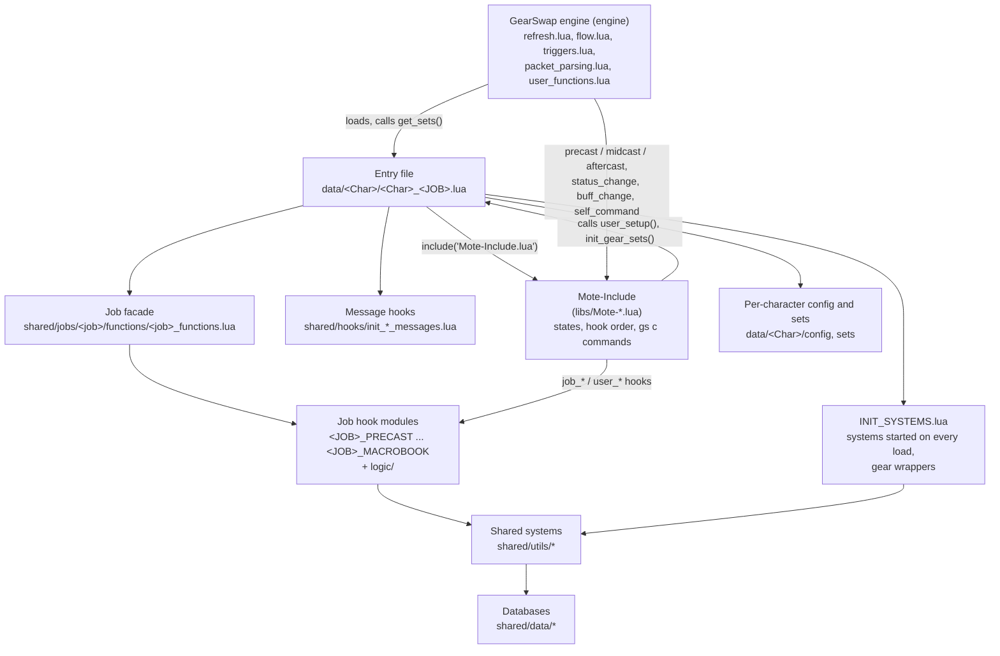

# Maintainer guide

Read this page before changing anything in the project. It is written for a
human maintainer and for an AI assistant maintaining the code: it states how
the pieces run, the engine behaviours that cause most bugs, the safe way to
make each common kind of change, and the verification rules a maintainer is
held to.

Every statement below was checked on 2026-09-28 against the code and against
the GearSwap engine and Mote libraries. Engine paths are relative to
`addons/GearSwap/` and marked *(engine)*; Mote paths are under
`addons/GearSwap/libs/`; everything else is relative to the repo root
(`addons/GearSwap/data/`). Line numbers drift: when one no longer matches,
search for the function name cited next to it.

This page does not repeat the system pages. It summarises and links to them;
[README.md](README.md) is the map of the developer documentation.

**Contents**

1. [Mental model](#1-mental-model)
2. [Engine facts that bite](#2-engine-facts-that-bite)
3. [The gear wrapper chain](#3-the-gear-wrapper-chain)
4. [Project conventions and layout](#4-project-conventions-and-layout)
5. [How to change things safely](#5-how-to-change-things-safely)
6. [Testing and debugging](#6-testing-and-debugging)
7. [Verification discipline](#7-verification-discipline)
8. [Glossary and page index](#8-glossary-and-page-index)

**The short version**

- Every job load builds a new Lua sandbox. State that must survive a job or
  subjob change lives on `windower.*`, never on `_G` or in a module local.
- Nothing cancels a scheduled coroutine. A loop that re-schedules itself needs
  a generation counter stored on `windower.*`.
- `equip()` only works synchronously inside a GearSwap event. From a coroutine,
  send `gs c update`.
- A locked slot (`disable()`) refuses every `equip()`. Equip first, lock after.
- `buffactive`, `player.tp` and `player.equipment` are GearSwap copies. In a
  coroutine or a raw event, read the game (`windower.ffxi.*`,
  `shared/utils/core/live_tp.lua`).
- Hooks on `handle_equipping_gear` / `cleanup_*` go in `INIT_SYSTEMS.lua`,
  never in `user_setup()`.
- Search with `grep -r`, not ripgrep: the folders the game loads are
  gitignored and ripgrep skips them.
- Do not write a "because" that the code or the owner has not established.

---

## 1. Mental model

### Layers



The engine only knows the user functions it calls by name (`get_sets`,
`precast`, `midcast`, `aftercast`, `status_change`, `buff_change`,
`sub_job_change`, `self_command`, `file_unload`...). Mote-Include defines those
and turns each one into its own sequence of `user_*` / `job_*` hooks. The
project fills Mote's hooks; it never replaces the engine-facing functions.

### What runs when

| Moment | Engine | Mote | Project |
|---|---|---|---|
| **Load** (`gs reload`, main job change, zone-in on another job, login) | `load_user_files` *(engine, `refresh.lua:62-184`)*: previous file's `file_unload`, unregister its events, delete texts and prims, build a new sandbox, run the file, call `get_sets()` | `include('Mote-Include.lua')` runs `init_include()` from the middle of the file (`Mote-Include.lua:188`): Mote states, `job_setup()`, `user_setup()` (`:171`), `init_gear_sets()` (`:175`); then Mote defines `handle_actions`, `cleanup_*`, `handle_equipping_gear` (`:227-456`) | Entry `get_sets()`: Mote, then `INIT_SYSTEMS.lua`, data loader, the three message hooks, configs, `JobChangeManager.cancel_all()`, the facade. Full order: [README.md, Boot sequence](README.md#boot-sequence-of-one-load) |
| **Action** (spell, JA, WS, item, ranged) | `outgoing text` handler (`triggers.lua:41`) resolves the command, filters it (`filter_pretarget`), then calls `pretarget`, `precast`; `midcast` and `aftercast` follow the action packets | `handle_actions` (`Mote-Include.lua:227-283`): `filter_X` → `user_X` → `job_X` → `default_X` → `user_post_X` → `job_post_X` → `cleanup_X`; a cancel stops the chain but `cleanup_X` still runs | Precast pipeline, `MidcastManager`, message hooks on `user_post_precast` / `user_post_midcast`, wrappers on `cleanup_*` ([section 3](#3-the-gear-wrapper-chain)) |
| **Status change** (idle, engaged, resting, dead) | `status change` event (`gearswap.lua:323-328`) | `status_change` → `user_status_change` → `job_status_change` → `handle_equipping_gear` (`Mote-Include.lua:995-1017`) | `<JOB>_STATUS.lua`, `LifecycleManager`, wrappers on `handle_equipping_gear` |
| **Buff change** | packet 0x063 (`packet_parsing.lua:443-568`) fires `buff_change` / `buff_refresh` | `buff_change` updates `state.Buff[buff]`, then `user_buff_change`, `job_buff_change` (`Mote-Include.lua:1023-1043`). No gear re-equip | `<JOB>_BUFFS.lua`; `CustomStates` re-dresses when a buff its rules watch changes |
| **Subjob change** | 0x061 with a new subjob id fires `sub_job_change` in the **same** sandbox (`packet_parsing.lua:419-428`) | `sub_job_change`: `user_setup()` again, `job_sub_job_change()`, `send_command('gs c update')` (`Mote-Include.lua:981-990`) | `JobChangeManager.on_job_change` schedules a `gs reload` (0.5 s, or 3.0 s when the main job also differs), so the sandbox is replaced anyway |
| **Main job change** | the outgoing request 0x100 loads the new file (`packet_parsing.lua:733-751`) | runs as a fresh load | old file's `file_unload`; `JobSyncWatchdog` repairs a refused request ([section 2](#the-job-file-is-chosen-from-the-request)) |
| **Zone** | 0x00A: clears the command registry and the refused-equip list; reloads the file only if the zone packet carries another main job (`packet_parsing.lua:32-45`). No user hook | nothing | systems that care register `raw_register_event('zone change', ...)` (Treasure Hunter tags, for example) |
| **`//gs c <cmd>`** | `self_command` | `self_command` → `job_self_command`; if not handled, Mote's `selfCommandMaps` (`Mote-SelfCommands.lua:9-35`) | `<JOB>_COMMANDS.lua` → `CommonCommands` → job commands → Mote → the alt's commands. See [commands-and-debug.md](systems/commands-and-debug.md) |
| **`//lua reload gearswap`** | the whole addon restarts: `windower.*` values written from the sandbox are lost too | — | debug flags on `windower._gs_debug` reset; trace survives through its marker file |

The full scenario-by-scenario trace of loads and job changes is
[architecture/job-change-lifecycle.md](architecture/job-change-lifecycle.md);
the boot order and INIT_SYSTEMS timeline are in
[systems/core-lifecycle.md](systems/core-lifecycle.md#how-a-job-file-boots).

---

## 2. Engine facts that bite

Each fact gives the evidence, then what to do.

### The sandbox, and what is missing from it

`load_user_files` builds the job file's environment as a plain table
(`refresh.lua:114-147`) with `_G` pointing at itself (`:149`) and **no
metatable**. A global that is not listed there is `nil`:

| Missing (nil in project code) | Present |
|---|---|
| `loadfile`, `setfenv`, `getfenv`, `load`, `collectgarbage`, `gcinfo`, `rawequal`, `xpcall`, `module`, `package`, `newproxy`, and a bare `res` | `string`, `table`, `math`, `os`, `io`, `debug`, `coroutine`, `bit`, `T` `S` `L` `Q`, `loadstring`, `dofile`, `pcall`, `error`, `assert`, `select`, `next`, `unpack`, `rawget`, `rawset`, `setmetatable`, `getmetatable`, `print`, `texts`, `file`, `gearswap` (the engine's own `_G`), `player`, `buffactive`, `world`, `pet`, `party`, `alliance` |

- `require` is the engine's `include_user` (`:132`, `user_functions.lua:300-335`),
  not Lua's. It serves `package.loaded` when the name is there (Windower's own
  libraries only) and otherwise reads, compiles and runs the file **every
  time**: it never writes `package.loaded`. The project's `ModuleCache`
  (`shared/utils/core/module_cache.lua`, installed by `config_loader` and again
  by INIT_SYSTEMS) caches per sandbox. See
  [core-lifecycle.md, ModuleCache](systems/core-lifecycle.md#modulecache).
- `include_user` raises for a missing file (`:316`), a compile error, and any
  runtime error while running the file, including errors in files it requires
  in turn. **A failed `pcall(require, X)` never proves that X is missing**:
  print `tostring(err)`.
- `require` resolves through `pathsearch` (`refresh.lua:677-728`): `libs-dev/`,
  `libs/`, `data/<Char>/`, `data/common/`, `data/`, then the AppData copies.
  A file under `data/<Char>/` shadows a file with the same relative path under
  `data/`.
- Windower's `strings` library **is** loaded by GearSwap (`gearswap.lua:44`) and
  extends the shared `string` table, so `s:startswith()`, `s:endswith()`,
  `s:split()` work in project code (Mote itself calls `:split`,
  `Mote-SelfCommands.lua:12`).
- The engine's `res` is `gearswap.res`. `require('resources')` from project code
  returns that same table (it is in `package.loaded`). The bare global `res` is
  `nil` unless something assigned `_G.res`.

To probe a function that may not exist, use `rawget(_G, 'name')` and give the
feature a degraded path.

### Per-load state vs. persistent state

| Lives in | Lifetime | Evidence |
|---|---|---|
| Sandbox `_G`, module locals, the `ModuleCache`, `sets`, Mote `state.*` | Until the next load | `user_env = nil` (`refresh.lua:83`), new table (`:114`) |
| `windower.*` written from project code | Until `//lua reload gearswap` | `windower` is `user_windower`, one table created when the addon loads with `__index = windower` and no `__newindex` (`user_functions.lua:418-423`) |
| `disable_table` (slot locks), Windower keybinds, `command_registry` | Engine lifetime: survives every load, even a main job change | `statics.lua:194-195`. On 0x100, `player.main_job_id` is assigned (`packet_parsing.lua:744`) before the "enable all slots" test compares it (`:756`), so that test never passes |

Consequences:

- A slot lock survives a job change, but the `_G` flag that remembers why it was
  set does not. Record locks you set on `windower.*` and release them at the
  next load (Combat Mode does: `windower._combat_mode_locked`).
- A `windower._x_done` "init once" flag is wrong for anything the engine
  destroys at each load (events, texts): the next load skips the init and the
  listener is gone. Register listeners on every load.

### Events and texts are destroyed at every load; coroutines are not

- Every event registered through the sandbox `windower.register_event` or
  `windower.raw_register_event` is unregistered at the next load
  (`refresh.lua:69-71`; both record the id, `user_functions.lua:254-274`). A
  sandbox `register_event` is not a leak across reloads.
- Every `windower.text` and `windower.prim` object is deleted
  (`refresh.lua:73-79`).
- `coroutine.schedule` callbacks and `send_command('wait ...')` chains are not
  tracked. They run after the reload, against the dead sandbox. A `require`
  inside such a callback loads the module into the **new** sandbox
  (`include_user` binds to the current `user_env`, `user_functions.lua:327`).

Pattern for a loop:

```lua
windower._my_loop_seq = (windower._my_loop_seq or 0) + 1
local my_seq = windower._my_loop_seq
local function tick()
    if windower._my_loop_seq ~= my_seq then return end   -- a newer load owns the loop
    -- work
    coroutine.schedule(tick, 1.0)
end
coroutine.schedule(tick, 1.0)
```

A cancel function must increment the same counter; otherwise the callback
already scheduled still runs.

### `register_event` from project code is expensive; `raw_register_event` is not

`windower.register_event` in the sandbox is `register_event_user`: the handler
is wrapped by `user_equip_sets`, which calls `gearswap.refresh_globals(true)`
then `gearswap.equip_sets(func, ...)` (`user_functions.lua:254-291`), a full
gear-pipeline pass on every call. `raw_register_event` only sets the handler's
environment (`:265-274`).

Use `raw_register_event` for anything frequent (`incoming chunk`, `action`,
`prerender`, `mouse`) and wrap the handler in `pcall`: the engine does not.
Better still, avoid the event: poll from an existing loop or resolve at command
time.

### GearSwap's copies of game state are stale outside engine events

- **Refresh rate.** `refresh_globals()` (`refresh.lua:42-51`) runs on engine
  events. From a sandbox `register_event` handler it passes
  `user_event_flag = true`, and `refresh_player` then re-reads the player only
  if the last read is over 0.5 s old (`:204`). In a `raw_register_event` handler
  or a coroutine nothing is refreshed at all.
- **Buffs.** `buffactive` is rebuilt from `player.buffs` inside
  `refresh_globals` (`refresh.lua:358`). In the 0x063 handler, `refresh_globals()`
  runs (`packet_parsing.lua:554`) and the `buff_change` events fire before the
  handler writes the new `player.buffs` (`:566-568`). A coroutine waiting for a
  buff must read `windower.ffxi.get_player().buffs` and map ids with
  `res.buffs` (see `AbilityHelper.is_buff_active`,
  `shared/utils/precast/ability_helper.lua:93`). For the same reason a gear
  rebuild inside `job_buff_change` sees the old buffs: a buff that swaps sets
  goes in `GEAR_BUFFS` and the job calls `LifecycleManager.refresh_after_buff`
  (a `gs c update` 0.1 s later; today only Aftermath: Lv.3, on WAR, DRK, SAM and
  THF).
- **TP.** Use `require('shared/utils/core/live_tp')()`: it reads
  `windower.ffxi.get_player().vitals.tp` and falls back to GearSwap's copy.
  Never add a new test on `player.tp` or `player.vitals.tp`.
- **Equipment.** In a raw event or a coroutine, `player.equipment` is the copy
  from the last engine event. Read `windower.ffxi.get_items('equipment')` and
  resolve ids through `gearswap.res.items[id]`.

### `buffactive` and slot names are case-insensitive

`buffactive`, `slot_map`, `world` and `alliance` are `make_user_table()` tables
(`statics.lua:138-148, 189`; `helper_functions.lua:103-118`): every string key
is lower-cased on read and on write. `buffactive['Chaos Roll']` works;
numeric keys (`buffactive[317]`) work too. `buff_change(name, gain)` receives
the exact-case name from `res.buffs` (`packet_parsing.lua:549`).

FFXI replaces the Light Arts / Dark Arts icon with Addendum: White / Black, so
test the Addendum before the Arts.

### `equip()` timing and `disable()`

- `equip(...)` is `set_merge(true, equip_list, ...)` (`user_functions.lua:127-129`).
  The engine empties `equip_list` at the start of each `equip_sets` pass
  (`flow.lua:60`) and sends it at the end. Called outside an event (a
  coroutine), the pieces are wiped by the next event before being sent. Send
  `gs c update` instead.
- `set_merge` with `respect_disable` diverts any slot in `disable_table` to
  `not_sent_out_equip` (`helper_functions.lua:304-329`): a locked slot refuses
  every `equip()`. **Equip, then lock.** Locking first freezes what was worn.
- `enable()` from project code (`user_enable`, `user_functions.lua:167-174`)
  re-equips the last piece refused while the slot was locked. A zone clears
  that list (`packet_parsing.lua:35`).
- `disable()` / `enable()` from a coroutine work: they only write
  `disable_table`.

### `job_state_change` runs before `handle_update`

Mote's `handle_cycle`, `handle_set`, `handle_toggle`, `handle_reset` and
`handle_unset` call `job_state_change(...)` and then `handle_update({'auto'})`
(`Mote-SelfCommands.lua:46-230`); the project's `cyclestate` does the same
(`shared/utils/core/CYCLE_HANDLER.lua`, `cycle_silently`). `handle_update`
re-equips the full set, so gear equipped from a state hook is overwritten a
moment later. A piece that must follow a state belongs in the set the job's
set builder returns.

### `check_spell` refuses some spells when their slots are locked

`filter_pretarget` → `check_spell` (`helper_functions.lua:661-747`) lets a spell
the character does not know through only when the slot that grants it is free:
Dispelga (id 360) needs `main` or `sub`, Impact (503) `body` and `head`, Honor
March / Aria of Passion (417/418) `range`. Otherwise the action goes to the
`filtered_action` user event instead of precast (`triggers.lua:142-143`), and
the command text goes to the game unchanged, which rejects it. With Combat Mode
locking the weapons, a typed Dispelga fails this way; `//gs c dispelga`
(`shared/utils/equipment/spell_gear_lock.lua`) frees the slots before sending
it.

### `set_combine` real semantics

`set_combine(...)` is `set_merge(false, {}, ...)` (`user_functions.lua:122-124`):

- Any number of arguments; later arguments win per slot.
- A `nil` argument is skipped, not a stop: `table.all` / `table.map` iterate
  with `next` (Windower `addons/libs/functions.lua:371-398, 481`). A non-table, non-nil argument
  raises "Trying to combine non-gear sets."
- Only slot keys survive (`unify_slots`, `helper_functions.lua:131-134`):
  sub-sets such as `sets.engaged.DT` inside `sets.engaged` are **not** copied.
- Slot names are case-insensitive and aliases collapse to one slot (`slot_map`,
  `statics.lua:148-180`): `ring1` / `lring` / `left_ring`, `ear1` / `lear` /
  `learring` / `left_ear`, `range` / `ranged`. A `ring1` in a delta replaces a
  `left_ring` in the base.
- A table entry without a string `name` equips nothing (`expand_entry`,
  `equip_processing.lua:79-101`).

Any script that simulates set files must reproduce these rules before calling
a difference a bug. And `sets.a = sets.b` is an alias, not a copy: use
`set_combine(sets.b, {})`.

### The job file is chosen from the request

The outgoing job-change request 0x100 sets `player.main_job_id` and sends
`lua i gearswap load_user_files <job>` at once (`packet_parsing.lua:733-751`).
The server's answer 0x061 corrects `main_job_id` (`:381`) but never reloads.
A refused or reordered request leaves the previous job's file loaded.
`shared/utils/core/job_sync_watchdog.lua` compares the loaded job with
`windower.ffxi.get_player()` and reloads. `gs reload` itself reads the live job
(`refresh_user_env`, `refresh.lua:657-666`).

### `user_setup()` runs inside `include('Mote-Include.lua')`

`init_include()` is called at `Mote-Include.lua:188`, before Mote defines
`cleanup_*` (`:389+`) and `handle_equipping_gear` (`:438`). So during the first
`user_setup()`:

- INIT_SYSTEMS, the message hooks and the job facade have not run; functions
  they define do not exist yet.
- A wrapper put on `handle_equipping_gear` or `cleanup_*` is overwritten by
  Mote's definition without an error.
- An error aborts `get_sets()` and everything after it, sets included.

`user_setup()` runs again on every subjob change, before `job_sub_job_change()`:
code there must seed state, not overwrite it.

### FFXI targets in `send_command`

GearSwap's `valid_target` (`targets.lua:30-58`) accepts a named token
(`<t>`, `<me>`, `<stnpc>`...) or a bare number, which it looks up with
`get_mob_by_id`. `<12345>` is neither and is treated as a character name that
matches nothing. Send a mob id bare:

```lua
send_command(('input /ma "%s" %s'):format(spell.name, spell.target.id))
```

(as `ability_helper.lua:372` does), and fall back to `<t>` only when the id is
nil.

### Item resources: look up by id, do not scan

`res.items` is loaded by the engine itself (`equip_processing.lua:38-62` indexes
it on every equip), and `require('resources')` returns the same table. A lookup
by id is a table read. What costs is a scan: `pairs(res.items)` or a lookup by
name walks the whole item list. Use `shared/utils/equipment/item_index.lua`
(`ItemIndex.id`, `is_weapon`, `dual_wields`): one walk per session, kept on
`windower._item_index`, shared by `weapon_resolver.lua`, `quiver_manager.lua`,
`refill/item_resolver.lua` and `weaponskill/ws_slots.lua` (until 2026-09-28 each built its own index, again on every
job load). Add a lookup there rather than a new scan.

---

## 3. The gear wrapper chain

Mote routes every gear decision through three globals it defines after
`user_setup()`: `handle_equipping_gear(status, pet_status)`,
`cleanup_precast(spell, spellMap, eventArgs)` and
`cleanup_midcast(spell, spellMap, eventArgs)`. The `cleanup_*` functions run at
the end of every action, **cancelled or not** (`Mote-Include.lua:279-282`).

`INIT_SYSTEMS.lua` wraps them after `include('Mote-Include.lua')` has returned,
in this order: `ElementalBelt.install`, `DualWield.install`,
`TreasureHunter.install`, `MidcastFallback.install`,
`CustomStates.install_hooks`, `CastTime.install_hook`,
`CombatMode.install_hook`. Each later wrapper wraps the earlier ones, and each
does its own work either before or after calling inward. The result, observed
by running the real install functions offline ([section 6](#a-harness-for-the-wrapper-chain)):

```text
handle_equipping_gear:  CombatMode lock -> Custom release locks -> Mote status set -> DualWield -> TH -> Custom equip -> Custom re-lock
cleanup_precast:        Belt precast -> Mote cleanup_precast -> (TH on WS / JA) -> Custom equip -> CastTime estimate
cleanup_midcast:        MidcastFallback route -> Belt midcast -> Mote cleanup_midcast -> TH -> Custom equip
```

Why the order matters:

- Within one event, the last `equip()` of a slot wins and a locked slot refuses
  every `equip()`. So the job's own set goes on first, the automatic overlays
  (belt, Dual Wield, Treasure Hunter) next, and the player's
  `<JOB>_CUSTOM.lua` gear last.
- The midcast fallback (a subjob spell the job did not route) equips its set
  before the belt, so the belt is not overwritten.
- Combat Mode must lock the weapon slots before any gear goes on: outermost,
  working before the inner call.
- The cast-time estimate reads what the precast finally sends, so it is the
  last precast layer.
- An error escaping a layer aborts every layer outside it for that call. Wrap
  a layer's own work in `pcall`, as the belt and Dual Wield do.

Each layer guards itself with a flag on `_G` (`_elemental_belt_installed`,
`_dual_wield_installed`...). A reload builds a new `_G` and Mote redefines the
three functions, so the chain is rebuilt exactly once per load. Do **not** move
these guards to `windower.*`: the next load would skip the wrap.

The same reasoning applies to the message hooks: `init_ability_messages.lua`,
`init_ws_messages.lua` and `init_spell_messages.lua` save the current
`_G.user_post_precast` / `_G.user_post_midcast`, call it first, and re-export.
They do not accumulate across reloads (a new `_G` each time; `//gs c syscheck`
shows the wrap ratio), and an idempotence guard on `windower.*` would break
messages after the first job change.

Where to place a new layer: install it before the belt if it must see the
job's set and be overridden by everything else; after `CustomStates` if it must
win over the player's gear. The detailed table (what each layer does, its
guard) is in [core-lifecycle.md, The gear hook chain](systems/core-lifecycle.md#the-gear-hook-chain).

---

## 4. Project conventions and layout

### Rules

The coding standard is `.claude/CODE_QUALITY.md` (kept in the private working
copy, not in the public repository). Its core, which reviews enforce:

| Rule | Detail |
|---|---|
| 9 central systems | PrecastGuard, CooldownChecker, WSPrecastHandler, MidcastManager, MessageFormatter, LockstyleManager, MacrobookManager, AbilityHelper, JobChangeManager. A need they do not cover is met by extending them, not by job-local copies |
| Precast order | PrecastGuard → CooldownChecker → (AbilityHelper) → WSPrecastHandler → job gear. Tier refinements (BRD songs, BLM/RDM/GEO tiers, WHM cures) and COR Double-Up redirection run before the cooldown check. [precast-pipeline.md](systems/precast-pipeline.md) |
| Midcast | `MidcastManager.select_set{...}` in every `<JOB>_MIDCAST.lua`; no hand-written set fallback. [midcast-and-buffs.md](systems/midcast-and-buffs.md) |
| Messages | No `add_to_chat` outside the message system, diagnostic tools and the INIT fallback. [messages.md, where add_to_chat may be called](systems/messages.md#where-add_to_chat-may-be-called-directly) |
| Lockstyle / macrobook | Factories only ([factories-and-helpers.md](systems/factories-and-helpers.md)) |
| Exports | Hook modules set `_G.job_x = job_x` **and** return a table |
| Size | Files < 600 lines (hard 800), functions < 30 lines. Exempt: command routers and display functions with no `if`/`for`/`while`; `*_sets.lua` data files |
| Arguments | Job command files forward with `table.unpack(args)`, never `cmdParams[1]` |
| Language | Code, comments and these docs in English. `@author ejouanchicot` in file headers |
| Comments | Only the non-obvious "why", and only a verified one ([section 7](#7-verification-discipline)) |
| Set files | Pure data: no `require` at module level, define each item once and reference it |

### File layout of a job

| Path | Role |
|---|---|
| `data/<Char>/<Char>_<JOB>.lua` (template `_master/entry/Tetsouo_<JOB>.lua`) | Entry: a loader (`get_sets`, `user_setup`, `init_gear_sets`, `job_sub_job_change`, `job_update`, `file_unload`) |
| `shared/jobs/<job>/functions/<job>_functions.lua` | Facade: includes the hook modules |
| `shared/jobs/<job>/functions/<JOB>_PRECAST.lua` ... `_MACROBOOK.lua` | 11 hook modules (PRECAST, MIDCAST, AFTERCAST, IDLE, ENGAGED, STATUS, BUFFS, COMMANDS, MOVEMENT, LOCKSTYLE, MACROBOOK), plus pet modules on BST/PUP/SMN |
| `shared/jobs/<job>/functions/logic/` | Job logic called by the hook modules |
| `data/<Char>/config/<job>/` (template `_master/config/<job>/`) | `<JOB>_STATES`, `_KEYBINDS`, `_LOCKSTYLE`, `_MACROBOOK`, `_CUSTOM`, `_HUD`, TP/WS configs |
| `data/<Char>/config/` (template `_master/config_global/`) | Per-character files shared by all jobs: `UI_CONFIG`, `COMMON_KEYBINDS`, `RECAST_CONFIG`, ... |
| `data/<Char>/sets/` (template `_master/sets/<job>_sets.lua`) | Equipment. Templates are flat; a character overlay may deploy a modular `sets/<job>/` tree |

### What git tracks

`shared/`, `_master/` (generic templates), `character_db.lua`,
`clone_character.py`, `docs/`, and three entries under `scripts/`
(`check_syntax.py`, `check_overlay.py`, `item_db/`). Ignored (`.gitignore`):

- every character folder the game loads (`data/<Char>/`), and, through the same
  unanchored patterns, the per-character overlays `_master/<Char>/`;
- `.claude/` (standards, agents, skills), `CLAUDE.md`, `notes/`,
  `scripts/audit/`, `*.log`, and `.gitignore` itself.

Consequences: `git diff` never shows a live folder or an overlay; back up an
overlay before editing it; a change to `_master/` is not in game until the live
folder is updated by hand or by re-clone. Stage explicit paths
(`git add -- <paths>`), never a wide glob.

### Templates, overlays, clones

`clone_character.py` builds `data/<Name>/` from `_master/` plus the overlay
`_master/<Name>/` (same relative path replaces the template), substitutes the
template name, generates `DUALBOX_CONFIG.lua` and `REGION_CONFIG.lua`, moves an
existing folder to `addons/GearSwap/clone_backups/`, and copies back the files
written in game (`KEPT_ON_RECLONE`, `clone_character.py:313-324`). The
clone refuses jobs outside `ALL_VALID_JOBS` (`:255-258`). Two character folders
are frozen clones: do not modify them without the owner's approval.

Details: [architecture/characters-and-templates.md](architecture/characters-and-templates.md).

---

## 5. How to change things safely

Each checklist lists the files to touch and the docs to update. "Template"
means `_master/`; each live folder that plays the job needs the same change
(by hand or re-clone). Keep code and docs in the same change: a feature is not
done while its docs are stale.

### Add a job

Use the `/new-job <JOB>` skill for the guided workflow. The files:

- [ ] `shared/jobs/<job>/functions/`: the 11 hook modules, the facade, `logic/`.
      Start from a similar job (templates: DNC_PRECAST, PLD_MIDCAST,
      WAR_COMMANDS). Pet jobs add pet modules.
- [ ] `_master/entry/Tetsouo_<JOB>.lua`: copy a similar entry; keep the
      `'Tetsouo/config/...'` path form (the clone substitutes it); require
      `config_loader` first, include INIT_SYSTEMS right after Mote-Include.
- [ ] `_master/config/<job>/`: **every** file the entry requires without
      `pcall` must exist (PUP is the standing counter-example: its entry
      requires files that do not exist and the job never loads).
- [ ] `_master/sets/<job>_sets.lua`: every set name the code reads, empty
      copies where the player has no gear yet.
- [ ] `clone_character.py` `ALL_VALID_JOBS`; `character_db.lua` `ALL_JOBS`.
- [ ] Job ability database under `shared/data/job_abilities/` if the job has
      JA messages; weaponskill entries if new weapons.
- [ ] Docs: `docs/dev/jobs/<job>.md` (same layout as the other job pages), the
      job list in [README.md](README.md#jobs), `docs/user/jobs/<job>/`.
- [ ] Verify: `luac5.1 -p` on every new file, `python scripts/check_syntax.py`,
      then in game `//lua reload gearswap`, `//gs c checksets`,
      `//gs c debugmidcast`.

See also [characters-and-templates.md, How to add a job to the templates](architecture/characters-and-templates.md#how-to-add-a-job-to-the-templates).

### Add a command

- [ ] Common command: handler in `COMMON_COMMANDS.lua` (or a module with a
      `handle(args)` routed from there), and the same name in
      `CommonCommands.is_common_command`. The two lists are maintained by hand;
      missing the second makes the command unreachable from every job file.
- [ ] Job command: in the job's `<JOB>_COMMANDS.lua`, after the common block;
      set `eventArgs.handled = true` on every path, including errors.
- [ ] Check the name against job commands (`grep -rn "command == '<name>'" shared/jobs`),
      warp aliases and their `<alias>all` form (`shared/utils/warp/warp_command_registry.lua`),
      alt command files (`_master/config/alt/*.lua`) and Mote's `selfCommandMaps`.
- [ ] Lower-case what you compare; on an unknown sub-command, print usage
      rather than running a default that changes something.
- [ ] Help: `COMMANDS_HELP` / `QUICK_HELP` in
      `shared/utils/messages/formatters/ui/message_commands.lua`.
- [ ] New globals go into `shared/utils/debug/global_probe.lua` `EXPECTED`.
- [ ] Docs: [commands-and-debug.md](systems/commands-and-debug.md) command
      tables, `docs/user/guides/commands.md`.

Details and traps: [commands-and-debug.md, For maintainers / AI](systems/commands-and-debug.md#for-maintainers--ai).

### Add a key

- [ ] `_master/config/<job>/<JOB>_KEYBINDS.lua` (and live copies):
      `{key, command, desc, state}`. A missing `desc` breaks the HUD's first render.
- [ ] If the key cycles a new state, create the state in `<JOB>_STATES.lua`
      `configure()` (called at the start of `user_setup()`); the HUD reads state
      values when it first renders.
- [ ] Check collisions: common keys, optional-state keys, Mote's F9-F12,
      `//gs c tb` keys. In game, the validator names a misspelt key and
      `//gs c kc` lists conflicts on every subjob.
- [ ] Renaming a state: update `UI_DISPLAY_BUILDER.lua` patterns if the name
      was matched by a pattern, or the row moves or disappears.
- [ ] Docs: `docs/user/guides/keybinds.md`, `docs/user/jobs/<job>/states.md`,
      the job's dev page ("Mote states").

Details: [keybinds-and-custom.md, Adding a key to a job](systems/keybinds-and-custom.md#adding-a-key-to-a-job)
and [ui-overlay.md, For maintainers / AI](systems/ui-overlay.md#for-maintainers--ai).

### Add a common system hook

- [ ] Install from `INIT_SYSTEMS.lua`, after Mote-Include has returned. Never
      from `user_setup()` (Mote overwrites the wrapper) and never from the
      facade of one job.
- [ ] Choose the position in the chain ([section 3](#3-the-gear-wrapper-chain))
      and whether your work runs before or after the inner call.
- [ ] Guard once per sandbox with a `_G` flag; read the previous function with
      `rawget(_G, ...)` and return if it is not a function.
- [ ] Wrap your own work in `pcall`; respect `eventArgs.cancel` in `cleanup_*`.
- [ ] Events: `raw_register_event`, registered on every load; loops: a
      `windower.*` generation counter.
- [ ] Update the INIT_SYSTEMS header comment and the hook-chain table in
      [core-lifecycle.md](systems/core-lifecycle.md#the-gear-hook-chain) and the
      timeline in [README.md](README.md#boot-sequence-of-one-load).
- [ ] New globals in `global_probe.lua` `EXPECTED`.

### Add a set name the code reads

- [ ] Read it nil-safe: the player may not have the set.
- [ ] Mode-dependent sets: wire the mode and add the missing sets to the
      template as copies, `set_combine(<current set>, {})`, with a comment
      saying what goes in `{}`. What the player wears today must not change. A
      set that replaces the whole base stays a commented example.
- [ ] If the set is equipped from a wrapper, check its place in the chain.
- [ ] Docs: the job's dev page, "Set names the code looks up", and the player
      page `docs/user/jobs/<job>/sets.md` (or `docs/user/guides/sets.md` for a
      set every job reads, such as `sets.TreasureHunter`). The player docs must
      list every set name the code recognises, with what goes in it.
- [ ] Verify: `//gs c checksets`; `//gs c trace on` then the action, and read
      the chosen set path in `trace.log`.

### Add a configuration file

- [ ] Template in `_master/config_global/` (all jobs) or `_master/config/<job>/`.
- [ ] Header first: what the file controls, where the feature comes from when
      no job file defines it, the exact syntax, two or three copy-paste
      examples, and the in-game commands that edit it. Accept job codes in any
      case when reading.
- [ ] A file a command rewrites whole takes its header from the writer
      (`HEADER` in `shared/utils/core/combat_mode_commands.lua`,
      `shared/utils/ui/hud_job_config.lua`), or the header disappears at the
      first command.
- [ ] A file written in game goes into `KEPT_ON_RECLONE` in
      `clone_character.py`, or a re-clone discards the player's settings.
- [ ] Read it with `pcall`, keep a default, and print `tostring(err)` on
      failure (a failed require does not mean the file is missing).
- [ ] Docs: `docs/user/guides/configuration.md` and the owning system page.

### Add a message

- [ ] Template path: a key in `shared/utils/messages/data/jobs/<job>_messages.lua`
      or `shared/utils/messages/data/systems/<name>_messages.lua`, a `show_*` in the matching
      formatter that calls `M.send(...)`, exposed through
      `message_formatter.lua` or required directly by its one caller.
- [ ] Multi-line status or data: `InfoBlock.show{...}`
      (`shared/utils/messages/info_block.lua`).
- [ ] Help screen: `HelpScreen.show{...}` (`shared/utils/messages/help_screen.lua`);
      no hand-written help screens.
- [ ] Never `add_to_chat` from `shared/jobs/`; never a raw colour code for a
      colour that has a name; read the separator width at call time.
- [ ] Verify with `//gs c msgtests`.

Details: [messages.md, For maintainers / AI](systems/messages.md#for-maintainers--ai).

---

## 6. Testing and debugging

### Offline checks

- **Syntax.** `luac5.1 -p <files>` parses without running. `python scripts/check_syntax.py [subtree]`
  parses every Lua file, live folders included, with Lua 5.1 (Windower runs 5.1;
  a newer Lua accepts syntax the game rejects). Clean output means "parses",
  not "loads".
- **Behaviour.** A harness is a plain Lua 5.1 script run from `data/` that
  stubs the engine globals the code touches, loads the real module and asserts.
  Two rules make a harness honest:
  - reproduce the engine rules the code depends on (sandbox globals,
    `require` semantics, `set_combine` rules, hook definition order), and say
    in the harness which ones it does not reproduce;
  - never define `handle_equipping_gear` / `cleanup_*` hooks in an order the
    engine would not.
- Differential tests (old vs new version of a module on the same cases) and
  static scans live in `scripts/audit/` (gitignored, local).

#### A minimal harness

Verified with `lua5.1` on 2026-09-28 (prints `ok`):

```lua
-- Run from data/:  lua5.1 path/to/harness_min.lua
-- 1. Make require('shared/...') resolve from data/, as GearSwap's pathsearch does.
package.path = './?.lua;' .. package.path

-- 2. Stub the engine globals the module under test touches.
local game_tp = 1000
_G.windower = {
    addon_path = './',
    ffxi = { get_player = function() return { vitals = { tp = game_tp } } end },
    register_event = function() return 1 end,
    raw_register_event = function() return 1 end,
}
_G.player = { vitals = { tp = 900 } }          -- GearSwap's stale copy
_G.add_to_chat = function() end

-- 3. Load the real module and assert on its behaviour.
local live_tp = require('shared/utils/core/live_tp')
assert(live_tp() == 1000, 'live read expected')
windower.ffxi.get_player = function() error('no game') end
assert(live_tp() == 900, 'fallback to GearSwap copy expected')

-- 4. Reproduce an engine rule the code depends on: GearSwap's require never
--    writes package.loaded, so ModuleCache must be the one caching.
local loads = 0
_G.require = function(path) loads = loads + 1; return { path = path } end
local ModuleCache = dofile('shared/utils/core/module_cache.lua')
assert(ModuleCache.install() == true)
require('Shared/X'); require('shared/x')
assert(loads == 1, 'second require must come from the cache (keys lower-cased)')
print('ok')
```

What it does not reproduce: the sandbox's missing globals (plain Lua has
`rawequal`, `package`, `setfenv`...). Code that uses one of them passes the
harness and fails in game; check [section 2](#the-sandbox-and-what-is-missing-from-it)
by reading.

#### A harness for the wrapper chain

This one produced the orders printed in [section 3](#3-the-gear-wrapper-chain).
It defines Mote's three functions first (as Mote does after `user_setup()`),
stubs the dependencies of `custom_states` and `combat_mode`, replaces each
layer's work function with a logger, then runs the real install functions in
INIT_SYSTEMS order.

```lua
package.path = './?.lua;' .. package.path
local log = {}
local function note(s) log[#log + 1] = s end

_G.windower = { raw_register_event = function() return 1 end, register_event = function() return 1 end,
                ffxi = { get_player = function() return { buffs = {} } end,
                         get_items = function() return {} end,
                         get_mob_by_target = function() return nil end } }
_G.player = { status = 'Engaged', name = 'X' }
_G.sets = { TreasureHunter = { waist = 'TH belt' } }
_G.equip = function(s) note(s == sets.TreasureHunter and 'TH' or 'equip') end
_G.midaction = function() return false end
_G.handle_equipping_gear = function() note('Mote status set') end
_G.cleanup_precast = function() note('Mote cleanup_precast') end
_G.cleanup_midcast = function() note('Mote cleanup_midcast') end
package.loaded['shared/utils/messages/message_formatter'] = {}
package.loaded['shared/utils/custom/custom_states_validate'] = {}
package.loaded['shared/utils/custom/custom_conditions'] = {}
package.loaded['shared/utils/custom/custom_guards'] = { hands_off = function() note('Custom equip'); return true end }
package.loaded['shared/utils/custom/custom_locks'] = { collect = function() end,
    release = function() note('Custom release locks') end, apply = function() note('Custom re-lock') end }
package.loaded['shared/utils/core/optional_state'] = { create = function() return {} end }

local EB = require('shared/utils/equipment/elemental_belt'); EB.apply = function(_, p) note('Belt ' .. p) end
local DW = require('shared/utils/equipment/dual_wield');     DW.apply = function() note('DualWield') end
local TH = require('shared/utils/equipment/treasure_hunter')
TH.wants_engaged_th = function() return true end
TH.optional = { value = function() return 'Full' end }
local MF = require('shared/utils/midcast/midcast_fallback'); MF.route = function() note('MidcastFallback route') end
local CS = require('shared/utils/custom/custom_states');     _G._custom_state_entries = { {} }
local CT = require('shared/utils/precast/cast_time');        CT.estimate = function() note('CastTime estimate') return 1, 0 end
local CM = require('shared/utils/core/combat_mode');         CM.apply = function() note('CombatMode lock') end

EB.install(); DW.install(); TH.install(); MF.install(); CS.install_hooks(); CT.install_hook(); CM.install_hook()

local spell = { english = 'Fire', action_type = 'Magic', target = { type = 'MONSTER', id = 42 } }
for _, step in ipairs({
    { 'handle_equipping_gear', function() handle_equipping_gear('Engaged') end },
    { 'cleanup_precast', function() cleanup_precast(spell, nil, { cancel = false }) end },
    { 'cleanup_midcast', function() cleanup_midcast(spell, nil, { cancel = false }) end },
}) do
    log = {}
    local ok, err = pcall(step[2])
    print(step[1] .. (ok and '' or ('  ERROR ' .. tostring(err))) .. ':  ' .. table.concat(log, ' -> '))
end
```

The spell is magic, so Treasure Hunter does not act at precast (it acts at
precast only for weaponskills and abilities, `treasure_hunter.lua:117-126`).
A first version of this harness left `TH.optional` unstubbed: the error it
raised inside the Treasure Hunter layer stopped the custom-states and cast-time
layers from running. That is the "an error escaping a layer aborts the outer
layers" rule of section 3, observed.

### In-game commands

| Command | Use |
|---|---|
| `//lua reload gearswap` | Full restart: required after editing anything under `shared/` if in doubt; resets `windower.*` values |
| `//gs reload` / `//gs c reload` | New sandbox for the current job; modules are re-read from disk (the require cache is per sandbox) |
| `//gs c checksets` | Items in the loaded `sets` that are not in the equippable bags |
| `//gs c wa` | Wardrobe audit across jobs |
| `//gs c debugmidcast` | Per job: logs which `MidcastManager` level chose the set |
| `//gs c debugprecast` | Precast debug toggle (persists through reloads via `windower._gs_debug`) |
| `//gs c trace on` / `off` / `clear` | Appends real game values to `data/<Char>/trace.log`; survives even `//lua reload gearswap` through `data/<Char>/trace.on` |
| `//gs c rolldebug` | COR: roll gear sent vs worn when the roll goes off, to `data/<Char>/rolldebug.log` |
| `//gs c syscheck` | System state, including the message hook wrap ratio and globals created since load |
| `//gs c fulltest`, `//gs c lagdebug`, `//gs c perf`, `//gs c memcheck` | Full self-test, lag capture, profiler, `_G` export |
| `//gs c debugjobchange`, `//gs c debugupdate`, `//gs c automovedebug` | Job-change, `job_update` and AutoMove debug toggles |
| `//gs c msgtests` | Message templates and formatter validation |

Descriptions and outputs: [commands-and-debug.md, Debug tools](systems/commands-and-debug.md#debug-tools).

### Reading a trace

Each line is time, `os.clock()`, main job, tag, text
([commands-and-debug.md, Trace](systems/commands-and-debug.md#trace-gs-c-trace)).

- `PRECAST` lines count key presses, including blocked and repeated ones, not
  spells actually cast.
- `MIDCAST ... no sets.midcast['<skill>']: Mote's own set (spell name / map) stays`
  does **not** mean the spell had no gear. `MidcastManager` only adds on top of
  what Mote already equipped from `sets.midcast[spell.english]` or
  `sets.midcast[spellMap]` (`Mote-Include.lua` `get_named_set`). Before calling
  a set missing, search the character's set file for the spell name and its
  spell map.
- Compare a trace with what the game did, not with what the code intended: the
  trace exists because offline tests cannot show what the game returns.

---

## 7. Verification discipline

These rules exist because each one was broken once and cost a wrong report or
a wrong fix.

1. **Search the folders the game loads.** ripgrep and the Grep tool honour
   `.gitignore`, so they skip every `data/<Char>/` folder, every `_master/<Char>/`
   overlay, `notes/`, `scripts/audit/` and `.claude/`. Before writing "unused",
   "no caller", "never read" or "dead", search with `grep -rn` over `data/`
   (or `rg -uu`). Give a sub-agent that instruction explicitly.
2. **Never write a "why" the code does not support.** Before writing "because"
   in a comment, commit or report, find it: the header, a nearby comment,
   `git log -S`, the callers, the engine. If nothing records it, say so. When
   the owner gives the reason, quote it as given.
3. **Check the engine before calling engine behaviour a bug.** Read the
   GearSwap source (`addons/GearSwap/*.lua`) and Mote (`libs/Mote-*.lua`).
   Known false alarms: `set_combine` with three or more arguments, a `nil`
   base in `set_combine`, capitalised slot names, `ring1` against
   `left_ring`, a sandbox `register_event` "leaking" across reloads, the
   message hooks "accumulating".
4. **Report with a certainty level and evidence.** For each finding:
   - *confirmed*: reproduced (harness, trace, in game) or read end to end in the
     code and engine, with `path:line`;
   - *plausible*: the code allows it, not reproduced;
   - *inferred*: deduced from indirect evidence.
   Give the real in-game impact, not the worst case. An unverified claim stays
   out of comments and commit messages.
5. **Compare against the right baseline.** After a refactor, compare with the
   version before it (`git show <commit>^:<file>`), not with HEAD. Two known
   refactor traps: an extracted helper whose `return` value the caller no
   longer returns, and two `local function` definitions with the same name in
   one file (the second silently wins).
6. **A green offline test is not an in-game result.** Say which it is. Changes
   that were only tested offline are reported as such until the owner confirms
   them in game.
7. **Docs ship with the feature.** Update the dev page of the system or job
   and the player docs in the same change. The player docs must list every set
   name the code reads, every automatic mechanic, every mode and every command;
   derive that list from the code (every `sets.<x>` read, every command route),
   not from memory.
8. **Templates first.** Fix `_master/`, then propagate to live folders; never
   fix a template bug only in a live folder. Frozen clones are not touched
   without the owner's approval.

---

## 8. Glossary and page index

Terms (sandbox, entry file, facade, hook module, Mote state, template / overlay
/ live, pin, MAIN / ALT, dual export) are defined in
[README.md, Glossary](README.md#glossary).

| Page | Covers |
|---|---|
| [README.md](README.md) | Entry point: layers, boot sequence, life of an action, state lifetimes, where to look when... |
| [architecture/job-change-lifecycle.md](architecture/job-change-lifecycle.md) | Every load and job-change scenario |
| [architecture/characters-and-templates.md](architecture/characters-and-templates.md) | `_master` vs live, overlays, the clone script |
| [systems/core-lifecycle.md](systems/core-lifecycle.md) | Engine sandbox, boot order, INIT_SYSTEMS, gear hook chain, watchdogs, ModuleCache |
| [systems/precast-pipeline.md](systems/precast-pipeline.md) | Guard, cooldown, ability helper, weaponskills, tier refinement |
| [systems/midcast-and-buffs.md](systems/midcast-and-buffs.md) | MidcastManager resolution, set builders, buff managers |
| [systems/factories-and-helpers.md](systems/factories-and-helpers.md) | Lockstyle, macrobook, AutoMove, belt, Dual Wield, Dispelga lock, ... |
| [systems/messages.md](systems/messages.md) | Message system |
| [systems/messages-formatters.md](systems/messages-formatters.md) | Formatter modules |
| [systems/messages-catalog.md](systems/messages-catalog.md) | Message templates |
| [systems/keybinds-and-custom.md](systems/keybinds-and-custom.md) | Keybinds, `<JOB>_CUSTOM.lua`, optional states, temporary binds |
| [systems/ui-overlay.md](systems/ui-overlay.md) | Keybind HUD |
| [systems/commands-and-debug.md](systems/commands-and-debug.md) | Command routing, command inventory, debug tools |
| [systems/dualbox.md](systems/dualbox.md) | Dual-box |
| [systems/warp.md](systems/warp.md) | Warp |
| [systems/stealth.md](systems/stealth.md) | Sneak / Invisible on the box group |
| [systems/equipment-and-inventory.md](systems/equipment-and-inventory.md) | checksets, wardrobe audit, refill, HP priority |
| [systems/wardrobe-organizer.md](systems/wardrobe-organizer.md) | Wardrobe organizer |
| [data/spell-databases.md](data/spell-databases.md) | Magic databases |
| [data/ability-and-weaponskill-databases.md](data/ability-and-weaponskill-databases.md) | JA and weaponskill databases |
| Jobs | [blm](jobs/blm.md) · [blu](jobs/blu.md) · [brd](jobs/brd.md) · [bst](jobs/bst.md) · [cor](jobs/cor.md) · [dnc](jobs/dnc.md) · [drk](jobs/drk.md) · [geo](jobs/geo.md) · [pld](jobs/pld.md) · [pup](jobs/pup.md) · [rdm](jobs/rdm.md) · [run](jobs/run.md) · [sam](jobs/sam.md) · [smn](jobs/smn.md) · [thf](jobs/thf.md) · [war](jobs/war.md) · [whm](jobs/whm.md) |
